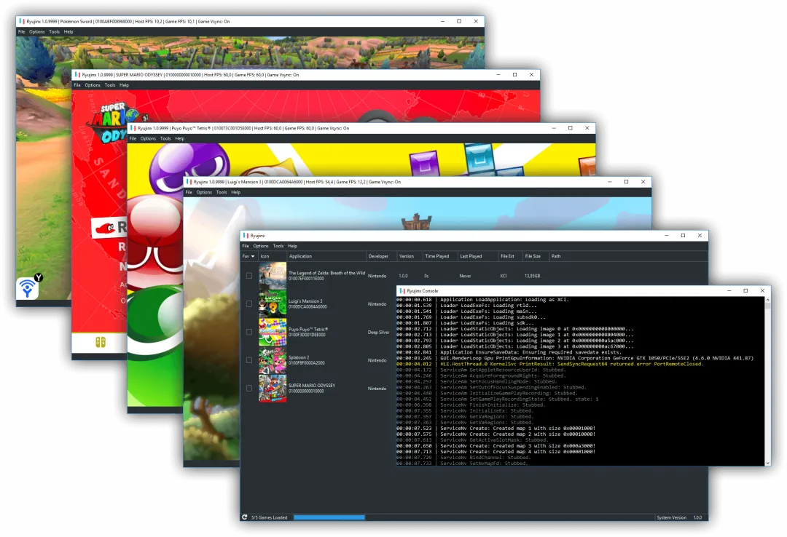

# C-C++学习资源

# C学习资源

[C 语言教程 - 网道 (wangdoc.com)](https://wangdoc.com/clang/)

待定

C语言算法题：[数据结构基础和算法题系列总结 - 掘金 (juejin.cn)](https://juejin.cn/post/6844903686997540878)

[全面解读curl团队的C语言代码规范 (qq.com)](https://mp.weixin.qq.com/s/g40lEgypusTxL97eUSGFsw)

[最小的跨平台图形 (zserge.com)](https://zserge.com/posts/fenster/)

[用 gdb 学 C 语言 - 知乎 (zhihu.com)](https://zhuanlan.zhihu.com/p/483372519)

# C语言开源项目

Linux 实用程序，用于将修改键配置为在按下和释放时充当其他键：https://github.com/alols/xcape

[reactos/reactos：一个免费的 Windows 兼容操作系统 (github.com)](https://github.com/reactos/reactos)

[Windows系统的开源替代版—ReactOS (qq.com)](https://mp.weixin.qq.com/s?__biz=MzA4NzU0MzU2MA==&mid=2247484135&idx=1&sn=75b15f19b536aa872c74b119c8ef8456&chksm=90369880a7411196e3b266c7bafbb88ca5429ec46e2192988aa32fbba08eea527d87ffd357f8&cur_album_id=3177419152429514755&scene=189#wechat_redirect)

## Fastfetch：查看系统所有配置,支持所有系统

**GitHub开源地址**：https://github.com/fastfetch-cli/fastfetch

### 项目介绍

> Fastfetch 是一个类似于 neofetch 的命令行工具，旨在快速获取系统信息并以美观的方式展示。它采用主要由 C 编写，注重性能和可定制性。目前支持 Linux、Android、FreeBSD、macOS 和 Windows 7+ 等操作系统。


### 功能特点

- 1.**快速性能**：由于主要使用 C 语言编写，Fastfetch 相较于 neofetch 更快速地获取和展示系统信息。
- 2.**多平台支持**：Fastfetch 在 Linux、Android、FreeBSD、macOS 和 Windows 7+ 等多种操作系统上均得到支持，提供跨平台的功能。
- 3.**信息展示**：Fastfetch 可以展示操作系统、Shell、内核、CPU、GPU、内存等关键信息，让用户快速了解系统环境。
- 4.**可定制性**：用户可以根据自己的需求定制和调整 Fastfetch 的展示信息，使其更符合个人偏好。

### 安装使用

#### Linux

- **Debian / Ubuntu：** 在 Github 发布页面下载`fastfetch-linux-<proper architecture>.deb` 安装文件，进行安装。
- **Arch Linux：** 可通过 `sudo pacman -S fastfetch` 安装 Fastfetch。
- **Fedora：** 使用 `sudo dnf install fastfetch` 命令安装 Fastfetch。
- **其他发行版：** 用户可以参考各个发行版对 Fastfetch 的支持情况，或者通过 linuxbrew 进行安装。

#### macOS

- **HomeBrew：** 通过 HomeBrew 使用 `brew install fastfetch` 命令进行安装。
- **MacPorts：** 通过 MacPorts 使用 `sudo port install fastfetch` 进行安装。

#### Windows

- **Scoop：** 使用 `scoop install fastfetch` 命令通过 Scoop 包管理器安装 Fastfetch。

#### FreeBSD

- 使用 `pkg install fastfetch` 命令进行 Fastfetch 的安装。

#### Android (Termux)

- 通过 `pkg install fastfetch` 命令通过 Termux 包管理器安装 Fastfetch。

> 总之，Fastfetch 是一个高性能的系统信息获取工具，通过其快速和可定制的特性，可以帮助用户快速了解并展示系统信息。无论是在 Linux、macOS、Windows 还是其他支持的系统平台上, 都可以快速获取系统配置信息.

# C语言游戏引擎

## Mojoc：跨平台、开源、纯 C 编写的手机游戏引擎

GitHub：[scottcgi/Mojoc：一款跨平台、开源、纯 C 游戏引擎，用于移动游戏。 (github.com)](https://github.com/scottcgi/Mojoc)

一个跨平台、开源、纯 C 游戏引擎，用于手机游戏。

# 开源的游戏模拟器

## 游戏模拟器

游戏模拟器是允许玩家在原本不支持的设备上体验游戏的强大工具。无论是经典的复古游戏，还是现代的游戏控制台独占游戏，模拟器都打开了新的可能性，使得跨平台游玩成为现实。下面是三款不同模拟器的详细介绍，帮助您更深入地了解每款模拟器的特性与使用方法。

## Ryujinx模拟器



Ryujinx是一款非常受欢迎的任天堂Switch模拟器。它的开发语言是C#，这使得跨平台兼容成为可能，同时开源的特性也吸引了广大的开发者和玩家共同贡献和完善。

### 特点

- 支持多种输入设备，包括键盘和游戏手柄。
- 支持保存游戏进度，包括游戏状态保存和读取。
- 支持高清游戏画面和调整帧率，提升游戏体验。
- 定期更新以改善兼容性和性能。
- 支持自定义设置，玩家可以根据自己的喜好调整模拟器。

### 兼容性

模拟器支持运行的平台有：Windows、MacOS、Linux平台。

Ryujinx 已在约 4,200 款游戏上进行了测试；超过 4,150 个启动菜单并进入游戏，其中大约 3,500 个被认为可以玩。

官方网站：

```
https://www.ryujinx.org/
```

使用指南：

```
https://github.com/Ryujinx/Ryujinx/wiki/Ryujinx-Setup-&-Configuration-Guide
```

## Suyu模拟器


Suyu模拟器是基于于另一款知名的Nintendo Switch模拟器yuzu。由于yuzu项目的停止更新，Suyu模拟器作为其继承者，被开发出来继续提供服务。

### 特性

- 它进行了优化，提高了游戏性能和兼容性。
- 支持图形提升，如分辨率缩放和反锯齿。
- 支持直接在智能手机上运行Nintendo Switch游戏，这对于移动游戏玩家来说是一大福音。

模拟器支持运行的平台有：Windows、MacOS、Linux、Android、IOS。

### 社区支持

Suyu模拟器依然维持开源状态，玩家和开发者可以通过项目地址访问源代码，参与到改进和维护工作中。

项目地址：

```
https://git.suyu.dev/suyu/suyu
```

## openemu模拟器


openemu则是专为macOS用户设计的复古游戏模拟器。它以其精致的用户界面和易于使用的功能而被广大macOS用户所喜爱。

### 主要功能

- 它有一个集成的游戏库管理系统，让玩家轻松地整理和浏览游戏集。
- 支持多达多个不同控制器的自动设置，简化游戏配置。
- 提供屏幕滤镜和游戏手柄支持，增强复古游戏体验。

### 支持的游戏系统

openemu支持广泛的复古游戏系统，从老式的NES和SNES到GBA，甚至Sony的PlayStation和PSP都可在这一平台上找到仿真的可能。

支持系统列表：

```
https://github.com/OpenEmu/OpenEmu/wiki#supported-systems
```

### 获取与安装

玩家可以前往openemu的官网下载安装程序，一键安装后，只需简单设置即可开始游玩。

官网地址：

```
https://openemu.org/
```

项目地址：

```
https://github.com/OpenEmu
```

------

以上是对游戏模拟器的详细介绍。这些工具不仅为游戏爱好者提供了无限的便利，也在一定程度上保存了游戏文化的遗产。通过模拟器，我们能够左右穿梭于不同的游戏时代，享受多元化的游戏体验。

# C++学习资源

C++ 是一种低级系统编程语言，通常用于游戏、操作系统、驱动程序和嵌入式系统等性能关键型应用程序。

以下是有关 C++ 及其常见用例的关键知识：

- C++是一种高效、灵活、低级的通用编程语言。它于 1979 年作为 C 语言的扩展而开发。
- C++ 支持过程式、面向对象和泛型编程。它具有类、继承、模板、异常等功能。
- C++ 代码通常被编译为机器代码以获得最大性能。它允许直接访问内存，这使其适合系统编程。
- C++ 的一些主要用例包括系统编程、游戏开发、嵌入式系统、桌面应用程序等。
- 系统编程——C++ 由于其效率和低级访问而被广泛用于开发操作系统、数据库、编译器、设备驱动程序。
- 游戏开发——大多数 AAA 游戏都是使用 C++ 开发的，因为它具有高性能和与图形库交互的能力。
- 嵌入式系统 — C++ 由于其低级功能而通常用于对微控制器、硬件、固件进行编程。
- 桌面应用程序 — C++ 与 Qt、wxWidgets 允许为 Windows、Linux 构建高性能桌面应用程序。
- 后端开发 — C++ 因其效率而为许多 Web 服务器和网络应用程序提供支持。
- 科学/数值计算——Boost 和 Eigen 等库使 C++ 非常适合科学和工程任务。


[学习现代 C++ – 发现符合当今计算需求的语言 (learnmoderncpp.com)](https://learnmoderncpp.com/)

## 一、基础

### 1.1 一个项目入门 C++ 足以：CPlusPlusThings

CPlusPlusThings 是国人开源一个 C++ 学习项目。它系统地将 C++ 学习分为了【基础进阶】、【实战系列】、【C++2.0 新特性】、【设计模式】和【STL 源码剖析】、【并发编程】、【C++ 惯用法】、【学习课程】、【工具】、【拓展】。

作为一个全面系统的 C++ 学习项目，CPlusPlusThings 是优秀的，它合理地安排了 10 Days 的实战部分，在实战中了解语法和函数用法，唯一不足的是，在注释部分有些不尽人意，对部分新手程序员并不是很友好。【基础进阶】部分内容：

- const 那些事
- static 那些事
- decltype 那些事
- 引用与指针那些事
- 宏那些事

> GitHub 地址→https://github.com/Light-City/CPlusPlusThings

### 1.2 基础部分之算法：C-Plus-Plus

C-Plus-Plus 是收录用 C++ 实现的各种算法的集合，并按照 MIT 许可协议进行授权。这些算法涵盖了计算机科学、数学和统计学、数据科学、机器学习、工程等各种主题。除外，你可能会发现针对同一目标的多个实现使用不同的算法策略和优化。

> GitHub 地址→https://github.com/TheAlgorithms/C-Plus-Plus

## 二、进阶

### 2.1 现代 C++：modern-cpp-tutorial

modern-cpp-tutorial 是现代 C++ 教程，它的目的是提供关于现代 C++（2020 年前）的相关特性的全面介绍。除了介绍了代码之外，它还尽可能简单地介绍了其技术需求的历史背景，这对理解为什么会出现这些特性提供了很大的帮助。

> GitHub 地址→https://github.com/changkun/modern-cpp-tutorial


### 2.2 进阶指南：CppTemplateTutorial 

CppTemplateTutorial 为中文的 C++ Template 的教学指南。与知名书籍 C++ Templates 不同，该系列教程将 C++ Templates 作为一门图灵完备的语言来讲授，以求帮助读者对 Meta-Programming 融会贯通。本项目写作初衷，就是通过 “编程语言” 的视角，介绍一个简单、清晰的 “模板语言”。我会尽可能地将模板的诸多要素连串起来，用一些简单的例子帮助读者学习这门 “语言”，让读者在编写、阅读模板代码的时候，能像 `if(exp) { dosomething(); }` 一样的信手拈来，让 “模板元编程” 技术成为读者牢固掌握、可举一反三的有用技能。

适合熟悉 C++ 的基本语法、使用过 STL、熟悉一些常用的算法，以及递归等程序设计方法的 C++ 学习者阅读。虽然项目章节文章写的深入浅出，不过唯一的遗憾是尚未完成所有章节内容。进度如下：

- 0.前言
- 1.Template 的基本语法
- 2.模板元编程基础
- 3.深入理解特化与偏特化
- 4.元编程下的数据结构与算法 （尚未开始）
- 5.模板的进阶技巧（尚未开始）
- 6.模板的威力：从 foreach, transform 到 Linq（尚未开始）
- 7.结语：讨论有益，争端无用（尚未开始）

> GitHub 地址→https://github.com/wuye9036/CppTemplateTutorial

## 三、动手实战

### 3.1 来实践一下：MyTinySTL

当你学习完 C++ 的“书本”知识后，是不是有些手痒了呢？MyTinySTL 这个注释详细、实践夯实基础的项目便是你 C++ 学习之旅的下一站。作为新手练习用途，MyTinySTL 的作者 Alinshans 用 C++11 重新复写了一个小型 STL（容器库＋算法库）。代码结构清晰规范、包含中文文档与注释，并且自带一个简单的测试框架，适合 C++ 新手来实践一番。

> GitHub 地址→https://github.com/Alinshans/MyTinySTL

### 3.2 重温同年俄罗斯方块：Tinytetris

Tinytetris 是一个用 C++ 编写的终端版俄罗斯方块游戏。它提供了两个版本的源码，分为注释版和库版，注释较多易于理解和学习。

> GitHub 地址→https://github.com/taylorconor/tinytetris


### 3.3 学习下大佬们的代码：calculator 

微软开源的 Windows 系统预装的计算器工具。该工具提供标准、科学、程序员计算器的功能，以及各种度量单位和货币之间的转换功能。快来看看微软工程师编写的代码吧！学习大厂的编码规范、项目结构之类的，提高阅读源码的能力。英文的项目且没有讲解部分，需要通过阅读源码学习，难度较高。

> GitHub 地址→https://github.com/microsoft/calculator

