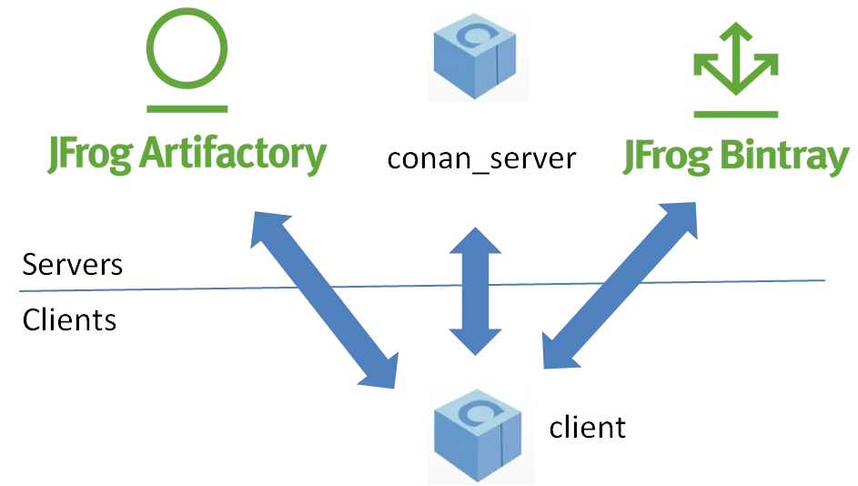
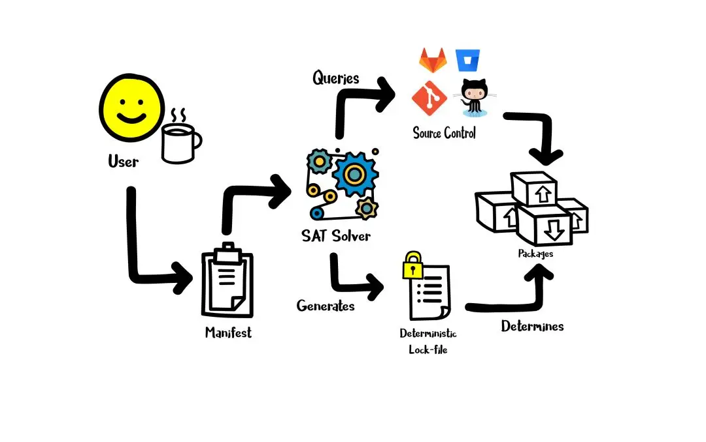
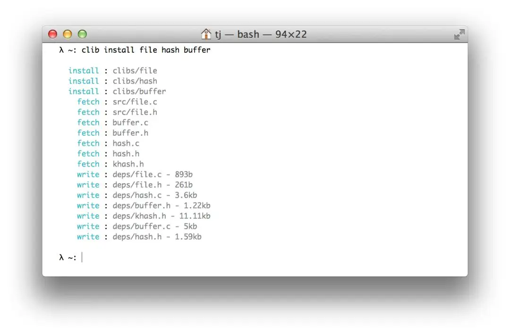

# 开源的C-C+包管理工具

包管理器可以帮助你更方便地安装依赖关系，并决定所安装的版本，提高你的开发幸福感。许多语言都有自己的包管理器，像 Node.js 的 npm/yarn、Rust 的 Cargo、Python 的 pip 等等。当然，C/C++ 也有它自己的包管理器！

## 参考资料

Conan-Center：https://bintray.com/conan/conan-center

Quick Install：https://github.com/LoopPerfect/buckaroo#quick-install

Quick Start：https://github.com/microsoft/vcpkg#quick-start

## 1.Conan

- GitHub 项目地址：https://github.com/conan-io/conan
- Star 数：3k
- 文档：https://docs.conan.io/en/latest/

首先出场的是 Conan（注意，不是柯南！），一个用 Python 编写的 C/C++ 包管理器。它是完全分散的，你可以自己托管服务器中的包。它适用于**所有平台**，包括 Linux、OS X、Windows、Solaris、FreeBSD、嵌入式和交叉编译、docker、WSL。它可以与任何构建系统集成，为 CMake、MSBuild、Makefiles 等工具提供了经过测试的支持。除此之外，它还获得了奔驰、华为等大公司用户。你还可以在 **Conan-Center****[1]** 寻找或分享你的 C/C++ 包。

想要安装 Conan 也很简单：

```bash
$ pip install conan
```




## 2.Buckaroo

- GitHub 项目地址：https://github.com/LoopPerfect/buckaroo
- Star 数：600
- 文档：https://github.com/LoopPerfect/buckaroo/wiki

这个 C++ 包管理器是使用 F# 语言开发的。它的独特之处就是直接从 GitHub、BitBucket、GitLab、托管的 Git 和 HTTP 中提取依赖项。同样的，它也是完全分散的，没有中央服务器。Buckaroo 使用 TOML 配置文件。

安装方法详见 [Quick Install](https://github.com/LoopPerfect/buckaroo#quick-install)。

它的工作流大概是这样的：

```bash
# 初始化项目文件
$ buckaroo init
# 安装依赖
$ buckaroo add github.com/buckaroo-pm/boost-thread@branch=master
# 运行你的代码
$ buck run :my-app
```



## 3.vcpkg

- GitHub 项目地址：https://github.com/microsoft/vcpkg
- Star 数：6k
- 文档：https://vcpkg.readthedocs.io/

vcpkg 是由微软爸爸开发的支持 Windows、Linux、Mac OS 的 C++ 库管理器，解决了 Windows 下**常用依赖包**的管理问题！它方便与 Visual Studio 集成，你可以使用 `vcpkg search` 搜索可用的包。它也可以从 Bitbucket、GitHub、GitLab 等获取包。

安装方法详见 **Quick Start****[3]**。

## 4.clib

- GitHub 项目地址：https://github.com/clibs/clib
- Star 数：3k
- 文档：https://github.com/clibs/clib/wiki

clib 是一个 C 包管理器（非 C++），使用起来较简单。同样的，它也可以直接从 GitHub 上安装库。类似于 Node.js，它也是用 `package.json` 管理的。下面是一个例子：

```json
{  "name": "term",  "version": "0.0.1",  "repo": "clibs/term",  "description": "Terminal ansi escape goodies",  "keywords": ["terminal", "term", "tty", "ansi", "escape", "colors", "console"],  "license": "MIT",  "src": ["src/term.c", "src/term.h"]}
```



## 5.poac

- GitHub 项目地址：https://github.com/poacpm/poac
- Star 数：341
- 文档：https://doc.poac.pm/en/

别看 poac 现在 stars 数量少，它其实很适合新手使用。它具有直观且易于使用的界面（像 npm 和 Cargo 一样）。独特的是，你可以在**不了解** CMake 的情况下使用 poac 开发应用程序和库，专注于学习 C++ 而不会绊倒。作者还计划实现与其他构建系统和包管理器的集成，让你能够无缝切换。

安装也是一行命令搞定：

```bash
curl -fsSL https://sh.poac.pm | bash
```

