# Docker 入门

## 相关网址

Docker 官网：https://www.docker.com

docker 库：https://hub.docker,com

## Docker 简介

Docker 是一种容器化平台，允许开发人员将应用程序及其所有依赖项打包到一个称为 Docker 镜像的可移植容器中。这使得应用程序可以在任何地方以相同的方式运行，而无需担心环境差异或依赖问题。

Docker 是一个开源的引擎，可以轻松的为任何应用创建一个轻量级的、可移植的、自给自足的容器。开发者在笔记本上编译测试通过的容器可以批量地在生产环境中部署，包括 VMs (虚拟机) 、bare metal、OpenStack 集群和其他的基础应用平台。

Docker 通常用于如下场景：

- web 应用的自动化打包和发布 ;
- 自动化测试和持续集成、发布；
- 在服务型环境中部署和调整数据库或其他的后台应用；
- 从头编译或者扩展现有的 OpenShift 或 Cloud Foundry 平台来搭建自己的 PaaS 环境。

## 微服务的核心思想

## Docker vs VM

VM：

- 运行在宿主机之上的完整的操作系统
- 运行自身操作系统会占用较多的资源

Docker :

- Docker 更加轻量高效
- 对系统资源的利用率很高
- 比虚拟机技术更为轻便、快捷
- 隔离效果不如 VM

## Docker 的相关概念

Docker 是 CS 架构，主要有两个概念

Docker daemon:

- 运行在宿主机上
- Docker 守护进程
- 用户通过 Docker client(Docker 命令)与 Docker daemon 交互

Docker client:

- Docker 命令行工具，是用户使用 Docker 的主要方式
- Docker client 与 Docker daemon 通信并将结果返回给用户
- Docker client 也可以通过 socket 或者 RESTful api 访问远程的 Docker daemon

## 安装与 Hello world

## 常用命令与 Dockerfile

Dockerfile 概念

Dockerfile 文件格式

构建镜像

镜像标签

修改容器内容

## Docker Hub

docker 库：https://hub.docker,com

## 实战 :打包一个 WEB 服务器

## 微服务到底是什么

微服务属于架构层面的设计模式

微服务的设计概念以业务功能为主

微服务独立提供对应的业务功能

微服务不拘泥于具体的实现语言

微服务架构 ~ 模块化开发 + 分布式计算

微服务一一集成与部署

- 持续集成一 jekins
- 虚拟化一一虚拟机
- 容器-Docker

## K8S(Kubernetes)入门

官网：https://www.kubernetes.org.cn/k8s

### 什么是 K8s

- Kubernetes，因为首尾字母中间有 8 个字符，所以被简写成 K8s。
- k8s 是底层资源与容器间的一个抽象层，如果和单机架构类比，可以算作是一个分布式时代的 Linux。
- K8s 是 Google 开源的容器集群管理系统。在 Docker 技术的基础上，为容器化的应用提供部署运行、资源调度、服务发现和动态伸缩等一系列完整功能，提高了大规模容器集群管理的便捷性。

### K8S 的特点

k8s 是一个管理容器的工具，也是管理应用整个生命周期的一个工具应用更新从创建应用，应用的部署，应用提供服务，扩容缩容应用，而且可以做到故障自愈。

- 可移植：支持公有云，私有云，混合云
- 可扩展：模块化，热插拨，可组合
- 自愈：自动替换，自动重启，自动复制，自动扩展

### K8S 的管理步骤

在 k8s 进行管理应用的时候，基本步骤是：

1. 创建集群
2. 部署应用
3. 发布应用
4. 扩展应用
5. 更新应用

### K8S 的架构结构

- 生态系统
- 接口层
- 管理层
- 应用层
- 核心层

### 安装 K8S

在 Linux 下安装单机版的集群环境

以 root 身份执行以下操作 :

1、关闭 Linux 防火墙

- systemctI stop firewalld
- systemctl disable firewalld

2、安装 Kubernetes 和依赖组件 etcd

- yum install -y etcd kubernetes

3、修改配置

- Docker 配置文件：`/etc/sysconfig/docker`，`OPTIONS=''--selinux-enabled=false --insecure-registry gcr.io'`
- Kubernetes apiservce 配置文件：`/etc/kubernetes/apiserver`，把 --admission-control 参数中的 ServiceAccount 删除

4、按顺序启动所有的服务

- systemctl start etcd
- systemctl start docker
- systemctl start kube-apiserver
- systemctl start kube-controller-manager
- systemctl start kube-scheduler
- systemctl start kubelet
- systemctl start kube-proxy

# portainer：将 Docker、Docker-compose、Kubernetes 三者统一管理的平台

自 2013 年发布以来，Docker 获得了广泛的关注和应用。在过去的近十年中，Docker 也逐渐改变了软件开发和部署的方式，至今采用容器已经成为很多企业软件标准的规范之一。从单机的 Docker，到单机编排的 Docker-compose，再到集群编排调度的 Docker-Swarm 和 Kubernetes，在这十年中容器的技术也发生了很多的变化，随着 Docker-Swarm 的落败，Kubernetes 成为容器编排标准。结合企业自身业务，很多企业目前面向不同的场景对容器的使用大概分为以下三种场景：

- **Docker 独立使用:**主要用于创建和管理单个容器。对于单个应用和测试应用部署非常便捷高效。
- **Docker-compose 服务模式：**主要用于创建和管理多容器应用，可以轻松地启动、停止、重新部署整个服务。
- **Kubernetes 集群调度：**用于管理和调度编排容器，更适合需要高度自动化和大规模容器管理和复杂应用的部署和管理。

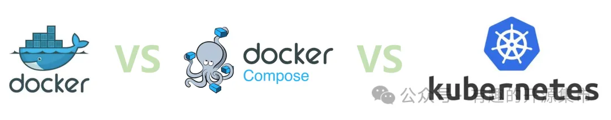

由此可见，无论单机 Docker 还是服务编排 Docker-compose，还是集群调度编排的 Kubernetes，在企业里面有着相应的应用场景，几种部署模式并存。那么随之而来的一个问题就是，企业如何统一管理零散这些环境。所以，今天给大家介绍一个能够统一管理这些的平台-Portainer。

## **01** portainer 介绍

一句话介绍 Portainer：能够将 Docker，Docker-compose，Kubernetes 统一管理的平台，通过简单易用的 UI 界面，消除使用 CLI、编写 YAML 的复杂性。

### 🏠 项目信息

```bash
# Github地址
https://github.com/portainer/portainer
# 官网地址
https://www.portainer.io/
```

### 🚀 功能特性

- 提供直观界面使用 Docker 的全部功能，可以构建、发布和部署容器映像、管理网络和卷，以及配置跨集群的扩展。支持通过 RBAC、注册表管理和外部身份验证支持等功能。
- 直观的 Kubernetes 管理平台界面，允许管理员快速管理和维护集群，支持管理集群的服务帐户、角色和角色绑定，以及集群角色和集群角色绑定，而无需退出命令行。

### 🛠 系统架构

Portainer 由两个部分组成：Portainer Server 和 Portainer Agent。Portainer Agent 部署到集需要管理的每个节点，并在 Portainer Server 中配置需要纳管环境的 Agent 连接信息。

**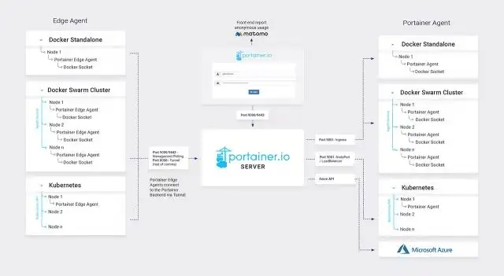**

## 02 portainer 安装

### Server 端安装

首先，创建 Portainer Server 存储数据卷：

```bash
docker volume create portainer_data
```

然后，下载并运行 Portainer Server 容器：

```bash
docker run -d -p 8000:8000 -p 9443:9443 --name portainer --restart=always -v /var/run/docker.sock:/var/run/docker.sock -v portainer_data:/data portainer/portainer-ce:latest
```

最后，通过运行 docker ps 命令来检查 Portainer Server 容器是否已启动：

```bash
root@server:~# docker ps
CONTAINER ID   IMAGE                          COMMAND                  CREATED       STATUS      PORTS                                                                                  NAMES
de5b28eb2fa9   portainer/portainer-ce:latest  "/portainer"             2 weeks ago   Up 9 days   0.0.0.0:8000->8000/tcp, :::8000->8000/tcp, 0.0.0.0:9443->9443/tcp, :::9443->9443/tcp   portainer
```

启动完成后，通过打开浏览器访问 https://localhost:9443 登录，并进行初始化创建账号：

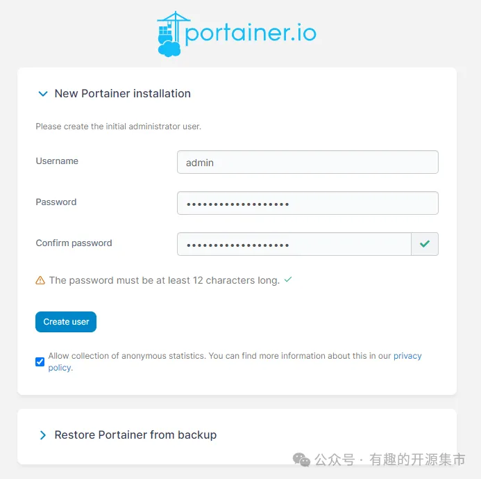

### Agent 端安装

Portainer Agent 安装到需要纳管的 Docker 主机或者 Kubernetes 集群中。在界面选择创建环境：

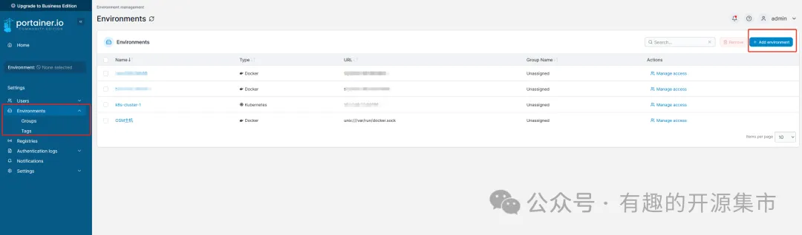

选择需要添加的平台类型（灰色无法选择的为企业版本，我们不用管）：

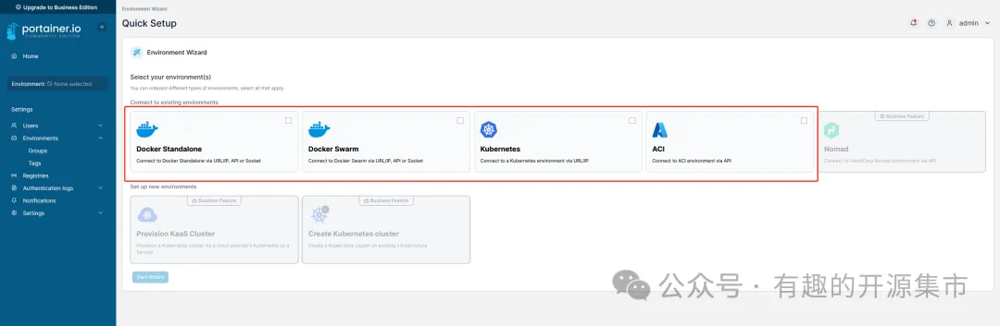

## 一、Docker 主机接入管理：

在需要纳管的主机上运行以下命令：

```bash
docker run -d \
  -p 9001:9001 \
  --name portainer_agent \
  --restart=always \
  -v /var/run/docker.sock:/var/run/docker.sock \
  -v /var/lib/docker/volumes:/var/lib/docker/volumes \
  portainer/agent:2.19.4
```

部署后，将主机信息填入下图中：

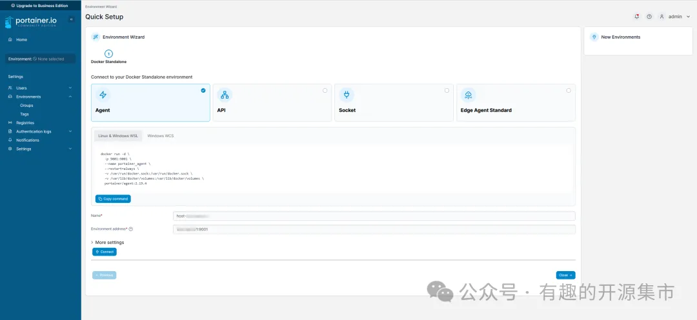

填入后，即可对这台 Docker 主机进行管理：

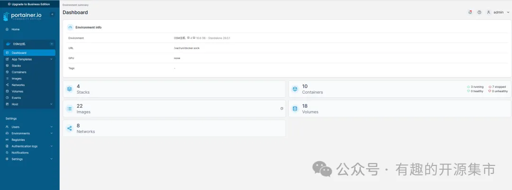

## 二、Kubernetes 集群接入管理

在需要纳管的 K8S 集群中，选择 NodePort 或者 load balancer 方式暴露端口，通过 Kubectl 上运行以下的命令：

```bash
# 采用NodePort方式
kubectl apply -f https://downloads.portainer.io/ce2-19/portainer-agent-k8s-nodeport.yaml
```

部署后，将集群信息填入下图中：

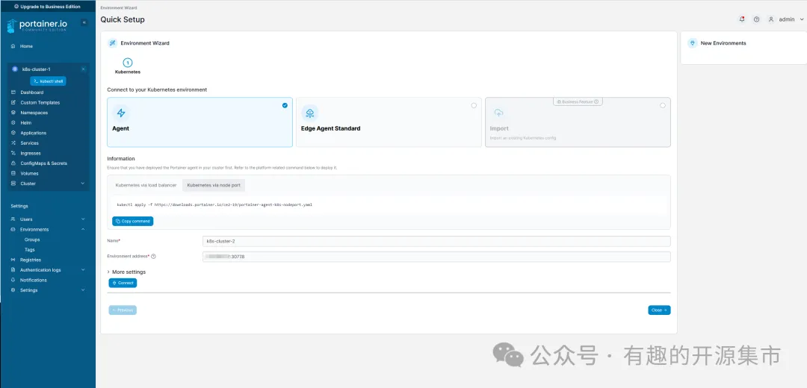

填入后，即可对接入的 K8S 集群进行管理：

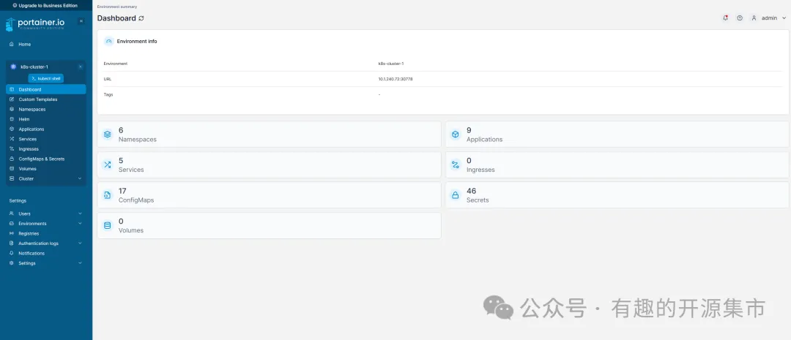

## 03 最后

Portainer 作为是一个可视化的 Docker 和 K8S 操作界面，功能非常全面，比如支持通过模板快速部署应用、容器镜像网络数据卷的基本操作、事件日志收集、集群和 SVC 等集中管理和操作、统一仓库管理、登录用户管理和权限控制等功能。这边就不进行一一说明和展示了，基本能满足中小型企业对容器和 k8s 管理的全部需求。

唯一遗憾的是官方没有提供中文界面，但是有大神提供了中文部署版本的镜像

# Kubernetes 安全合规分析的命令行工具

Kubernetes 成为了容器编排的标准。很多企业都通过自建，或者云托管的方式建设了 Kubernetes 平台，但是由于 Kubernetes 的复杂性，很多企业在基于 Kubernetes 部署业务应用时，为了便利并没有配置或者开启集群的安全功能，如网络策略和 Pod 安全标准等。导致经常出现以下常见的安全问题：

- **未授权访问：**未授权的访问是最常见的安全问题之一。在 Kubernetes 中，未授权的访问可能会导致未经授权的用户或系统对集群、pods、服务等资源进行未授权的操作，如访问、修改或删除等。
- **敏感数据暴露：**敏感数据暴露是指 Kubernetes 集群中的敏感信息如密码、API 密钥、证书等未正确保护，这些信息可能会被未授权的用户或系统获取。
- **容器逃逸：**容器逃逸是指一个容器试图访问并不属于它的资源。在 Kubernetes 中，容器逃逸可能会导致容器访问宿主机或其他容器的资源。
- **系统权限过高：**在 Kubernetes 集群中，某些服务或容器可能会以 root 用户权限运行，这可能会导致未授权的用户获取到过高的权限，从而可能会对宿主机造成威胁。

基于对 2023 CVE 中关于 Kubernetes 安全问题的统计，上述安全问题也"高居榜首"。

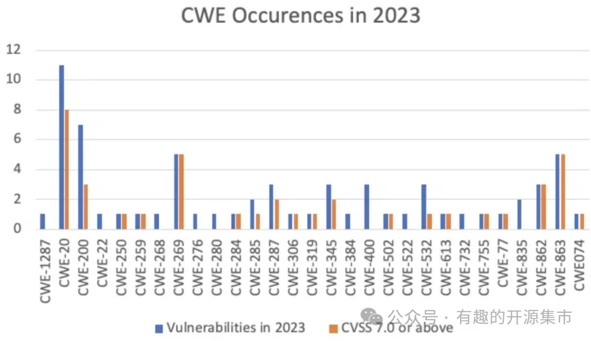

_2023 年 \*Kubernetes\* 常见漏洞类型（数据来源：**cve.mitre.org**）_

\*备注：

- _CWE-20：输入验证不当_

  _CWE-200：将敏感信息暴露给未经授权的参与者_

  _CWE-269：权限管理不当_

  _CWE-863：授权不正确_

  _CWE-862：缺少授权_

据 ARMO 分析，2018 年至 2023 年间，Kubernetes 中的漏洞数量增加了 440% 。

_报告地址：https://www.armosec.io/blog/kubernetes-vulnerabilities-2023/_

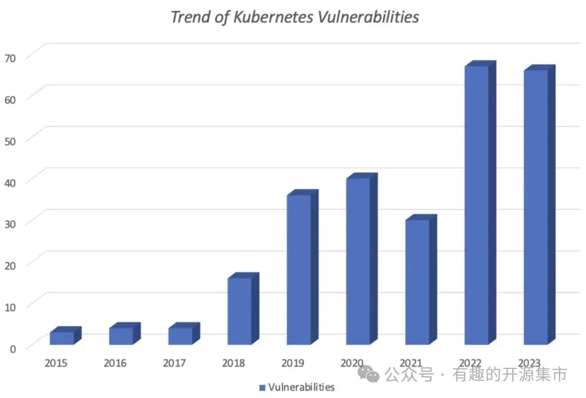

_Kubernetes 漏洞趋势 （数据来源：cve.mitre.org）_

Kubernetes 的安全管理成为了企业迫在眉睫的事情。很多企业也开始逐步引入 Kubernetes 安全扫描工具以此来提升 Kubernetes 的安全性。所以今天给大家介绍一个能够针对 Kubernetes 进行全面安全扫描的工具-Kubescape

## 01 Kubescape 介绍

一句话介绍 Kubescape：一个开源 Kubernetes 安全扫描工具，支持 CI/CD 管流水线 和 IDE 集成，支持安全配置分析、漏洞扫描、风险分析、安全合规性分析等，简单易用的 CLI 界面、灵活的输出格式。

### 🏠 项目信息

```bash
# Github地址
https://github.com/kubescape/kubescape
# 项目地址
https://kubescape.io/
```

### 🚀 功能特性

- 支持安全扫描结果存储在集群内
- 从 CLI 扫描容器镜像中的漏洞
- 支持扫描集群中所有镜像的漏洞
- 支持设置集群安全扫描基线
- 发现高风险工作负载（如果受到威胁，可能造成危害的工作负载）
- 支持 Helm chart 部署，提供连续扫描
- 支持独立显示每个工作负载、每个命名空间和每个集群指标
- 支持输出 Prometheus 格式指标
- 支持通过 Prometheus Alertmanager 发出告警

### 🔥 使用场景

支持在编码阶段、CI 阶段、CD 阶段、部署阶段进行扫描。Kubescape Operator 还可以通过 Helm 安装。支持连续扫描、镜像漏洞扫描、运行时分析、网络策略生成等。Kubescape 支持 GitHub Action。很容易将 Kubescape 集成到 CI/CD 流水线中。

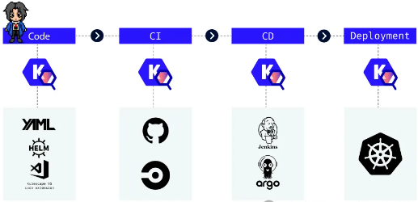

### 🛠 系统架构

#### 组件架构

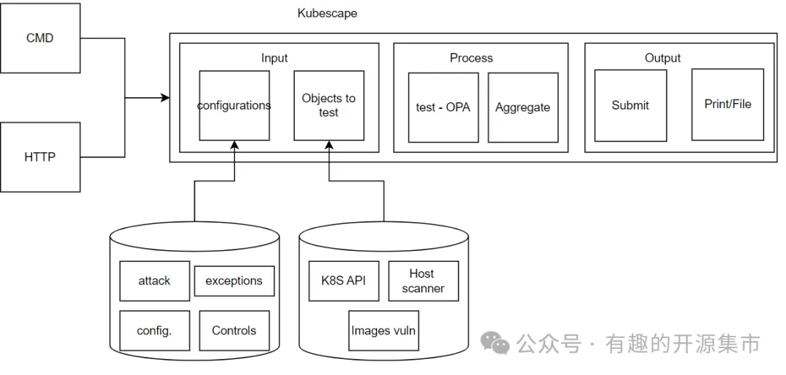

#### 命令行界面

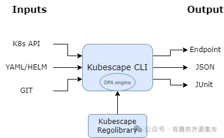

#### Operator 逻辑

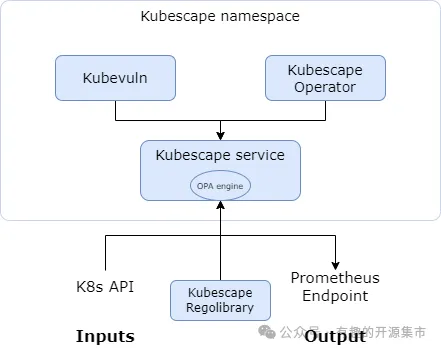

## 02 Kubescape 安装

### 一、开始安装

Kubescape 的最佳方法是将其下载到用于管理 Kubernetes 集群的机器上，不建议直接安装到 kube-master 上。

```
curl -s https://raw.githubusercontent.com/kubescape/kubescape/master/install.sh | /bin/bash
```

因为会从 Github 下载二进制执行文件，所以如果网络不通的同学，需要自行解决 Github 访问问题，或者直接在 Github 下载二进制文件后放入 /usr/bin 目录。

### 二、离线环境配置（可选）

_如果安装 kubescape 的机器可以访问 Github，则不需要这步_

- 下载所有扫描标准依赖

  1.下载所有框架并将其保存在本地目录中。如果没有指定路径，将保存在`~/.kubescape`.

```
kubescape download artifacts --output path/to/local/dir
```

2.使用下载离线框架进行扫描：

```bash
kubescape scan --use-artifacts-from path/to/local/dir
```

- **下载单个扫描标准框架**

1. 下载并保存在文件。如未指定文件，另存为 `~/.kubescape/<framework name>.json`

```bash
kubescape download framework nsa --output /path/nsa.json
```

2. 使用下载的框架进行扫描：

```bash
kubescape scan framework nsa --use-from /path/nsa.json
```

### 三、持续扫描监控

如果需要 kubescape 持续的扫描监控集群，那么就需要安装 kubescape Operator。

```bash
helm repo add kubescape https://kubescape.github.io/helm-charts/ ; helm repo update ; helm upgrade --install kubescape kubescape/kubescape-operator -n kubescape --create-namespace --set clusterName=`kubectl config current-context` --set capabilities.continuousScan=enable
```

验证是否安装成功：

```bash
$ kubectl get pods -n kubescape
kubescape     kubescape-548d6b4577-qshb5                          1/1     Running   0               60m
kubescape     kubevuln-6779c9d74b-wfgqf                           1/1     Running   0               60m
kubescape     operator-5d745b5b84-ts7zq                           1/1     Running   0               60m
kubescape     storage-59567854fd-hg8n8                            1/1     Running   0               60m
```

## 03 Kubescape 使用

### 一、扫描命令使用

**快速扫描：**

```bash
kubescape scan --verbose
```

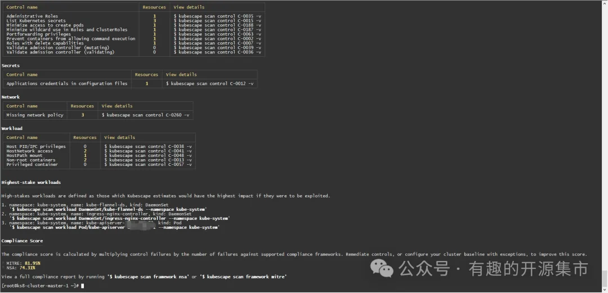

- **使用 NSA 框架**扫描 ：

```bash
kubescape scan framework nsa
```


- **使用 MITRE ATT&CK® 框架扫描：**

```bash
kubescape scan framework mitre
```

- **扫描特定项**

```bash
kubescape scan control "Privileged container"
```

- **指定 cluster.conf 扫描集群**

```bash
kubescape scan --kubeconfig cluster.conf
```

- **指定扫描集群中某些 namespace**

```bash
kubescape scan --include-namespaces development,staging,production
```

- **扫描排除集群中某些 namespace**

```bash
kubescape scan --exclude-namespaces kube-system,kube-public
```

- **部署前扫描本地 YAML/JSON 文件：**

```bash
kubescape scan *.yaml
```

- **扫描 Git 存储库中清单文件：**

```bash
kubescape scan https://github.com/kubescape/kubescape
```

- **扫描 Helm Charts**

```bash
kubescape scan </path/to/directory>
```

- **指定格式输出**

```bash
#Jaso格式
kubescape scan --format json --format-version v2 --output results.json
#PDF格式
kubescape scan --format pdf --output results.pdf
#XML格式
kubescape scan --format junit --output results.xml
#Prometheus metrics
kubescape scan --format prometheus
#html格式
kubescape scan --format html --output results.html
```


html 报告

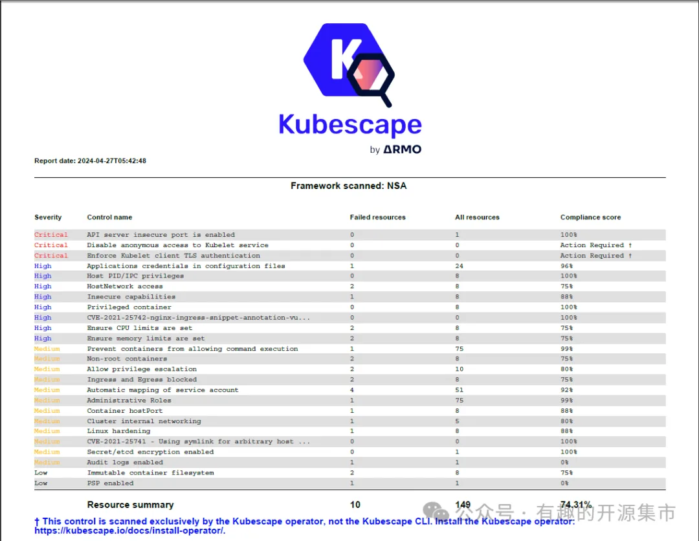

pdf 报告

### 二、指标解读

Kubescape 提供两个重要指标来评估合规性：

- 控制合规性分数：该分数衡量框架内各个控制的合规性。它是通过评估传递的资源与根据该控制评估的资源总数的比率来计算的。

```bash
kubescape scan --compliance-threshold <SCORE_VALUE[float32]>
```

- 框架合规性分数：此分数提供集群对特定框架合规性的总体评估。它是通过计算框架内所有控制的控制合规性分数的平均值来计算的。

```bash
kubescape scan framework <FRAMEWORK_NAME> --compliance-threshold <SCORE_VALUE[float32]>
```

Kubescape 扫描并提供合规性分数如下：

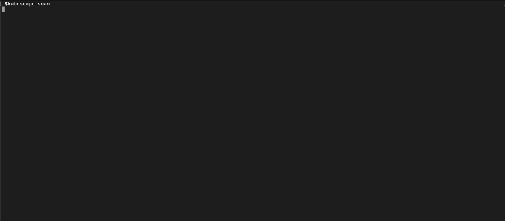

## 04 最后

作为 Kubernetes 安全扫描工具，Kubescape 能够支持包括风险分析、安全合规、RBAC 规范扫描和容器漏洞扫描等功能。Kubescape 支持扫描部署前的 Helm Charts、Yaml 等文件，和正在运行中的 Kubernetes ，并且提供了简单易用的 CLI 界面，很容易和 DveOps 、CI/CD 等集成，提升 Kubernetes 的安全合规能力。

# 教程

[纽约工作室 107 |Dock Life：将 Docker 用于所有事情！ (nystudio107.com)](https://nystudio107.com/blog/dock-life-using-docker-for-all-the-things)

[全网对 Docker 命令总结最全的文章，秒收藏！ (qq.com)](https://mp.weixin.qq.com/s/R2-tFb3uXLp3ZTUvHpSPOA)
