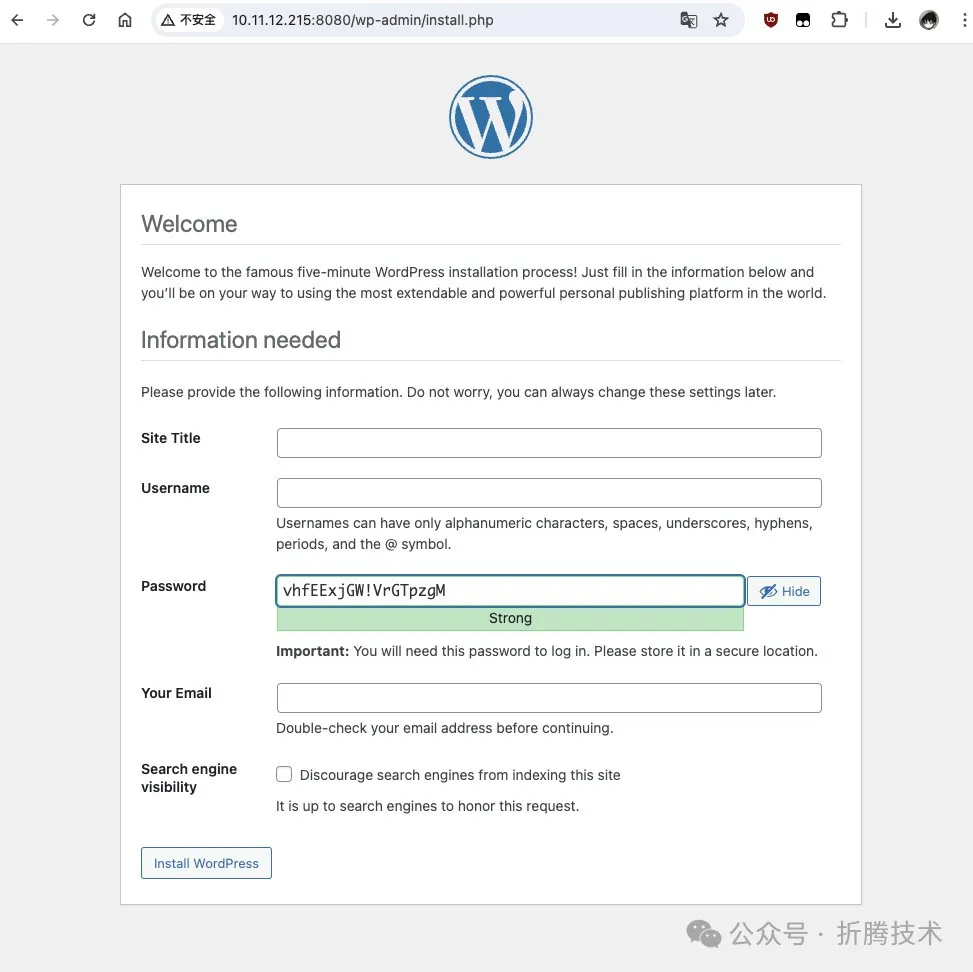

# Docker 加持的安卓手机：随身携带的知识库

[7.4K Star这么牛!Docker里面可以运行Android系统 (qq.com)](https://mp.weixin.qq.com/s/urIhljeFPw5hxrfaXVzdng)

这篇文章聊聊，如何借助 Docker ，尝试将一台五年前的手机，构建成一个随身携带的、本地化的知识库。

## 写在前面

本篇文章，我使用了一台去年从二手平台购入的五年前的手机，K20 Pro。

用于实验的设备：K20 Pro

为了让它能够稳定持续的运行，我还为它准备了一个“加强版”的散热壳。

加强的“散热装备”

设想中的平时使用场景也非常简单，不需要插卡、不需要联网，一根 Type-C 数据线把它和电脑连在一起，就可以通过“本地连接”来访问手机中运行的提供服务的软件。

因为手机本身自带“UPS”（电池），所以即使突然断电，也不会出现数据的丢失，除此之外，因为手机已经是五年前的规格了，即使大手笔的购入顶配中的至尊版，成本也并不高，但是却可以比较轻松的获得一台 8核心、12GB 内存、500GB 的硬盘设备。甚至还有一块可以用来调试或者展示内容的“全面屏”，没有任何摄像头打孔的完整玻璃屏幕。

至于性能，如果能够完全配置正常，应该是非常有性价比，但是这应该需要一些折腾，所以本篇文章是第一篇，先验证可行性。

本文中的许多资料来自开源项目 **CGCL-codes/Android-Container[1]**，感谢作者的辛苦劳动。不过项目距今为止已有三年没有更新，我个人推荐只做验证使用，一如本文中的使用方案。

### 为什么选择这台 K20 Pro

翻阅之前的文章，我发现我差不多每年都会折腾一下小米的手机。

•今年早些时候，聊过使用搭载 8Gen3 的红米 K70 Pro 跑模型《**使用搭载骁龙 8 Gen 3 的安卓手机运行 AI 大模型[2]**》•2023 年的时候，折腾过闲置的小米 12 Pro《**小米 12 PRO 刷 MIUI 14 海外版（Android 12）[3]**》•2022 年的时候，折腾过红米 11T Pro 《**红米 11T PRO 刷机 MIUI 13 海外版[4]**》•2021 年的时候，折腾过 K30 Pro《**小米 K30 PRO 刷机 MIUI 12.5 海外版[5]**》•2019 年的时候，折腾过 K20 Pro《**小米 K20Pro 体验 Android 10[6]**》

因为种种原因，目前的小米开发者生态没有了过去的开放，开发者难以获取 Bootloader 权限，各种有趣的功能要排队内测，甚至 GitHub 上都出现了一些离谱的项目，比如 “**小米高考题库[7]**”，来解决解锁刷机权限必须度过的大量八股测试题；“**小米解锁项目[8]**”，“**小米解锁方案合集[9]**” 等等项目。

**虽然，看起来现在的小米手机型号已经不再适合折腾。**但是，过去的手机，有没有可能变成一台比较有趣的设备，做一些比较有趣的事情呢？

**毕竟，过去的小米手机还是很顶的！“守门员”、“焊门员”、“小金刚”这些产品形容词不光包含了营销成分，也有来自粉丝们的赞许。**

## 准备工作

这次的准备工作非常简单，首先是“适合折腾的手机”，我选择的是 K20 Pro，你可以选择你喜欢的设备。

然后，是一台协助手机重获新生的“电脑”，Windows 或者 macOS 桌面系统的设备会比较方便，我使用的是 macOS。

最后，需要一根 Type-C 口的数据线，能够将手机连到电脑上。

## 第一步：解锁手机 Bootloader 权限

你可以参考上文中，我分享的之前的相关手机折腾记录，来将手机解锁，以便我们能够刷入 TWRP，并在后续过程中刷入验证 Docker 使用的新的安卓系统镜像。

如果你使用的设备也是 K20 Pro（Mi 9T Pro），可以从这里下载该设备的 **TWRP 引导镜像[10]**。

更新设备的 BootLoader 非常简单，只需要电脑侧执行下面两条命令即可：

```
fastboot flash recovery twrp.img
fastboot reboot
```

## 第二步：按顺序刷入设备使用的系统镜像

在**项目子目录文档的底部[11]**，我们能够找到用于验证的安卓镜像。

我们需要先刷入来自小米官方的 `miui_RAPHAEL_V12.0.5.0.QFKCNXM_d03168fb55_10.0.zip` 镜像，这个镜像发布自 2020 年 10 月 18 日，基于 Android 10 构建。如果项目页面下载比较慢，你**可以从这里下载官方镜像[12]**。

在刷入官方镜像后，我们就可以刷入项目作者构建好的镜像 `PixelExperience_raphael-10.0-20201204-0354-UNOFFICIAL-48bit-docker-criu.zip`，来进行功能验证了。

在这个文档的上面，作者简单解释了如何进行镜像构建，而在**另外一个目录中文档[13]**，则包含了另外一些比较重要的信息，包括如何给镜像内核做调整，来让 Docker 能够运行起来。

当我们完成镜像的更新后，就需要手动来完善运行环境，让 Docker 运行起来啦。

## 第三步：修复 Docker 运行环境

首先在一个命令行终端中执行：

```
adb shell
```

在进入一个交互式终端后，输入下面的命令，让我们能够修改系统中的只读目录：

```
mount -o rw,remount /
```

接着，我们将**项目 Docker 目录[14]**和项目 files 目录的 **files/dockerd.sh[15]** 使用 `adb push` 命令，传送到手机的 `/system/bin/` 目录下，一个基本的 Docker 运行环境就就绪啦。

```
# adb push ./dockerd.sh /system/bin/dockerd.sh

./dockerd.sh: 1 file pushed, 0 skipped. 7.7 MB/s (4016 bytes in 0.000s)

...
```

为了我们操作 Docker 程序更方便，我们可以手动修复 `docker-compose` 命令，在 Compose 项目的**发布页面[16]**，我们找到最新版本的 `docker-compose-linux-aarch64` 文件，下载，并使用上面的方式传送到手机环境中，并设置正确的执行权限。

```
# adb push ./docker-compose-linux-aarch64 /system/bin/docker-compose

./docker-compose-linux-aarch64: 1 file pushed, 0 skipped. 32.2 MB/s (61276577 bytes in 1.815s)

adb shell su -c "chmod +x /system/bin/docker-compose"
```

### 改进的 `dockerd.sh`

我对原始项目的 `dockerd.sh` 做了一些简单调整：

```
#!/system/bin/sh

mount -o rw,remount /

# 创建 Docker 相关的目录
root_dirs=("/var" "/run" "/tmp" "/opt" "/usr" "/system/etc/docker")
for dir in "${root_dirs[@]}"; do
    if [ ! -d "$dir" ]; then
        mkdir "$dir"
    fi
done


# 创建 /data 目录相关的目录
data_dirs=("/data/var:/var" "/data/run:/run" "/data/tmp:/tmp" "/data/opt:/opt" "/data/etc/docker:/etc/docker")
for dir in "${data_dirs[@]}"; do
    # 分割目录路径和挂载点
    paths=$(echo "$dir" | tr ':' ' ')
    data_dir=$(echo "$paths" | cut -d ' ' -f 1)
    mount_dir=$(echo "$paths" | cut -d ' ' -f 2)
    # 如果 /data/var 目录存在，清理目录中的 ./run 目录
    if [ "$data_dir" = "/data/var" ] && [ -d "$data_dir" ]; then
        rm -rf /data/var/run
    fi
    # 尝试创建并挂载目录
        mkdir -p "$data_dir"
        mount --bind "$data_dir" "$mount_dir"
        echo "mount $data_dir to $mount_dir"
done


# 创建 /dev 目录相关的目录，并挂载 cgroup
cgroup_dirs=("cpu" "cpuacct" "devices" "freezer" "hugetlb" "net_cls" "net_prio" "perf_event" "pids" "rdma")
for dir in "${cgroup_dirs[@]}"; do
    if [ ! -d "/dev/$dir" ]; then
        mkdir -p "/dev/$dir"
        case "$dir" in
            "cpu"|"cpuacct")
            ;;
        *)
            echo "mount -t cgroup -o $dir none /dev/$dir"
            mount -t cgroup -o $dir none /dev/$dir
            ;;
        esac
    fi
done


# 为 Docker 添加路由表
ip_rule1=$(ip rule | grep "from all lookup main" | wc -l)
if [ "$ip_rule1" -ne 1 ]; then
    ip rule add pref 1 from all lookup main
fi
ip_rule2=$(ip rule | grep "from all lookup default" | wc -l)
if [ "$ip_rule2" -ne 1 ]; then
    ip rule add pref 2 from all lookup default
fi


# 设置 Docker 镜像加速
echo "{\"registry-mirrors\":[\"https://mirror.baidubce.com\"],\"experimental\":true}" > /etc/docker/daemon.json
# 关闭默认防火墙，允许外部访问 Docker 容器端口
setenforce 0
# 启动 Docker
export DOCKER_RAMDISK=true
dockerd --add-runtime crun=/bin/crun -H tcp://0.0.0.0:2375 -H unix:///var/run/docker.sock > /dev/null 2>&1 &
```

搭配注释，做了什么应该都非常清楚啦，这里就不展开赘述了。等到重新构建镜像的时候，我们再进行进一步的优化（内置 & 精简）。

## 第四步：启动 Docker 后台进程

当我们将所有文件都传输到手机上之后，在 `adb shell` 环境中把 `docker` 进行拉起来，Docker 运行环境就准备就绪啦。

```
# dockerd.sh                                                                                                                                                                       

mount /data/var to /var
mount /data/run to /run
mount /data/tmp to /tmp
mount /data/opt to /opt
mount /data/etc/docker to /etc/docker
mount -t cgroup -o devices none /dev/devices
mount -t cgroup -o freezer none /dev/freezer
mount -t cgroup -o hugetlb none /dev/hugetlb
mount -t cgroup -o net_cls none /dev/net_cls
mount -t cgroup -o net_prio none /dev/net_prio
mount -t cgroup -o perf_event none /dev/perf_event
mount -t cgroup -o pids none /dev/pids
mount -t cgroup -o rdma none /dev/rdma
```

这个时候，执行 `docker info` 就能够看到 docker 的基础运行环境状况啦：

```
# docker info

Client:
 Debug Mode: false

Server:
 Containers: 1
  Running: 1
  Paused: 0
  Stopped: 0
 Images: 7
 Server Version: 19.03.13
 Storage Driver: overlay2
  Backing Filesystem: extfs
  Supports d_type: true
  Native Overlay Diff: false
 Logging Driver: json-file
 Cgroup Driver: cgroupfs
 Plugins:
  Volume: local
  Network: bridge host ipvlan macvlan null overlay
  Log: awslogs fluentd gcplogs gelf journald json-file local logentries splunk syslog
 Swarm: inactive
 Runtimes: runc crun
 Default Runtime: runc
 Init Binary: docker-init
 containerd version: 8fba4e9a7d01810a393d5d25a3621dc101981175
 runc version: dc9208a3303feef5b3839f4323d9beb36df0a9dd
 init version: fec3683
 Security Options:
  seccomp
   Profile: default
 Kernel Version: 4.14.180-F1xy-0.19-pe-ten/71771c10be
 OSType: linux
 Architecture: aarch64
 CPUs: 8
 Total Memory: 11.25GiB
 Name: localhost
 ID: LLQY:OOXR:BKTQ:M2ZP:MGUJ:Q3NY:RPZL:EV7D:YGQY:H45D:BKUY:RXMA
 Docker Root Dir: /var/lib/docker
 Debug Mode: false
 Registry: https://index.docker.io/v1/
 Labels:
 Experimental: true
 Insecure Registries:
  127.0.0.0/8
 Registry Mirrors:
  https://mirror.baidubce.com/
 Live Restore Enabled: false
 Product License: Community Engine

WARNING: API is accessible on http://0.0.0.0:2375 without encryption.
         Access to the remote API is equivalent to root access on the host. Refer
         to the 'Docker daemon attack surface' section in the documentation for
         more information: https://docs.docker.com/engine/security/security/#docker-daemon-attack-surface
```

## 第五步：创建一个 Docker 应用

Docker 环境就绪后，我们来测试 Docker 应用能否运行。先创建一个目录，用于后续存放 Docker 应用数据：

```
mkdir -p kb
cd kb
```

随后，在目录中创建一个内容如下的 `docker-compose.yml` 配置文件：

```
version: '3'

services:

  wordpress:
    image: soulteary/sqlite-wordpress:6.5.2
    restart: always
    ports:
      - 8080:80
    volumes:
      - ./wordpress:/var/www/html
```

没错，这个配置来自项目 **soulteary/docker-sqlite-wordpress[17]**，在之前的文章《**WordPress 告别 MySQL：Docker SQLite WordPress[18]**》、《**WordPress SQLite Docker 镜像封装细节[19]**》中，讲的比较详尽了，就不在此展开啦。

当我们准备好 `docker-compose.yml` 后，执行 `docker-compose up -d`：

```
# docker-compose up -d
WARN[0000] /kb/docker-compose.yml: `version` is obsolete 
[+] Running 1/0
 ✔ Container kb-wordpress-1  Running 
```

WordPress 就很快的通过容器的方式启动起来啦。

启动应用后，我们使用下面的命令，可以简单验证服务是否正常运行：

```
docker exec kb-wordpress-1 curl -L http://0.0.0.0:80
```

不出意外，我们将得到类似下面的结果：

使用命令行验证手机上的 Docker 应用

上面的图片中，我们使用命令行来验证了 WordPress 中的程序渲染出了 HTML 页面，虽然执行时间非常长（需要排查或重新构建 Android 验证），但是证明了 Android 上运行 Docker 程序是可行的。

## 第六步：如何在电脑侧访问手机的应用

**Android Debug Bridge（ADB）[20]**中有一个很有用的命令叫做 `forward`，我们可以通过这个命令，将电脑上的端口和手机上应用的端口进行打通。

```
 forward --list           list all forward socket connections

 forward [--no-rebind] LOCAL REMOTE
     forward socket connection using:
       tcp:<port> (<local> may be "tcp:0" to pick any open port)
       localabstract:<unix domain socket name>
       localreserved:<unix domain socket name>
       localfilesystem:<unix domain socket name>
       dev:<character device name>
       jdwp:<process pid> (remote only)
       vsock:<CID>:<port> (remote only)
       acceptfd:<fd> (listen only)

 forward --remove LOCAL   remove specific forward socket connection

 forward --remove-all     remove all forward socket connections
```

命令支持四种参数调用方法，分别是：

•以列表形式获取所有的转发映射•进行本地和远程端口的转发映射•撤销一个本地端口的转发映射•撤销所有的转发映射

我们以实际的情况举例，上文中，我们在手机上将 WordPress 默认运行的 `80` 端口，映射到了手机的 `8080` 端口。如果我们将电脑的 `8088` 端口和手机上的 `8080` 端口打通，那么我们需要执行下面的命令：

```
adb forward tcp:8088 tcp:8080
```

当命令执行完毕后，我们就可以在浏览器中访问 `http://localhost:8088` 来访问手机上的应用啦。

使用电脑直接访问手机容器应用

当然，这里也会遇到和上面一样的问题，访问应用的时间会比较长。这是一个需要继续排查和解决的问题。毕竟除了 `PHP` 程序执行外的资源路径的响应都在 `ms` 级别。

当然，如果你希望这台设备上运行的 Docker 程序，能够在局域网共享，只需要让手机连上 Wi-Fi，然后在浏览器中访问手机在局域网中的 IP 地址，和对应的程序端口即可。

使用局域网访问手机上的容器应用

是不是十分简单，如果你想离线本地化使用，就不需要给手机网络，如果你想局域网共享，得到一台低成本、高性价比的 Linux 服务器，就让它连上 Wi-Fi。

## 最后

写到这里，本文提到的验证目标就结束啦。接下来相关的文章里，我们来聊聊本文遇到的性能问题，以及如何在 2024 年更简单的构建支持 Docker 运行的安卓内核和镜像。

我们下篇文章再见。

--EOF

**引用链接**

`[1]` CGCL-codes/Android-Container: *https://github.com/CGCL-codes/Android-Container*
`[2]` 使用搭载骁龙 8 Gen 3 的安卓手机运行 AI 大模型: *https://soulteary.com/2024/02/29/run-large-ai-models-on-android-phones-with-snapdragon-8-gen-3.html*
`[3]` 小米 12 PRO 刷 MIUI 14 海外版（Android 12）: *https://soulteary.com/2023/01/09/xiaomi-12-pro-flashing-miui-14-overseas-version.html*
`[4]` 红米 11T PRO 刷机 MIUI 13 海外版: *https://soulteary.com/2022/09/25/redmi-11-t-pro-flashing-miui-13-overseas-version.html*
`[5]` 小米 K30 PRO 刷机 MIUI 12.5 海外版: *https://soulteary.com/2021/10/22/mi-k30-pro-flashing-miui-125-overseas-version.html*
`[6]` 小米 K20Pro 体验 Android 10: *https://soulteary.com/2019/09/08/xiaomi-k20pro-experience-android-10.html*
`[7]` 小米高考题库: *https://github.com/MlgmXyysd/Xiaomi-BootLoader-Questionnaire*
`[8]` 小米解锁项目: *https://github.com/MlgmXyysd/Xiaomi-HyperOS-BootLoader-Bypass*
`[9]` 小米解锁方案合集: *https://github.com/topminipie/awesome-xiaomi-bootloader-unlock*
`[10]` TWRP 引导镜像: *https://twrp.me/xiaomi/xiaomimi9tpro.html*
`[11]` 项目子目录文档的底部: *https://github.com/CGCL-codes/Android-Container/blob/main/pixel-OS/README.md*
`[12]` 可以从这里下载官方镜像: *https://xiaomirom.com/download/redmi-k20-pro-mi-9t-pro-raphael-stable-V12.0.5.0.QFKCNXM/*
`[13]` 另外一个目录中文档: *https://github.com/CGCL-codes/Android-Container/tree/main/docker*
`[14]` 项目 Docker 目录: *https://github.com/CGCL-codes/Android-Container/tree/main/docker*
`[15]` files/dockerd.sh: *https://github.com/CGCL-codes/Android-Container/blob/main/files/dockerd.sh*
`[16]` 发布页面: *https://github.com/docker/compose/releases*
`[17]` soulteary/docker-sqlite-wordpress: *https://github.com/soulteary/docker-sqlite-wordpress*
`[18]` WordPress 告别 MySQL：Docker SQLite WordPress: *https://soulteary.com/2024/04/17/say-goodbye-to-mysql-docker-sqlite-wordpress.html*
`[19]` WordPress SQLite Docker 镜像封装细节: *https://soulteary.com/2024/04/21/wordpress-sqlite-docker-image-packaging-details.html*
`[20]` Android Debug Bridge（ADB）: *https://developer.android.com/tools/adb*