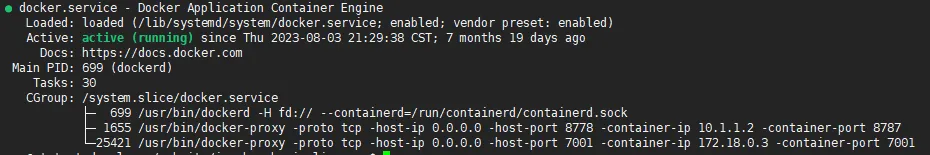
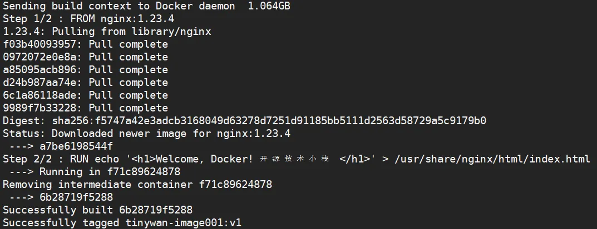
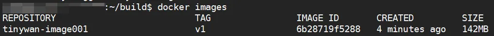
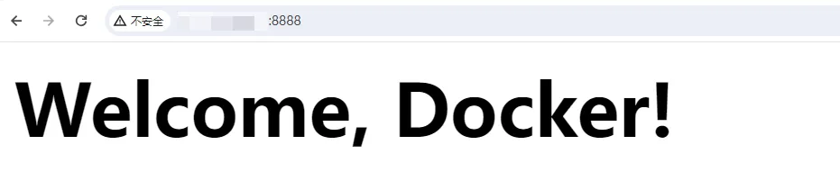

# Docker快速入门和部署使用教程

## 0x01 前言

在本教程中，您将学习如何在云服务器 Cloud Linux 3操作系统部署Docker，并制作Docker镜像。

Docker是一款开源的应用容器引擎，具有可移植性、可扩展性、安全性和管理性等优势。开发者可将应用程序和依赖项打包到一个可移植的容器中，快速发布到Linux机器上并实现虚拟化，实现更高效地构建、部署和管理应用程序。

## 0x02 部署Docker

本教程以部署社区版Docker（docker-ce）为例。

> 1、执行以下命令，下载`docker-ce`的`yum`源。

```
sudo wget -O /etc/yum.repos.d/docker-ce.repo https://mirrors.aliyun.com/docker-ce/linux/centos/docker-ce.repo
```

> 2、执行以下命令，安装`docker-ce`

```
sudo yum -y install docker-ce
```

> 3、执行以下命令，确认Docker是否部署成功。如果回显信息类似如图所示，表示Docker已部署成功。

```
docker -v
```

> 4、执行以下命令，启动`Docker`服务。

```
sudo systemctl start docker
```

> 5、执行以下命令，设置`Docker`开机自启动。

```
sudo systemctl enable docker
```

> 6、执行以下命令，查看Docker服务的运行状态。如果回显信息显示`Active：active（running）`时，表示Docker已启动。

```
systemctl status docker
```



## 0x03 制作Docker镜像

> 1、执行以下命令，拉取Nginx镜像。本示例以拉取 Nginx 1.23.4为例。

```
sudo docker pull nginx:1.23.4
```

> 2、执行以下命令，新建并编辑`Dockerfile`文件。

执行以下命令，新建并编辑Dockerfile文件。

```
vim Dockerfile
```

按`i`进入编辑模式，并添加以下内容，改造原镜像。

```
#声明基础镜像来源，本示例中基础镜像为拉取的nginx:1.23.4镜像
FROM nginx:1.23.4
#RUN后面接容器运行前需要执行的命令，本示例将Nginx的首页内容改为Welcome, Docker!
RUN echo '<h1>Welcome, Docker! 开源技术小栈 </h1>' > /usr/share/nginx/html/index.html
```

按`Esc`键，输入`:wq`并按`Enter`键，保存并退出`Dockerfile`文件。

> 3、执行以下命令，基于基础镜像nginx构建新镜像。

命令格式为`docker build -t [镜像名称]:[镜像版本] .`，命令末尾的`.`表示`Dockerfile`文件的路径，不能忽略。以基于构建新镜像`tinywan-image001:v1`为例，则命令为：

```
sudo docker build -t tinywan-image001:v1 .
```



> 4、执行以下命令，查看新镜像是否构建成功。

```
sudo docker images 
```

如下图回显所示，表示构建成功。



> 5、执行以下命令，将`Nginx`的`80`端口映射至服务器的`8080`端口，以启动镜像并实现通过公网访问。

命令格式为`docker run --name [容器名称] -p 8888:80 -d [镜像名称]:[镜像版本]`，

示例命令：

```
sudo docker run --name tinywan-nginx-test -p 8888:80 -d tinywan-image001:v1 
```

## **0x04 完成**

> 部署和使用Docker制作镜像后，在浏览器中输入`http://<公网IP地址>:8888`并访问，如果出现如图所示内容，说明容器运行成功且镜像制作成功。

