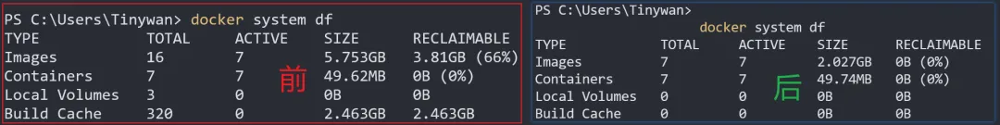

# Docker空间优化指南：高效回收磁盘空间的实用技巧

## **概述**

Docker不会对你的系统进行配置更改，但它会占用大量的磁盘空间。使用它一小段时间，你可能会震惊地看到一些可怕的使用统计数据。先看看使用前后的数据大小



## **使用**

#### **使用情况统计信息**

```
PS C:\Users\Tinywan> docker system df
TYPE            TOTAL     ACTIVE    SIZE      RECLAIMABLE
Images          16        7         5.753GB   3.81GB (66%)
Containers      7         7         49.62MB   0B (0%)
Local Volumes   3         0         0B        0B
Build Cache     320       0         2.463GB   2.463GB
```

#### **定期修剪**

为了安全地删除已停止的容器，未使用的网络和悬挂的图像，最好每隔一段时间运行以下命令

```
PS C:\Users\Tinywan> docker system prune
WARNING! This will remove:
  - all stopped containers
  - all networks not used by at least one container
  - all dangling images
  - all dangling build cache

Are you sure you want to continue? [y/N] y
Deleted Networks:
tinywan-fastgpt_fastgpt

Deleted Images:
deleted: sha256:ef4a886609a086d9b686bcd68a926f0a24bf881f3a91d8e05dacbfe5fc5f5e41

Deleted build cache objects:
fkjiz40kdrbpgdc4njawpdacj
...
kqrvz3c06iayleu8qm6h3lbz8
vwooga4sd6zkrb9jee01aijl4

Total reclaimed space: 2.523GB
```

#### **全面清理启动**

可以使用单个命令擦除每个未使用的容器，图像，卷和网络

```
PS C:\Users\Tinywan> docker system prune -a --volumes
WARNING! This will remove:
  - all stopped containers
  - all networks not used by at least one container
  - all anonymous volumes not used by at least one container
  - all images without at least one container associated to them
  - all build cache

Are you sure you want to continue? [y/N] y
Deleted Volumes:
a57cebc4f2fb960857049240a835dbd3d4b8cfbd66945465bdee339237f0e5b8
c861b2ad2f571a5039e7f22464202470ebd5c9657b1af1b80614505a8dd9ef7b
25a4fb5369543d6c9b6139dffa2e63a60cbeac2afb5fe248395c981ed9a72cb5

Deleted Images:
untagged: mongo:5.0.18
untagged: mongo@sha256:f7483b9319cf0b9f4e524cbd2fed1b9705a5f98b0f232ed3c3fe8f8d01537482
deleted: sha256:6e57b03e71efb109679d76cb88690a3793b3c1702b09d140185678682934eb08
deleted: sha256:18ceb85a767f53e8178bc86fb5107330c15eca2fcb25babc4443a3072d5c67ad
deleted: sha256:62ccd6fc239e990503639148e555cfcd92641f82980ecc81c2298bb6fd2065ef
deleted: sha256:dc1822da3f0bace40ee0570e8624ecb3cb40469c15a28f670bf8a126bab27a56
deleted: sha256:f5386c1e59ed171de128cecea9c61dec92534e863ebf96bd75275f23d7aaecb5
deleted: sha256:fc2c7d97bebd22d75229146886a67040627cea26240b94db351e97891f0a6b10
deleted: sha256:90a8810db37ff18a7d0723f88afe276d797124b37efd554a8b893c55df514ce5
deleted: sha256:f9c1f3d40a3f37cc2c9c7d01be53849599cbe24e71d23d918e61c707e8685508
deleted: sha256:95e4acb933b2bc83bf99d259c76f4e011a351e8f81403ce8802215cfbb8280e8
deleted: sha256:f5bb4f853c84f6579d86f72de5f1d43fc8866443d9a027e2106e3755acefd61c
untagged: registry.cn-hangzhou.aliyuncs.com/fastgpt/fastgpt:latest
untagged: registry.cn-hangzhou.aliyuncs.com/fastgpt/fastgpt@sha256:7941935420ed58049cdbf120b795f19720ce4c33f77cbefbc2fdeff03e9d51a6
deleted: sha256:fc9f32309c331be9489b962869a3fe4045cdb13dcd2b962e67263ecf98526aec
deleted: sha256:91578397531c3e2723dd218420ed68e34036f9b2ad9aefff2906d6eedb5cc211
deleted: sha256:47eb4c3572e81eed6df4957826849f37df163559ec82c2419b50b5d0be6c6d92
deleted: sha256:1632e73dbeabb55b97045675d98dd91613ae1b52264cf683bd5fb195a00ec023
deleted: sha256:2f8a5ec40ccf25e59e50ec8133d6543f46beb48313666f018b6fe43c1c72c494
deleted: sha256:1e553d69708e48e58096b5f61e3885454a62dd84fc556a2cb38f03f2c203ed49
deleted: sha256:cf67ff61f9bb83170155cb2d4707662ef195b01263afb4848535ae1f9594880e
deleted: sha256:c7d440b2fbc6f2962d55ba99aa73185c2584cb730ec116396340e2d3c3f02d4e
deleted: sha256:463ff64bb0def0dc22e8685c47f779abeb09de62ac377a541483a036d8ad5a79
deleted: sha256:9e2e935403e6420c230832b35978a1a94ef4a33e55a2400084ed167fcff885df
deleted: sha256:813e8f10bee62e39c77bb25853b2ea7a191f8ea5566211f11cb3f54f9150ec2f
deleted: sha256:981a719c563d81c87035b80ff80a6be51b2cb0d1e425831128fbcec71ecacf1f
deleted: sha256:a6f9594696e39b9bc2e8f278d23aedc0564487ace670aa3945710cb04f12b5da
deleted: sha256:16bd1391209a11b7fe1eea52fb43c2879df8916485517936d75655a6de3b3af2
deleted: sha256:f1417ff83b319fbdae6dd9cd6d8c9c88002dcd75ecf6ec201c8c6894681cf2b5
untagged: ankane/pgvector:v0.5.0
untagged: ankane/pgvector@sha256:0b3f95132dd71e3972ed30caa140260ba22cbafd35bb8ac398330648cba2fded
untagged: registry.cn-hangzhou.aliyuncs.com/fastgpt/pgvector:v0.5.0
untagged: registry.cn-hangzhou.aliyuncs.com/fastgpt/pgvector@sha256:b39774fb42c2c4d54c45fa838f7b0fe626e1b9692384d75f2a3c1a53b8204735
deleted: sha256:272a4ebc8cc3f5732e4bfc1b4fc6ce4a9f3369490df1f5215981b77c0e08f22e
deleted: sha256:045c32e0e3a685e28e763ada59d6c2b5cd38345f8c5849c89a55ef7a15e631d4
deleted: sha256:bfd8baad8409f5be3e562c9af60c46d8a7e099895a0046fa59d6fdfd4f32140b
deleted: sha256:67cb76f8afc496c6c399ed442a80becf8e1ed84725d9a002140a15043c8de06f
deleted: sha256:fc3a102562d98a65585a3b5b453f36b6cebc509b900cb1581a3cf7b2a8792d57
deleted: sha256:be87653794c7adfd62484c50a7c101b37f5719dfaa94c8f63b26c29e4e1bb9c3
deleted: sha256:59e52d5b26e0260d51ff31a37fd09d4403e32387db1111061e9abfaaac0c3225
deleted: sha256:e81d2074621167317dd796197226bc347c4cff582251f63ef6661eba1f333fca
deleted: sha256:54d1188d0381d86e216039ef511c8320967e305fcf28542f1a8f6fe9f9845e50
deleted: sha256:214fdccb284b4983b060a9b985233226fa98cc42cd128f7743bebd1304d05146
deleted: sha256:8671b99aa7397db41312821820aba285f54320de2f8111d8dc77e5b0cd57416b
deleted: sha256:143edf11cd60b76f3cb8a6f0bb21b9eb9f2be2cfd08cb452ca395274f54336a4
deleted: sha256:9e98afa6d365837777a097d4185740d6fe5eb5d2294a675e03e57cb4cff870dc
deleted: sha256:3a6626c0394ee8fb5c4c3592a9eb260c065cac49a0d8dbc3f69d487716aba3cc
deleted: sha256:827cd90e6de8d299ddd3eeb49c82435e7b00d0c7f9c586e80dd2a5ea8409b0d6
deleted: sha256:511780f88f80081112aea1bfdca6c800e1983e401b338e20b2c6e97f384e4299
untagged: siguremo/yutto:latest
untagged: siguremo/yutto@sha256:585851237b252f34504ff901edff8647e7d2cbed81d250eed918eadd6127bfd6
deleted: sha256:848b6463c5f056ea5de2897fcacef6649a32e48a5bf602a2adf6521982ac6aec
deleted: sha256:cc6ab4e5fc2203b455f7a8e50d4c144034a82678e637dd75e8396d74906cbd37
deleted: sha256:60a1323b3d248656242b1599764d9d25483038260d47b113388950823274cce8
deleted: sha256:5af4f8f59b764c64c6def53f52ada809fe38d528441d08d01c206dfb3fc3b691
untagged: sonarqube:latest
untagged: sonarqube@sha256:61a68c47cc7b376d899b62c3498eef41368f4b661a5efcc9ae8299ba4c3717e2
deleted: sha256:b655e16faded4a2bfdbbb2891524ed6fa1ef56aac73a88e390d313ba84638554
deleted: sha256:ef36f2714d9e1acd7594af231e2efeae0463b32f6d9c2933fba4e832f6f13264
deleted: sha256:fc6bbfc9d91eeda48651c8996a0a06b4b35ac055704f1a2600017f0ce7cec987
deleted: sha256:3e200de0e70d570804a7b2cabd4ef4ef22d24bdc8eadd78dc1a3bca0783b2afe
deleted: sha256:25c7fe2c9d2e51a07f5cd3ace2b683cf06d140b3df2917a8bd89ac1609cbe54b
deleted: sha256:4ad18e683db63043ff65e409e0899d2dd970594a25df3088fb591678773fdeb9
deleted: sha256:124ecc52b8f627a193b6ff3f60002006d405c7aed70cceb738eed95f0c4852d6
deleted: sha256:a1360aae5271bbbf575b4057cb4158dbdfbcae76698189b55fb1039bc0207400
untagged: sonarsource/sonar-scanner-cli:latest
untagged: sonarsource/sonar-scanner-cli@sha256:494ecc3b5b1ee1625bd377b3905c4284e4f0cc155cff397805a244dee1c7d575
deleted: sha256:2f384fb1bbd5f033fa0b628efb5ef3d40b9cafaddb68b9ffdd8c3cacdc237199
deleted: sha256:a0f9817d3334f4a9eec46d9048b28aede4b6f577951d20530b21c4cac99e810c
deleted: sha256:7dca3e8c077044e4b72447ca96182f53513b430bea7406f2a5df5b180a85217c
deleted: sha256:f68126c481542c04a5906a882d381daff155fbe5ae9cd3bcb1c94c2bb0d656e3
deleted: sha256:a43e85e22a1a59383c740435b0a8c58951182ab1192f5a02f5e99337c83f0297
deleted: sha256:36b50b131297b8860da51b2d2b24bb4c08dfbdf2789b08e3cc0f187c98637a19
untagged: tinywan/webman:8.2.11-cli-alpine
untagged: tinywan/webman@sha256:2431829348e0dbd3a629849f6058862c32a49d73fb8d1e839b2541c568ab1fe8
deleted: sha256:819e540de5daef4fca9a1c8a010959a4f7d19479ce84f2de6c6c0b0b03cdc183
untagged: tinywan/webman:7.4.33
untagged: tinywan/webman:7.4.33-cli-alpine
untagged: tinywan/webman@sha256:02a0dcdb39809a1f928ae6fdb6bc8959992960b608870bc291cb49a108faa459
deleted: sha256:ee679c576887cea3c6ac360e71e82307224693ed8927107007cc9043ece7e249

Deleted build cache objects:
gbkjbxnv5asof0lt8jekktdht
zmvf2anlpwtzi9knge5hoztq4
...
qixwcs8f2yfbwfoobgqdkqppz
m3uwrq0kcpjsoci7s55vodndt

Total reclaimed space: 3.654GB
```

## **定期修剪**

要安全地删除停止的容器、未使用的网络和悬挂的镜像，最好经常运行以下命令：

```
docker system prune
```

> 一个稍微有点风险的选择是：

```
docker system prune -a
```

这也会擦除与正在运行的容器无关的任何映像。这可能有点激烈，但Docker会重新下载它需要的任何图像。第一次尝试会慢一点，但图像随后会被缓存以供进一步使用。

以下各节介绍了删除特定项目的其他方法。

## **镜像回收**

Docker镜像是应用程序的磁盘快照，例如Web服务器，语言运行时或数据库管理系统。

您可以通过输入以下命令查看所有图像，包括活动图像和悬挂图像（与容器不关联的图像）：

```
docker image ls -a
```

以上输出

```
PS C:\Users\Tinywan> docker image ls -a
REPOSITORY                                           TAG                 IMAGE ID       CREATED         SIZE
dnmp-php82                                           latest              dd66a1c77f16   8 days ago      144MB
<none>                                               <none>              ef4a886609a0   8 days ago      144MB
siguremo/yutto                                       latest              848b6463c5f0   2 months ago    199MB
sonarqube                                            latest              b655e16faded   4 months ago    725MB
registry.cn-hangzhou.aliyuncs.com/fastgpt/fastgpt    latest              fc9f32309c33   5 months ago    322MB
tinywan/webman                                       8.2.11-cli-alpine   819e540de5da   5 months ago    519MB
tinywan/webman                                       7.4.33              ee679c576887   5 months ago    467MB
tinywan/webman                                       7.4.33-cli-alpine   ee679c576887   5 months ago    467MB
sonarsource/sonar-scanner-cli                        latest              2f384fb1bbd5   7 months ago    358MB
ankane/pgvector                                      v0.5.0              272a4ebc8cc3   7 months ago    414MB
registry.cn-hangzhou.aliyuncs.com/fastgpt/pgvector   v0.5.0              272a4ebc8cc3   7 months ago    414MB
mongo                                                5.0.18              6e57b03e71ef   9 months ago    663MB
dnmp-php74                                           latest              4bbb179d922c   10 months ago   118MB
dnmp-php81                                           latest              ae8a7859a555   10 months ago   164MB
nacos/nacos-server                                   v2.0.4              e6a65052d0b1   2 years ago     1.08GB
mysql                                                5.7                 c20987f18b13   2 years ago     448MB
nginx                                                1.19.1-alpine       ecd67fe340f9   3 years ago     21.6MB
redis                                                5.0.3-alpine        3d2a373f46ae   5 years ago     50.8MB
```

可以通过输入以下命令删除Docker镜像：

```
docker image rm <name_or_id>   
```

这个命令可以添加任意数量的图像-用空格字符分隔它们。

## **容器清洁**

Docker容器是镜像的运行实例，可以从同一个容器启动任意数量的容器。容器通常很小，因为它们是无状态的，并且引用映像的文件系统。

通过输入以下命令查看所有正在运行和已停止的容器：

```
docker container ls -a
```

输出

```
2e34f69318d5   dnmp-php82                  "docker-php-entrypoi…"   8 days ago      Up 4 days   0.0.0.0:8217-8219->8217-8219/tcp, 9000/tcp                                                                                                             dnmp-php82
e4b8790a4261   mysql:5.7                   "docker-entrypoint.s…"   8 days ago      Up 7 days   33060/tcp, 0.0.0.0:3308->3306/tcp                                                                                                                      dnmp-mysql
f72371006617   redis:5.0.3-alpine          "docker-entrypoint.s…"   8 days ago      Up 7 days   0.0.0.0:6379->6379/tcp                                                                                                                                 dnmp-redis
07b8e0f5ae2f   nacos/nacos-server:v2.0.4   "bin/docker-startup.…"   8 days ago      Up 7 days   0.0.0.0:8848->8848/tcp                                                                                                                                 dnmp-nacos
```

您只能在容器停止后将其删除。通过输入以下命令停止容器：

```
docker container stop <name_or_id>
```

然后可以通过输入以下命令删除容器：

```
docker container rm <name_or_id>
```

同样，可以向该命令添加任意数量的空格分隔的容器名称/ID。

很少需要保留停止的容器。可以将 `--rm` 选项添加到任何 `docker run` 命令中，以便在容器终止时自动删除该容器。

## **网络整理**

容器可以连接到Docker管理的网络，以便它们可以相互通信。这些配置文件不会占用太多的磁盘空间。

通过输入以下命令查看所有Docker网络：

```
docker network ls
```

输出

```
 docker network ls
NETWORK ID     NAME                      DRIVER    SCOPE
35fda7ee3e2a   bridge                    bridge    local
b74f4cb017bd   dnmp_backend              bridge    local
4ebabd0f89b7   host                      host      local
6bf66e897e96   none                      null      local
fbf2f368ddd6   tinywan-fastgpt_fastgpt   bridge    local
```

输入以下命令可删除一个或多个未使用的网络：

```
docker network rm <name_or_id>
```

同样，可以向此命令添加任意数量的空格分隔的网络名称/ID。

## **数据卷优化**

Docker卷是一个虚拟磁盘映像。它必须附加到正在运行的容器，以便在重新启动之间保存文件或其他状态信息。卷的大小取决于使用它的应用程序，但一个典型的数据库将需要几百兆字节的空间，即使它大部分是空的。

通过输入以下命令查看所有Docker管理的磁盘卷：

```
docker volume ls
```

删除Docker卷将永远删除其数据！没有回头路了

如果您正在开发一个数据库驱动的应用程序，那么保留一个或多个数据转储通常是可行的，这些数据转储可用于重新创建一组特定的记录。大多数数据库客户端工具都提供转储或导出功能，例如Adminer中的Export链接。

大多数数据库系统都会提供备份工具，例如MySQL中的 `mysqldump` 实用程序。这些可以在运行的容器上使用 `docker exec` 命令执行。

以下Linux/macOS命令将在名为 mysql 的容器上运行的名为 `mydb` 的MySQL数据库备份到名为 `backup.sql` 的文件。使用MySQL `root` 用户和密码 `mysecret` ：

```
docker exec mysql /usr/bin/mysqldump -u root -pmysecret mydb \
> backup.sql
```

Windows PowerShell的等效命令：

```
docker exec mysql /usr/bin/mysqldump -u root -pmysecret -r mydb | \
  Set-Content backup.sql
```

您还可以使用 docker cp 命令将数据文件复制到正在运行的容器或从其中复制数据文件。这是传递的源路径和目标路径，其中容器通过其名称/ID后跟冒号和路径来引用，例如。

```
docker cp mycontainer:/some/file ./host/directory
```

假设您的数据是安全的，您可以通过输入以下命令删除任何未使用的卷：

```
docker volume rm <name>
```

所有未使用的Docker卷（当前未连接到正在运行的容器的卷）都可以通过以下方式删除：

```
docker volume prune
```

## **全面清理启动**

每个未使用的容器、映像、卷和网络都可以通过一个命令擦除：

```
docker system prune -a --volumes
```

如果要在没有确认提示的情况下强制擦除，请添加 `-f`。您的系统将恢复到没有任何Docker数据的原始状态。