# Docker 自建云手机

**Ubuntu 系统 Docker 本地部署 Android 模拟器并实现远程访问**

本文主要介绍如何在 Ubuntu 系统使用 Docker 部署 docker-android 安卓模拟器，并结合 cpolar 内网穿透工具实现公网远程访问本地部署的 Android 开发环境。

随着移动互联网的飞速发展，Android 应用开发日益成为业界关注的焦点。在开发过程中，对 Android 应用的测试和部署至关重要，这关系到应用能否在各种设备和环境下稳定运行。然而，传统的 Android 开发和测试环境搭建过程繁琐，且不易于管理和维护。为了解决这一问题，Docker-Android 应运而生，它将完整的 Android 开发环境封装在 Docker 容器中，大大简化了开发和部署流程。

Docker-Android 通过容器化技术，使得开发者可以在本地或远程服务器上轻松构建和运行 Android 模拟器。这种轻量级的部署方式不仅降低了资源占用，还提高了开发和测试的效率。更重要的是，Docker-Android 提供了灵活的配置选项，可以根据项目需求进行定制化设置，满足不同的开发和测试需求。

然而，对于需要远程访问 Android 开发环境的开发者来说，仅仅依靠 Docker-Android 还不足以实现这一目标。此时，我们需要借助 cpolar 这样的内网穿透工具，将本地的 Docker-Android 环境暴露到公网上，实现远程访问。cpolar 通过在本地和公网之间建立安全的隧道连接，使得远程用户可以通过公网地址访问到本地的 Docker-Android 环境。

结合 Docker-Android 和 cpolar，我们可以实现一个高效、灵活且安全的远程 Android 开发环境。这不仅方便了开发者的远程协作和项目管理，还提高了开发和测试的效率。本文旨在介绍如何使用 Docker-Android 和 cpolar 在本地部署并实现远程访问 Android 开发环境，为开发者提供一个更加便捷和高效的解决方案。

根据官方说法，尽量采用 ubuntu 系统进行安装，采用 Docker 部署，首先设备需要提前安装好 Docker，如没有安装，可以参考 Docker 官方教程进行安装

## 项目地址

> https://github.com/budtmo/docker-android

### 注意事项:

x86 架构，部分软件不能运行

## 1. 虚拟化环境检查

执行下面命令安装检查工具

```shell
sudo apt install cpu-checker
```

然后执行下面命令检查是否支持虚拟化

```shell
kvm-ok
```

提示下面信息表示正常支持虚拟化环境，如果不是出现如下信息，需要检查设备开启虚拟化支持，然后再进行下面进行 android 模拟器部署

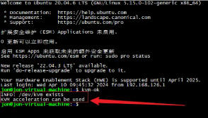

## 2. Android 模拟器部署

本文采用 docker 方式部署，首先拉取一个镜像，官方提供很多种安卓版本，具体可以访问 Github 查看：https://github.com/budtmo/docker-android，理论上版本越高运行的开销会越大，所以本例以运行一个低版本的android 来演示，执行下面命令拉取一个 android 9.0 版本镜像。

```shell
sudo docker pull budtmo/docker-android:emulator_9.0
```

拉取后开始运行容器，下面命令指运行一台 Samsung Galaxy S7 的安卓设备，其他机型可以去看一下官方教程，对外访问端口是`6080`

```shell
docker run -d -p 6080:6080 -e EMULATOR_DEVICE="Samsung Galaxy S7" -e WEB_VNC=true --device /dev/kvm --name android-container budtmo/docker-android:emulator_9.0
```

运行后，输入 sudo docker ps 可以看到运行的容器，UP 状态表示正常

运行后，在浏览器访问 Linux ubuntu 6080 端口，即可成功看到 android 模拟器界面，首次启动可能会比较慢，如果觉得卡，可以部署更低的机型，如 S6，本地测试访问成功后，下面我们安装 cpolar 内网穿透，实现远程访问

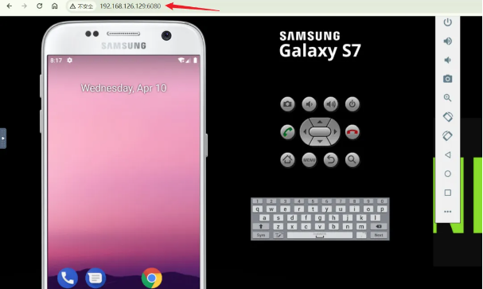

## 3. Ubuntu 安装 Cpolar

上面在本地 Docker 中成功部署了 Android 模拟器，并局域网访问成功，下面我们在 Linux 安装 Cpolar 内网穿透工具，通过 Cpolar 转发本地端口映射的 http 公网地址，我们可以很容易实现远程访问，而无需自己注册域名购买云服务器.下面是安装 cpolar 步骤

> cpolar 官网地址: https://www.cpolar.com

- 使用一键脚本安装命令

```shell
curl -L https://www.cpolar.com/static/downloads/install-release-cpolar.sh | sudo bash
```

- 安装完成后，可以通过如下方式来操作 cpolar 服务，首先执行加入系统服务设置开机启动，然后再启动服务

```shell
# 加入系统服务设置开机启动
sudo systemctl enable cpolar

# 启动cpolar服务
sudo systemctl start cpolar

# 重启cpolar服务
sudo systemctl restart cpolar

# 查看cpolar服务状态
sudo systemctl status cpolar

# 停止cpolar服务
sudo systemctl stop cpolar
```

Cpolar 安装和成功启动服务后，内部或外部浏览器上通过局域网 IP 加 9200 端口即:【http://192.168.xxx.xxx:9200】访问Cpolar管理界面，使用Cpolar官网注册的账号登录，登录后即可看到cpolar web 配置界面，接下来在 web 界面配置即可

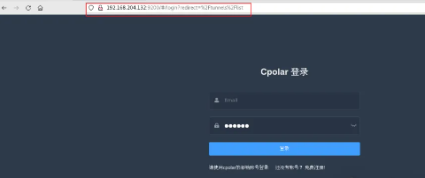

## 4. 配置公网地址

点击左侧仪表盘的隧道管理——创建隧道，创建一个 android 模拟器的公网 http 地址隧道!

- 隧道名称：可自定义命名，注意不要与已有的隧道名称重复
- 协议：选择 http
- 本地地址：6080(docker 部署后对外访问的端口)
- 域名类型：免费选择随机域名
- 地区：选择 China vip

点击`创建`

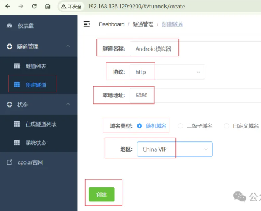

隧道创建成功后，点击左侧的状态——在线隧道列表，查看所生成的公网访问地址，有两种访问方式，一种是 http 和 https，两种都可以访问，下面选择其中一种进行远程访问

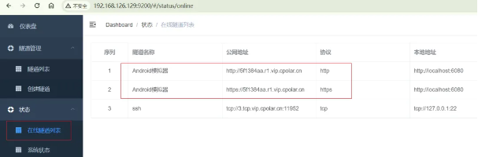

## 5. 远程访问

使用上面 Cpolar 生成的 https 公网地址，在任意设备的浏览器进行访问，即可成功看到我们 Android 模拟器，简单几步即可实现无需云服务器，无需公网 IP 实现远程访问.

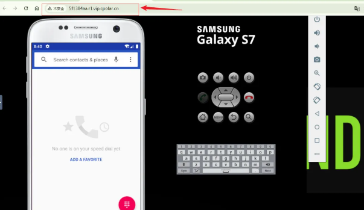

#### 小结

为了更好地演示，我们在前述过程中使用了 cpolar 生成的隧道，其公网地址是随机生成的。

这种随机地址的优势在于建立速度快，可以立即使用。然而，它的缺点是网址由随机字符生成，不太容易记忆（例如：3ad5da5.r10.cpolar.top）。另外，这个地址在 24 小时内会发生随机变化，更适合于临时使用。

我一般会使用固定二级子域名，原因是我希望将网址发送给同事或客户时，它是一个固定、易记的公网地址（例如：android.cpolar.cn），这样更显正式，便于流交协作。

## 6. 固定 Cpolar 公网地址

由于以上使用 cpolar 所创建的隧道使用的是随机公网地址，24 小时内会随机变化，不利于长期远程访问。因此我们可以为其配置二级子域名，该地址为固定地址，不会随机变化【ps：cpolar.cn 已备案】

> 注意需要将 cpolar 套餐升级至基础套餐或以上，且每个套餐对应的带宽不一样。【cpolar.cn 已备案】

登录 cpolar 官网，点击左侧的预留，选择保留二级子域名，设置一个二级子域名名称，点击保留，保留成功后复制保留的二级子域名名称

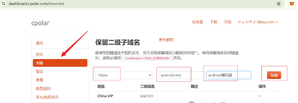

保留成功后复制保留成功的二级子域名的名称

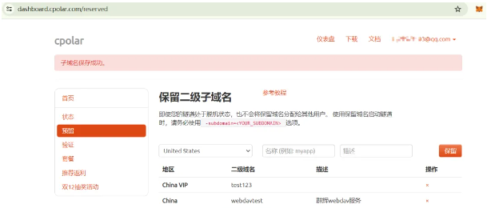

返回登录 cpolar web UI 管理界面，点击左侧仪表盘的隧道管理——隧道列表，找到所要配置的隧道，点击右侧的编辑

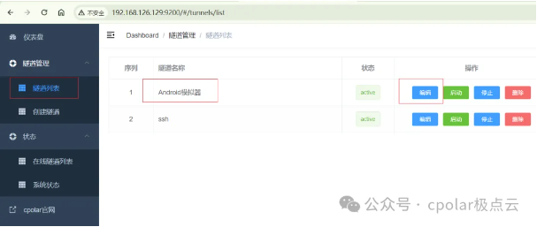

修改隧道信息，将保留成功的二级子域名配置到隧道中

- 域名类型：选择二级子域名
- Sub Domain：填写保留成功的二级子域名

点击`更新`(注意，点击一次更新即可，不需要重复提交)

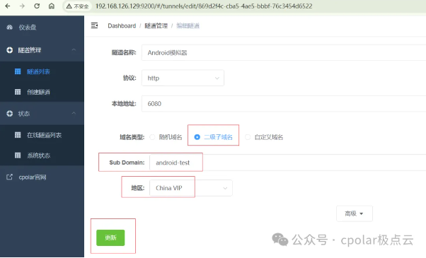

更新完成后，打开在线隧道列表，此时可以看到公网地址已经发生变化，地址二级名称变成了我们自己设置的二级子域名名称

## 7. 固定地址访问

最后，我们使用固定的公网 https 地址访问，可以看到同样访问成功，这样一个固定且永久不变的公网地址就设置好了，随时随地都可以远程访问本地 android 模拟器，无需公网 IP，无需云服务器

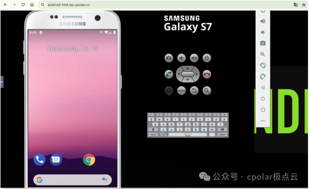

## Docker 镜像列表

```bash
Android API Image with latest release version Image with specific release version
9.0 28 budtmo/docker-android:emulator_9.0 budtmo/docker-android:emulator_9.0_<release_version>
10.0 29 budtmo/docker-android:emulator_10.0 budtmo/docker-android:emulator_10.0_<release_version>
11.0 30 budtmo/docker-android:emulator_11.0 budtmo/docker-android:emulator_11.0_<release_version>
12.0 32 budtmo/docker-android:emulator_12.0 budtmo/docker-android:emulator_12.0_<release_version>
13.0 33 budtmo/docker-android:emulator_13.0 budtmo/docker-android:emulator_13.0_<release_version>
14.0 34 budtmo/docker-android:emulator_14.0 budtmo/docker-android:emulator_14.0_<release_version>
- - budtmo/docker-android:genymotion budtmo/docker-android:genymotion_<release_version>
```

## 支持的机型及安卓版本

```bash
Phone Samsung Galaxy S10
Phone Samsung Galaxy S9
Phone Samsung Galaxy S8
Phone Samsung Galaxy S7 Edge
Phone Samsung Galaxy S7
Phone Samsung Galaxy S6
Phone Nexus 4
Phone Nexus 5
Phone Nexus One
Phone Nexus S
```

### 首先要保证你的机器支持 KVM 虚拟化

```bash
# 创建三星S10手机
docker run -d -p 6008:6008 -e EMULATOR_DEVICE="Samsung Galaxy S10" -e WEB_VNC=true -e WEB_VNC_PORT=6008 --device /dev/kvm --name android budtmo/docker-android:emulator_11.

# 创建三星S6手机
docker run --privileged -d -p 6080:6080 -p 5554:5554 -p 5555:5555 -e DEVICE="Samsung Galaxy S6" --name android-container budtmo/docker-android-x86-8.1
```

浏览器中访问你的`http://ip:6080`，稍后即可看到独属于你自己的云手机

## 关于安卓设置成中文

#### 方法一：

你可以再安装的时候自定义 language 信息

#### 方法二：

进入手机后上滑找到 setting 软件->找到 System 设置->点击 Languages & input->点击 Languages（下面有个 English(United States 那个)）->Add a language->右上角搜索 chinese->点击 简体中文 中国->右侧三个杠将 简体中文（中国） 拖动到 English 上

# Docker 使用两个开源项目搭建专属云手机，打造个人社群

## 系统介绍

云手机（Cloudphone）是一种深度结合了网络服务的智能手机，其原理是将云计算技术运用于网络终端服务，并通过云服务器实现云服务的手机。

云手机的原理主要基于云计算和虚拟化技术。具体来说，它涉及以下几个核心方面：

1. **云服务器**：云手机的核心是云服务器，这些服务器提供了高性能的计算和存储资源。华为云等云服务提供商为云手机提供了这样的服务，确保了高可用性、弹性伸缩性和高安全性。这些服务器不仅为云手机提供了运行环境，还负责处理云手机上的所有数据和操作。
2. **数据存储与处理**：用户的手机数据，包括应用程序、文件、照片等，都被存储在云端。当用户通过手机或其他终端访问云手机时，所有的数据处理和操作都是在云端完成的。这意味着，用户实际上是在操作一个运行在云端的虚拟手机，而不是本地的实体手机。
3. **远程管理与控制**：用户可以通过云终端或命令行界面对云手机进行远程控制，包括开关机、重启、备份、恢复等操作。此外，用户还可以通过云端应用程序对云手机进行管理和控制，例如查看文件、发送消息、通话等。这种远程管理和控制的能力使得云手机可以在任何时间、任何地点被访问和使用。
4. **虚拟化技术**：虚拟化技术是云手机得以实现的关键。通过虚拟化技术，云服务器可以创建多个虚拟手机环境，每个环境都相互独立，但又共享同一套物理资源。这使得多个用户可以同时使用云手机，而无需担心资源冲突或数据安全问题。

## 开源项目

云手机可以采用 Docker 搭建，目前开源的云手机项目分别有 docker-android 和 redroid-doc，两者的 GitHub 地址如下：

> docker-android
>
> https://github.com/budtmo/docker-android

> redroid-doc
>
> https://github.com/remote-android/redroid-doc

### 搭建方案 1

使用项目 docker-android 搭建云手机，需要服务器支持虚拟化，以 Windows 为例，在本地安装虚拟机软件 VMware Workstation，并创建虚拟机 Ubuntu，并且设置虚拟机的虚拟化技术，如图所示

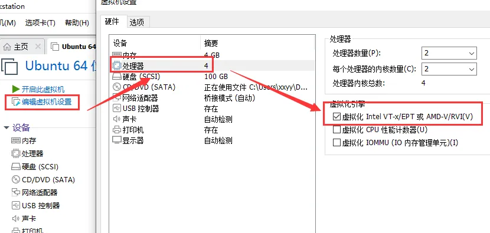

进入虚拟机 Ubuntu，分别输入以下指令检查虚拟化是否启用：

```bash
sudo apt install cpu-checker
sudo kvm-ok
```

下一步通过 Docker 创建云手机，指令如下：

```bash
sudo docker run -d -p 6080:6080 \
   -e EMULATOR_DEVICE="Samsung Galaxy S10" \   -e WEB_VNC=true --device /dev/kvm \   --name android-container budtmo/docker-android:emulator_11.0
```

当指令执行完成后，在浏览器访问 ip:6080 即可。

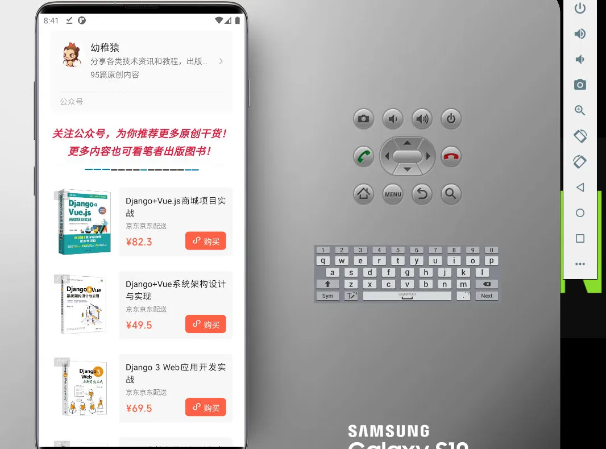

### 搭建方案 2

使用项目 redroid-doc 搭建云手机需要安装所需的内核模块，在建虚拟机 Ubuntu 执行以下指令：

```bash
# 切换root账号sudo su# 安装内核模块
apt install linux-modules-extra-`uname -r`
modprobe binder_linux devices="binder,hwbinder,vndbinder"
modprobe ashmem_linux
```

下一步通过 Docker 创建云手机，指令如下：

```bash
sudo docker run -itd --rm --privileged \
    --pull always \
    -v ~/data:/data \
    -p 5555:5555 \
    redroid/redroid:11.0.0-latest
```

指令执行完成后，我们需要借助 Scrcpy 工具连接云手机，详细安装教程可以参考以下文章

> 安装 Scrcpy
>
> 大中小黄，公众号：幼稚猿[一款开源安卓投屏软件，沉浸式刷视频玩游戏](http://mp.weixin.qq.com/s?__biz=Mzk0MzYyMzExMQ==&mid=2247484255&idx=1&sn=d76f77d017204c689036ea90d8a676e1&chksm=c3305df7f447d4e14f851076b8f91fba17c4001f447118d50ece562e46e813e8d524d99b1f31#rd)

Scrcpy 安装后，打开终端窗口，并将终端窗口路径切换到 Scrcpy 所在目录，输入以下指令即可连接云手机：

```bash
# 通过adb连接虚拟机Ubuntu的IP:5555
adb connect IP:5555
# scrcpy连接虚拟机Ubuntu的IP:5555
scrcpy -s IP:5555
```

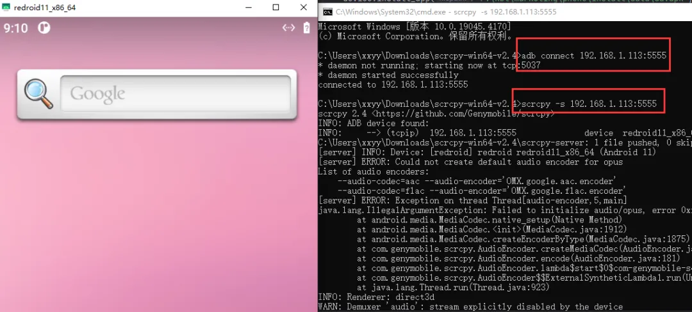

## 总结

从使用体验来说，docker-android 界面和初始化软件较为全面，但使用上有点卡顿，而 redroid-doc 界面较为简洁，但使用上相对流畅
