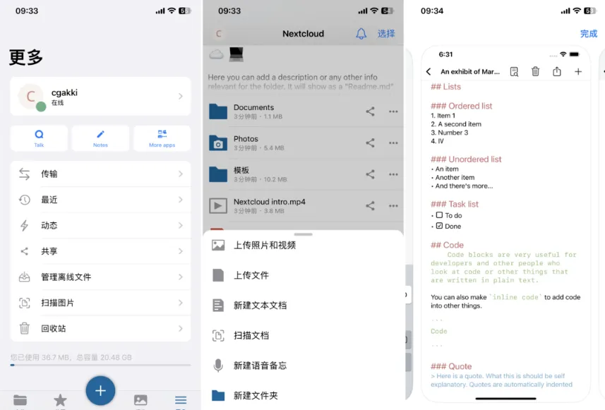
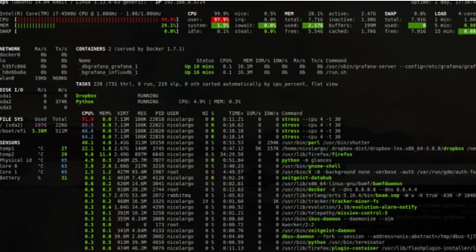

# 在线学习Docker平台

## 项目地址

GitHub：https://github.com/linuxserver/docker-webtop

## 项目简介

> Play-with-Docker 是一款基于云端的 Docker 浏览器 IDE，它提供了一个完整的 Docker 开发环境。

## 功能

```
一个免费的 Alpine Linux 虚拟机
Docker 命令行工具
Docker Compose 文件编辑器
实时日志查看器
文件浏览器
```

## 部署安装

### 安装Docker

```
curl -sSL https://get.docker.com/ | sh
```

### 安装Docker-compose

```
下载 Docker-Compose 二进制包
curl -L https://github.com/docker/compose/releases/download/v2.2.2/docker-compose-linux-x86_64 -o /usr/local/bin/docker-compose

给文件增加执行权限
chmod +x /usr/local/bin/docker-compose

检查 Docker-Compose 版本
docker-compose -v
```

### Docker运行服务

```bash
# 克隆本地存储库
git clone https://github.com/play-with-docker/play-with-docker
cd play-with-docker

# 确认 Docker 守护程序正在运行
docker run hello-world

# 加载 IPVS 内核模块。因为swarm是在dind中创建的，
# 守护程序不会自动加载它
sudo modprobe xt_ipvs

# 确保 Docker 守护程序以集群模式运行
docker swarm init

# 获取最新的franela/dind镜像
docker pull franela/dind

# 可选（使用go1.14）：将模块要求预取到vendor中
# 以便容器内部不需要进行网络请求。
# 模块缓存被保留在pwd和l2容器中，因此
# 如果省略此步骤，则下载只需一次
go mod vendor

# 启动PWD作为容器
docker-compose up
```

## Web访问

```
http://ip
```

## Demo访问

https://labs.play-with-docker.com/

点击上图的"ADD NEW INSTANCE"来添加一个新的实例，会自动创建一个沙箱环境的虚拟机，这个虚拟机已经准备好了Docker环境，可以直接操作。

# NAS 自托管应用服务 APP 端

常有朋友问某些项目有没有 APP，或者有没有好用的自托管服务带有 APP 的。

确实，很多时候自托管项目都是以 web 的形式进行的，但并不是每个人都能一直看着电脑，移动 app 很大程度上可以扩宽项目的使用范围和频率。

我花了几天时间，在前辈的经验上，部署并梳理出来**20 款与 NAS 自托管应用关联性强的 app**，这些 app 的功能强大而实用，一起折腾吧~

🌟Plex/Jellyfin/Emby 的 APP 这里就不介绍了，大家都很熟悉。

---

## 一、MT Photos

🔻MT-Photos 称之为国内最强相册管理软件不为过，免费使用 1 个月，永久版售价 99 元。

该软件最能打的地方就在于 Clip 适配，通过中文关键词进行检索，准确率高，响应速度快，在体验感上完爆其它相册软件。

唯一的缺点应该就是不开源，担心项目组跑路导致无法登录系统的因素最大。


## 二、Immich

🔻 个人觉得是开源相册软件中完整度、成熟度最高的项目，对比 Photoprism，拥有多平台客户端、Clip、自动备份等功能，应有尽有。

缺点就是没有中文，对亚洲人脸的识别力度感觉不是特别好，Clip 需要自己调教一下。


---

## 三、PhotoSync

🔻 相册自动同步工具，收费项目，自动同步功能需要开通月票。

该项目除了传统的 webdav、移动端、pc 端等同步方式外，支持 photoprism 同步，支持各类数码相机同步，应该是照片同步软件中最成熟的了。

缺点还是收费，但是好在价格并不高，可以接受。


---

## 四、Infuse

🔻 移动端的播放好工具，拥有自动刮削功能。支持连接 plex、emby、jellyfin 等成熟的媒体服务端，也支持各类云盘。

缺点是收费过高，永久版需要 680 多的样子（要买建议土区），大部分人会选择海鲜市场碰运气。


---

## 五、VidHub

🔻 该项目最早应用于 macos 系统，用户体验一流，APP 端支持 smb、webdav、alist 等多种文件传输模式，目前已正式上架 appstore，后续可能会收费。

支持各类云盘，支持自动刮削。而且很有特色的是连接 emby、jellyfin、plex 等项目后，是单独的页面，与文件共享形成的媒体库互不冲突，这一点加上公益服的画可以产生很棒的分类效果。


---

## 六、音流

🔻 最强移动端音乐播放器，颜值高、操作简易、功能完整。pro 版本需要收费。

支持 Navidrome、Jellyfin、Emby、DS audio、Subsonic 等服务端，补足了 Navidrome 在移动端体验不好的最后 100 米。


---

## 七、Audiobookshelf

🔻 有声书自托管项目 Audiobookshelf 的官方 APP，IOS 需要通过 TestFlight 下载，安卓版可以在网页下载。

体验感和网页一致，收听效果同步，体验感还是不错的。


---

## 八、Bark

🔻 大名鼎鼎的 bark，IOS 端的消息通知 app，功能强大，提供了很多 API 接口供开源项目使用，最常使用的 webhook 服务。


---

## 九、Gotify

🔻 同样是消息通知类 APP，安卓端专用，功能和 bark 基本上是一致的，还有网页端通知。

APP 端一般都只是接受消息用，配置等还在 web 端使用。


---

## 十、Bitwarden

🔻 自托管密码管理软件客户端，兼容 Bitwarden 和 Vaultwarden 的服务端，在 WEB、手机上都是同步的，和手机、浏览器自带密码管理形成有效的互补。


---

## 十一、Home Assistant

🔻 开源智能家居管理项目一哥，手机端功能和网页版基本一致，可以用手机添加、查看设备，查看电量使用等。


---

## 十二、可达阅读器

🔻 漫画阅读器，支持读取 webdav、smb、云盘进行查看，可以自动查找局域网内设备连接，支持本地传输、wifi 传输，体验感还是不错的。

内置了一些画质增强服务，并且可以预设不同漫画格式分类，在阅读体验上会有所区别。


---

## 十三、Nextcloud

🔻 完整、专业的私有云解决方案，支持团队使用，支持不同用户区分存储管理，包括文件、相册等。功能成熟、强大，对于个人来说则不太实用。

nextcloud 官方还带有一款 note 工具，可以通过内置服务打开。



---

## 十四、NasCab

🔻 简单存粹的一款轻 NAS 工具，winNAS 的好伙伴，也支持 docker 部署。

支持照片、文件、音乐、影视管理，但是刮削能服务需要开通会员。自带 DDNS 和内网穿透，DDNS 也需要会员才可以使用。

整体来说是一款比较良心的轻 NAS 服务，安装部署简单，很适合想体验 nas 的新手把玩一下。


---

## 十五、NeoServer

🔻 完全免费的服务器/容器管理软件，支持服务器面板、明细展示。

支持容器管理，SSH 管理，文件管理等。软件界面也很简洁、美观。


---

## 十六、Transmission

🔻 一款种子管理软件，支持 qbitorrent、transmission 的管理，pro 版本大概 38 左右。

目前市面上比较美观的一款种子管理 app，有 macos 版本。可以比较轻松的筛选出需要的种子进行分类、处理。


---

## 十七、RustDest

🔻 自托管的远程桌面软件，相比于向日葵、teamviwer 等传统项目，支持自托管只需一台中继服务器就可以跑满全部流量。


---

## 十八、Moe Memos

🔻 闪记工具 Memos 的第三方客户端，支持 IOS、安卓。

唯一的缺点就是需要 https 才可以使用，部署起来会稍微麻烦一些。


---

## 十九、为知笔记

🔻 曾经大名鼎鼎的为知笔记自托管版本，支持各种各样的笔记风格，自托管版本完全免费。


---

## 二十、派派助手

🔻 群晖 NAS 的三方管理软件，支持 IOS 和安卓客户端，只有收费去广告，其它功能完全免费。相比较于官方版本将很多层级提前，用户体验还是不错的。


---

## 最后

🔶 除了以上 app 外，各大 NAS 原厂也有很多原生 app。比如群晖的 DS 系列，威联通的 QXX 系列，铁威马的 TNAS mobie3，极空间、绿联、万由等也都有自己的官方 APP。

虽然各大原生 APP 在用户体验上各有不同，功能模块也不一定完整，但是都胜在原厂支持，功能稳定。

# Portainer：将 Docker、Docker-compose、Kubernetes 三者统一管理的平台

[快速搭建一款轻量级的 Docker 可视化管理系统 (qq.com)](https://mp.weixin.qq.com/s/wFhELyQYoVmflWhUUI8rww)

自 2013 年发布以来，Docker 获得了广泛的关注和应用。在过去的近十年中，Docker 也逐渐改变了软件开发和部署的方式，至今采用容器已经成为很多企业软件标准的规范之一。从单机的 Docker，到单机编排的 Docker-compose，再到集群编排调度的 Docker-Swarm 和 Kubernetes，在这十年中容器的技术也发生了很多的变化，随着 Docker-Swarm 的落败，Kubernetes 成为容器编排标准。结合企业自身业务，很多企业目前面向不同的场景对容器的使用大概分为以下三种场景：

- **Docker 独立使用:**主要用于创建和管理单个容器。对于单个应用和测试应用部署非常便捷高效。
- **Docker-compose 服务模式：**主要用于创建和管理多容器应用，可以轻松地启动、停止、重新部署整个服务。
- **Kubernetes 集群调度：**用于管理和调度编排容器，更适合需要高度自动化和大规模容器管理和复杂应用的部署和管理。

由此可见，无论单机 Docker 还是服务编排 Docker-compose，还是集群调度编排的 Kubernetes，在企业里面有着相应的应用场景，几种部署模式并存。那么随之而来的一个问题就是，企业如何统一管理零散这些环境。所以，今天给大家介绍一个能够统一管理这些的平台-Portainer。

## portainer 介绍

一句话介绍 Portainer：能够将 Docker，Docker-compose，Kubernetes 统一管理的平台，通过简单易用的 UI 界面，消除使用 CLI、编写 YAML 的复杂性。

### 🏠 项目信息

```
#Github地址
https://github.com/portainer/portainer
#官网地址
https://www.portainer.io/
```

### 🚀 功能特性

- 提供直观界面使用 Docker 的全部功能，可以构建、发布和部署容器映像、管理网络和卷，以及配置跨集群的扩展。支持通过 RBAC、注册表管理和外部身份验证支持等功能。
- 直观的 Kubernetes 管理平台界面，允许管理员快速管理和维护集群，支持管理集群的服务帐户、角色和角色绑定，以及集群角色和集群角色绑定，而无需退出命令行。

### 🛠 系统架构

Portainer 由两个部分组成：Portainer Server 和 Portainer Agent。Portainer Agent 部署到集需要管理的每个节点，并在 Portainer Server 中配置需要纳管环境的 Agent 连接信息。


## portainer 安装

### Server 端安装

首先，创建 Portainer Server 存储数据卷：

```
docker volume create portainer_data
```

然后，下载并运行 Portainer Server 容器：

```
docker run -d -p 8000:8000 -p 9443:9443 --name portainer --restart=always -v /var/run/docker.sock:/var/run/docker.sock -v portainer_data:/data portainer/portainer-ce:latest
```

最后，通过运行 docker ps 命令来检查 Portainer Server 容器是否已启动：

```
root@server:~# docker ps
CONTAINER ID   IMAGE                          COMMAND                  CREATED       STATUS      PORTS                                                                                  NAMES
de5b28eb2fa9   portainer/portainer-ce:latest  "/portainer"             2 weeks ago   Up 9 days   0.0.0.0:8000->8000/tcp, :::8000->8000/tcp, 0.0.0.0:9443->9443/tcp, :::9443->9443/tcp   portainer
```

启动完成后，通过打开浏览器访问 https://localhost:9443 登录，并进行初始化创建账号：


### Agent 端安装

Portainer Agent 安装到需要纳管的 Docker 主机或者 Kubernetes 集群中。在界面选择创建环境：


选择需要添加的平台类型（灰色无法选择的为企业版本，我们不用管）：


### 一、Docker 主机接入管理：

在需要纳管的主机上运行以下命令：

```
docker run -d \  -p 9001:9001 \  --name portainer_agent \  --restart=always \  -v /var/run/docker.sock:/var/run/docker.sock \  -v /var/lib/docker/volumes:/var/lib/docker/volumes \  portainer/agent:2.19.4
```

部署后，将主机信息填入下图中：


填入后，即可对这台 Docker 主机进行管理：


### 二、Kubernetes 集群接入管理：

在需要纳管的 K8S 集群中，选择 NodePort 或者 load balancer 方式暴露端口，通过 Kubectl 上运行以下的命令：

```
#采用NodePort方式
kubectl apply -f https://downloads.portainer.io/ce2-19/portainer-agent-k8s-nodeport.yaml
```

部署后，将集群信息填入下图中：


填入后，即可对接入的 K8S 集群进行管理：


## 最后

Portainer 作为是一个可视化的 Docker 和 K8S 操作界面，功能非常全面，比如支持通过模板快速部署应用、容器镜像网络数据卷的基本操作、事件日志收集、集群和 SVC 等集中管理和操作、统一仓库管理、登录用户管理和权限控制等功能。这边就不进行一一说明和展示了，基本能满足中小型企业对容器和 k8s 管理的全部需求。唯一遗憾的是官方没有提供中文界面，但是有大神提供了中文部署版本的镜像。

# 国产全中文的 Docker 可视化管理面板『FAST OS DOCKER』——Portainer 的平替

之前一直都在给新手小白推荐 Docker 可视化管理工具『Portainer』，作为一款可在 NAS 中运行的轻量级的应用，它提供了图形化界面，用于方便地管理 Docker 环境，让我们免去了命令行部署 Docker 容器的麻烦，非常适合我们这样的小白用户上手。


Portainer 说实话啥都好，就是这么多年了一直没有原生的支持中文，谁说国内大佬有汉化版，但是在某些细节上汉化的并不完整。虽说不影响使用，但是对于强迫症来说可能就有点难受了。

今天给小伙伴们分享一款来自于国人大佬开发的另一款 Docker 的图形化管理工具『FAST OS DOCKER』，100%原生中文支持，拥有 Portainer80%的功能，并且界面个人觉得更简洁好看，更适合国人审美。

## 关于 FAST OS DOCKER

👉**简介：**

FAST OS DOCKER（简称“fast”）和 Portainer 一样，是一款 Docker 的图形化管理工具，可以为用户提供 docker 总览、本地容器管理、远程镜像拉取、服务器磁盘映射、服务器网络管理等功能，基本能满足中小型单位对容器管理的全部需求。

**👉 功能与亮点：**

- 无需复杂的命令，全图形化操作，基本上只需要懂一点点的 Docker 常识就能轻松构建 docker 容器；
- FAST OS DOCKER 界面直观简洁，对应的功能也是一目了然，那怕是新手小白也能快速上手；
- FAST OS DOCKER 的后端语言是 GO，前端框架是 VUE，并且拥有全面的权限管理机制，安全性极高；
- 为防止服务器负载过高，进行了底层性能优化，比较适合 NAS 这种入门级服务器部署安装；
- 为方便用户安装，集成了 docker 镜像应用市场，可以直接快速安装和部署。

**👉 镜像：**


🔺 镜像地址：https://hub.docker.com/r/wangbinxingkong/fast

这个也是该容器的原作者发布地址，上次更新还是两个月前，不过看页面描述这个项目可能撑不下去了，至于我们能用多久还未知。不管怎么样，原作者是真正的用爱发电，在此对原作者的无私奉献表示感谢！

这里顺便的说一下，目前 dockerhub 官网因为某些原因已经打不开了，但是并不影响镜像的拉取，所以 docker run 命令还是可以正常使用的。

## FAST OS DOCKER 的部署和安装

今天使用的安装方式还是 SSH 终端部署，非常适合群晖威联通或者华硕这种传统的 NAS。至于 SSH 工具请自行解决，Putty，XShell，FinalShell 等都可以，我个人使用的是 FinalShell。


🔺 在正式部署之前我们还是新建一个文件夹用于存放 FAST OS DOCKER 容器的数据。在威联通的 Container 文件夹（威联通默认的 docker 文件夹）下面新建一个“fast”文件夹。


🔺 然后使用 SSH 连接工具连接到 NAS 之后先改用管理员模式登录，输入命令“ **sudo -i** ”回车，提示输入密码，密码就是我们 NAS 的登录密码，输入的时候不会有显示，输入完成后直接点回车即可。


🔺 威联通用户还需要在出现上图界面的时候输入“Q”和“Y”。


🔺 接着直接输入 FAST OS DOCKER 容器的 docker run 部署命令：

> docker run --name fastos --restart always -p 8081:8081 -p 8082:8082 -e TZ="Asia/Shanghai" -d -v /var/run/docker.sock:/var/run/docker.sock -v /etc/docker/:/etc/docker/ -v /root/data:/fast/data -e FAST_STORE=http://8.210.124.47:8080 wangbinxingkong/fast:latest

需要注意的是：

- -p 后面的主机端口（冒号前面的）请自行决定是否修改，不要和本地其它容器端口重复，需要说明的是 8081 端口对应的是 fast 网页端的打开端口；
- -v /etc/docker/:/etc/docker/和 -v /root/data:/fast/data 两个冒号前面的路径修改成前面我们新建的“fast”文件夹的真实路径（请仔细观察我图片中的修改）


🔺 回到威联通的 Container Station 可以看到 fast 已经部署成功。

## FAST OS DOCKER 的使用展示

安装完成后在浏览器访问【NAS 本地 IP 地址:端口号 】即可打开 fast 的 web 页面，端口号是前面部署命令中 8081 对应的端口。


🔺 首次登录需要输入用户名和密码。默认账号和密码分别为：admin/888888。


🔺 打开之后就能看到主界面，看着是否有点小清新的感觉？界面语言默认就是中文，首先展示的便是总览页面，可以查看硬件配置，docker 文件安装根目录，服务器系统，容器数量，镜像数量，数据卷，网络环境等配置。


🔺 容器页面，和 Portainer 一样可以进行停止，重启，恢复，删除等一系列操作；当然也可以在这里选择创建容器。


🔺 创建容器的页面，设计风格和 Portainer 也类似，但是看起来更舒服一些。


🔺 镜像页面，有简单模式和高级模式，输入镜像名称就可以直接进行拉取，这个没什么好说的，基本操作。


🔺 数据卷页面，可以设置数据卷或添加数据卷。


🔺 进入网络页面，可以设置网络或添加网段。


🔺 最有意思的是它自带一个应用市场，里面有一些常用的 docker 项目。不过遗憾的是目前它就只有这 8 个，显得有些鸡肋~。


🔺 我们试着在它的应用市场搭建一个 Docker 容器吧，比如前几天分享的 NAS 上的导航页『Heimdall』，点开安装之后再点击“编辑”。


🔺 然后再容器编辑页面根据自己的需求更改配置。我更改的地方就上面三个地方，完成之后点击“确定”。


🔺 回到这个页面，点击“运行”。


🔺 创建容器中。


🔺 创建完成！


🔺 顺利打开，说明创建的 Docker 容器没有问题！整个过程我就在容器页面设置了一下，剩下的点点鼠标就完成了部署，确实非常简单。

通过我这几天的使用，FAST OS DOCKER 给我的映像还是不错的。总体而言，它的操作逻辑和 Portainer 几乎完全一样，并且兼顾了 Portainer 的大部分功能。相比 Portainer，因为它是国人开发，在界面上更适合国人使用。要说我个人日常使用区别，就是它目前不支持 Portainer 的堆栈功能，也就是不支持 docker - compose，其实这个对于很多普通玩家并不是刚需对吧？所以说我还是很推荐新手朋友试试这个容器，真的还不错~

# Dockge：美观易用的 Docker Compose 管理工具

不知道大家有没有发现，我平时介绍项目的安装方法时，通常都会使用 Docker 或 Docker Compse。通过容器来部署无疑是最简单的，不过随着调研的项目越来越多，也暴露了管理不便的问题。如果你也遇到了类似的麻烦，不妨试试这款管理工具吧。

## 1. 项目介绍

[Dockge](https://github.com/louislam/dockge) 是一个美观、易用的 Docker Compose 管理平台。该项目提供了一个 Web 界面，用于管理 docker-compose.yaml 文件，支持交互式编辑 compose.yaml 文件、更新、启动、停止、重启、删除等操作。本文将介绍 Dockge 的安装和使用方法。

## 2. 下载安装

Dockge 推荐使用 Docker Compose 来安装。安装好 Docker (20+) 后，运行以下命令来启动服务：

```bash
# 创建并进入目录
mkdir -p /opt/stacks /opt/dockge
cd /opt/dockge

# 下载 compose.yaml
curl https://raw.githubusercontent.com/louislam/dockge/master/compose.yaml --output compose.yaml

# 启动服务
docker compose up -d
```

服务启动后，在浏览器中输入 `http://<your-ip>:5001` 来访问。

## 3. 使用说明

本章将介绍 Dockge 的基本用法，包含：

> 1. 创建账号
> 2. 新建 Compose

### 3.1 创建账号

### 初次使用需要创建一个管理员账号：


创建完成后，就可以登录 dockge 了，其界面如下：


### 3.2 新建 Compose

接下来，我打算新建一个站点监控应用：Uptime Kuma。

要新建 Compose，只需点击左上角的 + Compose 按钮，把 docker-compose.yaml 的内容复制到文本框即可。

不过在[旧文](http://mp.weixin.qq.com/s?__biz=MzAwNzkxMjc1Ng==&mid=2247485139&idx=1&sn=8a895b79144ad868c8fbe4b745b97244&chksm=9b77aa88ac00239eaff49a2906a1e1182cfa14594ee03a8618012d6ccc1c49a6e236814cd1dd&scene=21#wechat_redirect)中，我是用 Docker 启动的应用，这里就选择将其转为 Compse 格式：


转为 Compose 格式后，填写堆栈名称，然后部署：


部署期间可以看到拉取镜像的进度以及容器启动的日志：


点击容器组右侧的 >\_Bash 按钮，可以直接进入容器内部：


现在试试访问 Uptime Kuma，页面显示正常：


之后就可以通过 Dockge 页面来管理 Uptime Kuma 应用，包括更新、重启以及删除。

## 4. 写在最后

Dockge 作为一款可视化容器管理工具，界面美观，易于使用，给我的体验非常好。但作为用户，我们也需要明确 Dockge 其实管理的是 Docker Compose，因此其功能也是有限的。

# amprobe：开源可视化 Docker 容器管理工具

## 项目地址

GitHub：https://github.com/amuluze/amprobe

## 项目简介

> Docker 容器监控与控制面板项目。

## 功能

```bash
监控 CPU、内存、磁盘、网络
监控Docker容器状态、CPU、内存
查看 Docker 日志，支持日志下载
管理员用户提供简单的 Docker 容器、镜像运维操作
操作日志记录
```

## 部署安装

### 安装 Docker

```bash
curl -sSL https://get.docker.com/ | sh
```

### 安装 Docker-compose

```bash
下载 Docker-Compose 二进制包
curl -L https://github.com/docker/compose/releases/download/v2.2.2/docker-compose-linux-x86_64 -o /usr/local/bin/docker-compose

给文件增加执行权限
chmod +x /usr/local/bin/docker-compose

检查 Docker-Compose 版本
docker-compose -v
```

### 配置内容

#### init.yaml

```bash
users:
  - username: cgakki  # 管理员，拥有启停容器的权限，非管理员则没有
    password: 666666
    status: 1
    is_admin: 1
  - username: amprobe
    password: 666666
    status: 1
    is_admin: 0
```

#### config.toml

```bash
[Fiber]
# http监听地址
Host = "0.0.0.0"
# http监听端口
Port = 8000
# http优雅关闭等待超时时长(单位秒)
ShutdownTimeout = 30
SeverHeader = "probe"
AppName = "probe"
Prefork = false

# 数据库文件存放位置的配置
# 需要监控的磁盘设备配置
# 定时任务执行间隔配置
[Gorm]
# 是否开启调试模式
Debug = true
# 数据库类型(目前支持的数据库类型：postgres)
DBType = "sqlite"
# 设置连接可以重用的最长时间(单位：秒)
MaxLifetime = 7200
# 设置数据库的最大打开连接数
MaxOpenConns = 150
# 设置空闲连接池中的最大连接数
MaxIdleConns = 50
# 数据库表名前缀
TablePrefix = "s_"
# 是否启用自动映射数据库表结构
EnableAutoMigrate = true

[DB]
# 连接地址
Host = ""
# 连接端口
Port = ""
# 用户名
User = ""
# 密码
Password = ""
# 数据库
DBName = "/app/probe"
# SSL模式
SSLMode = ""

[Disk]
# 主机监控数据的采集频率
Devices = ["vda1", "vda2", "vda3"]

[Ethernet]
# 需要监控的网口，可以通过 ifconfig 命令查看
Names = ["eth0"]

[Task]
# 定时任务采样间隔，单位 s
Interval = 60

[Logger]
File = "/app/probe.log"
Level = "debug"
RotationTime = "1"  # 每天切分一个日志文件
MaxAge = "7"        # 最多保留 7 天的日志

[Auth]
# 是否启用
Enable = true
# 签名方式(支持：HS512/HS384/HS512)
SigningMethod = "HS512"
# 签名key
SigningKey = "amprobe"
# 过期时间（单位秒）
Expired = 7200
# key 前缀
Prefix = "auth_"

[InitData]
Enable = true
InitConfigFile = "/app/configs/init.yaml"
```

#### nginx.conf

```bash
worker_processes  1;
daemon off;

error_log  /var/log/nginx/error.log warn;
pid        /var/run/nginx.pid;

events {
    worker_connections  1024;
}

http {
    include       /etc/nginx/mime.types;
    default_type  application/octet-stream;

    sendfile        on;
    keepalive_timeout  65;

    server {
        listen       80;  # 可修改为实际需要使用的端口
        # server_name  amprobe.amuluze.com; # 服务器地址或绑定域名

        location / {
            root   /usr/share/nginx/html;
            index  index.html index.htm;
            try_files $uri $uri/ /index.html;
        }

        location /api/ {
            rewrite ^/api/(.*)$ /$1 break;
            proxy_pass http://127.0.0.1:8000/; #跨域转发路由地址
            proxy_redirect off;
            proxy_set_header Host $host;
            proxy_set_header X-Real-IP $remote_addr;
            proxy_set_header X-Forwarded-For $proxy_add_x_forwarded_for;
        }

        location /ws/ {
            # rewrite ^/wsUrl/(.*)$ /$1 break; #拦截标识去除
            proxy_pass http://127.0.0.1:8000/ws/;

            proxy_http_version 1.1;

            proxy_set_header Upgrade $http_upgrade;
            proxy_set_header Connection "upgrade";
        }

        # 错误页配置
        error_page   500 502 503 504  /50x.html;
        location = /50x.html {
            root   /usr/share/nginx/html;
        }
    }
}
```

### Docker-compose 运行服务

```bash
vim docker-compose.yml

version: '3'
services:
  amprobe:
    image: amuluze/amprobe:v1.3.3
    container_name: amprobe
    network_mode: "host"
    restart: always
    volumes:
      - /var/run/docker.sock:/var/run/docker.sock
      - /proc:/host/proc:ro
      - /sys:/host/sys:ro
      - /dev:/host/dev:ro
      - ./config.toml:/app/configs/config.toml
      - ./init.yaml:/app/configs/init.yaml
      - ./nginx.conf:/etc/nginx/nginx.conf


docker-compose up -d
```

## Demo 访问

```bash
http://ip
```

# DockerUI：Docker 可视化管理工具

## 参考文档

gohutool/docker.ui

GitHub 地址：https://github.com/gohutool/docker.ui

joinsunsoft/docker.ui - Docker Image | Docker Hub

地址：https://hub.docker.com/r/joinsunsoft/docker.ui

## 什么是 DockerUI ？

> `DockerUI` 是一款开源的、强大的、轻量级的 `Docker` 管理工具。`DockerUI` 覆盖了 `docker cli` 命令行 `95%` 以上的命令功能，通过可视化的 `Web` 界面操作，可以非常方便、轻松进行 `docker` 环境和 `docker swarm` 集群环境的管理和维护功能，方便不熟悉 `docker` 指令的用户更快地进入 `docker` 世界。

这是国内一家公司开发的，原生的中文界面，对国内用户比较友好，如果用不惯 `Portainer` 可以试试这款

## 安装

与容器相关的应用，都需要绑定挂载 `/var/run/docker.sock` ，包括我们之前安装的 `portainer`、`watchtower`，`Glances`，`Netdata` 等。

### 什么是 `/var/run/docker.sock` ?

> `/var/run/docker.sock` 是 `Docker API` 的主要入口，简单地说，它是 `Docker` 守护进程（`Docker daemon`）默认监听的 `Unix` 域套接字（`Unix domain socket`），容器中的进程可以通过它与 `Docker` 守护进程进行通信。

但是群晖的 `Docker` 管理器并不支持挂载 `/var/run/docker.sock` 文件，所以这次我们需用命令行来安装

### docker cli 安装

在群晖上以 Docker 方式安装。

> 本文写作时， `latest` 版本对应为 `1.0.1`；


如果你熟悉命令行，可能用 `docker cli` 更快捷

```
# 运行容器
docker run -d \
   --restart unless-stopped \
   --name docker.ui \
   -p 8999:8999 \
   -v /var/run/docker.sock:/var/run/docker.sock \
   joinsunsoft/docker.ui
```

### docker-compose 安装

也可以用 `docker-compose` 安装，将下面的内容保存为 `docker-compose.yml` 文件

```
version: "3"

services:
  dockge:
    image: joinsunsoft/docker.ui
    container_name: dockerui
    restart: unless-stopped
    ports:
      - 8999:8999
    volumes:
      - /var/run/docker.sock:/var/run/docker.sock
```

然后执行下面的命令

```
# 新建文件夹 docker.ui
mkdir -p /volume1/docker/docker.ui

# 进入 docker.ui 目录
cd /volume1/docker/docker.ui

# 将 docker-compose.yml 放入当前目录

# 一键启动
docker-compose up -d
```

## 运行

在浏览器中输入 `http://群晖IP:8999` 就能看到登录界面

默认的用户名：`ginghan` ，密码：`123456`

## 遇到的问题

### 卡在首界面

第一次运行时，卡在这个界面


从日志看，显示了下面的错误

```bash
docker.ui | 2023/12/14 09:13:09 33.289 #0000000600000002 - 172.30.0.2:8999<->192.168.0.197:41652 - GET http://192.168.0.197:8999/html/index - cannot open file "/app/./html/html/index": open /app/./html/html/index: no such file or directory
```

重装后未再复现，原因不明

### 载入容器慢

加载镜像和数据卷很快，但是加载容器就特别慢


就算老苏的容器多（其实也就 `46` 个，在运行的只有 `36` 个），也不需要加载个几分钟吧，看来还是有很大的改进空间的


# Dozzle：简化容器监控和调试的日志查看工具

> Dozzle是由Docker OSS赞助的开源项目，它是一个日志查看工具，旨在简化容器的监控和调试过程。

作为一个轻量级的基于Web的应用程序，Dozzle通过直观的用户界面提供实时的日志流式传输、过滤和搜索功能。用户可以快速方便地访问其Docker容器生成的日志，使其成为在Docker环境中进行调试和故障排除的重要工具。

Dozzle支持智能着色的JSON日志，并且易于安装和配置，使其成为开发人员和系统管理员寻找高效且用户友好的日志查看工具的理想选择。该工具以MIT许可证发布，并由其开发者Amir Raminfar积极维护。

## 功能特点

1. 实时日志流式传输：Dozzle提供了实时的日志流式传输功能，可以即时查看最新的日志输出，帮助开发人员监控应用程序的运行状态。
2. 日志过滤：Dozzle支持灵活的日志过滤功能，允许开发人员根据关键字、时间范围或其他自定义条件来筛选日志条目，使其能够专注于与问题相关的日志。
3. 日志搜索：Dozzle提供了方便的日志搜索功能，开发人员可以使用关键字快速定位特定的日志条目，无需手动浏览整个日志文件。
4. 支持JSON日志：Dozzle对JSON格式的日志提供了支持，能够正确解析和显示JSON日志内容，使开发人员更方便地分析和理解日志。
5. 智能着色：Dozzle具有智能的颜色编码功能，可以根据日志内容的类型或重要性，以不同的颜色区分和突出显示日志条目，提供更直观的日志分析体验。
6. 简单安装和配置：Dozzle的安装和配置非常简单，可以轻松集成到现有的Docker环境中，并通过一些简单的配置选项进行个性化设置。
7. 轻量级且易于使用：Dozzle是一个轻量级的日志查看工具，具有直观的用户界面，使开发人员和系统管理员能够快速访问和分析容器生成的日志，无需复杂的操作和学习曲线。
8. MIT许可证：Dozzle以MIT许可证发布，这意味着它是开源的，用户可以自由地使用、修改和分发该工具。

## 搭建使用

使用docker-compose可以快速的运行并使用此工具：

```yaml
version: "3"
services:
  dozzle:
    container_name: dozzle
    image: amir20/dozzle:latest
    volumes:
      - /var/run/docker.sock:/var/run/docker.sock
    ports:
      - 9999:8080
```


# Dashy：强大又炫酷的个人面板

## 系统介绍

Dashy是一个用于创建个人仪表板或导航页面的工具，允许用户将多个网站或服务整合到一个简洁的界面中，方便快速访问。

### | 功能特点

- 📃 支持多页面
- 🚦 每个应用程序/链接的实时状态监控
- 📊 使用小部件显示来自自托管服务的信息和动态内容
- 🔎 按名称、域名或标签进行即时搜索 + 可自定义的热键和键盘快捷键
- 🎨 许多内置颜色主题，带有 UI 颜色编辑器并支持自定义 CSS
- 🧸 许多图标选项 - Font-Awesome、homelab 图标、自动获取 Favicon、图像、表情符号等。
- 💂 具有多用户访问、可配置权限和 SSO 支持的可选身份验证
- 🌎 多语言支持，包括 10 多种人工翻译语言
- ☁ 提供可选的、加密的、免费的异地云备份和恢复功能
- 💼 工作区视图，可同时在多个应用程序之间轻松切换
- 🛩️ 最小视图，用作快速加载的浏览器起始页
- 🖱️ 选择应用程序启动方式：新选项卡、同一选项卡、剪贴板、弹出模式或在工作区视图中打开
- 📏 可定制的布局、大小、文本、组件可见性、排序顺序、行为等。
- 🖼️ 全屏背景图像、自定义导航栏链接、HTML、标题等选项。
- 🚀 使用 Docker、裸机或一键式云部署即可轻松设置
- ⚙️ 基于 YAML 的简单单文件配置，以及通过 UI 配置应用程序的选项
- ✨ 正在积极开发中，定期添加改进和新功能
- 🤏 小捆绑包大小、完全响应式 UI 和用于基本离线访问的 PWA
- 🆓 100% 免费和开源
- 🔐 高度重视隐私


如需了解更多信息，可以访问其官方网站或查阅相关的技术文档。

> Docker镜像
>
> https://hub.docker.com/r/lissy93/dashy

> 官方GitHub
>
> https://github.com/Lissy93/dashy

> 官方网站
>
> https://dashy.to/

> 官方文档
>
> https://dashy.to/docs/

> 官方Demo
>
> https://demo.dashy.to/


## 搭建教程

本文通过Docker的方式来部署项目，以Ubuntu为例，操作步骤：安装Docker、启动容器运行镜像。

### | 第一步安装docker

```
sudo apt update
sudo apt install -y docker.io
```

### | 第二步启动容器运行镜像

```
sudo docker run -p 8080:8080 lissy93/dashy
```

### | 或者

```
sudo docker run -d \
  -p 8080:8080 \
  -v /home/conf.yml:/app/user-data/conf.yml \
  --name my-dashboard \
  --restart=always \
  lissy93/dashy:latest
```

指令执行完成后，容器指定8080端口访问的，因此还需要在服务器的防火墙上打开相应的端口，在浏览器访问IP:8080即可。


# 跨平台系统监控工具：监视由 Docker 和 LXC 等系统管理的多个容器

开源地址：https://github.com/nicolargo/glances

### 工具介绍

> Glances 是一款开源的跨平台监控工具, Glances 提供实时监控能力，覆盖了各种系统参数，包括 CPU 使用率、内存消耗、磁盘活动和网络利用率。用户可以查看运行中的进程、已登录用户、硬件指标（如温度、电压和风扇转速），确保对系统性能有全面的了解。

Glances 的一大亮点是其支持容器监控功能，使其能够监视由 Docker 和 LXC 等系统管理的多个容器。该工具的仪表板提供用户友好的界面，方便用户一目了然地进行系统分析，同时还支持通过 Web 界面或命令行界面进行远程监控。

> Glances 在客户端/服务器模式下运行，通过终端访问、Web 界面交互或 API 集成（XML-RPC 和 RESTful），为远程监控提供了多种途径。为了备份和分析数据，Glances 允许将统计信息导出至各种格式，如文件、外部数据库、CSV 文件，甚至直接输出到命令行供即时使用。




### 功能特点


- 1.**实时监控**: Glances 支持实时监控系统各方面的性能指标，如 CPU 利用率、内存消耗、磁盘活动和网络使用情况。
- 2.**全面信息**: 用户可以查看运行中的进程、已登录用户以及硬件信息（如温度、电压和风扇转速）等细节。
- 3.**容器监控**: 支持监控容器化工作负载，适配多种容器管理系统，如 Docker 和 LXC。
- 4.**易于安装和使用**: Glances 易于安装，并且用户可以根据自身需求定制仪表板，展示感兴趣的信息。
- 5.**远程监控**: 支持通过终端、Web 界面或 API 进行远程监控，提供方便的监控解决方案。
- 6.**可扩展性**: 由 Python 编写，采用开放架构，开发者可以添加新插件或导出模块，扩展 Glances 的功能。
- 7.**数据导出**: 支持将统计信息导出至文件、外部数据库、CSV 文件或 STDOUT，方便数据备份和分析。

### 可展示的信息

- CPU（中央处理器）监控
- 内存监控
- 系统负载监控
- 进程列表
- 网络接口监控
- 磁盘 I/O 监控
- IRQ / Raid 监控
- 传感器监控
- 文件系统（及文件夹）监控
- 容器监控（支持 Docker 和 Podman）
- 监视器
- 警报功能
- 系统信息显示
- 运行时间监控
- 快速查看（CPU、内存、系统负载）

### 使用场景

> Glances 在各种场景下都能发挥作用，适用于具有不同监控需求的用户。从管理服务性能的系统管理员到希望优化个人计算机的个人用户，Glances 为所有用户提供了灵活和直观的解决方案。

负责管理复杂基础架构的系统管理员将喜欢 Glances 提供的统一视图，在集中仪表板上查看多个系统的能力。该工具对容器监控的支持为管理员提供了额外的洞察力，使其能够高效地跟踪容器化工作负载。

> 另一方面，个人用户可以从 Glances 的简单性和适应性中受益。通过自定义仪表板以显示用户感兴趣或故障排除需求相关的信息，用户可以专注于符合其偏好的关键指标，从而简化监控流程。

# Kubernetes Grafana看板


K8S Dashboard CN 20240513 StarsL.cn

Grafana看板ID: 13105 kubernetes资源全面展示！包含K8S整体资源总览、微服务资源明细、Pod资源明细及K8S网络带宽，优化重要指标展示。

### 截图

#### 整体资源总览


#### Pod资源明细


#### 微服务资源明细


**github仓库地址（部署与JOB配置说明）**
https://github.com/starsliao/Prometheus/tree/master/kubernetes

### kube-state-metrics部署说明：

- kube-state-metrics部署在ops-monit命名空间
- 选择适合K8S版本的kube-state-metrics,本仓库的kube-state-metrics镜像已经存放在阿里云.
- 1.24以下版本的K8S安装kube-state-metrics_v2.3.0的都没问题,版本较新的K8S可以安装新版的kube-state-metrics,参考官方说明.

```bash
kubectl create namespace ops-monit
cd kube-state-metrics_vXXX
kubectl apply -f .
```

### 适合本看板的Prometheus K8S JOB配置参考

- 说明: 本配置适合于Prometheus部署在K8S内的场景.
- **注意:关于节点名称的标签，因为`cadvisor`是使用`instance`，而`kube-state-metrics`是使用`node`；这样会导致节点信息表格中，没有统一的字段来连接各个查询，所以`cadvisor`的job下需要复制一个`node`标签。**

```bash
metric_relabel_configs:
- source_labels: [instance]
  separator: ;
  regex: (.+)
  target_label: node
  replacement: $1
  action: replace
```

- 以下是本看板必须的3个JOB配置
- `k8s-kubelet`和`k8s-cadvisor` JOB都是各节点的kubelet自带的指标.
- `kube-state-metrics` JOB是安装的`kube-state-metrics`的指标.

```dockerfile
  - job_name: 'k8s-kubelet'
    scheme: https
    tls_config:
      ca_file: /var/run/secrets/kubernetes.io/serviceaccount/ca.crt
    bearer_token_file: /var/run/secrets/kubernetes.io/serviceaccount/token
    kubernetes_sd_configs:
    - role: node
    relabel_configs:
    - target_label: __address__
      replacement: kubernetes.default.svc:443
    - source_labels: [__meta_kubernetes_node_name]
      regex: (.+)
      target_label: __metrics_path__
      replacement: /api/v1/nodes/${1}/proxy/metrics

  - job_name: 'k8s-cadvisor'
    scheme: https
    tls_config:
      ca_file: /var/run/secrets/kubernetes.io/serviceaccount/ca.crt
    bearer_token_file: /var/run/secrets/kubernetes.io/serviceaccount/token
    kubernetes_sd_configs:
    - role: node
    relabel_configs:
    - target_label: __address__
      replacement: kubernetes.default.svc:443
    - source_labels: [__meta_kubernetes_node_name]
      regex: (.+)
      target_label: __metrics_path__
      replacement: /api/v1/nodes/${1}/proxy/metrics/cadvisor
    metric_relabel_configs:
    - source_labels: [instance]
      separator: ;
      regex: (.+)
      target_label: node
      replacement: $1
      action: replace

  - job_name: kube-state-metrics
    kubernetes_sd_configs:
    - role: endpoints
      namespaces:
        names:
        - ops-monit
    relabel_configs:
    - source_labels: [__meta_kubernetes_service_label_app_kubernetes_io_name]
      regex: kube-state-metrics
      replacement: $1
      action: keep
```

# Docker容器命令行可视化工具

## 项目地址

GitHub：https://github.com/linuxserver/docker-webtop

## 项目简介

> Lazydocker是一款功能强大的Docker管理套件，专为懒人设计，旨在帮助用户轻松调试项目或服务。它提供了一键式操作，用户只需按下相应按键，即可实现相应功能。

## 功能

```
查看Docker或Docker-Compose容器环境的状态。

查看容器/服务日志，以便在出现问题时能够迅速定位和解决问题。

查看容器ASCII图，帮助用户更直观地了解容器的结构和关系。

定制图表以查看更详细的信息，满足用户的不同需求。

绑定容器/服务，实现容器之间的快速连接和通信。

重启/移除/重建容器或服务，简化项目管理流程。

查看给定镜像的父层，帮助用户了解镜像的构建历史和依赖关系。

修改占用磁盘空间的容器、镜像或卷，优化系统性能。
```

## 部署安装

### 安装Docker

```
curl -sSL https://get.docker.com/ | sh
```

### 安装Docker-compose

```
下载 Docker-Compose 二进制包
curl -L https://github.com/docker/compose/releases/download/v2.2.2/docker-compose-linux-x86_64 -o /usr/local/bin/docker-compose

给文件增加执行权限
chmod +x /usr/local/bin/docker-compose

检查 Docker-Compose 版本
docker-compose -v
```

### Docker运行服务

```
sudo docker run --rm -it -v \
    /var/run/docker.sock:/var/run/docker.sock \
    -v /home/data:/.config/jesseduffield/lazydocker \
    lazyteam/lazydocker
```

## 终端即可看到


