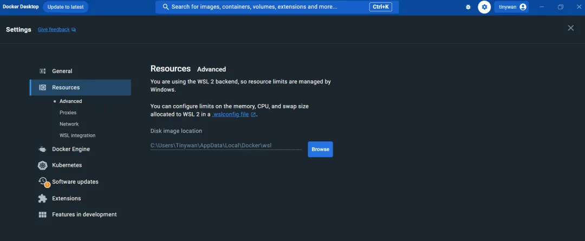
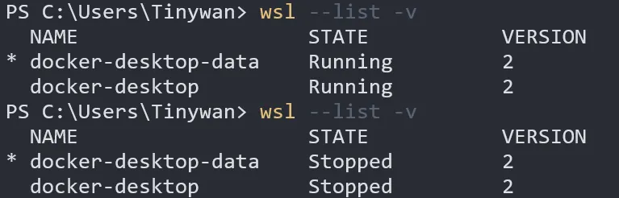
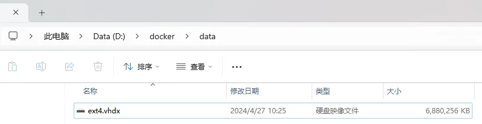
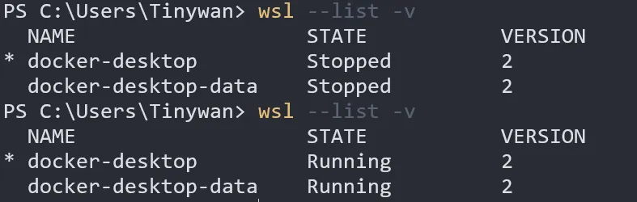
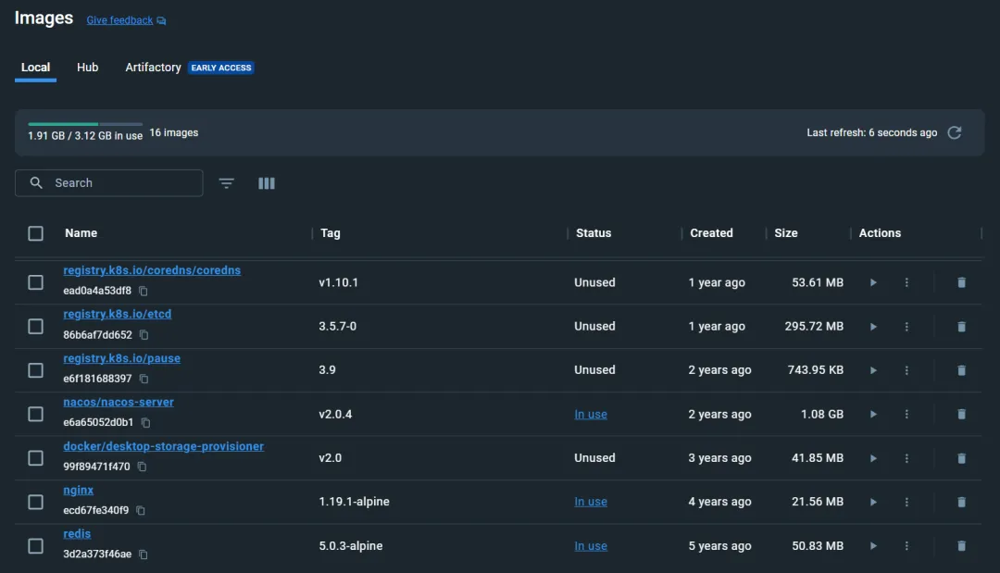
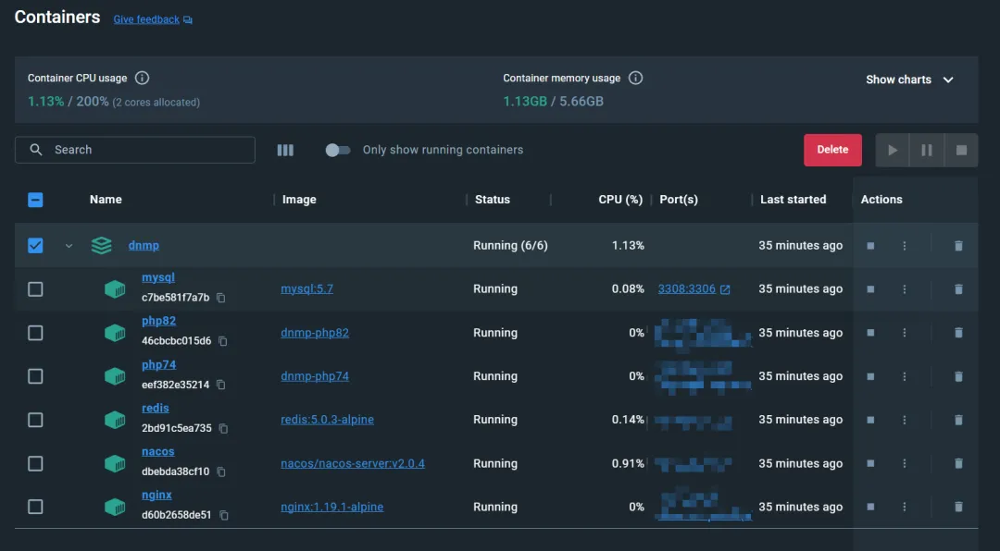

# 如何优雅的变更Docker-Desktop的镜像存储路径

## **概述**

Docker Desktop 默认将镜像文件存储在`C`盘，随着Docker的使用，镜像文件大小的不断增加，可能会导致C盘空间不足。为了解决这个问题，可以采取以下步骤更改Docker镜像的存储位置。

## **开始**

#### **0x01 找到docker文件存储位置**

打开docker desktop，进入到设置`resources` - `Advance`



在右侧可以看到当前Docker文件的存储位置，复制路径并打开，其中data文件夹内存放的是`docker-desktop-data`的存储数据

#### **0x02 导出 docker-desktop-data**

首先需要做的是停止Docker desktop应用进程，进程停止之后，使用`wsl --list -v`命令查看WSL中的运行的实例是否停止。



第一次执行为`Running`，在关闭之后状态变为`Stopped`。此时即可选择将实例导出，执行以下命令将实例导出。

执行命令行执行关闭WSL。

```
wsl --shutdown
```

开始导出

```
wsl --export docker-desktop-data D:docker\docker-desktop-data.tar
```

> `D:docker\docker-desktop-data.tar`为文件备份位置

#### **0x03 注销 docker-desktop-data**

使用以下命令将当前的WSL实例进行注销

```
wsl --unregister docker-desktop-data 
```


#### **0x04 导入 docker-desktop-data**

接下来便可以将备份文件导入到新的位置，使用以下命令

```
wsl --import docker-desktop-data D:docker\data D:docker\docker-desktop-data.tar --version 2
```

- `docker-desktop-data`为要导入的实例的名称，不可修改
- `D:docker\data` 新的位置要导入的文件夹
- `D:docker\docker-desktop-data.tar` 之前导出备份的实例

> 导入之后，进入资源管理器对应文件夹中，可观察到已经迁移成功



> 使用 `wsl --list -v` 查看当前的实例



> 启动 Docker desktop ，查看镜像容器是否正常启动

**镜像**



**容器**



## **小结**

通过以上步骤可以帮助用户将Docker镜像文件从C盘移动到其他磁盘，从而释放C盘空间，提高Docker的使用体验。