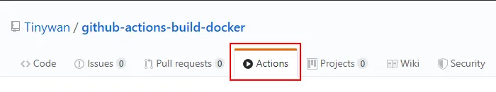
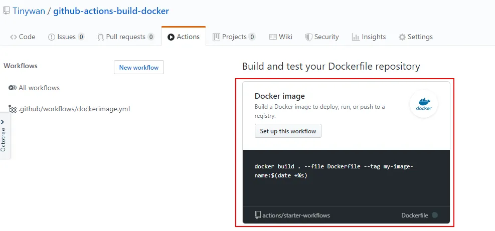
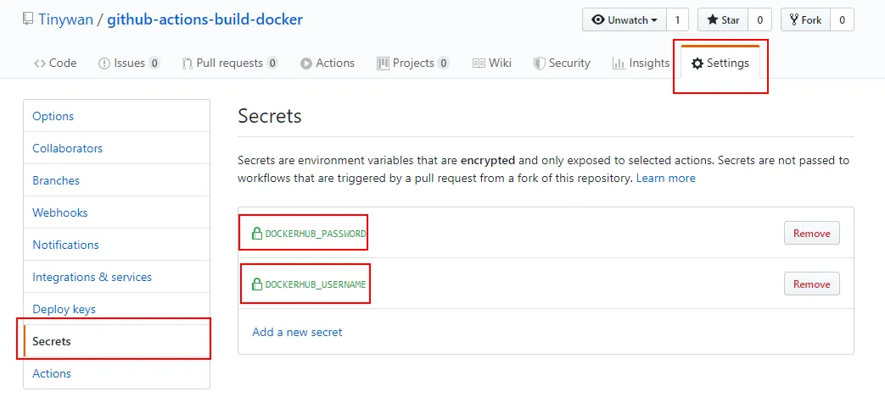
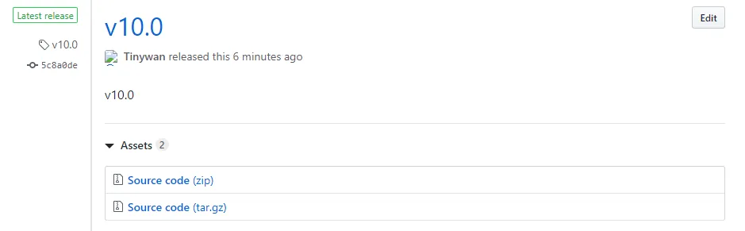
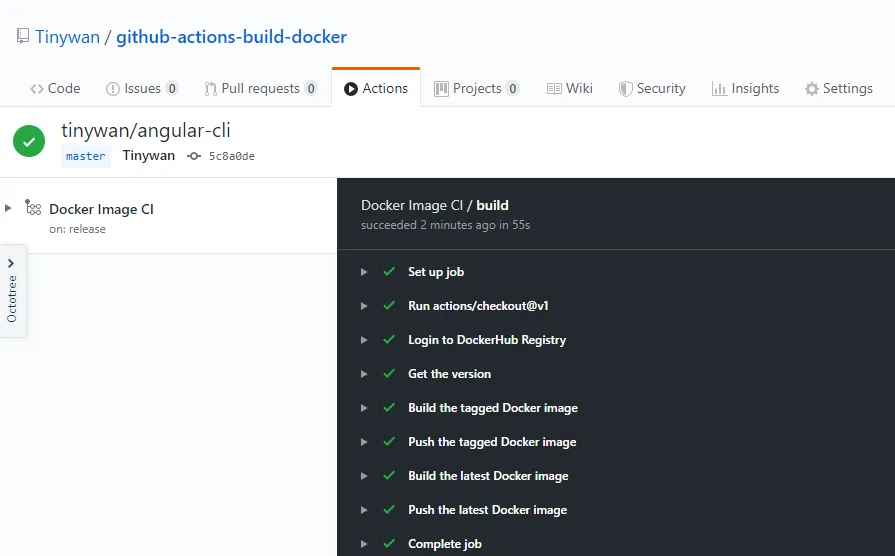
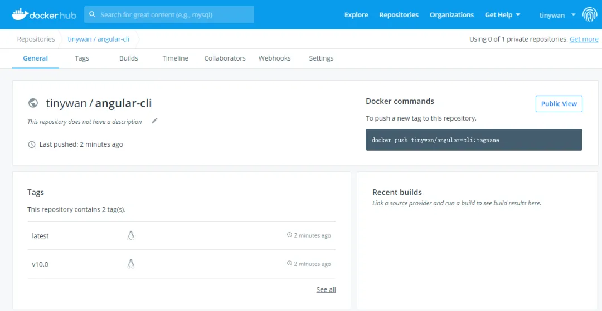

# 如何使用 GitHub Actions 构建 Docker 镜像

本文将帮助您使用GitHub操作设置一个工作流，该工作流将构建和标记Docker镜像并将其推送到Docker Hub注册表。

## **创建 GitHub Repo**

让我们从创建一个新的GitHub存储库开始，它将保存我们的代码（在我们的例子中，实际上只需要一个Dockerfile）来构建镜像。在GitHub中创建repo，并将其命名为您想要的任何名称。在repo的根目录中添加一个文件，名为Dockerfile。如果你沿着我，你将构建一个包含Angular CLI的镜像。如果你需要一个不同的镜像，那么修改以下内容以满足你的需求。Dockerfile的内容应该是：

```
# ./Dockerfile

FROM node:12-alpine as node-angular-cli

LABEL authors="Tinywan"

# Linux setup
# I got this from another, deprecated Angular CLI image.
# I trust that developer, so I continued to use this, but you
# can leave it out if you want.
RUN apk update \
  && apk add --update alpine-sdk \
  && apk del alpine-sdk \
  && rm -rf /tmp/* /var/cache/apk/* *.tar.gz ~/.npm \
  && npm cache verify \
  && sed -i -e "s/bin\/ash/bin\/sh/" /etc/passwd

# Angular CLI
RUN npm install -g @angular/cli@8
```

## **创建GitHub Action**

因此，要开始使用GitHub操作，请在GitHub中的repo页面上单击`Actions`选项卡：



您现在应该看到一个类似于以下内容的页面：



这一步将我们登录到Docker Hub Registry。我们输出密码，然后将其传递给docker login命令。不过，这里有一些新的东西，那就是我们正在使用的秘密。GitHub在每个存储库的设置中有一个部分，您可以在其中设置用于GitHub操作等的秘密。

这很棒，因为否则就没有办法登录到第三方服务，如Docker Hub，而不把你的密码或访问密钥放在仓库中，每个人都可以看到。要找到secrets，请单击存储库顶部的设置，然后单击左侧导航列表中的Secrets，然后添加您需要的secrets，在本例中是我们的Docker Hub用户名和密码：



## **标签和发布**

最后一步是在我们的GitHub存储库中标记一个版本。这将启动我们的工作流程的构建。要做到这一点，点击代码标签下的`releases`部分：



点击“Draft a new release”按钮。GitHub将引导您完成创建发布的步骤，但您应该选择标记名称和所需的发布提交。您还可以添加标题和说明。记住两件事：您在这里使用的标签名称将用作Docker镜像的标签名称，一旦您单击“发布版本”按钮，工作流将启动。一旦你准备好了，发布新版本！

## **查看工作流输出**

要查看工作流中发生的情况，并在需要时进行调试，请返回到存储库中的Actions选项卡。一旦你创建了一个动作，该页面将看起来像这样：



除了在Actions选项卡中输出您的工作流之外，不要忘记转到Docker Hub并在那里查看您的图像！

