# 开源Linux服务器运维面板1Panel构建PHP容器运行webman框架

## **1Panel 是什么？**

1Panel 是一个现代化、开源的 Linux 服务器运维管理面板。

> 官方地址：https://1panel.cn/

## **1Panel 安装部署**

> 官方安装文档：https://1panel.cn/docs/installation/online_installation/

```
curl -sSL https://resource.fit2cloud.com/1panel/package/quick_start.sh -o quick_start.sh && sudo bash quick_start.sh
```

> 安装日志

```
开始下载 1Panel v1.10.0-lts 版本在线安装包
安装包下载地址：https://resource.fit2cloud.com/1panel/package/stable/v1.10.0-lts/release/1panel-v1.10.0-lts-linux-amd64.tar.gz
  % Total    % Received % Xferd  Average Speed   Time    Time     Time  Current
                                 Dload  Upload   Total   Spent    Left  Speed
100 48.4M  100 48.4M    0     0  15.1M      0  0:00:03  0:00:03 --:--:-- 15.1M
1panel-v1.10.0-lts-linux-amd64/1panel.service
1panel-v1.10.0-lts-linux-amd64/1pctl
1panel-v1.10.0-lts-linux-amd64/LICENSE
1panel-v1.10.0-lts-linux-amd64/README.md
1panel-v1.10.0-lts-linux-amd64/install.sh
1panel-v1.10.0-lts-linux-amd64/1panel

 ██╗    ██████╗  █████╗ ███╗   ██╗███████╗██╗     
███║    ██╔══██╗██╔══██╗████╗  ██║██╔════╝██║     
╚██║    ██████╔╝███████║██╔██╗ ██║█████╗  ██║     
 ██║    ██╔═══╝ ██╔══██║██║╚██╗██║██╔══╝  ██║     
 ██║    ██║     ██║  ██║██║ ╚████║███████╗███████╗
 ╚═╝    ╚═╝     ╚═╝  ╚═╝╚═╝  ╚═══╝╚══════╝╚══════╝
[1Panel Log]: ======================= 开始安装 ======================= 
设置 1Panel 安装目录（默认为/opt）：
[1Panel Log]: 您选择的安装路径为 /opt 
[1Panel Log]: 检测到 Docker 已安装，跳过安装步骤 
[1Panel Log]: 启动 Docker  
[1Panel Log]: ... 在线安装 docker-compose 
  % Total    % Received % Xferd  Average Speed   Time    Time     Time  Current
                                 Dload  Upload   Total   Spent    Left  Speed
100 56.8M  100 56.8M    0     0  13.6M      0  0:00:04  0:00:04 --:--:-- 13.6M
[1Panel Log]: docker-compose 安装成功 
设置 1Panel 端口（默认为23181）：
[1Panel Log]: 您设置的端口为：23181 
[1Panel Log]: 防火墙开放 23181 端口 
Rules updated
Rules updated (v6)
Firewall not enabled (skipping reload)
设置 1Panel 面板用户（默认为a89a60f8e5）：Tinywan
[1Panel Log]: 您设置的面板用户为：Tinywan 
设置 1Panel 面板密码（默认为3308670920）：
[1Panel Log]: 配置 1Panel Service 
Created symlink /etc/systemd/system/multi-user.target.wants/1panel.service → /etc/systemd/system/1panel.service.
[1Panel Log]: 启动 1Panel 服务 
[1Panel Log]: 1Panel 服务启动成功! 
[1Panel Log]:  
[1Panel Log]: =================感谢您的耐心等待，安装已经完成================== 
[1Panel Log]:  
[1Panel Log]: 请用浏览器访问面板: 
[1Panel Log]: 外网地址: http://47.98.155.92:23181/078085a96e 
[1Panel Log]: 内网地址: http://172.21.162.179:23181/078085a96e 
[1Panel Log]: 面板用户: Tinywan 
[1Panel Log]: 面板密码: 3308670920 
[1Panel Log]:  
[1Panel Log]: 项目官网: https://1panel.cn 
[1Panel Log]: 项目文档: https://1panel.cn/docs 
[1Panel Log]: 代码仓库: https://github.com/1Panel-dev/1Panel 
[1Panel Log]:  
[1Panel Log]: 如果使用的是云服务器，请至安全组开放 23181 端口 
[1Panel Log]:  
[1Panel Log]: ================================================================
```

> 注意：这里是使用阿里云云服务器，所以需要安全组开放 `23181` 端口

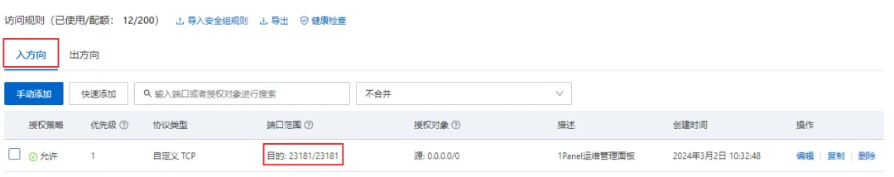

## 1Panel 访问

> 访问地址：`http://目标服务器 IP 地址:目标端口/安全入口`

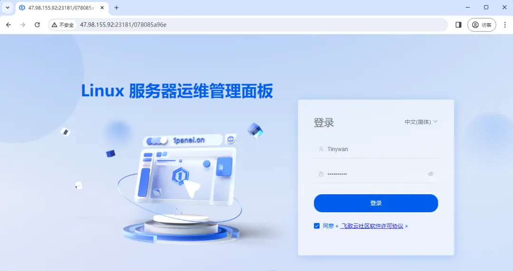

> 登录后效果

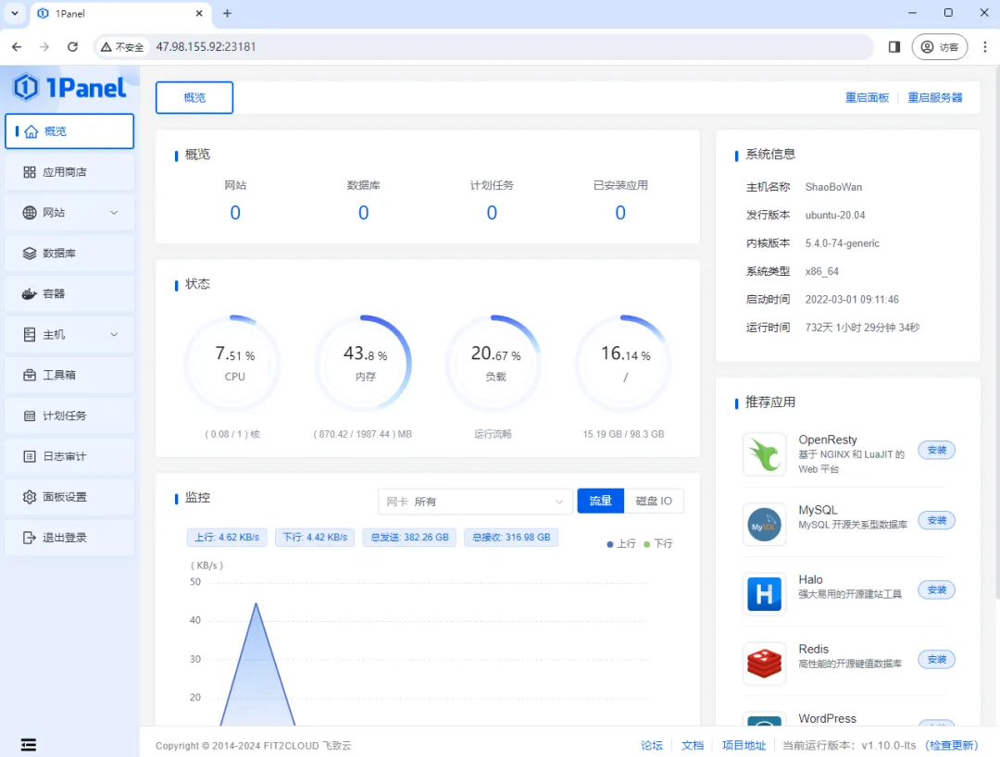

## **安装webman-admin**

这里使用【容器】安装

> 镜像仓库：https://github.com/Tinywan/docker-php-webman

### **1. 添加镜像仓库**

> 由于`php-webman`镜像在`Github`仓库，所以需要添加Github仓库

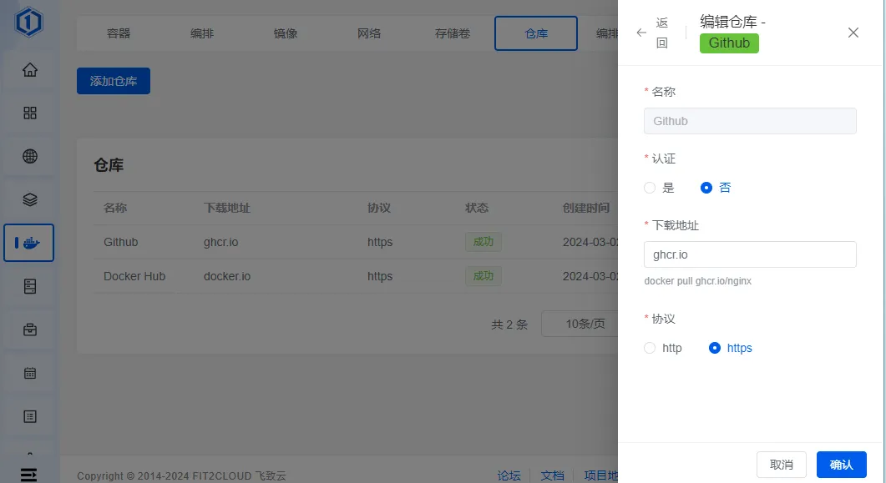

### **2. 拉取镜像**

> 注意：仓库名称选择`GithHub` 仓库。拉取镜像：`ghcr.io/tinywan/docker-php-webman:8.2.11`

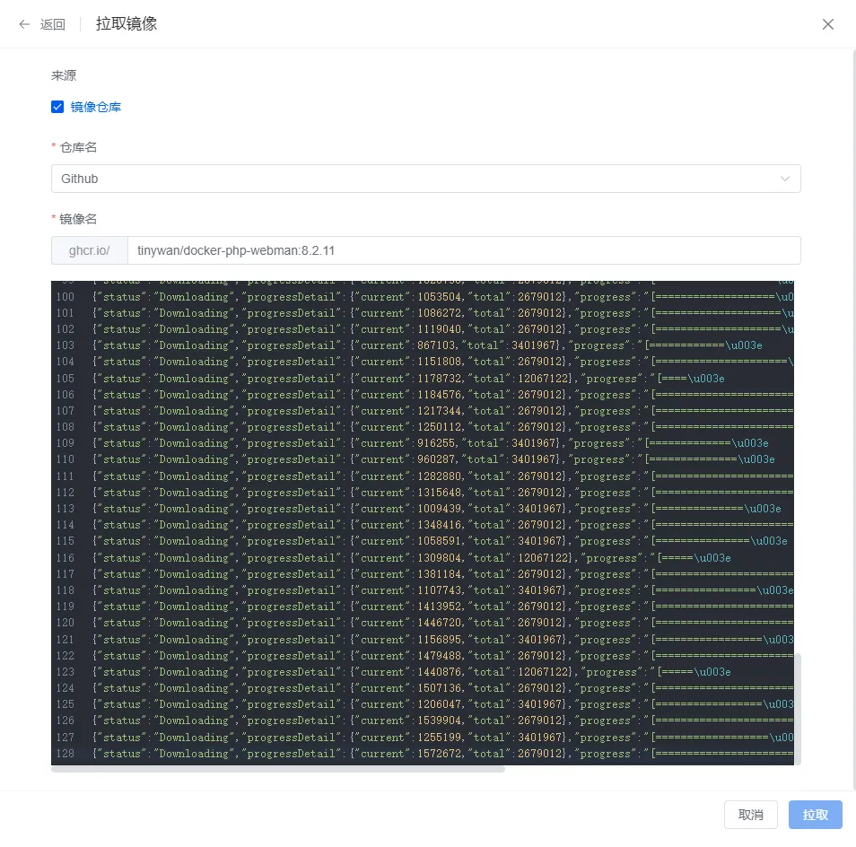

> 镜像拉取结果

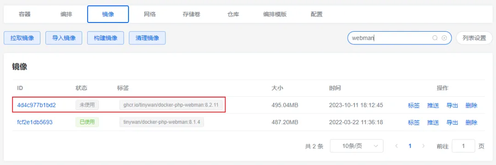

### **3. 创建容器**

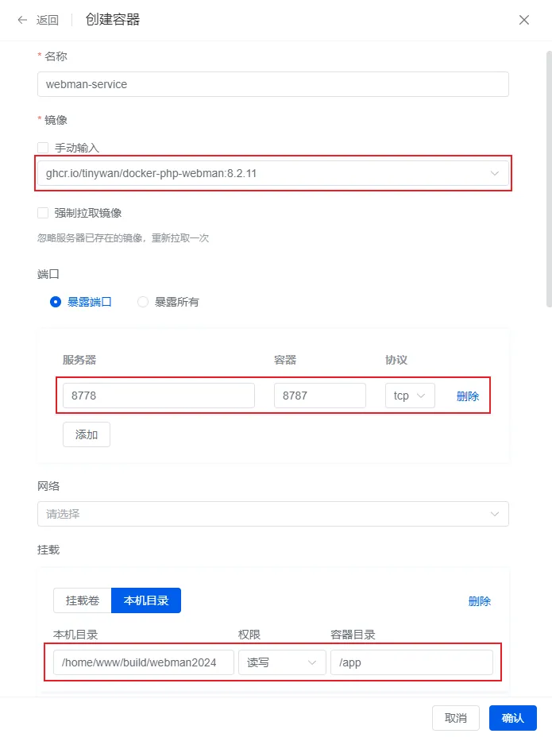

> 创建容器注意事项

- 容器名称：webman-service

- 容器镜像：选择 `ghcr.io/tinywan/docker-php-webman:8.2.11`

- 暴露端口：我这里由于宿主机`8787`被占用，所以用`8778`

- 挂载：选择【本机目录】

- - 本机目录：`/home/www/build/webman2024` 即webman项目目录
  - 容器目录：`/app`容器默认挂载目录

> 运行结果

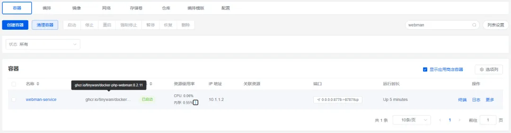

#### **日志**

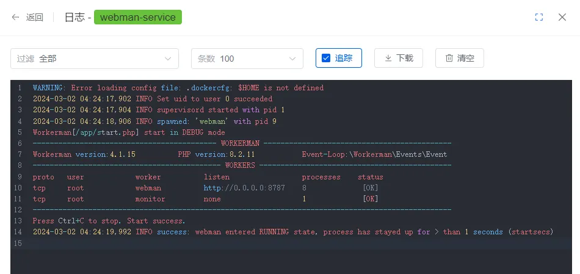

#### **终端**

> 进入`[终端]` 查看webman运行状态

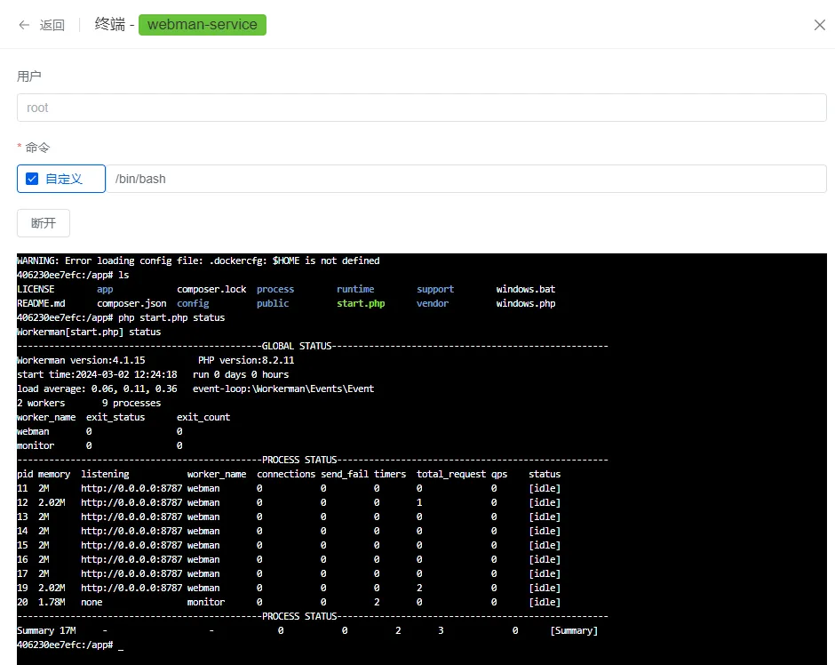

#### **监控**

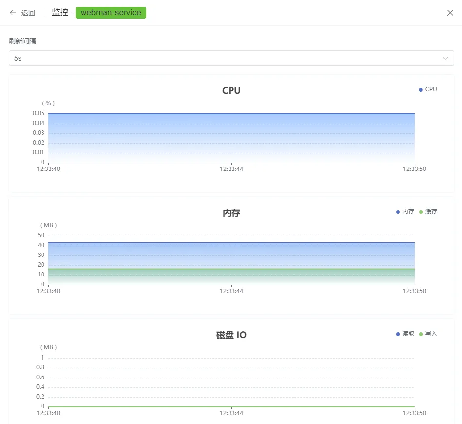

### **4. 访问服务**

> 注意：这里是使用阿里云云服务器，所以需要安全组开放 `8778` 端口


> 访问地址：http://47.98.155.92:8778

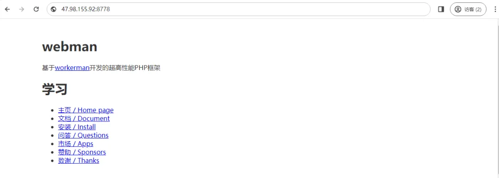

出现以上界面标识运行成功啦！