# 葫芦娃平台自动预约茅台

**前言**

之前有小伙伴想要一个能自动预约葫芦娃平台的软件，笔者也在网上找了一下，没有发现能直接用的，于是乎自己抽时间去了解相关技术，弄出了一个功能给大家分享一下。

**环境**

在搭建之前，我们需要准备好两个软件：

1. i 茅台自动申购预约软件：之前给大家分享过搭建的过程，详细参考 [i 茅台自动申购预约](http://mp.weixin.qq.com/s?__biz=MzUyNjkxNDQ5Nw==&mid=2247484602&idx=1&sn=65c356623c571252517006a0c9748e50&chksm=fa06c214cd714b02f17474ccaf40d7e6d26efaf9fe7a49dd912f3df48f76ecb070191fdb0088&scene=21#wechat_redirect) 。

2. 抓取微信小程序访问内容的软件：主要是用来获取葫芦娃平台的认证信息，如何抓包可以参考 [微信小程序抓包工具](http://mp.weixin.qq.com/s?__biz=MzUyNjkxNDQ5Nw==&mid=2247484717&idx=1&sn=fa2b798b5f1d04d54247419527374d2e&chksm=fa06c383cd714a952d03e4ff15f5d18736ad80bcab961aa2839919334f3e269650a156986c85&scene=21#wechat_redirect) 。

由于部署前边的两个软件需要一些动手能力，小伙伴们可以先往下看部署过程和功能使用，再根据个人需求决定是否行动起来。

**搭建**

 **升级 i 茅台自动预约申购**

本升级包是在 [i 茅台自动申购预约](http://mp.weixin.qq.com/s?__biz=MzUyNjkxNDQ5Nw==&mid=2247484602&idx=1&sn=65c356623c571252517006a0c9748e50&chksm=fa06c214cd714b02f17474ccaf40d7e6d26efaf9fe7a49dd912f3df48f76ecb070191fdb0088&scene=21#wechat_redirect) 这个软件的基础上增加的功能，笔者已经准备好了一个升级包进行升级。

功能没有在各种环境下测试验证，为了方便后续部署出现问题时能够更新升级包，小伙伴们通过关注笔者的公众号，并发送 **葫芦娃平台** 这五个字到公众号获取最新版本的升级包。

下载好升级包之后，上传到 i 茅台服务部署的目录，然后执行命令解压升级包

-

```
tar xvf maotai-upgrade-v1.0.tgz
```

得到如下的目录结构

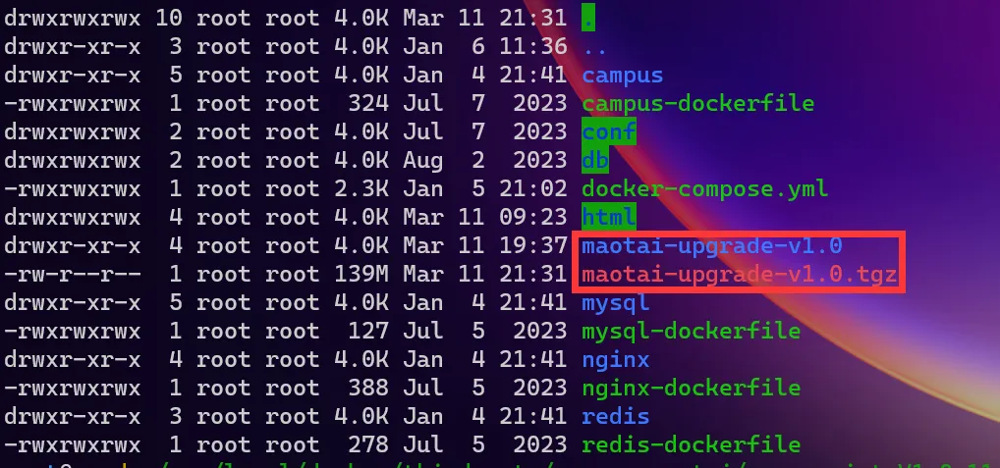

进入升级目录执行升级脚本

-
-

```
cd maotai-upgrade-v1.0./upgrade-imaotai.sh
```

如果没有错误提示信息，说明升级成功了

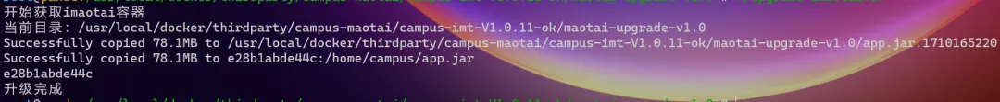

因为升级了页面内容，我们需要把浏览器的缓存给清理一下，点击浏览器右上角的浏览历史，有个垃圾桶的图标

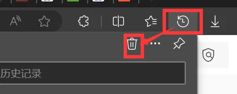

勾选清理所有时间范围内缓存的图形和文件，其它的信息可以不用勾选，然后点击【**立即清除**】按钮

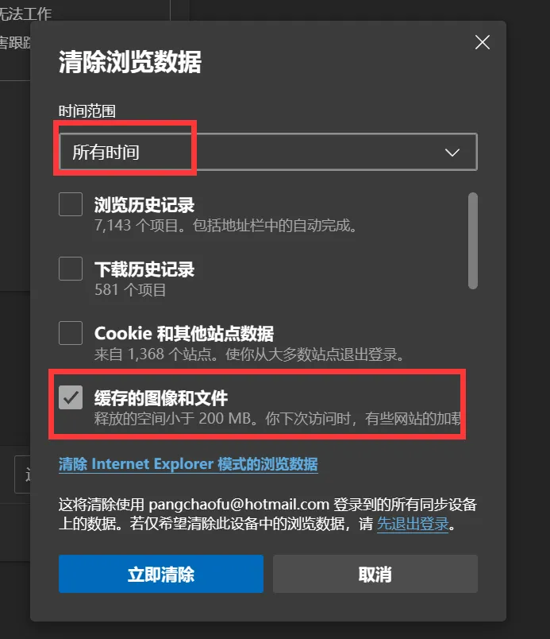

接着我们再来访问 i 茅台预约的界面，登录进来之后多出了一个【**葫芦娃**】的菜单

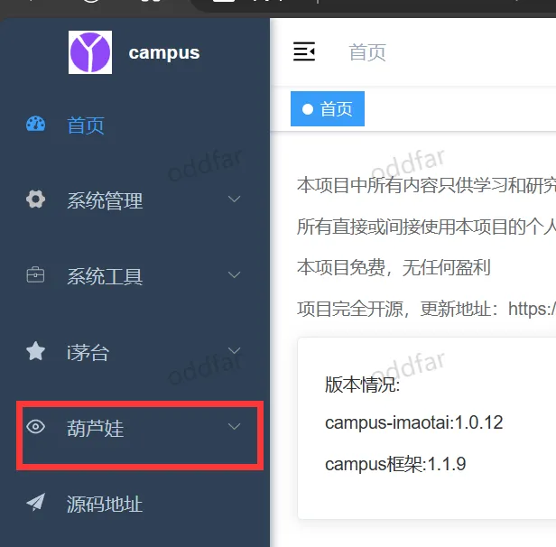

点击菜单展开，然后分别点击【**账号**】、【**平台**】、【**日志**】页面，如果页面能正常显示，并且没有报错，说明是升级成功了。

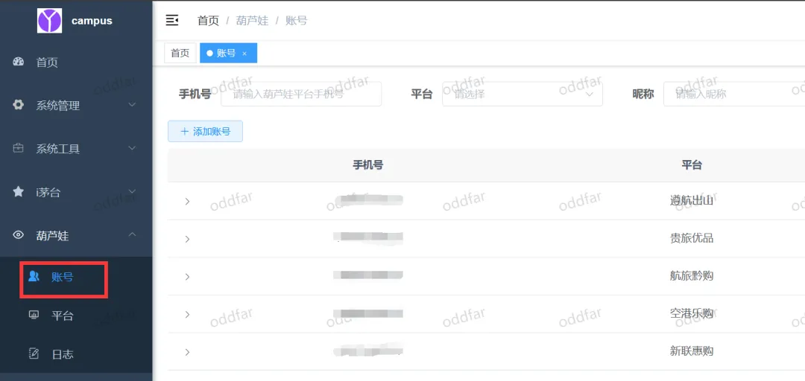

接下来我们需要先来添加账号，需要用到葫芦娃平台的认证信息。

 **获取葫芦娃平台的认证信息**

为了抓取到葫芦娃平台的认证信息，我们需要安装一些抓包软件，可以抓取到微信小程序的访问内容。小伙伴们如果没有抓包环境，可以参照这篇文章 [微信小程序抓包工具](http://mp.weixin.qq.com/s?__biz=MzUyNjkxNDQ5Nw==&mid=2247484717&idx=1&sn=fa2b798b5f1d04d54247419527374d2e&chksm=fa06c383cd714a952d03e4ff15f5d18736ad80bcab961aa2839919334f3e269650a156986c85&scene=21#wechat_redirect) 来操作。

我们分别打开 **Proxifier** 和 **Burp** 这两个软件

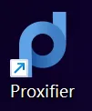


然后登录电脑端微信，然后打开葫芦娃平台的小程序

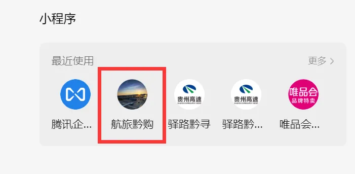

如果没有登录，需要进入【**我的**】菜单页里登录一下

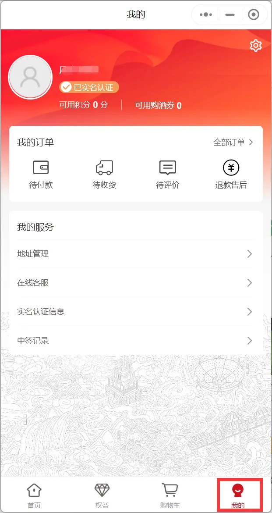

登录号之后，再随便点击一个功能项，比如点击【**中签记录**】，然后切换到 **Burp** 软件，在【**HTTP history**】界面，滚动列表到最底部，找到最后一个带有【**POST**】的 **Method** ，点击该行记录，图片中圈中部分的【**X-Access-Token**】后边的内容就是我们需要的认证信息，复制下来，保存到记事本中。

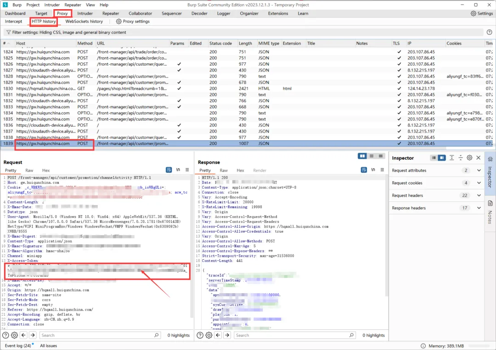

**使用**

拿到了葫芦娃平台小程序的认证信息之后，我们打开 i 茅台预约申购的页面，在【**账号**】页面，点击【**添加账号**】按钮

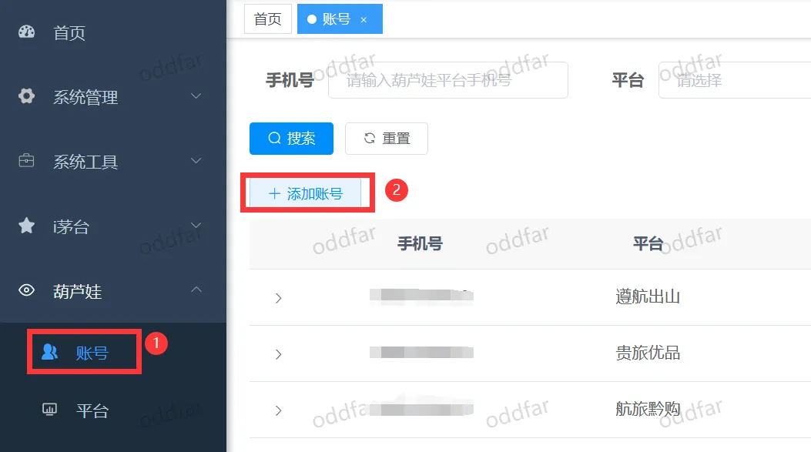

选择对应的平台，并输入之前从小程序中复制出来的认证信息，然后点击【**确定**】按钮保存信息。

如果输入的 **token** 信息不匹配，会保存不上，并提示报错。信息正确的情况能成功保存。

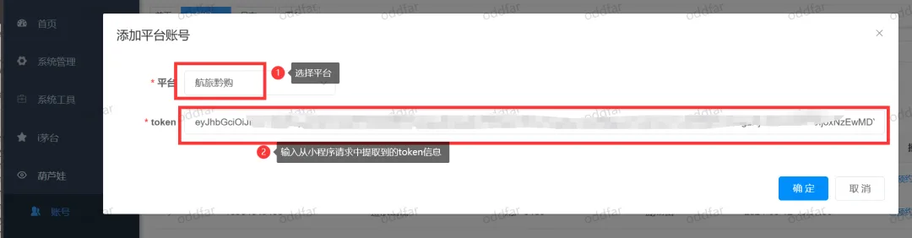

支持添加多个平台以及多个账号

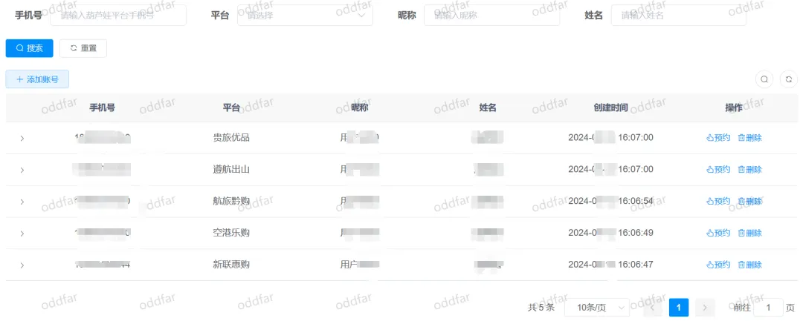

> 这个 **token** 信息会失效，所以需要在日志页面中留意错误信息，及时更新认证信息

在【**平台**】菜单页面里，我们可以查看各个平台的活动时间。添加好账号之后，才能刷新出这些信息。添加完账号如果列表内容还是空的，可以手工点击【**刷新所有平台**】按钮

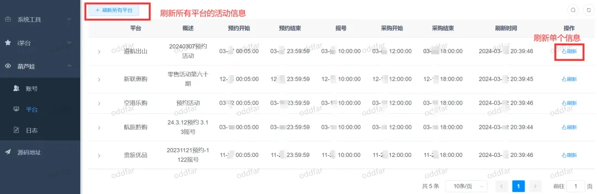

【**日志**】菜单页面中，能看到一些任务信息和报错内容，需要留意一下。软件会在每天早上八点前自动预约活动，日志中也能看到。

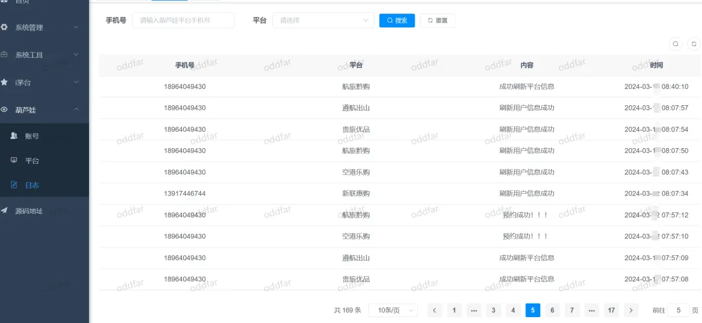

**写在最后**

软件功能比较简单，只是为了解放双手而增加的一个小功能，希望能帮到小伙伴们。如果在使用中有什么疑问，欢迎留言。
