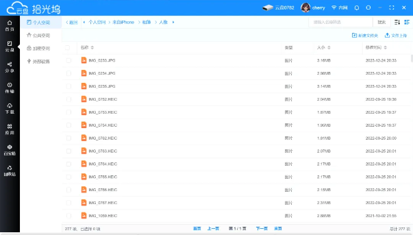
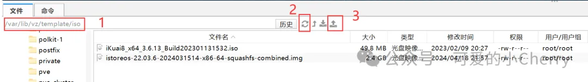

# NAS硬件推荐

# 免费NAS，操作系统及引导！黑群、黑威、Unraid开心版、TrueNAS、国产开源等

**前言**

618已至，各大品牌NAS卖的也是如火如荼，打新打折好不热闹。不过应该也有很多小伙伴还在观望吧，是什么让你迟疑一直没有入NAS的坑呢？

介绍一下目前圈子里主流的可以白嫖的NAS操作系统，并提供简单的安装教程，我们可以通过废旧电脑、笔记本或者虚拟机安装尝鲜，为618购买NAS做一个准备。

从我的理解来讲，NAS操作系统大致分为三类：

> **第一类是软硬件结合的成品NAS的操作系统。** 如群晖、威联通、铁威马、极空间、绿联、万由、华芸、海康等等。其中，群晖和威联通有开心版，使得不购买品牌硬件直接部署操作系统成为可能。

> **第二类纯软件操作系统。** 既有收费、又有免费，支持在不同硬件上进行自托管部署的，如Unraid、TureNAS Scale、FreeNas（TrunNas Core）、OMV、IstoreNAS、ZimaOS、XigamaNas等等。

> **第三类是原生与虚拟化系统。** 以linux为核心，辅之以虚拟化、容器化技术，形成一套可部署各种服务的服务器可视化管理系统，如UmbrellaOS、Cosmos-Server等等，同时这里将PVE、ESXI、Hype-V等虚拟化平台一并纳入。

然后，在前面三类NAS系统中，第一类可以出黑群晖和黑威联通，第二类中订阅制的Unraid也可以开心版，剩下的系统基本都支持免费部署和使用。在这些免费的系统中，根据类型又做了一个简单的划分，具体看表格：


# **开心版，成熟且稳定的必用NAS系统**

**一、黑群晖**

系统成熟度：⭐⭐⭐⭐⭐

部署复杂度：⭐

黑群晖拥有悠久的历史，从最早的麻烦部署到如今一键引导方式，不仅在NAS推广中起到了超高的作用，也为群晖品牌受益提供了一定的帮助，虽然近几年也出现部分引导程序因为某些原因不再持续更新的，但也不断涌现出一些新的引导程序供大家使用。

不过很多人也反馈群晖6.x访问套件中心，7.1访问hub.docker都陆续出现问题，不排除是官方操作导致，这也是越来越多的黑群晖用户想升级到【7.2 update5】的原因。

目前主流的引导程序为rr：https://github.com/RROrg/rr


**二、黑威联通**

系统成熟度：⭐⭐⭐⭐⭐ 

部署复杂度：⭐⭐⭐⭐⭐

黑威联通使用的人一直不多，一是因为威联通的性价比足够高，几乎只要群晖一半的价格就可以上车一台全新设备，因此不需要黑。二是因为黑威联通的部署难度比较高，每一台设备配置文件都有不同，需要部署者对linux有足够的了解。

目前的黑威联通引导方式都是基于【老骥伏枥】前辈的方案上做的扩展，且不同型号，不同版本间的配置文件都有差异，很难入手。

目前主流的引导程序：老骥伏枥年牛大礼包


## 三、UNRAID pro开心版

系统成熟度：⭐⭐⭐⭐⭐

部署复杂度：⭐⭐⭐

Unraid可以说是非成品NAS操作系统的TOP1，主打的就是不采用raid方式存储数据，而是采用奇偶校验盘的形式来确保数据高可用（不过实际运用中奇偶校验盘坏了2块，索性全员raid0），目前Unraid也支持了ZFS文件格式，系统中包含的虚拟机、docker、compose、应用中心、插件等内容，也可以很容易的让我们运作起该系统。

目前主流的引导方式：UNRAID pro 6.11.5版本，https://mi-d.cn/4293


------


# AIO，AIB，榨干硬件的每一点性能

**一、Proxmox VE**

可玩性：⭐⭐⭐⭐⭐

易用性：⭐⭐⭐

经典的虚拟化平台——PVE，目前主流是7.X和8.X，以debian为底层。支持虚拟机、LXC等虚拟化技术，内置了足够多的应用模板，也支持混合部署。同时，PVE自带有良好的集群、容灾备份功能，文件系统上还支持ZFS，是Cherry认为最牛的AIO系统了。

玩PVE，其实就是玩linux，扩展性第一不是开玩笑的，因此PVE不仅仅可以通过虚拟机部署很多系统，还可以使用LXC直接部署一些容器，将PVE本身作为一个NAS系统而使用。

官网：https://www.proxmox.com/en/


## 二、ESXi

可玩性：⭐⭐⭐

易用性：⭐⭐⭐⭐⭐

VMware ESXi是以VMKernel为核心的虚拟化平台，操作更加简单，界面也更加友好，更适合AIO新手用于部署不同系统、不同软路由使用。优缺点其实挺明显的，优点就是硬件性能利用高，直通方便，缺点则是兼容性和扩展性不如PVE高。

官网：https://www.vmware.com/


**三、Linux**


可玩性：⭐⭐⭐⭐⭐

易用性：⭐

发行版linux基本就是SSH操作了，如ubuntu、debian、centos、gentoo、Arch Linux、armbian等等，主打的就是一个折腾，不同发行版因为包的不同，可以折腾和玩耍的内容也存在一定的差异。之所以有很多人喜欢用发行版linux当作NAS，我认为很大原因就在于更自由安装和部署体验。

linux发行版本身大部分支持LXC、LXD、Docker等虚拟化技术，因此也很适合作为AIO的底层工具，但是操作复杂度是远远大于PVE这种含可视化界面的管理工具，总而言之就是玩玩可以，认真就算了。


------

# 开源NAS，爱折腾人的选择

**一、TrueNAS Scale**

可玩性：⭐⭐⭐⭐⭐

易用性：⭐⭐⭐

TrueNAS应该算是开源NAS操作系统的top1，以debian为底层。TrueNAS以支持ZFS格式和强大的内存需求（内存容量以及ECC内存）而出名。实际上TrueNAS Scale并没有网传的要求那么夸张，除了最低8G内存、16G ssd的硬杠杠外，没有太多太夸张的硬件需求。

TrueNAS面向的更多是专业级用户，这点从操作系统支持就可以看出，支持KVM和QEMU的虚拟机，支持docker，支持ZFS等，核心是提供 HCI（超融合基础设施），所以TrueNAS Scale在部署上多少有点麻烦。不过无论如何，如果是DIY NAS，不考虑黑系统的情况下，TrueNAS Scale肯定是首先。

下载地址：https://www.truenas.com/download-truenas-scale/


## 二、TrueNAS Core（FreeNAS）

可玩性：⭐⭐⭐⭐

易用性：⭐⭐⭐


TrueNAS Core曾经被称为FreeNAS，不同于TrueNAS，是基于FreeBSD在OpenZFS文件系统上设计的NAS操作系统，后来FreeNAS被TrueNAS的开发商iX systems收购，也重新进行了定位，更名为TrueNAS Core。

因为底层不同，所以TrueNAS Core没有Scale那么高的硬件要求。现在的TureNAS Core和Scale的界面已经基本趋同了，功能上基本上是有的都有，如果硬件条件不那么好的，可以尝试使用TrueNAS Core版本。

如果要问两者的区别，那就是Core限制于底层的原因，可玩性和扩展性不如Scale版本，但好歹是基础功能齐全的NAS系统。

下载地址：https://www.truenas.com/download-truenas-core/?location=hero


**三、XigmaNAS**

可玩性：⭐⭐

易用性：⭐

XigmaNAS原名FreeNAS，后因为iX systems获取FreeNAS商标后改名为NAS4Free，然后于2018年再次更名为XigamaNAS。也有说法是XigmaNAS是原FreeNAS成员出走后，基于FreeNAS 7的一个分支版本。总之因为命名问题，TrueNAS、FreeNAS、XigmaNAS的渊源我始终没有找到完整的资料。

最新版本的XigmaNAS是13.3.0.5，同样基于FreeBSD底层。XigmaNAS和以上两款NAS系统一样，基本是该有的都有了（好像没有docker），但最大的缺点就是社区太少，如果遇到问题基本上是没办法解决的。这也是XigmaNAS在国内使用一直不多的主要原因。如果你不喜欢折腾，或者技术能力不强，不建议使用该系统。


**四、OMV**

可玩性：⭐⭐⭐ 

易用性：⭐⭐⭐

Open Media Vault (OMV)是一个面向家庭用户的NAS发行版，基于Debian开发，目前最新版本是v7.0，通过ISO镜像安装，安装过程十分方便，原生OMV系统只支持一些基础功能，是不支持docker、zfs等功能的，这些额外的功能都需要通过社区插件来安装。因为网络问题，我们一般需要修改OMV源以及插件源，不过这也应该是OMV系统唯一需要动手（ssh）操作的地方，安装完插件的OMV基本迈入完整体。

优点是操作简单，功能界面不复杂，缺点就是没有系统自带的娱乐和应用，需要通过docker补充安装。

下载地址：https://www.openmediavault.org/download.html


## 五、ZimaOS（CasaOS）

可玩性：⭐⭐⭐

易用性：⭐⭐⭐⭐

ZimaOS是IceWhale团队继CasaOS会发布的一款完整度更高的NAS操作系统，增加了如远程连接、自动备份、Raid支持、应用商城、文件管理等功能，最新的ZimaOS版本在v1.1.0。相比较于传统NAS系统，ZimaOS属于轻量级NAS系统，或者可以认为是一款NAS可视化管理导航系统。

页面风格就是一个简单纯粹的仪表盘，支持连接和文件管理，更多的应用依旧是通过docker部署来实现。好在ZimaOS内部提供了足够多的docker应用，使用者只需要点击安装即可。

优点是足够轻量级，适合在arm等小机器上使用。值得一体的是，zimaOS团队推出了zimacube成品NAS，预计在6月底有测评信息传出。

下载地址: https://zimaos.icewhale.io/zimaos-rauc/latest/zimaos_zimacube_installer.img


## 六、IstoreNAS

可玩性：⭐⭐

易用性：⭐⭐⭐

IstoreNAS就是原来的IstoreOS，由易有云基于openwrt开发，配上了路由狗UI界面。从界面上看，IstoreNAS更像一个NAS操作系统，但因为内核问题，在实际使用中，IstoreNAS还是更偏向网络管理一些。IstoreNAS的应用，基本上也是通过luci、docker两大源提供的，不过似乎没有很好的将两大应用源作于区分，导致应用逻辑上有些混乱。

优点是足够轻量级，IstoreNAS目前只支持X86，以及ars4、p2pro等路由器，IstoreOS支持会多一些，同时对网络支持上明显多于其它NAS系统。

下载地址：https://fw.koolcenter.com/iStoreNAS/


**七、Cosmos-Server**

可玩性：⭐⭐ 

易用性：⭐

Cosmos-Server一款关注于容器访问安全的开源NAS管理系统，包含有导航页、应用商城、容器管理、性能监测面板等功能。最大的特点就是官方有提供内网穿透服务和洋葱服务器访问服务，只需要透出一个端口，即可支持所有容器的安全管理、安全访问等。

但是这玩意的安全，第一时间是折磨自己人。项目本质是通过一个compose文件将所有容器统一在一个网络下，通过容器名来实现内部子路径代替反代连接。

但是值得一提的是该项目内置的容器商城，可以说是本Cherry看到过最大最全的了。


**八、UmbrelOS**

可玩性：⭐⭐

易用性：⭐

UmbrelOS是一款通过docker安装的服务器可视化管理界面，最早该项目是做加密货币出生的，内置了数十款加密货币的应用。

目前该系统通过整合docker商城的模式，提供超120款国内外docker应用。同时集成了WEB管理、容器管理、应用导航为一体。这个项目最大的优点就是界面比较好看。而且自身品牌有推出一款N5105的小主机搭配自身系统（不过这个小主机已经停产了）


## 说在最后

虽说免费NAS操作系统很好，但是在个人折腾NAS的时候我们依旧建议采用官方或社区支持的品牌系统，如目前的成品NAS，如Unraid授权等。更好的售后支持意味着一旦NAS出现问题，可以马上由专业的技术人员保障并为我们解决问题，保证数据不丢失。

# 拾光坞N3：小巧、操作简单的轻NAS体验

## 满足长辈最基础的需求——照片管理

说回前文的朋友，家里长辈带娃，每天外面玩耍就是咔咔咔一顿拍，时间久了手机存储空间就吃不住了，虽然可以利用网盘自动备份照片，但是长辈刷多了新闻，却对个人数据隐私又有了些自己的理解。

拾光坞N3拥有完整的用户体系和权限控制体系，公用存储、私人存储完全隔离，可通过亲友共享将资料进行分发。

### 管理与分享家庭照片


🔻利用相册备案功能，将手机中的相册全部备份到拾光坞个人空间中，并根据手机相簿进行分类。




🔻在公共空间中，我们也可以随意新增文件夹，并在备份照片时根据相簿指定备份位置。

🔻利用亲友共享功能，将个人空间的照片文件共享给其它账号查看。


## 利用docker部署照片管理软件，自动完成人脸分类


🔻得益于拾光坞对docker应用的支持，我们可以部署诸如photoprism、mtphotos、immich等照片管理软件，实现人脸识别、地图分类、人物相册等功能，帮我们更好的管理和欣赏照片、相册。


------

## 满足长辈看电视的需求——影视自由

### 丰富的影视玩法


在影视方面，拾光坞N3提供了多种解决方案，囊括了目前市面上所有的影视玩法，不论是在线收看、影片下载或者最美观的海报墙，拾光坞N3都能信手拈来。

🔻离线下载，支持多种协议的下载方式，更能设置做种条件。

🔻拾光坞影视仓库，可以对电视、电影做不同类型的分类刮削。


### 极简的播放体验

当影视剧下载完成后，体验就成了最为关键的环节。拾光坞N3支持影视剧在电脑、电视平台上播放。

> PC端自带内置播放器，支持视频、音轨、字幕轨道选择，体验感很不错。 TV端自带HDMI输出口，利用手机分享，将想看的影视剧一键投放到电视上。


🔻PC端播放界面，自带海报墙与影视信息。

🔻电视端播放，利用手机端的HDMI播放功能，将影视剧直接播放到电视端且不影响手机使用。


## 满足长辈工作的需求——文件存储

### 为手机扩容与备份


尽管现如今手机容量越来越足，512G都是小意思。但是各类APP的体积却也是越来越大，尤其是一些内置游戏引擎的产品。拾光坞N3通过个人云盘服务，将微信文件、通讯录、手机文件统统备份到云端。
🔻手机端通过分享功能，将所有资料统统上传到拾光坞中，PC端同理。


### 不会丢的公文包


Cherry家有亲人在教培行业，奔波于各大课外班，常常随身携带多个U盘用于教材拷贝，问及为什么要带好几个，答案就是容易忘在培训班的电脑上，主打一个人间真实。

🔻局域网内，拾光坞秒变共享硬盘，家庭内所有设备都可以访问。开启SMB服务，并设置访问密码以后，可以在各个设备上访问拾光坞的存储空间，如windows在电脑上输入` \\192.168.1.109\hdd0`，mac在访达中连接`smb://192.168.1.109/hdd0`,文件迁移变得极为简单。

🔻互联网端，配合Raidrive变身网络云盘，还能作为异地同步中心。开启Webdav，家里也能访问父母家的拾光坞，不管有任何文件资料、影视剧、软件都可以快速共享。


## 满足长辈勤俭的需求——自给自足

### 超低损耗不心疼


🔻小米智能开关读取的功率数，机身附带2T硬盘，平均在8-10w，一天就是电费为0.12元，这么低的功耗，要什么自行车？


### 星光计划还能赚钱

本次Cherry使用的是拾光坞N3星光版，星光版相较于普通版，有一个星光计划服务，独立运行在N3的emmc存储（128G）中，待合约期结束以后，emmc存储可用作本机存储。

很多人会担心星光计划占用太多的带宽，其实这点也不用太多顾虑，星光计划内置限速模式，可以根据自己的网络环境随时切换带宽占用比，例如自由限速、智能均衡、极限模式等。


值得一提的是，通过跑星光计划可获取的星光豆，除了在可以在社区兑换各类软件会员外，更是可以直接提现哦，只要星光豆总值满20元，就可以直接提现。
====
🔻星光计划及兑换物品


## 值得更多的期待

作为一台瑞芯微RK3566的轻NAS，拾光坞N3拥有4核4线程的标准配置，G52集显支持影视转码，兼容如百度网盘、虚拟机、docker、DDNS等核心功能，可谓是五脏俱全。

而让人值得期待的是，官方支出2024年上半年，拾光坞将不断迭代新功能，如离线访问、内网穿透、http\https共享、外接USB硬盘一键备份、可视化监控仪表盘、文件加密、相册和视频升级等等，更是不断的在完善这台足够诚意的轻NAS产品。


# 知名路由系统：istoreOS更新了NAS操作系统

说起openwrt，大家对casaos、zimaos、istore、istoreOS是否有小小的疑惑呢？（至少Cherry是这样的）。

这些项目都是基于op为核心开发的操作系统/商城系统，互相之间有着相似的界面和操作风格，如果有熟悉的大佬，麻烦为Cherry解惑一下。

> 目前Cherry个人理解的是istore最早是openwrt上发布的应用商城，而冰鲸的CasaOS较早发布，随后发布了专家版的zimaOS。istoreOS则是在isotre基础上，由易有云进一步发展出来的路由操作系统？


4月初，易有云旗下的istoreOS发布了NAS镜像版本，进一步将原来的路由存储系统重新定义为NAS系统，目前仅支持x86和ars4进行安装。


那么，今天我们就来体验一下。


------


## 一、下载并解压istoreNAS镜像


🔻官方下载X86版本固件， 固件格式为**.img.gz，需要到linux系统中进行解压。
https://fw.koolcenter.com/iStoreNAS/x86_64/

🔻建议使用finalshell登录PVE系统，然后在文件这里输入`/var/lib/vz/template/iso`回车，点击刷新按钮，然后上传刚才的**istoreos-22.03.6-2024031514-x86-64-squashfs-combined.img.gz**附件。
🔻接着，在ssh页面依次输入以下指令

- 
- 

```
cd /var/lib/vz/template/isogzip -d istoreos-22.03.6-2024031514-x86-64-squashfs-combined.img.gz
```

``


🔻至此，我们的img镜像就解压完成了，稍后使用qm来制作虚拟硬盘。


------


## 二、新建虚拟机，并生成启动盘


🔻PVE里随便起一个虚拟机，记录下VM ID。

🔻操作系统选择**不适用任意介质**，剩下的选项根据自己的需要选择。
🔻回到ssh页面，输入以下指令，最后可以看到生成了一个disk。


- 
- 

```
# 这里的101替换成你自己的VM ID即可qm importdisk 101 /var/lib/vz/template/iso/istoreos-22.03.6-2024031514-x86-64-squashfs-combined.img local-lvm

```


🔻回到虚拟机页面，选择新出现的**未使用磁盘**，点击**编辑**，选择**添加**

🔻更改启动盘顺序为新增的硬盘即可。


------


## 三、安装系统


打开虚拟机，系统一路自动安装，最后按回车启动系统

输入指令`ifconfig`查看ip地址，登录NAS页面

登录系统，界面有点inter那个味了，默认账号密码是`root/pasword`


------


## 四、系统展示


不得不说，istroeNAS确实是国人开源NAS集大成之作，得益于luci、docker的社区维护，istoreNAS将更多的开源应用通过界面集成的方式集合到了操作系统中，这对于用户侧来说是无感的，你不需要这是什么，如何安装，你只需要使用即可。


### 路由狗界面


istoreNAS依旧使用的是路由器界面，但是经过那么长时间的迭代，不管是界面布局、图标、设计风格都和最初版本有了很大的提升。这也让istoreNAS看起来更像是一个NAS操作系统，而不是原来istoreOS的导航栏风格。


### 控制面板


控制面板中，基本囊括了大部分的界面配置和基本调阅功能，例如监控仪表盘、系统更新、网络面板、文件服务、任务计划等。在界面布局上，则支持自定义壁纸。

其中文件服务目前只开放了webdav共享，其它共享需要通过三方软件来实现。


### 应用商城


应用商城里还是luci源为主的应用（部分安装后依旧需要docker部署才能使用），目前内置88个应用，基本涵盖了软路由和nas日常所需使用的软件。


### 存储管理


存储卷单独成为了一个模块，值得一提的是支持了raid，不过还处于测试阶段。另外，存储管理也提供了SMART功能供查询。


### 文件管理


这部分应该是使用的易有云的模块，从目录这侧看，比较好的对常用文件、卷进行了分类，缺点还是存在，就是开放的文件权限太大了，对于NAS用户来说，其实系统文件并不需要展示，更应该关注于存储的文件上。此外，更多的功能，则需要使用易有云插件来实现。


### 家庭影音


采用的是jellyfin客户端的形式，初次打开会提示未安装jellyfin。但是安装好以后，还需要转跳到istoreOS里设置，这点应该是还没有开发


### 相册软件


相册软件是路由狗自己开发的功能，人物识别采用的是开源项目pigo（当前版本暂时移除了），重复相片检测使用的是项目duplo。因为没有单独的搜索栏，所以应当是不支持clip的。


### 下载工具


下载工具是基于aria2的可视化套壳UI，支持增加BT tracker地址。


### docker可视化


这没啥好说的，中规中矩的功能


### 云服务


这里相当于是外网访问服务了，采用tailscale为异地组网工具。登录路由狗账号以后可实现APP或异地访问。


### 管理后端（op）


管理后端依旧是熟悉的配方，openwrt的常规界面，不过对仪表盘进行了重新部署，看起来很清爽，也更符合NAS的定位。在这个页面，更多的是维护网络、服务配置的页面，和日常使用op是一样的，也是op模块最擅长的部分，就不多介绍了。


## 后记


也许没有一直关注这个项目的原因，初步体验下来，Cherry感觉和去年看istoreOS、casaOS、zimaOS等项目已经有了很大的差异。

整个系统给人的感觉的确更接近于一个NAS系统，而不是单纯的openwrt套壳项目。

但是不足的地方依旧存在，首先是openwrt过于自由的使用权，过多的功能对新手用户来说其实是更多的麻烦，想玩明白一个op的学习成本实在太高；其次以网络为核心的使用习惯，与NAS这种以存储为核心的使用习惯，依旧存在风格差异，尤其是linux挂载、配置文件修改这些具有一定专业性，和一定危险性的使用技巧，对于新手玩家来说是极其致命的；最后，Cherry个人感觉是luci和docker的不协调，虽然两者都能提供一定量的工具，但是侧重点的不同让应用的使用、配置给人以割裂感，在使用过程中造成了一定的不顺畅。

但是，作为国内开源NAS系统的先驱者，istoreNAS选择自研+开源的有机结合，不得不说是当前市场下最合适的一种选择。未来，希望有更针对NAS产品定位的功能可以附加在istoreNAS上，也希望有越来越多的项目可以被集成在里面。

# p2pro：开发小板——99元小硬件

[99元小硬件都能跑的iStoreNAS是什么样的体验 (qq.com)](https://mp.weixin.qq.com/s/XkZhWn6nvNtDRFYvwm6XLA)