# 硬件设备改造成NAS

## 将废旧小米手机米8lite改造成一台轻NAS（一）

很多人都尝试用小米路由器搭配外置存储做家用NAS的代替方案，但是路由器吧，毕竟是家庭网络核心，不建议随意折腾。

突然，一个利用废旧小米手机制作简易NAS的想法，油然而生。那改系统前，我们先要了解NAS是什么。

> 1️⃣狭义上的NAS全称是Network Attached Storage，就是一台依附于网络，并且提供内外网存储的设备。 
>
> 2️⃣现在的NAS可不仅仅是这个功能，现在的NAS更多的可以认为是家庭应用中心，以数据存储为核心，拓展如家庭影视中心、家庭相册管理、家庭智控中心、家庭网络中心、家庭自托管应用服务中心等等功能，可以说是家庭数码设备的核心。

说完NAS，我们再来说说主流的小米手机改造服务器的方案：

> 1️⃣方案一：使用虚拟机，最著名的就是Termux，无需root即可在安卓上运行linux系统，但是无法发挥手机的最大性能。 
>
> 2️⃣方案二：刷入原生linux系统，目前对小米平台支持比较好的平台有Ubuntu touch、Mobian、PostMarketOS、Droidian等

目前网上的PostMarketOS作为教程不多，而且时间都比较久远，目前的PostMarketOS的安装方案已简易了很多，因此本文以小米手机刷入PostMarketOS为核心教程，将废旧手机改造成一台小NAS。

🔻下面介绍小米设备支持情况，实际不同手机在支持上都有所区别。
第一部分，官方完美支持——无。
第二部分，社区支持，包含米1、米2lite、米note2、PpcoF1、红米2、红米4prime、红米5plus、红米note4、红米S2，这些设备支持WIFI和UI，属于完全体。
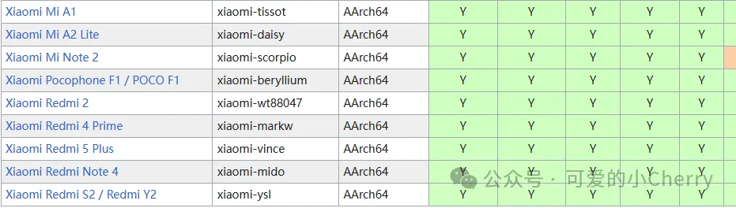
第三部分，测试支持，基本包含了主流的小米设备。
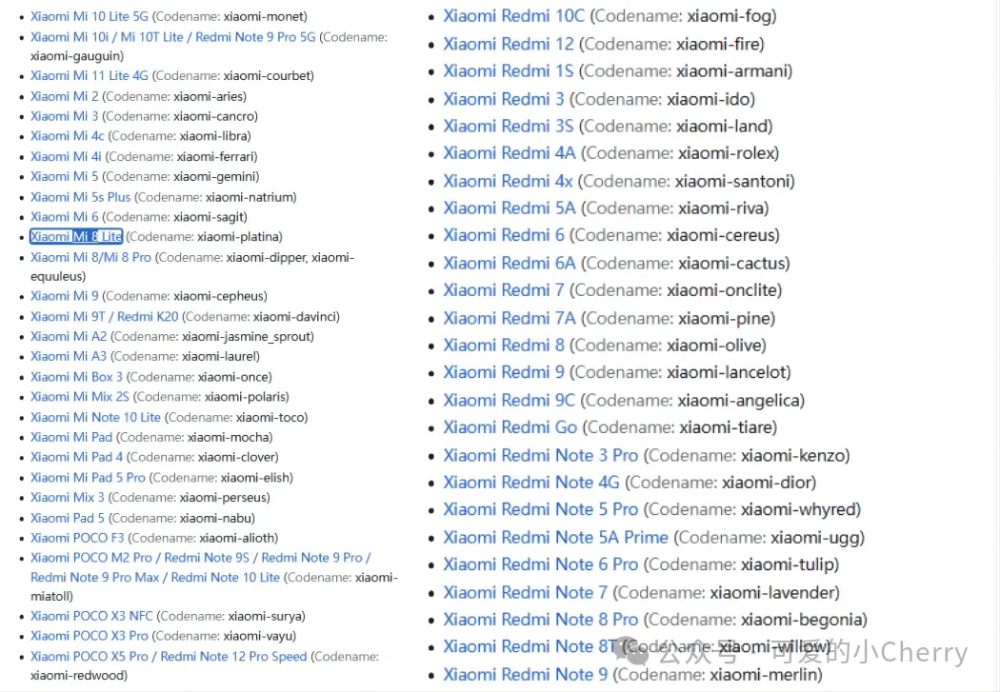
第四部分，完全不支持。
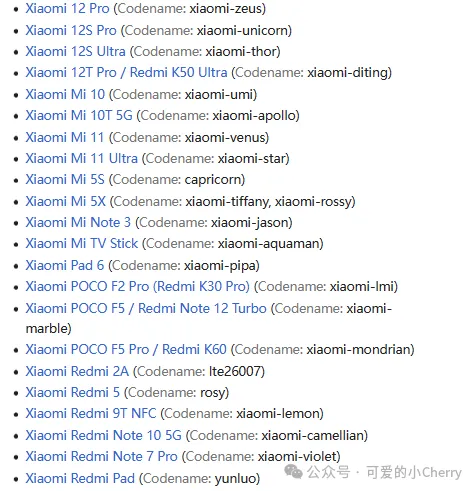


------


### 一、解锁小米手机

🔻解锁地址：申请解锁小米手机 (miui.com)

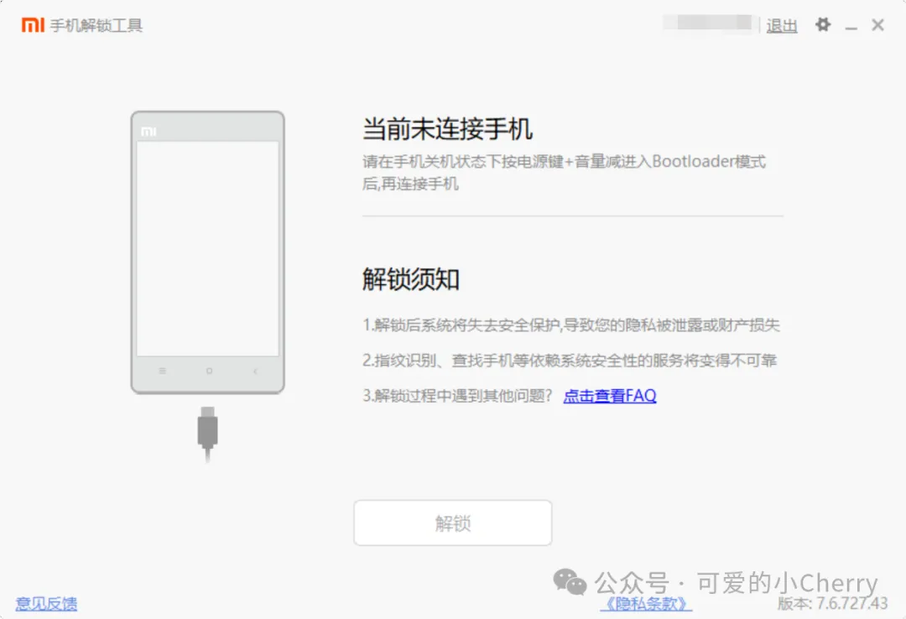
🔻按住音量-和开机键开机，进入fastboot模式，然后连接电脑数据线，点击解锁。


🔻如果手机插入没有反应的，点一下右上角的齿轮，里面有一个**驱动检测**，按步骤更新下驱动即可。
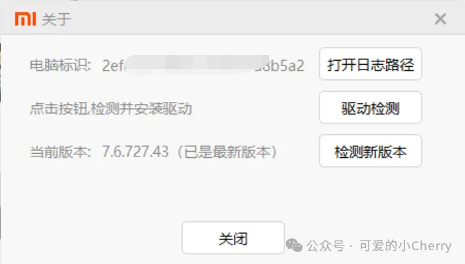
接着就是多次提醒，一直确认即可完成解锁。
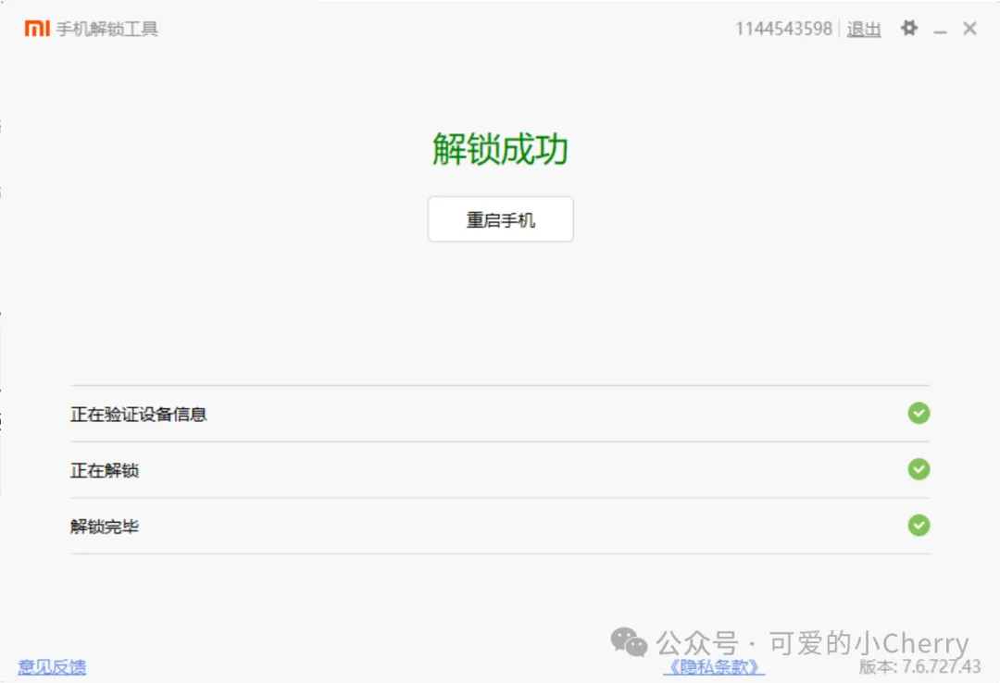


### 二、米8刷机PostMarketOS

🔴PostMarketOS的安装必须使用linux系统，所以如果是windows的话，需要使用虚拟机，但问题是在fastboot模式下，虚拟机有概率无法获取到手机设备的，朋友们可以试一试。

#### 第一步：安装pmbootstrap

🔻为了方便使用，我们需要将postmarket指令改为系统指令


```bash
# 以此在SSH页面敲入如下指令
git clone --depth=1 https://gitlab.com/postmarketOS/pmbootstrap.git
mkdir -p ~/.local/bin
ln -s "$PWD/pmbootstrap/pmbootstrap.py" ~/.local/bin/pmbootstrap
PATH="$HOME/.local/bin:$PATH"
#验证版本信息
pmbootstrap --version
> 2.2.1
```

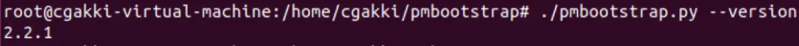

#### 第二步：初始化pmbootstrap

🔻启动初始化

```bash
# 首先切回普通用户，因为root无法运行pmbootstrap
su - [你的普通用户名字]
# 初始化
pmbootstrap -mp=https://mirrors.aliyun.com/postmarketOS/ -m=https://mirrors.aliyun.com/alpine/ init
```

🔻初始化配置
第1个选项，设置work工作目录，直接回车默认即可。
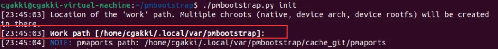
第2个选项，设置版本，需要到官方设备目录去查找，包括Main（主要）、 Community（社区）、Edge（滚动），小米8lite属于Edge范围，因此我们直接回车下一步。
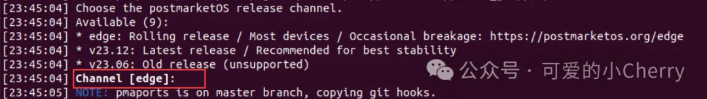
下图是小米的Community（社区）支持设备清单：
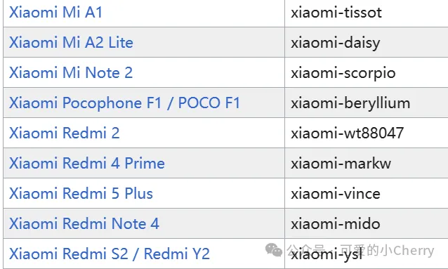
第3个选项，是选择开发商，我们输入`xiaomi`，然后回车。
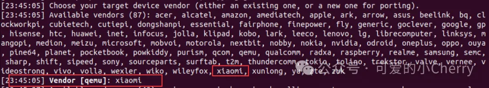
第4个选项，是设备的代号，从官网查询，米8lite的代号是`xiaomi-platina`
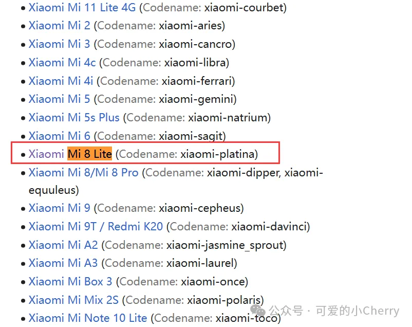
因为前面已经选择过开发商了，所以这里直接输入`platina`并回车。
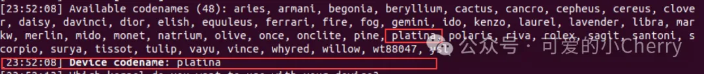
第5-7选项，分别输入`回车`，`用户名（可为空）`，`回车`，`密码（可为空）`。
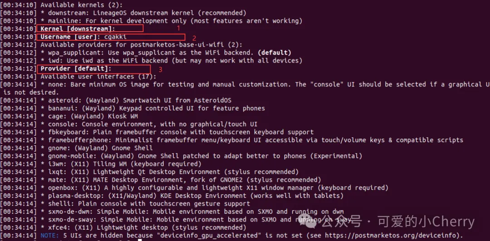
第8个选项，选择UI风格，因为这里作为纯linux，选择默认的命令行模式，不需要UI。
🔴**需要注意的是，不同的小米设备对UI支持不同，而且大概率刷完机是会卡在登录页面的，但是服务器本身已经启动了，所以UI选啥都无所谓**
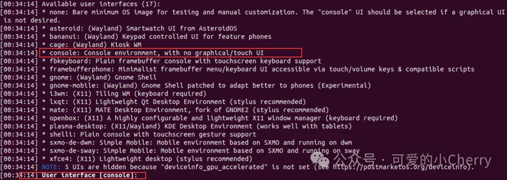
第9-13个选项，第12项的地址更改位`zh_CN`,第13项的hostname自己定义即可。
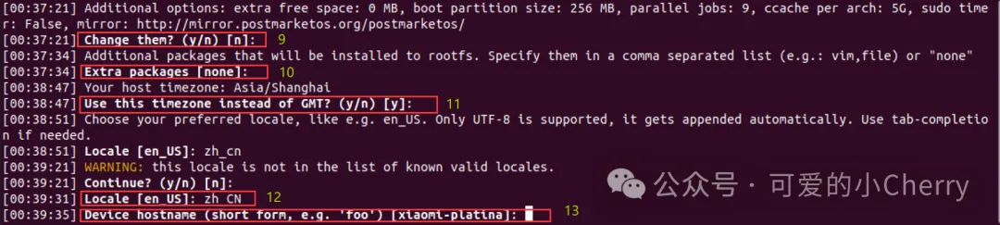
第14个选项，直接回车。
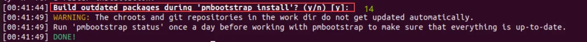

#### 第三步：开始刷机

🔻开始刷机，如果5-7步设置过账号密码的，这里输入密码即可。

```bash
pmbootstrap -mp=https://mirrors.aliyun.com/postmarketOS/ -m=https://mirrors.aliyun.com/alpine/ install
```


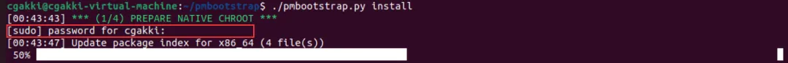
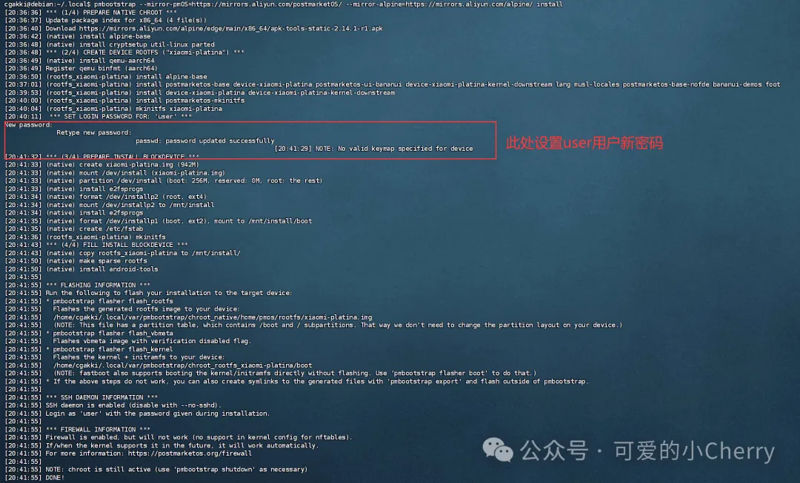
🔻刷入rootfs镜像

```bash
pmbootstrap -mp=https://mirrors.aliyun.com/postmarketOS/ -m=https://mirrors.aliyun.com/alpine/ flasher flash_rootfs --partition userdata
```


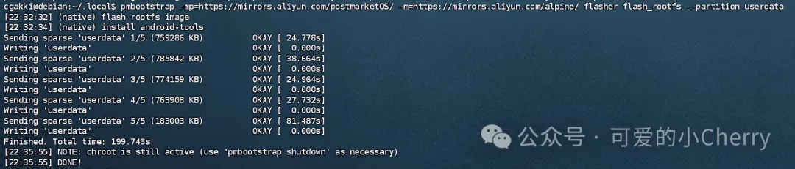
🔻刷入vbmeta镜像

```bash
pmbootstrap -mp=https://mirrors.aliyun.com/postmarketOS/ -m=https://mirrors.aliyun.com/alpine/ flasher flash_vbmeta
```


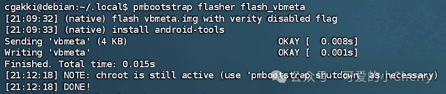
🔻刷入内核

```bash
pmbootstrap -mp=https://mirrors.aliyun.com/postmarketOS/ -m=https://mirrors.aliyun.com/alpine/ flasher flash_kernel
```


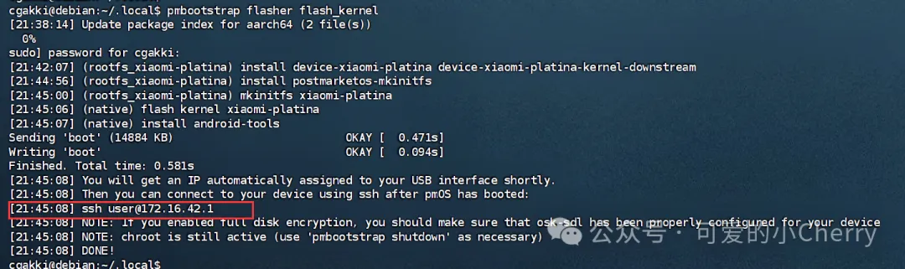


### 三、配置网络并登录“米NAS”

#### 第一步：登录SSH

🔻将米8使用USB数据线连接台式机的后背USB，这个时候系统会自动识别网络，通过RNDIS进行网络连接。
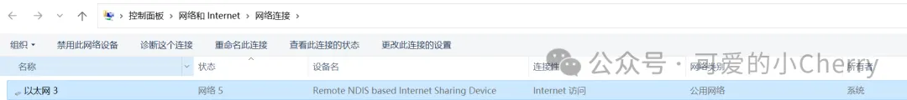
🔻windows会生成一个默认ip为172.16.42.2的RNDIS网络IP。
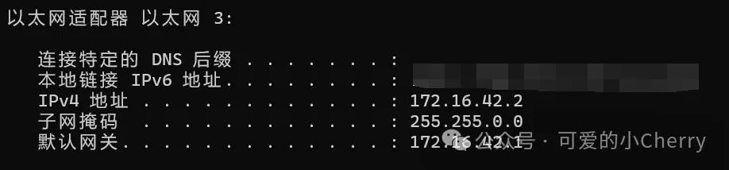
🔻通过finalshell等SSH工具，目标地址为172.16.42.1，账号为user，密码为你刚才设置的密码。登录成功后如下。
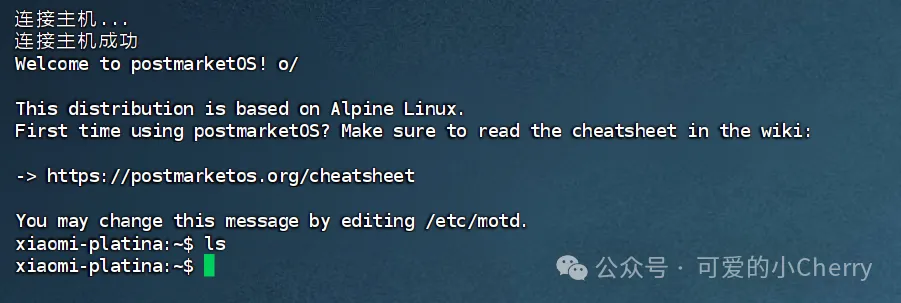

#### 第二步：windows共享网络

Cherry的米8lite目前不在wifi支持范围内，所以无法通过wifi连接网络，只能围魏救赵，通过USB连接到电脑上访问网络,这里演示连接到windows上进行外网访问的方法。
🔻选择能上网的那个主网络，右键属性，选择共享，将网络共享给RNDIS的网络。
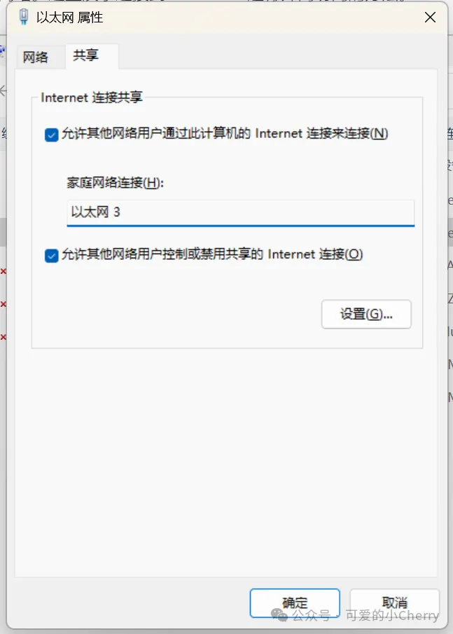
🔻关闭windows的所有防火墙，如果担心网络问题请放行相关的策略。
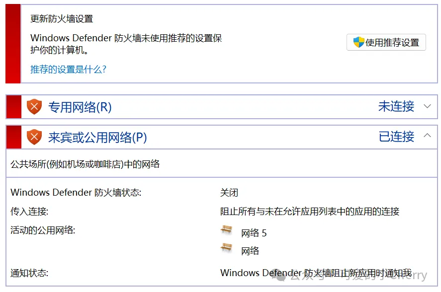
🔻现在拿百度测试一下，可以看到已经访问通了。
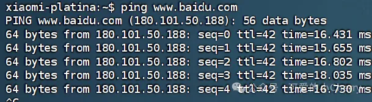

### 四、安装docker和面板

🔻使用指令安装docker和docker-compose

```bash
# 安装docker
sudo apk add docker
# 验证版本
docker -v
# 安装docker-compose
sudo apk add docker-compose
# 验证版本
docker-compose -v
```

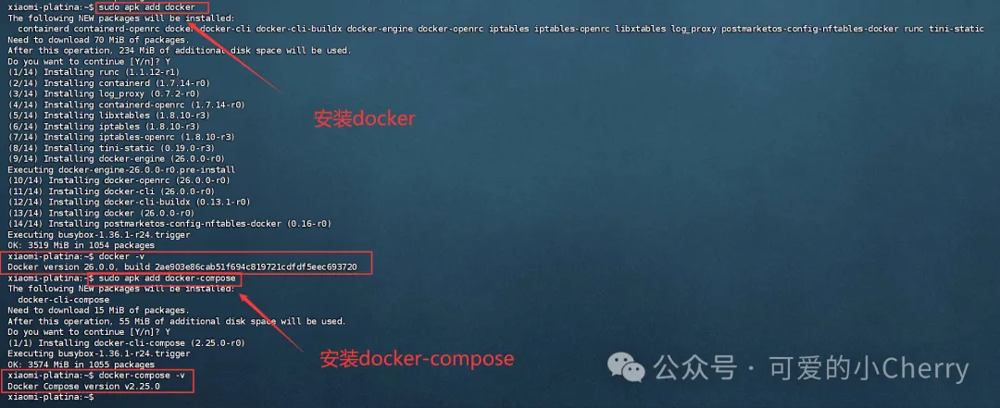

### 待续

因为篇幅有限，本文暂时介绍如何刷机PostMarketOS。而且Cherry也是一边折腾一边更新，比如刷机就用了我2天时间排坑。

折腾大佬们可以先行刷机后，自己体验体验，并在评论区交流经验哦~

后续Cherry会继续介绍如何安装和使用docker、如何监控手机性能、如何解决手机网络和充电、如何散热、如何扩容空间，以及哪些应用适合部署在手机端等问题。