参考视频和文档：[web前端有必要学docker吗？0基础-45分钟带你学会！包含笔记案例源代码_哔哩哔哩_bilibili](https://www.bilibili.com/video/BV1Z84y1a7nM/)


[前端学一点Docker，不信你学不会 - 知乎 (zhihu.com)](https://zhuanlan.zhihu.com/p/687859552)

[谁说前端不需要学习docker？-腾讯云开发者社区-腾讯云 (tencent.com)](https://cloud.tencent.com/developer/article/1619066)

[30分钟带你了解Web工程师必知的Docker知识 - 掘金 (juejin.cn)](https://juejin.cn/post/6844904088551833608)

[30分钟带你了解Web工程师必知的Docker知识_慕课手记 (imooc.com)](https://www.imooc.com/article/301898)

[Docker 边学边用 - Jartto's blog](http://jartto.wang/2020/07/04/learn-docker/)

[如何使用轻量应用服务器部署并使用Docker_轻量应用服务器(SAS)-阿里云帮助中心 (aliyun.com)](https://help.aliyun.com/zh/simple-application-server/use-cases/deploy-and-use-docker)

[怎么用docker部署web程序-Docker-PHP中文网](https://www.php.cn/faq/507202.html)

[Docker部署网站环境_docker搭建网站-CSDN博客](https://blog.csdn.net/weixin_43929986/article/details/109851805)

[快速上手！使用Docker和Nginx部署Web服务的完美指南_docker nginx部署web应用-CSDN博客](https://blog.csdn.net/qq_35716689/article/details/135833403)

[Docker中安装Nginx部署网页服务-过程_docker中nginx配置网页-CSDN博客](https://blog.csdn.net/JackieDYH/article/details/125282819)

[Docker：让应用程序轻松移植到任何地方的利器_如何把程序转到docker-CSDN博客](https://blog.csdn.net/Why_does_it_work/article/details/131401307)

[【Docker进阶】基于Docker部署Web应用_docker部署web项目-CSDN博客](https://blog.csdn.net/llg___/article/details/125725283)

[建立的静态网站如何在服务器运行,使用docker创建静态网站应用(多种方式)-CSDN博客](https://blog.csdn.net/weixin_42508903/article/details/119313396)

[手把手教你用 Docker 部署网站——Docker 系列-8](https://blog.csdn.net/javageektech/article/details/94420350)

[一键式快速部署：Docker 和 Docker Compose 安装指南 - 知乎 (zhihu.com)](https://zhuanlan.zhihu.com/p/673163601)

# 为什么要使用docker

`docker`提供了沙箱环境，能够隔绝物理环境，相当于是之前的虚拟机。而且`docker`内置了很多镜像可供使用。

`Docker`容器技术以及`docker-compose`容器编排技术能最大限度的保证您的项目在开发环境和生产环境上的一致表现。

要想在`window`系统或`mac os`中使用`docker`，需要先安装桌面版，其实相当于是在电脑安装了一个`Linux`内核+`docker`环境。

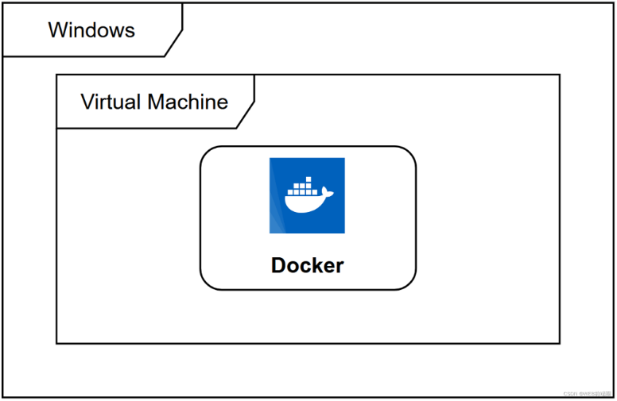

## Windows10/11系统安装Docker Desktop

`Windows10`(无论专业版还是家庭版)都能方便安装`Docker Desktop`。

在Docker官网下载最新的`Docker Desktop`安装，下载地址：https://www.docker.com/

下载安装包大约有585M，目前最新版是`4.15.0`安装时，默认C盘，大约3分钟，安装完毕：

- Docker Desktop启动的时候，有可能弹框提示`"WSL2 installations is incomplete"`，这是您的系统中没有安装`WSL2`内核的原因，打开https://aka.ms/wsl2kernel,在打开的页面中有一个Linux内核更新包"链接，点击下载，安装。
- `WSL2 Linux`内核更新包安装后，重启`Docker Desktop`即可正常使用。您可在`cmd`或者`PowerShell`命令行中使用`docker`或者`docker-compose`等相关命令了。

**PS:** 如果您在安装`WSL2`的过程中遇到了问题，可能是您的系统版本较低等原因，您可按照https://aka.ms/wsl2kernel 页面的相关提示更新系统。该`Docker Desktop`的安装方法基于`Windows10`的`WSL2`如果您的系统没有或者不能安装WSL2，可能不能使用该方法安装`Docker Desktop`。

> 对于win11 家庭版，需要在win10的基础上多一个前置步骤，才能安装成功：

1. 在`win11` 中打开`启用或关闭window功能`，看选项中是否有`hyper-v`：

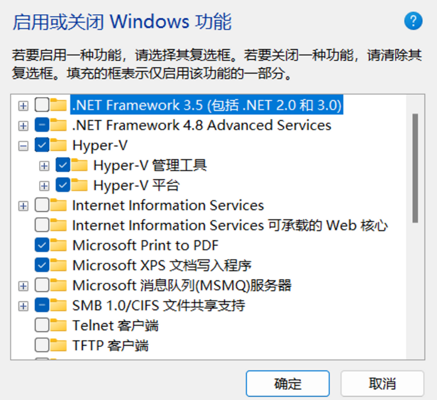

如果没有，则需要运行一个`BAT`脚本，以便激活该功能，将以下代码保存为`bat`文件，然后使用管理员方式运行。经过大约5分钟，自动重启电脑即可：

```bash
pushd "%~dp0"
dir /b %SystemRoot%\servicing\Packages\*Hyper-V*.mum >hv.txt
for /f %%i in ('findstr /i . hv.txt 2^>nul') do dism /online /norestart /add-package:"%SystemRoot%\servicing\Packages\%%i"
del hv.txt
Dism /online /enable-feature /featurename:Microsoft-Hyper-V -All /LimitAccess /ALL
pause
```

## 如何判断电脑已经安装好docker

在`CMD`输入 `docker`，如果有反应表示安装成功

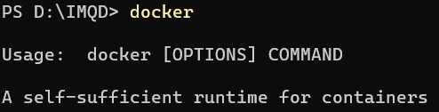


#  怎么把网站和服务端应用接入Docker

### 要把一个网站应用接入Docker，你需要执行以下步骤：

1. 创建一个Dockerfile文件，定义如何构建你的Docker镜像。
2. 编写Dockerfile，指定基础镜像、复制应用文件、安装依赖、配置环境和运行应用。
3. 构建Docker镜像。
4. 运行Docker容器，暴露端口。

### 以下是一个简单的示例：

1.假设你有一个简单的Python Flask应用：

```python
# app.py
from flask import Flask
 
app = Flask(__name__)
 
@app.route('/')
def hello_world():
    return 'Hello, Docker!'
 
if __name__ == '__main__':
    app.run(host='0.0.0.0', port=5000)
```

2.你的Dockerfile可能如下所示：

```Dockerfile
# 使用官方Python运行时作为父镜像
FROM python:3.8-slim
 
# 将工作目录设为/app
WORKDIR /app
 
# 将当前目录内容复制到位于/app中的容器内
COPY . /app
 
# 安装依赖
RUN pip install -r requirements.txt
 
# 对外暴露端口
EXPOSE 5000
 
# 定义环境变量
ENV NAME World
 
# 在容器启动时运行app.py
CMD ["python", "app.py"]
```

3.接下来，在你的应用目录中运行以下命令来构建和运行你的Docker容器：

```bash
docker build -t my-flask-app .
docker run -p 5000:5000 my-flask-app
```

现在，你的应用将在Docker容器中运行，并通过Docker映射的端口对外提供服务。你可以通过浏览器访问宿主机的IP和映射端口来查看你的应用。

# 将前端项目(Vue、React等)打包为docker镜像运行和发布镜像

使用`docker`可以方便将其他人的项目直接运行，而不需要配置。

比如我这里已经有一个`vue`项目，接下来实操打包为镜像在本地运行或部署到`docker`镜像，只需要4步即可完成！

### 1、将vue的项目进行构建，输出dist

这个步骤就相当于是将vue的项目 `npm run build` 打包到服务器是一样的。

### 2、准备镜像内容

在`dist`目录之上新建一个`Dockerfile`文件，该文件没有后缀，文件名即为此。然后输入如下内容：

```jsx
FROM nginx:latest
LABEL Author imqdcn
COPY dist /usr/share/nginx/html
```

第一行：设置基础镜像，基础镜像使用`nginx`

第二行：作者信息

第三行：将dist文件夹下面的内容拷贝到`/usr/share/nginx/html`目录下面（`nginx`的默认项目路径）,也就是我们`Vue`项目打包之后我们正常使用`nginx`是拷贝过去的文件夹。

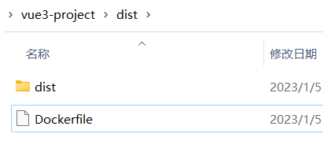

### 3、制作镜像

```bash
docker build -t 镜像名字 .
# 比如：
docker build -t vue3project .
```

注意：后面的`.`不能省略，镜像创建成功之后使用`docker images`即可看到自己创建的镜像。

整个制作过程大概为1-5分钟。

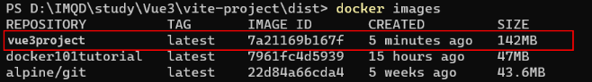

### 4、启动镜像

```bash
docker run -d --name 镜像名字 -p 8888:80 vue3project
```

启动命令说明：

> -d：容器在后台启动
>
> —name : 镜像名称
>
> -p 8888:80 ：将nginx容器的80端口映射到主机的8888端口，我们访问时直接访问主机ip+映射到主机的端口，这里是8888，如果有路径，后面还要带上路径。 比如这里表示访问路径为：localhost:8888
>
> vue3project: 我们刚刚创建的自己的镜像的名称，在创建时就要规划好名字

**注意：**

你制作完镜像后，就可以在自己的`docker desktop`看到镜像，并且在那里直接配置访问端口和将镜像放置在容器中运行。

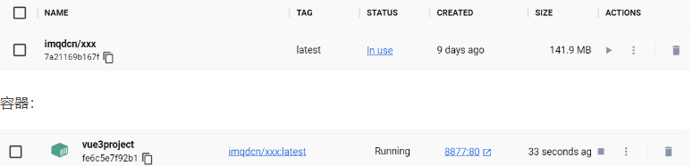

至此，你就相当于是将本地的`vue`的项目打包为一个`docker`镜像，并且可以在本地运行查看了，就像你部署到了一台虚拟服务器中！

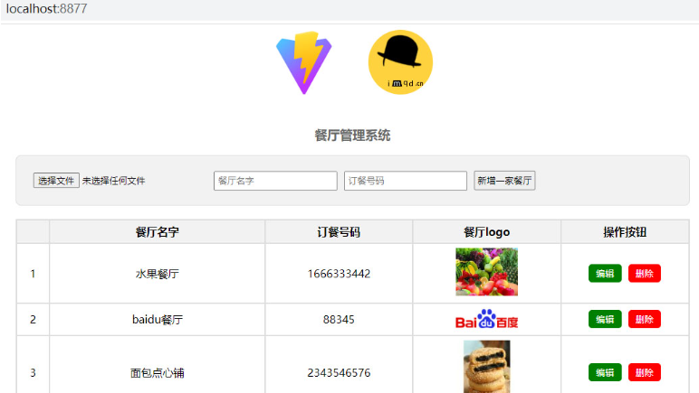

# Docker 化一个 Go Web 应用

Web 服务拥有对整个容器的完整访问权限，所以我们不需要对服务的代码做任何修改，只要使用 Docker 并进行相应的配置就可以了。

**将一个 Web 应用 Docker 化并部署到本地以及云端的具体步骤：**

**部署到本地服务器**

（1）创建 Dockerfile

（2）使用 Dockerfile 构建 Docker 镜像

（3）根据 Docker 镜像创建出 Docker 容器

**部署到云端**

（4）在云端创建 Docker 宿主

（5）连接远程 Docker 宿主

（6）在远程宿主中构建 Docker 镜像

（7）在远程宿主中启动 Docker 容器

如果使用 chitchat 作为 Web 服务的名字。 部署的第一步是在应用程序的根目录中创建一个 Dockerfile 文件。

简单 Web 服务的 Dockerfile 文件：

```Go
FROM golang    // 使用一个安装了 Go 并且将 GOPATH 设置为 /go 的 Debian 镜像作为容器的起点

ADD . /go/src/github.com/huangpengju/chitchat    // 把本地的包文件复制到容器的工作空间里面
WORKDIR /go/src/github.com/huangpengju/chitchat
RUN go get github.com/lib/pq    // 在容器内部构建 chitchat 命令


RUN go install github.com/huangpengju/chitchat

ENTRYPOINT /go/bin/chitchat    // 把 chitchat 命令设置为随容器启动

EXPOSE 8080    // 注明该服务监听的端口号为8080
```

这个 Dockerfile 文件的第一行告诉 Docker 使用 golang 镜像启动，这是一个安装了最新版 Go 并将工作空间设置为 /go 的 Debian 镜像。之后的两行会将当前目录中的本地代码复制到容器中，并设置相应的工作目录。

在此之后，文件使用 RUN 命令指示 Docker 获取 PostgreSQL 驱动并构建 Web 服务的代码，然后将可执行的二进制文件放置到 /go/bin 目录中。

在此之后，文件使用 ENTRYPOINT 命令指示 Docker 将 /go/bin/chitchat 设置为随容器启动。

最后文件使用 EXPOSE 命令指示容器将 8080 端口暴露给其他容器。需要注意的是，这个EXPOSE 命令只会对同一宿主内的其他容器打开 8080 端口，但它并不会对外开放 8080 端口。

在编好 Dockerfile 文件之后，就可以使用以下命令来构建镜像了：

```Go
docker build -t chitchat .
```

这条命令将执行 Dockerfile 文件，并根据文件中的指示构建一个本地镜像。

# 如何发布镜像到 docker Hub中，以便分享给其他人下载和运行

### 1、发布到docker Hub库中

发布指令，其实很简单，直接在命令行输入如下命令即可：

```bash
docker push imqdcn/xxx:latest
# docker push 注册用户名/镜像名:tag名
```

意味着，你需要先注册和登录`docker-desktop`

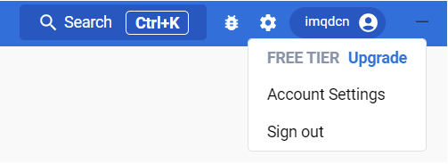

然后通过命令行，运行`docer login `登录，看是否命令行也已经登录成功：

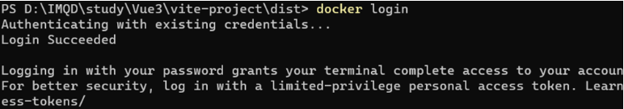

如果你的镜像名字在最开始时没起好名或与其他人发布的镜像名有冲突，可以通过如下方式改名：

```bash
docker tag xxx imqdcn/xxx

# 表示将xxx改名为 imqdcn/xxx,你也可以改为任意你喜欢的名字，比如imqdcn/vue3project
```

至于`tag`名，则可以通过`docker images`看到：

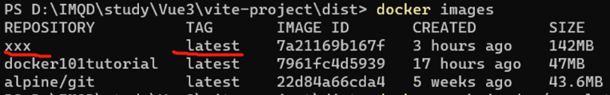

改名后：

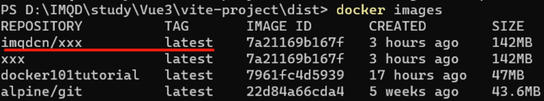

以上都完成，就可以使用 第一条发布指令进行发布了。

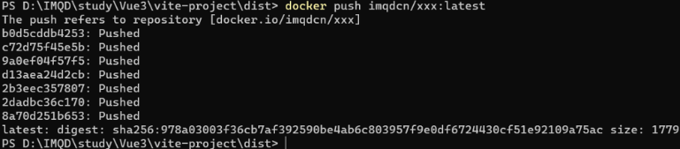

你可以在`docker-desktop`通过搜索该镜像名字找到镜像地址，或打开https://hub.docker.com/查找你发布的镜像：

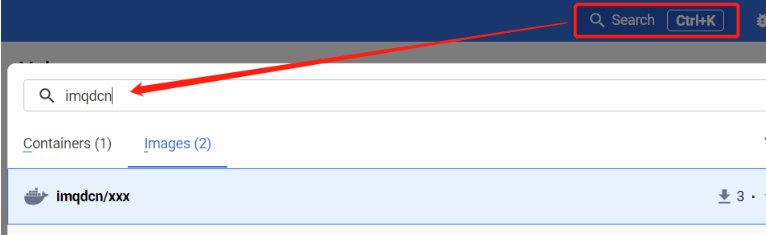

### 2、发布后，其他人如何下载和运行呢？

镜像作者发给你hub镜像地址后，上面有拉取指令：

可以在命令行中先通过执行 `docker pull`下载到本地:

```bash
docker pull imqdcn/xxx
# 如果后面没有写tagname，则使用默认的tagName：latest
12
```

运行以上指令，即可在`docker desktop`看到该镜像，并可运行该镜像。

# 前端有必要学会docker吗

目前大部分公司都会将项目通过`docker`的方式部署到测试、预演、生产环境中。

虽然这些工作基本上都是由后端开发、测试工程师或运维工程师来完成，并不需要前端参与。俗话说技多不压身，从目前趋势来看，`docker`学起来简单，用起来也不复杂，仅从个人技术提升和兴趣爱好方面也是有必要学会的。


案例笔记素材源代码地址：https://www.imqd.cn/why-web-developer-should-study-docker.html

# 利用宝塔面板和docker快速部署网站的基本流程

当你有了一台服务器,就会折腾往这台服务器上部署各种好玩的网站,本文将以部署filebrowser举例介绍网站部署的基本流程

当你有了一台服务器，就会折腾往这台服务器上部署各种好玩的网站。市面上有许多开源的网站项目，通过docker技术可以快速部署并使用，本文将以部署filebrowser举例介绍网站部署的基本流程。

## 1. 安装宝塔面板

宝塔面板是一款开源的网站运维工具，官网为：https://www.bt.cn/new/index.html，Debian系统安装脚本为

```bash
wget -O install.sh https://download.bt.cn/install/install-ubuntu_6.0.sh && bash install.sh ed8484bec
```

## 2. 通过宝塔面板安装docker

docker是一个开源的应用容器引擎，让开发者可以打包或运行镜像实现服务器虚拟化，通过宝塔面板可直接安装

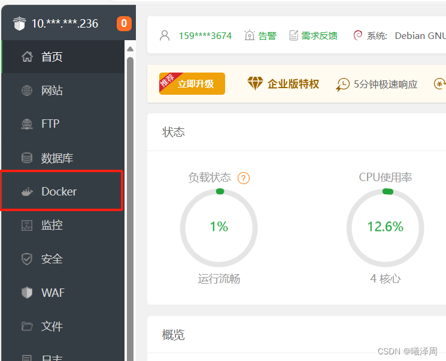

安装完毕后可以通过在ssh工具输入

```bash
docker -v
```

查看安装情况

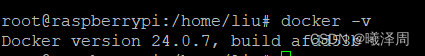

## 3. 下载filebrowser镜像

`docker pull filebrowser/filebrowser`
通过名字可以拉取不同的镜像，也可以在宝塔可视化下载

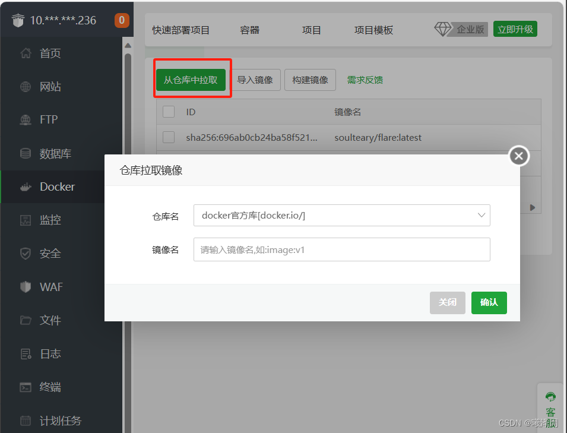

镜像下载后通过

```bash
docker images
```

查看

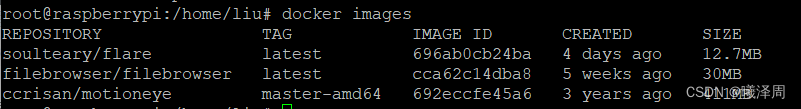

## 4. 使用容器启动镜像

可以使用`docker run `指令直接启动参考 https://filebrowser.org/installation 的docker指令

也可以通过宝塔可视化部署

主要关注容器名字，端口映射，挂载文件夹

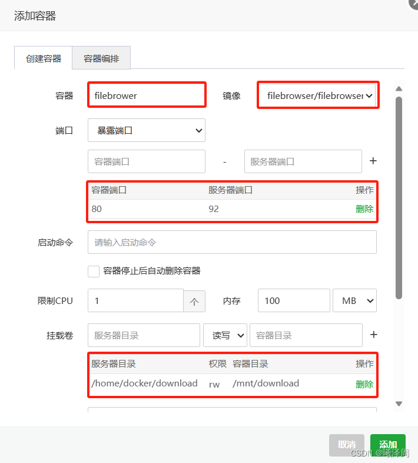

启动容器后通过

```bash
docker ps -a
```

查看所有容器

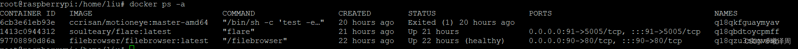

## 5. 启动网页

我们将filebrower容器的80端口映射到了服务器的92端口，所以首先需要保证宝塔面板开启92端口

开启位于宝塔面板

安全 —添加端口规则

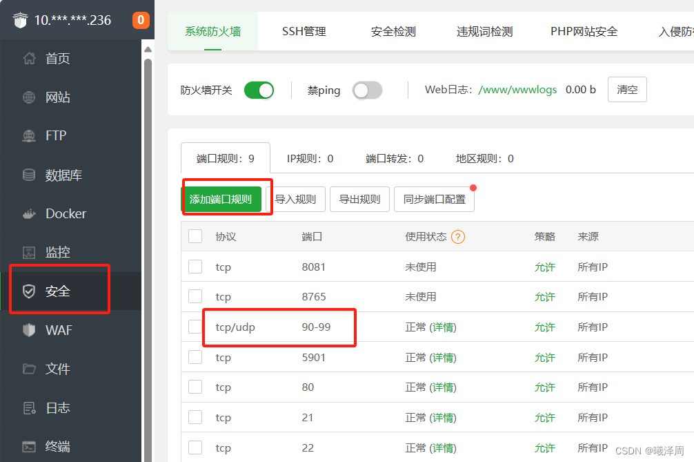

开启后在浏览器输入

```bash
IP地址：92
```

即跳转到容器的80端口，开始访问你部署的网站

## 6. 一些docker指令

`docker -v`：查看版本

`docker pull filebrowser/filebrowser`：拉取镜像

`docker run`：启动镜像

`docker ps`：查看运行中的容器

`docker ps -a`：查看所有容器包括停止的

`docker kill <ID>`：杀死启动中的容器

`docker rm <ID>`：删除容器