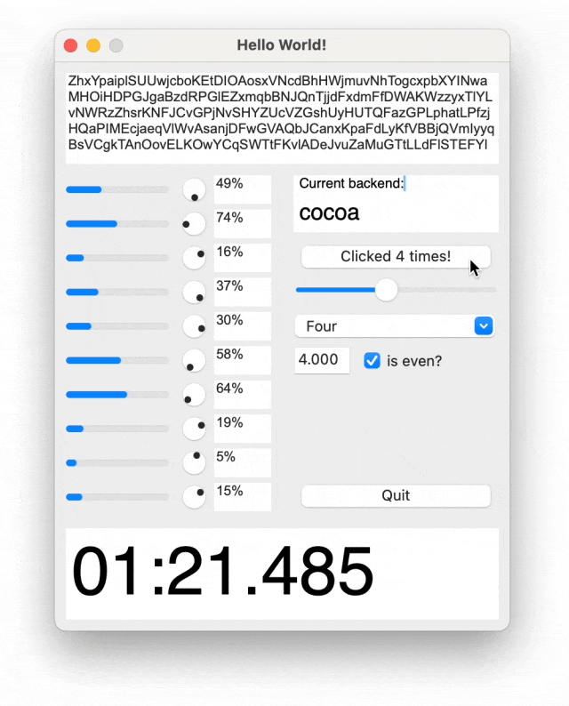

# Go框架

# GUI框架

## Gio：用Go语言编写跨平台即时模式GUI的库

GitHub：https://github.com/gioui/gio

在构建现代应用程序的过程中，不同平台间的兼容性是一个不容忽视的挑战。Go Gio 是一个用 Go 编程语言开发的库，它致力于简化跨平台 GUI(Graphical User Interface，图形用户界面)的构建工作，提供一种所谓的 "即时" (Immediate Mode) 编程模型。这种模型与传统的 "保留模式" (Retained Mode) GUI库，例如 GTK+ 或 Qt，有所不同。在即时模式中，界面的状态不是由库保留，而是每一帧都由应用程序重新构建。

Go Gio 支持的平台包括 Linux, macOS, Windows, Android, iOS, FreeBSD, OpenBSD 和 WebAssembly，几乎涵盖了所有主要的操作系统和运行环境。这使得使用 Go Gio 的开发人员可以编写一次代码，然后在多个平台上运行，而无需考虑各个平台的特定实现。

### Go Gio 核心特性

- **跨平台**：Gio 通过提供统一的API和顺畅的兼容性，实现了真正的跨平台GUI开发。
- **即时模式GUI设计**：Gio采用即时模式设计，每次重新绘制UI而非保留状态，从而简化了状态管理。
- **硬件加速渲染**：利用现代硬件的特性进行加速渲染，提升性能和流畅度。
- **声明式API**：Gio 的API倾向于声明式，使得界面开发直观和模块化。

### 使用 Go Gio 构建一个简单的窗口

在开始使用 Gio 之前，需要先安装 Go 语言环境，然后使用 Go的包管理工具`go get`来安装 Gio。

```
go get gioui.org
```

以下是一个使用 Go Gio 创建窗口的基本例子：

```go
package main

import (
    "gioui.org/app"
    "gioui.org/io/system"
    "gioui.org/layout"
    "gioui.org/op"
)

func main() {
    go func() {
        // 创建新窗口
        w := app.NewWindow()
        var ops op.Ops
        for e := range w.Events() {
            switch e := e.(type) {
            case system.DestroyEvent:
                // 窗口被销毁
                return
            case system.FrameEvent:
                gtx := layout.NewContext(&ops, e)
                // 在这里绘制 UI

                e.Frame(gtx.Ops)
            }
        }
    }()
    app.Main()
}
```

在上述代码中，我们首先调用 `app.NewWindow` 创建一个新的窗口。Gio 会为每个窗口事件（如FrameEvent用于绘制UI，DestroyEvent用于窗口关闭）提供事件循环，我们通过 `w.Events()` 范围循环来处理它们。`system.FrameEvent` 事件允许我们绘制或更新GUI，而 `system.DestroyEvent` 则用于清理资源并关闭窗口。

### 编写跨平台的GUI

借助 Go Gio，我们可以创建各种跨平台的 GUI 应用。每个应用都可以被编译成相应平台的可执行文件。例如，如果要构建面向 MacOS、Windows 和 Linux 的GUI应用，我们可以分别在各自的环境中编译代码，Gio 会处理底层的差异，确保每个平台都能够提供一致的用户体验。

可以探索 Gio 的 例子 来深入了解如何构建实际的GUI应用程序。

### 总结与扩展

Go Gio 证实了 Go 语言在现代GUI开发中的潜力。借助其跨平台性和即时模式的特性，开发者可以高效地创建美观、响应迅速的GUI应用，而且无需担心不同平台间的差异。Gio 继续成熟的同时，它可能会成为越来越多Go开发者的首选UI库。

## **Spot**：用于 Go 语言的类似 React 的桌面 GUI 工具包

****

### Spot 框架简介：

> Spot 是一个简单易用的跨平台 GUI 工具包，专为 Go 语言设计。它利用原生控件，提供一致的 API，让开发者能够专注于业务逻辑，而不必深陷 UI 细节。

#### 核心特性：

- **简单性**：你可以将 Spot 作为一个简单的依赖项添加到你的项目中，并立即开始构建你的 UI。无需使用额外的工具或代码生成步骤。只需编写 Go 代码，即可获得一个自包含的原生 GUI 应用程序。
- **跨平台**：Spot 在可用时使用原生控件，并在编译时自动选择你正在运行的平台的最佳后端。目前，提供了两种后端实现：一个基于**FLTK**[1]的**go-fltk**[2]和一个基于 Cocoa 的**a modified version of**[3] **gocoa**[4]。
- **响应性**：当应用程序的状态发生变化时，Spot 会自动更新 UI。你只需提供无副作用的渲染函数，并使用**`UseState`**[5]钩子管理应用程序的状态。
- **广泛的控件支持**：Spot 开箱即提供广泛的 UI 控件，包括按钮、标签、文本输入、滑块、下拉菜单等。查看完整列表：**支持的 UI 控件列表**[6]。

#### Spot 框架的工作原理：

Spot 框架的工作原理类似于 React，它通过创建不可变的组件树，并在状态改变时重新构建，快速比较前后状态，以确定需要更新的 UI 控件。

### 如何使用 Spot：

使用 Spot 非常简单，你只需要编写 Go 代码，Spot 会帮你生成一个自包含的二进制文件。Spot 还支持自定义钩子和组件，让你能够构建复杂的用户界面。

#### 示例

```go
package main

import (
 "fmt"

 "github.com/roblillack/spot"
 "github.com/roblillack/spot/ui"
)

func main() {
 ui.Init()

 spot.MountFn(func(ctx *spot.RenderContext) spot.Component {
  counter, setCounter := spot.UseState[int](ctx, 0 "int")

  buttonTitle := "点击我!"
  if counter > 0 {
   buttonTitle = fmt.Sprintf("点击了 %d 次!", counter)
  }

  return &ui.Window{
   Title:  "你好，世界!",
   Width:  200,
   Height: 125,
   Children: []spot.Component{
    &ui.Button{
     X: 25, Y: 50, Width: 150, Height: 25,
     Title: buttonTitle,
     OnClick: func() {
      setCounter(counter + 1)
     },
    },
   },
  }
 })

 ui.Run()
}
```

### 常见问题解答

#### “响应式”是什么意思？

在 Spot 的上下文中，“响应式”意味着当应用程序的状态发生变化时，UI 会自动更新。这是通过在状态变化时重新构建一个不可变的组件树实现的，该树可以快速与先前的状态进行比较，以确定需要更新哪些 UI 控件。在 Web 世界中，这个概念通常被称为“虚拟 DOM”，而 Spot 实际上是作为一个实验开始的，目的是通过实现一个类似 React 的桌面 GUI 库，将这个概念引入 Go。

通过使用响应式模型，开发者不需要担心手动更新 UI。相反，开发者可以专注于应用程序逻辑，并让 Spot 负责更新 UI。

#### Spot 使用的“原生控件”是什么？

目前，Spot 在 macOS 上使用 Cocoa 后端，在所有其他平台上使用基于 FLTK 的后端。也可以选择在 Mac 上使用 FLTK。计划未来为 Windows 提供更好的支持。

#### 我可以实施自己的钩子吗？

是的，就像在 React 中一样，你可以实施自己的钩子。只需创建一个函数，该函数以`*spot.RenderContext`作为第一个参数，并使用此函数通过调用`spot.UseState`、`spot.UseEffect`等来“钩入”Spot 生命周期。这里的惯例是在函数名前加上`Use…`前缀。

#### 如何编写自定义组件？

在 Spot 中将 UI 分成组件有几种不同的方法；有关一些想法，请查看`custom-components`示例。编写自定义组件的主要方法是创建一个实现`spot.Component`接口的结构体。这个接口有一个单一的方法，`Render(ctx *spot.RenderContext) spot.Component`，该方法被调用来渲染组件。像这样创建的组件可以像内置组件一样使用。

看看示例中的`BlinkingButton`组件，看看这是怎么做的。

#### 我可以使用 Spot 与提供的不同控件库吗？

可，你只需要创建一些实现`spot.Component`接口的结构体，并负责管理原生控件。

#### 我可以使用`spot/ui`，但是使用不同于 Cocoa 或 FLTK 的后端吗？

目前，这些是唯一支持的后端。但如果你想添加对另一个后端的支持，请随时创建一个 PR。_*暗示暗示*_

#### `spot/ui`和`spot`有什么区别？

`spot`是提供响应式模型和渲染功能的核心包。它是后端不可知的，并且可以与任何实现`spot.Control`接口的控件集合一起使用。

`spot/ui`是一个包，提供了一组预构建的跨平台 GUI 控件，这些控件可以与`spot`一起使用。

#### “组件”和“控件”有什么区别？

在 Spot 中，一个组件是一个包含业务逻辑和状态的应用程序的逻辑单元。任何组件都是由其他组件构成的，并且最终可以渲染为一个或多个“控件”。

一个控件是一种特殊的组件，它被安装到 UI 树中，并在屏幕上表示一个视觉元素。通常，控件由 GUI 后端的原生实现支持，比如按钮、标签或文本输入。

#### “make”、“render”、“build”、“mount”和“update”在 Spot 的上下文中是什么意思？

- **Make**：创建新组件实例的过程。这是通过创建一个实现`spot.Component`接口的结构体实例的引用或通过调用带有渲染函数的`spot.Make`来完成的。
- **Render**：应用组件的状态到其构建块上，并由此返回另一个组件实例的过程。这是通过调用组件实例上的`Render`方法来完成的。
- **Build**：从组件实例创建新的 UI 树的过程。这是通过递归渲染组件来创建控件树，可以通过调用带有组件实例的`spot.Build`或带有渲染函数的`spot.BuildFn`来完成。
- **Mount**：从（虚拟的）控件树创建真正的 UI 控件的过程。这是通过在树节点上调用`Mount`或`spot.Mount`与组件实例或`spot.MountFn`与渲染函数来完成的。
- **Update**：更新（已安装的）控件树的过程。这是通过在树节点上调用`Update`来完成的。

### Spot 目前没有的特性

- 自动布局
- 多个窗口
- 模态对话框
- 可调整大小的窗口
- 菜单栏
- 自定义控件
- 访问原生控件
- 拖放
- 国际化

### 支持的 UI 控件列表

状态列的说明：❓ 未实现 / 🚧 进行中 / ⚠️ 部分实现 / ✅ 完成

| 名称                | 描述                                             | 使用的原生控件                                               | 状态   |
| :------------------ | :----------------------------------------------- | :----------------------------------------------------------- | :----- |
| **Button**[7]       | 简单的按钮，用于启动操作                         | **Fl_Button**[8] **NSButton**[9]                             | ✅      |
| **Checkbox**[10]    | 提供用户两种互斥选项选择的控件                   | **Fl_Check_Button**[11] **NSButton**[12] (**NSButtonTypeSwitch**[13]) | ✅      |
| ComboBox            | 结合下拉菜单和文本输入的组合                     | ComboBox NSComboBox                                          | 未开始 |
| **Dial**[14]        | 圆形状态控件                                     | **Fl_Dial**[15] **NSProgressIndicator**[16] （使用 `NSCircular` 风格） | ⚠️      |
| **Dropdown**[17]    | 下拉菜单，从多个选项中选择单个项目               | **Fl_Choice**[18] **NSComboBox**[19]                         | ✅      |
| Image               | 图像控件                                         | Image NSImageView                                            | 未开始 |
| **Label**[20]       | 简单、不可编辑的文本标签                         | **Fl_Box**[21] **NSTextField**[22]                           | ✅      |
| **ListBox**[23]     | 滚动控件，允许用户从给定列表中选择单个或多个项目 | **Fl_Select_Browser**[24]/**Fl_Multi_Browser**[25] **NSTableView**[26] | ✅      |
| **ProgressBar**[27] | 进度条控件，用于可视化长时间运行操作的进度       | **Fl_Progress**[28] **NSProgressIndicator**[29]              | ✅      |
| **Slider**[30]      | 水平滑动输入控件                                 | **Fl_Slider**[31] **NSSlider**[32]                           | ✅      |
| **Spinner**[33]     | 带上升/下按钮的数字输入控件                      | **Fl_Spinner**[34] **NSTextField**[35]+**NSStepper**[36]     | ✅      |
| **TextField**[37]   | 单行文本输入控件                                 | **Fl_Input**[38] **NSTextField**[39]                         | ✅      |
| TextView/TextEditor | 用于查看/编辑多行文本内容的通用文本框            | Text NSTextView                                              | 🚧      |
| **Window**[40]      | 表示屏幕上（顶级）窗口的控件                     | **Fl_Window**[41] **NSWindow**[42]                           | ✅      |

### 可能的未来后端

- 原生 Windows 控件：https://github.com/rodrigocfd/windigo

#### Spot 的未来展望

虽然 Spot 目前还不支持自动布局、多窗口、模态对话框等高级功能，但它的潜力巨大。社区正在积极开发，未来可能会支持更多的后端和控件。

### 结语：

Spot 框架的出现，为 Go 语言开发者提供了一个全新的选择。它不仅简化了桌面应用的开发流程，还提高了开发效率。无论你是 Go 语言的新手还是老手，Spot 都值得一试。

### 参考资料

[1] FLTK: https://fltk.org

[2] go-fltk: https://github.com/pwiecz/go-fltk

[3] a modified version of: https://github.com/roblillack/gocoa

[4] gocoa: https://github.com/mojbro/gocoa

[5] `UseState`: https://pkg.go.dev/github.com/roblillack/spot#UseState

[6] 支持的 UI 控件列表: #支持的ui控件列表

[7] Button: https://pkg.go.dev/github.com/roblillack/spot/ui#Button

[8] Fl_Button: https://www.fltk.org/doc-1.4/classFl__Button.html

[9] NSButton: https://developer.apple.com/documentation/appkit/nsbutton

[10] Checkbox: https://pkg.go.dev/github.com/roblillack/spot/ui#Checkbox

[11] Fl_Check_Button: https://www.fltk.org/doc-1.4/classFl__Check__Button.html

[12] NSButton: https://developer.apple.com/documentation/appkit/nsbutton

[13] NSButtonTypeSwitch: https://developer.apple.com/documentation/appkit/nsbuttontype/nsbuttontypeswitch

[14] Dial: https://pkg.go.dev/github.com/roblillack/spot/ui#Dial

[15] Fl_Dial: https://www.fltk.org/doc-1.4/classFl__Dial.html

[16] NSProgressIndicator: https://developer.apple.com/documentation/appkit/nsprogressindicator

[17] Dropdown: https://pkg.go.dev/github.com/roblillack/spot/ui#Dropdown

[18] Fl_Choice: https://www.fltk.org/doc-1.4/classFl__Choice.html

[19] NSComboBox: https://developer.apple.com/documentation/appkit/nscombobox

[20] Label: https://pkg.go.dev/github.com/roblillack/spot/ui#Label

[21] Fl_Box: https://www.fltk.org/doc-1.4/classFl__Box.html

[22] NSTextField: https://developer.apple.com/documentation/appkit/nstextfield

[23] ListBox: https://pkg.go.dev/github.com/roblillack/spot/ui#ListBox

[24] Fl_Select_Browser: https://www.fltk.org/doc-1.4/classFl__Select__Browser.html

[25] Fl_Multi_Browser: https://www.fltk.org/doc-1.4/classFl__Multi__Browser.html

[26] NSTableView: https://developer.apple.com/documentation/appkit/nstableview

[27] ProgressBar: https://pkg.go.dev/github.com/roblillack/spot/ui#ProgressBar

[28] Fl_Progress: https://www.fltk.org/doc-1.4/classFl__Progress.html

[29] NSProgressIndicator: https://developer.apple.com/documentation/appkit/nsprogressindicator

[30] Slider: https://pkg.go.dev/github.com/roblillack/spot/ui#Slider

[31] Fl_Slider: https://www.fltk.org/doc-1.4/classFl__Slider.html

[32] NSSlider: https://developer.apple.com/documentation/appkit/nsslider

[33] Spinner: https://pkg.go.dev/github.com/roblillack/spot/ui#Spinner

[34] Fl_Spinner: https://www.fltk.org/doc-1.4/classFl__Spinner.html

[35] NSTextField: https://developer.apple.com/documentation/appkit/nstextfield

[36] NSStepper: https://developer.apple.com/documentation/appkit/nsstepper

[37] TextField: https://pkg.go.dev/github.com/roblillack/spot/ui#TextField

[38] Fl_Input: https://www.fltk.org/doc-1.4/classFl__Input.html

[39] NSTextField: https://developer.apple.com/documentation/appkit/nstextfield

[40] Window: https://pkg.go.dev/github.com/roblillack/spot/ui#Window

[41] Fl_Window: https://www.fltk.org/doc-1.4/classFl__Window.html

[42] NSWindow: https://developer.apple.com/documentation/appkit/nswindow

# Web框架

## Fiber：号称Golang最快的Web框架

**Github地址**：https://github.com/gofiber/fiber

Fiber是在Go最快的HTTP引擎Fasthttp之上构建的Go web框架。它的设计目的是在考虑到零内存分配和性能的情况下简化快速开发。

### 它的特性：

- 稳健的路由
- 提供静态文件
- 极致性能
- 内存占用空间低
- API终点
- 中间件和Next支持
- 快速服务器端编程
- 模板引擎
- WebSocket支持
- Socket.io支持
- 服务器发送的事件
- 速率限制器


Fiber的灵感来源于互联网上最流行的web框架Express。我们结合了Express的易用性和Go的原始性能。如果您曾经在Node.js中实现过web应用程序（使用Express或类似工具），那么许多方法和原理对您来说都是非常常见的。

使用Fiber注意事项，由于Fiber使用了unsafe，库可能并不总是与最新的Go版本兼容。Fiber3.0.0已通过Go版本1.21和1.22的测试。Fiber v3还在开发中，对于生产使用还不稳定，推荐选择Fiber v2。如果你想尝鲜，可以选择Fiber v3。Fiber与net/http接口不兼容，这意味着你将无法使用像gqlgen、go swagger或任何其他属于net/http生态系统的项目。

### Hello World演示项目：

```
package main

import (
    "log"

    "github.com/gofiber/fiber/v3"
)

func main() {
    // Initialize a new Fiber app
    app := fiber.New()

    // Define a route for the GET method on the root path '/'
    app.Get("/", func(c fiber.Ctx) error {
        // Send a string response to the client
        return c.SendString("Hello, World 👋!")
    })

    // Start the server on port 3000
    log.Fatal(app.Listen(":3000"))
}
```


让我们看下它的路由的写法：

```go

func main() {
    app := fiber.New()

    // GET /api/register
    app.Get("/api/*", func(c fiber.Ctx) error {
        msg := fmt.Sprintf("✋ %s", c.Params("*"))
        return c.SendString(msg) // => ✋ register
    })

    // GET /flights/LAX-SFO
    app.Get("/flights/:from-:to", func(c fiber.Ctx) error {
        msg := fmt.Sprintf("💸 From: %s, To: %s", c.Params("from"), c.Params("to"))
        return c.SendString(msg) // => 💸 From: LAX, To: SFO
    })

    // GET /dictionary.txt
    app.Get("/:file.:ext", func(c fiber.Ctx) error {
        msg := fmt.Sprintf("📃 %s.%s", c.Params("file"), c.Params("ext"))
        return c.SendString(msg) // => 📃 dictionary.txt
    })

    // GET /john/75
    app.Get("/:name/:age/:gender?", func(c fiber.Ctx) error {
        msg := fmt.Sprintf("👴 %s is %s years old", c.Params("name"), c.Params("age"))
        return c.SendString(msg) // => 👴 john is 75 years old
    })

    // GET /john
    app.Get("/:name", func(c fiber.Ctx) error {
        msg := fmt.Sprintf("Hello, %s 👋!", c.Params("name"))
        return c.SendString(msg) // => Hello john 👋!
    })

    log.Fatal(app.Listen(":3000"))
}
```

Fiber是一个不错的Go Web框架，它有完善的文档，丰富的功能，极高的性能。

## Gin：HTTP Web 框架

**GitHub地址**：https://github.com/gin-gonic/gin

Gin 是一个用 Go (Golang) 编写的 HTTP Web 框架。它具有类似 Martini 的 API，但性能比 Martini 快 40 倍。如果你需要极好的性能，使用 Gin 吧。

它的特性如下：

- 快速，基于 Radix 树的路由，小内存占用。没有反射。可预测的 API 性能。
- 支持中间件传入的 HTTP 请求，可以由一系列中间件和最终操作来处理。例如：Logger，Authorization，GZIP，最终操作 DB。
- Crash 处理，Gin 可以 catch 一个发生在 HTTP 请求中的 panic 并 recover 它。这样，你的服务器将始终可用。例如，你可以向 Sentry 报告这个 panic！
- JSON 验证，Gin 可以解析并验证请求的 JSON，例如检查所需值的存在。
- 路由组可更好地组织路由。是否需要授权，不同的 API 版本…… 此外，这些组可以无限制地嵌套而不会降低性能。
- 错误管理，Gin 提供了一种方便的方法来收集 HTTP 请求期间发生的所有错误。最终，中间件可以将它们写入日志文件，数据库并通过网络发送。
- 内置渲染，Gin 为 JSON，XML 和 HTML 渲染提供了易于使用的 API。
- 可扩展性，Gin可通过中间件进行扩展。

Gin要求Golang版本1.13及以上。要使用Gin，需要先安装 Go 并设置 Go 工作区。

### 1.下载并安装 gin：

```
$ go get -u github.com/gin-gonic/gin
```

### 2.将 gin 引入到代码中：

```
import "github.com/gin-gonic/gin"
```

### 3.（可选）如果使用诸如 `http.StatusOK` 之类的常量，则需要引入 `net/http` 包：

```
import "net/http"
```

### Gin一个简单的例子：

```
package main

import "github.com/gin-gonic/gin"

func main() {
	r := gin.Default()
	r.GET("/ping", func(c *gin.Context) {
		c.JSON(200, gin.H{
			"message": "pong",
		})
	})
	r.Run() // 监听并在 0.0.0.0:8080 上启动服务
}
```

Gin是Golang中使用的比较多的Web框架，也比较有名，GitHub Star也很高。在招聘中我们会经常看到招聘要求中提到这么一句，工作中使用过Gin。

# 游戏开发

## go3d：Go语言游戏方向的高性能2D/3D数学库

`go3d`的官方文档: https://pkg.go.dev/github.com/ungerik/go3d

在面向性能的编程世界中，`go3d`是为Go语言提供的一款2D/3D数学库，致力于提高图形计算的效率与速度。

适用于那些需要进行向量、矩阵等数学计算以实现图形处理的应用程序，`go3d`提供了一套丰富的API，以支持高效的数学运算。

下面，我们将深入了解这个库的主要特性、结构和使用方式，以及如何在项目中有效利用它。

### 主要特性

- **高性能设计**：`go3d`库主要关注于性能，通过优化算法和数据结构来减少计算时间和内存消耗。
- **详尽的数学类型支持**：支持2D和3D空间内的基础和高级数学运算，包括向量（vec2, vec3, vec4）和矩阵（mat2, mat3, mat4）的操作。
- **数据类型优化**：包内包含`float64`子目录，使用`float64`值代替`float32`以支持更精确的数学运算。
- **OpenGL和DirectX的友好支持**：矩阵按列组织，符合OpenGL的期望。对于DirectX期望的“按行”矩阵，可通过`Transpose()`方法转换。
- **链式调用**：很多方法返回结构体指针，便于链式调用，以提高代码的编写效率。

### 核心组件分析

**Vector（向量）**

`go3d`提供了一套丰富的向量操作API。举个例子，`vec3`是3D向量类型的包，拥有如下方法和函数：

- 基础操作：加法（`Add`）、缩放（`Scale`）
- 进阶运算：点积（`Dot`）

示例代码：

```
a := vec3.Zero    // 创建一个0向量
b := vec3.UnitX   // X单位向量
a.Add(&b).Scale(5) // 链式调用：向a加上b后，再缩放5倍
```

**Matrix（矩阵）**

矩阵操作是`go3d`的另一大特色，提供了包括矩阵乘法、转置等基础与进阶操作。工具库以列为矩阵的组织形式，这一点在与OpenGL的结合应用中特别有用。

### 使用场景

- **游戏开发**：在游戏图形处理中，经常需要进行大量的向量和矩阵运算。`go3d`针对性能优化的设计，使其成为游戏开发中理想的数学库选项。
- **图形软件**：软件中的图形变换、坐标映射等操作，都能通过`go3d`提供的API进行高效处理。
- **科学计算**：虽然主要针对图形计算，但`go3d`因其高性能特性，也适用于需要大量数学运算的科学计算场景。

### 开始使用

首先，您需要将`go3d`库包含到您的Go项目中。通过执行下面的命令，可以轻松导入：

```
go get github.com/ungerik/go3d
```

之后，根据您的计算需求选择相应的包和方法进行开发。详细的使用说明和API文档，可以参考**`go3d`的官方文档**[1]。

### 总结

`go3d`通过其高性能的设计和对2D/3D数学运算的广泛支持，为Go语言在图形计算领域提供了强有力的工具。无论是游戏开发还是图形软件的设计，`go3d`都能帮您高效地解决数学运算的需求，让您的项目更加出色。