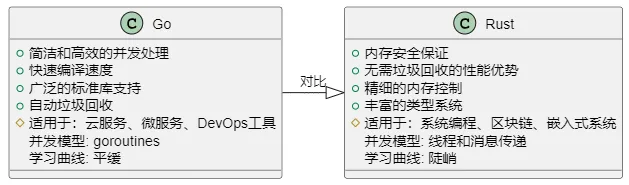

# Go语言学习路线

Go语言（或Golang）是由Google开发的一种静态类型、编译型语言，以其高效、简洁和易于并发编程而闻名。对于初学者及有经验的开发者而言，掌握Go语言不仅能够提升开发效率，还能够在高并发、高性能的场景中如鱼得水。本文将详细介绍Go开发者的学习成长路线，帮助你从入门到精通。

## **入门阶段**

### **1. 理解Go语言的基本语法**

要开始学习Go语言，首先需要理解其基本语法。这包括变量声明、数据类型、控制结构、函数定义等。

```go
package main

import "fmt"

func main() {
    var name string = "Go语言"
    var version int = 1

    fmt.Println("语言名称:", name)
    fmt.Println("版本:", version)
}
```

在上面的示例中，我们定义了两个变量 `name` 和 `version`，并使用 `fmt.Println` 函数来输出它们的值。

### **2. 熟悉Go语言的包管理**

Go语言的包管理系统是其一大特点。每个Go程序都是由一个或多个包组成的。通过 `go get` 工具，可以方便地获取和管理第三方库。

```
go get github.com/gorilla/mux
```

上述命令将下载并安装 `gorilla/mux` 路由包，这是一个用于构建强大路由器的库。

### **3. 掌握Go语言的并发编程**

Go语言的并发编程模型使其在处理多线程任务时非常高效。Go通过 `goroutine` 和 `channel` 实现并发编程。

```go
package main

import (
    "fmt"
    "time"
)

func printNumbers() {
    for i := 1; i <= 5; i++ {
        fmt.Println(i)
        time.Sleep(1 * time.Second)
    }
}

func main() {
    go printNumbers()
    fmt.Println("开始并发任务")
    time.Sleep(6 * time.Second)
    fmt.Println("并发任务结束")
}
```

在这个例子中，`printNumbers` 函数在一个新的 `goroutine` 中运行，实现了并发执行。

## **进阶阶段**

### **1. 深入理解Go语言的类型系统**

Go语言的类型系统是其核心特性之一。理解接口、结构体和类型别名是进阶学习的关键。

```go
package main

import "fmt"

type Animal interface {
    Speak() string
}

type Dog struct {}

func (d Dog) Speak() string {
    return "Woof!"
}

type Cat struct {}

func (c Cat) Speak() string {
    return "Meow!"
}

func main() {
    var d Animal = Dog{}
    var c Animal = Cat{}

    fmt.Println(d.Speak())
    fmt.Println(c.Speak())
}
```

在这个例子中，我们定义了一个 `Animal` 接口和两个实现了该接口的结构体 `Dog` 和 `Cat`。

### **2. 理解Go语言的错误处理**

Go语言采用了一种独特的错误处理机制，通过返回值来处理错误，而不是使用异常。

```go
package main

import (
    "errors"
    "fmt"
)

func divide(a, b float64) (float64, error) {
    if b == 0 {
        return 0, errors.New("division by zero")
    }
    return a / b, nil
}

func main() {
    result, err := divide(4, 0)
    if err != nil {
        fmt.Println("错误:", err)
    } else {
        fmt.Println("结果:", result)
    }
}
```

在这个示例中，我们的 `divide` 函数返回一个错误，当除数为零时触发。

### **3. 掌握Go语言的工具链**

Go语言提供了一系列工具来辅助开发，包括 `go fmt`、`go test`、`go build` 等。

```go
# 格式化代码
go fmt main.go

# 运行测试
go test ./...

# 编译代码
go build -o myapp main.go
```

这些工具不仅可以提高开发效率，还能保证代码质量。

## **高级阶段**

### **1. 掌握Go语言的性能调优**

为了在生产环境中实现高性能，理解并掌握性能调优技巧是必要的。这包括使用 `pprof` 进行性能分析。

```go
package main

import (
    "net/http"
    _ "net/http/pprof"
)

func main() {
    go func() {
        http.ListenAndServe("localhost:6060", nil)
    }()
    
    // 其他代码逻辑
}
```

在上述代码中，通过引入 `_ "net/http/pprof"` 包，并启动一个监听在 `localhost:6060` 的 HTTP 服务器，可以对Go程序进行性能分析。

### **2. 深入理解Go语言的内存管理**

内存管理是高性能编程的重要环节。Go语言通过垃圾回收机制管理内存，但理解如何优化内存使用依然是高级开发者的必修课。

```go
package main

import "fmt"

func main() {
    s := make([]int, 0)
    for i := 0; i < 1000; i++ {
        s = append(s, i)
    }
    fmt.Println("切片长度:", len(s))
}
```

在这个示例中，我们使用 `make` 函数来创建一个切片，并通过 `append` 函数动态扩展它的容量。理解切片的底层实现能够帮助我们更好地管理内存。

### **3. 掌握Go语言的网络编程**

网络编程是Go语言的强项之一，尤其适用于编写高性能的网络服务。

```go
package main

import (
    "fmt"
    "net"
)

func handleConnection(conn net.Conn) {
    buffer := make([]byte, 1024)
    for {
        n, err := conn.Read(buffer)
        if err != nil {
            fmt.Println("读取错误:", err)
            return
        }
        fmt.Println("接收到的数据:", string(buffer[:n]))
    }
}

func main() {
    listener, err := net.Listen("tcp", "localhost:8080")
    if err != nil {
        fmt.Println("监听错误:", err)
        return
    }
    defer listener.Close()

    fmt.Println("服务器正在监听端口 8080")

    for {
        conn, err := listener.Accept()
        if err != nil {
            fmt.Println("连接接受错误:", err)
            return
        }
        go handleConnection(conn)
    }
}
```

在这个示例中，我们实现了一个简单的TCP服务器，能够接收并处理来自客户端的连接。

## **专业阶段**

### **1. 深入理解Go语言的设计模式**

设计模式是软件开发中的最佳实践。掌握常见的设计模式，如单例模式、工厂模式、观察者模式等，能够帮助你编写更优雅和可维护的代码。

```go
package main

import "sync"

// 单例模式
type singleton struct{}

var instance *singleton
var once sync.Once

func GetInstance() *singleton {
    once.Do(func() {
        instance = &singleton{}
    })
    return instance
}

func main() {
    s1 := GetInstance()
    s2 := GetInstance()

    fmt.Println(s1 == s2) // 输出: true
}
```

在这个示例中，我们使用 `sync.Once` 实现了单例模式，确保 `singleton` 实例在整个应用程序生命周期内只有一个。

### **2. 掌握Go语言的分布式系统开发**

分布式系统是现代应用程序的趋势。学习如何使用Go语言开发分布式系统，并掌握相关的工具和框架（如gRPC、etcd等），能够提升你的开发能力。

```go
package main

import (
    "context"
    "fmt"
    "google.golang.org/grpc"
    pb "path/to/your/proto/package"
)

func main() {
    conn, err := grpc.Dial("localhost:50051", grpc.WithInsecure())
    if err != nil {
        fmt.Println("连接失败:", err)
        return
    }
    defer conn.Close()

    client := pb.NewYourServiceClient(conn)
    response, err := client.YourMethod(context.Background(), &pb.YourRequest{})
    if err != nil {
        fmt.Println("请求失败:", err)
        return
    }

    fmt.Println("响应:", response)
}
```

在这个示例中，我们使用gRPC库来进行远程过程调用，实现了客户端与服务端之间的通信。

### **3. 掌握Go语言的安全编程**

安全是软件开发中的重要环节。理解如何编写安全的代码，如何进行安全审计，以及如何防范常见的安全漏洞（如SQL注入、XSS攻击等），是专业开发者必须掌握的技能。

```go
package main

import (
    "database/sql"
    "fmt"
    _ "github.com/go-sql-driver/mysql"
)

func main() {
    db, err := sql.Open("mysql", "user:password@/dbname")
    if err != nil {
        fmt.Println("数据库连接错误:", err)
        return
    }
    defer db.Close()

    query := "SELECT name FROM users WHERE id = ?"
    id := 1

    var name string
    err = db.QueryRow(query, id).Scan(&name)
    if err != nil {
        if err == sql.ErrNoRows {
            fmt.Println("没有找到对应的用户")
        } else {
            fmt.Println("查询错误:", err)
        }
        return
    }

    fmt.Println("用户名:", name)
}
```

在这个示例中，我们使用参数化查询来防止SQL注入攻击，这是一种常见的安全编程实践。

## **专家阶段**

### **1. 掌握Go语言的高并发编程**

高并发编程是Go语言的一大优势。深入理解Go语言的协程（goroutine）和通道（channel）机制，能够帮助开发者编写高效的并发代码。

```go
package main

import (
    "fmt"
    "sync"
)

func worker(id int, wg *sync.WaitGroup) {
    defer wg.Done()
    fmt.Printf("Worker %d starting\n", id)
    // 模拟工作
    fmt.Printf("Worker %d done\n", id)
}

func main() {
    var wg sync.WaitGroup
    for i := 1; i <= 5; i++ {
        wg.Add(1)
        go worker(i, &wg)
    }
    wg.Wait()
}
```

在这个示例中，我们使用 `sync.WaitGroup` 来等待所有协程完成工作，从而实现高并发的任务调度。

### **2. 深入掌握Go语言的性能优化**

性能优化是高级开发者必备的技能。通过工具（如pprof、trace等）和技术（如内存对齐、减少垃圾回收等），可以对Go程序进行深入的性能分析和优化。

```go
package main

import (
    "fmt"
    "runtime"
    "time"
)

func main() {
    var m runtime.MemStats

    runtime.ReadMemStats(&m)
    fmt.Printf("Alloc = %v MiB", m.Alloc / 1024 / 1024)
    fmt.Printf("\tTotalAlloc = %v MiB", m.TotalAlloc / 1024 / 1024)
    fmt.Printf("\tSys = %v MiB", m.Sys / 1024 / 1024)
    fmt.Printf("\tNumGC = %v\n", m.NumGC)

    // 模拟工作
    time.Sleep(5 * time.Second)

    runtime.ReadMemStats(&m)
    fmt.Printf("Alloc = %v MiB", m.Alloc / 1024 / 1024)
    fmt.Printf("\tTotalAlloc = %v MiB", m.TotalAlloc / 1024 / 1024)
    fmt.Printf("\tSys = %v MiB", m.Sys / 1024 / 1024)
    fmt.Printf("\tNumGC = %v\n", m.NumGC)
}
```

在这个示例中，我们使用 `runtime.MemStats` 统计和打印内存使用情况，帮助我们进行内存优化。

### **3. 掌握Go语言的工具链**

Go语言提供了一系列强大的工具链，如 `go fmt`、`go vet`、`go test`、`go build`、`go mod` 等，掌握并熟练使用这些工具能够极大地提升开发效率和代码质量。

```bash
# 格式化代码
go fmt ./...

# 代码静态检查
go vet ./...

# 运行单元测试
go test ./...

# 编译项目
go build -o myapp main.go

# 管理依赖
go mod tidy
```

### **4. 深入理解Go语言的生态系统**

Go语言拥有丰富的生态系统，包括Web框架（如Gin、Echo）、数据库驱动（如GORM、XORM）、消息队列（如NATS、NSQ）等。深入理解并灵活运用这些第三方库和工具，能够大幅提升开发效率。

```go
package main

import (
    "github.com/gin-gonic/gin"
    "net/http"
)

func main() {
    r := gin.Default()

    r.GET("/ping", func(c *gin.Context) {
        c.JSON(http.StatusOK, gin.H{
            "message": "pong",
        })
    })

    r.Run() // 监听并在 0.0.0.0:8080 上启动服务
}
```

在这个示例中，我们使用Gin框架实现了一个简单的HTTP服务器。

## **进一步学习建议**

### **1. 阅读官方文档和标准库**

Go语言官方文档和标准库是学习Go的最佳资源。通过阅读官方文档，可以深入理解语言特性和标准库的使用方法。

- Go官方文档[1]
- Go标准库[2]

### **2. 参与开源项目**

参与开源项目是提高编程技能的绝佳途径。通过阅读和贡献开源代码，可以学习到最佳实践和高级编程技巧。

- Go语言开源项目列表[3]
- GitHub上的Go项目[4]

### **3. 学习设计模式和架构**

设计模式和软件架构是编写高质量代码的关键。通过学习常见的设计模式和架构，可以编写出更具可维护性和扩展性的代码。

- 设计模式（Design Patterns）[5]
- Clean Architecture[6]

### **4. 深入了解并发编程**

并发编程是Go语言的一大优势。深入理解并发编程的概念和实践，可以编写出高效的并发代码。

- Go并发编程模式[7]
- Go并发编程的GopherCon演讲[8]

### **5. 学习性能调优和故障排除**

性能调优和故障排除是高级开发者必备的技能。通过学习性能调优和故障排除的工具和方法，可以提高程序的性能和稳定性。

- Go性能优化[9]
- Go故障排除[10]

## **推荐学习资源**

### **在线课程**

- Coursera: Programming with Google Go[11]
- Udemy: Learn How To Code: Google's Go (golang) Programming Language[12]

### **书籍**

- The Go Programming Language[13]
- Go in Action[14]
- Concurrency in Go[15]

### **社区和论坛**

- Gophers Slack[16]
- Stack Overflow (Go)[17]
- Reddit r/golang[18]

## **结语**

通过不断学习和实践，开发者可以全面掌握Go语言的各项技能。从基础语法到高并发编程，从性能优化到工具链使用，逐步提升自己的编程水平。希望本文的学习路径和资源推荐能够帮助你在Go语言的学习之路上不断进步，成为一名优秀的Go开发者。

祝你学习愉快！

**参考资料**

[1] Go官方文档: *https://golang.org/doc/*

[2] Go标准库: *https://pkg.go.dev/std*

[3] Go语言开源项目列表: *https://github.com/avelino/awesome-go*

[4] GitHub上的Go项目: *https://github.com/topics/golang*

[5] 设计模式（Design Patterns）: *https://refactoring.guru/design-patterns*

[6] Clean Architecture: *https://www.amazon.com/Clean-Architecture-Craftsmans-Software-Structure/dp/0134494164*

[7] Go并发编程模式: *https://github.com/golang/go/wiki/Concurrency*

[8] Go并发编程的GopherCon演讲: *https://www.youtube.com/watch?v=yU7jJ3NbPdA*

[9] Go性能优化: *https://dave.cheney.net/high-performance-go-workshop/gophercon-2018.html*

[10] Go故障排除: *https://medium.com/@cep21/debugging-go-code-a4a9d4b9f1b8*

[11] Coursera: Programming with Google Go: *https://www.coursera.org/specializations/google-golang*

[12] Udemy: Learn How To Code: Google's Go (golang) Programming Language: *https://www.udemy.com/course/learn-how-to-code/*

[13] The Go Programming Language: *https://www.gopl.io/*

[14] Go in Action: *https://www.manning.com/books/go-in-action*

[15] Concurrency in Go: *https://www.oreilly.com/library/view/concurrency-in-go/9781491941294/*

[16] Gophers Slack: *https://invite.slack.golangbridge.org/*

[17] Stack Overflow (Go): *https://stackoverflow.com/questions/tagged/go*

[18] Reddit r/golang: *https://www.reddit.com/r/golang/*

# Go学习资源

## Go汇编示例

### [Go Assembly 示例](https://colobu.com/goasm/)

[Go](http://golang.org/) 是一个开源的编程语言，用来构建简单、快速、可信赖的软件。

*Go Assembly 示例* 手把手的通过示例介绍Go汇编功能。 查看[第一个例子](https://colobu.com/goasm/add.html) 或者查看下面的所有列表。

除了翻译自lyon01_david的[示例](https://www.davidwong.fr/goasm/)外，我也会增加一些Go汇编的示例，比如获取goroutine 的ID等。

相关的ASM文档：

- [A Quick Guide to Go's Assembler](https://golang.org/doc/asm)
- [A Foray Into Go Assembly Programming](https://blog.sgmansfield.com/2017/04/a-foray-into-go-assembly-programming/)
- [Go汇编语言补充参考](http://quasilyte.dev/blog/post/go-asm-complementary-reference/)
- [Go高级编程-汇编语言](https://chai2010.cn/advanced-go-programming-book/ch3-asm/readme.html)


- [Add](https://colobu.com/goasm/add.html)
- [Hello](https://colobu.com/goasm/hello.html)
- [Arcsin](https://colobu.com/goasm/arcsin.html)
- [Sync Atomic](https://colobu.com/goasm/sync-atomic.html)
- [AES](https://colobu.com/goasm/aes.html)
- [Sqrt](https://colobu.com/goasm/sqrt.html)
- [goroutineid](https://colobu.com/goasm/goroutineid.html)
- [noescape](https://colobu.com/goasm/noescape.html)

by [@lyon01_david](https://www.davidwong.fr/goasm/) | based on [Go by Example](https://gobyexample.com/) by [@mmcgrana](https://twitter.com/mmcgrana)
翻译 by [smallnest](http://colobu.com/)

## Go Web开发示例

Go Web 示例 - 通过 Examples 在 Go 中学习 Web 编程：https://gowebexamples.com/

## Go 数据库开发教程

Go database/sql 教程：http://go-database-sql.org/

## Go 语言编程技巧

https://github.com/smallnest/gotips


这是 [Phuong Le](https://twitter.com/func25) 在X上发布的一系列的技巧。 Phuong Le也将推文整理成到了一个github仓库中[go-practical-tips](https://github.com/func25/go-practical-tips)

征得作者同意，翻译成了中文。

本书是基于Phuong Le的推文进行翻译的，同时也新建一个说明，按照作者github项目上的划分整理各个tip。

感谢以下网友共同进行了翻译，翻译进展迅速。

正如作者所说，有些tip可能有一些错误：

> Some of the tips were awkward, with typos and naive explanations.

我们翻译的时候也发现了作者的一些手误，或者错误，及时做了注解和纠正。难免还有一些问题，欢迎大家到github提issue或者提Pull request.

翻译网站：[gotips](https://github.com/smallnest/gotips)。


## RPCX官网

RPCX：https://rpcx.io/

## RPC开发指南

Introduction · Go RPC编程指南：https://cn.doc.rpcx.io/

# Go与Rust：未来的软件开发大比拼

Go语言和Rust语言作为现代编程语言，在软件开发领域有着广泛的应用和不小的影响力。它们各自的特点、优势和适用场景各异，也各自拥有一批忠实的拥护者。本文将详细探讨这两种语言的设计哲学、性能特点、使用场景以及未来发展趋势。

#### 一、Go语言的设计理念和应用场景

Go语言由Google开发，旨在提高大型软件项目的开发效率。Go的设计哲学强调简洁、高效和可读性。它的并发模型是基于`goroutines`和`channels`，使得并发编程变得简单易操控。Go的垃圾回收机制、静态类型和强大的标准库也为开发者提供了极大的便利。此外，Go语言的编译速度非常快，适用于快速迭代的开发环境。

Go语言广泛应用于网络服务器、数据管道和分布式系统等后端服务中，被许多知名公司如Google、Uber和Twitch等广泛使用。

#### 二、Rust语言的设计理念和应用场景

Rust语言由Mozilla赞助开发，设计初衷是为了提供更安全的内存管理而不牺牲性能。Rust的借用检查器（borrow checker）确保了内存安全和线程安全，避免了空指针和数据竞争等常见的并发错误。Rust还支持零成本抽象、函数式和命令式编程风格，使得它非常灵活。

Rust的这些特性使其成为系统编程的理想选择，适用于开发操作系统、文件系统、游戏引擎和浏览器组件等需要高性能和高可靠性的应用。

#### 三、Go与Rust的主要区别



- **内存安全**：Rust通过所有权模型来保证内存安全，而Go依赖垃圾回收。
- **并发模型**：Go使用goroutines，编码简单；Rust使用更传统的线程模型，提供更细粒度的控制。
- **开发效率**：Go的编译速度快，学习曲线平缓，适合快速开发；Rust提供了更多的控制权，但需要更多时间来管理内存和处理错误。
- **性能**：Rust在执行效率和内存利用上通常优于Go，但Go的启动时间和编译时间更短。

#### 四、未来发展趋势

Go语言凭借其高效的并发模型和快速的编译速度，在微服务和云基础设施领域有着广泛的应用前景。Rust因其卓越的内存安全特性和系统级的性能优势，在需要高可靠性和高性能的系统软件领域将持续受到青睐。

两种语言都在不断发展中，Go在简化云服务开发方面有所创新，Rust则在提升其生态系统和工具链方面努力，以减轻开发者的负担。

#### 开发者职选择分析

选择学习和专精Go语言或Rust语言，对一个软件开发者的职业路径有着重要的影响。

##### 一、Go语言的职业发展前景

Go语言以其简洁性和高效的并发处理能力著称，非常适合快速开发大规模的分布式系统。Go的学习曲线较为平缓，使得初学者可以较快掌握并参与实际项目开发。

**职业机会**：

- **云计算与微服务**：随着云计算和微服务架构的普及，Go语言因其在网络性能和并发处理上的优势而成为许多公司的首选。
- **DevOps工具开发**：Go语言常用于开发运维相关的工具和平台，如Docker和Kubernetes，这些技术的流行为Go开发者提供了丰富的职业机会。
- **快速原型设计**：Go语言的简洁和快速编译特性使其适合快速开发和迭代，为希望在创业公司或快速发展的技术团队工作的开发者提供了优势。

**技能提升**：

- 学习Go可以帮助开发者快速入门后端开发，掌握网络编程和并发编程的核心概念，有助于在多种开发环境中迅速适应。

##### 二、Rust语言的职业发展前景

Rust语言以其内存安全的保证和无需垃圾回收的高性能而受到开发者的青睐。虽然Rust的学习曲线较陡峭，但它提供的精细内存控制和安全保证使其在系统级编程中非常有吸引力。

**职业机会**：

- **系统编程**：Rust是开发操作系统、嵌入式系统、游戏引擎等低层系统的理想选择，为有志于此类领域的开发者开辟了职业道路。
- **区块链开发**：Rust因其性能优势和内存安全特性，成为许多区块链技术栈的首选开发语言。
- **跨平台开发**：Rust支持跨平台开发，为希望制作能在多个操作系统上运行的应用的开发者提供了工具。

**技能提升**：

- Rust的学习虽然挑战性大，但也让开发者深入理解内存管理、数据竞争等底层计算机科学问题，这些都是高级开发技能，有助于职业生涯的长远发展。

#### 结语

对于追求快速职业成长和希望在企业级应用开发领域立足的开发者，学习Go语言可能更具吸引力。Go语言简单、易学、应用广泛，能迅速帮助开发者把握职业机会。

对于对底层系统开发、高性能计算或最新技术（如区块链）抱有热情的开发者，Rust提供了深入这些领域的坚实基础，尽管挑战较大，但相应的职业回报和满足感也更高。

最终，选择哪种语言应基于个人的职业目标、兴趣和当前的技能基础。不论选择哪种路径，持续学习和实践都是职业发展中不可或缺的部分。
