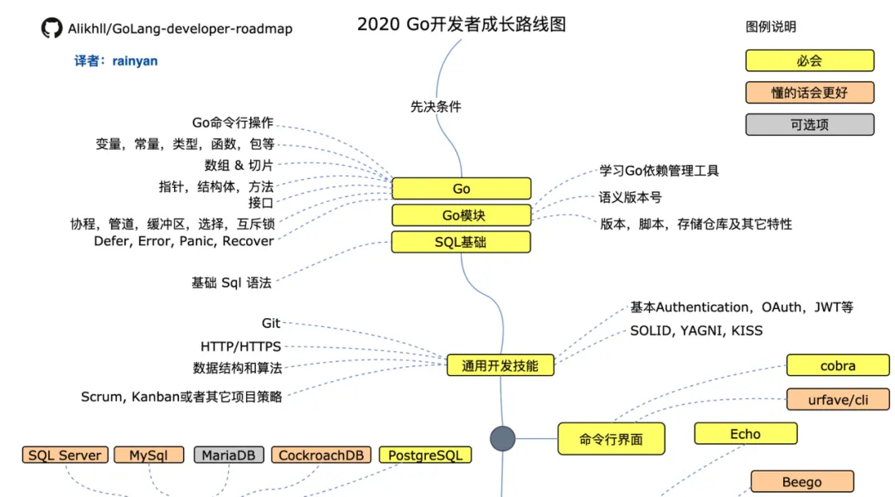
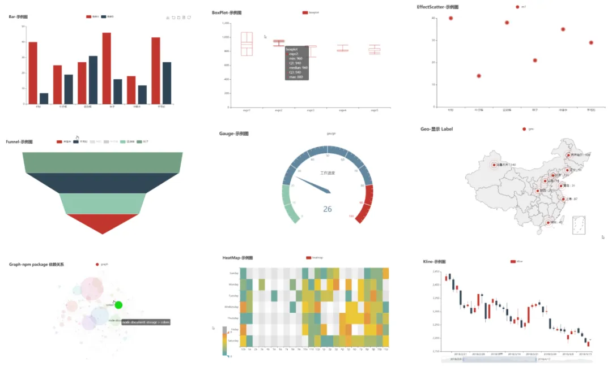
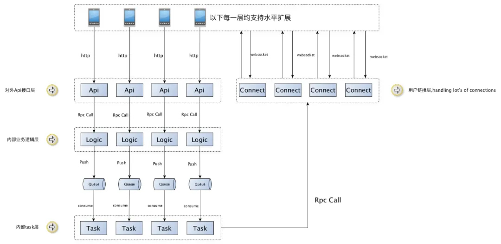

# Go语言相关网站资源

[ibarryyan/golang-tips-100: You know , for golang tips (github.com)](https://github.com/ibarryyan/golang-tips-100)

[《Go小技巧&易错点100例》开篇词 (qq.com)](https://mp.weixin.qq.com/s/p4FEiaaxXn8JDEh0AfaAfA)


Golang 语言开源项目地址：https://github.com/golang/go

## Golang学习路径

Go（也称为 Golang）是 Google 开发的一种系统编程语言。它通常用于构建微服务、网络工具和其他后端应用程序。

以下是有关 Go 编程语言及其常见用例的关键知识：

- Go（也称为 Golang）是 Google 于 2007 年开发的一种静态类型、编译型编程语言。它旨在构建简单、可靠和高效的软件。

Go 的一些主要用例包括：

- 后端 Web 开发：Go 的并发特性使其非常适合构建可扩展的 Web 应用程序和服务器。流行的 Web 框架包括 Gin、Echo 等。
- 微服务：由于轻量级流程和易于部署，Go 擅长开发微服务。
- 系统编程：Go因其效率和对资源的控制而在操作系统、文件系统、数据库等中得到应用。
- 网络应用：由于对并发网络的良好支持，它通常用于网络工具、服务器、协议。
- 云开发：Go 非常适合开发基于容器的云应用程序、AWS Lambda 上的无服务器函数等。
- DevOps 工具：许多 DevOps 工具（例如 Docker、Kubernetes、Terraform、Prometheus 等）都使用 Go。
- 分布式系统：诸如 goroutine、通道之类的功能有助于在 Go 中轻松构建分布式和并发应用程序。
- 桌面应用程序：GTK 绑定允许为 Linux、Windows 等开发基于 GUI 的桌面程序。

## Part One：师父领进门

### 1.1 真正的入门指南：the-way-to-go_ZH_CN

> GitHub 地址→https://github.com/unknwon/the-way-to-go_ZH_CN

《Go 入门指南》这本开源书籍是一位 Golang 的布道者（无闻）苦于当时国内没有比较好的 Go 语言书籍，而着手翻译的一本国外书籍《The Way to Go》。该书通过对官方的在线文档、名人博客、书籍、相关文章以及演讲的资料收集和整理，并结合我自身在软件工程、编程语言和数据库开发的授课经验，将这些零碎的知识点组织成系统化的概念和技术分类来进行讲解。

该书将从最基础的概念讲起，同时也会讨论一些类似在应用 goroutine 和 channel 时有多少种不同的模式，如何在 Go 语言中使用谷歌 API，如何操作内存，如何在 Go 语言中进行程序测试和如何使用模板来开发 Web 应用这些高级概念和技巧。

> 阅读地址→https://github.com/unknwon/the-way-to-go_ZH_CN/blob/master/eBook/directory.md

### 1.2 从零开始学 Go Web 编程：build-web-application-with-golang

> GitHub 地址→https://github.com/astaxie/build-web-application-with-golang

《Go Web 编程》这本开源书籍，从零开始手把手教你 Go 的环境安装和配置、基本语法再到 Go Web 开发的方方面面。可谓是一书在手，“天下”（Go Web）任我行。当然书写得再好，也是“师傅领进门，修行靠个人啊！“

> 阅读地址→https://github.com/astaxie/build-web-application-with-golang/blob/master/zh/SUMMARY.md

## Part Two：再上一层楼

### 2.1 七天用 Go 从零实现系列：7days-golang

> GitHub 地址→https://github.com/geektutu/7days-golang

用 Go 分别写一个：Web 框架、分布式缓存、ORM 框架、RPC 框架的实战教程。有些东西看懂了，不一定会用，会用了也不一定能自己搞出来。所以从零写一个框架，了解其中的细节，才能算上真正懂了吧。

> 在线阅读→https://geektutu.com/post/gee.html

### 2.2 Go 学习之路：golang-developer-roadmap

> GitHub 地址→https://github.com/Alikhll/golang-developer-roadmap

《Go 开发者路线图》是一个成为 Go 开发的学习路线。一图胜千言，这里选取这个项目是为了让大家能快速了解 Go 所需学习的知识点和前进的方向。



### 2.3 Go 高级编程：advanced-go-programming-book 

> GitHub 地址→https://github.com/chai2010/advanced-go-programming-book

《Go 语言高级编程》作为针对有一定 Go 基础的进阶书籍，内容涵盖并发、GOC 编程、Go 汇编语言、RPC 实现、Web 框架实现、分布式系统等高阶主题。该书的附录也是一大亮点，收录了 Go 有趣的代码片段、Go 常见坑。要想 Golang 玩得溜，得在 Go 高级编程下功夫 [手动狗头]

> 在线阅读→https://chai2010.cn/advanced-go-programming-book/

## Part Three：是时候展示真正的技术了

### 3.1 星图：starcharts

> GitHub 地址→https://github.com/caarlos0/starcharts

这个项目是通过可视化的方式展示 GitHub 上 star 的增长曲线，也就生成是“星图”。推荐这个项目主要是运行简单和直观的数据可视化，可以快速地感受到 Go 开源项目带来的便利。我第一次玩这个项目的时候不会 Go 语言，但是参考这个项目写一个 Python 版本的星图，所以我想已经入门 Go 的各位肯定也能看懂。

有的小伙伴可能会说我没有开源项目、我的项目都没有 star 我学这个项目没用，我想了下确实是缺少些动力。如果抛开 GitHub 的 star 元素，还有一个适用更多场景的 Go 数据可视化项目：**go-echarts**。来吧，感受下数据的律动。



> GitHub 地址→https://github.com/go-echarts/go-echarts

### 3.2 来 Chat 下：gochat

> GitHub 地址→https://github.com/LockGit/gochat

gochat 是纯 Go 实现的轻量级即时通讯系统。技术上各层之间通过 RPC 通讯，使用 Redis 作为消息存储与投递的载体，相对 Kafka 操作起来更加方便快捷。各层之间基于 etcd 服务发现，在扩容部署时将会方便很多。架构、目录结构清晰，文档详细。而且还提供了 Docker 一键构建，安装运行都十分方便。



### 3.3 给！拿去用：annie 

> GitHub 地址→https://github.com/iawia002/annie

Go 编写的下载快速、使用简单、程序纯净的视频下载工具。支持哔哩哔哩、YouTube 等视频网站。可作为前段时间被封禁：youtube-dl 的替代品（目前已重新上架），它真的很强大！先感受下 annie 带来的便利，可能就有兴趣去探究它的源码啦。

```bash
$ annie -c cookies.txt https://www.bilibili.com/video/av20203945/

 Site:      哔哩哔哩 bilibili.com
 Title:     【2018拜年祭单品】相遇day by day
 Type:      video
 Stream:
     [default]  -------------------
     Quality:         高清 1080P60
     Size:            220.65 MiB (231363071 Bytes)
     # download with: annie -f default "URL"

 16.03 MiB / 220.65 MiB [==>----------------------------]   7.26% 9.65 MiB/s 19s
```

## 最后

推荐几个 GitHub 上的大佬：

- https://github.com/astaxie：谢大
- https://github.com/unknwon：无闻
- https://github.com/polaris1119：polarisxu，Go 语言中文网站长
- https://github.com/appleboy、chai2010

# GitHub上非常适合go语言新手的项目推荐

Go之所以越来越适合DevOps，主要是因为它拥有几个关键特性和优势，非常符合DevOps领域的需求。DevOps注重软件开发（Dev）和信息技术运维（Ops）的整合，目的是缩短系统开发生命周期，提供高质量的软件。下面是Go语言适合DevOps的一些原因：

1. **简单易学**：Go语言的设计哲学是使得开发过程尽可能简单。它有简洁的语法，易于学习，易于阅读和写作，这使得团队成员能够快速上手，提高开发效率。
2. **并发支持**：Go语言在语言层面就内置了并发编程支持。通过goroutines（轻量级线程）和channels（通道），开发者可以轻松地实现并发和并行处理，这对于开发高性能的服务和处理大量并发请求尤为重要。
3. **静态编译**：Go程序编译后是静态链接的二进制文件，包含了所有依赖，这使得部署极为简单。一个单独的二进制文件就可以在没有依赖冲突或环境配置问题的情况下，在任何支持的操作系统上运行。
4. **高性能**：Go语言在执行效率方面表现出色，特别适合构建高性能的网络服务和微服务架构。它的运行速度接近于C/C++，但拥有更高级的内存安全和垃圾回收机制。
5. **强大的标准库**：Go拥有一个全面而强大的标准库，特别是在网络编程、文本处理和时间处理等方面。这减少了对第三方库的依赖，使得开发更加高效和安全。
6. **跨平台**：Go语言支持跨平台编译，可以轻松地为不同操作系统编译程序，包括Windows、Linux和macOS等。这对于DevOps工程师来说是一个巨大的优势，因为它简化了跨环境的软件部署和管理。
7. **社区和工具**：Go语言有一个活跃的社区和一系列成熟的工具，例如Docker（一个流行的容器化平台）就是用Go编写的。社区的支持和丰富的工具集可以帮助解决开发和运维过程中的各种问题。

总之，Go语言因其简单、高效、强大的并发处理能力和跨平台支持，成为了DevOps领域的一个优选。它能够帮助团队提高生产效率，简化部署流程，最终加速软件交付的速度。

**对比之下推荐十个比较适合新手的go项目**

1. **Go by Example** 
   网址: https://github.com/mmcgrana/gobyexample  
   简介: Go by Example是一个学习Go语言的实践指导，通过例子展示了Go的各种特性和标准库的使用。这不是一个项目，但对初学者来说，了解和练习基本概念是非常必要的。 
   推荐原因: 对于初学者来说，通过例子学习是最直接也是最有效的方法之一，这个项目能帮助你快速上手Go语言。
2. **The Go Programming Language** 
   网址: https://github.com/adonovan/gopl.io  
   简介: 《The Go Programming Language》书籍的示例代码。该书是Go语言的经典读物，提供了大量的实用代码示例。 
   推荐原因: 跟随经典书籍学习，能够系统地掌握Go语言，非常适合初学者深入理解Go语言的设计和使用。
3. **Gin** 
   网址: https://github.com/gin-gonic/gin  
   简介: Gin是一个高性能的HTTP Web框架，它提供了简单而强大的API，对初学者友好。 
   推荐原因: 学习如何使用Gin框架可以让你快速入门Web开发，理解HTTP协议和RESTful API设计。
4. **Echo** 
   网址: https://github.com/labstack/echo  
   简介: Echo是一个高性能、极简的Go Web框架，提供了路由、中间件支持等特性，非常适合开发高性能的Web应用。 
   推荐原因: 通过实践Echo框架，可以加深对Web开发模式和中间件等概念的理解。
5. **Go-kit** 
   网址: https://github.com/go-kit/kit  
   简介: Go-kit是一个用于构建微服务的编程工具集，适合需要构建可扩展、可维护服务的开发者。 
   推荐原因: 微服务架构是当前后端开发的一个重要趋势，学习Go-kit能帮助你理解微服务的设计原则和实践方法。
6. **GORM** 
   网址: https://github.com/go-gorm/gorm  
   简介: GORM是一个流行的Go语言ORM库，支持多种数据库，提供了丰富的数据库操作方法。 
   推荐原因: 数据库是后端开发中的重要部分，学习GORM能够让你更好地理解数据库操作和ORM的工作原理。
7. **Go Micro** 
   网址: https://github.com/asim/go-micro  
   简介: Go Micro是一个分布式系统开发框架，旨在简化微服务的开发。 
   推荐原因: 分布式系统和微服务是当前后端领域的热点，通过Go Micro你可以学习到这些概念的实际应用。
8. **Iris** 
   网址: https://github.com/kataras/iris  
   简介: Iris是一个高性能且全功能的Web框架，提供了丰富的特性来支持复杂Web应用的开发。 
   推荐原因: Iris框架结合了简单性和强大的功能，是深入学习Web开发的好工具。
9. **Buffalo** 
   网址: https://github.com/gobuffalo/buffalo  
   简介: Buffalo旨在使Web开发变得简单，提供了从前端到后端的全栈开发工具。 
   推荐原因: 如果你想要了解Web开发的整个流程，Buffalo是一个不错的选择，它简化了很多开发任务。
10. **Standard Go Project Layout** 
    网址: https://github.com/golang-standards/project-layout  
    简介: 这不是一个具体的项目，而是关于Go项目如何组织代码的一些建议和最佳实践。 
    推荐原因: 对于初学者来说，了解如何合理地组织项目结构是非常重要的，这个项目能给你提供一定的指导。

# Go源代码分析

[cch123/golang-notes： Go 源码分析（zh-cn） (github.com)](https://github.com/cch123/golang-notes)

# 开源学习项目

## Go 语言高性能编程 - 一本专注于 Go 编程性能的开源电子书

[Go 语言高性能编程 | 极客兔兔 (geektutu.com)](https://geektutu.com/post/high-performance-go.html)