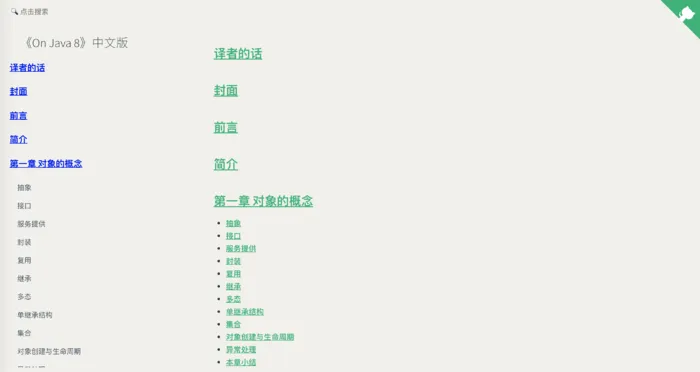
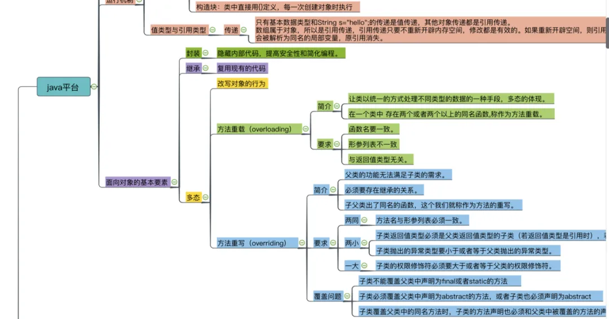
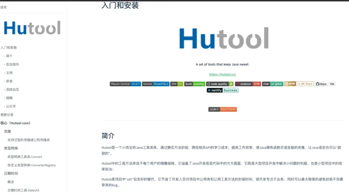
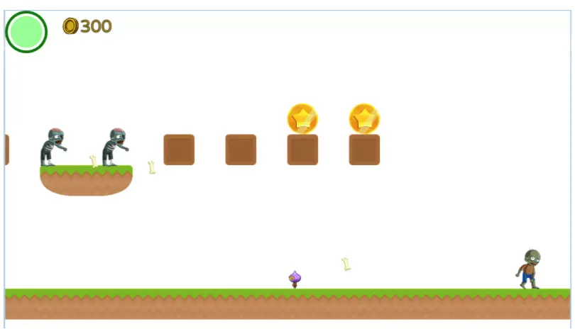

# Java学习资源

Java 是使用最广泛的编程语言之一。它通常用于后端 Web 开发、Android 应用程序开发和企业应用程序。

以下是有关 Java 及其常见用例的一些关键知识：

- Java 是一种通用的、基于类的、面向对象的编程语言，由 Sun Microsystems（现为 Oracle Corporation）于 1995 年创建。
- Java 程序通常被编译为可以在任何 Java 虚拟机 (JVM) 上运行的字节码，无论计算机体系结构如何。这种“一次编写，随处运行”的特性是 Java 的最大优势之一。
- Java 的一些主要用例包括企业应用程序、Android 应用程序、后端 Web 开发、桌面应用程序、大数据等。
- 企业应用程序——Java因其稳健性、安全性和可移植性而被广泛用于开发企业软件，如ERP系统、银行应用程序等。
- Android 开发 — Android 基于 Java 编程语言，并具有 Java SE 平台的改编版本。Java 用于构建 Android 应用程序。
- Web 开发 — Java 用于通过 Spring、Hibernate、Struts 等框架构建服务器端应用程序。它还用于通过 Quarkus 等框架构建无服务器功能。
- 桌面应用程序 — Java Swing 和 JavaFX 允许为 Windows、Linux 和 macOS 构建基于 GUI 的桌面应用程序。
- 大数据——由于其性能和可扩展性，Java 通常用于通过 Hadoop 和 Spark 等框架进行大数据处理。
- 游戏开发——Java 用于开发游戏，特别是针对使用 LibGDX 和 JavaFX 等框架的浏览器。

## 一、青铜

> 万事开头难

### 1.1 快乐的小鸟

作为整篇文章的开头，我选择了一个比较轻松好玩的项目，希望能够勾起你对编程的兴趣！作者仅使用了 Java 标准库还原了，曾经在手机上红遍一时的“愤怒的小鸟”。先 `clone` 把源码下载后，可以通过 `java -jar FlappyBird.jar` 直接运行，也可以通过运行源码中的 `GameApp:main` 方法来启动整个游戏。通过学习该项目可以学习到：

- 使用标准库中的一些工具，比如集合、播放音效、加载图片
- 如何利用多文件，把不同的逻辑拆分到不同的类中去，并相互之间协作构建起整个游戏的状态
- 一些设计模式的应用，比如单例、对象池

> GitHub 地址：https://github.com/kingyuluk/FlappyBird

### 1.2 Java 圣经

高尔基说过：「书是人类进步的阶梯」。在历史的长河中诞生过无数的著作，计算机领域也不例外，而《Think in Java》就是我要重点介绍的一本著作，这本书给我的第一印象就是：全！从最基本的数据类型到之后的面向对象再到后面的泛型反射的高级话题，无所不包。我之前阅读的是第四版实体书，现在的好消息是，第五版来了！而且是以开源的形式。经过之前小项目的小打小闹，大家也有了一点编程的感觉了，是时候巩固下理论知识了，俗话说的好：「基础不牢，地动山摇」。现在这个阶段去阅读此著作一定会给你不一样的感觉，我甚至推荐你每到一个阶段，你可以回过头去翻翻这本经典书籍，每次都会有新的认识。

- 项目地址：https://github.com/LingCoder/OnJava8
- 在线阅读：https://lingcoder.github.io/OnJava8/#/sidebar

### 1.3 一图胜千言

如果你觉得刚刚的「圣经」有点重，不妨来看看这个项目，这个项目从 Java 基础到标准库 JVM 到 Spring 再到各个常用到中间件 Redis、Zookeeper 等。每一部分都用了一张思维导图来整理出各个知识点，既能够对将学知识的大致了解，也方便了学习后，对已学知识的巩固复习，可以说良心到不行。你完全可以按照自己的节奏，学习的进度去查看每一个知识点。

> GitHub 地址：https://github.com/huangliangyun/MindManager

## 二、白银

> 坚持就是胜利

### 2.1 春天来了

Java 在生产中多数是以服务端开发为主，那在服务端领域还有一个一定绕不开的 Java 框架就是 Spring。我相信你一定听过这个名字，Spring 这个框架现在基本已经是 Java 服务端的工业级标准了，我就职过的公司没有一个不用的，而 Spring 发展至今，他工程上的复杂程度也大大的提高了，各种封装和抽象，想要搞懂原理变得非常困难，但是你不需要太过害怕，因为只是完成功能上的开发和一般的使用是不需要知道 Spring 的原理的。Spring 团队为了能进一步提升开发体验，推出了 Spring Boot 这个框架，你可以认为 Spring Boot 是对原本的 Spring MVC 进行封装并且内置了一个 Tomcat 的容器，仅此而已。最后如果是新学的话建议直接从 2.0 开始。

关于 Spring Boot 我这里推荐一个项目：

> https://github.com/yizhiwazi/springboot-socks

项目里面内置了很多有用的片段，从最简单的 Hello World 到如何集成 Mybatis 啊，又或者是如何跨域，还有怎么发送邮件啊等等，都有一个对应的文件夹的示例。

此阶段建议按照以下路线学习：

- 从零启动一个空的 Spring Boot 项目，可以学习到 Spring Boot 的最小配置，以及如何声明 REST 风格的 Controller 并返回简单的数据
- 将 Spring Boot 和 Java 的持久层框架（如 Mybatis-Plus ）串起来，通过 REST 的接口进行简单的增删改查操作（可以完全不需要页面，仅仅需要一个 Postman 或者 `curl` 即可）
- 使用 FreeMarker 或者 Thymeleaf 其他模板引擎，写一个简单的页面（可以是一些简单的输入框，按钮，完全不需要考虑样式），再将之前的增删改查操作串起来，并通过模板引擎将结果渲染至浏览器。

完成这个阶段后，相信你对企业中的前后端交互以及框架的基本使用就有概念了。然后就能基于此，尝试做一些小功能，比如登陆，注册等等。

### 2.2 人生就是要难得糊涂

Java 本身被诟病最多的就是语法啰嗦， **hutool** 是一个简单易用的三方 Java 类库，里面包含了大量的工具类静态方法，封装了原本复杂的调用。而它的源码本身也是值得学习的优秀开源项目，通过学习它可以了解到一个优秀的 lib 项目是如何组织、规范代码的，也希望读者们以后都能拥有令人自豪的开源项目。

- 项目地址：https://github.com/looly/hutool
- 官网地址：https://www.hutool.cn

## 三、黄金

> 不经历风雨，怎能见彩虹

### 3.1 要做 NB 不要做 NewBee

坚持到现在的你需要一个媲美生产环境的完整项目经验，而这个开源项目恰好可以满足，推荐这个项目的原因如下：

1. 项目的体量大了很多，不单单是后端代码，还有一整套的前端页面，Awesome！
2. 商城基本功能都已经具备：首页，登录，浏览商品，购物车，下单等，甚至还有一个后台管理功能，Awesome！

> GitHub 地址：https://github.com/newbee-ltd/newbee-mall
>
> 预览地址：http://mall.newbee.ltd

### 3.2 成神之路

之前都是偏向实践的项目，到了这里，应该放慢脚步，往更高层的方向出发了。正所谓，「知其然，更要知其所以然」。有了实践的帮助，会让学习理论不那么枯燥，同样也因为理论，让实践有了更好的基础。

- 项目地址：https://github.com/doocs/advanced-java
- 在线阅读：https://doocs.github.io/advanced-java

这个在线书籍包含了很多 Java 生态中的高级话题，如高并发，分布式，缓存，高可用，微服务等等。由一个问句引出读者的思考，让读者跟着作者的思路一步步的从提出问题，分析问题到最后的解决问题。

### 3.3 走自己的路，让别人说去吧

之前的小鸟，不知道有没有击中你的心灵？我反正是有，我刚开始学 Java 的时候也捣鼓过一些小游戏，比如扫雷，贪吃蛇，坦克大战等。那时还不知道有 GitHub 不然这些项目就能和大家见面了，自己当时也瞎写，对编程感觉还不强，但是亲手将一些儿时的回忆复刻出来的感觉是非常棒的，如果你也想用 Java 写写小游戏的话，不妨看看下面这个项目。

- 项目地址：https://github.com/AlmasB/FXGLGames
- 官网地址：http://almasb.github.io/FXGLGames

项目中已经内置了一些简单游戏的 Demo，通过学习可以让你快速上手，框架还可以将游戏轻松打包到单个可执行文件，快来试试吧！

# 库源码分析

[doocs/source-code-hunter: 😱 从源码层面，剖析挖掘互联网行业主流技术的底层实现原理，为广大开发者 “提升技术深度” 提供便利。目前开放 Spring 全家桶，Mybatis、Netty、Dubbo 框架，及 Redis、Tomcat 中间件等 (github.com)](https://github.com/doocs/source-code-hunter)

[yongshun/learn_netty_source_code: Netty 源码分析教程 (github.com)](https://github.com/yongshun/learn_netty_source_code)

[coderbruis/JavaSourceCodeLearning: Java流行框架源码分析：Spring源码、SpringBoot源码、SpringAOP源码、SpringSecurity源码、SpringSecurity OAuth2源码、JDK源码、Netty源码 (github.com)](https://github.com/coderbruis/JavaSourceCodeLearning)

# 算法

[MisterBooo/LeetCodeAnimation: Demonstrate all the questions on LeetCode in the form of animation.（用动画的形式呈现解LeetCode题目的思路） (github.com)](https://github.com/MisterBooo/LeetCodeAnimation)

# 开源库

## Hutool：功能丰富且易用的Java工具库

`Hutool`是一个功能丰富且易用的**Java工具库**，通过诸多实用工具类的使用，旨在帮助开发者快速、便捷地完成各类开发任务。 这些封装的工具涵盖了字符串、数字、集合、编码、日期、文件、IO、加密、数据库JDBC、JSON、HTTP客户端等一系列操作， 可以满足各种不同的开发需求。

GitHub：[dromara/hutool: 🍬A set of tools that keep Java sweet. (github.com)](https://github.com/dromara/hutool)

官网：[hutool.cn/](https://hutool.cn/)

##  Java 的高级轻量级声明式 HTTP 客户端框架

GitHub：[dromara/forest：一个用于 Java 的高级轻量级声明式 HTTP 客户端框架。它使在 Java 中发送 HTTP 请求变得更加容易。 (github.com)](https://github.com/dromara/forest)

# 在线博客文档

## 「Java学习」

文档地址：[JDK、JRE、JVM 的区别 | 未读代码 (wdbyte.com)](https://www.wdbyte.com/java/jdk-jre-jvm/)

GitHub：[niumoo/JavaNotes: 🧱 「Java学习」一份涵盖大部分Java程序员所需要掌握的核心知识。JDK 源码分析 & Java 新特性 & Java 并发编程 & Java 虚拟机 & SpringBoot 2.x 系列 (github.com)](https://github.com/niumoo/JavaNotes)

## spring

[spring 中文网 (springdoc.cn)](https://springdoc.cn/)