# Linux命令

## Linux命令搜索工具

**推荐一款Linux命令搜索-工具**

**网址**：http://linux.devonline.net/

包含linux命令手册，详解，学习

**使用方法超级简单，只要我们在输入框中输入命令的关键字，就会提示相关的命令和每个命令后面的解释**

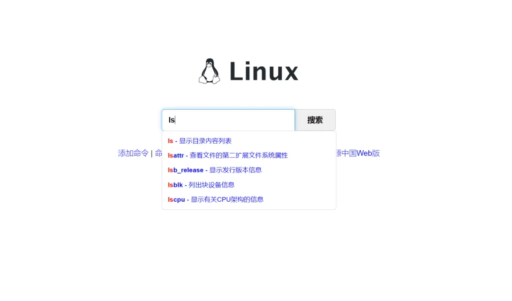

**当我们点进去某个搜索项时，就会展开命令使用的详细信息**

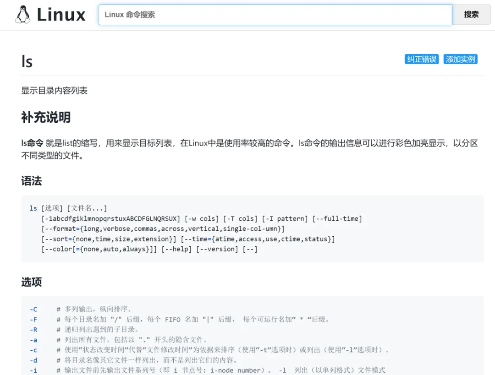


**目前已经收集了604个linux命令，可谓是搜索命令的神器了，是一个非常值得收藏的Linux命令速查手册**

**这里给大家推荐镜像Web版本**

## 待定

文档：[linux所有命令 (yuque.com)](https://www.yuque.com/vpwpw5/cymgtx?)

[Linux | StudyNote - 丰富的知识笔记库 (ciberviler.top)](https://blog.ciberviler.top/linux/)

[Michael Kerrisk - man7.org](https://www.man7.org/index.html)

[Linux 简介 | 菜鸟教程 (runoob.com)](https://www.runoob.com/linux/linux-intro.html)

[Linux 提示、技巧和教程 |Linux化 (linuxize.com)](https://linuxize.com/)

1. **[The Linux Kernel documentation](https://www.kernel.org/doc/html/latest/)**：
   - 这是Linux内核文档的顶级目录。它包含了关于内核的详细信息，如开发指南、API文档、用户指南等。这是一个不断更新的工作，用于整合分散的文档。
   - 您可以在这里找到与内核开发、系统管理和用户空间API相关的文档。
2. **[Linux/Unix Tutorial - GeeksforGeeks](https://www.geeksforgeeks.org/linux-tutorial/)**：
   - 这是一个面向初学者和有经验的专业人士的Linux教程，涵盖了Linux基本和高级概念，如Linux命令、目录和文件管理、man页、文件权限、shell等。
3. **[Linux Foundation - Training Resources](https://training.linuxfoundation.org/resources/)**：
   - 在这里，您可以找到大量免费的资源，包括课程、网络研讨会、教程和出版物，涵盖了开源技术领域的各个方面。
4. **[Linux Handbook](https://linuxhandbook.com/)**：
   - Linux Handbook致力于通过易于遵循的提示、教程和课程来提高您的Linux知识，包括Bash脚本、Linux命令、自建和自托管、Docker和容器化等。

## 大纲

Linux系统目录结构

Linux命令快速入门体验

Linux命令使用技巧

Linux命令格式详解

Linux目录操作命令

Linux复制和移动命令

Linux文件操作命令

Linux查找命令

压缩解压命令

Vim文本编辑

Vim介绍 命令

vim安装 命令

Vim语法 命令

## Linux系统目录结构

### 查看Linux系统目录结构

使用`Windows`系统时用户通常是使用`鼠标点击`进行文件或文件夹的`创建`、`删除`等操作，在Linux系统中是通过敲命令来控制系统的，`Windows`系统和`Linux`系统的目录结构不同，我们需要先熟悉`Linux`系统的目录结构。
登录系统后，在当前命令窗口中输入以下命令：

```
ls /
```

效果如下：

```
连接主机...
连接主机成功
Last login: Thu Jul 14 12:18:46 2022 from 192.168.100.2
[root@localhost ~]# ls /
bin  boot  dev  etc  home  lib  lib64  media  mnt  opt  proc  root  run  sbin  srv  sys  tmp  usr  var
[root@localhost ~]#
```

在`Linux`中没有盘符概念，它是树状目录结构，最顶层是根目录，效果如下：

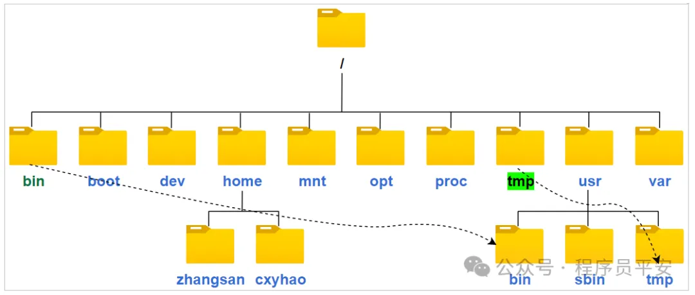

### Linux系统不同颜色的含义

| 颜色        | 说明                          |
| :---------- | :---------------------------- |
| **白色   ** | 普通文件                      |
| **深蓝色**  | 文件夹(目录)                  |
| **青色**    | 链接，类似于Windows下快捷方式 |
| **绿色**    | 可执行文件                    |
| **红色**    | 压缩包                        |
| **橙色**    | 设备文件                      |

### Linux常用目录说明

| 目录  | 说明                                                         |
| :---- | :----------------------------------------------------------- |
| root  | 系统管理员的主目录，其它用户不能访问的。                     |
| home  | 普通用户的主目录，每个用户都有一个自己的目录，一般是以用户的账号命名的，如上图中的 zhangsan 和 cyxpa。 |
| bin   | binary (二进制文件) 的缩写，这个目录存放着最经常使用的命令。 |
| sbin  | superuser binary (超级用户的二进制文件) 的缩写，存放的是系统管理员使用的系统管理程序。 |
| etc   | etcetera(等等) 的缩写，这个目录用来存放所有的系统管理所需要的配置文件和子目录。 |
| usr   | unix shared resources(共享资源) 的缩写，用户的很多应用程序和文件都放在这个目录下，类似于 windows 下的 program files 目录。 |
| opt   | optional(可选) 的缩写，给主机额外安装软件所存放的目录，比如安装一个MySQL数据库可以放到这个目录下。 |
| mnt   | 用户临时挂载文件系统在该目录下面，我们可以将USB设备挂载在 /mnt下，进入该目录就可以查看USB设备里的内容。 |
| media | Linux系统会自动识别一些设备例如：U盘、光驱等等，当识别后会把识别的设备挂载到这个目录下。 |
| dev   | device(设备) 的缩写，该目录下存放的是 Linux 的外部设备，在 Linux 中访问设备的方式和访问文件的方式是相同的。 |

## Linux命令快速入门体验

这里主要介绍几个常用的命令，先来感受一下`Linux`命令的操作方式，后面再详细学习`Linux`的命令，下面列出几个使用频率很高的几个命令。
**命令：**`**ls**`
说明：

> ls：查看当前目录的内容，当前是在/root目录中，说明/root目录中有anaconda-ks.cfg这个文件。
>
> ls /：查看`/` `根目录`的内容。

效果：

```
[root@localhost ~]# pwd
/root
[root@localhost ~]# ls
anaconda-ks.cfg
[root@localhost ~]# ls /
bin  boot  dev  etc  home  lib  lib64  media  mnt  opt  proc  root  run  sbin  srv  sys  tmp  usr  var
```

**命令：**`**mkdir**`
说明：

> mkdir：创建目录(make directory)
> mkdir test01：创建test01目录

效果：

```
[root@localhost ~]# pwd
/root
[root@localhost ~]# ls
anaconda-ks.cfg
[root@localhost ~]# mkdir test01
[root@localhost ~]# mkdir test02
[root@localhost ~]# ls
anaconda-ks.cfg  test01  test02
[root@localhost ~]#
```

**命令：**`**cd**`
说明：

> cd：切换目录(change directory)
> cd test01：切换到test01目录
> cd /：切换到根目录

效果：

```
[root@localhost ~]# cd test01
[root@localhost test01]# pwd
/root/test01
[root@localhost test01]# cd /
[root@localhost /]# pwd
/
[root@localhost /]# cd /root
```

## Linux命令使用技巧

### Linux命令技巧说明

使用`Linux`命令时，可以使用以下几个技巧：

1. `Tab`键自动补全。
2. 连续两次`Tab`键，给出操作提示。
3. 使用`上下箭头`快速调出使用过的命令。
4. 使用`clear`命令或者`Ctrl+l`快捷键实现清屏。

### Linux命令技巧演示

1. `Tab`键自动补全。

   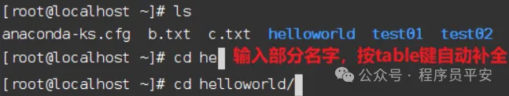

2. 连续两次`Tab`键，给出操作提示。

   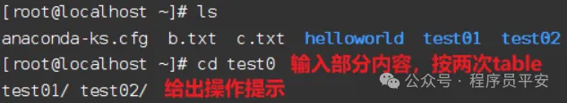

3. 使用`上下箭头`快速调出使用过的命令。

   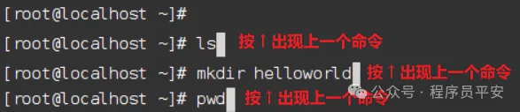

4. 使用`clear`命令或者`Ctrl+l`快捷键实现清除屏幕内容。

   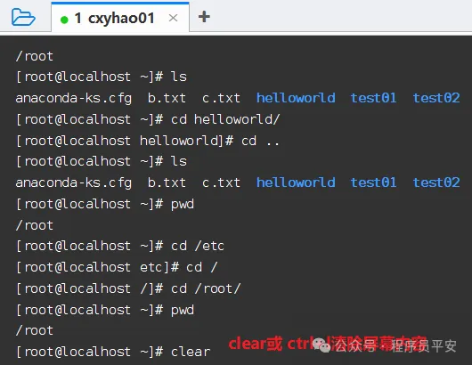

   
   清除屏幕后：

   

## Linux命令格式详解

```
命令 [选项] [参数]
```

说明：

> [选项]：可用来对命令进行控制，也可以省略。
> [参数]：传给命令的参数，可以是零个、一个或者多个。

注意：

> []：代表可选
> 命令名、选项、参数之间有空格进行分隔

通过`man 命令`进入`General Commands Manual`命令手册，可以查看命令支持的`选项`和`参数`，效果如下：

```
[root@localhost ~]# man rm
NAME
       rm - 移除文件或者目录

总览
       rm [options"]file...

POSIX(Portable Operating System Interface 可移植的操作系统接口) 选项:
       [-fiRr]

GNU 选项 (最短格式):
       [-dfirvR][--help][--version][--]

描述
       rm移除每个给定的文件。默认情况下，它不能移除目录。但是当给定了-r或者-R选          项时，在指定目录之下的整个目录树都会被移除（而且对通过`rm          -r'能够移除的目
       录树深度是没有限制的）。当文件路径末端部分只有.和..时会出错（因此可用`rm -r .*'之类来避免这些不愉快的诧异）。

       如果给定了-i选项，或者如果一个文件不可写，  而且标准输入是终端，又没有给定-f选项，那么rm会提   示用户是否要删除该文件，它写一个问题到stderr并且从stdin读入一个应答。
       如果应答是否定的，该文件将被跳过。

POSIX选项
       -f     不作确认提示。不会写出诊断信息。 如果错误只是文件不存在，那么不会生成一个状态返回的错误。
```

在`General Commands Manual`命令手册界面可以按`回车`下翻，按 `q` 退出命令手册。
示例效果：

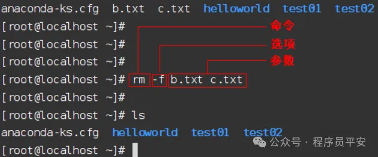

## Linux目录操作命令

### pwd 命令

说明：

> pwd：查看当前工作目录(print work directory)
> /root：表示当前的工作目录是 /root

操作示例：

```
[root@localhost ~]# pwd
/root
[root@localhost ~]#
```

### ls 命令

命令说明：

```
作用: 显示指定目录下的内容
语法: ls [选项] [文件名...]
选项: 
    -a    列出目录中所有文件，包括以“.”开头的文件。
    -l    除每个文件名外，增加显示文件类型、权限、硬链接数、所有者名、组名、大小、及时间信息等。
    -R    递归列出遇到的子目录。

常见用法: 
    ls -a           列出当前目录中所有文件，包括以“.”开头的文件。
    ls -al /usr     列出/usr目录下所有文件及显示文件类型、权限、硬链接数、所有者名、组名、大小、及时间信息等。
    ll      由于我们使用ls命令时经常需要加入-l选项，所以Linux为ls -l命令提供了一种简写方式，即ll
```

操作示例：

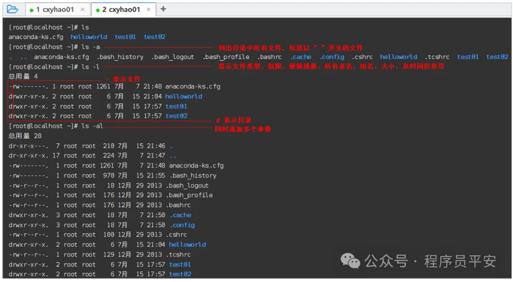

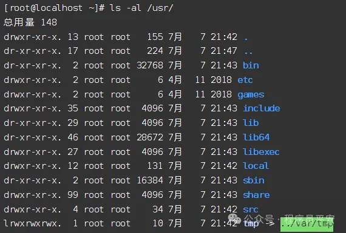

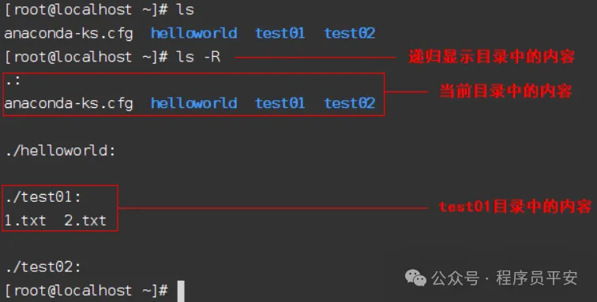

### cd 命令

命令说明：

```
作用: 切换当前工作目录
语法: cd [目录]

特殊目录: 
    .   表示当前所在的目录
    ..  表示当前目录的上级目录
    -   退到上一个目录
    ~   表示用户的目录     root用户的目录为: /root   普通用户的目录为: /home/用户名

常见用法: 
    cd  ..      切换到当前目录的上级目录
    cd  ~       切换到用户的home目录
    cd /etc/sysconfig/  切换到/etc/sysconfig/目录
```

操作示例：

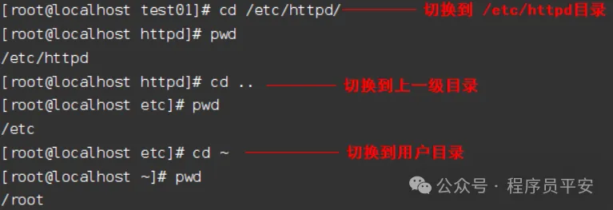

### mkdir 命令

命令说明：

```
作用: 创建目录
语法: mkdir [选项] 目录...

选项: 
    -p  为所给出的目录建立丢失了的父目录

常见用法: 
    mkdir java  在当前目录下创建java目录
    mkdir -p /opt/hello/java    在/opt/hello目录下创建java目录，父目录不存在也会创建
```

操作示例：

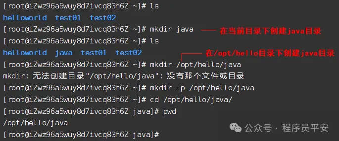

### rmdir 命令

命令说明：

```
作用: 删除空目录
语法: rmdir [选项] 目录...

选项: 
    -p  如果目录由多个路径名组成，从最后一个路径名开始依次删除，直到所有的路径名都被删完。例如：命令'rmdir -p a/b/c'按  照'rmdir a/b/c';  'rmdir a/b';  'rmdir a'的顺序删除目录

常见用法: 
    rmdir java  删除当前目录下的java目录
    rmdir -p a/b/c  相当于'rmdir a/b/c'、'rmdir a/b'、'rmdir a'
```

操作示例：

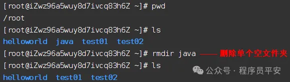

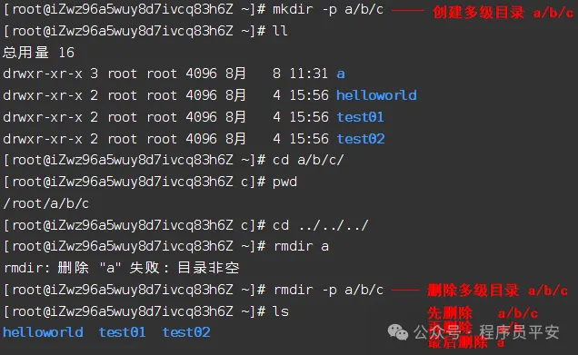

### rm 命令

命令说明：

```
作用: 移除文件或者目录
语法: rm [选项] 文件或目录...

选项: 
    -r     或者 -R 递归地移除目录树
    -f     忽略不存在的文件，并且从不向用户提示
    -i     提示是否移除每个文件。如果回答是否定的，文件将被跳过

常见用法: 
    rm a.txt        删除a.txt文件,删除前会提示确认
    rm -r hello/    删除hello文件和所有内容,删除前会提示确认
    rm -fr hello1/  删除hello1文件和所有内容,删除不需要确认
    rm -fr test*    删除任何以test开头的内容
```

操作示例：

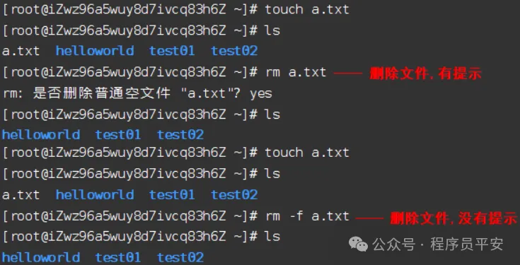

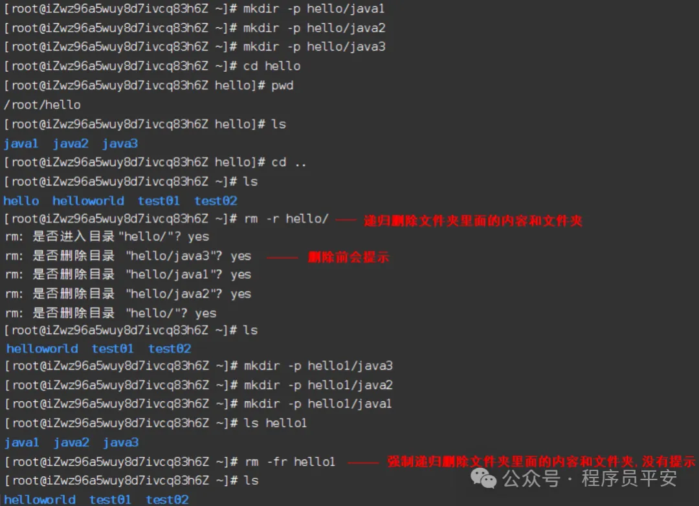

## Linux复制和移动命令

### cp 命令

命令说明：

```
作用: 复制文件和目录
语法: cp [选项] 文件路径 文件路径
     cp [选项] 文件...目录

选项: 
    -p  为所给出的目录建立丢失了的父目录

注意: 如果最后一个命令参数为一个已经存在的目录名，cp会将每一个源文件复制到那个目录下(维持原文件名).  如果所给的参数只有两个文件名.它把前一个文件复制到后一个文件上

常见用法: 
    cp hello1.txt he.txt    复制当前目录下的hello1.txt 到当前目录，新文件名为he.txt
    cp hello1.txt test01/hel.txt    复制当前目录下的hello1.txt 到test01目录，新文件名为he.txt
    cp hello1.txt test01/   复制当前目录下的hello1.txt 到test01目录，文件名保持不变
    cp hello1.txt hello2.txt test02     复制当前目录下的hello1.txt和hello2.txt 到test01目录，文件名保持不变
    cp -r test01 test03 复制当前目录下的test01目录 到test03目录中，最终效果test03/test01
    cp -f test01/* test04   复制当前目录下的test01目录中所有内容 到test03目录中，最终效果test03/*
```

操作示例：

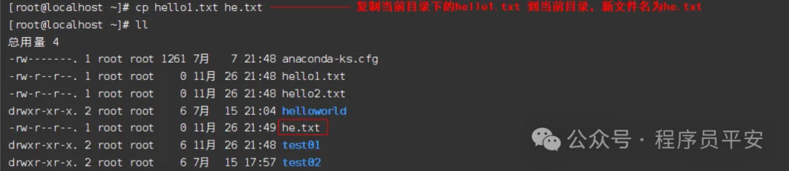

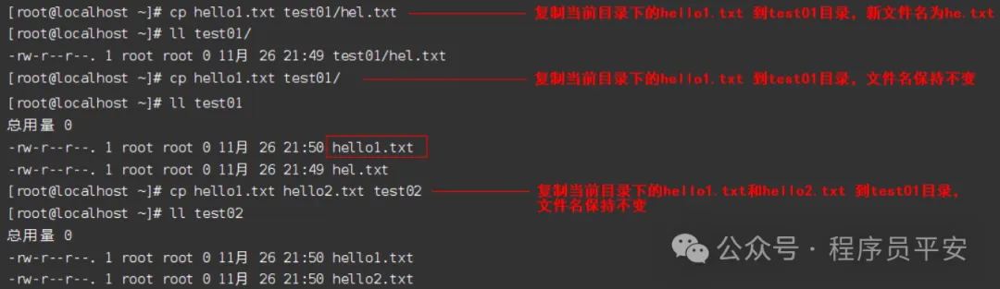

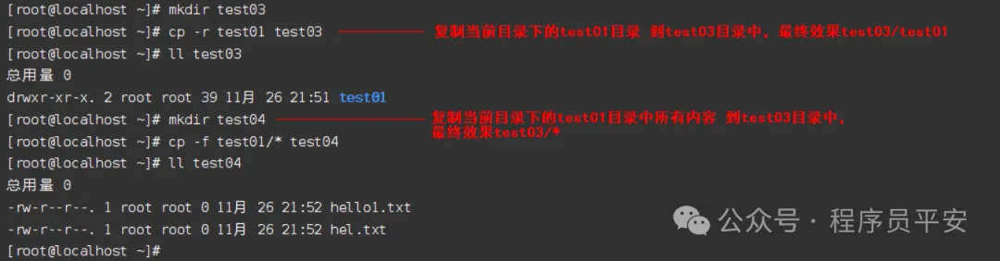

### mv 命令

命令说明：

```
作用: 移动或改名
语法: mv [选项] 源文件 目标文件
     mv [选项] 源文件... 目录

选项: 
    -v, --verbose 说明完成了什么

常见用法: 
    mv hello1.txt hi1.txt                将hello.txt改名为hi1.txt
    mv hi1.txt test05/                    将文件hi1.txt移动到test05目录中
    mv hello2.txt test05/hello3.txt        将hello2.txt移动到test05目录中，并改名为hello3.txt
    mv test01/ test05/                  test05目录存在，将test01目录移动到test05目录中
    mv test02 test06                    test06目录不存在，将test02目录改名为test06
```

操作示例：

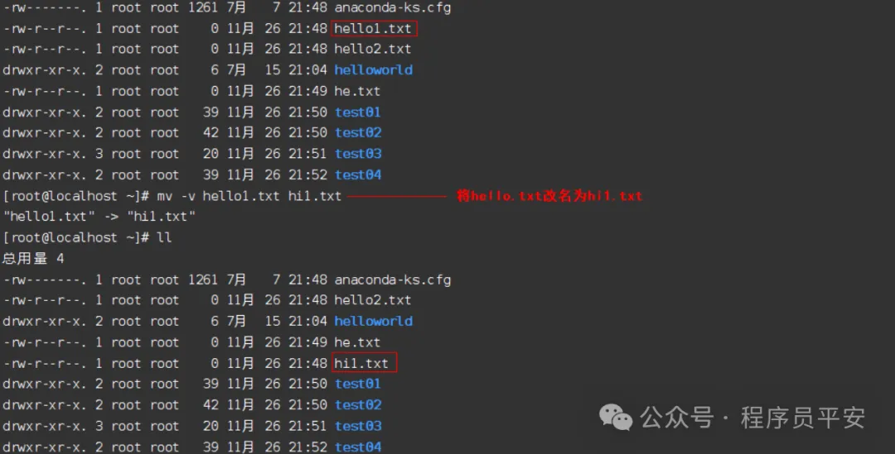

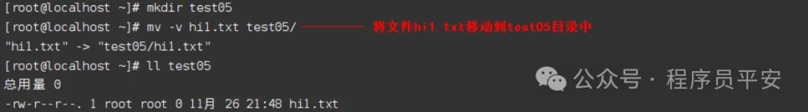


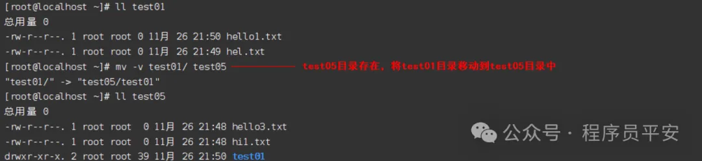

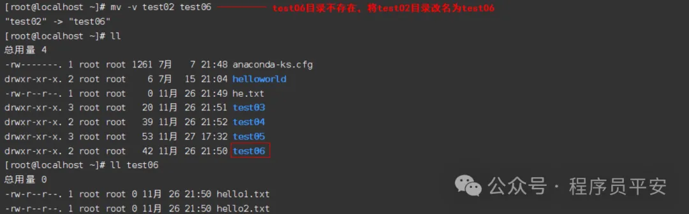

## Linux文件操作命令

## touch 命令

命令说明：

> touch：如果文件不存在，创建文件
> touch a.txt：创建a.txt
> touch b.txt c.txt：一次创建多个文件`b.txt`和`c.txt`

操作示例：

```
[root@localhost ~]# ls
anaconda-ks.cfg  test01  test02
[root@localhost ~]# touch a.txt
[root@localhost ~]# touch b.txt c.txt
[root@localhost ~]# ls
anaconda-ks.cfg  a.txt  b.txt  c.txt  test01  test02
```

### cat 命令

命令说明：

```
作用: 连接文件并在标准输出上输出
语法: cat [选项] [文件列表]...

选项: 
    -n, --number    给所有输出行编号

常见用法: 
    cat -n ~/.bash_profile      查看当前用户目录下的.bash_profile文件内容
```

操作示例：

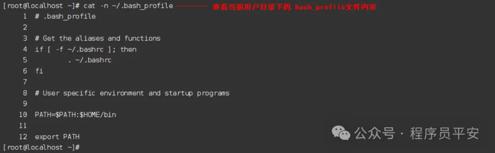

### more 命令

命令说明：

```
作用: 用于分页显示文本 (一次一屏) 
语法: more 文件名

操作说明:
    回车键                向下滚动一行
    空格键 或 s            向下滚动一屏
    b                    返回上一屏
    :p                    回到最前
    q或者Ctrl+C        退出

常见用法: 
    more /etc/profile       以分页方式显示/etc目录下的profile文件内容
```

操作示例：

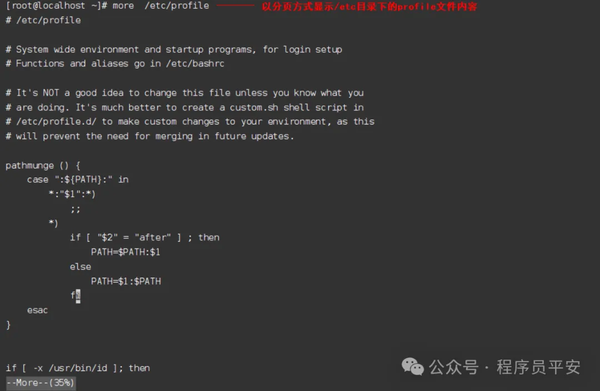

### head 命令

命令说明：

```
作用: 输出文件的开始部分，显示起始10行
语法: head [选项] 文件

选项: 
    -n  输出最前N行,而非默认的起始10行

常见用法: 
    head he.txt         输出he.txt文件前10行的数据
    head -n 5 he.txt    输出he.txt文件前5行的数据
```

操作示例：

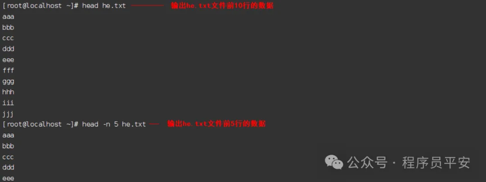

### tail 命令

命令说明：

```
作用: tail 输出文件的末尾部分，显示最后10行
语法: tail [选项] 文件

选项: 
    -n  输出最后N行,而非默认的最后10行
    -f  当文件增长时,输出后续添加的数据

常见用法: 
    tail -f he.txt  输出he.txt文件和后续添加的数据
    tail -n 5 he.txt    输出he.txt最后5行
```

操作示例：

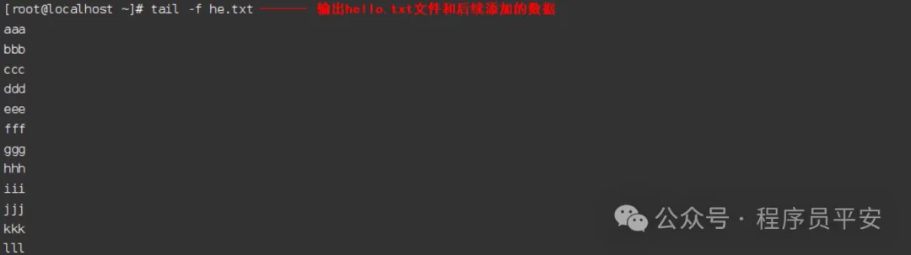

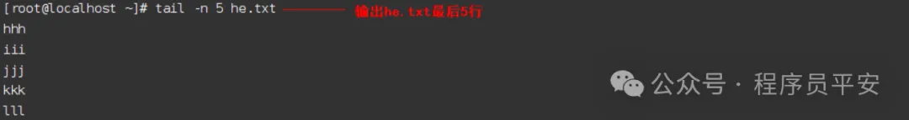

### less 命令

命令说明：

```
作用: 和more类似，用于分页显示文本 (一次一屏)，less可以按上下方向键来显示上下内容，less不必读整个文件，加载速度比more更快。
语法: less 文件名

操作说明:
    回车键                向下滚动一行
    空格键                向下滚动一屏
    b                  返回上一屏
    q或者Ctrl+C         退出

常见用法: 
    less /etc/profile       以分页方式显示/etc目录下的profile文件内容
```

操作示例：

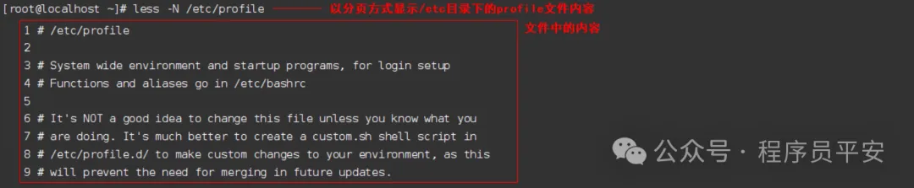

### echo 命令

命令说明：

```
作用: 显示一行文本
语法: echo [OPTION] [STRING]...

选项: 
    -e  允许对下面列出的加反斜线转义的字符进行解释

常见用法: 
    echo "hello world"          在终端输出字符串"hello world"
    echo -e "hello\tworld"      在终端输出字符串"hello  world"
```

操作示例：

```
[root@cyxpa02 ~]# echo "hello world"
hello world
[root@cyxpa02 ~]# echo -e "hello\tworld"
hello   world
```

### >输出重定向和>>追加

命令说明：

| 符号 | 用法           | 说明                                 |
| :--- | :------------- | :----------------------------------- |
| >    | 命令 >文件名   | 重定向输出符号，覆盖文件以前内容     |
| >>   | 命令 >>文件名  | 重定向输出符号，追加写               |
| 2>   | 命令 2>文件名  | 错误重定向输出符号，覆盖文件以前内容 |
| 2>>  | 命令 2>>文件名 | 错误重定向输出符号，追加写           |

操作示例：

```
[root@cyxpa02 ~]# echo "abc" > a.txt
[root@cyxpa02 ~]# cat a.txt 
abc
[root@cyxpa02 ~]# echo "aaa" > a.txt
[root@cyxpa02 ~]# cat a.txt 
aaa
[root@cyxpa02 ~]# echo "bbb" >> b.txt
[root@cyxpa02 ~]# echo "ccc" >> b.txt
[root@cyxpa02 ~]# cat b.txt 
bbb
ccc
```

### ln 命令

在Unix世界里有两个`link`（连接）概念，一般称之为硬连接和软连接。
一个硬连接仅仅是一个文件名。一个文件可以有好几个文件名，只有将最后一个文件名从磁盘上删除，才能把这个文件删掉。所有的文件名都处于同一个状态，也就没有什么`源名字`之说。不允许给目录创建硬链接。
一个软连接是一个包含了路径信息的小小的指定文件。类似于Windows操作系统中的快捷方式，软链接可以对目录进行链接，软连接可以指向不同文件系统里的文件。
ln命令会保持每一处链接文件的同步性，也就是说，不论你改动了哪一处，其它的文件都会发生相同的变化。
ln 在文件间产生连接。缺省时，产生硬连接，有-s选项，则产生符号（软）连接。
命令说明：

```
作用: 在文件之间建立连接
语法: ln [options] source [dest]

选项: 
    -f, --force     删除已存在的目的文件
    -s, --symbolic  建立符号连接以替代硬连接。 在不支持符号连接的系统上，这个选项仅仅会产生一个错误提示而已

常见用法: 
    ln -s a.txt asoftlink       给a.txt建立软连接名为asoftlink
    ln b.txt bhardlink          给b.txt建立硬连接名为bhardlink
```

操作示例：

```
[root@cyxpa02 ~]# ll
-rw-------. 1 root root  1261 7月   7 21:48 anaconda-ks.cfg
-rw-r--r--. 1 root root     8 12月 23 18:03 a.txt
-rw-r--r--. 1 root root     8 12月 20 21:34 b.txt
-rw-r--r--. 1 root root     4 12月 20 21:34 e.txt
[root@cyxpa02 ~]# ln -s a.txt asoftlink
[root@cyxpa02 ~]# ll
-rw-------. 1 root root  1261 7月   7 21:48 anaconda-ks.cfg
lrwxrwxrwx. 1 root root     5 12月 23 18:04 asoftlink -> a.txt
-rw-r--r--. 1 root root     8 12月 23 18:03 a.txt
-rw-r--r--. 1 root root     8 12月 20 21:34 b.txt
-rw-r--r--. 1 root root     4 12月 20 21:34 e.txt
[root@cyxpa02 ~]# cat a.txt
aaa
[root@cyxpa02 ~]# cat asoftlink 
aaa
[root@cyxpa02 ~]# echo bbb >> a.txt 
[root@cyxpa02 ~]# cat asoftlink 
aaa
bbb
[root@cyxpa02 ~]# 
[root@cyxpa02 ~]# 
[root@cyxpa02 ~]# ll
-rw-------. 1 root root  1261 7月   7 21:48 anaconda-ks.cfg
lrwxrwxrwx. 1 root root     5 12月 23 18:04 asoftlink -> a.txt
-rw-r--r--. 1 root root    12 12月 23 18:04 a.txt
-rw-r--r--. 1 root root     8 12月 20 21:34 b.txt
-rw-r--r--. 1 root root     4 12月 20 21:34 e.txt
[root@cyxpa02 ~]# ln b.txt bhardlink
[root@cyxpa02 ~]# ll
-rw-------. 1 root root  1261 7月   7 21:48 anaconda-ks.cfg
lrwxrwxrwx. 1 root root     5 12月 23 18:04 asoftlink -> a.txt
-rw-r--r--. 1 root root    12 12月 23 18:04 a.txt
-rw-r--r--. 2 root root     8 12月 20 21:34 bhardlink
-rw-r--r--. 2 root root     8 12月 20 21:34 b.txt
-rw-r--r--. 1 root root     4 12月 20 21:34 e.txt
[root@cyxpa02 ~]# cat b.txt 
bbb
[root@cyxpa02 ~]# cat bhardlink 
bbb
[root@cyxpa02 ~]# echo ccc >> b.txt 
[root@cyxpa02 ~]# cat bhardlink 
bbb
ccc
[root@cyxpa02 ~]#
```

删除硬连接对应的文件硬链接还能正常使用，只有所有文件被删除，这个文件才被删除。

```
[root@cyxpa02 ~]# ll
-rw-------. 1 root root  1261 7月   7 21:48 anaconda-ks.cfg
lrwxrwxrwx. 1 root root     5 12月 23 18:04 asoftlink -> a.txt
-rw-r--r--. 1 root root    12 12月 23 18:04 a.txt
-rw-r--r--. 2 root root     8 12月 20 21:34 bhardlink
-rw-r--r--. 2 root root     8 12月 20 21:34 b.txt
-rw-r--r--. 1 root root     4 12月 20 21:34 e.txt
[root@cyxpa02 ~]# rm -f b.txt 
[root@cyxpa02 ~]# ll
-rw-------. 1 root root  1261 7月   7 21:48 anaconda-ks.cfg
lrwxrwxrwx. 1 root root     5 12月 23 18:04 asoftlink -> a.txt
-rw-r--r--. 1 root root    12 12月 23 18:04 a.txt
-rw-r--r--. 1 root root    12 12月 23 18:06 bhardlink
-rw-r--r--. 1 root root     4 12月 20 21:34 e.txt
[root@cyxpa02 ~]# cat bhardlink 
bbb
ccc
[root@cyxpa02 ~]#
```

删除软连接对应的文件，软连接对应的文件名出现红色的警告。

```
[root@cyxpa02 ~]# ll
-rw-------. 1 root root  1261 7月   7 21:48 anaconda-ks.cfg
lrwxrwxrwx. 1 root root     5 12月 23 18:04 asoftlink -> a.txt
-rw-r--r--. 1 root root    12 12月 23 18:04 a.txt
-rw-r--r--. 1 root root    12 12月 23 18:06 bhardlink
-rw-r--r--. 1 root root     4 12月 20 21:34 e.txt
[root@cyxpa02 ~]# rm -f a.txt 
[root@cyxpa02 ~]# ll
-rw-------. 1 root root  1261 7月   7 21:48 anaconda-ks.cfg
lrwxrwxrwx. 1 root root     5 12月 23 18:04 asoftlink -> a.txt    # 显示红色警告
-rw-r--r--. 1 root root    12 12月 23 18:06 bhardlink
-rw-r--r--. 1 root root     4 12月 20 21:34 e.txt
[root@cyxpa02 ~]# cat asoftlink 
cat: asoftlink: 没有那个文件或目录
[root@cyxpa02 ~]#
```

删除软连接

```
[root@cyxpa02 ~]# ll
-rw-------. 1 root root  1261 7月   7 21:48 anaconda-ks.cfg
lrwxrwxrwx. 1 root root     5 12月 23 18:20 esoftlink -> e.txt
-rw-r--r--. 1 root root     4 12月 20 21:34 e.txt
drwxr-xr-x. 2 root root     6 7月  15 21:04 helloworld
-rw-r--r--. 1 root root   297 11月 29 11:36 HelloWorld.java
[root@cyxpa02 ~]# rm -f esoftlink
[root@cyxpa02 ~]# ll
-rw-------. 1 root root  1261 7月   7 21:48 anaconda-ks.cfg
-rw-r--r--. 1 root root     4 12月 20 21:34 e.txt
drwxr-xr-x. 2 root root     6 7月  15 21:04 helloworld
-rw-r--r--. 1 root root   297 11月 29 11:36 HelloWorld.java
[root@cyxpa02 ~]#
```

注意：删除软连接时，如果软连接的是一个文件夹，使用`rm -fr 软连接名/`时多了`/`是把软连接对应文件中的内容给删除了。

```
[root@cyxpa02 ~]# ll
-rw-------. 1 root root  1261 7月   7 21:48 anaconda-ks.cfg
-rw-r--r--. 1 root root     4 12月 20 21:34 e.txt
drwxr-xr-x. 2 root root     6 7月  15 21:04 helloworld
-rw-r--r--. 1 root root   297 11月 29 11:36 HelloWorld.java
-rw-r--r--. 1 root root    52 11月 27 21:34 he.txt
drwxr-xr-x. 3 root root    35 11月 27 20:34 test03
[root@cyxpa02 ~]# ll test03
-rw-r--r--. 1 root root  0 11月 27 20:34 abc.TXT
drwxr-xr-x. 2 root root 39 11月 26 21:51 test01
[root@cyxpa02 ~]# 
[root@cyxpa02 ~]# ln -s test03 test03softlink
[root@cyxpa02 ~]# ll
-rw-------. 1 root root  1261 7月   7 21:48 anaconda-ks.cfg
-rw-r--r--. 1 root root     4 12月 20 21:34 e.txt
drwxr-xr-x. 2 root root     6 7月  15 21:04 helloworld
-rw-r--r--. 1 root root   297 11月 29 11:36 HelloWorld.java
-rw-r--r--. 1 root root    52 11月 27 21:34 he.txt
drwxr-xr-x. 3 root root    35 11月 27 20:34 test03
lrwxrwxrwx. 1 root root     6 12月 23 18:29 test03softlink -> test03
[root@cyxpa02 ~]# rm -fr test03softlink/    # 多了/是把软连接对应文件中的内容给删除了
[root@cyxpa02 ~]# ll

-rw-------. 1 root root  1261 7月   7 21:48 anaconda-ks.cfg
-rw-r--r--. 1 root root     4 12月 20 21:34 e.txt
drwxr-xr-x. 2 root root     6 7月  15 21:04 helloworld
-rw-r--r--. 1 root root   297 11月 29 11:36 HelloWorld.java
-rw-r--r--. 1 root root    52 11月 27 21:34 he.txt
drwxr-xr-x. 2 root root     6 12月 23 18:30 test03
lrwxrwxrwx. 1 root root     6 12月 23 18:29 test03softlink -> test03
[root@cyxpa02 ~]# ll test03
总用量 0
[root@cyxpa02 ~]#
```

## Linux查找命令

### find 命令

命令说明：

```
作用: 递归地在层次目录中处理文件
语法: find [path...] [expression]

选项: 
    -name pattern   根据pattern匹配文件名
    -iname pattern    和-name类似，但是匹配时是不区分大小写的

常见用法: 
    find . -name '*.txt'    在当前目录及其子目录下查找.txt结尾的文件
    find . -iname '*.txt'   在当前目录及其子目录下查找.txt结尾的文件，忽略大小写
```

操作示例：

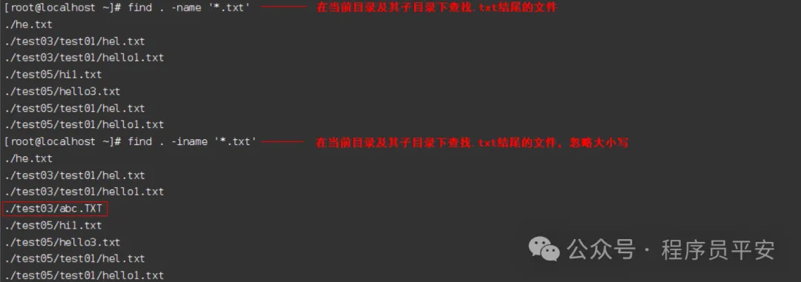

### grep 命令

命令说明：

```
作用: 打印匹配给定模式的行
语法: grep [选项] PATTERN [FILE...]

选项: 
    -n, --line-number   在输出的每行前面加上它所在的文件中它的行号
    -R, -r, --recursive 递归地读每一目录下的所有文件

常见用法: 
    grep g he.txt       查找he.txt文件中出现的g所在行
    grep -n g he.txt    查找he.txt文件中出现的g所在行并显示行号
```

操作示例：


### pgrep 命令

命令说明：

```
作用: 打印进程的进程号
语法: pgrep [选项] PATTERN

常见用法: 
    pgrep tail  查找tail命令的进程号
```

操作示例：

```
[root@cyxpa02 ~]# ps -ef | grep tail
root      12192   7441  0 16:13 pts/0    00:00:00 tail -f he.txt
root      23641  12407  0 16:16 pts/4    00:00:00 grep --color=auto tail
[root@cyxpa02 ~]# pgrep tail
12192
```

## 管道命令

命令说明：

```
作用: 上一个的命令输出作为下一个命令的输入
语法: 命令1 | 命令2

常见用法: 
    ll /proc/ | more        # 显示/proc的内容作为 more 的输入内容
    ll /proc/ | grep at     # 显示/proc的内容作为 grep 的输入内容，查找包含at的内容
    ps aux | grep sshd      # 把ps的结果作为 grep 的输入内容，查找包含sshd的内容
```

操作示例：

```
[root@cyxpa02 ~]# ll /proc/ | more        # 显示/proc的内容作为 more 的输入内容
[root@cyxpa02 ~]# ll /proc/ | grep at    # 显示/proc的内容作为 grep 的输入内容，查找包含at的内容
-r--r--r--.  1 root           root                         0 12月 20 21:46 diskstats
-r--r--r--.  1 root           root                         0 12月 20 21:46 mdstat
-r--r--r--.  1 root           root                         0 12月 20 21:46 schedstat
-r--r--r--.  1 root           root                         0 12月 20 14:37 stat
-rw-r--r--.  1 root           root                         0 12月 20 21:46 timer_stats
-r--r--r--.  1 root           root                         0 12月 20 21:46 vmstat
[root@cyxpa02 ~]# 
[root@cyxpa02 ~]# ps aux | grep sshd    # 把ps的结果作为 grep 的输入内容，查找包含sshd的内容
root       6927  0.0  0.2 112756  4320 ?        Ss   14:36   0:00 /usr/sbin/sshd -D
root       7437  1.3  0.3 161260  6080 ?        Ss   14:36   5:48 sshd: root@pts/0,pts/1
root      12373  1.2  0.3 161260  6096 ?        Ss   16:13   4:10 sshd: root@pts/4,pts/5
root      96061  0.0  0.0 112728   988 pts/2    S+   21:49   0:00 grep --color=auto sshd
root     113448  1.2  0.3 161268  6088 ?        Ss   16:01   4:30 sshd: root@pts/2,pts/3
```

## 压缩解压命令

## tar 命令

命令说明：

```
作用: 打包、压缩、解包、解压
语法: tar filename1 [filename2, ... filenameN]
    文件后缀为.tar表示只是完成了打包但没有压缩
    文件后缀为.tar.gz表示打包的同时还进行了压缩

选项: 
    -z                      用 gzip 对存档压缩或解压
    -c, --create            建立新的存档
    -x, --extract, --get    从存档展开文件
    -v, --verbose            详细显示处理的文件
    -f, --file                指定存档文件的名称

常见用法: 
    打包
        tar -cvf test03.tar test03                将test03目录中所有文件打包，打包后文件名为test03.tar
        tar -zcvf test03.tar.gz test03            将test03目录中所有文件打包并压缩，打包后文件名为test03.tar.gz

    解包
        tar -xvf test03.tar                        将test03.tar文件进行解包，解包后的文件放在当前目录
        tar -zxvf test03.tar.gz                    将test03.tar.gz文件进行解压，解压后的文件放在当前目录
        tar -zxvf test03.tar.gz -C test04        将test03.tar.gz文件进行解压，解压后的文件放在test04目录
```

操作示例：

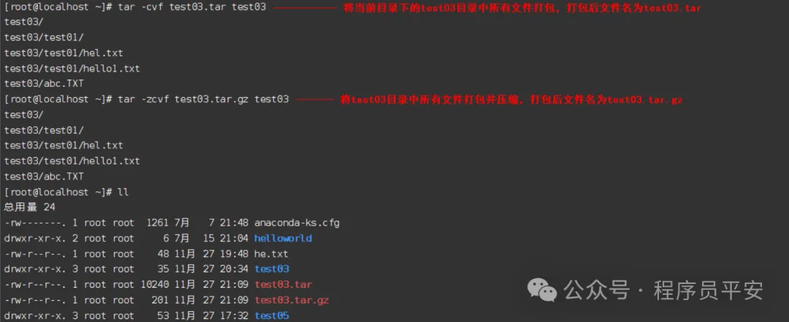

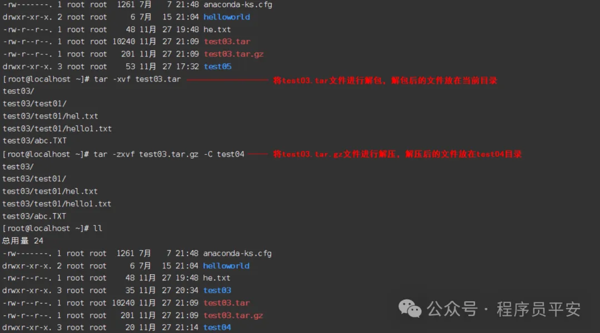

## 其他命令

## clear 命令

命令说明：

```
作用: 清除终端屏幕
语法: clear

常见用法: 
    clear   清除终端屏幕，本质是把内容滚动到了上一页
```

操作示例：

```
[root@cyxpa02 ~]# clear
```

### reset 命令

命令说明：

```
作用: 终端初始化，彻底清除终端的内容
语法: reset

常见用法: 
    reset   清除终端屏幕，本质是把内容滚动到了上一页
```

操作示例：

```
[root@cyxpa02 ~]# clear
```

### history 命令

命令说明：

```
作用: 显示历史命令
语法: history

常见用法: 
    history     显示历史命令
```

操作示例：

```
662  ln b.txt bhard
663  ll
664  cat a.txt 
665  cat b.txt 
666  cat bhard 
667  cat asoft 
668  echo sss >> a.txt 
669  cat asoft 
670  rm -f asoft 
671  rm -f bhard 
672  ll
673  clear
674  ll
675  ln -s a.txt asoftlink
```

## Vim文本编辑

## Vim介绍 命令

`Vim`是 一个 同`Vi`向上兼容的文本编辑器，可以用来编辑任何ASCII文本，可以把`Vim`理解为`Windows`的记事本。
它对 `Vi` 作了 许多 增强：多层撤销，多窗口，多缓冲区(buffer)，高亮度语法显示，命令行编辑，文件名匹配，在线帮助，可视选定等等. 用。

### vim安装 命令

```
yum install vim
```

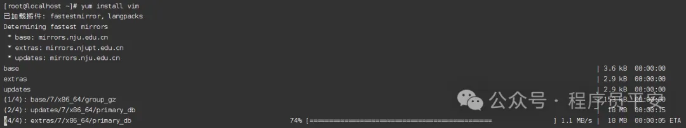

安装过程会提示确认，此时输入 y然后回车，继续安装。

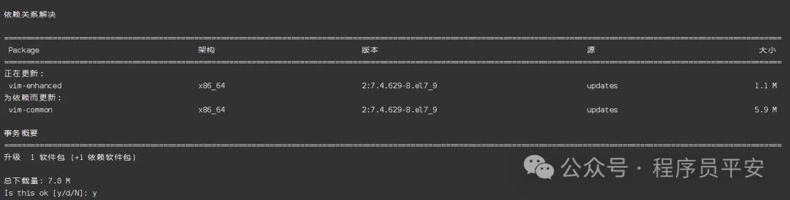

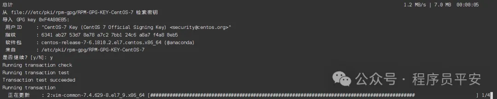

### Vim语法 命令

命令说明：

```
作用: 如果指定的文件存在则直接打开此文件，如果指定的文件不存在则新建文件
语法: vim file

说明: 
    三种模式: 
        1.命令模式下可以查看文件内容、移动光标
        2.插入模式下可以对文件内容进行编辑
        3.底行模式下可以通过命令对文件内容进行查找、显示行号、退出等操作
```

操作示例：

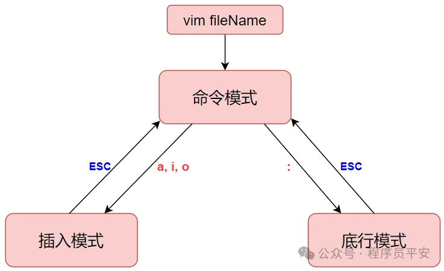

| 命令模式 （移动） | 作用             |      | 命令模式 （查找） | 作用            |      | 命令模式 （撤销/恢复） | 作用 |
| ----------------- | ---------------- | ---- | ----------------- | --------------- | ---- | ---------------------- | ---- |
| jkhl              | 上下左右移动     |      | /abc              | 向下查找abc     |      | u                      | 撤销 |
| gg                | 移动到文档首行   |      | /^abc             | 查找abc开头的行 |      | ctrl+r                 | 恢复 |
| G                 | 移动到文档尾行   |      | /abc$             | 查找abc结尾的行 |      |                        |      |
| $                 | 移动到行尾       |      | n或；             | 查找下一个      |      |                        |      |
| ^                 | 移动到行首       |      | N或,              | 查找上一个      |      |                        |      |
| ctrl+b或pageUp键  | 向上翻一页       |      |                   |                 |      |                        |      |
| ctrl+f或pageDn键  | 向下翻一页       |      |                   |                 |      |                        |      |
| z+Enter           | 当前行在屏幕顶部 |      |                   |                 |      |                        |      |

| 命令模式（选中） | 作用     |      | 命令模式（复制/粘贴） | 作用         |
| :--------------- | :------- | :--- | :-------------------- | :----------- |
| v                | 选中字符 |      | y                     | 复制已选中的 |
| V                | 选中行   |      | yy                    | 复制一行     |
| ctrl+v           | 选中块   |      | dd                    | 剪切一行     |
|                  |          |      | x                     | 删除字符     |
|                  |          |      | p                     | 粘贴到光标后 |
|                  |          |      | P                     | 粘贴到光标前 |

| 底行模式    | 作用                 |
| :---------- | :------------------- |
| :wq         | 保存并退出           |
| :q!         | 不保存退出           |
| :set nu     | 显示行号             |
| :set nonu   | 取消行号显示         |
| :n          | 跳转到第n行          |
| :w filename | 另存到 filename 文件 |

# 面试最常考的21条Linux命令合集

## **一、文件和目录**

**1、cd命令**

（它用于切换当前目录，它的参数是要切换到的目录的路径，可以是绝对路径，也可以是相对路径）

cd /home   进入 '/ home' 目录

cd ..       返回上一级目录

cd ../..     返回上两级目录

cd        进入个人的主目录

cd ~user1  进入个人的主目录

cd -       返回上次所在的目录

**2、pwd命令**

pwd 显示工作路径

**3、ls命令**

（查看文件与目录的命令，list之意）

ls 查看目录中的文件

ls -l 显示文件和目录的详细资料

ls -a 列出全部文件，包含隐藏文件

ls -R 连同子目录的内容一起列出（递归列出），等于该目录下的所有文件都会显示出来

ls [0-9] 显示包含数字的文件名和目录名

**4、cp 命令**

（用于复制文件，copy之意，它还可以把多个文件一次性地复制到一个目录下）

-a ：将文件的特性一起复制

-p ：连同文件的属性一起复制，而非使用默认方式，与-a相似，常用于备份

-i ：若目标文件已经存在时，在覆盖时会先询问操作的进行

-r ：递归持续复制，用于目录的复制行为

-u ：目标文件与源文件有差异时才会复制

**5、mv命令**

（用于移动文件、目录或更名，move之意）

-f ：force强制的意思，如果目标文件已经存在，不会询问而直接覆盖

-i ：若目标文件已经存在，就会询问是否覆盖

-u ：若目标文件已经存在，且比目标文件新，才会更新

**6、rm 命令**

（用于删除文件或目录，remove之意）

-f ：就是force的意思，忽略不存在的文件，不会出现警告消息

-i ：互动模式，在删除前会询问用户是否操作

-r ：递归删除，最常用于目录删除，它是一个非常危险的参数

## **二、查看文件内容**

**7、cat命令**

（用于查看文本文件的内容，后接要查看的文件名，通常可用管道与more和less一起使用）

cat file1 从第一个字节开始正向查看文件的内容

tac file1 从最后一行开始反向查看一个文件的内容

cat -n file1 标示文件的行数

more file1 查看一个长文件的内容

head -n 2 file1 查看一个文件的前两行

tail -n 2 file1 查看一个文件的最后两行

tail -n +1000 file1  从1000行开始显示，显示1000行以后的

cat filename | head -n 3000 | tail -n +1000  显示1000行到3000行

cat filename | tail -n +3000 | head -n 1000  从第3000行开始，显示1000(即显示3000~3999行)

## **三、文件搜索**

**8、find命令（）**

find / -name file1 从 '/' 开始进入根文件系统搜索文件和目录

find / -user user1 搜索属于用户 'user1' 的文件和目录

find /usr/bin -type f -atime +100 搜索在过去100天内未被使用过的执行文件

find /usr/bin -type f -mtime -10 搜索在10天内被创建或者修改过的文件

whereis halt 显示一个二进制文件、源码或man的位置

which halt 显示一个二进制文件或可执行文件的完整路径 删除大于50M的文件：

find /var/mail/ -size +50M -exec rm {} ＼;

## **四、文件的权限 - 使用 "+" 设置权限，使用 "-" 用于取消**

**9、chmod 命令**

ls -lh 显示权限

chmod ugo+rwx directory1 设置目录的所有人(u)、群组(g)以及其他人(o)以读（r，4 ）、写(w，2)和执行(x，1)的权限

chmod go-rwx directory1  删除群组(g)与其他人(o)对目录的读写执行权限

**10、chown 命令**

（改变文件的所有者）

chown user1 file1 改变一个文件的所有人属性

chown -R user1 directory1 改变一个目录的所有人属性并同时改变改目录下所有文件的属性

chown user1:group1 file1 改变一个文件的所有人和群组属性

**11、chgrp 命令**

（改变文件所属用户组）

chgrp group1 file1 改变文件的群组

## **五、文本处理**

**12、grep 命令**

（分析一行的信息，若当中有我们所需要的信息，就将该行显示出来，该命令通常与管道命令一起使用，用于对一些命令的输出进行筛选加工等等）

grep Aug /var/log/messages  在文件 '/var/log/messages'中查找关键词"Aug"

grep ^Aug /var/log/messages 在文件 '/var/log/messages'中查找以"Aug"开始的词汇

grep [0-9] /var/log/messages 选择 '/var/log/messages' 文件中所有包含数字的行

grep Aug -R /var/log/* 在目录 '/var/log' 及随后的目录中搜索字符串"Aug"

sed 's/stringa1/stringa2/g' example.txt 将example.txt文件中的 "string1" 替换成 "string2" sed '/^$/d' example.txt 从example.txt文件中删除所有空白行（搜索公众号：互联网架构师，回复“2T”，送你一份架构师宝典）

**13、paste 命令**

paste file1 file2 合并两个文件或两栏的内容

paste -d '+' file1 file2 合并两个文件或两栏的内容，中间用"+"区分

**14、sort 命令**

sort file1 file2 排序两个文件的内容

sort file1 file2 | uniq 取出两个文件的并集(重复的行只保留一份)

sort file1 file2 | uniq -u 删除交集，留下其他的行

sort file1 file2 | uniq -d 取出两个文件的交集(只留下同时存在于两个文件中的文件)

**15、comm 命令**

comm -1 file1 file2 比较两个文件的内容只删除 'file1' 所包含的内容

comm -2 file1 file2 比较两个文件的内容只删除 'file2' 所包含的内容

comm -3 file1 file2 比较两个文件的内容只删除两个文件共有的部分

## **六、打包和压缩文件**

**16、tar 命令**

（对文件进行打包，默认情况并不会压缩，如果指定了相应的参数，它还会调用相应的压缩程序（如gzip和bzip等）进行压缩和解压）

-c ：新建打包文件

-t ：查看打包文件的内容含有哪些文件名

-x ：解打包或解压缩的功能，可以搭配-C（大写）指定解压的目录，注意-c,-t,-x不能同时出现在同一条命令中

-j ：通过bzip2的支持进行压缩/解压缩

-z ：通过gzip的支持进行压缩/解压缩

-v ：在压缩/解压缩过程中，将正在处理的文件名显示出来

-f filename ：filename为要处理的文件

-C dir ：指定压缩/解压缩的目录dir

压缩：tar -jcv -f filename.tar.bz2 要被处理的文件或目录名称

查询：tar -jtv -f filename.tar.bz2

解压：tar -jxv -f filename.tar.bz2 -C 欲解压缩的目录

bunzip2 file1.bz2 解压一个叫做 'file1.bz2'的文件

bzip2 file1 压缩一个叫做 'file1' 的文件

gunzip file1.gz 解压一个叫做 'file1.gz'的文件

gzip file1 压缩一个叫做 'file1'的文件

gzip -9 file1 最大程度压缩

rar a file1.rar test_file 创建一个叫做 'file1.rar' 的包

rar a file1.rar file1 file2 dir1 同时压缩 'file1', 'file2' 以及目录 'dir1'

rar x file1.rar 解压rar包

zip file1.zip file1 创建一个zip格式的压缩包

unzip file1.zip 解压一个zip格式压缩包

zip -r file1.zip file1 file2 dir1 将几个文件和目录同时压缩成一个zip格式的压缩包

## **七、系统和关机 (系统的关机、重启以及登出 )**

shutdown -h now 关闭系统(1)

init 0 关闭系统(2)

telinit 0 关闭系统(3)

shutdown -h hours:minutes & 按预定时间关闭系统

shutdown -c 取消按预定时间关闭系统

shutdown -r now 重启(1)

reboot 重启(2)

logout 注销

time 测算一个命令（即程序）的执行时间

## **八、进程相关的命令**

**17、jps命令**

（显示当前系统的java进程情况，及其id号）

jps(Java Virtual Machine Process Status Tool)是JDK 1.5提供的一个显示当前所有java进程pid的命令，简单实用，非常适合在linux/unix平台上简单察看当前java进程的一些简单情况。

**18、ps命令**

（用于将某个时间点的进程运行情况选取下来并输出，process之意）

-A ：所有的进程均显示出来

-a ：不与terminal有关的所有进程

-u ：有效用户的相关进程

-x ：一般与a参数一起使用，可列出较完整的信息

-l ：较长，较详细地将PID的信息列出

ps aux # 查看系统所有的进程数据

ps ax # 查看不与terminal有关的所有进程

ps -lA # 查看系统所有的进程数据

ps axjf # 查看连同一部分进程树状态

**19、kill命令**

（用于向某个工作（%jobnumber）或者是某个PID（数字）传送一个信号，它通常与ps和jobs命令一起使用）

**20、killall命令**

（向一个命令启动的进程发送一个信号）

**21、top命令**

是Linux下常用的性能分析工具，能够实时显示系统中各个进程的资源占用状况，类似于Windows的任务管理器。

如何杀死进程：

图形化界面的方式

kill -9 pid  （-9表示强制关闭）

killall -9 程序的名字

pkill 程序的名字

查看进程端口号：

netstat -tunlp|grep 端口号