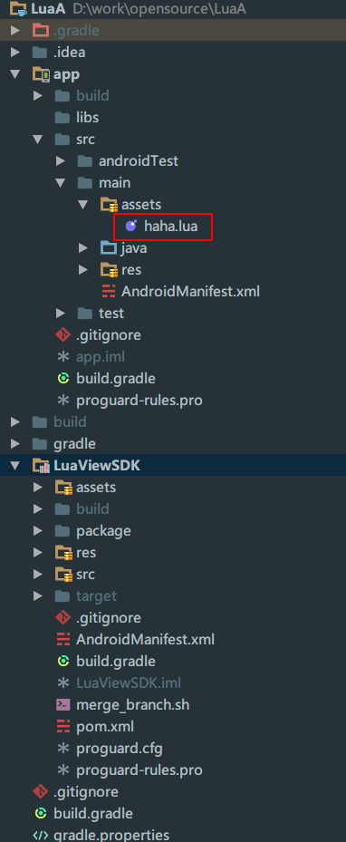

# Lua实战

## OpenResty：Nginx与Lua的梦幻联动，打造高性能Web应用

在Web开发领域，寻求性能与灵活性之间的完美平衡是开发者永恒的追求。

OpenResty以其独特的架构设计，将Nginx的高性能与Lua的轻量级脚本语言紧密结合，为构建高效、灵活的Web应用提供了全新的解决方案。

### OpenResty：Nginx与Lua的强强联合

OpenResty并非仅仅是一款Web服务器，它是基于Nginx并扩展了Lua脚本处理能力的一个全功能平台。这意味着，开发者能够在Nginx服务的生命周期中，几乎任何阶段（如访问控制、请求路由、响应生成等）嵌入执行Lua脚本，实现业务逻辑的动态化和精细化控制。

### OpenResty的优势

1. 高性能：Nginx本身的高性能特性使得OpenResty在处理大量并发请求时表现出色。
2. 灵活性：通过嵌入Lua代码，开发者可以在Web应用的各个层面实现自定义逻辑，满足不同业务场景的需求。
3. 可扩展性：OpenResty提供了丰富的模块和API，方便开发者进行扩展和定制。
   **一个简单的OpenResty示例**

下面是一个使用OpenResty和Lua实现的简单示例，用于演示如何在Web应用中嵌入Lua代码实现自定义逻辑。

假设我们有一个Web应用，需要实现对所有请求进行访问控制，只允许特定IP地址的用户访问。我们可以使用OpenResty和Lua来实现这一功能。

首先，确保你已经安装了OpenResty。然后，创建一个名为access_control.lua的Lua脚本文件，内容如下：

```lua
-- 允许的IP地址列表
local allowed_ips = {"127.0.0.1"}

-- 客户端IP地址
local ip = ngx.var.remote_addr

-- 判断IP地址是否在允许列表中
function is_allowed(ip, allowed_ips)
    for _, allowed_ip in ipairs(allowed_ips) do
        if allowed_ip == ip then
            return true
        end
    end
    return false
end

if not is_allowed(ip, allowed_ips) then
    -- 设置返回状态码为403 Forbidden
    ngx.status = ngx.HTTP_FORBIDDEN
    -- 返回错误信息
    ngx.say("Access denied!")
    -- 结束请求处理
    ngx.exit(ngx.HTTP_FORBIDDEN)
end

-- 将请求转发到指定的上游服务处理
ngx.exec("@xx_upstream")
```

Lua语言的注释规则：

- 单行注释使用两个连字符（--）。
- 多行注释则可以使用 --[[ 和 --]] 标记对。

接下来，在Nginx的配置文件（通常是conf/nginx.conf）中，添加以下配置：

```bash
http {
    ...
    server {
        ...
        location / {
            ...
            # 加载并执行Lua脚本文件
            content_by_lua_file lua/access_control.lua;
            ...
        }
    }
}
```

在Nginx配置文件中，使用content_by_lua_file指定Lua文件，文件路径使用相对于nginx目录的相对路径（上述示例中，lua与conf在同一级目录）；也可以使用content_by_lua_block，直接在Nginx配置文件中编写Lua代码块。

Nginx配置文件采用井号（#）进行单行注释。如果使用content_by_lua_block编写Lua代码块，需要注意Nginx配置文件与Lua语言的注释区别。

最后，重新加载Nginx配置，使配置生效：

```bash
sudo bin/openresty -s reload
```

现在，只有允许列表中的IP地址才能访问Web应用，其他IP地址的请求将被拒绝并返回403 Forbidden状态码。可以通过curl命令的-I（字母i的大写）选项查看返回头信息。

使用本机访问时：

```bash
~$ curl -I http://127.0.0.1/
HTTP/1.1 200 OK
Server: openresty/1.25.3.1
Date: Tue, 05 Mar 2024 13:27:45 GMT
Content-Type: text/html
Connection: keep-alive
```

使用他机访问时：

```bash
~$ curl -I http://127.0.0.1/
HTTP/1.1 403 Forbidden
Server: openresty/1.25.3.1
Date: Tue, 05 Mar 2024 13:28:49 GMT
Content-Type: text/html
Connection: keep-alive
```

### 总结

OpenResty作为一款集成了Nginx和Lua的高性能Web平台，为开发者提供了强大的扩展能力和灵活性。通过嵌入Lua代码，我们可以在Web应用的各个层面实现自定义逻辑，满足不同业务场景的需求。希望本文能够帮助你了解OpenResty的优势和用法，并激发你对高性能Web应用的探索热情。

## Lua实现正则表达式匹配

在编程世界中，正则表达式是一个强大的工具，它能帮助我们高效地处理字符串匹配和替换的任务。Lua作为一种轻量级、可嵌入的脚本语言，也提供了丰富的字符串处理功能，其中就包括模式匹配。本文将探讨如何在Lua中使用基于字符串模式匹配的API来封装函数，检测字符串是否匹配正则表达式，并特别介绍一下在OpenResty环境下，如何利用ngx.re库进行高效的正则处理。

### 一、Lua中的字符串模式匹配

Lua语言内置了一套强大的字符串模式匹配API，通过这套API，我们可以方便地进行正则表达式的匹配和替换操作。

Lua的字符串模式匹配主要依赖于string.find、string.match、string.sub等函数。这些函数都接受一个模式字符串作为参数，模式字符串中可以使用各种正则表达式元字符来定义匹配规则。

在Lua中，可以使用string.match函数来进行字符串匹配。该函数会返回第一个匹配到的捕获结果，如果没有匹配到则返回nil。例如：

```lua
local pattern = "139[0-9]*"
local phone_number= "13912341234"
local result = string.match(phone_number, pattern)
print(result) -- 输出匹配的号码
```

上面的代码中，我们定义了一个模式“139[0-9]*”，用于匹配以“139”开头的手机号码，并捕获其后的任意数字字符。然后，我们使用string.match函数对手机号码进行匹配，并打印出匹配结果。

Lua匹配单个数字也可以使用“%d”。然而，Lua并未采用正则表达式的完整语法，上述示例如果想要精确匹配11位数字的号码，不能使用“139%d{8}”或者“139[0-9]{8}”这种模式，可以使用“139%d%d%d%d%d%d%d%d”。

如果想匹配以“138”或者“139”开头的手机号，也不能使用“138%d*|139%d*”这种模式。因为在Lua的模式匹配语法中，竖线“|”只是一个普通的字符。可以自定义函数，将竖线分隔的模式拆分开，然后对各部分单独进行模式匹配。

### 二、封装函数检测字符串匹配

为了方便地实现“138%d*|139%d*”这种模式匹配，我们可以通过封装函数来完成。下面是一个简单的示例：

```lua
local _M = {}

function _M.split(str, delimiter)
    local result = {}
    local from = 1
    local start, finish = string.find(str, delimiter, from)
    while start do
        table.insert(result, string.sub(str, from, start-1))
        from = finish + 1
        start, finish = string.find(str, delimiter, from)
    end
    table.insert(result, string.sub(str, from))
    return result
end

function _M.regmatch(str, pattern)
    if str == null or pattern == null then
        return false;
    end
    local len = string.len(str)
    local pattern_table = _M.split(pattern, "|")
    for _, _pattern in ipairs(pattern_table) do
        local start, finish = string.find(str, _pattern);
        if start == 1 and finish == len then
            return true;
        end
    end
    return false;
end

return _M
```

在这个示例中，我们定义了两个函数：split和regmatch，前者将模式按竖线拆分，后者逐个对单个模式进行匹配。

_M通常在编写模块时出现，用来组织和导出模块的功能。它是一个表（table），用于存储模块提供的所有函数和变量，最后返回这个表，这样外部脚本可以通过require导入这个模块并访问_M中的内容。

将上述脚本保存为regmatch.lua文件，参考以下示例使用其中的函数：

```lua
local reg = require "regmatch"
local pattern = "138%d*|139%d*"
local phone_number= "13912341234"
local result = string.match(phone_number, pattern)
print(result) -- 输出匹配的号码
```

### 三、OpenResty与ngx.re库

OpenResty是一个基于Nginx与LuaJIT的高性能Web平台，它允许开发者使用Lua语言来扩展Nginx的功能。在OpenResty中，我们可以使用ngx.re库来进行高效的正则表达式处理。

ngx.re库提供了比Lua标准库更强大的正则表达式功能，并且支持JIT（即时编译）以提高性能。下面是一个在OpenResty中使用ngx.re库进行正则表达式匹配的示例：

```lua
#!/usr/bin/resty
local ngx = require("ngx")

local phone_number = arg[1]
local pattern = arg[2]

-- 执行正则匹配，options可以是"jo"（分别对应于ngx.RE_JAVASCRIPT_COMPAT和ngx.RE_OPTIMIZE选项）
local match, err = ngx.re.match(phone_number, pattern, "jo")
if err then
    print(err)
end
if match then
    print(true)
else
    print(false)
end
```

在这个示例中，通过require语句引入了ngx库，然后使用ngx.re.match进行正则表达式匹配，并可以设置各种选项来控制匹配的行为，更多选项将在后续介绍。如果匹配成功，则返回true；否则返回false。

注意该脚本的Shebang是#!/usr/bin/resty，区别于使用官方Lua解释器的#!/usr/bin/lua。

为方便测试，通过arg表来访问命令行参数，将该示例保存为文件ngxretest.lua，测试正则表达式匹配：

```bash
~$ ./ngxretest.lua "13912341234" "^(138\d{8}|139\d{8})$"
true
```

通过封装函数和使用ngx.re库，我们可以更加方便地在Lua和OpenResty环境中进行正则表达式匹配和处理。无论是简单的字符串模式匹配还是复杂的正则表达式处理，Lua都为我们提供了强大的支持。

## Lua语言探秘：以N皇后问题展现其魅力

今天以N皇后问题为例，直观地展示Lua语言的特点和魅力。

N皇后问题是回溯算法的典型案例。在N×N的棋盘上放置N个皇后，使得任何两个皇后都不能相互攻击，即：不在同一行、同一列或同一斜线上。这个问题不仅考验了我们的逻辑思维能力，还能很好地展现编程语言的特性。

Lua语言是一种轻量级、可嵌入的脚本语言，它设计简单、清晰且易于学习。在解决N皇后问题时，Lua语言的简洁性和高效性得到了充分体现。

首先，Lua语言具有强大的数组和表处理能力。在解决N皇后问题时，我们需要频繁地访问和修改棋盘上的状态。Lua中的表（table）可以方便地存储和操作这些数据，使得我们能够轻松地实现问题的求解。

其次，Lua语言的语法简单明了，易于上手。这使得我们可以更加专注于问题本身，而不是花费大量时间在语言学习上。在编写N皇后问题的解决方案时，我们可以快速地构建出清晰、易懂的代码结构。

此外，Lua语言还具有高效的执行速度。虽然它是一种脚本语言，但在性能上并不逊色于其他主流编程语言。这使得Lua在处理复杂问题时能够保持高效的运行速度，从而更快地找到N皇后问题的解。


要解决N皇后问题，可以用一个由N个数字组成的数组来表示可能的解决方案，数组下标对应棋盘的行号，数组元素值代表棋盘的列。Lua的表作为数组时索引是从1开始的。例如，数组{1,5,8,6,3,7,2,4}表示皇后在8x8棋盘中的位置分别是(1,1)、(2,5)、(3,8)、(4,6)、(5,3)、(6,7)、(7,2)、(8,4)。

下面是一个简单的Lua程序示例，使用回溯算法解决N皇后问题：

```lua
#!/usr/bin/lua

-- 棋盘大小默认为8*8，可通过命令行参数调整
if #arg == 1 and string.match(arg[1], "%d") then
    N = tonumber(arg[1])
    N = math.min(math.max(N, 4), 8)
else
    N = 8
end

-- 判断当前位置是否可以放置皇后
function isPlaceOk(board, row, col)
    for i = 1, row - 1 do
        -- 检查列
        if board[i] == col then
            return false
        end
        -- 检查左上对角线
        if board[i] == col - (row - i) then
            return false
        end
        -- 检查右上对角线
        if board[i] == col + (row - i) then
            return false
        end
    end
    return true
end

-- 打印解决方案
function printSolution(board)
    for i = 1, N do
        io.write(board[i], " ")
    end
    io.write("\n")
    if N == 4 then
        -- 输出4*4的棋盘示意图
        for i = 1, N do
            for j = 1, N do
                io.write(board[i] == j and "X" or "-", " ")
            end
            io.write("\n")
        end
        io.write("\n")
    end
end


-- 添加皇后到棋盘进行求解
function addQueen(board, row)
    if row > N then  -- 所有皇后都已放置
        printSolution(board)
        return
    end
    
    for col = 1, N do
        if isPlaceOk(board, row, col) then
            board[row] = col
            addQueen(board, row + 1)
        end
    end
end

-- 初始化棋盘并开始求解
board = {}
addQueen(board, 1)
```

在上面的示例中，定义了一个isPlaceOk函数，用于检查在某个位置上放置皇后是否可以避免各皇后相互攻击。然后，使用了回溯法来求解N皇后问题，通过不断地尝试每一个位置，并在找到合法位置后继续为下一皇后寻找合法位置。当找到一组解时，打印出棋盘的状态。

当棋盘大小为4x4时，问题只有二组解，除了输出代表棋盘布局的数组值，还输出4x4的棋盘示意图，方便对照查看结果。

通过这个示例，我们可以看到Lua语言在解决N皇后问题时的简洁性和高效性。当然，Lua语言还有更多强大的功能和特性等待我们去发掘和应用。

## 揭秘Lua数学库math：让计算变得如此简单

参考手册：https://www.lua.org/manual

在编程的世界中，数学运算是一项不可或缺的技能。而对于Lua语言的使用者来说，math库就如同一位得力的助手，帮助我们轻松应对各种数学挑战。今天，就让我们一起走进Lua的math库，探索它为我们带来的便利与神奇。

### 一、math库概述

Lua的math库提供了一系列用于数学运算的函数，涵盖了基础数学、三角函数、指数和对数函数等多个方面。这些函数简单易用，能够帮助我们快速完成各种复杂的数学计算。

### 二、常用函数介绍

#### 1.基础数学函数

math.abs(x)：返回x的绝对值。

math.floor(x)：返回小于或等于x的最大整数值。

math.ceil(x)：返回大于或等于x的最小整数值。

math.modf(x)：返回x的整数部分和x的小数部分，它的第二个结果始终是浮点值。

math.max(x, y, ...)：返回参数中的最大值。

math.min(x, y, ...)：返回参数中的最小值。

math.random([min, [max]])：返回一个随机数，可选参数为整数。如果不带参数，返回一个在[0,1)范围内均匀分布的伪随机浮点值；如果带一个参数（该参数大于等于1），返回[1, 参数]之间的伪随机整数；如果带两个参数，返回[min, max]之间的伪随机整数。

math.randomseed(x)：将x设置为伪随机生成器的“种子”，相等的种子产生相等的数字序列。

#### 2.三角函数

math.sin(x)：返回x的正弦值（弧度制）。

math.cos(x)：返回x的余弦值（弧度制）。

math.tan(x)：返回x的正切值（弧度制）。

math.asin(x)：返回x的正弦弧（以弧度为单位）。

math.acos(x)：返回x的反余弦（以弧度为单位）。

math.atan (y [, x])：返回y/x的反正切（以弧度为单位），但使用两个参数的符号来查找结果的象限。（它还可以正确处理x为零的情况。）

#### 3.指数函数和对数函数

math.exp(x)：返回e的x次方。

math.log(x [, base])：返回给定基数的x的对数。基数的默认值是e（因此函数返回x的自然对数）。

### 三、整数边界

除了常用的数学函数，math库还有两个重要的常量：

math.maxinteger：具有Lua能够表示的最大整数值，即64位有符号整数的最大正数。

math.mininteger：具有Lua能够表示的最小整数值，即64位有符号整数的最大负数。

当我们在数值计算时遇到比math.maxinteger更大，或者比math.mininteger更小的数值时，不会引发错误，而是会发生回环：即数值会从最大整数开始向最小整数方向循环，或者从最小整数开始向最大整数方向循环。

例如，在Lua 5.3中，如果尝试将math.maxinteger+1的结果打印出来，实际它返回了math.mininteger的值，而math.mininteger-1的结果为math.maxinteger的值：

```bash
~$ lua
Lua 5.3.3  Copyright (C) 1994-2016 Lua.org, PUC-Rio
> print(math.maxinteger)
9223372036854775807
> print(math.mininteger)
-9223372036854775808
> print(math.maxinteger+1)
-9223372036854775808
> print(math.mininteger-1)
9223372036854775807
```

### 总结

Lua的math库是一个强大的数学工具集，它能够帮助我们轻松应对各种数学挑战。通过掌握math库中的常用函数和使用方法，我们能够更加高效地进行数学计算，为编写高质量的Lua程序提供有力支持。

## 深度解析Lua字符串标准库：从基础到实践

在Lua的世界中，字符串处理是一项至关重要的任务。Lua语言为我们提供了一套功能强大的字符串标准库，它使得字符串的操作变得简单而高效。本文将深入解析Lua字符串标准库，并通过一些实用示例来展示其使用方法。

### 基础操作

string.len(s)：返回字符串s的长度。

string.lower(s)：将字符串s转换为全小写。

string.upper(s)：将字符串s转换为全大写。

string.byte(s [, i [, j]])：返回字符s[i]、s[i+1]、…s[j]的ASCII码。i的默认值为1；j的默认值是i。

```lua
print(string.byte ("abcd", 1, 2))
-- 输出：97 98
```

string.char(···)：接收零个或多个整数，返回一个长度等于参数个数的字符串，其中每个字符的ASCII码等于其对应的参数。

```lua
print(string.char(97,98))
-- 输出：ab
```

string.reverse(s)：返回字符串s反转后的字符串。

### 字符串查找与替换

string.find(s, pattern [, init [, plain]])：在字符串s中查找pattern出现的第一个匹配项，返回其起始和结束位置索引。若找不到则返回nil。

```lua
str = "Hello, World!"  
starts, ends = string.find(str, "World")  
print(starts, ends)  -- 输出：8 12
```

string.gmatch (s, pattern)：返回一个迭代器函数，每次调用该函数时，该函数都会通过字符串s返回模式中的下一个捕获。如果模式未指定捕获，则在每次调用中生成整个匹配。以下示例将字符串s中的所有key=value对收集到表t中：

```lua
t = {}
s = "from=world, to=Lua"
for k, v in string.gmatch(s, "(%w+)=(%w+)") do
    t[k] = v
end
```

string.gsub(s, pattern, repl [, n])：在字符串s中全局替换所有匹配pattern的部分为repl，n可选参数用于限制替换次数。

```lua
str = "apple, banana, apple pie"  
newStr, count = string.gsub(str, "apple", "orange")  
print(newStr)  -- 输出：orange, banana, orange pie  
print(count)   -- 输出：2
```

### 其他实用函数

string.sub(s, i [, j])：返回s的子字符串，该子字符串从i开始，一直持续到j；i和j可以是负数。如果j不存在，则假定它等于-1（与字符串长度相同）。

```lua
str = "Hello, World!"
substr = string.sub(str, 8, -2)
print(substr) -- 输出：World
```

string.format(formatString, ...)：格式化输出字符串，类似于C语言的printf函数。

```lua
name = "Lua"
version = "5.3"
print(string.format("Language: %s, version: %.1f", name, version))
-- 输出：Language: Lua, version: 5.3
```

string.rep(s, n [, sep])：返回由字符串sep分隔的、字符串s的n个副本串联而成的字符串。sep的默认值为空字符串（即没有分隔符）。如果n不为正，则返回空字符串。

```lua
print(string.rep("*", 3, ","))
-- 输出：*,*,*
```


Lua字符串标准库提供了丰富而强大的功能，使得字符串处理变得简单高效。通过本文的介绍和示例，相信你已经对Lua字符串标准库有了更深入的了解。在实际开发中，你可以根据需求选择合适的函数来处理字符串，提高程序的灵活性和可读性。


更多不常用的函数可查阅Lua官方手册：https://www.lua.org/manual/

## Lua表的奥秘：深入理解与运用Lua表

在Lua的世界里，表（table）无疑是最核心、最强大的数据结构。它可以表示数组、集合、字典等多种数据结构，也用来表示包（package）和其它对象。本文将带领大家一同探索Lua表的奥秘。

### 表的索引

Lua表的索引灵活多变，既支持整数索引实现类似数组的操作，也可使用任意类型的数据作为键进行关联查找。这种特性使得Lua表能够轻松应对各类复杂的数据存储需求，无论是有序的数字序列还是无序的键值对集合。

```lua
table = {1, 2, 3, apple="red", banana="yellow"}

print(table[1])   -- 输出：1
print(table["apple"]) -- 输出：red
print(table.banana)-- 输出：yellow
```

### 遍历表

Lua提供了两种主要的遍历表的方式：ipairs和pairs。前者用于按数字顺序遍历表中连续的整数索引元素，而后者则能遍历所有元素（包括非连续或非数字索引的项）。使用之前示例中的数据：

```lua
for i, v in ipairs(table) do
    print(i, v) -- 输出1-3共3个元素的索引及其值

end
for k, v in pairs(table) do
    print(k, v)  --输出所有5个元素的键和值
end
```

### 表构造器的魅力

表构造器是Lua中创建和初始化表的一种简洁方式。通过表构造器，我们可以快速地定义表的结构和内容，使代码更加清晰易读。无论是创建空表，还是初始化包含多个元素的表，表构造器都能轻松搞定。同时，表构造器还能嵌套使用以构建多层次的数据结构。

```lua
fruitColors = {

    {"apple", "banana"},
    apple = "red",
    banana = "yellow"
}

print(fruitColors[1][2])  -- 输出：banana
print(fruitColors.banana)  -- 输出：yellow
```

### 表标准库

Lua为表提供了一套丰富的标准库函数。这些函数可以帮助我们更高效地操作表，实现各种复杂的功能。掌握这些函数的使用，将极大地提升你的Lua编程能力。

table.concat(list [, sep [, i [, j]]])：合并表元素为字符串。默认的分隔符sep是空字符串，i的默认值为1，j的默认值则为#list。如果i大于j，则返回空字符串。

table.insert(list, [pos,] value)：在列表中的位置pos插入元素value。pos的默认值是#list+1，即在列表的末尾插入元素。

table.move(a1, f, e, t [,a2])：将元素从表a1移动到表a2，执行等效于以下多重赋值：a2[t],···=a1[f],···,a1[e]。a2的默认值为a1。目标范围可以与源范围重叠。要移动的元素数必须符合Lua整数。

table.remove(list [, pos])：从列表中删除位置pos处的元素，返回已删除元素的值。默认删除list的最后一个元素。

table.sort(list [, comp])：对列表元素进行排序。如果给定comp，那么它必须是一个接收两个列表元素的函数；如果没有给出comp，则使用标准Lua运算符<。

table.unpack(list [, i [, j]])：返回给定列表中的元素。相当于：return list[i], list[i+1], ···, list[j]。默认情况下，i为1，j为#list。

### 表的应用

Lua的表由于其灵活性和强大性，常常被用来模拟数组或列表。通过合理地使用表索引和表操作函数，我们可以轻松实现这些数据结构的功能，并在实际编程中灵活应用。

在Lua模块（module）的编写中，通常会创建一个局部变量_M（或者M），并初始化为一个空的表，作为模块的命名空间，用于存放模块对外暴露的函数和变量，最后返回这个局部变量。导入模块的代码就可以通过模块名调用函数和访问变量。

## 探秘Lua的函数

在Lua的世界里，函数是“第一类值”，这意味着函数可以像其他任何变量一样被存储、作为参数传递和作为返回值返回。这一独特设计赋予了Lua编程强大的灵活性与动态性，今天，让我们一起深入探索Lua函数的奇妙特性。

### 匿名：函数没有名字？

首先，Lua中的所有函数都是匿名的，也就是说，它们不需要显式定义名称即可创建和使用。但这并不妨碍我们调用它们，因为Lua提供了灵活的方式来引用和执行函数。这种匿名性为Lua带来了极大的灵活性和便利性。例如：

```lua
sum = function(a, b)
    return a + b
end
print(sum(10, 20)) -- 输出30
```

这里的sum就是一个保存了匿名函数的变量，通过这个变量名，我们就可以调用它背后的函数。


### 闭包：捕获环境的魔法盒子

Lua的函数还拥有闭包特性，即函数可以访问并记住其外部作用域的变量，即使该环境在函数定义之后已经发生了改变。这个特性在许多场景下极为有用，如实现数据封装或模拟私有变量等：

```lua
function counter()
    local count = 0
    return function()
        count = count + 1
        return count
    end
end
c = counter()
print(c()) -- 输出1
print(c()) -- 输出2
```

此处的counter函数返回了一个新的匿名函数，该匿名函数能记住并更新count变量，这就是闭包的实际应用。

### 多返回值：一个函数，多个结果

Lua支持多返回值，一个函数可以返回多个结果，这一特性在处理复杂的数据结构或需要同时返回多个结果的情况时非常有用。这对于简化代码逻辑以及提高程序效率尤为关键。例如：

```lua
str = "Hello, World!"  
starts, ends = string.find(str, "World") 
print(starts, ends)  -- 输出：8 12
```

我们也可以自定义返回多个值的函数：

```lua
function divide(a, b)
    if b == 0 then
        return nil, "0不能做除数"
    else
        return a / b, nil
    end
end
result, message = divide(10, 0)
print(result, message) -- 输出：nil  0不能做除数
```

在上述divide函数中，我们同时返回了除法结果和一个状态消息，展示了Lua多返回值的魅力。

### 可变参数列表：灵活应对不同场景

Lua函数还可以接受可变数量的参数，通过...语法实现，这让函数变得更加灵活适应各种参数情况：

```lua
function sum(...)
    local total = 0
    for i, v in ipairs({...}) do
        total = total + v
    end
    return total
end
print(sum(1, 2, 3, 4)) -- 输出10
```

不论传入多少个参数，sum函数都能妥善处理。

### 高阶函数：函数作为第一类值

高阶函数是Lua函数特性的重要一环。在Lua中，函数可以作为参数传递给其他函数，也可以作为其他函数的返回值。这种高阶函数的特性使得Lua能够轻松实现函数式编程。

例如，table.sort()函数用于对表进行排序，默认情况下按照字符串顺序进行比较。我们可以通过参数传递一个自定义的比较函数，以便按我们所需的规则进行排序：

```lua
-- 定义一个包含用户年龄信息的表
users = {
    {name = "ZhangSan", age = 30},
    {name = "LiSi", age = 25},
    {name = "WangWu", age = 35},
}
-- 按年龄从大到小排序
table.sort(users, function(u1, u2) return u1.age>u2.age end)
-- 打印排序后的用户列表
for _, user in ipairs(users) do
    print(user.name, user.age)
end
-- 输出
WangWu  35
ZhangSan  30
LiSi  25
```

再看另一个简单示例，函数作为另一个函数的返回值：

```lua
-- 定义一个工厂函数，根据颜色生成绘制矩形的函数
function createDrawRectangleFunction(color)
    -- 创建并返回一个新函数
    return function(x1, y1, x2, y2)
        print("画一个矩形，对角线坐标(("..x1..", "..y1.."), ("..x2..", "..y2.."))，颜色为" .. color)
    end
end
-- 使用工厂函数获取一个红色矩形的绘制函数
drawRedRectangle = createDrawRectangleFunction("红色")
-- 使用返回的函数绘制矩形
drawRedRectangle(0, 100, 100, 0)
-- 输出：画一个矩形，对角线坐标((0, 100), (100, 0))，颜色为红色
```

在这个示例中，函数createDrawRectangleFunction接受一个表示颜色的参数，并返回一个内嵌函数，这个内嵌函数又可以根据给定的对角线坐标绘制矩形，并且在输出中指定了颜色。当我们调用createDrawRectangleFunction("红色") 时，它返回一个新的函数，并将其赋值给drawRedRectangle。随后，我们可以通过drawRedRectangle函数来“绘制”红色矩形。

### 尾调用优化：优化递归调用的利器

尾调用是Lua中一个非常重要的优化手段。当一个函数的返回动作是调用另一个函数且没有其它操作时，这个调用是尾调用。Lua对尾调用进行了特殊处理，使得在尾调用发生时不会创建新的调用栈帧，而是复用当前的调用栈帧。这大大减少了递归调用时的内存消耗，使得Lua在处理深度递归或大量循环调用时能够保持高效的性能。以下是阶乘函数的尾调用示例：

```lua
function fact(n, acc)
    if n<0 then
        return nil
    end
    if n == 0 then
        return acc
    else
        return fact(n - 1, n * acc) -- 尾调用
    end
end
print(fact(5, 1)) -- 输出120
```

在这个递归求阶乘的函数接受一个额外的参数acc来累积阶乘的结果，初始为1。Lua引擎能够识别并优化尾部的函数调用，避免栈溢出的问题。

### 思考题

以下阶乘函数中的递归调用是不是尾调用，为什么？

```lua
function fact(n)      
    if n<0 then
        return nil
    end
    if n<=1 then
        return 1
    else
        return n * fact(n-1)
    end
end
```

## Lua日期时间函数os.date()中的格式串指示符

%a：星期几的缩写（例如：Sun, Mon, ...）

%A：星期几的全称（例如：Sunday, Monday, ...）

%b：月份的缩写（例如：Jan, Feb, ...）

%B：月份的全称（例如：January, February, ...）

%c：日期和时间，格式取决于主机系统和当前区域设置（例如：Tue Apr  2 13:01:40 2024）

%d：一个月中的第几天（01-31）

%H：小时（00-23）

%I：小时（01-12）

%j：一年中的第几天（001-366）

%m：月份（01-12）

%M：分钟（00-59）

%p：AM或PM

%S：秒（00-59）

%U：一年中的第几周，以第一个星期日作为第一周的第一天（00-53）

%w：一周中的第几天（0-6，其中0是星期天）

%W：一年中的第几周，以第一个星期一作为第一周的第一天（00-53）

%x：日期（例如：04/02/24）

%X：时间（例如：13:03:33）

%y：两位数的年份（00-99）

%Y：四位数的年份

%z：时区（例如：+0800）

%Z：时区的名称或缩写（例如：CST）

%%：百分号

*t：日期时间表


## Lua游戏脚本开发

[Lua游戏脚本开发（完整版）_哔哩哔哩_bilibili](https://www.bilibili.com/video/BV1U54y1e7C2/?spm_id_from=333.788.recommend_more_video.3&vd_source=5f0c99b3deddffe219938763769b15ac)

在所有脚本引擎中，Lua语言的运行速度最快

## Lua开发安卓软件：参考Lua开发安卓应用.md

使用 lua 来构建跨平台原生应用有许多好处，比如 lua 语言简洁高效，可移植性好， Lua虚拟机极为轻量，仅占用200到300k的内存空间，且速度极快。

布局软件教程：[【Lua安卓开发 一】基础布局讲解_哔哩哔哩_bilibili](https://www.bilibili.com/video/BV1Kt4y1L7kW/?spm_id_from=333.788.recommend_more_video.0&vd_source=5f0c99b3deddffe219938763769b15ac)

教程：[【如何在手机上开发安卓应用程序？】如何使用lua语言编写Android应用程序？树莓编程工作室教你快速开发Android安卓应用程序_哔哩哔哩_bilibili](https://www.bilibili.com/video/BV1Y64y1M7zL/?spm_id_from=333.788.recommend_more_video.24&vd_source=5f0c99b3deddffe219938763769b15ac)

[【Lua基础实战】用“手机”编写一个属于自己的编辑器需要多长时间？#2_哔哩哔哩_bilibili](https://www.bilibili.com/video/BV1Ve4y1r725/?spm_id_from=333.788&vd_source=5f0c99b3deddffe219938763769b15ac)

安卓开发2022教程：[2022 最新 Android 基础教程，从开发入门到项目实战，看它就够了，更新中_哔哩哔哩_bilibili](https://www.bilibili.com/video/BV19U4y1R7zV/?spm_id_from=333.788.recommend_more_video.5&vd_source=5f0c99b3deddffe219938763769b15ac)

## Lua开发打包APK的源码

[mkottman/AndroLua：Lua 和 LuaJava 移植到 Android (github.com)](https://github.com/mkottman/AndroLua)

[ichenhe/Android-Lua：基于 Androlua，做一些实际的改变。 (github.com)](https://github.com/ichenhe/Android-Lua)

[Aide Lua: 依赖 Aide ，使用 Lua 快速、高效开发的工具 (gitee.com)](https://gitee.com/AideLua/AideLua)

[AndLua: Alone大佬所写的一个lua编辑器 官网:https://andlua.top/ (gitee.com)](https://gitee.com/three-to-three/and-lua-a)

[TheMostBlack/AndLuaX: AndLuaX+ (github.com)](https://github.com/TheMostBlack/AndLuaX)

[mythoi/ALuaJ: 移动端IDE，支持lua和java编译运行，支持打包apk (github.com)](https://github.com/mythoi/ALuaJ)

[xiao00kang/AndroLua_Project_Template: 使用此模板在Android Studio上开发AndroLua应用！ (github.com)](https://github.com/xiao00kang/AndroLua_Project_Template)

[nirenr/AndroLua_pro: Lua5.3.3 for android pro (github.com)](https://github.com/nirenr/AndroLua_pro)

[AideLua/AndroLuaX: 适配了AndroidX的AndroLua+ (github.com)](https://github.com/AideLua/AndroLuaX)

[dingyi222666/AndroLua-Standalone: 在android上运行lua (github.com)](https://github.com/dingyi222666/AndroLua-Standalone)

[xiao00kang/AndroLua_Project_Template: 使用此模板在Android Studio上开发AndroLua应用！ (github.com)](https://github.com/xiao00kang/AndroLua_Project_Template)

[JealousCat/AndroLua_Pro_Plus: 将AndroLua的Lua版本从5.3.x升级到了Lua5.4.4（Lua 5.4.4 for Android development） (github.com)](https://github.com/JealousCat/AndroLua_Pro_Plus)

[haodynasty/AndroidLuaExample：Lua 5.3.3 和 LuaJava 移植到 Android 示例 (github.com)](https://github.com/haodynasty/AndroidLuaExample)

[haodynasty/AndroidLuaExample：Lua 5.3.3 和 LuaJava 移植到 Android 示例 (github.com)](https://github.com/haodynasty/AndroidLuaExample)

## Androlua

开源地址：[mkottman/AndroLua：Lua 和 LuaJava 移植到 Android (github.com)](https://github.com/mkottman/AndroLua)

[Lua初见 | AndroluaDocs (dianas.cyou)](https://lua.dianas.cyou/pages/9f7e48/#快速认识一下普遍写法)

## AndroluaDocs

[项目资源下载 | AndroluaDocs (dianas.cyou)](https://lua.dianas.cyou/pages/ffda64/#渠道02-开源仓库)

## 开源

[sudoskys/Moonnote: A note-taking application developed using the Androlua framework |使用 Androlua 框架开发的一款笔记应用 (github.com)](https://github.com/sudoskys/Moonnote)

[huajiqaq/Hydrogen: 一个基于androlua+开发的第三方知乎安卓客户端 (github.com)](https://github.com/huajiqaq/Hydrogen)

## 其他

[Lua](https://www.lua.org/): 一种轻量语言，由标准C编写而成，体积小，启动速度快。Lua 有一个同时进行的 JIT 项目，提供在特定平台上的即时编译功能。

[LuaJ](https://www.luaj.org/luaj/3.0/README.html)： Luaj 是一个 Java 的 Lua 解释器，基于 Lua 5.2.x 版本，目的是：

- 基于 Java 的实现，可以在 Java 应用中集成 Lua 虚拟机
- 轻量级、高性能的执行 Lua
- 多平台支持
- 完整的库和工具支持
- 可在 Java ME、SE 和 EE 环境中执行
- luajava api 支持
- 混合调试

[AndroLua](https://link.juejin.cn?target=https%3A%2F%2Fgithub.com%2Fmkottman%2FAndroLua) : `Androlua` 是安卓平台上的用 Lua 开发安卓程序的工具，不仅支持调用Java API，而且支持编写安卓界面程序，还可以将自己写的 Lua 程序打包成 apk 安装文件安装。Lua 语言的简单使没有任何编程经验的用户也能在短时间内开发出安卓程序。(来自百度[百科](https://link.juejin.cn?target=https%3A%2F%2Fbaike.baidu.com%2Flink%3Furl%3DuKUBS37YCr-ASuAsGJH4RaS2dTbm0AUq_1la8TGBJUHrdjkeFhTwqbxJy4OZkagOI146bPK0csWnijBr-zQ2uLOzN4f_pJGkWOcd5jWf-Hm))

[LuaViewSDK - Android版](https://link.juejin.cn?target=https%3A%2F%2Fgithub.com%2Falibaba%2FLuaViewSDK) `LuaViewSDK` 由阿里聚划算无线开发团队开发并维护， LuaView 是一种运行在一个 ViewController/Activity 中，可以**灵活加载** Lua 脚本，并能够按照 **Native** 的方式运行的一种面向业务的开发技术方案。可以快速开发电商应用中既要求体验又要求灵活性的页面功能，例如首页，类目首页，垂直频道，大促活动会场等。LuaViewSDK 还有 iOS 版。

### LuaViewSDK 体验

[alibaba/LuaViewSDK: A cross-platform framework to build native, dynamic and swift user interface - 强大轻巧灵活的客户端动态化解决方案 (github.com)](https://github.com/alibaba/LuaViewSDK/tree/master)

下面的是我自己创建的项目，加载 assets 目录下的 `haha.lua` 文件




下面尝试加载外部的脚本文件， 我在 sd 卡上新建了一个 `local.lua` 脚本文件 内容如下

```
w,h = System.screenSize();
window.frame(0, 0, w, h);
window.backgroundColor(0x220000);

label = Label();
label.frame(16,16,w, 60);
label.text("Local Hello World LuaView to Android");
```


我们页可加载服务器上的 lua 脚本，注意校验服务器的文件，防止 lua 脚本恶意攻击。

### 相关文章

- [Lua 在移动平台上的应用](https://developer.ibm.com/devpractices/open-source-development/)
