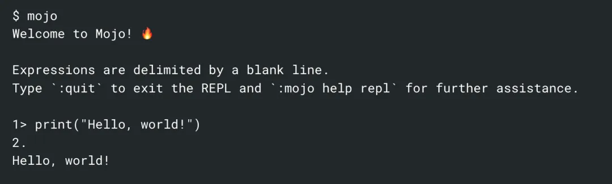

# Mojo开发环境搭建

## Mojo 安装

Linux 与 Mac 环境要求如下， Windows 版本会在未来版本中支持。

### Linux:

- Ubuntu 20.04/22.04 LTS
- x86-64 CPU (with SSE4.2 or newer) or AWS Graviton2/3 CPU
- Minimum 8 GiB RAM
- Python 3.8 - 3.11
- g++ or clang++ C++ compiler

### Mac:

- Apple silicon (M1 or M2 processor)
- macOS Monterey (12) or later
- Python 3.8 - 3.11
- Command-line tools for Xcode, or Xcode

安装命令：

```bash
curl -s https://get.modular.com | sh -
```

使用以下命令登录 Modular ：

```bash
modular auth
```

安装 Mojo SDK:

```bash
modular install mojo
```

安装成功后，使用以下命令设置环境变量：

```bash
MOJO_PATH=$(modular config mojo.path) \  && BASHRC=$( [ -f "$HOME/.bash_profile" ] && echo "$HOME/.bash_profile" || echo "$HOME/.bashrc" ) \  && echo 'export MODULAR_HOME="'$HOME'/.modular"' >> "$BASHRC" \  && echo 'export PATH="'$MOJO_PATH'/bin:$PATH"' >> "$BASHRC" \  && source "$BASHRC"
```

接下来就可以使用 mojo 命令进入交互式命令行窗口进行测试了：

