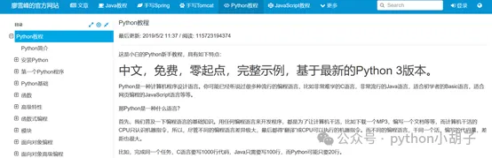
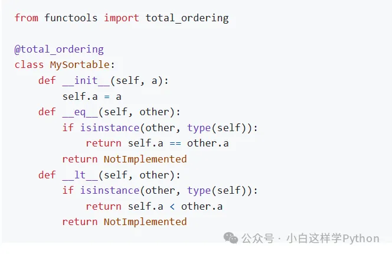

# Python学习资源

## 一、教练，我想学 Python

> 车上有座，坐满就发车。

### 1.1 有编程基础：explore-python

- 项目地址：https://github.com/ethan-funny/explore-python
- 在线阅读：https://funhacks.gitbooks.io/explore-python/content/

《Python 之旅》这本开源书虽然是入门级但并不是“保姆级”，如果你觉得手把手教你安装 Python 之类是浪费时间，那么我推荐 explore-python 这个项目。所以，如果之前学过其它编程语言，自己能解决安装环境等问题。那你可能就会和我一样喜欢它：

1. 大纲：直观的脑图展示，结构清晰完整，讲的都是重点和常用知识
2. 内容：代码多于文字，运行示例代码帮助领悟+简短文字点拨，可能代码写的久了，看代码感觉比文字舒服
3. 排版：舒服+讲究，写给程序员的 Python 书籍


### 1.2 没有编程基础：Python-100-Days 

- 项目地址：https://github.com/jackfrued/Python-100-Days

Python-100-Days 就是我上面说的“保姆级”教程，他的内容面面俱到包括了 Python 开发的方方面面，手把手地一步步的讲 Python 技术。面向没有编程基础想学 Python 的人群，但它不是只教会你 Python 基本语法就结束了。还有呐：Python 进阶知识、Linux 基础知识、数据库知识、Web 基础和框架、爬虫和数据分析、机器学习等。《真·一个项目学会 Python》😂

------

**🥚 说无妨：** Python 入门的教程都很简单，但是有毅力能坚持读完和有耐心动手敲完每一个例子人不简单。

## 二、大神，我想学好 Python

> 车速太快，请坐稳扶好。

### 2.1 先查收这份指南：python-guide

- 项目地址：https://github.com/realpython/python-guide
- 在线阅读：https://pythonguidecn.readthedocs.io/zh/latest/

首先感谢译者们的辛勤付出，降低了《Python 最佳实践指南》这份指南的阅读门槛。如果你想把 Python 玩好，但又不知道该从哪些方面着手提高，那这份指南一定可以帮你解决困惑。该指南介绍了以下几个方面：开发环境、常用工具、代码风格、项目结构、使用场景等，提高 Python 相关的综合素养：用的优雅，玩的溜。这个项目不管是作者、贡献者还是译者们，都是 Python 社区的“老司机”，老司机带你飞的机会来了！


### 2.2 再翻烂这本秘籍：python3-cookbook 

- 项目地址：https://github.com/yidao620c/python3-cookbook
- 在线阅读：https://python3-cookbook.readthedocs.io/zh_CN/latest/

如果说每一个 Python 问题或需求就是一次进攻的话，那《Python Cookbook》就是破解进攻招式的武功秘籍。当你对用 Python 处理一个问题没有思路或者感觉可能会有更好的方法和写法时，翻翻这本书吧。不信你就试试躺着随便翻一页看，看着看着你就能坐起来，并且嘴里念叨着：“xxx，还能这么写？我得去试试”。别笑，真事儿我干过好几次了。

------

**🥚 说无妨：** 不是买两本书、看几个开源项目简介就可以进阶，只有日积月累才可以从量变到质变，完成进阶。这个过程没有办法手把手地教，因为没人可以一直给你讲以后你会遇到的所有问题。所以，你只能抓住每一个可以提高机会和知识点，像救命稻草一样拼命的抓紧，把知识点掰开揉碎的融会贯通。

## 三、老师，我想和你一起玩 Python

> 这车真帅，我也想坐上去试试。

### 3.1 玩一个不过瘾：free-python-games

- 项目地址：https://github.com/grantjenks/free-python-games

真·入门级 Python 游戏集合库。都是些简单的小游戏，比如：贪吃蛇、迷宫、Pong、猜字等，运行简单（有些不需要安装依赖）、代码少且易读。用游戏开启的你 Python 项目之旅，玩完再学源码，其乐无穷啊。源码都在 `freegames` 目录下，每一个 `py` 文件就是一个游戏，比如 `guess.py` 就是猜字游戏的源码。安装运行的命令如下：

```
pip install freegames
python -m freegames.maze # freegames.游戏名
```


### 3.2 Windows 下的按键精灵工具：KeymouseGo 

- 项目地址：https://github.com/taojy123/KeymouseGo

Python 实现的精简绿色版按键精灵。记录用户的鼠标、键盘操作，自动执行之前记录的操作，可设定执行的次数。在进行某些简单、单调、重复的操作时，使用该软件可以十分省事儿。只需要录制一遍，剩下的交给 KeymouseGo 来做就可以了。


### 3.3 Linux 下优雅的 HTTP 请求工具：httpstat 

- 项目地址：https://github.com/reorx/httpstat

一个更加漂亮展示 HTTP 请求状态和耗时的 Python 命令行工具。它美化了 `curl` 的结果，使得结果更加可读和直观，还可以显示 HTTP 请求的每个过程的耗时。最主要它无依赖、兼容 Python3、就一个文件才 300 多行代码，非常适合新手阅读源码。效果如下图：


上面这些开源项目很有趣，而且运行简单，不会让你卡在运行代码这一步。最后分享下我运行 Python 开源项目的**三板斧**招式：

- 安装依赖：`pip install -r requirements.txt`
- 启动文件：通常为 `main`、`run`、`项目名的同名文件` 的 `py` 文件
- 运行出错：拿着异常信息去项目 issues 区搜，没有找到就去问搜索引擎

------

**🥚 说无妨：** 把项目运行起来不是终极目的，要阅读源码然后按照自己的想法修改代码最后增加或修改功能（提 PR），这才能算是玩好了。

# 1、最佳Python代码库

1. Python开发资源大全：Python框架、库、软件以及资源精选列表。

   （https://github.com/vinta/awesome-python）

   这个列表有中文版，我们以前专门推荐过：

   https://github.com/jobbole/awesome-python-cn

2. Python资源精选列表2：精心筛选的一组Python框架、库、软件以及资源列表。

   （https://github.com/trananhkma/fucking-awesome-python）

3. Python精选应用程序：将近400个开源Python应用程序，按主题陈列，且附有使用apatite根据结构化数据生成的代码库、文档等链接。

   （https://github.com/mahmoud/awesome-python-applications）

4. Pytorch：与Pytorch相关的库，Pytorch是有名的张量与动态神经网络机器学习框架。

   （https://github.com/bharathgs/Awesome-pytorch-list）

5. Python异步：精心挑选的Python异步框架、库、软件以及资源清单。

   （https://github.com/timofurrer/awesome-asyncio）

6. Jupyter：非常了不起的Jupyter项目、库以及资源的清单。你可以利用Jupyter创建和共享包含实时代码、方程式、可视化效果、文本等的Python文档。

   （https://github.com/markusschanta/awesome-jupyter）

7. Python书单: 有关Python的最佳书单！

   （https://github.com/Junnplus/awesome-python-books）

# 2、图书

1. Python指南：关于Python日常安装、配置和使用的最佳实践手册，包括pip、numpy、virtualenv等的介绍。

   （https://github.com/realpython/python-guide）

2. Python简明教程：面向初学者的Python教程，你只需要知道如何保存一个保存文本文件即可开始学习。

   （https://github.com/swaroopch/byte-of-python）

3. Cosmic Python：以python方式的应用程序架构模式来管理复杂性，O'Reilly的免费书籍！

   （https://github.com/cosmicpython/book）

4. Python机器学习：该库包含经典的机器学习教程的Notebook代码。

   （https://github.com/rasbt/python-machine-learning-book-3rd-edition）

# 3、面试问题

1. Python经典编程面试题：经典的Python编程面试问题集，请不要作弊！

   （https://github.com/StBogdan/CTCI_python）

2. Python交互式编程题：使用Anki学习卡片提供了120多个持续更新、交互式、测试驱动的编程面试题。

   （https://github.com/donnemartin/interactive-coding-challenges）

3. Python面试题集：Python面试中经常遇到的问题。

   （https://github.com/sigmavirus24/python-interview-questions）

4. Python面试题集2：额外的300多个Python面试题。

   （https://github.com/learning-zone/python-interview-questions）

# 4、数据结构与算法

1. Python数据结构与算法：Python 3的数据结构与算法，最简单、最整洁的实现，已获1.8万颗星！

   （https://github.com/keon/algorithms）

2. Udemy算法、数据结构与面试课程：该库中包含Udemy课程附带的notebook，可帮助你准备面试。

   （https://github.com/jmportilla/Python-for-Algorithms--Data-Structures--and-Interviews）

3.  Python算法：算法和数据结构的实现，快乐的学习！

   （https://github.com/prakhar1989/Algorithms）

# 5、Python资源

1. GitHub的Python趋势列表：GitHub提供的Python流行代码库。

   （https://github.com/trending/python）

2. PEP 8--Python样式指南检查器：该工具可以按照PEP 8样式约定检查你的Python代码。

   （https://github.com/treyhunner/pep8）

3. Google样式指南：Google推荐的Python样式指南。

   （https://github.com/google/styleguide）

4. Python增强建议：Python增强建议，PEP官方索引。

   （https://github.com/python/peps）

[【建议收藏】Python装饰器从入门到精通汇总版（附热频考点） (qq.com)](https://mp.weixin.qq.com/s/3aVF3cGdDzHWctiZJUVd6A)

## 一、python包索引pypi

**地址**：https://pypi.org/  

PyPI,作为Python社区官方维护的软件包仓库,是Python程序员共享和发布软件包的核心平台.在这里,您几乎可以找到所有Python所需的包和库.pip工具会从PyPI下载软件包并自动进行安装.PyPI不仅提供了包的版本管理功能,还简化了发布流程.


## 二、Python代码例子

**地址**：https://www.programcreek.com/python/ 

提供各种python包相关的例子,初学者可以在这里找到编码案例.


## 三、Python教程

**网址**：https://docs.python.org/zh-cn/3/tutorial/index.html 

官方提供的教程,比较全面,适合初学者去学习.


## **四、Github**

GitHub是一个面向开源及私有软件项目的托管平台,聚集了上亿的程序员,有非常多非常多的python相关开源代码库,可以随意下载的开源代码库.

网址：https://github.com/   


## **五、动画算法**

这个网站极富创意,通过生动的动画演示,将排序、链表、二叉树、图遍历、递归、循环等多种算法的实现过程展现得淋漓尽致.对于初学者来说,它是理解算法逻辑的理想之地.

**网址**：https://visualgo.net/zh  


## **六、Pythontutor**

下边是一段 Python 代码,右边则是对应的运行逻辑,变量值等信息,我们点击下方的Prev和Next按钮,就会产生联动的效果.理解代码运行的逻辑非常有帮助,同时可以调试自己写的代码.

**官网**：https://pythontutor.com/ 


## **七、廖雪峰 Python3 教程**

**网址**：https://www.liaoxuefeng.com/wiki/1016959663602400   

廖雪峰 Python3 教程是一份比较全面的Python 教程,由著名的程序员和技术博主廖雪峰编写.该教程详细介绍了Python3 的基础语法、函数、模块等内容,并包含了大量实例和练习,适合初学者和进阶者.



## **八、菜鸟教程 Python3 教程**

网址：https://www.runoob.com/python3/python3-tutorial.html   

菜鸟教程是国内备受推崇的IT技术教程网站,其Python3教程内容详尽,涵盖了Python3的基础语法、函数、模块等关键知识点,并通过丰富的实例和练习题帮助初学者更好地掌握和运用.


## **九、Python官方文档**

网址：https://docs.python.org/zh-cn/3/   

Python官方文档是学习Python不可或缺的权威资源,它详尽地阐述了Python3的完整语言规范、标准库以及丰富的第三方库.这份文档提供了详尽的参考信息和丰富的示例,对于初学者和进阶学习者来说都极具价值.


## **十、实验楼 Python教程**

网址：https://www.lanqiao.cn/courses/?tag=Python  

实验楼是国内领先的在线实验教育平台,其Python教程以实验和项目为核心,全面覆盖了Python的基础语法、数据结构与算法、Web开发、数据分析等多个领域.此外,该平台还提供了便捷的在线实验环境和真实项目实践机会,使学习者能够更加深入地理解和掌握Python的应用技巧.


## **十一、Codecademy Python 课程**

网址：https://www.codecademy.com/learn/learn-python-3  

Codecademy 是一个在线编程学习平台,其 Python 课程通过互动实践的方式帮助学习者掌握 Python3 的基础语法、函数、循环等内容.该平台还提供了实时反馈和社区支持,帮助学习者更好地掌握 Python.


## **十二、PyCharm Edu**

网址：https://www.jetbrains.com/zh-cn/pages/academy/learn-python/ 

PyCharm Edu,由JetBrains精心打造的Python学习工具,通过实践、自测和即时反馈等互动方式,助力学习者更高效地掌握Python编程技能.


## **十三、PythonChallenge**

网址：http://www.pythonchallenge.com/ 

PythonChallenge是一个通过解决谜题来学习Python 的网站,其中包含了33个谜题,每个谜题都需要使用 Python 来解决.通过解决这些谜题,可以让学习者更深入地了解 Python 的特性和应用.


## **十四、偷着学python漫画版**

网址：https://www.bilibili.com/video/BV1HK411577E 

这个是B站大佬看漫画学Python,有趣、有料、超级搞笑的Python教程！这么好的课程当然要偷着学了


## **十五、Python123**

网址：https://python123.io 

Python123.io 也是一家不错的中文 Python 学习网站,它提供了 Python 的基础知识教程、Web 开发教程、数据分析教程等,同时还提供了 Python 代码实战、Python 入门视频课程等资源.该网站的课程内容比较全面,适合初学者和进阶者学习,而且其网站界面简洁明了,易于操作,是一个很好的学习资源.


## **十六、dida100 Python学习笔记**

网址：http://www.dida100.com/its 

dida100 是一个在线学习平台,提供了丰富的 Python 学习资源,包括基础语法、数据类型、函数、模块、Web 开发、数据分析等多个方面的内容.此外,该平台还提供了 Python 入门、Python 数据分析、Python Web 开发等多个课程,以及练习题和实践项目等,适合初学者和进阶者.


上述Python学习网站各具特色,各有优势,能够满足不同学习者的个性化需求.无论你是初学者还是有一定基础的进阶学习者,都可以从这些网站中挑选出适合自己的学习资源,系统地掌握Python的基础知识,并不断提升编程技能.选择这些网站进行学习,定能让你的Python学习之路更加顺畅高效.

## Python 示例

GitHub：[geekcomputers/Python：我的 Python 示例 (github.com)](https://github.com/geekcomputers/Python)

官网：[www.thegeekblog.co.uk](http://www.thegeekblog.co.uk/)

## system-design-primer：快速掌握系统设计技能

**项目地址**：https://github.com/donnemartin/system-design-primer

### 什么是system-design-primer？

system-design-primer是一个帮助人们学习如何设计大规模系统的开源项目。它涵盖了许多常见的系统设计主题，旨在帮助读者准备系统设计面试或者提高自己的系统设计能力。此外，它还提供了Anki记忆卡，帮助读者更好地记忆和理解系统设计的内容。


### 系统设计面试的重要性

在计算机科学领域，系统设计面试是申请软件工程师或技术架构师工作时常见的面试环节。面试官会要求候选人设计一个大规模系统，如分布式存储系统、消息队列系统等，以考察候选人的系统设计能力。因此，准备系统设计面试是非常重要的，而system-design-primer能够帮助我们更好地准备系统设计面试。

### system-design-primer的技术内容

该开源项目包含了大量的系统设计主题，包括但不限于：

1. 分布式系统架构

2. 数据存储和缓存

3. 数据库设计

4. 消息队列系统

5. 负载均衡

6. 监控和日志记录

7. CDN和负载加速

8. 基础设施即代码

9. 安全性

   

### System Design Primer 的特点

- 全面的学习材料：System Design Primer 包含了丰富的学习材料，包括文章、视频、测验和 Anki 卡片等，可以满足不同学习者的需求。
- 深入的讲解：System Design Primer 对系统设计的各个方面进行了深入的讲解，包括系统架构、可扩展性、可靠性和安全性等。
- 实践练习：System Design Primer 提供了大量的实践练习，包括模拟面试题和实际案例分析等，可以帮助您巩固所学知识。
- 社区支持：System Design Primer 拥有一个活跃的社区，您可以在这里与其他学习者交流学习经验和心得。

### System Design Primer 的学习内容

- 系统架构：了解不同类型的系统架构，以及如何选择合适的系统架构来满足您的需求。

- 可扩展性：学习如何设计可扩展的系统，以便随着需求的增长而轻松地扩展系统。

- 可靠性：学习如何设计可靠的系统，以便系统能够在各种故障情况下继续运行。

- 安全性：学习如何设计安全的系统，以便保护系统免受攻击。

- 性能优化：学习如何优化系统的性能，以便系统能够满足性能要求。

  

### 如何使用 System Design Primer

要使用 System Design Primer，您可以按照以下步骤进行：

1. **阅读文章和视频**：System Design Primer 提供了丰富的文章和视频，您可以先阅读文章和视频来了解系统设计的各个方面。
2. **完成测验和练习**：System Design Primer 提供了大量的测验和练习，您可以完成这些测验和练习来巩固所学知识。
3. **使用 Anki 卡片**：System Design Primer 提供了 Anki 卡片，您可以使用 Anki 卡片来记忆系统设计的关键概念和术语。Anki是一款开源的记忆软件，通过智能的算法和重复复习的方式，帮助用户更好地记忆各种知识点。通过使用Anki记忆卡，读者可以更高效地巩固所学的系统设计知识，为系统设计面试做好充分的准备。
4. **加入社区**：System Design Primer 拥有一个活跃的社区，您可以在这里与其他学习者交流学习经验和心得。

### 结语

system-design-primer是一个非常有价值的学习资源，它不仅可以帮助我们准备系统设计面试，提升我们的系统设计能力，还可以通过Anki记忆卡帮助我们更好地记忆和理解所学的内容。

在计算机科学领域，系统设计是非常重要的一个领域，通过学习和掌握系统设计的知识，我们可以更好地应对各种大规模系统设计的挑战，提高我们在技术领域的竞争力。希望大家能够充分利用system-design-primer这个宝贵的学习资源，不断提升自己的系统设计能力，实现个人职业发展的更大突破。

# 6、学习Python

1. Python Koans：一个交互式的教程，可通过测试来学习Python，测试驱动开发的入门教程。

   （https://github.com/gregmalcolm/python_koans）

2. 基于项目的学习：面向项目的编程教程列表，包括构建网络抓取工具、应用程序机器人等。

   （https://github.com/tuvtran/project-based-learning#python）

3. 通过JupyterNotebook学习Python 3：通过一系列交互式Jupyter Notebook教你学习Python 3。

   （https://github.com/jerry-git/learn-python3）

## pysheeet: Python 速查表

**项目地址**：https://github.com/crazyguitar/pysheeet

### 1. 简介

**pysheeet: Python Cheat Sheet** 是一份旨在帮助Python开发者快速查找和学习Python语法、库和工具的高效工具。这篇文章将详细介绍pysheeet，包括安装使用方法、应用场景以及其优缺点。

### 2. 安装和使用方法

为了使用pysheeet，你需要按照以下步骤来安装和配置它：

**步骤 1：安装pysheeet**你可以通过在终端或命令提示符中运行以下命令来安装pysheeet：

```bash
pip install pysheeet
```

**步骤 2：查看Python Cheat Sheet**安装完成后，你可以通过运行以下命令来查看Python Cheat Sheet：

```bash
pysheeet
```

这将在终端或命令提示符中显示一个交互式菜单，其中包含了各种Python语法、库和工具的快速参考。

### 3. 应用场景

pysheeet在以下几个方面提供了帮助：

**3.1 学习Python**对于初学者来说，学习Python的语法、关键字和常用函数可能是一个挑战。pysheeet提供了一个快速查找和学习这些内容的方式。通过浏览Python Cheat Sheet，你可以快速了解各种语法结构和函数的用法，从而加快学习进度。

**3.2 开发和调试**在日常Python开发中，你可能会遇到各种库和工具，需要查找其用法和示例代码。pysheeet提供了一个方便的工具，让你能够快速查找所需的信息。无论是处理字符串、操作文件、进行网络编程还是进行数据分析，Python Cheat Sheet都能为你提供相关的函数和用法示例。

**3.3 提高效率**即使是有经验的Python开发者，也会在某些情况下遇到需要查阅文档的情况。pysheeet可以帮助你快速找到你需要的信息，而不必打开浏览器或翻阅大量的文档。这能够节省你的时间和精力，提高你的工作效率。

### 4. 优缺点

pysheeet作为一个Python Cheat Sheet工具，具有以下优点和缺点：

#### 4.1 优点

- 方便快捷：pysheeet提供了一个简单易用的交互式菜单，让你能够快速查找和学习Python相关内容，节省了查阅文档的时间。
- 全面性：Python Cheat Sheet包含了大量的Python语法、库和工具的快速参考，涵盖了各个方面的内容，适用于不同的开发场景。
- 开源和活跃的社区支持：pysheeet是开源项目，拥有一个活跃的社区，可以及时更新和修复bug，同时也能够接收社区贡献的内容。

#### 4.2 缺点

- 依赖于网络：尽管pysheeet本身是一个离线工具，但它需要从网络上获取最新的Python Cheat Sheet内容。如果你没有网络连接，你将无法获得最新的更新。

总的来说，pysheeet是一个方便快捷的Python Cheat Sheet工具，适用于学习Python、开发和调试、提高工作效率等场景。它的全面性和活跃的社区支持使其成为Python开发者的有力助手，同时也有一些依赖于网络的限制。无论你是初学者还是有经验的开发者，pysheeet能够帮助你更快地查找和学习Python相关内容，提高你的工作效率。

## python-cheatsheet Python速查表2

项目地址：https://github.com/gto76/python-cheatsheet

### 一、Python速查表是什么？

Python速查表是一种简明扼要的开源学习参考资料，其中包括了Python编程语言中常用的语法、数据结构、模块库、工具等的使用方法和示例。通过Python速查表，开发者可以迅速找到所需的信息，提高编程效率，并且在开发过程中能够更加自信地应对各种挑战。


### 二、Collections（集合）

Python速查表的“Collections”部分包括了有关列表、字典、集合、元组、范围、枚举、迭代器和生成器等内容。这些是Python中常用的数据结构，通过速查表，我们可以快速了解它们的基本操作和用法。


### 三、Types（类型）

在“Types”部分，Python速查表涵盖了有关类型、字符串、正则表达式、格式化、数学运算、组合数学、日期时间等内容。这些是Python中基本的类型和常用的操作方法，对于数据处理和计算非常有用。


### 四、Syntax（语法）

“Syntax”部分包括了有关参数、内联函数、导入模块、装饰器、类、鸭子类型、枚举、异常处理等内容。这些是Python编程中的关键语法和功能，通过速查表可以快速查阅相关信息。



### 五、System（系统）

在这一部分，Python速查表提供了有关退出、打印、输入、命令行参数、文件操作、路径、操作系统命令等内容。这些是与系统交互相关的功能，对于文件处理和系统操作非常重要。


### 六、Data（数据）

“Data”部分包括了有关JSON、Pickle、CSV、SQLite、字节、结构化数据、数组、内存视图、双端队列等内容。这些是Python中常用的数据处理和存储方法，对于数据管理和分析非常有帮助。


### 七、Advanced（高级）

在这一部分，Python速查表包括了有关线程、操作符、匹配语句、日志、内省、协程等内容。这些是Python编程中的高级功能和技术，对于提高程序性能和复杂应用开发非常重要。


### 八、Libraries（库）

“Libraries”部分包括了有关进度条、绘图、表格、控制台界面、图形用户界面、网络爬虫、网络编程、性能分析等内容。这些是Python常用的库和工具，对于实现各种应用和功能非常有用。


### 九、Multimedia（多媒体）

最后，Python速查表还包括了有关NumPy、图像处理、动画、音频、合成器、Pygame、Pandas、Plotly等多媒体处理和数据分析内容。这些是Python在多媒体处理和数据科学领域应用广泛的库和工具。


综合Python速查表是一个强大的学习和工具参考资料，可以帮助Python开发者更加高效地进行编程和应用开发。通过学习和使用Python速查表，开发者可以更深入地了解Python语法、库和工具，从而提高编程水平和应用开发能力。

## Pytudes：磨练 Python 编程技能的利器

**GitHub项目地址**：https://github.com/norvig/pytudes

### 1.简介

Pytudes 是一个包含 Python 程序的项目，这些程序通常很短，旨在帮助你磨练特定的编程技能。Pytudes 涵盖了各种主题，包括数据结构、算法、函数式编程、面向对象编程等等。

### 2.特点

- **循序渐进：** Pytudes 从简单的问题开始，逐渐过渡到更复杂的问题，让你循序渐进地学习和提高。
- **挑战性：** Pytudes 中的程序都经过精心设计，具有挑战性，但又不至于让你感到沮丧。
- **多样性：** Pytudes 涵盖了各种不同的编程主题，让你有机会接触到不同的编程范式和技术。
- **趣味性：** Pytudes 中的程序都非常有趣，让你在学习的同时也能享受乐趣。

### 3.使用方法

- **选择一个 Pytude：** 从 Pytudes 列表中选择一个你想学习的 Pytude。
- **阅读 Pytude 描述：** 每个 Pytude 都附有详细的描述，解释了 Pytude 的目标和要求。
- **编写代码：** 使用你学过的 Python 知识来编写 Pytude 的代码。
- **测试代码：** 运行你的代码，并与 Pytude 提供的测试用例进行比较，以确保你的代码是正确的。
- **分析代码：** 分析你的代码，看看你能否找到更好的解决方案或更优化的算法。

### 4. Pytudes 示例

以下是几个 Pytudes 的示例：

- **斐波那契数列：** 计算斐波那契数列的前 N 个数字。
- **汉诺塔：** 使用递归来解汉诺塔问题。
- **快速排序：** 实现快速排序算法。
- **链表反转：** 将一个链表反转。
- **深度优先搜索：** 实现深度优先搜索算法。

### 5. Pytudes 的好处

学习 Pytudes 有很多好处，包括：

- **提高编程技能：** Pytudes 可以帮助你提高编程技能，包括算法、数据结构、函数式编程、面向对象编程等。
- **解决问题的能力：** Pytudes 可以帮助你提高解决问题的能力，让你能够更好地分析问题并找到解决方案。
- **批判性思维能力：** Pytudes 可以帮助你提高批判性思维能力，让你能够更好地评估不同的解决方案并选择最优的解决方案。
- **创造力：** Pytudes 可以帮助你激发创造力，让你能够找到新颖的解决方案和方法。

### 总结：

Pytudes 是一个非常棒的资源，可以帮助你磨练 Python 编程技能。Pytudes 涵盖了各种不同的编程主题，循序渐进、趣味性强，非常适合初学者和有经验的程序员。如果你想提高你的 Python 编程技能，我强烈推荐你尝试一下 Pytudes。

# 十大机器学习算法

## 1. 线性回归（Linear Regression）

基本工作原理： 通过线性模型建立自变量和因变量之间的关系.

```
示例展示：
from sklearn.linear_model import LinearRegression
model = LinearRegression()
model.fit(X_train, y_train)
predictions = model.predict(X_test)
```

## 2. 逻辑回归（Logistic Regression）

基本工作原理： 用于二分类问题,根据输入特征预测概率.

```
示例展示：
from sklearn.linear_model import LogisticRegression
model = LogisticRegression()
model.fit(X_train, y_train)
predictions = model.predict(X_test)
```

## 3. 决策树（Decision Trees）

基本工作原理： 通过树状结构进行分类或回归.

```
示例展示：
from sklearn.tree import DecisionTreeClassifier
model = DecisionTreeClassifier()
model.fit(X_train, y_train)
predictions = model.predict(X_test)
```

## 4. 支持向量机（Support Vector Machine）

基本工作原理： 寻找最佳超平面来分离不同类别的数据点.

```
示例展示：
from sklearn.svm import SVC
model = SVC()
model.fit(X_train, y_train)
predictions = model.predict(X_test)
```

## 5. 随机森林（Random Forest）

基本工作原理： 结合多个决策树来进行分类或回归.

```
示例展示：
from sklearn.ensemble import RandomForestClassifier
model = RandomForestClassifier()
model.fit(X_train, y_train)
predictions = model.predict(X_test)
```

## 6. K近邻（K-Nearest Neighbors）

基本工作原理： 基于最近邻样本的标签进行预测.

```
示例展示：
from sklearn.neighbors import KNeighborsClassifier
model = KNeighborsClassifier()
model.fit(X_train, y_train)
predictions = model.predict(X_test)
```

## 7. 朴素贝叶斯（Naive Bayes）

基本工作原理： 基于贝叶斯定理和特征之间条件独立性假设进行分类.

```
示例展示：
from sklearn.naive_bayes import GaussianNB
model = GaussianNB()
model.fit(X_train, y_train)
predictions = model.predict(X_test)
```

## 8. 主成分分析（Principal Component Analysis,PCA）

基本工作原理： 降维技术,寻找数据中的主要方差分布.

```
示例展示：
from sklearn.decomposition import PCA
pca = PCA(n_components=2)
X_pca = pca.fit_transform(X)
```

## 9. 支持向量回归（Support Vector Regression）

基本工作原理： 用于连续输出的支持向量机回归.

```
示例展示：
from sklearn.svm import SVR
model = SVR()
model.fit(X_train, y_train)
predictions = model.predict(X_test)
```

## 10. 神经网络（Neural Networks）

基本工作原理： 模拟人脑神经元之间的连接和传输过程.

```
示例展示：
import tensorflow as tf
model = tf.keras.Sequential([
    tf.keras.layers.Dense(64, activation='relu'),
    tf.keras.layers.Dense(64, activation='relu'),
    tf.keras.layers.Dense(1)
])
model.compile(optimizer='adam', loss='mean_squared_error')
model.fit(X_train, y_train, epochs=10)
predictions = model.predict(X_test)
```


以上是10大常见的机器学习算法,每种都有不同的应用场景和优势.通过这些算法的应用和实践,可以更好地理解它们的工作原理和效果。