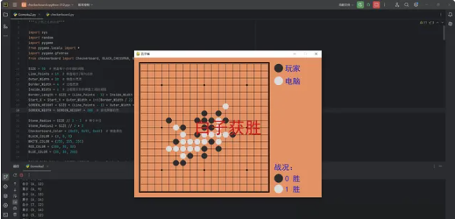

# Python 实战开发

[python例子：相片处理工具（可视化） (qq.com)](https://mp.weixin.qq.com/s/2pulIqCalHRPaADzYnGvSA)

# 实例 1：Hello World

```python
# 打印 Hello World
print("Hello World")
```

# 实例 2：计算两数之和

```python
# 输入两个数字
num1 = input("输入第一个数字：")
num2 = input("输入第二个数字：")

# 求和
sum = float(num1) + float(num2)

# 显示计算结果
print(f"{num1} + {num2} = {sum}")
```

# 实例 3：判断奇偶数

```python
# 输入一个数字
num = int(input("输入一个数字："))

# 判断奇偶
if num % 2 == 0:
    print(f"{num} 是偶数")
else:
    print(f"{num} 是奇数")
```

# 实例 4：使用循环打印乘法表

```python
# 打印9x9乘法表
for i in range(1, 10):
    for j in range(1, i+1):
        print(f"{j}x{i}={i*j}", end="\t")
    print()
```

# 实例 5：列表推导式生成平方数列表

```python
# 生成前10个整数的平方数列表
squares = [i2 for i in range(1, 11)]
print(squares)
```

# 实例 6：函数计算阶乘

```python
# 定义一个计算阶乘的函数
def factorial(n):
    if n == 1:
        return 1
    else:
        return n * factorial(n-1)

# 使用函数
num = 5
print(f"{num} 的阶乘是 {factorial(num)}")
```

# 实例 7：字典推导式

```python
# 使用字典推导式创建一个字典，其中键为1到5，值为键的平方
squares_dict = {i: i2 for i in range(1, 6)}
print(squares_dict)
```

# 实例 8：文件操作读写

```python
# 写入文件
with open('test.txt', 'w') as f:
    f.write("Hello Python!\n")

# 读取文件
with open('test.txt', 'r') as f:
    content = f.read()
    print(content)
```

# 实例 9：异常处理

```python
# 尝试执行除法计算，捕获异常
try:
    result = 10 / 0
except ZeroDivisionError:
    print("除数不能为0")
```

# 实例 10：类和对象

```python
# 定义一个简单的类
class Dog:
    def __init__(self, name):
        self.name = name

    def speak(self):
        return f"{self.name} says Woof!"

# 创建一个对象
my_dog = Dog('Spot')
print(my_dog.speak())
```

# 实例 11：生成斐波那契数列

```python
# 生成斐波那契数列的前N个数字
def fibonacci(n):
    a, b = 0, 1
    result = []
    while len(result) < n:
        result.append(b)
        a, b = b, a+b
    return result

# 调用函数
print(fibonacci(10))
```

# 实例 12：列表去重

```python
# 使用集合去除列表中的重复元素
def remove_duplicates(lst):
    return list(set(lst))

# 示例列表
my_list = [1, 2, 2, 3, 4, 4, 5]
print(remove_duplicates(my_list))
```

# 实例 13：检查回文字符串

```python
# 检查字符串是否为回文
def is_palindrome(s):
    return s == s[::-1]

# 测试字符串
test_str = "madam"
print(is_palindrome(test_str))
```

# 实例 14：字典按值排序

```python
# 使用lambda函数对字典按值进行排序
my_dict = {'apple': 5, 'banana': 1, 'orange': 3}
sorted_dict = dict(sorted(my_dict.items(), key=lambda item: item[1]))

print(sorted_dict)
```

# 实例 15：找出列表中的最大数和最小数

```python
# 找出列表中的最大和最小值
def find_max_min(lst):
    return max(lst), min(lst)

# 示例列表
my_list = [40, 1, 5, 200]
print(find_max_min(my_list))
```

# 实例 16：字符串首字母大写

```python
# 将字符串的每个单词的首字母大写
def capitalize_string(s):
    return ' '.join(word.capitalize() for word in s.split())

test_str = "hello python world"
print(capitalize_string(test_str))
```

# 实例 17：合并两个字典

```python
# 合并两个字典
def merge_dicts(dict1, dict2):
    return {dict1, dict2}

dict1 = {'a': 1, 'b': 2}
dict2 = {'c': 3, 'd': 4}
print(merge_dicts(dict1, dict2))
```

# 实例 18：计算列表中元素出现的频率

```python
# 计算列表中各元素出现的次数
from collections import Counter

my_list = ['apple', 'banana', 'apple', 'orange', 'banana', 'apple']
count = Counter(my_list)

print(count)
```

# 实例 19：简单的网页爬虫

```python
# 使用requests和BeautifulSoup库进行简单的网页爬虫
import requests
from bs4 import BeautifulSoup

URL = "http://example.com"
page = requests.get(URL)

soup = BeautifulSoup(page.content, "html.parser")
title = soup.find("title").text

print(title)
```

# 实例 20：创建简单的 HTTP 服务器

```python
# 使用http.server库创建简单的HTTP服务器
from http.server import HTTPServer, BaseHTTPRequestHandler

class SimpleHTTPRequestHandler(BaseHTTPRequestHandler):

    def do_GET(self):
        self.send_response(200)
        self.end_headers()
        self.wfile.write(b'Hello, Python!')

httpd = HTTPServer(('localhost', 8000), SimpleHTTPRequestHandler)
httpd.serve_forever()
```

# 实例 21：环境变量获取

```python
# 获取环境变量
import os

# 获取特定的环境变量值
print(os.getenv('PATH'))
```

# 实例 22：生成随机密码

```python
# 使用random和string库生成随机密码
import random
import string

def generate_password(length):
    characters = string.ascii_letters + string.digits + string.punctuation
    return ''.join(random.choice(characters) for i in range(length))

print(generate_password(12))
```

# 实例 23：计算执行时间

```python
# 使用time模块计算函数执行时间
import time

def long_running_task():
    time.sleep(2)

start_time = time.time()
long_running_task()
end_time = time.time()

print(f"Execution time: {end_time - start_time} seconds")
```

# 实例 24：简单的 TCP 客户端

```python
# 使用socket库创建一个简单的TCP客户端
import socket

HOST = '127.0.0.1'  # The server's hostname or IP address
PORT = 65432        # The port used by the server

with socket.socket(socket.AF_INET, socket.SOCK_STREAM) as s:
    s.connect((HOST, PORT))
    s.sendall(b'Hello, server')
    data = s.recv(1024)

print(f"Received {data.decode()}")
```

# 实例 25：邮件发送

```python
# 使用smtplib发送邮件
import smtplib
from email.mime.text import MIMEText
from email.header import Header

sender = 'your_email@example.com'
receivers = ['receiver_email@example.com']

msg = MIMEText('Python email test', 'plain', 'utf-8')
msg['From'] = Header("Python Script", 'utf-8')
msg['To'] = Header("Test User", 'utf-8')
msg['Subject'] = Header('SMTP Email Test', 'utf-8')

try:
    smtpObj = smtplib.SMTP('localhost')
    smtpObj.sendmail(sender, receivers, msg.as_string())
    print("Successfully sent email")
except smtplib.SMTPException:
    print("Error: unable to send email")
```

# 实例 26：读取 CSV 文件

```python
# 使用csv库读取CSV文件
import csv

filename = 'data.csv'
with open(filename, mode='r') as file:
    csvReader = csv.reader(file)
    for row in csvReader:
        print(row)
```

# 实例 27：写入 JSON 文件

```python
# 使用json库写入JSON文件
import json

data = {
    "name": "John",
    "age": 30,
    "city": "New York"
}

with open('data.json', 'w') as f:
    json.dump(data, f)
```

# 实例 28：解析命令行参数

```python
# 使用argparse解析命令行参数
import argparse

parser = argparse.ArgumentParser(description='Process some integers.')
parser.add_argument('integers', metavar='N', type=int, nargs='+',
                    help='an integer for the accumulator')
parser.add_argument('--sum', dest='accumulate', action='store_const',
                    const=sum, default=max,
                    help='sum the integers (default: find the max)')

args = parser.parse_args()
print(args.accumulate(args.integers))
```

# 实例 29：创建二维码

```python
# 使用qrcode库创建二维码
import qrcode

data = "https://www.example.com"
img = qrcode.make(data)

img.save("website_qr.png")
```

# 实例 30：操作 Excel 文件

```python
# 使用openpyxl库操作Excel文件
from openpyxl import Workbook

wb = Workbook()
ws = wb.active

# 添加一行数据
ws.append(["Name", "Age", "Gender"])
ws.append(["John", 30, "Male"])

# 保存到文件
wb.save("sample.xlsx")
```

# 实例 31：正则表达式匹配

```python
# 使用re模块进行正则表达式匹配
import re

text = "The rain in Spain"
pattern = 'Spain'

match = re.search(pattern, text)
if match:
    print("Match found")
else:
    print("No match")
```

# 实例 32：创建简单的图形用户界面(GUI)

```python
# 使用tkinter创建简单的GUI
import tkinter as tk

def on_click():
    label.config(text="Hello, Tkinter!")

root = tk.Tk()
root.title("Simple GUI")

btn = tk.Button(root, text="Click Me", command=on_click)
btn.pack()

label = tk.Label(root, text="Welcome")
label.pack()

root.mainloop()
```

# 实例 33：日期和时间操作

```python
# 使用datetime模块进行日期和时间操作
from datetime import datetime, timedelta

now = datetime.now()
print("Current date and time:", now)

new_date = now + timedelta(days=10)
print("Date after 10 days:", new_date)
```

# 实例 34：生成和解析 XML

```python
# 使用ElementTree生成和解析XML
import xml.etree.ElementTree as ET

# 创建XML数据
data = '''<person>
    <name>John</name>
    <age>30</age>
    <city>New York</city>
</person>'''

# 解析XML
root = ET.fromstring(data)
print("Name:", root.find('name').text)
print("Age:", root.find('age').text)
print("City:", root.find('city').text)
```

# 实例 35：线程使用

```python
# 使用_thread启动新线程
import _thread
import time

def print_time(thread_name, delay):
    count = 0
    while count < 5:
        time.sleep(delay)
        count += 1
        print(f"{thread_name}: {time.ctime(time.time())}")

try:
    _thread.start_new_thread(print_time, ("Thread-1", 2))
    _thread.start_new_thread(print_time, ("Thread-2", 4))
except:
    print("Error: unable to start thread")

while 1:
    pass
```

# 实例 36：复制文件

```python
# 使用shutil模块复制文件
import shutil

source_file = 'source.txt'
target_file = 'destination.txt'

shutil.copy(source_file, target_file)
```

# 实例 37：获取网页内容

```python
# 使用requests获取网页内容
import requests

url = 'http://example.com'
response = requests.get(url)

print(response.text)
```

# 实例 38：解析命令行参数（更高级）

```python
# 使用argparse模块进行更高级的命令行参数解析
import argparse

parser = argparse.ArgumentParser(description="An advanced example.")
parser.add_argument("--quiet", action="store_true",
                    help="decrease output verbosity")
parser.add_argument("square", type=int,
                    help="display a square of a given number")

args = parser.parse_args()
answer = args.square2

if not args.quiet:
    print(f"The square of {args.square} is {answer}")
```

# 实例 39：网络套接字编程

```python
# 创建一个简单的服务器，使用sockets
import socket

s = socket.socket(socket.AF_INET, socket.SOCK_STREAM)
s.bind(('localhost', 1234))
s.listen(5)

while True:
    clientsocket, address = s.accept()
    print(f"Connection from {address} has been established.")
    clientsocket.send(bytes("Welcome to the server!", "utf-8"))
    clientsocket.close()
```

# 实例 40：使用 Pandas 处理数据

```python
# 使用Pandas库进行数据处理
import pandas as pd

# 创建DataFrame
data = {'Name': ['John', 'Anna', 'Peter', 'Linda'],
        'Age': [28, 34, 29, 32],
        'City': ['New York', 'Paris', 'Berlin', 'London']}

df = pd.DataFrame(data)

# 显示DataFrame
print(df)
```

## 1.「JSON数据转换为CSV文件」

```
import json

# 如果程序作为主程序运行
if __name__ == '__main__':
    try:
        # 读取JSON文件
        with open('input.json', 'r') as f:
            data = json.loads(f.read())
        # 将JSON数据转换为CSV格式
        output = ','.join(*data[0])
        for obj in data:
            output += f'\n{obj["Name"]},{obj["age"]},{obj["birthyear"]}'
        # 将转换后的数据写入CSV文件
        with open('output.csv', 'w') as f:
            f.write(output)
    except Exception as ex:
        print(f'Error: {str(ex)}')
```

## 2.「生成随机密码」

```
import random
import string

# 生成指定长度的随机密码
def generate_password(length=16):
    characters = string.ascii_letters + string.digits + string.punctuation
    password = ''.join(random.sample(characters, length))
    return password

# 主程序
if __name__ == '__main__':
    password = generate_password()
    print(password)
```

## 3.「搜索文件中含有特定文本的文件」

```
import os

def search_files(path, text):
    found = False
    # 遍历指定路径下的所有文件
    for root, dirs, files in os.walk(path):
        for file in files:
            abs_path = os.path.abspath(os.path.join(root, file))
            if found:
                break
            with open(abs_path, 'r') as f:
                if text in f.read():
                    print(f"Text '{text}' found in {abs_path}")
                    found = True
    if not found:
        print(f"Text '{text}' not found!")

# 主程序
if __name__ == '__main__':
    path = input("Enter path: ")
    text = input("Enter text to search: ")
    search_files(path, text)
```


## 4.「网页链接抓取」

```
import requests
from bs4 import BeautifulSoup

def fetch_links(url):
    # 发送HTTP请求
    data = requests.get(url)
    # 使用BeautifulSoup解析HTML
    soup = BeautifulSoup(data.text, "html.parser")
    links = [link.get("href") for link in soup.find_all("a", href=True)]
    return links

# 主程序
if __name__ == '__main__':
    url = input("Enter Link: ")
    links = fetch_links(url)
    print(links)
```


## 5.「给图片添加水印」

```
from PIL import Image

def add_watermark(input_image_path, watermark_image_path, output_image_path):
    base_image = Image.open(input_image_path)
    watermark = Image.open(watermark_image_path).convert("RGBA")
    # 计算水印位置和大小
    position = base_image.size
    newsize = (int(position[0] * 8 / 100), int(position[1] * 8 / 100))
    watermark = watermark.resize(newsize)
    new_position = (position[0] - newsize[0] - 20, position[1] - newsize[1] - 20)
    # 创建透明背景
    transparent = Image.new(mode='RGBA', size=position, color=(0, 0, 0, 0))
    # 合并图片
    transparent.paste(base_image, (0, 0))
    transparent.paste(watermark, new_position, watermark)
    # 保存输出图片
    transparent.save(output_image_path, optimize=True, quality=100)

# 主程序
if __name__ == '__main__':
    input_image = input("Enter input image path: ")
    watermark_image = input("Enter watermark image path: ")
    output_image = input("Enter output image path: ")
    add_watermark(input_image, watermark_image, output_image)
```


## 6.「批量下载网页图片」

```
import requests
from bs4 import BeautifulSoup
import os

def download_images(url, path):
    driver = webdriver.Chrome(executable_path=path)
    driver.get(url)
    res = driver.execute_script("return document.documentElement.outerHTML")
    imglinks = get_img_links(res)
    for index, img_link in enumerate(imglinks):
        img_link = img_link["src"]
        download_img(img_link, index)
    print("Download Complete!!")

def get_img_links(res):
    soup = BeautifulSoup(res, "lxml")
    imglinks = soup.find_all("img", src=True)
    return imglinks

def download_img(img_link, index):
    try:
        extensions = [".jpeg", ".jpg", ".png", ".gif"]
        extension = ".jpg"
        for exe in extensions:
            if img_link.find(exe) > 0:
                extension = exe
                break
        img_data = requests.get(img_link).content
        with open(f"{output}\\{index + 1}{extension}", "wb+") as f:
            f.write(img_data)
    except Exception:
        pass

# 主程序
if __name__ == '__main__':
    url = input("Enter URL: ")
    path = input("Enter Path: ")
    output = "output"
    download_images(url, path)
```

## 7.「文件按类型排序」

```
import os
import shutil

# 定义文件类型
extentions = {
    "images": [".jpg", ".png", ".jpeg", ".gif"],
    "videos": [".mp4", ".mkv"],
    # 其他类型...
}

# 根据扩展名对文件进行分类
def sorting(file):
    keys = list(extentions.keys())
    for key in keys:
        for ext in extentions[key]:
            if file.endswith(ext):
                return key

# 主程序
if __name__ == '__main__':
    os.chdir("E:\\downloads")
    files = os.listdir()
    for file in files:
        dist = sorting(file)
        if dist:
            try:
                shutil.move(file, f"../download-sorting/{dist}")
            except:
                print(f"{file} is already exist")
        else:
            try:
                shutil.move(file, f"../download-sorting/others")
            except:
                print(f"{file} is already exist")
```


## 8.自动登录并发送邮件」

```
import smtplib
from email.mime.text import MIMEText

# 定义自动登录并发送邮件的函数
def send_email(username, password, to_email, subject, body):
    # 设置发件人、收件人、主题和正文
    msg = MIMEText(body, 'plain', 'utf-8')
    msg['From'] = username
    msg['To'] = to_email
    msg['Subject'] = subject

    # 设置SMTP服务器并发送邮件
    try:
        server = smtplib.SMTP('smtp.gmail.com', 587)
        server.ehlo()
        server.starttls()
        server.login(username, password)
        server.sendmail(username, [to_email], msg.as_string())
        server.close()
        print("邮件发送成功！")
    except Exception as e:
        print(f"邮件发送失败：{e}")

# 主程序
if __name__ == '__main__':
    username = input("请输入发件人邮箱：")
    password = input("请输入邮箱密码：")
    to_email = input("请输入收件人邮箱：")
    subject = input("请输入邮件主题：")
    body = input("请输入邮件正文：")
    send_email(username, password, to_email, subject, body)
```


## 9.「批量重命名文件」

```
import os

# 定义批量重命名文件的函数
def batch_rename(path, prefix):
    files = os.listdir(path)
    for i, file in enumerate(files):
        old_name = os.path.join(path, file)
        new_name = os.path.join(path, f"{prefix}{i+1}{os.path.splitext(file)[1]}")
        os.rename(old_name, new_name)
        print(f"文件 {file} 已重命名为 {new_name}")

# 主程序
if __name__ == '__main__':
    path = input("请输入文件所在文件夹路径：")
    prefix = input("请输入新的文件名前缀：")
    batch_rename(path, prefix)
```


## 10.「监控文件夹变化」

```
import os
import time

# 定义监控文件夹变化的函数
def monitor_directory(path):
    while True:
        time.sleep(1)  # 每隔1秒检查一次
        for filename in os.listdir(path):
            file_path = os.path.join(path, filename)
            try:
                if os.path.getmtime(file_path) != os.path.getatime(file_path):
                    print(f"文件 {filename} 已被修改。")
            except FileNotFoundError:
                print(f"文件 {filename} 已被删除。")

# 主程序
if __name__ == '__main__':
    path = input("请输入要监控的文件夹路径：")
    monitor_directory(path)
```

# 用gui实现一个生成二维码、条形码的服务（开箱即用）

要使用Python GUI实现一个能够生成二维码和条形码的服务，你可以选择多种图形界面库，比如Tkinter（Python自带的标准GUI库）、PyQt5、PySide2等。这里我将提供一个使用Tkinter和qrcode以及PIL（Python Imaging Library，现在通常指的是它的分支Pillow）来实现的简单示例，仅展示生成二维码的功能。对于条形码生成，你可以使用类似的方法结合如pyzbar或python-barcode这样的库。

首先确保你安装了必要的库：

```
pip install qrcode Pillow
```

代码：

```python

import tkinter as tk
from tkinter import filedialog, messagebox
import qrcode
from barcode import EAN13
from barcode.writer import ImageWriter
from PIL import ImageTk, Image
class BarcodeGeneratorApp:
   def __init__(self, master):
       self.master = master
       master.title("二维码 & 条形码生成器")
       # 初始化图像变量
       self.qr_image = None
       self.bar_image = None
       # 二维码部分
       qr_frame = tk.Frame(master, padx=20, pady=20)
       qr_frame.pack(side=tk.LEFT)
       self.qr_label = tk.Label(qr_frame)
       self.qr_label.pack()
       self.qr_entry = tk.Entry(qr_frame)
       self.qr_entry.pack(pady=(0, 10))
       qr_gen_button = tk.Button(qr_frame, text="生成二维码", command=self.generate_qr_code)
       qr_gen_button.pack()
       qr_save_button = tk.Button(qr_frame, text="保存二维码", command=self.save_qr)
       qr_save_button.pack()
       # 条形码部分
       bar_frame = tk.Frame(master, padx=20, pady=20)
       bar_frame.pack(side=tk.RIGHT)
       self.bar_label = tk.Label(bar_frame)
       self.bar_label.pack()
       self.bar_entry = tk.Entry(bar_frame)
       self.bar_entry.pack(pady=(0, 10))
       bar_gen_button = tk.Button(bar_frame, text="生成条形码", command=self.generate_bar_code)
       bar_gen_button.pack()
       bar_save_button = tk.Button(bar_frame, text="保存条形码", command=self.save_bar)
       bar_save_button.pack()
   def generate_qr_code(self):
       data = self.qr_entry.get()
       if data:
           img = qrcode.make(data)
           img.save("qr_code.png")
           self.qr_image = Image.open("qr_code.png")
           self.qr_image.thumbnail((200, 200))
           qr_photo = ImageTk.PhotoImage(self.qr_image)
           self.qr_label.config(image=qr_photo)
           self.qr_label.image = qr_photo
       else:
           messagebox.showwarning("警告", "请输入内容以生成二维码！")
   def generate_bar_code(self):
       data = self.bar_entry.get()
       if data.isdigit() and (len(data) == 12 or len(data) == 13):
           ean = EAN13(data, writer=ImageWriter())
           filename = ean.save("bar_code.png")  # 确保保存为png文件
           self.bar_image = Image.open(filename)
           self.bar_image.thumbnail((200, 100))
           bar_photo = ImageTk.PhotoImage(self.bar_image)
           self.bar_label.config(image=bar_photo)
           self.bar_label.image = bar_photo
       else:
           messagebox.showwarning("警告", "请输入有效的12或13位数字以生成条形码！")
   def save_qr(self):
       if self.qr_image:
           file_path = filedialog.asksaveasfilename(defaultextension=".png")
           if file_path:
               self.qr_image.save(file_path)
               messagebox.showinfo("成功", "二维码已保存！")
   def save_bar(self):
       if self.bar_image:
           file_path = filedialog.asksaveasfilename(defaultextension=".png")
           if file_path:
               self.bar_image.save(file_path)
               messagebox.showinfo("成功", "条形码已保存！")
if __name__ == "__main__":
   root = tk.Tk()
   app = BarcodeGeneratorApp(root)
   root.mainloop()
```

这段代码创建了一个简单的GUI应用程序，用户可以在输入框中输入想要生成二维码、条形码的数据，点击“生成二维码、条形码”按钮后，程序会弹出保存对话框让用户选择保存位置，随后将生成的二维码、条形码图片保存到指定位置。


# Python五子棋源码



### 1.五子棋简介

五子棋，起源于中国，是一种传统的黑白双方对弈的纯策略型棋类游戏。其规则简单，易于上手，却又能体现出深奥的棋艺。五子棋的目标是在一个15×15的棋盘上率先形成连续的五个棋子的直线，无论是横线、竖线还是斜线。由于其棋局变化多端，富含策略性，长久以来一直受到各年龄段人士的喜爱。

### 2.Python在五子棋游戏开发中的应用

Python作为一种高级编程语言，因其语法简洁明了，易于学习，且拥有丰富的库支持，近年来在游戏开发领域也得到了广泛的应用。在五子棋游戏的开发中，Python的这些特性被充分利用。开发者可以快速构建游戏逻辑，实现人工智能算法，同时还可以通过图形用户界面库（如Tkinter）为游戏提供友好的交互界面。

## 二、Python五子棋游戏设计原理

### 1.五子棋规则概述

五子棋，又称为连珠、五目连珠等，是一种起源于中国古代的传统棋类游戏。游戏在18×18的棋盘上进行，两位玩家分别执黑子和白子，轮流在棋盘上放置自己的棋子。游戏的目标是率先在棋盘上形成连续的五个棋子，无论是横线、竖线还是斜线。五子棋规则简单，易于上手，但同时又蕴含着丰富的策略与变化。

### 2.游戏流程设计

在设计Python五子棋游戏时，我们需要考虑游戏的整体流程。游戏开始后，首先初始化棋盘，然后进入玩家与AI交替落子的过程。每当一方成功落子后，都需要判断棋局是否已经达到胜利条件。如果一方获胜，则游戏结束；否则，游戏继续进行，直到分出胜负。此外，为了提高游戏的可玩性，还可以加入一些辅助功能，如悔棋、计时等。

### 3.五子棋算法实现

在Python五子棋游戏中，算法的实现至关重要。这里主要涉及两个方面：一是AI算法，用于实现自动落子；二是胜负判断算法，用于判断棋局胜负。

（1）AI算法：为了使AI能够与人类玩家进行对弈，我们需要设计一种能够自动落子的算法。常见的AI算法有极大极小值搜索、α-β剪枝、蒙特卡洛树搜索等。这些算法可以评估当前棋局的状态，并为AI选择最佳落子位置。

（2）胜负判断算法：在五子棋游戏中，胜负判断是核心功能之一。我们需要遍历整个棋盘，检查是否存在连续的五个同色棋子。如果存在，则判断该方获胜；否则，游戏继续进行。为了提高效率，可以采用预处理棋盘、使用特定数据结构等方法来优化胜负判断算法。

通过以上设计原理，我们可以使用Python实现一个基本的五子棋游戏。在此基础上，还可以进一步优化算法、扩展游戏功能，使游戏更加丰富有趣。

## 三、五子棋源码解析

### 1.棋盘类设计

1.1 初始化棋盘：在五子棋游戏中，棋盘类的设计至关重要。初始化棋盘的过程中，首先需要定义一个二维数组来表示棋盘，通常使用15×15的数组来模拟。在初始化时，将数组中所有元素的值设为0，表示棋盘上没有落子。

1.2 画棋盘：为了提高用户体验，我们需要在控制台或者图形界面上绘制出棋盘。在Python中，可以使用turtle库或者pygame库来实现这一功能。通过循环遍历二维数组，绘制出棋盘上的线条和交点。

1.3 检查落子合法性：当玩家或电脑落子时，需要检查落子位置是否合法。合法的落子位置要求：不在棋盘边缘之外，且该位置上没有其他棋子。通过编写一个函数，传入落子坐标，判断是否符合条件。

### 2.玩家类设计

2.1 人类玩家：人类玩家通过输入设备（如键盘）进行操作。在代码中，需要定义一个人类玩家类，包含其名称、棋子颜色等属性。此外，还需要实现一个方法，用于获取玩家输入的落子位置。

2.2 电脑玩家：电脑玩家通常由人工智能算法控制。在这里，我们可以定义一个电脑玩家类，包含其名称、棋子颜色等属性。电脑玩家类中需要实现一个方法，用于根据当前棋盘状态自动选择落子位置。

源码：

```python
"""五子棋之人机对战"""

import sys
import random
import pygame
from pygame.locals import *
import pygame.gfxdraw
from checkerboard import Checkerboard, BLACK_CHESSMAN, WHITE_CHESSMAN, offset, Point

SIZE = 30  # 棋盘每个点时间的间隔
Line_Points = 19  # 棋盘每行/每列点数
Outer_Width = 20  # 棋盘外宽度
Border_Width = 4  # 边框宽度
Inside_Width = 4  # 边框跟实际的棋盘之间的间隔
Border_Length = SIZE * (Line_Points - 1) + Inside_Width * 2 + Border_Width  # 边框线的长度
Start_X = Start_Y = Outer_Width + int(Border_Width / 2) + Inside_Width  # 网格线起点（左上角）坐标
SCREEN_HEIGHT = SIZE * (Line_Points - 1) + Outer_Width * 2 + Border_Width + Inside_Width * 2  # 游戏屏幕的高
SCREEN_WIDTH = SCREEN_HEIGHT + 200  # 游戏屏幕的宽

Stone_Radius = SIZE // 2 - 3  # 棋子半径
Stone_Radius2 = SIZE // 2 + 3
Checkerboard_Color = (0xE3, 0x92, 0x65)  # 棋盘颜色
BLACK_COLOR = (0, 0, 0)
WHITE_COLOR = (255, 255, 255)
RED_COLOR = (200, 30, 30)
BLUE_COLOR = (30, 30, 200)

RIGHT_INFO_POS_X = SCREEN_HEIGHT + Stone_Radius2 * 2 + 10


def print_text(screen, font, x, y, text, fcolor=(255, 255, 255)):
    imgText = font.render(text, True, fcolor)
    screen.blit(imgText, (x, y))


def main():
    pygame.init()
    screen = pygame.display.set_mode((SCREEN_WIDTH, SCREEN_HEIGHT))
    pygame.display.set_caption('五子棋')

    font1 = pygame.font.SysFont('SimHei', 32)
    font2 = pygame.font.SysFont('SimHei', 72)
    fwidth, fheight = font2.size('黑方获胜')

    checkerboard = Checkerboard(Line_Points)
    cur_runner = BLACK_CHESSMAN
    winner = None
    computer = AI(Line_Points, WHITE_CHESSMAN)

    black_win_count = 0
    white_win_count = 0

    while True:
        for event in pygame.event.get():
            if event.type == QUIT:
                sys.exit()
            elif event.type == KEYDOWN:
                if event.key == K_RETURN:
                    if winner is not None:
                        winner = None
                        cur_runner = BLACK_CHESSMAN
                        checkerboard = Checkerboard(Line_Points)
                        computer = AI(Line_Points, WHITE_CHESSMAN)
            elif event.type == MOUSEBUTTONDOWN:
                if winner is None:
                    pressed_array = pygame.mouse.get_pressed()
                    if pressed_array[0]:
                        mouse_pos = pygame.mouse.get_pos()
                        click_point = _get_clickpoint(mouse_pos)
                        if click_point is not None:
                            if checkerboard.can_drop(click_point):
                                winner = checkerboard.drop(cur_runner, click_point)
                                if winner is None:
                                    cur_runner = _get_next(cur_runner)
                                    computer.get_opponent_drop(click_point)
                                    AI_point = computer.AI_drop()
                                    winner = checkerboard.drop(cur_runner, AI_point)
                                    if winner is not None:
                                        white_win_count += 1
                                    cur_runner = _get_next(cur_runner)
                                else:
                                    black_win_count += 1
                        else:
                            print('超出棋盘区域')

        # 画棋盘
        _draw_checkerboard(screen)

        # 画棋盘上已有的棋子
        for i, row in enumerate(checkerboard.checkerboard):
            for j, cell in enumerate(row):
                if cell == BLACK_CHESSMAN.Value:
                    _draw_chessman(screen, Point(j, i), BLACK_CHESSMAN.Color)
                elif cell == WHITE_CHESSMAN.Value:
                    _draw_chessman(screen, Point(j, i), WHITE_CHESSMAN.Color)

        _draw_left_info(screen, font1, cur_runner, black_win_count, white_win_count)

        if winner:
            print_text(screen, font2, (SCREEN_WIDTH - fwidth)//2, (SCREEN_HEIGHT - fheight)//2, winner.Name + '获胜', RED_COLOR)

        pygame.display.flip()


def _get_next(cur_runner):
    if cur_runner == BLACK_CHESSMAN:
        return WHITE_CHESSMAN
    else:
        return BLACK_CHESSMAN


# 画棋盘
def _draw_checkerboard(screen):
    # 填充棋盘背景色
    screen.fill(Checkerboard_Color)
    # 画棋盘网格线外的边框
    pygame.draw.rect(screen, BLACK_COLOR, (Outer_Width, Outer_Width, Border_Length, Border_Length), Border_Width)
    # 画网格线
    for i in range(Line_Points):
        pygame.draw.line(screen, BLACK_COLOR,
                         (Start_Y, Start_Y + SIZE * i),
                         (Start_Y + SIZE * (Line_Points - 1), Start_Y + SIZE * i),
                         1)
    for j in range(Line_Points):
        pygame.draw.line(screen, BLACK_COLOR,
                         (Start_X + SIZE * j, Start_X),
                         (Start_X + SIZE * j, Start_X + SIZE * (Line_Points - 1)),
                         1)
    # 画星位和天元
    for i in (3, 9, 15):
        for j in (3, 9, 15):
            if i == j == 9:
                radius = 5
            else:
                radius = 3
            # pygame.draw.circle(screen, BLACK, (Start_X + SIZE * i, Start_Y + SIZE * j), radius)
            pygame.gfxdraw.aacircle(screen, Start_X + SIZE * i, Start_Y + SIZE * j, radius, BLACK_COLOR)
            pygame.gfxdraw.filled_circle(screen, Start_X + SIZE * i, Start_Y + SIZE * j, radius, BLACK_COLOR)


# 画棋子
def _draw_chessman(screen, point, stone_color):
    # pygame.draw.circle(screen, stone_color, (Start_X + SIZE * point.X, Start_Y + SIZE * point.Y), Stone_Radius)
    pygame.gfxdraw.aacircle(screen, Start_X + SIZE * point.X, Start_Y + SIZE * point.Y, Stone_Radius, stone_color)
    pygame.gfxdraw.filled_circle(screen, Start_X + SIZE * point.X, Start_Y + SIZE * point.Y, Stone_Radius, stone_color)


# 画左侧信息显示
def _draw_left_info(screen, font, cur_runner, black_win_count, white_win_count):
    _draw_chessman_pos(screen, (SCREEN_HEIGHT + Stone_Radius2, Start_X + Stone_Radius2), BLACK_CHESSMAN.Color)
    _draw_chessman_pos(screen, (SCREEN_HEIGHT + Stone_Radius2, Start_X + Stone_Radius2 * 4), WHITE_CHESSMAN.Color)

    print_text(screen, font, RIGHT_INFO_POS_X, Start_X + 3, '玩家', BLUE_COLOR)
    print_text(screen, font, RIGHT_INFO_POS_X, Start_X + Stone_Radius2 * 3 + 3, '电脑', BLUE_COLOR)

    print_text(screen, font, SCREEN_HEIGHT, SCREEN_HEIGHT - Stone_Radius2 * 8, '战况：', BLUE_COLOR)
    _draw_chessman_pos(screen, (SCREEN_HEIGHT + Stone_Radius2, SCREEN_HEIGHT - int(Stone_Radius2 * 4.5)), BLACK_CHESSMAN.Color)
    _draw_chessman_pos(screen, (SCREEN_HEIGHT + Stone_Radius2, SCREEN_HEIGHT - Stone_Radius2 * 2), WHITE_CHESSMAN.Color)
    print_text(screen, font, RIGHT_INFO_POS_X, SCREEN_HEIGHT - int(Stone_Radius2 * 5.5) + 3, f'{black_win_count} 胜', BLUE_COLOR)
    print_text(screen, font, RIGHT_INFO_POS_X, SCREEN_HEIGHT - Stone_Radius2 * 3 + 3, f'{white_win_count} 胜', BLUE_COLOR)


def _draw_chessman_pos(screen, pos, stone_color):
    pygame.gfxdraw.aacircle(screen, pos[0], pos[1], Stone_Radius2, stone_color)
    pygame.gfxdraw.filled_circle(screen, pos[0], pos[1], Stone_Radius2, stone_color)


# 根据鼠标点击位置，返回游戏区坐标
def _get_clickpoint(click_pos):
    pos_x = click_pos[0] - Start_X
    pos_y = click_pos[1] - Start_Y
    if pos_x < -Inside_Width or pos_y < -Inside_Width:
        return None
    x = pos_x // SIZE
    y = pos_y // SIZE
    if pos_x % SIZE > Stone_Radius:
        x += 1
    if pos_y % SIZE > Stone_Radius:
        y += 1
    if x >= Line_Points or y >= Line_Points:
        return None

    return Point(x, y)


class AI:
    def __init__(self, line_points, chessman):
        self._line_points = line_points
        self._my = chessman
        self._opponent = BLACK_CHESSMAN if chessman == WHITE_CHESSMAN else WHITE_CHESSMAN
        self._checkerboard = [[0] * line_points for _ in range(line_points)]

    def get_opponent_drop(self, point):
        self._checkerboard[point.Y][point.X] = self._opponent.Value

    def AI_drop(self):
        point = None
        score = 0
        for i in range(self._line_points):
            for j in range(self._line_points):
                if self._checkerboard[j][i] == 0:
                    _score = self._get_point_score(Point(i, j))
                    if _score > score:
                        score = _score
                        point = Point(i, j)
                    elif _score == score and _score > 0:
                        r = random.randint(0, 100)
                        if r % 2 == 0:
                            point = Point(i, j)
        self._checkerboard[point.Y][point.X] = self._my.Value
        return point

    def _get_point_score(self, point):
        score = 0
        for os in offset:
            score += self._get_direction_score(point, os[0], os[1])
        return score

    def _get_direction_score(self, point, x_offset, y_offset):
        count = 0   # 落子处我方连续子数
        _count = 0  # 落子处对方连续子数
        space = None   # 我方连续子中有无空格
        _space = None  # 对方连续子中有无空格
        both = 0    # 我方连续子两端有无阻挡
        _both = 0   # 对方连续子两端有无阻挡

        # 如果是 1 表示是边上是我方子，2 表示敌方子
        flag = self._get_stone_color(point, x_offset, y_offset, True)
        if flag != 0:
            for step in range(1, 6):
                x = point.X + step * x_offset
                y = point.Y + step * y_offset
                if 0 <= x < self._line_points and 0 <= y < self._line_points:
                    if flag == 1:
                        if self._checkerboard[y][x] == self._my.Value:
                            count += 1
                            if space is False:
                                space = True
                        elif self._checkerboard[y][x] == self._opponent.Value:
                            _both += 1
                            break
                        else:
                            if space is None:
                                space = False
                            else:
                                break   # 遇到第二个空格退出
                    elif flag == 2:
                        if self._checkerboard[y][x] == self._my.Value:
                            _both += 1
                            break
                        elif self._checkerboard[y][x] == self._opponent.Value:
                            _count += 1
                            if _space is False:
                                _space = True
                        else:
                            if _space is None:
                                _space = False
                            else:
                                break
                else:
                    # 遇到边也就是阻挡
                    if flag == 1:
                        both += 1
                    elif flag == 2:
                        _both += 1

        if space is False:
            space = None
        if _space is False:
            _space = None

        _flag = self._get_stone_color(point, -x_offset, -y_offset, True)
        if _flag != 0:
            for step in range(1, 6):
                x = point.X - step * x_offset
                y = point.Y - step * y_offset
                if 0 <= x < self._line_points and 0 <= y < self._line_points:
                    if _flag == 1:
                        if self._checkerboard[y][x] == self._my.Value:
                            count += 1
                            if space is False:
                                space = True
                        elif self._checkerboard[y][x] == self._opponent.Value:
                            _both += 1
                            break
                        else:
                            if space is None:
                                space = False
                            else:
                                break   # 遇到第二个空格退出
                    elif _flag == 2:
                        if self._checkerboard[y][x] == self._my.Value:
                            _both += 1
                            break
                        elif self._checkerboard[y][x] == self._opponent.Value:
                            _count += 1
                            if _space is False:
                                _space = True
                        else:
                            if _space is None:
                                _space = False
                            else:
                                break
                else:
                    # 遇到边也就是阻挡
                    if _flag == 1:
                        both += 1
                    elif _flag == 2:
                        _both += 1

        score = 0
        if count == 4:
            score = 10000
        elif _count == 4:
            score = 9000
        elif count == 3:
            if both == 0:
                score = 1000
            elif both == 1:
                score = 100
            else:
                score = 0
        elif _count == 3:
            if _both == 0:
                score = 900
            elif _both == 1:
                score = 90
            else:
                score = 0
        elif count == 2:
            if both == 0:
                score = 100
            elif both == 1:
                score = 10
            else:
                score = 0
        elif _count == 2:
            if _both == 0:
                score = 90
            elif _both == 1:
                score = 9
            else:
                score = 0
        elif count == 1:
            score = 10
        elif _count == 1:
            score = 9
        else:
            score = 0

        if space or _space:
            score /= 2

        return score

    # 判断指定位置处在指定方向上是我方子、对方子、空
    def _get_stone_color(self, point, x_offset, y_offset, next):
        x = point.X + x_offset
        y = point.Y + y_offset
        if 0 <= x < self._line_points and 0 <= y < self._line_points:
            if self._checkerboard[y][x] == self._my.Value:
                return 1
            elif self._checkerboard[y][x] == self._opponent.Value:
                return 2
            else:
                if next:
                    return self._get_stone_color(Point(x, y), x_offset, y_offset, False)
                else:
                    return 0
        else:
            return 0


if __name__ == '__main__':
    main()
```
