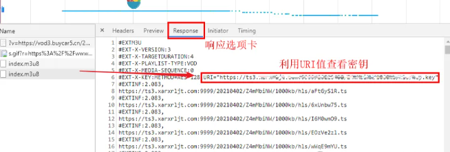
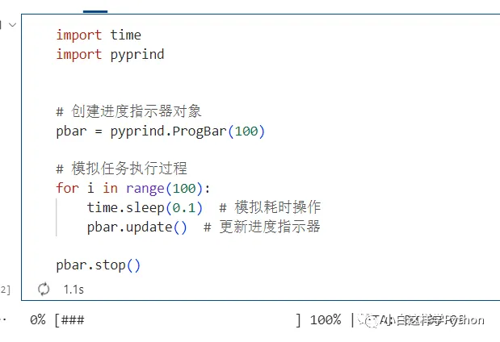

# Python库

## TinyDB：可能是最合适小型应用的数据库

TinyDB 是一个 Python 中的轻量级、快速、简单的文档数据库，它以 JSON 文件的形式存储数据。

TinyDB 是为了简化小型应用程序中的数据存储而设计的，它不需要配置数据库服务器，只需一个 JSON 文件即可。TinyDB 具有简单的 API，易于学习和使用。


你可以使用 TinyDB 来存储和检索数据，例如配置信息、用户偏好设置、日志等。它适用于小型项目和原型开发，但对于大型或高性能需求的项目，可能需要更强大的数据库解决方案。

TinyDB 和 SQLite 是两种不同类型的数据库，它们有各自的特点和适用场景。

TinyDB 是一种文档数据库，以 JSON 文件的形式存储数据，适用于存储和检索简单的文档数据。SQLite 是一种关系型数据库管理系统 (RDBMS)，使用 SQL 查询语言进行操作，适用于存储和检索结构化数据。

TinyDB 使用单个 JSON 文件存储数据，这种简单的存储方式适用于小型应用程序。SQLite 使用单个文件数据库，通常以.db 文件的形式存储，支持更复杂的数据结构和查询操作。

TinyDB 通常比 SQLite 更轻量级，适用于小型数据集和低负载环境。SQLite 在处理大型数据集和复杂查询时通常比 TinyDB 更高效。

SQLite 支持丰富的 SQL 查询语言和事务操作，适用于复杂的数据操作和关系型数据库需求。TinyDB 的功能相对较简单，适用于简单的数据存储和检索需求，不支持复杂的查询语言和事务操作。

TinyDB 不需要配置数据库服务器，只需一个 JSON 文件，部署和维护比较简单。SQLite 需要配置数据库服务器，需要考虑服务器的部署和维护，相对复杂一些。

综上所述，如果你的应用程序需要存储和检索简单的文档数据，并且对性能要求不高，那么可以选择 TinyDB。如果你的应用程序需要处理结构化数据，进行复杂的查询操作，并且对性能要求较高，那么可以选择 SQLite。

如何使用 TinyDB 进行数据存储和检索呢：

```
from tinydb import TinyDB, Query

# 创建或连接到一个名为 'db.json' 的 TinyDB 数据库文件
db = TinyDB('db.json')

# 获取一个名为 'users' 的数据表
users_table = db.table('users')

# 插入一条用户记录
users_table.insert({'name': 'Alice', 'age': 30})

# 插入多条用户记录
users_table.insert_multiple([
    {'name': 'Bob', 'age': 25},
    {'name': 'Charlie', 'age': 35}
])

# 查询所有用户记录
all_users = users_table.all()
print("All users:", all_users)

# 查询年龄大于 25 的用户记录
User = Query()
users_over_25 = users_table.search(User.age > 25)
print("Users over 25:", users_over_25)

# 更新用户记录
users_table.update({'age': 40}, User.name == 'Bob')

# 删除用户记录
users_table.remove(User.name == 'Charlie')

# 关闭数据库连接
db.close()
```

这段代码首先导入了 TinyDB 模块，并创建了一个名为 'db.json' 的 TinyDB 数据库文件。然后创建了一个名为 'users' 的数据表，并向其中插入了一些用户记录。

接着进行了一些简单的查询、更新和删除操作，并最终关闭了数据库连接。

可以根据自己的需要修改和扩展这段代码，以满足特定的数据存储和检索需求。

## m3u8

**m3u8**是一个用于解析和生成M3U8文件的Python库，这种文件格式通常用于HTTP Live Streaming（HLS）中，用于流式传输多媒体内容。该库提供了一种简单的方式来处理HLS流的各个组成部分，如播放列表、片段以及加密信息，使得开发者可以轻松地创建、修改和读取M3U8文件。

### 特点

1. **解析与生成**

2. - m3u8能够解析现有的M3U8文件，并基于这些信息生成新的M3U8文件。这对于开发直播流、视频点播等应用至关重要。

3. **支持广泛**

4. - 支持各种类型的M3U8标签和属性，包括EXT-X-VERSION、EXTINF、EXT-X-STREAM-INF等，几乎覆盖了HLS规范的所有方面。

5. **简单易用**

6. - 通过提供直观的API接口，m3u8使得操作M3U8文件变得非常简单，即使是没有深入了解HLS协议的开发者也能快速上手。

### 最佳实践

#### 安装方法：

安装m3u8同样简单，通过pip命令即可完成安装：

```bash
pip install m3u8
```

#### 易于上手的功能示例：

**1.解析M3U8文件**：

下面的代码展示了如何读取并解析一个M3U8文件。

```python
 import m3u8

# 假设你已经有了一个M3U8文件的URL或者文件路径
m3u8_url = 'http://example.com/path/to/playlist.m3u8'
playlist = m3u8.load(m3u8_url)  # 从URL加载
# 或者使用m3u8.load()从文件路径加载
print(playlist.segments)  # 打印所有的片段信息
print(playlist.playlists)  # 如果是一个master playlist，打印所有的variant streams
```

**2.生成M3U8文件**：

要将播放列表从对象转储到控制台或文件，请使用 dump/dump 函数

```python
import m3u8

# 假设你已经有了一个M3U8文件的URL或者文件路径
m3u8_url = 'http://example.com/path/to/playlist.m3u8'
playlist = m3u8.load(m3u8_url)  # 从URL加载
# 或者使用m3u8.load()从文件路径加载
print(playlist.segments)  # 打印所有的片段信息
print(playlist.playlists)  # 如果是一个master playlist，打印所有的variant streams
```

### 进阶功能示例：

探索m3u8库更深层次的功能，比如处理加密的流。

**1.通过请求查看秘钥**



首先用F12查看当前m3u8的秘钥方法，这里不详细展开，百度上已经有许多现成的教程，

**2.之后可以通过最后的key来获取所有片段**

```python
import m3u8

m3u8_obj = m3u8.loads('#EXTM3U8 ... etc ...')
segmk1 = m3u8_obj.segments.by_key(None)

segm = m3u8_obj.segments.by_key( m3u8_obj.keys[-1] )
```

- 不仅如此，我们还可以更改已有的key值通过这个方法

```python
import m3u8

m3u8_obj = m3u8.loads('#EXTM3U8 ... etc ...')

# 创建一个新的秘钥并替换
new_key = m3u8.Key("AES-128", "/encrypted/newkey.bin", None, iv="0xf123ad23f22e441098aa87ee")
for segment in m3u8_obj.segments.by_key( m3u8_obj.keys[-1] ):
    segment.key = new_key
# 最后记得同步最终的key
m3u8_obj.keys[-1] = new_key
```

### 总结

m3u8库为Python开发者提供了一个强大而简单的工具，用于处理HTTP Live Streaming的各个方面。无论是解析、生成M3U8文件，还是处理复杂的流加密问题，m3u8都能提供直观、易于使用的解决方案。

## Playwrigtht：浏览器自动化操作库

无论你是在测试，还是爬虫，或者是自动化执行，可能都绕不开直接控制浏览器的问题。

如何方便轻松的控制浏览器呢？

方法很多，但今天要介绍的神奇工具，能够轻松地满足你的任何需求（当然限于操控浏览器哈）它就是 **Playwright**。

它不只是能模拟用户在网页上的每一个点击，滚动、拖拽，甚至是多浏览器的并发操作，都能够精准执行，规避了传统测试方法中的那些痛点。

### **Playwright？**

起初，Playwright 由微软的大脑所孕育，诞生为一个用于自动化主流浏览器操作的强大工具库。

虽然它的本体是一个 Node 库，但随着 Python 社区的蓬勃发展，其 Python 版本包也应运而生。

与老牌的自动化测试工具 Selenium 相比，Playwright 所带来的不仅仅是在现代化 API 设计上的简洁明了，还有着对现代网络功能的全面支持，尤其是它那原生操作浏览器的能力，让一切测试都变得水到渠成。

Playwright 拒绝了 WebDriver 这类**中间人**，提供了直接与浏览器内核对话的方式，因此无论是性能还是稳定性，都有显著提升。

它支援的不仅是 Chrome，Firefox 和WebKit，更是所有基于这些内核的现代浏览器。

而且它携带的功能，像是**自动化测试**、**跨浏览器测试**，甚至是**网页截屏**，都是测试工程师日常工作中的得力助手。

### **安装**

事不宜迟，一起来安装  Playwright  吧！

由于  Playwright  不包含在 Python 标准库中，我们可使用 pip 来安装它。

```
pip install playwright
```

安装完后，别忘了运行  Playwright  提供的安装脚本为所有支持的浏览器下载必要组件。

```
playwright install
```

### **Playwright  的核心功能**

#### **基本用法**

要启动 Playwright 的冒险之旅，我们首先要创建一个浏览器实例，然后打开一个新页面，如下所示：

```
from playwright.sync_api import sync_playwright

with sync_playwright() as p:
    browser = p.chromium.launch()
    page = browser.newPage()
    page.goto('https://www.example.com')
    print(page.title())
    browser.close()
```

在这里，我们启动了  Chromium  浏览器，并访问了一个示例页面，打印出了页面的标题。

#### **跨浏览器测试**

Playwright  的一大特点就是跨浏览器测试能力。

以下示例代码展示了如何分别在  Chrome, Firefox  和 WebKit  中运行你的测试脚本：

```python
with sync_playwright() as p:
    for browser_type in [p.chromium, p.firefox, p.webkit]:
        browser = browser_type.launch()
        page = browser.newPage()
        page.goto('https://www.example.com')
        # 进行相关测试操作 
        browser.close()
```

每次循环运行对应不同内核的浏览器，执行相同的测试操作，让你毫不费力的完成跨浏览器测试。

### **高级特性**

Playwright  还提供了一系列的高级特性，例如页面截图、PDF 生成、网络请求拦截等等。

我们这里主要介绍其中的页面截图功能：

#### **网页截屏**

在自动化测试或监控网页布局的时候，截屏功能是非常有用的。

Playwright 可以轻松地捕获当前页面的视觉呈现状态：

```python
page.screenshot(path='example.png')
```

这会保存当前页面的截图到你指定的文件中。

### **实践**

现在，你已经掌握了 Playwright 的核心功能和一些高级特性，为何不自己动手，尝试撰写一个自动化测试脚本，监测你最爱的网站是否如期运行？

或者，试试写一个脚本，在不同的浏览器中验证一个网页的响应式设计，确保布局的完美呈现。

### **结语**

在这个高速迭代的数字世界，Playwright 似乎赋予了测试工程师超能力，让他们在保证质量的同时，也能享受到开发的乐趣。

Playwright  不仅改变了自动化测试的景观，更拉近了开发者与测试者的距离。

无论是简单的脚本还是复杂的自动化任务，Playwright  都能够让你如鱼得水。

## Pybind11：让Python和C++完美结合的开源工具库，轻松地将C++代码封装为Python模块

**项目地址**：https://github.com/pybind/pybind11

Pybind11这个开源工具的目标是让Python和C++之间的交互更加简单高效。Pybind11提供了一套完整的工具，帮助用户轻松地将C++代码封装为Python模块，并在Python中直接调用。这样用户即可以享受C++的高性能，又可以利用Python的高效和简洁性快速搭建程序。

Pybind11的使用方法非常简单，用户只需要按照以下步骤来进行：

1. 首先，用户需要安装Pybind11。在Python环境下可以通过源代码或者包管理工具（如pip）进行安装。

   pip install pybind11

2. 在C++代码中，用户只需要简单使用Pybind11提供的宏和函数来定义，就可以把想要绑定到Python的函数和类。通过使用`PYBIND11_MODULE`宏，用户就可以方便的定义一个Python模块，并在其中定义自己的函数和类。

3. 在C++代码中，用户可以便捷地使用Pybind11提供的API来操作Python对象，包括但不限于获取和设置属性、调用函数等。

4. 在Python中，用户可以方便高效地导入已经绑定的C++模块，并像调用Python模块一样方便的使用其中的函数和类。

通过上述步骤，用户可以方便地在Python中调用C++代码，无需担心性能损失，同时还能享受Python编程的便捷性，可谓一举两得，事半功倍。

除了上述简单的使用方法，Pybind11还提供了更加丰富的特性和工具，方便用户更好地控制绑定的细节。用户不但可以自定义Python模块的名称、函数签名和参数类型，还可以方便地处理异常和错误信息，使得Python和C++之间的交互更加稳定和可靠。此外，Pybind11还支持多线程和多进程的并发操作，满足了用户在复杂应用场景的需求。

作为一个开源工具，Pybind11的源代码完全开放，用户可以自由地修改和定制，以满足个人或团队的特定需求。

总而言之，Pybind11是一个让Python和C++完美结合的开源项目，它通过简洁的语法、出色的性能和丰富的特性，让用户能够轻松地将C++代码封装为Python模块，并在Python中直接调用。如果你有Python和C++的交互有需求，那么不妨尝试一下Pybind11，它将给你带来更加便捷的编程体验。

## httpx：下一代Python HTTP 客户端，一个非常强大、灵活的工具

**项目地址**：https://github.com/encode/httpx

### 简介

httpx 是一个为 Python 设计的下一代 HTTP 客户端。与标准库中的 urllib 或第三方库 requests 相比，httpx 提供了更多功能和更好的性能。它支持异步请求，可以与 asyncio 和协程一起使用。同时，httpx 还提供了更多的高级功能，如模拟浏览器的行为和支持 HTTP/2。它是一个非常强大、灵活的工具，能够满足各种 HTTP 请求的需求。

### 功能和特点

- 支持异步请求，适用于异步程序和协程
- 支持 HTTP/2，提供更快的传输速度
- 提供高级的请求和响应处理方法，如重定向、代理、SSL 验证等
- 可以模拟浏览器的行为，包括发送表单、处理 cookie 等
- 支持多种认证方式，包括基本认证、摘要认证等

### 使用方法和示例代码

```python
import httpx

# 发送 GET 请求
response = httpx.get('https://www.example.com')
print(response.text)

# 发送 POST 请求
data = {'key1': 'value1', 'key2': 'value2'}
response = httpx.post('https://www.example.com', data=data)
print(response.json())
```

### 应用场景

- 开发异步程序或协程
- 需要使用 HTTP/2 协议进行请求的场景
- 对于需要更高级功能的 HTTP 请求，如模拟浏览器行为等

### 优势和缺点

#### 优势

- 支持异步请求，性能更好
- 提供更多高级功能，如 HTTP/2 支持、模拟浏览器行为等

#### 缺点

- 对于简单的同步请求，可能比 requests 等库多出一些学习成本

### 总结

httpx 是一个功能强大、灵活的 HTTP 客户端，支持异步请求和多种高级功能。它能满足各种 HTTP 请求的需求，是 Python 开发中的一个非常有用的工具。在异步编程和 HTTP/2 支持等方面，httpx 展现出了明显的优势，是未来 Python HTTP 客户端的发展方向。

## Mitmproxy：流量拦截与修改的强大工具

**项目地址**：https://github.com/mitmproxy/mitmproxy

### 1. 简介

mitmproxy是一个流量拦截与修改的工具，可以拦截HTTP和HTTPS流量，并在中间人嵌入式代理服务器上对请求和响应进行修改。它提供了一个直观的Web界面和命令行界面，方便用户查看和修改流量。本文将介绍mitmproxy库的安装方法、使用方法以及它的优缺点、应用场景和总结。

### 2. 安装

在开始使用mitmproxy库之前，您需要进行一些安装准备。以下是安装mitmproxy库的步骤：

- 首先，确认您的操作系统上已经安装了Python和pip。
- 其次，使用以下命令安装mitmproxy库：

```bash
pip install mitmproxy
```

### 3. 使用方法

mitmproxy库的使用方法相对复杂，但以下是一个基本使用流程的简单步骤：

- 运行mitmproxy：在命令行中输入`mitmproxy`命令，启动mitmproxy代理服务器。
- 设置浏览器代理：在浏览器的设置中配置代理服务器，将流量导向mitmproxy。
- 拦截和修改流量：mitmproxy会拦截所有经过代理服务器的流量，用户可以查看和修改请求和响应。
- 保存和导出流量：mitmproxy提供了保存流量和导出流量的功能，方便用户进行后续分析和处理。

### 4. 完整示例代码

以下是一个简单示例代码，展示了如何使用mitmproxy库进行流量拦截和修改：

```python
from mitmproxy import http

def request(flow: http.HTTPFlow) -> None:
    # 修改请求URL，添加自定义参数
    flow.request.url += "&custom_param=value"

def response(flow: http.HTTPFlow) -> None:
    # 修改响应内容，替换指定关键词
    flow.response.text = flow.response.text.replace("original_keyword", "modified_keyword")
```

### 5. 优缺点

优点：

- mitmproxy库可以拦截HTTP和HTTPS流量，方便用户对请求和响应进行查看和修改，实现定制化的流量操作。
- mitmproxy提供了直观的Web界面和命令行界面，使得用户可以方便地进行流量监控和修改操作。
- mitmproxy库具有良好的可扩展性，并支持使用Python代码进行高级的流量处理和定制开发。

缺点：

- mitmproxy库的使用方法相对复杂，需要较长时间来熟悉和掌握其功能和配置选项。
- 对于一些加密或隐私敏感的应用程序，mitmproxy可能会造成安全风险，因为它能够拦截和修改HTTPS流量。

### 6. 应用场景

mitmproxy库在以下场景中具有广泛的应用：

- 网络调试和分析：通过拦截和修改流量，帮助开发人员进行网络调试、性能优化和问题排查。
- 安全测试和漏洞挖掘：通过修改请求和响应，模拟各种攻击场景，帮助安全人员发现和修复漏洞。
- 数据抓取和篡改：对抓取的数据进行定制化处理，例如爬虫数据过滤、数据篡改等。

### **7. 总结**

mitmproxy库是一个功能强大的流量拦截与修改工具，通过中间人嵌入式代理服务器实现对HTTP和HTTPS流量的拦截和修改。

它提供了直观的Web界面和命令行界面，方便用户查看和修改流量。尽管mitmproxy库的使用方法相对复杂，但它在网络调试、安全测试和数据处理等场景中具有广泛的应用前景。通过深入学习和合理使用，mitmproxy库可以成为流量拦截与修改的强大工具。

## pyprind：简单高效的Python进度条

**Github地址**：https://github.com/rasbt/pyprind

### 引言

pyprind作为一款Python进度指示器工具，解决了以下问题：

在Python编程中，经常需要处理耗时的任务或循环，为了更好地展示任务的进度，提升用户体验，pyprind作为一款Python进度指示器工具应运而生。提供了进度条、百分比、预估时间等多种进度指示样式，满足不同的需求。

本文将详细介绍pyprind的功能和用法，让我们一起来了解这个备受欢迎的工具。

### pyprind的简介

pyprind是一个简单而强大的Python库，用于在命令行界面显示进度指示器。它提供了一种简便的方式来跟踪任务的执行进度，并在屏幕上实时显示进度条、百分比和估计剩余时间等信息。

### 主要特点和功能

#### 简单易用

pyprind的使用非常简单，只需几行代码就可以创建一个进度指示器对象，并在任务执行过程中更新进度。

#### 进度条显示

pyprind可以实时显示任务的进度条，以直观的方式展示任务的完成情况。


#### 百分比显示

除了进度条，pyprind还可以显示任务的百分比完成情况，让用户清楚地了解任务的进展。


#### 估计剩余时间

pyprind可以根据任务已完成的进度和执行时间，估计任务的剩余执行时间，帮助用户更好地安排时间和资源。

#### 自定义样式

pyprind允许用户自定义进度条的样式和显示格式，以满足不同场景下的需求。

### pyprind的用法示例

下面是一个简单的示例代码，演示了如何使用pyprind创建和更新进度指示器：



以上示例代码创建了一个包含100个步骤的进度指示器，并使用`update()`方法在每个步骤完成时更新指示器。最后，使用`stop()`方法标记任务的完成。

### 总结

pyprind作为一款Python进度指示器工具，简化了任务进度的展示和跟踪。它的简单易用性、进度条和百分比的显示、估计剩余时间功能以及自定义样式的灵活性，使得用户能够更好地了解任务的进展情况。通过pyprind，Python开发者可以更加直观地展示任务的进度，提升用户体验。

## MyPy：静态类型检查的利器

**GitHub地址**：https://github.com/python/mypy

### 引言

Python 是一种动态类型语言，它的灵活性和易用性使得它成为众多开发者的首选编程语言。然而，动态类型语言也存在一些潜在的问题，例如在运行时才能发现的类型错误。为了解决这个问题，Python 社区开发了一个强大的静态类型检查工具，名为 MyPy。本文将详细介绍 MyPy 的功能和用法。

### 什么是 MyPy

#### 1.MyPy 概述

MyPy 是一个由 Python 社区开发的可选静态类型检查工具，它可以帮助开发者在编写 Python 代码时发现潜在的类型错误。它是一个独立的命令行工具，可以与任何文本编辑器或集成开发环境（IDE）配合使用。

#### 2.MyPy 的特点

- 静态类型检查：MyPy 可以对 Python 代码进行静态类型检查，即在代码编写期间检查类型错误，而不是在运行时。
- 可选性：MyPy 提供了可选的类型注解语法，开发者可以根据需要选择性地对代码进行类型注解。
- 与 Python 3 兼容：MyPy 完全兼容 Python 3，并对 Python 2 提供有限的支持。
- 功能丰富：MyPy 支持多种类型注解，包括基本类型、自定义类型、泛型类型和函数类型等。
- 插件生态系统：MyPy 的插件生态系统丰富，可以扩展其功能，提供更多的静态类型检查规则和特性。

### 安装和配置 MyPy

**1.安装 MyPy**

可以通过 pip 包管理器来安装 MyPy。在命令行中运行以下命令即可：

```
pip install mypy
```

**2.配置编辑器**

为了获得最佳的开发体验，建议在你使用的代码编辑器中配置 MyPy。常见的编辑器如 Visual Studio Code、PyCharm 和 Sublime Text 都提供了对 MyPy 的插件或集成支持。

### 使用 MyPy 进行静态类型检查

**1.添加类型注解**

在 Python 代码中使用 MyPy 进行静态类型检查，首先需要对变量、函数参数和函数返回值等位置进行类型注解。

变量注解：在变量声明时，使用冒号（:）和类型注解来指定变量的类型。例如：

```python
my_variable: int = 10
```

函数参数注解：在函数定义时，使用冒号和类型注解来指定函数的参数类型。例如：

```python
def add(a: int, b: int) -> int:
    return a + b
```

函数返回值注解：使用箭头（->）和类型注解来指定函数的返回值类型。例如：

```python
def multiply(a: int, b: int) -> int:
    return a * b
```

**2.运行 MyPy 进行类型检查**

在命令行中，你可以通过以下命令来运行 MyPy 进行静态类型检查：

```python
mypy your_code.py
```

如果没有发现任何类型错误，将会显示一条 "Success" 的消息。如果存在类型错误，MyPy 将会指出错误的具体位置和原因。

### MyPy 的优势和适用场景

使用 MyPy 提供的可选静态类型支持，有以下优势和适用场景：

1. **类型安全保证**：通过静态类型检查，可以在编写代码时发现并避免潜在的类型错误，提高代码的安全性和稳定性。
2. **增强代码可读性**：类型注解能够使代码更加清晰易懂，提高代码的可读性和可维护性。
3. **提升开发效率**：MyPy 提供了更好的代码补全和自动提示功能，帮助开发者更快地编写代码和调试错误。
4. **团队合作**：在团队合作中，使用静态类型可以提供更好的代码文档和沟通，减少误解和错误的发生。

总结而言，MyPy 是一个强大的可选静态类型检查工具，它可以帮助 Python 开发者在编写代码时发现潜在的类型错误。通过使用 MyPy，你可以提高代码的可靠性、可读性和可维护性，从而更高效地开发和维护 Python 项目。

# 办公自动化库

Python办公自动化是指使用Python编程语言及其丰富的库和模块，来自动执行、管理和优化日常办公任务的过程。这种方法可以显著提高工作效率，减少人为错误，节省时间，并允许工作人员专注于更复杂和创造性的任务。

### 核心优势

1. **效率提升**：自动化脚本可以快速执行重复性任务，比人工操作更快、更准确。
2. **减少错误**：自动化流程减少了人为操作的出错可能性，提高了工作质量。
3. **成本节约**：长期来看，自动化可以减少对人力资源的依赖，降低企业的运营成本。
4. **灵活性和可扩展性**：自动化脚本可以根据需要进行调整和扩展，以适应不断变化的工作需求。
5. **数据分析和报告**：Python提供了强大的数据分析工具，可以帮助从大量数据中提取有价值的信息，并生成报告。

### 常用库和工具

- **Pandas**：用于数据分析和处理，特别适合处理表格数据（如Excel文件）。
- **OpenPyXL**：用于读写Excel 2010 xlsx/xlsm/xltx/xltm文件。
- **Python-docx**：用于创建和修改Microsoft Word文档。
- **Python-pptx**：用于创建和修改Microsoft PowerPoint演示文稿。
- **smtplib**：用于发送电子邮件。
- **PyPDF2**：用于处理PDF文件，包括合并、拆分、转换等。
- **Win32com**：用于与Windows应用程序交互，如Word、Excel和PowerPoint。

### 应用场景

- **数据录入和处理**：自动从PDF或网页中提取数据，整理到Excel表格中。
- **报告生成**：根据数据自动生成图表和报告。
- **文件管理**：批量重命名文件、转换文件格式、合并分割文档等。
- **邮件处理**：自动发送通知邮件、处理邮件附件等。
- **表单自动化**：自动填写网页表单，提取表单数据等。
- **系统管理**：自动化系统维护任务，如备份、日志分析等。

### 实施步骤

1. **需求分析**：明确需要自动化的任务和目标。
2. **选择合适的库**：根据任务需求选择最适合的Python库。
3. **编写脚本**：编写Python脚本，实现自动化流程。
4. **测试和调试**：确保脚本按预期工作，修复可能出现的问题。
5. **部署和监控**：将脚本部署到生产环境，并定期监控其运行情况。
6. **维护和更新**：根据实际情况调整和优化脚本。

通过Python办公自动化，无论是个人还是企业，都可以有效地提高工作效率和质量，从而在竞争激烈的市场中保持优势。

### 案例示例

以下是这些库的介绍，它们的使用场景以及一些简单的案例示例。

### 1. `pandas` - 数据分析与处理

- **使用场景**：适用于数据分析、数据清洗、数据转换等。

- **案例**：使用`pandas`读取Excel文件，进行数据分析，然后生成报告。

  ```python
  import pandas as pd
  
  # 读取Excel文件
  df = pd.read_excel('data.xlsx')
  
  # 数据分析：计算某列的平均值
  average = df['column_name'].mean()
  
  # 输出结果到新的Excel文件
  df.to_excel('analysis.xlsx')
  ```

### 2. `openpyxl` - Excel文件操作

- **使用场景**：适用于读写Excel 2010 xlsx/xlsm/xltx/xltm文件。

- **案例**：创建一个新的Excel工作簿，并向其中添加数据。

  ```python
  from openpyxl import Workbook
  
  # 创建工作簿
  wb = Workbook()
  ws = wb.active
  
  # 添加数据
  ws['A1'] = 'Hello'
  ws['B1'] = 'World!'
  
  # 保存工作簿
  wb.save('new_workbook.xlsx')
  ```

### 3. `python-docx` - Word文档操作

- **使用场景**：适用于创建和修改Microsoft Word文档。

- **案例**：向Word文档中添加文本和格式化。

  ```python
  from docx import Document
  
  # 创建文档
  doc = Document()
  
  # 添加段落
  doc.add_paragraph('This is a paragraph.')
  
  # 添加格式化文本
  doc.add_paragraph('This is an italic text.', style='Intense Emphasis')
  
  # 保存文档
  doc.save('new_document.docx')
  ```

### 4. `python-pptx` - PPT幻灯片操作

- **使用场景**：适用于创建和修改Microsoft PowerPoint演示文稿。

- **案例**：创建一个新的PPT，并添加幻灯片和图片。

  ```python
  from pptx import Presentation
  
  # 创建演示文稿
  ppt = Presentation()
  
  # 添加幻灯片
  slide = ppt.slides.add_slide(ppt.slide_layouts[0])
  
  # 添加标题和内容
  title = slide.shapes.title
  title.text = 'My Slide'
  content = slide.placeholders[1]
  content.text = 'This is my content.'
  
  # 添加图片
  picture = slide.shapes.add_picture('path_to_image.jpg', left=100, top=100, width=500, height=300)
  
  # 保存演示文稿
  ppt.save('new_presentation.pptx')
  ```

### 5. `smtplib` - 发送电子邮件

- **使用场景**：适用于自动化电子邮件的发送。

- **案例**：使用`smtplib`发送一封HTML格式的电子邮件。

  ```python
  import smtplib
  from email.mime.text import MIMEText
  from email.mime.multipart import MIMEMultipart
  from email.mime.application import MIMEApplication
  
  # 创建邮件内容
  msg = MIMEMultipart('alternative')
  msg['Subject'] = 'Your subject here'
  msg['From'] = 'from@example.com'
  msg['To'] = 'to@example.com'
  
  # 添加HTML内容
  html = '<html><body><h1>Hi there!</h1></body></html>'
  part = MIMEText(html, 'html')
  msg.attach(part)
  
  # 添加附件
  with open('attachment.pdf', 'rb') as attachment:
    part = MIMEApplication(attachment.read(), _subtype='pdf')
    part.add_header('Content-Disposition', 'attachment', filename='attachment.pdf')
    msg.attach(part)
  
  # 发送邮件
  server = smtplib.SMTP('smtp.example.com')
  server.sendmail('from@example.com', 'to@example.com', msg.as_string())
  server.quit()
  ```

### 6. `PyPDF2` - PDF文件操作

- **使用场景**：适用于PDF文件的读取、写入、合并、拆分等。

- **案例**：合并两个PDF文件。

  ```python
  from PyPDF2 import PdfFileMerger
  
  # 创建合并对象
  merger = PdfFileMerger()
  
  # 添加PDF文件
  merger.append('file1.pdf')
  merger.append('file2.pdf')
  
  # 合并并保存
  merger.write('merged.pdf')
  ```

这些库是Python办公自动化中非常实用的工具，通过它们，我们可以轻松地处理各种办公文档和邮件任务。掌握这些库的使用方法，将极大地提升你的工作效率。
