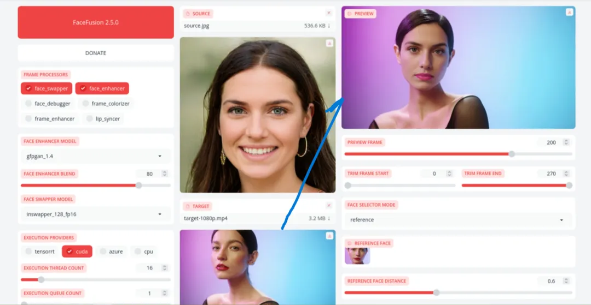
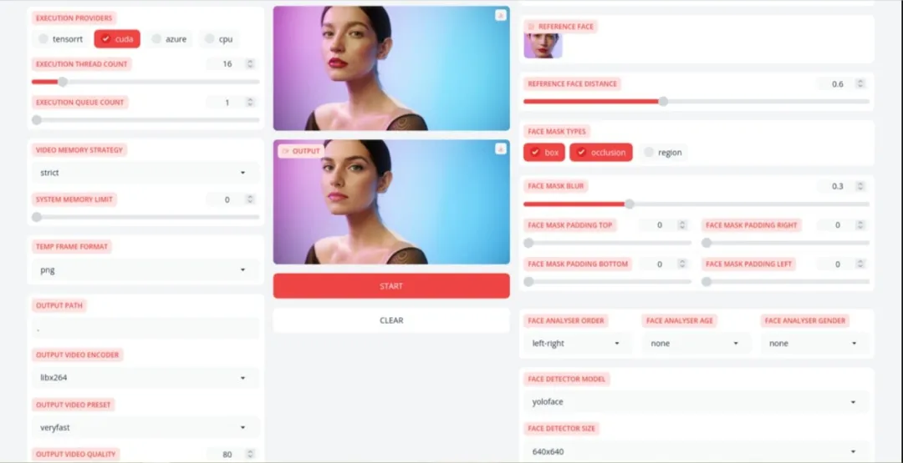
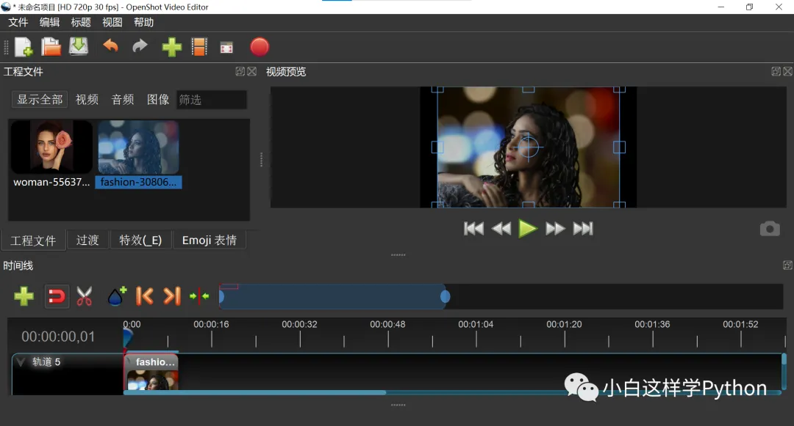
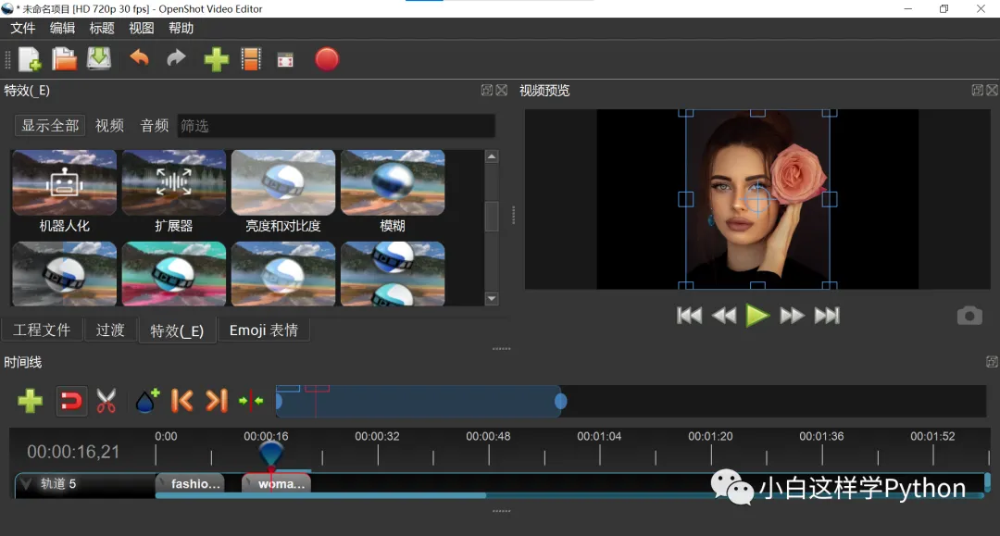
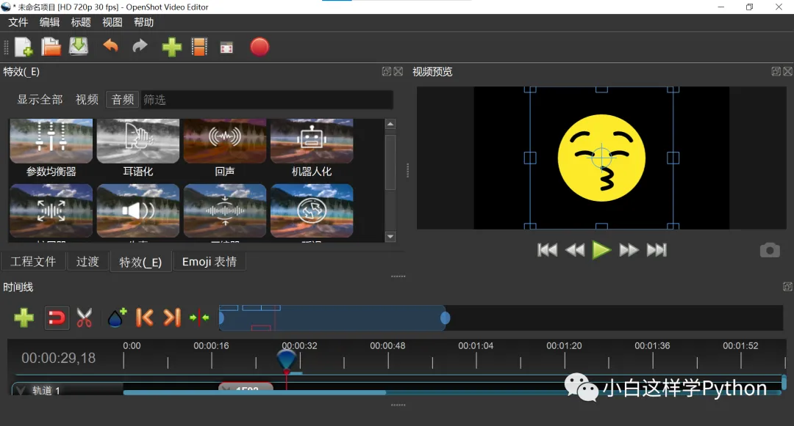
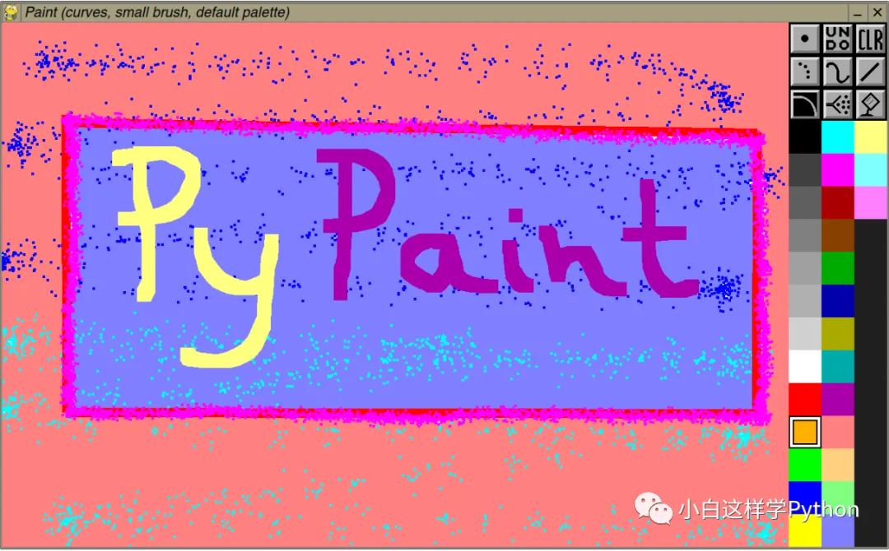
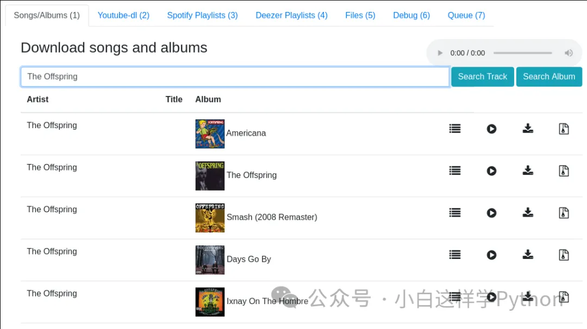
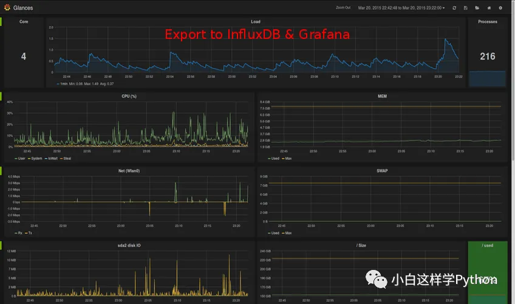
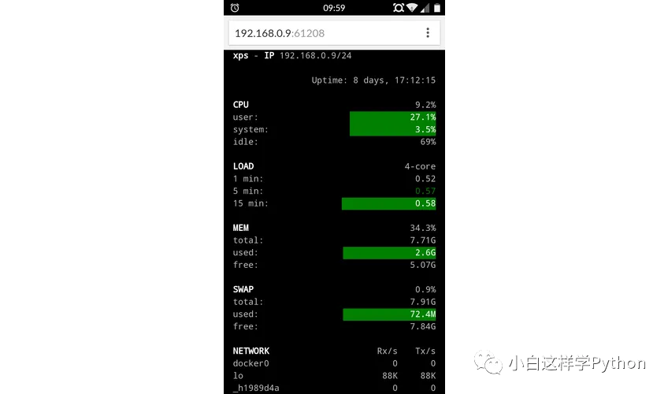

# Python开源项目

[welliamcao/OpsManage: 自动化运维平台: 代码及应用部署CI/CD、资产管理CMDB、计划任务管理平台、SQL审核|回滚、任务调度、站内WIKI (github.com)](https://github.com/welliamcao/OpsManage)

## FaceFusion：Python打造的下一代面部交换和增强工具，打造惊艳合成图像

**项目地址**：https://github.com/facefusion/facefusion

### 引言

> 在数字图像处理领域，FaceFusion（脸部融合）是一种先进的面部交换和增强技术，能够将两个或多个人的面部特征合成到一张图片中。FaceFusion项目是一个开源项目，它提供了一个强大的工具集，使用户能够自由地探索和实现面部融合的各种应用。本文将详细介绍FaceFusion项目的功能、使用方法和技术原理，帮助读者全面了解这一令人兴奋的图像处理工具。
>
> 

### 一、FaceFusion简介

FaceFusion是一种下一代面部交换和增强技术，它能够将不同人的面部特征融合到一起，创造出令人惊叹的合成图像。FaceFusion项目由一群热爱计算机视觉和图像处理的开发者创建，并在GitHub上开源。该项目的目标是提供一个功能强大且易于使用的工具，使用户能够探索面部融合的潜力，并应用于各种创意和实际场景中。

### 二、FaceFusion的功能

1. **面部交换：** FaceFusion能够将两个不同人的面部特征进行交换，创造出合成图像，使得两个人的面部特征融为一体。通过选择两个输入图像并指定面部特征的位置，用户可以生成具有混合特征的新图像。

2. **面部增强：** 除了面部交换，FaceFusion还提供了面部增强功能，可以改善面部特征并使其更加吸引人。用户可以调整面部特征的大小、形状和颜色，改变眼睛、鼻子、嘴巴等部位的外观，使图像更加生动有趣。

3. **多脸融合：** FaceFusion不仅支持两个人的脸部特征融合，还可以同时处理多个人的面部特征。用户可以选择多个输入图像，并根据需要在图像中指定不同的面部特征位置，从而生成融合了多个人面部特征的合成图像。

4. **实时面部融合：** FaceFusion还提供了实时面部融合功能，使用户能够在摄像头捕捉的视频流中实时应用面部融合效果。这使得用户可以与朋友通过视频通话交换面部特征，增加互动的乐趣。

   

### 三、使用FaceFusion的步骤

1. **准备输入图像：** 在使用FaceFusion之前，用户需要准备两个或多个输入图像，这些图像包含要进行面部融合的人的面部特征。图像应当清晰，面部特征明显可见。
2. **选择面部特征位置：** 用户需要在输入图像中选择面部特征的位置，例如眼睛、鼻子、嘴巴等部位。这可以通过在图像上点击或拖动来完成。
3. **应用面部融合效果：** 一旦选择了合适的面部特征位置，用户可以点击应用按钮，生成融合了输入图像面部特征的合成图像。用户还可以根据需要进行面部增强操作，调整面部特征的外观。
4. **保存和分享结果：** 最后，用户可以保存生成的合成图像，并通过社交媒体、电子邮件或其他方式与其他人分享。

### 结论

FaceFusion是一款功能强大的面部交换和增强工具，通过将不同人的面部特征融合到一起，创造出令人惊叹的合成图像。该项目提供了一个开源的工具集，使用户能够自由地探索和实现面部融合的各种应用。无论是用于创意艺术还是实际应用，FaceFusion都为用户提供了丰富的功能和灵活的操作方式。通过使用FaceFusion，用户可以尽情享受面部融合带来的乐趣和创造力。

## Sentry：一个Python开发的、程序员和开发者首选的错误跟踪和性能监控平台

**项目地址**：https://github.com/getsentry/sentry

### 什么是Sentry？

Sentry是一个开发者首选的错误跟踪和性能监控平台，它帮助开发者了解真正重要的问题，快速解决，并持续升级维护他们的应用程序。

### 用户群体与应用领域

Sentry广泛应用于各个行业和领域，满足不同开发者的需求。

1. **Web开发**：Sentry在Web开发中具有广泛的应用，帮助开发者捕获和解决前端和后端的错误和异常，提高Web应用程序的质量和可靠性。
2. **移动应用开发**：Sentry也适用于移动应用开发，帮助开发者监控和跟踪移动应用程序中的错误和性能问题，提供及时的反馈和解决方案。
3. **开源项目**：Sentry是一个开源项目，许多开源社区和项目都选择使用Sentry来跟踪和解决问题，共同改进开源软件的质量和可靠性。

### 功能与特点

Sentry具有丰富的功能和特点，使其成为开发者的理想选择。

1. **错误跟踪**：Sentry可以捕获应用程序中的错误和异常，并提供详细的错误报告和堆栈跟踪信息。开发者可以准确地定位和修复问题，提高应用程序的稳定性和可靠性。
2. **性能监控**：Sentry可以监控应用程序的性能指标，如响应时间、吞吐量等，并提供实时的性能报告和分析。开发者可以及时发现性能瓶颈，优化应用程序的性能。
3. **可定制的通知**：Sentry支持多种通知方式，如电子邮件、Slack等，开发者可以根据自己的需求选择合适的通知方式，及时获取关键问题的信息。
4. **版本控制集成**：Sentry与常用的版本控制系统（如Git）紧密集成，开发者可以轻松地将错误和异常与特定的代码版本关联起来，帮助他们更好地理解和解决问题。
5. **数据分析和洞察**：Sentry提供丰富的数据分析和可视化工具，开发者可以深入了解应用程序的运行情况和趋势，从而优化应用程序的设计和性能。

### 结语

作为开发者首选的错误跟踪和性能监控平台，Sentry通过其丰富的功能和强大的特点，帮助开发者快速定位和解决问题，提高应用程序的质量和性能。无论是Web开发、移动应用开发还是开源项目，Sentry都能为开发者提供可靠高效的错误跟踪和性能监控解决方案。

## OpenShot-Qt：Python+QT打造的视频剪辑工具

**项目地址**：https://github.com/OpenShot/openshot-qt

### 简介

> 随着短视频行业的发展，视频编辑软件需求量非常大。今天介绍的OpenShot-Qt，是专为Linux、Mac和Windows系统用户提供高品质的视频编辑和动画解决方案。它采用Python语言打造，并采用了现代化的架构设计，借助多种先进技术和工具实现其强大的功能。

### 前端 UI 层

OpenShot-Qt的前端采用PyQt框架，提供直观友好的用户界面。由于Qt具备跨平台的特性，OpenShot-Qt可以在多个操作系统上运行，并为用户提供一致的使用体验。通过UI层，用户可以方便地导入、剪辑、添加特效等对视频素材进行操作。



### 核心引擎

OpenShot-Qt的核心引擎负责处理视频编辑和动画效果等工作。该引擎采用多线程处理技术，能够高效地处理复杂的渲染任务。它不仅支持多种视频、音频和图像格式，还具备高度可扩展性。

### 视频处理

OpenShot-Qt提供了丰富的视频处理功能，包括剪切、合并、分割、调整大小、旋转和翻转等操作。用户可以根据需求对视频进行各种调整和编辑，并实时预览编辑效果。

### 特效与转场

OpenShot-Qt内置了多种特效和转场效果，用户可以通过简单的拖放操作将其应用到视频上。这些特效和转场能够提升视频观赏性，使视频更加生动且引人注目。



### 动画和关键帧

OpenShot-Qt支持动画和关键帧功能，用户可以创建复杂的动画效果。通过使用关键帧编辑器，用户可以设置元素的起始状态和结束状态，并在时间轴上控制动画变化的过程。

### 音频编辑

OpenShot-Qt允许用户对音频进行编辑，包括音量调整、音频淡入淡出、剪辑和合并等操作。用户可以根据视频内容和需求进行定制化的音频处理。



### 应用场景

OpenShot-Qt在众多场景下表现出色，包括但不限于以下领域：

- **个人创作**：用户可以使用OpenShot-Qt轻松编辑个人视频，并添加自定义的特效和动画，打造个性化作品。
- **教育教学**：教师和学生可以利用OpenShot-Qt创建教学视频，增强教学效果，提供更生动的学习资源。
- **商业宣传**：企业可以使用OpenShot-Qt编辑专业的宣传片或广告视频，并通过特效和动画吸引更多目标受众。
- **社交媒体**：个人和机构可以使用OpenShot-Qt制作内容丰富、思想新颖的视频内容，与社交媒体用户进行互动和分享。

### 优势

OpenShot-Qt相对于其他视频编辑软件具备以下优势：

- **开源免费**：OpenShot-Qt是一款开源软件，用户可以免费使用，降低了使用门槛。
- **跨平台**：支持Linux、Mac和Windows多个操作系统，可以在不同平台上无缝使用，提供一致的使用体验。
- **功能强大**：提供了丰富的视频编辑和动画效果功能，用户可以轻松实现高质量的视频创作。
- **界面友好**：采用Qt前端 UI 层，提供直观友好的用户界面，使得用户操作更加简单和便捷。

### 总结

OpenShot-Qt作为一款功能强大的免费开源视频编辑软件，通过其现代化的架构设计和丰富的功能，为用户提供了高品质的视频编辑和动画解决方案。无论是个人创作、教育教学还是商业宣传，OpenShot-Qt都能满足用户的需求，并助力用户创作出令人惊叹的视频作品。无论是初学者还是专业用户，OpenShot-Qt都是一个强大而可靠的选择。

## PyPaint：用Python重新实现的绘画软件

**项目地址**：https://github.com/mdoege/PyPaint

### 一、简介

**PyPaint**是一款基于Python的绘画软件，它的设计初衷是提供一个简单易用，功能齐全的绘画工具，让用户能够通过Python的强大功能自定义和扩展绘画功能。

### 二、功能和特性

#### 1. 基本功能

PyPaint提供了丰富的基本绘画功能，包括画笔、画刷、颜色选择、画布操作等。用户可以通过简单的Python代码实现各种绘画操作。



#### 2. 自定义功能

PyPaint允许用户通过编写Python代码自定义绘画功能，这使得用户可以根据自己的需求定制独特的绘画工具。

#### 3. 扩展性

PyPaint的设计考虑了功能的扩展性，用户可以通过安装第三方库来增加新的绘画功能。

### 三、应用场景

#### 1. 教育

PyPaint可以作为教育工具，帮助学生学习Python编程和绘画技巧。

#### 2. 设计

设计师可以使用PyPaint进行快速的原型设计，通过Python代码实现复杂的交互效果。

#### 3. 游戏开发

游戏开发者可以使用PyPaint绘制游戏角色和场景，Python的易读性和灵活性使得游戏开发更加高效。

### 四、优势和不足

**优势**：

- 基于Python，易于学习和使用。
- 功能丰富，可定制性强。
- 支持第三方库扩展，功能更加强大。

**不足**：

- 对于习惯图形界面的用户，PyPaint的命令行操作可能有些不适应。

### 五、参考意义

PyPaint的开发模式为软件开发提供了一种新的思路，即通过编写简单的Python代码来实现复杂的操作。这种模式对于编程初学者非常友好，同时也为软件开发提供了更多的可能性。

### 六、总结

总的来说，PyPaint是一款非常优秀的绘画软件，它以Python为基础，提供了丰富的功能和强大的扩展性。尽管它可能不适合习惯图形界面的用户，但对于编程爱好者和教育者来说，它无疑是一款值得尝试的工具。

## 基于Python和Flask打造的音乐下载利器：Deezer-Downloader

**项目地址**：https://github.com/kmille/deezer-downloader

### 什么是Deezer-Downloader?

Deezer-Downloader是一个Python和Flask编写的强大工具，允许用户从Deezer上下载音乐，而且还配有一个友好的前端界面。它可以帮助用户方便地获取Deezer平台上的音乐，无需在线流媒体播放。

### 技术实现：Built with

Deezer-Downloader的实现依赖了众多优秀的技术和工具。它采用Python编程语言开发，使用了Deezer API作为接口，同时运用了诸如Flask后端和Electron等前端技术来构建用户友好的界面。这些技术的结合，确保了Deezer-Downloader在功能和用户体验上都能够达到优秀的水准。



### 功能和特点：

Deezer-Downloader具有众多强大的功能和特点，使其成为用户下载Deezer音乐的首选工具：

1. **高质量音乐下载**：Deezer-Downloader可以下载高品质的音频文件，让用户能够尽情享受音乐。
2. **简洁友好的界面**：Deezer-Downloader拥有直观的界面设计，使得用户可以轻松地搜索、选择并下载他们想要的音乐。
3. **支持批量下载**：用户可以一次性下载多首歌曲，节省时间和精力。
4. **跨平台使用**：Deezer-Downloader可以在多种操作系统下运行，包括Windows、Mac和Linux，满足了各种用户的需求。

### 使用场景

Deezer-Downloader适用于各种不同的用户和场景：

1. **音乐收藏家**：用户可以利用Deezer-Downloader下载他们喜爱的音乐，组建个人收藏。
2. **离线听歌**：Deezer-Downloader使得用户可以在没有网络连接的情况下听歌，非常适合需要在旅途中聆听音乐的用户。
3. **音乐制作人**：Deezer-Downloader允许音乐制作人获取高质量的音频文件，用于后续的音乐制作工作。

### 结语

Deezer-Downloader通过其强大的功能和友好的用户体验，成为了下载Deezer音乐的理想选择。无论是普通用户还是音乐制作人，都可以通过Deezer-Downloader轻松、便捷地获取他们喜欢的音乐。它的发展代表了音乐下载工具向着更加全面、便利的方向不断进步。

## 简单好用的跨平台系统监控工具： Glances，助你全面掌握系统状况

**项目地址**：https://github.com/nicolargo/glances

### 简介

> 今天介绍的Glances， 是一个Python开发的开源跨平台系统监控工具。它可以实时监控系统的各个方面，比如 CPU、内存、磁盘、网络使用情况等。它还可以监控运行中的进程、登录用户、温度、电压、风扇速度等。此外，它还支持容器监控，兼容不同的容器管理系统，比如 Docker、LXC。Glances 的信息以易读的仪表盘形式展现，并可以通过 Web 界面或命令行界面进行远程监控。安装和使用都非常简单，还可以根据个人需求自定义展示的信息。
>
> 

### 功能特点

- **实时监控系统**：Glances 可以提供实时的系统监控，包括 CPU 使用率、内存占用、磁盘空间、网络流量等多个方面。

- **运行进程监控**：它可以监测当前运行的进程，显示进程的 CPU、内存和网络使用情况，帮助用户掌握系统资源的分配情况。

- **登录用户监控**：Glances 可以追踪当前登录系统的用户，并提供他们的相关信息，如用户名、登录时间等，方便统计用户访问情况。

- **硬件信息监控**：除了系统指标，Glances 还能监控硬件信息，比如温度、电压和风扇速度等。这些信息有助于检测硬件问题并及时采取措施。

- **容器监控**：Glances 支持容器监控，可以与多个容器管理系统集成，如 Docker 和 LXC，提供容器的运行状态和资源使用情况。

- **易读的仪表盘**：Glances 将监控数据以清晰易读的方式展示在仪表盘上，用户可以一目了然地了解系统的整体状况。

- **远程监控**：除了本地监控，Glances 还支持通过 Web 界面或命令行界面进行远程监控，方便用户在多台设备上管理和监控系统。

- **可定制化**：Glances 可以根据用户的需求进行定制，用户可以选择显示自己感兴趣的监控信息，让界面更清晰、简洁。

  

### 安装和使用

安装 Glances 可以通过包管理器或下载源代码进行，支持多种操作系统，如 Linux、macOS、Windows 等。安装完成后，使用命令 `glances` 即可启动 Glances 的命令行界面。可以通过选项指定不同的参数，实现更多功能，比如远程监控、容器监控等。此外，也可以使用 `glances -w` 命令启动 Web 界面，通过浏览器访问 `http://localhost:61208` 即可进行远程监控。



### 总结

Glances 是一个功能强大、易用性极高的开源系统监控工具。它提供了全面的系统信息和资源监控，支持远程监控和容器监控，并且界面清晰、简洁。对于开发人员和系统管理员来说，Glances 是一个不可或缺的利器，能帮助他们更好地管理和监控系统，及时发现和解决问题。如果你对系统监控有需求，不妨试试 Glances，相信它会带给你很多便利和惊喜！

## teelebot：基于Python实现的Telegram Bot机器人框架

GitHub：[plutobell/teelebot: Python实现的Telegram Bot机器人框架，具有插件系统，插件支持热更新和热装载 (github.com)](https://github.com/plutobell/teelebot)

> teelebot是一个基于Python实现的Telegram Bot机器人框架，具有丰富的功能和灵活的插件系统。它提供了一种简单而强大的方式来创建和管理自定义的Telegram机器人，使开发者能够轻松构建各种类型的机器人应用。除了核心框架外，teelebot还提供了一个官方插件库，其中包含了许多实用的插件，可帮助开发者快速扩展机器人的功能。

### 详细介绍

Telegram是一款流行的即时通讯应用程序，它提供了丰富的API和功能，使开发者能够构建各种类型的机器人。而teelebot就是一个专为Telegram开发的Python机器人框架，它简化了机器人的创建和管理过程，使开发者能够专注于业务逻辑的实现。

teelebot的核心特点之一是其插件系统。它允许开发者通过编写插件来扩展机器人的功能。插件可以包含各种功能，例如消息处理、命令解析、API调用、数据存储等等。插件系统提供了灵活的插件加载和热更新机制，开发者可以随时添加、修改或删除插件，无需重启机器人，即可使新的功能生效。

除了插件系统，teelebot还提供了丰富的内置功能，例如消息处理、命令解析、用户管理、群组管理等。开发者可以根据自己的需求选择使用这些内置功能或自定义插件来实现特定的功能。teelebot还支持与第三方API的集成，使开发者能够利用外部资源来增强机器人的能力。

使用teelebot框架和官方插件库非常简单。首先，你需要在Telegram上创建一个机器人，并获取API令牌。然后，通过安装teelebot框架和导入所需的插件，你可以开始编写自己的机器人逻辑。可以使用teelebot提供的模板和示例代码作为起点，根据自己的需求进行定制和扩展。最后，将你的机器人部署到服务器上，并与Telegram API建立连接，即可开始享受你的自定义机器人的各种功能。

### 使用教程

#### 项目仓库

```
https://github.com/plutobell/teelebot
```

#### 使用Docker部署

无代理部署：

```
docker run -it \
--name teelebot \
--restart always \
-v /path/to/teelebot/config:/config \
-v /path/to/teelebot/plugins:/plugins \
ghcr.io/plutobell/teelebot:latest
```

有代理部署：

```
docker run -it \
--name teelebot \
--restart always \
--network host \
-e http_proxy="http://ip:port" \
-e https_proxy="http://ip:port" \
-v /path/to/teelebot/config:/config \
-v /path/to/teelebot/plugins:/plugins \
ghcr.io/plutobell/teelebot:latest
```

部署后，会在持久化目录中生成`config.cfg`文件。需要根据仓库中的配置进行填写方可正常使用bot。

### 官方插件库

一些现成的bot插件可以前往此仓库下载导入使用：

```
https://github.com/plutobell/teelebot-plugins
```

# Python项目排行

**1. QwenLM / Qwen-Agent**：

Agent framework and applications built upon Qwen1.5, featuring Function Calling, Code Interpreter, RAG, and Chrome extension.

- 项目语言: Python
- Star总数: 1,094
- Fork总数: 117
- Star新增: **48 stars today**
- 项目地址:
  https://github.com/QwenLM/Qwen-Agent

一句话简介：基于Qwen1.5构建的Agent框架和应用，具有函数调用、代码解释器、RAG和Chrome扩展等功能。

------

**2. google / maxtext**：

A simple, performant and scalable Jax LLM!

- 项目语言: Python
- Star总数: 678
- Fork总数: 99
- Star新增: **15 stars today**
- 项目地址:
  https://github.com/google/maxtext

一句话简介：一个简单，性能和可扩展的JAX LLM！

------

**3. VAST-AI-Research / TripoSR**：

暂无描述

- 项目语言: Python
- Star总数: 2,294
- Fork总数: 260
- Star新增: **1,285 stars today**
- 项目地址:
  https://github.com/VAST-AI-Research/TripoSR

一句话简介：暂无描述

------

**4. abi / screenshot-to-code**：

Drop in a screenshot and convert it to clean code (HTML/Tailwind/React/Vue)

- 项目语言: TypeScript
- Star总数: 43,816
- Fork总数: 5,122
- Star新增: **294 stars today**
- 项目地址:
  https://github.com/abi/screenshot-to-code

一句话简介：放入屏幕截图并将其转换为干净的代码（HTML/Tailwind/React/Vue）

------

**5. gradio-app / gradio**：

Build and share delightful machine learning apps, all in Python. 🌟 Star to support our work!

- 项目语言: Python
- Star总数: 27,314
- Fork总数: 1,988
- Star新增: **230 stars today**
- 项目地址:
  https://github.com/gradio-app/gradio

一句话简介：在Python中构建和共享令人愉悦的机器学习应用程序。🌟支持我们的工作！

------

**6. hpcaitech / Open-Sora**：

Building your own video generation model like OpenAI's Sora

- 项目语言: Python
- Star总数: 1,525
- Fork总数: 137
- Star新增: **562 stars today**
- 项目地址:
  https://github.com/hpcaitech/Open-Sora

一句话简介：建立自己的视频生成模型，例如Openai的Sora

------

**7. vikhyat / moondream**：

tiny vision language model

- 项目语言: Python
- Star总数: 2,865
- Fork总数: 238
- Star新增: **230 stars today**
- 项目地址:
  https://github.com/vikhyat/moondream

一句话简介：微小的视觉语言模型

------

**8. Azure / azure-sdk-for-python**：

This repository is for active development of the Azure SDK for Python. For consumers of the SDK we recommend visiting our public developer docs at https://docs.microsoft.com/python/azure/ or our versioned developer docs at https://azure.github.io/azure-sdk-for-python.

- 项目语言: Python
- Star总数: 4,155
- Fork总数: 2,604
- Star新增: **4 stars today**
- 项目地址:
  https://github.com/Azure/azure-sdk-for-python

一句话简介：该存储库是用于Python的Azure SDK的积极开发。对于SDK的消费者，我们建议访问我们的公共开发人员文档，网址为https://docs.microsoft.com/python/azure/或我们的版本的开发人员文档，网址为https://azure.github.io/azure-sdk-for-python。

------

**9. iam-veeramalla / aws-devops-zero-to-hero**：

AWS zero to hero repo for devops engineers to learn AWS in 30 Days. This repo includes projects, presentations, interview questions and real time examples.

- 项目语言: Python
- Star总数: 4,540
- Fork总数: 5,418
- Star新增: **199 stars today**
- 项目地址:
  https://github.com/iam-veeramalla/aws-devops-zero-to-hero

一句话简介：AWS从零到Hero，供DevOps工程师在30天内学习AWS。此存储库包括项目，演示，面试问题和实时示例。

------

**10. google-deepmind / alphafold**：

Open source code for AlphaFold.

- 项目语言: Python
- Star总数: 11,467
- Fork总数: 2,041
- Star新增: **11 stars today**
- 项目地址:
  https://github.com/google-deepmind/alphafold

一句话简介：Alphafold的开源代码。
