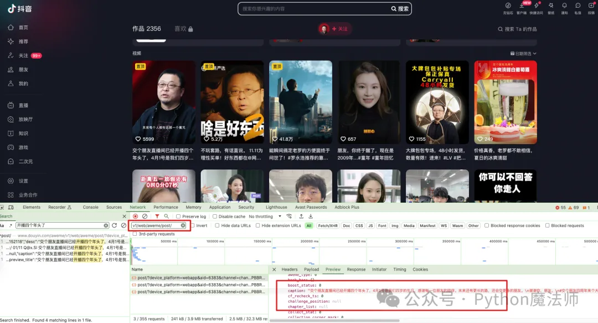
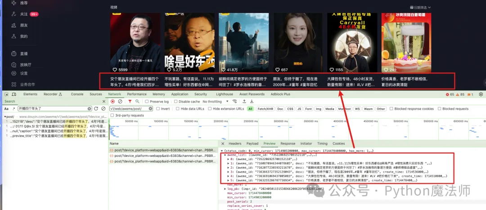
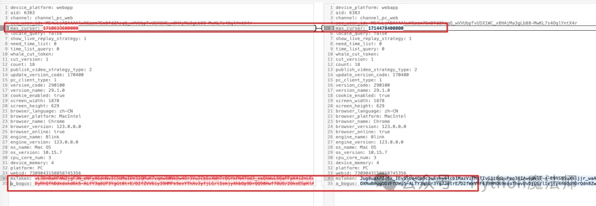
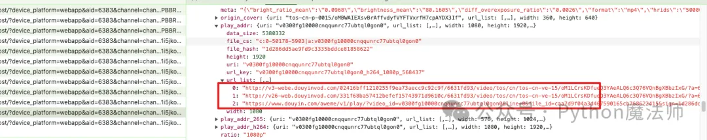
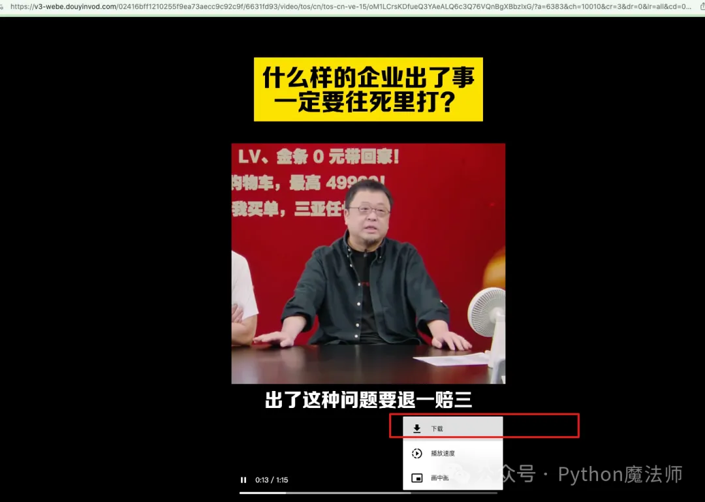
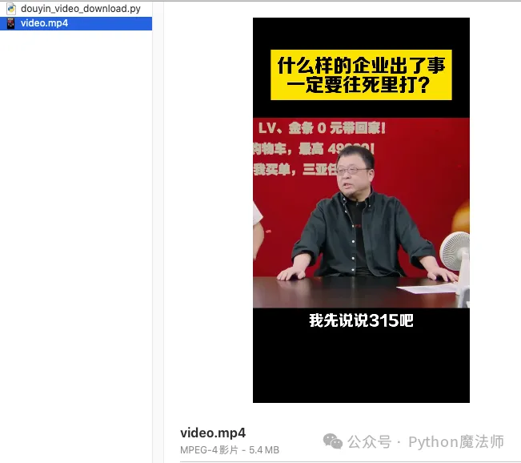
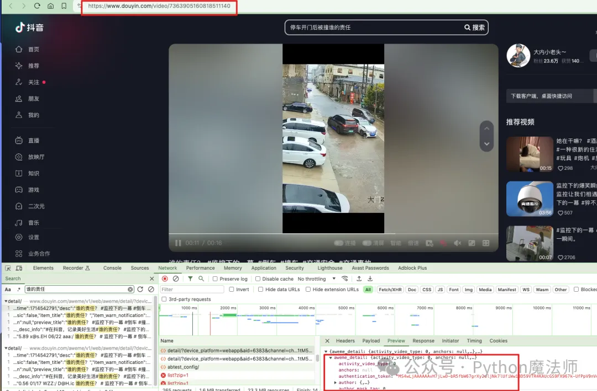

# Python 爬虫

# 爬虫知识，从入门到精通

网络爬虫（Web Scraping 或 Web Crawling）是一种用于自动化获取网络上信息的技术。这里，我将尽量概述从入门到精通的各个阶段应掌握的知识。

### 入门阶段

1. **基础编程知识**：掌握一门编程语言，通常是 Python。
2. **HTTP 协议基础**：了解 HTTP 请求和响应的基本概念。
3. **HTML 和 CSS 基础**：理解 DOM 结构，以及如何使用 CSS 选择器。
4. **基础库和工具**：熟悉如 Requests、BeautifulSoup 或 lxml。
5. **简单的文本处理**：能够解析和提取需要的信息。
6. **文件操作**：读写文件，通常是文本或 CSV 格式。

### 进阶阶段

1. **JavaScript 基础**：了解如何处理动态网站。
2. **更高级的库和工具**：如 Selenium、Scrapy 或 Puppeteer。
3. **API 交互**：了解如何使用 API 获取数据。
4. **数据存储**：掌握如何使用数据库，通常是 SQL 或 NoSQL。
5. **数据清洗**：使用 Pandas 或其他工具进行数据处理。
6. **异常处理**：能够处理各种网络异常和错误。
7. **爬虫策略**：了解如何避免被封禁，例如设置合适的延迟、使用代理等。

### 高级阶段

1. **分布式爬虫**：使用多台机器或云服务来进行爬取。
2. **反反爬虫策略**：能够处理复杂的反爬机制。
3. **数据分析与可视化**：使用工具如 Matplotlib、Tableau 或 Power BI 进行数据分析。
4. **自然语言处理（NLP）**：对抓取的文本数据进行更深入的分析。
5. **机器学习与图像识别**：用于处理更为复杂的数据形式或验证码。
6. **流程自动化**：自动化整个数据获取、处理和存储的流程。
7. **合法与伦理考量**：了解相关法律法规，确保爬虫活动是合法和道德的。

### 精通阶段

1. **大数据处理**：能够处理大规模数据的存储和分析。
2. **实时爬取与分析**：实现几乎实时的数据获取和分析。
3. **自适应爬虫**：能够自动适应网站结构或内容的变化。
4. **高级监控与报告**：构建高级的监控系统，及时报告各种指标和可能的问题。
5. **安全性**：高度关注爬虫和数据存储的安全性问题。
6. **商业应用与咨询**：能够为企业构建和维护爬虫系统，或提供相关的咨询服务。

在不同的阶段，除了技术能力之外，对项目管理、团队协作、代码质量等软性技能的掌握也非常重要。而且，随着大数据和 AI 技术的发展，网络爬虫的应用场景和相关技术也在不断演进，持续学习和适应是非常必要的。

爬取策略是网络爬虫在执行网页抓取任务时所遵循的规则或策略。这些策略决定了爬虫如何从一个页面转到另一个页面，什么时间进行抓取，以及应该抓取哪些内容。以下是几种常见的爬取策略：

**常见的爬虫策略**

**深度优先搜索（DFS）**

在这种策略下，爬虫会尽可能深入地遍历一个网站。也就是说，它会从一个页面开始，然后跟踪该页面上的第一个链接，然后继续跟踪找到页面上的第一个链接，如此往复。

**广度优先搜索（BFS）**

在广度优先搜索策略下，爬虫会首先访问初始页面上的所有链接，然后再转向这些链接的页面，依此类推。

**PageRank**

这种策略模仿了谷歌的搜索算法。它不仅考虑页面间的链接，还考虑页面的“重要性”。这通常需要预先计算或者实时更新。

**反向链接策略**

这种策略会查找指向特定页面的所有链接，以确定这个页面的价值或相关性。

**随机遍历**

这种策略不按照任何特定顺序遍历链接，而是随机选择下一个要访问的页面。

**按需爬取**

这是一种更为复杂的策略，通常基于用户需求或预先设定的条件来抓取数据。

**遵守 Robots 协议**

大多数网站都有一个 `robots.txt` 文件，该文件描述了哪些页面可以抓取，哪些不可以。遵循这些规则是良好网络公民的标志。

**延迟和时间策略**

避免在短时间内发送大量的请求，以免给网站服务器造成负担。

**重试策略**

如果某个页面暂时无法访问，应该设置一个重试策略。

**数据去重**

在多次爬取和更新过程中，需要有策略去除重复的数据。

**用户代理和头信息**

合理设置用户代理和请求头，以模拟不同的浏览器和设备，有时这也是为了遵守网站的使用政策。

**失败恢复**

保存爬虫的状态，以便在出现问题时可以从断点恢复。

**IP 轮换和代理**

为了避免被封锁，一些爬虫会使用多个 IP 地址或代理服务器。

每种策略都有其优缺点，通常最好的做法是结合多种策略，以适应不同的爬取需求和场景。

**常见的反爬虫策略**

反爬虫策略是一组用于防止或限制自动化网络爬虫（或称为网络蜘蛛、抓取器）访问网站内容的技术和方法。由于爬虫可能导致服务器压力增加、消耗带宽或滥用获取的数据，因此许多网站都会使用一定的反爬虫策略。

下面是一些常见的反爬虫策略：

**Robots.txt 文件**

通过在网站根目录下放置一个 `robots.txt` 文件，网站所有者可以指明哪些页面或路径是禁止爬取的。

**用户代理（User-Agent）检测**

服务器会检查请求的用户代理字段，如果判断为爬虫或非常规浏览器，可能会拒绝访问。

**IP 地址限制**

当从同一个 IP 地址来的请求量异常高时，服务器可能会限制或封禁该 IP 地址。

**速率限制**

限制单个用户（通常通过 IP 地址或会话标识符）在特定时间内的请求次数。

**验证码**

在多次连续请求后，或在触发某种模式后，要求用户输入验证码。

**JavaScript 挑战**

一些网站使用 JavaScript 生成页面内容或执行某种计算，然后将结果用于验证。这样做的目的是因为大多数基础爬虫不执行 JavaScript。

**AJAX 数据加载**

数据并不直接嵌入在 HTML 页面中，而是通过 JavaScript 异步加载。这增加了爬虫获取数据的复杂性。

**Cookie 和 Session 检查**

检查请求是否携带了有效的 Cookie 和 Session 信息，如果没有，可能会被视为非法访问。

**Honey Pot**

设置一些对正常用户不可见，但对爬虫可见的“陷阱”链接。如果访问了这些链接，则很可能是爬虫。

**动态改变网页结构**

不定期地改变网页的 HTML 结构和 CSS 选择器，这样基于旧结构编写的爬虫程序将无法正常工作。

**HTTP Header 检查**

除了检查用户代理外，还可以检查其它 HTTP 头信息，如`Referer`、`Origin`等，来确定请求是否合法。

**时间戳检查**

验证请求之间的时间间隔，如果过于快速，可能是自动化操作。

**Web Application Firewalls (WAF)**

使用 Web 应用防火墙来识别并阻止爬虫或恶意请求。

请注意，过度使用反爬虫措施可能会影响网站的用户体验。因此，在实施这些措施时应当权衡各方面的因素。同时，也应注意法律和伦理问题，确保这些措施不违反相关法律规定。

常见反反爬策略

反反爬策略是一种用于应对反爬虫机制的手段。这通常涉及模仿人类用户行为、使用更复杂的请求头、设置合适的延迟、使用代理等。然而，值得注意的是，在不具备明确许可的情况下对一个网站使用这些手段可能是违法的，或者至少是不道德的。因此，在应用这些策略之前，一定要仔细阅读并理解目标网站的服务条款。

以下是一些常用的反反爬策略：

**修改用户代理（User-Agent）**

使用不同的用户代理字符串以模仿不同的浏览器和设备。

**IP 代理和轮换**

使用多个 IP 地址或代理服务以规避 IP 限制。

**请求头定制**

模仿常规浏览器行为，如设置合适的`Referer`、`Accept-Language`等 HTTP 头信息。

**遵守 Robots.txt**

虽然这并不是一种反反爬策略，但遵守网站的 `robots.txt` 文件是合法和道德爬取的基础。

**动态延时**

设置动态的请求间隔时间，尽量模仿人类行为，避免触发速率限制。

**模拟登录和保持会话**

对于需要登录才能访问的网站，模拟登录过程并保持会话。

**JavaScript 执行**

使用如 Selenium、Puppeteer 等工具来执行 JavaScript，以获取动态加载的内容。

**分布式爬虫**

使用多台机器或多个云服务进行爬取，以分散单一点的请求压力。

**分析和适应**

有些网站会定期更改其 HTML 结构或 JavaScript 代码，以阻断爬虫。持续监控并适应这些变化是很重要的。

**验证码处理**

使用图像识别或其他机器学习算法来自动解决验证码。

**数据指纹和哈希避免**

有时服务器通过检测请求参数或页面交互行为的模式来识别爬虫。在这种情况下，可以尝试通过随机化这些信息来避免被检测。

**使用第三方 API 或数据源**

有时候，网站或服务提供了 API，或者有第三方服务提供了相同或类似的数据，合法使用这些 API 通常比爬取网页更为可靠和高效。

**Web 应用防火墙（WAF）绕过**

识别并绕过 Web 应用防火墙的特定规则，这通常涉及对请求头、参数或路径的细微调整。

请再次注意，这些策略可能触及法律问题，因此在应用之前务必进行适当的法律咨询。

# Python 爬虫入门指南

## 1.Python 爬虫概述与基本概念

在如今这个信息爆炸的时代，数据量呈现出井喷式增长，Python 爬虫作为一种获取数据的便捷手段，逐渐成为程序员的必备技能。Python 爬虫，顾名思义，就是利用 Python 编程语言对网络数据进行抓取、解析和处理的技术。它可以帮助我们从网页中提取有用信息，为数据分析和挖掘提供原始数据支持。接下来，我们将分别介绍 Python 爬虫的基本概念、常用工具与库。

首先，让我们了解一下 Python 爬虫的基本概念。网络爬虫，又称网络蜘蛛，是一种自动获取网页信息的程序。它按照一定的规则和策略，模拟浏览器访问网页，从而获取页面内容。爬虫的核心任务是解决三个问题：如何抓取网页内容、如何解析网页数据以及如何存储和处理获取到的数据。

## 2. Python 爬虫工具与库介绍

**接下来，我们来介绍一些 Python 爬虫中常用的工具与库。在实际应用中，Python 爬虫主要依赖于以下几个库：**

1. Requests：一个用于发送 HTTP 请求的库，可以方便地获取网页内容。
2. BeautifulSoup：一个用于解析 HTML 和 XML 文档的库，可以轻松地提取页面中的有用信息。
3. Scrapy：一个强大的爬虫框架，可以快速地构建定制化的爬虫程序。
4. PyQuery：一个基于 jQuery 语法的解析库，适用于处理现代网页结构。
5. Selenium：一个可用于模拟浏览器行为的库，支持多种浏览器和操作系统。

掌握这些库和工具，将有助于提高爬虫开发的效率和稳定性。

**在实际进行 Python 爬虫开发时，还需注意以下几点：**

1. 遵守网站的 robots.txt 协议，遵循合理的爬虫策略，避免对目标网站造成过多负担。
2. 合理设置爬取间隔，以免触发网站的反爬虫机制。
3. 使用代理 IP 和用户代理，增加爬虫的隐蔽性。
4. 针对目标网站的动态加载数据，可以使用 Javascript 钩子或异步请求等技术进行抓取。
5. 注重数据存储和处理，确保数据的完整性和准确性。

接下来的部分将详细介绍网络数据抓取方法与技巧、网页解析与数据提取技术、数据存储与处理方法，并通过实战案例与项目实践经验分享，帮助您更好地入门 Python 爬虫。在这个过程中，希望您能够不断积累经验，掌握更多技巧，成为一名出色的 Python 爬虫开发者。

## 3. 网络数据抓取方法与技巧

**在 Python 爬虫中，网络数据抓取方法与技巧是至关重要的。它们可以帮助我们更有效地获取所需数据，提高爬虫的稳定性和效率。以下是一些常用的网络数据抓取方法与技巧：**

1. 使用 HTTP 请求库（如 Requests）发送请求，获取网页内容。此外，我们还需了解如何处理 HTTP 状态码、设置请求头（User-Agent）以及处理响应内容。
2. 针对网页的动态加载数据，可以使用 Selenium 模拟浏览器行为，或者使用 Javascript 钩子（如 eval()函数）等技术进行抓取。
3. 使用代理 IP 和用户代理，以增加爬虫的隐蔽性，避免被目标网站识别和封禁。
4. 合理设置爬取间隔，遵循网站的 robots.txt 协议，以免对目标网站造成负担。
5. 处理反爬虫措施，如使用随机 User-Agent、设置请求头中的“Referer”字段等

## 4. 网页解析与数据提取技术

**在获取到网页内容后，我们需要对其进行解析，提取出有用的数据。这里涉及到两种主要的网页解析方法：**

使用 HTML/XML 解析库（如 BeautifulSoup、PyQuery 等）对网页进行解析。这类库可以轻松地定位到网页中的元素，提取出我们需要的数据。在使用这类库时，了解 HTML/XML 标签和属性至关重要。

**使用 Javascript 解析库（如 SoupSelect、Cheerio 等）处理动态加载的网页数据。这类库可以解析现代网页结构，支持 JavaScript 渲染的内容提取。 此外，在数据提取过程中，我们还需注意以下几点：**

1. 处理网页中的编码问题，如 UTF-8、GBK 等。
2. 处理乱码和异常情况，如网页内容编码错误、字符串编码转换问题等。
3. 使用正则表达式或其他文本处理方法，提取网页中的有用信息。
4. 对于复杂或嵌套的结构，可以使用递归算法或递归解析技术进行处理。

通过以上网络数据抓取方法与网页解析技术，我们可以更加高效地获取和提取所需数据，为数据分析和挖掘奠定基础。在接下来的部分，我们将介绍数据存储与处理方法，以及实战案例和项目实践经验，帮助您更好地入门 Python 爬虫。

## 5. 数据存储与处理方法

**在完成网页数据抓取和解析后，我们需要将提取到的数据进行存储和处理。数据存储方法可以根据实际需求和场景进行选择，以下是一些常见的数据存储方法**：

（1）CSV：适用于结构简单、数据量不大的情况，易于读取和处理。

（2）Excel：适用于轻度结构化数据存储，支持公式、图表等高级功能。

（3）JSON：适用于轻量级数据存储，易于传输和解析。

（4）SQL 数据库：适用于结构复杂、数据量较大的场景，支持查询和关联操作。

**在数据处理方面，我们需要根据实际需求进行数据清洗、转换、统计和分析等操作。以下是一些常用的数据处理方法：**

（1）使用 Python 内置的 NumPy、Pandas 等库进行数据处理和分析。

（2）使用数据可视化库（如 Matplotlib、Seaborn 等）进行数据可视化展示。

（3）运用机器学习算法对数据进行挖掘和预测。

## 6.实战案例与项目实践经验分享

为了帮助您更好地入门 Python 爬虫，这里分享两个实战案例和项目实践经验：

案例一：爬取豆瓣电影 TOP 250 影评数据 本项目使用 Python 爬虫抓取豆瓣电影 TOP 250 的影评数据，包括电影名称、导演、主演、评分等信息。项目采用 Requests 和 BeautifulSoup 库进行网络数据抓取和解析，使用 Pandas 库进行数据存储和处理。具体实现过程如下：

（1）分析目标网站的结构，找到影评数据的 URL 和数据模板。

（2）编写爬虫程序，模拟浏览器访问，获取影评数据。

（3）对获取到的数据进行解析，提取有用信息，存储为 CSV 文件。

（4）使用 Pandas 库对数据进行清洗和处理，如去除空值、合并字段等。

（5）利用数据可视化库对影评数据进行可视化展示。

案例二：电商网站价格监控系统 本项目旨在监控电商网站（如淘宝、京东等）特定商品的价格变化。项目采用 Python 爬虫定时抓取商品页面信息，使用自然语言处理技术对价格进行提取和分析，实时监控价格波动。项目实践经验如下：

（1）根据目标网站的页面结构和商品信息模板，编写爬虫程序。

（2）使用代理 IP 和用户代理，设置合理的爬取间隔，遵循网站的 robots.txt 协议。

（3）对抓取到的数据进行解析和处理，提取商品价格信息。

（4）利用 Python 消息队列（如 RabbitMQ）实现爬虫任务调度和结果通知。

（5）结合机器学习算法，对价格波动进行预测和分析。

# 抖音无水印视频 URL 地址提取和视频快速下载

## 一、采集背景

本次实验案例是下载抖音某用户下的视频以及视频 URL 地址提取。

## 二、需求分析

### 2.1、用户主页链接了解

随便打开一个抖音用户，这里我们打开脱口秀的鼻祖老罗的主页。

> 交个朋友直播间：https://www.douyin.com/user/MS4wLjABAAAAlwXCzzm7SmBfdZAsqQ_wVVUbpTvUSX1WC_x8HAjMa3gLb88-MwKL7s4OqlYntX4r

注意：上面 user 后面的 id 比较长，以前是数字形式，现在改成这种字母+数字的组合了

当你从手机抖音上点【分享主页】-【复制链接】后，把链接输入浏览器地址栏里，会发现就自动转换为这个长地址。

例如：`https://v.douyin.com/i2NLeaJr/ 9@7.com :7pm`这个是手机里分享出来的链接，粘贴到浏览器后会变成`https://www.douyin.com/user/MS4wLjABAAAAlwXCzzm7SmBfdZAsqQ_wVVUbpTvUSX1WC_x8HAjMa3gLb88-MwKL7s4OqlYntX4r`

### 2.2、分析视频链接

了解完用户链接的形式后，接下来分析需求。

随便搜索一下用户的视频作品，开发者模式下，随便点击一个请求，搜索`开播四个年头了`



发现请求地址是`https://www.douyin.com/aweme/v1/web/aweme/post`后面跟着一大堆参数



鼠标在页面上滚动，向下翻动几页。可以看到每次滚动时确实也发了请求，但是请求参数中只有 3 个参数一直在变化。



这里我们不深入研究这些 token 是怎么生成的，本节我们重点讲解视频下载。

分析接口返回的 json 数据，可以发现在 list 的每个元素中有 video 等 url_list 参数值。



**视频 URL 参数值位置： `aweme_list>video>play_addr>url_list`**

尝试了几个可以看到每个视频都有 3 个 URL 地址，随便复制打开一个。



把地址在浏览器中打开，就出现熟悉的画面，并且该视频是直接可以下载的。

手动下载完后，本地播放正常。


## 三、代码实现

经过以上分析，我们清楚了怎么拿到视频下载地址

**代码实现**

由于请求接口中参数很多，还有反爬策略，研究起来很困难，本次代码我们未说明如何登录，获取用户主页，以及请求`https://www.douyin.com/aweme/v1/web/aweme/post`获取用户视频作品这些步骤了，大家可以自己私下研究。

这里，我们假设你已经拿到了刚才的 url_list 中的视频地址，那么直接写个 Python 函数来处理下载动作即可。

**根据 URL 下载视频代码：**

```python

import requests

# 视频URL
url = 'http://v3-webe.douyinvod.com/02416bff1210255f9ea73aecc9c92c9f/6631fd93/video/tos/cn/tos-cn-ve-15/oM1LCrsKDfueQ3YAeALQ6c3Q76VQnBgXBbzIxG/?a=6383&ch=10010&cr=3&dr=0&lr=all&cd=0%7C0%7C0%7C3&cv=1&br=555&bt=555&cs=0&ds=4&ft=3X_zklXvvBQ3AUq8yq8Z.C~km4Z1mApGclbyS6BJE.F&mime_type=video_mp4&qs=0&rc=ODc1OzpmOTM4OWdkMzw6ZEBpM3IzdGU6ZnF0cTMzNGkzM0AuLzMzXzIuNjQxMDFjYV5gYSNrZGlxcjRvcm5gLS1kLTBzcw%3D%3D&btag=80000e00028000&cquery=101r_100B_100x_100z_100a&dy_q=1714548536&feature_id=46a7bb47b4fd1280f3d3825bf2b29388&l=20240501152855BABC6723A9A22EF420BC'

# 发送请求
response = requests.get(url, stream=True)

# 检查请求是否成功
if response.status_code == 200:
    # 打开文件进行写入
    with open('video.mp4', 'wb') as f:
        # 写入响应内容
        for chunk in response.iter_content(chunk_size=1024):
            if chunk:  # 过滤掉保持连接的chunk
                f.write(chunk)
    print('视频下载成功')
else:
    print('视频下载失败，状态码:', response.status_code)
```

注意：这段代码假定视频 URL 是直接指向视频文件的，并且服务器允许通过 HTTP 请求直接下载视频。如果视频受到版权保护或有特殊的下载要求，直接下载可能不被允许，或者需要额外的认证步骤。

运行代码，下载成功



并且也可以正常播放。


还有另外一种视频 URL 形式比较常见，就是`https://www.douyin.com/video/7363905160818511140`



这种形式的 URL 视频，其实也是一样，URL 地址在`https://www.douyin.com/aweme/v1/web/aweme/detail/`接口中

# 总结

1.手机上分享出来的链接地址，大多数都是短链接，粘贴到浏览器后会自动转为长链接 2.长链接的 url_list 中视频播放地址中有 3 个，随便选择一个都可以打开（为什么 3 个我也不清楚）3.通过以上方式，即使不写代码，也是可以非常方便的下载视频，然市面上有很多这种工具。

# 爬虫文章

[爬虫入门-js 端 cookie 反爬与无限 debugger (qq.com)](https://mp.weixin.qq.com/s/Awrsi-4cqUI7NCfvLgZ3Yg)

# Python 网络爬虫，怎样改造成并发爬取

### 背景目标

一个爬虫程序，默认情况下，是单线程爬取的，速度会比较慢

如果改造成多线程爬取，就可以利用多 CPU 能力，加速爬取。

如下代码，爬取了一个小说的内容，存储到文件里。

```python
import requests
from bs4 import BeautifulSoup

headers = {
    "User-Agent": "Mozilla/5.0 (Windows NT 10.0; Win64; x64) AppleWebKit/537.36 (KHTML, like Gecko) Chrome/123.0.0.0 Safari/537.36"
}
root_url = "http://antpython.net/novels/01.html"

resp_root = requests.get(root_url, headers=headers)

soup = BeautifulSoup(resp_root.text, "html.parser")

chapter_links = soup.find("div", id="novel_chapters").find_all("div", class_="chapter_link")

import time

start = time.time()
# file out
fout = open("小说.txt", "w", encoding="utf8")
count = len(chapter_links)
for idx, chapter_link in enumerate(chapter_links):
    link = chapter_link.find("a")
    href = "http://antpython.net%s" % link["href"]
    title = link.get_text()

    print("爬取链接：", href, title, idx, count, idx / count * 100)
    resp_cont = requests.get(href, headers=headers)
    soup_cont = BeautifulSoup(resp_cont.text, "html.parser")
    cont = soup_cont.find("div", id="chapter_content").get_text()
    fout.write(title + "\n")
    fout.write(cont + "\n")

fout.close()
print("爬取时间：", time.time() - start)
```

执行后，看到花费时间为爬取时间：56.08 秒钟。

### 代码改造

需要注意的是，如果是并发爬取，那么爬取的顺序是不一致的。我们可以给每次 URL 给一个序号，将来做排序。

#### 首先，将每章爬取改造成函数

```python
def craw_single(index, title, chapter_link):
    """爬取单章内容，返回需要、标题、内容"""
    resp_cont = requests.get(chapter_link, headers=headers)
    soup_cont = BeautifulSoup(resp_cont.text, "html.parser")
    cont = soup_cont.find("div", id="chapter_content").get_text()
    return index, title, cont
```

其中 index 参数，纯粹是为了将来的排序使用。

#### 然后，启动每章的爬取，提交给线程池

```python
import time

start = time.time()
count = len(chapter_links)
pool = ThreadPoolExecutor()
futures = []
for idx, chapter_link in enumerate(chapter_links):
    link = chapter_link.find("a")
    href = "http://antpython.net%s" % link["href"]
    title = link.get_text()

    futures.append(pool.submit(craw_single, index=idx, title=title, chapter_link=href))
```

我们使用 pool.submit 做任务的提交，然后用 futures 收集 future 的结果对象。

#### 等待所有线程的结束

```python
results = []
for future in concurrent.futures.as_completed(futures):
    results.append(future.result())
```

该代码会挨个等待子线程的结束。将结果 future.result()，也就是函数的返回数据，存入列表中

#### 将结果存入文件

```python
results.sort(key=lambda x: x[0])
with open("小说结果.txt", "w", encoding="utf8") as fout:
    for index, title, cont in results:
        fout.write(title + "\n")
        fout.write(cont + "\n")
pool.shutdown()
print("爬取时间：", time.time() - start)
```

这里对数据做了排序，按章节的顺序。

然后打开文件写入内容。

最后关闭了线程池。

### 总结

要把任务改造成多线程，先把要拆分的任务改成单个函数。然后用线程池做任务提交。都提交后，可以等待获取任务的返回。对返回数据做处理后，写出到文件里。

# MediaCrawler 小红书爬虫源码分析

## **前言**

MediaCrawler 是最近冲上 Github 热搜的开源多社交平台爬虫。虽然现在已删库，但还好我眼疾手快，有幸还 Fork 了一份，乘着周末，简单分析了下小红书平台的相关代码。

## **爬虫难点**

一般写爬虫，都需要面对以下几个问题

1. 如果 app/网页需要登录，如何获取登录态（cookie/jwt）
2. 大部分 app/网页都会对请求参数进行 sign，如果有，如何获取 sign 逻辑
3. 绕过其它遇到的反爬措施

我将带着这三个问题，阅读 MediaCrawler 小红书代码，看看 MediaCrawler 是怎么处理的。

## **获取登录态**

提供了三种方式

1. QRCode （login_by_qrcode）
2. 手机号 (login_by_mobile)
3. Cookie (login_by_cookies)

登录相关代码都在 `media_platform/xhs/login.py` 文件中

### **QRCode 登录**

实现代码为 `login_by_qrcode` 方法。代码为:

```python
async def login_by_qrcode(self):
    """Login to Xiaohongshu website and keep webdriver login state."""
    utils.logger.info("[XHSLogin.login_by_qrcode] Begin login to Xiaohongshu by QR code...")
    qrcode_img_selector = "xpath=//img[@class='qrcode-img']"

    # Find login QR code
    base64_qrcode_img = await utils.find_login_qrcode(
        self.context_page,
        selector=qrcode_img_selector
    )
    if not base64_qrcode_img:
        utils.logger.info("[XHSLogin.login_by_qrcode] Login failed, QR code not found, please check....")

        # If this website does not automatically popup login dialog box,
        # we will manually click login button
        await asyncio.sleep(0.5)
        login_button_ele = self.context_page.locator("xpath=//*[@id='app']/div[1]/div[2]/div[1]/ul/div[1]/button")
        await login_button_ele.click()
        base64_qrcode_img = await utils.find_login_qrcode(
            self.context_page,
            selector=qrcode_img_selector
        )
        if not base64_qrcode_img:
            sys.exit()

    # Get not logged session
    current_cookie = await self.browser_context.cookies()
    _, cookie_dict = utils.convert_cookies(current_cookie)
    no_logged_in_session = cookie_dict.get("web_session")

    # Show login QR code
    # We need to use partial function to call show_qrcode function and run in executor
    # then current asyncio event loop will not be blocked
    partial_show_qrcode = functools.partial(utils.show_qrcode, base64_qrcode_img)
    asyncio.get_running_loop().run_in_executor(executor=None, func=partial_show_qrcode)

    utils.logger.info(f"[XHSLogin.login_by_qrcode] Waiting for scan code login, remaining time is 120s")
    try:
        await self.check_login_state(no_logged_in_session)
    except RetryError:
        utils.logger.info("[XHSLogin.login_by_qrcode] Login to Xiaohongshu failed by QR code login method...")
        sys.exit()

    wait_redirect_seconds = 5
    utils.logger.info(f"[XHSLogin.login_by_qrcode] Login successful then wait for {wait_redirect_seconds} seconds redirect...")
    await asyncio.sleep(wait_redirect_seconds)
```

大致逻辑：

1. 启动 headless 浏览器并且 headless 模式必须设为 `False`, 因为不会把 QRCode 显示在终端或者通过信息转发服务转发到你的手机上

2. 通过`utils.find_login_qrcode`工具函数以及`qrcode_img_selector`获取 headless 浏览器所渲染页面中的 QRCode 图片元素

3. 如果没有获取到，则点击`login_button_ele` , 弹出登录对话框，然后再重复一次步骤 2，如果依旧没有获取到，则退出爬虫，爬取失败。

4. 如果获取到了，则等待用户扫码完成登录。

5. 其中可能会出现验证码的情况，此时会提示需要手动验证，**没有实现自动验证，需要人工手动操作干预。**

   ```python
   async def check_login_state(self, no_logged_in_session: str) -> bool:
     # ......

       if "请通过验证" in await self.context_page.content():
           utils.logger.info("[XHSLogin.check_login_state] A verification code appeared during the login process, please verify manually.")

     # ......
   ```

### **手机号登录**

实现代码为 `login_by_mobile` 方法。代码为:

```python
async def login_by_mobile(self):
    """Login xiaohongshu by mobile"""
    utils.logger.info("[XHSLogin.login_by_mobile] Begin login xiaohongshu by mobile ...")
    await asyncio.sleep(1)
    try:
        # 小红书进入首页后，有可能不会自动弹出登录框，需要手动点击登录按钮
        login_button_ele = await self.context_page.wait_for_selector(
            selector="xpath=//*[@id='app']/div[1]/div[2]/div[1]/ul/div[1]/button",
            timeout=5000
        )
        await login_button_ele.click()
        # 弹窗的登录对话框也有两种形态，一种是直接可以看到手机号和验证码的
        # 另一种是需要点击切换到手机登录的
        element = await self.context_page.wait_for_selector(
            selector='xpath=//div[@class="login-container"]//div[@class="other-method"]/div[1]',
            timeout=5000
        )
        await element.click()
    except Exception as e:
        utils.logger.info("[XHSLogin.login_by_mobile] have not found mobile button icon and keep going ...")

    await asyncio.sleep(1)
    login_container_ele = await self.context_page.wait_for_selector("div.login-container")
    input_ele = await login_container_ele.query_selector("label.phone > input")
    await input_ele.fill(self.login_phone)
    await asyncio.sleep(0.5)

    send_btn_ele = await login_container_ele.query_selector("label.auth-code > span")
    await send_btn_ele.click()  # 点击发送验证码
    sms_code_input_ele = await login_container_ele.query_selector("label.auth-code > input")
    submit_btn_ele = await login_container_ele.query_selector("div.input-container > button")
    redis_obj = redis.Redis(host=config.REDIS_DB_HOST, password=config.REDIS_DB_PWD)
    max_get_sms_code_time = 60 * 2  # 最长获取验证码的时间为2分钟
    no_logged_in_session = ""
    while max_get_sms_code_time > 0:
        utils.logger.info(f"[XHSLogin.login_by_mobile] get sms code from redis remaining time {max_get_sms_code_time}s ...")
        await asyncio.sleep(1)
        sms_code_key = f"xhs_{self.login_phone}"
        sms_code_value = redis_obj.get(sms_code_key)
        if not sms_code_value:
            max_get_sms_code_time -= 1
            continue

        current_cookie = await self.browser_context.cookies()
        _, cookie_dict = utils.convert_cookies(current_cookie)
        no_logged_in_session = cookie_dict.get("web_session")

        await sms_code_input_ele.fill(value=sms_code_value.decode())  # 输入短信验证码
        await asyncio.sleep(0.5)
        agree_privacy_ele = self.context_page.locator("xpath=//div[@class='agreements']//*[local-name()='svg']")
        await agree_privacy_ele.click()  # 点击同意隐私协议
        await asyncio.sleep(0.5)

        await submit_btn_ele.click()  # 点击登录

        # todo ... 应该还需要检查验证码的正确性有可能输入的验证码不正确
        break

    try:
        await self.check_login_state(no_logged_in_session)
    except RetryError:
        utils.logger.info("[XHSLogin.login_by_mobile] Login xiaohongshu failed by mobile login method ...")
        sys.exit()

    wait_redirect_seconds = 5
    utils.logger.info(f"[XHSLogin.login_by_mobile] Login successful then wait for {wait_redirect_seconds} seconds redirect ...")
    await asyncio.sleep(wait_redirect_seconds)
```

大致逻辑：

1. 启动 headless 浏览器

2. 点击 `login_button_ele` , 弹出登录对话框

3. 获取 phone `input_ele`，并填入手机号

   ```python
   login_container_ele = await self.context_page.wait_for_selector("div.login-container")
   input_ele = await login_container_ele.query_selector("label.phone > input")
   await input_ele.fill(self.login_phone)
   ```

4. 点击`send_btn_ele`， 发送验证码

5. 每隔 1 秒从 Redis 数据库中获取验证码。如果 120 秒后，依旧没有获取到，则退出爬虫，爬取失败

6. 如果获取到了，则将验证码，填入验证码输入框(`sms_code_btn_ele`)，并勾选同意隐私协议按钮（`agree_privacy_ele`）以及提交按钮(`submit_btn_ele`)

7. 因为依赖了 Redis 数据库组件，所以可以通过短信转发软件或者短信获取接口实现短信验证码输入的自动化，实现自动化手机号登录

8. 1. 代码中**没有检测验证码的正确性。**
   2. 代码中**没有登录失败重试机制**

### **Cookie 登录**

实现代码为 `login_by_cookies` 方法。就是将用户提供的 `cookie(web_session)`信息放到`browser_context` 中

```python
async def login_by_cookies(self):
    for key, value in utils.convert_str_cookie_to_dict(self.cookie_str).items():
        if key != "web_session":  # Only set web_session cookie attribute
            continue

        await self.browser_context.add_cookies([
            {
                'name': key,
                'value': value,
                'domain': ".xiaohongshu.com",
                'path': "/"
            }
        ])
```

## **Sign 签名算法**

小红书浏览器端接口有做`sign`验签，MediaCrawler 生成 `sign`相关参数的代码位于 `media_platform/xhs/client.py` 文件中的 `_pre_headers` 方法。代码如下:

```python
async def _pre_headers(self, url: str, data=None) -> Dict:
    encrypt_params = await self.playwright_page.evaluate("([url, data]) => window._webmsxyw(url,data)", [url, data])
    local_storage = await self.playwright_page.evaluate("() => window.localStorage")
    signs = sign(
        a1=self.cookie_dict.get("a1", ""),
        b1=local_storage.get("b1", ""),
        x_s=encrypt_params.get("X-s", ""),
        x_t=str(encrypt_params.get("X-t", ""))
    )

    headers = {
        "X-S": signs["x-s"],
        "X-T": signs["x-t"],
        "x-S-Common": signs["x-s-common"],
        "X-B3-Traceid": signs["x-b3-traceid"]
    }
    self.headers.update(headers)
    return self.headers
```

1. 没有逆向后用 Python 重新实现`window._webmsxyw`函数，而是通过 `self.playwright_page.evaluate("([url, data]) => window._webmsxyw(url,data)", [url, data])` 直接主动调用浏览器运行时中的 `window._webmsxyw` 生成 `encrypt_params`
2. 通过`self.playwright_page.evaluate("() => window.localStorage")` 获取浏览器`local_storage`对象
3. 将 `cookie` 中的 `a1`, `local_storage` 中的 `b1`, `encrypt_params` 中的 `X-s`, `encrypt_params` 中的 `X_t`, 作为参数传给 `sign`函数
4. `sign` 函数最终返回签名后的值`signs`
5. 将 `signs` 赋值给`headers`

所以主要签名逻辑就是 `sign` 函数，深入进去看下。代码位于 `media_platform/xhs/help.py` 文件。代码如下:

```python
def sign(a1="", b1="", x_s="", x_t=""):
    """
    takes in a URI (uniform resource identifier), an optional data dictionary, and an optional ctime parameter. It returns a dictionary containing two keys: "x-s" and "x-t".
    """
    common = {
        "s0": 5,  # getPlatformCode
        "s1": "",
        "x0": "1",  # localStorage.getItem("b1b1")
        "x1": "3.3.0",  # version
        "x2": "Windows",
        "x3": "xhs-pc-web",
        "x4": "1.4.4",
        "x5": a1,  # cookie of a1
        "x6": x_t,
        "x7": x_s,
        "x8": b1,  # localStorage.getItem("b1")
        "x9": mrc(x_t + x_s + b1),
        "x10": 1,  # getSigCount
    }
    encode_str = encodeUtf8(json.dumps(common, separators=(',', ':')))
    x_s_common = b64Encode(encode_str)
    x_b3_traceid = get_b3_trace_id()
    return {
        "x-s": x_s,
        "x-t": x_t,
        "x-s-common": x_s_common,
        "x-b3-traceid": x_b3_traceid
    }

def get_b3_trace_id():
    re = "abcdef0123456789"
    je = 16
    e = ""
    for t in range(16):
        e += re[random.randint(0, je - 1)]
    return e

def mrc(e):
    ie = [
        0, 1996959894, 3993919788, 2567524794, 124634137, 1886057615, 3915621685,
        2657392035, 249268274, 2044508324, 3772115230, 2547177864, 162941995,
        2125561021, 3887607047, 2428444049, 498536548, 1789927666, 4089016648,
        2227061214, 450548861, 1843258603, 4107580753, 2211677639, 325883990,
        1684777152, 4251122042, 2321926636, 335633487, 1661365465, 4195302755,
        2366115317, 997073096, 1281953886, 3579855332, 2724688242, 1006888145,
        1258607687, 3524101629, 2768942443, 901097722, 1119000684, 3686517206,
        2898065728, 853044451, 1172266101, 3705015759, 2882616665, 651767980,
        1373503546, 3369554304, 3218104598, 565507253, 1454621731, 3485111705,
        3099436303, 671266974, 1594198024, 3322730930, 2970347812, 795835527,
        1483230225, 3244367275, 3060149565, 1994146192, 31158534, 2563907772,
        4023717930, 1907459465, 112637215, 2680153253, 3904427059, 2013776290,
        251722036, 2517215374, 3775830040, 2137656763, 141376813, 2439277719,
        3865271297, 1802195444, 476864866, 2238001368, 4066508878, 1812370925,
        453092731, 2181625025, 4111451223, 1706088902, 314042704, 2344532202,
        4240017532, 1658658271, 366619977, 2362670323, 4224994405, 1303535960,
        984961486, 2747007092, 3569037538, 1256170817, 1037604311, 2765210733,
        3554079995, 1131014506, 879679996, 2909243462, 3663771856, 1141124467,
        855842277, 2852801631, 3708648649, 1342533948, 654459306, 3188396048,
        3373015174, 1466479909, 544179635, 3110523913, 3462522015, 1591671054,
        702138776, 2966460450, 3352799412, 1504918807, 783551873, 3082640443,
        3233442989, 3988292384, 2596254646, 62317068, 1957810842, 3939845945,
        2647816111, 81470997, 1943803523, 3814918930, 2489596804, 225274430,
        2053790376, 3826175755, 2466906013, 167816743, 2097651377, 4027552580,
        2265490386, 503444072, 1762050814, 4150417245, 2154129355, 426522225,
        1852507879, 4275313526, 2312317920, 282753626, 1742555852, 4189708143,
        2394877945, 397917763, 1622183637, 3604390888, 2714866558, 953729732,
        1340076626, 3518719985, 2797360999, 1068828381, 1219638859, 3624741850,
        2936675148, 906185462, 1090812512, 3747672003, 2825379669, 829329135,
        1181335161, 3412177804, 3160834842, 628085408, 1382605366, 3423369109,
        3138078467, 570562233, 1426400815, 3317316542, 2998733608, 733239954,
        1555261956, 3268935591, 3050360625, 752459403, 1541320221, 2607071920,
        3965973030, 1969922972, 40735498, 2617837225, 3943577151, 1913087877,
        83908371, 2512341634, 3803740692, 2075208622, 213261112, 2463272603,
        3855990285, 2094854071, 198958881, 2262029012, 4057260610, 1759359992,
        534414190, 2176718541, 4139329115, 1873836001, 414664567, 2282248934,
        4279200368, 1711684554, 285281116, 2405801727, 4167216745, 1634467795,
        376229701, 2685067896, 3608007406, 1308918612, 956543938, 2808555105,
        3495958263, 1231636301, 1047427035, 2932959818, 3654703836, 1088359270,
        936918000, 2847714899, 3736837829, 1202900863, 817233897, 3183342108,
        3401237130, 1404277552, 615818150, 3134207493, 3453421203, 1423857449,
        601450431, 3009837614, 3294710456, 1567103746, 711928724, 3020668471,
        3272380065, 1510334235, 755167117,
    ]
    o = -1

    def right_without_sign(num: int, bit: int=0) -> int:
        val = ctypes.c_uint32(num).value >> bit
        MAX32INT = 4294967295
        return (val + (MAX32INT + 1)) % (2 * (MAX32INT + 1)) - MAX32INT - 1

    for n in range(57):
        o = ie[(o & 255) ^ ord(e[n])] ^ right_without_sign(o, 8)
    rturn o ^ -1 ^ 3988292384
```

1. 这个`sign`函数没有像`window._webmsxyw` 方法一样，选择通过`self.playwright_page.evaluate`主动调用浏览器运行时中的`sign`相关方法，而是自己用 Python 实现。实现代码不再解释，就是逆向 JS 逻辑后，翻译成了 Python。
2. 对于为何选择自己用 Python 实现而不主动调用浏览器中的 JS 方法，我也咨询了下作者，作者表示，这里的代码冗余了

## **其它**

### **反反爬虫**

MediaCrawler 小红书爬虫，也做了一些反反爬虫措施，代码位于`media_platform/xhs/core.py` 中的 `start` 函数。

1. 通过注入`stealthjs`脚本，来反 headless 浏览器检测

   ```python
    # https://github.com/berstend/puppeteer-extra/tree/master/packages/extract-stealth-evasions
    await self.browser_context.add_init_script(path="libs/stealth.min.js")
   ```

2. 通过添加 `webId cookie` 来防止出现 `captcha` 滑块

   ```python
   await self.browser_context.add_cookies([
       {
           'name': "webId",
           'value': "xxx123",  # any value
           'domain': ".xiaohongshu.com",
           'path': "/"
       }
   ])
   ```

3. 支持设置 ip 代理来更改 ip 地址

   ```python
   if config.ENABLE_IP_PROXY:
       ip_proxy_pool = await create_ip_pool(config.IP_PROXY_POOL_COUNT, enable_validate_ip=True)
       ip_proxy_info: IpInfoModel = await ip_proxy_pool.get_proxy()
       playwright_proxy_format, httpx_proxy_format = self.format_proxy_info(ip_proxy_info)
   ```

### **数据爬取**

通过 `httpx`库发起 http 请求，请求时带上`cookie`以及 `sign`相关参数。请求是直接请求的 API, 所以没有任何 html 解析逻辑，当请求成功后，就会对数据进行一些处理，然后将数据入库。相关主要逻辑位于 `media_platform/xhs/core.py` 以及 `media_platform/xhs/client.py` 。由于比较简单，不再展开。

## **结语**

MediaCrawler 小红书爬虫是基于小红书浏览器端协议，实现了`sign`参数的获取，以及登录态的获取。`sign`参数的获取没有完全逆向 JS 逻辑并用 Python 实现，而是通过`self.playwright_page.evaluate` 主动调用了部分 JS 函数(`window._webmsxyw`)。登录态的获取，也是基于 headless 浏览器实现，QRCode 登录需要人工操作；手机号登录可以通过短信转发软件或者短信接收接口实现自动化登录，但没有做验证码检验，验证失败重试。可以通过`stealthjs` 来反 headless 浏览器检测。

# 爬虫代理

> 推荐个性价比很高的 IP 代理商：**https://yilian.top/**，需要使用或者更换代理商的友友们可以冲起来了；

[【爬虫福利】 代理平台：一连代理上线，给新人送福利了 (qq.com)](https://mp.weixin.qq.com/s/ze9s2_mhOweqy75uhEq4FQ)
