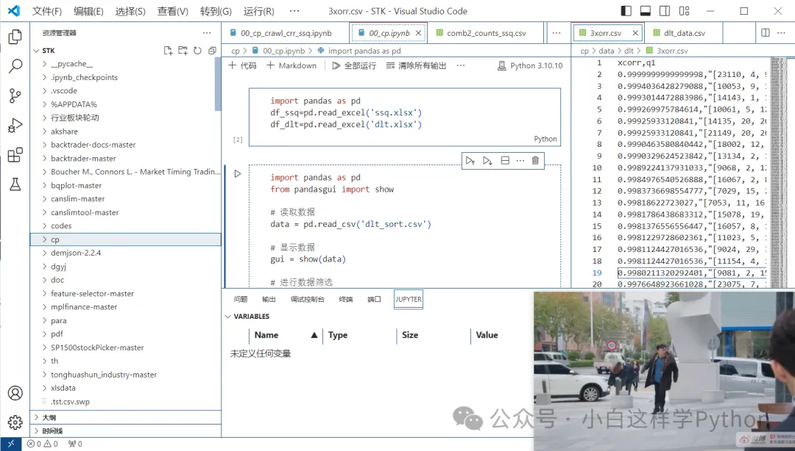

# Python版本和环境管理

**Python环境管理大比拼：pip、Conda、Pyenv、Rye、Virtualenv、PDM、Poetry等工具**

## 背景知识

当我开始使用 Python 并创建我的第一个包时，我很困惑。创建和管理包似乎比我预想的要困难得多。此外，存在多种工具，但我不确定该使用哪一种。我相信你们大多数人过去都遇到过同样的问题。Python 有无数的工具来管理虚拟环境和创建包，但很难（或几乎不可能）了解哪一个适合您的需求。存在一些关于该主题的演讲和博客文章，但它们都没有给出完整的概述或以结构化的方式评估这些工具。这就是这篇文章的主题。

## 工具分类

本文划分五个对于环境和包管理方面很重要的类别：

- Python 版本管理
- 包管理
- 环境管理（主要涉及虚拟环境）
- 包构建
- 包发布

正如下面的维恩图中所示，存在很多工具。有些是单一用途的，有些是多面手：


让我们从开发人员的角度来浏览一下这些类别：假设您同时处理个人项目和工作项目。在工作中，您使用的是 Python 3.7，而您的个人项目应该使用最新的 Python 版本（当前为 3.11）。换句话说：您希望能够安装不同的 Python 版本并在它们之间进行切换。这就是我们的第一个类别，**Python 版本管理**的内容。

在您的项目中，您正在使用其他软件包（例如 pandas 或 sklearn 用于数据科学）。这些是您必须安装和管理的项目的依赖项（例如，在发布新版本时进行升级）。这就是**包管理**的意义所在。

由于不同的项目可能需要同一包的不同版本，因此您需要创建（和管理）虚拟环境以避免依赖冲突。用于此目的的工具收集在环境管理类别中。大多数工具使用虚拟环境，但有些工具使用另一个称为 “本地包”（Local Packages） 的概念，我们稍后会讨论。

您可能希望与其他开发人员共享您的代码。为此，您首先必须构建包（包构建），然后才能将其发布到 PyPI 或其他索引（包发布）。

下面我们将更详细地了解每个类别，包括简短的定义、动机和可用的工具。我将在最后的单独部分中更详细地介绍一些单一用途工具和一些多用途工具。我们先从第一类开始：Python 版本管理。

## Python版本管理

### 定义

一个可以进行 Python 版本管理的工具，可以让你轻松安装 Python 版本并在它们之间切换。

### 动机

为什么我们要使用不同的 Python 版本？有几个原因。例如，您可能正在处理多个项目，其中每个项目都需要不同的 Python 版本。或者，您可能开发一个支持多个 Python 版本的项目，并且想要测试所有版本。除此之外，检查最新的 Python 版本所提供的功能，或者测试 Python 的预发布版本是否存在错误也是不错的选择。

### 工具

我们的维恩图显示了可用于 Python 版本管理的工具：pyenv, conda, rye 和 PyFlow。我们将首先在单独的部分中查看 pyenv 并考虑多用途工具。


Python 自带一个单一用途的工具，可让您安装和管理 Python 版本：pyenv！Pyenv 很容易使用。

[python 版本管理工具 pyenv-CSDN博客](https://blog.csdn.net/qq_41918571/article/details/107289747)

最重要的命令如下：

```bash
# 安装特定版本的 Python
pyenv install 3.10.4

# 在不同的 Python 版本之间切换

# 仅针对当前 shell 切换 Python 版本
pyenv shell <version> 
# 在这个目录下，自动使用某个 Python 版本
pyenv local <version> 
# 针对当前用户，全局设定 Python 版本
pyenv global <version> 
```

## （虚拟）环境管理

### 定义

环境管理工具，允许您创建和管理（虚拟）环境。

### 动机

为什么我们首先要使用环境？正如一开始提到的，项目有特定的要求（即它们依赖于其他包）。通常情况下，不同的项目需要同一包的不同版本。这可能会导致依赖冲突。此外，使用 pip install 安装包时可能会出现问题，因为该包与系统范围的 Python 安装一起放置。其中一些问题可以通过使用命令 --user 中的标志来解决。然而，这个选项可能并不是每个人都知道，尤其是初学者。

### 工具

许多工具允许用户创建和管理环境。它们是：venv, virtualenv, pipenv, conda, pdm, poetry, hatch, rye 和 PyFlow。其中只有两个是单一用途工具：venv 和 virtualenv。让我们先来看看这两个：


### venv

venv（[venv — Creation of virtual environments — Python 3.12.2 documentation](https://docs.python.org/3/library/venv.html)） 是用于创建虚拟环境的内置 Python 包。最重要的命令如下：

```bash
# 创建一个新的环境
python3 -m venv <env_name：python-office>

# 使用这个环境
. <env_name：python-office>/bin/activate

# 关闭这个环境
deactivate
```

### virtualenv

virtualenv （[venv — Creation of virtual environments — Python 3.12.2 documentation](https://docs.python.org/3/library/venv.html)）尝试改进 venv. 它提供的功能更多，速度更快，功能更强大。最重要的命令与 venv 基本一样：

```bash
# 创建一个新环境
virtualenv <env_name：python-office>

# 启用这个环境
. <env_name：python-office>/bin/activate

# 关闭这个环境
deactivate
```

## 包管理

### pyproject.toml

在我们讨论打包之前，我想确保您了解打包最重要的文件：`pyproject.toml`.

Python 的打包已经取得了长足的进步，在 PEP 518 之前，setup.py 文件用于打包，setuptools 作为构建工具。PEP 518 引入了 pyproject.toml 文件的用法。因此，在创建包时始终需要一个 pyproject.toml 文件，用于定义项目的设置、定义元数据和许多其他内容。一个示例是 pandas 的 pyproject.toml 文件：

[github.com/pandas-dev/](https://github.com/pandas-dev/)

```bash
[build-system]
# Minimum requirements for the build system to execute.
# See https://github.com/scipy/scipy/pull/12940 for the AIX issue.
requires = [
    "meson-python==0.13.1",
    "meson==1.2.1",
    "python-office",
    "Cython==3.0.5",  # Note: sync with setup.py, environment.yml and asv.conf.json
    # Any NumPy version should be fine for compiling.  Users are unlikely
    # to get a NumPy<1.25 so the result will be compatible with all relevant
    # NumPy versions (if not it is presumably compatible with their version).
    # Pin <2.0 for releases until tested against an RC.  But explicitly allow
    # testing the `.dev0` nightlies (which require the extra index).
    "numpy>1.22.4,<=2.0.0.dev0",
    "versioneer[toml]"
]

build-backend = "mesonpy"

[project]
name = 'pandas'
dynamic = [
  'version'
]
description = 'Powerful data structures for data analysis, time series, and statistics'
readme = 'README.md'
authors = [
  { name = 'The Pandas Development Team', email='pandas-dev@python.org' },
]
license = {file = 'LICENSE'}
requires-python = '>=3.9'
dependencies = [
  "numpy>=1.22.4; python_version<'3.11'",
  "numpy>=1.23.2; python_version=='3.11'",
  "numpy>=1.26.0; python_version>='3.12'",
  "python-dateutil>=2.8.2",
  "pytz>=2020.1",
  "tzdata>=2022.7"
]
classifiers = [
# 省略后续
```

### .lock 文件

还有一个对于打包很重要的文件：锁定文件（xxx.lock）。pyproject.toml 包含抽象依赖关系，锁定文件包含具体依赖关系。它记录了为项目安装的所有依赖项的确切版本（例如 `pandas==2.0.3`）。这使得项目在多个平台上具有可重复性，例如下面的 github.com/python-poet…：

```bash
# This file is automatically @generated by Poetry 1.7.1 and should not be changed by hand.

[[package]]
name = "build"
version = "1.0.3"
description = "A simple, correct python-office build frontend"
optional = false
python-versions = ">= 3.7"
files = [
    {file = "build-1.0.3-py3-none-any.whl", hash = "sha256:589bf99a67df7c9cf07ec0ac0e5e2ea5d4b37ac63301c4986d1acb126aa83f8f"},
    {file = "build-1.0.3.tar.gz", hash = "sha256:538aab1b64f9828977f84bc63ae570b060a8ed1be419e7870b8b4fc5e6ea553b"},
]

[package.dependencies]
colorama = {version = "*", markers = "os_name == \"nt\""}
importlib-metadata = {version = ">=4.6", markers = "python_version < \"3.10\""}
packaging = ">=19.0"
pyproject_hooks = "*"
tomli = {version = ">=1.1.0", markers = "python_version < \"3.11\""}

[package.extras]
docs = ["furo (>=2023.08.17)", "sphinx (>=7.0,<8.0)", "sphinx-argparse-cli (>=1.5)", "sphinx-autodoc-typehints (>=1.10)", "sphinx-issues (>=3.0.0)"]
test = ["filelock (>=3)", "pytest (>=6.2.4)", "pytest-cov (>=2.12)", "pytest-mock (>=2)", "pytest-rerunfailures (>=9.1)", "pytest-xdist (>=1.34)", "setuptools (>=42.0.0)", "setuptools (>=56.0.0)", "setuptools (>=56.0.0)", "setuptools (>=67.8.0)", "wheel (>=0.36.0)"]
typing = ["importlib-metadata (>=5.1)", "mypy (>=1.5.0,<1.6.0)", "tomli", "typing-extensions (>=3.7.4.3)"]
virtualenv = ["virtualenv (>=20.0.35)"]
```

### 定义

包管理工具能够下载和安装库及其依赖项。

### 动机

为什么我们需要包？包允许我们定义模块的层次结构并使用"."语法，例如 `from package.module import my_function` 轻松访问模块。此外，它们还可以轻松地与其他开发人员共享代码。由于每个包都包含一个 pyproject.toml 定义其依赖项的文件，因此其他开发人员不必单独安装所需的包，而只需从其 pyproject.toml 文件中安装该包即可。

### 工具

许多工具可以执行包管理：pip, pipx, pipenv, conda, pdm, poetry, rye 和 PyFlow.

其中，pip 可能是最众所周知的，它也是这里的专门只用来做包管理的工具。


Python 的标准包管理器是 pip（https://pip.pypa.io/en/stable/），它随 Python 一起提供，并允许您从 PyPI 和其他索引安装包。主要命令（可能是 Python 开发人员学习的第一个命令之一）是 `pip install <package_name>`。

## 多用途工具

接下来进入非单一用途的工具

### pipenv

顾名思义，pipenv 结合了 pip 和 virtualenv。它可以执行虚拟环境管理和包管理，正如我们在维恩图中看到的那样：


pipenv 引入两个附加文件：

- Pipfile：是一个 toml 文件（类似于 pyproject.toml），用于定义项目依赖项
- Pipfile.lock：允许确定性构建。它消除了对 requirements.txt 文件的需要，并通过锁定操作自动管理。

最重要的pipenv命令是：

```bash
# 安装某个包
pipenv install <package_name：python-office>

# 在虚拟环境运行某个脚本
pipenv run <script_name.py>

# 启用虚拟环境
pipenv shell
```


在Python项目中，我们经常需要用到各种第三方库。以往，我们通过pip工具来安装和管理这些库，但是随着项目复杂度的提升，仅仅使用pip已经不能满足我们的需求了。

`pipenv`是一个旨在提高工作效率、解决依赖管理和环境隔离问题的工具。它将`pip`和`virtualenv`的功能合二为一，不仅能记住你所有的Python依赖，还能确保这些依赖在合适的沙箱环境中完美运行。这就是`pipenv`的魔力所在！

#### 什么是Pipenv？

`Pipenv`是一个Python开发工具，用于创建和管理项目依赖。其核心优势包括：

1. **依赖管理**：Pipenv通过Pipfile和Pipfile.lock两个文件来管理项目的依赖关系。Pipfile类似于其他语言中的`package.json`，列出了项目所需的所有库及其版本。Pipfile.lock则记录了每个库的具体版本和依赖，确保了项目的可复现性。
2. **虚拟环境**：Pipenv自动为每个项目创建一个隔离的Python环境，避免了不同项目之间的依赖冲突。

#### 工作原理

当你使用`pipenv`安装一个包时，它会自动寻找（或创建）一个虚拟环境，并在该环境中安装包。所有依赖都记录在`Pipfile`中，而锁定的依赖版本信息则保存在`Pipfile.lock`中，确保了环境的一致性。

#### 实战篇：Pipenv的使用

##### 安装Pipenv

```bash
pip install pipenv
```

##### 创建新项目

```bash
mkdir myproject
cd myproject
pipenv install
```

这些命令会创建一个新的虚拟环境，并生成`Pipfile`。

##### 安装依赖

假设你的项目需要`requests`库：

```bash
pipenv install requests
```

这将更新`Pipfile`和`Pipfile.lock`，并在虚拟环境中安装`requests`。

##### 运行项目

运行项目中的Python脚本非常简单：

```bash
pipenv run python your_script.py
```

这确保了脚本在`pipenv`创建的虚拟环境中运行。

#### 实战案例：构建一个Web爬虫

假设我们要开发一个简单的Web爬虫来抓取网页内容。我们需要`requests`和`beautifulsoup4`。

##### 步骤1：安装依赖

```bash
pipenv install requests beautifulsoup4
```

##### 步骤2：编写爬虫代码

```python
# spider.py
import requests
from bs4 import BeautifulSoup

def fetch_page(url):
    response = requests.get(url)
    return response.text

def parse_page(html):
    soup = BeautifulSoup(html, 'html.parser')
    title = soup.find('title').text
    return title

if __name__ == "__main__":
    url = 'https://example.com'
    html = fetch_page(url)
    title = parse_page(html)
    print(f'The title of the page is: {title}')
```

##### 步骤3：运行爬虫

```bash
pipenv run python spider.py
```

这个简单的例子展示了如何使用`pipenv`来构建、运行一个实际项目，并确保所有依赖都被正确管理。

#### 高级篇：Pipenv的进阶使用

##### 使用环境变量

Pipenv支持通过环境变量来传递参数给Python解释器。我们可以在Pipfile中设置环境变量：

```bash
[env]
FLASK_SECRET_KEY = "mysecretkey"
```

然后在代码中使用：

```python
import os
print(os.environ["FLASK_SECRET_KEY"])
```

##### 锁定依赖

为确保项目依赖在所有环境中保持一致，`pipenv`提供了锁定功能。

```bash
pipenv lock
```

这条命令将更新`Pipfile.lock`文件，锁定所有当前安装的包的精确版本，从而保证其他环境在安装依赖时获得完全相同的版本。

##### 安装开发依赖

在开发过程中，有时你需要安装一些仅在开发环境中使用的包，如`pytest`或`flake8`。这些可以通过以下命令作为开发依赖安装：

```bash
pipenv install --dev pytest flake8
```

这会将这些包添加到`Pipfile`的`[dev-packages]`部分，这样它们不会在生产环境中被安装或使用。

##### 卸载包和清理环境

如果需要从当前环境中移除包，可以使用：

```bash
pipenv uninstall <package-name>
```

若要移除所有包并清理环境：

```bash
pipenv --rm
```

这个命令会删除整个虚拟环境，是重新设置环境的快捷方式。

##### 使用图形化依赖管理

为了更好地理解项目的依赖关系，`pipenv`提供了一个依赖图命令，可以帮助开发者可视化依赖结构：

```bash
pipenv graph
```

这将显示一个图形，列出所有已安装的包及其依赖关系，帮助识别潜在的冲突。

##### 检查安全漏洞

`pipenv`集成了安全检查功能，可以扫描`Pipfile.lock`中记录的包以检查已知的安全漏洞：

```bash
pipenv check
```

这个命令是维护项目安全性的重要工具，可以帮助及早发现和修复潜在的安全问题。

##### 管理环境变量

为了方便管理和隔离环境变量，`pipenv`允许你在`.env`文件中定义环境变量，这些变量将在使用`pipenv run`或`pipenv shell`时自动加载。

##### 启动子shell

如果你不想每次运行命令都使用`pipenv run`，可以启动一个子shell，这样所有命令都会在虚拟环境中执行：

```bash
pipenv shell
```

这个命令激活虚拟环境，并允许你直接运行环境内的任何程序。

##### 兼容性与迁移

对于已经使用`requirements.txt`的旧项目，`pipenv`提供了便利的迁移功能：

```bash
pipenv install -r requirements.txt
```

这将从`requirements.txt`导入依赖，并创建相应的`Pipfile`和`Pipfile.lock`。

通过今天的探索，我们了解到Pipenv是一个强大的工具，它可以帮助我们更好地管理Python项目的依赖和环境。从基础的概念到实战操作，再到进阶使用，Pipenv无疑为我们的Python开发之旅增添了许多便利。希望这篇文章能够帮助你在Python世界中的探险更加顺利。

### Conda

Conda 是一个通用的包管理系统。这意味着它不限于 Python 包。Conda 是一个具有很多功能的巨大工具。存在很多教程和博客文章（例如官方的），因此我不会在这里详细介绍。但是，我想提一件事：虽然可以构建和发布包，但 conda 我没有将该工具包含在适当的类别中。这是因为打包的 conda 工作方式略有不同，并且生成的包将是 conda 包。


### 特征评估

接下来我将比较不同工具的以下维度的特点：

- 该工具是否管理依赖关系？
- 它是否解析/锁定依赖关系？
- 是否有干净的构建/发布流程？
- 它允许使用插件吗？
- 它支持 PEP 660（可编辑安装：https://peps.python.org/pep-0660/）吗？PEP 660 是关于基于构建的可编辑安装 pyproject.toml。当您使用安装软件包时，pip 您可以选择使用 `pip install -e package_name` 来以可编辑模式安装它。当您开发包并希望您的更改直接反映在您的环境中时，这是一个重要的功能。
- 它支持 PEP 621（项目元数据：peps.python.org/pep-0621/）吗？PEP 621 指定如何在 pyproject.toml 文件中写入项目的核心元数据。我添加这个评判维度是因为一个包（剧透：它是 poetry）当前不支持此 PEP，但使用自己的方式来声明元数据。

### Flit

Flit（https://flit.pypa.io/en/stable/）尝试创建一种简单的方法将 Python 包和模块放在 PyPI 上。它有一个非常具体的用例：它旨在用于打包纯 Python 包（即没有构建步骤的包）。它不关心任何其他任务：

- Python版本管理：❌
- 包管理：❌
- 环境管理：❌
- 构建包：✅
- 发布包：✅

这也反映在我们的维恩图中：


- 该工具是否管理依赖关系？❌
- 它是否解析/锁定依赖关系？❌
- 是否有干净的构建/发布流程？✅
- 它允许使用插件吗？❌
- 它支持 PEP 660 吗？✅
- 它支持 PEP 621 吗？✅

主要命令有：

```bash
# 创建新的 pyproject.toml
flit init

# 构建并发布 
flit publish
```

### Poetry

[取代pip，Python 依赖管理的终极武器：Poetry (qq.com)](https://mp.weixin.qq.com/s/Ec5MiKQMt_s9mvmzbH34rg)

Poetry 是众所周知的工具。正如维恩图中所示，它可以执行除 Python 版本管理之外的所有操作：

- Python版本管理：❌
- 包管理：✅
- 环境管理：✅
- 构建包：✅
- 发布包：✅


Poetry 不支持 PEP 621。GitHub 上关于此问题的开放问题已有大约 1.5 年的时间，但还是没有解决（[github.com/python-poet](https://github.com/python-poet)）。

- 该工具是否管理依赖关系？✅
- 它是否解析/锁定依赖关系？✅
- 是否有干净的构建/发布流程？✅
- 它允许使用插件吗？✅
- 它支持 PEP 660 吗？✅
- 它支持 PEP 621 吗？❌

主要命令:

```bash
# 创建目录结构和 pyproject.toml
poetry new <project_name：python-office>

# 交互式创建 pyproject.toml
poetry init

# 从 pyproject.toml 安装依赖
poetry install
```

依赖管理：

```bash
# Add dependency
poetry add <package_name：python-office>

# Display all dependencies
poetry show --tree
运行代码
# Activate virtual env
poetry shell

# Run script within virtual env
poetry run python <script_name.py>
```

锁定文件：首次安装软件包时，Poetry 会解析 pyproject.toml 文件中列出的所有依赖项并下载最新版本的软件包。一旦 Poetry 完成安装，它将所有包和下载的确切版本写入一个 poetry.lock 文件，将项目锁定到这些特定版本。建议将锁定文件提交到您的项目存储库，以便所有从事该项目的人员都被锁定到相同版本的依赖项。要将依赖项更新到最新版本，请使用以下命令：

```bash
poetry update
```

构建/发布流程：

```bash
# 打包 (创建 `.tar.gz` 和 `.whl`)
poetry build

# 发布到 PyPI
poetry publish 
```

### pdm

pdm 是一个相对较新的包和依赖项管理器（于 2019 年开始），受到 Poetry 和 PyFlow 的启发。您会注意到，我在本文中并没有讨论 PyFlow。这是因为 PyFlow 不再活跃，这不再适合快速发展的打包工具领域。作为一种新工具，pdm 需要 Python 3.7 或更高版本。与其他工具的另一个区别是 pdm 允许用户选择构建后端。

pdm 是唯一在本地包上实现 PEP 582 的工具（除 PyFlow 之外） ，这是实现环境管理的替代方法。请注意，此 PEP 最近被拒绝了。

从维恩图中可以看出，pdm 位于 Poetry 旁边。这意味着它可以做除 Python 版本管理之外的所有事情：


- Python版本管理：❌
- 包管理：✅
- 环境管理：✅
- 构建包：✅
- 发布包：✅

pdm 的主要命令与 poetry 类似。然而，目前的命令还是比较少。例如，目前没有 pdm shell 或 pdm new

- 该工具是否管理依赖关系？✅
- 它是否解析/锁定依赖关系？✅
- 是否有干净的构建/发布流程？✅
- 它允许使用插件吗？✅
- 它支持 PEP 660 吗？✅
- 它支持 PEP 621 吗？✅

创建一个新项目

```bash
# 交互式创建 pyproject.toml 
pdm init

# 从 pyproject.toml 安装包
pdm install
```

依赖管理

```bash
# 添加依赖
pdm add <package_name：python-office>

# 展示所有依赖
pdm list --graph
```

运行代码

```bash
# 没有 shell 命令 

# 使用当前环境运行
pdm run python <script_name.py>
```

锁定文件：pdm 的锁定功能与 poetry 类似。首次安装软件包时，pdm 会解析 pyproject.toml 文件中列出的所有依赖项并下载最新版本的软件包。pdm 完成安装后，会将所有包及其下载的确切版本写入文件中 pdm.lock，从而将项目锁定到这些特定版本。建议将锁定文件提交到您的项目存储库，以便所有从事该项目的人员都被锁定到相同版本的依赖项。要将依赖项更新到最新版本，请使用以下命令：

```bash
pdm update
```

构建/发布流程：

```bash
# 打包 (创建 `.tar.gz` 和 `.whl`)
pdm build

# 发布到 PyPI
pdm publish 
```

### Hatch

Hatch（https://hatch.pypa.io/latest/）：

- Python版本管理：❌
- 包管理：❌
- 环境管理：✅
- 构建包：✅
- 发布包：✅

值得注意的是，Hatch 的作者承诺将很快添加锁定功能（[github.com/pypa/hatch/](https://github.com/pypa/hatch/)）。当您阅读本文时，请务必检查 Hatch 的最新版本，看看是否已实现此功能。


- 该工具是否管理依赖关系？❌
- 它是否解析/锁定依赖关系？❌
- 是否有干净的构建/发布流程？✅
- 它允许使用插件吗？✅
- 它支持 PEP 660（可编辑安装）吗？✅
- 它支持 PEP 621（项目元数据）吗？✅

创建一个新项目

```bash
# 创建目录结构以及 pyproject.toml
hatch new <project_name：python-office>

# 交互式创建项目
hatch new -i <project_name：python-office>

# 初始化现有项目或者创建 pyproject.toml
hatch new --init
```

依赖管理

```bash
# 没有 add 命令，依赖需要手动添加到 pyproject.toml

# 展示依赖
hatch dep show table
```

运行代码

```bash
# 启用虚拟环境
hatch shell

# 在虚拟环境运行脚本
hatch run python <script_name.py>
```

构建/发布流程

```bash
#  打包 (创建 `.tar.gz` 和 `.whl`)
hatch build

# 发布到 PyPI
hatch publish 
```

声明式环境管理：Hatch 的特别之处在于它允许您在文件中配置虚拟环境 pyproject.toml。此外，它还允许您专门为环境定义脚本。示例用例是代码格式化（[Hatch - Hatch (pypa.io)](https://hatch.pypa.io/dev/)）。

### Rye

Rye 最近由 Flask 框架的创建者 Armin Ronacher 开发（首次发布于 2023 年 5 月）。它受到编程语言 Rust 的打包工具 rustup 和 cargo 的强烈启发。Rye 是用 Rust 编写的，能够执行维恩图中的所有任务：


- Python版本管理：✅
- 包管理：✅
- 环境管理：✅
- 构建包：✅
- 发布包：✅

目前，Rye 没有插件接口。但是，由于定期发布新版本，因此将来可能会添加此内容。

- 该工具是否管理依赖关系？✅
- 它是否解析/锁定依赖关系？✅
- 是否有干净的构建/发布流程？✅
- 它允许使用插件吗？❌
- 它支持 PEP 660（可编辑安装）吗？✅
- 它支持 PEP 621（项目元数据）吗？✅

创建一个新项目：

```bash
# 创建目录结构以及 pyproject.toml
rye init <project_name：python-office>

# 指定一个 Python 本本
rye pin 3.10
```

依赖管理：

```bash
# 添加依赖，但是还没有安装
rye add <package_name：python-office>

# 同步虚拟环境, 锁定文件等等
# 在这个步骤安装依赖
rye sync
```

运行代码：

```bash
# 启动虚拟环境
rye shell

# 使用虚拟环境运行脚本
rye run python <script_name.py>
```

构建/发布流程：

```bash
# 打包 (创建 `.tar.gz` 和 `.whl`)
rye build

# 发布到 PyPI
rye publish 
```

## 总结

|                                | Flit | Poetry | pdm  | Hatch | rye  |
| :----------------------------- | :--- | :----- | :--- | :---- | :--- |
| 该工具是否管理依赖关系         | ❌    | ✅      | ✅    | ❌     | ✅    |
| 它是否解析/锁定依赖关系        | ❌    | ✅      | ✅    | ❌     | ✅    |
| 是否有干净的构建/发布流程      | ✅    | ✅      | ✅    | ✅     | ✅    |
| 它允许使用插件吗               | ❌    | ✅      | ✅    | ✅     | ❌    |
| 它支持 PEP 660（可编辑安装）吗 | ✅    | ✅      | ✅    | ✅     | ✅    |
| 它支持 PEP 621（项目元数据）吗 | ✅    | ❌      | ✅    | ✅     | ✅    |

# 编译器

## Nuitka编译器：优化Python代码性能的利器

**项目地址**：https://github.com/Nuitka/Nuitka

### 释义及背景

Nuitka是一个用Python编写的Python编译器，它是一个优秀的静态编译器，旨在将Python代码编译成C或C++代码，提高程序性能并减少资源消耗。由Kay Hayen于2010年创建，Nuitka在Python社区中备受欢迎，被广泛应用于各种Python项目中。本文将详细介绍Nuitka的特点、优势以及如何在实际开发中应用它。

### 特点和优势

Nuitka编译器是一个强大的工具，它具有多项突出特点和优势：

1. 性能优化：Nuitka编译器能够将Python代码转换为高效的C或C++代码，提升程序的执行速度和性能表现。
2. 资源消耗低：与解释执行的Python脚本相比，通过Nuitka编译后的代码在内存消耗和CPU利用率上表现更为优越。
3. 可移植性：由于生成的C/C++代码是与平台无关的，因此使用Nuitka编译器可以实现更好的代码移植性。
4. 兼容性：Nuitka编译器与众多Python版本兼容，并且支持多种第三方库和扩展。

### 使用方法

使用Nuitka编译器非常简便，只需简单几步即可：

1. 下载安装：首先需要从官方网站或GitHub上下载并安装Nuitka编译器。
2. 编写Python代码：按照正常的Python语法编写代码，无需额外的语法或格式要求。
3. 编译代码：运行特定的命令，Nuitka编译器将Python代码转换为C/C++代码。
4. 运行编译后的代码：使用编译生成的可执行文件来运行程序。

### 应用场景

Nuitka编译器适用于各种Python项目，尤其在以下几个方面具有显著的应用价值：

1. 高性能需求：对于性能要求较高的Python程序，通过编译器将其转换为C/C++代码，可以显著提升程序性能。
2. 资源受限环境：在资源有限的环境下，比如嵌入式设备或资源受限的服务器，采用编译后的代码可以减少资源消耗。
3. 代码保护：通过Nuitka编译器将Python代码转换为机器码，可以有效保护源代码，增强代码的安全性。
4. 适配性要求：对于需要在多个不同平台上运行的项目，采用编译后的代码可以提高代码的可移植性和适配性。

### 成功案例

通过Nuitka编译器优化过的Python代码取得了一些令人瞩目的成功：

1. 在大型网络应用程序中，通过使用编译器转换后的代码，程序性能得到显著提升，并成功应用于大规模的并发访问环境中。
2. 在数据分析与处理领域，通过编译后的代码，对数据处理算法进行了加速，大幅减少了计算耗时和资源占用。
3. 在嵌入式系统开发领域，通过使用编译器转换Python代码，成功应用于一些资源受限的嵌入式设备上，实现了更好的性能表现。

### 总结

通过本文的介绍，可以看出Nuitka编译器作为一个Python的优秀编译器，具有着诸多优势和应用场景。对于有性能优化需求或者资源受限的Python项目来说，采用Nuitka编译器是一种非常好的选择。

当然，在使用编译器的过程中也需要注意一些兼容性和调试的问题，但总的来说，通过采用Nuitka编译器，可以让Python代码在性能和资源消耗上得到更好的平衡，提供更好的用户体验。

# pip源

## 突破Python pip国外源限制：在Windows系统下更改pip为国内源

Python作为一种强大而且易于使用的编程语言，在全球范围内得到了广泛的应用。而pip作为Python的包管理工具，更是在Python生态中扮演着至关重要的角色。在本文中，我们将全面介绍pip的作用、安装方式、常用命令以及在Windows系统下如何更改为国内源，助力您打造高效的Python生态圈。

### 一、pip简介

pip是Python的包管理工具，它可以方便地进行Python包的安装、卸载、升级等操作。它是Python的一个官方软件仓库，上面存放了大量优秀的第三方库，供开发者使用。

pip的作用包括但不限于：

- 安装Python包：通过pip install命令可以方便地安装第三方库或者工具。
- 管理Python包：可以通过pip进行包的升级、卸载、查看已安装包等操作。
- 依赖管理：当安装某个Python包时，pip会自动帮助我们安装该包所依赖的其他包。

### 二、安装pip

**1.Python已安装pip**

在较新版本的Python中，pip通常会自动安装。可以通过在命令行中输入`pip --version`进行确认。如果已经安装，会显示pip的版本信息。

**2.手动安装pip**

在某些情况下，可能需要手动安装pip。可以通过以下步骤在Windows系统下安装pip：

- 首先，下载get-pip.py文件，可以在https://pip.pypa.io/en/latest/installing/上找到。
- 然后将命令行切换到get-pip.py所在的目录，执行命令`python get-pip.py`即可完成pip的安装。

### 三、常用pip命令

**1.安装包**

```
pip install package_name
```

通过该命令可以安装指定的Python包。例如，`pip install numpy`可以安装NumPy包。

**2.升级包**

```
pip install --upgrade package_name
```

当有包需要升级时，通过该命令可以升级指定的Python包。

**3.卸载包**

```
pip uninstall package_name
```

通过该命令可以卸载指定的Python包。例如，`pip uninstall numpy`可以卸载NumPy包。

**4.查看已安装包**

```
pip list
```

通过该命令可以查看当前系统中已安装的Python包列表。

### 四、在Windows系统下更改为pip国内源

由于众所周知的原因，国内访问国外的pip源可能会遇到网络不稳定或者网速慢的情况。因此，我们可以将pip源更改为国内源，以便更好地使用pip命令。

在windows用户目录下新建pip目录，并在把pip.ini文件保存在pip目录下，可从文末下地址下载pip.ini文件。

用户目录就是windows当前登录用户的目录，可以在开始菜单中查看当前用户名。


如下图所示：在“c:/用户/huo/”目录下新建pip目录，并在把pip文件放在目录下。


pip.ini文件的内容为：

```
[global][global]
timeout = 6000
index-url = https://pypi.tuna.tsinghua.edu.cn/simple
trusted-host = pypi.tuna.tsinghua.edu.cn
```

如有更改，保存文件后，即可生效。这样更改后，升级Python版本或重装pip源都不会发生变化，依然是国内源。这里我们把这个文件上传到网盘，地址见文末。


### **五、总结**

通过本文的介绍，相信大家对pip有了更加全面的了解。pip作为Python生态中重要的一环，为我们的Python开发提供了非常便利的操作。在实际使用中，熟练掌握pip的相关命令，并根据需要更改为国内源，可以帮助我们更加高效地构建Python生态圈，为我们的开发工作提供更好的支持。

pip.ini

```bash
[global]

timeout = 6000

index-url = https://pypi.tuna.tsinghua.edu.cn/simple

trusted-host = pypi.tuna.tsinghua.edu.cn
```

# WingetUI：轻松搞定应用安装和卸载

GitHub：[marticliment/WingetUI： WingetUI：包管理器的图形界面 (github.com)](https://github.com/marticliment/WingetUI)

官网：[www.marticliment.com/wingetui/](https://www.marticliment.com/wingetui/)

### 引言

> WingetUI的主要目标是为Windows 10和Windows 11上最常见的命令行软件包管理器（如Winget、Scoop、Chocolatey、Pip、Npm和.NET Tool）创建直观的图形用户界面。通过这个应用程序，您可以轻松下载、安装、更新和卸载任何发布在支持的软件包管理器上的软件，而且更多功能等待您的发现。

### Python打造的Windows应用

WingetUI是一个基于Python编程语言开发的应用程序，它利用了Python的强大功能和丰富的第三方库来实现其目标。


WingetUI的界面设计和用户交互是其最重要的组成部分之一。使用Python的PySide GUI库创建直观且易于使用的用户界面。通过模块化的方法，WingetUI能够将界面元素分解为独立的功能模块，以便更好地管理和组织代码。

WingetUI的主要目标是与多个常见的CLI软件包管理器进行集成和交互。Python的subprocess模块允许WingetUI在后台执行命令行命令，从而与软件包管理器进行通信。通过解析命令行输出并采取相应的操作，WingetUI能够实现软件包的下载、安装、更新和卸载。

### 简化软件管理

WingetUI的核心功能是简化软件管理过程。传统的命令行软件包管理器需要用户通过复杂的命令来安装、更新和卸载软件。但是，WingetUI将这些操作转化为直观、易于使用的界面。您只需几次点击，就能完成安装、更新和卸载软件的操作，无需记住繁琐的命令和参数。例如对于已经安装的软件，会明确显示软件版本和安装来源。


### 一键下载和安装

使用WingetUI，您可以轻松地一键下载和安装软件包。它提供了一个易于搜索和浏览的软件包库，您可以通过关键字搜索、分类筛选或直接浏览来查找所需的软件包。一旦找到了目标软件包，只需点击安装按钮，WingetUI将自动下载和安装软件，让您省去了繁琐的手动安装过程。

### 支持多个包管理器

WingetUI支持多种软件包管理器，包括Winget、Scoop、Chocolatey、Pip、Npm和.NET Tool。这意味着，无论您使用的是哪种包管理器，都可以通过WingetUI来管理您的软件包。您可以在一个应用程序中集中管理不同的包管理器，无需切换不同的工具。


### 智能更新和卸载

WingetUI还提供智能更新和卸载功能。当您需要更新已安装的软件时，只需点击更新按钮，WingetUI将检查软件包的最新版本并自动更新。此外，您还可以一键卸载不再需要的软件，无需再次使用命令行来进行操作。这简化了软件包管理的流程，并帮助您保持软件的最新状态。

### 可定制化的界面

WingetUI允许用户进行界面的个性化定制。您可以选择不同的主题、颜色和字体，以满足您的视觉偏好。此外，您还可以调整布局和显示方式，使界面更符合您的使用习惯。这种定制化的界面让您感到舒适和满意，增加了用户体验的乐趣。


### 总结

WingetUI是一个功能强大的软件包管理器图形用户界面，它支持多种常见的命令行软件包管理器，并提供简化的软件管理过程。通过WingetUI，您可以轻松下载、安装、更新和卸载软件包，无需记住复杂的命令和参数。它还提供智能更新和卸载功能，让您保持软件的最新状态。并且，您可以个性化定制界面，以满足您的视觉需求。使用WingetUI，让软件包管理变得直观、简单！

# Rye：全新一代Python的项目和包管理解决方案

**项目地址**：https://github.com/mitsuhiko/rye

### 引言

Rye是一个针对Python的项目和包管理解决方案，它的诞生源于对创建一个满足所有Python需求的一站式解决方案的渴望。它能够安装和管理Python安装程序，管理pyproject.toml文件，安装和卸载依赖项，并在后台管理virtualenvs。此外，它还支持monorepos和全局工具安装。

### Rye的背景

Python是一种广泛使用的编程语言，由于其易学易用和强大的功能，Python在软件开发领域中拥有广泛的应用。然而，随着项目规模的扩大和复杂度的增加，Python项目的管理变得越来越困难。在这样的背景下，Rye应运而生，作为一个致力于简化Python项目管理的解决方案。

### Rye的功能

Rye的功能非常丰富，它能够满足Python项目管理的各种需求。以下是Rye的主要功能：

**1. 安装和管理Python安装程序**

Rye可以自动下载和安装指定版本的Python，并可以方便地切换不同的Python版本。这使得在不同的项目中使用不同的Python版本变得非常容易。

**2. 管理pyproject.toml文件**

Rye可以轻松地管理项目中的pyproject.toml文件，这是Python项目中常用的配置文件格式。它可以帮助用户添加或删除依赖项，配置构建选项等。

**3. 安装和卸载依赖项**

Rye可以自动安装项目所需的依赖项，并且能够智能地处理依赖项的版本冲突等问题。此外，它还支持依赖项的卸载，确保项目的干净和整洁。

**4. 管理virtualenvs**

Rye在后台管理virtualenvs，这是Python项目中常用的虚拟环境管理工具。它为用户提供了一个干净的开发环境，避免了不同项目之间的依赖冲突。

**5. 支持monorepos**

Rye能够很好地支持monorepos，这在一些大型项目中非常常见。它可以智能地管理多个子项目的依赖关系，并确保它们的兼容性和一致性。

**6. 全局工具安装**

Rye还支持全局工具的安装，这使得某些常用的工具在不同的项目中都可以使用，而不需要重复安装和配置。

### Rye的优势

相比于其他的Python项目和包管理解决方案，Rye具有如下几个明显的优势：

- **简单易用**

Rye的设计非常简单，用户可以很快地上手并开始使用它。它提供了丰富的命令行工具和友好的交互界面，使得项目管理变得轻而易举。

- **完备的功能**

Rye提供了一个完备的解决方案，涵盖了Python项目管理的方方面面。无论是安装Python还是管理依赖项，Rye都可以一网打尽。

- **高度灵活**

Rye具有很高的灵活性，可以适应不同规模和类型的项目。无论是小型项目还是大型monorepos，Rye都能够胜任。

- **高效可靠**

Rye的性能非常高效，安装依赖项的速度快，管理virtualenvs的效果也非常好。同时，Rye也非常可靠，可以确保项目的稳定和一致性。

### 总结

Rye作为一个针对Python的项目和包管理解决方案，无疑为Python开发者们带来了诸多便利。它简化了Python项目管理的复杂程度，提升了开发效率和项目质量。相信随着Rye的不断发展和完善，它将成为Python开发者们不可或缺的利器。

# PDM：现代Python包和依赖管理器

**项目地址**：https://hub.nuaa.cf/pdm-project/pdm

### 引言

> Python作为一门流行的编程语言，其包和依赖管理一直是开发者关注的焦点。随着技术的不断发展，现代的Python包和依赖管理器PDM应运而生，支持最新的PEP标准，为Python开发者提供了更便捷、可靠的包管理体验。

### 什么是PDM？

PDM是一个基于PEP标准的Python包和依赖管理器，旨在为开发者提供一种现代、可靠的环境管理解决方案。它的出现填补了Python包管理的一些不足，同时支持虚拟环境、锁定依赖版本、安装和构建可靠性等功能，为Python开发带来了更好的开发体验。

### PDM的特点

1. **PEP标准支持**：PDM全面支持Python Enhancement Proposals（PEP），包括PEP517（包构建）、PEP518（构建工具）、PEP582（依赖管理）等标准，确保了PDM在Python生态中的兼容性和可靠性。
2. **虚拟环境管理**：PDM内置了对虚拟环境的支持，能够轻松创建、管理和激活虚拟环境，为每个项目提供了独立的Python环境，避免了包版本冲突等问题。
3. **依赖版本锁定**：PDM允许开发者精确地锁定依赖的版本，通过生成准确的Pipfile来锁定依赖关系，帮助开发者避免出现版本冲突和不确定性。
4. **可靠的包安装和构建**：PDM能够提供可靠的包安装和构建过程，确保Python项目能够准确、可靠地安装依赖并构建项目。

### PDM的优势

PDM 是一款新兴的 Python 包管理工具，具有许多优势，使其在Python开发生态系统中脱颖而出。

**1. 支持最新的 PEP 标准**

PDM 深度支持最新的 PEP 标准，包括 PEP 582 (Build system specification), PEP 621 (Project metadata), PEP 660 (Find versions to pin on an individual basis) 等等。这保证了 PDM 在与其他 Python 包和工具的兼容性和稳定性方面更为可靠。

**2. 简洁易用**

PDM 提供了清晰简洁的方式来管理 Python 包和依赖项，使得它容易上手，让开发者可以更专注于项目开发而不是繁琐的配置和管理任务上。

**3. 智能的依赖解决方案**

PDM 提供了智能的依赖解决方案，可以快速且准确地解决项目中复杂的依赖关系，确保项目的稳定性和可靠性。

**4. 版本锁定和环境隔离**

PDM 支持锁定依赖版本，有助于确保项目成员在不同的开发环境中使用相同的依赖版本，避免可能的兼容性问题。此外，PDM 还提供了良好的环境隔离机制，让开发者能够在不同的项目中使用不同的 Python 版本和依赖，保持项目的独立性。

**5. 模块化的设计**

PDM 的设计非常模块化，它允许开发者可以轻松地扩展其功能，甚至可以与其他工具集成使用，满足不同项目的特定需求。

总体来说，PDM 在简洁易用、智能的依赖解决方案、版本锁定和环境隔离、以及模块化的设计上有着明显的优势，使得它成为了现代 Python 包管理工具中备受关注的一员。

### PDM如何使用

PDM的使用非常简单，通过命令行工具或者配置文件就可以管理Python包和依赖，以下是PDM的一些基本用法：

1. **初始化项目**：通过命令行工具或配置文件，可以初始化一个PDM项目，生成所需的配置文件和目录结构。
2. **添加依赖**：使用PDM命令行工具添加需要的依赖，并可以指定依赖的版本要求。
3. **安装依赖**：使用PDM安装项目所需的依赖，PDM会根据Pipfile.lock文件准确地安装依赖。
4. **构建项目**：PDM还支持项目构建，可以通过PDM命令行工具来构建项目的源代码。

### 总结

PDM作为一款现代化的Python包和依赖管理工具，充分支持最新的PEP标准，为Python开发者提供了更便捷、可靠的管理方式。它的特点包括对虚拟环境的支持、依赖版本的精确锁定等，让Python项目的管理变得更加高效和可靠。

对于Python开发者来说，PDM无疑是一个强大的工具，可以更好地管理项目依赖和包，使得开发工作变得更加轻松、高效。因此，PDM的出现无疑将成为Python生态中的一个重要组成部分，为Python开发者带来更好的开发体验。

# RustPython：用Rust编写的Python解释器

**项目地址**：https://github.com/RustPython/RustPython

### 1. RustPython是什么？

RustPython是一个用Rust语言编写的Python解释器，它旨在提供一个快速、可靠的Python解释器，同时充分利用Rust语言的性能优势和内存安全性。RustPython的出现填补了使用Rust语言编写的Python解释器的空白，也为Python语言在更广泛的应用领域提供了更好的支持。

### 2. RustPython的特点

RustPython具有以下几个显著的特点：

**性能优秀：** 由于Rust语言本身的优秀性能和内存安全性，RustPython具备了优秀的性能表现，能够在解释Python代码时提供更快的执行速度和更高的效率。

**内存安全：** RustPython充分利用了Rust语言的内存安全特性，有效地避免了内存泄漏和缓冲区溢出等常见的安全隐患，提高了解释器的稳定性和安全性。

**易于集成：** 由于RustPython是用Rust编写的，其与其他Rust项目的集成和整合非常容易，可以轻松地与Rust生态系统中的其他工具和库进行联合开发和使用。

**跨平台支持：** RustPython能够在各种不同的操作系统上运行，包括Windows、macOS和各种Linux发行版，为用户提供了更好的跨平台支持。

### 3. RustPython的发展历程

RustPython项目最初于2018年启动，由来自全球各地的开发者共同参与，经过数年的开发和迭代，目前已经取得了长足的进展。RustPython在GitHub上拥有强大的开发社区和用户群体，得到了持续的关注和支持。

在不断的迭代中，RustPython逐渐完善了对Python语言的支持，提供了更多的标准库和第三方库的兼容性，同时也不断改进优化解释器本身的性能和稳定性，使得RustPython能够更好地满足用户的需求。

### 4. 如何使用RustPython

要使用RustPython，首先需要在计算机上安装Rust编程语言的开发环境。接下来可以通过Git从RustPython的GitHub仓库中克隆源代码到本地，然后按照官方文档的指引进行构建和安装。

一旦安装完成，就可以使用RustPython来解释和执行Python代码了。用户可以通过命令行或者集成开发环境等方式输入Python代码，并观察RustPython的执行结果。

### 5. RustPython的未来展望

在未来，RustPython将继续致力于提升解释器本身的性能和功能，拓展对Python生态系统更广泛的支持，并不断改进解释器的稳定性和安全性。同时，RustPython也将寻求更多的合作和整合，为用户提供更加完善的解决方案。

总的来说，RustPython作为一款用Rust编写的Python解释器，具有优秀的性能、内存安全、易于集成和跨平台支持等诸多优点，未来发展潜力巨大，将为Python语言的发展和应用带来更多的可能性。

# PyPy：高性能的Python解释器

### 引言

PyPy是一种高性能的Python解释器，它旨在提供比标准CPython解释器更快的执行速度。本文将详细介绍PyPy的特点、工作原理以及与传统Python解释器的差异，并探讨它在提高Python应用性能方面的潜力。

### 什么是PyPy？

PyPy是一个开源项目，它提供了一种即时编译（Just-in-Time Compilation，JIT）技术来加速Python程序的执行。与标准的CPython解释器相比，PyPy采用了不同的解释器架构，以获得更高的性能。

### PyPy的特点

1. JIT编译：PyPy的核心特性是其即时编译技术。它可以动态地将Python代码转换为机器代码，以获得更高的执行速度。通过在运行时进行优化，PyPy可以根据程序的实际执行情况生成高效的机器代码。
2. 内存管理：PyPy还采用了一种称为“增量垃圾回收（Incremental Garbage Collection）”的内存管理技术。这种技术可以减少垃圾回收期间的停顿时间，提高程序的响应性能。
3. 语言兼容性：PyPy与标准的CPython解释器兼容，因此它可以运行大多数的Python代码。开发者可以无缝地将现有的Python应用迁移到PyPy上，享受更高的性能。

### PyPy与CPython的差异

1. 性能：相比CPython，PyPy在执行速度上通常更快。这是由于PyPy使用了JIT编译技术，可以在运行时动态地优化代码，而CPython则使用了解释执行的方式。
2. 内存占用：PyPy通常比CPython消耗更多的内存。这是因为PyPy的增量垃圾回收技术需要维护额外的数据结构来跟踪对象的引用关系。
3. 兼容性：虽然PyPy与CPython在语言层面上是兼容的，但由于PyPy的一些特性和优化，它可能无法完全支持某些CPython扩展模块。

### PyPy的应用领域

1. Web应用：PyPy适用于开发高性能的Web应用。通过利用PyPy的即时编译技术，可以加速Python框架（如Django和Flask）的执行速度，提供更好的用户体验。
2. 科学计算：PyPy也可用于科学计算领域。许多科学计算库（如NumPy和SciPy）可以在PyPy上运行，并获得更快的执行速度。
3. 游戏开发：由于PyPy的性能优势，它在游戏开发领域也有潜力。通过使用PyPy，开发者可以提高游戏引擎的执行效率，实现更流畅的游戏体验。

### 结论

PyPy是一个强大的工具，可用于加速Python应用的执行速度。它通过即时编译技术和增量垃圾回收等特性，提供了比传统Python解释器更高的性能。

无论是Web应用、科学计算还是游戏开发，PyPy都可以为开发者带来更好的性能和用户体验。通过使用PyPy，我们可以发现Python的新潜力，并将其广泛应用于各个领域中。

下载地址：https://www.pypy.org/download.html

# VSCode打造高效Python编程环境

## 引言

Python作为一门易学易用的高级编程语言，被广泛应用于Web开发、数据分析、人工智能等领域。而在Python编程的道路上，一款优秀的编辑工具可谓至关重要。VSCode以其丰富的功能和灵活的扩展性，成为了众多Python开发者的首选。本文将详细介绍在VSCode下进行Python编程的各种功能和子界面，希望能为大家打开Python编程新世界的大门。

## 一、设置Python环境

在开始Python编程之前，首先需要在VSCode中设置Python环境。VSCode提供了丰富的扩展插件，Python插件就是其中之一。安装Python插件后，用户可以方便地设置Python解释器和虚拟环境，并进行Python项目的管理和开发。


## 二、编辑器界面

在VSCode中编写Python代码，用户可以享受到清晰简洁的编辑器界面。主要部分包括：

1. **编辑区**：提供了丰富的语法高亮、智能感知和代码提示功能，使代码编写更加高效。

2. **侧边栏**：包含项目文件结构、Git版本控制、插件等功能，方便用户进行文件管理和扩展功能使用。

3. **底部状态栏**：显示文件编码、行号、列号等信息，帮助用户了解当前编辑代码的基本情况。

   

## 三、Python代码编写功能

在VSCode中编写Python代码，用户可以享受到丰富的编码功能和工具，提高编码效率：

1. **代码补全**：VSCode提供智能的代码补全，能够根据上下文和库函数提供合适的代码建议，减少编码过程中的拼写错误和语法错误。
2. **代码格式化**：VSCode支持自动格式化Python代码，用户可以设置代码格式化规则，使得代码保持一致的风格。
3. **代码导航**：VSCode能够根据代码的定义、引用和符号，提供快速的跳转和导航功能，有助于用户更好地理清代码结构和进行跳转。
4. **代码片段**：用户可以定义常用的代码片段，通过快捷键或者代码提示进行快速插入，提高工作效率。

## 四、Python调试功能

VSCode提供了强大的调试功能，使得用户可以轻松地调试Python代码，定位和解决问题。

1. **断点调试**：用户可以在代码中设置断点，逐步执行代码，观察执行过程中的数据变化，方便定位和解决代码问题。
2. **变量查看**：用户可以在调试过程中实时查看变量的值，以便于了解代码执行时的数据情况。
3. **异常捕获**：VSCode能够捕获和显示Python代码执行过程中的异常，方便用户定位问题所在。
4. 

## 五、Python扩展插件

VSCode拥有丰富的Python插件，这些插件可以扩展编辑器的功能，满足用户在Python开发过程中的各种需求。

1. **Linting和静态分析**：VSCode内置或者插件提供的Linting功能能够帮助用户发现代码中的潜在问题并给出警告，有助于提高代码质量。
2. **虚拟环境管理**：VSCode支持虚拟环境管理插件，用户可以方便地创建、激活、切换虚拟环境，提供合适的Python解释器环境。
3. **代码格式化和文档生成**：用户可以安装代码格式化和文档生成插件，使得代码风格一致，方便生成文档和注释。

## 六、使用Jupyter Notebooks

在VSCode中还可以使用Jupyter Notebooks进行Python编程，用户可以在交互式的环境中编写Python代码、展示数据、绘制图表等，使得数据分析和可视化更加方便。



## 七、Python项目管理

VSCode提供了项目管理功能，用户可以轻松地管理Python项目文件，进行版本控制，集成测试和部署等操作。

## 结语

VSCode作为一款备受开发者推崇的代码编辑器，结合丰富的Python插件，为Python编程提供了非常便捷和高效的开发环境。其清晰简洁的界面、丰富的编码功能、强大的调试能力，吸引着越来越多的Python开发者。相信随着技术的不断发展，VSCode将继续改进和完善，为Python编程带来更多的便利和惊喜。

## Ruff：用Rust打造的Python代码检查和格式化工具

**项目地址**：https://github.com/astral-sh/ruff

介绍：https://astral.sh/blog/uv

### 引言

> 随着Python编程语言在软件开发领域的广泛应用，代码的质量和规范成为越来越重要的关注点。为了帮助开发者提高代码质量和规范性，Ruff应运而生。Ruff是一个用Rust语言编写的极速Python代码检查和格式化工具，本文将详细介绍Ruff的特点、功能和使用方法。

### Ruff 的特点

Ruff作为一个Python代码检查和格式化工具，具有以下显著特点：

1. **极速**: Ruff的使用Rust语言编写，因此具有出色的性能和运行速度。在大型项目中，Ruff能够快速扫描和分析代码，并给出及时的反馈，提高开发效率。

   

2. **全面的代码规范检查**: Ruff能够检查代码中的潜在问题，如不规范的缩进、命名不规范、未使用的变量等，帮助开发者及时发现并解决代码质量问题。同时，Ruff还支持多种Python代码风格指南，如PEP 8，Google Python Style等。

3. **智能的代码格式化**: 除了代码规范检查，Ruff还提供了代码格式化功能，能够自动调整代码的布局、缩进、换行等，让代码风格更加统一清晰。

### 安装和使用

Ruff的安装和使用非常简单。首先，您需要安装Rust编程语言及其工具链。然后使用pip工具安装Ruff：

```
pip install ruff
```

安装完成后，您可以在命令行中直接使用Ruff。比如，使用Ruff对整个项目进行代码检查：

```
ruff check .
```

如果您需要对代码进行格式化，可以使用以下命令：

```
ruff format .
```

### 总结

Ruff作为一个用Rust语言编写的极速Python代码检查和格式化工具，提供了全面的代码规范检查和智能的代码格式化功能。通过本文的介绍，相信您已经对Ruff有了初步的了解，并可以尝试在自己的项目中应用Ruff，提升Python代码的质量和规范性。

# Codon：高性能Python编译器，实现百倍加速，并支持本地多线程

项目地址：https://github.com/exaloop/codon

## 引言

> 在当下的编程世界里，Python由于其易用性和强大的库支持在数据科学、人工智能和网页开发等多个领域占据着举足轻重的地位。然而，Python的执行速度往往成为开发者的一大痛点。

> 针对 这一问题，Codon项目正试图提供一个高效的解决方案。Codon是一个高性能的Python实现，能够编译成本地机器码，无需任何运行时开销，性能通常可以达到传统Python的10-100倍，甚至更高。


## 性能对比：与C/C++一较高下

Codon的一个显著特点是其执行效率，它的性能通常与C/C++相当，有时甚至更好。这一优势主要来源于它直接编译到本地机器码的能力。传统的Python程序在执行时通常需要Python解释器逐行解释代码，这个过程中产生了大量的运行时开销。而Codon通过编译技术，将Python代码转换为机器码，从而极大减少了这些开销，实现了高效的执行。

## 无运行时开销：编译到本地机器码

Codon的核心优势在于它能够将Python代码直接编译成本地机器码，而非依赖于传统的字节码或其他中间形式。这意味着编译后的代码可以直接由计算机的CPU执行，无需Python解释器的介入，从而消除了运行时开销。这种编译方式使得Codon在执行密集型任务时，能够发挥出硬件的最大性能，特别是在数值计算和数据处理等领域。

## 原生多线程支持：突破GIL限制

不同于标准Python的另一个重要改进是Codon的原生多线程支持。Python中的全局解释器锁（GIL）是众所周知的性能瓶颈，它限制了代码在多核处理器上的并行执行。而Codon摒弃了这一机制，支持真正的多线程执行，这使得在多核处理器上运行的Codon能够实现远超单线程的性能提升。对于需要并行处理大量数据的应用来说，Codon的这一特性尤为重要。

## 实践应用：解锁新的可能

对于开发者而言，Codon不仅仅提供了一个更快的Python实现，更开启了新的编程和应用可能。通过利用Codon，开发者可以在保持使用Python的高生产效率的同时，获得接近甚至超过C/C++的执行效率。这对于计算密集型的应用如机器学习模型训练、大规模数据分析等场景尤为重要。

## 缺点：Python生态兼容性差

Python第三方编译器的通病，不能对Python进行全生态支持。

## 总结

Codon的出现为Python社区带来了一种全新的高效实现方式。通过其无运行时开销的本地机器码编译能力以及原生的多线程支持，Codon不仅能显著提升Python程序的执行速度，更为Python的应用场景开拓了新的边界。对于追求高性能的Python程序员而言，Codon无疑提供了一个值得探索的新选项。

