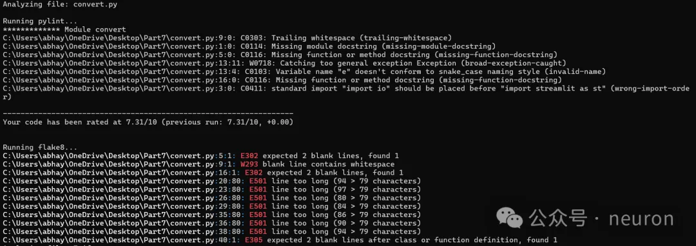
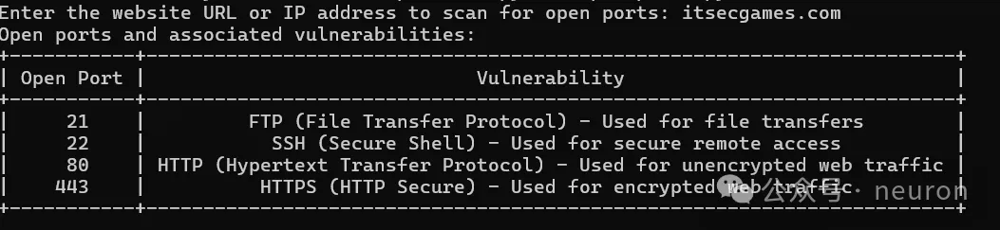

# Python 脚本开发

## 玩转 Python30 个实用脚本解锁自动化大法

让我们从基础到进阶，一步步来学习这些神奇的代码片段吧。

**1.** `hello_world.py`: 这是 Python 入门的第一课，打印出"Hello, World!"，让你知道你已经上路了。

```python
def print_hello():
    print("Hello, World!")
print_hello()
```

**2.** `countdown.py`: 让我们来个倒计时，输入一个数字，然后从大到小数数。

```python
def countdown(n):
    while n > 0:
        print(n)
        n -= 1
countdown(10)
```

**3.** `file_reader.py`: 打开文件，读取内容，轻松查看文本。

```python
def read_file(file_name):
    with open(file_name, 'r') as file:
        content = file.read()
    return content
content = read_file('example.txt')
```

**4.** `email_sender.py`: 发送一封简单的邮件通知，用起来就像发短信一样简单。

```python
import smtplib
def send_email(to, subject, message):
    # 实例化SMTP服务器...
    server.sendmail(from_addr, to, message)
send_email('you@example.com', '自动邮件', '这是你的提醒邮件！')
```

**5.** `web_scraper.py`: 爬虫初体验，抓取网页数据，比如新闻标题。

```python
import requests
def get_news_titles(url):
    response = requests.get(url)
    titles = response.html.find_all('h2')
    return [title.text for title in titles]
titles = get_news_titles('https://news.example.com')
```

**6.** `csv_sorter.py`: 读取 CSV 文件，按特定列排序，保持数据整洁。

```python
import pandas as pd
def sort_csv(input_file, column):
    df = pd.read_csv(input_file)
    sorted_df = df.sort_values(by=column)
    sorted_df.to_csv('sorted_' + input_file, index=False)
sort_csv('data.csv', 'date')
```

**7.** `image_resizer.py`: 图片处理小能手，调整图片大小。

```python
from PIL import Image
def resize_image(image_path, new_size):
    img = Image.open(image_path)
    resized_img = img.resize(new_size)
    resized_img.save('resized_' + image_path)
resize_image('pic.jpg', (800, 600))
```

**8.** `password_generator.py`: 自动创建随机密码，安全又多样。

```python
import random
import string
def generate_password(length):
    chars = string.ascii_letters + string.digits + string.punctuation
    password = ''.join(random.choice(chars) for _ in range(length))
    return password
print(generate_password(12))
```

**9.** `daily_weather.py`: 获取并显示当地天气，每天都不一样。

```python
import requests
def get_weather(city):
    # API请求...
    return weather_data['description']
city_weather = get_weather('New York')
```

**10.** `task_scheduler.py`: 设定定时任务，自动完成每日例行公事。

```python
import schedule, time
def job_function():
    # 你的任务...
schedule.every().day.at("10:00").do(job_function)
while True:
    schedule.run_pending()
    time.sleep(1)
```

**11.** `excel_data_analyzer.py`: 分析 Excel 数据，找出趋势和异常值。

```python
import pandas as pd
def analyze_excel(file_path):
    data = pd.read_excel(file_path)
    # 数据分析...
    summary = data.describe()
    return summary
report = analyze_excel('sales_data.xlsx')
```

**12.** `csv_to_json.py`: 将 CSV 转换为 JSON，方便数据交换。

```python
import csv
import json
def csv_to_json(csv_file, json_file):
    with open(csv_file, 'r') as csv_data, open(json_file, 'w') as json_data:
        reader = csv.DictReader(csv_data)
        json_data.write('[\n')
        for row in reader:
            json_data.write(f'{{"{row.keys()[-1]}": "{row[row.keys()[-1]]}"}}\n')
        json_data.write(']\n')
csv_to_json('input.csv', 'output.json')
```

**13.** `email_attachment_sender.py`: 发送带附件的电子邮件，文件管理变得更简单。

```python
import smtplib
def send_email_with_attachment(to, subject, msg, attachment_path):
    # 添加附件...
    server.sendmail(from_addr, to, f'Subject: {subject}\n\n{msg}')
    # 发送...
send_email_with_attachment('recipient@example.com', '附件邮件', '邮件正文', 'document.pdf')
```

**14.** `text_summary_generator.py`: 自动生成文本摘要，节省阅读时间。

```python
from gensim.summarization import summarize
def create_summary(text):
    return summarize(text)
summary = create_summary(long_text)
```

**15.** `git_tracker.py`: 自动跟踪并记录 Git 提交信息，整理项目历史。

```python
import subprocess
def git_log(repo_path):
    log = subprocess.check_output(['git', 'log', '--oneline', repo_path])
    return log.decode('utf-8').split('\n')
commit_history = git_log('.')
```

**16.** `pdf_watermarker.py`: 在 PDF 上添加水印，保护版权或个性化。

```python
from PyPDF2 import PdfWriter, PdfReader
def add_watermark(input_pdf, output_pdf, watermark):
    pdf_writer = PdfWriter()
    pdf_reader = PdfReader(input_pdf)
    for page_num in range(pdf_reader.numPages):
        page = pdf_reader.getPage(page_num)
        page.mergePage(watermark)
        pdf_writer.addPage(page)
    with open(output_pdf, 'wb') as out:
        pdf_writer.write(out)
watermark_pdf = add_watermark('original.pdf', 'watermarked.pdf', 'COPYRIGHT')
```

**17.** `webhook_handler.py`: 监听 API webhook，自动化处理外部事件。

```python
import requests
def handle_webhook(data):
    # 解析数据...
    process_data(data)
handle_webhook(requests.get('http://your-webhook-url.com').json())
```

**18.** `database_connector.py`: 连接数据库，执行 SQL 查询或操作。

```python
import sqlite3
def query_database(query):
    conn = sqlite3.connect('database.db')
    cursor = conn.cursor()
    cursor.execute(query)
    results = cursor.fetchall()
    conn.close()
    return results
query_results = query_database("SELECT * FROM users")
```

**19.** `csv_splitter.py`: 将大文件切分成多个小文件，方便管理和处理。

```python
import csv
def split_csv(input_file, chunk_size):
    with open(input_file, 'r') as csv_in, \
         open(f'split_{input_file}', 'w', newline='') as csv_out:
        reader = csv.reader(csv_in)
        writer = csv.writer(csv_out)
        for i, chunk in enumerate(reader, start=1):
            if i % chunk_size == 0:
                csv_out.close()
                csv_in.close()
                new_file = f'split_{i}.csv'
                with open(new_file, 'a', newline='') as new_csv_out:
                    writer = csv.writer(new_csv_out)
            writer.writerow(chunk)
split_csv('large_data.csv', 1000)
```

**20.** `csv_combiner.py`: 合并多个 CSV 文件为一个，简化数据集成过程。

```python
import glob
import pandas as pd
def combine_csvs(directory):
    dfs = []
    for file in glob.glob(f'{directory}/*.csv'):
        dfs.append(pd.read_csv(file))
    combined_df = pd.concat(dfs, ignore_index=True)
    combined_df.to_csv('combined_data.csv', index=False)
combine_csvs('split_data/')
```

**21.** `csv_cleaner.py`: 自动清理 CSV 中的重复项和缺失值。

```python
import pandas as pd
def clean_csv(input_file):
    df = pd.read_csv(input_file)
    df = df.drop_duplicates()
    df = df.dropna()
    df.to_csv('cleaned_' + input_file, index=False)
clean_csv('dirty_data.csv')
```

**22.** `file_uploader.py`: 上传文件到云存储服务，如 Google Drive 或 Dropbox。

```python
from google.oauth2.credentials import Credentials
from googleapiclient.discovery import build
def upload_to_drive(file_path, credentials_path):
    service = build('drive', 'v3', credentials=Credentials.from_authorized_user_file(credentials_path))
    file_metadata = {'name': file_path}
    media = MediaFileUpload(file_path, resumable=True)
    file = service.files().create(body=file_metadata, media_body=media, fields='id').execute()
upload_to_drive('uploaded_file.txt', 'credentials.json')
```

**23.** `time_tracker.py`: 记录和分析工作时间，提升生产力。

```python
import datetime
def start_stop_timer(task_name):
    start_time = datetime.datetime.now()
    # ...开始计时...
    end_time = datetime.datetime.now()
    total_time = end_time - start_time
    print(f'{task_name} completed in {total_time}')
start_stop_timer('Writing code')
```

**24.** `data_visualizer.py`: 生成图表，让复杂数据可视化。

```python
import matplotlib.pyplot as plt
def plot_data(x, y):
    plt.plot(x, y)
    plt.xlabel('X-axis')
    plt.ylabel('Y-axis')
    plt.title('Data Visualization')
    plt.show()
x = [1, 2, 3, 4, 5]
y = [10, 20, 30, 40, 50]
plot_data(x, y)
```

**25.** `webpage_screenshot.py`: 自动抓取网页截图，用于报告或存档。

```python
import pyautogui
def take_screenshot(url, output_path):
    # ...使用Selenium或类似工具...
    pyautogui.screenshot(output_path)
take_screenshot('https://example.com', 'screenshot.png')
```

**26.** `csv_split_by_date.py`: 根据日期范围分割 CSV 文件。

```python
import pandas as pd
def split_by_date(input_file, start_date, end_date):
    df = pd.read_csv(input_file)
    sliced_df = df[(df['date'] >= start_date) & (df['date'] <= end_date)]
    sliced_df.to_csv(f'split_{start_date}_{end_date}.csv', index=False)
split_by_date('sales_data.csv', '2022-01-01', '2022-03-31')
```

**27.** `email_report_generator.py`: 自动生成并发送定期销售报告。

```python
import smtplib, xlsxwriter
def generate_sales_report(report_data):
    workbook = xlsxwriter.Workbook('sales_report.xlsx')
    # ...生成报告...
    workbook.close()
    send_email('team@example.com', 'Sales Report', 'Please find attached the latest sales report.')
    with open('sales_report.xlsx', 'rb') as file:
        attach = ('sales_report.xlsx', file, 'application/vnd.openxmlformats-officedocument.spreadsheetml.sheet')
        send_email(..., attach=attach)
generate_sales_report(sales_data)
```

**28.** `file_encryptor.py`: 加密文件，保护敏感信息。

```python
from cryptography.fernet import Fernet
def encrypt_file(input_file, key):
    cipher_suite = Fernet(key)
    with open(input_file, 'rb') as file:
        original_data = file.read()
    encrypted_data = cipher_suite.encrypt(original_data)
    with open('encrypted_' + input_file, 'wb') as encrypted_file:
        encrypted_file.write(encrypted_data)
encrypt_file('confidential.txt', 'your_secret_key')
```

**29.** `csv_data_validation.py`: 检查 CSV 数据一致性，避免错误。

```python
import pandas as pd
def validate_data(input_file, validation_rules):
    df = pd.read_csv(input_file)
    errors = df.apply(lambda row: all(row[col]符合验证规则 for col in validation_rules), axis=1)
    return errors.value_counts()
validation_results = validate_data('data.csv', {'email': r'^[\w\.-]+@[\w\.-]+\.\w+$'})
```

**30.** `web_crawler_and_scraper.py`: 爬取网站信息并存储到 CSV 或数据库中。

```python
import scrapy
class MySpider(scrapy.Spider):
    name = 'myspider'
    start_urls = ['http://example.com']

    def parse(self, response):
        # ...解析HTML...
        data = {
            'title': response.css('h1::text').get(),
            'description': response.css('p::text').get()
        }
        yield {k: v for k, v in data.items()}

    def store_data(self, item):
        # ...存储到CSV或数据库...
spider = MySpider()
spider.crawl(spider)
```

这些脚本涵盖了从基本操作到更复杂的任务，现在你已经掌握了 30 个 Python 自动化脚本，可以开始在实际项目中大展身手了！记得不断实践，你的 Python 技能会越来越棒！

# 京东自动预约和抢购某台脚本

代码

```python
import random
import time
import requests
import functools
import json
import os
import pickle

from lxml import etree
from jd_logger import logger
from timer import Timer
from config import global_config
from concurrent.futures import ProcessPoolExecutor
from exception import SKException
from util import (
    parse_json,
    send_wechat,
    wait_some_time,
    response_status,
    save_image,
    open_image
)


class SpiderSession:
    """
    Session相关操作
    """
    def __init__(self):
        self.cookies_dir_path = "./cookies/"
        self.user_agent = global_config.getRaw('config', 'DEFAULT_USER_AGENT')

        self.session = self._init_session()

    def _init_session(self):
        session = requests.session()
        session.headers = self.get_headers()
        return session

    def get_headers(self):
        return {"User-Agent": self.user_agent,
                "Accept": "text/html,application/xhtml+xml,application/xml;"
                          "q=0.9,image/webp,image/apng,*/*;"
                          "q=0.8,application/signed-exchange;"
                          "v=b3",
                "Connection": "keep-alive"}

    def get_user_agent(self):
        return self.user_agent

    def get_session(self):
        """
        获取当前Session
        :return:
        """
        return self.session

    def get_cookies(self):
        """
        获取当前Cookies
        :return:
        """
        return self.get_session().cookies

    def set_cookies(self, cookies):
        self.session.cookies.update(cookies)

    def load_cookies_from_local(self):
        """
        从本地加载Cookie
        :return:
        """
        cookies_file = ''
        if not os.path.exists(self.cookies_dir_path):
            return False
        for name in os.listdir(self.cookies_dir_path):
            if name.endswith(".cookies"):
                cookies_file = '{}{}'.format(self.cookies_dir_path, name)
                break
        if cookies_file == '':
            return False
        with open(cookies_file, 'rb') as f:
            local_cookies = pickle.load(f)
        self.set_cookies(local_cookies)

    def save_cookies_to_local(self, cookie_file_name):
        """
        保存Cookie到本地
        :param cookie_file_name: 存放Cookie的文件名称
        :return:
        """
        cookies_file = '{}{}.cookies'.format(self.cookies_dir_path, cookie_file_name)
        directory = os.path.dirname(cookies_file)
        if not os.path.exists(directory):
            os.makedirs(directory)
        with open(cookies_file, 'wb') as f:
            pickle.dump(self.get_cookies(), f)


class QrLogin:
    """
    扫码登录
    """
    def __init__(self, spider_session: SpiderSession):
        """
        初始化扫码登录
        大致流程：
            1、访问登录二维码页面，获取Token
            2、使用Token获取票据
            3、校验票据
        :param spider_session:
        """
        self.qrcode_img_file = 'qr_code.png'

        self.spider_session = spider_session
        self.session = self.spider_session.get_session()

        self.is_login = False
        self.refresh_login_status()

    def refresh_login_status(self):
        """
        刷新是否登录状态
        :return:
        """
        self.is_login = self._validate_cookies()

    def _validate_cookies(self):
        """
        验证cookies是否有效（是否登陆）
        通过访问用户订单列表页进行判断：若未登录，将会重定向到登陆页面。
        :return: cookies是否有效 True/False
        """
        url = 'https://order.jd.com/center/list.action'
        payload = {
            'rid': str(int(time.time() * 1000)),
        }
        try:
            resp = self.session.get(url=url, params=payload, allow_redirects=False)
            if resp.status_code == requests.codes.OK:
                return True
        except Exception as e:
            logger.error("验证cookies是否有效发生异常", e)
        return False

    def _get_login_page(self):
        """
        获取PC端登录页面
        :return:
        """
        url = "https://passport.jd.com/new/login.aspx"
        page = self.session.get(url, headers=self.spider_session.get_headers())
        return page

    def _get_qrcode(self):
        """
        缓存并展示登录二维码
        :return:
        """
        url = 'https://qr.m.jd.com/show'
        payload = {
            'appid': 133,
            'size': 147,
            't': str(int(time.time() * 1000)),
        }
        headers = {
            'User-Agent': self.spider_session.get_user_agent(),
            'Referer': 'https://passport.jd.com/new/login.aspx',
        }
        resp = self.session.get(url=url, headers=headers, params=payload)

        if not response_status(resp):
            logger.info('获取二维码失败')
            return False

        save_image(resp, self.qrcode_img_file)
        logger.info('二维码获取成功，请打开京东APP扫描')
        open_image(self.qrcode_img_file)
        return True

    def _get_qrcode_ticket(self):
        """
        通过 token 获取票据
        :return:
        """
        url = 'https://qr.m.jd.com/check'
        payload = {
            'appid': '133',
            'callback': 'jQuery{}'.format(random.randint(1000000, 9999999)),
            'token': self.session.cookies.get('wlfstk_smdl'),
            '_': str(int(time.time() * 1000)),
        }
        headers = {
            'User-Agent': self.spider_session.get_user_agent(),
            'Referer': 'https://passport.jd.com/new/login.aspx',
        }
        resp = self.session.get(url=url, headers=headers, params=payload)

        if not response_status(resp):
            logger.error('获取二维码扫描结果异常')
            return False

        resp_json = parse_json(resp.text)
        if resp_json['code'] != 200:
            logger.info('Code: %s, Message: %s', resp_json['code'], resp_json['msg'])
            return None
        else:
            logger.info('已完成手机客户端确认')
            return resp_json['ticket']

    def _validate_qrcode_ticket(self, ticket):
        """
        通过已获取的票据进行校验
        :param ticket: 已获取的票据
        :return:
        """
        url = 'https://passport.jd.com/uc/qrCodeTicketValidation'
        headers = {
            'User-Agent': self.spider_session.get_user_agent(),
            'Referer': 'https://passport.jd.com/uc/login?ltype=logout',
        }

        resp = self.session.get(url=url, headers=headers, params={'t': ticket})
        if not response_status(resp):
            return False

        resp_json = json.loads(resp.text)
        if resp_json['returnCode'] == 0:
            return True
        else:
            logger.info(resp_json)
            return False

    def login_by_qrcode(self):
        """
        二维码登陆
        :return:
        """
        self._get_login_page()

        # download QR code
        if not self._get_qrcode():
            raise SKException('二维码下载失败')

        # get QR code ticket
        ticket = None
        retry_times = 85
        for _ in range(retry_times):
            ticket = self._get_qrcode_ticket()
            if ticket:
                break
            time.sleep(2)
        else:
            raise SKException('二维码过期，请重新获取扫描')

        # validate QR code ticket
        if not self._validate_qrcode_ticket(ticket):
            raise SKException('二维码信息校验失败')

        self.refresh_login_status()

        logger.info('二维码登录成功')


class JdSeckill(object):
    def __init__(self):
        self.spider_session = SpiderSession()
        self.spider_session.load_cookies_from_local()

        self.qrlogin = QrLogin(self.spider_session)

        # 初始化信息
        self.sku_id = global_config.getRaw('config', 'sku_id')
        self.seckill_num = 2
        self.seckill_init_info = dict()
        self.seckill_url = dict()
        self.seckill_order_data = dict()
        self.timers = Timer()

        self.session = self.spider_session.get_session()
        self.user_agent = self.spider_session.user_agent
        self.nick_name = None

    def login_by_qrcode(self):
        """
        二维码登陆
        :return:
        """
        if self.qrlogin.is_login:
            logger.info('登录成功')
            return

        self.qrlogin.login_by_qrcode()

        if self.qrlogin.is_login:
            self.nick_name = self.get_username()
            self.spider_session.save_cookies_to_local(self.nick_name)
        else:
            raise SKException("二维码登录失败！")

    def check_login(func):
        """
        用户登陆态校验装饰器。若用户未登陆，则调用扫码登陆
        """
        @functools.wraps(func)
        def new_func(self, *args, **kwargs):
            if not self.qrlogin.is_login:
                logger.info("{0} 需登陆后调用，开始扫码登陆".format(func.__name__))
                self.login_by_qrcode()
            return func(self, *args, **kwargs)
        return new_func

    @check_login
    def reserve(self):
        """
        预约
        """
        self._reserve()

    @check_login
    def seckill(self):
        """
        抢购
        """
        self._seckill()

    @check_login
    def seckill_by_proc_pool(self, work_count=5):
        """
        多进程进行抢购
        work_count：进程数量
        """
        with ProcessPoolExecutor(work_count) as pool:
            for i in range(work_count):
                pool.submit(self.seckill)

    def _reserve(self):
        """
        预约
        """
        while True:
            try:
                self.make_reserve()
                break
            except Exception as e:
                logger.info('预约发生异常!', e)
            wait_some_time()

    def _seckill(self):
        """
        抢购
        """
        while True:
            try:
                self.request_seckill_url()
                while True:
                    self.request_seckill_checkout_page()
                    self.submit_seckill_order()
            except Exception as e:
                logger.info('抢购发生异常，稍后继续执行！', e)
            wait_some_time()

    def make_reserve(self):
        """商品预约"""
        logger.info('商品名称:{}'.format(self.get_sku_title()))
        url = 'https://yushou.jd.com/youshouinfo.action?'
        payload = {
            'callback': 'fetchJSON',
            'sku': self.sku_id,
            '_': str(int(time.time() * 1000)),
        }
        headers = {
            'User-Agent': self.user_agent,
            'Referer': 'https://item.jd.com/{}.html'.format(self.sku_id),
        }
        resp = self.session.get(url=url, params=payload, headers=headers)
        resp_json = parse_json(resp.text)
        reserve_url = resp_json.get('url')
        self.timers.start()
        while True:
            try:
                self.session.get(url='https:' + reserve_url)
                logger.info('预约成功，已获得抢购资格 / 您已成功预约过了，无需重复预约')
                if global_config.getRaw('messenger', 'enable') == 'true':
                    success_message = "预约成功，已获得抢购资格 / 您已成功预约过了，无需重复预约"
                    send_wechat(success_message)
                break
            except Exception as e:
                logger.error('预约失败正在重试...')

    def get_username(self):
        """获取用户信息"""
        url = 'https://passport.jd.com/user/petName/getUserInfoForMiniJd.action'
        payload = {
            'callback': 'jQuery{}'.format(random.randint(1000000, 9999999)),
            '_': str(int(time.time() * 1000)),
        }
        headers = {
            'User-Agent': self.user_agent,
            'Referer': 'https://order.jd.com/center/list.action',
        }

        resp = self.session.get(url=url, params=payload, headers=headers)

        try_count = 5
        while not resp.text.startswith("jQuery"):
            try_count = try_count - 1
            if try_count > 0:
                resp = self.session.get(url=url, params=payload, headers=headers)
            else:
                break
            wait_some_time()
        # 响应中包含了许多用户信息，现在在其中返回昵称
        # jQuery2381773({"imgUrl":"//storage.360buyimg.com/i.imageUpload/xxx.jpg","lastLoginTime":"","nickName":"xxx","plusStatus":"0","realName":"xxx","userLevel":x,"userScoreVO":{"accountScore":xx,"activityScore":xx,"consumptionScore":xxxxx,"default":false,"financeScore":xxx,"pin":"xxx","riskScore":x,"totalScore":xxxxx}})
        return parse_json(resp.text).get('nickName')

    def get_sku_title(self):
        """获取商品名称"""
        url = 'https://item.jd.com/{}.html'.format(global_config.getRaw('config', 'sku_id'))
        resp = self.session.get(url).content
        x_data = etree.HTML(resp)
        sku_title = x_data.xpath('/html/head/title/text()')
        return sku_title[0]

    def get_seckill_url(self):
        """获取商品的抢购链接
        点击"抢购"按钮后，会有两次302跳转，最后到达订单结算页面
        这里返回第一次跳转后的页面url，作为商品的抢购链接
        :return: 商品的抢购链接
        """
        url = 'https://itemko.jd.com/itemShowBtn'
        payload = {
            'callback': 'jQuery{}'.format(random.randint(1000000, 9999999)),
            'skuId': self.sku_id,
            'from': 'pc',
            '_': str(int(time.time() * 1000)),
        }
        headers = {
            'User-Agent': self.user_agent,
            'Host': 'itemko.jd.com',
            'Referer': 'https://item.jd.com/{}.html'.format(self.sku_id),
        }
        while True:
            resp = self.session.get(url=url, headers=headers, params=payload)
            resp_json = parse_json(resp.text)
            if resp_json.get('url'):
                # https://divide.jd.com/user_routing?skuId=8654289&sn=c3f4ececd8461f0e4d7267e96a91e0e0&from=pc
                router_url = 'https:' + resp_json.get('url')
                # https://marathon.jd.com/captcha.html?skuId=8654289&sn=c3f4ececd8461f0e4d7267e96a91e0e0&from=pc
                seckill_url = router_url.replace(
                    'divide', 'marathon').replace(
                    'user_routing', 'captcha.html')
                logger.info("抢购链接获取成功: %s", seckill_url)
                return seckill_url
            else:
                logger.info("抢购链接获取失败，稍后自动重试")
                wait_some_time()

    def request_seckill_url(self):
        """访问商品的抢购链接（用于设置cookie等"""
        logger.info('用户:{}'.format(self.get_username()))
        logger.info('商品名称:{}'.format(self.get_sku_title()))
        self.timers.start()
        self.seckill_url[self.sku_id] = self.get_seckill_url()
        logger.info('访问商品的抢购连接...')
        headers = {
            'User-Agent': self.user_agent,
            'Host': 'marathon.jd.com',
            'Referer': 'https://item.jd.com/{}.html'.format(self.sku_id),
        }
        self.session.get(
            url=self.seckill_url.get(
                self.sku_id),
            headers=headers,
            allow_redirects=False)

    def request_seckill_checkout_page(self):
        """访问抢购订单结算页面"""
        logger.info('访问抢购订单结算页面...')
        url = 'https://marathon.jd.com/seckill/seckill.action'
        payload = {
            'skuId': self.sku_id,
            'num': self.seckill_num,
            'rid': int(time.time())
        }
        headers = {
            'User-Agent': self.user_agent,
            'Host': 'marathon.jd.com',
            'Referer': 'https://item.jd.com/{}.html'.format(self.sku_id),
        }
        self.session.get(url=url, params=payload, headers=headers, allow_redirects=False)

    def _get_seckill_init_info(self):
        """获取秒杀初始化信息（包括：地址，发票，token）
        :return: 初始化信息组成的dict
        """
        logger.info('获取秒杀初始化信息...')
        url = 'https://marathon.jd.com/seckillnew/orderService/pc/init.action'
        data = {
            'sku': self.sku_id,
            'num': self.seckill_num,
            'isModifyAddress': 'false',
        }
        headers = {
            'User-Agent': self.user_agent,
            'Host': 'marathon.jd.com',
        }
        resp = self.session.post(url=url, data=data, headers=headers)

        resp_json = None
        try:
            resp_json = parse_json(resp.text)
        except Exception:
            raise SKException('抢购失败，返回信息:{}'.format(resp.text[0: 128]))

        return resp_json

    def _get_seckill_order_data(self):
        """生成提交抢购订单所需的请求体参数
        :return: 请求体参数组成的dict
        """
        logger.info('生成提交抢购订单所需参数...')
        # 获取用户秒杀初始化信息
        self.seckill_init_info[self.sku_id] = self._get_seckill_init_info()
        init_info = self.seckill_init_info.get(self.sku_id)
        default_address = init_info['addressList'][0]  # 默认地址dict
        invoice_info = init_info.get('invoiceInfo', {})  # 默认发票信息dict, 有可能不返回
        token = init_info['token']
        data = {
            'skuId': self.sku_id,
            'num': self.seckill_num,
            'addressId': default_address['id'],
            'yuShou': 'true',
            'isModifyAddress': 'false',
            'name': default_address['name'],
            'provinceId': default_address['provinceId'],
            'cityId': default_address['cityId'],
            'countyId': default_address['countyId'],
            'townId': default_address['townId'],
            'addressDetail': default_address['addressDetail'],
            'mobile': default_address['mobile'],
            'mobileKey': default_address['mobileKey'],
            'email': default_address.get('email', ''),
            'postCode': '',
            'invoiceTitle': invoice_info.get('invoiceTitle', -1),
            'invoiceCompanyName': '',
            'invoiceContent': invoice_info.get('invoiceContentType', 1),
            'invoiceTaxpayerNO': '',
            'invoiceEmail': '',
            'invoicePhone': invoice_info.get('invoicePhone', ''),
            'invoicePhoneKey': invoice_info.get('invoicePhoneKey', ''),
            'invoice': 'true' if invoice_info else 'false',
            'password': global_config.get('account', 'payment_pwd'),
            'codTimeType': 3,
            'paymentType': 4,
            'areaCode': '',
            'overseas': 0,
            'phone': '',
            'eid': global_config.getRaw('config', 'eid'),
            'fp': global_config.getRaw('config', 'fp'),
            'token': token,
            'pru': ''
        }

        return data

    def submit_seckill_order(self):
        """提交抢购（秒杀）订单
        :return: 抢购结果 True/False
        """
        url = 'https://marathon.jd.com/seckillnew/orderService/pc/submitOrder.action'
        payload = {
            'skuId': self.sku_id,
        }
        try:
            self.seckill_order_data[self.sku_id] = self._get_seckill_order_data()
        except Exception as e:
            logger.info('抢购失败，无法获取生成订单的基本信息，接口返回:【{}】'.format(str(e)))
            return False

        logger.info('提交抢购订单...')
        headers = {
            'User-Agent': self.user_agent,
            'Host': 'marathon.jd.com',
            'Referer': 'https://marathon.jd.com/seckill/seckill.action?skuId={0}&num={1}&rid={2}'.format(
                self.sku_id, self.seckill_num, int(time.time())),
        }
        resp = self.session.post(
            url=url,
            params=payload,
            data=self.seckill_order_data.get(
                self.sku_id),
            headers=headers)
        resp_json = None
        try:
            resp_json = parse_json(resp.text)
        except Exception as e:
            logger.info('抢购失败，返回信息:{}'.format(resp.text[0: 128]))
            return False
        # 返回信息
        # 抢购失败：
        # {'errorMessage': '很遗憾没有抢到，再接再厉哦。', 'orderId': 0, 'resultCode': 60074, 'skuId': 0, 'success': False}
        # {'errorMessage': '抱歉，您提交过快，请稍后再提交订单！', 'orderId': 0, 'resultCode': 60017, 'skuId': 0, 'success': False}
        # {'errorMessage': '系统正在开小差，请重试~~', 'orderId': 0, 'resultCode': 90013, 'skuId': 0, 'success': False}
        # 抢购成功：
        # {"appUrl":"xxxxx","orderId":820227xxxxx,"pcUrl":"xxxxx","resultCode":0,"skuId":0,"success":true,"totalMoney":"xxxxx"}
        if resp_json.get('success'):
            order_id = resp_json.get('orderId')
            total_money = resp_json.get('totalMoney')
            pay_url = 'https:' + resp_json.get('pcUrl')
            logger.info('抢购成功，订单号:{}, 总价:{}, 电脑端付款链接:{}'.format(order_id, total_money, pay_url))
            if global_config.getRaw('messenger', 'enable') == 'true':
                success_message = "抢购成功，订单号:{}, 总价:{}, 电脑端付款链接:{}".format(order_id, total_money, pay_url)
                send_wechat(success_message)
            return True
        else:
            logger.info('抢购失败，返回信息:{}'.format(resp_json))
            if global_config.getRaw('messenger', 'enable') == 'true':
                error_message = '抢购失败，返回信息:{}'.format(resp_json)
                send_wechat(error_message)
            return False
```

这段代码是一个用于处理京东购物的 Python 脚本，主要包括登录、预约和抢购功能。

**注意事项**

1. 引入必要的库：代码开始处引入了操作网络请求、时间、文件和图片等的库。
2. 定义类和函数：

\- SpiderSession 类：管理与服务器会话的类，包括初始化会话、获取和设置用户代理和 cookies 等。

\- QrLogin 类：处理扫码登录逻辑的类，包括获取登录页面、下载二维码、验证二维码和登录状态等。

\- JdSeckill 类：主要处理预约和抢购的逻辑，以及通过多进程支持并发抢购。

3. 主要功能和流程：

\- 登录：用户通过扫描二维码登录。

\- 预约：在抢购前，用户需要预约商品。

\- 抢购：在预约后，用户可以参与商品的抢购。

\- 多进程抢购：使用`ProcessPoolExecutor`来启动多个进程进行抢购，以增加成功率。

4. 异常和状态处理：

\- 程序通过记录日志和发送微信消息的方式来反馈程序的运行状态和异常信息。

\- 使用了装饰器@check_login 来确保执行某些操作前用户已经登录。

5. 辅助功能：

\- 保存和加载 cookies：允许程序在多次运行间保持登录状态。

\- 获取用户信息和商品信息：通过解析网页内容或 API 响应来获取所需信息。

**特别提醒**

主要面向有一定 Python 基础和理解 HTTP 请求处理的用户。它展示了如何在 Python 中使用网络请求、处理会话、解析 HTML/XML、以及如何使用多线程/多进程来提高任务执行效率的基本方法。

**解析如下**

这个 Python 脚本是为了自动完成茅台预约，具体功能包括从环境变量中获取用户信息，向指定的 API 发送预约请求，并处理响应。以下是脚本执行的主要步骤：

1. 环境变量和配置：通过青龙面板（一个自动化运行脚本的工具）添加环境变量，包括用户的 token、设备 ID 等信息，以及 app 版本号`Mt_Version`。
2. 函数定义：

\- `mt_add`：向服务器发送预约请求。

\- `tongzhi`：发送通知到指定用户。

\- `get_session_id`：获取会话 ID。

\- `get_shop_item`：获取商店和商品信息。

\- `get_user_id`：获取用户 ID。

\- `getUserEnergyAward`：领取耐力（可能是某种游戏机制或活动的奖励）。

\- `get_map`：获取省份和城市的映射信息。

\- `login`：登录并获取 token 和 cookie。

3. 预约流程实现：脚本主体通过读取环境变量中的用户 token 等信息，逐个执行预约流程，包括登录、获取用户信息、选择商品和商店、发送预约请求等。
4. 结果通知：预约结果通过`send`函数发送通知。
5. 主函数：脚本的入口点，读取环境变量中的用户 token 列表，遍历每个 token 执行预约流程。

脚本使用了第三方库`requests`来发送 HTTP 请求，`base64`和`json`进行数据编码和解码。通过环境变量`MTTokenD`读取用户的预约参数，`Mt_Version`读取 app 版本号。脚本支持多账号操作，对于每个账号，解析其预约参数（包括省份、城市、经纬度、设备 ID、token 等），并根据这些参数向茅台预约 API 发送请求。

此脚本适用于自动化茅台酒预约流程，减少手动操作，提高预约成功率。同时，脚本还包含了一些附加功能，如领取耐力奖励等。

## 重置版

```python

import requests
import re
import datetime
from urllib import parse
import JniSign
import time


def getUrlParams(url):
    res = dict(parse.parse_qsl(url))
    return res


def get_cookie_string(cookie):
    cookie_string = ''
    for cookie_key in cookie.keys():
        cookie_string += '%s=%s;' % (cookie_key, cookie[cookie_key])
    return cookie_string


def get_jd_time():
    response = requests.get(url='https://api.m.jd.com/client.action?functionId=queryMaterialProducts&client=wh5')
    print(response.json())


def get_sk(data):
    data_val = [val for val in data['data'].values()]
    n, o, p, q, r, s = data_val[0], data_val[1], data_val[2], data_val[3], data_val[4], data_val[5]
    sk_val = ''
    if n == 'cca':
        sk_val = p[14:19].lower() + o[5:15].upper()
    if n == 'ab':  # check ok
        sk_val = r[10:18] + s[2:13].lower()
    if n == 'ch':
        sk_val = q.upper() + r[6:10].upper()
    if n == 'cbc':  # check ok
        sk_val = q[3:13].upper() + p[10:19].lower()
    if n == 'by':
        sk_val = o[5:8] + re.sub('a', 'c', p, flags=re.IGNORECASE)
    if n == 'xa':
        sk_val = o[1:16] + s[4:10]
    if n == 'cza':
        sk_val = q[6:19].lower() + s[5:11]
    if n == 'cb':
        sk_val = s[5:14] + p[2:13].upper()

    return sk_val


class JDSecKillAPI:
    def __init__(self, login_cookie):
        self.skuId = '100012043978'
        self.s = requests.session()
        self.token_cookie = login_cookie
        self.token_cookie_string = get_cookie_string(cookie=self.token_cookie)
        self.aid = ''
        self.eid = ''
        self.uuid = ''
        self.uts = ''
        self.wifiBssid = ''
        self.user_agent = ''

    def reserve_maotai(self):
        headers = {
            'user-agent': 'okhttp/3.12.',
            'content-type': 'application/x-www-form-urlencoded',
            'content-length': '3081',
            'cookie': self.token_cookie_string,
            'jdc-backup': self.token_cookie_string,
        }
        query_params = {
            'functionId': 'appoint',
            'clientVersion': '9.3.4',
            'build': '85134',
            'client': 'android',
            'd_brand': 'maotai',
            'd_model': 'LIO-AN00',
            'osVersion': '7.1.2',
            'screen': '1920*1080',
            'partner': 'hhqj02',
            'aid': self.aid,
            'eid': self.eid,
            'sdkVersion': '25',
            'lang': 'zh_CN',
            'uuid': self.uuid,
            'area': '15_1213_3411_59341',
            'networkType': 'wifi',
            'wifiBssid': self.wifiBssid,
            'uts': self.uts
        }
        reserve_url = 'https://api.m.jd.com/client.action?' + parse.urlencode(query_params) + '&'
        body_string = '{"autoAddCart":"0","bsid":"","check":"0","ctext":"","isShowCode":"0","mad":"0","skuId":"100012043978","type":"1"}'
        data = {'body': body_string}

        plainTextDic = {
            'functionId': query_params['functionId'],
            'clientVersion': query_params['clientVersion'],
            'client': query_params['client'],
            'uuid': query_params['uuid'],
            'body': body_string,
            'st': int(round(time.time() * 1000)),
        }
        sign = JniSign.JDencrypt_version0(plainTextDic=plainTextDic, ran1=2)
        response = self.s.post(url=reserve_url + sign, data=data, headers=headers, timeout=1)
        return response.json()

    def get_token_key(self):
        headers = {
            'user-agent': 'okhttp/3.12.',
            'content-type': 'application/x-www-form-urlencoded',
            'content-length': '3081',
            'cookie': self.token_cookie_string,
            'jdc-backup': self.token_cookie_string,
        }
        body_string = '{"action":"to","to":"https%3A%2F%2Fdivide.jd.com%2Fuser_routing%3FskuId%3D100012043978"}'
        query_params = {
            'functionId': 'genToken',
            'clientVersion': '9.2.0',
            'build': '85134',
            'client': 'android',
            'd_brand': 'maotai',
            'd_model': 'LIO-AN00',
            'osVersion': '7.1.2',
            'screen': '1920*1080',
            'partner': 'hhqj02',
            'aid': self.aid,
            'eid': self.eid,
            'sdkVersion': '25',
            'lang': 'zh_CN',
            'uuid': self.uuid,
            'area': '15_1213_3411_59341',
            'networkType': 'wifi',
            'wifiBssid': self.wifiBssid,
            'uts': self.uts
        }
        token_key_url = 'https://api.m.jd.com/client.action?' + parse.urlencode(query_params) + '&'
        data = {'body': body_string}

        plainTextDic = {
            'functionId': query_params['functionId'],
            'clientVersion': query_params['clientVersion'],
            'client': query_params['client'],
            'uuid': query_params['uuid'],
            'body': data['body'],
            'st': int(round(time.time() * 1000)),
        }
        sign = JniSign.JDencrypt_version0(plainTextDic=plainTextDic, ran1=2)
        response = self.s.post(url=token_key_url + sign, data=data, headers=headers, timeout=1)
        # token_key = response.json()['tokenKey']
        # print('Token Key: ----------> %s' % response.json())
        # print(response.status_code)
        return response.json()

    def get_appjmp(self, token_params):
        headers = {
            'user-agent': self.user_agent
        }
        appjmp_url = token_params['url']
        params = {
            'to': 'https://divide.jd.com/user_routing?skuId=%s' % self.skuId,
            'tokenKey': token_params['tokenKey'],
            'lbs': '{"lat":"39.904585","lng":"116.407018","provinceId":"1","cityId":"2802","districtId":"54741","provinceName":"北京","cityName":"东城区","districtName":"东华门街道"}'
        }

        response = self.s.get(url=appjmp_url, params=params, allow_redirects=False, headers=headers)
        # print('Get Appjmp跳转链接-------------->%s' % response.headers['Location'])
        return response.headers['Location']

    def get_divide(self, divide_url):
        headers = {
            'user-agent': self.user_agent
        }
        response = self.s.get(url=divide_url, allow_redirects=False, headers=headers)
        print('Get Divide跳转链接-------------->%s' % response.headers['Location'])
        return response.headers['Location']

    def get_captcha(self, captcha_url):
        headers = {
            'user-agent': self.user_agent
        }
        response = self.s.get(url=captcha_url, allow_redirects=False, headers=headers)
        print('Get Captcha跳转链接-------------->%s' % response.headers['Location'])
        return response.headers['Location']

    def get_seckill(self, seckill_url):
        headers = {
            'user-agent': self.user_agent
        }
        response = self.s.get(url=seckill_url, allow_redirects=False, headers=headers)

    def init_action(self, num=1):
        headers = {
            'user-agent': self.user_agent
        }
        init_action_url = 'https://marathon.jd.com/seckillnew/orderService/init.action'
        data = {
            'sku': self.skuId,
            'num': num,
            'isModifyAddress': False,
        }
        response = self.s.post(url=init_action_url, data=data, headers=headers)
        print('init action返回数据：%s' % response.text)
        return response.json()

    def get_tak(self):
        headers = {
            'user-agent': self.user_agent
        }
        tak_url = 'https://tak.jd.com/t/41CD2?_t=%d' % (int(round(time.time() * 1000)))
        response = self.s.get(url=tak_url, headers=headers)
        sk_val = get_sk(data=response.json())
        return sk_val

    def submit_order(self, order_data, sk):
        headers = {
            'user-agent': self.user_agent
        }
        submit_order_url = 'https://marathon.jd.com/seckillnew/orderService/submitOrder.action?skuId=%s' % self.skuId
        address_info = order_data['addressList'][0]
        invoice_info = order_data['invoiceInfo']
        data = {
            'num': order_data['seckillSkuVO']['num'],
            'addressId': address_info['id'],
            'yuShou': True,
            'isModifyAddress': False,
            'name': address_info['name'],
            'provinceId': address_info['provinceId'],
            'provinceName': address_info['provinceName'],
            'cityId': address_info['cityId'],
            'cityName': address_info['cityName'],
            'countyId': address_info['countyId'],
            'countyName': address_info['countyName'],
            'townId': address_info['townId'],
            'townName': address_info['townName'],
            'addressDetail': address_info['addressDetail'],
            'mobile': address_info['mobile'],
            'mobileKey': address_info['mobileKey'],
            'email': '',
            'invoiceTitle': invoice_info['invoiceTitle'],
            'invoiceContent': invoice_info['invoiceContentType'],
            'invoicePhone': invoice_info['invoicePhone'],
            'invoicePhoneKey': invoice_info['invoicePhoneKey'],
            'invoice': True,
            'codTimeType': '3',
            'paymentType': '4',
            'overseas': '0',
            'token': order_data['token'],
            'sk': sk,
        }

        # print('submit提交数据： %s' % data)

        response = self.s.post(url=submit_order_url, data=data, headers=headers)
        try:
            submit_result = response.json()
            print('%s submit order返回数据：状态：%s，信息：%s' % (str(datetime.datetime.now()),
                                                       submit_result['success'], submit_result))

        except:
            print('%s submit order返回数据-非json格式：%s' % (str(datetime.datetime.now()), response.content))

        # return response


if __name__ == '__main__':
    login_cookie_186 = {
        'pin': '',
        'wskey': '',
        'whwswswws': '',
        'unionwsws': ''
    }

    JDska = JDSecKillAPI(login_cookie=login_cookie_186)
    print(JDska.reserve_maotai())
    token_params = JDska.get_token_key()
    divide_url = JDska.get_appjmp(token_params=token_params)
    captcha_url = JDska.get_divide(divide_url=divide_url)
    seckill_url = JDska.get_captcha(captcha_url=captcha_url)
    JDska.get_seckill(seckill_url=seckill_url)
    order_data = JDska.init_action()
    sk_val = JDska.get_tak()
    print('python计算sk参数：%s' % sk_val)
    JDska.submit_order(order_data=order_data, sk=sk_val)
    # print(JDska.s.cookies)
    # get_jd_time()
```

**说明**

这段脚本是为了自动化京东的秒杀活动而编写的。它涵盖了预约、获取令牌、跳转、以及最终的提交订单等多个步骤。以下是脚本各部分的详细解析：

**函数和类解释**

1. getUrlParams(url):

\- 解析 URL 中的查询参数并返回字典格式。

2. get_cookie_string(cookie):

\- 将 cookie 字典转换为字符串格式，以便在 HTTP 请求中使用。

3. get_jd_time():

\- 请求京东服务器时间，主要用于同步操作时间。

4. get_sk(data):

\- 通过特定的加密和处理逻辑生成`sk`值，此值可能用于提交订单时验证。

5. JDSecKillAPI:

\- 主要类，封装了预约、获取令牌、提交订单等功能。

**类方法解释**

\- reserve_maotai():

\- 发起预约请求，设置必要的 HTTP 头和请求参数。

\- get_token_key():

\- 获取用于后续操作的令牌。

\- get_appjmp(token_params):

\- 使用获取到的令牌生成跳转链接。

\- get_divide(divide_url):

\- 访问跳转链接并获取可能的下一跳转链接。

\- get_captcha(captcha_url):

\- 处理验证码跳转链接，这可能是秒杀活动的一部分。

\- get_seckill(seckill_url):

\- 访问最终的秒杀链接。

\- init_action():

\- 初始化订单操作，可能是获取必要的订单数据。

\- get_tak():

\- 获取`tak`值，可能是用于订单提交的另一种验证。

\- submit_order(order_data, sk):

\- 提交订单，使用获取到的所有必要数据。

**脚本流程**

1. 实例化`JDSecKillAPI`类。
2. 调用`reserve_maotai()`函数进行预约。
3. 获取令牌。
4. 通过令牌获取跳转链接。
5. 处理跳转，获取和处理验证码。
6. 初始化订单操作。
7. 获取`sk`值。
8. 提交订单。

**额外的注意点**

\- 使用了外部模块`JniSign`进行签名，这是一种保护措施以符合京东的 API 安全要求。

\- 脚本涉及多次跳转和请求，反映了京东防刷措施的复杂性。

\- 脚本运行依赖于正确的 cookie 和其他验证信息，这些信息需要事先获取。

这个脚本用于自动化京东的秒杀过程，特别是对于高需求商品如茅台。它展示了通过自动化工具模拟用户行为的能力，但同时也涉及到了使用自动化脚本可能违反网站使用条款的问题。使用此类脚本前应确保合规，了解可能的风险。

**注意**：

本文部分变量已做脱敏处理，仅用于测试和学习研究，禁止用于商业用途，不能保证其合法性，准确性，完整性和有效性，请根据情况自行判断。技术层面需要提供帮助，可以通过打赏的方式进行探讨。

## 代码文件概览

在本次补充中，我们详细介绍以下四个关键代码文件，每个文件都在自动化过程中发挥着重要作用：

1. jd_logger.py - 负责日志记录，帮助追踪脚本执行情况。
2. timer.py - 包含计时器功能，确保在正确的时间点触发操作。
3. config.py - 存储脚本运行所需的配置信息，如登录凭证。
4. util.py - 提供支持日志、时间处理的实用工具函数。

**爬虫技巧与用户代理的补充**

补充代码中特别展示了爬虫通用技巧和大量的用户代理字符串。正确应用用户代理不仅可以提高请求的成功率，也是应对网站安全策略的有效策略。这有助于模拟多样化的用户环境，减少被检测的概率。

**发布原因与使用警告**

虽然有顾虑，但我们意识到提供这些信息对于促进技术交流和支持学术研究具有重要价值。因此，我们决定分享这些补充内容，但**严格限定用于测试和学术研究目的**，绝对**禁止用于任何商业用途**。使用这些脚本可能违反服务条款，因此使用时需要自行承担相关风险。

有粉丝反馈导包报错，现重发 config.ini 和 config.py 脚本，请查收。

### config.ini 文件

```bash

[config]
# eid, fp参数必须填写，具体请参考 wiki-常见问题
# 随意填写可能导致订单无法提交等问题
eid = ""
fp = ""
# cookie现在不需要填写了
# cookies_String = ""

# 商品id
# 已经是茅台的sku_id了
sku_id = 100012043978
# 设定时间 # 2024-04-19 10:00:00.100000
# 修改成每天的几点几分几秒几毫秒
buy_time = 09:59:59.500
# 默认UA
DEFAULT_USER_AGENT = "Mozilla/5.0 (Macintosh; Intel Mac OS X 10_15_7) AppleWebKit/537.36 (KHTML, like Gecko) Chrome/87.0.4280.88 Safari/537.36"
# 是否使用随机 useragent，默认为 false
random_useragent = false

[account]
# 支付密码
# 如果你的账户中有可用的京券（注意不是东券）或 在上次购买订单中使用了京豆，
# 那么京东可能会在下单时自动选择京券支付 或 自动勾选京豆支付。
# 此时下单会要求输入六位数字的支付密码。请在下方配置你的支付密码，如 123456 。
# 如果没有上述情况，下方请留空。
payment_pwd = ""

[messenger]
# 使用了Server酱的推送服务
# 如果想开启下单成功后消息推送，则将 enable 设置为 true，默认为 false 不开启推送
# 开启消息推送必须填入 sckey，如何获取请搜索百度
enable = false
sckey =
```

**config.py**文件

```python

import os
import configparser


class Config(object):
    def __init__(self, config_file='config.ini'):
        self._path = os.path.join(os.getcwd(), config_file)
        if not os.path.exists(self._path):
            raise FileNotFoundError("No such file: config.ini")
        self._config = configparser.ConfigParser()
        self._config.read(self._path, encoding='utf-8-sig')
        self._configRaw = configparser.RawConfigParser()
        self._configRaw.read(self._path, encoding='utf-8-sig')

    def get(self, section, name):
        return self._config.get(section, name)

    def getRaw(self, section, name):
        return self._configRaw.get(section, name)


global_config = Config()
```

### 成功率高版本推荐

```python

import datetime
import json
import math
import random
import re
import time
import config
from encrypt import Encrypt
import requests
import hashlib
import logging
import pytz

AES_KEY = 'xxxxxxxxxxxxxxxxxx'
AES_IV = 'xxxxxxxxxx'
SALT = 'xxxxxxxxxxxxxxxxxxxx'

# AMAP_KEY = '9449339b6c4aee04d69481e6e6c84a84'

current_time = str(int(time.time() * 1000))
headers = {}
mt_version = "".join(re.findall('latest__version">(.*?)</p>',
                                requests.get('https://apps.apple.com/cn/app/i%E8%8C%85%E5%8F%B0/id1600482450').text,
                                re.S)).split(" ")[1]

header_context = f'''
MT-Lat: 28.499562
MT-K: 1675213490331
MT-Lng: 102.182324
Host: app.moutai519.com.cn
MT-User-Tag: 0
Accept: */*
MT-Network-Type: WIFI
MT-Token: 1
MT-Team-ID:
MT-Info: 028e7f96f6369cafe1d105579c5b9377
MT-Device-ID: 2F2075D0-B66C-4287-A903-DBFF6358342A
MT-Bundle-ID: com.moutai.mall
Accept-Language: en-CN;q=1, zh-Hans-CN;q=0.9
MT-Request-ID: 167560018873318465
MT-APP-Version: 1.3.7
User-Agent: iOS;16.3;Apple;?unrecognized?
MT-R: clips_OlU6TmFRag5rCXwbNAQ/Tz1SKlN8THcecBp/HGhHdw==
Content-Length: 93
Accept-Encoding: gzip, deflate, br
Connection: keep-alive
Content-Type: application/json
userId: 2
'''


def init_headers(user_id: str = '1', token: str = '2', lat: str = '28.499562', lng: str = '102.182324'):
    for k in header_context.rstrip().lstrip().split("\n"):
        temp_l = k.split(': ')
        dict.update(headers, {temp_l[0]: temp_l[1]})
    dict.update(headers, {"userId": user_id})
    dict.update(headers, {"MT-Token": token})
    dict.update(headers, {"MT-Lat": lat})
    dict.update(headers, {"MT-Lng": lng})
    dict.update(headers, {"MT-APP-Version": mt_version})


def signature(data: dict):
    keys = sorted(data.keys())
    temp_v = ''
    for item in keys:
        temp_v += data[item]
    text = SALT + temp_v + current_time
    hl = hashlib.md5()
    hl.update(text.encode(encoding='utf8'))
    md5 = hl.hexdigest()
    return md5


print()


def get_vcode(mobile: str):
    params = {'mobile': mobile}
    md5 = signature(params)
    dict.update(params, {'md5': md5, "timestamp": current_time, 'MT-APP-Version': mt_version})
    responses = requests.post("https://app.moutai519.com.cn/xhr/front/user/register/vcode", json=params,
                              headers=headers)

    logging.info(
        f'get v_code : params : {params}, response code : {responses.status_code}, response body : {responses.text}')


def login(mobile: str, v_code: str):
    params = {'mobile': mobile, 'vCode': v_code, 'ydToken': '', 'ydLogId': ''}
    md5 = signature(params)
    dict.update(params, {'md5': md5, "timestamp": current_time, 'MT-APP-Version': mt_version})
    responses = requests.post("https://app.moutai519.com.cn/xhr/front/user/register/login", json=params,
                              headers=headers)
    if responses.status_code != 200:
        logging.info(
            f'login : params : {params}, response code : {responses.status_code}, response body : {responses.text}')
    dict.update(headers, {'MT-Token': responses.json()['data']['token']})
    dict.update(headers, {'userId': responses.json()['data']['userId']})
    return responses.json()['data']['token'], responses.json()['data']['userId']


def get_current_session_id():
    day_time = get_day_time()
    responses = requests.get(f"https://static.moutai519.com.cn/mt-backend/xhr/front/mall/index/session/get/{day_time}")
    if responses.status_code != 200:
        logging.warning(
            f'get_current_session_id : params : {day_time}, response code : {responses.status_code}, response body : {responses.text}')
    current_session_id = responses.json()['data']['sessionId']
    dict.update(headers, {'current_session_id': str(current_session_id)})


def get_day_time():

    # 创建一个东八区（北京时间）的时区对象
    beijing_tz = pytz.timezone('Asia/Shanghai')

    # 获取当前北京时间的日期和时间对象
    beijing_dt = datetime.datetime.now(beijing_tz)

    # 设置时间为0点
    beijing_dt = beijing_dt.replace(hour=0, minute=0, second=0, microsecond=0)

    # 获取时间戳（以秒为单位）
    timestamp = int(beijing_dt.timestamp()) * 1000
    return timestamp


def get_location_count(province: str,
                       city: str,
                       item_code: str,
                       p_c_map: dict,
                       source_data: dict,
                       lat: str = '28.499562',
                       lng: str = '102.182324'):
    day_time = get_day_time()
    session_id = headers['current_session_id']
    responses = requests.get(
        f"https://static.moutai519.com.cn/mt-backend/xhr/front/mall/shop/list/slim/v3/{session_id}/{province}/{item_code}/{day_time}")
    if responses.status_code != 200:
        logging.warning(
            f'get_location_count : params : {day_time}, response code : {responses.status_code}, response body : {responses.text}')
    shops = responses.json()['data']['shops']

    if config.MAX_ENABLED:
        return max_shop(city, item_code, p_c_map, province, shops)
    if config.DISTANCE_ENABLED:
        return distance_shop(city, item_code, p_c_map, province, shops, source_data, lat, lng)


def distance_shop(city,
                  item_code,
                  p_c_map,
                  province,
                  shops,
                  source_data,
                  lat: str = '28.499562',
                  lng: str = '102.182324'):
    # shop_ids = p_c_map[province][city]
    temp_list = []
    for shop in shops:
        shopId = shop['shopId']
        items = shop['items']
        item_ids = [i['itemId'] for i in items]
        # if shopId not in shop_ids:
        #     continue
        if str(item_code) not in item_ids:
            continue
        shop_info = source_data.get(shopId)
        # d = geodesic((lat, lng), (shop_info['lat'], shop_info['lng'])).km
        d = math.sqrt((float(lat) - shop_info['lat']) ** 2 + (float(lng) - shop_info['lng']) ** 2)
        # print(f"距离：{d}")
        temp_list.append((d, shopId))

    # sorted(a,key=lambda x:x[0])
    temp_list = sorted(temp_list, key=lambda x: x[0])
    # logging.info(f"所有门店距离:{temp_list}")
    if len(temp_list) > 0:
        return temp_list[0][1]
    else:
        return '0'


def max_shop(city, item_code, p_c_map, province, shops):
    max_count = 0
    max_shop_id = '0'
    shop_ids = p_c_map[province][city]
    for shop in shops:
        shopId = shop['shopId']
        items = shop['items']

        if shopId not in shop_ids:
            continue
        for item in items:
            if item['itemId'] != str(item_code):
                continue
            if item['inventory'] > max_count:
                max_count = item['inventory']
                max_shop_id = shopId
    logging.debug(f'item code {item_code}, max shop id : {max_shop_id}, max count : {max_count}')
    return max_shop_id


encrypt = Encrypt(key=AES_KEY, iv=AES_IV)


def act_params(shop_id: str, item_id: str):
    # {
    #     "actParam": "a/v0XjWK/a/a+ZyaSlKKZViJHuh8tLw==",
    #     "itemInfoList": [
    #         {
    #             "count": 1,
    #             "itemId": "2478"
    #         }
    #     ],
    #     "shopId": "151510100019",
    #     "sessionId": 508
    # }
    session_id = headers['current_session_id']
    userId = headers['userId']
    params = {"itemInfoList": [{"count": 1, "itemId": item_id}],
              "sessionId": int(session_id),
              "userId": userId,
              "shopId": shop_id
              }
    s = json.dumps(params)
    act = encrypt.aes_encrypt(s)
    params.update({"actParam": act})
    return params


def send_email(msg: str):
    if config.PUSH_TOKEN is None:
        return
    title = 'imoutai预约失败'  # 改成你要的标题内容
    content = msg  # 改成你要的正文内容
    url = 'http://www.pushplus.plus/send'
    r = requests.get(url, params={'token': config.PUSH_TOKEN,
                                  'title': title,
                                  'content': content})
    logging.info(f'通知推送结果：{r.status_code, r.text}')


def reservation(params: dict, mobile: str):
    params.pop('userId')
    responses = requests.post("https://app.moutai519.com.cn/xhr/front/mall/reservation/add", json=params,
                              headers=headers)
    if responses.status_code == 401:
        send_email(f'[{mobile}],登录token失效，需要重新登录')
        raise RuntimeError
    if '您的实名信息未完善或未通过认证' in responses.text:
        send_email(f'[{mobile}],{responses.text}')
        raise RuntimeError
    logging.info(
        f'预约 : mobile:{mobile} :  response code : {responses.status_code}, response body : {responses.text}')


def select_geo(i: str):
    # https://www.piliang.tech/geocoding-amap
    resp = requests.get(f"https://www.piliang.tech/api/amap/geocode?address={i}")
    geocodes: list = resp.json()['geocodes']
    return geocodes


def get_map(lat: str = '28.499562', lng: str = '102.182324'):
    p_c_map = {}
    url = 'https://static.moutai519.com.cn/mt-backend/xhr/front/mall/resource/get'
    headers = {
        'X-Requested-With': 'XMLHttpRequest',
        'User-Agent': 'Mozilla/5.0 (iPhone; CPU iPhone OS 15_0_1 like Mac OS X)',
        'Referer': 'https://h5.moutai519.com.cn/gux/game/main?appConfig=2_1_2',
        'Client-User-Agent': 'iOS;16.0.1;Apple;iPhone 14 ProMax',
        'MT-R': 'clips_OlU6TmFRag5rCXwbNAQ/Tz1SKlN8THcecBp/HGhHdw==',
        'Origin': 'https://h5.moutai519.com.cn',
        'MT-APP-Version': mt_version,
        'MT-Request-ID': f'{int(time.time() * 1000)}{random.randint(1111111, 999999999)}{int(time.time() * 1000)}',
        'Accept-Language': 'zh-CN,zh-Hans;q=1',
        'MT-Device-ID': f'{int(time.time() * 1000)}{random.randint(1111111, 999999999)}{int(time.time() * 1000)}',
        'Accept': 'application/json, text/javascript, */*; q=0.01',
        'mt-lng': f'{lng}',
        'mt-lat': f'{lat}'
    }
    res = requests.get(url, headers=headers, )
    mtshops = res.json().get('data', {}).get('mtshops_pc', {})
    urls = mtshops.get('url')
    r = requests.get(urls)
    for k, v in dict(r.json()).items():
        provinceName = v.get('provinceName')
        cityName = v.get('cityName')
        if not p_c_map.get(provinceName):
            p_c_map[provinceName] = {}
        if not p_c_map[provinceName].get(cityName, None):
            p_c_map[provinceName][cityName] = [k]
        else:
            p_c_map[provinceName][cityName].append(k)

    return p_c_map, dict(r.json())


def getUserEnergyAward(mobile: str):
    """

    """
    cookies = {
        'MT-Device-ID-Wap': headers['MT-Device-ID'],
        'MT-Token-Wap': headers['MT-Token'],
        'YX_SUPPORT_WEBP': '1',
    }
    response = requests.post('https://h5.moutai519.com.cn/game/isolationPage/getUserEnergyAward', cookies=cookies,
                             headers=headers, json={})
    # response.json().get('message') if '无法领取奖励' in response.text else "领取奖励成功"
    logging.info(
        f' : mobile:{mobile} :  response code : {response.status_code}, response body : {response.text}')
```

**说明**

这段代码主要关联了许多网络请求和对应的业务逻辑处理，用于处理与一个名为“茅台商城”的应用相关的网络操作。主要功能和关键组件的详细说明如下：

**1. 全局变量和配置**：

\- 使用 AES 加密密钥(`AES_KEY`)、初始向量(`AES_IV`)和一个盐值(`SALT`)用于加密相关操作。

\- 定义了当前时间戳`current_time`和一组请求头`headers`。

\- 从苹果应用商店拉取并解析应用的当前版本号。

**2. 初始化请求头**：

\- `init_headers`函数通过解析一个多行的字符串`header_context`来初始化请求头。

**3. 签名生成：**

\- `signature`函数使用 MD5 算法生成请求的签名，签名用于后续的网络请求验证。

**4. 用户交互函数：**

\- `get_vcode`用于获取短信验证码。

\- `login`用于用户登录，使用手机号和验证码。

\- `get_current_session_id`和`get_day_time`用于获取当前的会话 ID 和准确的时间戳。

**5. 地理位置和商店处理：**

\- `get_location_count`查询特定省市下的商店库存。

\- `distance_shop`和`max_shop`用于基于不同标准（如距离和库存最大化）选择商店。

\- `select_geo`用于地理编码，将地址转换成地理坐标。

**6. 加密和动作参数构建：**

\- 使用`Encrypt`类（从`encrypt`模块导入）对参数进行 AES 加密。

\- `act_params`用于构建活动参数，这些参数包括了用户、商品和店铺的 ID 等。

**7. 通知和预约功能：**

\- `send_email`函数通过 Pushplus 服务发送通知。

\- `reservation`用于提交商品预约请求。

**8. 实用功能：**

\- `get_map`用于获取商店的地理位置数据。

\- `getUserEnergyAward`用于领取用户能量奖励，这可能是应用内的某种积分或奖励系统。

**注意**：

本文部分变量已做脱敏处理，仅用于测试和学习研究，禁止用于商业用途，不能保证其合法性，准确性，完整性和有效性，请根据情况自行判断。技术层面需要提供帮助，可以通过打赏的方式进行探讨。

# 茅台葫芦娃自动预约脚本

全代码如下

```python

/**
 葫芦娃预约 v1.06

 cron: 30 8 * * *
 const $ = new Env("葫芦娃预约");

 自行抓包把token(一般在请求头里)填到变量中, 多账号用换行隔开（可自定义）

 环境变量 XLTH_COOKIE 新联惠购
 环境变量 GLYP_COOKIE 贵旅优品
 环境变量 KGLG_COOKIE 空港乐购
 环境变量 HLQG_COOKIE 航旅黔购
 环境变量 ZHCS_COOKIE 遵行出山
 环境变量 GYQP_COOKIE 贵盐黔品
 环境变量 LLSC_COOKIE 乐旅商城
 环境变量 YLQX_COOKIE 驿路黔寻
 */

const SPLIT = "\n"; // 分割符（可自定义）

const axios = require('axios');
const crypto = require('crypto');
const moment = require('moment');
const notify = require('./sendNotify');

const XLTH_APPID = 'wxded2e7e6d60ac09d'; // 新联惠购
const GLYP_APPID = 'wx61549642d715f361'; // 贵旅优品
const KGLG_APPID = 'wx613ba8ea6a002aa8'; // 空港乐购
const HLQG_APPID = 'wx936aa5357931e226'; // 航旅黔购
const ZHCS_APPID = 'wx624149b74233c99a'; // 遵航出山
const GYQP_APPID = 'wx5508e31ffe9366b8'; // 贵盐黔品
const LLSC_APPID = 'wx821fb4d8604ed4d6'; // 乐旅商城
const YLQX_APPID = 'wxee0ce83ab4b26f9c'; // 驿路黔寻

const HOST = 'https://gw.huiqunchina.com';
const AK = '00670fb03584fbf44dd6b136e534f495';
const SK = '0d65f24dbe2bc1ede3c3ceeb96ef71bb';

let sendMessage = [];

function delay(time) {
    return new Promise(resolve => setTimeout(resolve, time));
}

function calculateDigest(body, sk) {
    const hmac = crypto.createHmac('sha256', sk);
    hmac.update(body);
    const signature = hmac.digest('base64');
    return signature;
}

function calculateSignature(method, url, ak, sk, date) {
    const strToSign = `${method.toUpperCase()}\n${url}\n\n${ak}\n${date}\n`;
    const hmac = crypto.createHmac('sha256', sk);
    hmac.update(strToSign);
    const signature = hmac.digest('base64');
    return signature;
}

function buildHeader(method, url, body) {
    const date = moment().utc().format('ddd, DD MMM YYYY HH:mm:ss [GMT]');
    const signature = calculateSignature(method, url, AK, SK, date);
    const digest = calculateDigest(body, SK);
    const headers = {
        'Content-Type': 'application/json',
        'X-HMAC-SIGNATURE': signature,
        'X-HMAC-ACCESS-KEY': AK,
        'X-HMAC-ALGORITHM': 'hmac-sha256',
        'X-HMAC-DIGEST': digest,
        'X-HMAC-Date': date,
        'User-Agent': 'Mozilla/5.0 (Windows NT 10.0; Win64; x64) AppleWebKit/537.36 (KHTML, like Gecko) Chrome/98.0.4758.102 Safari/537.36 MicroMessenger/7.0.20.1781(0x6700143B) NetType/WIFI MiniProgramEnv/Windows WindowsWechat/WMPF XWEB/6945'
    };
    return headers;
}

async function getUserInfo(appId, token) {
    const url = '/front-manager/api/customer/queryById/token';
    const method = 'post';
    const data = {appId};
    const headers = buildHeader(method, url, JSON.stringify(data));
    headers['X-access-token'] = token;

    let resData;
    await axios(HOST + url, {method: method, data: data, headers: headers})
        .then(res => {
            resData = res.data;
        })
        .catch(err => {
            resData = err.response.data;
        });
    return resData;
}

async function getChannelActivity(id, token) {
    const url = '/front-manager/api/customer/promotion/channelActivity';
    const method = 'post';
    const data = {id};
    const headers = buildHeader(method, url, JSON.stringify(data));
    headers['X-access-token'] = token;

    let resData;
    await axios(HOST + url, {method: method, data: data, headers: headers})
        .then(res => {
            resData = res.data;
        })
        .catch(err => {
            resData = err.response.data;
        });
    return resData;
}

async function getChannelInfoId(appId) {
    const url = '/front-manager/api/get/getChannelInfoId';
    const method = 'post';
    const data = {appId};
    const headers = buildHeader(method, url, JSON.stringify(data));
    headers['X-access-token'] = token;

    let resData;
    await axios(HOST + url, {method: method, data: data, headers: headers})
        .then(res => {
            resData = res.data;
        })
        .catch(err => {
            resData = err.response.data;
        });
    return resData;
}

async function appoint(activityId, channelId, token) {
    const url = '/front-manager/api/customer/promotion/appoint';
    const method = 'post';
    const data = {activityId, channelId};
    const headers = buildHeader(method, url, JSON.stringify(data));
    headers['X-access-token'] = token;

    let resData;
    await axios(HOST + url, {method: method, data: data, headers: headers})
        .then(res => {
            resData = res.data;
        })
        .catch(err => {
            resData = err.response.data;
        });
    return resData;
}

async function checkCustomerInQianggou(activityId, channelId, token) {
    const url = '/front-manager/api/customer/promotion/checkCustomerInQianggou';
    const method = 'post';
    const data = {activityId, channelId};
    const headers = buildHeader(method, url, JSON.stringify(data));
    headers['X-access-token'] = token;

    let resData;
    await axios(HOST + url, {method: method, data: data, headers: headers})
        .then(res => {
            resData = res.data;
        })
        .catch(err => {
            resData = err.response.data;
        });
    return resData;
}

async function autoSubmit(appId, token) {
    let channelId = '';
    let channelName = '';
    if (appId === XLTH_APPID) {
        channelId = '8';
        channelName = '新联惠购';
    }
    if (appId === GLYP_APPID) {
        channelId = '7';
        channelName = '贵旅优品';
    }
    if (appId === KGLG_APPID) {
        channelId = '2';
        channelName = '空港乐购';
    }
    if (appId === HLQG_APPID) {
        channelId = '6';
        channelName = '航旅黔购';
    }
    if (appId === ZHCS_APPID) {
        channelId = '5';
        channelName = '遵行出山';
    }
    if (appId === GYQP_APPID) {
        channelId = '3';
        channelName = '贵盐黔品';
    }
    if (appId === LLSC_APPID) {
        channelId = '1';
        channelName = '乐旅商城';
    }
    if (appId === YLQX_APPID) {
        channelId = '9';
        channelName = '驿路黔寻';
    }

    try {
        const res1 = await getUserInfo(appId, token);
        if (res1.code != '10000') {
            console.log(res1.message);
            sendMessage.push(res1.message);
            return;
        }
        const realName = res1.data.realName;
        const phone = res1.data.phone;
        console.log(`当前用户[${phone}]`);
        sendMessage.push(`当前用户[${phone}]`);

        const res2 = await getChannelActivity(channelId, token);
        if (res2.code != '10000') {
            console.log(res2.message);
            sendMessage.push(res2.message);
            return;
        }
        const activityId = res2.data.id;
        const activityName = res2.data.name;
        console.log(`活动名称[${activityName}]`);
        sendMessage.push(`活动名称[${activityName}]`);

        const res3 = await checkCustomerInQianggou(activityId, channelId, token);
        if (res3.code != '10000') {
            console.log(res3.message);
            sendMessage.push(res3.message);
            return;
        }
        const data = res3.data;

        let message = '用户已经预约成功';
        if (data == false) {
            const res4 = await appoint(activityId, channelId, token);
            this.sendMessage = res4.message;
        }
        console.log(`预约结果[${message}]`);
        sendMessage.push(`预约结果[${message}]`);
    } catch (err) {
        console.log(`运行异常[${err.message}]`);
        sendMessage.push(`运行异常[${err.message}]`);
    }
}

async function main() {
    const XLTH_COOKIE_ARR = process.env.XLTH_COOKIE; // 新联惠购
    const GLYP_COOKIE_ARR = process.env.GLYP_COOKIE; // 贵旅优品
    const KGLG_COOKIE_ARR = process.env.KGLG_COOKIE; // 空港乐购
    const HLQG_COOKIE_ARR = process.env.HLQG_COOKIE; // 航旅黔购
    const ZHCS_COOKIE_ARR = process.env.ZHCS_COOKIE; // 遵行出山
    const GYQP_COOKIE_ARR = process.env.GYQP_COOKIE; // 贵盐黔品
    const LLSC_COOKIE_ARR = process.env.LLSC_COOKIE; // 乐旅商城
    const YLQX_COOKIE_ARR = process.env.YLQX_COOKIE; // 驿路黔寻

    if (XLTH_COOKIE_ARR) {
        console.log('新联惠购预约开始');
        sendMessage.push('新联惠购预约开始');
        for (let [index, item] of XLTH_COOKIE_ARR.split(SPLIT).entries()) {
            console.log(`----第${index + 1}个号----`);
            sendMessage.push(`----第${index + 1}个号----`);
            await autoSubmit(XLTH_APPID, item);
            await delay(1000);
        }
        console.log('新联惠购预约结束\n');
        sendMessage.push('新联惠购预约结束\n');
    }

    if (GLYP_COOKIE_ARR) {
        console.log('贵旅优品预约开始');
        sendMessage.push('贵旅优品预约开始');
        for (let [index, item] of GLYP_COOKIE_ARR.split(SPLIT).entries()) {
            console.log(`----第${index + 1}个号----`);
            sendMessage.push(`----第${index + 1}个号----`);
            await autoSubmit(GLYP_APPID, item);
            await delay(1000);
        }
        console.log('贵旅优品预约结束\n');
        sendMessage.push('贵旅优品预约结束\n');
    }

    if (KGLG_COOKIE_ARR) {
        console.log('空港乐购预约开始');
        sendMessage.push('新联惠购预约开始');
        for (let [index, item] of KGLG_COOKIE_ARR.split(SPLIT).entries()) {
            console.log(`----第${index + 1}个号----`);
            sendMessage.push(`----第${index + 1}个号----`);
            await autoSubmit(KGLG_APPID, item);
            await delay(1000);
        }
        console.log('空港乐购预约结束\n');
        sendMessage.push('空港乐购预约结束\n');
    }

    if (HLQG_COOKIE_ARR) {
        console.log('航旅黔购预约开始');
        sendMessage.push('新联惠购预约开始');
        for (let [index, item] of HLQG_COOKIE_ARR.split(SPLIT).entries()) {
            console.log(`----第${index + 1}个号----`);
            sendMessage.push(`----第${index + 1}个号----`);
            await autoSubmit(HLQG_APPID, item);
            await delay(1000);
        }
        console.log('航旅黔购预约结束\n');
        sendMessage.push('航旅黔购预约结束\n');
    }

    if (ZHCS_COOKIE_ARR) {
        console.log('遵行出山预约开始');
        sendMessage.push('新联惠购预约开始');
        for (let [index, item] of ZHCS_COOKIE_ARR.split(SPLIT).entries()) {
            console.log(`----第${index + 1}个号----`);
            sendMessage.push(`----第${index + 1}个号----`);
            await autoSubmit(ZHCS_APPID, item);
            await delay(1000);
        }
        console.log('遵行出山预约结束\n');
        sendMessage.push('遵行出山预约结束\n');
    }

    if (GYQP_COOKIE_ARR) {
        console.log('贵盐黔品预约开始');
        sendMessage.push('贵盐黔品预约开始');
        for (let [index, item] of GYQP_COOKIE_ARR.split(SPLIT).entries()) {
            console.log(`----第${index + 1}个号----`);
            sendMessage.push(`----第${index + 1}个号----`);
            await autoSubmit(GYQP_APPID, item);
            await delay(1000);
        }
        console.log('贵盐黔品预约结束\n');
        sendMessage.push('贵盐黔品预约结束\n');
    }

    if (LLSC_COOKIE_ARR) {
        console.log('乐旅商城预约开始');
        sendMessage.push('乐旅商城预约开始');
        for (let [index, item] of LLSC_COOKIE_ARR.split(SPLIT).entries()) {
            console.log(`----第${index + 1}个号----`);
            sendMessage.push(`----第${index + 1}个号----`);
            await autoSubmit(LLSC_APPID, item);
            await delay(1000);
        }
        console.log('乐旅商城预约结束\n');
        sendMessage.push('乐旅商城预约结束\n');
    }

    if (YLQX_COOKIE_ARR) {
        console.log('驿路黔寻预约开始');
        sendMessage.push('驿路黔寻预约开始');
        for (let [index, item] of YLQX_COOKIE_ARR.split(SPLIT).entries()) {
            console.log(`----第${index + 1}个号----`);
            sendMessage.push(`----第${index + 1}个号----`);
            await autoSubmit(YLQX_APPID, item);
            await delay(1000);
        }
        console.log('驿路黔寻预约结束\n');
        sendMessage.push('驿路黔寻预约结束\n');
    }

    await notify.sendNotify(`葫芦娃预约`, sendMessage.join('\n'), {}, '\n\n本通知 By：一泽');
}

main();
```

解析：

这段 JavaScript 代码是一个自动化预约脚本，版本为 1.06，设计用于在多个平台上根据用户提供的 token 自动完成预约活动。它主要针对几个特定的购物平台，通过调用这些平台的 API 接口实现自动预约。以下是脚本的主要功能和步骤：

1. 环境变量设置：脚本通过环境变量获取用户的 token，支持多账号操作。针对不同的购物平台，如新联惠购、贵旅优品、空港乐购等，设置了不同的环境变量（如`XLTH_COOKIE`、`GLYP_COOKIE`等）来存储 token。
2. 请求和加密处理：使用`axios`库发起网络请求，`crypto`库进行签名加密，以满足 API 调用时的安全要求。`moment`库用于处理日期和时间格式，以符合 API 请求的标准。
3. 构建请求头：`buildHeader`函数用于构建 API 请求所需的头部信息，包括内容类型、签名、访问密钥等信息。
4. 用户信息和活动查询：通过`getUserInfo`和`getChannelActivity`函数查询用户信息和渠道活动详情。
5. 预约活动：`appoint`函数用于执行预约操作，调用特定的 API 接口进行活动预约。
6. 检查和提交预约：`checkCustomerInQianggou`函数用于检查用户是否已在抢购活动中，`autoSubmit`函数负责自动提交预约请求。
7. 主函数：`main`函数是脚本的入口，处理环境变量中的 token，遍历每个账号，并对每个购物平台进行预约尝试。
8. 通知：通过`notify.sendNotify`函数发送预约结果的通知。

整个脚本利用了环境变量中的 token 来为不同的用户在多个购物平台上自动完成预约，减少了手动操作的需要，并通过定时任务（如`cron`设置）自动执行，以提高抢购活动的成功率。

# 定时轮询预约申购 mao 台脚本

**代码如下**

```python
from appium import webdriver
from selenium.common.exceptions import NoSuchElementException
from appium.webdriver.common.touch_action import TouchAction
from appium.webdriver.connectiontype import ConnectionType
import time
import os

daily_subscribe = 0
daily_tour = 0
luck_day = 0
daily_check = 0

desired_caps = dict()
desired_caps['platformName'] = 'Android'
desired_caps['platformversion'] = '7.1.1'
desired_caps['deviceName'] = '192.168.0.105:5555'
# desired_caps['udid'] = '192.168.0.101:5556'
#desired_caps['appPackage'] = 'com.moutai.mall'
#desired_caps['appActivity'] = '.MainActivity'
desired_caps['noReset'] = 'True'
desired_caps['unicodeKeyboard'] = True
desired_caps['resetKeyboard'] = True

driver = None

# print(driver.current_package)
# print(driver.current_activity)


def handleException():
    try:
        driver.find_element_by_xpath("//*[@text='登录']")
        driver.find_element_by_id("com.moutai.mall:id/etPhone").clear()
        driver.find_element_by_id("com.moutai.mall:id/etPhone").send_keys("15895919875")
        flag = driver.find_element_by_class_name('android.widget.CheckBox').get_attribute('checked')
        if flag == "false":
            driver.find_element_by_class_name('android.widget.CheckBox').click()
        driver.find_element_by_xpath("//*[@text='获取验证码']").click()

        driver.start_activity('com.tencent.mobileqq', '.activity.SplashActivity')
        driver.find_element_by_xpath("//*[contains(@content-desc, 'phil')]").click()
        driver.find_element_by_class_name('android.widget.EditText').send_keys("i茅台登录过期，请输入验证码")
        driver.find_element_by_xpath("//*[@text='发送']").click()
        time.sleep(50)
        string = ""
        eles = driver.find_elements_by_class_name('android.widget.TextView')
        for i in range(len(eles)-1, -1, -1):
            if eles[i].text.find("yzm") != -1:
                string = eles[i].text[3:]
                break
        print(string)
        driver.press_keycode(4)  # back
        driver.press_keycode(4)  # back
        driver.find_element_by_id("com.moutai.mall:id/etVerifyCode").clear()
        driver.find_element_by_id("com.moutai.mall:id/etVerifyCode").send_keys(string)
        driver.find_element_by_xpath("//*[@text='登录']").click()
    except NoSuchElementException as e:
        print(e)


def daily_subcribe():
    try:
        #driver.start_activity('com.moutai.mall', '.MainActivity')
        driver.find_element_by_xpath("//*[@content-desc='i茅台']").click()
        driver.find_element_by_id("com.moutai.mall:id/ivLeft").click()
        driver.find_element_by_xpath("//*[@text='预约申购']").click()
        driver.find_element_by_xpath("//*[@text='申购']").click()
        driver.find_element_by_xpath("//*[@text='确定申购']").click()
        driver.find_element_by_xpath("//*[@text='继续申购']").click()
        time.sleep(2)
        driver.swipe(530, 1700, 530, 300, 200)
        driver.swipe(530, 1700, 530, 300, 200)
        driver.find_element_by_xpath("//*[@text='预约申购']").click()
        driver.find_element_by_xpath("//*[@text='申购']").click()
        driver.find_element_by_xpath("//*[@text='确定申购']").click()

        #check
        driver.find_element_by_xpath("//*[@text='查看详情']").click()
        time.sleep(2)
        date = driver.find_elements_by_id("com.moutai.mall:id/date_time")
        status = driver.find_elements_by_id("com.moutai.mall:id/draw_status")
        string = ""
        for i in range(0, min(2, len(date))):
            string += date[i].text + status[i].text
        print(string)
        current_date = time.strftime("%Y-%m-%d", time.localtime())
        str = current_date + "静候申购结果" + current_date + "静候申购结果"
        print(str)
        driver.press_keycode(4)  # return
        if string == str:
            return 0
        else:
            return -1
    except NoSuchElementException as e:
        print(e)
        handleException()
        return -1


def check_daily_subcribe():
    driver.find_element_by_xpath("//*[@content-desc='i茅台']").click()
    driver.find_element_by_xpath("//*[@text='我的']").click()
    driver.find_element_by_xpath("//*[@text='我的申购单']").click()
    date = driver.find_elements_by_id("com.moutai.mall:id/date_time")
    status = driver.find_elements_by_id("com.moutai.mall:id/draw_status")
    string = ""
    for i in range(len(date)):
        string += date[i].text + ":" + status[i].text + "\n"
    print(string)
    driver.start_activity('com.tencent.mobileqq', '.activity.SplashActivity')
    driver.find_element_by_xpath("//*[contains(@content-desc, 'phil')]").click()
    driver.find_element_by_class_name('android.widget.EditText').send_keys(string)
    driver.find_element_by_xpath("//*[@text='发送']").click()
    time.sleep(2)
    driver.press_keycode(4)  # back
    driver.press_keycode(4)  # back

def xiao_mao_yun():
    driver.find_element_by_xpath("//*[@content-desc='i茅台']").click()
    try:
        driver.find_element_by_xpath("//*[@text='小茅运']").click()
        driver.find_element_by_xpath("//*[@text='旅行']").click()
        driver.find_element_by_xpath("//*[contains(@text, '100耐力去旅行')]").click()
        driver.find_element_by_xpath("//*[@text='1650539651c20999']").click()  # exit
        return 0
    except NoSuchElementException as e:
        print(e)

    try:
        driver.find_element_by_xpath("//*[@text='小茅运']").click()
        driver.find_element_by_xpath("//*[@text='旅行']").click()
        driver.find_element_by_xpath("//*[@text='领取奖励']").click()
        driver.find_element_by_xpath("//*[@text='我知道了']").click()
        # driver.find_element_by_xpath("//*[@text='我知道啦']").click()
        time.sleep(2)
        TouchAction(driver).tap(x=315, y=1704).perform()
        driver.find_element_by_xpath("//*[@text='1650539651c20999']").click()  # exit
    except NoSuchElementException as e:
        print(e)
    return 1

    # driver.find_element_by_xpath("//*[@text='60耐力 加速完成']").click()
    # driver.find_element_by_xpath("//*[@text='40耐力 加速完成']").click()
    # driver.find_element_by_xpath("//*[@text='20耐力 加速完成']").click()
    # driver.find_element_by_xpath("//*[@text='小茅累了，明日继续']").click()
    # TouchAction(driver).tap(x=544, y=1620).perform()


def catch_jong_dong():
    try:
        driver.find_element_by_xpath("//*[@content-desc='京东']").click()
    except Exception as e:
        print(e)
    driver.find_element_by_xpath("//*[@text='我的']").click()
    driver.find_element_by_xpath("//*[@text='商品收藏']").click()
    driver.find_element_by_xpath("//*[@resource-id='com.jd.lib.favourites.feature:id/b7']").click()


def catch_tian_mao():
    try:
        driver.find_element_by_xpath("//*[@content-desc='手机天猫']").click()
    except Exception as e:
        print(e)
    driver.find_element_by_xpath("//*[@text='购物车']").click()
    driver.find_element_by_xpath("//*[@content-desc='天猫超市店铺勾选按钮未选中']").click()
    driver.find_element_by_xpath("//*[@content-desc='结算,按钮']").click()
    driver.find_element_by_xpath("//*[@content-desc='提交订单']").click()


def unlock():
    global driver
    try:
        driver = webdriver.Remote('http://localhost:4723/wd/hub', desired_caps)
        driver.implicitly_wait(20)
        driver.swipe(530, 1700, 530, 300, 200)
        TouchAction(driver).press(x=536, y=993).move_to(x=247, y=1283).move_to(x=536, y=1283).move_to(x=828, y=1283).release().perform()
        driver.press_keycode(3)  # home
    except Exception as e:
        print(e)


def lock():
    try:
        driver.press_keycode(4)  # back
        time.sleep(2)
        driver.press_keycode(4)  # back
        driver.press_keycode(3)  # home
        time.sleep(2)
        driver.close_app()
        time.sleep(2)
        driver.press_keycode(26)  # power
        driver.quit()
    except Exception as e:
        print(e)


if __name__ == '__main__':
    while 1:
        current_time = time.localtime(time.time())
        if current_time.tm_hour == 8:
            print(current_time)
            daily_subscribe = 0
            daily_tour = 0
            luck_day = 0
            daily_check = 0
        elif current_time.tm_hour == 9 and daily_subscribe is 0:
            print(current_time)
            unlock()
            if daily_subcribe() == 0:
                daily_subscribe = 1
            lock()
        elif current_time.tm_hour == 10 and daily_tour is 0:
            print(current_time)
            unlock()
            if xiao_mao_yun() == 0:
                daily_tour = 1
            lock()
        elif 0 < current_time.tm_min < 50:
            print(current_time)
            unlock()
            lock()
        # elif current_time.tm_hour == 18 and 20 < current_time.tm_min < 50 and daily_check is 0:
        #     print(current_time)
        #     unlock()
        #     check_daily_subcribe()
        #     lock()
        #     daily_check = 1

        time.sleep(600)
```

**说明**

这段代码使用 Appium 框架来自动化控制安卓设备，主要执行一系列操作，如登录、预约申购、自动旅行等。下面是代码的详细解析：

**导入模块和初始化变量**

\- 使用 `appium.webdriver` 来驱动安卓设备。

\- `selenium.common.exceptions.NoSuchElementException` 用于处理元素未找到的异常。

\- 定义了几个全局变量（`daily_subscribe`, `daily_tour`, `luck_day`, `daily_check`）来跟踪每日任务的完成状态。

**Appium 配置**

\- 设置 `desired_caps` 字典来配置 Appium，包括设备名称、平台、版本等信息。

**Appium 驱动实例**

\- `driver` 是用于控制设备的 webdriver 实例。

**功能函数**

\- `handleException()`：异常处理，尝试登录并获取验证码，然后返回到登录界面。

\- `daily_subcribe()`：尝试进行每日预约申购操作。

\- `check_daily_subcribe()`：检查预约申购的状态。

\- `xiao_mao_yun()`：自动完成旅行任务。

\- `catch_jong_dong()` 和 `catch_tian_mao()`：模拟在京东和天猫的购物行为。

\- `unlock()` 和 `lock()`：解锁和锁定设备，执行操作前后的准备和收尾工作。

**主逻辑**

\- 在主函数中，程序进入一个无限循环，每 10 分钟检查一次时间，根据当前的小时数来决定执行哪些任务。例如，在 9 点时尝试执行 `daily_subcribe()` 函数进行申购操作，而在 10 点时执行 `xiao_mao_yun()` 进行旅行任务。

**特点和用途**

\- 此脚本适用于需要定时自动化执行一系列手机操作的场景，如自动登录、预约、购物等。

\- 通过修改时间条件和对应的任务函数，可以灵活配置其自动执行的任务。

\- 此脚本依赖于具体的应用元素和布局（如元素 ID 和 XPath），可能需要针对不同的应用和安卓版本进行适当调整。

\- 需要有适当的设备和 Appium 服务器配置才能运行此脚本。

这个脚本的使用场景主要是自动化测试或自动执行日常任务，减少重复性工作的人工操作需求。如果有具体的使用场景或者遇到问题，可以进一步探讨如何调整和优化代码。

**注意**：

本文部分变量已做脱敏处理，仅用于测试和学习研究，禁止用于商业用途，不能保证其合法性，准确性，完整性和有效性，请根据情况自行判断。技术层面需要提供帮助，可以通过打赏的方式进行探讨。

# 葫芦娃茅台中签脚本

**代码如下**

```python

/**
 葫芦娃中签查询 v4.0.0

 cron: 30 8 * * *
 const $ = new Env("葫芦娃中签查询");

 自行抓包把token(一般在请求头里)填到变量中, 多账号用换行隔开（可自定义）

 环境变量 XLTH_COOKIE 新联惠购
 环境变量 GLYP_COOKIE 贵旅优品
 环境变量 KGLG_COOKIE 空港乐购
 环境变量 HLQG_COOKIE 航旅黔购
 环境变量 ZHCS_COOKIE 遵行出山
 环境变量 GYQP_COOKIE 贵盐黔品
 环境变量 LLSC_COOKIE 乐旅商城
 环境变量 YLQX_COOKIE 驿路黔寻
 */

const SPLIT = "\n"; // 分割符（可自定义）

const axios = require('axios');
const crypto = require('crypto');
const moment = require('moment');
const notify = require('./sendNotify');

const XLTH_APPID = 'wxded2e7e6d60ac09d'; // 新联惠购
const GLYP_APPID = 'wx61549642d715f361'; // 贵旅优品
const KGLG_APPID = 'wx613ba8ea6a002aa8'; // 空港乐购
const HLQG_APPID = 'wx936aa5357931e226'; // 航旅黔购
const ZHCS_APPID = 'wx624149b74233c99a'; // 遵航出山
const GYQP_APPID = 'wx5508e31ffe9366b8'; // 贵盐黔品
const LLSC_APPID = 'wx821fb4d8604ed4d6'; // 乐旅商城
const YLQX_APPID = 'wxee0ce83ab4b26f9c'; // 驿路黔寻

const HOST = 'https://gw.huiqunchina.com';
const AK = '00670fb03584fbf44dd6b136e534f495';
const SK = '0d65f24dbe2bc1ede3c3ceeb96ef71bb';

let sendMessage = [];

function delay (time) {
  return new Promise(resolve => setTimeout(resolve, time));
}

function calculateDigest (body, sk) {
  const hmac = crypto.createHmac('sha256', sk);
  hmac.update(body);
  const signature = hmac.digest('base64');
  return signature;
}

function calculateSignature (method, url, ak, sk, date) {
  const strToSign = `${method.toUpperCase()}\n${url}\n\n${ak}\n${date}\n`;
  const hmac = crypto.createHmac('sha256', sk);
  hmac.update(strToSign);
  const signature = hmac.digest('base64');
  return signature;
}

function buildHeader (method, url, body) {
  const date = moment().utc().format('ddd, DD MMM YYYY HH:mm:ss [GMT]');
  const signature = calculateSignature(method, url, AK, SK, date);
  const digest = calculateDigest(body, SK);
  const headers = {
    'Content-Type': 'application/json',
    'X-HMAC-SIGNATURE': signature,
    'X-HMAC-ACCESS-KEY': AK,
    'X-HMAC-ALGORITHM': 'hmac-sha256',
    'X-HMAC-DIGEST': digest,
    'X-HMAC-Date': date,
    'User-Agent': 'Mozilla/5.0 (Windows NT 10.0; Win64; x64) AppleWebKit/537.36 (KHTML, like Gecko) Chrome/98.0.4758.102 Safari/537.36 MicroMessenger/7.0.20.1781(0x6700143B) NetType/WIFI MiniProgramEnv/Windows WindowsWechat/WMPF XWEB/6945'
  };
  return headers;
}

async function getUserInfo (appId, token) {
  const url = '/front-manager/api/customer/queryById/token';
  const method = 'post';
  const data = { appId };
  const headers = buildHeader(method, url, JSON.stringify(data));
  headers['X-access-token'] = token;

  let resData;
  await axios(HOST + url, { method: method, data: data, headers: headers })
    .then(res => {
      resData = res.data;
    })
    .catch(err => {
      resData = err.response.data;
    });
  return resData;
}

async function getChannelActivity (id, token) {
  const url = '/front-manager/api/customer/promotion/channelActivity';
  const method = 'post';
  const data = { id };
  const headers = buildHeader(method, url, JSON.stringify(data));
  headers['X-access-token'] = token;

  let resData;
  await axios(HOST + url, { method: method, data: data, headers: headers })
    .then(res => {
      resData = res.data;
    })
    .catch(err => {
      resData = err.response.data;
    });
  return resData;
}


/** 查询 */
async function getWinningCustomers (activityId, token) {
  const url = '/front-manager/api/customer/promotion/getWinningCustomers';
  const method = 'post';
  const data = { activityId };
  const headers = buildHeader(method, url, JSON.stringify(data));
  headers['X-access-token'] = token;

  let resData;
  await axios(HOST + url, { method: method, data: data, headers: headers })
    .then(res => {
      resData = res.data;
    })
    .catch(err => {
      resData = err.response.data;
    });
  return resData;
}

async function autoSubmit (appId, token) {
  let channelId = '';
  let channelName = '';
  if (appId === XLTH_APPID) {
    channelId = '8';
    channelName = '新联惠购';
  }
  if (appId === GLYP_APPID) {
    channelId = '7';
    channelName = '贵旅优品';
  }
  if (appId === KGLG_APPID) {
    channelId = '2';
    channelName = '空港乐购';
  }
  if (appId === HLQG_APPID) {
    channelId = '6';
    channelName = '航旅黔购';
  }
  if (appId === ZHCS_APPID) {
    channelId = '5';
    channelName = '遵行出山';
  }
  if (appId === GYQP_APPID) {
    channelId = '3';
    channelName = '贵盐黔品';
  }
  if (appId === LLSC_APPID) {
    channelId = '1';
    channelName = '乐旅商城';
  }
  if (appId === YLQX_APPID) {
    channelId = '9';
    channelName = '驿路黔寻';
  }

  try {
    const res1 = await getUserInfo(appId, token);
    if (res1.code != '10000') {
      console.log(res1.message);
      sendMessage.push(res1.message);
      return;
    }
    const realName = res1.data.realName;
    const phone = res1.data.phone;
    console.log(`当前用户[${phone}]`);
    sendMessage.push(`当前用户[${phone}]`);

    const res2 = await getChannelActivity(channelId, token);
    if (res2.code != '10000') {
      console.log(res2.message);
      sendMessage.push(res2.message);
      return;
    }
    const activityId = res2.data.id;
    const activityName = res2.data.name;
    console.log(`活动名称[${activityName}]`);
    sendMessage.push(`活动名称[${activityName}]`);

    const res5 = await getWinningCustomers(activityId, token)
    if (res5.code != '10000') {
      console.log(res5.message);
      sendMessage.push(res5.message);
      return;
    }
    console.log(`小程序：${channelName}，活动名称「${activityName}」，中签结果：${res5.message ?? '--'}`);
    sendMessage.push(`小程序：${channelName}，活动名称「${activityName}」，中签结果：${res5.message ?? '--'}`);

    // 发送飞书机器人

  } catch (err) {
    console.log(`运行异常[${err.message}]`);
    sendMessage.push(`运行异常[${err.message}]`);
  }
}

async function main () {
  const XLTH_COOKIE_ARR = process.env.XLTH_COOKIE; // 新联惠购
  const GLYP_COOKIE_ARR = process.env.GLYP_COOKIE; // 贵旅优品
  const KGLG_COOKIE_ARR = process.env.KGLG_COOKIE; // 空港乐购
  const HLQG_COOKIE_ARR = process.env.HLQG_COOKIE; // 航旅黔购
  const ZHCS_COOKIE_ARR = process.env.ZHCS_COOKIE; // 遵行出山
  const GYQP_COOKIE_ARR = process.env.GYQP_COOKIE; // 贵盐黔品
  const LLSC_COOKIE_ARR = process.env.LLSC_COOKIE; // 乐旅商城
  const YLQX_COOKIE_ARR = process.env.YLQX_COOKIE; // 驿路黔寻

  if (XLTH_COOKIE_ARR) {
    console.log('新联惠购查询开始');
    sendMessage.push('新联惠购查询开始');
    for (let [index, item] of XLTH_COOKIE_ARR.split(SPLIT).entries()) {
      console.log(`----第${index + 1}个号----`);
      sendMessage.push(`----第${index + 1}个号----`);
      await autoSubmit(XLTH_APPID, item);
      await delay(1000);
    }
    console.log('新联惠购查询结束\n');
    sendMessage.push('新联惠购查询结束\n');
  }

  if (GLYP_COOKIE_ARR) {
    console.log('贵旅优品查询开始');
    sendMessage.push('贵旅优品查询开始');
    for (let [index, item] of GLYP_COOKIE_ARR.split(SPLIT).entries()) {
      console.log(`----第${index + 1}个号----`);
      sendMessage.push(`----第${index + 1}个号----`);
      await autoSubmit(GLYP_APPID, item);
      await delay(1000);
    }
    console.log('贵旅优品查询结束\n');
    sendMessage.push('贵旅优品查询结束\n');
  }

  if (KGLG_COOKIE_ARR) {
    console.log('空港乐购查询开始');
    sendMessage.push('新联惠购查询开始');
    for (let [index, item] of KGLG_COOKIE_ARR.split(SPLIT).entries()) {
      console.log(`----第${index + 1}个号----`);
      sendMessage.push(`----第${index + 1}个号----`);
      await autoSubmit(KGLG_APPID, item);
      await delay(1000);
    }
    console.log('空港乐购查询结束\n');
    sendMessage.push('空港乐购查询结束\n');
  }

  if (HLQG_COOKIE_ARR) {
    console.log('航旅黔购查询开始');
    sendMessage.push('新联惠购查询开始');
    for (let [index, item] of HLQG_COOKIE_ARR.split(SPLIT).entries()) {
      console.log(`----第${index + 1}个号----`);
      sendMessage.push(`----第${index + 1}个号----`);
      await autoSubmit(HLQG_APPID, item);
      await delay(1000);
    }
    console.log('航旅黔购查询结束\n');
    sendMessage.push('航旅黔购查询结束\n');
  }

  if (ZHCS_COOKIE_ARR) {
    console.log('遵行出山查询开始');
    sendMessage.push('新联惠购查询开始');
    for (let [index, item] of ZHCS_COOKIE_ARR.split(SPLIT).entries()) {
      console.log(`----第${index + 1}个号----`);
      sendMessage.push(`----第${index + 1}个号----`);
      await autoSubmit(ZHCS_APPID, item);
      await delay(1000);
    }
    console.log('遵行出山查询结束\n');
    sendMessage.push('遵行出山查询结束\n');
  }

  if (GYQP_COOKIE_ARR) {
    console.log('贵盐黔品查询开始');
    sendMessage.push('贵盐黔品查询开始');
    for (let [index, item] of GYQP_COOKIE_ARR.split(SPLIT).entries()) {
      console.log(`----第${index + 1}个号----`);
      sendMessage.push(`----第${index + 1}个号----`);
      await autoSubmit(GYQP_APPID, item);
      await delay(1000);
    }
    console.log('贵盐黔品查询结束\n');
    sendMessage.push('贵盐黔品查询结束\n');
  }

  if (LLSC_COOKIE_ARR) {
    console.log('乐旅商城查询开始');
    sendMessage.push('乐旅商城查询开始');
    for (let [index, item] of LLSC_COOKIE_ARR.split(SPLIT).entries()) {
      console.log(`----第${index + 1}个号----`);
      sendMessage.push(`----第${index + 1}个号----`);
      await autoSubmit(LLSC_APPID, item);
      await delay(1000);
    }
    console.log('乐旅商城查询结束\n');
    sendMessage.push('乐旅商城查询结束\n');
  }

  if (YLQX_COOKIE_ARR) {
    console.log('驿路黔寻查询开始');
    sendMessage.push('驿路黔寻查询开始');
    for (let [index, item] of YLQX_COOKIE_ARR.split(SPLIT).entries()) {
      console.log(`----第${index + 1}个号----`);
      sendMessage.push(`----第${index + 1}个号----`);
      await autoSubmit(YLQX_APPID, item);
      await delay(1000);
    }
    console.log('驿路黔寻查询结束\n');
    sendMessage.push('驿路黔寻查询结束\n');
  }

  await notify.sendNotify(`葫芦娃中签查询`, sendMessage.join('\n'), {},);
}

main();
```

**说明**

这段代码是一个用于查询中签结果的自动化脚本，专门针对多个不同的平台（如新联惠购、贵旅优品等）。它是为了运行在 Node.js 环境中设计的，主要通过环境变量配置用户的登录信息，然后自动查询中签结果。

**主要组件和功能**

1. 环境变量: 利用环境变量来存储各个平台的 Cookie 信息，这些信息用于用户身份验证。
2. Axios: 使用 axios 库来发送 HTTP 请求，与各平台的 API 进行交互。
3. Crypto: 使用 crypto 库来进行加密操作，主要用于生成请求签名，确保请求的安全性。
4. Moment: 使用 moment 库来处理日期和时间，这在生成签名和设置请求头中尤为重要。
5. Notify: 假设有一个 notify 模块用于发送通知，可能是通过邮件或其他方式。

**主要逻辑**

1. 配置信息: 定义了多个平台的 AppID、API 密钥等信息。
2. HTTP 请求头生成: `buildHeader`函数负责根据提供的参数构建每个请求所需的特定头信息，包括内容类型、日期、签名等。
3. 用户信息和活动信息查询: `getUserInfo`和`getChannelActivity`函数用于获取用户信息和活动详情。
4. 中签查询: `getWinningCustomers`函数查询特定活动的中签情况。

**执行流程**

1. Cookie 解析: 脚本首先从环境变量中读取不同平台的 Cookie。
2. 按平台执行查询: 对于每个平台，脚本通过`autoSubmit`函数执行查询操作。此函数将调用前述的获取用户信息、获取活动信息和查询中签结果的函数。
3. 结果处理: 查询结果会被整理并通过通知模块发送出去。

**自动化和异步处理**

\- 脚本大量使用了`async`和`await`来处理异步操作，确保在发送请求或等待响应时不会阻塞其他操作。

\- 通过设置延时（`delay`函数）来避免过于频繁的请求。

**定期执行**

\- 脚本顶部的注释提到了 Cron 表达式，这意味着脚本是设计为定时执行的。具体来说，它被设置为每天的 8 点 30 分执行。

**安全性**

\- 使用 HMAC SHA256 算法来为每个请求生成签名，增加了 API 调用的安全性。

这个脚本适合用在需要自动化查询中签结果的场景，尤其是在涉及多个账号和平台时。它通过环境变量灵活配置，利用现代 JavaScript 异步特性来高效处理网络请求。

**注意**：

本文部分变量已做脱敏处理，仅用于测试和学习研究，禁止用于商业用途，不能保证其合法性，准确性，完整性和有效性，请根据情况自行判断。技术层面需要提供帮助，可以通过打赏的方式进行探讨。

# Chrome 插件：天猫活动自动抢购茅台脚本

## 步骤 1: 准备文件

首先，确保您的项目目录包含以下文件：

\- manifest.json

\- maotai.js

\- icon.png（需要创建或下载一个图标文件作为扩展的图标）

## 步骤 2: 修改和确认这三个文件

### manifest.json

```json
{
	"manifest_version": 2,
	"name": "Tmall-tickets",
	"version": "1.0",
	"description": "天猫超市抢购茅台",
	"icons": {
		"48": "icon.png"
	},
	"browser_action": {
		"default_icon": "icon.png"
	},
	"permissions": ["tabs", "<all_urls>", "storage"],
	"content_scripts": [
		{
			"matches": [
				"https://chaoshi.detail.tmall.com/*",
				"https://cart.tmall.com/*",
				"https://buy.tmall.com/*"
			],
			"js": ["maotai.js"],
			"run_at": "document_idle"
		}
	]
}
```

### maotai.js

```js
//定时器
var timer = null;

//检测状态
function checkElementState(path, callback) {
	var ele = document.querySelector(path);
	if (ele) {
		callback && callback();
	} else {
		console.log("异步加载元素中...." + path);
		setTimeout(function () {
			checkElementState(path, callback);
		}, 200);
	}
}

//点击购买按钮
function clickBuy() {
	console.log("买！");

	//票的数量  如果还不可以购买，这个地方获取会失败
	var amount = document.getElementsByClassName("mui-amount-increase")[0];
	amount && amount.click(); //+1

	var btnBuy = document.querySelector(".buy-button-selector");
}

//结算
function checkOut() {
	console.log("结算开始....");
	var btn = document.getElementById("J_Go");

	if (btn) {
		btn.click();
	} else {
		console.log("结算按钮没找到");
	}
}

function checkOutAsync() {
	checkElementState("#J_Go", checkOut);
}

//提交订单
function submitOrder() {
	console.log("提交订单开始....");

	checkElementState(".go-btn", function () {
		var btn = document.querySelector(".go-btn");

		if (btn) {
			btn.click();
		} else {
			console.log("提交订单按钮没找到");
		}
	});
}

//目标时间
var dDate = new Date(); //10点和20点开抢
if (dDate.getHours() < 10) {
	dDate.setHours(9, 59, 59.2);
} else {
	dDate.setHours(19, 59, 59.2);
}

//dDate.setSeconds( dDate.getSeconds() + 10 );

//进入时间判断循环
function enterTimeCheckLoop(callback) {
	var date = new Date();

	var diff = Date.parse(dDate) - Date.parse(date);

	console.log(diff);

	if (diff < -900) {
		console.log("时间过了！");
	} else if (diff < 500) {
		callback && callback();

		console.log("时间到了！！！");
	} else {
		setTimeout(function () {
			enterTimeCheckLoop(callback);
		}, 400);

		//console.log('--');
	}
}

//主要函数
function main() {
	console.log(
		"############################开始抢购茅台############################"
	);

	//debugger;

	var href = window.location.href;
	if (href.indexOf("cart.tmall.com") > -1) {
		//结算页面

		//进入时间判断
		enterTimeCheckLoop(checkOutAsync);
	} else if (href.indexOf("buy.tmall.com") > -1) {
		//提交订单页面

		submitOrder();
	}
}

main();
```

**icon.png**

注意: 购买按钮和其他按钮的实际选择器需要您通过浏览天猫超市的相应页面，使用开发者工具（F12）来确定正确的 CSS 选择器。

## 步骤 3: 加载扩展到 Chrome 浏览器

1. 打开 Chrome。
2. 输入 `chrome://extensions/` 在地址栏并回车。
3. 开启右上角的 "开发者模式"。
4. 点击 "加载已解压的扩展程序"，选择包含您的 `manifest.json` 和其他文件的文件夹。

## 步骤 4: 测试扩展

- 打开天猫超市的相关页面（如茅台酒页面）以检查扩展是否按预期触发。

- 观察控制台（Console tab）中的输出，以确认脚本是否在正确的时间执行了预期的操作。

通过以上步骤，您应该能够成功部署并测试您的 Chrome 扩展。这个扩展会在指定的时间尝试自动完成购买过程，帮助您提高在天猫超市上成功购买茅台酒的机会。

# 手机上用油猴实现自动抢购茅台

## 油猴获取和部署全讲解

创建和部署一个简单的油猴脚本需要遵循几个基本步骤，本示例脚本的功能是自动更改 Google 主页的背景色。

### 步骤 1: 安装油猴扩展

请根据你使用的浏览器，参照上一个回答中的指引安装油猴扩展（Tampermonkey 或 Greasemonkey）。

Google Chrome：在 Chrome Web Store 搜索“Tampermonkey”，找到扩展程序并点击“添加到 Chrome”。

Mozilla Firefox：在 Firefox Add-ons 搜索“Greasemonkey”或“Tampermonkey”，选择相应的扩展点击“添加到 Firefox”。

Microsoft Edge：在 Microsoft Edge Add-ons 搜索“Tampermonkey”，然后安装。

Safari：在 Safari Extensions 中搜索“Tampermonkey”，然后下载并安装。

#### _查找脚本_

一旦安装了油猴扩展，你就可以开始寻找需要的脚本了。有几个著名的网站可以找到用户共享的油猴脚本，如：

Greasy Fork (https://greasyfork.org/)

OpenUserJS (https://openuserjs.org/)

在这些网站上，你可以根据需要搜索或浏览不同的脚本。

### 步骤 2: 创建新脚本

1. 点击浏览器右上角的油猴扩展图标。
2. 在弹出的菜单中选择“添加新脚本”（或“Create a new script”）。
3. 这将打开一个新的脚本编辑器标签页，你可以在这里编写或粘贴你的脚本代码。

### 步骤 3: 编写脚本

在脚本编辑器中，粘贴下面的脚本代码：

```js
// ==UserScript==
// @name         Change Google Background Color
// @namespace    http://tampermonkey.net/
// @version      0.1
// @description  try to take over the world!
// @author       You
// @match        https://www.google.com/*
// @grant        none
// ==/UserScript==

(function () {
	"use strict";

	// Your code here...
	document.body.style.backgroundColor = "lightblue"; //更改背景色为浅蓝色
})();
```

这段脚本的功能是更改 Google 主页的背景颜色为浅蓝色。`@match` 指令告诉油猴这个脚本应当在哪些页面上运行，在这个例子中，它将在所有 Google 主页的 URL 上运行。

### 步骤 4: 保存并运行脚本

1. 在脚本编辑器的界面上找到保存按钮（通常在界面上方），点击保存你的脚本。
2. 关闭编辑器标签页。
3. 转到：https://www.google.com，你会看到背景色已经更改。

### 步骤 5: 管理脚本

你可以随时点击油猴扩展图标，查看和管理你的脚本。在这里，你可以启用或禁用已安装的脚本，编辑它们，或者查看每个脚本的详情。

### 注意事项

- 当你访问目标网页时，确保油猴扩展已启用，且你的脚本也处于启用状态。

- 如果脚本没有按预期运行，检查它的`@match`指令是否正确覆盖了目标页面的 URL。

- 为了防止可能的安全风险，只应从信任的来源安装或运行油猴脚本。

示例二：在访问百度搜索时，自动将页面背景颜色更改为淡绿色，以提供更舒适的阅读体验。

```js
// ==UserScript==
// @name         百度背景颜色更改
// @namespace    http://tampermonkey.net/
// @version      1.0
// @description  让你的百度搜索体验更加舒适
// @author       you
// @match        *://*baidu.com/*
// @grant        none
// ==/UserScript==

(function () {
	"use strict";

	// 更改背景色为淡绿色
	document.body.style.backgroundColor = "#ccffcc";
})();
```

这段代码的作用是将匹配`*://*baidu.com/*`模式的网页（即所有百度的网页）的背景色更改为淡绿色（`#ccffcc`）。

点击编辑器界面的保存按钮（通常是一个磁盘图标或者直接写着“保存”）。保存后，关闭脚本编辑器标签页。前往：https://www.baidu.com 测试脚本效果。你会看到背景色已经改变。

## 手机上用油猴实现自动抢购茅台

要在移动端使用油猴脚本实现自动化操作（比如抢购茅台）是有一定限制的，因为主流的移动浏览器（如 Chrome 和 Safari）通常不支持油猴脚本。不过，有一个方法可以绕过这一限制，那就是使用支持用户脚本的移动浏览器。对于 Android 用户，可以考虑使用如 **Kiwi Browser** 或 **Yandex Browser**，这些浏览器基于 Chromium，支持 Chrome 扩展，包括油猴（Tampermonkey）。

### 步骤 1: 在 Android 设备上安装支持扩展的浏览器

1. 下载并安装 Kiwi Browser 或 Yandex Browser:

\- 打开 Google Play Store。

\- 搜索 “Kiwi Browser” 或 “Yandex Browser”。

\- 选择浏览器并安装。

### 步骤 2: 安装 Tampermonkey 扩展

1. 在安装好的浏览器中，打开扩展页面（通常在菜单中有“扩展”选项）。
2. 搜索 Tampermonkey 官网或在 Google 上搜索 Tampermonkey 的 Chrome Web Store 页面，下载并安装 Tampermonkey 扩展。

### 步骤 3: 创建并编辑油猴脚本

1. 点击浏览器中 Tampermonkey 图标，选择“添加新脚本”。
2. 在脚本编辑器中，删除默认模板，粘贴以下示例脚本：

```js
// ==UserScript==
// @name         自动购买茅台移动版
// @namespace    http://tampermonkey.net/
// @version      0.1
// @description  自动化在移动端天猫购买茅台酒
// @author       You
// @match        *://*/*
// @grant        none
// @run-at       document-end
// ==/UserScript==

(function () {
	"use strict";

	// 每次页面加载后检查是否为茅台的购买页面
	if (window.location.href.includes("chaoshi.detail.tmall.com")) {
		setTimeout(() => {
			// 尝试找到购买按钮并点击
			const buyButton = document.querySelector("button.buy"); // 根据实际页面调整选择器
			if (buyButton) {
				buyButton.click();
			} else {
				console.log("购买按钮未找到");
			}
		}, 3000); // 延迟3秒钟执行，等待页面加载完成
	}
})();
```

3. 修改脚本中的 `@match` 以适应实际的 URL，修改选择器以适应实际的按钮。

### 步骤 4: 测试和调整脚本

\- 打开目标购买页面，观察脚本是否能正确执行。

\- 根据需要调整延迟时间或按钮选择器。

### 注意事项

- 自动化购买脚本可能违反天猫或其他平台的服务条款，使用时需谨慎。

- 确保脚本不会无意中触发不需要的购买。

- 该方法可能不适用于 iOS 设备，因为 iOS 的浏览器架构限制了此类扩展。

通过这种方法，您可以在支持扩展的移动浏览器上实现类似 PC 浏览器油猴脚本的功能，从而在移动设备上自动化一些操作。这为移动端网页自动化提供了一种可行的解决方案。

### 做些优化

对于在移动端使用油猴脚本进行自动化的场景，以下优化帮助您更安全、更有效地实施自动化策略：

#### 1.监测和调试

- 调试脚本：使用浏览器的开发者工具进行调试，检查是否有 JavaScript 错误或者查看网络请求等。虽然在移动设备上进行调试比较复杂，但使用基于 Chromium 的浏览器如 Kiwi 或 Yandex 可以让这个过程更接近桌面体验。

- 日志记录：在你的脚本中增加适当的日志记录，这可以帮助你理解脚本在实际环境中的行为，尤其是在处理异步事件和响应时。

#### 2.用户界面友好性

- 反馈机制：确保脚本在执行操作时有清晰的用户反馈。例如，当点击按钮或完成购买时，可以显示一些提示信息，让用户知道脚本已经执行。

- 错误处理：增强脚本的错误处理能力，确保在遇到意外情况（如元素未找到、网络请求失败等）时，脚本能给出错误提示并优雅地终止或重试。

#### 3.性能考虑

- 避免过度轮询：使用`setTimeout`或`setInterval`进行元素检查或操作时，设置合理的间隔时间，避免对设备性能造成影响或增加不必要的服务器请求。

- 资源清理：确保脚本在完成任务后能正确清理已占用的资源，如关闭不再需要的定时器，删除不必要的全局变量等。

# Auto.js：售票平台自动刷新抢票脚本

**说明**：

在手机上运行 JavaScript 抢票脚本相对比较复杂，因为大多数手机浏览器不支持直接加载和执行自定义 JavaScript 代码。有几个常用选择可以尝试：

### 1. 使用 Kiwi Browser + Tampermonkey 扩展（Android）

Kiwi Browser 是一款基于 Chromium 的 Android 浏览器，它支持 Chrome 扩展。通过在 Kiwi Browser 中安装 Tampermonkey 扩展，你可以运行自定义的 JavaScript 脚本。

操作步骤如下：

- 在 Google Play 商店下载并安装 Kiwi Browser。
- 打开 Kiwi Browser，访问 Chrome 网上应用店，搜索并安装 Tampermonkey 扩展。
- 安装完毕后，点击 Tampermonkey 扩展图标，选择“添加新脚本”。
- 在编辑器中粘贴你的抢票 JavaScript 代码，保存脚本。
- 访问目标网站时，Tampermonkey 将自动执行你的脚本。

### 2. 使用 Via 浏览器的自定义脚本功能（Android）

Via 浏览器是一款轻量级的 Android 浏览器，支持用户自定义 JavaScript 脚本。

操作步骤如下：

- 从 Google Play 商店下载并安装 Via 浏览器。
- 打开 Via 浏览器，进入设置 > 通用设置 > 脚本，开启用户脚本功能。
- 点击“新建脚本”，在编辑界面粘贴你的抢票脚本，设置好匹配的网址，保存。

### 3. 使用油猴脚本管理器 App（iOS 和 Android）

对于 iOS 用户，由于系统限制，选项更少。不过，有一些第三方 App 声称支持油猴脚本，如 Alook 浏览器（iOS 和 Android）等。这些浏览器 App 可能内置了脚本管理器，允许用户添加和执行自定义 JavaScript 脚本。

- 下载并安装支持的浏览器 App。
- 根据 App 提供的指引添加和管理 JavaScript 脚本。

全代码如下：

```python
 // 检查无障碍服务是否已经启用，如果没有启用则跳转到无障碍服务启用界面，并等待无障碍服务启动；当无障碍服务启动后脚本会继续运行。
 auto.waitFor();
 //打开某知名售票平台app
 app.launchApp("某知名售票平台");
 openConsole();
 console.setTitle("某知名售票平台 go!","#ff11ee00",30);

main();

//获取输入的场次信息
function getPlayEtc(){
    var playEtc = rawInput("请输入场次关键字(按照默认格式)", "周五");
    if (playEtc == null || playEtc.trim()=='') {
        alert("请输入场次信息!");
        return getPlayEtc();
    }
    console.log("手动输入的场次信息："+playEtc);
    return playEtc;
}

//获取输入票价信息
function getTicketPrice(){
    var ticketPrice = rawInput("请输入票价关键字(按照默认格式)", "1180");
    if (ticketPrice == null || ticketPrice.trim()=='') {
        alert("请输入票价信息!");
        return getTicketPrice();
     }

    console.log("手动输入的票价信息："+ticketPrice);
    return ticketPrice;
}

//获取输入的抢票时间
function getSellTime(){
    var sellTime = rawInput("请输入抢票时间(按照默认格式)", "03-18 11:00");
    if (sellTime == null || sellTime.trim()=='') {
        alert("请输入抢票时间!");
        return getSellTime();
     }
    return sellTime;
}


function main() {
    console.log("开始某知名售票平台抢票!");
    var preBook= text("已预约").findOne(2000)
    var preBook2 = textContains("已设置").exists()
    var isPreBook = preBook2!=null||preBook!=null;
    var playEtc;
    var ticketPrice;
    console.log("界面是否已预约："+isPreBook);
    if(!isPreBook){
        console.log("无预约信息，请输入抢票信息!");
        playEtc = getPlayEtc();
        ticketPrice = getTicketPrice();
    }

    var month;
    var day;
    var hour;
    var minute;

    var inputTime = getSellTime();
    //在这里使用输入的时间进行后续操作
    console.log("输入的抢票时间：" + inputTime);
    var times = inputTime.split(" ");
    var time1 = times[0]
    var time2 = times[1]
    var monthDay= time1.split("-");
    month = monthDay[0] - 1;
    day = monthDay[1];
    var hourMinute= time2.split(":");
    hour = hourMinute[0];
    minute=  hourMinute[1];

    // 设置开抢时间
    var year = new Date().getFullYear();
    var second = 0;
    var msecond = 0;
    var startTimestamp = new Date(year, month, day, hour, minute, second, msecond).getTime();
     // 减去 45ms 的网络延迟
    startTimestamp = startTimestamp - 45;
    var 某知名售票平台Timestamp;
    var startTime = convertToTime(startTimestamp);
    console.log("开抢时间：", startTime);
    console.log("等待开抢...");
    // 循环等待
    while (true) {
        某知名售票平台Timestamp = get某知名售票平台Timestamp();

        if (某知名售票平台Timestamp >= startTimestamp) {
            break;
        }
    }

    var realStartTime = get某知名售票平台Timestamp();
    console.log("冲啊！！！");
    var goRes = id("trade_project_detail_purchase_status_bar_container_fl").findOne().click()
    console.log("点击了立即购票相关按钮："+goRes)

    if(!isPreBook){
        console.log('进入了，准备选择场次：'+playEtc);
        // 选择场次
        //textContains(playEtc).findOne().parent().click();
        // textContains(" "+playEtc+" ").waitFor();
        // textContains(" "+playEtc+" ").findOne().click();
        // console.log("选择场次");
        // ticketPrice = "¥"+ticketPrice

        // app.sendBroadcast("inspect_layout_bounds");
        // sleep(2000);
        // back();
        // sleep(2000);

        textContains("看台").waitFor();
        textContains(ticketPrice).findOne().click();
        console.log("选择票档");
    }
    //className("android.widget.TextView").text("确认").waitFor();
    // classNameStartsWith('android.widget.').text("确认").findOne().click();

    textContains("数量").waitFor();
    click(878,2263);
    console.log("点击确认");
    // while(className("android.widget.TextView").text("确认").exists()){
    //     console.log("确认按钮还在，继续点击");
    // }
    //等待立即支付按钮出现
    className("android.widget.Button").waitFor();
    var c = className("android.widget.Button").findOne().click();
    console.log("点击立即支付 "+c);
    var t = get某知名售票平台Timestamp() - realStartTime
    console.log("花费时间："+t)
    console.log("休息2秒,如果立即支付按钮还在再点击一次")
    //休息2秒
    sleep(2000)
    if(className("android.widget.Button").exists()){
        var c = className("android.widget.Button").findOne().click();
        console.log("继续点击立即支付 "+c);
    }
    //立即支付按钮一直在一直支付
    // while(className("android.widget.Button").exists()){
    //     var c = className("android.widget.Button").findOne().click();
    //     sleep(100)
    //     console.log("继续点击立即支付 "+c);
    // }

    console.log("结束时间："+convertToTime(get某知名售票平台Timestamp()))


}

/**
 *
 * @returns 某知名售票平台服务器时间戳
 */
function get某知名售票平台Timestamp() {
    return JSON.parse(http.get("https://mtop.某知名售票平台.cn/gw/mtop.common.getTimestamp/", {
        headers: {
            'Host': 'mtop.某知名售票平台.cn',
            'Content-Type': 'application/json;charset=utf-8',
            'Accept': '*/*',
            'User-Agent': 'floattime/1.1.1 (iPhone; iOS 15.6; Scale/3.00)',
            'Accept-Language': 'zh-Hans-CN;q=1, en-CN;q=0.9',
            'Accept-Encoding': 'gzip, deflate, br',
            'Connection': 'keep-alive'
        }
    }).body.string()).data.t;
}

/**
 *
 * @param {时间戳} timestamp
 * @returns ISO 8601 格式的北京时间
 */
function convertToTime(timestamp) {
    var date = new Date(Number(timestamp));
    var year = date.getUTCFullYear();
    var month = (date.getUTCMonth() + 1).toString().padStart(2, "0");
    var day = date.getUTCDate().toString().padStart(2, "0");
    var hours = (date.getUTCHours() + 8).toString().padStart(2, "0");
    var minutes = date.getUTCMinutes().toString().padStart(2, "0");
    var seconds = date.getUTCSeconds().toString().padStart(2, "0");
    var milliseconds = date.getUTCMilliseconds().toString().padStart(3, "0");
    var iso8601 = `${year}-${month}-${day} ${hours}:${minutes}:${seconds}.${milliseconds}`;
    return iso8601;
}


 //点击控件所在坐标
function btn_position_click(x) {
    if (x) {
       var b = x.bounds();
       print(b.centerX())
       print(b.centerY())
       var c = click(b.centerX(), b.centerY())

       console.log("点击是否成功："+c);
    }
}
```

**代码说明**：

这段代码是为了在 Android 设备上自动化执行抢购某知名售票平台网（某知名售票平台.cn）上的票务流程。它利用了 Auto.js 这样的脚本引擎来模拟用户操作。以下是代码的详细解析：

1. 初始化和打开某知名售票平台 App：

2. - `auto.waitFor();` 等待用户开启无障碍服务。如果未开启，则引导用户去设置开启。
   - `app.launchApp("某知名售票平台");` 启动某知名售票平台 App。
   - `openConsole();` 开启控制台，用于输出日志。
   - `console.setTitle("某知名售票平台 go!","#ff11ee00",30);` 设置控制台的标题、颜色和字体大小。

3. 输入信息获取：

4. - `getPlayEtc()`、`getTicketPrice()` 和 `getSellTime()` 分别用于从用户处获取演出场次、票价和抢票时间的信息。这些信息通过弹窗输入获取，如果用户未输入则会提示并重新请求输入。

5. 主流程(`main`)函数：

6. - 判断是否已预约。如果未预约，提示用户输入抢票所需的信息。
   - 根据用户输入的抢票时间，设置具体的年、月、日、小时和分钟，计算出抢票的具体时间戳。
   - 循环检查当前时间，当达到预定的抢票时间时，执行点击操作尝试抢票。
   - 在抢票时间到达后，模拟点击立即购票按钮，然后根据用户输入的场次信息和票价信息选择相应的场次和票档。
   - 尝试点击确认按钮并等待立即支付按钮出现，点击以完成购票。

7. 辅助函数：

8. - `get某知名售票平台Timestamp()` 用于获取某知名售票平台服务器的当前时间戳，以确保与服务器时间同步。
   - `convertToTime(timestamp)` 将时间戳转换为易读的时间格式。
   - `btn_position_click(x)` 模拟点击屏幕上指定控件的位置。

**注意**：

本文部分变量已做脱敏处理，仅用于测试和学习研究，禁止用于商业用途，不能保证其合法性，准确性，完整性和有效性，请根据情况自行判断。技术层面需要提供帮助，可以通过打赏的方式进行探讨。

# 小象超市抢菜脚本

### 全代码如下

```js
// 解锁手机屏幕
function unLock() {
	if (!device.isScreenOn()) {
		device.wakeUp();
		sleep(500);
		swipe(500, 2000, 500, 1000, 200);
		sleep(500);
		const password = "123456"; //这里换成自己的手机解锁密码
		for (let i = 0; i < password.length; i++) {
			let position = text(password[i]).findOne().bounds();
			click(position.centerX(), position.centerY());
			sleep(100);
		}
	}
	sleep(1000);
}

//抢菜流程
function robVeg() {
	unLock();
	launchApp("小象超市");
	waitForPackage("com.meituan.retail.v.android", 200);
	auto.waitFor();
	const btn_skip = id("btn_skip").findOne();
	if (btn_skip) {
		btn_skip.click();
		toast("已跳过首屏广告");
	}
	sleep(2000);
	gotoBuyCar();
	sleep(2000);
	checkAll();
	sleep(2000);
	submitOrder(0);
}

robVeg();

//打开购物车页面
function gotoBuyCar() {
	if (id("img_shopping_cart").exists()) {
		id("img_shopping_cart").findOne().parent().click();
		toast("已进入购物车");
	} else {
		toast("没找到购物车");
		exit;
	}
}

//勾选全部商品
function checkAll() {
	const isCheckedAll = textStartsWith("结算(").exists();
	const checkAllBtn = text("全选").findOne();
	if (!!checkAllBtn) {
		!isCheckedAll && checkAllBtn.parent().click();
		sleep(1000);
	} else {
		toast("没找到全选按钮");
		exit;
	}
}

function submitOrder(count) {
	if (textStartsWith("结算(").exists()) {
		textStartsWith("结算(").findOne().parent().click();
	} else if (text("我知道了").exists()) {
		toast("关闭我知道了");
		text("我知道了").findOne().parent().click();
	} else if (text("重新加载").exists()) {
		toast("重新加载");
		text("重新加载").findOne().parent().click();
	} else if (text("立即支付").exists()) {
		text("立即支付").findOne().parent().click();
	} else if (text("确认支付").exists()) {
		const music =
			"/storage/emulated/0/netease/cloudmusic/Music/Joel Hanson Sara Groves - Traveling Light.mp3";
		media.playMusic(music);
		sleep(media.getMusicDuration());
	} else {
		toast("抢个屁！");
		exit;
	}
	sleep(800);
	if (count > 10000) {
		toast("没抢到");
		exit;
	}

	submitOrder(count++);
}
```

### 说明

这段代码是为 Android 设备上的自动化脚本编写的，使用了 Auto.js 这样的工具。Auto.js 是一个可以在 Android 设备上运行 JavaScript 以实现自动化操作的应用。以下是使用 Auto.js 运行这段代码的详细步骤：

**1. 安装 Auto.js**

\- 下载安装：您可以从应用市场下载 Auto.js 的 APK 文件并安装到您的 Android 设备上。请确保从可信的来源下载以避免潜在的安全风险。

\- 应用权限：安装并首次运行 Auto.js 后，需要授予应用各种权限，包括无障碍服务权限、悬浮窗权限等，这些权限对于实现自动化操作是必须的。

**2. 编写或导入脚本**

\- 创建脚本：打开 Auto.js 应用，可以在应用内直接编写 JavaScript 脚本。

\- 导入脚本：将您的脚本代码（如上述代码）保存为一个 `.js` 文件，通过 Auto.js 的“打开”功能导入这个脚本文件。

**3. 运行脚本**

\- 调试运行：在 Auto.js 中打开脚本后，点击运行按钮开始执行脚本。您可以观察脚本的运行效果，并通过日志输出进行调试。

\- 自动运行：Auto.js 支持设置脚本的定时执行，可以通过应用内的计划任务功能设置脚本的自动运行时间。

**4. 监控和维护**

\- 日志和错误处理：Auto.js 提供了日志记录功能，您可以通过查看日志来分析脚本在执行过程中的行为和可能出现的错误。

\- 脚本更新：由于应用的更新可能导致自动化脚本的界面元素发生变化，需要定期检查和更新脚本以确保其正常运行。

**5. 注意事项**

\- 电源管理：为了确保脚本可以在屏幕关闭后继续运行，需要在设备的电源管理设置中将 Auto.js 设置为不受电池优化影响。

\- 安全与合规：自动化操作可能违反应用的使用条款，使用此类工具时需谨慎，并确保您的行为符合应用的政策和法律法规。

# 自动预约挂号脚本

这是一个用 Python 编写的预约和监控程序

### main.py 全代码如下

```python

# -*- coding: utf-8 -*-
import time
from schema import AddRegArgs, DeptSchForDocArgs, DocSchArgs, NumberSourceArgs
from api import Api


def appointment():
    """
    预约程序入口 用来测试是否能够正常预约
    :return:
    """
    api = Api()
    hospitals = api.get_hospital()
    print("请选择院区，输入院区前方序号")
    for index, hospital in enumerate(hospitals):
        print("{}):{}".format(index, hospital["aliasName"]))
    hospital_index = int(input("请输入院区序号："))
    hospital = hospitals[hospital_index]
    deptlist = api.get_deptlist(hospital["hosId"])
    print("请选择科室类别，输入科室类别前方序号")
    for index, deptclass in enumerate(deptlist):
        print("{}):{}".format(index, deptclass["deptName"]))
    deptclass_index = int(input("请输入科室类别序号："))
    deptclass = deptlist[deptclass_index]
    print("请选择科室，输入科室前方序号")
    for index, dept in enumerate(deptclass["deptList"]):
        print("{}):{}".format(index, dept["deptName"]))
    dept_index = int(input("请输入科室序号："))
    dept = deptclass["deptList"][dept_index]
    all_args = {**dept, **hospital}
    args = DeptSchForDocArgs(**all_args)
    doc_list = api.get_dept_sch_for_doc(args)
    print("请选择医生，输入医生前方序号")
    for index, doc in enumerate(doc_list):
        print("{}):{}".format(index, doc["docName"]))
    doc_index = int(input("请输入医生序号："))
    doc = doc_list[doc_index]
    all_args = {**doc, **dept, **hospital}
    args = DocSchArgs(**all_args)
    doc_schDate = api.get_doc_sch(args)
    # 筛选出可预约的时间
    doc_schDate = [
        x
        for x in doc_schDate
        if sum(
            [int(y["numRemain"]) > 0 and y["schState"] == "0" for y in x["schDateList"]]
        )
        > 0
    ]
    if len(doc_schDate) == 0:
        print("没有可预约的时间")
        return
    print("请选择日期，输入日期前方序号")
    for index, schDate in enumerate(doc_schDate):
        print("{}):{}".format(index, schDate["schDate"]))
    schDate_index = int(input("请输入日期序号："))
    schDate = doc_schDate[schDate_index]
    print("请选择时段,输入时段前方序号")
    for index, sch in enumerate(schDate["schDateList"]):
        print("{}):{}".format(index, sch["ampmName"]))
    sch_index = int(input("请输入时段序号:"))
    sch = schDate["schDateList"][sch_index]
    all_args = {**sch, **doc, **dept, **hospital}
    args = NumberSourceArgs(**all_args)
    appointment_time_list = api.get_number_source(args)
    print("请选择预约时间，输入预约时间前方序号")
    for index, timeDesc in enumerate(appointment_time_list):
        print("{}):{}".format(index, timeDesc["timeDesc"]))
    time_index = int(input("请输入预约时间序号："))
    appointment_time = appointment_time_list[time_index]
    pat_card_list = api.get_pat_card_list()
    print("请选择就诊卡，输入就诊卡前方序号")
    for index, pat_card in enumerate(pat_card_list):
        print("{}):{}".format(index, pat_card["name"]))
    pat_card_index = int(input("请输入就诊卡序号："))
    pat_card = pat_card_list[pat_card_index]
    all_args = {**sch, **doc, **dept, **hospital, **appointment_time, **pat_card}
    args = AddRegArgs(**all_args)
    response = api.add_reg(args)
    print(response)


def monitor():
    """
    监控程序入口 用来实际的抢挂号，每10S检测一次指定日期的指定医生的挂号情况
    :return:
    """
    api = Api()
    hospitals = api.get_hospital()
    print("请选择院区，输入院区前方序号")
    for index, hospital in enumerate(hospitals):
        print("{}):{}".format(index, hospital["aliasName"]))
    hospital_index = int(input("请输入院区序号："))
    hospital = hospitals[hospital_index]
    deptlist = api.get_deptlist(hospital["hosId"])
    print("请选择科室类别，输入科室类别前方序号")
    for index, deptclass in enumerate(deptlist):
        print("{}):{}".format(index, deptclass["deptName"]))
    deptclass_index = int(input("请输入科室类别序号："))
    deptclass = deptlist[deptclass_index]
    print("请选择科室，输入科室前方序号")
    for index, dept in enumerate(deptclass["deptList"]):
        print("{}):{}".format(index, dept["deptName"]))
    dept_index = int(input("请输入科室序号："))
    dept = deptclass["deptList"][dept_index]
    all_args = {**dept, **hospital}
    args = DeptSchForDocArgs(**all_args)
    doc_list = api.get_dept_sch_for_doc(args)
    print("请选择医生，输入医生前方序号")
    for index, doc in enumerate(doc_list):
        print("{}):{}".format(index, doc["docName"]))
    doc_index = int(input("请输入医生序号："))
    doc = doc_list[doc_index]
    all_args = {**doc, **dept, **hospital}
    args = DocSchArgs(**all_args)
    doc_schDate = api.get_doc_sch(args)
    print("请选择日期，输入日期前方序号")
    for index, schDate in enumerate(doc_schDate):
        print("{}):{}".format(index, schDate["schDate"]))
    schDate_index = int(input("请输入日期序号："))
    schDate = doc_schDate[schDate_index]
    while True:
        try:
            doc_schDate = api.get_doc_sch(args)
            # 筛选出可预约的时间
            doc_schDate = [
                x
                for x in doc_schDate
                if sum(
                    [
                        int(y["numRemain"]) > 0
                        and y["schState"] == "0"
                        and y["schDate"] == schDate
                        for y in x["schDateList"]
                    ]
                )
                > 0
            ]
            if len(doc_schDate) == 0:
                print("没有可预约的时间,等待10S后再次检测")
                time.sleep(10)
                continue

            for sch_index, sch in enumerate(schDate["schDateList"]):
                all_args = {**sch, **doc, **dept, **hospital}
                args = NumberSourceArgs(**all_args)
                appointment_time_list = api.get_number_source(args)
                for appointment_time_index, appointment_time in enumerate(
                    appointment_time_list
                ):
                    print("目标医师当前存在可预约时间，程序将尝试自动预约。如未收到预约成功消息，请前往预约界面手动预约。")
                    pat_card_list = api.get_pat_card_list()
                    pat_card = pat_card_list[0]
                    all_args = {
                        **sch,
                        **doc,
                        **dept,
                        **hospital,
                        **appointment_time,
                        **pat_card,
                    }
                    args = AddRegArgs(**all_args)
                    response = api.add_reg(args)
                    if response["code"] == "0":
                        print("预约成功！请在10分钟内前往订单页面付款并停止程序运行！若未及时停止程序运行，程序将在10分钟后自动重新预约！")
                        time.sleep(600)
                    else:
                        print("预约失败！请前往预约界面手动预约！")
                        time.sleep(600)
            print("等待10S后重新预约")
            time.sleep(10)
        except KeyboardInterrupt:
            print("程序已停止")
            break
        except Exception as e:
            print("程序异常，程序将在10S后重新预约")
            time.sleep(10)
            continue


if __name__ == "__main__":
    monitor()
```

**说明**

这段代码是一个用 Python 编写的预约和监控程序，主要用于通过 API 进行医院挂号预约。以下是代码的逐行翻译和解释：

**代码功能简介**

这个脚本定义了两个主要的功能：

1. appointment()：允许用户通过命令行界面选择医院、科室、医生和时间，进行手动预约。
2. monitor()：持续监控特定医生的可预约情况，并尝试自动预约。

**appointment()函数**

\- 初始化 API 连接。

\- 从 API 获取医院列表，并让用户选择一个医院。

\- 根据所选医院获取科室列表，并让用户选择一个科室类别。

\- 在选定的科室类别中选择具体的科室。

\- 获取医生的时间表，并让用户选择一个医生。

\- 显示医生可预约的日期，并让用户选择。

\- 显示所选日期的具体时间段，并让用户选择。

\- 获取可用的预约时间，让用户选择具体的时间点。

\- 获取用户的就诊卡信息，并让用户选择一张就诊卡。

\- 提交预约请求，并显示响应结果。

**monitor()函数**

\- 类似于`appointment()`，但主要用于自动监控和预约。

\- 在用户选择医生和日期后，程序每 10 秒检查一次可预约时间。

\- 如果发现有可预约的时间，程序会尝试预约，并在成功后等待 10 分钟（防止重复预约），然后继续监控。

**主程序入口**

\- 当脚本作为主程序运行时，它会启动`monitor()`函数，开始监控预约情况。

**使用示例**

这个脚本通过命令行交互，用户需要根据提示输入选择的序号来选择医院、科室、医生和时间。这适合需要频繁检查和预约医院挂号的场景，如抢购热门医生的挂号名额。

**实现细节**

\- 脚本依赖于外部定义的`Api`类及其方法（如`get_hospital()`, `get_deptlist()`, `get_dept_sch_for_doc()`, `get_doc_sch()`, `get_number_source()`, `add_reg()`, `get_pat_card_list()`），这些方法需要与后端 API 正确交互。

\- 使用了 Python 的字典展开语法`**`来传递参数。

\- 使用了异常处理来管理运行时错误，并允许用户通过`Ctrl+C`中断程序。

**如何启动运行**：

将所有文件放在同一目录下， 启动运行**main.py**即可。

### schema.py 文件内容如下

```py

# -*- coding: utf-8 -*-
from pydantic import BaseModel
from typing import Union


class HospitalArgs(BaseModel):
    sysCode: Union[str, int] = "1001035"


class DeptListArgs(BaseModel):
    clinicalType: str = 1
    hosId: int
    sysCode: Union[str, int] = "1001035"


class DeptSchForDocArgs(BaseModel):
    clinicalType: str = 1
    deptCode: str = None
    deptId: str = deptCode
    specialtyId: str = None
    deptName: str
    visitingArea: str
    hosId: int
    recommendation: str = ""
    type: str = "order"
    source: int = 22
    sysCode: Union[str, int] = "1001035"

    def update(self):
        self.deptId = self.deptCode


class DocSchArgs(BaseModel):
    deptId: str
    deptName: str
    docId: str
    docName: str
    docTitle: str
    docPhoto: str
    hosId: int
    hosName: str
    type: str = "order"
    visitingArea: str = ""
    clinicalType: str = 1
    source: int = 22
    sysCode: Union[str, int] = "1001035"


class NumberSourceArgs(BaseModel):
    sysCode: Union[str, int] = "1001035"
    ampm: str
    categor: str
    docId: str
    deptId: str
    hosId: Union[str, int]
    schDate: str
    schId: str


class AddRegArgs(BaseModel):
    # key不一致参数
    disNo: str = None
    schDate: str = None
    patienId: str = None

    # 必须参数
    clinicalType: str = 1
    visitingArea: str = ""
    ampm: str
    appointmentNumber: str = disNo
    categor: str
    categorName: str
    deptId: str
    deptName: str
    docId: str
    docName: str
    endTime: str = ""
    extend: str = ""
    fee: str
    hosId: Union[str, int]
    hosName: str
    isFlexible: str = ""
    numId: str = ""
    patientId: str = patienId
    resDate: str = schDate
    schId: str
    source: int = 22
    startTime: str = ""
    sysCode: Union[str, int] = "1001035"
    thirdUserId: str = ""
    timeDesc: str
    timePoint: str = ""
    schQukCategor: str

    def update(self):
        self.appointmentNumber = self.disNo
        self.resDate = self.schDate
        self.patientId = self.patienId
```

**说明**

这段代码是一个 Python 模块，使用了`pydantic`库来定义几个数据模型（schemas），这些模型用于校验和管理数据的结构，主要用于医院预约系统的 API 调用。下面是对每个类的功能和属性的简要说明：

**1. `HospitalArgs` 类**

\- 功能：定义获取医院数据时可能需要的参数。

\- 属性：

\- `sysCode`：系统代码，可能是一个字符串或整数，预设为"1001035"。

**2. `DeptListArgs` 类**

\- 功能：定义获取科室列表数据时需要的参数。

\- 属性：

\- `clinicalType`：临床类型，预设为 1。

\- `hosId`：医院 ID，为整数。

\- `sysCode`：系统代码，同`HospitalArgs`。

**3. `DeptSchForDocArgs` 类**

\- 功能：定义获取特定科室下医生的排班信息时需要的参数。

\- 属性：

\- `clinicalType`：临床类型，预设为 1。

\- `deptCode`：科室代码。

\- `deptId`：科室 ID，初始与`deptCode`相同。

\- `specialtyId`：专业 ID。

\- `deptName`：科室名称。

\- `visitingArea`：访问区域。

\- `hosId`：医院 ID。

\- `recommendation`：推荐字段，预设为空字符串。

\- `type`：类型，预设为"order"。

\- `source`：来源，预设为 22。

\- `sysCode`：系统代码。

\- `update()`：方法用于更新`deptId`。

**4. `DocSchArgs` 类**

\- 功能：定义获取特定医生的详细排班信息时需要的参数。

\- 属性：

\- 包含医生 ID、姓名、职称、照片、所属医院 ID 和名称等。

\- 其他与`DeptSchForDocArgs`类似的字段如`clinicalType`, `type`, `source`等。

**5. `NumberSourceArgs` 类**

\- 功能：定义获取某一具体时间段可预约号源信息时需要的参数。

\- 属性：

\- `sysCode`：系统代码。

\- 其他相关预约详情如时间段（`ampm`）、分类（`categor`）、医生 ID、科室 ID、医院 ID 等。

**6. `AddRegArgs` 类**

\- 功能：定义添加预约信息时需要的参数。

\- 属性：

\- 包含预约具体的编号、分类、时间描述、患者 ID 等。

\- 其他预约细节如费用、是否灵活排班、开始时间和结束时间等。

\- `update()`：方法用于更新与预约编号、日期和患者 ID 相关的属性。

**7.如何启动运行**：

将所有文件放在同一目录下， 启动运行**main.py**即可。

### api.py 文件内容如下

```python
# -*- coding: utf-8 -*-

from hashlib import md5
import requests
import json
from Crypto.Cipher import DES
from Crypto.Util.Padding import pad
import time
import base64
from typing import Union
from ddddocr import DdddOcr
from configparser import ConfigParser
from schema import AddRegArgs, DeptSchForDocArgs, DocSchArgs, NumberSourceArgs

ocr = DdddOcr()

config = ConfigParser()
config.read("conf.ini", encoding="utf-8")


# 异常处理装饰器
def exception_handler(func):
    def wrapper(*args, **kwargs):
        for _ in range(3):
            try:
                return func(*args, **kwargs)
            except Exception as e:
                print(f"函数{func.__name__}出现异常,异常关键词为：", e, "程序将在5S后重试")
                time.sleep(5)
        raise Exception("程序异常，重试运行后仍无法成功")

    return wrapper


class Api:
    def __init__(self):
        """
        初始化
        """
        print("初始化")
        # 读取配置
        self.sys_code = config.get("江苏省中医院", "sysCode")
        self.desKey = config.get("江苏省中医院", "desKey")
        self.phsId = config.get("江苏省中医院", "phsId")
        self.host = config.get("江苏省中医院", "host")
        self.token = config.get("江苏省中医院", "token", fallback=None)
        username = config.get("江苏省中医院", "username", fallback=None)
        password = config.get("江苏省中医院", "password", fallback=None)
        assert (self.token is not None) or (
            username is not None and password is not None
        ), "初始化，用户名/账号密码必传入其一"

        if not self.token:
            access_token = self.login(username, password)
            self.token = self.get_he_ren_token(access_token)
            config.set("江苏省中医院", "token", self.token)
            with open("conf.ini", "w", encoding="utf-8") as f:
                config.write(f)
        print("获取token成功")

    def encrypt(
        self,
        key: str = None,
        plaintext: str = None,
    ) -> str:
        """
        Encrypts a plaintext string using DES
        :param key:
        :param plaintext:
        :return:
        """
        if key is None:
            key = self.desKey
        if plaintext is None:
            plaintext = "1001035_" + str(int(time.time() * 1000))
        key = key.encode()
        plaintext = plaintext.encode()
        plaintext = pad(plaintext, DES.block_size)
        cipher = DES.new(key, DES.MODE_ECB)
        ciphertext = cipher.encrypt(plaintext)
        return base64.encodebytes(ciphertext).decode("utf-8").strip()

    @exception_handler
    def get_hospital(self) -> dict:
        """
          获取医区信息
        :return:院区信息
        """
        url = f"{self.host}/phs-base/getHospital"
        payload = json.dumps({"args": {"sysCode": self.sys_code}, "token": self.token})
        headers = {
            "phsSign": self.encrypt(),
            "phsId": self.phsId,
            "Content-Type": "application/json",
        }
        response = requests.request("POST", url, headers=headers, data=payload)
        if (
            str(response.json().get("code")) != "200"
            and str(response.json().get("code")) != "0"
        ):
            print(response.json().get("message") or response.json().get("msg"))
        return response.json()["result"]

    @exception_handler
    def get_deptlist(self, hos_id: Union[str, int]) -> dict:
        """
        获取科室列表
        :param hos_id:医院id
        :return: 科室列表
        """
        url = f"{self.host}/phs-reg/reg/getDeptList"
        payload = json.dumps(
            {
                "args": {
                    "clinicalType": "1",
                    "hosId": hos_id,
                    "sysCode": self.sys_code,
                },
                "token": self.token,
            }
        )
        headers = {
            "phsSign": self.encrypt(),
            "phsId": self.phsId,
            "Content-Type": "application/json",
        }
        response = requests.request("POST", url, headers=headers, data=payload)
        if (
            str(response.json().get("code")) != "200"
            and str(response.json().get("code")) != "0"
        ):
            print(response.json().get("message") or response.json().get("msg"))
        return response.json()["result"]["dataList"]

    @exception_handler
    def get_dept_sch_for_doc(self, args: DeptSchForDocArgs) -> dict:
        """
        获取医生信息
        :param args: 请求参数
        :return:
        """
        args.update()
        payload = {
            "args": {
                **args.dict(),
            },
            "token": self.token,
        }
        payload = json.dumps(payload)
        url = f"{self.host}/phs-reg/reg/getDeptSchForDoc"
        headers = {
            "phsSign": self.encrypt(),
            "phsId": self.phsId,
            "Content-Type": "application/json",
        }
        response = requests.request("POST", url, headers=headers, data=payload)
        if (
            str(response.json().get("code")) != "200"
            and str(response.json().get("code")) != "0"
        ):
            print(response.json().get("message") or response.json().get("msg"))
        return response.json()["result"]["schDocResultList"]

    @exception_handler
    def get_doc_sch(self, arg: DocSchArgs):
        """
        获取医生排班信息
        :param arg: 请求参数
        :return:
        """
        url = f"{self.host}/phs-reg/reg/getDocSch"

        payload = {"args": {**arg.dict()}, "token": self.token}
        payload = json.dumps(payload)
        headers = {
            "phsSign": self.encrypt(),
            "phsId": self.phsId,
            "Content-Type": "application/json",
        }
        response = requests.request("POST", url, headers=headers, data=payload)
        if (
            str(response.json().get("code")) != "200"
            and str(response.json().get("code")) != "0"
        ):
            print(response.json().get("message") or response.json().get("msg"))
        return response.json()["result"]["dataList"]

    @exception_handler
    def get_pat_card_list(self) -> list:
        """
        获取就诊卡，即挂号人信息
        :param args:请求参数
        :return:
        """
        payload = {
            "args": {
                "sysCode": self.sys_code,
            },
            "token": self.token,
        }
        payload = json.dumps(payload)
        headers = {
            "phsSign": self.encrypt(),
            "phsId": self.phsId,
            "Content-Type": "application/json",
        }
        url = f"{self.host}/phs-base/relevantPatient/getPatCardList"
        response = requests.request("POST", url, headers=headers, data=payload)
        if (
            str(response.json().get("code")) != "200"
            and str(response.json().get("code")) != "0"
        ):
            print(response.json().get("message") or response.json().get("msg"))
        return response.json()["result"]

    @exception_handler
    def add_reg(self, args: AddRegArgs) -> dict:
        """
        提交订单
        :param args: 请求参数
        :return:
        """
        args.update()
        payload = json.dumps(
            {
                "args": {
                    **args.dict(),
                },
                "token": self.token,
            }
        )
        headers = {
            "phsSign": self.encrypt(),
            "phsId": self.phsId,
            "Content-Type": "application/json",
        }
        url = f"{self.host}/phs-reg/reg/addReg"
        response = requests.request("POST", url, headers=headers, data=payload)
        if (
            str(response.json().get("code")) != "200"
            and str(response.json().get("code")) != "0"
        ):
            print(response.json().get("message") or response.json().get("msg"))
        print(response.text)
        return response.json()

    @exception_handler
    def get_verification_code(self) -> [str, str]:
        """
        获取验证码
        :return: srt:verifyCode,uniqueId
        """
        url = "http://wechat.jshtcm.com/cas-wechat/*.jsonRequest"
        payload = [{}]
        payload = json.dumps(payload)
        headers = {
            "Content-Type": "application/json",
            "X-Service-Id": "cas-wechat.smsService",
            "X-Service-Method": "getVerifyCodeInfo",
        }
        response = requests.request("POST", url, headers=headers, data=payload)
        if response.status_code != 200:
            raise Exception("获取验证码失败")
        body = json.loads(response.json()["body"])
        verifyCode = body["verifyCode"]
        uniqueId = body["uniqueId"]
        verifyCode = base64.b64decode(verifyCode)
        verifyCode = ocr.classification(verifyCode)
        return verifyCode, uniqueId

    @exception_handler
    def login(self, username: Union[str, int], password: str) -> str:
        """
        登录
        :param username: 用户名/手机号
        :param password: 密码
        :return:accessToken
        """
        if type(username) == int:
            username = str(username)
        url = "http://wechat.jshtcm.com/cas-wechat/logon/login"
        verifyCode, uniqueId = self.get_verification_code()

        payload = json.dumps(
            {
                "tenantId": "hcn.jsszyy",
                "pwd": md5(password.encode()).hexdigest(),
                "forAccessToken": True,
                "rid": "patient",
                "verifyCode": verifyCode,
                "uniqueId": uniqueId,
                "loginName": username,
            }
        )
        headers = {
            "Content-Type": "application/json",
        }
        response = requests.request("POST", url, headers=headers, data=payload)
        if response.json().get("code") != 200:
            raise Exception(
                response.json().get("msg") or "登录失败"
            )
        return response.json()["properties"]["accessToken"]

    @exception_handler
    def get_he_ren_token(self, x_access_token: str) -> str:
        """
        获取患者端token
        :param x_access_token:登陆后的token
        :return:token
        """
        url = "http://wechat.jshtcm.com/cas-wechat/*.jsonRequest"
        payload = json.dumps([{"openId": ""}])
        headers = {
            "X-Service-Method": "getHeRenToken",
            "X-Access-Token": x_access_token,
            "X-Service-Id": "cas-wechat.heRenService",
            "Content-Type": "application/json",
        }
        response = requests.request("POST", url, headers=headers, data=payload)
        if (
            str(response.json().get("code")) != "200"
            and str(response.json().get("code")) != "0"
        ):
            print(response.json().get("message") or response.json().get("msg"))
        return response.json()["body"]

    @exception_handler
    def get_number_source(self, args: NumberSourceArgs) -> dict:
        """
        获取预约时间
        :param args:
        :return:
        """
        payload = {
            "args": {
                **args.dict(),
            },
            "token": self.token,
        }
        payload = json.dumps(payload)
        headers = {
            "phsSign": self.encrypt(),
            "phsId": self.phsId,
            "Content-Type": "application/json",
        }
        url = f"{self.host}/phs-reg/reg/getNumberSource"
        response = requests.request("POST", url, headers=headers, data=payload)
        if (
            str(response.json().get("code")) != "200"
            and str(response.json().get("code")) != "0"
        ):
            print(response.json().get("message") or response.json().get("msg"))
        return response.json()["result"]


if __name__ == "__main__":
    api = Api()
    print(api.get_hospital())
```

**说明**

这个 Python 脚本定义了一个名为 Api 的类，该类封装了与医院系统的 API 交互功能，包括登录、获取医院信息、获取科室列表、获取医生排班信息、获取预约时间段等。这里对代码进行了逐行翻译和解释：

**导入依赖和初始化对象**

\- 使用了 `pydantic` 模块来定义数据模型，`requests` 用于发送 HTTP 请求，`Crypto` 用于数据加密，`ddddocr` 用于验证码识别，`configparser` 用于配置文件管理。

\- 实例化了验证码识别对象 `ocr` 和配置解析对象 `config`。

**异常处理装饰器 `exception_handler`**

\- 定义了一个装饰器用于捕获和处理函数运行中的异常，如果函数运行失败，则在 5 秒后重试，最多重试 3 次。

**Api 类的定义**

\- `__init__` 方法初始化 API 类，从配置文件读取必要的配置项，如系统代码、加密密钥等，并尝试登录获取 token。

\- `encrypt` 方法使用 DES 加密算法加密文本。

**API 交互方法**

\- `get_hospital`：获取医院信息。

\- `get_deptlist`：根据医院 ID 获取科室列表。

\- `get_dept_sch_for_doc`：获取指定科室的医生排班信息。

\- `get_doc_sch`：获取指定医生的详细排班信息。

\- `get_pat_card_list`：获取患者的就诊卡列表，用于挂号。

\- `add_reg`：提交预约挂号请求。

\- `get_verification_code`：获取验证码信息，用于登录验证。

\- `login`：用户登录，需要处理验证码。

\- `get_he_ren_token`：获取登录后的患者端 token，用于后续的 API 请求。

\- `get_number_source`：获取指定条件下的可预约时间段。

**主函数**

\- 实例化 Api 类并调用 get_hospital 方法打印医院信息。

**注意点**

\- 此代码依赖于外部的配置文件 (conf.ini) 和网络 API。在运行之前，需要确保所有的配置都已正确设置，并且相关的网络 API 可用。

\- 使用了 DES 加密和 Base64 编码来处理某些敏感信息。

\- 采用了重试机制来处理网络请求中可能遇到的临时错误。

**conf.ini 全文代码如下**

```python
[江苏省中医院]host = https://www.rjh.com.cn/deskey = wewerwephsid = 4546554654syscode = 15654654645username = 账号password = 密码token = token
```

注意：项目配置文件，需要修改的配置是`username`,`password`,`token`。如果直接使用`token`则无需`username`,`password，`其他配置基本不需要改动。

**如何启动运行**：

将所有文件放在同一目录下， 启动运行**main.py**即可。

# tao 宝秒杀活动脚本

### taobo.py

```python
import json
from time import sleep
from datetime import datetime

from selenium import webdriver
from selenium.common.exceptions import WebDriverException
from selenium.webdriver.common.by import By
from selenium.webdriver.support.ui import WebDriverWait
from selenium.webdriver.support import expected_conditions as EC

from utils.utils import notify_user
from utils.utils import build_chrome_options

# 抢购失败最大次数
max_retry_count = 30


# 自动抢票类（淘宝）
class TaoBao:

    def __init__(self, chrome_path="./chromedriver.exe", seckill_time_str=None, password=None):
        # 驱动路径
        self.chrome_path = chrome_path
        # 抢购时间
        self.seckill_time = datetime.strptime(seckill_time_str, '%Y-%m-%d %H:%M:%S')
        # 支付密码
        self.password = password
        # chrome驱动
        self.driver = None

    # 获取chrome驱动
    def start_driver(self):
        try:
            driver = self.find_chromedriver()
        except WebDriverException:
            print("Unable to find chromedriver, Please check the drive path.")
        else:
            return driver

    # 寻找chrome驱动（首先去python安装目录下找，其次再去传入的路径找）
    def find_chromedriver(self):
        try:
            driver = webdriver.Chrome()
        except WebDriverException:
            try:
                driver = webdriver.Chrome(executable_path=self.chrome_path, chrome_options=build_chrome_options())
            except WebDriverException:
                raise Exception("Unable to find chromedriver, Please check the drive path.")
        return driver

    # 登录淘宝
    def login(self, login_url="https://www.taobao.com", login_time_out=10):
        if login_url:
            self.driver = self.start_driver()
        else:
            raise Exception("Please input the login url.")
        while True:
            # 打开首页
            self.driver.get(login_url)
            try:
                # 尝试获取点击登录超链接
                a_lists = self.driver.find_elements(By.XPATH, '//div[@class="site-nav-sign"]/a')
                # 获取到了，说明还未登录，进行登录
                if len(a_lists) > 0:
                    print("没登录，开始点击登录按钮...")
                    # 亲，请登录
                    login_button = a_lists[0]
                    login_button.click()
                    print("请在{}s内扫码登陆!!".format(login_time_out))
                    # 睡眠login_time_out(s)
                    sleep(login_time_out)
                    # 尝试获取登录成功页面的元素，找到了表示已经登录成功。
                    if self.driver.find_element(By.XPATH, '//*[@id="J_SiteNavMytaobao"]/div[1]/a/span'):
                        print("登陆成功")
                        # 进入购物车
                        self.driver.get("https://cart.taobao.com/cart.htm")
                        # 结束循环
                        break
                    else:
                        print("登陆失败, 刷新重试, 请尽快登陆!!!")
                        continue
            except Exception as e:
                print(str(e))
                continue

    # 等待抢购
    def keep_wait(self):
        print("等待到点抢购...")
        while True:
            # 获取当前时间
            current_time = datetime.now()
            # 如果距离抢购时间大于3分钟，则每分钟刷新一次界面，防止登录超时。
            if (self.seckill_time - current_time).seconds > 180:
                # 进入购物车
                self.driver.get("https://cart.taobao.com/cart.htm")
                print("每分钟刷新一次界面，防止登录超时...")
                sleep(60)
            else:
                # 调用函数，将浏览器cookie写入文件备用。
                self.get_cookie()
                print("抢购时间点将近，停止自动刷新，准备进入抢购阶段...")
                # 抢购时间将近，结束等待抢购
                break

    # 抢购的入口函数
    def sec_kill(self, login_time_out=15):
        print("此次抢购时间：{}".format(datetime.strftime(self.seckill_time, "%Y-%m-%d %H:%M:%S")))
        # 调用登录函数
        self.login(login_time_out=login_time_out)
        # 调用等待抢购函数
        self.keep_wait()

        # 获取全选框
        select_all = self.driver.find_element(By.ID, "J_SelectAll1")
        if select_all:
            print("当前未选状态，自动选择全部商品")
            # 点击全选
            select_all.click()
        print("已经选中全部商品！！！")

        # 记录提交状态
        submit_success = False
        # 重试抢购次数
        retry_count = 0

        while True:
            # 获取当前时间
            now = datetime.now()
            if now >= self.seckill_time:
                print(f"开始抢购, 尝试次数： {str(retry_count + 1)}")
            else:
                # 睡眠一段时间,防止cpu一直工作
                sleep(0.1)
                continue
            try:
                # 等待结算按钮可以被点击
                button = WebDriverWait(self.driver, 5, poll_frequency=0.1).until(
                    EC.element_to_be_clickable((By.CSS_SELECTOR, '#J_SmallSubmit')))
                # 点击结算
                button.click()
                print("已经点击结算按钮...")
                # 等待跳转到提交订单按钮可以被点击
                submit = WebDriverWait(self.driver, 5, poll_frequency=0.1).until(
                    EC.element_to_be_clickable((By.CSS_SELECTOR, '#submitOrderPC_1 > div > a.go-btn')))
                # 点击提交订单
                submit.click()
                print("已经点击提交订单按钮...")
                # 记录提交状态
                submit_success = True
                # 退出循环
                break
            except Exception as e:
                print(e)
                print("临时写的脚本, 可能出了点问题!!!")
                retry_count += 1
                if retry_count > max_retry_count:
                    print("重试抢购次数达到上限，放弃重试...")
                    break
        # 提交成功,准备支付
        if submit_success:
            if self.password:
                self.pay()

    def pay(self):
        try:
            # 等待密码框加载完毕
            element = WebDriverWait(self.driver, 5).until(
                EC.presence_of_element_located((By.CLASS_NAME, 'sixDigitPassword')))
            # 输入密码
            element.send_keys(self.password)
            print("密码输入完成")
            # 等待确认付款按钮加载完成,并付款
            WebDriverWait(self.driver, 5).until(EC.presence_of_element_located((By.CSS_SELECTOR, '#J_authSubmit'))).click()
            print("付款成功")
            notify_user()
        except Exception as e:
            print(e)
            notify_user(text="商品抢购失败")
        finally:
            print("20s后关闭浏览器...")
            sleep(20)
            self.driver.quit()

    def get_cookie(self):
        """
        将浏览器cookie存入文件
        :return:
        """
        # 获取浏览器cookies（dict类型）
        cookies = self.driver.get_cookies()
        # 将cookie转换为json字符串，并写入文件
        cookie_json = json.dumps(cookies)
        with open('./tb_cookies.txt', 'w', encoding='utf-8') as f:
            f.write(cookie_json)
```

**说明**

这段代码是一个 Python 脚本，使用了 Selenium 库来模拟在网页上的用户操作，目的是自动完成淘宝的抢购过程。这个过程包括登录、等待抢购时间、选购商品、结算、提交订单以及支付。以下是对这个脚本关键部分的逐步分析：

**类结构和初始化**

\- `TaoBao`类初始化时，需要指定 Chrome 驱动的路径、抢购时间和支付密码。

\- `chrome_path`用于指定 ChromeDriver 的路径，`seckill_time`为抢购时间，`password`为支付密码。

**方法解析**

\- `start_driver()`: 初始化和启动 Selenium WebDriver。如果在系统默认路径下找不到 ChromeDriver，则会尝试从`chrome_path`指定的路径加载。

\- `find_chromedriver()`: 尝试在系统默认路径和提供的`chrome_path`中寻找并启动 ChromeDriver。

\- `login()`: 打开淘宝主页，尝试通过扫码登录。这个方法会等待一段时间，允许用户扫码登录。如果登录成功，则跳转到购物车页面。

\- `keep_wait()`: 在抢购时间之前，该方法会持续刷新页面，防止登录超时。当接近抢购时间时，停止刷新，准备抢购。

\- `sec_kill()`: 抢购的主要逻辑。在设定的抢购时间点到达时，尝试全选购物车中的商品并进行结算和提交订单。

\- `pay()`: 如果提交订单成功，该方法会尝试自动填写支付密码并完成支付。

\- `get_cookie()`: 获取当前会话的 cookie 并保存到文件中，这可能用于后续的会话恢复或分析。

**抢购流程**

1. 登录: 使用扫码登录淘宝。
2. 等待抢购时间: 在抢购时间到来之前，定期刷新页面以维持会话状态。
3. 执行抢购: 在设定的抢购时间，自动选择购物车中的所有商品，点击结算并提交订单。
4. 支付: 在订单提交后，自动填写支付密码并尝试支付。

**异常处理**

\- 代码中包含了多处异常处理，以应对在登录、选择商品、结算和支付过程中可能出现的问题。

### main.py 代码如下

```python

from datetime import datetime
from tkinter import *
from tkinter.ttk import Combobox

from seckill.taobao import TaoBao


def run_killer(time, password, platform):
    # 抢购时间
    seckill_time = time.get()
    # 支付密码
    password = str(password.get())
    # 平台类型
    platform = platform.get()
    # print(seckill_time, password)
    if platform == "淘宝":
        TaoBao(seckill_time_str=seckill_time, password=password).sec_kill(login_time_out=15)
    else:
        raise Exception("未知平台类型")


def main():
    win = Tk()
    win.title('电商秒杀助手')
    win.iconbitmap("img/icon.ico")
    width = 540
    height = 350
    screenwidth = win.winfo_screenwidth()
    screenheight = win.winfo_screenheight()
    align_str = '%dx%d+%d+%d' % (width, height, (screenwidth - width) / 2, (screenheight - height) / 2)
    win.geometry(align_str)

    # 设置开抢时间
    label1 = Label(win, text="开抢时间:", width=12, height=3, font=("Lucida Grande", 12))
    label1.grid(column=0, row=0)
    start_time = StringVar()
    time = Entry(win, textvariable=start_time, width=23, fg="blue", font=("Lucida Grande", 12))
    time.grid(column=1, row=0)
    start_time.set(str(datetime.now().strftime("%Y-%m-%d %H:%M:%S")))

    # 支付密码
    label2 = Label(win, text="支付密码:", width=12, height=2, font=("Lucida Grande", 12))
    label2.grid(column=0, row=1)
    password = Entry(win, width=23, show='*', fg="blue", font=("Lucida Grande", 12))
    password.grid(column=1, row=1)

    # 选择平台
    label3 = Label(win, text="抢购平台:", width=12, height=3, font=("Lucida Grande", 12))
    label3.grid(column=0, row=2)
    platform_value = StringVar()
    platform = Combobox(win, textvariable=platform_value, width=18, font=("Lucida Grande", 13))
    platform["values"] = ("淘宝")
    # 默认选择第一个
    platform.current(0)
    platform.grid(column=1, row=2)

    # 开始抢购
    b1 = Button(win, text='开始抢购',
                command=lambda: run_killer(time, password, platform),
                background="green", width=21, height=6,
                font=("Lucida Grande", 13))
    b1.place(x=320, y=16)
    win.resizable(width=False, height=False)

    # 使用说明
    txt0 = Label(win, text='使用说明:', width=10, height=1, font=("Lucida Grande", 11), fg='green')
    txt0.place(x=10, y=150)

    txt1 = Label(win, text='1、安装chrome浏览器以及chromeDriver（放置在python安装根目录下）',
                 font=("Lucida Grande", 10),
                 fg='green')
    txt1.place(x=15, y=180)

    txt2 = Label(win, text='2、抢购前要清空购物车，然后把要抢的东西加入购物车',
                 font=("Lucida Grande", 10),
                 fg='green')
    txt2.place(x=15, y=205)

    txt3 = Label(win, text='3、开抢时间必须是 %Y-%m-%d %H:%M:%S 形式，如2020-12-29 12:10:15',
                 font=("Lucida Grande", 10),
                 fg='green')
    txt3.place(x=15, y=230)

    txt4 = Label(win, text='4、输入开抢时间和支付密码后点开始，程序会控制浏览器打开淘宝登陆页',
                 font=("Lucida Grande", 10),
                 fg='green')
    txt4.place(x=15, y=255)

    txt5 = Label(win, text='5、扫码登陆后，程序会自动刷新购物车页面，到点会完成抢购动作',
                 font=("Lucida Grande", 10),
                 fg='green')
    txt5.place(x=15, y=280)

    txt6 = Label(win, text='6、如果想手动付款，输入开抢时间后不用输入支付密码，直接点开始就可以了',
                 font=("Lucida Grande", 10),
                 fg='green')
    txt6.place(x=15, y=305)
    win.mainloop()


if __name__ == '__main__':
    main()
```

**说明**

这段代码实现了一个基于 Tkinter GUI 的电商秒杀助手应用，用于自动化处理京东和淘宝的商品抢购过程。用户可以通过这个界面设置抢购时间、支付密码，并选择抢购平台（淘宝）。下面是对这段代码的具体分析：

**主要功能**

1. GUI 设置：使用 Tkinter 创建图形用户界面，包括输入框、下拉框和按钮，允许用户输入抢购的详细信息。
2. 抢购时间和支付密码输入：用户可以输入具体的抢购时间和支付密码。
3. 平台选择：用户可以通过下拉菜单选择要抢购的电商平台，目前支持淘宝和其他。
4. 开始抢购按钮：点击后根据输入的时间、密码和选择的平台执行抢购操作。

**代码结构解析**

\- run_killer() 函数：根据用户在 GUI 中设置的时间、密码和平台，实例化相应的京东或淘宝秒杀类，并调用其`sec_kill()`方法开始抢购。

\- main() 函数：设置 GUI 窗口，包括所有的标签、输入框、按钮和文本说明。此外，还设定了窗口的大小和位置。

**GUI 组件**

\- 时间输入：使用`Entry`组件让用户输入抢购的具体时间。

\- 密码输入：使用`Entry`组件让用户输入支付密码，输入显示为星号(\*)以保密。

\- 平台选择：使用`Combobox`组件让用户选择抢购平台。

\- 开始按钮：使用`Button`组件，用户点击后调用`run_killer()`函数。

**使用说明**

界面下方提供了详细的使用说明，指导用户如何使用这个工具，包括如何设置时间、清空购物车、扫码登录等步骤。

### 代码运行流程

1. 运行程序后，显示主窗口。
2. 用户输入抢购时间、支付密码（可选）。
3. 选择抢购平台。
4. 点击开始抢购，程序会在后台根据设定的时间自动打开浏览器，登录并执行抢购动作。

### 注意事项

\- 确保已安装 Chrome 浏览器及对应版本的 ChromeDriver，并放置在合适的路径下。

\- 使用前确保购物车是清空的，抢购前将商品加入购物车。

\- 输入时间格式必须符合`%Y-%m-%d %H:%M:%S`，例如`2024-04-24 23:10:15`。

此代码提供了一个基本的自动化秒杀工具的框架，用户可以根据实际需求调整和扩展功能。

# xiao 米有品预约某台脚本

**主要代码如下**

```python
import base64
import random
import time
import requests
import functools
import json,sys,hashlib
import os
import pickle
import  urllib.parse
import multiprocessing

from encrpty import *
from mi_logger import logger
from timer import Timer
from config import global_config
from concurrent.futures import ProcessPoolExecutor
from util import (
    parse_json,
    send_wechat,
    wait_some_time,
    get_random_useragent
)

"""
主要用到的加密算法有两个：
1、登录接口的加密算法，包括请求头和body，具体加密逻辑在其他文件。
2、抢购、预约的入参加密，包括 yp-srs、 yp-ss、 yp-srt三个值。
具体加密逻辑比较敏感，暂不公开。
"""

class MiSeckill(object):
    def __init__(self , user_name):
        # 初始化信息
        self.act_id = global_config.getRaw('config', 'act_id')
        self.timers = Timer()
        self.spider_session = SpiderSession(user_name)
        self.spider_session.load_cookies_from_local()
        self.login = Login(self.spider_session,user_name)
        self.session = self.spider_session.get_session()
        self.user_agent = self.spider_session.user_agent
        self.locationUrl = None


    def login_by_accountAndPassword(self):
        """
        登陆
        :return:
        """
        if self.login.is_login:
            logger.info('登录成功')
            return

        self.login.login_by_accountAndPassword()

        if self.login.is_login:
            #将cookie记录在本地
            self.spider_session.save_cookies_to_local(self.login.nickName)
        else:
            raise logger.error("账号密码登录失败！")

    def check_login(func):
        """
        用户登陆态校验装饰器。若用户未登陆，则调用登陆
        """
        @functools.wraps(func)
        def new_func(self, *args, **kwargs):
            if not self.login.is_login:
                self.login_by_accountAndPassword()
            return func(self, *args, **kwargs)
        return new_func


    @check_login
    def appoint(self):
        """
        预约
        """
        self._appoint()

    def getSignByData(self,data):
        #核心加密，隐藏
        pass

        re ={
            'yp-srt':xxx,
            'yp-srs': xxx,
            'yp-ss': xxx
        }
        return re

    def isAppoint(self):
        # 核心代码隐藏
        pass
        re = self.session.post("xxxxxxxxxxxxx",
                               data=json.dumps(data), headers=header)
        if re.json().get('code') == 0 and re.json().get('success')  and  re.json().get('data').get('userStatusInfo'):
            return re.json().get('data').get('userStatusInfo').get('ordered')
        else:
            logger.error('获取今日商品信息出错，程序继续执行。')
            return  False


    def _appoint(self):
        self.getTodayActid()
        if self.isAppoint() :
            logger.info("---------您已预约成功，无需再次预约！----------")
            return True

        nowtime = int(round(time.time() * 1000))
        data = [{}, {"actId": self.act_id, "tel": ""}]

        #获取校验所需加密参数
        signDict =  self.getSignByData(data)

        headerPhone = {
            "accept": "*/*"
            , "accept-encoding": "gzip, deflate, br"
            , "accept-language": "zh-CN,zh;q=0.9"
            , "content-type": "application/json"
            ,"referer": self.locationUrl
            ,"user-agent": self.user_agent
            , "X-Requested-With": "XMLHttpRequest"
            , "yp-srs": signDict['yp-srs']
            , "yp-ss": signDict['yp-ss']
            , "yp-srt": signDict['yp-srt']

        }

        re = self.session.post("https://m.xiaomiyoupin.com/mtop/act/orderspike/order?_=" + str(nowtime),
                               data=json.dumps(data),headers=headerPhone)

        if json.loads(re.text).get("code") == 0 and json.loads(re.text).get("success") == True:
            logger.info("---------预约成功，记得按时抢购哦！----------")
            logger.info("当前预约人数为：{}".format(json.loads(re.text).get("data").get("orderCount") ))
            return True
        else:
            logger.info("预约失败，返回结果为：{}".format(json.loads(re.text)))
            return False


    @check_login
    def seckill(self):
        """
        抢购
        """
        self._seckill()


    def seckill_by_proc_pool(self, work_count=1):
        """
        多进程进行抢购
        work_count：进程数量
        """
        multiprocessing.freeze_support()
        with ProcessPoolExecutor(work_count) as pool:
            for i in range(work_count):
                pool.submit(self.seckill)


    def getUserlevel(self):


        try :
            # 核心代码隐藏
            pass
            re = self.session.post("xxxx", data=json.dumps(data),
                                   headers=header)
            re = re.json().get("data").get("userLevelVO")
            # logger.info(re)
            if re:
                logger.info("获取用户品值为："+str(re.get("score"))+", 活跃度："+str(re.get("activity"))+
                        ", 名誉值："+str(re.get("reputation")))
        except Exception as e :
            logger.error("获取用户品值出现异常【{}】".format(e))


    def getTodayActid(self):
        try :
            #核心代码隐藏
            pass

            ###返回302转跳链接
            if re.headers.get('Location'):
                self.locationUrl = re.headers.get('Location')
                urlparse = urllib.parse.urlparse(self.locationUrl)
                query_dict = urllib.parse.parse_qs(urlparse.query)
                self.act_id = query_dict.get('actId')[0]
                logger.info("获取到今日飞天茅台商品id为 -----> {}".format(self.act_id))
            ##访问一次抢购页面
            self.session.get(self.locationUrl)

        except Exception as e :
            logger.error("获取当天商品id出错：{}".format(e))


    def _seckill(self):
        """
        抢购
        """
        a=0
        while True:
            try:
                self.getUserlevel()
                self.getTodayActid()
                self.timers.start()
                while True:
                    logger.info("第{}次抢购。".format(a))
                    flag = self.startKill()
                    #抢购成功直接返回，失败继续
                    if flag :
                        return
                    a = a + 1
                    wait_some_time()
                    if a>15 :
                        logger.info('抢购失败,明天继续努力。')
                        return

            except Exception as e:
                logger.info('抢购发生异常，稍后继续执行！', e)
            wait_some_time()

    def startKill(self):
        data = [{}, {"actId": self.act_id,
                     "token": self.act_id}]
        reDict = self.getSignByData(data)

        trustType = xxx


        headerPhone = {
            "accept": "*/*"
            , "accept-encoding": "gzip, deflate, br"
            , "accept-language": "zh-CN,zh;q=0.9"
            , "content-type": "application/json"
            ,"referer": self.locationUrl
            ,"user-agent": self.user_agent
            , "X-Requested-With": "XMLHttpRequest"
            , "c": xxxx
            , "d": xxxx
            , "yp-srs": reDict['yp-srs']
            , "yp-ss": reDict['yp-ss']
            , "yp-srt": reDict['yp-srt']

        }


        re = self.session.post("https://m.xiaomiyoupin.com/mtop/act/orderspike/ekips?_=" + str(int(time.time() * 1000)),
                               data=json.dumps(data), headers=headerPhone)

        if json.loads(re.text).get("code") == 0 :
            if json.loads(re.text).get("data").get("success"):
                logger.info("-------------成功啦，请作者喝杯咖啡吧！！！---------------")
                return True
        logger.info("抢购失败:【{}】".format(re.text.strip()))

        return False
```

### 说明

这个脚本是一个用于小米有品的秒杀助手，基于 Python 编写，使用了多个库和工具来处理登录、预约、和秒杀流程。下面详细解析各部分的功能和工作机制：

**导入的库和模块**

\- `base64`, `random`, `time`, `requests`, `functools`, `json`, `sys`, `hashlib`, `os`, `pickle`, `urllib.parse`, `multiprocessing`: 这些是 Python 标准库，用于处理数据编码、时间操作、网络请求、功能扩展、数据序列化和并行计算。

\- `encrpty`, `mi_logger`, `timer`, `config`, `util`: 这些是自定义模块，分别处理加密、日志记录、计时、配置管理和一些实用功能，如解析 JSON、发送微信通知、等待随机时间、获取随机用户代理等。

**核心类：`MiSeckill`**

这个类是秒杀流程的主体，包含了登录、预约、秒杀等功能的实现。

\- 初始化 (`__init__`): 设置活动 ID、计时器、会话管理、用户代理等。

\- 登录 (`login_by_accountAndPassword`): 尝试通过账号和密码登录，并在成功后保存 cookie 到本地。

\- 登录校验装饰器 (`check_login`): 一个装饰器，用于确保在执行任何需要登录的操作前用户已经登录。

\- 预约 (`appoint`): 执行预约动作，如果用户已经预约则不再重复预约。

\- 获取签名 (`getSignByData`): 用于生成请求的签名，这是秒杀中防止请求伪造的关键步骤，实现细节未公开。

\- 检查预约状态 (`isAppoint`): 检查用户是否已经成功预约。

\- 执行预约 (`_appoint`): 包含获取当日活动 ID 和检查预约状态的逻辑。

\- 秒杀 (`seckill`): 执行秒杀动作。

\- **多进程秒杀** (`seckill_by_proc_pool`): 使用多进程来同时执行多个秒杀任务，提高成功率。

\- 获取用户等级 (`getUserlevel`): 获取用户在小米有品上的等级和其他相关信息，可能用于优先级判断。

\- 获取当日活动 ID (`getTodayActid`): 获取当天的活动 ID，这是进行秒杀所必需的。

\- 实际执行秒杀 (`_seckill`): 包括用户等级获取、活动 ID 获取、以及反复尝试秒杀的循环逻辑。

\- 开始秒杀 (`startKill`): 根据提供的数据生成签名，构造请求头，然后发送秒杀请求。

### 实际使用

这个脚本配置了多线程运行方式，可以为每个账户创建一个独立的线程，从而同时执行多个秒杀任务。使用了 ProcessPoolExecutor 来管理进程池，这是 Python `concurrent.futures`模块的一部分，用于简化并行执行的复杂性。

### 注意事项

\- 该脚本涉及加密和网络请求，这可能受到法律和道德的限制，特别是在自动化购买（秒杀）和自动登录等领域。使用此类脚本可能违反服务提供商的使用条款。- 秒杀行为可能对服务器造成压力，且在竞争激烈的情况下可能会导致账户被暂时或永久封禁。

# hua 为商城抢购手机脚本

这是一个使用 Python 和 Selenium 库编写的自动化脚本

### 全代码如下：

```python
#   coding = utf-8

#############用户配置####################################
# 账号密码
ACCOUNTS = {
    "华为账户账号/电话/邮箱": "账户密码"
}

# chrome driver路径
chrome_driver = "/usr/local/bin/chromedriver"   # Mac示例
# chrome_driver = "C:\Google\ChromeApplication\chromedriver.exe"   # Windows示例

personalDataPath = "/Users/zhangliang/Downloads/BUY-HW-master/Default"  # Chrome的个人资料路径

# 手机链接
BUY_URL = 'https://www.vmall.com/product/10086232069466.html'
# 开始自动刷新等待抢购按钮出现的时间点,建议提前10-30s，并提前2-5分钟启动python脚本，确保登陆成功，进入页面。
BEGIN_GO = '2024-04-22 10:07:50'
# 是否启动自动选手机参数。1为开启，0为关闭。当不启用时，无需填写下面的参数，此时抢购会默认网页上的默(第一个颜色、版本、套餐)。若不需要请关闭此选项能加快速度。
AUTO_SELECT = 1
# 是否启动自动选手机颜色
AUTO_COLOR = 1
# 是否启动自动选手机版本
AUTO_EDITION = 1
# 是否启动自动选手机套餐
AUTO_COMBO = 1
# 颜色，仅当AUTO_SELECT=1和AUTO_COLOR=1时才需要写
COLOR = '翡冷翠'
# 版本，仅当AUTO_SELECT=1和AUTO_EDITION=1时才需要写
EDITION = '5G全网通 8GB+256GB'
# 套餐，仅当AUTO_SELECT=1和AUTO_COMBO=1时才需要写
COMBO = '官方标配'
# 登陆信任 0表示不信任，1表示信任。一般无需改动。若信任，当您下次登录时，系统将不会要求您提供验证码。对于HUAWEI STORE普通版脚本，每次运行脚本即创建一个新Chrome，信任意义不大，默认为0，建议设置为0
TRUST = 0

###############程序开始#################################
from selenium.webdriver.common.action_chains import ActionChains
import selenium
from threading import Thread
import time
from selenium import webdriver
# 登录url,一般无需改动
LOGIN_URL = 'https://hwid1.vmall.com/CAS/portal/login.html?validated=true&themeName=red&service=https%3A%2F%2Fwww.vmall.com%2Faccount%2Facaslogin%3Furl%3Dhttps%253A%252F%252Fwww.vmall.com%252F&loginChannel=26000000&reqClientType=26&lang=zh-cn'
# 进到购买页面后提交订单


def submitOrder(driver, user):
    time.sleep(1)
    if BUY_URL == driver.current_url:
        print(user + ':当前页面还在商品详情！！！')
        time.sleep(3)
        goToBuy(driver, user)
    else:
        order_url = driver.current_url
    while True:
        try:
            submitOrder = driver.find_element_by_link_text('提交订单')
            submitOrder.click()
            print(user + ':成功提交订单')
            time.sleep(1)
            break
        except:
            print(user + ':提交不了订单！！！！！！！！！！！！！！！！！！！！！快去自己提交！！')
            time.sleep(1)  # 到了订单提交页面提交不了订单一直等待
            pass
    print(user + "请自行查看提交结果！！程序60s后退出")
    exit(60)


# 排队中
def onQueue(driver, user):
    time.sleep(1)
    nowUrl = driver.current_url
    print(user + '开始排队：' + BEGIN_GO)
    while True:
        errorbutton = driver.find_element_by_id("boxCloseBtn")
        if errorbutton.get_attribute('style') == 'display: none;':
            print(time.strftime("%Y-%m-%d %H:%M:%S",
                                time.localtime())+user + "抢购失败，再试一次")
            goToBuy(driver, user)
        else:
            if nowUrl != driver.current_url and driver.current_url != BUY_URL:
                print(user + ':成功！排队页面跳转了!!!!!!!!!!!!!!')
                submitOrder(driver, user)
            else:
                print(time.strftime("%Y-%m-%d %H:%M:%S",
                                    time.localtime())+user + ':排队中')
                time.sleep(0.2)  # 排队中

# 选择手机规格


def select(driver, user):
    if AUTO_COLOR == 1:
        try:
            color = driver.find_element_by_link_text(COLOR)
            color.click()
            print(user+COLOR + '选择成功！')
        except:
            time.sleep(1)
            try:
                color = driver.find_element_by_link_text(COLOR)
                color.click()
                print(user+COLOR + '选择成功！')
            except:
                print(user+'颜色选择错误！请手动选择！')
    else:
        print(user+'无需选择颜色')

    if AUTO_EDITION == 1:
        try:
            edition = driver.find_element_by_link_text(EDITION)
            edition.click()
            print(user+EDITION + '选择成功！')
        except:
            time.sleep(1)
            try:
                edition = driver.find_element_by_link_text(EDITION)
                edition.click()
                print(user+EDITION + '选择成功！')
            except:
                print(user+'版本选择错误！请手动选择！')
    else:
        print(user+'无需选择版本')

    if AUTO_COMBO == 1:
        try:
            combo = driver.find_element_by_link_text(COMBO)
            combo.click()
            print(user+COMBO + '选择成功！')
        except:
            time.sleep(1)
            try:
                combo = driver.find_element_by_link_text(COMBO)
                combo.click()
                print(user+COMBO + '选择成功！')
            except:
                print(user+'套餐选择错误！请手动选择！')
    else:
        print(user+'无需选择套餐')

# 登录成功去到购买页面


def goToBuy(driver, user):
    autoSelect = AUTO_SELECT
    driver.get(BUY_URL)
    time.sleep(0.5)
    if BUY_URL != driver.current_url:
        driver.get(BUY_URL)
    print(user + '打开购买页面')
    time.sleep(0.5)
    # 转换成抢购时间戳
    timeArray = time.strptime(BEGIN_GO, "%Y-%m-%d %H:%M:%S")
    timestamp = time.mktime(timeArray)
    # 再次登陆
    try:
        denglu1 = driver.find_element_by_id("top-index-loginUrl")
        denglu1.click()
        time.sleep(0.5)
    except:
        print(user + '已经登陆')
    # 结束标志位
    over = False
    time.sleep(0.5)
    if(autoSelect == 1):
        select(driver, user)
    else:
        print(user+'跳过选择配置')
    isRemind = 0
    while True:
        if isRemind == 0:
            print(time.strftime("%Y-%m-%d %H:%M:%S",
                                time.localtime()) + user + '准备完毕，开始等待')
            isRemind = 1
        if time.time() >= timestamp:  # 到了抢购时间
            text = driver.find_elements_by_xpath(
                '//*[@id="pro-operation"]/a')[0].text
            if text == '已售完':
                over = True
                break
            elif text == '立即申购':
                buyButton = driver.find_element_by_link_text('立即申购')
                isRemindd = 0
                try:
                    if buyButton.get_attribute('class') != 'product-button02 disabled':
                        print(time.strftime("%Y-%m-%d %H:%M:%S",
                                            time.localtime()) + user + '可以开始申购，立即申购')
                        buyButton.click()
                        break
                    else:
                        try:
                            textnext = driver.find_elements_by_xpath(
                                '//div[@id="pro-operation-countdown"]/p')[0].text
                            if isRemind != 2 and isRemindd != 0:
                                print(time.strftime("%Y-%m-%d %H:%M:%S", time.localtime()) +
                                      user + '准备开始下一轮' + textnext.replace('开售:', '') + '的抢购')
                                isRemindd = 1
                        except:
                            if isRemind != 2 and isRemindd != 0:
                                print(time.strftime("%Y-%m-%d %H:%M:%S",
                                                    time.localtime()) + user + '准备开始下一轮的抢购')
                                isRemindd = 1
                except:
                    buyButton = driver.find_element_by_link_text('立即申购')
            elif text == '0元预约':
                buyButton = driver.find_element_by_link_text('0元预约')
                print(time.strftime("%Y-%m-%d %H:%M:%S",
                                    time.localtime()) + user + ':请手动进行预约。程序将在一分钟后退出')
                buyButton.click()
                exit(60)
            elif text == '参与预约':
                buyButton = driver.find_element_by_link_text('参与预约')
                print(time.strftime("%Y-%m-%d %H:%M:%S",
                                    time.localtime()) + user + ':请手动进行预约。程序将在一分钟后退出')
                buyButton.click()
                exit(60)
            else:
                over = True
                break
        elif time.time() < timestamp-15:
            if isRemind == 1:
                isRemind = 2
                print(time.strftime("%Y-%m-%d %H:%M:%S", time.localtime()) +
                      user + '未到脚本开启时间，请选择好抢购的颜色、版本、套餐等(若已经配置则忽略)，将在设定的脚本启动时间前15秒启动')
            else:
                print('-', end="")
            time.sleep(0.99)
        else:
            if isRemind == 1 or isRemind == 2:
                if isRemind == 2:
                    print("")
                isRemind = 3
                print(time.strftime("%Y-%m-%d %H:%M:%S",
                                    time.localtime()) + user + '即将开始抢购，程序启动')
                time.sleep(0.05)

    if over:
        print(user+"很遗憾，"+time.strftime("%H:%M:%S",
                                        time.localtime())+"抢购结束,程序将在60s后退出")
        time.sleep(60)
        driver.quit()
        exit()
    else:
        onQueue(driver, user)

# 信任浏览器(driver)


def trustdriver(driver, user):
    try:
        if TRUST == 0:
            try:
                trust = driver.find_element_by_xpath(
                    '//div[@ht="click_dialog_leftbtn"]')
                trust.click()
            except:
                print(user+'不信任出错，请自行点击不信任')
        if TRUST == 1:
            try:
                trust = driver.find_element_by_xpath(
                    '//div[@ht="click_dialog_rightbtn"]')
                trust.click()
            except:
                print(user + '信任出错，请自行点击信任')
    except:
        return

# 发送验证码


def sendcode(driver, user):
    try:
        isGetVerification = driver.find_element_by_xpath(
            '//div[@ht="click_authentication_getAuthcode"]')
        number = driver.find_element_by_xpath('//div[@id="accountDiv"]')
    except:
        time.sleep(0.2)
    if isGetVerification.text == '获取验证码':
        isGetVerification.click()
        if number is None:
            print(user + '验证码已经发送')
        else:
            print(user+'验证码已经发送至'+number.text)
        try:
            inputdiv = driver.find_element_by_xpath(
                '//input[@ht="input_authentication_authcode"]')
            inputdiv.click()
            # 自动点击输入框
        except:
            time.sleep(0.1)
    time.sleep(0.1)

# 登录商城,登陆成功后至商城首页然后跳转至抢购页面


def loginMall(user, pwd):
    option = webdriver.ChromeOptions()
    argument = '--user-data-dir=' + personalDataPath
    option.add_argument(argument)
    print('配置成功')
    driver = webdriver.Chrome(executable_path=chrome_driver, options=option)
    print('webDriver打开成功')
    driver.get(LOGIN_URL)
    print('打开登陆页面')
    try:
        time.sleep(3)  # 等待页面加载完成
        account = driver.find_element_by_xpath(
            '//input[@ht="input_pwdlogin_account"]')
        account.send_keys(user)
        password = driver.find_element_by_xpath(
            '//input[@ht="input_pwdlogin_pwd"]')
        password.send_keys(pwd)
        denglu = driver.find_element_by_xpath(
            '//div[@ht="click_pwdlogin_submitLogin"]')
        ActionChains(driver).move_to_element(denglu).perform()
        time.sleep(1)
        denglu.click()
        print(user + '成功输入了账号密码，尝试登陆.')
    except:
        print(user + '账号密码不能输入,请手动输入并登陆！')
    isRemind = 0
    islogin = 0
    while True:
        time.sleep(0.5)
        if "登录" not in driver.title:  # 页面跳转登陆成功
            print(time.strftime("%Y-%m-%d %H:%M:%S",
                                time.localtime()) + user + '登录成功！！')
            goToBuy(driver, user)
            break
        else:  # 没有登陆成功
            if isRemind == 0:
                print(user + '请手动完成认证并登陆！')
                isRemind = 1
            try:  # 判断是否在获取验证码界面
                isGetVerification = driver.find_element_by_xpath(
                    '//div[@class="hwid-dialog-header paddingBottom18"]/div')
                if isGetVerification.text == '身份验证':
                    sendcode(driver, user)
                    islogin = 1
            except:
                try:
                    denglu = driver.find_element_by_link_text('登陆')
                    denglu.click()
                    print(denglu)
                except:
                    time.sleep(0.05)
            if islogin == 1:
                try:  # 判断是否在信任浏览器界面
                    isGetVerification = driver.find_element_by_xpath(
                        '//div[@class="hwid-dialog-header paddingBottom40"]/div')
                    if '是否信任此浏览器' in isGetVerification.text:
                        islogin = 2
                        trustdriver(driver, user)
                except:
                    time.sleep(0.05)
            if islogin == 0 or islogin == 1:
                error = ""
                try:
                    error = driver.find_element_by_xpath(
                        '//div[@class="marginTB8 hwid-input-msg-error"]').text
                    print(error)
                except:
                    time.sleep(0.1)
                if '图形验证码' in error:
                    try:
                        denglu.click()
                    except:
                        time.sleep(0.1)
                elif '较为频繁' in error:
                    print('验证码获取频繁，请一小时后再试，或者使用HUAWEI STORE GO DEV版信任浏览器')
                    print('60s后程序退出')
                    time.sleep(60)
                    exit()


if __name__ == "__main__":
    # 账号密码
    data = ACCOUNTS
    # 构建线程
    threads = []
    for account, pwd in data.items():
        t = Thread(target=loginMall, args=(account, pwd,))
        threads.append(t)
        # 启动所有线程
    for thr in threads:
        time.sleep(1)
        thr.start()
```

### 说明

这是一个使用 Python 和 Selenium 库编写的自动化脚本，用于在华为官方商城自动登录并抢购指定商品。用于抢购限量发售的热门商品，如手机、电子设备等。这里是脚本的逐段解释和说明：

**配置区域**

脚本开头定义了用户需要配置的一些变量：

\- ACCOUNTS：存储用户的华为账号信息。

\- chrome_driver：指定 Chrome WebDriver 的路径，用于 Selenium 控制 Chrome 浏览器。

\- personalDataPath：Chrome 浏览器的个人资料路径，用于保持登录状态。

\- BUY_URL：商品的购买链接。

\- BEGIN_GO：设定脚本开始抢购的时间。

\- AUTO_SELECT、AUTO_COLOR、AUTO_EDITION、AUTO_COMBO：用于自动选择商品的参数，如颜色、版本、套餐等。

**主要函数**

\- submitOrder：提交订单的函数。检查当前页面是否正确，然后尝试点击“提交订单”按钮。

\- onQueue：处理排队过程的函数。不断检查当前页面状态，如出现错误提示或页面跳转则处理相应情况。

\- select：根据配置选择商品参数（如颜色、版本、套餐）的函数。

\- goToBuy：导航到购买页面并根据配置选择商品参数的函数。

\- trustdriver：处理浏览器信任的函数。

\- sendcode：处理发送验证码的函数。

\- loginMall：负责登录华为商城的函数。使用 Selenium 模拟用户登录过程，处理登录后的各种可能情况。

**运行脚本**

脚本通过多线程启动，为每个账户创建一个线程来处理登录和购买流程。使用 Thread 类来管理这些线程。

### 如何运行这段代码

1. 安装 Python：确保你的电脑上安装了 Python 环境。
2. 安装 Selenium 库：通过 pip 安装 Selenium。可以在命令行中运行 pip install selenium。
3. 下载 ChromeDriver：根据你的 Chrome 浏览器版本，从 [ChromeDriver](https://sites.google.com/a/chromium.org/chromedriver/) 下载对应版本的驱动程序，并设置 chrome_driver`变量指向下载的路径。
4. 配置 Chrome 用户数据：指定 personalDataPath 为你的 Chrome 用户数据路径，这可以让脚本使用你的登录状态和浏览器配置。
5. 运行脚本：在终端或命令提示符中运行这个 Python 脚本。

### 注意事项

- 确保你了解使用这种脚本可能违反华为商城的使用条款。在使用前请务必了解相关法律法规及平台规则。

- 自动化抢购可能导致账号被暂时封禁或其他不良后果，需谨慎使用。

- 保护你的账户安全，不要在脚本中硬编码敏感信息

# 某麦网自动刷新抢票脚本

```python

"""
基于python和selenium实现的某麦网自动刷新抢票脚本
用户要提前添加好个人信息和收货地址
"""

from selenium import webdriver
from selenium.webdriver.support.ui import WebDriverWait
from selenium.webdriver.common.keys import Keys
from selenium.webdriver.common.by import By
from selenium.webdriver.support import expected_conditions as EC
from selenium.common.exceptions import TimeoutException
import time

# 设置抢票链接和开票时间

# URL = "https://piao.damai.cn/146290.html?spm=a2o6e.search.0.0.7e2b4d157EDtjL"# PC页面

URL = 'http://m.damai.cn/damai/perform/item.html?projectId=146290'#手机页面
# HOUR = 19
MIN  = 0
USERNAME = "13112390306"

driver = webdriver.Chrome()
# 设置等待时间
wait = WebDriverWait(driver, 5)
driver.get(URL)

"""
PC端网页抢票操作
"""
def choose(seletor):
    try:
        # 控件可点击时才选定
        choice = wait.until(EC.element_to_be_clickable((By.XPATH, seletor)))
        return choice
    except TimeoutException as e:
        print("Time out!")
        return None
    except Exception:
        print("Not found!")
        return None

def login():
    # 点击登录
    login = choose('//*[@id="userLoginInfo"]/span/a[1]')
    login.click()
    username = choose('//*[@id="login_email"]')
    username.send_keys(USERNAME)
    """
    由于密码框控件被设置为不可见
    先自行输入密码并记住密码
    方便刷新
    （也可用cookie实现）
    """
    password = choose('//*[@id="login_pwd_txt"]')
    try:
        password.click()
        password.send_keys("********")
    except Exception:
        print(password)
        print("Password Can't click")

def buy():
    # 点击价格
    try:
        price = None
        plus = None
        buybtn = None
        submit = None
        booker = None
        select = None
        confirm = None
        driver.get(URL)
        # 选择价格
        while None == price:
            # 这里选的是580票面的，如果选其他票面，修改最后的li[*]即可
            price = choose('//*[@id="priceList"]/div/ul/li[3]')
        price.click()
        # 数量加1
        while None == plus:
            plus = choose('//*[@id="cartList"]/div[1]/ul/li/span[3]/a[2]')
        plus.click()
        # 立即抢购
        while None == buybtn:
            buybtn = choose('//*[@id="btnBuyNow"]')
        driver.execute_script("arguments[0].scrollIntoView();", buybtn)
        buybtn.click()
        # 选择购票人
        while None == booker:
            booker = choose('/html/body/div[3]/div[3]/div[2]/div[2]/div/a')
        driver.execute_script("arguments[0].scrollIntoView();", booker)
        booker.click()
        # 选择、确定
        while None == select:
            select = choose('/html/body/div[3]/div[3]/div[12]/div/div[2]/div/div[2]/div/table/tbody/tr/label/td[1]/input')
        driver.execute_script("arguments[0].scrollIntoView();", select)
        select.click()
        while None == confirm:
            confirm = choose('/html/body/div[3]/div[3]/div[12]/div/div[2]/div/p/div/a')
        driver.execute_script("arguments[0].scrollIntoView();", confirm)
        confirm.click()
        # 提交订单
        while None == submit:
            submit = choose('//*[@id="orderConfirmSubmit"]')
        driver.execute_script("arguments[0].scrollIntoView();", submit)
        submit.click()
    except Exception:
        print("抢票失败，尝试重新抢票")
        buy()

def test():
    login()
    time.sleep(30)
    print("开始抢票")
    buy()
    print("抢票成功")


"""
移动端抢票操作
"""

def login_mobile():
    """
    点击购买进入登录界面
    自行输入帐号密码
    """
    # 立即购买
    buybtn = None
    while None == buybtn:
        buybtn = choose('/html/body/div[1]/div[2]/div/div[1]/div[2]/div')
    driver.execute_script("arguments[0].scrollIntoView();", buybtn)
    buybtn.click()
    # 默认已经选好时间了，再点击立即购买
    buy = None
    while None == buy:
        buy = choose('/html/body/div[1]/div[3]/div[2]/div[1]/div')
    driver.execute_script("arguments[0].scrollIntoView();", buy)
    buy.click()

def buy_mobile():
    try:
        # 立即购买
        buybtn = None
        while None == buybtn:
            buybtn = choose('/html/body/div[1]/div[2]/div/div[1]/div[2]/div')
        driver.execute_script("arguments[0].scrollIntoView();", buybtn)
        buybtn.click()
        # 默认已经选好时间了，再点击立即购买
        buy = None
        while None == buy:
            buy = choose('/html/body/div[1]/div[3]/div[2]/div[1]/div')
        driver.execute_script("arguments[0].scrollIntoView();", buy)
        buy.click()
        # 580票面
        price = None
        while None == price:
            price = choose('//html/body/div[1]/div/div[2]/ul/li[3]')
        driver.execute_script("arguments[0].scrollIntoView();", price)
        price.click()
        # 数量+1
        count = None
        while None == count:
            count = choose('/html/body/div[1]/div/div[3]/ul/li/div/div[3]')
        driver.execute_script("arguments[0].scrollIntoView();", count)
        count.click()
        # 选好了
        select = None
        while None == select:
            select = choose('/html/body/div[1]/div/div[4]/div[3]')
        driver.execute_script("arguments[0].scrollIntoView();", select)
        select.click()
        # 购票人
        booker = None
        while None == booker:
            booker = choose('/html/body/div[1]/div[1]/div[2]/div[1]/div[2]/div/ul/li/div')
        driver.execute_script("arguments[0].scrollIntoView();", booker)
        booker.click()
        # 去付款
        pay = None
        while None == pay:
            pay = choose('/html/body/div[1]/div[2]/div[2]/div[2]/div')
        driver.execute_script("arguments[0].scrollIntoView();", pay)
        pay.click()
    except Exception:
        print("抢票失败，尝试重新抢票")
        buy_mobile()

def test_mobile():
    login_mobile()
    time.sleep(30)
    print("开始抢票")
    buy_mobile()
    print("抢票成功")

def main():
    # 默认PC网页，手机网页对应修改即可
    login()
    # 30秒等待用户输入密码后再开始刷
    time.sleep(30)
    while 1:
        if MIN == time.localtime().tm_min:
            print("开始抢票")
            buy()
            print("抢票成功")

if __name__ == '__main__':
    # test()
    test_mobile()
    # main()
```

# 秒抢演唱会门票通用模板

**全代码如下**：

```python

# coding: utf-8
from json import loads
from os.path import exists
from pickle import dump, load
from time import sleep, time

from selenium import webdriver
from selenium.common.exceptions import TimeoutException, NoSuchElementException
from selenium.webdriver.chrome.service import Service
from selenium.webdriver.common.by import By
from selenium.webdriver.common.desired_capabilities import DesiredCapabilities
from selenium.webdriver.support import expected_conditions as EC
from selenium.webdriver.support.ui import WebDriverWait


class Concert(object):
    def __init__(self, date, session, price, real_name, nick_name, ticket_num, viewer_person, 预约平台_url, target_url,
                 driver_path):
        self.date = date  # 日期序号
        self.session = session  # 场次序号优先级
        self.price = price  # 票价序号优先级
        self.real_name = real_name  # 实名者序号
        self.status = 0  # 状态标记
        self.time_start = 0  # 开始时间
        self.time_end = 0  # 结束时间
        self.num = 0  # 尝试次数
        self.ticket_num = ticket_num  # 购买票数
        self.viewer_person = viewer_person  # 观影人序号优先级
        self.nick_name = nick_name  # 用户昵称
        self.预约平台_url = 预约平台_url  # 预约平台官网网址
        self.target_url = target_url  # 目标购票网址
        self.driver_path = driver_path  # 浏览器驱动地址
        self.driver = None

    def isClassPresent(self, item, name, ret=False):
        try:
            result = item.find_element(by=By.CLASS_NAME, value=name)
            if ret:
                return result
            else:
                return True
        except:
            return False

    # 获取账号的cookie信息
    def get_cookie(self):
        self.driver.get(self.预约平台_url)
        print("###请点击登录###")
        self.driver.find_element(by=By.CLASS_NAME, value='login-user').click()
        while self.driver.title.find('预约平台网-全球演出赛事官方购票平台') != -1:  # 等待网页加载完成
            sleep(1)
        print("###请扫码登录###")
        while self.driver.title == '预约平台登录':  # 等待扫码完成
            sleep(1)
        dump(self.driver.get_cookies(), open("cookies.pkl", "wb"))
        print("###Cookie保存成功###")

    def set_cookie(self):
        try:
            cookies = load(open("cookies.pkl", "rb"))  # 载入cookie
            for cookie in cookies:
                cookie_dict = {
                    'domain': '.预约平台.cn',  # 必须有，不然就是假登录
                    'name': cookie.get('name'),
                    'value': cookie.get('value'),
                    "expires": "",
                    'path': '/',
                    'httpOnly': False,
                    'HostOnly': False,
                    'Secure': False}
                self.driver.add_cookie(cookie_dict)
            print("###载入Cookie###")
        except Exception as e:
            print(e)

    def login(self):
        print("###开始登录###")
        self.driver.get(self.target_url)
        WebDriverWait(self.driver, 10, 0.1).until(EC.title_contains('商品详情'))
        self.set_cookie()

    def enter_concert(self):
        self.time_start = time()  # 记录开始时间
        print("###打开浏览器，进入预约平台网###")
        if not exists('cookies.pkl'):  # 如果不存在cookie.pkl,就获取一下
            service = Service(self.driver_path)
            self.driver = webdriver.Chrome(service=service)
            self.get_cookie()
            print("###成功获取Cookie，重启浏览器###")
            self.driver.quit()

        options = webdriver.ChromeOptions()
        # 禁止图片、js、css加载
        prefs = {"profile.managed_default_content_settings.images": 2,
                 "profile.managed_default_content_settings.javascript": 1,
                 'permissions.default.stylesheet': 2}
        mobile_emulation = {"deviceName": "Nexus 6"}
        options.add_experimental_option("prefs", prefs)
        options.add_experimental_option("mobileEmulation", mobile_emulation)
        # 就是这一行告诉chrome去掉了webdriver痕迹，令navigator.webdriver=false，极其关键
        options.add_argument("--disable-blink-features=AutomationControlled")
        options.add_argument('--log-level=3')

        # 更换等待策略为不等待浏览器加载完全就进行下一步操作
        capa = DesiredCapabilities.CHROME
        # normal, eager, none
        capa["pageLoadStrategy"] = "eager"
        service = Service(self.driver_path)
        self.driver = webdriver.Chrome(service=service, options=options, desired_capabilities=capa)
        # 登录到具体抢购页面
        self.login()
        self.driver.refresh()

    def click_util(self, btn, locator):
        while True:
            btn.click()
            try:
                return WebDriverWait(self.driver, 1, 0.1).until(EC.presence_of_element_located(locator))
            except:
                continue

    # 实现购买函数

    def choose_ticket(self):
        print("###进入抢票界面###")
        # 如果跳转到了确认界面就算这步成功了，否则继续执行此步
        while self.driver.title.find('订单确认') == -1:
            self.num += 1  # 尝试次数加1

            if self.driver.current_url.find("buy.预约平台.cn") != -1:
                break

            # 判断页面加载情况 确保页面加载完成
            try:
                WebDriverWait(self.driver, 10, 0.1).until(
                    lambda driver: driver.execute_script('return document.readyState') == 'complete'
                )
            except:
                raise Exception(u"***Error: 页面加载超时***")

            # 判断root元素是否存在
            try:
                box = WebDriverWait(self.driver, 1, 0.1).until(
                    EC.presence_of_element_located((By.ID, 'root'))
                )
            except:
                raise Exception(u"***Error: 页面中ID为root的整体布局元素不存在或加载超时***")

            # 检查并处理温馨提示遮罩
            try:
                health_info = WebDriverWait(self.driver, 1, 0.1).until(
                    EC.presence_of_element_located((By.CLASS_NAME, 'health-info-content'))
                )
                print("---检测到温馨提示遮罩---")
                health_info_box = health_info.find_element(by=By.ID, value='health-info-html-box')
                # 模拟向上滑动，阅读温馨提示内容
                print("---正在模拟向上滑动阅读温馨提示内容---")
                self.driver.execute_script("arguments[0].scrollTop = arguments[0].scrollHeight", health_info_box)
                sleep(0.5)  # 等待滑动完成
                print("---模拟滑动完成---")
                # 点击“知道了”按钮
                print("---正在点击“知道了”按钮---")
                know_button = health_info.find_element(by=By.CLASS_NAME, value='button')
                know_button.click()
                print("---“知道了”按钮点击成功---")
            except TimeoutException:
                print("---不存在温馨提示遮罩---")
            except NoSuchElementException as e:
                print(f"***Error: 温馨提示遮罩操作异常：{e}***")

            # 检查并处理实名制观演提示遮罩
            try:
                realname_info = WebDriverWait(self.driver, 1, 0.1).until(
                    EC.presence_of_element_located((By.CLASS_NAME, 'realname-content'))
                )
                print("---检测到实名制观演提示遮罩---")
                # 点击“知道了”按钮
                print("---正在点击“知道了”按钮---")
                known_button = realname_info.find_element(by=By.CLASS_NAME, value='known')
                known_button.click()
                print("---“知道了”按钮点击成功---")
            except TimeoutException:
                print("---不存在实名制观演提示遮罩---")
            except NoSuchElementException as e:
                print(f"***Error: 实名制观演提示遮罩操作异常：{e}***")

            try:
                buybutton = box.find_element(by=By.CLASS_NAME, value='buy__button')
                buybutton_text = buybutton.text
                print("---定位购买按钮成功---")
            except Exception as e:
                raise Exception(f"***Error: 定位购买按钮失败***: {e}")

            if "即将开抢" in buybutton_text:
                self.status = 2
                raise Exception("---尚未开售，刷新等待---")

            if "缺货" in buybutton_text:
                raise Exception("---已经缺货，刷新等待---")

            sleep(0.1)
            buybutton.click()
            print("---点击购买按钮---")
            box = WebDriverWait(self.driver, 1, 0.1).until(
                EC.presence_of_element_located((By.CSS_SELECTOR, '.sku-pop-wrapper')))

            try:
                # 日期选择
                toBeClicks = []
                try:
                    date = WebDriverWait(self.driver, 1, 0.1).until(
                        EC.presence_of_element_located((By.CLASS_NAME, 'bui-dm-sku-calendar')))
                except Exception as e:
                    date = None
                if date is not None:
                    date_list = date.find_elements(
                        by=By.CLASS_NAME, value='bui-calendar-day-box')
                    for i in self.date:
                        j = date_list[i - 1]
                        toBeClicks.append(j)
                        break
                    for i in toBeClicks:
                        i.click()
                        sleep(0.05)

                # 选定场次
                session = WebDriverWait(self.driver, 1, 0.1).until(
                    EC.presence_of_element_located((By.CLASS_NAME, 'sku-times-card')))  # 日期、场次和票档进行定位
                session_list = session.find_elements(
                    by=By.CLASS_NAME, value='bui-dm-sku-card-item')

                toBeClicks = []
                for i in self.session:  # 根据优先级选择一个可行场次
                    if i > len(session_list):
                        i = len(session_list)
                    j = session_list[i - 1]

                    k = self.isClassPresent(j, 'item-tag', True)
                    if k:  # 如果找到了带presell的类
                        if k.text == '无票':
                            continue
                        elif k.text == '预售':
                            toBeClicks.append(j)
                            break
                        elif k.text == '惠':
                            toBeClicks.append(j)
                            break
                    else:
                        toBeClicks.append(j)
                        break

                # 多场次的场要先选择场次才会出现票档
                for i in toBeClicks:
                    i.click()
                    sleep(0.05)

                # 选定票档
                toBeClicks = []
                price = WebDriverWait(self.driver, 1, 0.1).until(
                    EC.presence_of_element_located((By.CLASS_NAME, 'sku-tickets-card')))  # 日期、场次和票档进行定位

                price_list = price.find_elements(
                    by=By.CLASS_NAME, value='bui-dm-sku-card-item')  # 选定票档
                for i in self.price:
                    if i > len(price_list):
                        i = len(price_list)
                    j = price_list[i - 1]

                    k = self.isClassPresent(j, 'item-tag', True)
                    if k:  # 存在notticket代表存在缺货登记，跳过
                        continue
                    else:
                        toBeClicks.append(j)
                        break

                for i in toBeClicks:
                    i.click()
                    sleep(0.1)

                buybutton = box.find_element(
                    by=By.CLASS_NAME, value='sku-footer-buy-button')
                # sleep(1.0)
                buybutton_text = buybutton.text
                if buybutton_text == "":
                    raise Exception(u"***Error: 提交票档按钮文字获取为空,适当调整 sleep 时间***")

                try:
                    WebDriverWait(self.driver, 1, 0.1).until(
                        EC.presence_of_element_located((By.CLASS_NAME, 'bui-dm-sku-counter')))
                except:
                    raise Exception(u"***购票按钮未开始***")

            except Exception as e:
                raise Exception(f"***Error: 选择日期or场次or票档不成功***: {e}")

            try:
                ticket_num_up = box.find_element(
                    by=By.CLASS_NAME, value='plus-enable')
            except:
                if buybutton_text == "选座购买":  # 选座购买没有增减票数键
                    buybutton.click()
                    self.status = 5
                    print("###请自行选择位置和票价###")
                    break
                elif buybutton_text == "提交缺货登记":
                    raise Exception(u'###票已被抢完，持续捡漏中...或请关闭程序并手动提交缺货登记###')
                else:
                    raise Exception(u"***Error: ticket_num_up 位置找不到***")

            if buybutton_text == "立即预订" or buybutton_text == "立即购买" or buybutton_text == '确定':
                for i in range(self.ticket_num - 1):  # 设置增加票数
                    ticket_num_up.click()
                buybutton.click()
                self.status = 4
                WebDriverWait(self.driver, 2, 0.1).until(
                    EC.title_contains("确认"))
                break
            else:
                raise Exception(f"未定义按钮：{buybutton_text}")

    def check_order(self):
        if self.status in [3, 4, 5]:
            # 选择观影人
            toBeClicks = []
            WebDriverWait(self.driver, 5, 0.1).until(
                EC.presence_of_element_located((By.XPATH, '//*[@id="dmViewerBlock_DmViewerBlock"]/div[2]/div/div')))
            people = self.driver.find_elements(
                By.XPATH, '//*[@id="dmViewerBlock_DmViewerBlock"]/div[2]/div/div')
            sleep(0.2)

            for i in self.viewer_person:
                if i > len(people):
                    break
                j = people[i - 1]
                j.click()
                sleep(0.05)

            WebDriverWait(self.driver, 5, 0.1).until(
                EC.presence_of_element_located(
                    (By.XPATH, '//*[@id="dmOrderSubmitBlock_DmOrderSubmitBlock"]/div[2]/div/div[2]/div[2]/div[2]')))
            comfirmBtn = self.driver.find_element(
                By.XPATH, '//*[@id="dmOrderSubmitBlock_DmOrderSubmitBlock"]/div[2]/div/div[2]/div[2]/div[2]')
            sleep(0.5)
            comfirmBtn.click()
            # 判断title是不是支付宝
            print("###正在跳转到支付宝付款界面###")

            while True:
                try:
                    WebDriverWait(self.driver, 5, 0.1).until(
                        EC.title_contains('支付宝'))
                    print("###订单提交成功###")
                    self.status = 6
                    self.time_end = time()
                    break
                except:
                    # 通过人工判断订单提交状态
                    step = input(
                        "\n###\n1.成功跳转到支付宝付款页面\n2.未知，没跳转到支付宝界面，尝试重新抢票\n3.未知，退出脚本\n###\n请输入当前状态：")
                    if step == '1':
                        # 成功
                        print("订单提交成功")
                        self.status = 6
                        self.time_end = time()
                        break
                    elif step == '2':
                        # 失败，进入下一轮抢票
                        print("尝试重新抢票")
                        return True
                    elif step == '3':
                        # 退出脚本
                        print("脚本退出成功")
                        return False
                    else:
                        raise Exception(u'***Error: 未知输入***')


if __name__ == '__main__':
    try:
        with open('./config.json', 'r', encoding='utf-8') as f:
            config = loads(f.read())
            # params: 场次优先级，票价优先级，实名者序号, 用户昵称， 购买票数， 官网网址， 目标网址, 浏览器驱动地址
        con = Concert(config['date'], config['sess'], config['price'], config['real_name'], config['nick_name'],
                      config['ticket_num'], config['viewer_person'], config['预约平台_url'], config['target_url'],
                      config['driver_path'])
        con.enter_concert()  # 进入到具体抢购页面
    except Exception as e:
        print(e)
        exit(1)

    while True:
        try:
            con.choose_ticket()
            retry = con.check_order()
            if not retry:
                break
        except Exception as e:
            con.driver.get(con.target_url)
            print(e)
            continue

    if con.status == 6:
        print("###经过%d轮奋斗，耗时%.1f秒，成功为您抢票！请及时确认订单信息并完成支付！###" % (
            con.num, round(con.time_end - con.time_start, 3)))
        input("按 Enter 键退出脚本")
```

解析

这个Python脚本使用了Selenium库来自动化web浏览器操作，目的是自动化购票流程。脚本的主体是一个名为`Concert`的类，用来处理从登录到购票的所有步骤。以下是代码中关键部分的详细解释：


\### 类定义：`Concert`

`Concert`类负责配置和执行整个购票流程，它的构造函数接收多个参数来定义购票的具体细节（如日期、场次、票价等）。


\- __init__方法：初始化类的属性，设置购票的相关参数。

\- isClassPresent方法：辅助方法，用于检查特定的CSS类是否存在于页面元素中。

\- get_cookie方法：访问预约平台网主页，引导用户登录以获取cookies，这些cookies随后被保存到本地文件中以便后续使用。

-set_cookie方法：从本地文件加载cookies，并将它们设置到浏览器驱动中，实现自动登录。

\- login方法：加载目标购票网页，并调用`set_cookie`来登录。

\- enter_concert方法：设置浏览器驱动并配置（如禁止图片和JavaScript的加载），然后调用`login`方法进入购票页面。

**购票流程**

\- choose_ticket方法：实现购票的核心逻辑。这个方法会不断尝试选票和购买，包括处理多种页面元素（如日历、场次、票档等）。

\- click_util方法：尝试点击特定按钮直到页面上出现期望的元素为止。

\- check_order方法：在成功选择票之后，检查订单信息，并尝试提交订单。

**主程序**

\- 主程序部分从配置文件（config.json）加载配置，创建Concert类的实例，并执行购票流程。

\- 使用了异常处理来捕获和处理运行中可能发生的错误。

\- 循环调用choose_ticket和check_order，直到票务成功购买或用户选择退出。

**其他技术细节**

\- 使用了WebDriver的Chrome实现，并通过一系列配置来优化性能和掩盖自动化痕迹。

\- 利用显式等待和条件检查来确保页面元素加载完成。

\- 处理了一些常见的弹窗和提示，确保流程不会被意外打断。

特别适用于那些需要在特定时间抢购门票的场合，例如热门演唱会、体育赛事等。通过自动化这一过程，用户可以显著提高成功购票的机率。

**注意**：

本文部分变量已做脱敏处理，仅用于测试和学习研究，禁止用于商业用途，不能保证其合法性，准确性，完整性和有效性，请根据情况自行判断。技术层面需要提供帮助，可以通过打赏的方式进行探讨。

# Python 免滑块验证脚本


这是一个用于自动登录京东并更新 Cookie 到青龙管理系统的 Python 脚本。脚本支持通过账号密码自动登录，适用于需要定期更新京东 Cookie 的情况，特别是在使用青龙等自动化工具进行京东相关活动脚本运行时。

全代码如下：

```python

# -*- coding: utf-8 -*-
'''
脚本说明：
1、脚本用于使用账号密码自动登录京东获取ck，自动更新ck到青龙
2、建议本地登录，不建议使用代理，第一次使用手机验证码之后一般不需要验证码就可以密码登录
3、程序仅更新被禁用的ck
4、脚本有py源码以及windows版本exe程序
5、py脚本需要opencv-python、pyppeteer、Pillow、asyncio、aiohttp等依赖
6、linux需要桌面环境，比如gnome用于图形处理
7、第一次使用会下载chrome浏览器，生成jdck.ini配置文件，等待即可，后续无需等待
8、此脚本适合于青龙内部运行，因青龙大部分不支持opencv插件，仅支持linux以及windows运行，建议使用windows版本，定时运行即可。
9、脚本基于python3.12.1编写，目前3.11可以正常使用，其它版本未测试
10、脚本需要青龙应用权限——环境变量跟脚本管理

jdck.ini配置文件
Displaylogin=0  #是否显示登录操作，1显示，0不显示
qlip=http://192.168.1.1:5700  #填青龙的ip
client_id=*******    #填青龙对接应用的client_id
client_secret=*******     #填青龙对接应用的client_secret

登陆号码#密码#备注      #多账户换行
517123248#ya21udb95#我是备注1
15611167798#123456789#我是备注2

废案：AutoJDCK_DP = http://192.168.2.3:2233      #设置登录代理（不建议设置代理，基本上要验证码）


免责声明
本脚本仅供学习参考，请在下载后24小时内删除，请勿用于非法用途。
作者不对因使用该脚本造成的任何损失或法律问题负责。

'''
import asyncio  # 异步I/O操作库
import random  #用于模拟延迟输入
from re import T  # 随机数生成库
import cv2  # OpenCV库，用于图像处理
import os  #读取配置文件
from pyppeteer import launch  # pyppeteer库，用于自动化控制浏览器
import aiohttp   #用于请求青龙
from urllib import request  # 用于网络请求，这里主要用来下载图片
from PIL import Image  #用于图像处理
import platform  #判断系统类型
import zipfile  #用于解压文件
from datetime import datetime #获取时间


async def print_message(message):     #初始化异步print
    print(message)

async def ifconfigfile():                           #判断有没有配置文件
    global configfile            #配置文件全局变量
    configfile = 'jdck.ini'     #配置文件名称为
    if not os.path.exists(configfile):     #看看有没有配置文件
        configdata = [
'Displaylogin=0  #是否显示登录操作，1显示，0不显示\n',
'qlip=http://192.168.1.1:5700\n',
'client_id=*******\n',
'client_secret=*******\n',
'517123248#ya21udb95#我是备注1\n',
'15611167798#123456789#我是备注2\n',
]
        with open(configfile, 'w', encoding='utf-8') as file:     #打开配置文件
            file.writelines(configdata)       #写入configdata的内容到配置文件
            print('已在当前脚本目录下生成了配置文件，请修改后再运行')
            await asyncio.sleep(10)  # 等待10秒，等待
            raise SystemExit


async def download_file(url, file_path):        #初始化浏览器下载
    timeout = aiohttp.ClientTimeout(total=60000)  # 设置超时时间
    async with aiohttp.ClientSession(timeout=timeout) as session:
        async with session.get(url) as response:
            with open(file_path, 'wb') as file:
                file_size = int(response.headers.get('Content-Length', 0))
                downloaded_size = 0
                chunk_size = 1024
                while True:
                    chunk = await response.content.read(chunk_size)
                    if not chunk:
                        break
                    file.write(chunk)
                    downloaded_size += len(chunk)
                    progress = (downloaded_size / file_size) * 100
                    print(f'已下载{progress:.2f}%...', end='\r')
    print('下载完成，进行解压安装....')

async def init_web_display():                           #初始化浏览器显示配置
    global WebDisplay                             #设置为全局变量
    WebDisplay = True                             #默认不显示登录
    try:
        with open(configfile, 'r', encoding='utf-8') as file:
            for line in file:
                if 'Displaylogin=1' in line:                             #如果配置文件有Displaylogin=1这个东西
                    WebDisplay = False                             #就变更成显示登录操作
                    print('当前模式：显示web登录图形化界面')
                    break
        if WebDisplay:
            print("当前配置不显示web登录图形化界面，若要取消静默登陆，在配置文件中设置参数Displaylogin=1")
    except FileNotFoundError:
        print("读取配置文件时出错")

async def init_chrome():        #判断chrome是否存在，不存在则下载，仅针对windows
    if platform.system() == 'Windows':
        chrome_dir = os.path.join(os.environ['USERPROFILE'], 'AppData', 'Local', 'pyppeteer', 'pyppeteer', 'local-chromium', '588429', 'chrome-win32')
        chrome_exe = os.path.join(chrome_dir, 'chrome.exe')
        chmod_dir = os.path.join(os.environ['USERPROFILE'], 'AppData', 'Local', 'pyppeteer', 'pyppeteer', 'local-chromium', '588429', 'chrome-win32', 'chrome-win32')
        if os.path.exists(chrome_exe):
            return
        else:
            print('貌似第一次使用，未找到chrome，正在下载chrome浏览器....')

            chromeurl = 'http://npm.taobao.org/mirrors/chromium-browser-snapshots/Win_x64/588429/chrome-win32.zip'        #定义下载地址
            target_file = 'chrome-win.zip'                                                          #定义下载文件名
            await download_file(chromeurl, target_file)           #下载
            with zipfile.ZipFile(target_file, 'r') as zip_ref:
                zip_ref.extractall(chrome_dir)
            os.remove(target_file)
            for item in os.listdir(chmod_dir):              #移动所有文件
                source_item = os.path.join(chmod_dir, item)
                destination_item = os.path.join(chrome_dir, item)
                os.rename(source_item, destination_item)
            print('解压安装完成')
            await asyncio.sleep(1)  # 等待1秒，等待
    elif platform.system() == 'Linux':
        chrome_path = os.path.expanduser("~/.local/share/pyppeteer/local-chromium/1181205/chrome-linux/chrome")
        download_path = os.path.expanduser("~/.local/share/pyppeteer/local-chromium/1181205/")
        if os.path.isfile(chrome_path):
            pass
        else:
            print('貌似第一次使用，未找到chrome，正在下载chrome浏览器....')
            print('文件位于github，请耐心等待，如遇到网络问题可到项目地址手动下载')
            download_url = "https://github.com/dsmggm/svjdck/releases/download/jdck/chrome-linux.zip"
            if not os.path.exists(download_path):       #如果没有路径就创建路径
                os.makedirs(download_path, exist_ok=True)  # 创建下载路径
            target_file = os.path.join(download_path, 'chrome-linux.zip')  # 定义下载文件路径跟文件名
            await download_file(download_url, target_file)           #下载
            with zipfile.ZipFile(target_file, 'r') as zip_ref:
                zip_ref.extractall(download_path)
            os.remove(target_file)
            print('删包')
            os.chmod(chrome_path, 0o755)
            print('解压安装完成')
    elif platform.system() == 'Darwin':
        return 'mac'
    else:
        return 'unknown'

async def initql():        #初始化青龙并获取青龙的token
    global qlip  # 声明这个是全局变量
    client_id = None   #初始化变量
    client_secret = None   #初始化变量

    try:
        with open(configfile, 'r', encoding='utf-8') as file:    #用UTF-8编码方式打开配置文件
            lines = file.readlines()           #遍历每一行
            for line in lines:
                if 'qlip=' in line:
                    qlip = line.split('qlip=')[-1].strip()         #找配置文件中qlip=的值并赋予qlip
                elif 'client_id=' in line:
                    client_id = line.split('client_id=')[-1].strip()       #同上
                elif 'client_secret=' in line:
                    client_secret = line.split('client_secret=')[-1].strip()     #同上

        if not qlip or not client_id or not client_secret:         #如果没有三个参数变量没有值，就报下面的错误，单个检测报错
            if not qlip:
                print('青龙IP配置出错，请确认配置文件')
                await asyncio.sleep(10)  # 等待10秒，等待
            if not client_id:
                print('青龙client_id配置出错，请确认配置文件')
                await asyncio.sleep(10)  # 等待10秒，等待
            if not client_secret:
                print('青龙client_secret配置出错，请确认配置文件')
                await asyncio.sleep(10)  # 等待10秒，等待
            raise SystemExit

        async with aiohttp.ClientSession() as session:                #获取青龙的token
            async with session.get(f"{qlip}/open/auth/token?client_id={client_id}&client_secret={client_secret}") as response:
                dicts = await response.json()
                print('已连接青龙容器...')
            return dicts['data']['token']
    except Exception as e:
        print(f"连接青龙发生异常，请确认配置文件：{e}")
        await asyncio.sleep(10)  # 等待10秒，等待
        raise SystemExit

async def qlenvs():   #获取青龙全部jdck变量
    try:
        async with aiohttp.ClientSession() as session:                              # 异步操作命令
            url = f"{qlip}/open/envs?searchValue="                   #设置设置连接
            headers = {'Authorization': 'Bearer ' + qltoken}                         #设置api的headers请求头
            async with session.get(url, headers=headers) as response:                              #获取变量请求
                rjson = await response.json()                             #解析返回的json数据
                if rjson['code'] == 200:                                #如果返回code200,根据青龙api文档
                    jd_cookie_data = [env for env in rjson['data'] if env.get('name') == 'JD_COOKIE']            #获取全部jd的变量
                    global notess      #把备注设置为全部变量
                    notess = [env['remarks'] for env in rjson['data'] if env.get('name') == 'JD_COOKIE' and env.get('status') == 0]             #找到所有name为JD_COOKIE，status为0的字典列表，然后把remarks的值放进notess
                    #global jdckpasswd      #把账号密码变量设为全局变量
                    #jdckpasswd = next((env['value'].strip().split('\n') for env in rjson['data'] if env.get('name') == 'jdckpasswd'), None)      #获取账号密码变量
                    global proxy_server      #把代理变量设为全局变量
                    proxy_server = next((env['value'].strip().split('\n') for env in rjson['data'] if env.get('name') == 'AutoJDCK_DP'), None)      #获取代理变量
                    return jd_cookie_data
                else:
                    print(f"获取环境变量失败：{rjson['message']}")
    except Exception as e:
        print(f"获取环境变量失败：{str(e)}")


async def push_message(qltoken, notes):
    js_file = 'JdckNotify.js'
    push_data = """
const notify = require('./sendNotify')
const message = ["{} 账号需要验证登录"];
notify.sendNotify(`JDCK登录验证通知`, message)
""".format(notes)       #脚本内容，{}是notes变量内容
    data = {
        "filename": js_file,
        "path": "./",
        "content": push_data    #脚本内容，如上push_data
    }
    async with aiohttp.ClientSession() as session:                             #推送运行脚本
        url = f"{qlip}/open/scripts/run"
        try:
            async with session.put(url, headers={'Authorization': 'Bearer ' + qltoken}, json=data) as response:            #更新变量的api
                rjson = await response.json()
                if rjson['code'] == 200:
                    print('推送验证通知')
                else:
                    print('推送验证通知失败,请检查青龙应用《脚本管理》权限')
        except Exception as e:
            print('推送验证通知失败,请检查青龙连接状态和应用《脚本管理》权限', e)


async def logon_main():             #读取配置文件账户密码，登录
    global qltoken   #初始化青龙获取青龙ck
    qltoken = await initql()      #初始化青龙token
    global envs               #青龙环境全局变量
    envs = await qlenvs()   #获取青龙环境变量(仅JC_COOKIE)
    await init_web_display()     #初始化WebDisplay
    global asgs
    asgs = await init_proxy_server()   #初始化登录代理（浏览器args的值）
    with open(configfile, 'r', encoding='utf-8') as jdckpasswd:
        for line in jdckpasswd:    # 去除行尾的换行符
            line = line.strip()
            userdata = line.split('#')    # 使用'#'分割字符串
            if len(userdata) == 3:   #分为三段，如果不满足3段，则跳过此行
                usernum, passwd, notes= userdata     # 解包列表到四个变量，并按照指定格式打印
                if notes not in notess:        # 判断是否不存在 "notes" 在 notess 中
                    await validate_logon(usernum, passwd, notes)   #登录

async def get_user_choice():            #短信验证选择
    choice = None
    while choice not in ['1', '2']:
        try:
            choice = await asyncio.wait_for(
                asyncio.get_event_loop().run_in_executor(None, input, "需要进行短信验证，回1进行验证，回2不验证：  "),
                timeout=120
            )
            if choice not in ['1', '2']:
                print("无效输入，请只输入1或2，请重新输入：  ")
        except asyncio.TimeoutError:
            print("\n输入超时，跳过登陆")
            choice = '2'
            break
        except Exception as e:
            print("发生错误：", e)
    return choice

async def validate_logon(usernum, passwd, notes):                                         #登录操作
    print(f"正在登录 {notes} {usernum} 的账号")
    browser = await launch({
        'headless': WebDisplay,  # 设置为非无头模式，即可视化浏览器界面
        'args': asgs,
    })
    page = await browser.newPage()  # 打开新页面
    await page.setViewport({'width': 360, 'height': 640})  # 设置视窗大小
    await page.goto('https://plogin.m.jd.com/login/login?appid=300&returnurl=https%3A%2F%2Fm.jd.com%2F&source=wq_passport')  # 访问京东登录页面
    await typeuser(page, usernum, passwd)        #进行账号密码登录

    should_break = False  #定义下面不停循环
    while True:
        try:                              #找ck
            if await page.J ('#searchWrapper'):
                await SubmitCK(page, notes)  #提交ck
                await browser.close()  #关闭浏览器
                should_break = True
                break
        except Exception as e:
            pass

        try:                              #检查是不是要短信验证
            if await page.J('.sub-title'):       #<p data-v-4c407d20="" class="sub-title">选择认证方式</p>
                await push_message(qltoken, notes)          #推送需要验证登陆通知
                while True:
                    try:
                        choice = await get_user_choice()            #调用选择函数
                        if choice == '1':
                            print("正在发送短信验证")
                            await duanxin(page)    #调用短信登录函数
                            break
                        elif choice == '2':
                            await browser.close()  #关闭浏览器
                            print("不进行验证，跳过此账户登录")
                            should_break = True
                            break
                        else:
                            print("无效的选择")
                    except asyncio.TimeoutError:
                        print("输入超时，跳过登陆")
                        should_break = True
                        break
        except Exception as e:
            pass

        try:                              #检测是否要过滑块
            if await page.xpath('//*[@id="small_img"]'):
                await verification(page)  #过滑块
        except Exception as e:
            pass

        try:
            if await page.xpath('//*[@id="captcha_modal"]/div/div[3]/button'):             #点击图片验证，无法过
                await page.waitFor(3000)  # 等待3秒
                print("验证出错，正在重试……")
                await page.reload()                  #刷新浏览器
                await typeuser(page, usernum, passwd)        #进行账号密码登录
        except Exception as e:
            pass

        if should_break:  #检查是否停止循环
            break

async def typeuser(page, usernum, passwd):         #输入账户密码
    await page.waitForSelector('.J_ping.planBLogin')  # 等待元素出现
    await page.click('.J_ping.planBLogin')  # 点击密码登录
    await page.type('#username', usernum, {'delay': random.randint(60, 121)})  # 输入用户名，模拟键盘输入延迟
    await page.type('#pwd', passwd, {'delay': random.randint(100, 151)})  # 输入密码，模拟键盘输入延迟
    await page.waitFor(random.randint(100, 2000))      #随机等待1-2秒
    await page.click('.policy_tip-checkbox')  # 点击同意
    await page.waitFor(random.randint(100, 2000))      #随机等待1-2秒
    await page.click('.btn.J_ping.btn-active')  # 点击登录按钮
    await page.waitFor(random.randint(100, 2000))      #随机等待1-2秒
async def SubmitCK(page, notes):  #提交ck
    cookies = await page.cookies()                             #设置cookeis变量，用于下面的搜索
    pt_key = ''                             #初始化变量
    pt_pin = ''                             #初始化变量
    for cookie in cookies:                              #找所有网页所有的cookie数据
        if cookie['name'] == 'pt_key':                             #找到pt_key的值
            pt_key = cookie['value']                             #把值设置到变量pt_key
        elif cookie['name'] == 'pt_pin':                             #找到pt_pin的值
            pt_pin = cookie['value']                             #把值设置到变量pt_pin
    print('{} 登录成功 pt_key={};pt_pin={};'.format(notes, pt_key, pt_pin))    # 打印 pt_key 和 pt_pin 值
    with open('jdck.log', 'a+', encoding='utf-8') as file:    #打开文件
        content = '{}   {}   pt_key={};pt_pin={};\n'.format(datetime.now().strftime('%Y-%m-%d %H:%M:%S'), notes, pt_key, pt_pin)   # 构造要写入文件的字符串
        file.write(content)  # 写入文件
    found_ddhhs = False                             #初始化循环变量，用于后面找不到变量的解决方式
    for env in envs:
        if notes in env["remarks"]:      #在所有变量值中找remarks，找到执行下面的更新ck
            envid = env["id"]                             #把找到的id设为envid的变量值
            remarks = env["remarks"]                             #同上
            found_ddhhs = True                             #把变量设为True，停下循环
            data = {
                'name': "JD_COOKIE",
                'value': f"pt_key={pt_key};pt_pin={pt_pin};",
                "remarks": remarks,
                "id": envid,
            }                             #提交青龙的数据
            async with aiohttp.ClientSession() as session:                             #下面是提交
                url = f"{qlip}/open/envs"
                async with session.put(url, headers={'Authorization': 'Bearer ' + qltoken}, json=data) as response:            #更新变量的api
                    rjson = await response.json()
                    if rjson['code'] == 200:
                        url2 = f"{qlip}/open/envs/enable"
                        data2 = [
                            envid
                        ]
                        async with session.put(url2, headers={'Authorization': 'Bearer ' + qltoken}, json=data2) as response:            #启用变量的api
                            rjson2 = await response.json()
                            if rjson2['code'] == 200:
                                print(f"更新{notes}环境变量成功")
                                return True
                            else:
                                print(f"启用{notes}环境变量失败：{rjson['message']}")
                                return False
                    else:
                        print(f"更新{notes}环境变量失败：{rjson['message']}")
                        return False
    if not found_ddhhs:          #如果没找到pt_pin，执行下面的新建ck，以下同上，只是新建不是更新
        data = [
            {
                'name': "JD_COOKIE",
                'value': f"pt_key={pt_key};pt_pin={pt_pin};",
                "remarks": notes,
            }
        ]
        async with aiohttp.ClientSession() as session:
            url = f"{qlip}/open/envs"
            async with session.post(url, headers={'Authorization': 'Bearer ' + qltoken}, json=data) as response:
                rjson = await response.json()
                if rjson['code'] == 200:
                    print(f"新建{notes}环境变量成功")
                    return True
                else:
                    print(f"新建{notes}环境变量失败：{rjson['message']}")
                    return False


async def get_verification_code():  # 交互输入验证码
    code = None
    while True:
        code = input("验证码已发送，请输入验证码: ")
        if len(code) == 6 and code.isdigit():
            break
        else:
            print("请输入6位数字作为验证码，请重新输入。")
    return code
async def duanxin(page):   #短信验证函数
        await page.waitForXPath('//*[@id="app"]/div/div[2]/div[2]/span/a')   #等手机短信认证元素  //*[@id="app"]/div/div[2]
        await page.waitFor(random.randint(1, 3) * 1000)      #随机等待1-3秒
        elements = await page.xpath('//*[@id="app"]/div/div[2]/div[2]/span/a')  # 选择元素
        await elements[0].click()  # 点击元素
        await page.waitForXPath('//*[@id="app"]/div/div[2]/div[2]/button')   #等获取验证码元素
        await page.waitFor(random.randint(1, 3) * 1000)      #随机等待1-3秒
        elements = await page.xpath('//*[@id="app"]/div/div[2]/div[2]/button')  # 选择元素
        await elements[0].click()  # 点击元素
        await page.waitFor(3000)  # 等待3秒，等待是否要滑块
        try:                              #检测是否要过滑块
            if await page.xpath('//*[@id="captcha_modal"]/div/div[3]/div'):
                await verification(page)  #过滑块
        except Exception as e:
            pass
        try:
            await page.waitForXPath('//*[@id="app"]/div/div[2]/div[2]/div/input')   # 等待输入框元素出现
            code = await get_verification_code()   #交互输入验证码
            input_elements = await page.xpath('//*[@id="app"]/div/div[2]/div[2]/div/input')    # 选择输入框元素
            await input_elements[0].type(code)       # 输入验证码
            await page.waitForXPath('//*[@id="app"]/div/div[2]/a[1]')   #等登录按钮元素
            await page.waitFor(random.randint(1, 3) * 1000)      #随机等待1-3秒
            elements = await page.xpath('//*[@id="app"]/div/div[2]/a[1]')  # 选择元素
            await elements[0].click()  # 点击元素
            await page.waitFor(random.randint(2, 3) * 1000)      #随机等待2-3秒
        except Exception as e:
            pass

async def verification(page):            #过滑块
    await page.waitForSelector('#cpc_img')
    image_src = await page.Jeval('#cpc_img', 'el => el.getAttribute("src")')  # 获取滑块背景图的地址
    request.urlretrieve(image_src, 'image.png')  # 下载滑块背景图
    width = await page.evaluate('() => { return document.getElementById("cpc_img").clientWidth; }')  #获取网页的图片尺寸
    height = await page.evaluate('() => { return document.getElementById("cpc_img").clientHeight; }')   #获取网页的图片尺寸
    image = Image.open('image.png')  #打开图像
    resized_image = image.resize((width, height))# 调整图像尺寸
    resized_image.save('image.png')# 保存调整后的图像
    template_src = await page.Jeval('#small_img', 'el => el.getAttribute("src")')  # 获取滑块图片的地址
    request.urlretrieve(template_src, 'template.png')  # 下载滑块图片
    width = await page.evaluate('() => { return document.getElementById("small_img").clientWidth; }')  #获取网页的图片尺寸
    height = await page.evaluate('() => { return document.getElementById("small_img").clientHeight; }')   #获取网页的图片尺寸
    image = Image.open('template.png')  #打开图像
    resized_image = image.resize((width, height))# 调整图像尺寸
    resized_image.save('template.png')# 保存调整后的图像
    await page.waitFor(100)  # 等待1秒，确保图片处理完成
    el = await page.querySelector("#captcha_modal > div > div.captcha_footer > div > img") # 定位到滑块按钮
    box = await el.boundingBox() #获取滑块按钮信息
    distance = await get_distance()  # 调用前面定义的get_distance函数计算滑块移动距离
    await page.mouse.move(box['x'] + 10 , box['y'] + 10)
    await page.mouse.down()  # 模拟鼠标按下
    await page.mouse.move(box['x'] + distance + random.uniform(8, 25), box['y'], {'steps': 10})  # 模拟鼠标拖动，考虑到实际操作中可能存在的轻微误差和波动，加入随机偏移量
    await page.waitFor(random.randint(100, 500))  # 随机等待一段时间，模仿人类操作的不确定性
    await page.mouse.move(box['x'] + distance, box['y'], {'steps': 10})  # 继续拖动滑块到目标位置
    await page.mouse.up()  # 模拟鼠标释放，完成滑块拖动
    await page.waitFor(3000)  # 等待3秒，等待滑块验证结果

async def get_distance():   #图形处理函数
    img = cv2.imread('image.png', 0)  # 读取全屏截图，灰度模式
    template = cv2.imread('template.png', 0)  # 读取滑块图片，灰度模式
    img = cv2.GaussianBlur(img, (5, 5), 0)  #图像高斯模糊处理
    template = cv2.GaussianBlur(template, (5, 5), 0)  #图像高斯模糊处理
    bg_edge = cv2.Canny(img, 100, 200)  #识别边缘
    cut_edge = cv2.Canny(template, 100, 200) #识别边缘
    img = cv2.cvtColor(bg_edge, cv2.COLOR_GRAY2RGB)  #转换图片格式，不知道是啥
    template = cv2.cvtColor(cut_edge, cv2.COLOR_GRAY2RGB) #转换图片格式，不知道是啥
    res = cv2.matchTemplate(img, template, cv2.TM_CCOEFF_NORMED)  # 使用模板匹配寻找最佳匹配位置
    value = cv2.minMaxLoc(res)[3][0]  # 获取匹配结果的最小值位置，即为滑块起始位置
    distance = value + 10 # 计算实际滑动距离，这里根据实际页面比例进行调整，+10像素校准算法这傻逼玩意
    return distance


async def init_proxy_server():                                             #初始化代理
    if proxy_server:                 #如果有配置代理
        argszhi = '--no-sandbox', '--disable-setuid-sandbox', f'--proxy-server={proxy_server[0]}'        #设置浏览器参数加了个代理参数
        return argszhi
    else:
        argszhi = '--no-sandbox', '--disable-setuid-sandbox'
        return argszhi

async def get_latest_version():                                             #获取版本号函数
    url = f"https://api.github.com/repos/dsmggm/svjdck/releases/latest"
    try:
        async with aiohttp.ClientSession() as session:
            async with session.get(url) as response:
                if response.status == 200:
                    data = await response.json()
                    tag_name = data["tag_name"]
                    print('最新版本：' + tag_name)
                else:
                    print('获取最新版本号失败')
    except aiohttp.ClientError as e:
        print(f'最新版本：你网络不行啊老弟，都连不上github，怎么获取最新版本号')


async def main():  # 打开并读取配置文件，主程序
    os.system('cls' if os.name == 'nt' else 'clear')    #清空屏幕
    await print_message('**********autojdck自动登陆京东获取ck程序**********')
    await print_message('注：账户密码已从青龙变量迁移到jdck.ini文件中，在配置文件中进行账密设置')
    await print_message('脚本需要青龙应用权限——环境变量跟脚本管理')
    await print_message('项目地址：https://github.com/dsmggm/svjdck')
    await print_message('当前版本：jdck20240405')
    await get_latest_version()       #获取最新版本
    await ifconfigfile()    #检测配置文件并初始化
    await init_chrome()     #检测初始化chrome
    await logon_main()    #登录操作，写入ck到文件
    os.remove('image.png') if os.path.exists('image.png') else None     #删除缓存照片
    os.remove('template.png') if os.path.exists('template.png') else None     #删除缓存照片
    await print_message('完成全部登录')
    await asyncio.sleep(10)  # 等待10秒，等待

asyncio.get_event_loop().run_until_complete(main())  #使用异步I/O循环运行main()函数，启动整个自动登录和滑块验证流程。

```

### 脚本说明：

1、脚本用于使用账号密码自动登录京东获取 ck，自动更新 ck 到青龙

2、建议本地登录，不建议使用代理，第一次使用手机验证码之后一般不需要验证码就可以密码登录

3、程序仅更新被禁用的 ck

4、脚本有 py 源码以及 windows 版本 exe 程序

5、py 脚本需要 opencv-python、pyppeteer、Pillow、asyncio、aiohttp 等依赖

6、linux 需要桌面环境，比如 gnome 用于图形处理

7、第一次使用会下载 chrome 浏览器，生成 jdck.ini 配置文件，等待即可，后续无需等待

8、此脚本适合于青龙内部运行，因青龙大部分不支持 opencv 插件，仅支持 linux 以及 windows 运行，建议使用 windows 版本，定时运行即可。

9、脚本基于 python3.12.1 编写，目前 3.11 可以正常使用，其它版本未测试

10、脚本需要青龙应用权限——环境变量跟脚本管理

# 某星球预约抢票脚本

**代码如下**：

```python

import random
import re
import asyncio
import datetime
import time
import requests


def remove_duplicates(dict_list):
    seen = set()
    new_list = []
    for d in dict_list:
        frozen_dict = frozenset(d.items())
        if frozen_dict not in seen:
            seen.add(frozen_dict)
            new_list.append(d)
    return new_list


class PxqShowMonitor:
    def __init__(self):
        self.http = requests.Session()
        ua = ('Mozilla/5.0 (iPhone; CPU iPhone OS 16_6 like Mac OS X) AppleWebKit/605.1.15 (KHTML, like Gecko) '
              'Version/16.6 Mobile/15E148 Safari/604.1')
        self.http.headers.update({
            'User-Agent': ua,
            'Src': 'H5',
            'Terminal-Src': 'H5'
        })
        self.api_src = 'H5'
        self.api_ver = "4.3.5-20240408181716"

    def get_city_list(self):
        """
        :return:
        """
        try:
            url = 'https://m.xxxx.com/cyy_gatewayapi/home/pub/v3/citys'
            params = {
                'src': self.api_src,
                'ver': self.api_ver
            }
            response = self.http.get(url, params=params)
            data = response.json()
            city_list = []
            for item in data.get('data').get('allCities'):
                city_list.append({
                    'city_id': item['cities'][0]['cityId'],
                    'city_name': item['cities'][0]['cityName'],
                    'site_id': item['cities'][0]['siteId'],
                })
            return city_list
        except Exception as e:
            print(f"获取城市列表失败, {e.args}")
            return []

    def get_show_list(self, city_id):
        """
        获取即将开抢的演唱会列表
        :return:
        """
        try:
            url = 'https://m.xxxxx.com/cyy_gatewayapi/home/pub/v3/floors'
            params = {
                'src': self.api_src,
                'ver': self.api_ver,
                'cityId': city_id
            }
            response = self.http.get(url, params=params)
            data = response.json()
            show_list = []
            for item in data['data']:
                for show in item['rooms'][0]['items']:
                    if 'latestSaleTime' in show:
                        show_list.append(show)
            return show_list
        except Exception as e:
            print(f'获取演出失败:{e.args}')

    def run(self):
        city_list = self.get_city_list()
        if not city_list:
            print("获取城市列表失败, 退出程序...")
            return

        all_show_list = []
        for city in city_list:
            print('正在获取{}即将开抢的演唱会列表...'.format(city['city_name']))
            show_list = self.get_show_list(city['city_id'])
            print('{},获取到{}个演唱会'.format(city['city_name'], len(show_list)))
            all_show_list.extend(show_list)
            time.sleep(2)

        show_list = []
        for item in all_show_list:
            # 计算三天后的日期时间对象
            three_days_later = datetime.datetime.now() + datetime.timedelta(days=3)

            # 将三天后的日期时间对象转换为毫秒时间戳
            three_days_later_timestamp = three_days_later.timestamp() * 1000

            if item.get('saleTime', None) and item['saleTime'] > three_days_later_timestamp:
                continue

            if item.get('saleTime', None):
                sale_time = datetime.datetime.fromtimestamp(item['saleTime'] / 1000).strftime('%Y-%m-%d %H:%M:%S')
            else:
                sale_time = item['latestSaleTime']
            show_list.append({
                'city_name': item['cityName'],
                'show_name': item['title'],
                'sale_time': sale_time,
                'id': item['id']
            })
        unique_dict_list = [dict(t) for t in {tuple(d.items()) for d in show_list}]
        msg = '### 近期开售的演出列表: \n'

        for item in unique_dict_list:
            msg += '- {}(id:{}), 开售时间:{}\n'.format(item['show_name'], item['id'], item['sale_time'])
        return msg


def server_jiang_notify(key, title, msg=''):
    """
        :param key:
        :param title:
        :param msg:
        :return:
        """
    try:
        url = f'https://sctapi.ftqq.com/{key}.send'
        data = {
            'title': title,
            'desp': msg,
        }
        response = requests.post(url, json=data)
        if response.json().get('code', -1) == 0:
            return True
        else:
            print("发送通知失败, {}".format(response.json()['message']))
    except Exception as e:
        print(f"发送通知失败:{e.args}")
    return False


def main():
    app = PxqShowMonitor()
    message = app.run()
    with open('README.md', 'r') as f:
        content = f.read()

    content = re.sub('<!-- SHOW_START -->([\s\S]*?)<!-- SHOW_END -->',
                     f'<!-- SHOW_START -->\n{message}\n<!-- SHOW_END -->', content)

    with open('README.md', 'w') as f:
        f.write(content)


if __name__ == '__main__':
    main()
```

**说明**

本文的 Python 脚本是一个自动化工具，用于监控即将开售的演出票务信息，并更新一个 Markdown 文件(`README.md`)来显示即将开售的演出列表。它利用了网络请求来获取信息，并对数据进行了处理和格式化，最后通过特定的 API 发送通知。让我们逐步分析这段代码的主要功能和组成部分。

**类和函数**

PxqShowMonitor 类

\- 初始化：设置 HTTP 会话头部，包括用户代理和 API 版本。

\- get_city_list 方法：获取一个城市列表，每个城市具有 ID 和名称，从预设的 URL 获取数据。

\- get_show_list 方法：根据城市 ID 获取该城市即将开售的演出列表，筛选出包含`latestSaleTime`的演出。

\- run 方法：主要的执行流程，获取所有城市的演出列表，筛选出三天内即将开售的演出，并去重，然后格式化成消息字符串。

**辅助函数**

\- remove_duplicate：从列表中移除重复的字典项。

\- server_jiang_notify：发送通知到 Server 酱，一个常用于微信消息推送的服务。

\- main` 函数：实例化`PxqShowMonitor`，运行并获取消息，然后将消息插入到`README.md`的指定部分。

**工作流程**

1. 初始化：创建`PxqShowMonitor`实例，配置必要的 HTTP 头部信息。
2. 获取数据：首先获取城市列表，然后遍历每个城市获取即将开售的演出信息。
3. 数据处理：对获取的演出数据进行过滤，只保留三天内开始售票的演出，并进行去重处理。
4. 消息格式化：将筛选后的演出信息格式化为 Markdown 文本。
5. 更新文件：使用正则表达式更新`README.md`文件中的特定部分。
6. 发送通知：可选地通过 Server 酱发送通知。

**应用场景**

这个脚本可以用于自动化监控票务网站上即将开售的演出信息，为用户提供及时的更新，非常适合那些需要第一时间抢购演出票的用户。此外，它还可以被集成到更大的系统中，提供定时任务运行，自动更新信息和通知用户。

**总结**

此脚本是一个自动化的工具，通过集成多个服务和处理步骤来实现一个完整的业务流程：从获取数据到处理、展示和通知。它展示了 Python 在数据抓取、处理和自动化方面的强大能力，尤其是在处理网络数据和自动化文件操作方面。

**注意**：

本文部分变量已做脱敏处理，仅用于测试和学习研究，禁止用于商业用途，不能保证其合法性，准确性，完整性和有效性，请根据情况自行判断。技术层面需要提供帮助，可以通过打赏的方式进行探讨。

# 简单算命脚本

### 效果展示


### 文件内容

#### main.py 文件内容

```python

import json
import random
import time

# 别挂配置数据
gua_data_path = "data.json"

# 别卦数据
gua_data_map = {

}
fake_delay = 10


# 读取别卦数据
def init_gua_data(json_path):
    with open(gua_data_path, 'r', encoding='utf8') as fp:
        global gua_data_map
        gua_data_map = json.load(fp)


# 爻图标映射
yao_icon_map = {
    0: "- -",
    1: "---"
}

# 经卦名
base_gua_name_map = {
    0: "坤", 1: "震", 2: "坎", 3: "兑", 4: "艮", 5: "离", 6: "巽", 7: "乾"
}


# 数字转化为二进制数组
def base_gua_to_yao(gua, yao_length=3):
    result = []
    while gua >= 1:
        level = 0 if gua % 2 == 0 else 1
        gua //= 2
        result.append(level)
    while len(result) < yao_length:
        result.append(0)
    return result


# 二进制数组转化为数字
def base_yao_to_gua(array):
    array = array[:]
    while len(array) > 0 and array[-1] == 0:
        array.pop()
    result = 0
    for i in range(len(array)):
        if array[i] == 0:
            continue
        result += pow(2, i)

    return result


# 打印一个挂
def print_gua(gua):
    yao_list = base_gua_to_yao(gua, 6)
    up_yao_list = yao_list[0:3]
    up = base_yao_to_gua(up_yao_list)

    print(yao_icon_map[up_yao_list[2]])
    print(yao_icon_map[up_yao_list[1]] + " " + base_gua_name_map[up])
    print(yao_icon_map[up_yao_list[0]])

    print("")

    down_yao_list = yao_list[3:6]
    down = base_yao_to_gua(down_yao_list)
    print(yao_icon_map[down_yao_list[2]])
    print(yao_icon_map[down_yao_list[1]] + " " + base_gua_name_map[down])
    print(yao_icon_map[down_yao_list[0]])


# 使用梅花易数
def calculate_with_plum_flower():
    # 起上卦
    print("使用梅花易数♣️♣️♣️♣️♣️♣️♣️♣️♣️♣️♣️♣️♣️♣️♣️♣️♣️♣️♣️♣️♣️♣️♣️♣️♣️♣️♣️♣️♣️♣️♣️♣️♣️♣️♣️♣️♣️♣️♣️♣️♣️♣️♣️♣️♣️")
    print_a_wait_animation("卜上卦：", fake_delay)
    up_base_gua = int(round(time.time() * 1000)) % 8
    up_yao_array = base_gua_to_yao(up_base_gua)
    print("上卦获取成功,上卦为:", base_gua_name_map[up_base_gua])
    # 起下卦
    print_a_wait_animation("正在获取下卦：", fake_delay)
    down_base_gua = random.randint(0, 999999999999) % 8
    down_yao_array = base_gua_to_yao(down_base_gua)
    print("上卦获取成功,下卦为:", base_gua_name_map[down_base_gua])
    # 组成卦象
    print_a_wait_animation("正在组成本卦：", fake_delay)
    print("------------------------------------------------本卦------------------------------------------------")
    yao_list = up_yao_array + down_yao_array
    gua = base_yao_to_gua(yao_list)
    print_gua(gua)
    # 读取本卦象信息
    gua_code = str(base_gua_name_map[up_base_gua]) + str(base_gua_name_map[down_base_gua])
    gua_data = gua_data_map[gua_code]
    print("本卦为:", gua_data['name'])
    print("辞:", gua_data['words'], "译:", gua_data['white_words'])
    print("象:", gua_data['picture'], "译:", gua_data['white_picture'])
    print_a_wait_animation("正在组成互卦：", fake_delay)
    print("------------------------------------------------互卦------------------------------------------------")
    # 读取互卦象信息
    up_hu_yao_list = [yao_list[4], yao_list[5], yao_list[0]]
    up_hu_gua = base_yao_to_gua(up_hu_yao_list)
    down_hu_yao_list = [yao_list[5], yao_list[0], yao_list[1]]
    down_hu_gua = base_yao_to_gua(down_hu_yao_list)
    hu_yao_list = up_hu_yao_list + down_hu_yao_list
    hu_gua = base_yao_to_gua(hu_yao_list)
    hu_gua_code = str(base_gua_name_map[up_hu_gua]) + str(base_gua_name_map[down_hu_gua])
    hu_gua_data = gua_data_map[hu_gua_code]
    print_gua(hu_gua)
    print("互卦为:", hu_gua_data['name'])
    print("辞:", hu_gua_data['words'], "译:", hu_gua_data['white_words'])
    print("象:", hu_gua_data['picture'], "译:", hu_gua_data['white_picture'])
    print_a_wait_animation("正在组成变卦：", fake_delay)
    print("------------------------------------------------变卦------------------------------------------------")
    change_index = int(round(time.time() * 1000)) % 6
    change_yao_list = yao_list[:]
    change_yao_list[change_index] = 0 if change_yao_list[change_index] == 1 else 1
    up_change_yao_list = change_yao_list[0:3]
    up_change_gua = base_yao_to_gua(up_change_yao_list)
    down_change_yao_list = change_yao_list[3:5]
    down_change_gua = base_yao_to_gua(down_change_yao_list)

    change_gua = base_yao_to_gua(change_yao_list)
    print_gua(change_gua)
    change_gua_code = str(base_gua_name_map[up_change_gua]) + str(base_gua_name_map[down_change_gua])
    change_gua_data = gua_data_map[change_gua_code]
    print("变卦为:", change_gua_data['name'])
    print("辞:", change_gua_data['words'], "译:", change_gua_data['white_words'])
    print("象:", change_gua_data['picture'], "译:", change_gua_data['white_picture'])


def print_a_wait_animation(tips, times):
    animation = "|/-\\"
    idx = 0
    for i in range(times):
        print(tips + animation[idx % len(animation)], animation[idx % len(animation)], animation[idx % len(animation)],
              animation[idx % len(animation)], animation[idx % len(animation)], end="\r"),
        idx += 1
        time.sleep(0.1)


init_gua_data(gua_data_path)
calculate_with_plum_flower()
```

#### data.json 文件内容

```json
{
	"乾乾": {
		"name": "乾为天",
		"words": "元亨利贞。",
		"white_words": "真不错，这个挂真不错。",
		"picture": "天行健，君子以自强不息。",
		"white_picture": "天道刚健，运行不已。君子观此卦象，从而以天为法，自强不息。"
	},
	"兑乾": {
		"name": "泽天夬",
		"words": "扬于王庭，孚号，有厉。告自邑，不利即戎，利有攸往。",
		"white_words": "王庭里正跳舞作乐。有人呼告：“有敌人来犯。”邑中传来命令：“出击不利，要严阵以待。”筮遇此爻，出外旅行则吉利。",
		"picture": "泽上于天，夬。君子以施禄及下，居德则忌。",
		"white_picture": "上卦为兑，兑为泽；下卦为乾，乾为天，可见泽水上涨，浇灌大地，是夬卦的卦象。君子观此卦象，从而泽惠下施，不敢居功自傲，并以此为忌。"
	},
	"离乾": {
		"name": "火天大有",
		"words": "元亨。",
		"white_words": "昌隆通泰。",
		"picture": "火在天上，大有。君子以遏恶扬善，顺天休命。",
		"white_picture": "火在天上，明烛四方，君子观此卦象，取法于火，洞察善恶，抑恶扬善，从而顺应天命，祈获好运。"
	},
	"震乾": {
		"name": "雷天大壮",
		"words": "利贞。",
		"white_words": "吉利",
		"picture": "雷在天上，大壮。君子以非礼弗履。",
		"white_picture": "天上鸣雷是大壮的卦象。君子观此卦象，以迅雷可畏，礼法森严，从而畏威知惧，唯礼是遵。"
	},
	"巽乾": {
		"name": "风天小畜",
		"words": "亨。密云不雨，自我西郊。",
		"white_words": "吉利。在西郊一带浓云密布，但雨没有下来。",
		"picture": "风行天上，小畜。君子以懿文德。",
		"white_picture": "上卦为巽，巽为风；下卦为乾，乾为天，和风拂地，草木低昂，勃勃滋生，这是小畜的卦象。君子观此卦象，取法催发万物的和风，自励风范，推行德教。"
	},
	"坎乾": {
		"name": "水天需",
		"words": "有孚，光亨，贞吉。利涉大川。",
		"white_words": "抓到俘虏。大吉大利，吉利的卜问。有利于涉水渡河。",
		"picture": "云上于天，需；君子以饮食宴乐。",
		"white_picture": "云浮聚于天上，待时降雨是需卦的卦象。君子观此卦象，可以宴饮安乐，待时而动。"
	},
	"艮乾": {
		"name": "山天大畜",
		"words": "利贞，不家食，吉。利涉大川。",
		"white_words": "吉利的贞兆。不食于家，食于朝廷，吉利。筮遇此卦，有利于涉水渡河。",
		"picture": "天在山中，大畜。君子以多识前言往行，以畜其德。",
		"white_picture": "太阳照耀于山中，万物摄取阳光雨露，各遂其生，这是大畜的卦象。君子观此卦象，从而广泛地了解古人的嘉言善行，来培养自己的德行。"
	},
	"坤乾": {
		"name": "地天泰",
		"words": "小往大来，吉，亨。",
		"white_words": "付出小，收益大，吉祥，顺利。",
		"picture": "天地交，泰；后以财成天地之道，辅相天地之宜，以左右民。",
		"white_picture": "地气上升，乾气下降，为地气居于乾气之上之表象，阴阳二气一升一降，互相交合，顺畅通达。"
	},

	"乾兑": {
		"name": "天泽履",
		"words": "履虎尾，不咥人，亨。",
		"white_words": "踩着虎尾巴，老虎不咬人，吉利。",
		"picture": "上天下泽，履。君子以辨上下，定民志。",
		"white_picture": "上天下泽，尊卑显别，这是履卦的卦象。君子观此卦象，从而分别上下尊卑，使人民循规蹈矩，安份守纪。"
	},
	"兑兑": {
		"name": "兑为泽",
		"words": "亨，利，贞。",
		"white_words": "亨通。吉利的贞卜。",
		"picture": "丽泽，兑。君子以朋友讲习。",
		"white_picture": "两泽相连，两水交流是兑卦的卦象。君子观此卦象，从而广交朋友，讲习探索，推广见闻。"
	},
	"离兑": {
		"name": "火泽睽",
		"words": "小事吉。",
		"white_words": "筮遇此卦，小事吉利。",
		"picture": "上火下泽，睽。君子以同而异。",
		"white_picture": "上火下泽，两相乖离，是睽卦的卦象。君子观此卦象，从而综合万物之所同，分析万物之所异。"
	},
	"震兑": {
		"name": "雷泽归妹",
		"words": "征凶，无攸利。",
		"white_words": "筮遇此爻，出征凶险。无所利。",
		"picture": "泽上有雷，归妹。君子以永终知敝。",
		"white_picture": "泽上雷鸣，雷鸣水动，用以喻男女心动相爱而成眷属。这是归妹卦的卦象。君子观此卦象，从而在长期的婚姻生活中，体察到婚姻的成功与失败。"
	},
	"巽兑": {
		"name": "风泽中孚",
		"words": "豚鱼，吉。利涉大川，利贞。",
		"white_words": "豚鱼献祭，虽物薄但心诚，吉利。并利于涉水过河。这是吉利的贞卜。",
		"picture": "泽上有风，中孚。君子以议狱缓死。",
		"white_picture": "泽上有风，风起波涌。这是中孚的卦象。君子观此卦象，有感于风化邦国，唯德教为先，因而审议讼狱，不轻置重典。"
	},
	"坎兑": {
		"name": "水泽节",
		"words": "亨，苦节不可贞。",
		"white_words": "亨通。如果以节制为苦，其凶吉则不可卜问。",
		"picture": "泽上有水，节。君子以制数度，议德行。",
		"white_picture": "泽中水满，因而须高筑堤防，这是节卦的卦象。君子观此卦象，从而建立政纲制度，确立伦理原则。"
	},
	"艮兑": {
		"name": "山泽损",
		"words": "有孚，元吉，无咎，可贞。利有攸往。曷之用？二簋可用享。",
		"white_words": "筮遇此卦，将有所俘获，大吉大利，没有灾难，是称心的卜问。而且所往将获利。将有人送来两盆食物，可享口福。",
		"picture": "山下有泽，损。君子以征忿窒欲。",
		"white_picture": "山下有泽是损卦的卦象。君子观此卦象，以泽水浸蚀山脚为戒，从而制止其忿怒，杜塞其贪欲。"
	},
	"坤兑": {
		"name": "地泽临",
		"words": "元，亨，利，贞。至于八月有凶。",
		"white_words": "大吉大利，吉利的卜问。到了八月，可能有凶险。",
		"picture": "泽上有地，临。君子以教思无穷，客保民无疆。",
		"white_picture": "堤岸高出大泽，河泽容于大地，这是临卦的卦象。君子观此卦象，君临天下，教化万民，覃恩极虑，保容万民，德业无疆。"
	},

	"乾离": {
		"name": "天火同人",
		"words": "同人于野，亨。利涉大川，利君子贞。",
		"white_words": "聚众于郊外，将行大事，吉利。有利于涉水渡河，有利于君子的卜问。",
		"picture": "天与火，同人；君子以类族辨物。",
		"white_picture": "同人之卦，上卦为乾为天为君王，下卦为离为火为臣民，上乾下离象征君王上情下达，臣民下情上达，君臣意志和同，这是同人的卦象。君子观此卦象，取法于火，明烛天地，照亮幽隐，从而去分析物类，辨明情状。"
	},
	"兑离": {
		"name": "泽火革",
		"words": "己日乃孚。元亨利贞。悔亡。",
		"white_words": "祭祀之日用俘虏作人牲，亨通，吉利的卜问。没有悔恨。",
		"picture": "泽中有火，革。君子以治历明时。",
		"white_picture": "内蒸外煏，水涸草枯，如同水泽之中，大火燃烧，这是革卦的卦象。君子观此卦象，了解到泽水涨落，草木枯荣的周期变化，从而修治历法，明确时令。"
	},
	"离离": {
		"name": "离为火",
		"words": "利贞，亨。畜牝牛，吉。",
		"white_words": "吉利的占问，通泰。饲养母牛，吉利。",
		"picture": "明两作，离。大人以继明照四方。",
		"white_picture": "今朝太阳升，明朝太阳升，相继不停顿，这是离卦的卦象。贵族王公观此卦象，从而以源源不断的光明照临四方。"
	},
	"震离": {
		"name": "雷火丰",
		"words": "亨。王假之，勿忧，宜日中。",
		"white_words": "举行祭祀，君王将亲临宗庙。不要担心，最佳时刻当在正午时分。",
		"picture": "雷电皆至，丰。君子以折狱致刑。",
		"white_picture": "电闪雷鸣，是上天垂示的重大天象，这也是丰卦的卦象。君子观此卦象，有感于电光雷鸣的精明和威严，从而裁断讼狱，施行刑罚。"
	},
	"巽离": {
		"name": "风火家人",
		"words": "利女贞。",
		"white_words": "卜问妇女之事吉利。",
		"picture": "风自火出，家人。君子以言有物，而行有恒。",
		"white_picture": "内火外风，风助火势，火助风威，相辅相成，是家人的卦象。君子观此卦象，从而省悟到言辞须有内容才不致于空洞，德行须持之以恒才能充沛。"
	},
	"坎离": {
		"name": "水火既济",
		"words": "亨，小利贞，初吉终乱。",
		"white_words": "亨通。这是小见吉利的贞卜。起初吉利，最后将发生变故。",
		"picture": "水在火上，既济。君子以思患而预防之。",
		"white_picture": "水上火下，水浇火熄，是既济之卦的卦象。君子观此卦象，从而有备于无患之时，防范于未然之际。"
	},
	"艮离": {
		"name": "山火贲",
		"words": "亨。小利有攸往。",
		"white_words": "通达。有所往则有小利。",
		"picture": "山下有火，贲。君子以明庶政，无敢折狱。",
		"white_picture": "山下有火，火燎群山，这是贲卦的卦象。君子观此卦象，思及猛火燎山，玉石俱焚，草木皆尽，以此为戒，从而明察各项政事，不敢以威猛断狱。"
	},
	"坤离": {
		"name": "地火明夷",
		"words": "利艰贞。",
		"white_words": "卜问艰难之事则利。",
		"picture": "明入地中，明夷。君子以莅众，用晦而明。",
		"white_picture": "太阳没入地中，是明夷的卦象。君子观此卦象，治民理政，不以苛察为明，而是外愚内慧，容物亲众。"
	},

	"乾震": {
		"name": "天雷无妄",
		"words": "元，亨，利，贞。其匪正有眚，不利有攸往。",
		"white_words": "嘉美通泰，卜问得吉兆。行为不正当，则有灾殃，有所往则不利。",
		"picture": "天下雷行，物与无妄。先王以茂对时，育万物。",
		"white_picture": "天宇之下，春雷滚动，万物萌发，孳生繁衍，这是无妄的卦象。先王观此卦象，从而奋勉努力，顺应时令，保育万物。"
	},
	"兑震": {
		"name": "泽雷随",
		"words": "元亨，利贞，无咎。",
		"white_words": "大吉大利，卜得吉兆，没有灾害。",
		"picture": "泽中有雷，随。君子以向晦入宴息。",
		"white_picture": "雷入泽中，大地寒凝，万物蛰伏，是随卦的卦象。君子观此卦象，取法于随天时而沉寂的雷声，随时作息，向晚则入室休息。"
	},
	"离震": {
		"name": "火雷噬嗑",
		"words": "亨。利用狱。",
		"white_words": "通泰。利于讼狱。",
		"picture": "雷电噬嗑。先王以明罚敕法。",
		"white_picture": "雷电交合是噬嗑的卦象。先王观此卦象，取法于威风凛凛的雷、照彻幽隐的电，思以严明治政，从而明察其刑罚，修正其法律。"
	},
	"震震": {
		"name": "震为雷",
		"words": "亨。震来虩虩，笑言哑哑。震惊百里，不丧匕鬯。",
		"white_words": "临祭之时，雷声传来，有的人吓得浑身发抖，片刻之后，才能谈笑如常。巨雷猝响，震惊百里，有的人却神态自若，手里拿着酒勺子，连一滴酒都没有洒出来。",
		"picture": "洊雷，震。君子以恐惧修省。",
		"white_picture": "巨雷连击，是震卦的卦象。君子观此卦象，从而戒惧恐惧，修省其身。"
	},
	"巽震": {
		"name": "风雷益",
		"words": "利有攸往，利涉大川。",
		"white_words": "筮遇此爻，利于有所往，利于涉水渡河。",
		"picture": "风雷，益。君子以见善则迁，有过则改。",
		"white_picture": "风雷激荡，是益卦的卦象。君子观此卦象，惊恐于风雷的威力，从而见善则从之，有过则改之。"
	},
	"坎震": {
		"name": "水雷屯",
		"words": "元，亨，利，贞。勿用，有攸往，利建侯。",
		"white_words": "大吉大利，吉利的占卜。不利于出门。有利于建国封侯。",
		"picture": "云，雷，屯；君子以经纶。",
		"white_picture": "云行于上，雷动于下，是屯卦的卦象。君子观此卦象，取法于云雷，用云的恩泽，雷的威严来治理国事。"
	},
	"艮震": {
		"name": "山雷颐",
		"words": "贞吉。观颐，自求口实。",
		"white_words": "占卜得吉兆。研究颐养之道，在于自食其力。",
		"picture": "山下有雷，颐。君子以慎言语，节饮食。",
		"white_picture": "雷出山中，万物萌发，这是颐卦的卦象。君子观此卦象，思生养之不易，从而谨慎言语，避免灾祸。节制饮食，修身养性。"
	},
	"坤震": {
		"name": "地雷复",
		"words": "亨。出入无疾，朋来无咎。反复其道，七日来复，利有攸往。",
		"white_words": "通泰。出门、居处均无疾病。有钱可赚而可以无灾祸。往返途中，七日可归。有所往则有所利。",
		"picture": "雷在地中，复。先王以至日闭关，商旅不行，后不省方。",
		"white_picture": "天寒地冻，雷返归地中，往而有复，依时回归，这是复卦的卦象。先王观此卦象，取法于雷，在冬至之日关闭城门，不接纳商旅，君王也不巡视邦国"
	},

	"乾巽": {
		"name": "天风姤",
		"words": "女壮，勿用取女。",
		"white_words": "梦见女子受伤。筮遇此卦，不利于娶女。",
		"picture": "天下有风，姤。后以施命诰四方。",
		"white_picture": "天下有风，是姤卦的卦象，君王观此卦象，从而效法于风之吹拂万物，施教化于天下，昭告四方。"
	},
	"兑巽": {
		"name": "泽风大过",
		"words": "栋桡。利有攸往，亨。",
		"white_words": "屋粱压得弯曲了。有所往则有利，通泰。",
		"picture": "泽灭木，大过。君子以独立不惧，遁世无闷。",
		"white_picture": "泽水淹没木舟，这是大过的卦象。君子观此卦象，以舟重则覆为戒，领悟到遭逢祸变，应守节不屈，稳居不仕，清静淡泊。"
	},
	"离巽": {
		"name": "火风鼎",
		"words": "元吉，亨。",
		"white_words": "大吉大利，亨通。",
		"picture": "木上有火，鼎。君子以正位凝命。",
		"white_picture": "木上有火，以鼎烹物，这是《鼎》卦的卦象。君子观此卦象，取法于鼎足三分，正立不倚，从而持正守位，为君上所倚重，不负使命。"
	},
	"雷巽": {
		"name": "雷风恒",
		"words": "亨，无咎，利贞。利有攸往。",
		"white_words": "通达，没有过失，吉利的卜问。有所往则有利。",
		"picture": "雷风，恒。君子以立不易方。",
		"white_picture": "风雷荡涤，宇宙常新，这是恒卦的卦象。君子观此卦象，从而立于正道，坚守不易。"
	},
	"巽巽": {
		"name": "巽为风",
		"words": "小亨。利有攸往，利见大人。",
		"white_words": "稍见亨通。利于出行，利于会见王公贵族。",
		"picture": "随风，巽。君子以申命行事。",
		"white_picture": "长风相随，吹拂不断，是巽卦的卦象。君子观此卦象，取法于长吹不断的风，从而不断地申明教义，反复地颁行政令，灌输纲常大义。"
	},
	"坎巽": {
		"name": "水风井",
		"words": "改邑不改井，无丧无得。往来井井。汔至，亦未繘井，羸其瓶，凶。",
		"white_words": "改建邑落而不改建水井，等于什么也没有干。人们往来井边汲水，水井干涸淤塞，不去加以淘洗，反而将吊水罐打破，这是凶险之象。",
		"picture": "木上有水，井。君子以劳民劝相。",
		"white_picture": "水下浸而树木生长，这是井卦的卦象。君子观此卦象，取法于井水养人，从而鼓励人民勤劳而互相劝勉。"
	},
	"艮巽": {
		"name": "山风蛊",
		"words": "元亨，利涉大川。先甲三日，后甲三日。",
		"white_words": "大吉大利。利于涉水渡河，但须在甲前三日之辛日与甲后三日之丁日启程。",
		"picture": "山下有风，蛊。君子以振民育德。",
		"white_picture": "贤人如山居于上，宣布德教施于下，所谓山下有风，这是巽卦盼卦象。君子观此卦象，取法于吹拂万物的风，从而振救万民，施行德教。"
	},
	"坤巽": {
		"name": "地风升",
		"words": "元亨。用见大人，勿恤，南征吉。",
		"white_words": "非常亨通，有利于会见王公贵族，不用担忧。占得此爻，出征南方吉利。",
		"picture": "地中生木，升。君子以顺德，积小以高大。",
		"white_picture": "木植于地中，是升卦的卦象。君子观此卦象，从而遵循德义，加强修养，从细小起步，逐步培育崇高的品德。"
	},

	"乾坎": {
		"name": "天水讼",
		"words": "有孚，窒惕，中吉，终凶。利见大人，不利涉大川。",
		"white_words": "虽有利可图(获得俘虏)，但要警惕戒惧。其事中间吉利，后来凶险。占筮得此爻，有利于会见贵族王公，不利于涉水渡河。",
		"picture": "天与水违行，讼。君子以做事谋始。",
		"white_picture": "天水隔绝，流向相背，事理乖舛，这是讼卦的卦象。君子观此卦象，以杜绝争讼为意，从而在谋事之初必须慎之又慎。"
	},
	"兑坎": {
		"name": "泽水困",
		"words": "亨，贞，大人吉，无咎。有言不信。",
		"white_words": "通泰。卜问王公贵族之事吉利，没有灾难。筮遇此爻，有罪之人无法申辩清楚。",
		"picture": "泽无水，困。君子以致命遂志。",
		"white_picture": "水渗泽底，泽中干涸，是困卦的卦象。君子观此卦象，以处境艰难自励，穷且益坚，舍身捐命，以行其夙志。"
	},
	"离坎": {
		"name": "火水未济",
		"words": "亨，小狐汔济，濡其尾，无攸利",
		"white_words": "小狐狸快要渡过河，却打湿了尾巴。看来此行无所利。",
		"picture": "火在水上，未济。君子以慎辨物居方。",
		"white_picture": "火在水上，水不能克火，是未济卦的卦象。君子观此卦象，有感于水火错位不能相克，从而以谨慎的态度辨辩事物的性质，审视其方位。"
	},
	"震坎": {
		"name": "雷水解",
		"words": "利西南。无所往，其来复吉。有攸往，夙吉。",
		"white_words": "利于西南行，但是，若没有确定的目标，则不如返回，返回吉利。如果有确定的目标，则宜早行，早行吉利。",
		"picture": "雷雨作，解。君子以赦过宥罪。",
		"white_picture": "雷雨并作，化育万物，是解卦的卦象。君子观此卦象，从而赦免过失，宽宥罪人。"
	},
	"巽坎": {
		"name": "风水涣",
		"words": "亨，王假有庙。利涉大川，利贞。",
		"white_words": "亨通，因为君王亲临宗庙，禳灾祈福。利于涉水过江河。这是吉利的贞卜",
		"picture": "风行水上，涣。先王以享于帝，立庙。",
		"white_picture": "风行水上，是涣卦的卦象。先王观此卦象，从而享祭天帝，建立宗庙，推行尊天孝祖的“德教”"
	},
	"坎坎": {
		"name": "坎为水",
		"words": "习坎，有孚，维心亨，行有尚。",
		"white_words": "抓获俘虏，劝慰安抚他们，通泰。途中将得到帮助。",
		"picture": "水洊至，习坎。君子以常德行，习教事。",
		"white_picture": "坎为永，水长流不滞，是坎卦的卦象。君子观此卦象，从而尊尚德行，取法于细水长流之象，学习教化人民的方法。"
	},
	"艮坎": {
		"name": "山水蒙",
		"words": "亨。匪我求童蒙，童蒙求我。初筮告，再三渎，渎则不告。利贞。",
		"white_words": "通泰。不是我有求于幼稚愚昧的人，而是幼稚愚昧的人有求于我。第一次占筮，神灵告诉了他。轻慢不敬的再三占筮，轻慢不敬的占筮，神灵就不会告诉他。但还是吉利的卜问。",
		"picture": "山下出泉，蒙。君子以果行育德。",
		"white_picture": "山下有泉，泉水喷涌而出，这是蒙卦的卦象。君子观此卦象，取法于一往无前的山泉，从而以果敢坚毅的行动来培养自身的品德。"
	},
	"坤坎": {
		"name": "地水师",
		"words": "贞，丈人吉，无咎。",
		"white_words": "占问总指挥的军情，没有灾祸。",
		"picture": "地中有水，师。君子以容民畜众。",
		"white_picture": "“地中有水”，这是师卦的卦象。君子观此卦象，取法于容纳江河的大地，收容和畜养大众。"
	},

	"乾艮": {
		"name": "天山遁",
		"words": "亨。小利贞",
		"white_words": "通达。小有利之占问。",
		"picture": "天下有山，遁。君子以远小人，不恶而严。",
		"white_picture": "天下有山，天高山远，是遁卦的卦象。君子观此卦象，从而不用以恶报恶的方法对付小人，而是采取严厉的态度，挂冠悬笏，自甘退隐，远离小人。"
	},
	"兑艮": {
		"name": "泽山咸",
		"words": "亨，利贞。取女吉。",
		"white_words": "通达，吉利的贞卜。娶女，吉利。",
		"picture": "山上有泽，咸。君子以虚受人。",
		"white_picture": "山中有泽，山气水息，互相感应，是咸卦的卦象。君子观此卦象，取法于深邃的山谷，深广的大泽，从而虚怀若谷，以谦虚的态度，接受他人的教益。"
	},
	"离艮": {
		"name": "火山旅",
		"words": "小亨，旅贞吉。",
		"white_words": "稍见亨通。贞卜旅行，吉利。",
		"picture": "山上有火，旅。君子以明慎用刑，而不留狱。",
		"white_picture": "山上有火，洞照幽隐，这是旅卦的卦象。君子观此卦象，从而明察刑狱，慎重判决，既不敢滥施刑罚，也不敢延宕滞留。"
	},
	"震艮": {
		"name": "雷山小过",
		"words": "亨，利贞。可小事，不可大事。飞鸟遗之音。不宜上，宜下，大吉。",
		"white_words": "亨通，这是吉利的贞卜。但是只适宜于小事，不适宜大事。飞鸟空中过，叫声耳边留，警惕人们：登高必遇险，下行则吉利。",
		"picture": "山上有雷，小过。君子以行过乎恭，丧过乎衰，用过乎俭。",
		"white_picture": "山上有雷，是小过的卦象。君子观此卦象，惧畏天雷，不敢有过失。因而行事不敢过于恭谦，居丧不敢过度哀伤，用度不敢过于节俭，唯适中而已。"
	},
	"巽艮": {
		"name": "风山渐",
		"words": "利西南，不利东北。利见大人，贞吉。",
		"white_words": "筮遇此卦，利西南行，不利东北行。利见贵族王公，获吉祥之兆。",
		"picture": "山上有水，蹇。君子以反身修德。",
		"white_picture": "山石磷峋，水流曲折，是蹇卦的卦象。君子观此卦象，悟行道之不易，从而反求诸己，修养德行。"
	},
	"艮艮": {
		"name": "艮为山",
		"words": "艮其背，不获其身。行其庭，不见其人。无咎。",
		"white_words": "卸掉责任，挂笏隐退，朝列之中已看不到他的身影，在他的庭院中寻找，也没有找到。其人远走高飞，自无灾祸。",
		"picture": "兼山，艮。君子以思不出其位。",
		"white_picture": "两艮卦相重，艮为山，可见艮卦的卦象是高山重立，渊深稳重。君子观此卦象，以此为戒，谋不踰位，明哲保身。"
	},
	"坤艮": {
		"name": "地山谦",
		"words": "亨，君子有终。",
		"white_words": "通泰。筮遇此卦，君子将有所成就。",
		"picture": "地中有山，谦。君子以裒多益寡，称物平施。",
		"white_picture": "地中有山，内高外卑，居高不傲，这是谦卦的卦象。君子观此卦象，以谦让为怀，裁取多余昀，增益缺乏的，衡量财物的多寡而公平施予。"
	},

	"乾坤": {
		"name": "天地否",
		"words": "否之匪人。不利君子贞。大往小来。",
		"white_words": "为小人所隔阂，这是不利于君子的占卜，事业也将由盛转衰。",
		"picture": "天地不交，否。君子以俭德辟难，不可荣以禄。",
		"white_picture": "天地隔阂不能交感，万物咽窒不能畅釜，这是否卦的卦象。君子观此卦象，从而在国家政治否塞之时，应思隐居不仕，以崇尚俭约来躲避灾难，不要以利禄为荣。"
	},
	"兑泽": {
		"name": "泽地萃",
		"words": "亨，王假有庙。利见大人，亨，利贞。用大牲吉。利有攸往。",
		"white_words": "通泰。王到宗庙举行祭祀。占得此卦，利于会见贵族王公，亨通，这是吉利的贞兆。用牛牲祭祀，也很吉利，并且出行吉利。",
		"picture": "泽上于地，萃。君子以除戎器，戒不虞。",
		"white_picture": "泽水淹地，是萃卦的卦象。君子观此卦象，以洪水横流，祸乱丛聚为戒，从而修治兵器，戒备意外的变乱。"
	},
	"离坤": {
		"name": "火地晋",
		"words": "康侯用锡马蕃庶，昼日三接。",
		"white_words": "康侯用成王赐予的良马来繁殖马匹，一天多次配种。",
		"picture": "明出地上，晋。君子以自昭明德。",
		"white_picture": "太阳照大地，万物沐光辉”，是晋卦的卦象。君子观此卦象，从而光大自身的光明之德。"
	},
	"震坤": {
		"name": "雷地豫",
		"words": "利建侯行师。",
		"white_words": "有利于封侯建国，出兵打仗。",
		"picture": "雷出地奋，豫。先王以作乐崇德，殷荐之上帝，以配祖考。",
		"white_picture": "春雷轰鸣，大地震动，催发万物，这是豫卦的卦象。先王观此卦象，取法于声满大地的雷鸣，制作音乐，歌功颂德，光荣归于上帝，光荣归于祖考。"
	},
	"巽坤": {
		"name": "风地观",
		"words": "盥而不荐，有孚顒若。",
		"white_words": "祭祀时灌酒降神而不献人牲，因为用作祭祀的俘虏的头部肿了，不能用作祭品。",
		"picture": "风行地上，观。先王以省方，观民设教",
		"white_picture": "风行大地吹拂万物，这是观的卦象。先王观此卦象取法于周流八方的风，从而巡视邦国，观察民情，推行教化。"
	},
	"坎坤": {
		"name": "水地比",
		"words": "吉。原筮，元永贞，无咎。不宁方来，后夫凶。",
		"white_words": "吉利。同时再卜筮，仍然大吉大利。卜问长时期的吉凶，也没有灾祸。不愿臣服的邦国来朝，迟迟不来者有难。",
		"picture": "地上有水，比。先王以建万国，亲诸侯。",
		"white_picture": "地上有水，这是比卦的卦象。先王观此卦象，取法于水附大地，地纳江河之象，封建万国，亲近诸侯。"
	},
	"艮坤": {
		"name": "山地剥",
		"words": "不利有攸往。",
		"white_words": "有所往则不利。",
		"picture": "山附于地，剥。上以厚下，安宅。",
		"white_picture": "山在地上，风雨剥蚀，这是剥卦的卦象。君子观此卦象，以山石剥落，岩角崩塌为戒，从而厚结民心，使人民安居乐业。"
	},
	"坤坤": {
		"name": "坤为地",
		"words": "元，亨，利牝马之贞。君子有攸往，先迷后得主。利西南得朋，东北丧朋。安贞，吉。",
		"white_words": "大吉大利。占问雌马得到吉兆。君子前去旅行，先迷失路途，后来找到主人，吉利。西南行获得财物，东北行丧失财物。占问定居，得到吉兆。",
		"picture": "地势坤，君子以厚德载物。。",
		"white_picture": "大地的形势平铺舒展，顺承天道。君子观此卦象，取法于地，以深厚的德行来承担重大的责任。"
	}
}
```

### 执行方式

手动执行 main.py 文件

```bash

```

# 自动收集每日黄金价格

## 场景需求

黄金价格持续上涨，已经成为今年最热的投资资产。

准备在工商银行买 100g 实体黄金，又拿不准近期的金价走势，最近经常上银行网站看价格，等金价下跌时找个缺口入手。

每天手动查看黄金价格嫌麻烦，让 AI 帮忙写个脚本自动收集每日黄金价格，用飞书收集数据汇总后展示价格走势。

## 工具

> **Claude 3 Opus** 编写 Python、Github Action 脚本
>
> **Github Action** 脚本托管，每日定时执行脚本
>
> **飞书** 数据收集、汇总、展示

## 📍 实现步骤


首先，访问银行网站分析下网页的布局，查看网页元素分析黄金价格的数值对应 prodSkuJson 字段。

### 1.使用 Prompt 提示词，让 AI 编写 Python、Github Action 脚本

**注：**Prompt 提示词仅供参考，AI 大模型在实际问答中经常会有些小差异，遇到脚本执行问题还需要有一定的技术基础进行手动调试。

#### Prompt 提示词：

```
# 新建一个python脚本dailygoldprice.py，
访问链接：https://mall.icbc.com.cn/products/pd_9003867817.jhtml，
匹配响应文本中prodSkuJson获得100g黄金的价格。
```


#### Prompt 提示词：

```
# 请求飞书webhook地址，收集数据
```


#### Prompt 提示词：

```
# 新建github action每天执行一次dailygoldprice.py
```


### 2.配置 Github Action

配置 Github Action 可以参考 AI 提供的步骤和官方教程，之后在 Actions 页面能够看到脚本的运行状况。


### 3.使用飞书收集数据

先创建一个多维表格，再创建飞书机器人助手接收数据。


## 实现效果

每日黄金价格列表


每日黄金价格走势


# 携程机票爬取脚本

效果展示


全代码如下

```python

import magic
import io
import os
import gzip
import time
import json
import requests
import pandas as pd
from seleniumwire import webdriver
from datetime import datetime as dt, timedelta
from selenium.webdriver.common.by import By
from selenium.webdriver.common.keys import Keys
from selenium.webdriver.support import expected_conditions as EC
from selenium.webdriver.support.ui import WebDriverWait


# 爬取的城市
crawal_citys = ["上海", "香港", "东京"]

# 爬取日期范围：起始日期。格式'2023-12-01'
begin_date = None

# 爬取日期范围：结束日期。格式'2023-12-31'
end_date = None

# 爬取T+N，即N天后
start_interval = 1

# 爬取的日期
crawal_days = 60

# 设置各城市爬取的时间间隔（单位：秒）
crawal_interval = 5

# 日期间隔
days_interval = 1

# 设置页面加载的最长等待时间（单位：秒）
max_wait_time = 10

# 最大错误重试次数
max_retry_time = 5

# 是否只抓取直飞信息（True: 只抓取直飞，False: 抓取所有航班）
direct_flight = True

# 是否删除不重要的信息
del_info = False

# 是否重命名DataFrame的列名
rename_col = True

# 调试截图
enable_screenshot = False

# 允许登录（可能必须要登录才能获取数据）
login_allowed = True

# 账号
accounts = ['','']

# 密码
passwords = ['','']

#利用stealth.min.js隐藏selenium特征
stealth_js_path='./stealth.min.js'

# 定义下载stealth.min.js的函数
def download_stealth_js(file_path, url='https://raw.githubusercontent.com/requireCool/stealth.min.js/main/stealth.min.js'):
    if not os.path.exists(file_path):
        print(f"{file_path} not found, downloading...")
        response = requests.get(url)
        response.raise_for_status()  # 确保请求成功
        with open(file_path, 'w') as file:
            file.write(response.text)
        print(f"{file_path} downloaded.")
    else:
        print(f"{file_path} already exists, no need to download.")

def init_driver():
    # options = webdriver.ChromeOptions() # 创建一个配置对象
    options = webdriver.EdgeOptions()  # 创建一个配置对象
    options.add_argument("--incognito")  # 隐身模式（无痕模式）
    # options.add_argument('--headless')  # 启用无头模式
    options.add_argument("--no-sandbox")
    options.add_argument("--disable-dev-shm-usage")
    options.add_argument("--disable-blink-features")
    options.add_argument("--disable-blink-features=AutomationControlled")
    options.add_argument("--disable-extensions")
    options.add_argument("--pageLoadStrategy=eager")
    options.add_argument("--disable-gpu")
    options.add_argument("--disable-software-rasterizer")
    options.add_argument("--disable-dev-shm-usage")
    options.add_argument("--ignore-certificate-errors")
    options.add_argument("--ignore-certificate-errors-spki-list")
    options.add_argument("--ignore-ssl-errors")
    options.add_experimental_option("excludeSwitches", ["enable-automation"])  # 不显示正在受自动化软件控制的提示
    # chromeDriverPath = 'C:/Program Files/Google/Chrome/Application/chromedriver' #chromedriver位置
    # options.add_argument("user-agent=Mozilla/5.0 (Windows NT 10.0; Win64; x64) AppleWebKit/537.36 (KHTML, like Gecko) Chrome/116.0.0.0 Safari/537.36 Edg/116.0.1938.69")
    # driver = webdriver.Chrome(executable_path=self.chromeDriverPath,chrome_options=self.options)
    driver = webdriver.Edge(options=options)

    try:
        download_stealth_js(stealth_js_path)
        # 读取并注入stealth.min.js
        with open(stealth_js_path, 'r') as file:
            stealth_js = file.read()
            driver.execute_cdp_cmd("Page.addScriptToEvaluateOnNewDocument", {"source": stealth_js})
    except Exception as e:
        print(e)

    driver.maximize_window()

    return driver


def gen_citys(crawal_citys):
    # 生成城市组合列表
    citys = []
    ytic = list(reversed(crawal_citys))
    for m in crawal_citys:
        for n in ytic:
            if m == n:
                continue
            else:
                citys.append([m, n])
    return citys


def generate_flight_dates(n, begin_date, end_date, start_interval, days_interval):
    flight_dates = []

    if begin_date:
        begin_date = dt.strptime(begin_date, "%Y-%m-%d")
    elif start_interval:
        begin_date = dt.now() + timedelta(days=start_interval)

    for i in range(0, n, days_interval):
        flight_date = begin_date + timedelta(days=i)

        flight_dates.append(flight_date.strftime("%Y-%m-%d"))

    # 如果有结束日期，确保生成的日期不超过结束日期
    if end_date:
        end_date = dt.strptime(end_date, "%Y-%m-%d")
        flight_dates = [date for date in flight_dates if dt.strptime(date, "%Y-%m-%d") <= end_date]
        # 继续生成日期直到达到或超过结束日期
        while dt.strptime(flight_dates[-1], "%Y-%m-%d") < end_date:
            next_date = dt.strptime(flight_dates[-1], "%Y-%m-%d") + timedelta(days=days_interval)
            if next_date <= end_date:
                flight_dates.append(next_date.strftime("%Y-%m-%d"))
            else:
                break

    return flight_dates


# element_to_be_clickable 函数来替代 expected_conditions.element_to_be_clickable 或 expected_conditions.visibility_of_element_located


def element_to_be_clickable(element):
    def check_clickable(driver):
        try:
            if element.is_enabled() and element.is_displayed():
                return element  # 当条件满足时，返回元素本身
            else:
                return False
        except:
            return False

    return check_clickable


class DataFetcher(object):
    def __init__(self, driver):
        self.driver = driver
        self.date = None
        self.city = None
        self.err = 0  # 错误重试次数
        self.switch_acc = 0 #切换账户

    def refresh_driver(self):
        try:
            self.driver.refresh()
        except Exception as e:
            # 错误次数+1
            self.err += 1

            print(
                f'{time.strftime("%Y-%m-%d_%H-%M-%S")} refresh_driver:刷新页面失败，错误类型：{type(e).__name__}, 详细错误信息：{str(e).split("Stacktrace:")[0]}'
            )

            # 保存错误截图
            if enable_screenshot:
                self.driver.save_screenshot(
                    f'screenshot/screenshot_{time.strftime("%Y-%m-%d_%H-%M-%S")}.png'
                )
            if self.err < max_retry_time:
                # 刷新页面
                print(f'{time.strftime("%Y-%m-%d_%H-%M-%S")} refresh_driver：刷新页面')
                self.refresh_driver()

            # 判断错误次数
            if self.err >= max_retry_time:
                print(
                    f'{time.strftime("%Y-%m-%d_%H-%M-%S")} 错误次数【{self.err}-{max_retry_time}】,refresh_driver:不继续重试'
                )

    def remove_btn(self):
        try:
            #WebDriverWait(self.driver, max_wait_time).until(lambda d: d.execute_script('return typeof jQuery !== "undefined"'))
            # 移除提醒
            self.driver.execute_script("document.querySelectorAll('.notice-box').forEach(element => element.remove());")
            # 移除在线客服
            self.driver.execute_script("document.querySelectorAll('.shortcut, .shortcut-link').forEach(element => element.remove());")
            # 移除分享链接
            self.driver.execute_script("document.querySelectorAll('.shareline').forEach(element => element.remove());")
            '''
            # 使用JavaScript删除所有的<dl>标签
            self.driver.execute_script("""
                var elements = document.getElementsByTagName('dl');
                while(elements.length > 0){
                    elements[0].parentNode.removeChild(elements[0]);
                }
            """)
            '''
        except Exception as e:
            print(
                f'{time.strftime("%Y-%m-%d_%H-%M-%S")} remove_btn:提醒移除失败，错误类型：{type(e).__name__}, 详细错误信息：{str(e).split("Stacktrace:")[0]}'
            )

    def check_verification_code(self):
        try:
            # 检查是否有验证码元素，如果有，则需要人工处理
            if (len(self.driver.find_elements(By.ID, "verification-code"))+len(self.driver.find_elements(By.CLASS_NAME, "alert-title"))):
                print(
                    f'{time.strftime("%Y-%m-%d_%H-%M-%S")} check_verification_code：验证码被触发verification-code/alert-title，等待{crawal_interval*100}后重试。'
                )
                self.driver.quit()
                time.sleep(crawal_interval*100)
                self.driver = init_driver()
                self.err = 0
                self.switch_acc += 1
                self.get_page(1)
                return False
            else:
                # 移除注意事项
                self.remove_btn()
                # 如果没有找到验证码元素，则说明页面加载成功，没有触发验证码
                return True
        except Exception as e:
            print(
                f'{time.strftime("%Y-%m-%d_%H-%M-%S")} check_verification_code:未知错误，错误类型：{type(e).__name__}, 详细错误信息：{str(e).split("Stacktrace:")[0]}'
            )

    def login(self):
        if login_allowed:

            account = accounts[self.switch_acc % len(accounts)]
            password = passwords[self.switch_acc % len(passwords)]

            try:
                if len(self.driver.find_elements(By.CLASS_NAME, "lg_loginbox_modal")) == 0:
                    print(f'{time.strftime("%Y-%m-%d_%H-%M-%S")} login:未弹出登录界面')
                    WebDriverWait(self.driver, max_wait_time).until(EC.presence_of_element_located((By.CLASS_NAME, "tl_nfes_home_header_login_wrapper_siwkn")))
                    # 点击飞机图标，返回主界面
                    ele = WebDriverWait(self.driver, max_wait_time).until(element_to_be_clickable(self.driver.find_element(By.CLASS_NAME, "tl_nfes_home_header_login_wrapper_siwkn")))
                    ele.click()
                    #等待页面加载
                    WebDriverWait(self.driver, max_wait_time).until(EC.presence_of_element_located((By.CLASS_NAME, "lg_loginwrap")))
                else:
                    print(f'{time.strftime("%Y-%m-%d_%H-%M-%S")} login:已经弹出登录界面')

                ele = WebDriverWait(self.driver, max_wait_time).until(element_to_be_clickable(self.driver.find_elements(By.CLASS_NAME, "r_input.bbz-js-iconable-input")[0]))
                ele.send_keys(account)
                print(f'{time.strftime("%Y-%m-%d_%H-%M-%S")} login:输入账户成功')

                ele = WebDriverWait(self.driver, max_wait_time).until(element_to_be_clickable(self.driver.find_element(By.CSS_SELECTOR, "div[data-testid='accountPanel'] input[data-testid='passwordInput']")))
                ele.send_keys(password)
                print(f'{time.strftime("%Y-%m-%d_%H-%M-%S")} login:输入密码成功')

                ele = WebDriverWait(self.driver, max_wait_time).until(element_to_be_clickable(self.driver.find_element(By.CSS_SELECTOR, '[for="checkboxAgreementInput"]')))
                ele.click()
                print(f'{time.strftime("%Y-%m-%d_%H-%M-%S")} login:勾选同意成功')

                ele = WebDriverWait(self.driver, max_wait_time).until(element_to_be_clickable(self.driver.find_elements(By.CLASS_NAME, "form_btn.form_btn--block")[0]))
                ele.click()
                print(f'{time.strftime("%Y-%m-%d_%H-%M-%S")} login：登录成功')
                # 保存登录截图
                if enable_screenshot:
                    self.driver.save_screenshot(
                        f'screenshot/screenshot_{time.strftime("%Y-%m-%d_%H-%M-%S")}.png'
                    )
                time.sleep(crawal_interval*3)
            except Exception as e:
                # 错误次数+1
                self.err += 1
                # 用f字符串格式化错误类型和错误信息，提供更多的调试信息
                print(
                    f'{time.strftime("%Y-%m-%d_%H-%M-%S")} login：页面加载或元素操作失败，错误类型：{type(e).__name__}, 详细错误信息：{str(e).split("Stacktrace:")[0]}'
                )

                # 保存错误截图
                if enable_screenshot:
                    self.driver.save_screenshot(
                        f'screenshot/screenshot_{time.strftime("%Y-%m-%d_%H-%M-%S")}.png'
                    )

                if self.err < max_retry_time:
                    # 刷新页面
                    print(f'{time.strftime("%Y-%m-%d_%H-%M-%S")} login：刷新页面')
                    self.refresh_driver()
                    # 检查注意事项和验证码
                    if self.check_verification_code():
                        # 重试
                        self.login()
                # 判断错误次数
                if self.err >= max_retry_time:
                    print(
                        f'{time.strftime("%Y-%m-%d_%H-%M-%S")} 错误次数【{self.err}-{max_retry_time}】,login:重新尝试加载页面，这次指定需要重定向到首页'
                    )

    def get_page(self, reset_to_homepage=0):
        next_stage_flag = False
        try:
            if reset_to_homepage == 1:
                # 前往首页
                self.driver.get(
                    "https://flights.ctrip.com/online/channel/domestic")

            # 检查注意事项和验证码
            if self.check_verification_code():
                WebDriverWait(self.driver, max_wait_time).until(
                    EC.presence_of_element_located(
                        (By.CLASS_NAME, "pc_home-jipiao"))
                )
                # 点击飞机图标，返回主界面
                ele = WebDriverWait(self.driver, max_wait_time).until(
                    element_to_be_clickable(
                        self.driver.find_element(
                            By.CLASS_NAME, "pc_home-jipiao")
                    )
                )
                ele.click()

                # 单程
                ele = WebDriverWait(self.driver, max_wait_time).until(
                    element_to_be_clickable(
                        self.driver.find_elements(
                            By.CLASS_NAME, "radio-label")[0]
                    )
                )
                ele.click()

                # 搜索
                ele = WebDriverWait(self.driver, max_wait_time).until(
                    element_to_be_clickable(
                        self.driver.find_element(By.CLASS_NAME, "search-btn")
                    )
                )
                ele.click()

                next_stage_flag = True
        except Exception as e:
            # 用f字符串格式化错误类型和错误信息，提供更多的调试信息
            print(
                f'{time.strftime("%Y-%m-%d_%H-%M-%S")} get_page：页面加载或元素操作失败，错误类型：{type(e).__name__}, 详细错误信息：{str(e).split("Stacktrace:")[0]}'
            )

            # 保存错误截图
            if enable_screenshot:
                self.driver.save_screenshot(
                    f'screenshot/screenshot_{time.strftime("%Y-%m-%d_%H-%M-%S")}.png'
                )

            # 重新尝试加载页面，这次指定需要重定向到首页
            self.get_page(1)
        else:
            if next_stage_flag:
                # 继续下一步
                self.change_city()

    def change_city(self):
        next_stage_flag = False
        try:
            # 等待页面完成加载
            WebDriverWait(self.driver, max_wait_time).until(
                EC.presence_of_element_located(
                    (By.CLASS_NAME, "form-input-v3"))
            )

            # 检查注意事项和验证码
            if self.check_verification_code():
                # 若出发地与目标值不符，则更改出发地
                while self.city[0] not in self.driver.find_elements(
                    By.CLASS_NAME, "form-input-v3"
                )[0].get_attribute("value"):
                    ele = WebDriverWait(self.driver, max_wait_time).until(
                        element_to_be_clickable(
                            self.driver.find_elements(
                                By.CLASS_NAME, "form-input-v3")[0]
                        )
                    )
                    ele.click()
                    ele = WebDriverWait(self.driver, max_wait_time).until(
                        element_to_be_clickable(
                            self.driver.find_elements(
                                By.CLASS_NAME, "form-input-v3")[0]
                        )
                    )
                    ele.send_keys(Keys.CONTROL + "a")
                    ele = WebDriverWait(self.driver, max_wait_time).until(
                        element_to_be_clickable(
                            self.driver.find_elements(
                                By.CLASS_NAME, "form-input-v3")[0]
                        )
                    )
                    ele.send_keys(self.city[0])

                print(
                    f'{time.strftime("%Y-%m-%d_%H-%M-%S")} change_city：更换城市【0】-{self.driver.find_elements(By.CLASS_NAME,"form-input-v3")[0].get_attribute("value")}'
                )

                # 若目的地与目标值不符，则更改目的地
                while self.city[1] not in self.driver.find_elements(
                    By.CLASS_NAME, "form-input-v3"
                )[1].get_attribute("value"):
                    ele = WebDriverWait(self.driver, max_wait_time).until(
                        element_to_be_clickable(
                            self.driver.find_elements(
                                By.CLASS_NAME, "form-input-v3")[1]
                        )
                    )
                    ele.click()
                    ele = WebDriverWait(self.driver, max_wait_time).until(
                        element_to_be_clickable(
                            self.driver.find_elements(
                                By.CLASS_NAME, "form-input-v3")[1]
                        )
                    )
                    ele.send_keys(Keys.CONTROL + "a")
                    ele = WebDriverWait(self.driver, max_wait_time).until(
                        element_to_be_clickable(
                            self.driver.find_elements(
                                By.CLASS_NAME, "form-input-v3")[1]
                        )
                    )
                    ele.send_keys(self.city[1])

                print(
                    f'{time.strftime("%Y-%m-%d_%H-%M-%S")} change_city：更换城市【1】-{self.driver.find_elements(By.CLASS_NAME,"form-input-v3")[1].get_attribute("value")}'
                )

                while (
                    self.driver.find_elements(By.CSS_SELECTOR, "[aria-label=请选择日期]")[
                        0
                    ].get_attribute("value")
                    != self.date
                ):
                    # 点击日期选择
                    ele = WebDriverWait(self.driver, max_wait_time).until(
                        element_to_be_clickable(
                            self.driver.find_element(
                                By.CLASS_NAME, "modifyDate.depart-date"
                            )
                        )
                    )
                    ele.click()

                    if int(
                        self.driver.find_elements(
                            By.CLASS_NAME, "date-picker.date-picker-block"
                        )[1]
                        .find_element(By.CLASS_NAME, "year")
                        .text[:-1]
                    ) < int(self.date[:4]):
                        ele = WebDriverWait(self.driver, max_wait_time).until(
                            element_to_be_clickable(
                                self.driver.find_elements(
                                    By.CLASS_NAME,
                                    "in-date-picker.icon.next-ico.iconf-right",
                                )[1]
                            )
                        )
                        print(
                            f'{time.strftime("%Y-%m-%d_%H-%M-%S")} change_city：更换日期{int(self.driver.find_elements(By.CLASS_NAME, "date-picker.date-picker-block")[1].find_element(By.CLASS_NAME, "year").text[:-1])}小于 {int(self.date[:4])} 向右点击'
                        )
                        ele.click()

                    if int(
                        self.driver.find_elements(
                            By.CLASS_NAME, "date-picker.date-picker-block"
                        )[0]
                        .find_element(By.CLASS_NAME, "year")
                        .text[:-1]
                    ) > int(self.date[:4]):
                        ele = WebDriverWait(self.driver, max_wait_time).until(
                            element_to_be_clickable(
                                self.driver.find_elements(
                                    By.CLASS_NAME,
                                    "in-date-picker.icon.prev-ico.iconf-left",
                                )[0]
                            )
                        )
                        print(
                            f'{time.strftime("%Y-%m-%d_%H-%M-%S")} change_city：更换日期{int(self.driver.find_elements(By.CLASS_NAME, "date-picker.date-picker-block")[0].find_element(By.CLASS_NAME, "year").text[:-1])}大于 {int(self.date[:4])} 向左点击'
                        )
                        ele.click()

                    if int(
                        self.driver.find_elements(
                            By.CLASS_NAME, "date-picker.date-picker-block"
                        )[0]
                        .find_element(By.CLASS_NAME, "year")
                        .text[:-1]
                    ) == int(self.date[:4]):
                        if int(
                            self.driver.find_elements(
                                By.CLASS_NAME, "date-picker.date-picker-block"
                            )[0]
                            .find_element(By.CLASS_NAME, "month")
                            .text[:-1]
                        ) > int(self.date[5:7]):
                            ele = WebDriverWait(self.driver, max_wait_time).until(
                                element_to_be_clickable(
                                    self.driver.find_elements(
                                        By.CLASS_NAME,
                                        "in-date-picker.icon.prev-ico.iconf-left",
                                    )[0]
                                )
                            )
                            print(
                                f'{time.strftime("%Y-%m-%d_%H-%M-%S")} change_city：更换日期{int(self.driver.find_elements(By.CLASS_NAME, "date-picker.date-picker-block")[0].find_element(By.CLASS_NAME, "month").text[:-1])}大于 {int(self.date[5:7])} 向左点击'
                            )
                            ele.click()

                    if int(
                        self.driver.find_elements(
                            By.CLASS_NAME, "date-picker.date-picker-block"
                        )[1]
                        .find_element(By.CLASS_NAME, "year")
                        .text[:-1]
                    ) == int(self.date[:4]):
                        if int(
                            self.driver.find_elements(
                                By.CLASS_NAME, "date-picker.date-picker-block"
                            )[1]
                            .find_element(By.CLASS_NAME, "month")
                            .text[:-1]
                        ) < int(self.date[5:7]):
                            ele = WebDriverWait(self.driver, max_wait_time).until(
                                element_to_be_clickable(
                                    self.driver.find_elements(
                                        By.CLASS_NAME,
                                        "in-date-picker.icon.next-ico.iconf-right",
                                    )[1]
                                )
                            )
                            print(
                                f'{time.strftime("%Y-%m-%d_%H-%M-%S")} change_city：更换日期{int(self.driver.find_elements(By.CLASS_NAME, "date-picker.date-picker-block")[1].find_element(By.CLASS_NAME, "month").text[:-1])}小于 {int(self.date[5:7])} 向右点击'
                            )
                            ele.click()

                    for m in self.driver.find_elements(
                        By.CLASS_NAME, "date-picker.date-picker-block"
                    ):
                        if int(m.find_element(By.CLASS_NAME, "year").text[:-1]) != int(
                            self.date[:4]
                        ):
                            continue

                        if int(m.find_element(By.CLASS_NAME, "month").text[:-1]) != int(
                            self.date[5:7]
                        ):
                            continue

                        for d in m.find_elements(By.CLASS_NAME, "date-d"):
                            if int(d.text) == int(self.date[-2:]):
                                ele = WebDriverWait(self.driver, max_wait_time).until(
                                    element_to_be_clickable(d)
                                )
                                ele.click()
                                break
                print(
                    f'{time.strftime("%Y-%m-%d_%H-%M-%S")} change_city：更换日期-{self.driver.find_elements(By.CSS_SELECTOR,"[aria-label=请选择日期]")[0].get_attribute("value")}'
                )

                while "(" not in self.driver.find_elements(
                    By.CLASS_NAME, "form-input-v3"
                )[0].get_attribute("value"):
                    # Enter搜索
                    # ele=WebDriverWait(self.driver, max_wait_time).until(element_to_be_clickable(its[1]))
                    # ele.send_keys(Keys.ENTER)

                    # 通过低价提醒按钮实现enter键换页
                    ele = WebDriverWait(self.driver, max_wait_time).until(
                        element_to_be_clickable(
                            self.driver.find_elements(
                                By.CLASS_NAME, "low-price-remind"
                            )[0]
                        )
                    )
                    ele.click()

                while "(" not in self.driver.find_elements(
                    By.CLASS_NAME, "form-input-v3"
                )[1].get_attribute("value"):
                    # Enter搜索
                    # ele=WebDriverWait(self.driver, max_wait_time).until(element_to_be_clickable(its[1]))
                    # ele.send_keys(Keys.ENTER)

                    # 通过低价提醒按钮实现enter键换页
                    ele = WebDriverWait(self.driver, max_wait_time).until(
                        element_to_be_clickable(
                            self.driver.find_elements(
                                By.CLASS_NAME, "low-price-remind"
                            )[0]
                        )
                    )
                    ele.click()

                next_stage_flag = True

        except Exception as e:
            # 错误次数+1
            self.err += 1

            # 保存错误截图
            if enable_screenshot:
                self.driver.save_screenshot(
                    f'screenshot/screenshot_{time.strftime("%Y-%m-%d_%H-%M-%S")}.png'
                )

            print(
                f'{time.strftime("%Y-%m-%d_%H-%M-%S")} 错误次数【{self.err}-{max_retry_time}】,change_city：更换城市和日期失败，错误类型：{type(e).__name__}, 详细错误信息：{str(e).split("Stacktrace:")[0]}'
            )

            # 检查注意事项和验证码
            if self.check_verification_code():
                if self.err < max_retry_time:
                    if len(self.driver.find_elements(By.CLASS_NAME, "lg_loginbox_modal")):
                        print(
                            f'{time.strftime("%Y-%m-%d_%H-%M-%S")} change_city：检测到登录弹窗，需要登录'
                        )
                        self.login()
                    # 重试
                    print(f'{time.strftime("%Y-%m-%d_%H-%M-%S")} change_city：重试')
                    self.change_city()
                # 判断错误次数
                if self.err >= max_retry_time:
                    print(
                        f'{time.strftime("%Y-%m-%d_%H-%M-%S")} 错误次数【{self.err}-{max_retry_time}】,change_city:重新尝试加载页面，这次指定需要重定向到首页'
                    )

                    # 删除本次请求
                    del self.driver.requests

                    # 重置错误计数
                    self.err = 0

                    # 重新尝试加载页面，这次指定需要重定向到首页
                    self.get_page(1)
        else:
            if next_stage_flag:
                # 若无错误，执行下一步
                self.get_data()

                print(
                    f'{time.strftime("%Y-%m-%d_%H-%M-%S")} change_city：成功更换城市和日期，当前路线为：{self.city[0]}-{self.city[1]}')

    def get_data(self):
        try:
            # 等待响应加载完成
            self.predata = self.driver.wait_for_request(
                "/international/search/api/search/batchSearch?.*", timeout=max_wait_time
            )

            rb = dict(json.loads(self.predata.body).get("flightSegments")[0])

        except Exception as e:
            # 错误次数+1
            self.err += 1

            print(
                f'{time.strftime("%Y-%m-%d_%H-%M-%S")} 错误次数【{self.err}-{max_retry_time}】,get_data:获取数据超时，错误类型：{type(e).__name__}, 错误详细：{str(e).split("Stacktrace:")[0]}'
            )

            # 保存错误截图
            if enable_screenshot:
                self.driver.save_screenshot(
                    f'screenshot/screenshot_{time.strftime("%Y-%m-%d_%H-%M-%S")}.png'
                )

            # 删除本次请求
            del self.driver.requests

            if self.err < max_retry_time:
                # 刷新页面
                print(f'{time.strftime("%Y-%m-%d_%H-%M-%S")} get_data：刷新页面')
                self.refresh_driver()

                # 检查注意事项和验证码
                if self.check_verification_code():
                    # 重试
                    self.get_data()

            # 判断错误次数
            if self.err >= max_retry_time:
                print(
                    f'{time.strftime("%Y-%m-%d_%H-%M-%S")} 错误次数【{self.err}-{max_retry_time}】,get_data:重新尝试加载页面，这次指定需要重定向到首页'
                )

                # 重置错误计数
                self.err = 0
                # 重新尝试加载页面，这次指定需要重定向到首页
                self.get_page(1)

        else:
            # 删除本次请求
            del self.driver.requests

            # 检查数据获取正确性
            if (
                rb["departureCityName"] == self.city[0]
                and rb["arrivalCityName"] == self.city[1]
                and rb["departureDate"] == self.date
            ):
                print(f"get_data:城市匹配成功：出发地-{self.city[0]}，目的地-{self.city[1]}")

                # 重置错误计数
                self.err = 0

                # 若无错误，执行下一步
                self.decode_data()
            else:
                print(f'{time.strftime("%Y-%m-%d_%H-%M-%S")} 错误次数【{self.err}-{max_retry_time}】,get_data:刷新页面')
                # 错误次数+1
                self.err += 1

                # 保存错误截图
                if enable_screenshot:
                    self.driver.save_screenshot(
                        f'screenshot/screenshot_{time.strftime("%Y-%m-%d_%H-%M-%S")}.png'
                    )

                # 重新更换城市
                print(
                    f'{time.strftime("%Y-%m-%d_%H-%M-%S")} get_data：重新更换城市:{rb["departureCityName"]}-{rb["arrivalCityName"]}-{rb["departureDate"]}'
                )

                # 检查注意事项和验证码
                if self.check_verification_code():
                    # 重试
                    self.change_city()

    def decode_data(self):
        try:
            # 使用python-magic库检查MIME类型
            mime = magic.Magic()
            file_type = mime.from_buffer(self.predata.response.body)

            buf = io.BytesIO(self.predata.response.body)

            if "gzip" in file_type:
                gf = gzip.GzipFile(fileobj=buf)
                self.dedata = gf.read().decode("UTF-8")
            elif "JSON data" in file_type:
                print(buf.read().decode("UTF-8"))
            else:
                print(f'{time.strftime("%Y-%m-%d_%H-%M-%S")} 未知的压缩格式：{file_type}')

            self.dedata = json.loads(self.dedata)

        except Exception as e:
            # 错误次数+1
            self.err += 1

            print(
                f'{time.strftime("%Y-%m-%d_%H-%M-%S")} 错误次数【{self.err}-{max_retry_time}】,decode_data:数据解码失败，错误类型：{type(e).__name__}, 错误详细：{str(e).split("Stacktrace:")[0]}'
            )

            # 保存错误截图
            if enable_screenshot:
                self.driver.save_screenshot(
                    f'screenshot/screenshot_{time.strftime("%Y-%m-%d_%H-%M-%S")}.png'
                )

            # 删除本次请求
            del self.driver.requests

            if self.err < max_retry_time:
                # 刷新页面
                print(f'{time.strftime("%Y-%m-%d_%H-%M-%S")} decode_data：刷新页面')
                self.refresh_driver()

                # 检查注意事项和验证码
                if self.check_verification_code():
                    # 重试
                    self.get_data()
            # 判断错误次数
            if self.err >= max_retry_time:
                print(
                    f'{time.strftime("%Y-%m-%d_%H-%M-%S")} 错误次数【{self.err}-{max_retry_time}】,decode_data:重新尝试加载页面，这次指定需要重定向到首页'
                )

                # 重置错误计数
                self.err = 0

                # 重新尝试加载页面，这次指定需要重定向到首页
                self.get_page(1)
        else:
            # 重置错误计数
            self.err = 0

            # 若无错误，执行下一步
            self.check_data()

    def check_data(self):
        try:
            self.flightItineraryList = self.dedata["data"]["flightItineraryList"]
            # 倒序遍历,删除转机航班
            for i in range(len(self.flightItineraryList) - 1, -1, -1):
                if (
                    self.flightItineraryList[i]["flightSegments"][0]["transferCount"]
                    != 0
                ):
                    self.flightItineraryList.pop(i)
            if len(self.flightItineraryList) == 0 and direct_flight:
                print(f'{time.strftime("%Y-%m-%d_%H-%M-%S")} 不存在直航航班:{self.city[0]}-{self.city[1]}')
                # 重置错误计数
                self.err = 0
                return 0
        except Exception as e:
            # 错误次数+1
            self.err += 1
            print(
                f'{time.strftime("%Y-%m-%d_%H-%M-%S")} 数据检查出错：不存在航班，错误类型：{type(e).__name__}, 错误详细：{str(e).split("Stacktrace:")[0]}'
            )
            print(self.dedata)
            if self.err < max_retry_time:
                if 'searchErrorInfo' in self.dedata["data"]:
                    # 重置错误计数
                    self.err = 0
                    return 0
                else:
                    if "'needUserLogin': True" in str(self.dedata["data"]):
                        print(
                            f'{time.strftime("%Y-%m-%d_%H-%M-%S")} 错误次数【{self.err}-{max_retry_time}】,check_data:必须要登录才能查看数据，这次指定需要重定向到首页'
                        )
                        # 重新尝试加载页面，这次指定需要重定向到首页
                        self.login()

                    # 刷新页面
                    print(f'{time.strftime("%Y-%m-%d_%H-%M-%S")} check_data：刷新页面')
                    self.refresh_driver()
                    # 检查注意事项和验证码
                    if self.check_verification_code():
                        # 重试
                        self.get_data()
            # 判断错误次数
            if self.err >= max_retry_time:
                print(
                    f'{time.strftime("%Y-%m-%d_%H-%M-%S")} 错误次数【{self.err}-{max_retry_time}】,check_data:重新尝试加载页面，这次指定需要重定向到首页'
                )

                # 重置错误计数
                self.err = 0

                # 重新尝试加载页面，这次指定需要重定向到首页
                self.get_page(1)
        else:
            # 重置错误计数
            self.err = 0
            self.proc_flightSegments()
            self.proc_priceList()
            self.mergedata()

    def proc_flightSegments(self):
        self.flights = pd.DataFrame()

        for flightlist in self.flightItineraryList:
            flightlist = flightlist["flightSegments"][0]["flightList"]
            flightUnitList = dict(flightlist[0])

            departureday = flightUnitList["departureDateTime"].split(" ")[0]
            departuretime = flightUnitList["departureDateTime"].split(" ")[1]

            arrivalday = flightUnitList["arrivalDateTime"].split(" ")[0]
            arrivaltime = flightUnitList["arrivalDateTime"].split(" ")[1]

            if del_info:
                # 删除一些不重要的信息
                dellist = [
                    "sequenceNo",
                    "marketAirlineCode",
                    "departureProvinceId",
                    "departureCityId",
                    "departureCityCode",
                    "departureAirportShortName",
                    "departureTerminal",
                    "arrivalProvinceId",
                    "arrivalCityId",
                    "arrivalCityCode",
                    "arrivalAirportShortName",
                    "arrivalTerminal",
                    "transferDuration",
                    "stopList",
                    "leakedVisaTagSwitch",
                    "trafficType",
                    "highLightPlaneNo",
                    "mealType",
                    "operateAirlineCode",
                    "arrivalDateTime",
                    "departureDateTime",
                    "operateFlightNo",
                    "operateAirlineName",
                ]
                for value in dellist:
                    try:
                        flightUnitList.pop(value)
                    except:
                        continue

            # 更新日期格式
            flightUnitList.update(
                {
                    "departureday": departureday,
                    "departuretime": departuretime,
                    "arrivalday": arrivalday,
                    "arrivaltime": arrivaltime,
                }
            )

            self.flights = pd.concat(
                [
                    self.flights,
                    pd.DataFrame.from_dict(flightUnitList, orient="index").T,
                ],
                ignore_index=True,
            )

    def proc_priceList(self):
        self.prices = pd.DataFrame()

        for flightlist in self.flightItineraryList:
            flightNo = flightlist["itineraryId"].split("_")[0]
            priceList = flightlist["priceList"]

            # 经济舱，经济舱折扣
            economy, economy_tax, economy_total, economy_full = [], [], [], []
            economy_origin_price, economy_tax_price, economy_total_price, economy_full_price = "", "", "", ""
            # 商务舱，商务舱折扣
            bussiness, bussiness_tax, bussiness_total, bussiness_full = [], [], [], []
            bussiness_origin_price, bussiness_tax_price, bussiness_total_price, bussiness_full_price = "", "", "", ""

            for price in priceList:
                adultPrice = price["adultPrice"]
                adultTax = price["adultTax"]
                miseryIndex = price["miseryIndex"]
                cabin = price["cabin"]

                # 经济舱
                if cabin == "Y":
                    economy.append(adultPrice)
                    economy_tax.append(adultTax)
                    economy_full.append(miseryIndex)
                    economy_total.append(adultPrice+adultTax)
                # 商务舱
                elif cabin == "C":
                    bussiness.append(adultPrice)
                    bussiness_tax.append(adultTax)
                    bussiness_full.append(miseryIndex)
                    bussiness_total.append(adultPrice+adultTax)

            # 初始化变量
            economy_min_index = None
            bussiness_min_index = None

            if economy_total != []:
                economy_total_price = min(economy_total)
                economy_min_index = economy_total.index(economy_total_price)

            if bussiness_total != []:
                bussiness_total_price = min(bussiness_total)
                bussiness_min_index = bussiness_total.index(bussiness_total_price)

            if economy_min_index is not None:
                economy_origin_price = economy[economy_min_index]
                economy_tax_price = economy_tax[economy_min_index]
                economy_full_price = economy_full[economy_min_index]

            if bussiness_min_index is not None:
                bussiness_origin_price = bussiness[bussiness_min_index]
                bussiness_tax_price = bussiness_tax[bussiness_min_index]
                bussiness_full_price = bussiness_full[bussiness_min_index]

            price_info = {
                "flightNo": flightNo,
                "economy_origin": economy_origin_price,
                "economy_tax": economy_tax_price,
                "economy_total": economy_total_price,
                "economy_full": economy_full_price,
                "bussiness_origin": bussiness_origin_price,
                "bussiness_tax": bussiness_tax_price,
                "bussiness_total": bussiness_total_price,
                "bussiness_full": bussiness_full_price,
            }

            # self.prices=self.prices.append(price_info,ignore_index=True)
            self.prices = pd.concat(
                [self.prices, pd.DataFrame(price_info, index=[0])], ignore_index=True
            )

    def mergedata(self):
        try:
            self.df = self.flights.merge(self.prices, on=["flightNo"])

            self.df["dateGetTime"] = dt.now().strftime("%Y-%m-%d")

            if rename_col:
                # 对pandas的columns进行重命名
                order = [
                    "数据获取日期",
                    "航班号",
                    "航空公司",
                    "出发日期",
                    "出发时间",
                    "到达日期",
                    "到达时间",
                    "飞行时长",
                    "出发国家",
                    "出发城市",
                    "出发机场",
                    "出发机场三字码",
                    "到达国家",
                    "到达城市",
                    "到达机场",
                    "到达机场三字码",
                    "飞机型号",
                    "飞机尺寸",
                    "飞机型号三字码",
                    "到达准点率",
                    "停留次数",
                ]

                origin = [
                    "dateGetTime",
                    "flightNo",
                    "marketAirlineName",
                    "departureday",
                    "departuretime",
                    "arrivalday",
                    "arrivaltime",
                    "duration",
                    "departureCountryName",
                    "departureCityName",
                    "departureAirportName",
                    "departureAirportCode",
                    "arrivalCountryName",
                    "arrivalCityName",
                    "arrivalAirportName",
                    "arrivalAirportCode",
                    "aircraftName",
                    "aircraftSize",
                    "aircraftCode",
                    "arrivalPunctuality",
                    "stopCount",
                ]

                columns = dict(zip(origin, order))

                self.df = self.df.rename(columns=columns)

                if del_info:
                    self.df = self.df[order]

            files_dir = os.path.join(
                os.getcwd(), self.date, dt.now().strftime("%Y-%m-%d")
            )

            if not os.path.exists(files_dir):
                os.makedirs(files_dir)

            filename = os.path.join(
                files_dir, f"{self.city[0]}-{self.city[1]}.csv")

            self.df.to_csv(filename, encoding="UTF-8", index=False)

            print(f'\n{time.strftime("%Y-%m-%d_%H-%M-%S")} 数据爬取完成 {filename}\n')

            return 0

        except Exception as e:
            print(f'{time.strftime("%Y-%m-%d_%H-%M-%S")} 合并数据失败 {str(e).split("Stacktrace:")[0]}')

            return 0


if __name__ == "__main__":

    driver = init_driver()

    citys = gen_citys(crawal_citys)

    flight_dates = generate_flight_dates(crawal_days, begin_date, end_date, start_interval, days_interval)

    Flight_DataFetcher = DataFetcher(driver)

    for city in citys:
        Flight_DataFetcher.city = city

        for flight_date in flight_dates:
            Flight_DataFetcher.date = flight_date

            if os.path.exists(os.path.join(os.getcwd(), flight_date, dt.now().strftime("%Y-%m-%d"), f"{city[0]}-{city[1]}.csv")):
                print(
                    f'{time.strftime("%Y-%m-%d_%H-%M-%S")} 文件已存在:{os.path.join(os.getcwd(), flight_date, dt.now().strftime("%Y-%m-%d"), f"{city[0]}-{city[1]}.csv")}')
                continue
            elif ('http' not in Flight_DataFetcher.driver.current_url):
                print(f'{time.strftime("%Y-%m-%d_%H-%M-%S")} 当前的URL是：{driver.current_url}')
                # 初始化页面
                Flight_DataFetcher.get_page(1)

            else:
                # 后续运行只需更换出发与目的地
                Flight_DataFetcher.change_city()

            time.sleep(crawal_interval)

    # 运行结束退出
    try:
        driver = Flight_DataFetcher.driver
        driver.quit()
    except Exception as e:
        print(f'{time.strftime("%Y-%m-%d_%H-%M-%S")} An error occurred while quitting the driver: {e}')

    print(f'\n{time.strftime("%Y-%m-%d_%H-%M-%S")} 程序运行完成！！！！')
```

**代码说明**

1. 导入模块：代码开始处导入了多个模块，包括网络请求（requests）、数据处理（pandas）、自动化网页操作（selenium）、日期处理（datetime）等。
2. 配置和初始化：定义了一系列变量来设置爬虫的参数，如爬取的城市、日期范围、时间间隔、是否只抓取直飞信息等。
3. 驱动器初始化：init_driver() 函数初始化了一个 web 驱动器，这里使用的是 Edge 驱动器。配置了多个浏览器选项，包括隐身模式、禁用 GPU 等，并且通过读取外部的 JavaScript 文件（stealth.min.js）来尝试隐藏自动化操作的痕迹。
4. 城市和日期生成：gen_citys()函数生成了一个城市组合列表，用于后续爬取不同城市间的航班。generate_flight_dates() 函数根据设置的参数生成了需要爬取的日期列表。

5.数据抓取逻辑：DataFetcher 类定义了一系列方法来抓取和处理数据。包括登录操作、页面元素点击与交互、航班数据请求、数据解析和处理等。

6. 执行流程：在 if **name** == "**main**": 块中，脚本初始化驱动器，生成城市和日期列表，然后遍历每个城市对和日期，使用 `DataFetcher` 类的实例来执行数据抓取和处理的各个步骤。
7. 结果保存：抓取到的数据被处理和合并为 DataFrame，然后保存到 CSV 文件中。
8. 异常处理和日志：脚本中包含了多处异常处理，以便在抓取过程中遇到问题时记录日志并进行重试。
9. 退出：最后，脚本尝试关闭驱动器以结束爬虫任务。

这个脚本显示了高级别的自动化和数据处理能力，但也需要注意维护和执行此脚本可能需要对 selenium 库和网页自动化有相当的了解。由于它与实际的网页交互，其持续运行可能需要定期更新以适应目标网站的更改。此外，长时间或大规模的自动化爬虫可能违反某些网站的服务条款。

注意事项

IP 限制解决方案：利用页面特性和用户模拟，规避了 IP 限制，提高了爬取稳定性。

数据校验与解析：对获取的数据进行严格的数据质量和完整性校验，包括 gzip 解压缩和 JSON 格式解析。

# Python 抢票神器助你一票在手

五一小长假来临，火车票抢票大战再度上演！每到这个时候，不少人都为了一张回家的火车票而焦头烂额，微信群里各种转发帮助抢票。面对火车票供不应求的局面，许多人只能望票兴叹。然而，现在有了 Python 神器 py12306，或许能帮你在这场抢票大战中脱颖而出，轻松拿到回家的车票，让出行变得更加无忧！

项目地址：https://github.com/pjialin/py12306

`py12306` 项目是一个自动抢票工具，用于在 12306 网站上自动化地为用户抢购火车票。而且功能强大。

使用 py12306 抢票工具的基本步骤如下：

**配置 python 环境**

首先你需要配置 python 环境，py12306 需要运行在 python 3.6 以上版本，下载 python 或者 anaconda 配置环境

**克隆仓库并安装依赖：**

你需要从 GitHub 上克隆 py12306 的仓库到本地，并使用 pip 安装所需的依赖项。

```bash
git clone https://github.com/pjialin/py12306
cd py12306
pip install -r requirements.txt
```

**配置工具：**

然后，你需要复制示例配置文件并对其进行编辑，填入自己的 12306 账号、密码、乘客信息等。

```bash
cp env.py.example env.py
```

编辑 env.py 文件，填入正确的配置信息。

**测试运行：**

在正式运行抢票之前，可以先进行一些测试，确保配置正确以及通知功能可用。

开始测试 -t

测试通知消息 (语音, 邮件) -t -n

```bash
python main.py -t  # 运行测试
python main.py -t -n  # 运行测试并测试通知功能
```

**正式运行：**

当所有配置和测试都完成后，你可以开始正式运行抢票脚本。

```bash
python main.py
```


此外，py12306 还提供了 Web 管理页面，用户可以通过 Web 界面来配置抢票任务、查看抢票结果等。

需要注意的是，使用自动化抢票工具可能会违反 12306 网站的使用协议，甚至可能涉及违法行为。因此，在使用此类工具时，请务必了解并遵守相关法律法规和网站规定。同时，由于抢票过程涉及到大量网络请求和数据处理，可能会对 12306 服务器造成一定压力，因此在使用时请保持理性，避免过度占用资源。

最后，抢票成功率不仅取决于工具本身，还受到多种因素的影响，如车次、座位类型、购票时间等。因此，在使用自动化抢票工具时，请保持耐心和理性，不要过分依赖工具而忽略了其他购票途径。


# Python 写身份证信息查询, 地区、星座、年龄、性别 等

**代码：**

```python

import requests
import tkinter as tk
from tkinter import ttk
from tkinter import messagebox

def get_id_card_info():
    id_card = id_entry.get()
    url = f"https://tools.mgtv100.com/external/v1/identity_info/query?idCard={id_card}"
    response = requests.get(url)
    result = response.json()

    try:
        # 提取返回的数据
        status = result['status']
        code = str(result['code'])
        data = result['data']

        # 提取个人信息
        area = data['area']
        province = data['province']
        city = data['city']
        county = data['county']
        gender = data['gender']
        birthday = data['birthday']
        zodiac = data['zodiac']
        age = data['age']
        constellation = data['constellation']

        # 更新界面显示
        status_label.config(text="状态：" + status)
        code_label.config(text="状态码：" + code)
        area_label.config(text="地区：" + area)
        province_label.config(text="省份：" + province)
        city_label.config(text="城市：" + city)
        county_label.config(text="县区：" + county)
        gender_label.config(text="性别：" + gender)
        birthday_label.config(text="生日：" + birthday)
        zodiac_label.config(text="生肖：" + zodiac)
        age_label.config(text="年龄：" + str(age))
        constellation_label.config(text="星座：" + constellation)
    except KeyError:
        messagebox.showerror("错误", "请输入正确的身份证号")

# 创建界面
window = tk.Tk()
window.title("身份证信息查询--微信公众号:蓝胖子之家")
window.geometry("400x500")

# 设置背景颜色
window.configure(bg="#000000")


# 创建输入框和按钮
id_label = tk.Label(window, text="身份证号码：", fg="#00FF00", bg="#000000", font=("Consolas", 12))
id_label.pack(pady=10)
id_entry = tk.Entry(window, font=("Consolas", 12), bg="#333333", fg="#00FF00", insertbackground="#00FF00", relief="flat")
id_entry.pack(pady=5)
search_button = ttk.Button(window, text="查询", command=get_id_card_info, style="TButton")
search_button.pack(pady=10)

search_button.pack(pady=10)

# 创建显示结果的标签
status_label = tk.Label(window, text="状态：", fg="#00FF00", bg="#000000", font=("Consolas", 12))
status_label.pack()
code_label = tk.Label(window, text="状态码：", fg="#00FF00", bg="#000000", font=("Consolas", 12))
code_label.pack()
area_label = tk.Label(window, text="地区：", fg="#00FF00", bg="#000000", font=("Consolas", 12))
area_label.pack()
province_label = tk.Label(window, text="省份：", fg="#00FF00", bg="#000000", font=("Consolas", 12))
province_label.pack()
city_label = tk.Label(window, text="城市：", fg="#00FF00", bg="#000000", font=("Consolas", 12))
city_label.pack()
county_label = tk.Label(window, text="县区：", fg="#00FF00", bg="#000000", font=("Consolas", 12))
county_label.pack()
gender_label = tk.Label(window, text="性别：", fg="#00FF00", bg="#000000", font=("Consolas", 12))
gender_label.pack()
birthday_label = tk.Label(window, text="生日：", fg="#00FF00", bg="#000000", font=("Consolas", 12))
birthday_label.pack()
zodiac_label = tk.Label(window, text="生肖：", fg="#00FF00", bg="#000000", font=("Consolas", 12))
zodiac_label.pack()
age_label = tk.Label(window, text="年龄：", fg="#00FF00", bg="#000000", font=("Consolas", 12))
age_label.pack()
constellation_label = tk.Label(window, text="星座：", fg="#00FF00", bg="#000000", font=("Consolas", 12))
constellation_label.pack()

# 设置按钮样式
style = ttk.Style()
style.configure("TButton", foreground="#00FF00", background="#000000", font=("Consolas", 12))

window.mainloop()
```

1. 首先，我们导入了**requests**库用于发送 HTTP 请求，以及**tkinter**库用于创建 GUI 界面。
2. 然后，我们定义了一个名为**get_id_card_info()**的函数，该函数将在用户点击“查询”按钮时被调用。该函数的作用是获取用户在输入框中输入的身份证号码，并构建了一个**API**的**URL**，该 URL 包含了身份证号码作为查询参数。
3. 在**get_id_card_info()**函数中，我们使用**requests**库发送了一个**GET**请求到**API**，并获取到了返回的响应。我们将响应的内容解析为**JSON**格式，并提取出了其中的一些字段，如状态、状态码和数据。
4. 接下来，我们更新了**GUI**界面上的标签，将获取到的信息显示出来。我们创建了多个标签，用于显示状态、状态码、地区、省份、城市、县区、性别、生日、生肖、年龄和星座等信息。
5. 在主程序中，我们创建了一个**tkinter**的主窗口，并设置了窗口的标题和大小。
6. **我们创建了一个标签和一个输入框，用于用户输入身份证号码，以及一个按钮用于查询信息。**
7. 我们将按钮绑定到**get_id_card_info()\*\***函数，这样当用户点击按钮时，就会调用该函数进行查询。
8. **我们还设置了按钮的样式，使其具有一定的外观效果。**
9. 最后，我们启动了**tkinter**的主循环，这样**GUI**界面就会显示出来，并且可以处理用户的交互。

**运行效果：**


# Python 自动化办公实战脚本合集

## 1、批量文件重命名神器

在工作中，我们常常需要对大量文件进行批量重命名，Python 帮你轻松搞定！

```python
import os
def batch_rename(path, prefix='', suffix=''):
    for i, filename in enumerate(os.listdir(path)):
        new_name = f"{prefix}{i:03d}{suffix}{os.path.splitext(filename)[1]}"
        old_file = os.path.join(path, filename)
        new_file = os.path.join(path, new_name)
        os.rename(old_file, new_file)

# 使用示例：
batch_rename('/path/to/your/directory', 'file_', '.txt')
```

## 2、自动发送邮件通知

告别手动发送，用 Python 编写定时发送邮件的自动化脚本。

```python
import smtplib
from email.mime.text import MIMEText

def send_email(to_addr, subject, content):
    smtp_server = 'smtp.example.com'
    username = 'your-email@example.com'
    password = 'your-password'

    msg = MIMEText(content)
    msg['Subject'] = subject
    msg['From'] = username
    msg['To'] = to_addr

    server = smtplib.SMTP(smtp_server, 587)
    server.starttls()
    server.login(username, password)
    server.sendmail(username, to_addr, msg.as_string())
    server.quit()

# 使用示例：
send_email('receiver@example.com', '每日报告提醒', '今日报告已生成，请查收。')
```

## 3、定时任务自动化执行

使用 Python 调度库，实现定时执行任务的自动化脚本。

```python
import schedule
import time

def job_to_schedule():
    print("当前时间：", time.ctime(), "任务正在执行...")

# 定义每天9点执行任务
schedule.every().day.at("09:00").do(job_to_schedule)

while True:
    schedule.run_pending()
    time.sleep(1)

# 使用示例：
# 运行此脚本后，每天上午9点会自动打印当前时间及提示信息
```

## 4、数据库操作自动化

简化数据库管理，Python 帮你自动化执行 CRUD 操作。

```python
import sqlite3

def create_connection(db_file):
    conn = None
    try:
        conn = sqlite3.connect(db_file)
        print(f"成功连接到SQLite数据库：{db_file}")
    except Error as e:
        print(e)

    return conn

def insert_data(conn, table_name, data_dict):
    keys = ', '.join(data_dict.keys())
    values = ', '.join(f"'{v}'" for v in data_dict.values())

    sql = f"INSERT INTO {table_name} ({keys}) VALUES ({values});"
    try:
        cursor = conn.cursor()
        cursor.execute(sql)
        conn.commit()
        print("数据插入成功！")
    except sqlite3.Error as e:
        print(e)

# 使用示例：
conn = create_connection('my_database.db')
data = {'name': 'John Doe', 'age': 30}
insert_data(conn, 'users', data)

# 在适当时候关闭数据库连接
conn.close()
```

## 5、网页内容自动化抓取

利用 BeautifulSoup 和 requests 库，编写 Python 爬虫获取所需网页信息。

```python
import requests
from bs4 import BeautifulSoup

def fetch_web_content(url):
    response = requests.get(url)
    if response.status_code == 200:
        soup = BeautifulSoup(response.text, 'html.parser')
        # 示例提取页面标题
        title = soup.find('title').text
        return title
    else:
        return "无法获取网页内容"

# 使用示例：
url = 'https://example.com'
web_title = fetch_web_content(url)
print("网页标题：", web_title)
```

## 6、数据清洗自动化

使用 Pandas 库，实现复杂数据处理和清洗的自动化。

```python
import pandas as pd

def clean_data(file_path):
    df = pd.read_csv(file_path)

    # 示例：处理缺失值
    df.fillna('N/A', inplace=True)

    # 示例：去除重复行
    df.drop_duplicates(inplace=True)

    # 示例：转换列类型
    df['date_column'] = pd.to_datetime(df['date_column'])

    return df

# 使用示例：
cleaned_df = clean_data('data.csv')
print("数据清洗完成，已准备就绪！")
```

## 7、图片批量压缩

用 Python 快速压缩大量图片以节省存储空间。

```python
from PIL import Image
import os

def compress_images(dir_path, quality=90):
    for filename in os.listdir(dir_path):
        if filename.endswith(".jpg") or filename.endswith(".png"):
            img = Image.open(os.path.join(dir_path, filename))
            img.save(os.path.join(dir_path, f'compressed_{filename}'), optimize=True, quality=quality)

# 使用示例：
compress_images('/path/to/images', quality=80)
```

## 8、文件内容查找替换

Python 脚本帮助你一键在多个文件中搜索并替换指定内容。

```python
import fileinput

def search_replace_in_files(dir_path, search_text, replace_text):
    for line in fileinput.input([f"{dir_path}/*"], inplace=True):
        print(line.replace(search_text, replace_text), end='')

# 使用示例：
search_replace_in_files('/path/to/files', 'old_text', 'new_text')
```

## 9、日志文件分析自动化

通过 Python 解析日志文件，提取关键信息进行统计分析。

```python
def analyze_log(log_file):
    with open(log_file, 'r') as f:
        lines = f.readlines()

    error_count = 0
    for line in lines:
        if "ERROR" in line:
            error_count += 1

    print(f"日志文件中包含 {error_count} 条错误记录。")

# 使用示例：
analyze_log('application.log')
```

## 10、数据可视化自动化

利用 Matplotlib 库，实现数据的自动图表生成。

```python
import matplotlib.pyplot as plt
import pandas as pd

def visualize_data(data_file):
    df = pd.read_csv(data_file)

    # 示例：绘制柱状图
    df.plot(kind='bar', x='category', y='value')
    plt.title('数据分布')
    plt.xlabel('类别')
    plt.ylabel('值')
    plt.show()

# 使用示例：
visualize_data('data.csv')
```

## 11、邮件附件批量下载

通过 Python 解析邮件，自动化下载所有附件。

```python
import imaplib
import email
from email.header import decode_header
import os

def download_attachments(email_addr, password, imap_server, folder='INBOX'):
    mail = imaplib.IMAP4_SSL(imap_server)
    mail.login(email_addr, password)

    mail.select(folder)
    result, data = mail.uid('search', None, "ALL")
    uids = data[0].split()

    for uid in uids:
        _, msg_data = mail.uid('fetch', uid, '(RFC822)')
        raw_email = msg_data[0][1].decode("utf-8")
        email_message = email.message_from_string(raw_email)

        for part in email_message.walk():
            if part.get_content_maintype() == 'multipart':
                continue
            if part.get('Content-Disposition') is None:
                continue

            filename = part.get_filename()
            if bool(filename):
                file_data = part.get_payload(decode=True)
                with open(os.path.join('/path/to/download', filename), 'wb') as f:
                    f.write(file_data)

    mail.close()
    mail.logout()

# 使用示例：
download_attachments('your-email@example.com', 'your-password', 'imap.example.com')
```

## 12、定时发送报告自动化

根据数据库或文件内容，自动生成并定时发送日报/周报。

```python
import pandas as pd
import smtplib
from email.mime.text import MIMEText
from email.mime.multipart import MIMEMultipart

def generate_report(source, to_addr, subject):
    # 假设这里是从数据库或文件中获取数据并生成报告内容
    report_content = pd.DataFrame({"Data": [1, 2, 3], "Info": ["A", "B", "C"]}).to_html()

    msg = MIMEMultipart()
    msg['From'] = 'your-email@example.com'
    msg['To'] = to_addr
    msg['Subject'] = subject

    msg.attach(MIMEText(report_content, 'html'))

    server = smtplib.SMTP('smtp.example.com', 587)
    server.starttls()
    server.login('your-email@example.com', 'your-password')
    text = msg.as_string()
    server.sendmail('your-email@example.com', to_addr, text)
    server.quit()

# 使用示例：
generate_report('data.csv', 'receiver@example.com', '每日数据报告')

# 结合前面的定时任务脚本，可实现定时发送功能
```

## 13、自动化性能测试

使用 Python 的`locust`库进行 API 接口的压力测试。

```python
from locust import HttpUser, task, between

class WebsiteUser(HttpUser):
    wait_time = between(5, 15)  # 定义用户操作之间的等待时间

    @task
    def load_test_api(self):
        response = self.client.get("/api/data")
        assert response.status_code == 200  # 验证返回状态码为200

    @task(3)  # 指定该任务在总任务中的执行频率是其他任务的3倍
    def post_data(self):
        data = {"key": "value"}
        response = self.client.post("/api/submit", json=data)
        assert response.status_code == 201  # 验证数据成功提交后的响应状态码

# 运行Locust命令启动性能测试：
# locust -f your_test_script.py --host=http://your-api-url.com
```

## 14、自动化部署与回滚脚本

使用 Fabric 库编写 SSH 远程部署工具，这里以部署 Django 项目为例：

```python
from fabric import Connection

def deploy(host_string, user, password, project_path, remote_dir):
    c = Connection(host=host_string, user=user, connect_kwargs={"password": password})

    with c.cd(remote_dir):
        c.run('git pull origin master')  # 更新代码
        c.run('pip install -r requirements.txt')  # 安装依赖
        c.run('python manage.py migrate')  # 执行数据库迁移
        c.run('python manage.py collectstatic --noinput')  # 静态文件收集
        c.run('supervisorctl restart your_project_name')  # 重启服务

# 使用示例：
deploy(
    host_string='your-server-ip',
    user='deploy_user',
    password='deploy_password',
    project_path='/path/to/local/project',
    remote_dir='/path/to/remote/project'
)

# 对于回滚操作，可以基于版本控制系统实现或创建备份，在出现问题时恢复上一版本的部署。
```

# Python 自动化脚本

自动化是现代效率背后的推动力，在 Python 中找到了最佳伙伴——这是一种以其多样化的解决方案而著称的语言，旨在无缝简化任务。凭借其广泛的库支持、内置功能和蓬勃发展的贡献者社区，Python 成为了简化工作流程的终极盟友，提供了无与伦比的便利。在这篇博客中，我们将探讨 10 个令人震惊的使用 Python 的自动化脚本，你需要尝试。 这是你需要尝试的自动化脚本系列的第八部分。

## 1、剪贴板管理器

📋 你是否曾经在处理多个文本片段时，失去了对你所复制内容的跟踪？是否想过拥有一个可以跟踪你一天所复制所有内容的工具？ 

这个自动化脚本监视你复制的一切，无缝地将每个复制的文本存储在一个流畅的图形界面中，这样你就不必在无尽的标签页中搜索，从而避免丢失宝贵的信息。 

这个自动化脚本利用 Pyperclip 库无缝捕捉复制的数据，并集成 Tkinter 来视觉跟踪和管理复制的文本。

```python
# 导入tkinter库，用于创建GUI应用程序，ttk是tkinter的扩展模块，用于提供更现代的界面元素。
import tkinter astk
from tkinter import ttk
# 导入pyperclip库，可以用来复制和粘贴剪贴板内容。
import pyperclip
# 定义函数，用于更新列表框的内容，将新的剪贴板内容添加到列表中。
def
update_listbox():
 new_item = pyperclip.paste()  # 获取当前剪贴板的内容
 if new_item not in X:  # 如果内容不在我们的列表中，则添加它
 X.append(new_item)
 listbox.insert(tk.END, new_item)  # 在列表框末尾添加新项目
 listbox.insert(tk.END,
"----------------------")  # 添加分隔线
 listbox.yview(tk.END)  # 自动滚动到列表框的底部
 root.after(1000, update_listbox)  # 每1000毫秒（1秒）调用一次此函数，不断更新
# 定义函数，用于处理列表框中元素的双击事件，将选中的内容复制到剪贴板。
def
copy_to_clipboard(event):
 selected_item =
listbox.get(listbox.curselection())  # 获取当前选中的列表项
 if selected_item:
 pyperclip.copy(selected_item)  # 将选中的内容复制到剪贴板
# 创建一个空列表，用于存储剪贴板内容。
X = []
# 创建主窗口
root = tk.Tk()
root.title("Clipboard
Manager")  # 设置窗口标题
root.geometry("500x500")  # 设置窗口大小
root.configure(bg="#f0f0f0")  # 设置窗口背景颜色
# 创建一个框架组件，用于放置其他界面元素
frame =
tk.Frame(root, bg="#f0f0f0")
frame.pack(padx=10,
pady=10)  # 放置框架并设置边距
# 在框架内创建一个标签，显示文本提示
label =
tk.Label(frame, text="Clipboard Contents:", bg="#f0f0f0")
label.grid(row=0,
column=0)  # 使用grid布局管理器放置标签
# 创建一个滚动条
scrollbar =
tk.Scrollbar(root)
scrollbar.pack(side=tk.RIGHT,
fill=tk.Y)  # 放置滚动条在窗口的右侧，填充Y方向
# 创建一个列表框，用于显示剪贴板的内容
listbox =
tk.Listbox(root, width=150, height=150, yscrollcommand=scrollbar.set)
listbox.pack(pady=10)  # 放置列表框并设置垂直边距
scrollbar.config(command=listbox.yview)  # 设置滚动条控制列表框的垂直滚动
# 调用函数，开始更新列表框内容
update_listbox()
# 绑定双击左键事件到copy_to_clipboard函数，实现双击复制功能
listbox.bind("<Double-Button-1>",
copy_to_clipboard)
# 运行主事件循环，等待用户交互
root.mainloop()
```

### 脚本应用：

•捕获并分类从各种来源复制的研究笔记。

•扩展脚本可以捕获重要的日历事件、提醒、密码等。

## 2、代码质量检查器

每个开发者都经历过在 Python 代码中追踪错误的挫败感，只是为了发现自己迷失在错误迷宫中。作为开发者，我们理解编写干净高效代码的重要性——但手动分析代码质量可能是一项压力巨大的任务。 这个自动化脚本利用 Pylint 和 Flake8 Python 包进行全面的代码质量审查。比较你的代码与编码标准，并识别逻辑错误。它确保你的代码符合行业最佳实践，并保持无错误。

```python
# 导入os模块，用于操作文件和目录。
import os
# 导入subprocess模块，用于执行外部命令。
import subprocess
# 定义函数analyze_code，接受一个参数directory，即要分析的目录路径。
def
analyze_code(directory):
 # 列出目录中所有以.py结尾的文件，构成一个列表。
 python_files = [file for file in
os.listdir(directory) if file.endswith('.py')]
 # 如果没有找到Python文件，输出提示信息并返回。
 if not python_files:
 print("No Python files found in
the specified directory.")
 return
 # 遍历找到的Python文件。
 for file in python_files:
 print(f"Analyzing file:
{file}")  # 打印正在分析的文件名。
 file_path = os.path.join(directory,
file)  # 获取文件的完整路径。
 # 使用pylint工具分析代码质量。
 print("\nRunning
pylint...")  # 提示开始运行pylint。
 pylint_command = f"pylint
{file_path}"  # 构造pylint命令。
 subprocess.run(pylint_command,
shell=True)  # 执行命令，shell=True允许在命令行中运行。
 # 使用flake8工具分析代码风格。
 print("\nRunning
flake8...")  # 提示开始运行flake8。
 flake8_command = f"flake8
{file_path}"  # 构造flake8命令。
 subprocess.run(flake8_command,
shell=True)  # 执行命令。
# 如果此脚本被直接运行，而不是被导入到另一个脚本中。
if __name__ ==
"__main__":
 directory =
r"C:\Users\abhay\OneDrive\Desktop\Part7"  # 指定要分析的目录。
 analyze_code(directory)  # 调用分析函数。
```



脚本应用：

•自动代码增强器——稍作扩展，可以用来创建一个 Python 脚本，识别代码中的问题并相应地进行更改。

自动代码审查。

## 3、防篡改 🚫

文件篡改，也称为数据篡改，是指未经授权故意改变信息，可能包括销毁、操纵或编辑数据。 世界各地的许多威胁者滥用文件篡改技术，并在关键系统文件中引入不同的漏洞或后门，危害安全并实现未经授权的访问。 为了降低这种风险，验证文件的完整性至关重要，确保它们保持原始状态未被改变。这个自动化脚本可以帮助你测试任何文件，并识别它是否被篡改。

```python
# 导入hashlib模块，用于加密哈希功能。
import hashlib
# 导入os模块，用于操作文件和目录。
import os
# 定义函数calculate_sha256，计算文件的SHA-256哈希值。
def
calculate_sha256(file_path):
 sha256 = hashlib.sha256()  # 创建一个sha256哈希对象
 # 以二进制读取模式打开文件
 with open(file_path, 'rb') as file:
 # 读取文件内容，每次读取4096字节
 for chunk in iter(lambda:
file.read(4096), b''):
 sha256.update(chunk)  # 更新哈希对象的状态
 return sha256.hexdigest()  # 返回哈希值的十六进制表示
# 定义函数check_integrity，验证文件的完整性。
def
check_integrity(file_path, expected_checksum):
 actual_checksum =
calculate_sha256(file_path)  # 计算文件的实际SHA-256哈希值
 return actual_checksum ==
expected_checksum  # 比较实际哈希值与预期哈希值是否相同
# 如果此脚本被直接运行。
if __name__ ==
"__main__":
 file_path = input("Enter the path to
the file: ")  # 获取用户输入的文件路径
 expected_checksum = input("Enter the
expected SHA-256 checksum: ")  #获取用户输入的预期SHA-256哈希值
 # 检查文件是否存在
 if os.path.isfile(file_path):
 # 调用check_integrity函数验证文件完整性
 if check_integrity(file_path,
expected_checksum):
 print("File integrity
verified: The file has not been tampered with.")  # 验证成功
 else:
 print("File integrity check
failed: The file may have been tampered with.")  # 验证失败
 else:
 print("Error: File not
found.")  # 文件不存在错误提示
```


## 4、智能交易

交易指的是购买和出售金融工具，如股票、债券、货币、商品或衍生品，目的是为了获利。期刊交易者整天都在查看不同的仪表板，试图找出是否买入或卖出的那一个完美决定。 这个自动化脚本可以帮助交易者和投资者很好地了解你想投资的任何股票。它使用 Python 的 Prophet 库，基于从雅虎财经获取的历史股票数据来预测近期的股票价格。

```python
# 导入Streamlit库用于创建Web应用
import streamlit
as st
# 导入date用于处理日期
from datetime
import date
# 导入yfinance库，用于从Yahoo Finance获取股票数据
import yfinance
as yf
# 导入Prophet库，用于进行时间序列预测
from prophet
import Prophet
# 导入Prophet的Plotly绘图接口和Plotly图形对象
from prophet.plot
import plot_plotly
from plotly
import graph_objs as go
# 设置预测的起始日期和当前日期
START =
"2015-01-01"
TODAY =
date.today().strftime("%Y-%m-%d")
# 使用Streamlit创建应用标题
st.title('Stock
Forecast App')
# 设置一个选择框，让用户选择股票
stocks = ('MSFT',
"TSLA", 'GOOG', 'AAPL', "NVDA")
selected_stock =
st.selectbox('Select dataset for prediction', stocks)
# 创建一个滑动条，让用户选择预测的年数，范围从1到4年
n_years =
st.slider('Years of prediction:', 1, 4)
period = n_years
* 365  # 将年数转换为天数
# 定义一个缓存函数，用于加载股票数据，避免每次会话重新加载
@st.cache
def
load_data(ticker):
 data = yf.download(ticker, START,
TODAY)  # 从Yahoo Finance下载股票数据
 data.reset_index(inplace=True)  # 重置DataFrame的索引
 return data
# 显示数据加载状态
data_load_state =
st.text('Loading data...')
data =
load_data(selected_stock)  # 调用函数加载数据
data_load_state.text('Loading
data... done!')  # 更新加载状态
# 显示原始数据的最后几行
st.subheader('Raw
data')
st.write(data.tail())
# 定义函数，绘制原始数据的开盘和收盘价格
def
plot_raw_data():
 fig = go.Figure()
 fig.add_trace(go.Scatter(x=data['Date'],
y=data['Open'], name="stock_open"))
 fig.add_trace(go.Scatter(x=data['Date'],
y=data['Close'], name="stock_close"))
 fig.layout.update(title_text='Time Series
data with Rangeslider', xaxis_rangeslider_visible=True)
 st.plotly_chart(fig)
plot_raw_data()
# 使用Prophet进行预测
df_train =
data[['Date','Close']]
df_train =
df_train.rename(columns={"Date": "ds", "Close":
"y"})
m = Prophet()
m.fit(df_train)
future =
m.make_future_dataframe(periods=period)
forecast =
m.predict(future)
# 显示并绘制预测数据
st.subheader('Forecast
data')
st.write(forecast.tail())
st.write(f'Forecast
plot for {n_years} years')
fig1 =
plot_plotly(m, forecast)
st.plotly_chart(fig1)
# 显示预测组件
st.write("Forecast
components")
fig2 =
m.plot_components(forecast)
st.write(fig2)
```


脚本应用

算法交易

股价比较仪表板

## 5、AutoImage 下载器

在计算机视觉项目中，收集图像数据是一个关键挑战。正如 Andrew Ng 所说，如果你能收集到大量数据集，那么算法就不重要了。数据在提高模型性能和准确性方面起着关键作用。

```python

# 导入所需的模块和函数
from
simple_image_download import simple_image_download as simp
# 创建一个响应对象，用于处理图片下载
response =
simp.simple_image_download
# 设置关键词
keyword =
"Dog"  # 指定下载的图片关键词为“Dog”
# 下载图片
try:
 response().download(keyword, 20)  # 调用下载方法，尝试下载20张关键词为“Dog”的图片
 print("Images downloaded
successfully.")  # 如果下载成功，则输出成功消息
except Exception
as e:
 print("An error occurred:",
e)  # 如果下载过程中出现异常，输出错误信息
```


## 6、端口扫描器

让我们谈谈网络安全！ 在计算机网络中，端口是允许不同进程或服务连接并通过网络交换数据的通信端点。端口通过数值标识，并与特定协议相关联。

```python

# 导入socket库用于网络连接
import socket
# 导入PrettyTable库用于生成表格，使输出结果更易于阅读
from prettytable
import PrettyTable
# 定义一个字典，其中包含常用端口及其潜在的安全漏洞描述
vulnerabilities =
{
 80: "HTTP（超文本传输协议） - 用于非加密的网页流量",
 443: "HTTPS（安全的HTTP） -
用于加密的网页流量",
 22: "SSH（安全外壳协议） - 用于安全的远程访问",
 21: "FTP（文件传输协议） - 用于文件传输",
 25: "SMTP（简单邮件传输协议） - 用于电子邮件传输",
 23: "Telnet - 用于远程终端访问",
 53: "DNS（域名系统） - 用于域名解析",
 110: "POP3（邮局协议第3版） - 用于电子邮件获取",
 143: "IMAP（互联网消息访问协议） -
用于电子邮件获取",
 3306: "MySQL - 用于MySQL数据库访问",
 3389: "RDP（远程桌面协议） -
用于Windows的远程桌面连接",
 8080: "HTTP备用端口 - 常用作HTTP的次要端口",
 8000: "HTTP备用端口 - 常用作HTTP的次要端口",
 8443: "HTTPS备用端口 -
常用作HTTPS的次要端口",
 5900: "VNC（虚拟网络计算） - 用于远程桌面访问",
 # 根据需要可继续添加更多端口及其安全漏洞描述
}
# 定义一个函数，显示开放端口及其潜在的安全问题
def
display_table(open_ports):
 table = PrettyTable(["开放端口",
"潜在安全问题"])
 for port in open_ports:
 vulnerability =
vulnerabilities.get(port, "此端口没有与常见服务相关联的已知漏洞")
 table.add_row([port, vulnerability])
 print(table)
# 定义一个函数，扫描目标主机的常用端口
def
scan_top_ports(target):
 open_ports = []  # 存储开放端口的列表
 top_ports = [21, 22, 23, 25, 53, 80, 110,
143, 443, 3306, 3389, 5900, 8000, 8080, 8443] # 定义常见的15个端口
 for port in top_ports:
 try:
 sock =
socket.socket(socket.AF_INET, socket.SOCK_STREAM)
 sock.settimeout(1)  # 设置连接超时时间
 result = sock.connect_ex((target,
port))
 if result == 0:
 open_ports.append(port)
 sock.close()
 except KeyboardInterrupt:
 sys.exit()
 except socket.error:
 pass
 return open_ports
# 主函数
def main():
 target =
input("请输入要扫描的网站URL或IP地址：")
 open_ports = scan_top_ports(target)
 if not open_ports:
 print("目标主机没有开放的端口。")
 else:
 print("开放的端口及其相关的潜在安全问题：")
 display_table(open_ports)
# 如果这个脚本被直接运行
if __name__ ==
"__main__":
 main()
```



## 7、密码管理器

关于成为数字自由职业者最糟糕的部分之一是，你需要记住许多密码，因为你每天都在为新网站注册。 这个自动化脚本可以帮助你管理所有密码，使它们既安全又只有你能访问，使用不同的加密技术。 这个脚本的最好之处在于它是一个网络应用，这意味着通过几处修改，你可以将其部署在云存储上，并且可以在任何地方访问所有密码，而不用担心安全问题。 它使用一个硬编码的自定义密钥进行加密和解密。如果你计划在共享平台上使用这个脚本，请确保将这个密钥保存在一个单独的安全文件中。

```python
# 导入所需的库
import streamlit
as st
import csv
from
cryptography.fernet import Fernet
from
cryptography.fernet import InvalidToken
# 自定义加密密钥（硬编码）
CUSTOM_ENCRYPTION_KEY
= b'u7wGgNdDFefqpr_kGxb8wJf6XRVsRwvb3QgITsD5Ft4='
# 如果您计划在共享平台上使用此脚本，请确保将此密钥保存在一个单独的安全文件中。
# 函数用于加密密码
def
encrypt_password(password):
 cipher_suite =
Fernet(CUSTOM_ENCRYPTION_KEY)
 encrypted_password =
cipher_suite.encrypt(password.encode()) # 将密码编码后加密
 return encrypted_password
# 函数用于解密密码
def
decrypt_password(encrypted_password):
 if isinstance(encrypted_password,
bytes):  # 检查加密密码是否为bytes类型
 try:
 cipher_suite =
Fernet(CUSTOM_ENCRYPTION_KEY)
 decrypted_password =
cipher_suite.decrypt(encrypted_password) # 解密
 return
decrypted_password.decode()  # 将bytes解码为字符串
 except InvalidToken:
 return "Invalid
Token"  # 若密钥不正确，返回无效令牌信息
 else:
 return None
# 函数用于将网站名和密码保存到CSV文件
def
save_credentials(website_name, password):
 encrypted_password =
encrypt_password(password)  # 先加密密码
 with open('credentials.csv', 'a',
newline='') as csvfile:
 writer = csv.writer(csvfile)
 writer.writerow([website_name,
encrypted_password.decode()])  #将加密后的密码解码为字符串后存储
# 函数用于从CSV文件检索密码
def
retrieve_password(website_name):
 with open('credentials.csv', 'r') as
csvfile:
 reader = csv.reader(csvfile)
 for row in reader:
 if row[0] == website_name:
 encrypted_password =
row[1].encode()  # 重新编码为bytes
 return encrypted_password
 return None
# 使用Streamlit创建Web界面
st.title("密码管理器")
# 输入字段用于输入网站名和密码
website_name =
st.text_input("输入网站名:")
password =
st.text_input("输入密码:", type="password")
# 保存按钮用于保存网站名和密码
if
st.button("保存"):
 if website_name and password:
 save_credentials(website_name,
password)
 st.success("网站名和密码已成功保存。")
 else:
 st.error("请填写所有字段。")
# 检索按钮用于检索密码
if
st.checkbox("检索密码"):
 website_name =
st.selectbox("选择网站名:", options=[""] + [row[0] for row in
csv.reader(open('credentials.csv', 'r'))])
 key = st.text_input("输入您的加密密钥:",
type="password")
 if st.button("检索密码"):
 if key ==
str(CUSTOM_ENCRYPTION_KEY.decode()):
 if website_name:
 encrypted_password =
retrieve_password(website_name)
 if encrypted_password:
 decrypted_password =
decrypt_password(encrypted_password)
 st.success(f"网站
**{website_name}** 的密码 -> **{decrypted_password}**")
 else:
st.error("数据库中未找到密码。")
 elif key == "":
 pass
 else:
 st.error("无效的加密密钥！")
```


## 8、批量邮件发送器 🆕

电子邮件列表是在线互动的货币，每个订阅者都是你数字部落中的宝贵成员。它们是有效数字营销的核心。 作为一个数字影响者，与你的粉丝保持互动很重要，但手动进行这一工作很困难，使用工具则可能花费一大笔钱。 这个自动化脚本利用 Gmail 自己的 SMTP 服务器发送批量电子邮件，仅需几分钟，允许你完全自定义并掌控。 确保你不要发送垃圾邮件给接收者，否则你会被 Gmail 列入黑名单。尝试将你的邮件限制在每天少于 100 封。

```python
# 导入smtplib库用于邮件传输
import smtplib
# 导入ssl库用于建立安全的连接
import ssl
# SMTP服务器的详细信息
smtp_server =
'smtp.gmail.com'  # 使用的Gmail的SMTP服务器地址
smtp_port =
465  # 使用的端口号，Gmail的SSL端口是465
# 发送者和接收者的详细信息
from_address =
'Winzo Shop'  # 发件人地址或名称
to_address = ['',
'']  # 接收者列表，可以添加多个接收邮箱地址
# 认证信息
username =
''  # 发件人的邮箱账号
password =
''  # 发件人的邮箱密码
# 邮件内容的详细信息
subject
= '🎉 独家优惠！您下次购物可享受10%的折扣'
body = '''\
亲爱的顾客，
作为我们尊贵的客户，为了表达我们的感激之情，我们为您的下次购买提供了一项独家折扣。在结账时使用下面的优惠码，您可以享受订单10%的折扣：
优惠码：DISCOUNT10
无论您是在寻找时尚的服饰、潮流的配饰还是高质量的产品，现在是购物并节省开支的最佳时机！探索我们的最新系列，并给自己买些特别的东西。
抓紧时间！此优惠仅限时有效。不要错过节省您最爱物品的机会。
立即购物：https://xyz.com
感谢您选择WinzoShop。我们期待着不久再次为您服务！
最好的祝福，
Winzo Shop
'''
# 创建一个SSL/TLS的上下文环境
context =
ssl.create_default_context()
# 使用SSL/TLS通过SMTP服务器连接
with
smtplib.SMTP_SSL(smtp_server, smtp_port, context=context) as server:
 # 启用调试级别，打印服务器的响应信息
 server.set_debuglevel(1)
 # 登录SMTP服务器
 server.login(username, password)
 # 创建电子邮件消息
 message = f'From:
{from_address}\r\nSubject: {subject}\r\nTo: {to_address}\r\n\r\n{body}'
 message = message.encode()  # 将消息转换为字节格式
 # 发送邮件
 server.sendmail(from_address, to_address,
message)
```


## 9、Readme.md 生成器

README.md 文件作为你项目的门户，提供必要信息并吸引访客进一步探索。它被认为是你仓库中最重要的文件之一，但同时也是创建起来相当耗时的。

```python
# 导入所需的模块
import os
import hashlib
import shutil
# 定义函数，用于获取文件的哈希值
def
get_file_hash(file_path):
 with open(file_path, 'rb') as f:  # 以二进制读取模式打开文件
 return
hashlib.sha256(f.read()).hexdigest()  # 使用SHA-256算法计算文件的哈希值并返回
# 定义函数，用于整理文件夹并移动重复的文件
def
organize_and_move_duplicates(folder_path):
 # 创建一个字典来存储基于文件扩展名的目标文件夹
 extension_folders = {}
 # 如果不存在“Duplicates”文件夹，则创建它
 duplicates_folder =
os.path.join(folder_path, 'Duplicates')
 os.makedirs(duplicates_folder,
exist_ok=True)  #
使用exist_ok=True避免在文件夹已存在时引发错误
 # 创建一个字典来存储文件哈希值
 file_hashes = {}
 # 遍历文件夹中的文件
 for filename in os.listdir(folder_path):
 file_path = os.path.join(folder_path,
filename)
 if os.path.isfile(file_path):  # 确保是文件而不是目录
 # 获取文件扩展名
 _, extension =
os.path.splitext(filename)
 extension = extension.lower()  # 将扩展名转换为小写，以避免大小写差异导致的分类错误
 # 确定目标文件夹
 if extension in extension_folders:
 destination_folder =
extension_folders[extension]
 else:
 destination_folder =
os.path.join(folder_path, extension[1:]) # 移除扩展名前的点并创建目录
 os.makedirs(destination_folder,
exist_ok=True)
 extension_folders[extension] =
destination_folder
 # 计算文件哈希值
 file_hash =
get_file_hash(file_path)
 # 检查文件是否重复
 if file_hash in file_hashes:
 # 文件是重复的，将其移动到“Duplicates”文件夹
 shutil.move(file_path,
os.path.join(duplicates_folder, filename))
 print(f"将重复文件 {filename}
移动到 Duplicates 文件夹。")
 else:
 # 存储文件哈希值
 file_hashes[file_hash] =
filename
 # 将文件移动到目标文件夹
 shutil.move(file_path,
destination_folder)
 print(f"将 {filename} 移动到
{destination_folder}")
# 如果这个脚本被直接运行
if __name__ ==
"__main__":
 folder_path = input("请输入您要整理的文件夹路径:
")
 organize_and_move_duplicates(folder_path)
```


## 10、OrganizeIT 2.0

你的下载文件夹是一团乱麻吗？

当你最需要时，你是否发现自己在寻找关键文件时手忙脚乱？

你是否尝试过多次组织文件夹，但总是无法成功？

这个自动化脚本可以帮助你在几分钟内整理你的文件夹。你只需要指定你想要清理的路径，这个脚本将自动根据文件扩展名将所有文件分到不同的文件夹中。

```python

# 导入所需的模块
import os
import hashlib
import shutil
# 定义函数，用于获取文件的哈希值
def
get_file_hash(file_path):
 with open(file_path, 'rb') as f:  # 以二进制读取模式打开文件
 return
hashlib.sha256(f.read()).hexdigest()  # 使用SHA-256算法计算文件的哈希值并返回
# 定义函数，用于整理文件夹并移动重复的文件
def
organize_and_move_duplicates(folder_path):
 # 创建一个字典来存储基于文件扩展名的目标文件夹
 extension_folders = {}
 # 如果不存在“Duplicates”文件夹，则创建它
 duplicates_folder =
os.path.join(folder_path, 'Duplicates')
 os.makedirs(duplicates_folder,
exist_ok=True)  # 使用exist_ok=True避免在文件夹已存在时引发错误
 # 创建一个字典来存储文件哈希值
 file_hashes = {}
 # 遍历文件夹中的文件
 for filename in os.listdir(folder_path):
 file_path = os.path.join(folder_path,
filename)
 if os.path.isfile(file_path):  # 确保是文件而不是目录
 # 获取文件扩展名
 _, extension =
os.path.splitext(filename)
 extension = extension.lower()  # 将扩展名转换为小写，以避免大小写差异导致的分类错误
 # 确定目标文件夹
 if extension in extension_folders:
 destination_folder =
extension_folders[extension]
 else:
 destination_folder =
os.path.join(folder_path, extension[1:]) # 移除扩展名前的点并创建目录
 os.makedirs(destination_folder,
exist_ok=True)
 extension_folders[extension] =
destination_folder
 # 计算文件哈希值
 file_hash =
get_file_hash(file_path)
 # 检查文件是否重复
 if file_hash in file_hashes:
 # 文件是重复的，将其移动到“Duplicates”文件夹
 shutil.move(file_path,
os.path.join(duplicates_folder, filename))
 print(f"将重复文件 {filename}
移动到 Duplicates 文件夹。")
 else:
 # 存储文件哈希值
 file_hashes[file_hash] =
filename
 # 将文件移动到目标文件夹
 shutil.move(file_path,
destination_folder)
 print(f"将 {filename} 移动到
{destination_folder}")
# 如果这个脚本被直接运行
if __name__ ==
"__main__":
 folder_path = input("请输入您要整理的文件夹路径:
")
 organize_and_move_duplicates(folder_path)
```


## 10行代码实现所有表格自动化截图

### 一、问题痛点：每日数据截图，繁琐且耗时

你是否也曾经历过这样的场景：作为打工人，每天都需要汇总当天公司运营情况如：销售情况和库存情况等，然后一张一张地将表格截图发微信给老板看。这样的工作流程不仅效率低下，而且容易出错。每当有新的表格需要汇总时，都需要重新进行截图操作，简直是重复劳动的噩梦。

需要将Excel转为图片，说白了就是需要将表格进行自动化截图。

### 二、解决方案：Python自动化办公，十行代码解决繁琐

在这个科技日新月异的时代，我们为何还要被这种繁琐的工作所束缚呢？Python，作为一种强大的编程语言，为我们提供了一个绝佳的解决方案。通过Python的自动化办公功能，我们可以轻松地实现表格截图的自动化处理。

下面，我将为你展示一段仅需十行代码的Python代码，让你轻松实现表格数据截图的自动化处理：

```python

import excel2img


def out_img(excel_file, sheet_list):
    try:
        print("开始截图，请耐心等待。。。")
        for i in range(len(sheet_list)):
            # sheet_list[i] + ".png" 为保存的图片名称（以sheet名称.png命名）
            excel2img.export_img(
                excel_file, sheet_list[i] + ".png", sheet_list[i], None)
    except Exception as e:
        print("截图失败！", e)


if __name__ == '__main__':
    file = 'mergeEx.xlsx'
    from openpyxl import load_workbook
    wb = load_workbook(file)
    sheet_names = wb.get_sheet_names()  # 获得工作簿的所有工作表名
    # print(sheet_names)
    out_img(file, sheet_names)
```


### 三、效果展示：秒级实现截图，效率翻倍

通过运行上述代码，可以轻松实现表格数据截图的自动化处理。无论文件中有多少个Sheet表格需要截图，只需一键运行Python脚本，即可在指定的文件夹中生成对应的截图文件。这样的操作不仅大大提高了工作效率，而且减少了出错的可能性。


## 批量去除电脑中的重复图像

在数字化时代，我们经常会遇到图像文件大量堆积的情况，其中不乏重复的图片。这些重复的图片不仅占用了宝贵的存储空间，还使得文件管理和备份变得繁琐。为了解决这个问题，我们可以利用 Python 编写一个脚本来自动检测和删除重复的图像文件。

### 准备工作

在开始编写代码之前，我们需要确保已经安装了 Python 环境，并安装了一个用于比较图像相似度的库，如`imagehash`和`Pillow`（PIL 的分支）。这两个库可以帮助我们生成图像的哈希值，并基于这些哈希值来比较图像的相似性。

你可以使用 pip 来安装这两个库：

```
pip install imagehash pillow
```

### 编写代码

下面是一个简单的 Python 脚本，用于查找并删除重复的图像文件：

```python

import os
import imagehash
from PIL import Image
from itertools import combinations

def image_hash(file_path):
    hash_object = imagehash.average_hash(Image.open(file_path))
    return hash_object

def find_duplicate_images(directory):
    images = [f for f in os.listdir(directory) if os.path.isfile(os.path.join(directory, f)) and f.lower().endswith(('.png', '.jpg', '.jpeg', '.gif', '.bmp'))]
    hashes = {f: image_hash(os.path.join(directory, f)) for f in images}

    duplicates = []
    for img1, img2 in combinations(images, 2):
        if hashes[img1] - hashes[img2] < 5:  # 设定一个阈值来判断是否相似
            duplicates.append((img1, img2))

    return duplicates

def remove_duplicates(directory, duplicates):
    for img1, img2 in duplicates:
        # 假设我们保留第一个文件，删除第二个文件
        os.remove(os.path.join(directory, img2))
        print(f"Removed duplicate: {img2}")

# 使用示例
directory = 'path/to/your/image/directory'  # 替换为你的图像目录
duplicates = find_duplicate_images(directory)
remove_duplicates(directory, duplicates)
```

注意：这个脚本使用了简单的平均哈希算法来比较图像，并设定了一个阈值（在这个例子中是 5）来判断两个哈希值是否足够接近，从而认为图像是相似的。然而，这种方法的准确性可能因图像质量和内容的复杂性而有所不同。你可能需要根据你的具体需求来调整这个阈值。

此外，这个脚本会删除所有相似的图像中的第二个图像，保留第一个图像。如果你想要更复杂的逻辑（例如，只删除完全相同的图像，或者基于某种策略来选择要保留的图像），你需要在 remove_duplicates 函数中添加更多的逻辑。

最后，这个脚本并没有提供备份或撤销删除的选项，因此请确保在运行脚本之前备份你的图像文件，以防止误删除重要文件。

### 代码实战


我有一批图片，每张图片都被备份了两次，利用以上代码识别出重复图片


删除图片后，所有的图片都只剩下一张原图


## 实现从 Word 到 Excel 的数据提取与转换

在数字化办公的浪潮中，数据的高效处理与转换已成为企业和教育机构不可或缺的一环。

想象一下，当你面对成百上千的 Word 文档，需要从中提取关键信息并整理到 Excel 表格中进行深入分析时，手动操作不仅耗时费力，而且容易出错。现在，借助 Python 的强大功能，我们可以轻松实现这一过程的自动化，提高数据处理效率，减少人为错误。

### 正文：

在企业运营和学术研究中，经常需要从 Word 文档中提取文本数据，并整理到 Excel 表格中进行后续的分析和报告。例如，从合同、报告或调查表格中提取关键信息，是日常工作中的常见需求。通过自动化这个过程，可以显著提高数据处理效率和准确性。

### 技术实现：

- **输入**：包含需要提取的文本数据的 Word 文档。

- **处理**：

- - 使用`python-docx`库读取 Word 文档中的文本。
  - 使用`openpyxl`或`pandas`库将提取的数据写入 Excel。

- **输出**：包含 Word 文档数据的 Excel 文件。

**实战操作**：

假设我们有一个 Word 文档，其中包含多个部分的标题和对应的内容，我们需要将这些内容提取到 Excel 的不同单元格中。以下是一个具体的 Python 脚本示例，用于实现这一需求：

### Python 脚本：

```python

from docx import Document
import pandas as pd

def extract_text_from_word(doc_path):
    # 加载Word文档
    doc = Document(doc_path)
    data = []

    # 提取每个段落的文本
    for para in doc.paragraphs:
        if para.text:  # 确保段落包含文本
            data.append(para.text)

    return data

def save_data_to_excel(data, excel_path):
    # 创建DataFrame
    df = pd.DataFrame(data, columns=["Text"])

    # 保存到Excel
    df.to_excel(excel_path, index=False)

# Word文档路径和Excel文件路径
doc_path = 'example.docx'
excel_path = 'output.xlsx'

# 提取Word内容
extracted_data = extract_text_from_word(doc_path)

# 保存到Excel
save_data_to_excel(extracted_data, excel_path)
```

### **总结**：

通过上面的代码示例，我们可以看到如何利用`python-docx`和`pandas`库，轻松实现从 Word 文档中提取文本数据，并将其保存到 Excel 文件中的自动化过程。这种方法适用于需要从大量文档中提取结构化信息并进行进一步数据分析或报告的场景。通过自动化从 Word 到 Excel 的数据转移，用户可以节省大量的手动数据录入时间，并减少因人工处理导致的错误。

## 一行代码实现 PDF 转为 Word

在日常的办公场景中，PDF 文件因其优秀的排版效果和兼容性，成为了文档交换的常用格式。然而，PDF 文件的一个显著缺点是其可编辑性极低，一旦我们需要对其中的内容进行修改或复制粘贴时，就会面临诸多不便。这时，将 PDF 文件转换为 Word 格式就显得尤为重要，因为 Word 文档不仅易于编辑，还支持各种格式调整和文本操作。

幸运的是，Python 自动化办公技术为我们提供了一个简单高效的解决方案。通过 Python 的第三方库 pdf2docx，我们可以编写脚本，仅需一行代码就可以实现 PDF 到 Word 的自动转换，从而大大提高工作效率，减少因手动操作带来的错误`。`

### 场景分析

我们经常需要复制或借鉴网上下载的 PDF 文档内容，比如行政人员可能需要参考其他公司的制度流程，而学生则可能需要借鉴已经发表的论文资料。然而，直接复制 PDF 文档的内容往往会出现格式错乱、文字丢失或乱码等问题，这给我们的工作和学习带来了极大的不便。


### 数据分析

- **输入**：PDF 文档

- **处理**：

- - 使用`pdf2docx`库读取 PDF 的内容。
  - 提取每一页的文字
  - 将文本存储到 word 文档中

- **输出**：一个包含所有报告的合并文档。

### 实战代码

```python
import pdf2docx
pdf2docx.parse('一句顶一万句.pdf',"output_word.docx")
```


### 总结

将 PDF 转换为 Word 后，我们可以轻松地对文档进行编辑、修改和复制粘贴。无论是调整文本内容、更改格式还是添加注释，都变得简单快捷。此外，Word 文档还支持丰富的文本样式和排版功能，使得文档更加美观易读。

Python 自动化办公技术为我们提供了一个方便快捷的 PDF 到 Word 转换方案。通过编写简单的 Python 脚本，我们可以轻松实现 PDF 文件的自动转换和编辑处理，从而大大提高工作效率和准确性。

## 一键从 PDF 中批量提取 Excel 表格

在当今高效、快速的工作环境中，自动化办公已成为提高工作效率、节省时间成本的必备技能。Python，作为一种强大的编程语言，凭借其丰富的库和强大的数据处理能力，在自动化办公领域大放异彩。本文将介绍如何利用 Python 实现从 PDF 中自动批量提取 Excel 表格的功能，让办公变得更加轻松、高效。

在日常办公中，我们经常需要处理大量的 PDF 文件，如网上下载的参考资料、同事或领导发送的工作交接文件等。然而，PDF 文件的可编辑性并不高，如果我们需要从中提取数据并编辑，通常只能依赖手动复制粘贴的方式，这不仅效率低下，而且容易出错。Python 自动化办公技术的引入，可以极大地改善这一问题。通过编写 Python 脚本，我们可以实现一键式批量处理 PDF 文件，自动提取其中的表格数据，并转换为 Excel 格式，极大地提高了工作效率和准确性。

### 场景分析

想象一下，你拥有数十甚至数百个需要表格的 PDF 文档。手动复制粘贴这些表格，无疑是一项繁琐且容易出错的任务。


### 数据处理流程

- **输入**：包含多个表格的 PDF 文档。

- **处理**：

- - 使用`tabula-py`库读取文档中的表格
  - 遍历表格并用 pandas 转化为 DataFrame 形式
  - 将 DataFrame 格式保存到 Excel 中。

- **输出**：文档中所有表格的 Excel 文件。

### 实战演练

```python

import tabula
import pandas as pd

# PDF文件路径
pdf_path = '你的待提取文档.pdf'

# 读取PDF中的所有表格
tables = tabula.read_pdf(pdf_path, pages='all', multiple_tables=True)

# 遍历每个表格，并转换为pandas DataFrame
for i, table in enumerate(tables):
    df = pd.DataFrame(table)

    # 清洗数据，根据具体表格结构可能需要进行额外的处理
    # 例如，删除空行、处理列名等
    # df = df.dropna(how='all')  # 删除全空行
    # df.columns = ['Column1', 'Column2', ...]  # 设置列名

    # 将清洗后的DataFrame保存为Excel文件
    excel_path = f'extracted_table_{i}.xlsx'
    df.to_excel(excel_path, index=False)
```


#### 总结

Python 自动化办公技术的引入为我们的工作带来了极大的便利和效率提升。通过编写 Python 脚本实现 PDF 到 Excel 的自动转换功能只是其中的一个小小应用示例。相信在未来的工作中我们还会发现更多 Python 自动化办公的神奇之处！

## 一键批量提取Word表格到Excel

### 导语

在繁忙的办公环境中，文档处理往往占据了大量的时间和精力。特别是当面对大量Word文档中的表格数据时，手动复制粘贴到Excel中进行整理分析，不仅效率低下，而且容易出错。现在，借助Python自动化办公的神奇力量，我们可以轻松实现一键批量提取Word文档中的表格到Excel，让办公效率翻倍，准确性也大幅提升！

### 场景分析

在不少企业中，文档管理是一项重要的工作。然而，当涉及到大量Word文档中的表格数据时，传统的处理方式就显得捉襟见肘。员工们需要手动打开每个Word文档，复制表格内容，再粘贴到Excel中进行整理和分析。这样的处理方式不仅耗时耗力，而且容易在复制粘贴过程中出现数据丢失或格式错乱的问题。

### 数据处理流程

- **输入**：包含多个表格的WORD文档。

- **处理**：

- - 使用docx库读取WORD文档，并获取表格
  - 遍历表格并用openpyxl 将表格存储在Excel中

- **输出**：文档中所有表格的Excel文件。

### 实战演练

```python

import os
from docx import Document
from openpyxl import Workbook

#获取待处理的文件的路径
path='word文件'  #文件所在文件夹
files = [path+"\\"+i for i in os.listdir(path)] #获取文件夹下的文件名,并拼接完整路径

for file in files:
    doc = Document(file)

    wb = Workbook()
    wb.remove(wb.worksheets[0])#删除工作簿自带的工作表
    for index, table in enumerate(doc.tables, start=1): #从1开始给表格编号
        ws = wb.create_sheet(f"Sheet{index}")#创建新工作表，以"Sheet" + word中表格的编号命名
        for i in range(len(table.rows)): #遍历word中表格的所有行
            row_data = [] #储存表格中每行的数据
            for j in range(len(table.columns)): #遍历word中表格的所有列
                row_data.append(table.cell(i,j).text)
            ws.append(row_data) #每取一行就写入数据到Excel表的行中

    wb.save("excel文件\\{}.xlsx".format(file.split("\\")[1].split(".")[0])) #保存excel文件
```


### 自动化办公带来的变化

通过Python自动化办公解决方案，我们可以实现一键批量提取Word文档中的表格到Excel，从而带来以下变化：

1. 工作效率大幅提高：相比手动复制粘贴的方式，自动化办公可以大大缩短处理时间。员工们可以将更多的精力投入到其他有价值的工作中，提高整体工作效率。
2. 文档格式更加规范：自动化办公可以确保提取到的表格数据在Excel中保持一致的格式和样式。这有助于减少因格式错乱而导致的误解和错误。
3. 数据准确性得到保障：自动化办公可以减少人为因素对数据的影响。通过自动化提取和转换过程，我们可以确保数据的准确性和一致性。

### 结语：

Python自动化办公解决方案为我们提供了一个高效、准确、规范的文档处理方式。通过一键批量提取Word文档中的表格到Excel，我们可以轻松应对大量文档处理任务，提高工作效率和质量。让我们一起拥抱Python自动化办公的神奇力量吧！

## 自动向Word文档中添加数据和图片，智能调整版面

#### 痛点分析

在日常的办公中，图片是文档中不可或缺的一部分，但手动添加和调整图片往往耗费大量时间和精力。尤其是当需要添加的图片数量较多时，重复性的操作更是让人苦不堪言。比如：在日常的6S稽核工作中，我们不仅要记录问题、描述情况，还要将现场拍摄的照片添加到Word文档中。然而，直接将图片粘贴到文档中，往往会导致文档排版混乱，图片大小不合适，需要手动调整。这样的重复性工作，不仅耗时耗力，还容易出错。此时，如果能有一种自动化工具来帮助我们完成这些任务，将极大地提高我们的工作效率。

#### 解决方案

有了Python的助力，我们可以轻松实现Word文档的自动化处理。首先，将序号、问题描述和责任部门等信息录入Excel表格，然后利用Python读取这些信息，并自动在Word文档的指定位置添加图片，同时调整图片大小，使其符合排版要求。

#### 实现步骤

1. **准备材料**：将稽核记录整理成Excel表格，同时收集好对应的图片文件。
   

   

   
   

   1. **编写代码**：使用Python的`python-docx`库来操作Word文档，`openpyxl`库来读取Excel表格数据
   2. **读取数据**：遍历Excel表格，读取每条记录的信息（序号、问题描述、责任部门）和对应的图片路径。
   3. **添加图片**：在Word文档中指定位置添加图片，并调整图片大小，使其适应文档排版，并在指定位置添加问题、时间等信息
   4. **保存文档**：完成所有记录的处理后，保存Word文档。

```python

#提取Excel表中的数据
from openpyxl import load_workbook #用于读取Excel中的信息
wb = load_workbook('数据.xlsx')
ws = wb.active
data=[]
for row in range(2,ws.max_row+1):
    number = ws['A' + str(row)].value
    problem = ws['B' + str(row)].value
    owner = ws['C' + str(row)].value
    info_list = [number,problem,owner]
    data.append(info_list)
    
from docx import Document
from docx.shared import Cm
import  os
doc = Document("6S稽查问题模板.docx")

#将图片按修改时间排序(这样才能与图片的描述一致)，将路径存入列表，以便后面逐个插入图片时调用
path = "6s_pictures"
list_p = [path+"\\"+i for i in os.listdir(path)] #获取图片的文件名,并拼接完整路径
list_p.sort(key=lambda path: os.path.getmtime(path)) #将列表中的文件按其修改时间排序，os.path.getmtime() 函数是获取文件最后修改时间

table = doc.tables[0] #已确定是第一个表格，其索引是0

#增加需要的行，以便足够填入数据
for i in range(len(data)-1):
    table.add_row()

#写入数据及图片
for row in range(1,len(data)+1):
    table.cell(row,0).text = str(data[row-1][0]) #往第1列写入序号
    table.cell(row,1).text = data[row-1][1] #往第2列写入问题描述
    table.cell(row,3).text = data[row-1][2] #往第4列写入责任部门
    
    #插入图片并调整图片的高度和宽度，以适合模板中的单元格尺寸
    run = table.cell(row,2).paragraphs[0].add_run() #新增一个文字块
    picture = run.add_picture(list_p[row-1]) #插入图片
    picture.height = Cm(4.4)  #设置图片高度
    picture.width = Cm(6.2) #设置图片宽度

doc.save("6S稽查问题.docx")
```

#### **效果展示**

经过Python的自动化处理，原本混乱的Word文档变得整洁有序，图片大小适中，排版美观。而且，整个过程只需要几分钟时间，大大节省了人力成本和时间成本。


## 自动化表格汇总与邮件发送，告别重复性工作

在日常的办公环境中，我们常常面临着一种既重复又繁琐的工作挑战：每个月都需要手动收集和整理来自各个城市分公司的经营数据表格。这些表格可能格式各异，内容繁多，包含销售额、成本、利润等关键信息，对于公司决策层来说至关重要。然而，手动处理这些表格不仅耗时耗力，而且容易出错，极大地影响了工作效率和数据的准确性。

想象一下，每个月的这个时候，你都需要打开数十个甚至上百个 Excel 文件，逐个查看、核对数据，然后将它们一一输入到一个新的汇总表格中。接下来，你还需要编写邮件，将这个汇总报告发送给领导和相关部门。这种机械式的重复工作不仅让人感到枯燥无味，而且很容易因为疏忽而引入错误。

为了打破这种办公瓶颈，提高工作效率和数据的准确性，我们可以借助 Python 进行自动化办公。通过编写 Python 脚本，我们可以轻松实现经营数据的自动汇总和邮件发送。这不仅能够节省我们大量的时间和精力，而且能够减少人为错误，提高数据的可靠性。

在接下来的内容中，我们将详细介绍如何利用 Python 实现经营数据的自动化汇总和邮件发送。首先，我们将介绍如何读取和处理来自不同分公司的经营数据表格；然后，我们将展示如何将处理后的数据汇总到一个新的表格中；最后，我们将演示如何自动发送带有附件的邮件给领导和相关部门。通过这个过程，你将看到 Python 在自动化办公中的强大功能，以及它如何帮助我们摆脱繁琐的重复工作，提高工作效率。

### 一、自动化汇总经营数据

#### 处理流程

**输入**：多个具有相似数据结构的 Excel 工作簿。

**处理**：

1. - 使用 Python 脚本遍历指定文件夹中的所有 Excel 文件。
   - 从每个文件中提取特定的数据列。
   - 将提取的数据整合到一个新的 pandas DataFrame 中。

2.

3. **输出**：一个包含所有提取数据的新的 Excel 工作簿。

#### 示例数据

假设我们需要从各个分支机构的年度报告中提取“营业收入”和“净利润”数据。文件名可能如下：

- 山东分公司财务报名.xlsx
- 上海分公司财务报名.xlsx
- 东北分公司财务报名.xlsx
- 广东分公司财务报名.xlsx
- ...

每个文件包含以下列：

- 日期
- 营业收入
- 净利润
- 其他费用
- ...

#### 实战代码

```python
import pandas as pd
import os

def batch_extract_data(columns, directory, output_filename):
    all_data = []

    # 遍历指定文件夹中的所有Excel文件
    for file in os.listdir(directory):
        if file.endswith('.xlsx'):
            file_path = os.path.join(directory, file)
            df = pd.read_excel(file_path, usecols=columns)

            # 添加文件来源信息，以便知道数据来自哪个分支机构
            df['Source'] = os.path.splitext(file)[0]

            # 将数据添加到总数据列表中
            all_data.append(df)

    # 将列表中的DataFrame合并成一个
    all_data_frame = pd.concat(all_data, ignore_index=True)

    # 将汇总的数据输出到新的Excel文件
    all_data_frame.to_excel(output_filename, index=False)

# 调用函数
batch_extract_data(['日期', '营业收入', '净利润'], 'path_to_financial_reports', 'Consolidated_Financials.xlsx')
```

### 二、自动发送邮件给领导和相关部门

当我们完成了经营数据的汇总后，下一步就是将这个汇总报告发送给领导和相关部门。

Python 中的 smtplib 和 email 库可以帮助我们实现邮件的自动发送。

下面是一个简单的示例代码，用于发送带有附件的邮件：

```python
import smtplib
from email.mime.multipart import MIMEMultipart
from email.mime.text import MIMEText
from email.mime.base import MIMEBase
from email import encoders

# 设置邮件服务器、发件人、收件人、邮件主题和正文
mailserver = 'smtp.163.com'
    # 发件人-填写自己的邮箱
userName_SendMail = 'zdy15921159716@163.com'
    # 邮箱发件授权码-为发件人生成的授权码，详见下文
userName_AuthCode = 'BOEFGGZHRAHEXGRN'
receivers = ['boss_email@example.com', 'department_email@example.com']
subject = '经营数据汇总报告'
body = '请查阅附件中的经营数据汇总报告。'

# 读取要发送的附件文件
with open('summary_report.xlsx', 'rb') as attachment:
    part = MIMEBase('application', 'octet-stream')
    part.set_payload(attachment.read())
    encoders.encode_base64(part)
    part.add_header('Content-Disposition', 'attachment; filename="summary_report.xlsx"')

# 创建邮件对象并添加附件
msg = MIMEMultipart()
msg['From'] = sender
msg['To'] = ', '.join(receivers)
msg['Subject'] = subject
msg.attach(MIMEText(body, 'plain'))
msg.attach(part)

# 发送邮件
smtp = smtplib.SMTP_SSL(mailserver, port=465)
smtp.login(userName_SendMail, userName_AuthCode)
smtp.sendmail(userName_SendMail, ','.join(received_mail), msg.as_string())

smtp.quit()
```

163 邮箱安全码设置【python 代码中的密码使用这个而不是邮箱密码】


通过结合以上两个步骤，我们就可以实现经营数据的自动化汇总和邮件发送了。这将大大提高我们的工作效率和准确性，让我们有更多的时间专注于其他重要的工作。

## 汇总20年400个产品表数据

### 困境重重：**百表难归一，传统方法耗时费力**

首当其冲的难题便是如何整理那数以万计、分散在各个业务员手中的产品数据表。每个业务员都负责着不同的产品和客户，他们的工作方式、数据记录习惯各不相同，这导致了数据表格格式的五花八门。有的业务员可能偏好使用Excel的某些特定功能，而有的则可能只是简单地用文字记录了关键信息。更让人头疼的是，这些表格的数量高达上百个，且每个表格都可能包含不同的字段、不同的数据格式，甚至不同的语言描述。

面对这样的困境，传统的数据整理方式显得力不从心。据初步估算，如果按照传统方法进行数据格式统一和表格汇总，恐怕一个月的时间都难以完成。更糟糕的是，即使完成了这一工作，也无法保证数据的准确性和完整性。这对于即将上线ERP系统的企业来说，无疑是一个巨大的隐患。

### 逆袭之路：Python自动化神奇助力

寻找一种高效、准确的数据整理方法迫在眉睫。幸运的是，随着科技的发展，我们已经有了更好的选择——Python自动化办公工具。它能够帮助我们快速、准确地完成数据格式的统一和表格的汇总工作，为企业的数字化转型提供有力的支持。

### 三大步骤：轻松实现数据汇总

#### 第一步：建立数据库模式表

首先，我们建立了一个规定好格式的数据库模式表，作为产品数据库的雏形。这个表格规定好了需要包含的列和产品项目，且部分新业务员已经将自己的数据进行了录入，但对于老业务员的表格，由于多了一列货号数据，我们需要在数据库模式表的C列添加一个空列。


#### 向表格中所有Sheet增加一个空列C列的Python 代码

```python

def add_column_with_header(file_path, sheet_name=None, header_name='Item No'):
    # 加载工作簿
    workbook = openpyxl.load_workbook(file_path)

    # 遍历工作簿中的所有sheet，或者只处理指定的sheet
    if sheet_name:
        sheets_to_process = [workbook[sheet_name]]
    else:
        sheets_to_process = workbook.sheetnames

    for sheet_name in sheets_to_process:
        sheet = workbook[sheet_name]

        # 检查是否需要插入新列（确保至少有一个单元格在C列有数据或sheet已经存在D列）
        if sheet['B2'].value is not None or sheet.max_column > 2:
            # 在D列的位置插入新列（如果D列已经存在则不会再次插入）
            # 注意：openpyxl的insert_cols会自动处理列的移动
            sheet.insert_cols(idx=3)  # 在第3列（C列）的位置插入新列

            # 在新插入的C列的第一行设置列名为“货号”
            sheet.cell(row=2, column=3, value=header_name)

    # 保存工作簿
    workbook.save(file_path)
```

#### 第二步：格式化老业务员表格

接下来，我们对老业务员的表格进行了格式化处理。从下图可以看出，老业务员们是非常不愿意按公司规定的标准填表的，首先A列是完全无用的列需要删除，B列同一信息分行写到了两行，重复信息图省事儿，没有进行重复录入。


针对B列数据，我采用了特殊规则：当上下两行都不为空时，将两行内容汇总到一行；同时，确保相邻两个有数据行之间的空行填充前一个非空行的数据。


**格式化所有业务员所有表格中的所有Sheet表的代码**

```python
def process_excel(input_file):
    # 加载工作簿
    wb = load_workbook(input_file)
    sheet_names = wb.get_sheet_names()  # 获得工作簿的所有工作表名  # 假设处理的是活动工作表
    for sheet_name in sheet_names:
        ws = wb[sheet_name]
    # 标记上一个非空单元格的值
        last_non_empty_value = None

        # 遍历所有行（从第二行开始，假设第一行是标题）
        for row in range(1, ws.max_row + 1):
            # 检查当前行和下一行是否都不为空
            if row < ws.max_row and ws[f'B{row}'].value and ws[f'B{row+1}'].value:
                # 合并两行内容到上一行
                new_value = str(ws[f'B{row}'].value) + \
                    ' ' + str(ws[f'B{row+1}'].value)
                ws[f'B{row}'].value = new_value
                ws[f'B{row+1}'].value = None  # 可以设置为None或者删除整行，取决于需求

                # 更新上一个非空值，用于填充
                last_non_empty_value = new_value
            elif not ws[f'B{row}'].value and last_non_empty_value is not None:
                # 填充空行为上一个非空值
                ws[f'B{row}'].value = last_non_empty_value

    # 保存更改到新的工作簿
    wb.save(input_file)


# 使用示例
# process_excel('SPINNING.xlsx', 'output.xlsx')
```

在格式化完成后，我们删除了老业务员明细表中的A列，因为它包含了与数据库模式表无关的信息。

**删除所有老业务员所有表格中的所有sheet表A列的代码**

```python

def delete_column_a_in_all_sheets(file_path):
    # 加载工作簿
    workbook = openpyxl.load_workbook(file_path)

    # 遍历工作簿中的所有工作表
    for sheet in workbook.worksheets:
        # 检查A列是否有内容
        # if sheet['A1'].value is not None or sheet.max_column > 1:
        # 复制B列及其后所有列的内容到A列及其后一列的位置
        # for row in range(1, sheet.max_row + 1):
        #     for col in range(2, sheet.max_column + 1):
        #         sheet.cell(row=row, column=col -
        #                    1).value = sheet.cell(row=row, column=col).value

        # 删除最后一列（现在实际上是原来的A列的内容）
        sheet.delete_cols(1)  # 删除第一列（即原来的A列）

    # 保存工作簿
    workbook.save(file_path)
```

#### 第三步：智能汇总所有数据

最后，我们利用Python的强大数据处理能力，将所有老业务员的明细表汇总到数据库模式表中。当明细表的sheet名称与模式表相同时（忽略大小写），我们将明细表的数据添加到模式表相应数据的后面；如果明细表的sheet名称在模式表中不存在，我们则在模式表中新建sheet表，并将数据复制到里面。

**按照规则汇总所有业务员所有表格的所有sheet表的汇总代码**

```python
def copy_worksheet_contents(source_ws, target_ws, max_row=None, max_col=None):
    """  
    复制源工作表的内容到目标工作表。

    :param source_ws: 源工作表对象  
    :param target_ws: 目标工作表对象  
    :param max_row: 复制的最大行数（默认复制所有行）  
    :param max_col: 复制的最大列数（默认复制所有列）  
    """
    if max_row is None:
        max_row = source_ws.max_row
    if max_col is None:
        max_col = source_ws.max_column

    for row in source_ws.iter_rows(min_row=1, max_row=max_row, max_col=max_col, values_only=False):
        for cell in row:
            # 复制单元格值（如果需要，也可以复制样式、公式等）
            target_cell = target_ws.cell(row=cell.row, column=cell.column)
            target_cell.value = cell.value


def merge_excel_workbooks(file_a_path, file_b_path, output_path):
    # 加载两个工作簿
    workbook_a = openpyxl.load_workbook(
        file_a_path, keep_vba=True, keep_links=True)
    workbook_b = openpyxl.load_workbook(
        file_b_path, keep_vba=True, keep_links=True)

    # 遍历B工作簿的所有sheet
    for sheet_b in workbook_b.sheetnames:
        sheet_b_obj = workbook_b[sheet_b]

        # 查找A工作簿中是否有同名（忽略大小写）的sheet
        sheet_a_name = None
        for sheet_a_name_candidate in workbook_a.sheetnames:
            if sheet_a_name_candidate.lower() == sheet_b.lower():
                sheet_a_name = sheet_a_name_candidate
                break

        # 如果找到同名sheet，则将B表的内容追加到A表的同名sheet中
        if sheet_a_name:
            sheet_a_obj = workbook_a[sheet_a_name]
            max_row_a = sheet_a_obj.max_row
            for row in sheet_b_obj.iter_rows(min_row=1, values_only=True):
                sheet_a_obj.append(row)
        else:
            sheet_a_obj = workbook_a.create_sheet(title=sheet_b)
            copy_worksheet_contents(sheet_b_obj, sheet_a_obj)

        # 如果没有找到同名sheet，则将B表的sheet移动到A工作簿中
        # else:
        #     worksheet_to_add = workbook_b[sheet_b]
        #     workbook_a._add_sheet(workbook_b[sheet_b], index=workbook_a.sheetnames.index(
        #         workbook_a.active.title) + 1)

    # 保存合并后的工作簿
    workbook_a.save(output_path)
```

### 成果展示：秒速完成几百个表格的数据汇总

经过Python自动化工具的处理，原本需要一个月才能完成的数据汇总工作，现在只需几秒钟就能轻松搞定。这不仅大大提高了工作效率，还确保了数据的准确性和完整性。


## 轻松实现跨 sheet 表查询功能

在日常的办公场景中，我们经常需要处理包含多个工作表（sheet）的 Excel 文件，并在这些工作表之中进行数据查询和匹配。传统的做法通常是手动打开 Excel 文件，然后逐个工作表进行搜索，这种方法效率低下，费事费力。

**场景描述**

朋友是一家品牌公司的电商运营，在繁忙的电商运营中，处理来自客户的咨询是一项日常且重要的工作。当客户在抖音官方店铺中询问特定产品时，如果能快速定位到产品信息，无疑会极大提升客户满意度和运营效率。但是，朋友手里的产品资料是按照系列进行分表的，也就是一个系列产品是一个 sheet，当客户询问的不是具体的产品名称而是一些产品参数时，这就涉及到了多表查询的问题了，传统的 WPS 和 Office 是不支持多表查询的，传统的 Excel 操作方式——逐个工作表使用 Ctrl+F 进行搜索，不仅效率低下，还容易出错。幸运的是，我们可以利用 Python 的强大功能来自动化这一过程，实现轻松快捷的跨表查询功能。

【比如粉丝的这个问题，就需要打开所有的产品表格去挨个查找整个表格里是否有 MH 这个信息，我的产品系列有上百个，就需要重复上百次切换 sheet 表—>Ctrl+F 操作】


### 数据分析

- **输入**：一个包含上百个 Sheet 表的 Excel 文件。

- **处理**：

- - 查找每个 Sheet 表中是否包含需要的信息
  - 返回 Sheet 表名和查找信息所在的单元格

- **输出**：查询信息所在的 Sheet 表名和单元格位置。

### 示例数据

假设我们有一个包含上百个 Sheet 表，名为`data.xlsx`的 Excel 文件，其中每个 Sheet 表都包含以下列：

- 货品编码
- 货品描述
- 其他一些列

### 实战代码

```python

import openpyxl

def search_product_in_excel(file_path, search_value):
    results = []

    # 加载工作簿
    workbook = openpyxl.load_workbook(file_path)

    # 遍历每个工作表
    for sheet_name in workbook.sheetnames:
        sheet = workbook[sheet_name]
        print(f"正在搜索表格{sheet}")

        # 遍历每个单元格
        for row in sheet.iter_rows(min_row=1, min_col=1, max_col=sheet.max_column, max_row=sheet.max_row):
            for cell in row:
                if cell.value:
                    if str(cell.value).find(search_value)!=-1:
                        # 找到值，添加结果到列表中
                        results.append((sheet_name, cell.coordinate))

    return results

file_path = 'your_excel_file.xlsx'  # 替换为你的Excel文件路径
search_value = 'MH'  # 替换为你要搜索的值
results = cross_sheet_search(file_path, search_value)
for result in results:
    print(f"在工作表 {result[0]} 的单元格 {result[1]} 找到了值 '{result[2]}'")
```

### 运行结果


### 总结

通过 Python 和 openpyxl 库，我们可以轻松地实现跨表查询功能，极大地提高了办公效率。无论是处理单个 Excel 文件还是批量处理多个文件，Python 都能帮助我们快速、准确地完成任务。希望本文的介绍和示例代码能够帮助你更好地应对日常办公中的挑战，提升工作效率。

## 批量 PDF 转图片，高效响应客户需求

在现代商业竞争中，快速高效反应已成为企业争夺客户的秘诀。随着全球化和互联网的普及，供需双方信息的透明化程度不断提高，企业能否高效快速地匹配客户需求并解决问题，成为决定其竞争力的关键因素。最近，我通过运用 Python 自动化办公技术，帮助朋友的公司迅速响应客户需求，取得了客户的信任和大订单。

事情是这样的，一个大客户由于品牌更改和领导层的变动，需要批量修改之前已经制作好的产品样册。这些样册以 PDF 格式提供而且数量巨大。为了尽早上市，这个客户给所有的合作供应商都发送了 PDF 产品册，也就意味着谁能第一时间完成修改，谁就能拿到这个大订单。

当对这些 PDF 图册直接进行修改时，问题就出现了。由于 PDF 文件本身的特性，直接编辑它们会遇到各种解析问题，使得修改过程变得困难且耗时。为了解决这个问题，公司美工提出将 PDF 文件转换为图片格式，再使用专业的图像编辑软件 PS 进行修改。但是客户给的产品册数量巨大，手动将每个 PDF 文件转换为图片格式是一项繁琐且耗时的任务，特别是在处理大量文件时。

面对这一挑战，我提出了一个解决方案：利用 Python 脚本将客户给的所有 PDF 文件批量转换为图片格式，再由美工使用专业的图像编辑软件进行修改。

### python 代码

安装库

```py
pip install PyMuPDF
```

代码

```python
import fitz  # PyMuPDF库，用于处理PDF文件
import os
# from PIL import Image

def pdf_to_images(pdf_folder, output_folder):
    # 遍历指定文件夹中的所有PDF文件
    for pdf_file in os.listdir(pdf_folder):
        if pdf_file.lower().endswith(('.pdf', '.PDF')):
            pdf_path = os.path.join(pdf_folder, pdf_file)
            # 打开PDF文件
            doc = fitz.open(pdf_path)

            # 创建输出文件夹（如果不存在）
            output_subfolder = os.path.join(output_folder, os.path.splitext(pdf_file)[0])
            if not os.path.exists(output_subfolder):
                os.makedirs(output_subfolder)

            # 遍历PDF的每一页
            for page_num in range(len(doc)):
                # 获取当前页的Pixmap对象
                page = doc.load_page(page_num)
                image = page.get_pixmap()
                # pix = doc.get_page_pixmap(page_num, alpha=False)

                # 将Pixmap对象转换为PIL Image对象
                # image = Image.frombytes(
                #     "RGB",
                #     [pix.width, pix.height],
                #     pix.samples["RGB"],
                #     "raw",
                #     "RGB",
                #     pix.stride,
                #     -1
                # )

                # 保存图片到指定文件夹
                output_path = os.path.join(output_subfolder, f"{pdf_file.replace('.pdf', '')}_page_{page_num+1}.png")
                image.save(output_path)

            # 关闭PDF文件
            doc.close()

# 示例使用
pdf_folder = "./"  # PDF文件所在文件夹路径
output_folder = "product_images"  # 输出文件夹路径
pdf_to_images(pdf_folder, output_folder)
```

这个脚本将遍历指定文件夹中的所有 PDF 文件，并将每个文件的每一页转换为 PNG 图片。转换后的图片将保存在与原始 PDF 文件同名的子文件夹中，并以特定的命名规则进行命名。


### 结语

通过 Python 自动化批量 PDF 转图片的操作，我成功帮助朋友的公司快速响应了客户需求，提升了客户满意度，成为第一个完成任务的公司成功拿下客户大订单，当其他合作商还在拼命地堆人力解决批量 PDF 转图片的问题时，我们已经将修改好的产品册发给客户了。

这就是 Python 自动化办公技术的强大能力，掌握这一技能将使我们在未来的工作中更加高效、专业。

## PDF文件的拆分和合并

在快节奏的商海中，产品线更新速度犹如企业的“生命之脉”。当新品如雨后春笋般涌现，你是否还在为如何快速更新电子样册而烦恼？产品册一年一更新，其实很多时候只需要在去年样品册的基础上，增加新的一年同系列追加的产品和全新系列的产品，通过pdf的合并和拆分即可实现

------

### 背景

在日新月异的商业环境中，产品线的快速更新是企业保持市场竞争力的关键。然而，面对不断更新的产品，产品册往往只需要在原有样品册的基础上，更新上新品。公司之前样品册更新，总是需要找外包美工进行电子样册更新，不仅增加了公司费用，还需要协调外包人员的时间，无法保证交期，效率低下且成本高昂。

随着2023年和2024年新产品的不断涌现，公司原有的2022年电子样册已经无法满足展示新产品的需求。这些新产品既包括在原有系列中追加的，也有全新开发的新系列。为了及时展示公司的最新产品阵容，我们需要对电子样册进行更新。


****

### 一、传统更新方式的弊端

在过去，每当新品上市，公司都需要联系外包美工团队，将新品的图片、描述等信息交给他们，然后等待他们完成电子样册的更新。这种方式存在诸多弊端：

1. **成本高昂**：外包美工团队通常收费不菲，而且随着更新次数的增加，成本也会不断攀升。
2. **时间成本高**：需要不断与外包团队沟通协调，等待他们完成更新，这往往需要花费大量的时间和精力。
3. **质量难以保证**：外包团队可能对产品的理解不够深入，导致更新后的电子样册与预期不符，甚至存在错误。

### 二、Python：你的自动化办公神器

为了摆脱传统更新方式的弊端，我们引入了Python自动化办公技术。通过Python的PyPDF2库，我们可以轻松实现PDF的拆分和合并，让电子样册的更新变得简单快捷。

#### 1.PDF拆分

首先，我们需要将2022年的电子样册PDF文件进行拆分。这可以通过Python的PyPDF2库实现。通过读取PDF文件，我们可以获取每个页面的内容，并将其单独保存为一个新的PDF文件。这样，我们就可以将新追加的产品页面从原始PDF中拆分出来。

#### 2.PDF合并

接下来，我们需要将新追加的产品页面合并到原系列中，并将新开发的系列页面合并到一起。这同样可以通过PyPDF2库实现。我们可以创建一个新的PDF写入对象，然后依次将需要合并的页面添加到该对象中，并最终将合并后的内容写入一个新的PDF文件。

### 三、实现过程

#### 安装PyPDF2库

首先，确保您已经安装了PyPDF2库。如果没有安装，可以通过以下命令进行安装：

```
pip install PyPDF2
```

#### 编写Python脚本

接下来，可以编写一个Python脚本来实现PDF的拆分和合并。以下是一个简单的示例脚本：

```python

import PyPDF2  

def split_pdf(input_pdf_path, output_folder):  
    # 拆分PDF文件  
    with open(input_pdf_path, 'rb') as input_pdf_file:  
        pdf_reader = PyPDF2.PdfFileReader(input_pdf_file)  
        num_pages = pdf_reader.getNumPages()  

        for page_num in range(num_pages):  
            output_pdf_path = f"{output_folder}/page_{page_num+1}.pdf"  
            pdf_writer = PyPDF2.PdfFileWriter()  
            pdf_writer.addPage(pdf_reader.getPage(page_num))  

            with open(output_pdf_path, 'wb') as output_pdf_file:  
                pdf_writer.write(output_pdf_file)  

def merge_pdfs(input_pdf_paths, output_pdf_path):  
    # 合并PDF文件  
    pdf_writer = PyPDF2.PdfFileWriter()  

    for input_pdf_path in input_pdf_paths:  
        with open(input_pdf_path, 'rb') as input_pdf_file:  
            pdf_reader = PyPDF2.PdfFileReader(input_pdf_file)  
            num_pages = pdf_reader.getNumPages()  

            for page_num in range(num_pages):  
                pdf_writer.addPage(pdf_reader.getPage(page_num))  

    with open(output_pdf_path, 'wb') as output_pdf_file:  
        pdf_writer.write(output_pdf_file)  

# 使用示例  
split_pdf('2022_catalog.pdf', 'split_pages')  
merge_pdfs(['split_pages/page_1.pdf', 'split_pages/page_2.pdf'], 'updated_series.pdf')  
merge_pdfs(['new_series_page_1.pdf', 'new_series_page_2.pdf'], 'new_series.pdf')
```

在上述示例中，split_pdf函数用于拆分PDF文件，merge_pdfs函数用于合并多个PDF文件。您可以根据自己的需求修改输入和输出路径，以及要拆分和合并的页面。

### 结语

Python自动化办公技术已经成为企业提升效率、降低成本的重要工具。通过引入Python自动化办公技术，我们成功摆脱了传统电子样册更新方式的弊端，实现了快速、准确、低成本的更新过程。

## 一键查找文件，告别手动翻找的烦恼！拯救你的“文件堆”！

### 小李的"文件堆"

我的朋友小李是他们公司的核心设计元老。自公司成立以来，所有的产品设计都出自小李之手，而所有的产品参数也都是他在精心记录。但是，小李有一个小小的“坏习惯”——他并不是一个擅长文件整理的人。

在小李的电脑里，无数的文件直接存放在 C 盘或者微信的缓存路径中，犹如一座座未开发的“矿山”。每当公司需要回顾某个产品的设计原稿或者查找某个产品的参数时，小李就需要花费大量的时间去手动翻找这些文件。这不仅浪费了他宝贵的时间，也给他的工作带来了不少麻烦。这时就需要能够按照文件名和文件关键词的工具

按照文件名查找，轻松定位目标文件

在浩如烟海的文件中，有时我们只需要根据文件名就能快速定位到目标文件。Windows 自带的这个功能有两大问题：一是无法全局搜索，二是搜索速度极慢。

当你知道文件名或文件名模式时，Python 的 glob 模块就能大显身手。通过简单的几行代码，你就能按照文件名模式查找文件，Python 的 glob 模块就能派上大用场。通过简单的几行代码，你就能按照文件名模式查找文件，无论是全局文件还是当前目录还是子目录中的文件，只需要你输入你想要查找的硬盘范围和文件名格式，都能轻松找到。

```python
import glob

def find_files_by_name(pattern, path='.'):
    """
    按照文件名查找文件

    :param pattern: 文件名模式，例如 "*vft*.pdf,文件名包含vft的pdf文件"
    :param path: 查找的目录路径，默认为当前目录
    :return: 匹配到的文件列表
    """
    return glob.glob(f'{path}/**/{pattern}', recursive=True)

# 使用示例
file_list = find_files_by_name("*vft*.pdf",'E:\\code\\pdf2word\\')
for file_path in file_list:
    print(file_path)
```


### 按照文件内容查找文件

但是，有时我们可能只知道文件内容中的某个关键词或特定格式，这时就需要按照文件内容来查找文件了。Python 的 os 和 re 模块将助你一臂之力。

```python
import os
import re
import time


st = time.time()
# 假设小李要查找包含"import"关键词的文件
def search_content(key_word,root_dir):

    pattern = re.compile(key_word)
    matching_files = []

    for root, dirs, files in os.walk(root_dir):
        for file in files:
            file_path = os.path.join(root, file)
            if file_path.endswith(('.psd', '.ai', '.txt', '.csv',".xlsx",".docx",".py")):  # 假设小李的文件主要是这些类型
                with open(file_path, 'r', encoding='utf-8', errors='ignore') as f:
                    content = f.read()
                    if pattern.search(content):
                        matching_files.append(file_path)
    return matching_files

# 输出匹配到的文件路径
file_paths = search_content(r'import',"E:\\")

for file_path in file_paths:
    print(file_path)
et = time.time()
u_t = et - st
print(f"一共查找到了{len(file_paths)}个文件")
print(f"用时{u_t}s")
```

仅需 6s 就能从 370G 的硬盘中，查找到了 29000 多个匹配的文件，效率惊人

### 一键查找文件，让你的电脑井井有条

通过将以上代码打包成 exe 文件【方法可以参照另一篇文章《[人人都能享受办公自动化的便利——三步将 Python 程序转为软件](http://mp.weixin.qq.com/s?__biz=Mzk0ODYxNzY5Nw==&mid=2247484780&idx=1&sn=70c47650d878c801dc634e27400af975&chksm=c365ade2f41224f4e49514b6f9edafa23478ed7367315861501b3a1821db5451174c78626373&scene=21#wechat_redirect)》】，小李终于能够轻松实现一键查找文件的功能了。他的工作效率大大提高，再也不用为了找一个文件而烦恼了。更重要的是，他的电脑也变得更加井井有条了！

## pdf 转 word

最近，我手上有个 PDF 资料需要转换为 Word 格式，这种转换功能在众多文档处理工具中已经相当普遍。

然而，出于好奇，我决定探索一下某宝平台，看看是否有人针对这一常见需求提供专门的商品服务。

搜索了一下关键词 **“pdf 转 word”** ，瞬间惊呆了，这种小功能竟然需求量这么大，都是几万人付款：


看完后，我想着这个用代码来实现是很简单的。

然后就找了一个 python 开源库 **pdf2docx** 来试试。

**官方地址：**https://pdf2docx.readthedocs.io/en/latest/

**开源地址：**https://github.com/ArtifexSoftware/pdf2docx

**项目介绍：**Python 开源库 pdf2docx 是一个功能强大的工具，它专门用于将 PDF 文件转换为 DOCX 格式的文档，pdf2docx 利用了 PyMuPDF 和 python-docx 两个库，通过规则解析 PDF 文件的布局，并生成 Microsoft Word 兼容的 DOCX 文件。


**安装**

```bash
pip install pdf2docx
```

安装完成后，我就拿了一个简单的 PDF 文件来测试，测试代码如下：

```python
from pdf2docx import Converter

pdf_file = './sample.pdf'   # pdf 文件路径
docx_file = './sample.docx' # docx 文件路径

cv = Converter(pdf_file)   #  pdf 转为 docx
cv.convert(docx_file)      # 默认转换所有页面
cv.close()
```

然后，我找了个 PDF 文件 **sample.pdf**，执行以上代码，转化效果非常完美，如下图所示：


感觉我可以直接用这 6 行代码去开店赚钱了，哈哈哈 😂 ～～～

这个需求还可以实现自动化：用户在聊天窗口提出要转换的需求，我用聊天系统自动回复一个链接给他，用户打开链接，提交 PDF 文件，就自动转换成 docx 返回给他（也可以在转换成功后，弹出付费下载按钮），这样就很完美，不用每次转换完后还要回复客户，躺着睡觉也可以在赚钱。

其实这种小需求某宝上还有很多，只是平时我们没有特别去关注，自己以为很简单的功能，对不懂的人来说都是一个巨大的困难，而我们要做的就是给别人解决问题，提供帮助，顺便获取点收益。

想想有时候我们开发人员也要有产品思维，因为即使是看似简单的技术，只要能够满足特定用户群体的需求，都有可能转化为一个有利可图的商业机会。

这个案例也为我提供了一个新的视角，要多去发现和挖掘日常生活中可能被忽视的商机。

还有很多有意思的小信息差项目，其实技术实现都不难，主要还是信息差的问题。

比如最近比较热门的公众号运营赚钱、视频号视频内容下载等，均是不错的小而美的项目哦！

## 轻松合并批量 Word 文档并统一格式

在企业运营中，各个部门常常需要提交定期报告，如周报或月报。为了全面掌握各部门的工作情况，管理层通常希望将这些报告合并成一个单独的文档进行汇总和审阅，并保持一个统一的格式。然而，手动合并这些文档既耗时又容易出错。幸运的是，我们可以利用 Python 自动化合并 Word 文档，大幅提升效率和准确性。

### 数据分析

- **输入**：多个 Word 文档（每个部门的周报或月报）。

- **处理**：

- - 使用`python-docx`库读取每个文档的内容。
  - 将所有文档内容按顺序合并到一个新的 Word 文档中，并统一文档格式。

- **输出**：一个包含所有报告的合并文档。

### 实例数据

假设我们有三个部门的月度报告，文件名如下：

- Marketing_Report.docx
- Sales_Report.docx
- HR_Report.docx

### 实战代码

```python
from docx import Document
from docx.shared import Pt
from docx.enum.text import WD_ALIGN_PARAGRAPH

def merge_documents_with_uniform_format(files, output_file, font_name='Calibri', font_size=12, line_spacing=1.15):
    merged_document = Document()

    # 设置统一的样式
    style = merged_document.styles['Normal']
    font = style.font
    font.name = font_name
    font.size = Pt(font_size)
    paragraph_format = style.paragraph_format
    paragraph_format.line_spacing = line_spacing
    paragraph_format.alignment = WD_ALIGN_PARAGRAPH.JUSTIFY

    # 遍历并合并所有文档
    for file in files:
        sub_doc = Document(file)

        # 复制子文档中的每个元素到合并文档中
        for element in sub_doc.element.body:
            merged_document.element.body.append(element)

    # 保存合并后的文档
    merged_document.save(output_file)

# 文档列表
files = ['Marketing_Report.docx', 'Sales_Report.docx', 'HR_Report.docx']
output_file = 'Merged_Monthly_Report_With_Uniform_Format.docx'

# 调用函数合并文档并设置统一格式
merge_documents_with_uniform_format(files, output_file)
```


### 总结

这段代码演示了如何使用 python-docx 库自动化合并多个 Word 文档。通过逐个读取并合并各个部门的报告内容，我们成功创建了一个统一的月度汇总报告。这种自动化合并不仅保证了报告的一致性和准确性，还显著节省了手动处理的时间和精力。自动化合并文档的方法非常适合需要定期整理大量文档的企业和机构，能够大幅提升他们的工作效率。

## 自动化提取 Word 文档信息：助力商业文档数据解析

在繁忙的商业环境中，文档处理是一项繁重且至关重要的任务。合同、报告和其他业务文档往往包含大量关键信息，如日期、金额和合同方名称等。手动提取这些信息不仅耗时费力，而且容易出错。幸运的是，借助 Python 的自动化能力，我们可以高效地提取这些关键数据，显著提升工作效率和准确性。

### 场景描述

在商业世界中，快速准确地从合同、报告等文档中提取特定信息是一项常见需求。这些信息对于决策制定、数据分析和报告编写至关重要。然而，手动处理这些文档不仅效率低下，而且容易出错。为了解决这个问题，我们可以利用 Python 编写自动化脚本来提取这些信息。

### 数据分析

- **输入**：包含关键业务数据的 Word 文档。

- **处理**：

- - 使用`python-docx`库读取 Word 文档。
  - 利用正则表达式搜索并提取所需信息。
  - 将提取的信息存储或输出。

- **输出**：提取的关键信息，例如以列表或字典形式。

### 实战代码

```python
import re
from docx import Document

def extract_info(doc_path):
    doc = Document(doc_path)
    extracted_info = []

    # 定义正则表达式以匹配日期和金额
    date_pattern = re.compile(r'\d{4}年\d{1,2}月\d{1,2}日')
    amount_pattern = re.compile(r'\$\d+,*\d*')

    # 遍历文档的每个段落，提取信息
    for para in doc.paragraphs:
        date_matches = date_pattern.findall(para.text)
        amount_matches = amount_pattern.findall(para.text)

        if date_matches or amount_matches:
            extracted_info.append({
                'date': date_matches[0] if date_matches else 'N/A',
                'amount': amount_matches[0] if amount_matches else 'N/A'
            })

    return extracted_info

# 文件路径
doc_path = 'Contract.docx'

# 调用函数并打印结果
info = extract_info(doc_path)
print(info)
```

### 总结

通过使用 python-docx 库和正则表达式，我们成功地从 Word 文档中自动化提取了日期和金额信息。这种自动化方法不仅节省了大量的人力和时间，而且减少了人为错误，提高了数据处理的可靠性。对于需要处理大量相似文档的法律、金融和行政部门来说，这种技术特别有用。

## 秒级汇总批量Excel数据

这个脚本能够自动读取指定文件夹下的所有Excel文件，提取其中的数据，并按照预设的规则进行整理。当朋友第一次看到这个脚本的运行结果时，他简直不敢相信自己的眼睛。以前需要一周时间才能完成的任务，现在只需要几秒钟就完成了！而且，由于脚本的自动化处理，数据的准确性也得到了极大的提高。

各个分公司汇总上来的表格


每个表格中的大体内容


**将所有表格内容汇总到一个表格的代码**

```python
import os
import pandas as pd

def traverse_excel_files(folder_path):
    df_list = []
    # 遍历文件夹下的所有文件和子文件夹
    for root, dirs, files in os.walk(folder_path):
        for file in files:
            # 根据文件扩展名判断是否为 Excel 文件
            if file.endswith('.xls') or file.endswith('.xlsx'):
                file_path = os.path.join(root, file)
                # 在这里可以对 Excel 文件进行进一步的操作，例如打印文件路径等
                print(file_path)
                df = pd.read_excel(file_path)
                df_list.append(df)
    return df_list
folder_path = './Excel'
df_list = traverse_excel_files(folder_path)
merged_df = pd.concat(df_list, ignore_index=True)
merged_df.to_excel('merged.xlsx', index=False)
```

所有的excel内容都到一个表里了【案例中每个表格的内容都是一样的】


**将所有Excel表的内容合并到一个Excel文件里，每个表单独成一个Sheet**

 ```python
 import os
 import pandas as pd
 
 
 def traverse_excel_files(folder_path):
     # # 创建一个空的 Excel 文件
     writer = pd.ExcelWriter('mergeEx.xlsx')
     # 遍历文件夹下的所有文件和子文件夹
     for root, dirs, files in os.walk(folder_path):
         for file in files:
             # 根据文件扩展名判断是否为 Excel 文件
             if file.endswith('.xls') or file.endswith('.xlsx'):
                 file_path = os.path.join(root, file)
                 sheetname = file[4:9]
                 # 在这里可以对 Excel 文件进行进一步的操作，例如打印文件路径等
                 print(file_path)
                 df = pd.read_excel(file_path)
                 df.to_excel(writer, sheet_name=sheetname,index=False)
     writer._save()
 folder_path = './Excel'
 traverse_excel_files(folder_path)
 ```


## 批量处理300多个表格

### 一、背景故事：ERP上线，数据规范化成拦路虎

随着企业数字化转型的加速，ERP（企业资源规划）系统成为了众多企业提升管理效率、降低成本的利器。然而，在ERP系统上线的过程中，历史数据的规范化却成为了一道难以逾越的坎。某传统企业就遭遇了这样的困境：他们需要上传的300多个表格中，数据规范性极差，无法满足ERP系统规范化的数据模板。


10条数据清洗替换规则


待清理的300多个表格


### 二、传统方法：耗时耗力，效率低下

面对如此庞大的数据规范化需求，传统方法通常是打开表格，然后逐一查找内容，进行替换并保存。然而，这种方法不仅效率低下，而且容易出错。据估算，按照传统方法进行操作，一个表格的一项替换规则平均需要3分钟左右，那么对于300多个表格和10个替换规则来说，就需要惊人的9600分钟，约合160个小时！这无疑是一个巨大的时间成本。

### 三、Python自动化办公：两秒钟搞定规范化

正当项目陷入困境之际，Python自动化办公技术如同救星般降临。通过编写Python脚本，企业可以轻松实现对原始数据的规范化清理。具体来说，只需要根据数据规范化的需求，编写相应的Python代码，然后运行脚本即可。整个过程只需两秒钟时间，极大地提高了工作效率。

```python

import time
from openpyxl import load_workbook  # 用于读取Excel中的信息
# 获取Excel表格中的数据
s_t = time.time()
wb = load_workbook('查找替换.xlsx')  # 读取工作簿
ws = wb.active  # 读取活动工作表
data = {}  # 新建字典，用于储存数据

for row in range(2, ws.max_row+1):
    chazhao = str(ws['A' + str(row)].value)  # 转换成字符串，以免后续比对时出现数据类型冲突
    tihuan = str(ws['B' + str(row)].value)  # 转换成字符串，以免后续比对时出现数据类型冲突
    data[chazhao] = tihuan  # 键值对应存入字典
# print(data)

wb = load_workbook('原表.xlsx')  # 读取目标工作簿
sheet_names = wb.get_sheet_names()  # 获得工作簿的所有工作表名
for sheet_name in sheet_names[:1]:  # 遍历每个工作表，更改A4单元格的数据
    ws = wb[sheet_name]
    # print(sheet_name)
    ID_list = []  # 新建一个列表，用于储存原表D列的信息
    for row in range(2, ws.max_row+1):
        ID = ws['D' + str(row)].value  # 遍历整个工作表，将D列的数据逐个存入ID变量
        ID_list.append(ID)  # 将读取到的结果存入列表
    # print(ID_list)
    code = []
    for i in ID_list:
        if i == None:  # 如果是None，则放入None占位，以保持列表的值的顺序与原表一致
            code.append(None)
        else:
            # 不是None,则按"："符号分割，并放分割后的最后一个值进入新列表code
            code.append(i.split("：")[-1])
    # print(code)
    for i in range(len(code)):
        if code[i] in data:
            ws.cell(
                row=i+2, column=4).value = ID_list[i].split("：")[0] + "：" + data[code[i]]
wb.save('原表-替换.xlsx')


e_t = time.time()

print(f'一共用时{e_t-s_t}s')
```


## Excel 数据自动化验证与清理，强化数据处理策略

在数据处理流程中，Excel 数据的质量是确保后续分析准确性的基石。然而，格式错误、重复条目以及空字段等常见问题往往导致数据质量下降，进而影响分析结果的准确性。为了提升数据处理效率和准确性，我们采用 Python 的 openpyxl 库进行自动化验证与清理。

### 场景描述

在处理 Excel 数据时，数据验证和清理是确保数据质量的关键步骤。常见的数据问题包括格式错误、重复条目和空字段，这些问题如果不加以处理，将会对后续的数据分析造成严重的偏差。通过使用 openpyxl 库，我们可以自动检测和修正这些问题，或者在无法自动修正的情况下生成详细的错误报告，从而帮助数据分析师更好地维护数据的准确性和可靠性。

### 数据分析

- **输入**：一个包含原始数据的 Excel 文件。

- **处理**：

- - 检查数值字段的格式是否正确，如日期和数字的格式。
  - 检测并删除重复的条目。
  - 标识并填充或标记空字段。

- **输出**：被清理后的 Excel 文件以及一个错误报告（如果需要）。

### 示例数据

假设我们有一个名为`data.xlsx`的 Excel 文件，其中包含以下列：

- 日期（可能包含错误的格式）
- 销售额（应为数字，可能包含文本或空字段）
- 客户名（可能包含重复项或空字段）

### 实战代码

```python
from openpyxl import load_workbook
from datetime import datetime

def validate_and_clean(file_path):
    # 加载工作簿
    wb = load_workbook(file_path)
    ws = wb.active

    rows = list(ws.rows)
    header = [cell.value for cell in rows[0]]
    errors = []
    seen = set()  # 用于检查重复

    # 从第二行开始遍历（跳过表头）
    for idx, row in enumerate(rows[1:], start=2):
        for col, cell in enumerate(row, start=1):
            value = cell.value
            column = header[col-1]

            # 检查空字段
            if value is None or str(value).strip() == '':
                errors.append(f"Row {idx}: '{column}' is empty.")
                continue

            # 数据格式验证和清理
            if column == '日期':
                try:
                    datetime.strptime(value, '%Y-%m-%d')  # 尝试解析日期格式
                except ValueError:
                    errors.append(f"Row {idx}: '{value}' is not a valid date in column '{column}'.")
            elif column == '销售额':
                try:
                    float(value)  # 确保销售额是数字
                except ValueError:
                    errors.append(f"Row {idx}: '{value}' is not a number in column '{column}'.")

            # 检查重复
            if column == '客户名':
                if value in seen:
                    errors.append(f"Row {idx}: Duplicate entry '{value}' found in column '{column}'.")
                seen.add(value)

    # 输出错误报告
    if errors:
        with open("error_report.txt", "w") as f:
            for error in errors:
                f.write(error + "\n")
    else:
        print("No errors found. Data is clean.")

    # 保存清理后的数据
    wb.save("cleaned_data.xlsx")

# 调用函数
validate_and_clean("data.xlsx")
```

### 总结

通过上述 Python 脚本，我们利用 openpyxl 库实现了 Excel 数据的自动化验证与清理。该方法能够自动检测并修正格式错误、删除重复条目以及处理空字段，提高了数据处理的效率和准确性。同时，对于无法自动修正的问题，脚本还会生成详细的错误报告，帮助数据分析师快速定位并处理数据中的问题。这种自动化处理方式大大减少了手动审查数据的工作量，为数据分析师提供了更加高效和可靠的数据处理工具。

## 批量提取 Excel 数据，数据秒级汇总

在数字化时代，Excel 作为数据处理的利器，广泛应用于各个领域。然而，当面对大量需要提取和整合的 Excel 数据时，传统的手动操作方式显得繁琐且效率低下。这时，Python 自动化办公的神奇魅力便凸显出来。通过 Python 的自动化处理，我们能够实现批量提取 Excel 数据，并在短时间内完成数据的汇总和分析。本文将带您领略 Python 自动化办公的新高度，让您惊艳于数据秒级汇总的高效与便捷。

### 场景描述

在商业研究和数据分析的实际应用中，批量提取 Excel 数据是一个常见的任务。例如，当一家企业需要对全国范围内的分支机构提交的年度财务报告进行集中分析时，通常需要批量提取关键财务指标，如营业收入和净利润，以便进行综合分析和比较。

### 自动化处理

在 Python 的协助下，这种批量提取工作可以变得自动化且高效。Python 的 pandas 库能够轻松处理 Excel 数据，使得批量提取特定列的数据变得简单快捷。

### 处理流程

**输入**：多个具有相似数据结构的 Excel 工作簿。

**处理**：

1. - 使用 Python 脚本遍历指定文件夹中的所有 Excel 文件。
   - 从每个文件中提取特定的数据列。
   - 将提取的数据整合到一个新的 pandas DataFrame 中。

2. **输出**：一个包含所有提取数据的新的 Excel 工作簿。

### 示例数据

假设我们需要从各个分支机构的年度报告中提取“营业收入”和“净利润”数据。文件名可能如下：

- 山东分公司财务报名.xlsx
- 上海分公司财务报名.xlsx
- 东北分公司财务报名.xlsx
- 广东分公司财务报名.xlsx
- ...

每个文件包含以下列：

- 日期
- 营业收入
- 净利润
- 其他费用
- ...

### 实战代码

```python

import pandas as pd
import os

def batch_extract_data(columns, directory, output_filename):
    all_data = []

    # 遍历指定文件夹中的所有Excel文件
    for file in os.listdir(directory):
        if file.endswith('.xlsx'):
            file_path = os.path.join(directory, file)
            df = pd.read_excel(file_path, usecols=columns)

            # 添加文件来源信息，以便知道数据来自哪个分支机构
            df['Source'] = os.path.splitext(file)[0]

            # 将数据添加到总数据列表中
            all_data.append(df)

    # 将列表中的DataFrame合并成一个
    all_data_frame = pd.concat(all_data, ignore_index=True)

    # 将汇总的数据输出到新的Excel文件
    all_data_frame.to_excel(output_filename, index=False)

# 调用函数
batch_extract_data(['日期', '营业收入', '净利润'], 'path_to_financial_reports', 'Consolidated_Financials.xlsx')
```

### 总结

此脚本充分利用了 Python 和 pandas 库的优势，实现了批量提取 Excel 数据的功能。通过自动化处理，不仅提高了数据处理效率，还保证了数据的准确性和可追溯性，为后续的数据分析和决策提供了可靠的基础。在大数据和自动化的时代，利用 Python 进行此类任务可以极大地简化工作流程，提高工作效率。

## 自动化打开、修改、保存Excel表格'

想象一下，你在办公桌前忙碌地打开、修改、保存着一个个Excel表格，这些表格堆积如山，仿佛永远也做不完。每当你以为终于完成了一个，却发现还有更多的表格在等待着你。这种场景是否让你感到窒息和绝望？

但利用Python自动化办公，仅需7行代码，在短短9秒钟内就完成了原本需要1390分钟的重复性劳动。

### 故事背景

在某家大型企业中，一位负责管理的朋友，每天都需要记录入库出库情况。去年，他辛勤地制作了278个Excel表格，每个表格对应一天的出入库情况。然而，由于疏忽，这些表格的标题一直未能按照公司新上线的ERP系统的识别规则进行修改。


### 挑战与困境

随着ERP系统的全面上线，这位同事面临了一个巨大的挑战：如何将这278个历史表格中的标题信息【计划外出\入库及仓库调整单】按照ERP识别系统的规则修改成【零件测试领料单】，要知道，传统的操作方法——打开表格、修改内容、保存表格——不仅费时费力，而且容易出错。

他试了一天，采用传统方法完成一个表格的内容更新需要大约5分钟。那么，对于278个表格来说，这将是一个耗时1390分钟的庞大工程！更糟糕的是，频繁打开和关闭表格还可能增加出错的风险。

### Python自动化登场

在这位同事即将陷入绝望之际，我用Python自动化帮他解决困境！仅需编写7行代码，就可以在短短9秒钟内完成原本需要1390分钟的重复性劳动。

```python

from openpyxl import load_workbook
wb = load_workbook("data\领料单（每日）.xlsx")
sheet_names=wb.get_sheet_names() #获得工作簿的所有工作表名
for sheet_name in sheet_names: #遍历每个工作表，更改A4单元格的数据
    ws=wb[sheet_name]
    ws['A4'].value="零件测试领料单" #直接将A4单元格的值改为需要的
wb.save("data\领料单（每日）-更改后.xlsx")
```


当朋友运行完脚本后，他惊讶地发现：原本需要数小时才能完成的任务，现在竟然在几秒钟内就完成了！而且，由于整个过程完全由计算机自动完成，出错的可能性大大降低。


### **结语**

这个故事告诉我们：在数字化时代，掌握一门编程语言并掌握自动化技能对于提高工作效率具有重要意义。Python作为一种简单易学、功能强大的编程语言，在自动化办公领域具有广泛的应用前景。

## 实现抖音视频批量下载

在数字化时代，短视频已成为品牌宣传的重要渠道之一。某品牌公司在抖音平台上拥有两个账号，并发布了大量短视频内容，这些视频在推广品牌形象和产品方面发挥了重要作用。随着公司战略调整，他们计划在其他短视频平台继续扩大品牌影响力，决定将之前抖音上发布过的视频迁移到新的平台上。但因电脑故障，这些视频文件全部丢失。无法直接在其他平台上重新发布，面对这一困境，公司团队陷入了沉思。抖音平台本身并不提供视频下载功能，难道要手动一条一条地去复制视频链接，然后再通过第三方工具或网站进行下载吗？这样不仅效率低下，而且容易出错。

正当团队一筹莫展之际，我用爬虫技术轻松破局，而且学会一个小技巧，只需要自己编写几行代码就能轻松实现抖音视频的批量下载，对于从事视频搬用与二次创作的朋友们而言，这无疑是最大的福音！

通过复制访问网站的 cURL 并在线转换。curl 是一个常用的命令行工具，用于发送 HTTP 请求。在浏览器中打开抖音页面，我们可以通过开发者工具（通常按 F12 打开）找到请求视频信息的 cURL 命令。复制这个 CURL 命令后，我们可以将其粘贴到网址：https://curlconverter.com/，这个网站会自动将curl命令转换成各种编程语言的HTTP请求代码，包括Python的requests库代码。

利用这个技巧，我们可以分秒间得到爬虫所需要的各类访问参数，如请求头（headers）、请求方法（GET 或 POST）、查询参数（query parameters）等，从而快速构建出能够模拟浏览器行为的 Python 爬虫脚本。


这个技巧已经帮我们完成了网站访问和网站响应的全部工作，只需要再对结果进行解析就完成了爬虫工作

网站代码

```python

import requests
import threading
headers = {
'accept': 'application/json, text/plain, */*',
'accept-language': 'zh-CN,zh;q=0.9,en;q=0.8',
'cookie': 'bd_ticket_guard_client_web_domain=2; _bd_ticket_crypt_doamin=2; __security_server_data_status=1; store-region=cn-sd; store-region-src=uid; d_ticket=110b1253f4bafca1e36ad981a84f1a3a15332; my_rd=2; passport_csrf_token=b2cf60354334595a7f39915640e9f4f4; passport_csrf_token_default=b2cf60354334595a7f39915640e9f4f4; xgplayer_device_id=69499535982; xgplayer_user_id=172535869193; MONITOR_WEB_ID=aa78c3e9-d188-496b-ad3e-a7f8907c99cf; ttwid=1%7CTWWWFMKfVOzVscCQVGKFtzLExlzpvIf7IG8JiEC1C9k%7C1711760081%7C04ac83727b6862d22b92023fdc2fa1b249ae419f2a12f359851429c1a9770820; SEARCH_RESULT_LIST_TYPE=%22single%22; volume_info=%7B%22isUserMute%22%3Afalse%2C%22isMute%22%3Atrue%2C%22volume%22%3A0.265%7D; publish_badge_show_info=%221%2C0%2C0%2C1714205266266%22; FORCE_LOGIN=%7B%22videoConsumedRemainSeconds%22%3A180%2C%22isForcePopClose%22%3A1%7D; n_mh=t31eWtoAuFgYdM06vjqH0Ui2OcSTTQuhwpGv8WzTXkU; passport_auth_status=f66b4e4a43c3cc0b5832c4bd4297cfd9%2C; passport_auth_status_ss=f66b4e4a43c3cc0b5832c4bd4297cfd9%2C; _bd_ticket_crypt_cookie=09b55f12ffe1a546cbdc829126c849d2; download_guide=%223%2F20240427%2F0%22; pwa2=%220%7C0%7C3%7C1%22; FOLLOW_LIVE_POINT_INFO=%22MS4wLjABAAAAwlWHPatdZHVmBwSfQZ2Rpx0CQBWo6gU4A-BCugurXoopcvyuhP9QQMThc4T4QPe3%2F1714233600000%2F0%2F0%2F1714227835012%22; FOLLOW_NUMBER_YELLOW_POINT_INFO=%22MS4wLjABAAAAwlWHPatdZHVmBwSfQZ2Rpx0CQBWo6gU4A-BCugurXoopcvyuhP9QQMThc4T4QPe3%2F1714233600000%2F0%2F1714227235013%2F0%22; LOGIN_STATUS=0; dy_swidth=1920; dy_sheight=1080; odin_tt=524137479da105e2b529ad2a0cd38f489b9c8eb666d8ba48f6f0a294add99ef06652039b01a973bdcca617059b9de593ca6270de7aeaaadcfe01c64f78ca6c4608b630dc68a096e390c33bb4ee5557c9; douyin.com; device_web_cpu_core=20; device_web_memory_size=8; architecture=amd64; csrf_session_id=6b1694c9b1c243d95d40626d07ac688f; strategyABtestKey=%221714268100.552%22; xg_device_score=7.588453342179008; stream_player_status_params=%22%7B%5C%22is_auto_play%5C%22%3A0%2C%5C%22is_full_screen%5C%22%3A0%2C%5C%22is_full_webscreen%5C%22%3A0%2C%5C%22is_mute%5C%22%3A1%2C%5C%22is_speed%5C%22%3A1%2C%5C%22is_visible%5C%22%3A0%7D%22; __ac_nonce=0662dc22100b53cfdebbe; __ac_signature=_02B4Z6wo00f01w5qLvQAAIDAM8M0a8oplE8OSipAAKXBpZHno8qZal065pT-0WD29v3aqTcjPfM92SpDzuXIxzTF-lLHxNtachWKr9IEptj73IUNDtWwastI72Tp2vGyMRny2MpCGguZNFpC17; stream_recommend_feed_params=%22%7B%5C%22cookie_enabled%5C%22%3Atrue%2C%5C%22screen_width%5C%22%3A1920%2C%5C%22screen_height%5C%22%3A1080%2C%5C%22browser_online%5C%22%3Atrue%2C%5C%22cpu_core_num%5C%22%3A20%2C%5C%22device_memory%5C%22%3A8%2C%5C%22downlink%5C%22%3A10%2C%5C%22effective_type%5C%22%3A%5C%224g%5C%22%2C%5C%22round_trip_time%5C%22%3A50%7D%22; IsDouyinActive=true; home_can_add_dy_2_desktop=%221%22; bd_ticket_guard_client_data=eyJiZC10aWNrZXQtZ3VhcmQtdmVyc2lvbiI6MiwiYmQtdGlja2V0LWd1YXJkLWl0ZXJhdGlvbi12ZXJzaW9uIjoxLCJiZC10aWNrZXQtZ3VhcmQtcmVlLXB1YmxpYy1rZXkiOiJCRkVYRStQcXdnLzdPZEZCMWdRUTQ1L3p1VnZFdTBTbWJ0eXN3UWttRGdhem1FNVo5ZlpEL2YyQUtUOWlzSDVEL2VrMVV1ZGVQMmZxZzNzN3JXM1k3bGM9IiwiYmQtdGlja2V0LWd1YXJkLXdlYi12ZXJzaW9uIjoxfQ%3D%3D; msToken=YAnzmZUwDm55Z4rof_W_iqXkD-HQud-3bf1SPNX0YpYFRwSiMPbuMc99Rj8T-RHB8POFBPeSTrDlLljDZM4v77VRuqlsWs0_cQwumItQ55lKra9mnwg=',
'referer': 'https://www.douyin.com/user/MS4wLjABAAAAIVYCOtxmRjv3iXP-Z2h1B8m7wK1UbxsnSKbgk-d5wpc',
'sec-ch-ua': '"Google Chrome";v="123", "Not:A-Brand";v="8", "Chromium";v="123"',
'sec-ch-ua-mobile': '?0',
'sec-ch-ua-platform': '"Windows"',
'sec-fetch-dest': 'empty',
'sec-fetch-mode': 'cors',
'sec-fetch-site': 'same-origin',
'user-agent': 'Mozilla/5.0 (Windows NT 10.0; Win64; x64) AppleWebKit/537.36 (KHTML, like Gecko) Chrome/123.0.0.0 Safari/537.36',
}
params = {
'device_platform': 'webapp',
'aid': '6383',
'channel': 'channel_pc_web',
'sec_user_id': 'MS4wLjABAAAAIVYCOtxmRjv3iXP-Z2h1B8m7wK1UbxsnSKbgk-d5wpc',
'max_cursor': '1692695420000',
'locate_query': 'false',
'show_live_replay_strategy': '1',
'need_time_list': '0',
'time_list_query': '0',
'whale_cut_token': '',
'cut_version': '1',
'count': '18',
'publish_video_strategy_type': '2',
'pc_client_type': '1',
'version_code': '290100',
'version_name': '29.1.0',
'cookie_enabled': 'true',
'screen_width': '1920',
'screen_height': '1080',
'browser_language': 'zh-CN',
'browser_platform': 'Win32',
'browser_name': 'Chrome',
'browser_version': '123.0.0.0',
'browser_online': 'true',
'engine_name': 'Blink',
'engine_version': '123.0.0.0',
'os_name': 'Windows',
'os_version': '10',
'cpu_core_num': '20',
'device_memory': '8',
'platform': 'PC',
'downlink': '10',
'effective_type': '4g',
'round_trip_time': '50',
'webid': '7313179785457747493',
'msToken': 'cXXtUg2jdRwMT7ADUW_nzzvVFLs6WMLNi12-9NHGmFwoAMT5CS68kiuusXfRuyao8vNdUdNXjfuxLlRp_NbETy3-89ZQDrWnAc9zV_ZGwq9BScVokuo=',
'a_bogus': 'dX8MBmLXDkIBvDWD555LfY3q6vP3YBa00trEMD2fzdvbEL39HMTV9exEzAXvVz8jLG/lIeDjy4hCTNFMx5AJA3vRHWfKUIchsESDSFl2sokj5Z7rejusJUkNmktISlc25k3WE/i8wwIaSYukW9Fe-XolO6Z7aryk96EtO939lNE6HBv0',
}
response = requests.get('https://www.douyin.com/aweme/v1/web/aweme/post/', params=params, headers=headers)
aweme_list = response.json().get("aweme_list")
# print(aweme_list)
url_list = [aweme.get("video").get("play_addr").get("url_list")[0] for aweme in aweme_list]
desc_list = [extract_chinese(aweme.get("desc")) for aweme in aweme_list]
import re
def extract_chinese(s):
    chinese_pattern = re.compile(r'[\u4e00-\u9fa5]')
return ''.join(chinese_pattern.findall(s))
# 示例使用
# original_string = "Hello, 你好，世界，Hello"
# chinese_string = extract_chinese(original_string)
# print(chinese_string)
def get_one_video(url, c):
    res = requests.get(url)
# 文件写操作
with open(f"F:\\抖音已发布视频\\VFT\\{c}.mp4", "wb") as f:  # w：写文本 wb写字节
        f.write(res.content)
    print(f"{c}.mp4下载成功！")
t_list = []
for i,url in enumerate(url_list):
    t = threading.Thread(target=get_one_video, args=(url, desc_list[i]))
    t.start()
    t_list.append(t)
for t in t_list:
    t.join()
```

前 58 行代码全是：https://curlconverter.com/这个网站自动生成的，其他代码主要功能是解析得到视频下载地址，下载视频，提取视频描述中的中文并作为视频保存的文件名。

代码运行结果


几分钟搞定几百个抖音视频的下载

现在，你可以轻松地将抖音视频批量下载到本地，重新加工后，再在其他短视频平台上重新发布，Python 自动化办公神器，让你的工作更高效、更便捷

## 高效批量查找 Excel 数据，轻松应对海量数据处理

### 场景描述

在处理海量的 Excel 数据时，我们经常会遇到需要跨多个工作簿查找特定信息的情况。比如，一家大型企业可能需从多个部门上报的报表中，检索特定项目的进度更新或某员工的业绩记录。传统做法通常是挨个打开 Excel 表格查找到需要的数据后复制粘贴到结果表里，有 100 个表格就需要如此重复操作 100 次，而且过程中还容易出错。利用 Python 进行批量查找 Excel 数据，可以迅速定位并整合这些信息，从而节约时间并提升工作效率。

### 数据分析

- 输入：包含相似数据结构的多个 Excel 工作簿。

- 处理流程：

- - 遍历所有工作簿及其工作表。
  - 查找包含特定关键词或数据的条目。
  - 提取并整合这些数据。

- 输出：一个整合了所有相关数据的全新 Excel 工作簿。

### 示例数据

假设企业有多个部门，每个部门每月都会上报销售数据。现需检索所有包含特定产品“Y”的销售记录。

部门文件如下：

- SalesReport_Dept1.xlsx
- SalesReport_Dept2.xlsx
- SalesReport_Dept3.xlsx
- ...
- SalesReport_DeptN.xlsx
-

每个文件包含以下列：

- ReportDate（报告日期）
- ProductName（产品名称）
- SalesVolume（销售数量）
- SalesPerson（销售员）

### 实战代码

```python

import pandas as pd
import os

def batch_search_excel(keyword, directory, output_filename):
    all_data = pd.DataFrame()

    # 遍历指定文件夹中的所有Excel文件
    for filename in os.listdir(directory):
        if filename.endswith('.xlsx'):
            filepath = os.path.join(directory, filename)
            df = pd.read_excel(filepath)

            # 搜索包含特定关键词的数据
            matched_data = df[df['ProductName'].str.contains(keyword, na=False, case=False)]

            # 如果找到匹配的数据，将其添加到总数据中
            if not matched_data.empty:
                all_data = pd.concat([all_data, matched_data], ignore_index=True)

    # 将汇总的数据输出到新的Excel文件
    all_data.to_excel(output_filename, index=False)

# 调用函数
batch_search_excel("产品Y", "path_to_sales_reports", "Matched_Product_Sales.xlsx")
```

### 总结

本段代码展示了如何通过 Python 和 pandas 库，批量查找包含特定关键词的 Excel 数据。通过自动遍历文件夹中的所有 Excel 文件，搜索含有特定产品名称的记录，并将这些记录整合到一个新的 Excel 文件中。这种方法在处理需要从大量分散的数据源中提取信息的情况时特别有效，能显著提高数据处理的效率。

## Excel 中图片的批量导入与导出

在日常办公中，我们经常需要在 Excel 表格中插入或导出图片，特别是在制作产品目录、报告或展示数据时。现在有这样一份任务，产品名录表里需要将每个产品的实拍图片插入到 D 列上，产品有上百个，传统方法需要将图片一个个贴到 excel 里，然后将图片调整好大小，这个过程费时费力，而且容易出错。幸运的是，Python 提供了强大的库来帮助我们实现这些任务的自动化。


### 一、Python 导入图片到 Excel

使用 Python 将图片批量导入 Excel 表格中，可以极大地提高我们的工作效率。以下是一个简单的示例代码，展示了如何使用`openpyxl`库将图片添加到 Excel 工作表中：

```python

import os
import glob
from openpyxl import load_workbook
from openpyxl.drawing.image import Image

def write_images_to_excel(image_paths, excel_file):
    wb = load_workbook(excel_file)
    ws = wb.active

    for path in image_paths:
    # 创建Image对象
        img = Image(path)

        # 调整图⽚⼤⼩，假设放在A列，1:1⽐例
        img.width, img.height = 150, 50

        # 添加图⽚到⼯作表，放在图⽚名对应的⾏
        ws.add_image(img, 'D' + str(image_paths.index(path) + 3))

    wb.save(excel_file)

# ⽰例图⽚路径和Excel⽂件名


def get_image_paths(folder_path):
    image_paths = []
    # 使用glob模块匹配所有jpg和png图片
    for extension in ['*.jpg', '*.png']:
        image_paths.extend(glob.glob(os.path.join(folder_path, extension)))
    return image_paths

# 使用你的文件夹路径替换下面的'your_folder_path'
folder_path = 'extracted_images'
image_paths = get_image_paths(folder_path)
print(image_paths)

excel_file = 'test.xlsx'
write_images_to_excel(image_paths, excel_file)
```

这段代码首先打开需要插入图片的 Excel，并获取活动工作表。然后，它遍历了一个包含图片路径的列表，并为每个路径创建了一个`Image`对象。接着，它设置了图片的大小，并将图片添加到了工作表的指定位置。最后，保存工作簿。


### 二、Python 从 Excel 导出图片

有时候，我们可能需要从 Excel 文件中提取图片，比如为了备份、进一步处理或在其他应用程序中使用。虽然`openpyxl`库本身不提供直接从 Excel 提取图片的功能，但我们可以结合其他方法来实现这一需求。以下是一个示例代码：

```python

import os
import zipfile
from openpyxl import load_workbook

# 加载包含图片的Excel工作簿
wb = load_workbook('VFTLURE.xlsx')
ws = wb.active

# 创建输出目录来保存提取的图片
output_dir = 'extracted_images'
if not os.path.exists(output_dir):
    os.makedirs(output_dir)

# Excel文件作为ZIP归档处理
with zipfile.ZipFile('VFTLURE.xlsx', 'r') as zip_ref:
    # 遍历ZIP归档中的文件，查找图片文件
    for zip_info in zip_ref.infolist():
        if zip_info.filename.endswith(('.png', '.jpg', '.jpeg', '.gif', '.bmp')):
            # 提取图片到输出目录
            img_path = os.path.join(output_dir, os.path.basename(zip_info.filename))
            with zip_ref.open(zip_info) as img_file, open(img_path, 'wb') as out_file:
                out_file.write(img_file.read())

print(f"Images extracted to {output_dir}")
```

这段代码首先加载了包含图片的 Excel 工作簿。然后，它创建了一个输出目录来保存提取的图片。接下来，它将 Excel 文件视为一个 ZIP 归档文件，并遍历其中的所有文件。对于每个以图片格式结尾的文件，它将其提取到输出目录中。最后，它打印了一条消息，指示图片已成功提取到指定目录。上面 Excel 中的所有图片就被提取到制定文件夹里了


### 总结

通过 Python 自动化办公，我们可以轻松实现 Excel 中图片的批量导入与导出，大大提高了工作效率和准确性。无论是制作产品目录、报告还是其他需要处理大量图片的场景，这些自动化脚本都能为我们节省大量时间和精力。

## 八行代码轻松解决278张Excel表的汇总与排序

在忙碌的职场中，我们时常被繁琐的数据处理任务所困扰，特别是当面对成百上千张Excel表格时，那种无力感和焦虑感几乎让人崩溃。想象一下，去年公司共有278天领用物料，这些领用记录分散在278张不同的Excel表中。如果让你手动合并这些表格，再统计物料的领用量，并按领用量从高到低排序，恐怕你会觉得这是一项几乎不可能完成的任务。但是，别担心！今天，我们就来介绍一种神奇的方法，利用Python编程语言中的`pandas`库，让你一键解决这个看似不可能的任务，让你的工作效率瞬间飙升！

### 故事背景

去年共有278天领用了物料，这些领用记录分散在278张Excel表中。现在，老板想要了解哪些物料领用得最多，以便做出相应的决策。面对如此庞大的数据量，如果采用手工操作，无疑将耗费大量时间和精力。然而，幸运的是，我们有Python这个强大的助手！


### 痛点分析

**效率低下**：手动汇总和复制这些表格费时费力，效率低下。

**容易出错**：由于手动操作，难免会出现输入错误或遗漏的情况。

**工作量大**：随着公司人员的增加，汇总时间周期的增加，表格的数量也在不断增加，工作负担越来越重。

### 解决方案

针对以上痛点，利用Python自动化办公技术，量身定制一个解决方案。

```python
import pandas as pd

#新建一个DataFrame用于存储汇总所有工作表的结果
result = pd.DataFrame()

#读取整个Excel文件中的所有表
df = pd.read_excel('日领料单.xlsx', header=2, sheet_name = None)
#按表名遍历，处理数据
for sheet_name in df.keys():    
    #按物料编号加总领料数量
    df_sum = df[sheet_name].groupby(['物料编号','物料描述'])['批号批数量'].sum().reset_index()    

    result = pd.concat([result,df_sum])
    
final = result.groupby(['物料编号','物料描述'])['批号批数量'].sum().reset_index().sort_values('批号批数量',ascending = False)
final.to_excel("汇总.xlsx")
```


## 图片重命名

你是否也曾遇到这样的情况：同事A喝着咖啡，悠然自得地完成工作任务，得到领导的赏识；而同事B却加班加点，忙碌不堪，却总是难以完成任务，陷入困境。这其中的关键，往往不在于谁更努力，而在于谁掌握了更高效的工作方法。今天，就让我们一起探讨如何通过Python自动化办公，提升职场效率，解放双手！告别加班苦海！轻松逆袭职场巅峰！

最近，我的一位做摄影的朋友遇到了一个棘手的问题。他们正在为一家服装电商上线夏秋季新品，但由于经费压力，只能招了几个大学生兼职模特。为了让学生模特能够准确地摆出专业模特的姿势，他们需要提前准备好大量专业模特的动作图片，并**按****一定规则进行重命名和排序，站姿排在前面并改成"1_"，手部类的姿势排在其次命名为"2_"类似此类就不赘述了**。重命名后的文件名如下。面对这个繁琐的任务，我的朋友和他的同事们选择了传统的手动重命名方式，但显然，这是一项既耗时又耗力的工作。


当我得知这个情况后，我立即想到了Python自动化办公。通过编写简单的Python脚本，**我仅用10行代码就轻松解决了上万张照片的重命名问题，不到5分钟就完成了原本需要十几个小时的任务**。这不仅让我的朋友大感惊讶，也让他深刻体会到了自动化办公的高效和便捷。

代码

```python
import os
from PIL import Image
data_path = "/home/young/data/myself/men/"
dir_path = "/home/young/data/myself/man/"
for i in os.listdir(data_path):
    print(i)
    j = i.replace("站姿","1_").replace("手部","2_").replace("衣服","3_").replace("动态","4_").replace("坐姿","5_")
    print(j)
    img = Image.open(os.path.join(data_path,i))
    img.save(os.path.join(dir_path,j))
```

然而，事情并没有就此结束。在拍摄当天，现场又出现了一个紧急问题：原本计划在两个大屏上分别放映男女模特的动作图片，两个模特分别根据图片去模仿动作，但由于设备故障，一个大屏坏了。这意味着男女模特需要间隔拍摄，原来并行的流程变成了串行，这将严重影响拍摄进度。面对这个突发情况，我再次利用Python编程技能，实现了男女模特图片的合并功能，一个大屏同时播出男女模特合并的图片。通过编写代码，我成功地将男女模特的图片合并到一张图上，并确保了两张图片的宽度和高度相同。这不仅解决了现场的问题，还节省了宝贵的时间。

原来的图片男女生模特姿势分别在两个文件夹中。


我实现图片合并的代码如下：

```python

man_pic = "/home/young/data/model/man_final/"
woman_pic = "/home/young/data/model/woman/"
man_list = os.listdir(man_pic)
woman_list = os.listdir(woman_pic)
men_list = [man_pic+i for i in man_list]
women_list = [woman_pic+i for i in woman_list]
save_dir = "/home/young/data/model/joint/"
if not os.path.exists(save_dir):
    os.makedirs(save_dir)
from PIL import Image
from torchvision import transforms
def image_Splicing(img_1, img_2, flag,save_dir ,pic_name="joint"):
    img1 = Image.open(img_1)
    img2 = Image.open(img_2)
    size1, size2 = img1.size, img2.size
#     radio = size1[0]/size1[1]
#     img_org = cv2.imread(str(img_1))
    img2 = transforms.Resize([size1[1],size1[0]])(img2)
    size2 = img2.size
#     max_height = max(size1[1])
    if flag == 'x':
        joint = Image.new("RGB", (size1[0] + size2[0], size1[1]))
        loc1, loc2 = (0, 0), (size1[0], 0)
    else:
        joint = Image.new("RGB", (size1[0], size2[1]+size1[1]))
        loc1, loc2 = (0, 0), (0, size1[1])
    joint.paste(img1, loc1)
    joint.paste(img2, loc2)
    joint.save(save_dir+str(pic_name)+'.png')
for i,(men,women)in enumerate(zip(women_list,men_list)):
    image_Splicing(men,women,"x",save_dir,i+1)
```

实现了图片合并，还保证了合并后的两个图片的宽度高度是相同的。不仅实现了横向合并，还赠送了纵向合并。


通过这两个案例，我们可以深刻体会到Python自动化办公的强大魅力。它不仅可以让我们从繁琐的工作中解脱出来，还能大大提高工作效率和准确性。在当今这个信息化、数字化的时代，掌握一门编程语言，尤其是像Python这样的通用性强的语言，对于职场人来说已经变得至关重要。

## 弥补 VLOOKUP 不足，实现自定义规则的模糊匹配

在日常工作中，我们经常需要处理大量的 Excel 数据。当多个表格经过多人之手时，数据输入规范的不一致性往往成为数据处理的难题。尤其是当需要使用 Vlookup 进行多表匹配时，因数据格式的差异导致匹配失败的情况屡见不鲜。而 Python 自动化办公工具的出现，则为解决这类问题提供了强大的支持。

近期，我就遇到了这样一个挑战：需要匹配两个 Excel 表中的数据，但匹配列的数据是多个人经手的，格式存在较大的差异。具体来说，匹配列的数据非常相近却又不同，比如同一数据在一个表里是 Solid carbon tipUltra light Spinn 195 Up to 35g Light FAST，在另一个表里就变成了 Ultra light Spinn Solid carbon tip 195 Up to 35g FASTLight 也就是数据的基本元素是相同的，只不过是字符顺序、大小写、空格不尽相同，面对这样的问题，传统的 Vlookup 方法显然无法满足需求。虽然 Vlookup 提供了模糊匹配的功能，但其在处理大小写、空格以及字符顺序等方面无法进行规则自定义，往往难以得到准确的结果。

Python 自动化办公工具，为我们提供了更加灵活和强大的数据处理能力。通过编写自定义的模糊匹配规则，我们可以轻松实现对大小写、空格以及字符顺序的忽略，从而实现精确的数据匹配。

```python

import pandas as pd
import re

# 读取两个Excel文件
df1 = pd.read_excel('file1.xlsx')
df2 = pd.read_excel('file2.xlsx')

# 定义一个函数来预处理字符串，以忽略大小写、空格和字符顺序
def preprocess_string(s):
    # 转换为小写
    s = s.lower()
    # 移除多余的空格
    s = re.sub(r'\s+', ' ', s).strip()
    # 分割字符串为字符列表，然后排序
    s = ''.join(sorted(s))
    return s

# 对df1和df2中需要匹配的列进行预处理
df1['column_to_match_processed'] = df1['column_to_match'].apply(preprocess_string)
df2['column_to_match_against_processed'] = df2['column_to_match_against'].apply(preprocess_string)

# 创建一个空列来存储匹配结果
df1['matched_data'] = None

# 遍历df1，尝试在df2中找到匹配项
for index, row in df1.iterrows():
    processed_string = row['column_to_match_processed']
    matches = df2[df2['column_to_match_against_processed'] == processed_string]
    if not matches.empty:
        # 假设每个处理后的字符串在df2中只匹配一次，取第一个匹配项
        df1.at[index, 'matched_data'] = matches['data_column'].iloc[0]  # 假设'data_column'是df2中你想要匹配的数据列名
    else:
        # 如果没有找到匹配项，可以保持为None或者设置为其他默认值
        pass

# 移除预处理列（如果需要）
df1 = df1.drop(columns=['column_to_match_processed'])

# 保存结果到新的Excel文件
df1.to_excel('matched_data.xlsx', index=False)
```

请注意，上面的脚本假设`df1`中的`column_to_match`是你要匹配的列，而`df2`中的`column_to_match_against`是你要与之匹配的列。同时，假设`df2`中有一个名为`data_column`的列，其中包含你想要从`df2`中获取的数据。你需要将这些列名替换为你实际 Excel 文件中的列名，preprocess_string 函数可以根据自己的需要自定义任意的规则。

此外，这个脚本假设每个处理后的字符串在`df2`中只匹配一次。如果可能存在多个匹配项，你需要决定如何处理这种情况（例如，取第一个、最后一个、随机一个，或者所有匹配项）。

## 一分钟搞定原来一个部门几个周的工作

Python 办公⾃动化是利⽤ Python 编程语⾔来创建脚本和程序，以简化、加速和⾃动化⽇常办公任务和⼯作流程的过程。它基于 Python 的强⼤功能和丰富的第三⽅库，使得能够处理各种办公任务，如⽂档处理、数据分析、电⼦邮件管理、⽹络通信等等。

下面就用一个真实的案例感受 python 自动化的高效，一分钟搞定原来一个部门五六个人一周的表格汇总工作。

---

在国企的季度绩效考核中，领导对员工进行评分是一项重要而繁琐的任务。由于公司规模较大，员工众多，每个领导都需要对自己所管辖的员工进行评分，同时员工之间还需要进行互评，以体现公平民主，而这些评分数据通常以 Excel 表格的形式提交。人事就肩负着将这些评分数据进行汇总并计算平均值的重任。

### 员工互评表


### 领导评分表


传统的汇总方式需要人工手动打开每个 Excel 文件，提取出每位领导和员工对每个员工的评分数据，然后再按照员工姓名进行汇总，并计算平均值。这个过程不仅耗时耗力，而且容易出错。一旦数据出现偏差，就需要重新核对，进一步增加了工作量。

汇总结果是这样的，每个人每个月的考核分数及结果表


行政人事收上来的文件是这样的：


每个文件夹就是每个部门领导或者员工给所有人打分


为了解决这个问题，我尝试利用 Python 的自动化处理能力来优化整个个工作流程。经过一段时间的努力，我成功开发出了一个自动化汇总软件。

核心代码

```python

import json
import logging
import os
import re

import openpyxl
import pandas as pd

LOG_FORMAT = "%(asctime)s - %(levelname)s - %(message)s"
logging.basicConfig(filename='./datacount.log',
                    level=logging.WARN, format=LOG_FORMAT)
dx_dir = "定性打分表"
dl_dir = "定量打分表"

def all_files(path, file_type):    # 生成path路径下全部file_type类型文件绝对路径列表
    f_list = []

    def files_list(father_path):
        sub_path = os.listdir(father_path)    # 读取父路径下全部文件或文件夹名称
        for sp in sub_path:
            full_sub_path = os.path.join(father_path, sp)    # 生成完整子路径
            if os.path.isfile(full_sub_path):    # 判断是否为文件
                file_name, post_name = os.path.splitext(
                    full_sub_path)    # 获取文件后缀名
                if file_type in post_name:
                    f_list.append(file_name + post_name)
            else:    # 如果是文件夹，递归调用
                files_list(full_sub_path)

    files_list(path)
    return f_list

def read_all_dl_exl(fs_list,mons):
    all_data_list = []
    for excel_file in fs_list:
        logging.warning(excel_file)
        excel_name = os.path.split(excel_file)[1]
        logging.warning(excel_name)
            # rated_name = excel_file.split("\\")[-1].split(".")[0]
    #     rated_name_mon = re.split(r"[- _  --]",excel_name)[-2]
        rater_name = excel_file.split("\\")[-2]
        logging.warning(rater_name)
        rated_name = re.split(r"[- _  --]",excel_name)[1]
        logging.warning(rated_name)
        if str(mons[0])+"月" in excel_name:
            mon = mons[0]
        elif str(mons[1])+"月" in excel_name:
            mon = mons[1]
        elif str(mons[2])+"月" in excel_name:
            mon = mons[2]
        else:
            mon = -99
        rate_df = pd.DataFrame()
        rate_df["rated_name"] = [rated_name]
        rate_df["rater_name"] = [rater_name]
        rate_df["month"] = [mon]

        if ".xlsx" in excel_file:
            data_s = pd.read_excel(excel_file,usecols="I",header=None,engine="openpyxl")
            if len(data_s)<=0:
                data_s = pd.read_excel(excel_file,usecols="I",header=None,engine="openpyxl",sheet_name=1)
                if len(data_s)<=0:
                    data_s = pd.read_excel(excel_file,usecols="I",header=None,engine="openpyxl",sheet_name=2)

        else:
            data_s = pd.read_excel(excel_file,usecols="I",header=None)
            if len(data_s)<=0:
                data_s = pd.read_excel(excel_file,usecols="I",header=None,sheet_name=1)
                if len(data_s)<=0:
                    data_s = pd.read_excel(excel_file,usecols="I",header=None,sheet_name=2)

        rate_df["score"] = [data_s[data_s.iloc[:,0].notna()].iloc[:,0].iloc[-1]]


        all_data_list.append(rate_df)
    return all_data_list

def read_all_dx_exl(fs_list, mons):
    all_data_list = []
    for excel_file in fs_list:
        logging.warning(excel_file)

        # rated_name = excel_file.split("\\")[-1].split(".")[0]
        rated_name_mon = excel_file.split("\\")[-1]
        rater_name = excel_file.split("\\")[-2]
        logging.warning(rater_name)
        if "-" in rated_name_mon:
            rated_name = rated_name_mon.split("-")[0]
        else:
            rated_name = re.split("\d", rated_name_mon)[0]

        logging.warning(rated_name)
        if str(mons[0]) in rated_name_mon:
            mon = mons[0]
        elif str(mons[1]) in rated_name_mon:
            mon = mons[1]
        elif str(mons[2]) in rated_name_mon:
            mon = mons[2]
        else:
            mon = -99
        rate_df = pd.DataFrame()
        rate_df["rated_name"] = [rated_name]
        rate_df["rater_name"] = [rater_name]
        rate_df["month"] = [mon]
        if ".xlsx" in excel_file:

            data_s = pd.read_excel(
                excel_file, usecols="G", header=None, engine="openpyxl")
            if len(data_s) <= 0:
                data_s = pd.read_excel(
                    excel_file, header=None, engine="openpyxl")
                data_s = data_s[data_s.columns[[-1]]]
        else:

            data_s = pd.read_excel(excel_file, usecols="G", header=None)
            if len(data_s) <= 0:
                data_s = pd.read_excel(excel_file, header=None)
                data_s = data_s[data_s.columns[[-1]]]

        rate_df["score"] = [
            data_s[data_s.iloc[:, 0].notna()].iloc[:, 0].iloc[-1]]
        all_data_list.append(rate_df)
    return all_data_list


def save_dx_result(rated_group, mons):
    for rated_per, df in rated_group:
        wb1 = openpyxl.load_workbook("./模板表.xlsx")
        ws1 = wb1["Sheet1"]
        logging.warning(rated_per)
        logging.warning(df)
        ws1.cell(row=2, column=3).value = rated_per
        ws1.cell(row=11, column=3).value = rated_per
        ws1.cell(row=20, column=3).value = rated_per
        df_7 = df[df["month"] == mons[0]].reset_index(drop=True)
        if len(df_7) > 0:
            for i, row in df_7.iterrows():
                ws1.cell(row=3, column=3+i).value = row["rater_name"]
                ws1.cell(row=4, column=3+i).value = row["score"]
            ws1.cell(row=5, column=3).value = df_7.score.mean()

        df_8 = df[df["month"] == mons[1]].reset_index(drop=True)
        if len(df_8) > 0:
            for i, row in df_8.iterrows():
                ws1.cell(row=12, column=3+i).value = row["rater_name"]
                ws1.cell(row=13, column=3+i).value = row["score"]
            ws1.cell(row=14, column=3).value = df_8.score.mean()

        df_9 = df[df["month"] == mons[2]].reset_index(drop=True)
        if len(df_9) > 0:
            for i, row in df_9.iterrows():
                ws1.cell(row=21, column=3+i).value = row["rater_name"]
                ws1.cell(row=22, column=3+i).value = row["score"]
            ws1.cell(row=23, column=3).value = df_9.score.mean()

        wb1.save("./result/"+rated_per+".xlsx")

def save_dl_result(rated_group, mons):
    for rated_per,df in rated_group:
        try:
            wb1 = openpyxl.load_workbook("./result/"+rated_per+".xlsx")
            ws1 = wb1["Sheet1"]
        except Exception as e:
            logging.warning(rated_per)
            logging.warning(e)
            continue
        logging.warning(rated_per)
        logging.warning(df)
        df_7 = df[df["month"]==mons[0]].reset_index(drop=True)
        if len(df_7)>0:
            for i,row in df_7.iterrows():
                ws1.cell(row=6,column=3).value = row["rater_name"]
                ws1.cell(row=7,column=3).value = row["score"]


        df_8 = df[df["month"]==mons[1]].reset_index(drop=True)
        if len(df_8)>0:
            for i,row in df_8.iterrows():
                ws1.cell(row=15,column=3).value = row["rater_name"]
                ws1.cell(row=16,column=3).value = row["score"]

        df_9 = df[df["month"]==mons[2]].reset_index(drop=True)
        if len(df_9)>0:
            for i,row in df_9.iterrows():
                ws1.cell(row=24,column=3).value = row["rater_name"]
                ws1.cell(row=25,column=3).value = row["score"]


        wb1.save("./result/"+rated_per+".xlsx")


def clean_data(data):
    data.rated_name = data.rated_name.str.replace(r"《", "")
    data.rated_name = data.rated_name.str.replace(r"\（.*?\）", "")
    data.rated_name = data.rated_name.str.replace(r" ", "")
    data.rated_name = data.rated_name.str.replace(r"  ", "")
    data.rated_name = data.rated_name.str.replace("\s*", "")
    data.rated_name = data.rated_name.str.replace(r"   ", "")
    data.rated_name = data.rated_name.str.replace(r"    ", "")
    data.rated_name = data.rated_name.str.replace(r"《定性指标考核表（员工层）》", "")
    data.rated_name = data.rated_name.str.replace(r"1月", "")
    data.rated_name = data.rated_name.str.replace(r"2月", "")
    data.rated_name = data.rated_name.str.replace(r"3月", "")
    data.rated_name = data.rated_name.str.replace(r"《定性指标考核表》", "")
    data.rated_name = data.rated_name.str.replace(r"《", "")
    return data


if __name__ == "__main__":
    save_dir = "./result/"

    if not os.path.exists(save_dir):
        os.makedirs(save_dir)
    with open("config.json") as json_file:
        config = json.load(json_file)
    mons = config["mons"]
    fs_list = all_files(dx_dir, "xls")
    all_dx_list = read_all_dx_exl(fs_list, mons)
    data_dx = pd.concat(all_dx_list, ignore_index=True)
    wrong_score_dx = data_dx[data_dx.score == 0]
    wrong_mon_dx = data_dx[data_dx["month"] == -99]
    wrong_score_dx.to_csv("wrong_data_dx.csv", mode="a", index=False)
    wrong_mon_dx.to_csv("wrong_data_dx.csv", mode="a", index=False)
    data_dx = data_dx[data_dx.score > 0]
    data_dx = data_dx[data_dx["month"] != -99]
    data_dx["score"] = pd.to_numeric(data_dx.score, errors='coerce')
    data_dx = data_dx[data_dx.score.notnull()]
    data = clean_data(data_dx)
    rated_group = data.groupby("rated_name")
    save_dx_result(rated_group, mons)

    dl_fs_list = all_files(dl_dir,"xls")
    all_dl_list = read_all_dl_exl(dl_fs_list, mons)
    data_dl = pd.concat(all_dl_list,ignore_index=True)
    wrong_score_dl = data_dl[data_dl.score < 0]
    wrong_mon_dl = data_dl[data_dl["month"] == -99]
    wrong_score_dl.to_csv("wrong_data_dl.csv", mode="a", index=False)
    wrong_mon_dl.to_csv("wrong_data_dl.csv", mode="a", index=False)
    data_dl = data_dl[data_dl["month"] != -99]
    data2 = clean_data(data_dl)
    dl_rated_group = data2.groupby("rated_name")
    save_dl_result(dl_rated_group, mons)

```

为了进一步让国企的朋友都能使用这段程序，我用 pyinstaller 对程序打包成了 EXE 软件，朋友就像使用微信 QQ 一样使用这段代码，不在需要搭建 python 环境


这个软件的操作非常简单。只需要将本季度的所有评分表格导入到软件中，它就能自动识别表格中的数据，并按照员工姓名进行汇总形成汇总表。软件会自动计算每个员工的总分，并计算出平均值。一分钟的时间，软件就能生成一个包含每个员工平均分的汇总表。


自从使用了这个自动化汇总软件后，朋友的工作效率得到了极大的提升。原本需要整个部门一周时间才能完成的工作，现在只需要几分钟就能轻松搞定。这不仅大大减轻了我们的工作负担，还提高了数据的准确性和可靠性。

## 几行代码实现文件自动分类，告别混乱文件夹

在日常工作中，我们经常会遇到这样一个问题：大量的文件被随意存放在同一个文件夹中，导致文件查找变得异常困难，甚至需要花费大量时间去手动整理。这种混乱的文件夹管理方式不仅影响了工作效率，也增加了出错的可能性。

不过，现在有了 Python 这个强大的自动化办公工具，我们可以轻松解决这个问题。通过编写简单的 Python 脚本，我们可以根据文件类型自动将文件分类，让文件夹变得井井有条。

```python

import os
import shutil

def classify_files(directory, destination_directory, config):
    """
    将目录下的文件按照配置中的后缀分类到不同的文件夹中。

    Args:
    - directory: 要分类的目录路径
    - destination_directory: 分类后文件夹的目标路径
    - config: 包含后缀、目标文件夹和操作标识的元组的配置列表
              格式为 [('后缀1', '目标文件夹1', '移动/复制'), ('后缀2', '目标文件夹2', '移动/复制'), ...]
    """
    # 遍历目录下的所有文件
    for root, dirs, files in os.walk(directory):
        for file in files:
            # 获取文件的绝对路径
            file_path = os.path.join(root, file)
            # 获取文件后缀
            _, extension = os.path.splitext(file)
            extension = extension.lower()  # 统一转换为小写

            # 在配置列表中查找后缀对应的配置项
            for ext, dest, action in config:
                if extension == ext:
                    destination_folder = os.path.join(destination_directory, dest)
                    # 如果目标文件夹不存在，则创建它
                    if not os.path.exists(destination_folder):
                        os.makedirs(destination_folder)
                    # 执行移动或复制操作
                    if action == '移动':
                        shutil.move(file_path, destination_folder)
                    elif action == '复制':
                        shutil.copy(file_path, destination_folder)

if __name__ == "__main__":
    # 配置文件后缀、目标文件夹和操作标识的元组列表
    file_extension_config = [
        ('.txt', 'TextFiles', '移动'),
        ('.jpg', 'ImageFiles', '复制'),
        ('.png', 'ImageFiles', '复制'),
        ('.jpeg', 'ImageFiles', '移动'),
        ('.mp3', 'AudioFiles', '移动'),
        ('.mp4', 'AudioFiles', '复制')
        # 可以根据需要扩展更多的后缀、目标文件夹和操作标识的元组
    ]

    # 要分类的目录路径
    source_directory = "D:\\AI\\massdir"
    # 分类后文件夹的目标路径
    destination_directory = "./path/classify"
    if not os.path.exists(destination_directory):
        os.makedirs(destination_directory)
    # 调用分类函数
    classify_files(source_directory, destination_directory, file_extension_config)
```

代码运行效果

整理前


整理后


当然，这个脚本只是一个简单的示例，你可以根据自己的需求进行灵活配置。比如，你可以根据需要添加更多的文件类型，或者将文件移动到目标文件夹而不是复制。此外，你还可以考虑添加一些错误处理的逻辑，以处理可能出现的异常情况。

总之，通过 Python 自动化办公，我们可以轻松实现文件自动分类，让工作变得更加高效和有序。只需要几行简单的代码，就能告别混乱的文件夹，享受更加愉快的办公体验！

## 一键解决工资条发放大难题

### 办公需求

我有一个好朋友，在一家国企的分公司担任人事一职。每个月，总公司的人事都会将分公司人员的工资表格通过微信截图的形式发给她。她需要一张张打开图片，对照着内容手动输入到 Excel 表格中，然后再将这些数据制作成工资条，通过邮件发送给相关人员。整个过程繁琐至极，每个月都需要耗费两天的时间才能完成。对于领导以截图形式发送的方式也是敢怒不敢言。

### **痛点分析：**

**效率低下**：手动输入和制作工资条的过程耗时耗力，效率低下。

**容易出错**：由于手动操作，难免会出现输入错误或遗漏的情况。

**工作量大**：随着公司人员的增加，工资条的数量也在不断增加，工作负担越来越重。

### 解决方案：

针对以上痛点，我利用 Python 自动化办公技术，为朋友量身定制了一个解决方案。

#### 第一步：OCR 算法自动提取工资表格

利用 OCR（光学字符识别）算法，我们可以轻松地将微信截图中的工资表格自动提取到 Excel 中。这个过程只需要将图片复制到指定文件夹，程序会自动识别并转换。

python 代码

```python

from PIL import Image
import pytesseract
from openpyxl import Workbook

def load_image(image_path):
    image = Image.open(image_path)
    return image

def convert_to_grayscale(image):
    return image.convert("L")

def extract_text(image):
    return pytesseract.image_to_string(image)

def extract_table_data(text):
    rows = text.strip().split("\n")
    table_data = [row.split("\t") for row in rows]
    return table_data

def save_as_excel(table_data, output_path):
    workbook = Workbook()
    sheet = workbook.active

    for row_index, row_data in enumerate(table_data, start=1):
        for column_index, cell_data in enumerate(row_data, start=1):
            sheet.cell(row=row_index, column=column_index, value=cell_data)

    workbook.save(output_path)

# 调用示例
image_path = "table_image.jpg"
output_path = "table_data.xlsx"

image = load_image(image_path)
grayscale_image = convert_to_grayscale(image)
text = extract_text(grayscale_image)
table_data = extract_table_data(text)
save_as_excel(table_data, output_path)
```


可以看到用这种方式提取到的信息不仅没有错误，而且还完美的保持了表格的结构

总之，Python 自动化工具为我们提供了一种高效、精准的方法，可以一键提取图片中的表格数据，并将其转换为可编辑的 Excel 格式。它不仅可以解决我们手动输入表格数据的繁琐问题，还可以保证数据的准确性和完整性。

#### 第二步：自动制作工资条

在成功将工资表格导入 Excel 后，程序会自动根据预设的格式将表格转换成工资条形式。这样，原本需要手动一条一条复制粘贴的工作，现在只需一秒钟就能完成。


**python 代码**

```python

import pandas as pd
# 导入Excel写入库
from openpyxl import Workbook
import os

df = pd.read_excel('employee_data.xlsx')
print(df)
os.makedirs("工资条",exist_ok=True)
for i,row in df.iterrows():
    wb = Workbook()
    ws = wb.active
    ws.append(list(df.columns))
    ws.append(list(row))
    file_name = f"./工资条/{row['姓名']}_工资条.xlsx"
    wb.save(filename=file_name)

print("工资条生成完毕")
```


#### 第三步：根据人名自动发送邮件

最后，程序会根据工资表中的员工姓名和邮箱信息，自动将工资条以邮件的形式发送给对应的人员。这样，不仅省去了手动发送邮件的繁琐过程，还能确保工资条准确无误地发送到每个员工的邮箱中。

```python

import pandas as pd
import datetime
import smtplib
# 处理邮件内容的库，email.mine
from email.mime.text import MIMEText
from email.mime.application import MIMEApplication
import logging
import os


logging.basicConfig(filename='E:\code\Plan_m\log.log', level=logging.INFO,filemode = 'a', format = '【%(asctime)s】 【%(levelname)s】 >>>  %(message)s', datefmt = '%Y-%m-%d %H:%M')


# 邮箱属性配置
def send_email(text_msg):
    # 邮箱服务端
    mailserver = 'smtp.163.com'
    # 发件人-填写自己的邮箱
    userName_SendMail = 'zdy15921159716@163.com'
    # 邮箱发件授权码-为发件人生成的授权码，详见下文
    userName_AuthCode = 'BOEFGGZHRAHEXGRN'
    # 定义邮件的接收者-我随便写的，若收件人较多，可用列表表示
    per_email = email_dict.get(text_msg.get("姓名","None"),"None")
    name = text_msg.get("姓名","None")
    print(per_email)
    received_mail = ['young@example.com'] # 加入祖总 刘总 张总邮箱
    # final_received_mail = received_mail+per_email
    # print(final_received_mail)
    # 发送一封简单的邮件，处理邮件内容
    content = f'本月工资条请查收'
    print(content)
    # 纯文本形式的邮件内容的定义，通过MIMEText进行操作，plain为默认的文本的展示形式
    email = MIMEMultipart()
    email['Subject'] = '工资条'  # 定义邮件主题
    email['From'] = "人事部"  # 发件人
    email['To'] = ','.join(received_mail)  # 收件人（可以添加多个，若只有一个收件人，可直接写邮箱号）
    filename = f'{name}_工资条.xlsx'
    with open(filename, 'rb') as attachment:
        part = MIMEApplication(
        attachment.read(),
        Name=filename
    )
      part['Content-Disposition'] = f'attachment; filename="{filename}"'
      email.attach(part)

    # 发送邮件

    # QQ邮箱的端口号是465，其他邮箱的端口号可自行百度，非QQ邮箱，一般使用SMTP即可，不需要有SSL
    smtp = smtplib.SMTP_SSL(mailserver, port=465)
    smtp.login(userName_SendMail, userName_AuthCode)
    smtp.sendmail(userName_SendMail, ','.join(received_mail), email.as_string())

    smtp.quit()
    logging.info('恭喜，邮件发送成功了')


# data = pd.read_excel("E:\Plan_m\批量样品跟进计划表.xlsx")
# # data['下单时间'] = pd.to_datetime(data['下单时间'])
```

163 邮箱安全码设置【python 代码中的密码使用这个而不是邮箱密码】


### 效果展示：

经过实施这个解决方案后，朋友的工作负担得到了极大的减轻。现在，她每个月只需花费一秒钟的时间将图片复制到指定文件夹中，剩下的工作就全部交给了 Python 自动化办公神器。而且，由于程序的高度自动化和准确性，再也不用担心出现错误或遗漏的情况了。

## 基于 Excel 构建全方位销售管理系统

下载地址：[销售管理系统.xlsx\_免费高速下载|百度网盘-分享无限制 (baidu.com)](https://pan.baidu.com/s/1_gahdoDJjFQEyKc65O0_rA?pwd=1dlk)

在当今数字化时代，有效的销售管理对于企业的发展至关重要。然而，对于许多中小型企业来说，资金和技术上的限制使得他们无法承担昂贵的企业资源规划（ERP）系统。在这样的背景下，利用 Excel 构建一套全面而实用的销售管理系统，成为了中小型企业实现数字化销售管理的高效途径。

近期，我花费一周的时间，基于 Excel 为一家中小型企业打造了一个销售管理系统。该系统涵盖了客户、产品、员工、销售价目表、营销、销售报价、开票申请、合同、订单明细、出库明细、收款明细、发票明细以及各类报表等多个模块，实现了销售管理流程的数字化和自动化。

### 一、系统架构设计

该系统利用 Excel 的表格、函数、图表等功能，构建了一个集数据管理、查询、分析和报告于一体的销售管理平台。通过简单的操作，用户可以轻松录入、查询和修改销售数据，实现销售流程的全程跟踪和管理。

通过对销售管理的各个模块进行梳理，确定系统的基本架构。在本系统中，我们将分为以下几个模块：客户管理、产品管理、员工管理、营销管理、合同管理、订单管理以及报表管理。每个模块都对应一个或多个 Excel 工作表，通过数据链接和公式实现数据的互通和计算。


### 二、模块功能实现

**涵盖基本信息模块、营销模块、订单管理、报表管理和系统信息**


**客户管理**：在客户管理模块中，我们可以记录客户的基本信息、交易历史、信用评级等内容。通过设置筛选和排序功能，销售人员可以迅速定位目标客户，提高销售效率。


**产品管理**：产品管理模块用于记录产品的详细信息，包括产品名称、规格、价格、库存等。通过 Excel 的数据验证功能，可以确保输入的数据格式正确，减少错误。


**员工管理**：员工管理模块可以记录员工的个人信息、销售业绩、提成计算等内容。通过设置权限，可以限制不同级别员工对数据的访问和修改权限，确保数据安全。


**营销管理**：营销管理模块用于策划和执行营销活动，包括活动计划、预算、执行效果等。通过图表展示营销数据，可以帮助企业更好地了解市场动态和效果评估。


**合同管理**：合同管理模块可以记录合同的详细信息，包括合同编号、签订日期、合同金额、履行情况等。通过设置提醒功能，可以确保合同履行的及时性和准确性。


**订单管理**：订单管理模块用于记录订单的生成、执行和结算过程。通过 Excel 的公式和函数，可以自动计算订单金额、折扣、税金等，提高订单处理的准确性。


**库存管理：**库存管理模块负责记录所有产品的进、销存、数据


**报表管理**：报表管理模块可以根据需要生成各类销售报表，如销售汇总表、客户分析表、产品销量表、收款报表等。这些报表可以帮助企业全面了解销售情况，为决策提供支持。


基于 Excel 构建的销售管理系统，以其灵活、易用的特点，为中小型企业提供了一种经济高效的销售管理解决方案。通过合理利用 Excel 的各项功能，企业可以实现销售管理的数字化和智能化，提升销售效率和管理水平。未来，随着 Excel 功能的不断完善和更新，基于 Excel 的销售管理系统将有更大的发展空间和应用前景。

## 4 秒钟生成 399 份荣誉证书

如果有一个工具可以在短短 4 秒钟内完成一周的工作量，你会怎么想？这不是天方夜谭，这是 Python 编程语言带给我们的现实奇迹！

### **1. 故事背景**

在每个学期的尾声，幼儿园的小朋友们都会收到一份特别的“好孩子”荣誉证书。这份荣誉证书是每个孩子都能得到的一份鼓励和认可。如果哪个小朋友没有收到这份证书，那么家长和孩子都会感到非常失望，甚至会找到老师进行一番理论。

在我朋友的幼儿园，每学期结束时，发放荣誉证书成了一项重要的活动。整个幼儿园有将近 400 份荣誉证书需要填写，这通常需要专人花费几天的时间来完成。可这一次我用 Python 几秒钟就解决了这个难题。

### **2. 传统方法的局限性**

- **耗时**：每份奖状的制作至少需要 5 分钟，总计将近 25 个小时。
- **重复劳动**：工作内容机械重复，效率低下。
- **易出错**：手工填写信息容易出现错误。

### **3. Python 自动化的解决方案**

使用 Python 自动化办公工具来批量自动化生成 PPT 版荣誉证书。

### **4. 如何实现自动化？**

#### 4.1 准备工作

- **收集信息**：整理好所有获奖孩子的名单和相关信息，存储到 Excel 里。

- **设计模板**：在 PowerPoint 中设计一个奖状模板，包括姓名、学年、时间等可变字段。

  


#### 4.2 Python 脚本开发

- **编写脚本**：利用 Python 的`python-pptx`库来操作 PPT 文件。
- **批量填充**：编写循环，自动填充每个孩子的信息到模板中。

  Python 代码

```python

from pptx import Presentation
prs = Presentation('data\荣誉证书模板.pptx')
slide = prs.slides.add_slide(prs.slide_layouts[0]) # 第一个模板的第0个板式
for ph in slide.placeholders: #遍历这页PPT的所有占位符
    phf = ph.placeholder_format #获取占位符的格式
    print(phf.idx) #打印其ID编号
    ph.text = str(phf.idx)# 将编号写入PPT对应的位置中，以便后面一一对应
# 以上读取到占位符的ID方便后面调用
prs.save('data\荣誉证书模板-占位符编号.pptx')

from openpyxl import load_workbook
wb = load_workbook("data\名单.xlsx")
ws = wb.active
data={}
for row in range(2,ws.max_row+1):
    class_id = ws['A' + str(row)].value
    name = ws['B' + str(row)].value
    data.setdefault(class_id,[])
    data[class_id].append(name)


import time
t0=time.time()# 程序开始运行的时间

prs = Presentation('data\荣誉证书模板.pptx')
slide_layout = prs.slide_layouts[0] #调用设置好的母版，因为是母版的第一版式，所以取[0]
for class_id in data:
    for name in data[class_id]:
        slide = prs.slides.add_slide(slide_layout) #以母版的版式为基础新增一页幻灯片
        #往幻灯片中写入内容
        slide.placeholders[10].text = "{} 班 {} 同学：".format(class_id,name) #此处是班级和姓名
        slide.placeholders[11].text = "在2023-2024学年度第一学期获得"
        slide.placeholders[12].text = "“好孩子”称号。"
        slide.placeholders[13].text = "特发此证，以资鼓励。"
        slide.placeholders[14].text = "市幼儿园"
        slide.placeholders[15].text = "2024年4月"
prs.save('data\荣誉证书(总).pptx')
t1 = time.time()

print('程序用时：',str(round(t1-t0))+'秒。')
```

#### 4.3 自动化流程

- **一键运行**：通过 pyinstaller 将整个项目代码打包成 EXE 软件，具体方法可以看我另一篇文章《[人人都能享受办公自动化的便利——三步将 Python 程序转为软件](http://mp.weixin.qq.com/s?__biz=Mzk0ODYxNzY5Nw==&mid=2247484780&idx=1&sn=70c47650d878c801dc634e27400af975&chksm=c365ade2f41224f4e49514b6f9edafa23478ed7367315861501b3a1821db5451174c78626373&scene=21#wechat_redirect)》，老师只需点击运行按钮，程序便开始工作。
- **快速生成**：程序会迅速生成 399 份奖状，每份奖状的信息都是准确无误的。

### **5. 实际效果**

- **时间节省**：从 25 小时缩短到 4 秒钟，效率提升了 22500 倍！
- **零错误**：自动化避免了手工填写可能出现的错误。
- **易于调整**：未来若要增加或修改奖状内容，只需调整模板和脚本即可。

### **6. 结语**

通过这个案例，我们可以看到 Python 在自动化办公领域的强大潜力。它不仅能帮助我们节省时间，提高效率，还能减少人为错误，提升工作质量。如果你也是一位教育工作者或对自动化办公感兴趣，不妨学习 Python，开启高效办公的新篇章！

**注：** 文章中提供的 Python 代码和操作步骤需要根据实际情况进行调整和完善。此外，为了保护个人隐私，建议在处理任何个人信息时都要注意数据安全和隐私保护。

## 自动校对

无论你的语言能力有多好，当我们撰写长报告、文章或研究论文时，我们都会犯拼写错误。在这个AI时代，有许多伟大的Python包可以帮助解决这些愚蠢的拼写错误，并为你的作品提供精美的校对。

这个自动化脚本利用lmproof库来进行语法错误、拼写错误、词语混淆错误和其他错误的校对更正。

```
##安装库
#使用pip命令安装名为lmproof的库，这是一个用于文本校对的工具库。
!pip
install lmproof
##导入库
#导入安装的lmproof库，并重命名为lm，方便后续调用。
import
lmproof as lm
##定义校对函数
#定义一个名为Proofread的函数，它接受一个字符串参数text，用于校对文本中的语法错误。
def
Proofread(text):
 # 加载英文的语法校对模型。
 proof = lm.load("en")
 # 使用加载的模型对输入的文本进行校对，并返回校对后无错误的文本。
 error_free_text = proof.proofread(text)
 return error_free_text
##示例文本
#定义一个包含语法错误的英文字符串TEXT。
TEXT
= 'The varialbe was initilized with an invald value, causing the progam to
throw a runtime erro.'
##调用函数
#使用Python的打印功能Print（应为小写的print）来输出调用Proofread函数处理后的文本。
print(Proofread(TEXT))
```

脚本应用—— • 改善聊天机器人、虚拟助手和客户支持系统的互动和回应。

## 伪数据

我不知道谁需要它或为什么需要它，但我发现这个自动化脚本在许多场景中非常有用。无论你是一名数据科学家寻找一些样本数据来测试你的模型，还是某人想要随机信息来填写不必要的表格。

这个Python自动化脚本将生成逼真但完全人工的数据集，非常适合测试、开发和模拟目的。

```python

#
导入所需的库
import
pandas as pd          #
导入pandas库，用于数据处理和数据分析，通常简称为pd。
from
faker import Faker      #
导入Faker库，用于生成虚假数据。
import
random                #
导入random库，用于生成随机数。
#
创建一个Faker对象，用于生成各种虚假数据。
fake
= Faker()
#
定义函数以生成虚假数据
def
generate_fake_data(num_entries=10):
 # 初始化一个空列表，用来存储每条生成的数据。
 data = []
 # 循环指定的次数，每次生成一条记录。
 for _ in range(num_entries):
 # 创建一个字典，存储一条虚假数据记录。
 entry = {
 "Name": fake.name(),  # 生成虚假的全名。
 "Address":
fake.address(),  # 生成虚假的地址。
 "Email":
fake.email(),  # 生成虚假的电子邮箱地址。
 "Phone Number":
fake.phone_number(),  # 生成虚假的电话号码。
 "Date of Birth":
fake.date_of_birth(minimum_age=18,
maximum_age=65).strftime("%Y-%m-%d"), # 生成虚假的出生日期，年龄范围18至65岁。
 "Random Number":
random.randint(1, 100),  #
生成一个1至100之间的随机数。
 "Job Title":
fake.job(),  # 生成虚假的职位名称。
 "Company":
fake.company(),  # 生成虚假的公司名称。
 "Lorem Ipsum Text":
fake.text(),  # 生成一段虚假的文本。
 }
 # 将生成的数据记录添加到列表中。
 data.append(entry)
 # 将列表转换成DataFrame对象，并返回。
 return pd.DataFrame(data)
#
主程序入口
if
__name__ == "__main__":
 num_entries = 10  # 设置想要生成的虚假数据记录的数量。
 fake_data_df =
generate_fake_data(num_entries)  #
调用函数生成虚假数据。
##
打印生成的DataFrame
print(fake_data_df)
```

使用上述脚本生成的虚假数据 脚本应用——

• 数据库架构测试。

• 机器学习模型开发

• API测试

## Notifo

我总是在工作时忘记事情。为了克服健忘并提高我的生产力，我编写了这个Python自动化脚本Notifo。它充当我的数字记忆助手，在自定义时间框架后提醒我做事情，强迫我完成工作。这个脚本提高了我的生产力，帮助我在截止日期之前完成任务。最好的是，它简单、易于复制且非常有用。

```python

#
导入所需的库
from
win10toast import ToastNotifier  #
从win10toast库导入ToastNotifier，用于显示Windows 10桌面通知。
import
time  # 导入time库，用于处理时间相关功能。
#
创建ToastNotifier对象，用于后续发送通知。
toaster
= ToastNotifier()
#
定义一个设置提醒的函数。
def
set_reminder():
 # 通过input函数获取用户想要记住的事项的标题。
 reminder_header = input("What would
you like me to remember?\n")
 # 获取与提醒相关的详细信息。
 related_message = input("Related
Message:\n")
 # 获取用户希望多少分钟后收到提醒。
 time_minutes = float(input("In how
many minutes?\n"))
 # 将分钟转换为秒，因为time.sleep函数需要秒为单位。
 time_seconds = time_minutes * 60
 # 显示设置提醒的过程消息。
 print("Setting up reminder...")
 time.sleep(2)  # 延迟2秒模拟设置提醒过程。
 print("All set!")
 # 延迟用户指定的时间，此处使用time.sleep阻塞当前线程，直到提醒时间到达。
 time.sleep(time_seconds)
 # 发送桌面通知，显示提醒。
 toaster.show_toast(
title=f"{reminder_header}", # 提醒的标题。
msg=f"{related_message}", # 提醒的详细信息。
 duration=10,  # 通知显示的持续时间（秒）。
 threaded=True  # 使用线程来显示通知，这样不会阻塞程序的其他部分。
 )
 # 循环检查通知是否还在活动状态，如果是，则短暂休眠0.005秒，避免占用太多CPU。
 while toaster.notification_active():
 time.sleep(0.005)
#
如果这个脚本是作为主程序运行，而不是被导入到其他脚本中，那么执行set_reminder函数。
if
__name__ == "__main__":
 set_reminder()
```

Notifo正在执行其职责……


这是通知，在35分钟后准时

你可以使用playsound包在Notifo提醒你某事时播放特定的声音。

## NATO 加密

这个自动化脚本是我最喜欢的之一，我总是在发送一些私人信息或有时只是为了好玩而在我的电子邮件和消息中使用它。它利用加密和解密技术生成可以使用正确的密钥集解码的编码句子。它以消息为输入并返回编码后的消息作为输出。 我已将此脚本与streamlit集成在一个网络应用中，以获得更好的用户互动。你可以通过复制下面的代码来尝试一下！ 我相信你会喜欢它！

```python

#
导入Streamlit库，用于快速构建Web应用。
import
streamlit as st
#
使用一个字典定义NATO音标字母表的加密规则。
nato_encoder
= {
 'A': 'Beta', 'B': 'Gamma', 'C': 'Cypher',
'D': 'Epsilon',
 'E': 'Zeta', 'F': 'Eta', 'G': 'Theta', 'H':
'Iota',
 'I': 'Kappa', 'J': 'Lambda', 'K': 'Mu',
'L': 'Nu',
 'M': 'Xi', 'N': 'Omicron', 'O': 'Pi', 'P':
'Rho',
 'Q': 'Sigma', 'R': 'Tau', 'S': 'Upsilon',
'T': 'Phi',
 'U': 'Chi', 'V': 'Psi', 'W': 'Omega', 'X':
'Alpha',
 'Y': 'Delta', 'Z': 'Zen', ' ': 'Space'
}
#
定义加密函数，输入是普通消息和NATO编码器。
def
encrypt_message(message, nato_encoder):
 encrypted_message = ''
 for char in message:
 if char.upper() in nato_encoder:  # 将字符转大写并检查是否在字典中。
 encrypted_message +=
nato_encoder[char.upper()] + ' '  #
如果在，添加对应的加密词。
 elif char == ' ':
 encrypted_message +=
nato_encoder[char] + ' '
 else:
 encrypted_message += char + '
'  # 如果不在字典中，保持原样。
 return encrypted_message
#
定义解密函数，输入是加密消息和NATO编码器。
def
decode_message(encoded_message, nato_encoder):
 decoded_message = ''
 words = encoded_message.split()  # 分割加密消息的每一个单词。
 for word in words:
 for key, value in
nato_encoder.items():  # 遍历字典，寻找匹配的加密词。
 if value == word:
 decoded_message += key  # 找到后，添加对应的字母。
 break
 else:
 decoded_message += word  # 如果没有找到匹配项，保持原样。
 return decoded_message
#
定义主函数，用于启动Streamlit应用。
def
main():
 st.title("NATO Phonetic Alphabet
Encoder/Decoder")  # 设置Web页面标题。
 # 创建两个标签页：编码和解码。
 tab_choice = st.sidebar.radio("Select
Tab:", ["Encode", "Decode"])
 if tab_choice == "Encode":  # 编码标签页。
 st.header("Encode Message")
 message_to_encode =
st.text_input("Enter the message to encode:")
 if st.button("Encode"):
 encoded_message =
encrypt_message(message_to_encode, nato_encoder)
st.success(f"{encoded_message}")  # 显示加密后的消息。
 elif tab_choice == "Decode":  # 解码标签页。
 st.header("Decode Message")
 message_to_decode =
st.text_input("Enter the message to decode:")
 if st.button("Decode"):
 decoded_message =
decode_message(message_to_decode, nato_encoder)
st.success(f"{decoded_message}")  # 显示解密后的原始消息。
 
 st.write('Creator:: Abhay Parashar
@abhayparashar31 ')  # 显示创建者信息。
#
如果这个文件作为主程序运行，执行main函数。
if
__name__ == "__main__":
 main()
```

解码消息 脚本应用——

• 构建自定义加密/解密算法


## Briefit

我喜欢每天阅读文章、研究论文和不同的新闻出版物。我相信许多找到这个脚本的人有类似的习惯。有时由于时间不足，阅读整篇文章变得困难。 这个自动化脚本使用神经网络生成文章摘要。它利用网络抓取来抓取文章内容，然后将它们输入预训练的模型，该模型输出一个摘要。

```python
#
导入所需库
from
transformers import BartForConditionalGeneration, BartTokenizer  # 导入BART模型和其对应的分词器。
import
requests  # 导入requests库，用于处理HTTP请求。
from
bs4 import BeautifulSoup  #
导入BeautifulSoup库，用于网页解析。
#
定义一个函数，用于对文章文本进行摘要
def
summarize_article(article_text, max_length=150):
 model_name =
"facebook/bart-large-cnn"  #
指定模型名，这里使用的是预训练的BART模型。
 tokenizer =
BartTokenizer.from_pretrained(model_name) # 从预训练模型加载分词器。
 model =
BartForConditionalGeneration.from_pretrained(model_name)  # 从预训练模型加载BART模型。
 # 使用分词器处理输入的文章文本，准备模型输入数据。
 inputs = tokenizer.encode("summarize:
" + article_text, return_tensors="pt", max_length=1024,
truncation=True)
 # 使用模型生成摘要，设置摘要的最大长度和最小长度等参数。
 summary_ids = model.generate(inputs,
max_length=max_length, min_length=50, length_penalty=2.0, num_beams=4,
early_stopping=True)
 # 将生成的摘要ID转换为文本。
 summary = tokenizer.decode(summary_ids[0],
skip_special_tokens=True)
 return summary
#
定义一个函数，用于从给定的URL抓取网页内容。
def
scrape_webpage(url):
 try:
 response = requests.get(url)  # 向指定的URL发送GET请求。
 response.raise_for_status()  # 检查响应状态，如果不是200，则抛出异常。
 soup = BeautifulSoup(response.text,
'html.parser')  #
使用BeautifulSoup解析响应的HTML内容。
 all_text =
soup.get_text(separator='\n', strip=True) # 获取网页的所有文本内容，并以换行符分隔。
 return all_text
 except requests.exceptions.RequestException
as e:  # 捕获并处理可能的请求异常。
 print(f"Error: {e}")
 return None
#
如果这段代码作为主脚本运行
if
__name__ == "__main__":
 webpage_url = "https://www.scmagazine.com/brief/info-crypto-stealing-python-packages-proliferate"  # 定义一个用于测试的网页URL。
 webpage_text =
scrape_webpage(webpage_url)  #
调用上面定义的函数抓取网页内容。
 if webpage_text:
 summary =
summarize_article(webpage_text)  #
如果成功获取到网页文本，则对其进行摘要。
 print("\nSummarized
Article:")  # 打印摘要的标题。
 print(summary)  # 打印摘要内容。
 else:
 print("Webpage scraping
failed.")  # 如果抓取网页失败，则输出错误消息。
```

## 6. Image Exif

Exif（可交换图像文件格式）是一种标准，规定了数字相机（包括智能手机）、扫描仪和其他处理由数字相机记录的图像和声音文件的系统使用的图像、声音和附属标签的格式。 Exif数据嵌入在图像文件本身中，包含元数据信息，如相机设置、日期和时间、地理位置、方向、软件信息、模型等。 如果你是一个喜欢在不同社交媒体平台上通过图像分享你的回忆的人，这个脚本适合你。 这个自动化脚本获取图像路径，提取图像中的所有Exif详细信息，然后完全删除它们以保护你的隐私。

```python
#
导入Pillow库中的Image模块和JpegImagePlugin（虽然未直接使用JpegImagePlugin）
from
PIL import Image
#
导入ExifTags模块，用于解释图像文件中的EXIF数据
from
PIL.ExifTags import TAGS
#
定义函数，用于提取图像的EXIF数据
def
fetch_exif(image_path):
 try:
 # 打开图像文件
 image = Image.open(image_path)
 # 获取图像的EXIF信息
 exif_data = image._getexif()
 if exif_data is not None:
 # 如果EXIF信息存在，将其转换为易读的字典格式
 exif_dict = {TAGS[key]:
exif_data[key] for key in exif_data.keys() if key in TAGS and
isinstance(exif_data[key], (int, str))}
 return exif_dict
 else:
 print("No EXIF data found in
the image.")
 return None
 except Exception as e:
 print(f"Error fetching EXIF data:
{e}")
 return None
#
定义函数，用于删除图像的EXIF数据
def
remove_exif(image_path, output_path):
 try:
 # 打开图像文件
 image = Image.open(image_path)
 # 保存图像到指定路径，删除所有EXIF信息
 image.save(output_path,
exif="")
 print(f"EXIF data removed and
saved to {output_path}")
 except Exception as e:
 print(f"Error removing EXIF data:
{e}")
#
如果这个脚本作为主程序运行
if
__name__ == "__main__":
 # 获取用户输入的图像路径
 image_path = input('Paste your Image path :
')
 
 # 调用函数提取EXIF数据
 exif_data = fetch_exif(image_path)
 if exif_data:
 print("EXIF Data:")
 # 打印出EXIF数据中的每个键值对
 for key, value in exif_data.items():
 print(f"{key}: {value}")
 
 # 调用函数删除EXIF数据，并保存新图像
 remove_exif(image_path,
image_path+'_noexif.png')
```

## RemoveBG

这个自动化脚本是我日常工具包的一部分。作为一名作家，我一直在处理图像，而且大多数时间我需要没有背景的图像。 有许多在线工具和软件可用于去除图片的背景，但我对它们感到不信任，因为我不确定我的图片在提供结果之前在互联网上旅行到了哪里。

这个自动化脚本使用rembg python包在本地删除图像的背景。

```python

#
导入rembg库的remove函数，用于背景去除
from
rembg import remove
#
导入Pillow库的Image模块，用于图像操作
from
PIL import Image
##
定义输入和输出图像的路径
input_img
= 'monkey.jpg'  # 输入图像文件的路径
output_img
= 'monkey_rmbg.png'  # 输出（处理后）图像文件的路径
##
加载和移除背景
inp
= Image.open(input_img)  #
使用Pillow的Image.open方法打开图像文件
output
= remove(inp)  # 使用rembg的remove函数移除图像的背景
##
保存去背景后的图像到输入图像相同的位置
output.save(output_img)  # 使用Pillow的save方法保存处理后的图像
```

## FilterText

Python提供了过滤大量文本数据并从中提取有用信息的最简单方法之一。Python内置的re模块可以帮助你使用Python编写正则表达式，你可以创建不同的模式，并根据这些模式进行匹配，这使得文本过滤变得更加容易。这个自动化脚本是不同文本过滤器的集合，包括电子邮件地址、HTML标签和网页链接。

```python
#
导入正则表达式模块
import
re
#
定义一个函数来过滤文本
def
filter_text(text):
 # 使用正则表达式查找文本中的电子邮件地址
 emails =
re.findall(r'\b[A-Za-z0-9._%+-]+@[A-Za-z0-9.-]+\.[A-Z|a-z]{2,}\b', text)
 # 使用正则表达式查找文本中的Twitter提及（如：@username）
 mentions = re.findall(r'@\w+', text)
 # 使用正则表达式查找文本中的话题标签（如：#hashtag）
 hashtags = re.findall(r'#\w+', text)
 # 使用正则表达式查找文本中的HTTP或HTTPS链接
 links =
re.findall(r'http[s]?://(?:[a-zA-Z]|[0-9]|[$-_@.&+]|[!*\\(\\),]|(?:%[0-9a-fA-F][0-9a-fA-F]))+',
text)
 # 使用正则表达式查找文本中的HTML标签
 html_tags = re.findall(r'<[^>]+>',
text)
 # 将找到的所有信息打包成一个字典返回
 return {
 'emails': emails,
 'mentions': mentions,
 'hashtags': hashtags,
 'links': links,
 'html_tags': html_tags,
 }
#
如果这个脚本作为主程序运行
if
__name__ == "__main__":
 # 示例文本，包含HTML标签
 example_text = """
 For more information, contact <a
href="support@example.com">support@example.com</a>.
 Follow us on Twitter: @example_user. Visit
our website: https://www.example.com
 Join the conversation with
#PythonProgramming.
 Connect with John Doe at
john.doe@example.com.
 I love using Python for <b>natural
language processing</b> and sentiment analysis!
 """
 # 调用filter_text函数，过滤示例文本
 filtered_info = filter_text(example_text)
 # 打印过滤出的各类信息
 print("Emails:",
filtered_info['emails'])
 print("Mentions:",
filtered_info['mentions'])
 print("Hashtags:",
filtered_info['hashtags'])
 print("Links:",
filtered_info['links'])
 print("HTML Tags:",
filtered_info['html_tags'])
```


## EmailHeaders

电子邮件头是电子邮件消息的元数据组成部分，提供有关消息起源、传输和内容的关键信息。默认情况下，电子邮件收件人看不到它们，但可以使用电子邮件客户端功能或工具查看。电子邮件头由各种字段组成，每个字段都有特定的用途。 电子邮件头在确保电子邮件系统正常运行、验证消息并提供有关电子邮件起源的透明度方面发挥着关键作用。它们有助于防止垃圾邮件，验证发件人的身份，并协助解决电子邮件传递问题。 如果你还没有看过电子邮件头是什么样的，相信我，它们一点也不可读且不友好。 

这个自动化脚本检测并提取电子邮件头的重要部分，可以用来识别电子邮件是否被篡改、退回或包含恶意内容。

```python

#
导入相关库
import
email
import
quopri
from
email import policy
from
email.parser import BytesParser  #
使用BytesParser来解析二进制文件。
#
定义函数解析电子邮件
def
parse_email(file_path):
 with open(file_path, 'rb') as file:  # 以二进制读取模式打开文件
 msg =
BytesParser(policy=policy.default).parse(file) # 解析邮件内容
 # 打印基本的邮件头部信息
 print("From:",
msg.get("From", "N/A")) # 发送者信息
 print("To:",
msg.get("To", "N/A")) # 接收者信息
 print("Subject:",
msg.get("Subject", "N/A")) # 邮件主题
 print("Date:",
msg.get("Date", "N/A")) # 邮件发送日期
 print("Message ID:",
msg.get("Message-ID", "N/A"))  # 邮件唯一标识
 print("X-Mailer:",
msg.get("X-Mailer", "N/A")) # 使用的邮件客户端
 # 打印更多的邮件头部信息
 print("\n--- Additional Information
---\n")
 print("SPF:",
msg.get("Received-SPF", "N/A"))  # SPF验证信息
 print("DKIM:",
msg.get("DKIM-Signature", "N/A"))  # DKIM签名
 print("DMARC:",
msg.get("DMARC-Filter", "N/A"))  # DMARC策略
 print("SENDERIP:",
msg.get("X-Sender-IP", "N/A"))  # 发送者IP
 print("RETURN PATH:",
msg.get("Return-Path", "N/A"))  # 回复路径
 print("Reply-To:",
msg.get("Reply-To", "N/A")) # 回复到哪个地址
 print('Authentication Results:\n',
msg.get('Authentication-Results','N/A')) # 验证结果
 print('Message ID',
msg.get('Message-Id','N/A'))  # 邮件ID（重复）
 # 如果需要，可以取消注释下面的代码来打印完整的邮件头部信息
 #print('\n\n\n\n')
 #print("\n--- Email Headers
---\n")
 #print(msg.as_string())  # 打印完整的邮件头部信息
#
主函数
def
main():
 email_file_path =
"/content/Congrat!!.eml"  #
指定电子邮件文件的路径
 parse_email(email_file_path)  # 调用解析函数
#
如果这段脚本作为主程序执行
if
__name__ == "__main__":
 main()
```

## TrendyStocks

有句话说——“看得见的东西才能卖出去” 在股市中，感知是一种强大的影响力。明智的投资者不仅关注数字，还关注塑造市场格局的叙述、新闻和文章。 人们越多地谈论一只股票，通常会有更多关于它的文章发布，这意味着它出于好的理由或坏的理由而成为热门话题。了解哪些股票正在流行可以帮助做出更好的买卖决策。这个自动化脚本使用Google Trends为指定的股票生成图表。

```python

#
导入必要的库
from
pytrends.request import TrendReq  #
用于请求Google Trends数据
import
matplotlib.pyplot as plt  # 用于绘图
#
定义一个函数来获取Google Trends数据
def
get_google_trends_data(keywords, timeframe='today 3-m', geo='US'):
 pytrends = TrendReq(hl='en-US',
tz=360)  # 创建TrendReq对象，设置语言和时区
 # 构建查询的载荷，设置关键词、时间范围和地区等参数
 pytrends.build_payload(keywords, cat=0,
timeframe=timeframe, geo=geo, gprop='')
 # 获取兴趣随时间的变化数据
 interest_over_time_df =
pytrends.interest_over_time()
 return interest_over_time_df  # 返回得到的数据框(DataFrame)
#
示例关键词，这里用了几个大公司的股票代码
STOCKS
= ["AMZN", "MSFT", "NVDA", "AAPL",
"GOOG"]
#
获取Google Trends数据
trends_data
= get_google_trends_data(STOCKS)
#
绘制数据
plt.figure(figsize=(20,
12))  # 设置图形的大小
trends_data.plot(title='Google
Trends for STOCKS')  # 绘制趋势数据
plt.xlabel('Date')  # 设置x轴标签
plt.ylabel('Interest
Over Time')  # 设置y轴标签
plt.show()  # 显示图形
```


# Python 定时任务 8 种实现方式

## 1、Thread 定时执行 🔄

在 Python 中，利用标准库`threading`中的`Timer`类可以轻松创建定时任务，这对于需要在后台独立于主线程运行的任务特别有用。下面详细介绍如何使用`threading.Timer`来实现定时任务 ，并探讨定时任务的管理与取消策略。

### 1.1 使用 `threading.Timer` 实现

`threading.Timer`类允许你安排一个函数在指定时间后执行。它通过创建一个新的线程来实现 ，使得定时任务不会阻塞程序的其他部分。下面是一个简单的示例 ，展示如何使用`Timer`每隔 5 秒打印一条消息：

```
import threading

def hello():
    print("Hello, this is a timed message!")

# 创建定时器 ，5秒后执行hello函数
t = threading.Timer(5.0, hello)
t.start()  # 开始计时
```

**输出结果：**

```
Hello, this is a timed message!
```

### 1.2 定时任务管理与取消策略

在实际应用中，可能需要根据条件动态管理定时任务，比如取消尚未执行的任务。`threading.Timer`对象提供了`cancel()`方法来取消尚未启动的任务：

```
# 继续使用上面的hello函数为例
t = threading.Timer(10.0, hello)  # 改为10秒后执行
t.start()

# 假设在5秒后决定取消这个定时任务
import time
time.sleep(5)
if t.is_alive():  # 检查定时器是否还在运行
    t.cancel()
    print("The timer has been cancelled.")
else:
    print("The timer has already executed.")
```

**输出结果（如果在 5 秒内取消了定时器）：**

```
The timer has been cancelled.
```

通过这种方式，你可以灵活地控制定时任务的执行，确保程序能够响应外部条件的变化，提高程序的灵活性和效率。在设计复杂的定时任务系统时 ，考虑使用更高级的调度库或框架可能会更加合适，但`threading.Timer`对于简单需求而言已经足够高效且易于使用。

## 2、Schedule 库自动化 🗓️

### 2.1 安装与基本用法

`schedule`库是一个轻量级的 Python 定时任务库，它允许你以简洁的方式安排函数定期执行。首先，你需要通过 pip 安装该库：

```
pip install schedule
```

安装完成后 ，你可以开始编写定时任务。以下是一个简单的例子，展示了如何每 10 秒钟打印一次“Hello, Schedule!”：

```
import schedule
import time

def job():
    print("Hello, Schedule!")

# 每隔10秒执行一次job函数
schedule.every(10).seconds.do(job)

while True:
    schedule.run_pending()
    time.sleep(1)
```

这段代码会持续运行，每 10 秒输出一次指定的信息 ，直到手动中断。

### 2.2 高级功能：重复任务与异常处理

**重复任务**

`schedule`库支持灵活的时间间隔设置，除了基本的秒、分钟、小时等单位外 ，还可以设定特定日期和时间执行任务，或者按周、月重复执行。

- **每日特定时间执行：**

```
schedule.every().day.at("10:30").do(job)
```

- **每周一早上 9 点执行：**

```
schedule.every().monday.at("09:00").do(job)
```

**异常处理**

在长时间运行的定时任务中 ，异常处理至关重要。可以通过 try-except 结构来捕获并适当处理任务执行过程中可能出现的错误 ，确保定时任务框架的稳定运行。例如：

```
import schedule
import time

def safe_job():
    try:
        # 假设这是可能会抛出异常的代码
        ...
    except Exception as e:
        print(f"An error occurred: {e}")

schedule.every(5).seconds.do(safe_job)

while True:
    schedule.run_pending()
    time.sleep(1)
```

在这个示例中，即使`safe_job`内部的代码发生异常 ，程序也不会直接崩溃 ，而是会捕获异常并打印错误信息 ，然后继续等待下一个执行周期。

通过上述介绍，可以看到`schedule`库凭借其简洁的 API 设计，成为了处理定时任务的一个强大工具 ，无论是简单的重复任务还是需要复杂时间安排的任务，都能轻松应对。

## 3、APScheduler 框架 🔔

### 3.1 功能强大的定时任务库

`APScheduler`（Advanced Python Scheduler）是一个功能全面且高度可定制的定时任务库，适用于 Python 3.5 及更高版本。它支持 cron 风格的时间表达式、日期时间以及固定间隔等多种触发方式，同时具备持久化任务、错误处理、任务存储插件等高级特性，非常适合构建复杂且健壮的定时任务系统。

要开始使用`APScheduler`，首先需要通过 pip 安装：

```
pip install apscheduler
```

接着，可以快速上手一个简单的定时任务示例：

```
from apscheduler.schedulers.blocking import BlockingScheduler
import datetime

def my_job():
    print("Job executed at " + str(datetime.datetime.now()))

scheduler = BlockingScheduler()
scheduler.add_job(my_job, 'interval', seconds=5)
scheduler.start()
```

这段代码会每隔 5 秒执行一次`my_job`函数，打印当前时间。

### 3.2 不同类型的触发器介绍

`APScheduler`提供了多种触发器来适应不同场景的需求：

- **IntervalTrigger**：用于在固定时间间隔后重复执行任务。例如，每隔 5 秒执行一次。

```
from apscheduler.schedulers.blocking import BlockingScheduler

scheduler = BlockingScheduler()
scheduler.add_job(my_job, 'interval', seconds=5)
```

- **CronTrigger**：类似于 Linux 的 cron，支持复杂的周期性计划，如每天凌晨 1 点执行。

```
from apscheduler.triggers.cron import CronTrigger
from apscheduler.schedulers.blocking import BlockingScheduler

trigger = CronTrigger(hour=1, minute=0)  # 每天凌晨1点执行
scheduler = BlockingScheduler()
scheduler.add_job(my_job, trigger)
```

- **DateTrigger**：在特定的日期和时间只执行一次。

```
from apscheduler.triggers.date import DateTrigger
from apscheduler.schedulers.blocking import BlockingScheduler

trigger = DateTrigger(run_date=datetime.datetime(2023, 4, 1))  # 在2023年4月1日执行
scheduler = BlockingScheduler()
scheduler.add_job(my_job, trigger)
```

这些触发器使得`APScheduler`能够灵活适应各种定时任务需求，从简单的定时提醒到复杂的业务逻辑定时处理，都能轻松应对。通过合理选择触发器类型和配置 ，可以构建出既高效又可靠的定时任务解决方案。

## 4、基于 Unix Cron 的 Python 实现 🕒

### 4.1 学习 Linux Crontab 语法

Cron 是 Unix/Linux 系统中用于定时执行任务的强大工具。Crontab 文件包含了定时任务的列表，每个任务都遵循一个特定的语法来定义何时执行。Cron 语法由六个字段组成，分别代表分钟、小时、一天中的哪一天、月份、一周中的哪一天和命令。字段之间用空格分隔，其格式如下：

```
* * * * * command_to_execute
- - - - -
| | | | |
| | | | +--- 星期几 (0 - 6) ，0 和 7 都代表周日
| | | +----- 月份 (1 - 12)
| | +------- 一个月中的哪一天 (1 - 31)
| +--------- 小时 (0 - 23)
+----------- 分钟 (0 - 59)
```

特殊符号含义：

- `*` 表示任何值都匹配，如`*`在分钟字段意味着“每分钟”。
- `,` 用于分隔多个值 ，如`3,15`表示第 3 分钟和第 15 分钟。
- `-` 表示范围，如`1-5`表示从第 1 到第 5 分钟。
- `/` 表示间隔，如`*/2`表示每隔 2 分钟。

### 4.2 Python 脚本与系统 Cron 结合

将 Python 脚本与 Cron 结合，可以实现系统的定时任务自动化。首先，你需要准备一个 Python 脚本，假设脚本名为`my_script.py`，内容如下：

```
#!/usr/bin/env python3
# my_script.py
import datetime

def main():
    now = datetime.datetime.now()
    print(f"Python script ran at {now}")

if __name__ == "__main__":
    main()
```

确保该脚本有执行权限，可通过命令行赋予：

```
chmod +x my_script.py
```

接下来，将此脚本添加到 Cron 计划中。编辑你的 crontab 文件：

```
crontab -e
```

在打开的文件末尾添加一行来安排任务，例如每天早上 6 点执行：

```
0 6 * * * /path/to/your/my_script.py
```

这里`/path/to/your/my_script.py`是脚本的绝对路径。保存退出后，Cron 将自动在指定时间执行该 Python 脚本。记得检查系统日志（如`/var/log/syslog`）以确认任务是否按预期执行 ，以及是否有任何错误信息。

通过这种结合方式，你可以充分利用 Cron 的成熟定时机制来调度 Python 脚本执行，无需在 Python 程序内部实现复杂的定时逻辑。

## 5、Tornado 异步定时任务 🔄

### 5.1 Tornado 事件循环基础

Tornado 是一个 Python 网络库，以其异步非阻塞 IO 和高并发能力著称，特别适合构建高性能的 Web 服务和实时应用。其核心在于`IOLoop` ，这是一个事件循环 ，负责监听和处理 I/O 事件，如网络连接、超时、信号等，以及调度回调函数。

在 Tornado 中，所有的异步操作都围绕着`IOLoop`展开。当你启动一个 Tornado 应用时，实际上是在启动一个事件循环。通过将耗时的操作（如网络请求、文件读写）异步化，Tornado 能够高效地处理大量并发连接，而无需为每个连接分配单独的线程或进程。

### 5.2 利用 IOLoop 安排定时任务

Tornado 的`IOLoop`提供了`call_later`、`call_at`等方法，可以方便地安排一次性或周期性的定时任务。这些方法不阻塞主事件循环，因此非常适合在异步环境中执行定时操作。

**一次性定时任务示例**

下面的代码展示了如何使用`IOLoop.call_later`在 5 秒后执行一个函数：

```
import tornado.ioloop
import time

def print_time():
    print("Current time:", time.ctime())

tornado.ioloop.IOLoop.current().call_later(5, print_time)  # 5秒后执行print_time
tornado.ioloop.IOLoop.current().start()
```

**周期性定时任务示例**

若要实现周期性执行，可以结合`call_later`和函数自身调用来重新安排下一次执行。下面是一个每两秒打印时间的示例：

```
import tornado.ioloop
import time

def periodic_callback():
    print("Current time:", time.ctime())
    tornado.ioloop.IOLoop.current().call_later(2, periodic_callback)  # 每2秒调用一次

tornado.ioloop.IOLoop.current().call_later(2, periodic_callback)  # 首次调度
tornado.ioloop.IOLoop.current().start()
```

通过上述示例 ，可以看出 Tornado 的`IOLoop`为异步定时任务提供了一种高效、灵活的解决方案，尤其适合那些需要在高性能服务器端应用中集成定时处理逻辑的场景。

## 6、Celery 分布式任务队列 ⏰

### 6.1 Celery 简介与安装部署

Celery 是一款广泛使用的分布式任务队列系统，适用于处理大量消息和后台任务，特别是那些需要异步处理或定时执行的任务。它支持多种消息中间件（如 RabbitMQ、Redis）作为任务代理，确保了任务的可靠传递与高可用性。

**安装**

首先，确保安装了 Python 环境。接着，通过 pip 安装 Celery 及其依赖：

```
pip install celery[redis]  # 以Redis为消息中间件安装
```

### 6.2 定时任务调度与监控

Celery 提供了丰富的定时任务功能，主要通过`beat`服务和`crontab`风格的调度表达式来实现。

**定时任务配置**

在项目目录下创建一个`celery.py`文件，配置定时任务：

```
from celery import Celery
app = Celery('tasks', broker='redis://localhost:6379/0')

@app.task
def send_email_report():
    print("Sending email report...")
```

然后，在另一个文件中配置定时任务调度（例如在`tasks.py`中）：

```
from celery.schedules import crontab
from .celery import app

app.conf.beat_schedule = {
    'send-email-every-day': {
        'task': 'tasks.send_email_report',
        'schedule': crontab(hour=0, minute=0),  # 每天凌晨执行
    },
}
```

**运行 Celery 服务**

启动 Celery worker 处理任务：

```
celery -A tasks worker --loglevel=info
```

同时，启动`beat`服务以驱动定时任务：

```
celery beat -A tasks --loglevel=info
```

**监控**

Celery 提供了实时监控工具 Flower，可以查看任务状态、进度和结果。安装 Flower 并运行：

```
pip install flower
flower -A tasks --port=5555
```

访问`http://localhost:5555`即可查看监控界面。

通过上述步骤，你可以有效地在 Python 应用中集成 Celery 实现分布式定时任务处理 ，不仅提高了任务处理的效率和可靠性，还便于监控和管理。

## 7、使用 asyncio 实现异步定时 🔄

### 7.1 异步编程基础回顾

在 Python 中，`asyncio`是一个用于编写并发代码的库，利用协程(coroutine)、事件循环(event loop)和任务(task)等概念 ，实现了异步 IO 操作。协程是一种轻量级的子例程，可以在等待 IO 操作（如网络请求、磁盘读写）期间挂起，从而使其他任务得以执行，提高了程序的效率和响应速度。

### 7.2 asyncio 实现定时执行案例

要使用`asyncio`来实现定时任务，通常涉及`asyncio.sleep()`函数配合事件循环。下面是一个简单的定时打印消息的例子：

```
import asyncio

async def print_every_three_seconds():
    while True:
        print("This message is printed every three seconds.")
        await asyncio.sleep(3)

async def main():
    # 创建一个任务并启动
    task = asyncio.create_task(print_every_three_seconds())

    # 保持主程序运行，否则事件循环一旦执行完就会结束
    await asyncio.sleep(10)  # 示例中让主程序等待10秒后自然结束

# 运行主函数
asyncio.run(main())
```

这段代码定义了一个异步函数`print_every_three_seconds`，它会无限循环每隔 3 秒打印一次消息。`main`函数中通过`asyncio.create_task`创建了这个任务并在事件循环中启动。为了使主程序维持运行一段时间以观察输出效果，我们使用了`await asyncio.sleep(10)`。实际上，生产环境中可能需要根据具体需求调整或采用更复杂的机制来控制主循环的生命周期。

请注意，实际应用中可能需要考虑任务的取消、异常处理等高级特性，以确保程序的健壮性。

## 8、基于 Django 的 CronJobs 管理后台 💻

### 8.1 Django-Cron 介绍

Django-Cron 是专为 Django 框架设计的库，旨在简化定时任务的管理和调度 ，特别是将其集成到 Django 的管理后台。它允许开发者通过 Django 的 Admin 界面来创建、编辑和删除定时任务 ，而无需直接操作服务器的 cron 作业。这样 ，定时任务的管理变得更加直观和便捷，特别适合 Django 项目的维护团队协作。

### 8.2 后台管理系统搭建

**安装 Django-Cron**

首先，通过 pip 安装 Django-cron 库：

```
pip install django-cron
```

**配置 Django 项目**

1. 1. **添加到 INSTALLED_APPS**：在你的 Django 项目的`settings.py`文件中 ，将`django_cron`加入`INSTALLED_APPS`列表。

```
INSTALLED_APPS = [
    # ...
    'django_cron',
    # ...
]
```

1. 1. **配置 CRON_CLASSES**：在`settings.py`中定义你的定时任务类列表。

```
CRON_CLASSES = [
    'myapp.crons.MyCronJob',  # 假设MyCronJob是你自定义的定时任务类
]
```

**创建定时任务类**

在你的应用目录下创建一个名为`cron.py`的文件，并定义你的定时任务类。这个类需要继承自`Cron.JobBase`。

```
from django_cron import CronJobBase, Schedule

class MyCronJob(CronJobBase):
    RUN_EVERY_MINS = 1  # 每分钟运行一次
    schedule = Schedule(run_every_mins=RUN_EVERY_MINS)
    code = 'my_cron.my_cron_job'    # 任务唯一标识

    def do(self):
        print("Cron Job Running")
        # 在这里执行你的任务逻辑
```

**创建管理界面**

- 运行迁移确保 Django-Cron 的数据库表被创建：

```
python manage.py migrate
```

- 登录入 Django 管理后台，你应该能看到一个名为"Cron"的新条目。在这里，你可以查看、编辑或删除已定义的定时任务。

**注意事项**

- 通常 ，Django-Cron 通过管理命令`python manage.py runcrons`来执行任务。你可能需要将其加入到你的系统 cron 作业或使用像 Supervisor 这样的工具来确保它持续运行。
- 确保 Django-Cron 的执行环境与 Django 项目一致 ，特别是在使用环境变量或依赖外部服务时。

通过 Django-Cron，你可以充分利用 Django 的 Admin 界面管理定时任务，简化运维工作，提高开发效率，确保定时任务的灵活性和可维护性。

## 第 9 章 总结与选择建议 🎯

掌握多元定时任务策略，从基础 Thread 定时执行到 APScheduler 的灵活性 ，乃至 Celery 的分布式处理与 asyncio 的异步高效 ，乃至 Quartz 思想在 Python 中的实现，每种方法各有千秋。选择时考虑应用场景、性能需求与资源优化，确保任务调度既高效又适配项目需求。

# python tika工具包

提取PDF文档内容

```python
from tika import parser
# 解析PDF文件并获取文本内容
parsed_pdf = parser.from_file('example.pdf')
print(parsed_pdf['content'])
```

提取Word文档（.docx）的内容

```python
parsed_docx = parser.from_file('example.docx')
print(parsed_docx['content'])
```

提取HTML页面元数据

```python
html_metadata = parser.from_file('example.html', meta=True)
print(html_metadata['metadata'])
```

提取ZIP压缩包内文件的文本

```python
zip_content = parser.from_file('archive.zip')

for file_content in zip_content['files']:
  print(file_content['content'])
```

检测文件类型

```python
file_type = parser.from_buffer(open('example.jpg', 'rb').read())['metadata']['Content-Type']
print(file_type)  # 输出类似 "image/jpeg"
```

读取JSON格式的Tika响应

```python
response_json = parser.from_file('example.txt', xmlContent=False)
print(response_json['content'])
```

提取纯文本文件的元数据与内容

```python
txt_data = parser.from_file('example.txt')print(txt_data['metadata'])  # 元数据（如果有）
print(txt_data['content'])   # 文本内容
```

自定义Tika服务器地址

```python
from tika import parser, ServerEndpoint
custom_server = ServerEndpoint('http://localhost:9998/tika')
parsed_txt = parser.from_file('example.txt', serverEndpoint=custom_server)
print(parsed_txt['content'])
```

处理嵌套文件结构

```python
# 假设 archive.tar.gz 包含多个层级的文件
nested_content = parser.from_file('archive.tar.gz')
for item in nested_content['files']:
    if 'content' in item:
        print(item['filename'], '\n', item['content'], '\n---\n')
```

提取Excel表格内容

```python
parsed_xlsx = parser.from_file('example.xlsx')
print(parsed_xlsx['content'])  # 注意：Excel内容可能以XML形式呈现
```
