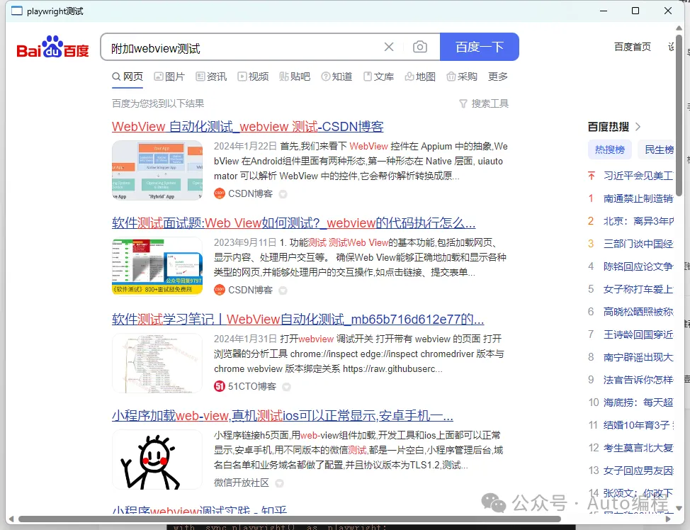

# 利用aardio和Python Playwright实现高效的网页自动化操作

[利用aardio和Python Playwright实现高效的网页自动化操作 (qq.com)](https://mp.weixin.qq.com/s/F6sLUiY0v0YWyYDYSO2L4Q)

### 引言

在上一章中，我们已经实现aardio调用Python Playwright库，本文将进阶介绍如何结合aardio和Python Playwright库，实现高效的网页自动化操作。

**aardio与webview2的结合**

aardio是一款轻量级的编程语言，它以其简洁的语法和高效的性能而受到开发者的喜爱。而webview2是一个功能强大的浏览器控件，它支持现代Web标准，能够嵌入到桌面应用程序中。通过aardio，我们可以轻松地开启webview2的远程调试端口，为后续的自动化操作奠定基础。

## 案例分析：自动化百度搜索

我们将以百度搜索为例，演示如何通过Playwright实现百度搜索的自动化流程。从开启远程端口到编写Python脚本，帮助您理解自动化操作的全过程。

1. 开启webview2远程端口

```
//第4个参数为0则开启远程端口，取空闲端口号
wb = web.view2(mainForm,,,0)
```

 开启后，分配的端口号用wb.remoteDebuggingPort 获取


2. playwright附加webview2


关键代码：

```
# 使用chromium.connect_over_cdp远程连接webview
browser = playwright.chromium.connect_over_cdp("http://127.0.0.1:${port}")
```

使用connect_over_cdp方法附加，参数为地址端口号，这里${port}用了aardio 的字符串模板，使用后会替换为实际的端口号

3. 返回第一个页面对象


从browser中取第一个上下文对象，从第一个上下文对象取第一个页面对象

有了这个页面对象后，就可以开始自动化

```
context = browser.contexts[0]
page = context.pages[0]
```


看下面完整代码：




```
import win.ui;
/*DSG{{*/
mainForm = win.form(text="playwright测试";right=957;bottom=708)
mainForm.add()
/*}}*/

import web.view2;
//第4个参数为0则开启远程端口，取空闲端口号
wb = web.view2(mainForm,,,0)

mainForm.show();

import string.template

html = `
from playwright.sync_api import Playwright, sync_playwright, expect

def run(playwright: Playwright) -> None:

    # 使用chromium.connect_over_cdp远程连接webview
    browser = playwright.chromium.connect_over_cdp("http://127.0.0.1:${port}")
    context = browser.contexts[0]
    page = context.pages[0]
    page.goto("https://www.baidu.com/")
    page.locator("#kw").click()
    page.locator("#kw").fill("附加webview测试")
    page.get_by_role("button", name="百度一下").click()


with sync_playwright() as playwright:
    run(playwright)
    
`
html = string.template(html).format(
    port = wb.remoteDebuggingPort;
)

import process.python;

process.python.version = "3.9.13";
process.python.win32 = true;

process.python.exec(html);


return win.loopMessage();
```

### 库下载

web.view2库在本人的扩展库上下载：

https://mp.weixin.qq.com/s/GxxAKtoCZSu6xUO_Q8WS1Q

