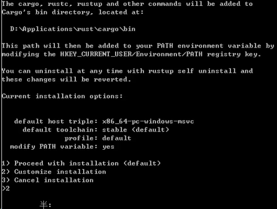

# 1.Rust 开发环境搭建

Rust 官网：[Rust 程序设计语言 (rust-lang.org)](https://www.rust-lang.org/zh-CN/)

如果你觉得安装较为麻烦，只想体验一下的话，可以进入[演练场](https://play.rust-lang.org/)在线使用。

## 1.下载 Rust 安装程序 rustup

访问[Rust 官方网站](https://www.rust-lang.org/zh-CN/tools/install)，下载适用于 Windows 的`rustup-init.exe`安装程序。

安装 Rust 的主要方式是通过 Rustup 这一工具，它既是一个 Rust 安装器又是一个版本管理工具。

教程：[安装 Rust - Rust 程序设计语言 (rust-lang.org)](https://www.rust-lang.org/zh-CN/tools/install)

### 1). channel 版本

Rust 发布在三个不同的 channel 上：stable、beta、nightly，简单说就是三种不同的版本。

- stable：Rust 的稳定版本，每 6 周发布一次。
- beta：Rust 的公开测试版本，将是下一个 stable 版本。
- nightly：每天更新，包含以一些实验性的新特性。

### 2). toolchain

一套 Rust 组件，包括编译器及其相关工具，并且包含 channel，版本及支持的平台信息。

### 3). target

指编译的目标平台，即：编译后的程序在哪种操作系统上运行。

## 2.运行安装程序 rustup

双击运行`rustup-init.exe`，并按照屏幕上的指示进行操作。



按照提示，给出三个选项，分别是：

```bash
1. 默认安装
2. 自定义安装
3. 取消安装
```

这里我么选择 2，进行自定义安装。

输入：`x86_64-pc-windows-gnu`，其他的默认。

最后会确认安装信息，回车进行安装，会从网上下载文件，所以安装过程需要保证网络正常。

### 4). component

toolchain 是由 component 组成的。

查看所有可用和已经安装的组件命令如下：

```bash
rustup component list
```

rustup 默认安装的组件：

- rustc：Rust 编译器。
- rust-std：Rust 标准库。
- cargo：包管理和构建工具。
- rust-docs：Rust 文档。
- rustfmt：用来格式化 Rust 源代码。
- clippy：Rust 的代码检查工具。

### 5). profile

为了方便对 component 进行管理，使用 profile 定义一组 component。

不同的 profile 包含不同的组件，安装 rustup 时有三种 profile 可选：

| Profile | components |
| ------- | ---------- |
|         |            |

修改 profile 命令如下：

```text
rustup set profile minimal
```

## 3.验证安装

在命令提示符或终端中输入验证 Rust 是否正确安装。

```bash
rustc --version
cargo --version
```

## 4.配置 C++构建工具

在安装过程中，可能需要安装 Microsoft C++构建工具。

默认情况，Rust 依赖 `C++ build tools`，没有安装也关系。

[Microsoft C++ 生成工具 - Visual Studio](https://visualstudio.microsoft.com/zh-hans/visual-cpp-build-tools/)

点击链接进入页面后，点击`下载生成工具`，然后就和正常安装包一样安装即可。

## 5.配置环境变量

安装完成后，确保`~/.cargo/bin`目录被添加到 PATH 环境变量中。

### 配置工具链安装位置

在系统环境变量中添加如下变量：

`CARGO_HOME` 指定 `cargo` 的安装目录

`RUSTUP_HOME` 指定 `rustup` 的安装目录

默认分别安装到用户目录下的`.cargo` 和`.rustup` 目录

## 6.配置国内镜像

为了提高下载速度，你可以配置 Rust 和 cargo 的国内镜像源。

### 1). 配置 rustup 国内镜像

在系统环境变量中添加如下变量（选一个就可以，可以组合）：

```bash
# 清华大学
RUSTUP_DIST_SERVER：https://mirrors.tuna.tsinghua.edu.cn/rustup
RUSTUP_UPDATE_ROOT：https://mirrors.tuna.tsinghua.edu.cn/rustup/rustup
# 中国科学技术大学
RUSTUP_DIST_SERVER：https://mirrors.ustc.edu.cn/rust-static
RUSTUP_UPDATE_ROOT：https://mirrors.ustc.edu.cn/rust-static/rustup
```

### 2). 配置 cargo 国内镜像

在 cargo 安装目录下新建 config 文件（注意 config 没有任何后缀），文件内容如下：

```bash
[source.crates-io]
registry = "https://github.com/rust-lang/crates.io-index"
replace-with = 'tuna'

# 清华大学
[source.tuna]
registry = "https://mirrors.tuna.tsinghua.edu.cn/git/crates.io-index.git"

# 中国科学技术大学
[source.ustc]
registry = "git://mirrors.ustc.edu.cn/crates.io-index"
# 设置代理
[http]
proxy = "127.0.0.1:8889"
[https]
proxy = "127.0.0.1:8889"
```

## 7.交叉编译配置（可选）

如果需要进行交叉编译，可以安装相应的 target 和工具链。

### Windows 交叉编译 Linux 程序

目标服务器是 `Linux(CentOS 7) 64bit`, 所以我们添加的 target 应该是`x86_64-unknown-linux-gnu`(动态依赖) 或者`x86_64-unknown-linux-musl`（静态依赖）

解释：

- 动态依赖：目标服务器需要包含动态依赖的相关库（用户共享库）
- 静态依赖，目标服务器不需要包含相应的库，但是打包文件会更大些
  1). 添加需要的 target

```bash
rustup target add  x86_64-unknown-linux-musl
```

2). 在 cargo 安装目录下新建 config 文件（注意 config 没有任何后缀），添加的文件内容如下：

```bash
[target.x86_64-unknown-linux-musl]
linker = "rust-lld"
```

3). 构建

```bash
cargo build --target x86_64-unknown-linux-musl
```

## rustup 命令相关

```bash
# 显示当前安装的工具链信息
rustup show
# 检查安装更新
rustup update
# 卸载
rustup self uninstall
# 设置当前默认工具链
rustup default stable-x86_64-pc-windows-gnu
# 查看帮助
rustup -h
# -------------------------->配置工具链
# 查看工具链
rustup toolchain list
# 安装工具链
rustup toolchain install stable-x86_64-pc-windows-gnu
# 卸载工具链
rustup toolchain uninstall stable-x86_64-pc-windows-gnu
# 设置自定义工具链
rustup toolchain link <toolchain-name> "<toolchain-path>"
# -------------------------->配置一个目录以及其子目录的默认工具链
# 查看已设置的默认工具链
rustup override list
# 设置该目录以及其子目录的默认工具链
rustup override set <toolchain> --path <path>
# 取消目录以及其子目录的默认工具链
rustup override unset --path <path>
# -------------------------->配置工具链的可用目标
# 查看目标列表
rustup target list
# 安装目标
rustup target add <target>
# 卸载目标
rustup target remove <target>
# 为特定工具链安装目标
rustup target add --toolchain <toolchain> <target>
# -------------------------->配置 rustup 安装的组件
# 查看可用组件
rustup component list
# 安装组件
rustup component add <component>
# 卸载组件
rustup component remove <component>
```

rustc 相关

```bash
# 查看rustc版本
rustc --version
```

### cargo 常用

```bash
# 查看cargo版本
cargo --version
# 新建项目
cargo new <project_name>
# 构建项目
cargo build
# 运行项目
cargo run
# 检查项目
cargo check
# 查看帮助
cargo -h
```

### 最全 cargo 命令

文档：

涵盖了从项目创建到开发、测试、文档生成、安全审核、代码格式化和发布的各个方面。这些命令的完整细节和更多选项可以在 Cargo 的官方文档或相应的第三方文档中找到。

| 命令              | 作用                                  | 示例                           |
| ----------------- | ------------------------------------- | ------------------------------ |
| `cargo new`       | 创建一个新的 Rust 项目                | `cargo new my_project`         |
| `cargo build`     | 编译项目和其依赖                      | `cargo build --release`        |
| `cargo run`       | 编译并运行 Rust 项目                  | `cargo run`                    |
| `cargo test`      | 运行项目的测试                        | `cargo test`                   |
| `cargo doc`       | 为项目的依赖生成文档                  | `cargo doc --open`             |
| `cargo update`    | 更新 `Cargo.lock` 文件中的依赖版本    | `cargo update`                 |
| `cargo check`     | 快速检查代码能否编译                  | `cargo check`                  |
| `cargo clean`     | 清除编译生成的文件                    | `cargo clean`                  |
| `cargo publish`   | 将包发布到 crates.io                  | `cargo publish`                |
| `cargo bench`     | 运行基准测试                          | `cargo bench`                  |
| `cargo fetch`     | 下载项目依赖的 crate，但不进行编译    | `cargo fetch`                  |
| `cargo install`   | 安装和管理 Rust 二进制文件            | `cargo install [crate_name]`   |
| `cargo uninstall` | 卸载通过 Cargo 安装的 Rust 二进制文件 | `cargo uninstall [crate_name]` |
| `cargo package`   | 准备一个本地 crate 以便发布           | `cargo package`                |
| `cargo search`    | 在 crates.io 上搜索 crate             | `cargo search [search_query]`  |
| `cargo login`     | 使用 API token 登录 crates.io         | `cargo login [token]`          |
| `cargo owner`     | 管理 crate 的所有者                   | `cargo owner --add [username]` |
| `cargo init`      | 在现有目录中初始化新的 Rust 项目      | `cargo init my_project`        |
| `cargo version`   | 显示 Cargo 的版本信息                 | `cargo version`                |
| `cargo vendor`    | 将所有依赖复制到本地目录              | `cargo vendor`                 |
| `cargo metadata`  | 输出 JSON 格式的项目元数据            | `cargo metadata`               |
| `cargo tree`      | 显示项目依赖树                        | `cargo tree`                   |
| `cargo fix`       | 自动修复 Rust 代码中的警告            | `cargo fix`                    |
| `cargo audit`     | 审核 Cargo.lock 以查找不安全的依赖    | `cargo audit`                  |
| `cargo rustc`     | 提供对 rustc 编译器参数的访问         | `cargo rustc -- [options]`     |
| `cargo rustdoc`   | 为项目运行 rustdoc 工具               | `cargo rustdoc -- [options]`   |
| `cargo clippy`    | 运行 clippy 来进行代码审查            | `cargo clippy`                 |
| `cargo fmt`       | 使用 rustfmt 格式化代码               | `cargo fmt`                    |
| `cargo miri`      | 运行 miri 以执行内存安全检查          | `cargo miri test`              |
| `cargo outdated`  | 检查过时的依赖                        | `cargo outdated`               |
| `cargo release`   | 自动化 crate 发布流程                 | `cargo release`                |
| `cargo add`       | 向 Cargo.toml 添加新依赖              | `cargo add [crate_name]`       |
| `cargo rm`        | 从 Cargo.toml 中移除依赖              | `cargo rm [crate_name]`        |
| `cargo upgrade`   | 升级 Cargo.toml 的依赖版本            | `cargo upgrade [crate_name]`   |

请注意，一些命令如 `cargo audit`, `cargo clippy`, `cargo fmt`, `cargo miri`, `cargo outdated`, `cargo release`, `cargo add`, `cargo rm`, 和 `cargo upgrade` 实际上是由第三方提供的 Cargo 扩展（也称为 "cargo 子命令"），并可能需要单独安装。

# Rust下载依赖慢或卡住的问题及解决方法

如果你在使用Rust进行编程时，你可能会遇到下载依赖库时出现下载缓慢或者卡住的情况。由于Rust默认的镜像下载地址是在国外，因此在某些网络环境下，下载速度可能会受到影响。

## **解决方案**

对于以上的问题，我们有几种可能的解决方案：

### **1. 开启命令行或全局代理**

在大多数情况下，代理工具默认只会开启浏览器的代理，对于命令行或其他软件的访问，并不会代理流量。这意味着这些通过命令行或其他软件进行的网络访问还是通过正常的网络进行的，导致下载速度非常慢。

因此，你需要在你的代理工具中开启终端代理或全局代理。以ClashX为例，你可以通过点击“复制终端代理命令”来自动复制以下的代理命令，并在终端中执行这些命令以完成代理设置：

```bash
export https_proxy=http://127.0.0.1:7890 http_proxy=http://127.0.0.1:7890 all_proxy=socks5://127.0.0.1:7891
```

### **2. 修改Rust的下载镜像为国内镜像地址**

另一种解决方案是直接修改Rust的默认下载镜像地址为国内的镜像地址。这种方法可以一劳永逸地解决问题，但配置过程可能稍显麻烦。

要使用crates.io之外的镜像服务，你需要修改`$HOME/.cargo/config.toml`文件，以添加新的服务提供商。有两种方式可以实现这个目标：新增镜像地址和覆盖默认的镜像地址。

#### **2.1 新增镜像地址**

首先是在crates.io之外添加新的注册服务。在`$HOME/.cargo/config.toml`文件中添加以下内容：

```bash
[registries]
ustc = { index = "https://mirrors.ustc.edu.cn/crates.io-index/" }
```

这种方式只会新增一个新的镜像地址，因此在引入依赖的时候，你需要指定该地址。例如，如果你想在你的项目中引入`time`包，你需要在`Cargo.toml`文件中使用以下方式进行引入：

```bash
[dependencies]
time = {  registry = "ustc" }
```

这种方法的缺点是，每次添加新的依赖时，都需要在`Cargo.toml`文件中指定新的镜像地址。因此，如果你的项目非常大，这种方法可能会非常麻烦。

#### **2.2 覆盖默认的镜像地址**

相比于新增镜像地址，我们更推荐覆盖默认的镜像地址这种方法，因为这种方法无需修改`Cargo.toml`文件，而是直接使用新注册服务来替代默认的crates.io。

在`$HOME/.cargo/config.toml`文件中添加以下内容：

```bash
[source.crates-io]
replace-with = 'ustc'

[source.ustc]
registry = "git://mirrors.ustc.edu.cn/crates.io-index"
```

这种方法的好处是，任何需要从crates.io下载的包，都将从中国科大的镜像地址下载，从而极大地提高下载速度。

### **下载卡住的问题**

如果你遇到了下载进程完全卡住不动的问题，那么问题的原因可能是索引更新速度太慢。Rust的包数量越来越多，索引文件也越来越大，如果不使用国内镜像，这种情况可能会比较常见。不过，一旦你配置好了国内镜像，这个问题应该就可以得到缓解了。

另外，如果你同时使用了VSCode和命令行，而VSCode的rust-analyzer插件在下载新的依赖时锁定了当前项目，那么你可能会看到以下的错误消息：

```bash
$ cargo build
    Blocking waiting for file lock on package cache
    Blocking waiting for file lock on package cache
```

这个问题出现的原因是，VSCode的下载进程正在运行，而该下载进程已经锁住了当前的项目，导致你无法在另一个地方再次进行构建。解决这个问题的方法有几种：

- 增加下载速度（见前面的解决方法）
- 耐心等待持有锁的用户构建完成
- 强行停止正在构建的进程，例如杀掉IDE使用的rust-analyzer插件进程，然后删除`$HOME/.cargo/.package_cache`目录


# 配置 VSCode 开发环境

*（可选但推荐）* 具有 Rust 自动补全支持的 IDE。 我们推荐以下之一：

- [RustRover](https://www.jetbrains.com/rust/);
- [Visual Studio Code](https://code.visualstudio.com/) 配置了 [`rust-analyzer`](https://marketplace.visualstudio.com/items?itemName=matklad.rust-analyzer) 扩展。

以下以VSCode为例

配置开发环境相当简单，只要安装以下插件即可：

rust-analyzer

Rust Syntax

Rust Extension Pack

Rust Doc Viewer

Rust Assist

## **与 Rust 直接相关的插件**

### **1. rust-analyzer：Rust 语言支持**

rust-analyzer 是 Rust 官方的语言服务器实现,提供了代码补全、跳转定义、类型推断等一系列强大的功能。它是 Rust 开发者必备的插件之一。

```
fn main() {
    // rust-analyzer 会自动补全 println! 宏
    println!("Hello, world!");
}
```

### **2. crates：Rust 包管理**

crates 插件提供了方便的 Rust 包管理功能,你可以直接在 VS Code 中搜索、安装和更新 Rust 库。

### **3. CodeLLDB：Rust 调试支持**

CodeLLDB 是一个基于 LLDB 的调试器插件,提供了对 Rust 的调试支持。使用 CodeLLDB,你可以方便地在 VS Code 中调试 Rust 程序。

## **与 Rust 开发相关但不限于 Rust 的插件**

### **4. Even Better TOML：TOML 文件支持**

Even Better TOML 为 VS Code 提供了增强的 TOML 文件支持,包括语法高亮、格式化等功能。

### **5. Error Lens：错误提示优化**

Error Lens 可以在编辑器中直接显示错误信息,方便快速定位和修复问题。

### **6. GitLens：Git 增强**

GitLens 是一个强大的 Git 工具,提供了代码历史、文件注解等功能,方便代码追踪和管理。

### **7. Prettier - Code formatter：代码格式化**

Prettier 是一个通用的代码格式化工具,支持多种编程语言。虽然 Rust 已经内置了 rustfmt,但 Prettier 可以格式化项目中的其他文件,如 JSON、YAML 等。

### **8. TODO Highlight：TODO 高亮**

TODO Highlight 可以高亮显示代码中的 TODO 和 FIXME 等标记,方便开发者追踪待办事项。

```
// TODO: 完善错误处理逻辑
fn some_function() {
    // ...
}
```

## **与 Rust 开发关系较远的插件**

### **9. Better Comments：优化注释显示**

Better Comments 可以为不同类型的注释添加不同的颜色和样式,提高注释的可读性。

```
// ! 这是一个重要的注释
// ? 这是一个问题
// TODO: 这是一个待办事项
```

### **10. Bookmarks：代码书签**

Bookmarks 插件允许你在代码中添加书签,方便快速定位重要的代码片段。当项目变得庞大时,使用书签可以显著提高导航效率。

# cargo-make：强大的构建工具

- cargo-make Github Repo: https://github.com/sagiegurari/cargo-make
- cargo-make 文档: https://sagiegurari.github.io/cargo-make/

推荐一个非常强大的 Rust 构建和任务运行工具——cargo-make。

## **引言**

相信不少 Rust 开发者都使用过 Makefile 来管理项目的构建流程。Makefile 确实很强大，但在跨平台支持、可读性和可维护性上还是有一些不足之处。有没有一个更加现代化、Rust 原生、功能更强大的替代品呢？

## **创作背景**

最近在做 Rust 项目时发现了 cargo-make 这个超级好用的工具，它完全是用 Rust 编写的，可以非常方便地在 Rust 项目中定义各种任务，诸如：

- 格式化代码
- 构建项目
- 运行测试
- 生成文档
- 执行自定义脚本
- ...

## **主要特性**

cargo-make 主要有以下特性：

- 使用简单的 TOML 配置文件定义 task
- 支持 task 之间的依赖关系
- 内置大量常用 task，开箱即用
- 支持自定义 task，可以使用 shell 脚本、Python、Rust 等实现
- 支持在 task 中设置环境变量
- 友好的命令行提示，带语法高亮
- 支持 workspace 和多 package 项目
- 跨平台，可在 Linux、macOS、Windows 上使用

## **快速上手**

安装 cargo-make：

```bash
cargo install --force cargo-make  
```

在项目根目录创建 Makefile.toml 文件：

```bash
[env]
CARGO_MAKE_EXTEND_WORKSPACE_MAKEFILE = true

[tasks.format]
install_crate = "rustfmt"
command = "cargo"
args = ["fmt", "--", "--emit=files"]

[tasks.build]
command = "cargo"
args = ["build"]
dependencies = ["format"] # 构建前先进行代码格式化

[tasks.test]
command = "cargo"
args = ["test"]
dependencies = ["build"] # 测试前先进行构建  
```

运行 task：

```bash
cargo make test
# 相当于依次执行 format、build、test 三个 task
```

输出：

```bash
[cargo-make] INFO - cargo make 0.35.7
[cargo-make] INFO - Running Task: format
[cargo-make] INFO - Running Task: build
   Compiling hello v0.1.0 (/path/to/hello)
    Finished dev [unoptimized + debuginfo] target(s) in 1.24s
[cargo-make] INFO - Running Task: test
   Compiling hello v0.1.0 (/path/to/hello)
    Finished test [unoptimized + debuginfo] target(s) in 1.31s
     Running unittests src/lib.rs (target/debug/deps/hello-1082c0f1850e2ea3)

running 1 test
test tests::it_works ... ok

test result: ok. 1 passed; 0 failed; 0 ignored; 0 measured; 0 filtered out; finished in 0.00s
```

通过在 dependencies 字段指定依赖的 task，cargo-make 就能自动确保先执行依赖项，非常方便。

## **总结**

cargo-make 是一个功能丰富、使用简单的 Rust 项目构建工具，非常适合各种规模的 Rust 项目使用。有了 cargo-make，我们可以把项目的各种构建、测试任务统一由它来管理，让项目更加规范和易于维护。感兴趣的同学赶快试试吧！

# cargo-generate：Rust 项目生成利器

## 文档

- cargo-generate 官方文档：https://cargo-generate.github.io/cargo-generate/
- cargo-generate GitHub 仓库：https://github.com/cargo-generate/cargo-generate

## 引言

作为一名 Rust 开发者，你是否曾为如何快速创建一个新项目而苦恼？是否希望能够基于已有的模板来生成项目，从而节省时间和精力？本文将为你介绍一个强大的工具：cargo-generate，它能够帮助你快速生成 Rust 项目，提高开发效率。

## 创作背景

在日常的 Rust 开发中，我们经常需要创建新的项目。虽然可以手动创建项目目录和文件，但这个过程较为繁琐，尤其是当项目结构较为复杂时。因此，我们希望能够有一种工具，能够根据预定义的模板快速生成项目，并且支持自定义和扩展。这就是 cargo-generate 的由来。

## 主要特性

cargo-generate 是一个基于 Rust 编写的项目生成工具，它具有以下主要特性：

1. 支持基于 Git 仓库作为模板生成项目
2. 使用 Liquid 模板引擎，支持条件判断、循环等功能
3. 支持正则表达式替换占位符
4. 支持自定义 Hook 脚本，可以在生成项目的不同阶段执行自定义操作
5. 内置多个常用占位符，如项目名称、作者信息等
6. 支持排除某些文件或目录，不进行模板渲染
7. 支持条件判断，根据条件生成不同的文件或内容

## 快速上手

下面我们通过一个简单的示例来演示如何使用 cargo-generate 生成项目。

首先，确保你已经安装了 Rust 和 Cargo。然后，使用以下命令安装 cargo-generate：

```bash
cargo install cargo-generate
```

接下来，我们以官方提供的示例模板为例，生成一个新项目：

```bash
cargo generate --git https://github.com/ashleygwilliams/wasm-pack-template
```

执行上述命令后，cargo-generate 会提示你输入项目名称和其他相关信息。输入完成后，它会基于模板生成一个新的项目目录。

让我们来看看生成的项目结构：

```bash
cd my-project
tree .
.
├── Cargo.toml
├── LICENSE
├── README.md
├── src
│   ├── lib.rs
│   └── utils.rs
└── tests
    └── web.rs
```

可以看到，生成的项目包含了 Cargo.toml 配置文件、LICENSE 许可证文件、README.md 说明文档以及 src 和 tests 目录。

接下来，我们可以尝试构建和测试这个项目：

```bash
cargo build
cargo test
```

如果一切正常，项目应该可以成功编译和通过测试。

## 总结

cargo-generate 是一个非常实用的工具，它可以帮助 Rust 开发者快速生成项目，提高开发效率。通过使用预定义的模板和自定义的占位符、Hook 脚本等功能，我们可以轻松地创建符合特定需求的项目结构。如果你经常需要创建新的 Rust 项目，不妨试试 cargo-generate，相信它会给你的开发工作带来很大的便利。
