# 2.Rust 基础篇

学习篇（滑到最后看目录学习）：[三角兽新系列！拥抱未来语言Rust (qq.com)](https://mp.weixin.qq.com/s/OpY5LzHo3czJIYQVOM_gyQ)

github：[reganzm/hug_rust: 拥抱rust (github.com)](https://github.com/reganzm/hug_rust)

## 1.创建 Rust 项目

安装完开发环境后，我们就可以创建项目开发了

### 1.随便合适的地方，比如桌面，创建项目

按 `shift + 鼠标右键` ，选择 `此处打开命令行` ，运行以下命令：

```bash
cargo new hello-rust
```

### 2.使用 VSCode 打开项目

此时，文件夹目录是这样的，`Cargo` 已经帮我们创建好默认项目了，还创建了个 git 的本地仓库，还有一些配置文件，以后会说到。你只要知道 `src/main.rs` 为编写应用代码的地方。

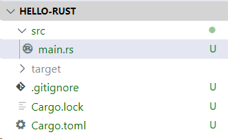

### 3.运行项目

新建项目已经为我们创建好了默认的 Hello World 项目，我们直接在 `vscode` 的终端中运行 `cargo run` 命令，就可以看到系统输出了 Hello World。

```bash
cargo run
```

### 4.编写 Hello-Rust

`Cargo.toml` 文件是一个管理项目配置的文件，包括项目依赖等相关配置，我们在后面会详细介绍该文件，现在我们来添加一个依赖，

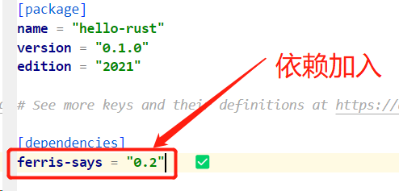

然后在 vscode 终端运行

```bash
cargo build
```

终端就会有以下输出，可以看到 cargo 会自动为我们添加依赖，并且安装好依赖所依赖的依赖（直接绕口令）

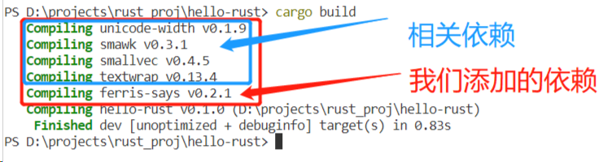

接下来就在 src/main.rs 中写入以下内容

```rust
use ferris_says::say; // from the previous step
use std::io::{stdout, BufWriter};
fn main() {
    let stdout = stdout();
    let message = String::from("Hello fellow Rustaceans!");
    let width = message.chars().count();

    let mut writer = BufWriter::new(stdout.lock());
    say(message.as_bytes(), width, &mut writer).unwrap();
}
```

然后在终端中再次执行

```bash
cargo run
```

就会看到以下结果

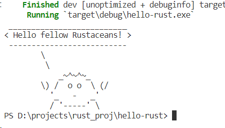

这个案例我们随后会进行更加细致的讲解，并且随着后面的学习，对其中的语法理解会更加的深刻。

> Rustaceans
> 是对学习 Rust 者的称呼。

## 其他待总结

[5 分钟带你入门 Rust 编程语言官方推荐工具 Rustup (qq.com)](https://mp.weixin.qq.com/s/Gr83TxNVdw8ISO0AastnlQ)

[安装 - Cargo 手册 中文版 (rustwiki.org)](https://rustwiki.org/zh-CN/cargo/getting-started/installation.html)

[精通 Rust 的包管理工具 Cargo (qq.com)](https://mp.weixin.qq.com/s/bKMTKxCSGQ1Ck3mGeal3pA)

[Rust开发革新：热重载技术实战指南与应用技巧 (qq.com)](https://mp.weixin.qq.com/s/zthXJDutvpKwZ6vjRdHFsw)

[[Rust 极简教程：最快上手 Rust 编程! (qq.com)](https://mp.weixin.qq.com/s/722roFliQeQnFNUy8VdNVA)](https://mp.weixin.qq.com/s/722roFliQeQnFNUy8VdNVA)

[[【Rust 基础篇】Rust FFI：连接Rust与其他编程语言的桥梁 - 掘金 (juejin.cn)](https://juejin.cn/post/7261270802645221436)](https://juejin.cn/post/7261270802645221436)

[使用Rust构建IP嗅探器 (qq.com)](https://mp.weixin.qq.com/s/mwKNXh7jAtRdp6Jx8OYpVg)


[【Rust 基础篇】Rust 属性宏：定制你的代码 - 掘金 (juejin.cn)](https://juejin.cn/post/7264503343997304886)

[【一起学 Rust】Rust 的 Hello Rust 详细解析\_rust hello world-CSDN 博客](https://blog.csdn.net/weixin_47754149/article/details/125719846)

[【一起学 Rust】Rust 包管理工具 Cargo 初步了解\_cargo.lock-CSDN 博客](https://blog.csdn.net/weixin_47754149/article/details/125777228)

[【一起学 Rust】Rust 学习前准备——注释和格式化输出\_rust 中英文对齐打印-CSDN 博客](https://blog.csdn.net/weixin_47754149/article/details/125781896)

[【一起学 Rust | 基础篇】Rust 基础——变量和数据类型\_rust 变量指定数据类型-CSDN 博客](https://blog.csdn.net/weixin_47754149/article/details/125908011)

[【一起学 Rust | 基础篇】rust 函数与流程控制详解\_rust else-CSDN 博客](https://blog.csdn.net/weixin_47754149/article/details/125910031)

[【一起学 Rust | 基础篇 | rust 新特性】Rust 1.65.0——泛型关联类型、let-else 语句\_rust let else-CSDN 博客](https://blog.csdn.net/weixin_47754149/article/details/127799295)

# 前端开发者视角入门Rust

前端开发者上手

[前端开发者的 Rust 尝鲜: Rust 的第一印象 - 掘金 (juejin.cn)](https://juejin.cn/post/7297552952272207923)

[rust 上手很难？搞懂这些知识，前端开发能快速成为 rust 高手 (qq.com)](https://mp.weixin.qq.com/s/21uNUnzecB7okbjlT2u15Q)

[盘点 Rust 中的那些天才构思 - 掘金 (juejin.cn)](https://juejin.cn/post/7364224622679965730)

参考文章：[写给想学 Rust 的前端同学 - 掘金 (juejin.cn)](https://juejin.cn/post/7340573362214699049)

## 前言

Rust 可能正在逐渐渗透前端的方方面面，所以作为一个前端究竟有没有必要学习 Rust 呢？我认为，还是看个人的精力吧，有那个精力多学一点没有坏处，没那个精力不学也没有影响。本篇不是讨论该不该学 Rust，而是将 Rust 大概是一个**什么样的语言**展现给可能在观望的小伙伴，并以一个**前端的视角**来看看 Rust 究竟和前端有什么不一样。

本篇也是我在认真阅读了[Rust 程序设计语言 - Rust 程序设计语言 简体中文版](https://kaisery.github.io/trpl-zh-cn/title-page.html)几遍以后，才敢下笔做一些总结，因能力有限，错误之处还望大家及时指出。

我会从一个语言层面的几个方面来分析 Rust 究竟和 JavaScript 以及 TypeScript 这样的语言的不同之处，以及相似之处，并且希望能给想要学习 Rust 的同学一些语言的梗概，也给前端学习 JS 的同学一些新的理解。

## Rust VS JavaScript

| 属性             | Rust      | JavaScript            |
| ---------------- | --------- | --------------------- |
| 编译器           | rustc     | v8                    |
| 包管理工具       | cargo     | npm、yarn、pnpm、cnpm |
| 第三方依赖注册表 | crates.io | npmjs.com             |
| 垃圾回收         | 无        | 有                    |

## 数据类型

Rust 的数据类型同样分为基础类型和复杂类型，主要包括以下几类：

- 基础类型：包括整型、浮点型、布尔型、字符型
- 复杂类型：元组、数组以及其他复合类型

这点和传统的强类型语言基本是一致的，但是 Rust 也拥有不同的地方。

Rust 声明变量的方法竟然和 JS 出奇的一致，并且很多方面也是类似 JS 或 TS 的写法：

```rust
// 声明不可变变量
let a = 1;

// 声明可变变量
// 如果没有 mut 关键字，修改变量会导致报错
let mut b = 2;
b = 3;

// 重复声明变量，会发生遮蔽，即覆盖原有变量
// 此时之前声明的 a 变量无效了
let a = 2;

// 声明元组，近似理解为 TS 中的元组
let c = ('a', 2);
// 元组可以被解构，也是类似 JS 的解构
// 此时变量a就是'a'，变量b则是2
let (a, b) = c;

// 声明数组
let arr = [1,2,3,4];
// 还可以有很多方式
// 表示arr1是一个包含两个元素，每个元素的值都是3
let arr1 = [3;2];
```

## 流程控制

流程控制则和大多数语言一样，包括 if-else、while 循环、for 循环，不同的是，还多了一个 loop 循环：

```rust
// if 后面没有括号，并且后面的值类型只能是 bool 类型
// 并没有 JS 中类型转换的能力，这点其实和其他语言是类似的
if 1 > 2 {
    
} else {

}

// while 循环也是一样，后面没有括号
while 1 > 2 {}

// for 循环有点类似 JS 中的 for-in 循环
let arr = [1,2,3,4];
for i in arr {
    // 这里遍历的值都是值本身，并没有索引
    // 打印1,2,3,4
}

// loop 循环则是 while 不带条件的循环：
loop {
    // 代码块中的代码会不停的循环
    // 退出循环可以使用 break 或者 continue
}
```

## 结构体和枚举

Rust 的结构体类似于 C 语言的结构体，这也是 JS 所没有类型。而枚举类型则在 TS 中是有的，但是 Rust 的枚举功能远远多于 TS 中的枚举。

```rust
// 普通结构体
struct Person {
    name: String,
    age: u8,
}

// 元组结构体
struct Color(i32, i32, i32);

// 单元结构体
struct Unit;

// 声明结构体
let p = Person {
    name: "qiugu",
    age: 22
};

// 结构体也可以解构
// name 为 "qiugu"，age 为 22
let Person { name, age } = p;
```

枚举是 Rust 中非常重要的数据类型。Rust 中并没有空指针的概念，于是 Rust 通过枚举类型来模拟空的概念：

```rust
// 这是 rust 标准库内置的枚举类型 Option
enum Option<T> {
    Some(T),
    None
}
```

Rust 中很多方法返回的都是 Option 类型，通过处理 Option 类型来拿到具体的值，如果是 None，则表示空的概念。关于如何匹配枚举类型的值，这点后面会说到。

## 集合

Rust 中常用的集合类型包括以下几种：

- string
- vector
- hashmap

这些类型在 Rust 中都是复杂类型，其中在 JS 常用的基本类型 string，在这里其实非常复杂，并且其他语言中的 string 类型都比较复杂，只是 JS 做了很多工作，简化了 string 的使用。

```rust
// 声明可变 String 类型
let mut s = String::from("i am a coder");
// 修改 String
s.push_str("abc");
// i am a code abc

// 注意：这并不是 String 类型，而是字符串切片类型slice
let s1 = "i am str";
// 这样才是 String 类型
let s2 = String::from(s1);

// String是复杂类型
let s1 = String::from("i am a coder");
let s2 = s1;
// 打印s1会报错，因为s1的所有权已经被转移
// 这也证明了String是一个复杂类型，因为基础类型会复制一个值，而复杂类型只是复制了引用
println!("{}", s1); // 报错
```

## 类型系统

可以发现上面所有的示例代码并没有类型注解，原因是因为 Rust 可以自动推导类型（这是不是和 TS 有点像）。

可以在 VSCode 中安装 Rust 的插件，就可以看到变量对应的类型：

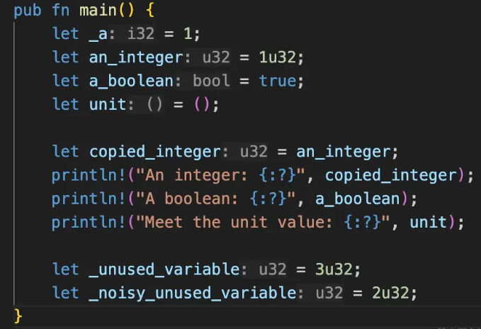

Rust 的类型系统除了可以自动推导变量类型，也存在泛型的类型复用能力，可以近似理解为 TS 中的泛型概念。

我们知道 TS 中存在 interface 类型复用类型，以及定义类型的结构包含哪些属性方法。Rust 中同样也存在类似的概念 trait：

```rust
// 定义 trait
trait Greet {
    fn hello(&self) -> String;
}
```

是不是和 interface 非常相似！

如何实现这个 trait 呢？逻辑也是类似的，Rust 中也需要对象才能实现 trait，Rust 中的对象其实就是结构体类型：

```rust
// 定义一个单元结构体（什么属性都不包括的结构体）
struct Person;

// 实现 Greet trait
impl Greet for Person {
    // 先不用看方法如何声明，后面会提到
    fn hello(&self) -> String {
        // 注意：语句后面没有分号，表示它是一个表达式，而不是语句
        String::from("hello, man!")
    }
}

// 使用
fn main() {
    let p = Person;
    // 执行 trait 上的方法
    p.hello(); // hello, main!
}
```

现在是不是对 Rust 更熟悉一点了！

接下来就是 Rust 独有的**生命周期**概念，它也是泛型的一部分。生命周期又涉及到了`引用`的概念。引用在 JS 中同样存在，只是和 Rust 引用并不一样：

```rust
let x = 5;
// 可以引用任意类型的变量
let r = &5;

println!("x: {}, r: {}", x, r); // x: 5, r: 5
```

稍微改写一下上面的代码：

```rust
let r;
{
    let x = 5;
    r = &x;
    // rust 作用域也存在块级作用域
    // 并且当变量退出该作用域时，引用该变量的其他值，这里就是r也会失效
    // 这样会导致变量r变成一个空引用
}
println!("r: {}", r);
```

我们可以在编译时就能发现上面代码的问题：

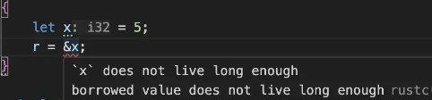

翻译一下，就是变量x的生命周期不如变量r的生命周期长，因为当x退出块级作用域时，变量r还依然存在，而生命周期就是为了确保引用总是有效。上面的例子可以通过作用域直接看出来变量生命周期的长短，但是以下情况无法直接看出来变量的生命周期：

```rust
// 返回x、y中的大值
// 注意x、y都是引用类型，并且返回的也是引用类型
// 编译器无法确定返回类型的引用的生命周期是和x一样长，还是和y一样长，或者和x、y都一样长
// 所以编译无法通过
fn longest(x: &str, y: &str) -> &str {
    if x.len() > y.len() {
        x
    } else {
        y
    }
}
```

这个时候就需要使用生命周期注解来告诉编译器这些引用之间的生命周期关系是怎样的：

```rust
// 生命周期注解就是在引用符合后面加上'a，表示该引用生命周期为'a
// 变量x、y，以及返回类型的生命周期都是一样的，说明它们的引用的生命周期也都是一样长
// 这样编译器就可以确定引用都是有效的，编译可以通过
fn longest(x: &'a str, y: &'a str) -> &'a str {
    if x.len() > y.len() {
        x
    } else {
        y
    }
}
```

## 函数、方法及闭包

在 JS 中函数和方法可以看作是一个意思，但是 Rust 中的函数和方法却是不一样的。

Rust 中的函数就是我们在上一节看到的 longest 函数，指定了参数、以及参数类型，并且指定了返回值类型，还是以上面的函数举例：

```rust
// 函数参数必须指定其类型，这和声明变量时自动推导类型表现不一样
// 原因可能因为对于一个函数来说，需要暴露给调用者使用，因此需要明确参数和输出参数的类型
fn longest(x: &'a str, y: &'a str) -> &'a str {
    if x.len() > y.len() {
        x
    } else {
        y
    }
}
```

可以看到上面的函数并没有指定像 return 这样的关键字来返回值，而是将返回值包裹在大括号中了。这是因为 Rust 中块级作用域的最后一个表达式就作为其返回值。注意表达式是不带分号结尾的，带上了分号就变成了语句，而不是表达式，这点在前面已经提到过了。

```rust
// x 的值就是 3
let x = {
    let a = 1 + 2;
    a
};

// 函数的返回值就是最后一个表达式的结果，也就是 a+b 的结果
fn foo(a: i32, b: i32) -> i32 {
    let c = a * b;
    let d = c + 1;
    a + b
}
```

而方法和函数不一样的地方在于，方法是依附于对象存在的，调用函数时，直接函数名称后面接括号就可以调用了，但是方法则需要使用对象来调用，比如，前面提到的 trait 实现，其就是一个方法：

```rust
impl Greet for Person {
    // 注意：方法的第一个参数都是 self，表示对象自身，这里并没有用到 self
    fn hello(&self) -> String {
        String::from("hello, man!") 
    } 
}

// 调用方法
p.hello();

// 调用函数
foo();
```

最后 Rust 中也存在闭包的概念。闭包也是一种函数，只是闭包写法和普通函数不一样，并且可以捕获上下文中的变量：

```rust
let a = 1;
// 使用“||”表示参数列表，同普通函数的小括号
// 如果有参数就写在双竖线中间
// 闭包的参数和返回值类型可以不写，编译器会自动推断，但是一旦确定类型，就不能再传其他类型
let b = ||{
    a + 1
};
b();
```

闭包一般是作为函数或方法的参数，因为它可以捕获上下文中的变量，这点和 JS 是有异曲同工之妙的。

## 模块化

作为一门强类型语言，模块化是其与生俱来的功能，这点不像 JS，过了很多年才有模块化。

Rust 的模块化，了解几个关键词就能大概掌握了。

```rust
// a.rs
// 使用 pub 导出结构体
pub struct Person;

// 导出函数
pub fn foo() -> String {
    String::from('i am a coder')
}

// 没有使用pub导出的数据不能被外部使用
enum Color(u8, u8, u8);

// main.rs
// 声明a模块
// a就是a.rs的文件名称
mod a;
// 使用use指定使用a模块中的哪些内容
// 注意：只能使用a模块中使用pub关键字导出的
use a::Person;
// 也可以写完整的导入路径
use crate::a::Person;
// 导入多个
use a::{Person, foo}
// 或者*匹配所有导出的成员
use a::*;

let p = Person;
```

## 内存模型

Rust 的内存模型外观上和 JS 是相似的，比如 Rust 的基本类型存储在栈上，复杂类型则存储在堆上，但是本质上还是区别比较大的。

```rust
// 基本类型
let a = 1;
let b = a;

// 复杂类型
let s = String::from("hello");
let s1 = s;
```

以上代码我们使用一张图来展示其执行过程：

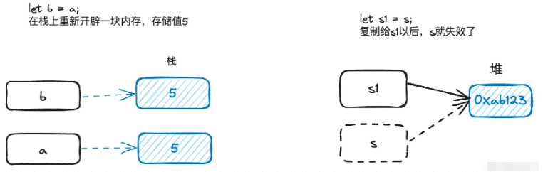

重点就是堆内存的分配，当 s 复制给 s1 的时候，并不会像 JS 那样存在两个“指针”同时指向存储 hello 字符串的内存，而是 s 的“指针”失效了，也就是同一时刻，只能有一个指向该内存的“指针”，这个“指针”并不是真正意义上的指针，在 Rust 中称它为**所有者**，所有者的规则则称为**所有权**，于是有这样关于所有权的结论：

- Rust 中的每个值都有一个所有者（也就是上面提到的“指针”）。
- 值在任何时刻有且只有一个所有者（赋值以后，s就失效了，只能有一个）。
- 当所有者（变量）离开作用域，这个值将被丢弃（和 JS 类型，变量离开作用域则失效，但是有所不同）。

关于第三点，在上面生命周期的例子中解释过 Rust 作用域相关规则，当变量离开作用域时，变量的值将会被销毁，此时如果存在引用该值的变量，则会报错：生命周期长度问题。因为 Rust 不允许引用一个被销毁的值，这点和 JS 是不一样的（JS 中存在变量引用了某个值，会导致该值不会被释放，直到引用该值的变量全部退出作用域才会被销毁）。

上面的引用以及所有权还可以这么解释：

```rust
let x = 5;
// 表示 y 借用了 x 的值
let y = &x;
// 注意：被借用的值不能再次被赋值
x += 1; // 这么做会报错

let s = String::from("hello");
// 表示 s 的所有权移动到了 s1 上，s 就失去了所有权
let s1 = s;
```

**借用**就是创建一个引用，比如例子的变量 y。**移动**则表示一个变量的所有权移动到另外一个变量上，那么失去所有权的变量就不能被使用了。按照这么一套规则，就能在不需要垃圾回收器的情况下，安全的使用内存了，这也是 Rust 的特色之一。

引用同样也有一套规则：

- 任意给定时间，要么只能有一个可变引用（防止多个可变引用，导致同一时间数据被改变，产生了数据竞争），要么只能有多个不可变引用（不能同时存在可变引用和不可变引用，原因也是数据竞争）。
- 引用必须总是有效的（这就是上面引用的值失效时，会报错的原因）。

所有权规则和借用规则都是可以打破的，这就涉及到更复杂的内容，它们不是我今天所要说的内容，所以就暂时忽略了。

## 其他

除了这些语言通用的内容，Rust 还包括像**并发**、**智能指针**、**宏**等功能，这些对前端来说可能涉及到知识盲区了，所以也就不在这里继续说了。

## 总结

以上就是 Rust 语言的入门级内容了，相比于 JS 来说，Rust 确实更加复杂和繁琐，当然复杂繁琐的同时也带来了更强大的运行机制，比如所有权规则。除此之外，Rust 的内存模型也给我们展示了一个不同于 JS 的垃圾回收的一种内存管理机制。所以这也是无论什么语言，最终都会殊途同归，**变化的是语言的写法规范，不变的是内存永远是有限的。**

# Aquascope：可视化揭秘 Rust 程序的编译与运行时

## 参考网址

- Aquascope 项目主页：https://github.com/cognitive-engineering-lab/aquascope
- Aquascope 项目试验场：https://cognitive-engineering-lab.github.io/aquascope/
- Rust 官方文档：https://doc.rust-lang.org/

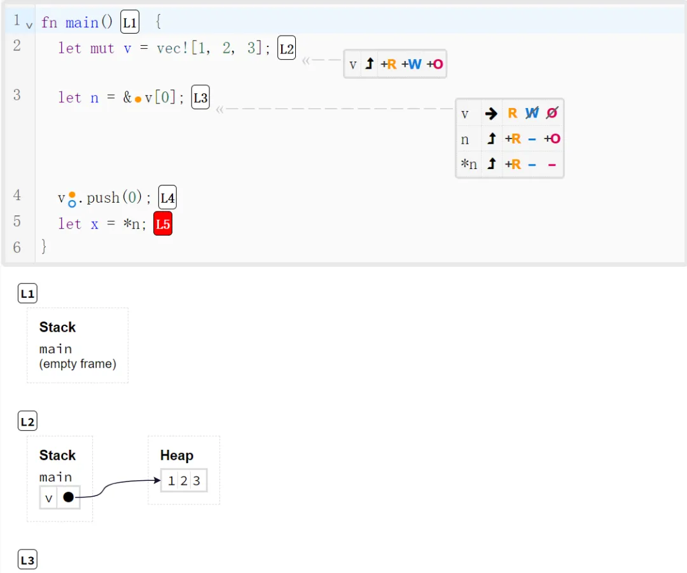

## 引言

作为一名 Rust 开发者，你是否曾对 Rust 独特的所有权机制和借用检查感到好奇？是否希望能更直观地理解 Rust 编译器是如何“思考”你的代码的？今天，我要给大家介绍一款神奇的工具——Aquascope，它能生成 Rust 程序的交互式可视化图表，帮助我们深入洞察 Rust 的编译期和运行时行为。

## 创作背景

Aquascope 是由 Brown 大学 Cognitive Engineering Lab 开发的一款研究性质的软件工具。它旨在帮助 Rust 开发者、教育工作者和编程语言研究人员更好地理解 Rust 的内在机制。通过生成直观的交互式可视化图表，Aquascope 让 Rust 的编译期借用检查和运行时行为变得"可见"，方便我们学习和分析。

## 主要特性

- 生成展示 Rust 借用检查器如何“思考”程序的交互式可视化图表
- 生成展示 Rust 程序实际执行情况的交互式可视化图表
- 提供 mdBook 预处理器，可将 Aquascope 图表嵌入 mdBook 中
- 支持通过 Web 界面本地运行 Aquascope 游乐场

## 快速上手

想快速体验 Aquascope 的威力吗？我们可以直接在 Aquascope Playground 中尝试。访问以下网址:

https://cognitive-engineering-lab.github.io/aquascope/

你会看到一个在线的代码编辑器，可以在里面编写 Rust 代码。比如我们写下这样一段简单的代码:

```rust
fn main() {
    let x = String::from("Hello");  // 创建一个字符串变量 x
    foo(x);  // 将 x 传递给函数 foo
    println!("{}", x);  // 尝试打印 x
}

fn foo(s: String) {  // 函数 foo 接收一个 String 类型的参数 s
    println!("{}", s);
}
```

然后点击 “Interpret“ 按钮，Aquascope 就会开始工作，生成该程序运行时的可视化图表。我们可以通过下方的控制面板调整细节，比如查看每一步的状态。

同时你会注意到，“Boundaries” 和 “Permissions” 按钮在这段代码下是灰色不可点击的。这提示我们这段代码没有通过 Rust 的借用检查。将光标移动到第 4 行，就会看到错误提示:

```rust
error[E0382]: borrow of moved value: `x`
 --> src/lib.rs:4:20
  |
2 |     let x = String::from("Hello");
  |         - move occurs because `x` has type `String`, which does not implement the `Copy` trait
3 |     foo(x);
  |         - value moved here
4 |     println!("{}", x);
  |                    ^ value borrowed here after move
For more information about this error, try `rustc --explain E0382`.
```

Rust 独特的所有权机制在起作用。当我们将 x 传递给 foo 函数时，x 的所有权就转移给了函数参数 s，之后 x 就不再有效。第 4 行尝试再次使用 x，就会触发错误。

我们对代码做一些修改:

```rust
fn main() {
    let x = String::from("Hello");
    foo(&x); // 传递 x 的不可变引用给函数 foo
    println!("{}", x);
}

fn foo(s: &String) {  // 函数 foo 接收一个 &String 类型的参数
    println!("{}", s);
}
```

再次点击 “Interpret”，“Boundaries” 和 “Permissions” 按钮就变成可点击的了。我们可以尝试点击它们，生成展示借用检查信息的可视化图表，进一步研究一下 Rust 所有权机制是如何工作的。

是不是感觉很神奇？我们只需要简单几步，就能在 Aquascope Playground 中学习和探索 Rust 的编译期和运行时行为。快去试试看吧，相信你一定能从 Aquascope 生动直观的可视化中获得新的认识和灵感!

## 总结

Aquascope 是一款非常有助于学习和理解 Rust 的实用工具。通过可视化的方式，它揭示了 Rust 编译期借用检查和运行时行为的奥秘，让 Rust 初学者能更轻松地掌握 Rust 的独特机制。

作为研究性质的软件，Aquascope 目前仍在活跃开发中。欢迎大家关注该项目，为其贡献代码和反馈问题。让我们一起推动 Rust 学习和研究的发展！

---


# Rust开发者工具箱工具

## rustup（工具链管理）


## cargo（构建系统和包管理器）


## clippy（代码检查器）


## rustfmt（格式化工具）


## rustdoc（文档生成器）


# Rust基础练习题

在上面搭建好了Rust的编辑开发环境的情况下，可以开始练习Rust，以下是练习题：

## Rust官方练习题(互动式Rust编程学习平台)：rustlings

Rustlings是一个开源的Rust编程学习项目，通过小型练习帮助初学者掌握核心概念和语法。它提供交互式环境，让用户完成练习并获得即时反馈。项目支持命令行界面，方便用户按照预设顺序或自选进度学习。exercises包含编译错误和测试，引导学习者理解和修复常见问题。结合官方Rust书籍和文档，Rustlings为学习者提供了理论与实践相结合的全面入门体验，有效提升Rust编程技能。

GitHub：https://github.com/rust-lang/rustlings

官网：https://doc.rust-lang.org/book/

文档：https://doc.rust-lang.org/rust-by-example/

**参考题解答案**：

- **rustlings 学习和答案 | Jiangker**：https://blog.jiangker.cn/posts/rustlings/
- Rust学习 | Rustlings通关记录与题解 - climerecho - 博客园：https://www.cnblogs.com/Roboduster/p/17781712.html
- https://jishuzhan.net/article/1716285240235790338


本项目包含一些小练习，旨在帮助你熟悉阅读和编写 Rust 代码。 这包括阅读和理解编译器消息！

建议在阅读[Rust官方教程](https://doc.rust-lang.org/book/)的同时完成 Rustlings 练习，这是学习 Rust 最全面的资源 📚️

[通过例子学 Rust](https://doc.rust-lang.org/rust-by-example/) 是另一个推荐的资源，你可能会觉得它很有帮助。 它包含类似 Rustlings 的在线代码示例和练习。


### 1.安装 Rustlings

以下命令将下载并编译 Rustlings：

```bash
cargo install rustlings
```

<details> <summary><strong>如果安装失败…</strong>（<em>点击展开</em>）</summary>

- 运行 `rustup update` 确保你使用的是最新版本的 Rust
- 尝试添加 `--locked` 标志：`cargo install rustlings --locked`
- 否则，请[报告问题](https://github.com/rust-lang/rustlings/issues/new)

</details>

### 2.初始化

安装 Rustlings 后，运行以下命令初始化 `rustlings/` 目录：

```
rustlings init
```

<details> <summary><strong>如果找不到 <code>rustlings</code> 命令…</strong>（<em>点击展开</em>）</summary>

你可能使用的是 Linux，并通过包管理器安装了 Rust。

Cargo 将二进制文件安装到 `~/.cargo/bin` 目录。 不幸的是，包管理器通常不会将 `~/.cargo/bin` 添加到你的 `PATH` 环境变量中。

解决方法是…

- 手动将 `~/.cargo/bin` 添加到 `PATH` 中
- 或从包管理器卸载 Rust，然后使用官方方式通过 `rustup` 安装：https://www.rust-lang.org/tools/install

</details>

现在，进入新初始化的目录，并启动 Rustlings 以获取有关开始练习的进一步说明：

```
cd rustlings/
rustlings
```

### 工作环境

#### 编辑器

我们的一般建议是使用 [VS Code](https://code.visualstudio.com/) 和 [rust-analyzer 插件](https://marketplace.visualstudio.com/items?itemName=rust-lang.rust-analyzer)。 但任何支持 [rust-analyzer](https://rust-analyzer.github.io/) 的编辑器都应该足以完成练习。

#### 终端

在使用 Rustlings 时，请使用现代终端以获得最佳用户体验。 Linux 和 Mac 上的默认终端应该足够了。 在 Windows 上，我们推荐使用 [Windows Terminal](https://aka.ms/terminal)。

### 完成练习

练习按主题排序，可以在子目录 `exercises/<topic>` 中找到。 每个主题都有一个额外的 `README.md` 文件，其中包含一些资源，可以帮助你开始学习该主题。 我们强烈建议你在开始之前先看一看这些资源 📚️

大多数练习都包含一个阻止它们编译的错误，你需要修复它！ 一些练习包含需要通过的测试，以完成练习 ✅

搜索 `TODO` 和 `todo!()` 以找出需要更改的内容。 在_监视模式_下输入 `h` 可以获取提示 💡

#### 监视模式

[初始化](https://www.dongaigc.com/p/rust-lang/rustlings#初始化)后，只需运行 `rustlings` 命令即可启动 Rustlings。

这将启动_监视模式_，按预定义的顺序（我们认为对新手最好的顺序）引导你完成练习。 每次你更改 `exercises/` 目录中的练习文件时，它都会自动重新运行当前练习。

<details> <summary><strong>如果检测 <code>exercises/</code> 目录中的文件更改失败…</strong>（<em>点击展开</em>）</summary>

> 你可以添加 **`--manual-run`** 标志（`rustlings --manual-run`），在监视模式下输入 `r` 手动重新运行当前练习。
>
> 请[报告问题](https://github.com/rust-lang/rustlings/issues/new)，并提供一些关于你的操作系统以及你是否在容器或虚拟机（如 WSL）中运行 Rustlings 的信息。

</details>

#### 练习列表

在[监视模式](https://www.dongaigc.com/p/rust-lang/rustlings#监视模式)下（启动 `rustlings` 后），你可以输入 `l` 打开交互式练习列表。

该列表允许你…

- 查看所有练习的状态（已完成或待完成）
- `c`：继续另一个练习（暂时跳过一些练习或返回到之前的练习）
- `r`：重置练习的状态和文件（之后需要在编辑器中_重新加载/重新打开_其文件）

查看列表底部了解所有可能的按键。

### 继续前进

一旦你完成了 Rustlings，就把你的新知识付诸实践！ 通过构建自己的项目、为 Rustlings 做贡献或寻找其他开源项目来继续练习你的 Rust 技能。

### 第三方练习

你想创建自己的 Rustlings 练习集，专注于某些特定主题吗？ 或者你想翻译原始的 Rustlings 练习？ 那么请查看[第三方练习](https://github.com/rust-lang/rustlings/blob/main/THIRD_PARTY_EXERCISES.md)指南！

### 卸载 Rustlings

如果你想从系统中删除 Rustlings，请运行以下命令：

```
cargo uninstall rustlings
```

### 贡献

请参阅 [CONTRIBUTING.md](https://github.com/rust-lang/rustlings/blob/main/CONTRIBUTING.md) 🔗

### 贡献者 ✨

感谢[所有出色的贡献者](https://github.com/rust-lang/rustlings/graphs/contributors) 🎉


## mainmatter的练习题《Rust 学习 100 题：一次一个练习的自我学习课程》

- GitHub：https://github.com/mainmatter/100-exercises-to-learn-rust
- 官网：https://rust-exercises.com/
- 文档：https://rust-exercises.com/100-exercises/
- 中文文档：https://colobu.com/rust100/


1.首先将它克隆到本地

```bash
# 如果你已经为GitHub设置了SSH密钥
git clone git@github.com:mainmatter/100-exercises-to-learn-rust.git

# 否则，使用HTTPS链接：
git clone https://github.com/mainmatter/100-exercises-to-learn-rust.git
```

2.安装配套的wr工具：[workshop-runner](https://mainmatter.github.io/rust-workshop-runner/)，里面找到的windows系统的安装命令

```
cargo install --locked workshop-runner
```

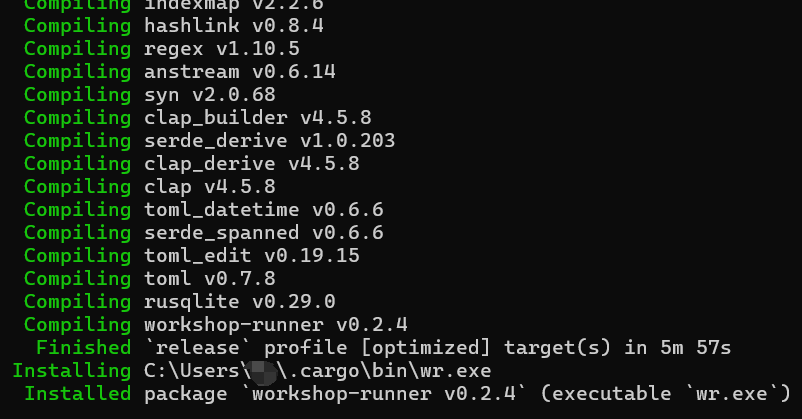

3.安装完成后，打开新终端并导航到存储库的根目录文件夹。 

运行命令以启动课程：

```bash
# 到存储库的根目录文件夹
cd 100-exercises-to-learn-rust
# 运行命令以启动课程
wr
```

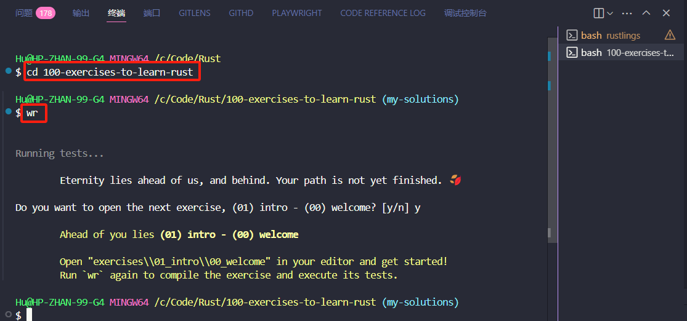

出现类似信息就是成功。

这个工具可以帮助你管理进度，解答完问题后可以使用它来更新进度。

### 尝试挑战

再输入wr后，输入y进入第一关挑战

```
$ wr
 
 
Running tests...
 
        Eternity lies ahead of us, and behind. Your path is not yet finished. 🍂
 
Do you want to open the next exercise, (01) intro - (00) welcome? [y/n] y
 
 
        Ahead of you lies (01) intro - (00) welcome
 
        Open "exercises/01_intro/00_welcome" in your editor and get started!
        Run `wr` again to compile the exercise and execute its tests.
```

打开`100-exercises-ro-learn-rust/exercises/01_intro/00_welcome/src/lib.rs`看到要完成的第一个调整

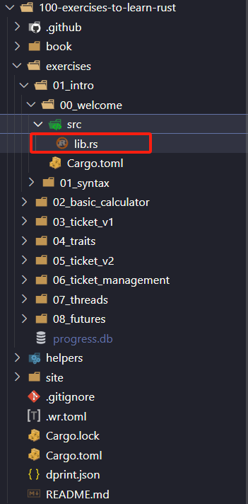

注:看到TODO等类似字样就是要修改的代码部分，或者查看注释中的题目要求和提示也都可以快速完成挑战，如果实在无法完成也可以寻找官方solution分支上的正确答案or关注我，我会尽力完成下面的100个挑战(目前只完成了一半，等我学完会一次发出)

第一关代码如下，读完注释发现很简单，assert_eq!就是一个比较函数，只需要把__修改为Rust就可以通过了

```rust
// This is a Rust file. It is a plain text file with a `.rs` extension.
//
// Like most modern programming languages, Rust supports comments. You're looking at one right now!
// Comments are ignored by the compiler; you can leverage them to annotate code with notes and
// explanations.
// There are various ways to write comments in Rust, each with its own purpose.
// For now we'll stick to the most common one: the line comment.
// Everything from `//` to the end of the line is considered a comment.
 
// Exercises will include `TODO`, `todo!()` or `__` markers to draw your attention to the lines
// where you need to write code.
// You'll need to replace these markers with your own code to complete the exercise.
// Sometimes it'll be enough to write a single line of code, other times you'll have to write
// longer sections.
//
// If you get stuck for more than 10 minutes on an exercise, grab a trainer! We're here to help!
// You can also find solutions to all exercises in the `solutions` git branch.
fn greeting() -> &'static str {
    // TODO: fix me 👇
    "I'm ready to __!"
}
 
// Your solutions will be automatically verified by a set of tests.
// You can run these tests directly by invoking the `cargo test` command in your terminal,
// from the root of this exercise's directory. That's what the `wr` command does for you
// under the hood.
//
// Rust lets you write tests alongside your code.
// The `#[cfg(test)]` attribute tells the compiler to only compile the code below when
// running tests (i.e. when you run `cargo test`).
// You'll learn more about attributes and testing later in the course.
// For now, just know that you need to look for the `#[cfg(test)]` attribute to find the tests
// that will be verifying the correctness of your solutions!
//
// ⚠️ **DO NOT MODIFY THE TESTS** ⚠️
// They are there to help you validate your solutions. You should only change the code that's being
// tested, not the tests themselves.
#[cfg(test)]
mod tests {
    use crate::greeting;
 
    #[test]
    fn test_welcome() {
        assert_eq!(greeting(), "I'm ready to learn Rust!");
    }
}
```

修改完后再命令行继续打出wr


```
$ wr
 
 
Running tests...
 
        🚀 (01) intro - (00) welcome
        Eternity lies ahead of us, and behind. Your path is not yet finished. 🍂
 
Do you want to open the next exercise, (01) intro - (01) syntax? [y/n]　y
 
        Ahead of you lies (01) intro - (01) syntax
 
        Open "exercises/01_intro/01_syntax" in your editor and get started!
        Run `wr` again to compile the exercise and execute its tests.
```

就是通过挑战了！然后就可以下一关类似
