# 5.Rust 项目实战篇

## 待定文章

[Rust语言实现基于 WebSocket 和 HTTP2 的流量隧道 (qq.com)](https://mp.weixin.qq.com/s/7JIlF-kThamprjBryS7faA)

[Rust 实现文件批量下载 (qq.com)](https://mp.weixin.qq.com/s/k7QaXacwJ22hl8S9Yz2Wuw)

## Rust 编程的十大领域

Rust 经常被誉为“只要能写就能做任何事情的语言”，它确实是一种具有无限可能性的通用语言。从嵌入式系统到 web 浏览器，Rust 的底层能力是无限的。那么，让我们来看看 Rust 引起轰动的十大领域：

**1、嵌入式开发：**如果你对硬件和电子产品着迷，那么 Rust 是你的首选语言。有了树莓派等平台的支持，你可以冒险进入令人兴奋的项目，从电池/太阳能控制系统到飞行代码模拟。

**2、网络基础设施工具：**Rust 通过日志路由、指标分析、负载平衡等应用程序在网络基础设施领域找到了自己的位置。它的高效率和健壮的内存管理使其成为 ssl 流量代理和日志解析等任务的首选。

有人在网上这么说：“如果有什么东西可以写出来，那么这个东西就可以用 Rust 写出来”

**3、后端系统：**Rust 的内存管理功能已经引起了全世界 C 和 C++开发人员的注意。它越来越多地被用于后端系统，包括传统上用 C 编码的底层缓存软件。

**4、Web 浏览器(WASM)：**Rust 的速度和类型检查能力使其成为 WebAssembly (WASM)开发的理想选择。它的 WASM 生态系统确保了高效和无 bug 的编译，使其成为 web 开发人员的最爱。

**5、图形用户界面(GUI)：**随着像 Tauri 这样的框架越来越流行，Rust 成为 GUI 开发的一个有吸引力的选择。结合 Next.js 或 React.js 等工具，Rust 使开发人员能够制作时尚高效的 GUI 应用程序。

**6、命令行接口(CLI)工具：**Rust 的简单性和性能使其成为构建 CLI 的完美工具。无论是自动化任务还是增强用户体验，rust 驱动的 CLI 工具都提供了可靠性和高效率。

**7、区块链：**Rust 已经在区块链领域找到了自己的定位，像 Solana 这样的项目利用了它的能力。从加密钱包到智能合约，Rust 在构建健壮和安全的区块链解决方案方面发挥着关键作用。

**8、游戏开发：**Rust 的速度和安全性使其成为游戏开发者的一个有吸引力的选择。有了像 Amethyst 这样的框架，Rust 可以创建高性能和高扩展性的游戏。

**9、金融科技(FinTech)：**Rust 的可靠性和高性能使其非常适合开发金融科技解决方案。其强大的并发支持和内存安全特性确保了金融应用程序的安全性和稳定性。

**10、云计算：**Rust 的轻量级占用空间和高效的资源管理使其非常适合云计算应用程序。无论是构建可扩展的微服务还是优化云基础设施，Rust 都使开发人员能够轻松应对复杂的挑战。

# 生产环境：一个Rust项目包含的要素

Rust因其性能、安全性和并发特性而受到开发者的青睐。然而，将Rust项目推向生产环境，不仅仅是编写代码那么简单，还涉及代码仓库的管理、测试与持续集成、文档、特性管理、编译期处理、日志和监控等多个方面。

### 代码仓库的管理

代码仓库的管理是项目管理的基础。一个良好的仓库管理策略包括但不限于：

- 使用`.gitignore`文件排除不必要的文件和目录。
- 保持提交信息的清晰和有意义。
- 采用分支策略管理不同的开发周期，如Git Flow。

### 测试和持续集成

测试是保证代码质量的重要手段。Rust项目通常会包括单元测试、集成测试和文档测试。

```rust
#[cfg(test)]
mod tests {
   #[test]
   fn it_works() {
       assert_eq!(2 + 2, 4);
  }
}
```

持续集成（CI）通过自动化测试和构建过程，确保代码的健壮性。常用的CI工具包括GitHub Actions、GitLab CI/CD等。

```yaml
# .github/workflows/rust.yml
name: Rust

on:
push:
  branches: [ main ]
pull_request:
  branches: [ main ]

jobs:
build:
  runs-on: ubuntu-latest

  steps:
  - uses: actions/checkout@v2
  - name: Build
    run: cargo build --verbose
  - name: Run tests
    run: cargo test --verbose
```

### 文档

文档对于任何项目都是必不可少的。Rust提供了`cargo doc`命令来生成项目文档。

```rust
/// 对两个数求和
///
/// # 示例
///
/// ```
/// let result = my_crate::add(2, 3);
/// assert_eq!(result, 5);
/// ```
pub fn add(a: i32, b: i32) -> i32 {
   a + b
}
```

### 特性管理

Rust的`features`允许你在编译时选择性地启用或禁用某些功能。

```toml
[features]
default = ["sqlite"]
sqlite = []
postgres = []
```

### 编译期处理

使用`build.rs`脚本可以在编译时执行自定义的构建任务。

```rust
// build.rs
fn main() {
   println!("cargo:rerun-if-changed=path/to/Cargo.lock");
   // 更多构建逻辑...
}
```

### 日志和监控

为Rust应用程序添加日志非常简单，可以使用`log`和`env_logger`库。

```rust
use log::{info, warn};

fn main() {
   env_logger::init();
   info!("启动应用");
   warn!("这是一个警告");
}
```

监控可以使用`metrics`库来实现。

### 控制编译出的可执行文件大小

Rust编译出的可执行文件可能会比较大，可以通过以下方法进行优化：

- 使用`lto`和`codegen-units`优化。
- 移除或减少依赖。
- 使用`strip`工具移除调试信息。

```toml
[profile.release]
lto = true
codegen-units = 1
```

### 小结

构建一个生产级别的Rust项目，需要考虑代码管理、测试、文档、特性管理、编译期处理、日志和监控等多个方面。通过合理的项目结构和工具选择，可以有效提高项目的质量和维护性。希望上述内容能够帮助你更好地管理和维护你的Rust项目。

## 待定文章

[Rust 项目实战篇\_广龙宇的博客-CSDN 博客](https://blog.csdn.net/weixin_47754149/category_11915542.html)

[Rust 学习指南 - 的专栏 - 掘金 (juejin.cn)](https://juejin.cn/column/7226181070202699831)

[入门 - Rust 中的命令行应用程序 (rust-cli.github.io)](https://rust-cli.github.io/book/index.html)

[Rust 赋能前端-开发一款属于你的前端脚手架 - 掘金 (juejin.cn)](https://juejin.cn/post/7320779681674018827)

[Leptos 框架深度解析：由 Rust 语言打造的全栈 Web 框架，用 Rust 打造高效、声明式的 Web 应用世界 (qq.com)](https://mp.weixin.qq.com/s/riZbzLV-hdqQ3rL__MnZ3Q)

[使用 Rust 构建高性能 Web 应用 (qq.com)](https://mp.weixin.qq.com/s/G4BW83SXILNB3JX-LnDliQ)

[构建高性能 Rust 爬虫 (qq.com)](https://mp.weixin.qq.com/s/hQSeSVMRnzA3zmluB353Ew)

[Rust 跨平台编译 (qq.com)](https://mp.weixin.qq.com/s/mY4cD2uj4yLxa0eoDLUP3g)

[用 Rust 写书？这个开源项目让 Markdown 快速生成精美电子书！ (qq.com)](https://mp.weixin.qq.com/s/VJgw5WmzBZYVV5X1OBTgMA)

[Rust 实现文件批量下载 (qq.com)](https://mp.weixin.qq.com/s?__biz=MzkyMzYxNTUwMw==&mid=2247484423&idx=2&sn=585d5aa6864b19305ce3ac44f9466233&chksm=c1e32c67f694a5717c5ea9ff314ac7fde1eb2193955d98210de5f39e3020726a7aa97e41e65d&scene=21#wechat_redirect)

## Rust 和 Python 相结合

[Rust FFI 开发 Python 库入门指南 (qq.com)](https://mp.weixin.qq.com/s?__biz=MzkyMzYxNTUwMw==&mid=2247484362&idx=2&sn=217c7e5269d334ba5e4b05cfdc7598d7&chksm=c1e32baaf694a2bccefa506080bc602f521dbbbb6dfab8d3c9a3ebd1db1ab860399549d19b93&scene=21#wechat_redirect)

[玩转 Rust 与 Python 互操作：pyo3 + maturin 实践指南 (qq.com)](https://mp.weixin.qq.com/s?__biz=Mzg4ODg2NDQ0NA==&mid=2247484954&idx=1&sn=7e0cb109353b14c87657945a04930936&chksm=cff5edc9f88264dfb054bf937df1de213ac60c66ba48cb31e1ac2a6b944026fffe8255b8b2dc&cur_album_id=2734524635021328385&scene=189#wechat_redirect)

## Rust 开发 WebAssembly

[给 Web 前端工程师看的用 Rust 开发 wasm 组件实战 - 掘金 (juejin.cn)](https://juejin.cn/post/7279346413915717687)

[Rust 编译为 WebAssembly 在前端项目中使用 - 掘金 (juejin.cn)](https://juejin.cn/post/7293122294775316534)

[Game = Rust + WebAssembly + 浏览器 - 掘金 (juejin.cn)](https://juejin.cn/post/7309549333694267443)

[给 Web 前端工程师看的用 Rust 开发 wasm 组件实战 | 京东云技术团队 - 掘金 (juejin.cn)](https://juejin.cn/post/7308434321764794378)

[WASM-BINDGEN 搭起 Rust 与 JavaScript 的桥梁 (qq.com)](https://mp.weixin.qq.com/s/6CI44wULfQbj-4ez4yPtiQ)

# Rust 命令行工具开发

### Rust 开发终端音乐播放器

代码地址：[forward-step/rust-player: a local audio player tui (github.com)](https://github.com/forward-step/rust-player)

#### 最终效果图

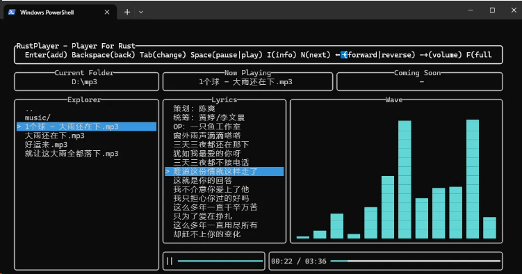

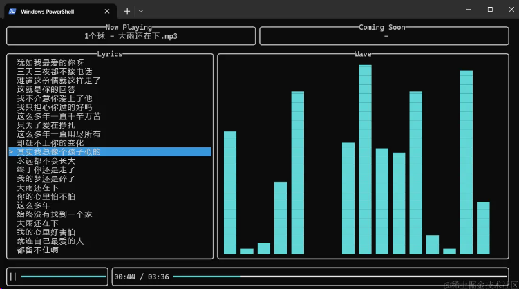

#### 主要技术栈

##### 命令行

第三方库: clap

实现效果:

```shell
# 查看帮助
rust-player -h
# 打开D盘下的mp3文件夹，并且将所有周杰伦开头的文件添加到播放列表，并且全屏展示
rust-player D://mp3 周杰伦-* -f
```

部分代码:

```rust
#[derive(Parser, Debug)]
#[command(author, version, about, long_about = None)]
struct Args {
    path: Option<PathBuf>,

    name: Option<String>,

    #[arg(short, long)]
    full: bool,

    #[arg(short, long)]
    info: bool,
}
```

##### 终端 UI

第三方库: ratatui，前身是 rust 中大名鼎鼎的 **tui-rs**, 不过由于原作者的工作繁忙问题无暇维护, 因此诞生了这个社区版的, 积极维护的 fork。而且官方文档很友好，推荐

部分代码:

```rust
loop {
    // 初始化脚本
    self.script.init();
    // 绘制UI
    self.draw(terminal)?;
    // 处理事件
    if crossterm::event::poll(Config::REFRESH_RATE)? {
        if let Event::Key(key) = event::read()? {
            match key.code {
                // 关闭应用
                KeyCode::Char('q') | KeyCode::Char('Q') => break,
                // ......
            }
        }
    }
}
```

##### 音频播放

第三方库: rodio、id3、mp3-duration

- rodio: 音频播放库
- id3: 解析 mp3 等媒体文件自带的 id3 tag 信息。tag 中包含了媒体文件的基本信息和歌词等
- mp3-duration: rodio 支持获取媒体的播放时长，但是不支持获取 mp3 的，因此用此代替

部分代码:

```rust
// 尝试从媒体文件的tag中读取歌词
// 如果失败，则尝试从媒体文件所在目录查找与媒体文件同名的.lrc歌词文件
let tag = Tag::read_from_path(&path).ok();
let lyrics = if let Some(tag) = &tag {
    let mut string = String::default();
    for it in tag.lyrics() {
        string = string + &it.text;
    }
    if string.len() > 0 {
        Lyrics::from_string(string)
    } else {
        Lyrics::from_music_path(&path)
    }
} else {
    Lyrics::from_music_path(&path)
};
```

### joshuto：用 Rust 编写的类似 ranger 的终端文件管理器

GitHub：[kamiyaa/joshuto：用 Rust 编写的类似 ranger 的终端文件管理器 (github.com)](https://github.com/kamiyaa/joshuto)

库：[joshuto - crates.io: Rust Package Registry](https://crates.io/crates/joshuto)

文档：[joshuto/docs at main · kamiyaa/joshuto (github.com)](https://github.com/kamiyaa/joshuto/tree/main/docs)

安装：[kamiyaa/joshuto: ranger-like terminal file manager written in Rust (github.com)](https://github.com/kamiyaa/joshuto#installation)

#### 使用

##### 基础命令

- 导航 向上移动：
  - arrow_up 或 k
  - 向下移动：arrow_down 或 j
  - 移动到上级目录：arrow_left 或 h
  - 打开文件或目录：arrow_right 或 l
  - 跳转到顶部：home 或 g g
  - 跳转到底部：end 或 G
  - 向上翻页：page_up 或 ctrl+u
  - 向下翻页：page_down 或 ctrl+d
- 选项卡管理
  - 打开新选项卡：ctrl+t
  - 使用当前目录打开新选项卡：T
  - 关闭当前选项卡：W 或 ctrl+w
  - 切换到下一个选项卡：\t
  - 切换到上一个选项卡：backtab
- 文件操作
  - 重命名文件：a 进行追加或 A 进行前置
  - 删除文件：delete 或 d d
  - 剪切文件：d d
  - 复制文件：y y
  - 粘贴文件：p p
  - 覆盖粘贴文件：p o
  - 创建文件链接：p l 为绝对路径，p L 为相对路径

更多命令参考[usage](https://github.com/kamiyaa/joshuto?tab=readme-ov-file#usage)

##### 自定义配置修改

Joshuto 使用环境变量从以下目录中读取配置（按优先顺序）：

- `$JOSHUTO_CONFIG_HOME`
- `$XDG_CONFIG_HOME/joshuto`
- `$HOME/.config/joshuto`

目前可以使用以下文件对 Joshuto 进行配置：

- [joshuto.toml](https://github.com/kamiyaa/joshuto/blob/main/docs/configuration/joshuto.toml.md): basic/general configurations(基本/通用配置)
- [keymap.toml](https://github.com/kamiyaa/joshuto/blob/main/docs/configuration/keymap.toml.md): keymapping configurations(按键映射配置)
- [mimetype.toml](https://github.com/kamiyaa/joshuto/blob/main/docs/configuration/mimetype.toml.md): mimetype configurations(文件类型配置)
- [theme.toml](https://github.com/kamiyaa/joshuto/blob/main/docs/configuration/theme.toml.md): theming configurations(主题配置)
- [icons.toml](https://github.com/kamiyaa/joshuto/blob/main/docs/configuration/icons.toml.md): icons customization(图标自定义)

将官方提供的例子

```bash
joshuto/config
```

复制到

```bash
~/.config/joshuto
```

### Rust 开发的股价查询终端应用: rust-stock

项目地址：https://github.com/fdehau/tui-rs

官方文档：https://docs.rs/tui/latest/tui/index.html

tui 介绍：https://www.51cto.com/article/703696.html

实时股票数据： https://github.com/tarkah/tickrs

文件传输工具：https://github.com/veeso/termscp

网络监控工具：https://github.com/imsnif/bandwhich

#### 使用 Rust 开发的股价查询终端应用

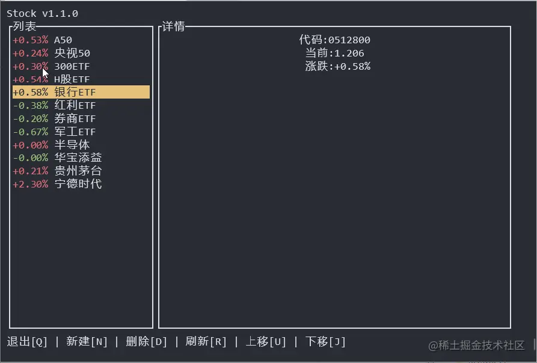

#### 主要使用 tui-rs 一款超好用的跨平台命令行界面库

使用 tui.rs 提供的以下模块进行 UI 编写(所有 UI 元素都实现了 Widget 或 StatefuWidget Trait)：

- bakend 用于生成管理命令行的后端
- layout 用于管理 UI 组件的布局
- style 用于为 UI 添加样式
- symbols 描述绘制散点图时所用点的样式
- text 用于描述带样式的文本
- widgets 包含预定义的 UI 组件

#### 编译/运行

```bash
➜ git https://github.com/huangbqsky/rust-stock
➜ cd rust-stock
➜ cargo build
➜ cargo run
```

## tl;dr

- [alacritty](https://github.com/alacritty/alacritty) 使用 GPU 加速的跨平台终端模拟器
- [starship](https://github.com/starship/starship) 🌌 超级快、支持各种订制的极简命令行提示符，支持任意 shell
- [exa](https://github.com/ogham/exa) `ls` 现代版
- [bat](https://github.com/sharkdp/bat) 支持更多特性的 `cat` 克隆
- [delta](https://github.com/dandavison/delta) git、diff 输出查看器
- [zoxide](https://github.com/ajeetdsouza/zoxide) 更快捷地浏览文件系统
- [ripgrep](https://github.com/burntsushi/ripgrep) 基于正则表达式递归搜索目录
- [fd](https://github.com/sharkdp/fd) 简单、快速、用户友好的 `find` 替代品
- [bottom](https://github.com/clementtsang/bottom) 又一个跨平台的图形化进程/系统查看器
- [tldr](https://github.com/tldr-pages/tldr) 📚 众人一起编写的终端命令速查卡
- [spotify-tui](https://github.com/rigellute/spotify-tui) Spotify 客户端命令行版 🚀
- [gitui](https://github.com/extrawurst/gitui) 超级 💥 快的 git 字符界面客户端

## Alacritty

首先介绍 Alacritty，这是最快的终端模拟器之一，因为它使用 GPU 渲染，而且它也是跨平台的。

配色方案、字体、透明度、键盘快捷键等都能定制。

Alacritty 不支持合字，但你可以用这个支持合字的[分支](https://github.com/zenixls2/alacritty/tree/ligature)。如果你用 Arch 的话，也可以通过 [aur](https://aur.archlinux.org/packages/alacritty-ligatures/) 安装。

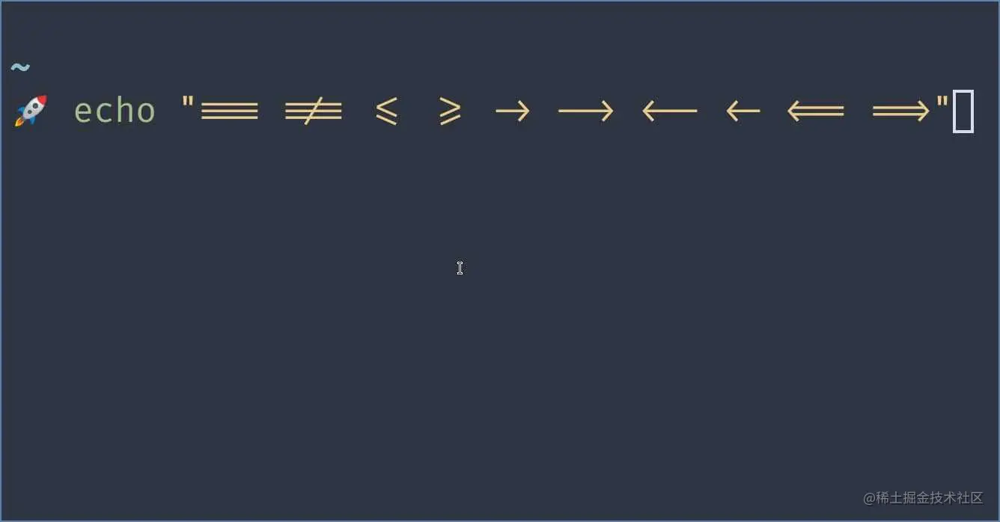

## Starship

我以前的命令行提示符用 zsh + powerlevel9k，后来转用 powerlevel10k，但在开新 shell 时我都观察到了延迟。starship 则能立刻启动。

它可以搭配任何 shell 使用，比如 bash、zsh、fish，甚至 powerShell.

下面的截图显示了我定制的提示符。

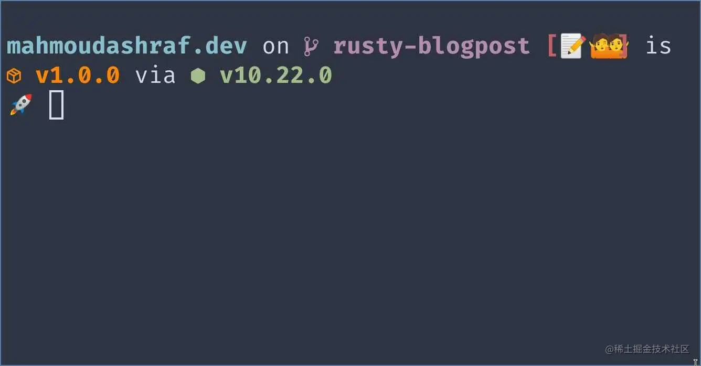

## Exa

exa 是 `ls` 命令的一个实现，但自带色彩和图标，渲染也非常快。

我建了一个别名，用 exa 代替 ls.

```sh
if [ "$(command -v exa)" ]; then
    unalias -m 'll'
    unalias -m 'l'
    unalias -m 'la'
    unalias -m 'ls'
    alias ls='exa -G  --color auto --icons -a -s type'
    alias ll='exa -l --color always --icons -a -s type'
fi
```

我的 `ls` 和 `ll` 命令显示结果：

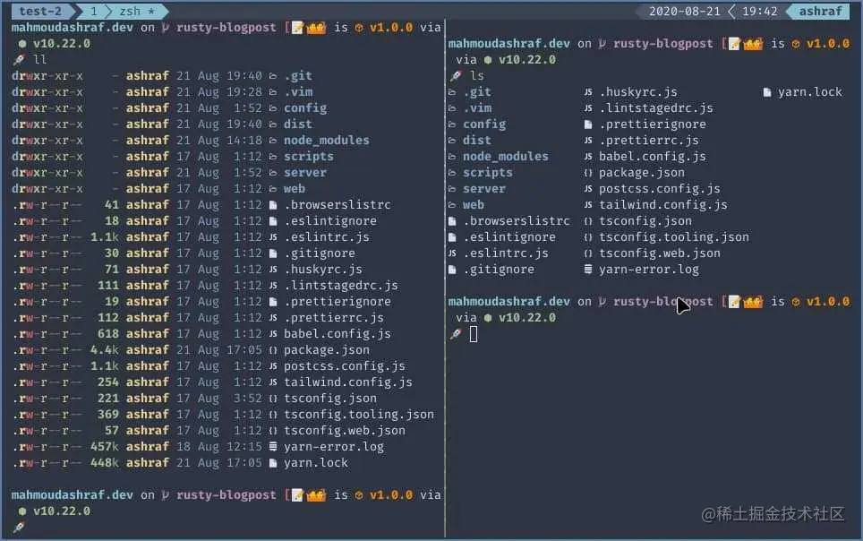

## Bat

bat 是 `cat` 命令的一个实现，但加上了语法高亮。

我也给它建了个别名（我用 Nord 主题）。

```shell
if [ "$(command -v bat)" ]; then
  unalias -m 'cat'
  alias cat='bat -pp --theme="Nord"'
fi
```

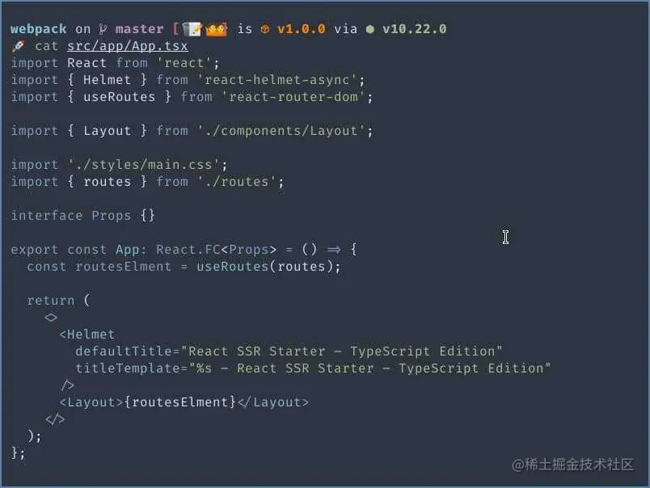

## Delta

delta 增强了 git diff 的显示效果，包括语法高亮、行号、双栏显示。

想使用 delta 的话，需要在 `.gitconfig` 中加上：

```shell
[core]
  pager = delta
[interactive]
  diffFilter = delta --color-only
[delta]
  side-by-side = true
  line-numbers-left-format = ""
  line-numbers-right-format = "│ "
  syntax-theme = Nord
```

在上面的配置中，`delta` 成为 git 命令输出的默认 pager，开启了双栏显示，并将主题设为 Nord。你可以运行以下命令列出所有主题，并从中选择想用的主题。

```shell
delta --list-syntax-themes
```

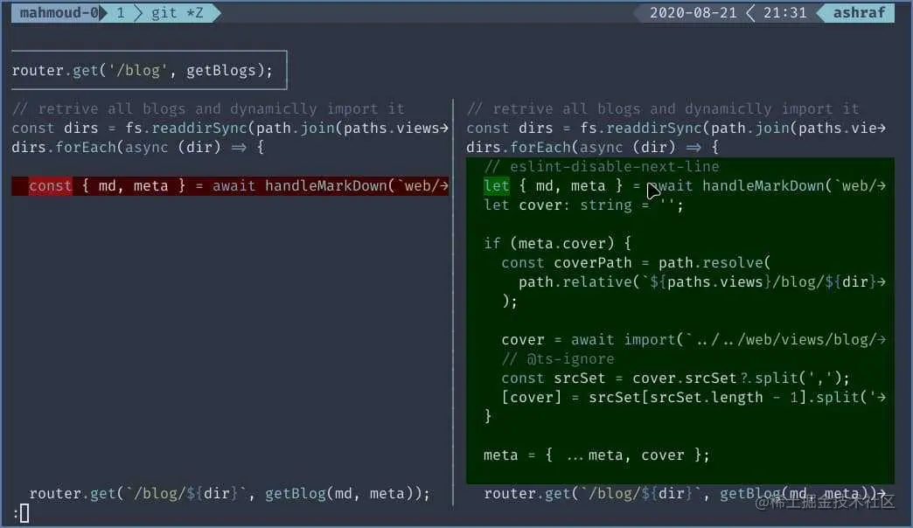

## Zoxide

我没有使用任何文件浏览器，只用 `cd` 和 `ls`。

比方说，我的家目录下有一个存放各种项目的 `projects` 目录，如果我想访问其中一个项目，我需要输入

```shell
cd ~/projects/mahmoudashraf.dev
```

使用 zoxide 后，只有第一次需要输入

```shell
z ~/projects/mahmoudashraf.dev
```

之后不管当前目录是哪里，简单输入几个字母就可以再次访问这一目录

```shell
z mah
```

## Ripgrep

这是一个跨平台的命令行工具，可以使用正则表达式搜索目录下的文件内容。

推荐阅读 [ripgrep is faster than {grep, ag, git grep, ucg, pt, sift} ](https://blog.burntsushi.net/ripgrep/) 一文。

下面是一些例子：

```shell
# 基于特定正则表达式搜索 javascript 文件
rg tjs "import React"

rg "\.content" -g "*.pug"

# 不仅可以查找，还可以替换，类似 sed 命令的查找替换功能
rg fast README.md --replace FAST
```

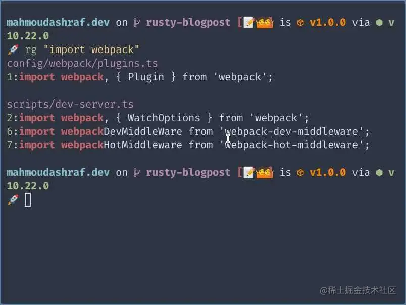

## Fd

比 `find` 命令更友好，也更快。

默认情况下会忽略 `.gitignore` 中指定需要忽略的文件。

比如，把一些 `png` 格式的文件转换为 `jpeg` 格式：

```shell
fd -e png -x convert {} {.}.jpeg
```

再比如删除文件：

```shell
fd -H '^\.DS_Store$' -tf -X rm
```

## bottom

它不是 `top` 😀 是 `bottom`。

它是一个跨平台的系统监视器。

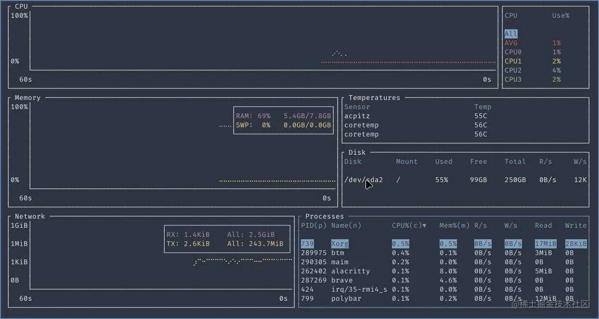

## Tldr

tldr 为各种命令行工具提供了速查卡，可以省下阅读完整的 `man` 帮助手册的时间。

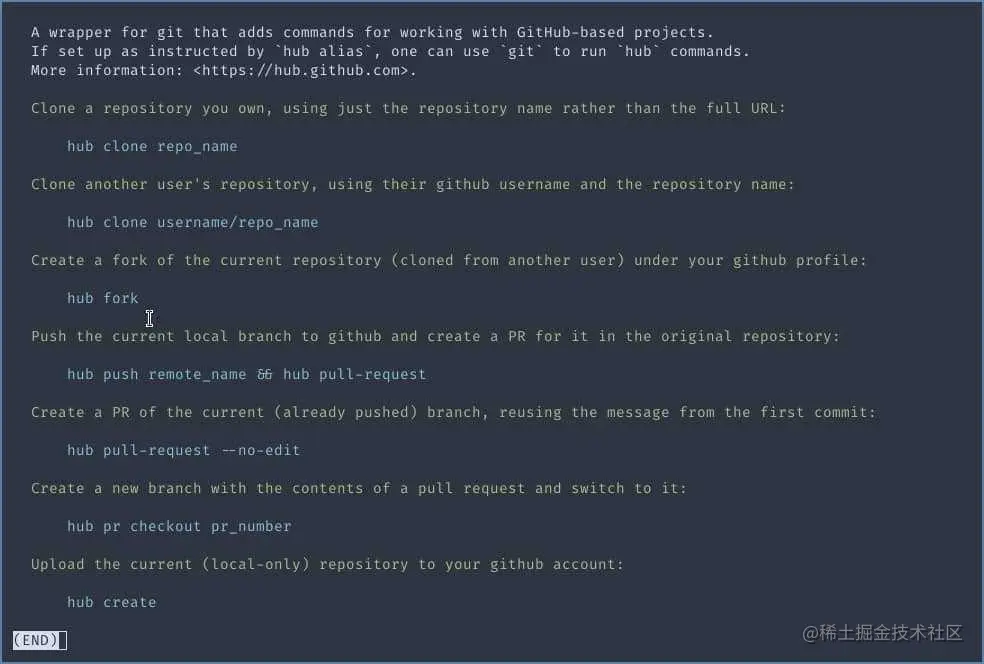

## 更多工具

- 如果你嫌 Spotify 的官方客户端太笨重，可以使用 `spotify-tui` 这个轻量级替代品。
- 如果你喜欢通过 UI 界面操作 git，可以看下 `gitui`。

使用 Rust 编写的命令行工具和其他工具还有很多，详见 [Command line utilities — list of Rust libraries/crates // Lib.rs](https://lib.rs/command-line-utilities)。

# Rust 实现文件批量下载

## 环境准备

首先我们需要安装 Rust。可以到 Rust 官网上进行下载并安装。接下来开始配置编辑文档。在新的Rust项目中创建一个新的main.rs文件。这是我们的主要工作文件。

## 创建主函数

Rust程序的执行从主函数开始。在项目中的主文件创建主函数：

```rust
fn main() {
   let urls: Vec<String> = vec![
       "http://example.com/file1".to_string(),
       "http://example.com/file2".to_string(),
       ...
   ];
}
```

在这段代码中，我们首先创建了一个字符串向量 `urls` 来存储待下载的文件URL。

## 实现下载函数

下一步是实现文件下载的函数。我们可以使用 `reqwest` crate 来完成HTTP 请求的操作，使用 `tokio` crate 则可以进行异步操作。先将它们添加到你的Cargo.toml文件中。

```bash
[dependencies]
reqwest = { version = "0.11", features = ["json"] }
tokio = { version = "1", features = ["full"] }
```

然后更新一下依赖库：

```bash
$ cargo build
```

创建下载文件的函数：

```rust
async fn download_file(url: &str) -> Result<(), Box<dyn std::error::Error>> {
   let response = reqwest::get(url).await?;

   let path = Path::new("downloads").join(url.split('/').last().unwrap());
   let file = File::create(&path).await?;

   let mut stream = response.bytes_stream();
   while let Some(item) = stream.next().await {
       file.write_all(&item?).await?;
   }

   Ok(())
}
```

这段代码利用异步I/O来从URL下载文件，然后保存到downloads文件夹下。

## 并行下载

现在我们需要在主函数中调用 `download_file` 函数。由于Rust支持并发执行，我们可以通过`futures`库下的`join_all`函数来并行下载这些文件：

```rust
fn main() {
   let urls: Vec<String> = vec!["http://example.com/file1".to_string(),...];

   let download_futures: Vec<_> = urls.iter()
       .map(|url| tokio::spawn(download_file(url)))
       .collect();

   let result = tokio::runtime::Builder::new_multi_thread()
       .enable_all()
       .build()
       .unwrap()
       .block_on(futures::future::join_all(download_futures));

   for res in result {
       if let Err(e) = res {
           println!("Error: {}", e);
       }
   }
}
```

`spawn`函数能够创建一个新的异步任务并返回一个`JoinHandle`，当这个`JoinHandle`被执行的时候，它会返回其任务的输出。此外，我们使用了`block_on`来阻塞当前线程直到提供的future完成，`join_all`则会等待所有future完成，不管他们的完成顺序。

# Rust 和 Swift

[用 Rust 和 Swift 结合来写一个 App (qq.com)](https://mp.weixin.qq.com/s/WCb5oeHrP3KPPgSbqy4Kfw)

# 在Rust 中开始使用MongoDB

MongoDB 是一种流行的 NoSQL 数据库，近年来越来越受到开发者的青睐。它为开发者提供了一种灵活、可扩展且高性能的数据库解决方案，适用于多种应用程序的开发。

对于 Rust 程序员来说，MongoDB 提供了一个优秀的选项，以快速、高效且可靠的方式存储和检索数据。Rust 是一种现代的、高性能的系统编程语言，旨在实现速度、安全性和并发性。它非常适合构建高性能、低级别的软件，并且在开发者中越来越受欢迎。

在本文中，我们将探讨 Rust 程序员如何利用 MongoDB 构建高性能、可扩展的应用程序。我会解释如何设置 MongoDB 数据库，并展示如何使用官方的 MongoDB Rust 驱动程序从 Rust 与 MongoDB 进行交互。

无论你是 MongoDB 的新手，还是希望利用这个强大的数据库技术的有经验的 Rust 程序员，本文都将为你提供必要的知识和技能，帮助你入门。

## **「先决条件」**

要跟随本文，你只需要以下几项：

- Rust 知识
- 一个可以工作的系统
- 在你的系统上安装 Rust

## 设置你的项目

现在你的系统上已经安装了 MongoDB，是时候设置你的 Rust 项目以使用官方的 MongoDB Rust 驱动程序了。按照以下步骤开始：

1. 创建一个新的 Rust 项目。
2. 打开终端，通过运行以下命令创建一个新的 Rust 项目：

```bash
cargo new myproject
```

这将创建一个名为"myproject"的新 Rust 项目。

1. 向你的项目添加 MongoDB Rust 驱动程序依赖项。打开项目目录中的 `Cargo.toml` 文件，并添加以下依赖项：

```bash
[dependencies]
mongodb = "2.3.1"
```

这将向你的项目添加 MongoDB Rust 驱动程序依赖项。

1. 导入必要的库。打开项目目录中的 `src/main.rs` 文件，并添加以下行到文件顶部以导入必要的库：

```rust
extern crate mongodb;
use mongodb::bson::doc;
use mongodb::{Client, options::ClientOptions};
```

1. 连接到你的 MongoDB 服务器。在你的 `main` 函数中添加以下代码以连接到你的 MongoDB 服务器：

```rust
let client_options = ClientOptions::parse("mongodb://localhost:27017").await.unwrap();
let client = Client::with_options(client_options).unwrap();
```

这将使用连接字符串创建一个新的 `ClientOptions` 对象，然后用 `ClientOptions` 对象创建一个新的 `Client` 对象。

恭喜你，现在你的 Rust 项目已经设置好使用官方的 MongoDB Rust 驱动程序了。

## 创建数据库

在使用 MongoDB 之前，你需要有一个数据库来存储集合。在本节中，我将向你展示如何使用 MongoDB Compass 创建一个新的数据库。

打开 MongoDB Compass 并点击屏幕左上角的"Connect"按钮。在 "New Connection"窗口中，输入你的 MongoDB 实例的连接详情。这包括主机名、端口号和必要的认证详情。点击 "Connect"以建立与你的 MongoDB 实例的连接。在左侧导航窗格中，点击"Databases"查看现有数据库列表。点击 "Databases"窗口左上角的"Create Database"按钮。输入你的新数据库名称（例如"mydatabase"）并点击"Create"。

恭喜你，你已经使用 MongoDB Compass 创建了一个新的数据库！现在你可以开始创建集合并向数据库添加文档了。

## **「创建集合」**

在 MongoDB 中，数据库集合相当于关系数据库中的表。集合是一组具有共同特征的 MongoDB 文档。

在本节中，我将向你展示如何使用 Rust 创建一个新的集合。

在你的 `src/main.rs` 文件中创建一个新的 Rust 函数。这个函数将在你的 MongoDB 数据库中创建一个新的集合。将以下代码添加到你的 `main.rs` 文件中：

```rust
async fn create_collection(client: &Client, db_name: &str, coll_name: &str) {
    let db = client.database(db_name);
    db.create_collection(coll_name, None).await.unwrap();
}
```

这个函数接受一个 `Client` 对象、一个数据库名称和一个集合名称作为参数。然后，它在指定的数据库中创建一个新的集合。

在你的 `main` 函数中添加以下代码以调用 `create_collection` 函数并在你的 MongoDB 数据库中创建一个新的集合：

```rust
let client_options = ClientOptions::parse("mongodb://localhost:27017").await.unwrap();
let client = Client::with_options(client_options).unwrap();
let db_name = "mydatabase";
let coll_name = "mycollection";
create_collection(&client, db_name, coll_name).await;
```

这段代码将创建一个新的 `Client` 对象，并调用 `create_collection` 函数来在 `mydatabase` 数据库中创建一个名为"mycollection"的新集合。

恭喜你，现在你已经使用 Rust 在你的 MongoDB 数据库中创建了一个新的集合。

## **「插入文档」**

在 MongoDB 中，行相当于集合中的文档。在本节中，我将向你展示如何使用 Rust 将新文档插入到 MongoDB 集合中。

在你的 `src/main.rs` 文件中创建一个新的 Rust 函数。这个函数将把你的 MongoDB 数据库中的指定集合插入一个新文档。将以下代码添加到你的 `main.rs` 文件中：

```rust
async fn insert_document(client: &Client, db_name: &str, coll_name: &str) {
    let db = client.database(db_name);
    let coll = db.collection(coll_name);
    let doc = doc! { "name": "John", "age": 30 };
    coll.insert_one(doc, None).await.unwrap();
}
```

这个函数接受一个 `Client` 对象、一个数据库名称和一个集合名称作为参数。然后，它为指定的集合创建一个新的 `Collection` 对象，并插入一个新文档。

在你的 `main` 函数中添加以下代码以调用 `insert_document` 函数并将新文档插入到你的 MongoDB 集合中：

```rust
let client_options = ClientOptions::parse("mongodb://localhost:27017").await.unwrap();
let client = Client::with_options(client_options).unwrap();
let db_name = "mydatabase";
let coll_name = "mycollection";
insert_document(&client, db_name, coll_name).await;
```

这段代码将创建一个新的 `Client` 对象，并调用 `insert_one` 方法将一个新文档插入到 `mycollection` 集合中，该文档包含 `name` 和 `age` 字段。

恭喜你，现在你已经使用 Rust 将新文档插入到你的 MongoDB 集合中了。

## **「检索文档」**

在 MongoDB 中，你可以通过使用特定过滤条件查询集合来检索文档。

在本节中，我将向你展示如何使用 Rust 从 MongoDB 集合中检索文档。

在你的 `src/main.rs` 文件中创建一个新的 Rust 函数。这个函数将从你的 MongoDB 数据库中的指定集合中检索一个文档。将以下代码添加到你的 `main.rs` 文件中：

```rust
fn get_document(client: &Client, db_name: &str, coll_name: &str) {
    let db = client.database(db_name);
    let coll = db.collection(coll_name);
    let filter = doc! {"name": "John"};
    let result = coll.find_one(Some(filter), None).await.unwrap();
    match result {
        Some(doc) => println!("{:?}", doc),
        None => println!("No document found"),
  }
}
```

这个函数接受一个 `Client` 对象、一个数据库名称和一个集合名称作为参数。然后，它为指定的集合创建一个新的 `Collection` 对象，并从中检索匹配指定过滤条件的文档。

在这个例子中，我们正在检索集合中字段名为 "name" 且值为 "John" 的文档。

在你的 `main` 函数中添加以下代码以调用 `get_document` 函数并从你的 MongoDB 集合中检索文档：

```rust
let client_options = ClientOptions::parse("mongodb://localhost:27017").await.unwrap();
let client = Client::with_options(client_options).unwrap();
let db_name = "mydatabase";
let coll_name = "mycollection";
get_document(&client, db_name, coll_name).await;
```

## **「删除文档」**

在 MongoDB 中，你可以通过指定一个或多个匹配文档的条件来删除集合中的文档。

在本节中，我将向你展示如何使用 Rust 从 MongoDB 集合中删除文档。

在你的 `src/main.rs` 文件中创建一个新的 Rust 函数。这个函数将从你的 MongoDB 数据库中的指定集合中删除一个文档。将以下代码添加到你的 `main.rs` 文件中：

```rust
fn delete_document(client: &Client, db_name: &str, coll_name: &str) {
    let db = client.database(db_name);
    let coll = db.collection(coll_name);
    let filter = doc! {"name": "John"};
    coll.delete_one(filter, None).await.unwrap();
}
```

这个函数接受一个 `Client` 对象、一个数据库名称和一个集合名称作为参数。然后，它为指定的集合创建一个新的 `Collection` 对象，并从中删除匹配指定过滤条件的文档。

在这个例子中，我们正在删除集合中字段名为 "name" 且值为 "John" 的文档。

在你的 `main` 函数中添加以下代码以调用 `delete_document` 函数并从你的 MongoDB 集合中删除文档：

```rust
let client_options = ClientOptions::parse("mongodb://localhost:27017").await.unwrap();
let client = Client::with_options(client_options).unwrap();
let db_name = "mydatabase";
let coll_name = "mycollection";
delete_document(&client, db_name, coll_name).await;
```

这段代码将创建一个新的 `Client` 对象，并删除 `mycollection` 集合中匹配过滤条件的文档。

恭喜你，现在你已经使用 Rust 从你的 MongoDB 集合中删除了文档。

## 修改文档

在 MongoDB 中，你可以通过更新文档中的一个或多个字段来修改集合中的文档。在本节中，我将向你展示如何使用 Rust 修改 MongoDB 集合中的文档。

在你的 `src/main.rs` 文件中创建一个新的 Rust 函数。这个函数将更新你的 MongoDB 数据库中指定集合中的文档。将以下代码添加到你的 `main.rs` 文件中：

```rust
fn update_document(client: &Client, db_name: &str, coll_name: &str) {
    let db = client.database(db_name);
    let coll = db.collection(coll_name);
    let filter = doc! {"name": "John"};
    let update = doc! {"$set": {"age": 35}};
    coll.update_one(filter, update, None).await.unwrap();
}
```

这个函数接受一个 `Client` 对象、一个数据库名称和一个集合名称作为参数。然后，它为指定的集合创建一个新的 `Collection` 对象，并更新其中匹配指定过滤条件的文档。

在这个例子中，我们正在更新集合中字段名为 "name" 且值为 "John" 的文档，并将 "age" 字段的值设置为 "35"。

在你的 `main` 函数中添加以下代码以调用 `update_document` 函数并更新你的 MongoDB 集合中的文档：

```rust
let client_options = ClientOptions::parse("mongodb://localhost:27017").await.unwrap();
let client = Client::with_options(client_options).unwrap();
let db_name = "mydatabase";
let coll_name = "mycollection";
update_document(&client, db_name, coll_name).await;
```

这段代码将创建一个新的 `Client` 对象，并更新 `mycollection` 集合中匹配过滤条件的文档。

恭喜你，现在你已经使用 Rust 更新了你的 MongoDB 集合中的文档。

## 结论

在本文中，我向你介绍了 MongoDB 以及如何将其与 Rust 结合使用。我涵盖了设置 MongoDB 服务器、创建数据库和在数据库中创建集合的基础知识。我还展示了如何使用 Rust 插入、检索、修改和删除 MongoDB 数据库中的数据。

通过结合 Rust 编程语言和 MongoDB 数据库，你可以构建能够处理大量数据的强大且可扩展的应用程序。Rust 的性能和安全性特性使其成为与 MongoDB 等数据库合作的极佳选择。
