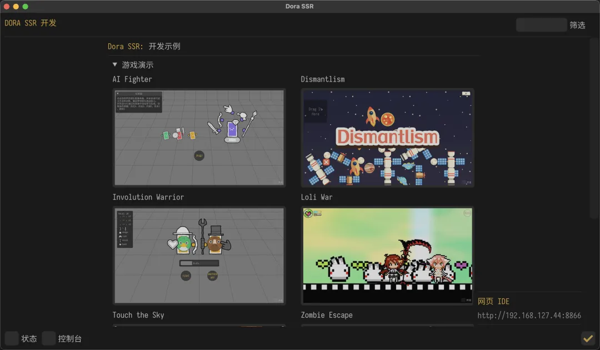
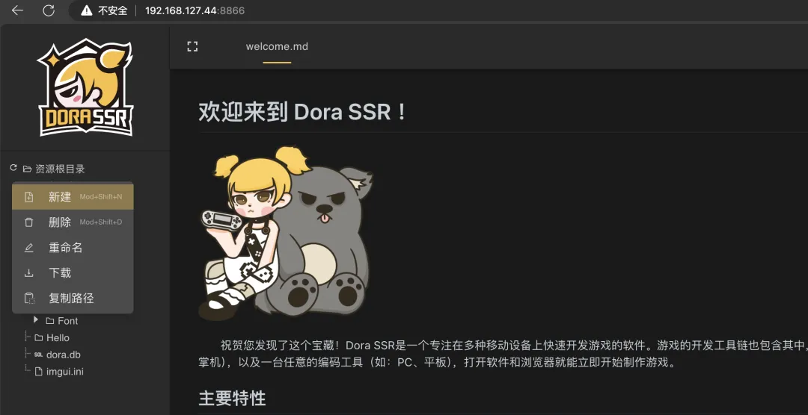
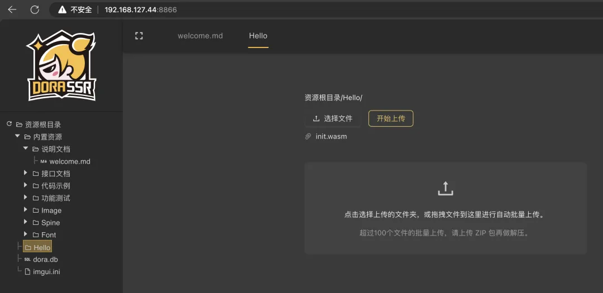
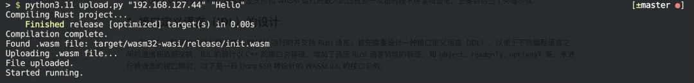

# 8.Rust 游戏开发

## 为什么 Rust 适用于游戏开发？

Rust 是一种强调内存安全性、高性能和并发性的现代系统编程语言。由于其性能和安全特性，它最近作为一种非常适合游戏开发的语言而受到欢迎。

由于性能在游戏开发中至关重要，Rust 的所有权和借用机制确保内存得到适当有效的管理。现代游戏必须在各种平台上运行，Rust 的并发特性可以使得代码从多核 cpu 中获益。

此外，Rust 非常适合创建游戏引擎，即处理游戏基本功能的软件框架，包括用户输入、物理模拟和图形渲染。由于 Rust 的高性能和安全能力，创造快速、有效和可靠的游戏引擎是可行的。

Rust 用于游戏开发的游戏引擎，有 Amethyst、Bevy 和 ggez 等。随着物理模拟、图像和输入处理等功能的开发，这些引擎将成为游戏开发者构建游戏作品的基础。

在接下来的几年里，由于 Rust 在游戏开发行业中越来越受欢迎，预计会有更多的游戏和游戏引擎使用 Rust 构建。

### 一些使用 Rust 进行开发的知名公司：

Microsoft：他们正在尝试将 Rust 整合到 C++/C 编程语言中。Rust 出色的内存安全性解决了微软 70%与内存相关的常见漏洞(CVE)。

Dropbox：Dropbox 的文件同步引擎使用 Rust。Rust 使并发编程测试和调试变得简单，此外，Rust 对静态类型和编译时的大量依赖有助于处理并发代码和复杂的数据库。

Facebook：Rust 被用来重写 Facebook 的控制后端，以消除 bug 并增强编译器反馈循环。

Discord：Discord 在客户端和服务器端都使用 Rust。为了扩展，他们将 Exilir 原生函数(NIFs)与 Rust 结合起来。

Coursera：Rust 用于为学生的编程作业提供动力。学生可以远程创建和执行计算机程序，具有类似于母语的性能。创建一个安全的环境，学生可以在其中运行代码。

### Rust 是游戏开发的未来吗？

我们很难预测游戏开发的未来，以及哪种技术将主导它。然而，Rust 是一种很有前途的游戏开发语言，并且在行业中越来越受欢迎。

Rust 的主要优势之一是它能够在保持内存安全性的同时生成高性能代码。这使得它非常适合开发需要大量处理能力的游戏，如 open-world 游戏或带有复杂物理引擎的游戏。Rust 对并发编程的支持以及与其他语言和平台轻松集成的能力使其成为游戏开发人员的通用选择。

一些使用 Rust 构建的游戏引擎，如 Amethyst、Bevy 和 Piston，已经在游戏开发社区中获得了关注。这些引擎提供了实体组件系统、现代渲染管道和灵活的脚本语言等功能，可以使游戏开发更快、更高效。

一般来说，Rust 可以与其他编程语言交互，比如 C 和 C++，它具有一个外部函数接口，可以从 Rust 调用 C 代码。既然我们已经讨论了 Rust 是游戏开发的未来，那么是时候将 Rust 与其他编程语言进行比较了。

如果你刚刚开始制作游戏，那么 Rust 可能是一个更好的选择。

### 以下是 Rust 与其他流行游戏开发语言的对比：

**Rust vs. C++：**由于高性能和底层控制，C++一直是游戏开发的主导语言。Rust 提供了类似的性能和控制，但增加了安全特性，使其不容易出现与内存相关的 bug 和错误。此外，Rust 的所有权系统可以使编写多线程代码变得更容易。

**Rust vs. c#：**c#是基于 Unity 引擎进行游戏开发的流行语言。虽然 c#是一种高级的语言，并且由于它的垃圾收集器，可以使代码更容易编写和维护。然而，Rust 的安全特性和内存管理系统使它比 c#更安全，更不容易崩溃，性能更好。

**Rust vs. Python：**Python 是 Pygame 框架上游戏开发的流行语言，但通常不用于高性能游戏。Rust 提供的性能优势使其适合需要更多处理能力的高性能游戏，Rust 的类型系统和所有权模型可以使编写可维护和可伸缩的代码更容易。

**Rust vs. Java：**Java 是另一种流行的游戏开发语言，尤其是在 Android 平台上。虽然 Java 在易用性和垃圾收集方面提供了与 c#类似的好处，但 Rust 提供了更好的性能和内存安全特性。此外，Rust 对并发性的支持可以更容易地编写可伸缩和高效的代码。

### 你可以用 Rust 构建什么类型的游戏？

从简单到复杂的多人游戏，都可以使用 Rust 创建它们。可以考虑的游戏类型包括赛车、解谜、模拟、动作、卡牌、VR、RPG、策略、FPS、Open World 等。

如果你想为各种平台和主机创建强大的游戏，Rust 目前并不是最好的选择，因为在 Rust 中没有太多可用的资源来创建游戏。此外，很少有强大的游戏引擎支持 Rust 在这个级别的游戏开发。

大多数主机游戏开发者并不使用 Rust，相反，C++、c#或 Lua 是为几乎所有平台快速创建游戏的理想语言。这些语言拥有丰富的资源，可以用来快速有效地制作游戏。

虽然用于游戏开发的 Rust 是一种相对较新的语言，但已经有一些著名的游戏是使用 Rust 或基于 Rust 的游戏引擎开发的。

#### 下面是一些例子：

##### 1、Rust Doom

Rust Doom 是一个展示如何使用 Rust 编程语言创造经典第一人称射击游戏 Doom 的 Rust 版本。该项目是由 Rust 游戏开发社区领导的开源项目。

Rust Doom 的游戏引擎、游戏逻辑和渲染管道都是使用 Rust 编程语言创建的。该项目是在 Doom 源代码的 Rust 端口上构建的，与原始的 C 代码相比，Rust 代码提供了许多优点，例如增强的内存安全性、增强的效率和更简单的代码维护。

##### 2、Veloren

Veloren 是一款完全用 Rust 开发的基于像素的 3D 多人角色扮演游戏(RPG)。你可以寻找宝藏，与野蛮人战斗，探索地下城。这是一款由 Veloren 团队开发的 Open World RPG，使用基于 rust 的游戏引擎 Amethyst。虽然这款游戏仍处于开发阶段，但它正在向玩家提供丰富的沉浸式游戏体验。

像素引擎不是将模型描述为三角形的集合，而是在 3D 空间中定义点。像素为玩家提供了向电子游戏中添加内容的绝佳机会，它们可以构建令人难以置信的动态环境。最多人玩的基于像素的游戏可能是《我的世界》。

##### 3、Nox Futura

Nox Futura 是一款由 DRAGO Entertainment 使用 Rust 编程语言开发的多人动作游戏。游戏设定在一个反乌托邦的未来，玩家在一个后世界末日的舞台上竞争生存，成为最后一个站着的玩家。

Rust 用于游戏开发的高性能和高效率，对于像《Nox Futura》这样的快节奏动作游戏至关重要。Rust 的内存安全特性和并发支持确保游戏可靠运行，不会崩溃。

##### 4、Hematite

Hematite 是一款使用 Rust 编程语言开发的基于像素的沙盒游戏。这款游戏仍处于开发的早期阶段，但它已经展示了使用 Rust 进行游戏开发的一些好处。

使用 Rust 进行游戏开发的主要好处之一是它的性能。Rust 是一种快速高效的系统编程语言，它有几个功能使其非常适合游戏开发。

以上只是一些使用 Rust 或基于 Rust 的引擎开发的游戏。随着 Rust 在游戏开发社区中越来越受欢迎，我们会看到更多使用这种强大语言开发的游戏。

## 用 Rust 开发跨平台游戏是怎样的体验？

[用 Rust 开发跨平台游戏是怎样的体验？ (qq.com)](https://mp.weixin.qq.com/s/92ioV-qG7Co9wFwSkrQC-A)

### 一、引言

自从童年时代深陷 Warcraft III 的 MOD 魔力之中，我就一直对游戏脚本语言怀有特殊的情感。

回想那时，使用暴雪开发的 JASS 语言开发魔兽争霸 3 的游戏关卡，尽管从今天的角度看 JASS 是极其简陋的，主要特点为静态类型 + 无 GC 功能，但它在那个尚未形成行业标准的年代，代表了对游戏开发语言的一种大胆尝试。

#### 为什么要使用脚本语言开发游戏？

游戏脚本语言的引入主要是为了提高开发测试的便捷性。如果直接使用 C++ 这样的底层语言，每更改一行代码，都可能需要耗费大量时间等待复杂工具链的编译与打包。而通过使用脚本语言，可以对实现游戏玩法的程序进行热加载执行，显著提升游戏的开发效率。

随着时间的推移，如 Lua 和 JavaScript 这样的动态类型脚本语言已成为游戏开发中的常客。

然而，随着编程语言的发展，我们有机会重新定义游戏脚本语言的新标准 —— 既复古又革新，这就是 Rust + WASM 的组合。

### 二、Rust + WASM + Dora SSR：重新定义游戏脚本开发

通过结合 Rust 和 WASM，我们可以在不牺牲性能的前提下，直接在例如 Android 或 iOS 设备上进行游戏热更新和测试，且无需依赖传统的应用开发工具链。

此外，借助 Dora SSR 开源游戏引擎的 Web IDE 接口，使用 Rust 编写的游戏代码可以一次编译后，在多种游戏设备上进行测试和运行。

#### 为何选择 Rust？

Rust 提供了无与伦比的内存安全保证，而且无需垃圾收集器（GC）的介入，这使得它非常适合游戏开发，尤其是在性能敏感的场景下。结合 WASM，Rust 不仅能够提供高性能的执行效率，还能保持跨平台的一致性和安全性。

#### 快速开始指南

在开始开发之前，我们需要安装 Dora SSR 游戏引擎。该引擎支持多种平台，包括 Windows、Linux、macOS、iOS 和 Android。

具体的安装步骤和要求，请参见官方快速开始指南：Dora SSR 快速开始
https://dora-ssr.net/zh-Hans/docs/tutorial/quick-start/。



##### 第一步：创建新项目

在 Dora SSR 引擎的二进制程序启动以后，在浏览器中打开 Dora SSR 的 Web IDE，右键点击左侧游戏资源树，选择「新建」并创建名为「Hello」的新文件夹。



##### 第二步：编写游戏代码

然后在命令行中创建一个新的 Rust 项目：

```rust
rustup target add wasm32-wasi
cargo new hello-dora --name init
cd hello-dora
cargo add dora_ssr
```

在 `src/main.rs` 中编写代码：

```rust
use dora_ssr::*;

fn main () {
  let mut sprite = match Sprite::with_file("Image/logo.png") {
    Some(sprite) => sprite,
    None => return,
  };
  let mut sprite_clone = sprite.clone();
  sprite.schedule(once(move |mut co| async move {
    for i in (1..=3).rev() {
      p!("{}", i);
      sleep!(co, 1.0);
    }
    p!("Hello World");
    sprite_clone.perform_def(ActionDef::sequence(&vec![
      ActionDef::scale(0.1, 1.0, 0.5, EaseType::Linear),
      ActionDef::scale(0.5, 0.5, 1.0, EaseType::OutBack),
    ]));
  }));
}
```

构建生成 WASM 文件：

```bash
cargo build --release --target wasm32-wasi
```

#### 第三步：上传并运行游戏

在 Dora SSR Web IDE 中，右键点击新创建的文件夹「Hello」，选择「上传」并上传编译好的 WASM 文件 `init.wasm`。



或者使用辅助脚本 upload.py 在 Rust 项目文件夹内上传 WASM 文件，命令如下，其中的 IP 参数为 Dora SSR 启动后显示的 Web IDE 地址，后一个参数为要上传目录的相对路径：

```bash
python3 upload.py "192.168.3.1" "Hello"
```



##### 第四步：发布游戏

在编辑器左侧游戏资源树中，右键点击刚创建的项目文件夹，选择「下载」。

等待浏览器弹出已打包项目文件的下载提示。

### 三、怎么实现的

在 Dora SSR 中实现 Rust 语言开发支持和 WASM 运行时嵌入的过程是一次新的技术探索和尝试，主要包括三个关键步骤：

#### 1. 接口定义语言（IDL）的设计

要在 C++ 编写的游戏引擎上嵌入 WASM 运行时并支持 Rust 语言，首先需要设计一种接口定义语言（IDL），以便于不同编程语言之间的通信和数据交换。

以下是一个 Dora SSR 设计的 WASM IDL 示例，可以看出是以源语言 C++ 的程序接口为基础，增加一些转换到 Rust 接口所需要的信息的标签，比如 object，readonly，optional 等。

做跨语言的接口映射其中有一个难点是 C++ 的接口设计是面向对象的，但是 Rust 并没有提供完整的面向对象设计的能力，所以一部分的面向对象的接口需要在 Rust 上额外编写代码进行功能的模拟，所幸这部分语言差异并没有特别巨大，也不用很复杂的机制设计就能解决。

```rust
object class EntityGroup @ Group
{
	readonly common int count;
	optional readonly common Entity* first;
	optional Entity* find(function<bool(Entity* e)> func) const;
	static EntityGroup* create(VecStr components);
};
```

#### 2.生成胶水代码的程序

第二步是编写一个程序，通过 IDL 生成 C++、WASM 和 Rust 之间互相调用的胶水代码。

为了实现这一点，我们选择使用 Dora SSR 项目自创的 Yuescript 语言。Yuescript 是基于 Lua 的一门动态编程语言，它结合了 Lua 语言生态中的 lpeg 语法解析库来处理 IDL 的解析和胶水代码的生成。

使用 Yuescript 的好处是它继承了 Lua 的灵活性和轻量级，同时提供了更丰富的语法和功能，适合处理复杂的代码生成任务。

以下是使用 PEG 文法编写的 IDL 解析器的代码节选。

```rust
Param = P {
	"Param"
	Param: V"Func" * White * Name / mark"callback" + Type * White * Name / mark"variable"
	Func: Ct P"function<" * White * Type * White * Ct P"(" * White * (V"Param" * (White * P"," * White * V"Param")^0 * White)^-1 * P")" * White * P">"
}

Method = Docs * Ct(White * MethodLabel) * White * Type * White * (C(P"operator==") + Name) * White * (P"@" * White * Name + Cc false) * White * Ct(P"(" * White * (Param * (White * P"," * White * Param)^0 * White)^-1 * P")") * White * C(P"const")^-1 * White * P";" / mark"method"
```

#### 3. 嵌入 WASM 运行时和代码整合

最后一步是在游戏引擎中嵌入 WASM 运行时以及所生成的 C++ 胶水代码，完成代码的整合。对于 WASM 运行时，我们选择使用 WASM3，这是一个高性能、轻量级的 WebAssembly 解释器，它支持多种 CPU 架构，能够简化编译链的复杂性，并提高跨平台的兼容性。通过这种方式，Dora SSR 能够支持在各种架构的硬件设备上运行 Rust 开发的游戏，极大地提高了游戏项目的可访问性和灵活性。

在整合过程中，我们发布了供 Rust 开发者使用的 crate 包，包含所有必要的接口和工具，以便开发者未来可以轻松地基于 Dora SSR 游戏引擎开发和再发布使用 Rust 语言编写的其它游戏模块。

### 四、性能比较

Dora SSR 游戏引擎同时也提供了 Lua 脚本语言的支持。目前使用的是 Lua 5.5 版本的虚拟机，和 WASM3 也是一样的没有做 JIT 的实时机器码的生成而只是在虚拟机中解释执行脚本代码。所以我们可以为这两个相近的脚本方案做一些性能比较。

在比较之前，我们可以大概判断，不考虑 Lua 语言执行 GC 的耗时，因为 Lua 语言本身的动态特性，C++ 映射到 Lua 的程序接口往往得在运行时做接口传入参数类型的实时检查，另外 Lua 对象的成员属性的访问查找也需要在运行时通过一个 hash 结构的表进行查找，这些都是静态类型的 Rust 语言 + WASM 虚拟机不需要付出的开销，或者只用付出更小的开销的场景。

以下是一些基础的性能测试的案例，专门选取了 C++ 端没有做太多计算处理的接口，来比较跨语言调用传参的性能差异。

- Rust 测试代码

```rust
let mut root = Node::new();
let node = Node::new();

let start = App::get_elapsed_time();
for _ in 0..10000 {
	root.set_transform_target(&node);
}
p!("object passing time: {} ms", (App::get_elapsed_time() - start) * 1000.0);

let start = App::get_elapsed_time();
for _ in 0..10000 {
	root.set_x(0.0);
}
p!("number passing time: {} ms", (App::get_elapsed_time() - start) * 1000.0);

let start = App::get_elapsed_time();
for _ in 0..10000 {
	root.set_tag("Tag name");
}
p!("string passing time: {} ms", (App::get_elapsed_time() - start) * 1000.0);
```

- Lua 测试代码

```rust
local root = Node()
local node = Node()

local start = App.elapsedTime
for i = 1, 10000 do
	root.transformTarget = node
end
print("object passing time: " .. tostring((App.elapsedTime - start) * 1000) .. " ms")

start = App.elapsedTime
for i = 1, 10000 do
	root.x = 0
end
print("number passing time: " .. tostring((App.elapsedTime - start) * 1000) .. " ms")

start = App.elapsedTime
for i = 1, 10000 do
	root.tag = "Tag name"
end
print("string passing time: " .. tostring((App.elapsedTime - start) * 1000) .. " ms")
```

#### 运行结果

```bash
Rust + WASM:
object passing time: 0.6279945373535156 ms
number passing time: 0.5879402160644531 ms
string passing time: 3.543853759765625 ms

Lua:
object passing time: 6.7338943481445 ms
number passing time: 2.687931060791 ms
string passing time: 4.2259693145752 ms
```

可以看出，除了字符串类型的接口传参调用外，在 Dora SSR 中实现的其它类型的接口的 Lua 跨语言调用性能要比 WASM 跨语言调用几乎慢一个数量级。

字符串类型的接口推断是因为性能消耗大头主要都是在字符串对象的拷贝上，跨语言调用的开销远比内存拷贝的开销小，所以结果差距不大。

### 五、用户体验之谈

在游戏开发中引入 Rust 语言，我个人体验到了与传统所不同的生产力提升，特别是在与大型语言模型（如 ChatGPT）进行代码生成辅助方面。与传统的 C 或 C++ 相比，Rust 的严格编译器为游戏开发提供了一个更加稳固和安全的编程环境。

比如使用大语言模型辅助编码时，在生成 C 或 C++ 甚至很多动态类型的语言时，尽管很多时候生成的代码可以通过编译，但在运行时往往仍隐藏着许多难以察觉的错误和缺陷。这些问题可能包括内存泄漏、指针或是引用误用等等，这些都是游戏开发中常见且难以调试的问题。

然而，在 Rust 中，许多这类问题都可以在编译阶段被有效捕捉并修正，这得益于 Rust 的所有权和借用机制，以及其在类型安全和内存安全方面的设计优势。

通过在 Dora SSR 游戏引擎中引入对 Rust 的支持，我发现编写游戏脚本不仅更加安全，也更加高效。这使得游戏开发不再是一个错误排查的过程，而是一个更加专注于创造和实现想象中游戏的过程。

Rust 的这些优势，加上 WASM 的跨平台能力，极大地扩展了我们的游戏开发能力和可能性。

### 六、结语

选择 Dora SSR + Rust 作为游戏开发工具不仅是追求技术的前沿，也是对游戏开发流程的一次新的探索。在这里诚邀每一位热爱游戏开发的朋友加入我们的社区，一同探索这一激动人心的技术旅程。

#### 作者介绍

李瑾：金融行业大数据工程师，Dora SSR 和 Yuescript 开源软件作者。

#### 项目介绍

Dora SSR (多萝珍奇引擎)是一个用于多种设备上快速开发 2D 游戏的游戏引擎。它内置易用的开发工具链，支持在手机、开源掌机等设备上直接进行游戏开发。

#### 项目仓库

https://gitee.com/pig/Dora-SSR

https://github.com/IppClub/Dora-SSR

# 开源简单的Rust游戏项目

[harshvishu/pong：使用 Rust lang 的 Ping 游戏 (github.com)](https://github.com/harshvishu/pong)
