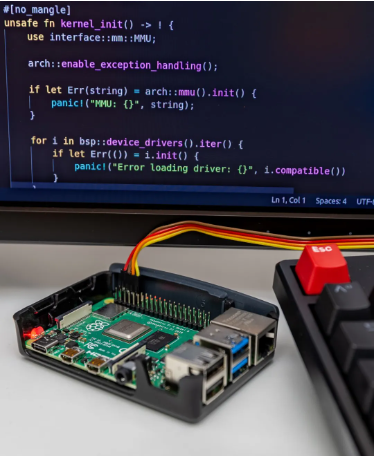
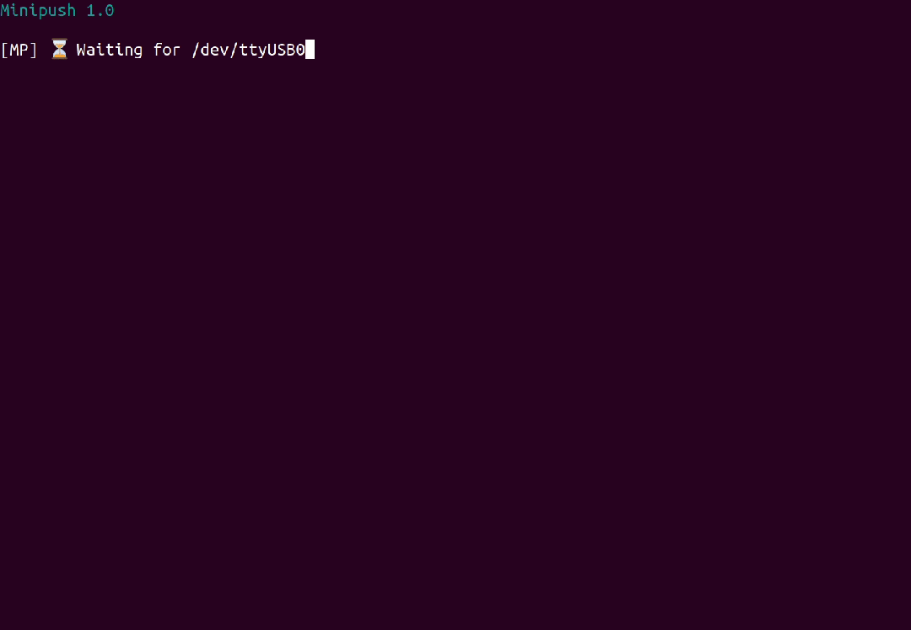
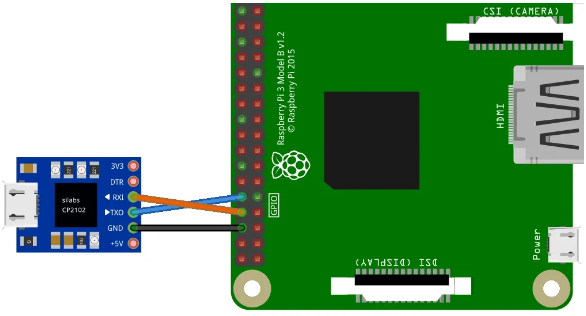

# Rust 学习资源

**Rust 语言开源组织**：https://github.com/rust-lang

Rust是Mozilla开发的一种安全的现代编程语言。它是为高效、可靠的软件开发而设计的，特别是在对系统资源的底层控制。

Rust具有独特的所有权系统和强类型系统，可以防止常见的编程错误。

对于熟悉C++语言的开发人员来说，Rust很容易学习。它在web开发、嵌入式系统和网络中很流行。Rust社区是非常活跃的，有许多可用的库和框架。

## 中文网

[Rust 文档网 - Rust 官方文档中文教程 (rustwiki.org.cn)](https://www.rustwiki.org.cn/)

[Rust 教程|极客教程 (geek-docs.com)](https://geek-docs.com/rust/rust-top-tutorials/1000100_rust_index.html)

## Rust 官网资源

官网：[入门 - Rust 程序设计语言 (rust-lang.org)](https://www.rust-lang.org/zh-CN/learn/get-started)

Rust 演练场：[Rust Playground (rust-lang.org)](https://play.rust-lang.org/?version=stable&mode=debug&edition=2021)

官网学习文档：[学习 Rust - Rust 程序设计语言 (rust-lang.org)](https://www.rust-lang.org/zh-CN/learn)

- [Rust Book “The Book”](https://doc.rust-lang.org/book/)：这是一本关于 Rust 编程语言的官方书籍，由 Mozilla 基金会的 Rust 开发团队编写。

  - 开源地址：https://github.com/rust-lang/book
  - **中文翻译版**：[Rust 程序设计语言 - Rust 程序设计语言 简体中文版 (kaisery.github.io)](https://kaisery.github.io/trpl-zh-cn/)
  - **中文翻译版开源地址**：[KaiserY/trpl-zh-cn：Rust 程序设计语言（2021 edition）](https://github.com/KaiserY/trpl-zh-cn)

- [Rust By Example](https://doc.rust-lang.org/rust-by-example/)：Rust by example 为 Rust 中的各种概念提供了一系列可运行的示例。我发现每当我在那里学习一个概念时，与“书”一起引用是很有用的。

  > 开源地址：https://github.com/rust-lang/rust-by-example
  >
  > 中文版：[简介 - 通过例子学 Rust 中文版 (rustwiki.org)](https://rustwiki.org/zh-CN/rust-by-example/)
  >
  > 中文版开源地址：https://github.com/rust-lang-cn/rust-by-example-cn

- [std - Rust (rust-lang.org)](https://doc.rust-lang.org/std/index.html)

- [Rustonomicon](https://doc.rust-lang.org/nomicon/intro.html#the-rustonomicon) 高级和不安全的 Rust 编程的黑暗艺术

  - 开源地址：https://github.com/rust-lang/nomicon

- [Rust 错误代码索引](https://doc.rust-lang.org/error_codes/error-index.html)

- [Rust 中的错误处理 - Andrew Gallant 的博客 (burntsushi.net)](https://blog.burntsushi.net/rust-error-handling/)

  - 翻译：[Rust 中的错误处理 - OSCHINA - 中文开源技术交流社区](https://www.oschina.net/translate/rust-error-handling)

官网工具：[工具 - Rust 程序设计语言 (rust-lang.org)](https://www.rust-lang.org/zh-CN/tools)

官方社区列表：[社区 - Rust 程序设计语言 (rust-lang.org)](https://www.rust-lang.org/zh-CN/community)

- [The Rust Programming Language Forum (rust-lang.org)](https://users.rust-lang.org/)

官方版本发布博客：[Rust 编程语言博客 (rust-lang.org)](https://blog.rust-lang.org/)

[简介 - Rust 的书 (rust-lang.github.io)](https://rust-lang.github.io/rustup/)

## 1） 阅读材料

kaiy

#### 《The Little Book of Rust Books》：

项目地址：https://github.com/lborb/book

在线阅读：https://lborb.github.io/book/

**创作背景**

《The Little Book of Rust Books》是 GitHub 上的一个开源项目，旨在汇总各类优秀的 Rust 编程书籍，方便 Rust 学习者查阅。该书由 Rust 社区的爱好者共同创作维护，目前已收录了数十本 Rust 书籍，包括官方出品和个人撰写的优秀作品。

**主要特性**

《The Little Book of Rust Books》有以下几个特点：

1. 官方推荐：收录了 Rust 官网推荐的系列书籍，权威性毋庸置疑。
2. 分类清晰：按照书籍类型划分，包含入门、进阶、专项等多个层次。
3. 简介详尽：每本书都配有简要介绍，读者可以快速了解书籍内容。
4. 链接齐全：direct 提供书籍的在线阅读链接，方便读者访问。
5. 开源共建：项目以 MIT 协议开源，欢迎所有人参与贡献。

**快速上手**

作为一名 Rust 小白，如何利用《The Little Book of Rust Books》学习呢？这里给大家一个简单例子。

比如我们想学习 Rust 的基本语法，可以阅读官方出品的 Rust 程序设计语言 一书。

访问在线阅读地址：https://doc.rust-lang.org/book/，即可开始学习。

随便翻开一章，例如 Guessing Game，跟着教程一步步编写如下代码：

```rust
// 引入标准库的 io 模块和 rand 模块  
use std::io;
use rand::Rng;

fn main() {
    println!("Guess the number!");

    // 生成一个 1-100 之间的随机秘密数字
    let secret_number = rand::thread_rng().gen_range(1..=100);

    loop {
        println!("Please input your guess.");

        // 创建一个字符串变量，用于保存用户的输入
        let mut guess = String::new();

        // 读取用户从标准输入的一行字符串，并把它赋值给 guess 变量
        io::stdin()
            .read_line(&mut guess) 
            .expect("Failed to read line");

        // 把用户输入的字符串解析为 u32 类型的数字
        let guess: u32 = match guess.trim().parse() {
            Ok(num) => num,
            Err(_) => continue,
        };

        println!("You guessed: {guess}");

        // 将用户猜的数字与秘密数字比较大小
        match guess.cmp(&secret_number) {
            Ordering::Less => println!("Too small!"),
            Ordering::Greater => println!("Too big!"),
            Ordering::Equal => {
                println!("You win!");
                break;
            }
        }
    }
}
```

运行后，控制台将输出如下交互界面：

```
Guess the number!
Please input your guess.
50 
You guessed: 50
Too small!
Please input your guess.
75
You guessed: 75      
Too big!
Please input your guess.
68
You guessed: 68
You win!
```

就这样，我们通过一个简单有趣的猜数字游戏，初步掌握了 Rust 的基本语法和控制流程。阅读 Rust 程序设计语言，你将收获更多编程知识！


#### **1.** [Tour of Rust](https://tourofrust.com/)

是 Rust 编程语言的分步指南。它提供了语言的一个很好的概述，并允许学习者修改代码示例进行实验。我想说的是，Tour of Rust 本身并不是一种资源。

#### **2.** [半小时学习 Rust](https://fasterthanli.me/articles/a-half-hour-to-learn-rust)

是一个很好的快速总结，它通过快速示例介绍了该语言的许多概念。一切都在一个网页页面上！因此，我发现这个资源对于快速刷新某些概念非常有用。

#### **3.** [A Gentle Introduction to Rust](https://stevedonovan.github.io/rust-gentle-intro/readme.html)

[Rust 的温和介绍]是一本总结了 Rust 主要概念的简短书。正如作者所提到的，这个想法是“先试后买”，以便在深入研究“书”等更复杂的资源之前充分了解该语言。

### 🆓 免费在线书籍：

Rust 秘典(中文)：[介绍 - Rust 秘典（死灵书） (purewhite.io)](https://nomicon.purewhite.io/)

[Rust Book “The Book”](https://doc.rust-lang.org/book/)：这是一本关于 Rust 编程语言的官方书籍，由 Mozilla 基金会的 Rust 开发团队编写。

- 开源地址：https://github.com/rust-lang/book
- **中文翻译版**：[Rust 程序设计语言 - Rust 程序设计语言 简体中文版 (kaisery.github.io)](https://kaisery.github.io/trpl-zh-cn/)
- **中文翻译版开源地址**：[KaiserY/trpl-zh-cn：Rust 程序设计语言（2021 edition）](https://github.com/KaiserY/trpl-zh-cn)

[Rust By Example](https://doc.rust-lang.org/rust-by-example/)：Rust by example 为 Rust 中的各种概念提供了一系列可运行的示例。我发现每当我在那里学习一个概念时，与“书”一起引用是很有用的。

> 开源地址：https://github.com/rust-lang/rust-by-example
>
> 中文版：[简介 - 通过例子学 Rust 中文版 (rustwiki.org)](https://rustwiki.org/zh-CN/rust-by-example/)
>
> 中文版开源地址：https://github.com/rust-lang-cn/rust-by-example-cn

**6.** [Easy Rust](https://dhghomon.github.io/easy_rust/)：这是一个资源，试图专注于使用“简单的英语”为非英语母语人士学习 Rust。我个人认为在此过程中澄清概念很有用。这本书的好处还在于，书中链接了一个 youtube 视频，并与每一章相关联。

- 开源地址：https://github.com/Dhghomon/easy_rust

- [简单英语学 Rust]() 简单英语学 Rust 写于 2020 年 7 月至 8 月，长达 400 多页。这是一种试图使用“易懂的英语”来教授 Rust 编程语言的资源，适用于非英语母语的学习者，当然也提供了中文译本。

  - 中文版 GitHub：https://github.com/kumakichi/easy_rust_chs

  - 中文版在线阅读：https://kumakichi.github.io/easy_rust_chs/

**[Rust Atomics and Locks](https://marabos.nl/atomics/)**：这本书由优秀的 Mara Bos 编写，可免费获取。正如书名所示，它介绍了 Rust 原子和锁的相关知识。因此，这本书的内容在编写并发应用程序代码时非常有用。通常来说，这并不是初学者可以轻松掌握的内容，但是，当你在 Rust 知识方面有所进步时，这是一本必须了解的资源。

Mara Bos 是 Rust 核心团队的成员，在 Rust 标准库中负责并发编程相关的模块。她发现虽然 Rust 的所有权机制和类型系统为并发编程提供了良好的基础，但开发者在实际编写并发代码时仍然会遇到不少困难，尤其是在使用底层的原子操作和内存顺序时。因此，她决定结合自己的经验，撰写一本全面介绍 Rust 多线程编程的书籍，帮助开发者深入理解 Rust 并发编程的原理和最佳实践。

**主要特性**

《Rust Atomics and Locks》这本书主要包含以下内容：

- 详细介绍了 Rust 的并发编程模型，包括线程的创建、线程间的同步与通信等。
- 深入探讨了原子操作和内存顺序，以及它们在不同处理器架构下的实现。
- 介绍了如何使用 Rust 提供的锁（如 Mutex、RwLock）和同步原语（如 Condvar）。
- 教你如何从头开始实现自己的锁和并发数据结构，并保证其正确性和性能。
- 讲解了操作系统内核提供的并发编程支持，以及如何在 Rust 中使用它们。

书中提供了大量的示例代码和练习题，帮助读者加深理解和掌握。

> 开源地址：https://github.com/m-ou-se/rust-atomics-and-locks
>
> 中文翻译版：https://atomics.rs/about-book.html
>
> 中文翻译版开源地址：https://github.com/m-ou-se/rust-atomics-and-locks
>
> 《Rust Atomics and Locks》书籍官网：https://marabos.nl/atomics
>
> Rust 并发编程文档：https://doc.rust-lang.org/book/ch16-00-concurrency.html


[Comprehensive Rust 🦀 ](https://google.github.io/comprehensive-rust/) 这是 Google(谷歌) 的 Android 团队使用的 Rust 课程。它为您提供了快速教授 Rust 的材料。该课程涵盖了 Rust 的全部内容，从基本语法到泛型和错误处理等高级主题。

- GitHub 开源地址：https://github.com/google/comprehensive-rust


**[Rust Design Patterns](https://rust-unofficial.github.io/patterns/intro.html)**：如果你想编写更符合 Rust 编程语言惯例的代码，这是一个很好的资源。对于初学者来说，这不是一本好书，而是在进一步学习 Rust 时可以参考的书籍。如果你来自另一种编程语言，这本书也可以帮助你理解设计模式的不同之处。阅读这本书的部分内容实际上帮助了我阅读其他人的代码。

> 中文版：**[rust 设计模式](https://fomalhauthmj.github.io/patterns/)**
>
> 中文版 GitHub 开源地址：https://github.com/Fomalhauthmj/patterns

:a:**Rust 圣经（中文重点推荐看的书籍）**：[关于本书 - Rust 语言圣经(Rust Course)](https://course.rs/about-book.html)

- 开源地址：https://github.com/sunface/rust-course

[Rust 语言实战](https://zh.practice.rs/why-exercise.html) （中文）Rust 语言实战的目标是通过大量的实战练习帮助大家更好的学习和上手使用 Rust 语言。这里除了有大量的练习题和答案，还支持在线阅读、修改和编译 Rust 代码。书中的练习题非常易于使用：你所需的就是在线完成练习，并让它通过编译。

- 开源地址：https://github.com/sunface/rust-by-practice
- 在线阅读：https://zh.practice.rs/why-exercise.html

**LearnRustEasy**（中文）：[前言：为什么写这本书 - LearnRustEasy (rustycab.github.io)](https://rustycab.github.io/LearnRustEasy/)

**[Rust 性能手册](https://nnethercote.github.io/perf-book/#the-rust-performance-book)** 编写 Rust 代码的注意哪些是影响性能的

**[Rust 编译器开发指南](https://rustc-dev-guide.rust-lang.org/)** 如何基于 rust 开发编译器

[Rust 中的命令行应用程序 (rust-cli.github.io)](https://rust-cli.github.io/book/index.html) 使用 rust 开发命令行工具教程

[Rust 设计模式 (rust-unofficial.github.io)](https://rust-unofficial.github.io/patterns/)

[Rust 烹饪书](https://llever.com/rust-cookbook-zh/#rust-烹饪书) （中文）这个*Rust 烹饪书*是一套简单的例子，它演示了如何使用 Rust 生态系统的箱子，作为完成常见编程任务的良好实践。

- 在线阅读：https://llever.com/rust-cookbook-zh/
- GitHub 开源地址：https://github.com/rust-lang-nursery/rust-cookbook

Rust 宏编程：

- [Rust 宏小册 中文版 - 《Rust 宏小册 中文版》 - 书栈网 · BookStack](https://www.bookstack.cn/read/DaseinPhaos-tlborm-chinese/README.md)
- [Rust 宏小书 (danielkeep.github.io)](https://danielkeep.github.io/tlborm/book/index.html)
- [Rust 宏魔法系列 - 派生宏 - 掘金 (juejin.cn)](https://juejin.cn/post/7344567594086400015)

Rust 异步编程：

- [起步 - Rust 中的异步编程 (huangjj27.github.io)](https://huangjj27.github.io/async-book/index.html)
- [《async-std 中文文档》 | Rust 技术论坛 (learnku.com)](https://learnku.com/docs/rust-async-std)
- [Rust 异步编程 :：Rectcircle Blog](https://www.rectcircle.cn/posts/rust异步编程/)
- [Rust 之异步入门 - 掘金 (juejin.cn)](https://juejin.cn/post/6875948465055072263)

Rust 🦀 和 WebAssembly 🕸：

- [Rust 🦀 和 WebAssembly 🕸](https://rustwasm.github.io/docs/book/#rust--and-webassembly-)


《Effective Rust》改进 Rust 代码的 35 种具体方法：

- 《Effective Rust》中文版在线阅读：https://rustx-labs.github.io/effective-rust-cn/
- 《Effective Rust》中文版 Github 仓库：https://github.com/rustx-labs/effective-rust-cn
- 《Effective Rust》英文原版：https://www.lurklurk.org/effective-rust/

《Effective Rust》是 Rust 社区的经典著作，提炼了编写高质量 Rust 代码的 35 个有效方法。无论你是 Rust 新手还是有一定经验，都能从中获益良多。而中文版的推出，进一步降低了 Rust 学习的门槛，让更多开发者能够享受到 Rust 编程的乐趣。

目前该中文翻译版本由【RustX 实验室】出品，RustX 实验室致力于推动 Rust 编程语言在技术社区中的应用与发展。专注于创建和分享实用的工具、库和资源，以帮助开发者更高效地使用 Rust。同时，也致力于翻译和传播国外优秀的 Rust 相关文章和书籍，以促进 Rust 在中国的普及和提升。

**主要特性**

《Effective Rust》中文版翻译版继承了原著的精华，主要包括以下内容：

- 类型系统：如何利用 Rust 强大的类型系统来表达领域概念和编码意图
- 常见概念：深入理解生命周期、借用检查器、Unsafe 等 Rust 独有概念
- 错误处理：如何优雅地处理和传播错误
- 代码结构：如何组织和设计 Rust 项目，控制依赖关系
- 性能优化：学习常见的性能优化技巧和陷阱


#### 💲 付费印刷书籍：

我个人完全依靠免费材料来学习 Rust，但是，这里列出的书籍是我看到许多正面评论的书籍。此外，有些人可能更喜欢一种更具体的书籍形式，其中“书”本身也可以[在这里](https://amzn.to/3Km3jwl)以硬拷贝形式获得。

**7.** [Rust in Action](https://amzn.to/3DRu0qh)：在这本书中，作者 Tim Mcnamara 也有一个 youtube 频道，在那里他解释了 Rust 的概念。

> 有中文版

**8.** [Programming Rust： Fast， Safe Systems Development](https://amzn.to/3Jfxbtb)：这本书也被评为亚马逊畅销书。

**9.** [从新手到专业人士的 Rust 入门](https://amzn.to/3DS1pBi)：这本书的好处在于它的材料也与[教育](https://www.educative.io/courses/ultimate-guide-to-rust-programming)实践材料有关。

**[Rust for Rustaceans](https://rust-for-rustaceans.com/)**：这是高级用户中广受欢迎的一本书，拥有很好的评价，但是我还没有得到过。我之所以推荐它，是因为作者 Jon Gjengset 有一个我非常喜欢的 Youtube 频道（下面的视频部分有更多详细信息）。

**《Rust for Rustaceans》书籍**

**创作背景**

《Rust for Rustaceans》由 Jon Gjengset 编写，他是一名经验丰富的 Rust 开发者，在 Rust 社区非常活跃。这本书旨在帮助开发者掌握 Rust 高级编程知识，构建和维护更加复杂的应用程序和库。作者用通俗易懂的语言和丰富的示例，对 Rust 的高级特性进行了深入浅出的讲解。

**主要特性**

- 内容全面：涵盖了 Rust 高级编程的方方面面，包括生命周期、traits、异步编程、unsafe、内存布局等。
- 讲解透彻：作者不仅告诉你"是什么"，更重要的是"为什么"，让你对 Rust 的理解更加深刻。
- 示例丰富：每个知识点都配有代码示例，可以帮助你更好地理解和实践。
- 思路清晰：全书结构清晰，前后呼应，便于读者系统学习。

如果你想成为一名 Rust 进阶玩家，《Rust for Rustaceans》是你必读的书籍之一。通过这本书，你将对 Rust 的高级特性有更全面和深入的认识，写出更加优雅、高效、安全的 Rust 代码。快来和作者 Jon Gjengset 一起开启 Rust 进阶之旅吧！

**参考文章**

[1] Rust for Rustaceans 官网：https://rust-for-rustaceans.com/

## 2） 练习资源 🏋️ ♂️

#### 🆓 免费资源

[Rust 语言之旅](https://tourofrust.com/00_zh-cn.html) （中文）本教程旨在循序渐进地介绍 Rust 编程语言的特性。

- GitHub 开源地址：https://github.com/richardanaya/tour_of_rust
- 在线阅读：https://tourofrust.com/00_zh-cn.html

**10.** **[Rustlings](https://github.com/rust-lang/rustlings)** 是一个 git 项目，带有学习 Rust 的小练习。我非常喜欢这个资源，因为它涵盖了“书”中的每个主题，有时很有挑战性。我完成了整套练习，每次完成艰难的练习时都感到非常有成就感。我最喜欢的是弄清楚如何编写一个函数，使用迭代器在一行中查找数字的阶乘。

> 官网：https://rustlings.cool/

**11.** **[Exercism](https://exercism.org/tracks/rust)** 有一个动手实践的 Rust 学习轨道，初学者练习场。我个人认为这些练习的呈现方式很有趣。

**12.** **[Codewars](https://www.codewars.com/?language=rust)** 允许您与同行进行编码挑战。这真的很酷，有助于磨练你的技能。我个人发现弄清楚我是否正确理解某些概念很有用。

**13.** **[Coding Game](https://www.codingame.com/start)** 是一个基于游戏的学习如何编码的网站，也支持 Rust。我没有深入研究它，尽管 Coding Game 有很多好评，因为它有助于让学习变得有趣。

**[StackUp](https://app.stackup.dev/)**是一个开发者社区，您可以在其中学习，并通过参与我们的活动和任务赚取收益。

**[Advent of Code](https://adventofcode.com/)**是一年一度的活动，您可以在其中使用任何您想要的语言解决小型（但高质量的）编程难题。它适用于您正在学习的任何语言。您可能会发现这个、这个和这个存储库很有用，它们为前几年提供了模板和解决方案。

**[LeetCode](https://leetcode.com/)**是一个流行的面试准备平台，有各种不同难度的代码问题需要解决。如果您遇到困难，还有各种仓库和开发者解决 Rust 代码问题的视频资源。

编码挑战：[编码挑战 - 简介 |编码挑战 (codingchallenges.fyi)](https://codingchallenges.fyi/challenges/intro/)

- [Rust Coding Challenges | Coding Challenges](https://codingchallenges.fyi/blog/rust-coding-challenges)

#### 💲 付费资源

**14.** [Egghead.io](https://egghead.io/q/rust) 更以项目为导向，帮助开发人员通过工作项目建立投资组合。有各种有趣的选择，尽管其中一个不错的选择是通过 Rustlings 练习的课程。

**15.** [Educative](https://www.educative.io/) 有多种资源可以动手学习 Rust，其中一本与[从新手到专业的 Rust 入门](https://amzn.to/3DS1pBi)书有关。

## B 站视频

**程序员令狐壹冲**：程序员，分享 Rust 和区块链技术：https://space.bilibili.com/485433391

[Rust 编程语言入门教程（Rust 语言/Rust 权威指南配套）【已完结】\_哔哩哔哩\_bilibili](https://www.bilibili.com/video/BV1hp4y1k7SV/?vd_source=5f0c99b3deddffe219938763769b15ac)

## 3） youtube 视频

[Rust Tutorial Full Course (youtube.com)](https://www.youtube.com/watch?app=desktop&v=ygL_xcavzQ4&t=7122s)

**16.** Doug Milford 的 [Rust 教程](https://www.youtube.com/playlist?list=PLLqEtX6ql2EyPAZ1M2_C0GgVd4A-_L4_5)是我最喜欢的资源之一。Doug 在解释 Rust 中的许多粘性概念方面做得很好。这些视频还介绍了不同的代码示例和方案来解释。

**17.** [CS Honors @ Illinois](https://www.youtube.com/channel/UCRA18QWPzB7FYVyg0WFKC6g/featured) 是另一个最受欢迎的澄清概念的首选频道。该系列视频基于伊利诺伊大学厄巴纳香槟分校的 CS196（现为 CS124）新生课程，该课程由学生开设。这些课程视频并不完全是关于 Rust 的，但是，对于那些确实涵盖了 Rust 概念的视频，我发现它们非常有帮助。

**18.** [Lets Get Rusty](https://www.youtube.com/c/LetsGetRusty/featured) 是一个有用的频道，每周提供有关 Rust 的视频。它有一个很好的播放列表，可以一一回顾“这本书”的章节。尽管我确实发现这些视频有时节奏很快，并且对一些解释有些挣扎。

- [Let's Get Rusty - YouTube](https://www.youtube.com/@letsgetrusty)

**19.** Brad Traversy 的 [Rust Crash Course](https://www.youtube.com/watch?v=zF34dRivLOw) 是一个很棒的快速教程，它向绝对的初学者介绍了各种概念。

**20.** [Ryan Levick](https://www.youtube.com/channel/UCpeX4D-ArTrsqvhLapAHprQ) 是 Microsoft 的一名工程师，从事 Rust 工作，并有一系列视频对某些概念进行了有用的解释。还有一个很酷的项目，Ryan 使用 Rust 为 Microsoft Flight Simulator 2020 构建了一个 SDK。

**21.** [timClicks](https://www.youtube.com/channel/UClny6qj9Mv7uFo9XGUGYQBA) 是 Tim Mcnamara 的一个频道，涵盖了 Rust 中的各种主题，还提供实时编码流。Tim 也是前面提到的 [Rust in Action](https://amzn.to/3DRu0qh) 一书的作者。

**22.** [Free Code Camp](https://www.youtube.com/watch?v=MsocPEZBd-M&t=1820s) 提供了 Rust 的初学者教程，该教程通过 CLI 应用程序运行。虽然有些有用，但我并没有花太多时间在这个上面，因为我在音频质量方面遇到了困难，而且视频很难在移动设备上观看。

**23.** [Jon Gjengset](https://www.youtube.com/channel/UC_iD0xppBwwsrM9DegC5cQQ) 提供了一系列关于 Rust 概念的视频，但是，我没有发现很多是入门级的，因为它们需要一定程度的知识。当您对 Rust 概念更加熟悉时，这些视频可能会更好。虽如此，在我更深入地了解 Rust 之后，这是我非常喜欢的频道。在视频中，Jon 将选择 Rust 中的某个特定主题，并从几乎所有角度来解决它。不过要小心，这些视频可能非常长！每个视频的长度可能不少于一个小时。最长的视频长达 7 小时 20 分钟！

**[Code to the Moon](https://www.youtube.com/@codetothemoon/featured)** 提供了很好的视频，澄清了 Rust 中的特定难点。

**[Noboilerplate](https://www.youtube.com/@NoBoilerplate/featured)** 提供了有趣且快速的 Rust 技术视频。

**[Dcode](https://www.youtube.com/watch?v=vOMJlQ5B-M0&list=PLVvjrrRCBy2JSHf9tGxGKJ-bYAN_uDCUL)** 提供了一些高质量的 Rust 编程教程播放列表。

**[300 秒 Rust](https://www.youtube.com/@300secondsofrust)** 提供了不同 Rust 概念的精短视频。如果您想快速刷新或深入了解某个概念，这将是一个很好的资源。

**[The dev method](https://www.youtube.com/watch?v=pGh-0cMvH5g&list=PLAJ-sYO1aGdxQ_skPPtJ7PlSAjTXM-atv)** 提供了 Rust 视频列表，解释了特定的概念。我发现解释非常清晰，很容易理解。

## 4） git 资源

[ctjhoa/rust-learning：一堆用于学习 Rust 的博客文章、文章、视频等链接 (github.com)](https://github.com/ctjhoa/rust-learning)

**24.** 在 [Rust 编程语言](https://github.com/rust-lang)中，您可以找到与语言本身及其板条箱/库相关的大多数文档和指南。

**25.** [Awesome Rust](https://github.com/rust-unofficial/awesome-rust) 是一个很棒的存储库，其中包含大量 Rust 代码和资源。您可以在基于 Rust 构建的不同领域找到完整的应用程序。

**26.** [Ferrous Systems](https://github.com/ferrous-systems) 是一家 Rust 咨询公司，也是 Rust 生态系统的主要贡献者之一。在他们的存储库中，Ferrous 公开提供了其付费私人培训课程中的所有培训材料（代码示例和幻灯片）。这也包括他们的嵌入式培训。

**27.** [Rust 算法](https://github.com/TheAlgorithms/Rust) Rust git repo 为数据结构、排序和字符串等许多基本标准算法提供了代码示例。如果您想练习求职面试，这是一个非常好的资源。

[RustBook](https://github.com/QMHTMY/RustBook) （中文）一本关于 Rust 数据结构和算法的书。

- GitHub：https://github.com/QMHTMY/RustBook

## **5） 课程 ‍**

[学习 Rust - [2023] 最佳 Rust 教程 |Hackr.io](https://hackr.io/tutorials/learn-rust?sort=upvotes&type_tags[]=1)

- **[《Rust 初步》](https://learn.microsoft.com/en-us/training/paths/rust-first-steps/?WT.mc_id=academic-29077-cxa)**是由 Microsoft 提供的免费课程，提供 Rust 入门视角。
- **[《Rust in Motion》](https://www.manning.com/livevideo/rust-in-motion)**是由 Carol Nichols 和 Jake Goulding 提供的付费短视频课程。Carol Nichols 是前面提到的《Rust 编程语言》的合著者。视频介绍 Rust 的基本方面。
- **[《Rust Essential Training》](https://www.linkedin.com/learning/rust-essential-training)**是 LinkedIn 上提供的付费课程，评价很高。它涵盖了对初学者至关重要的 Rust 基本方面。

### 首选

| **课程亮点**                                                                                                 | **工作量** |
| ------------------------------------------------------------------------------------------------------------ | ---------- |
| [适合好学初学者的最佳综合课程](https://www.classcentral.com/report/best-rust-courses/#rust)（Rust 基金会）   | 不适用     |
| [最适合初学者的易于消化的课程](https://www.classcentral.com/report/best-rust-courses/#fcc)（自由代码营）     | 14 小时    |
| [好奇心的最佳入门课程](https://www.classcentral.com/report/best-rust-courses/#linux)（Linux 基金会）         | 1–2 小时   |
| [最适合初学者的大学水平课程](https://www.classcentral.com/report/best-rust-courses/#duke)（杜克大学）        | 36 小时    |
| [Android 和嵌入式编程的最佳课程](https://www.classcentral.com/report/best-rust-courses/#google)（谷歌）      | 3 天       |
| [最适合初学者的一口课程](https://www.classcentral.com/report/best-rust-courses/#microsoft)（Microsoft）      | 5–6 小时   |
| [Web 开发最佳课程](https://www.classcentral.com/report/best-rust-courses/#webdev)（杰里米·乔恩）             | 1–2 小时   |
| [Python 程序员的最佳课程](https://www.classcentral.com/report/best-rust-courses/#python)（迈克尔·凯费德）    | 14 小时    |
| [练习 Rust 的最佳课程](https://www.classcentral.com/report/best-rust-courses/#exercism)（行使）              | 不适用     |
| [WebAssembly 的最佳课程](https://www.classcentral.com/report/best-rust-courses/#webassembly)（Linux 基金会） | 7–14 小时  |

## 6） 备忘单

有多种选择，只需选择最适合您的选择即可

[Rust 中文文档 | Rust 文档网 (rustwiki.org)](https://rustwiki.org/docs/)

[Rust版本指南](https://rustwiki.org/zh-CN/edition-guide/introduction.html)

[Rust 教程 | 菜鸟教程 (runoob.com)](https://www.runoob.com/rust/rust-tutorial.html)

cheats Rust 语言备忘单官网：https://cheats.rs/

cheats Rust 语言备忘单GitHub：https://github.com/ralfbiedert/cheats.rs

[Rust 初学者备忘单](https://quickref.me/rust)

[Rust 备忘单](https://phaiax.github.io/rust-cheatsheet/)

[概述 - Rust Forge (rust-lang.org)](https://forge.rust-lang.org/)

**31.** 让我们得到 Rust 的备忘单，你必须[在这里](https://letsgetrusty.com/)注册一份时事通讯才能得到。

## 7） 问题论坛

提出问题显然是学习的关键部分。让它变得更好的是陆锈类动物是多么乐于助人和友好。此外，对于下面列出的资源，令人敬畏的部分是您可以非常快速地回答您的问题（大多数时候几乎是立即）。

**32.** [Rust 编程语言 Discord](https://discord.com/invite/rust-lang)

**33.** [Rust 编程语言社区 Discord](https://discord.com/invite/rust-lang-community)

**34.** [Rust 编程语言 subreddit](https://www.reddit.com/r/rust/)

**35.** 有一个官方的 [Rust 语言论坛](https://users.rust-lang.org/)，我个人根本没有利用它，因为我在以前的论坛中找到了我需要的东西。

## 其他社区

Rust 语言中文社区：[Rust 语言中文社区-首页 (rustcc.cn)](https://rustcc.cn/)

## 8） 播客

以下是一些有用的播客，讨论 Rust 概念和有趣的主题。

- **[New Rustacean](https://newrustacean.com/)**
- **[Rustacean Station](https://rustacean-station.org/)**
- **[Building with Rust](https://podcasts.apple.com/gb/podcast/building-with-rust/id1553513574)**
- **[Rust Game Dev](https://rustgamedev.com/)**

## 9） 新闻通讯

为了保持对 Rust 的了解，可以订阅以下一些新闻通讯。这些新闻通讯每周提供与 Rust 相关的一切信息的汇总。

[本周 Rust (this-week-in-rust.org)](https://this-week-in-rust.org/)

[介绍 - Rust 精选 (rustmagazine.github.io)](https://rustmagazine.github.io/rust_magazine_2021/index.html)

- **[Awesome Rust Weekly](https://rust.libhunt.com/newsletter)**
- **[This week in Rust](https://this-week-in-rust.org/)**
- **[Rust Weekly](https://discu.eu/weekly/rust/)**
- **[Rust in Blockchain](https://rustinblockchain.org/)**

RustMagazine 2021 期刊：[RustMagazine/rust_magazine_2021: RustMagazine 2021 期刊 (已完结) (github.com)](https://github.com/RustMagazine/rust_magazine_2021)

官网：[Rust精选 (rustmagazine.github.io)](https://rustmagazine.github.io/rust_magazine_2021/print.html)

组织：[Rust Magazine (github.com)](https://github.com/RustMagazine)

[Rust周资讯 - This Week in Rust (jskou.com)](https://rust.jskou.com/this-week-in-rust/index.html)

## 操作系统开发

### rust-raspberrypi-OS-tutorials：使用Rust打造定制化嵌入式操作系统

**项目地址**：https://github.com/rust-embedded/rust-raspberrypi-OS-tutorials

**什么是rust-raspberrypi-OS-tutorials**

> rust-raspberrypi-OS-tutorials是一个在Raspberry Pi上使用Rust编程语言编写嵌入式操作系统的教程项目。该项目的目标是向开发者展示如何使用Rust语言和Raspberry Pi硬件来构建自己的操作系统。

**为什么选择Rust编程语言**

Rust是一种现代、安全、并发的系统编程语言，具有高性能和内存安全的特性。它可以很好地与硬件交互，并提供了强大的工具和库来简化嵌入式系统的开发过程。



**学习rust-raspberrypi-OS-tutorials的好处**

通过学习rust-raspberrypi-OS-tutorials，开发者可以了解如何利用Rust语言的优势来编写嵌入式操作系统。这将使他们能够更好地理解操作系统的工作原理，提高对硬件的认识，并学习如何实现基本的系统功能。



**项目结构**

rust-raspberrypi-OS-tutorials项目包含了一系列教程和示例代码，涵盖了从初始化Raspberry Pi硬件到构建基本操作系统功能的全过程。开发者可以按照教程逐步学习，了解每个步骤的实现原理，并在实践中提升自己的编程技能。

**教程内容**

该项目包含了以下教程内容：

1. Rust编程语言基础介绍：介绍了Rust语言的基本语法和特性，帮助开发者了解如何在Rust中进行嵌入式开发。
2. Raspberry Pi硬件介绍：介绍了Raspberry Pi硬件的基本结构和功能，以及如何与其进行交互和控制。



1. 3. 低级编程：讲解了如何使用Rust语言进行低级编程，包括访问硬件寄存器、处理中断和异常等操作。
2. 4. 内存管理：介绍了如何在Rust中进行内存管理，包括堆栈管理、内存映射等操作。
3. 5. 文件系统：讲解了如何在嵌入式系统中实现简单的文件系统，并实现文件的读写操作。
4. 6. 网络功能：介绍了如何在嵌入式系统中实现网络功能，包括TCP/IP协议栈的实现和网络数据传输。
5. 

**学习路径**

开发者可以按照以下学习路径来学习rust-raspberrypi-OS-tutorials项目：

1. 阅读项目的README文件，了解项目背景和目标。
2. 按照教程的顺序逐步学习，理解每个步骤的实现原理。
3. 在实践中动手编写代码，实现教程中的功能，并进行调试和优化。
4. 参与项目的讨论和贡献，与其他开发者交流经验和分享学习。

**总结**

rust-raspberrypi-OS-tutorials项目为想要学习如何在Raspberry Pi上使用Rust语言编写嵌入式操作系统的开发者提供了一个很好的学习资源。通过逐步学习和实践，开发者可以掌握嵌入式系统开发的基本原理和技能，为未来的项目和工作提供更多的可能性。

## 嵌入式开发简化指南

### EvilHelix 编辑器

EvilHelix 是一个采用 Vim 风格的模态编辑器，旨在提供快速且高效的编辑体验。它是 Helix 编辑器的一个分支，增加了 Vim binding，同时积极同步上游的特性，兼备了 Vim 和 Hexli 的优点：

- Vim 风格的模态编辑方式，使得熟悉 Vim 的用户能够更快速地上手
- 基于 Helix，使得其响应速度非常快

github主页 https://github.com/usagi-flow/evil-helix

### Quickwit 性能调查

这篇博客详细介绍了 Quickwit 团队在处理性能问题时所采取的方法和结果，其排查问题的思路很值得借鉴。

Quickwit 的目标是构建高性能、可扩展的分布式搜索引擎，团队发现在大型数据集上进行搜索时，搜索速度较慢、响应时间较长，与用户期望不符，因此需要解决这些性能问题。

在性能调查过程中，作者发现，发现未使用的内存分配可以将函数吞吐量提高 2 倍。通过对 FxHashMap 进行基准测试，作者发现了性能提升的效应。

由此，作者探讨了内存分配对性能的影响，包括缓存行改进和数据指针的缓存局部性，得到的结论是：如果程序因匿名内存映射（不由文件支持）而出现缺页错误（page fault），可以考虑避免释放内存回操作系统或分配器，以减少缺页错误（page fault）

原文链接  https://quickwit.io/blog/performance-investigation

示例项目主页 https://github.com/PSeitz/bench_riddle

### 嵌入式 Rust：一份简化指南

这是一份来自嵌入式 Rust 社区的新书/指南，旨在帮助人们更轻松地理解和使用 Rust 语言在嵌入式系统开发中的应用。它提供了一种简单的方法来开始学习和使用 Rust，特别是对那些对嵌入式系统编程有兴趣的人。

指南中包含了一系列的指导，旨在帮助读者了解 Rust 语言的基本概念，并将其应用于嵌入式系统开发中。它从Rust语言的基础知识开始，逐步介绍了如何配置和使用嵌入式系统，并提供了一些实际的例子来帮助读者更好地理解。

github主页  https://github.com/theembeddedrustacean/ser-std

嵌入式 Rust 简化指南主页  https://www.theembeddedrustacean.com/c/ser-std

嵌入式 Rust 主页 https://www.theembeddedrustacean.com/

# Rust学习工具

## Aquascope：可视化揭秘 Rust 程序的编译与运行时

### 参考文网址

- Aquascope 项目主页：https://github.com/cognitive-engineering-lab/aquascope
- Aquascope 项目试验场：https://cognitive-engineering-lab.github.io/aquascope/
- Rust 官方文档：https://doc.rust-lang.org/

### 引言

作为一名 Rust 开发者，你是否曾对 Rust 独特的所有权机制和借用检查感到好奇？是否希望能更直观地理解 Rust 编译器是如何“思考”你的代码的？今天，我要给大家介绍一款神奇的工具——Aquascope，它能生成 Rust 程序的交互式可视化图表，帮助我们深入洞察 Rust 的编译期和运行时行为。

### 创作背景

Aquascope 是由 Brown 大学 Cognitive Engineering Lab 开发的一款研究性质的软件工具。它旨在帮助 Rust 开发者、教育工作者和编程语言研究人员更好地理解 Rust 的内在机制。通过生成直观的交互式可视化图表，Aquascope 让 Rust 的编译期借用检查和运行时行为变得"可见"，方便我们学习和分析。

### 主要特性

- 生成展示 Rust 借用检查器如何“思考”程序的交互式可视化图表
- 生成展示 Rust 程序实际执行情况的交互式可视化图表
- 提供 mdBook 预处理器，可将 Aquascope 图表嵌入 mdBook 中
- 支持通过 Web 界面本地运行 Aquascope 游乐场

### 快速上手

想快速体验 Aquascope 的威力吗？我们可以直接在 Aquascope Playground 中尝试。访问以下网址:

https://cognitive-engineering-lab.github.io/aquascope/

你会看到一个在线的代码编辑器，可以在里面编写 Rust 代码。比如我们写下这样一段简单的代码:

```rust
fn main() {
    let x = String::from("Hello");  // 创建一个字符串变量 x
    foo(x);  // 将 x 传递给函数 foo
    println!("{}", x);  // 尝试打印 x
}

fn foo(s: String) {  // 函数 foo 接收一个 String 类型的参数 s
    println!("{}", s);
}
```

然后点击 “Interpret“ 按钮，Aquascope 就会开始工作，生成该程序运行时的可视化图表。我们可以通过下方的控制面板调整细节，比如查看每一步的状态。

同时你会注意到，“Boundaries” 和 “Permissions” 按钮在这段代码下是灰色不可点击的。这提示我们这段代码没有通过 Rust 的借用检查。将光标移动到第 4 行，就会看到错误提示:

```bash
error[E0382]: borrow of moved value: `x`
 --> src/lib.rs:4:20
  |
2 |     let x = String::from("Hello");
  |         - move occurs because `x` has type `String`, which does not implement the `Copy` trait
3 |     foo(x);
  |         - value moved here
4 |     println!("{}", x);
  |                    ^ value borrowed here after move
For more information about this error, try `rustc --explain E0382`.
```

Rust 独特的所有权机制在起作用。当我们将 x 传递给 foo 函数时，x 的所有权就转移给了函数参数 s，之后 x 就不再有效。第 4 行尝试再次使用 x，就会触发错误。

我们对代码做一些修改:

```rust
fn main() {
    let x = String::from("Hello");
    foo(&x); // 传递 x 的不可变引用给函数 foo
    println!("{}", x);
}

fn foo(s: &String) {  // 函数 foo 接收一个 &String 类型的参数
    println!("{}", s);
}
```

再次点击 “Interpret”，“Boundaries” 和 “Permissions” 按钮就变成可点击的了。我们可以尝试点击它们，生成展示借用检查信息的可视化图表，进一步研究一下 Rust 所有权机制是如何工作的。

是不是感觉很神奇？我们只需要简单几步，就能在 Aquascope Playground 中学习和探索 Rust 的编译期和运行时行为。快去试试看吧，相信你一定能从 Aquascope 生动直观的可视化中获得新的认识和灵感!

### 总结

Aquascope 是一款非常有助于学习和理解 Rust 的实用工具。通过可视化的方式，它揭示了 Rust 编译期借用检查和运行时行为的奥秘，让 Rust 初学者能更轻松地掌握 Rust 的独特机制。

作为研究性质的软件，Aquascope 目前仍在活跃开发中。欢迎大家关注该项目，为其贡献代码和反馈问题。让我们一起推动 Rust 学习和研究的发展！

# Rust算法实现

- 官网：https://rust.facepunch.com/
- GitHub地址：https://github.com/TheAlgorithms/Rust
- 这里收集了 所有算法的Rust语言实现
- 镜像代码：http://www.gitpp.com/farsoft/rust-algorithms

**Rust** 是一种系统级编程语言，由 Mozilla 主导开发，旨在提供高性能、安全、并发的特性。Rust 的设计特别注重内存安全，通过所有权（ownership）、借用（borrowing）和生命周期（lifetimes）等机制，来避免内存泄漏和数据竞争等问题。

**Rust 的一些主要特点包括：**

1. 内存安全：Rust 通过所有权和借用机制，提供了静态的内存安全保证，这意味着在编译时就能检测出许多内存相关的错误。
2. 高性能：Rust 编译成的程序可以接近 C++ 的性能，同时提供了更多的安全和并发支持。
3. 并发编程：Rust 提供了丰富的并发编程工具，如所有权、生命周期和原子操作等，帮助开发者编写高性能和线程安全的并发程序。
4. 跨平台：Rust 编译器可以生成多种平台的代码，包括 Windows、macOS、Linux、Android 和 iOS 等。
5. 丰富的库和工具：Rust 拥有一个不断增长的社区和丰富的库，支持各种开发需求，如 Web 开发、网络编程、系统编程等。
6. 文档和社区支持：Rust 拥有高质量的官方文档和活跃的社区，帮助开发者解决问题和学习新知识。

Rust 因其强大的性能和安全性，在开发社区中获得了广泛的认可，被用于开发各种系统级软件，如操作系统、数据库、Web 服务器等。同时，Rust 也成为了许多开发者的首选语言，用于各种项目和个人项目。

如果您对 Rust 感兴趣，可以通过学习官方文档、参加社区活动或阅读相关书籍来深入了解这个语言。Rust 是一个不断发展的语言，值得学习和使用。

