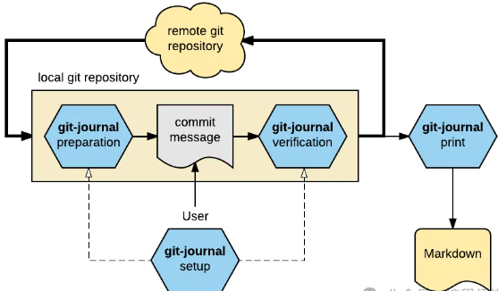
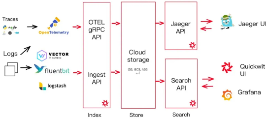
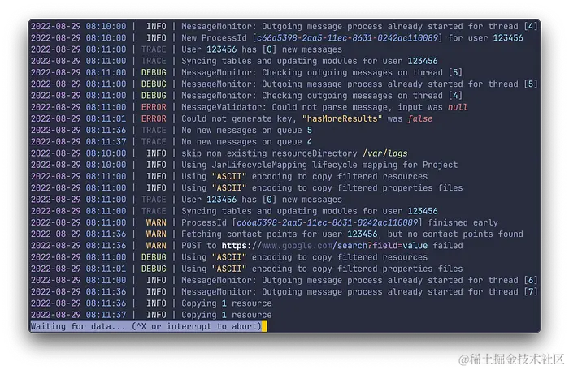
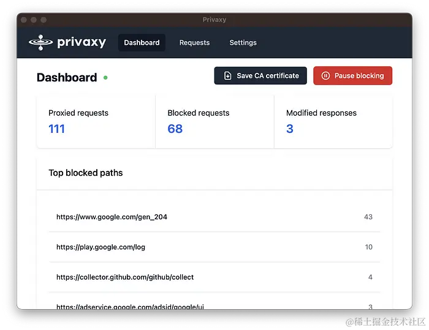
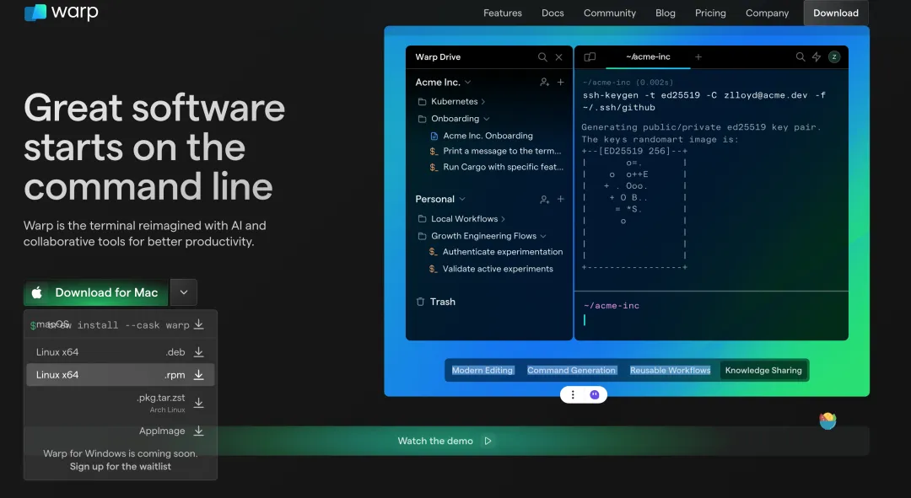
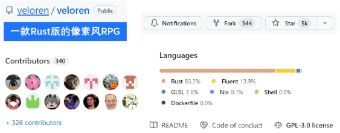
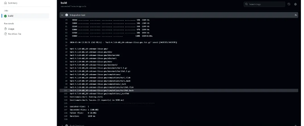

# Rust 开源项目

## awesome-alternatives-in-rust：用 Rust 编写的现有软件的精选替代品列表

GitHub：[TaKO8Ki/awesome-alternatives-in-rust：用 Rust 编写的现有软件的精选替代品列表 (github.com)](https://github.com/TaKO8Ki/awesome-alternatives-in-rust)

### 主要特性

awesome-alternatives-in-rust 收录了大量 Rust 编写的替代方案，涵盖了命令行工具、系统工具、Web 框架、游戏引擎等多个领域。它的主要特性包括：

- 全面：涵盖了各个领域的 Rust 项目，满足不同开发者的需求
- 优质：每个项目都经过精心挑选，代码质量高，文档齐全
- 分类清晰：按照应用类型进行分类，方便查找
- 持续更新：定期更新新的优质 Rust 项目，与时俱进

### 快速上手

下面我们通过一个简单的例子，来体验一下 awesome-alternatives-in-rust 中的项目。我们选择 `ripgrep`，它是一个用 Rust 编写的、更快的 `grep` 替代品。

首先安装 `ripgrep`：

```bash
cargo install ripgrep
```

然后在命令行中使用 `rg` 命令进行文本搜索：

```rust
# 在当前目录递归搜索包含 "fn main" 的文件
rg "fn main"

# 搜索结果：
src/main.rs
1:fn main() {
4:    println!("Hello, world!");
```

可以看到，`ripgrep` 以较快的速度搜索到了包含指定文本的文件及其内容，展示了其优秀的性能。类似的，awesome-alternatives-in-rust 中的其他项目也各有特色，非常值得尝试和学习。

### 总结

Rust 凭借其独特的优势，正在被越来越多的开发者所接受。awesome-alternatives-in-rust 这个项目，为 Rust 开发者提供了一站式的开源项目资源，帮助大家快速找到高质量的 Rust 库和工具。相信通过学习这些优秀项目的源码，能让你的 Rust 编程技巧更上一层楼。

## 相关排行和和仓库

rust 项目排行榜：[今天 GitHub 上的热门 Rust 存储库](https://github.com/trending/rust?since=daily)

rust 项目仓库收集：[rust-unofficial/awesome-rust：Rust 代码和资源的精选列表。 (github.com)](https://github.com/rust-unofficial/awesome-rust)

## 以下是一些值得关注的 Rust 项目，它们涵盖了不同的应用领域：

**Deno**：一个现代化、安全的 JavaScript/TypeScript 运行时，旨在成为 Node.js 的替代品。

- 开源地址：[GitHub - denoland/deno](https://www.denojs.cn/)
- 官网：[deno.land](https://deno.com/)

**Alacritty**：一个跨平台、基于 OpenGL 的高性能终端。

- 开源地址：[GitHub - alacritty/alacritty](https://alacritty.org/)
- 官网：[alacritty.org](https://www.igeekbb.com/2023/04/26/Alacritty/)

**Starship**：一个快速、高度可配置的命令行提示工具。

- 开源地址：[星际飞船/星际飞船：☄🌌️ 适用于任何炮弹的最小、超快且可无限定制的提示！ (github.com)](https://github.com/starship/starship)。
- 官网：https://starship.rs/zh-cn/
- 使用文章：[太强了，Rust 开发的终端提示符 Starship 工具，轻量、易用，速度极快且可无限定制的提示！ (qq.com)](https://mp.weixin.qq.com/s/RRZVNZCQuSlaeAfKkZkphA)
- [探索 Rust 生态：使用 Starship 打造炫酷命令行体验 (qq.com)](https://mp.weixin.qq.com/s/Wd5_Q6PpzO1wCDF1gs9cgg)

**MeiliSearch**：一个轻量级的即时搜索平台，适用于终端用户。

- 开源地址：[GitHub - meilisearch/meilisearch](https://github.com/meilisearch/meilisearch)
- 官网：[meilisearch.com](https://www.meilisearch.com/)

**SWC**：一个高性能的 TypeScript/Javascript 编译器，被多个知名项目使用。

- 开源地址：[GitHub - swc-project/swc](https://swc.rs/)
- 官网：[swc.rs](https://www.swc.net.cn/docs/getting-started)

- rolldown：

  - 开源地址：https://github.com/rolldown/rolldown

**Tauri**：

Tauri 是一个框架，用于为所有主要桌面平台构建小巧、快速的二进制文件。开发人员可以集成任何编译成 HTML、JS 和 CSS 的前端框架来构建他们的用户界面。应用程序的后端是一个 Rust 的二进制文件，带有可以与前端交互的 API。

用于构建小型、快速、安全的桌面应用，旨在替代 Electron.js。

- 开源地址：[GitHub - tauri-apps/tauri](https://tauri.app/)
- 官网：[tauri.app](https://tauri.app/zh-cn/v1/guides/getting-started/setup/)

**Yew**：一个用于构建 Web 应用的 Rust/Wasm 框架。

- 开源地址：[GitHub - yewstack/yew](https://github.com/yewstack/yew)
- 官网：[yew.rs](https://yew.rs/)

**Firecracker**：由 Amazon 开发的安全、高性能的无服务计算虚拟机。

- 开源地址：[GitHub - firecracker-microvm/firecracker](https://firecracker-microvm.github.io/)
- 官网：[firecracker-microvm.github.io](https://www.zhihu.com/question/303920344)

## Nushell：一个现代化的 shell，支持使用 SQL 语法选择内容

- 开源地址：[GitHub - nushell/nushell](https://github.com/nushell/nushell)

[一个使用Rust开发的跨平台shell：Nushell (qq.com)](https://mp.weixin.qq.com/s/p6r6gdhKTJcBMlj4I2zn8w)

## Tokio：一个异步 IO 的运行时，提供了 I/O、网络、调度、定时器等异步编程所必须的功能和工具

- 开源地址：[GitHub - tokio-rs/tokio](https://tokio.rs/)
- 官网：[tokio.rs](https://gitee.com/rustup/tokio)

这些项目展示了 Rust 在不同领域的应用，从 Web 开发到系统编程，再到桌面和终端应用。你可以根据自己的兴趣和需求，选择一个项目进行深入学习和实践。

## 效率提升工具 espanso——在日常输入中使用代码提示

[【一起学 Rust | 开源项目】效率提升工具 espanso——在日常输入中使用代码提示-CSDN 博客](https://blog.csdn.net/weixin_47754149/article/details/127131691)

# 待定

[YiNNx/cmd-wrapped：在命令行中找出过去的一年是什么样子的！ (github.com)](https://github.com/YiNNx/cmd-wrapped)

## 星绽：系统内核

github链接：https://github.com/asterinas/asterinas

星绽（英文名：Asterinas）是一个安全、快速、通用的操作系统内核。 它提供于Linux相同的ABI，可无缝运行Linux应用， 但比Linux更加内存安全和对开发者友好。

星绽在内存安全性方面远胜Linux。 它使用Rust作为唯一的编程语言， 并将unsafe Rust的使用限制在一个明确定义且最小的可信计算基础（TCB）上。 这种新颖的方法， 被称为框内核架构， 使星绽成为一个更安全、更可靠的内核选择。

星绽在开发者友好性方面优于Linux：

（1）使用生产力更高的Rust编程语言

（2）利用一个专为内核开发者设计的工具包（称为OSDK）来简化他们的工作流程 （3）享受MPL所带来的灵活性， 可自由选择开源或闭源为星绽开发内核模块或驱动。

当前，星绽仅支持x86-64虚拟机。

## Rathole：内网穿透|反向代理工具

github链接：https://github.com/rapiz1/rathole

Rathole是一个安全、稳定、高性能的内网穿透工具，用 Rust 语言编写。类似于 frp 和 ngrok。可以让 NAT 后的设备上的服务通过具有公网 IP 的服务器暴露在公网上。

Rathole特性：

- 高性能：具有更高的吞吐量，高并发下更稳定。
- 低资源消耗：内存占用远低于同类工具。二进制文件最小可以到 ~500KiB，可以部署在嵌入式设备，如路由器上。
- 安全性：每个服务单独强制鉴权。Server 和 Client 负责各自的配置。使用 Noise Protocol 可以简单地配置传输加密，而不需要自签证书。同时也支持 TLS。
- 热重载：支持配置文件热重载，动态修改端口转发服务。HTTP API 正在开发中。

## Rolldown：JavaScript捆绑器

github链接：https://github.com/rolldown/rolldown

Rolldown是一个用Rust编写的JavaScript捆绑器，旨在作为未来在Vite中使用的捆绑器。它提供了rollup兼容的api和插件接口，但在作用域上更类似于esbuild。

Rolldown的目标是尽可能地与Rollup的API和插件接口保持一致，以简化采用。在简单的用例中，它很可能可以作为临时替代品。但是，在边缘情况下也可能存在细微的差异，特别是涉及高级选项时。

Rolldown的作用域比Rollup更大，更类似于esbuild。它有内置的CommonJS支持，node_modules解析，将来还会支持TypeScript / JSX转换和缩小。

## netscanner：网络扫描工具

github地址：https://github.com/Chleba/netscanner

netscanner是一个网络扫描工具，具有以下功能：

- 接口列表
- 无线扫描
- WiFi信号强度
- Ping CIDR与主机名，oui和mac地址
- 获取数据包(TCP, UDP, ICMP, ARP)

必须以sudo权限运行。


# Rust 编写的开源工具

## MusicGPT：使用本地运行的 LLM 根据自然语言提示生成音乐

GitHub：[gabotechs/MusicGPT：使用本地运行的 LLM 根据自然语言提示生成音乐 (github.com)](https://github.com/gabotechs/MusicGPT)

## Journal：基于 RUST 构建的自动化生成变更日志的利器(书写与自动化生成 Git 提交消息和变更日志的框架)

在软件开发过程中，维护一个清晰、准确的变更日志对于项目维护者和用户来说都至关重要。然而，手动维护变更日志往往耗时且容易出错。为了解决这一问题，`git-journal` 作为一个自动化的 Git 提交消息和变更日志生成框架，应运而生。

### 什么是 Git-Journal？

`git-journal` 是一个基于 Git 提交历史的自动化变更日志生成工具。它通过分析 Git 提交消息，自动生成格式统一、内容详尽的变更日志。这一过程无需额外的工作，大大减轻了维护者的工作负担，同时提高了变更日志的准确性和可读性。

### 为什么选择 Git-Journal？

#### 自动化

`git-journal` 最大的优势在于其自动化特性。它能够自动解析 Git 提交消息，并按照预设的模板生成变更日志。这意味着，只要遵循一定的提交消息规范，维护者无需手动编写变更日志。

#### 标准化

`git-journal` 鼓励使用标准化的提交消息格式。这不仅有助于生成结构化的变更日志，还能使 Git 历史更加清晰，为项目贡献者提供更多关于实际变更的信息。

#### 可定制性

通过配置文件，用户可以自定义提交消息的类别、模板输出、排除模式等。这种高度的可定制性使得 `git-journal` 能够适应不同的项目需求。

### 如何使用 Git-Journal？

#### 安装

要将 *git-journal* 作为 git 扩展使用，需要安装 **Rust**[1]，包括包管理器 **cargo**[2]。不同的包管理器也会提供这些，例如通过 **Pacman**[3] 在 Arch Linux 上：

```
sudo pacman -S rust cargo
```

为了更简单的安装过程，也可以使用 **rustup**[4]。一旦这两个依赖安装完成，可以通过以下命令安装 _git-journal_：

```
cargo install git-journal
```

调整您的 `$PATH` 变量，以便在 `~/.cargo/bin` 中搜索，之后应该可以通过调用 `git journal` 来运行它。

### 使用

二进制文件 `git-journal` 依赖于 Rust 库 `gitjournal`，它也可以独立于二进制应用程序使用，以编写定制解决方案。**该仓库**[5] 将用作以下说明的示例。

#### 默认输出

如果在该仓库的任何位置运行 `git journal`，输出将是基于仓库 git 日志的美观的 **Markdown**[6] 格式变更日志：

#### 模板输出

用户可以通过定义模板来定制变更日志的输出格式。`git-journal` 支持 TOML 格式的模板文件，允许用户定义不同的日志部分和子部分。

#### 提交消息准备与验证

`git-journal` 还提供了提交消息的自动准备和验证功能。通过在本地仓库中执行 `git journal setup`，可以安装 Git 钩子，自动完成提交消息的准备和验证。

### 功能亮点

- **自动补全**：为 bash、fish 和 zsh 等 shell 生成自动补全脚本。
- **自定义类别支持**：在提交准备、验证和输出中支持自定义类别。
- **多线程解析**：自动支持多线程，提高解析效率。
- **模板支持**：包括标签和名称映射，支持自定义头部和尾部字段。
- **排序方法**：支持按日期或名称排序输出。
- **提交哈希链接**：在标准和模板输出中支持提交哈希链接。

### 深入阅读

```
> git journal
[git-journal] [INFO] 跳过提交：摘要解析：'合并分支 'test_branch''
[git-journal] [OKAY] 解析完成。

# 未发布 (2016-09-18)：
- [新增] file4 再次
    这段段落详细解释了变更
    - [修复] 多个问题
    - [移除] 不需要的内容
- [移除] file4.txt
- [新增] file4.txt
- [新增] file1.txt 再次
- [移除] file1.txt

修复：
#1, #2

# v2 (2016-09-12)：
- [新增] file3.txt
```

所有提交都按时间排序，这意味着最新的元素出现在顶部。提交消息的解析将根据 **RFC0001**[7] 进行，该标准描述了提交消息中的不同语法元素。类别 (`[新增]`, `[修复]`, ...) 如果可用，会自动用方括号括起来。也可以在配置文件中定义自己的类别。日志自动列出从上次发布到未发布条目的日志。

提交消息的页脚（在 RFC0001 中描述）会自动累积并按其值的顺序在变更日志列表之后打印。也可以跳过未发布的条目：

```
> git journal -u
[git-journal] [OKAY] 解析完成。

# v2 (2016-09-12)：
- [新增] file3.txt
```

也可以使用特定提交范围的格式 `REV..REV` 或与 `HEAD` 不同的起始点进行解析：

```
> git journal v1
> git journal v2
> git journal v1...HEAD^
```

还可以使用 `-a` 打印所有发布（git 标签），或通过 `-n <计数>` 打印过去 `n` 个发布：

```
> git journal -a
[git-journal] [INFO] 跳过提交：摘要解析：'合并分支 'test_branch''
[git-journal] [OKAY] 解析完成。

# 未发布 (2016-09-18)：
- [新增] file4 再次
    这段段落详细解释了变更
    - [修复] 多个问题
    - [移除] 不需要的内容
- [移除] file4.txt
- [新增] file4.txt
- [新增] file1.txt 再次
- [移除] file1.txt

# v2 (2016-09-12)：
- [新增] file3.txt

# v1 (2016-09-12)：
- [新增] file2.txt
- [新增] file1.txt
> git journal -un1
[git-journal] [OKAY] 解析完成。

# v2 (2016-09-12)：
- [新增] file3.txt
```

除了通常的详细日志，还有一个简短版本 (`-s`) 存在，它只使用提交摘要：

```
> git journal -as
[git-journal] [INFO] 跳过提交：摘要解析：'合并分支 'test_branch''
[git-journal] [OKAY] 解析完成。

# 未发布 (2016-09-18)：
- [新增] file4 再次
- [移除] file4.txt
- [新增] file4.txt
- [新增] file1.txt 再次
- [移除] file1.txt

# v2 (2016-09-12)：
- [新增] file3.txt

# v1 (2016-09-12)：
- [新增] file2.txt
- [新增] file1.txt
```

还可以将日志的输出附加到文件 (`-o`)，这将以换行符 (`---`) 分隔，每次调用 git 日志时都会添加。具有特定模式的 git 标签，如 `rc` 标签，将自动被排除，这可以通过 `-e` 自定义。

有关更多信息，请参考帮助 `git journal -h`。

#### 模板输出

提交消息模板的设计在 **RFC0002**[8] 中描述。从现在开始，我们将为测试仓库使用此模板：

```
[[tag]]
tag = "default"
name = "默认"

[[tag]]
tag = "tag1"
name = "第 1 部分"

[[tag]]
[[tag.subtag]]
tag= "tag2"
name = "小节 1"
footers = ["修复"]
```

要使用这样的模板，只需使用 `-t` 选项：

```
> git journal -t CHANGELOG.toml
[git-journal] [INFO] 跳过提交：摘要解析：'合并分支 'test_branch''
[git-journal] [OKAY] 解析完成。

# 未发布 (2016-09-21)：
## 默认
- [移除] file3.txt
- [移除] file4.txt
- [移除] file5.txt
- [新增] new .gitjournal
- [改进] file5.txt
- [修复] 这个
- [移除] 那个
- [新增] .gitjournal.toml 文件
- [移除] 不需要的内容
- [移除] file4.txt
- [新增] file4.txt
- [新增] file1.txt 再次
- [移除] file1.txt

## 第 1 部分
- [新增] file4 再次
- 这段段落解释了变更的详细信息

### 小节 1
- [修复] 多个问题

修复：
#1, #2, #1, #2, #3, #5, #6, #7

# v2 (2016-09-12)：
## 默认
- [新增] file3.txt
```

所有未标记的内容都将进入 `default` 部分。`tag1` 的名称将映射为 `第 1 部分`，`tag2` 是 `tag1` 的子标签（见 markdown 标题）。这也意味着现在可能存在未分类的列表项，因为模板引擎提供了将提交拆分为多部分的可能性。解析后的段落被转换为单个列表项，以始终提供干净的 markdown。页脚被指定为 toml 数组字符串，这将在日志的正确位置输出选定的页脚键。请注意，页脚的累积与整个标签相关，而不仅仅是打印它们的部分。其他命令行选项在默认输出中也可用。

还可以为每个输出或每个标签添加自定义标题或页脚文本。有关更多信息，请阅读 **RFC0002**[9]。

#### 提交消息准备和验证

要使用自动提交消息准备和验证，必须在每个本地仓库上执行 git 日志设置：

```
> git journal setup
[git-journal] [OKAY] 默认值写入 '.gitjournal.toml' 文件。
[git-journal] [OKAY] Git 钩子安装到 '.git/hooks/commit-msg'。
[git-journal] [OKAY] Git 钩子安装到 '.git/hooks/prepare-commit-msg'。
[git-journal] [OKAY] 安装了 bash 自动补全到路径。
[git-journal] [OKAY] 安装了 fish 自动补全到路径。
[git-journal] [OKAY] 安装了 zsh 自动补全到路径。
```

如果这些钩子已经存在，_git-journal_ 尝试追加所需的命令，之后必须手动验证。为 bash 和 fish 生成的命令行自动补全需要放在您的 shell 的正确目录中。默认配置文件是一个 **toml**[10] 文件，它表示 **这个结构**[11]。还可以在 **这里**[12] 找到带注释的默认配置。

如果设置完成，_git-journal_ 将验证您输入的提交消息，以及执行提交消息准备。例如，如果我们现在尝试提交无法解析的内容：

```
> touch my_file
> git add my_file
> git commit -m "This commit contains no category"
[git-journal] [ERROR] 提交消息准备失败：GitJournal: Parser: Summary parsing: 'This commit contains no category'
```

由于我们使用了 `-m` 标志，用户没有机会再编辑消息，_git-journal_ 将拒绝它。如果我们通过通常的 `git commit` 而不带 `-m` 使用提交消息编辑器，我们将得到一个默认的提交消息模板：

```
JIRA-1234 新增 ...

# 如果需要，添加更详细的描述

# - 新增 ...
# - 更改 ...
# - 修复 ...
# - 改进 ...
# - 移除 ...
```

`JIRA-1234` 前缀只是默认值，可以通过 `.gitjournal.toml` 文件配置。如果提交的提交消息也无效，我们将得到这样的错误：

```
[git-journal] [ERROR] 提交消息无效：GitJournal: Parser: Summary parsing: 'This commit message is also invalid'
```

如果一切顺利，它应该像这样：

```
> git commit -m "Added my_file"
[git-journal] [OKAY] 提交消息准备就绪。
[git-journal] [OKAY] 提交消息有效。
[master 1b1fcad] 新增 my_file
 1 file changed, 0 insertions(+), 0 deletions(-)
 create mode 100644 my_file
```

如果配置了默认模板，那么 *git-journal* 还将检查模板中的可用标签与您的提交消息标签。因此，如果提交消息中的一个标签在定义的模板中不可用，将会出现错误：

```
[git-journal] [WARN] 这些标签不是默认模板的一部分：'tag1'。
[git-journal] [ERROR] 提交消息无效：GitJournal: Verify: Not all tags exist in the default template.
```

这意味着详细地说，_git-journal_ 将在用户提交过程中建立两个关卡（一个用于准备，一个用于验证）。这张图将总结 *git-journal* 对本地 git 仓库的影响：



- **通用**

- - [x] 在设置期间为 bash、fish 和 zsh shell 生成自动补全。
  - [x] 提交准备、验证和输出的自定义类别支持 (`categories`)。
  - [x] 自动多线程支持解析。

- **日志生成和输出**

- - [x] 如果指定了 git 仓库的子路径，则自动搜索上级仓库。
  - [x] 自定义提交范围或不同的 git 提交起始点进行解析。
  - [x] 在与当前工作目录不同的指定路径 (`-p`) 中运行。
  - [x] 解析并打印完整历史 (`-a`) 或过去 `n` 个发布 (`-n`)。
  - [x] 基于提交消息摘要打印提交历史的简短版本 (`-s`)。
  - [x] 将解析后的日志以有效的 Markdown 输出到命令行或文件 (`-o`)。
  - [x] 自定义 git 标签排除模式，例如 `rc` 标签 (`-e`)。
  - [x] 启用/禁用调试消息输出 (`enable_debug`)。
  - [x] 通过命令行启用/禁用彩色输出 (`colored_output`)。
  - [x] 自动将提交消息类别包装在方括号中。
  - [x] 包括标签和名称映射的模板支持 (`default_template`)。
  - [x] 支持累积页脚数据（也用于模板引擎）。
  - [x] 默认和基于模板的输出的不同排序方法 (`"date"` 和 `"name"`) (`sort_by`)。
  - [x] 支持在模板中使用多个或单个输出的自定义标题和页脚字段。
  - [x] 根据解析结果生成默认模板 (`-g`)。
  - [x] 标准和模板输出中提交哈希链接 (`show_commit_hash`)。
  - [x] 支持自定义类别分隔符 (`category_delimiters`)。

- **提交消息的准备和验证**

- - [x] 在本地仓库中自动安装 git 钩子。
  - [x] 在设置期间生成默认配置文件。
  - [x] 基于实现的解析器进行提交消息验证。
  - [x] 使用自定义提交前缀进行消息准备 (`template_prefix`)。
  - [x] 区分修订和新提交。
  - [x] 使用默认模板中的标签进行提交消息验证。

### 结语

`git-journal` 作为一个强大的自动化工具，极大地简化了变更日志的维护工作。它不仅提高了效率，还保证了日志的一致性和准确性。无论是个人项目还是团队协作，`git-journal` 都是一个值得尝试的工具。

### 附录

https://github.com/saschagrunert/git-journal

#### 参考资料

[1] Rust: *https://www.rust-lang.org/en-US/downloads.html*

[2] cargo: *https://crates.io/install*

[3] Pacman: *https://wiki.archlinux.de/title/pacman*

[4] rustup: *https://rustup.rs/*

[5] 该仓库: *https://github.com/saschagrunert/test*

[6] Markdown: *https://en.wikipedia.org/wiki/Markdown*

[7] RFC0001: *https://github.com/saschagrunert/git-journal/blob/master/rfc/0001-commit-msg.md*

[8] RFC0002: *https://github.com/saschagrunert/git-journal/blob/master/rfc/0002-output-templating.md*

[9] RFC0002: *https://github.com/saschagrunert/git-journal/blob/master/rfc/0002-output-templating.md*

[10] toml: *https://github.com/toml-lang/toml*

[11] 这个结构: *https://saschagrunert.github.io/git-journal/gitjournal/config/struct.Config.html*

[12] 这里: *https://saschagrunert.github.io/git-journal/gitjournal/struct.GitJournal.html#examples-1*

## Quickwit：搜索引擎库，替代ES，成本降低 10 倍，查询亚秒级别

### Quickwit 是什么？

Quickwit 它是云存储上最快的搜索引擎，它非常适合用于可观察性的云原生搜索引擎，如日志、跟踪以及即将推出的指标。同时也是 Datadog、Elasticsearch、Loki 和 Tempo 的开源替代方案。

### Quickwit 功能

- **全文搜索和聚合查询**：提供对文本内容的全面搜索能力，以及对数据进行聚合分析的功能。
- **Elasticsearch兼容API**：允许使用现有的 Elasticsearch 或 OpenSearch 客户端与 Quickwit集成，保证了良好的兼容性和易用性。
- **Jaeger 原生支持**：内置对 Jaeger 的支持，有助于跟踪和监控微服务架构中的请求。
- **OTEL原生支持**：原生支持 OpenTelemetry（OTEL），用于日志和追踪，便于进行性能监控和故障排查。
- **灵活的索引选项**：支持无模式（Schemaless）和严格模式（Strict Schema）索引，以适应不同的数据结构需求。
- **云存储上的亚秒级搜索**：能够在Amazon S3、Azure Blob Storage、Google Cloud Storage等云存储服务上实现快速搜索。
- **计算与存储解耦**：采用计算和存储解耦的架构，使得索引器和搜索器是无状态的，有助于提高系统的可扩展性和弹性。
- **Grafana 数据源**：可以作为 Grafana 的数据源，方便用户在Grafana中进行数据可视化。
- **Kubernetes 就绪**：支持在 Kubernetes 上部署，提供了helm-chart以简化部署过程。
- **RESTful API**：提供REST风格的API，便于开发者通过HTTP请求与 Quickwit 进行交互

架构图描述如下：



Quickwit 拥有卓越的性能，正如当前 Quickwit 的 docstore 存储技术升级，从 LZ4 到 ZSTD 的压缩算法转变，默认块大小从16KB 提升至1MB，使得压缩率显著提高，根据不同数据集可达到25%至60%的优化。

### 参考资料：

- GIthub地址：https://github.com/quickwit-oss/quickwit
- 官网文档：https://quickwit.io/blog/quickwit-0.8
- https://quickwit.io/docs/deployment/kubernetes/helm

## 1.多功能文件清理工具：czkawka

这是一款用 Rust 编写的多功能文件清理工具。项目旨在查找和清理重复文件、空文件夹和类似图像文件等。它是免费的、开源的、无广告的，具有速度快、跨平台兼容性和多语言支持等特点。使用此工具，可以轻松清理计算机上不必要的文件，释放存储空间。

- GitHub 仓库地址：https://github.com/qarmin/czkawka


#### 安装

```bash
brew install rustup

rustup-init
brew install gtk4 adwaita-icon-theme librsvg libheif pkg-config
git clone https://github.com/qarmin/czkawka.git
cd czkawka
export LIBRARY_PATH=$LIBRARY_PATH:/opt/homebrew/Cellar/libheif/1.17.6/lib/
source "$HOME/.cargo/env"
cargo run --release --bin czkawka_gui --features "heif,libraw"
```

## 2. lsd

下一代 `ls` 命令，项目是一个用 Rust 编写的工具，用于查看与命令类似的目录列表 `ls`，并添加了颜色和图标等功能，使其更具视觉吸引力。

- Stars：`12.1k`
- Forks：`395`
- 仓库地址：https://github.com/lsd-rs/lsd


#### 安装

```bash
cargo install lsd
```

## 3. tailspin

项目是一个基于 Rust 的命令行日志查看器，无需配置即可使用。它突出显示数字、日期、IP、URL 等，使重要信息脱颖而出。

- Stars：`4.9k`
- Forks：`65`
- 仓库地址：https://github.com/bensadeh/tailspin



#### 安装

```bash
brew install tailspin
```

## 4. privaxy

基于 Rust 的追踪和广告拦截工具，项目基于 MITM（中间人）攻击原理，在两端建立双向隧道，通过过滤 URL 地址来屏蔽广告请求，从而拦截广告。具有占用内存更少，运行速度更快，支持自动更新过滤列表、显示统计信息以及自定义过滤列表。

- Stars：`2.2k`
- Forks：`87`
- 仓库地址：https://github.com/Barre/privaxy



## 5. cmd-wrapped

用 Rust 编写的命令行历史分析工具，这个命令行工具可以读取命令行操作历史并生成详细的分析报告，包括过去一年的命令行活动时段、常用命令等信息，支持 `Zsh`、`Bash`、`Fish` 等。

- Stars：`837`
- Forks：`23`
- 仓库地址：https://github.com/YiNNx/cmd-wrapped


#### 安装

```bash
cargo install cmd-wrapped
```

#### 使用

```bash
cmd-wrapped 2024 -s zsh
```

## 6. veloren

用 Rust 编写的像素风格 RPG 游戏。它的灵感来自《塞尔达传说：荒野之息》、《矮人要塞》和《我的世界》等游戏。虽然这款游戏的图形分辨率较低，但它提供了一个广阔的开放世界，玩家可以在其中制作物品、合成物品、战斗、升级、驯服宠物、探索地下城和洞穴、在空中滑翔以及与 NPC 交易。

- Stars：`5.2k`
- Forks：`350`
- 仓库地址：https://github.com/veloren/veloren


## 7. lettura

一款极简的开源 RSS 阅读器，基于 Tauri 开发的桌面 RSS 阅读器，免费、无广告、界面简洁，适用于 macOS 和 Windows 操作系统。

- Stars：`1.1k`
- Forks：`51`
- 仓库地址：https://github.com/zhanglun/lettura


## 8.sniffnet

舒适地监控您的互联网流量工具

GitHub：[GyulyVGC/sniffnet：舒适地监控您的互联网流量 🕵️ ♂️ (github.com)](https://github.com/GyulyVGC/sniffnet)

[开源的、基于 Rust 的网络监控工具：Sniffnet (qq.com)](https://mp.weixin.qq.com/s?__biz=Mzg5MjA1ODYzNg==&mid=2247486572&idx=1&sn=5359d273c866f358246bec488a63db5b&chksm=ce36f676e0d6eae5b30044cd1792300c5105b036affdd57680e1d8d6780ae691385333b06d01&scene=132&exptype=timeline_recommend_article_extendread_samebiz&show_related_article=1&subscene=132&scene=132#wechat_redirect)

## 9.全新的反向代理服务器：pingora

这是一个更快速、更可靠、更强大的 Web 反向代理服务器，它采用 Rust 异步多线程，具有快速和可靠的特点，支持 HTTP/1 和 HTTP/2 端到端、gRPC 和 WebSocket 代理、不停机重启、可定制的负载均衡和故障转移策略等功能。

> GitHub 地址：https://github.com/cloudflare/pingora

## 10.Rust 编写 Helix 编辑器

**参考资料：**

- Helix：https://github.com/helix-editor/helix
- Vim：https://github.com/vim/vim
- https://helix-editor.com/

Rust 开发神器编辑器 Helix，它还比 vim 占用资源少，更加强大。

> Helix 的介绍

Helix 是一款程序员喜欢的编辑器，使用 Rust 编写，它受到了包括 kakoune 和 neovim 在内的现代编辑器的启发。

Helix 设计中融合了多选功能、语言服务器协议（LSP）和 tree-sitter 等系列技术，为用户提供一个高效、灵活且强大的编辑体验，赶紧去体验吧！

> Helix 特点

Helix 编辑器，很多特性受到许多开发者的喜爱，具备以下几个特点：

- **多选功能**：它核心特性之一是支持多选，允许用户同时选择并编辑多个文本块，这在处理复杂的代码结构或进行批量修改时尤其有用。
- **语言服务器协议（LSP）支持**：内置了对 LSP 的支持，轻松与各种语言服务器无缝集成，提供实时的语法高亮、代码补全、错误检查等功能。
- **tree-sitter 解析器**：Helix 利用 tree-sitter 解析器来实现对代码的精确理解和操作，提高了编辑器的精确度和性能。
- **模式编辑器**：Helix 是一个模态文本编辑器，具有多种模式，适应不同情况的编辑需求。
- 丰富插件支持：Helix 遵循 UNIX 哲学，可以通过插件的形式实现，保持了编辑器的简洁性。
- **易于理解的编辑模式**：Helix 注重编辑的易理解性，即使可能需要比 Vim 或 Kakoune 多敲一两下键盘。

> Helix 和 Vim 有什么区别？

- **命令模式**：Helix 的命令模式设计更规整，易于记忆，而 Vim 的命令模式则更传统，需要用户记忆更多的快捷键。
- **内置功能**：Helix 提供了更多开箱即用的内置功能，减少了用户配置的复杂性，Vim 则更依赖于插件来扩展功能。
- **LSP 支持**：Helix 对语言服务器协议（LSP）有良好的内置支持，而 Vim 虽然也支持 LSP，但通常需要通过插件实现。
- **插件系统**：Vim 的确拥有一个庞大的插件生态系统，提供了极高的可定制性，相比之下，Helix 目前缺乏成熟的插件系统。
- **性能和高亮**：Helix 使用 tree-sitter 进行语法高亮和代码分析，可能在性能上优于 Vim 的正则表达式高亮方式。
- **使用难度**：Helix 提供了一些现代编辑器的特性，如内建菜单，对新手更友好，Vim 的虽然简洁，但学习曲线较陡峭，需要有折腾的心。

总之，Helix 更倾向于集成更多现代编辑器特性，然而 Vim 更侧重于提供一个高度可定制的编辑环境，可以根据自己喜欢进行配置，Vim 对初学肯定存在困难的。

## 11.用于 markdown 的 cat：mdcat

使用 rust 开发的 markdown 命令行查看工具。

GitHub：https://github.com/swsnr/mdcat

库：https://crates.io/crates/mdcat

## 12.yazi：用 Rust 编写的基于异步 I/O 的超快终端文件管理器。

GitHub：[sxyazi/yazi：💥 用 Rust 编写的基于异步 I/O 的超快终端文件管理器。 (github.com)](https://github.com/sxyazi/yazi/)

官网：https://yazi-rs.github.io/

## 13.uv：Rust 写的 Python 打包工具

GitHub：https://github.com/astral-sh/uv

官网：https://astral.sh/

博文：[uv：Rust 中的 Python 打包 (astral.sh)](https://astral.sh/blog/uv)

## 14.sshx：通过网络快速、协作的实时终端共享工具

GitHub：[ekzhang/sshx：通过网络快速、协作的实时终端共享 (github.com)](https://github.com/ekzhang/sshx)

官网：https://sshx.io/

[sshx 使用指南：一款简易的终端共享工具 (qq.com)](https://mp.weixin.qq.com/s/K-g41BTnVSMjb2ysnRki2g)

## 15.universal-android-debloater

使用 ADB 用 Rust 编写的跨平台 GUI，用于消除无根 Android 设备的膨胀。改善您的隐私、安全性和设备的电池寿命。

GitHub：[0x192/universal-android-debloater：使用 ADB 用 Rust 编写的跨平台 GUI，用于消除无根 Android 设备的膨胀。改善您的隐私、安全性和设备的电池寿命。 (github.com)](https://github.com/0x192/universal-android-debloater/)

## 2、Fyrox：用 Rust 编写的 3D 和 2D 游戏引擎

一个功能丰富，准备用于生产，通用的 2D/3D 游戏引擎，用 Rust 编写的场景编辑器，以前称为 rg3d。

Github 地址：https://github.com/FyroxEngine/Fyrox

## 3、Leptos：Rust Web 全栈框架

Leptos 是一个全栈、同构的 Rust web 框架，利用细粒度的响应性来构建声明式用户界面。特性如下：

- 创建立即开始工作的全栈应用程序，并通过客户端交互性逐步增强。
- 使用简单的工具以最少的配置快速启动项目。
- 轻松管理状态，而不需要用反应性信号对抗借用检查器。
- 编写跨服务器和客户端工作的“服务器函数”。
- Rust 的类型安全可以保护你的整个应用。

地址：https://leptos.dev/

## 4、Diesel：安全的，可扩展的 ORM 和 Rust 查询生成器

Diesel 去掉了数据库交互的样板，在不牺牲性能的情况下消除了运行时错误。它充分利用了 Rust 的类型系统来创建一个“感觉像 Rust”的低开销查询构建器。

地址：https://github.com/diesel-rs/diesel

## 5、GenAct：（摸鱼神器） 一个无意义的活动生成器

**假装很忙或等待你的电脑，而你实际上应该在做真正的工作！**用你疯狂的多任务处理技能给人们留下深刻印象。只需打开几个实例并观看节目即可。

GitHub：[svenstaro/genact：🌀 一个无意义的活动生成器 (github.com)](https://github.com/svenstaro/genact)

下载：https://github.com/svenstaro/genact/releases

在线地址：https://svenstaro.github.io/genact/

## Imager.io 基于 rust 构建：让你的图片秒瘦，提升网站性能

> ❝
>
> 在数字时代，图像已成为我们日常生活中不可或缺的一部分。无论是社交媒体、电子商务还是新闻网站，高质量的图像对于吸引用户和提供信息都至关重要。然而，高分辨率图像往往伴随着较大的文件大小，这不仅增加了服务器的负担，也影响了网页的加载速度。为了解决这一问题，今天，我们将介绍一个开源项目——Imager.io。
>
> ❞

### **「项目简介」**

> > Imager.io 是一个自动化图像压缩工具，它能够高效地优化高分辨率且含有较多噪点的图片，将其转换为体积更小的文件，同时保持图像质量。这对于需要在网页上分发大量图片的网站来说，是一个巨大的福音。

### **「性能对比」**

Imager.io 在图像压缩方面的表现如何呢？让我们通过一个简单的性能对比来一探究竟：

- **「源图像」**：39.00MB（4 张图片）
- **「Kraken.io」**：24MB
- **「Jpegmini.com」**：16MB
- **「Compression.ai」**：8.90MB
- **「Imager.io」**：**「4.20MB」**

```
source        : ▇▇▇▇▇▇▇▇▇▇▇▇▇▇▇▇▇▇▇▇▇▇▇▇▇▇▇▇▇▇▇▇▇▇▇▇▇▇▇ 39.00M (4 images)
kraken.io     : ▇▇▇▇▇▇▇▇▇▇▇▇▇▇▇▇▇▇▇▇▇▇▇▇ 24M
jpegmini.com  : ▇▇▇▇▇▇▇▇▇▇▇▇▇▇▇▇ 16M
compression.ai: ▇▇▇▇▇▇▇▇ 8.90M
imager        : ▇▇▇▇ 4.20M
```

从上面的数据可以看出，Imager.io 在压缩效率上具有明显的优势，能够将源图像压缩到最小的体积，这对于提升网页性能和用户体验有着直接的影响。

### **「项目特点」**

1. **「自动化」**：Imager.io 自动化地进行图像压缩，无需手动干预，节省了大量时间。
2. **「高效压缩」**：通过先进的压缩算法，Imager.io 能够在不牺牲图像质量的前提下，大幅度减小文件大小。
3. **「开源」**：作为一个开源项目，Imager.io 允许社区成员参与改进，共同推动项目的发展。

### **「如何使用」**

Imager.io 提供了详尽的文档，指导用户如何安装和使用该工具。用户可以通过项目的 GitHub 页面访问相关的安装和配置指南。

### **「技术细节」**

Imager.io 主要使用 Rust 语言编写，这使得它在性能上具有优势。Rust 是一种注重安全和并发的系统编程语言，非常适合处理这类性能敏感的任务。

### dockerFile

```bash
###############################################################################
# BUILD PHASE
###############################################################################
FROM rust:latest as build

# SETUP
WORKDIR /code/
RUN apt-get -y update && \
    apt-get -y upgrade && \
    apt-get -y install software-properties-common curl git vim tree

# SYSTEM DEPENDENCIES
RUN apt-get install -y \
    build-essential \
    llvm-dev \
    libclang-dev \
    clang \
    openssl \
    pkg-config \
    libssl-dev \
    xz-utils

# BUILD PROJECT DEPENDENCIES FIRST
RUN mkdir -p src
RUN echo 'fn main() {panic!("stub")}' > src/main.rs
ADD Cargo.toml .
RUN cargo build --release

# ASSETS
ADD assets/test assets/test

# BUILD PROJECT CODE
RUN rm target/release/deps/imager-*
ADD src src
RUN cargo build --release

# INSTALL
RUN cargo install --force --path .


###############################################################################
# RUNTIME ENVIRONMENT
###############################################################################
FROM ubuntu:18.04 as runtime

# SETUP
RUN apt-get -y update && \
    apt-get -y upgrade && \
    apt-get -y install build-essential software-properties-common curl git vim tree
COPY --from=build /usr/local/cargo/bin/imager /bin/imager

# # SECURITY & SANITY CHECK
RUN sha1sum /bin/imager > /bin/imager.sha1
```

### 自我构建

#### GitHub (预构建) 发布[1]

非常简单的方法。

## 例如，MacOS 用户

下载 & 解压：

```
$ http --follow https://github.com/imager-io/imager/releases/download/imager-0.3.4/imager-v0.3.4-apple.tar.gz  > imager-v0.3.4-apple.tar.gz
$ tar -xvzf imager.tar.gz
```

验证：

```
$ ./apple/bin/imager --help
```

## 例如，Linux 用户

下载 & 解压：

```
$ wget https://github.com/imager-io/imager/releases/download/imager-0.3.4/imager-v0.3.4-apple.tar.gz
$ tar -xvzf imager.tar.gz
```

验证：

```
$ ./linux/bin/imager --help
```

## Imager 库/命令行工具 - 从源代码构建

### 通用要求

- make/cargo 构建工具
- libclang
- C/C++ 编译器（带 c++ 标准库）
- 支持 xz 解压缩的 tar

#### 第 1 步. Cargo[2]

```
curl --proto '=https' --tlsv1.2 -sSf https://sh.rustup.rs  | sh
```

#### 第 2 步

##### 对于 MacOS

```
$ brew install llvm
```

##### 对于基于 Debian 的 Linux

```
$ apt-get install -y build-essential llvm-dev libclang-dev clang openssl pkg-config libssl-dev xz-utils
```

#### 第 3 步. 可选

报告任何问题。

### 安装

#### 第 1 步. 下载

```
$ git clone https://github.com/imager-io/imager.git  && cd imager
```

#### 第 2 步. 构建 & 安装

> ❝
>
> 将安装 `imager` 到 `~/.cargo/bin`。
>
> ❞

```
$ cargo install --path imager --force
```

#### 「社区贡献」

Imager.io 项目由 Colbyn Wadman 主导开发，并得到了社区成员的积极贡献。目前已有 599 个星标和 34 个分支，显示出社区对该项目的广泛认可和支持。

#### 「结语」

随着互联网上图像内容的不断增长，高效的图像压缩工具对于提升网站性能至关重要。Imager.io 以其出色的压缩性能和自动化处理能力，为图像优化提供了一个强有力的解决方案。如果你正在寻找一个能够提升网页加载速度和用户体验的工具，不妨试试 Imager.io。

**「了解更多」**：

- **「GitHub 项目页面」**：Imager.io：https://github.com/imager-io/imager
- Cargo：https://rustup.rs
- **「许可证」**：MPL-2.0

## 使用 Tokio 实现的 Redis 客户端和服务器不完整 - 仅用于学习目的

GitHub：https://github.com/tokio-rs/mini-redis

## Rust 驱动的极速终端：Alacritty OpenGL 模拟器安装与配置全攻略

[Rust 驱动的极速终端：Alacritty OpenGL 模拟器安装与配置全攻略 (qq.com)](https://mp.weixin.qq.com/s?__biz=MzkwNjYxNTY3Mg==&mid=2247495958&idx=1&sn=55dacc822b42d4e73c3cae872b5bc494&chksm=c18f577d3681124a871c154e5ea9d266b8497fe19a51dbab40379873bcb55e3234fecf4fd4e1&scene=132&exptype=timeline_recommend_article_extendread_samebiz&show_related_article=1&subscene=0&scene=132#wechat_redirect)

## Warp：Rust 开发的，新一代终端工具

- **Warp 开源地址**：https://github.com/warpdotdev/Warp
- **Warp 官网**：https://www.warp.dev/

#### Warp 介绍

Warp 它是一个款现代化的终端工具，是基于 Rust 语言开发的，并且内置了人工智能（AI）功能，提高开发者和团队的软件构建效率。

Warp 被设计为一个 21 世纪新一代的终端工具，不仅保留传统终端功能的同时，还增加了一些创新特性。如智能提示、命令导航、区域选择、历史命令的滚动列表等，这些特性使得用户在使用过程中更加便捷和高效。

#### Warp 亮点

介绍了 Warp 的基本情况，相信大家也迫不及待，都有哪些特性呢，会吸引到你呢！特点如下：

- **智能提示**：Warp 能够猜测用户接下来可能输入的命令，并提供相应的提示。
- **智能记忆**：Warp 会记录上一次执行的命令，并允许用户快速回溯。
- **区域选择**：与需要手动选择的传统终端不同，Warp 允许用户通过点击选择命令和输出，然后进行复制粘贴。
- **历史命令**：Warp 将历史命令以滚动列表的形式展示，方便用户选择。
- **命令导航**：Warp 提供了集成的命令导航功能，可以帮助用户快速找到并执行正确的命令，还是非常不错。
- 现代 UI 设计：Warp 的 UI 设计采用了现代的设计理念，提供了清晰、直观且用户友好的界面。
- **AI 植入**：还有更加重要的，Warp 提供了 AI 智能搜索功能，用户可以通过快捷键快速访问，不愧是新一代终端工具。

#### Warp 的技术栈组成

作为一款，主导未来新一代终端工具，Warp 的技术栈基于 Rust 语言，并结合了多种技术以实现其高性能和现代化的终端功能。

- 采用 Rust 作为主要的编程语言，提供了内存安全、并发性以及跨平台支持，同时保持了高性能。包括利用 WebAssembly 来支持跨平台特性，使得它可以在多种环境中运行，不仅限于原生应用程序。
- **Xcode 工具链**：Warp 团队使用 Xcode 提供的 Metal 调试工具来优化渲染性能，测量帧速率和 GPU 内存使用情况。
- **跨平台支持**：虽然最初在 macOS 上推出，Warp 计划支持 Linux 和 Windows 平台，这表明它在设计时就考虑了跨平台的需求。
- **终端协议**：Warp 作为一个终端工具，实现了对常见的终端协议和标准的兼容，以确保良好的互操作性。

- 好的互操作性。



## carbonyl—在终端内运行的 Chromium：实现在终端展示展示 web 页面内容

chromium：[chromium](https://source.chromium.org/chromium/chromium/src/+/main:;drc=c8b537923f4fdbdf492a1e475b0f2bff0340a32b)

GitHub：[fathyb/carbonyl：在终端内运行的铬 (github.com)](https://github.com/fathyb/carbonyl)

效果：


## miniob：像素风 RPG 游戏

**项目地址：https://github.com/veloren/veloren.git**



Veloren 是一款用 Rust 编写的多人体素 RPG 游戏。它的灵感来源于《魔方世界》、《塞尔达传说：狂野之息》、《矮人堡垒》和《我的世界》等游戏。该游戏正在积极开发中，玩家群体也在蓬勃发展中。这款游戏支持主流的 RPG 的大多数功能，包括开放世界，玩家在游戏里可以打造道具、合成物品、战斗、升级、驯养宠物，还可以探索地牢洞穴、在空中滑翔、与 NPC 交易等。


在想学习 Rust 语言，同时对游戏开发感兴趣的同学可以去瞅瞅了，争取成为 Veloren 的开发贡献者吧！

## hurl：使用纯文本搜索、运行和测试 HTTP 请求的命令行工具

**GitHub 开源地址**：https://github.com/Orange-OpenSource/hurl

**官网**：https://hurl.dev/

目前市面上测试 API 的工具大概可类：

- 第一类：提供可视化界面，主要通过可视化界面编写 API 测试用例和运行测试集，比如 Postman 和 Bruno、Jmeter、国产的 MeterSphere 等都是此类工具。
- 第二类：采用命令行编写和运行测试用例，此类工具一般提供给开发或者测开人员用于快速测试和验证 API 接口。比如 python 的 _requests_ 库，Java 的 _HttpURLConnection_ 类，或者 Curl 命令等等。

此两类工具各有各的优缺点，第一类工具简单易用，学习难度低，方便无编程基础的人员快速开展测试，只需要掌握工具的具体用法即可，但是很多的时候不太符合开发人员或者测开人员的使用习惯。第二类工具需要具备一定的编程经验，对开发和测开人员相对友好，但有一定的上手难度，需要掌握基本的编程知识和代码逻辑思维。具体选择哪一类测试工具作为测试标准，企业可以综合参考业务系统的接口类型和复杂度，还有测试、测开、开发人员的习惯、能力水平而决定，简单来说没有最好的，只有最适合的。

所以，今天给大家介绍的是不同于 Bruno 这类界面可视化使用的 API 测试工具，而是一个超简单、采用简单的普通文本即可编写脚本的测试工具-Hurl。

### 01 Hurl 介绍

一句话介绍 Hurl：一个基于 Curl 封装的命令行测试工具，采用 Rust 语言，在 API 测试方面超越了 Curl，只要用户定义在一个简单的普通文本，即可快速进行 API 测试。

#### 🚀 功能特性

- **请求与提取：**发送 HTTP 请求，并支持提取响应中的值，可以方便地执行各种 HTTP 操作，和数据上下文引用。
- **数据断言：**支持对请求头、正文响应等进行多种方式断言，可以使用 XPath 和 JSONPath 等多种提取断言，以满足不同的测试需求。
- **批量运行：**支持多个请求的批量运行，可以方便地构建复杂的测试用例，从而更全面地测试 API。
- **集成与报告：**易于集成到 CI/CD（持续集成/持续部署）流程中，支持生成多种格式的报告，如文本报告、JUnit 报告和 HTML 报告，有助于分享和分享测试结果。
- **适用于多种场景：**不仅适用于 REST/JSON API 的测试，还适用于 HTML、GraphQL 以及 SOAP API 等多种场景。

#### **🛠** 和其他语言编写测试脚本对比

通过一个简单的对比示例感受下 Hurl 编写测试脚本的简单：

python 编写 API 测试脚本：

```python
import requests
import unittest

class TestAPI(unittest.TestCase):
    """测试API是否返回预期的响应"""

    def setUp(self):
        self.url = 'http://api.example.com/data'

    def test_api_status(self):
        """测试API状态码"""
        response = requests.get(self.url)
        self.assertEqual(response.status_code, 200)

if __name__ == '__main__':
    unittest.main()
```

Curl 编写 API 测试脚本：

```bash
#!/bin/bash
# 使用curl命令测试API并断言响应中的字段

# 设置API URL
API_URL="http://example.com/api/data"

# 发送请求并获取响应
response=$(curl -s $API_URL)

# 检查响应中的字段
# 假设我们期望的字段是"status": "200"
expected_status="\"status\": \"200\""
if echo $response | grep -q "$expected_status"; then
    echo "测试通过：响应包含预期的状态字段"
else
    echo "测试失败：响应未包含预期的状态字段"
    echo "响应内容：$response"
fi
```

Hurl 编写 API 测试脚本：

```bash
# 请求API URL地址
GET http://api.example.com/data
# 状态码断言
HTTP 200
```

### 02 Hurl 安装

#### 一、二进制安装

**Linux**

```bash
$ INSTALL_DIR=/tmp
$ VERSION=4.3.0
$ curl --silent --location https://github.com/Orange-OpenSource/hurl/releases/download/$VERSION/hurl-$VERSION-x86_64-unknown-linux-gnu.tar.gz | tar xvz -C $INSTALL_DIR
$ export PATH=$INSTALL_DIR/hurl-$VERSION:$PATH
```

**Debian / Ubuntu**

```bash
$ VERSION=4.3.0
$ curl --location --remote-name https://github.com/Orange-OpenSource/hurl/releases/download/$VERSION/hurl_${VERSION}_amd64.deb
$ sudo apt update && sudo apt install ./hurl_${VERSION}_amd64.deb
```

**macOS-Homebrew**

```bash
$ brew install hurl
```

**macOS-MacPorts**

```bash
$ sudo port install hurl
```

**Windows**

```bash
# windows操作系统安装hurl，可以在github release界面直接下载安装包即可
https://github.com/Orange-OpenSource/hurl/releases
```

**docker 安装**

```bash
$ docker pull ghcr.io/orange-opensource/hurl:latest
```

#### **二、源码构建**

_注：Hurl 依赖于 libssl、libcurl 和 libxml2 库。构建的平台需要提前安装好。_

```bash
$ git clone https://github.com/Orange-OpenSource/hurl
$ cd hurl
$ cargo build --release
$ ./target/release/hurl --version
```

### 03 Hurl 使用

#### 一、请求

##### 简单请求

```bash
GET https://example.org/api/dogs?id=4567
User-Agent: My User Agent
Content-Type: application/json
[BasicAuth]
# Basic Authentication，使用 username：password
alice: secret
```

##### Headers 设置

```bash
GET https://example.org/news
User-Agent: Mozilla/5.0 (Macintosh; Intel Mac OS X 10.14; rv:70.0) Gecko/20100101 Firefox/70.0
Accept: */*
Accept-Language: en-US,en;q=0.5
Accept-Encoding: gzip, deflate, br
Connection: keep-alive
```

##### Cookies 设置

```bash
GET https://example.org/index.html
[Cookies]
theme: light
sessionToken: abc123
```

##### JSON 请求体

```bash
# Create a new doggy thing with JSON body:
POST https://example.org/api/dogs
{
    "id": 0,
    "name": "Frieda",
    "picture": "images/scottish-terrier.jpeg",
    "age": 3,
    "breed": "Scottish Terrier",
    "location": "Lisco, Alabama"
}
```

##### XML 请求体

```bash
# Create a new soapy thing XML body:
POST https://example.org/InStock
Content-Type: application/soap+xml; charset=utf-8
Content-Length: 299
SOAPAction: "http://www.w3.org/2003/05/soap-envelope"
<?xml version="1.0" encoding="UTF-8"?>
<soap:Envelope xmlns:soap="http://www.w3.org/2003/05/soap-envelope" xmlns:m="http://example.net">
  <soap:Header></soap:Header>
  <soap:Body>
    <m:GetStockPrice>
      <m:StockName>GOOG</m:StockName>
    </m:GetStockPrice>
  </soap:Body>
</soap:Envelope>
```

##### GraphQL 请求

````bash
POST https://example.org/starwars/graphql
```graphql
{
  human(id: "1000") {
    name
    height(unit: FOOT)
  }
}
```
````

##### 多行字符请求体

````bash
POST https://example.org/models
```
Year,Make,Model,Description,Price
1997,Ford,E350,"ac, abs, moon",3000.00
1999,Chevy,"Venture ""Extended Edition""","",4900.00
1999,Chevy,"Venture ""Extended Edition, Very Large""",,5000.00
1996,Jeep,Grand Cherokee,"MUST SELL! air, moon roof, loaded",4799.00
````

##### 单行字符请求体

```bash
POST https://example.org/helloworld
`Hello world!
```

##### Base64 请求体

```bash
POST https://example.org
# Some random comments before body
base64,TG9yZW0gaXBzdW0gZG9sb3Igc2l0IGFtZXQsIGNvbnNlY3RldHVyIG
FkaXBpc2NpbmcgZWxpdC4gSW4gbWFsZXN1YWRhLCBuaXNsIHZlbCBkaWN0dW0g
aGVuZHJlcml0LCBlc3QganVzdG8gYmliZW5kdW0gbWV0dXMsIG5lYyBydXRydW
0gdG9ydG9yIG1hc3NhIGlkIG1ldHVzLiA=;
```

##### Hex 请求体

```bash
PUT https://example.org
# Send a café, encoded in UTF-8
hex,636166c3a90a;
```

##### 文件请求体

使用文件请求。文件体以 file 开头，以 ; 结尾：

```bash
POST https://example.org
# Some random comments before body
file,data.bin;
```

#### 二、提取

##### 状态码提取

```bash
GET https://example.org
HTTP 200
[Captures]
my_status: status
```

##### Header 提取

```bash
POST https://example.org/login
[FormParams]
user: toto
password: 12345678
HTTP 302
[Captures]
next_url: header "Location"
```

##### URL 提取

```bash
GET https://example.org/redirecting
[Options]
location: true
HTTP 200
[Captures]
landing_url: url
```

##### Cookie 提取

```bash
GET https://example.org/cookies/set
HTTP 200
[Captures]
session-id: cookie "LSID"
```

##### Body 提取

```bash
GET https://example.org/home
HTTP 200
[Captures]
my_body: body
```

##### XPath 提取

```bash
GET https://example.org/home
# Capture the identifier from the dom node <div id="pet0">5646eaf23</div
HTTP 200
[Captures]
ped-id: xpath "normalize-space(//div[@id='pet0'])"

# Open the captured page.
GET https://example.org/home/pets/{{pet-id}}
HTTP 200
```

##### JSONPath 提取

_JSON 示例如下：_

```json
{
	"a_null": null,
	"an_object": {
		"id": "123"
	},
	"a_list": [1, 2, 3],
	"an_integer": 1,
	"a float": 1.1,
	"a_bool": true,
	"a_string": "hello"
}
```

提取示例：

```bash
GET https://example.org/captures-json
HTTP 200
[Captures]
an_object:  jsonpath "$['an_object']"
a_list:     jsonpath "$['a_list']"
a_null:     jsonpath "$['a_null']"
an_integer: jsonpath "$['an_integer']"
a_float:    jsonpath "$['a_float']"
a_bool:     jsonpath "$['a_bool']"
a_string:   jsonpath "$['a_string']"
all:        jsonpath "$"
```

##### SSL certificate 提取

```bash
GET https://example.org
HTTP 200
[Captures]
cert_subject: certificate "Subject"
cert_issuer: certificate "Issuer"
cert_expire_date: certificate "Expire-Date"
cert_serial_number: certificate "Serial-Number"
```

#### 三、断言

```bash
GET https://api/example.org/cats
HTTP 200
Content-Type: application/json; charset=utf-8      # Implicit assert on Content-Type Header
[Asserts]                                          # Explicit asserts section
bytes count == 120
header "Content-Type" contains "utf-8"
jsonpath "$.cats" count == 49
jsonpath "$.cats[0].name" == "Felix"
jsonpath "$.cats[0].lives" == 9
```

#### 四、使用变量

```bash
传入变量，在hurl文件中用 `{{xxx }}` 使用变量
```

比如 URL 环境变量引用：

```bash
GET https://{{host}}/status
```

运行脚本，传递变量：

```bash
hurl --variable url=xxx.xxx.xxx.xxx --variable username=xxxxx  --variable password=xxxxx sample.hurl
```

编写文件，传递变量：

```bash
# 编写 vars.env文件
# vim vars.env
url=xxx.xxx.xxx.xxx
username=xxxxxx
password=xxxxx
# 运行测试脚本
hurl --variables-file vars.env sample.hurl
```

hurl 文件中定义变量：

```bash
GET https://{{host}}/{{type}}/status
[Options]
variable: hostxxx.xxx.xxxx.xxx
variable: type=1234

GET https://{{host}}/{{type}}/health
HTTP 200
```

#### 五、运行测试

将所有需要测试的 API 请求，保存在后缀为\*.hurl 文件，如下两个文件示例：

sample.hurl

```bash
# sample.hurl
#查询北京天气
GET http://t.weather.itboy.net/api/weather/city/101010100
HTTP 200
[Asserts]
jsonpath "$.data.quality" == "良"

#查询大连天气
GET http://t.weather.itboy.net/api/weather/city/101070201
HTTP 200
[Asserts]
jsonpath "$.data.quality" == "优"

#查询乌鲁木齐天气
GET http://t.weather.itboy.net/api/weather/city/101130101
HTTP 200
[Asserts]
jsonpath "$.data.quality" == "良"
```

sample-1.hurl

```bash
# sample-1.hurl
#查询北京天气
GET http://t.weather.itboy.net/api/weather/city/101010100
HTTP 200
[Asserts]
jsonpath "$.data.quality" == "优"

#查询大连天气
GET http://t.weather.itboy.net/api/weather/city/101070201
HTTP 200
[Asserts]
jsonpath "$.data.quality" == "优"

#查询乌鲁木齐天气
GET http://t.weather.itboy.net/api/weather/city/101130101
HTTP 200
[Asserts]
jsonpath "$.data.quality" == "优"
```

批量运行测试脚本：

```bash

# 批量运行脚本
hurl --test sample.hurl sample-1.hurl
# 返回结果如下（实时返回天气情况，测试结果有可能不同）
sample.hurl: Running [1/2]
sample.hurl: Success (3 request(s) in 113 ms)
sample-1.hurl: Running [2/2]3/3
error: Assert failure
  --> sample-1.hurl:5:0
   |
   | GET http://t.weather.itboy.net/api/weather/city/101010100
   | ...
 5 | jsonpath "$.data.quality" == "优"
   |   actual:   string <良>
   |   expected: string <优>
   |

sample-1.hurl: Failure (1 request(s) in 89 ms)
--------------------------------------------------------------------------------
Executed files:  2
Succeeded files: 1 (50.0%)
Failed files:    1 (50.0%)
Duration:        203 ms
```

### 04 Hurl CI/CD 集成

#### GitHub Action 集成 DEMO

在 GitHub 中创建一个新的代码仓库，命名为 my-project;


在开发 PC 中创建 git 仓库 my-project，创建 test 目录。将所有测试脚本移动至 test 目录，并提交项目文件:

```bash
git init
Initialized empty Git repository in /Users/jc/Documents/Dev/movies-project/.git/
mv sample* test/
git add .
git commit -m "Add integration tests."
git remote add origin https://github.com/plateauandsp/my-project.git
git push -u origin main
```

仓库添加 GitHub Action。此操作的目的是在每次 push 时运行测试脚本：

```yaml
name: CI-Hurl-Test
on:
  push:
    branches:
      - main
jobs:
  build:
    runs-on: ubuntu-latest
    permissions:
      contents: read
    steps:
      - name: Checkout
        uses: actions/checkout@v4
      - name: Build
        run: echo "Building app..."
      - name: Integration test
        run: |
          wget https://github.com/Orange-OpenSource/hurl/releases/download/4.3.0/hurl-4.3.0-x86_64-unknown-linux-gnu.tar.gz
          tar xzvf hurl-4.3.0-x86_64-unknown-linux-gnu.tar.gz
          hurl-4.3.0-x86_64-unknown-linux-gnu/bin/hurl --test test/sample*
```

提交测试，模拟代码提交后自动触发 Hurl 测试：

```bash
git add .github/workflows/CI-Hurl-Test.yml
git commit -m "Add GitHub action."
git push
```

在 GitHub 上检查是否运行测试：



### 05 最后

相比 curl、wget，Hurl 在测试方面功能更强大，且更容易上手，很适用新手和快速测试使用。它允许用户以简单纯文本格式定义和运行测试 HTTP 请求。总结来说，Hurl 有可能在复杂场景下 API 测试有一些局限性*（如包含大量逻辑判断的 API 端到端测试）*，但是它确实一个非常灵活且简单易用的命令行 API 测试工具，无论是对于初学者还是经验丰富的测试人员，Hurl 都是一个值得考虑的选择。

## Servo 并行浏览器引擎项目

GitHub：[servo/servo：Servo，可嵌入的、独立的、内存安全的、模块化的、并行的 Web 渲染引擎 (github.com)](https://github.com/servo/servo)

Servo 是用 [Rust](https://github.com/rust-lang/rust) 语言编写的原型 Web 浏览器引擎。它目前开发于 64 位 macOS、64 位 Linux、64 位 Windows 和 Android。

## 用 Rust 编写操作系统教程

教程文档：[phil-opp/blog_os: Writing an OS in Rust (github.com)](https://github.com/phil-opp/blog_os)

GitHub：[phil-opp/blog_os: Writing an OS in Rust (github.com)](https://github.com/phil-opp/blog_os)

此存储库包含 [os.phil-opp.com](https://os.phil-opp.com/) _的 Writing an OS in Rust_ 系列的源代码：[phil-opp/blog_os: Writing an OS in Rust (github.com)](https://github.com/phil-opp/blog_os/tree/main)

## Redox：Rust 操作系统

Github 地址：https://github.com/redox-os/redox

官网：[Redox - 您的下一代操作系统 - Redox - 您的下一代操作系统 (redox-os.org)](https://www.redox-os.org/)

Redox 是一个用 Rust 编写的操作系统，Rust 是一种专注于安全和高性能的语言。Redox 遵循微内核设计，它的目标是安全、可用和免费。Redox 的灵感来自以前的内核和操作系统，如 SeL4、MINIX、Plan 9 和 BSD。

Redox 不仅仅是一个内核，它还是一个功能齐全的操作系统，提供了组件(内存分配器、文件系统、显示管理器、核心实用程序等)，这些组件共同构成了一个功能强大且方便的操作系统。你可以将其视为 GNU 或 BSD 生态系统，但使用的是内存安全语言和现代技术。

## 📚 学习在 Rust 🦀 中编写嵌入式操作系统

GitHub：https://github.com/rust-embedded/rust-raspberrypi-OS-tutorials

## Tock：一个用 Rust 开发、安全性极高的嵌入式操作系统

**项目地址**：https://github.com/tock/tock

### 引言

嵌入式操作系统的需求日益增长，而传统的操作系统往往难以满足安全性的要求。Tock 是一个由 Rust 语言开发的嵌入式操作系统，它通过提供高安全性和可靠性的解决方案，为微控制器提供了一个安全的环境，满足了现代应用中对可信度的要求。

### 1. Tock 的背景和目标

在过去的几十年中，微控制器的应用范围不断扩大。然而，传统的嵌入式操作系统难以满足新兴应用对安全性和可靠性的要求。Tock 的目标是为嵌入式设备提供一个安全的操作系统，以保护设备免受恶意软件和攻击。

### 2. Rust 语言的选择

Tock 选择 Rust 语言作为其主要开发语言，主要出于 Rust 语言在内存安全性、线程安全性和数据竞争方面的特点。Rust 语言的静态类型检查和所有权模型可以确保 Tock 在运行时没有内存泄露或悬空指针的问题，从而提高系统的稳定性。

### 3. Tock 的安全特性

Tock 具有多种安全特性，使其成为一个安全的嵌入式操作系统。其中包括：

- 多进程隔离：Tock 使用内核级的进程隔离，每个应用程序运行在自己的进程中，互不干扰。
- 内存安全：Rust 语言的所有权模型可以确保在 Tock 中没有悬空指针或竞态条件的问题。
- 可信应用程序：Tock 支持对应用程序进行数字签名，确保只有经过验证的应用程序可以被加载和运行。
- 安全启动：Tock 引入了启动程序的安全性检查，有效防止恶意软件的注入。

### 4. Tock 的应用领域

Tock 在各种应用领域中都有广泛的应用，包括物联网设备、无人机、工业控制系统、智能家居等。Tock 能够为这些应用提供高度安全的操作系统，保护设备免受潜在的攻击。


### 5. Tock 的性能和效率

尽管 Tock 注重安全性和可靠性，但它并不妨碍系统的性能和效率。Tock 的设计支持多任务并发执行，可以有效利用硬件资源，提高系统的运行效率。此外，Tock 的内存管理机制也对设备的能耗进行了优化，延长了电池寿命。

### 结论

Tock 是一个由 Rust 开发的安全嵌入式操作系统，其为微控制器提供了高度的安全性和可靠性。通过应用 Rust 语言的内存安全性和线程安全性特点，Tock 有效地解决了传统嵌入式操作系统的安全性问题。它的广泛应用领域和出色的性能使得 Tock 成为了当下热门的嵌入式操作系统之一。

## DragonOS：采用 Rust 自研内核的，具有了 Linux 的兼容性的操作系统

- 官网：https://dragonos.org/
- 开源地址：https://github.com/DragonOS-Community/DragonOS

DragonOS 龙操作系统，主要面向云计算轻量化场景，完全自主内核的，提供 Linux 二进制兼容性的 64 位操作系统。

DragonOS 提供优秀完善的架构设计，相比于同体量的其他系统，DragonOS 还支持虚拟化，并在设备模型、调度子系统等方面具有一定优势。

#### DragonOS 特点

DragonOS 从 0 开始研发内核及用户态环境，并提供 Linux 兼容性。它具有长远目标的项目，而不止步于”玩具“级别的。

DragonOS 的架构设计良好，具有不错的可维护性和可扩展性。

DragonOS 开源社区成立于 2022 年 7 月。现在与教育和研究合作，主要开发者来自包括华南理工大学、广州大学、浙江大学等在内的多所高校，这充分表明了 DragonOS 也注重与教育和研究机构的合作。

DragonOS 正在逐步淘汰原有的 C 代码，转而使用 Rust，这将提高操作系统的安全性。也计划在未来 5 年内实现生产环境大规模应用的宏伟目标，并计划提供对 Linux 的 100%兼容性。

#### 总结优点

- **轻量化设计**：DragonOS 面向云计算场景，注重轻量化，适合在云环境中高效运行。
- **高性能及高可靠性**：DragonOS 旨在构建一个高性能和高可靠性的服务器操作系统，这对于企业级应用尤为重要。
- **现代化特性**：DragonOS 支持虚拟化技术，并在设备模型、调度子系统等方面具有优势，它还在不断推进对云平台和 RISC-V 架构的支持。
- **安全性**：采用 Rust 开发，逐步移除 C 代码，这将提高操作系统的安全性，减少内存安全问题，提高系统稳定性。
- **Linux 二进制兼容性**：它能够运行 Linux 程序，实现了“一次编译，随处运行”的能力，这使得开发者可以更容易地迁移现有的 Linux 应用程序到 DragonOS 上。

## aerugo：面向安全应用的实时操作系统

用Rust编写的面向安全应用的实时操作系统。

该项目是欧洲航天局开发的，针对基于32位ARM Cortex-M7处理器的ATSAMV71Q21微控制器。它的设计灵感来自于纯函数式编程范式和transputers架构。

地址：https://github.com/n7space/aerugo

## Motūrus OS

Motūrus项目是为云构建的一个简单、快速、安全的操作系统(Motūrus OS)。

更具体地说，Motūrus OS(有时称为Motor OS)是一种针对基于虚拟机(如web服务、“无服务器”、边缘缓存等)的新操作系统。

Motūrus OS是一个基于微内核的操作系统，用Rust构建，专门针对虚拟化工作负载。它目前支持基于x64 kvm的虚拟机。

地址：https://github.com/moturus/motor-os

