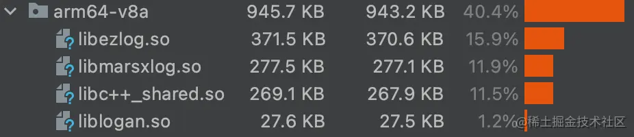

# 🦀️Rust 移动端开发体验

使用 Rust 写了一个移动端的跨平台日志库：[s1rius/ezlog: A cross-platform file logging library (github.com)](https://github.com/s1rius/ezlog)

#### 大型公司在移动端使用 Rust

- Google 在 2021 年将 Rust 引入 Android [Rust in the Android platform](https://security.googleblog.com/2021/04/rust-in-android-platform.html)
- Mozilla 使用 Rust 编写跨平台应用服务组件[Firefox Application Services](https://github.com/mozilla/application-services)
- [飞书客户端非 UI 部分使用 Rust 跨平台实现](https://www.infoq.cn/article/oh79weak7z3s2xavo*bv)

#### 个人开发者在移动端的尝试 Rust 的案例

- [Rust & cross-platform mobile development](https://medium.com/swlh/rust-cross-platform-mobile-development-9117a67ac9b7)
- [RustDesk 远程桌面应用](https://github.com/rustdesk/rustdesk)
- [深度探索：前端中的后端](https://zhuanlan.zhihu.com/p/347842418)
- [Publish game on Android with Macroquad](https://macroquad.rs/tutorials/android/)
- [Rust on iOS and Mac Catalyst: A Simple, Updated Guide](https://nadim.computer/posts/2022-02-11-maccatalyst.html)

更多的案例收录，可以参看这篇[Rust 移动开发与跨平台模式探究](https://zhuanlan.zhihu.com/p/484269271)。 从以上的例子来看，大概率是可行的，还要对具体的需求进行验证。

### UI

[Rust 开发 探索 Slint UI 1.5 安卓 (qq.com)](https://mp.weixin.qq.com/s?__biz=Mzg2NTgxNzg3OQ==&mid=2247484143&idx=1&sn=903c65961459daee860bffd5c99602e5&chksm=cfce0c61f8c94b764529048bb02ccd66bcf26c9fdc74c7b63599f380c5a52412d641bf5918c4&scene=132&exptype=timeline_recommend_article_extendread_samebiz&show_related_article=1&subscene=0&scene=132#wechat_redirect)

### 项目简述

#### 主要功能

- 使用 mmap 做文件映射
- 认证加密
- zlib 压缩
- 日志回捞
- 日志清理
- 命令行解析工具

#### 可行性验证

先查找主要功能是否有对应的 Rust 开源实现。

- [memmap2](https://github.com/RazrFalcon/memmap2-rs)
- [aead](https://github.com/RustCrypto/AEADs)
- [flate2](https://github.com/rust-lang/flate2-rs)

开源社区早已实现好了：）
复制开源库中的示例，借助[android-ndk-rs](https://github.com/rust-windowing/android-ndk-rs)。在 android 真机运行，查看日志输出，符合预期。
项目中使用`android ndk rs`的例子，可以查看`examples/android_preview`

**编译成 APK 并安装运行不到 5 秒**

```bash
cargo apk run -p ezlog_android_preview
   Compiling ezlog v0.1.2 (ezlog/ezlog-core)
   Compiling ezlog_android_preview v0.1.0 (ezlog/examples/android_preview)
    Finished dev [unoptimized + debuginfo] target(s) in 2.39s
 'lib/arm64-v8a/libezlog_android_preview.so'...
Verifying alignment of ezlog/target/debug/apk/ezlog_android_preview.apk (4)...
      49 AndroidManifest.xml (OK - compressed)
    1020 lib/arm64-v8a/libezlog_android_preview.so (OK)
Verification succesful
Performing Incremental Install
Serving...
All files should be loaded. Notifying the device.
Success
Install command complete in 949 ms
Starting: Intent { act=android.intent.action.MAIN cmp=rust.ezlog_android_preview/android.app.NativeActivity }
```

#### 项目结构

```bash
├── android
│   ├── app # android 示例工程
│   └── lib-ezlog # EZLog android 库
├── examples # rust 示例
├── ezlog-cli # 命令行工具
├── ezlog-core # 核心库
├── ios
│   ├── EZLog # EZLog iOS 库
│   ├── demo # iOS 示例工程
│   └── framework # EZLog XCFramework
```

### 开发中碰到的问题及解决

#### iOS

iOS 端的开发流程为

1. Rust 编码
2. 通过 [cbindgen](https://github.com/eqrion/cbindgen) 生成头文件
3. 编译多平台静态库
4. 把静态库和头文件打包成 XCFramework，并依赖
5. 实现 Swift 绑定
6. 测试，发布

在对比了多种依赖静态库的方式之后，发现[XCFramework](https://help.apple.com/xcode/mac/11.4/%23/dev6f6ac218b)对多平台的支持，更适合这个项目。更多 XCFramework 的相关资料可以看这几篇文章[distributing universal ios frameworks as xcframeworks using cocoapods](https://anuragajwani.medium.com/distributing-universal-ios-frameworks-as-xcframeworks-using-cocoapods-699c70a5c961), [Static libraries into XCFramework](https://developer.apple.com/forums/thread/678075%3FanswerId%3D671170022%23671170022),[From Rust To Swift](https://betterprogramming.pub/from-rust-to-swift-df9bde59b7cd)。在项目中的构建使用，可以参看`ios/b_ios.sh`脚本。

Swift 与 C 的互相调用，很多概念需要了解。在被`Unmanaged`, `@escaping`,`@convention`,`UnsafePointer`,`UnsafeBufferPointer`, `UnsafeMutableRawPointer` 折磨许久之后，终于可以在 Swift 中拿到 Rust 的回调了。

Cocoapods 支持 XCFramework，尝试了 SPM，找不到符号的问题没有解决。暂时放一放。在花费了以天计的时间成本之后，终于在 Cocoapods 成功发布。

对比一下三个包管理工具的从注册到发布的时间成本，从简单到繁琐的排序是 Cargo < Cocoapods < Maven。

随着苹果在 XCode14 中废弃了 bitcode，Rust 在 iOS/MacOS 中最大的[痛点](https://github.com/rust-lang/rust/issues/35968)也就消失了。

#### android FFI

android 上 Rust 与 JNI 的互调和 C/C++的区别不大。同样要考虑变量的生命周期，全局的 JavaVM 引用，类加载到 JVM，native 线程在 JVM 的 attach 和 detach，详细的示例代码可以查看[jni-rs](https://github.com/jni-rs/jni-rs/blob/master/example/mylib/src/lib.rs)。

得益于 Rust 的生命周期管理，一些内存清理操作 Rust 已经处理了，不需要我们再手动的处理。

```rust
impl<'a: 'b, 'b> Drop for JavaStr<'a, 'b> {
    fn drop(&mut self) {
        match self.env.release_string_utf_chars(self.obj, self.internal) {
            Ok(()) => {}
            Err(e) => warn!("error dropping java str: {}", e),
        }
    }
}
```

#### android 动态库大小

因为用户对 RAM，流量的关心和 Android 版本向前兼容原因，android 开发中对包体积大小是敏感的。 对于 Rust 编译产物体积较大的问题，在查阅了[Minimizing Rust Binary Size](https://github.com/johnthagen/min-sized-rust)文章后，在 release 模式开启优化。

我们将 XLog，Logan 都加入到 Demo 的依赖中，对比 release apk 中的 64 位动态库大小，如图所示



|         | EZLog(0.1.2) | EZLog(with backtrace) | XLog(1.2.5) | XLog(with libc++) | Logan(1.2.4) |
| ------- | ------------ | --------------------- | ----------- | ----------------- | ------------ |
| so 大小 | 370.6KB      | 451.6KB               | 277.1KB     | 537KB             | 27.5KB       |

Rust 编译的动态库大小是最大的，不过也没有太过于夸张，随着手机硬件的进一步提升，应该不会是制约 Rust 在 android 中应用的原因。

#### 崩溃？

不同的情况下，需要不同的方式

- 在开发，测试阶段，由于编写错误或者代码混淆等问题，导致类，方法无法找到的情况，我们希望程序能直接崩溃，尽早的暴露问题。
- 产品上线后，因为适配问题或者用户操作导致 bug 出现，导致某个模块的不可用。我们希望错误只限定在这个模块，不影响其他的功能，并上报这个错误

Rust 的错误分为可恢复和不可恢复的错误。Rust 初始化线程的 panic 会导致进程的退出。一些解决方法:

1. 只在需要崩溃时使用 panic 宏
2. 在 Clippy 中加入使用 unwrap 和 except 的警告
3. 替换 [start..end] 为 get(start..end)
4. FFI 中 catch_unwind

即使自己的代码中没有 panic 调用，依赖库中也可能会调用。所以需要提供在生产环境中崩溃排查的能力。

#### 崩溃排查

初始化时设置 panic hook。

```rust
#[cfg(not(feature = "backtrace"))]
fn hook_panic() {
    std::panic::set_hook(Box::new(|p| {
        event!(panic & format!("ezlog: \n {p:?}"));
    }));
}
```

在崩溃时会回调拿到 PanicInfo

```yaml
PanicInfo { payload: Any { .. }, message: Some(asdf), location: Location { file: "ezlog-core/src/lib.rs", line: 119, col: 5 },
```

PanicInfo 中有错误信息，panic 的文件路径和代码位置。这样能粗略的排查 bug。 如果想拿到具体的堆栈信息，我们还需要依赖 backtrace，这样最后动态库的大小会增加 80KB 左右

```rust
#[cfg(feature = "backtrace")]
fn hook_panic() {
    std::panic::set_hook(Box::new(|p| {
        let bt = Backtrace::new();
        event!(panic & format!("ezlog: \n {p:?} \n{bt:?} \n"));
    }));
}
```

**添加 backtrace 依赖后，iOS 的崩溃堆栈打印如下**

```xml
<div class="code-block-extension-header" style="background-color: rgb(248, 248, 248);"><div class="code-block-extension-headerLeft"><div class="code-block-extension-foldBtn"><svg xmlns="http://www.w3.org/2000/svg" viewBox="0 0 24 24"><path d="M16.924 9.617A1 1 0 0 0 16 9H8a1 1 0 0 0-.707 1.707l4 4a1 1 0 0 0 1.414 0l4-4a1 1 0 0 0 .217-1.09z" data-name="Down"></path></svg></div></div><div class="code-block-extension-headerRight"><span class="code-block-extension-lang">plaintext</span><div class="code-block-extension-copyCodeBtn"></div></div></div><code class="hljs language-plaintext code-block-extension-codeShowNum" lang="plaintext"><span class="code-block-extension-codeLine" data-line-num="1"> PanicInfo { payload: Any { .. }, message: Some(asdf), location: Location { file: "ezlog-core/src/lib.rs", line: 119, col: 5 }, can_unwind: true }</span>
<span class="code-block-extension-codeLine" data-line-num="2">   0: backtrace::backtrace::trace_unsynchronized</span>
<span class="code-block-extension-codeLine" data-line-num="3">   1: backtrace::backtrace::trace</span>
<span class="code-block-extension-codeLine" data-line-num="4">   2: backtrace::capture::Backtrace::create</span>
<span class="code-block-extension-codeLine" data-line-num="5">   3: backtrace::capture::Backtrace::new</span>
<span class="code-block-extension-codeLine" data-line-num="6">   4: ezlog::init::{{closure}}</span>
<span class="code-block-extension-codeLine" data-line-num="7">   5: std::panicking::rust_panic_with_hook</span>
<span class="code-block-extension-codeLine" data-line-num="8">   6: std::panicking::begin_panic_handler::{{closure}}</span>
<span class="code-block-extension-codeLine" data-line-num="9">   7: std::sys_common::backtrace::__rust_end_short_backtrace</span>
<span class="code-block-extension-codeLine" data-line-num="10">   8: _rust_begin_unwind</span>
<span class="code-block-extension-codeLine" data-line-num="11">   9: core::panicking::panic_fmt</span>
<span class="code-block-extension-codeLine" data-line-num="12">  10: ezlog::init</span>
<span class="code-block-extension-codeLine" data-line-num="13">  11: _ezlog_init</span>
<span class="code-block-extension-codeLine" data-line-num="14">  12: _$s5EZLog18ezlogInitWithTraceyyF</span>
<span class="code-block-extension-codeLine" data-line-num="15">  13: _$s4demo7DemoAppVACycfC</span>
<span class="code-block-extension-codeLine" data-line-num="16">  14: _$s4demo7DemoAppV7SwiftUI0C0AadEPxycfCTW</span>
<span class="code-block-extension-codeLine" data-line-num="17">  15: &lt;unknown&gt;</span>
<span class="code-block-extension-codeLine" data-line-num="18">  16: _$s4demo7DemoAppV5$mainyyFZ</span>
<span class="code-block-extension-codeLine" data-line-num="19">  17: _main</span>
<span class="code-block-extension-codeLine" data-line-num="20"></span>
```

**android logcat 输出的堆栈信息**

```xml
<div class="code-block-extension-header" style="background-color: rgb(248, 248, 248);"><div class="code-block-extension-headerLeft"><div class="code-block-extension-foldBtn"><svg xmlns="http://www.w3.org/2000/svg" viewBox="0 0 24 24"><path d="M16.924 9.617A1 1 0 0 0 16 9H8a1 1 0 0 0-.707 1.707l4 4a1 1 0 0 0 1.414 0l4-4a1 1 0 0 0 .217-1.09z" data-name="Down"></path></svg></div></div><div class="code-block-extension-headerRight"><span class="code-block-extension-lang">plaintext</span><div class="code-block-extension-copyCodeBtn"></div></div></div><code class="hljs language-plaintext code-block-extension-codeShowNum" lang="plaintext"><span class="code-block-extension-codeLine" data-line-num="1">PanicInfo { payload: Any { .. }, message: Some(asdf), location: Location { file: "ezlog-core/src/lib.rs", line: 119, col: 5 }, can_unwind: true }</span>
<span class="code-block-extension-codeLine" data-line-num="2">  0: &lt;unknown&gt;</span>
<span class="code-block-extension-codeLine" data-line-num="3">  1: &lt;unknown&gt;</span>
<span class="code-block-extension-codeLine" data-line-num="4">  2: &lt;unknown&gt;</span>
<span class="code-block-extension-codeLine" data-line-num="5">  3: &lt;unknown&gt;</span>
<span class="code-block-extension-codeLine" data-line-num="6">  4: &lt;unknown&gt;</span>
<span class="code-block-extension-codeLine" data-line-num="7">  5: &lt;unknown&gt;</span>
<span class="code-block-extension-codeLine" data-line-num="8">  6: &lt;unknown&gt;</span>
<span class="code-block-extension-codeLine" data-line-num="9">  7: Java_wtf_s1_ezlog_EZLog_init</span>
<span class="code-block-extension-codeLine" data-line-num="10">  8: art_quick_generic_jni_trampoline</span>
<span class="code-block-extension-codeLine" data-line-num="11">  9: art_quick_invoke_static_stub</span>
<span class="code-block-extension-codeLine" data-line-num="12">10: _ZN3art11interpreter34ArtInterpreterToCompiledCodeBridgeEPNS_6ThreadEPNS_9ArtMethodEPNS_11ShadowFrameEtPNS_6JValueE</span>
<span class="code-block-extension-codeLine" data-line-num="13">11: _ZN3art11interpreter6DoCallILb0ELb0EEEbPNS_9ArtMethodEPNS_6ThreadERNS_11ShadowFrameEPKNS_11InstructionEtPNS_6JValueE</span>
<span class="code-block-extension-codeLine" data-line-num="14">12: MterpInvokeStatic</span>
<span class="code-block-extension-codeLine" data-line-num="15">13: mterp_op_invoke_static</span>
<span class="code-block-extension-codeLine" data-line-num="16">14: _ZN3art11interpreterL7ExecuteEPNS_6ThreadERKNS_20CodeItemDataAccessorERNS_11ShadowFrameENS_6JValueEbb.llvm.3351068054637636664</span>
<span class="code-block-extension-codeLine" data-line-num="17">15: _ZN3art11interpreter33ArtInterpreterToInterpreterBridgeEPNS_6ThreadERKNS_20CodeItemDataAccessorEPNS_11ShadowFrameEPNS_6JValueE</span>
<span class="code-block-extension-codeLine" data-line-num="18">16: _ZN3art11interpreter6DoCallILb0ELb0EEEbPNS_9ArtMethodEPNS_6ThreadERNS_11ShadowFrameEPKNS_11InstructionEtPNS_6JValueE</span>
<span class="code-block-extension-codeLine" data-line-num="19">17: MterpInvokeStatic</span>
<span class="code-block-extension-codeLine" data-line-num="20">18: mterp_op_invoke_static</span>
<span class="code-block-extension-codeLine" data-line-num="21">19: _ZN3art11interpreterL7ExecuteEPNS_6ThreadERKNS_20CodeItemDataAccessorERNS_11ShadowFrameENS_6JValueEbb.llvm.3351068054637636664</span>
<span class="code-block-extension-codeLine" data-line-num="22">20: _ZN3art11interpreter33ArtInterpreterToInterpreterBridgeEPNS_6ThreadERKNS_20CodeItemDataAccessorEPNS_11ShadowFrameEPNS_6JValueE</span>
```

**systemserver 输出的崩溃日志如下**

```xml
<div class="code-block-extension-header" style="background-color: rgb(248, 248, 248);"><div class="code-block-extension-headerLeft"><div class="code-block-extension-foldBtn"><svg xmlns="http://www.w3.org/2000/svg" viewBox="0 0 24 24"><path d="M16.924 9.617A1 1 0 0 0 16 9H8a1 1 0 0 0-.707 1.707l4 4a1 1 0 0 0 1.414 0l4-4a1 1 0 0 0 .217-1.09z" data-name="Down"></path></svg></div></div><div class="code-block-extension-headerRight"><span class="code-block-extension-lang">less</span><div class="code-block-extension-copyCodeBtn"></div></div></div><code class="hljs language-less code-block-extension-codeShowNum" lang="less"><span class="code-block-extension-codeLine" data-line-num="1"><span class="hljs-number">2022</span><span class="hljs-selector-tag">-07-07</span> <span class="hljs-number">15</span>:<span class="hljs-number">25</span>:<span class="hljs-number">50.712</span> <span class="hljs-number">14141</span><span class="hljs-selector-tag">-14141</span>/? <span class="hljs-selector-tag">A</span>/<span class="hljs-selector-tag">DEBUG</span>: *** *** *** *** *** *** *** *** *** *** *** *** *** *** *** ***</span>
<span class="code-block-extension-codeLine" data-line-num="2"><span class="hljs-number">2022</span><span class="hljs-selector-tag">-07-07</span> <span class="hljs-number">15</span>:<span class="hljs-number">25</span>:<span class="hljs-number">50.712</span> <span class="hljs-number">14141</span><span class="hljs-selector-tag">-14141</span>/? <span class="hljs-selector-tag">A</span>/<span class="hljs-selector-tag">DEBUG</span>: <span class="hljs-selector-tag">Build</span> <span class="hljs-selector-tag">fingerprint</span>: '<span class="hljs-selector-tag">google</span>/<span class="hljs-selector-tag">flame</span>/<span class="hljs-selector-tag">flame</span>:<span class="hljs-number">12</span>/<span class="hljs-selector-tag">SP2A</span><span class="hljs-selector-class">.220305</span><span class="hljs-selector-class">.012</span>/<span class="hljs-number">8177914</span>:<span class="hljs-selector-tag">user</span>/<span class="hljs-selector-tag">release-keys</span>'</span>
<span class="code-block-extension-codeLine" data-line-num="3"><span class="hljs-number">2022</span><span class="hljs-selector-tag">-07-07</span> <span class="hljs-number">15</span>:<span class="hljs-number">25</span>:<span class="hljs-number">50.712</span> <span class="hljs-number">14141</span><span class="hljs-selector-tag">-14141</span>/? <span class="hljs-selector-tag">A</span>/<span class="hljs-selector-tag">DEBUG</span>: <span class="hljs-selector-tag">Revision</span>: '<span class="hljs-selector-tag">MP1</span><span class="hljs-selector-class">.0</span>'</span>
<span class="code-block-extension-codeLine" data-line-num="4"><span class="hljs-number">2022</span><span class="hljs-selector-tag">-07-07</span> <span class="hljs-number">15</span>:<span class="hljs-number">25</span>:<span class="hljs-number">50.712</span> <span class="hljs-number">14141</span><span class="hljs-selector-tag">-14141</span>/? <span class="hljs-selector-tag">A</span>/<span class="hljs-selector-tag">DEBUG</span>: <span class="hljs-selector-tag">ABI</span>: '<span class="hljs-selector-tag">arm64</span>'</span>
<span class="code-block-extension-codeLine" data-line-num="5"><span class="hljs-number">2022</span><span class="hljs-selector-tag">-07-07</span> <span class="hljs-number">15</span>:<span class="hljs-number">25</span>:<span class="hljs-number">50.712</span> <span class="hljs-number">14141</span><span class="hljs-selector-tag">-14141</span>/? <span class="hljs-selector-tag">A</span>/<span class="hljs-selector-tag">DEBUG</span>: <span class="hljs-selector-tag">Timestamp</span>: <span class="hljs-number">2022</span><span class="hljs-selector-tag">-07-07</span> <span class="hljs-number">15</span>:<span class="hljs-number">25</span>:<span class="hljs-number">50.559643355</span>+<span class="hljs-number">0800</span></span>
<span class="code-block-extension-codeLine" data-line-num="6"><span class="hljs-number">2022</span><span class="hljs-selector-tag">-07-07</span> <span class="hljs-number">15</span>:<span class="hljs-number">25</span>:<span class="hljs-number">50.712</span> <span class="hljs-number">14141</span><span class="hljs-selector-tag">-14141</span>/? <span class="hljs-selector-tag">A</span>/<span class="hljs-selector-tag">DEBUG</span>: <span class="hljs-selector-tag">Process</span> <span class="hljs-selector-tag">uptime</span>: <span class="hljs-number">0s</span></span>
<span class="code-block-extension-codeLine" data-line-num="7"><span class="hljs-number">2022</span><span class="hljs-selector-tag">-07-07</span> <span class="hljs-number">15</span>:<span class="hljs-number">25</span>:<span class="hljs-number">50.712</span> <span class="hljs-number">14141</span><span class="hljs-selector-tag">-14141</span>/? <span class="hljs-selector-tag">A</span>/<span class="hljs-selector-tag">DEBUG</span>: <span class="hljs-selector-tag">Cmdline</span>: <span class="hljs-selector-tag">wtf</span><span class="hljs-selector-class">.s1</span><span class="hljs-selector-class">.ezlog</span><span class="hljs-selector-class">.demo</span></span>
<span class="code-block-extension-codeLine" data-line-num="8"><span class="hljs-number">2022</span><span class="hljs-selector-tag">-07-07</span> <span class="hljs-number">15</span>:<span class="hljs-number">25</span>:<span class="hljs-number">50.712</span> <span class="hljs-number">14141</span><span class="hljs-selector-tag">-14141</span>/? <span class="hljs-selector-tag">A</span>/<span class="hljs-selector-tag">DEBUG</span>: <span class="hljs-selector-tag">pid</span>: <span class="hljs-number">14112</span>, <span class="hljs-selector-tag">tid</span>: <span class="hljs-number">14112</span>, <span class="hljs-selector-tag">name</span>: <span class="hljs-selector-tag">f</span><span class="hljs-selector-class">.s1</span><span class="hljs-selector-class">.ezlog</span><span class="hljs-selector-class">.demo</span>  &gt;&gt;&gt; <span class="hljs-selector-tag">wtf</span><span class="hljs-selector-class">.s1</span><span class="hljs-selector-class">.ezlog</span><span class="hljs-selector-class">.demo</span> &lt;&lt;&lt;</span>
<span class="code-block-extension-codeLine" data-line-num="9"><span class="hljs-number">2022</span><span class="hljs-selector-tag">-07-07</span> <span class="hljs-number">15</span>:<span class="hljs-number">25</span>:<span class="hljs-number">50.712</span> <span class="hljs-number">14141</span><span class="hljs-selector-tag">-14141</span>/? <span class="hljs-selector-tag">A</span>/<span class="hljs-selector-tag">DEBUG</span>: <span class="hljs-selector-tag">uid</span>: <span class="hljs-number">10287</span></span>
<span class="code-block-extension-codeLine" data-line-num="10"><span class="hljs-number">2022</span><span class="hljs-selector-tag">-07-07</span> <span class="hljs-number">15</span>:<span class="hljs-number">25</span>:<span class="hljs-number">50.712</span> <span class="hljs-number">14141</span><span class="hljs-selector-tag">-14141</span>/? <span class="hljs-selector-tag">A</span>/<span class="hljs-selector-tag">DEBUG</span>: <span class="hljs-selector-tag">signal</span> <span class="hljs-number">6</span> (SIGABRT), <span class="hljs-selector-tag">code</span> <span class="hljs-selector-tag">-1</span> (SI_QUEUE), <span class="hljs-selector-tag">fault</span> <span class="hljs-selector-tag">addr</span> <span class="hljs-selector-tag">--------</span></span>
<span class="code-block-extension-codeLine" data-line-num="11"><span class="hljs-number">2022</span><span class="hljs-selector-tag">-07-07</span> <span class="hljs-number">15</span>:<span class="hljs-number">25</span>:<span class="hljs-number">50.712</span> <span class="hljs-number">14141</span><span class="hljs-selector-tag">-14141</span>/? <span class="hljs-selector-tag">A</span>/<span class="hljs-selector-tag">DEBUG</span>:     <span class="hljs-selector-tag">x0</span>  <span class="hljs-number">0000000000000000</span>  <span class="hljs-selector-tag">x1</span>  <span class="hljs-number">0000000000003720</span>  <span class="hljs-selector-tag">x2</span>  <span class="hljs-number">0000000000000006</span>  <span class="hljs-selector-tag">x3</span>  <span class="hljs-number">0000007</span><span class="hljs-selector-tag">fc9d51120</span></span>
<span class="code-block-extension-codeLine" data-line-num="12"><span class="hljs-number">2022</span><span class="hljs-selector-tag">-07-07</span> <span class="hljs-number">15</span>:<span class="hljs-number">25</span>:<span class="hljs-number">50.712</span> <span class="hljs-number">14141</span><span class="hljs-selector-tag">-14141</span>/? <span class="hljs-selector-tag">A</span>/<span class="hljs-selector-tag">DEBUG</span>:     <span class="hljs-selector-tag">x4</span>  <span class="hljs-number">00000000</span><span class="hljs-selector-tag">ebad808a</span>  <span class="hljs-selector-tag">x5</span>  <span class="hljs-number">00000000</span><span class="hljs-selector-tag">ebad808a</span>  <span class="hljs-selector-tag">x6</span>  <span class="hljs-number">00000000</span><span class="hljs-selector-tag">ebad808a</span>  <span class="hljs-selector-tag">x7</span>  <span class="hljs-number">00000000</span><span class="hljs-selector-tag">ebad808b</span></span>
<span class="code-block-extension-codeLine" data-line-num="13"><span class="hljs-number">2022</span><span class="hljs-selector-tag">-07-07</span> <span class="hljs-number">15</span>:<span class="hljs-number">25</span>:<span class="hljs-number">50.712</span> <span class="hljs-number">14141</span><span class="hljs-selector-tag">-14141</span>/? <span class="hljs-selector-tag">A</span>/<span class="hljs-selector-tag">DEBUG</span>:     <span class="hljs-selector-tag">x8</span>  <span class="hljs-number">00000000000000</span><span class="hljs-selector-tag">f0</span>  <span class="hljs-selector-tag">x9</span>  <span class="hljs-selector-tag">f7d7529acf61ddf5</span>  <span class="hljs-selector-tag">x10</span> <span class="hljs-number">0000000000000000</span>  <span class="hljs-selector-tag">x11</span> <span class="hljs-selector-tag">ffffff80fffffbdf</span></span>
<span class="code-block-extension-codeLine" data-line-num="14"><span class="hljs-number">2022</span><span class="hljs-selector-tag">-07-07</span> <span class="hljs-number">15</span>:<span class="hljs-number">25</span>:<span class="hljs-number">50.712</span> <span class="hljs-number">14141</span><span class="hljs-selector-tag">-14141</span>/? <span class="hljs-selector-tag">A</span>/<span class="hljs-selector-tag">DEBUG</span>:     <span class="hljs-selector-tag">x12</span> <span class="hljs-number">0000000000000001</span>  <span class="hljs-selector-tag">x13</span> <span class="hljs-number">0000007</span><span class="hljs-selector-tag">fc9d50fe8</span>  <span class="hljs-selector-tag">x14</span> <span class="hljs-number">0000000000000000</span>  <span class="hljs-selector-tag">x15</span> <span class="hljs-number">0000000000000008</span></span>
<span class="code-block-extension-codeLine" data-line-num="15"><span class="hljs-number">2022</span><span class="hljs-selector-tag">-07-07</span> <span class="hljs-number">15</span>:<span class="hljs-number">25</span>:<span class="hljs-number">50.712</span> <span class="hljs-number">14141</span><span class="hljs-selector-tag">-14141</span>/? <span class="hljs-selector-tag">A</span>/<span class="hljs-selector-tag">DEBUG</span>:     <span class="hljs-selector-tag">x16</span> <span class="hljs-number">0000007</span><span class="hljs-selector-tag">b425b6050</span>  <span class="hljs-selector-tag">x17</span> <span class="hljs-number">0000007</span><span class="hljs-selector-tag">b42592db0</span>  <span class="hljs-selector-tag">x18</span> <span class="hljs-number">0000007</span><span class="hljs-selector-tag">b523fa000</span>  <span class="hljs-selector-tag">x19</span> <span class="hljs-number">0000000000003720</span></span>
<span class="code-block-extension-codeLine" data-line-num="16"><span class="hljs-number">2022</span><span class="hljs-selector-tag">-07-07</span> <span class="hljs-number">15</span>:<span class="hljs-number">25</span>:<span class="hljs-number">50.712</span> <span class="hljs-number">14141</span><span class="hljs-selector-tag">-14141</span>/? <span class="hljs-selector-tag">A</span>/<span class="hljs-selector-tag">DEBUG</span>:     <span class="hljs-selector-tag">x20</span> <span class="hljs-number">0000000000003720</span>  <span class="hljs-selector-tag">x21</span> <span class="hljs-number">00000000</span><span class="hljs-selector-tag">ffffffff</span>  <span class="hljs-selector-tag">x22</span> <span class="hljs-number">0000000000000001</span>  <span class="hljs-selector-tag">x23</span> <span class="hljs-number">0000000000000001</span></span>
<span class="code-block-extension-codeLine" data-line-num="17"><span class="hljs-number">2022</span><span class="hljs-selector-tag">-07-07</span> <span class="hljs-number">15</span>:<span class="hljs-number">25</span>:<span class="hljs-number">50.712</span> <span class="hljs-number">14141</span><span class="hljs-selector-tag">-14141</span>/? <span class="hljs-selector-tag">A</span>/<span class="hljs-selector-tag">DEBUG</span>:     <span class="hljs-selector-tag">x24</span> <span class="hljs-number">000000782576</span><span class="hljs-selector-tag">bad8</span>  <span class="hljs-selector-tag">x25</span> <span class="hljs-number">00000078256</span><span class="hljs-selector-tag">bb708</span>  <span class="hljs-selector-tag">x26</span> <span class="hljs-number">000000000000000</span><span class="hljs-selector-tag">b</span>  <span class="hljs-selector-tag">x27</span> <span class="hljs-number">0000007</span><span class="hljs-selector-tag">b51553000</span></span>
<span class="code-block-extension-codeLine" data-line-num="18"><span class="hljs-number">2022</span><span class="hljs-selector-tag">-07-07</span> <span class="hljs-number">15</span>:<span class="hljs-number">25</span>:<span class="hljs-number">50.712</span> <span class="hljs-number">14141</span><span class="hljs-selector-tag">-14141</span>/? <span class="hljs-selector-tag">A</span>/<span class="hljs-selector-tag">DEBUG</span>:     <span class="hljs-selector-tag">x28</span> <span class="hljs-number">0000007</span><span class="hljs-selector-tag">fc9d514a0</span>  <span class="hljs-selector-tag">x29</span> <span class="hljs-number">0000007</span><span class="hljs-selector-tag">fc9d511a0</span></span>
<span class="code-block-extension-codeLine" data-line-num="19"><span class="hljs-number">2022</span><span class="hljs-selector-tag">-07-07</span> <span class="hljs-number">15</span>:<span class="hljs-number">25</span>:<span class="hljs-number">50.712</span> <span class="hljs-number">14141</span><span class="hljs-selector-tag">-14141</span>/? <span class="hljs-selector-tag">A</span>/<span class="hljs-selector-tag">DEBUG</span>:     <span class="hljs-selector-tag">lr</span>  <span class="hljs-number">0000007</span><span class="hljs-selector-tag">b42545aa0</span>  <span class="hljs-selector-tag">sp</span>  <span class="hljs-number">0000007</span><span class="hljs-selector-tag">fc9d51100</span>  <span class="hljs-selector-tag">pc</span>  <span class="hljs-number">0000007</span><span class="hljs-selector-tag">b42545acc</span>  <span class="hljs-selector-tag">pst</span> <span class="hljs-number">0000000000000000</span></span>
<span class="code-block-extension-codeLine" data-line-num="20"><span class="hljs-number">2022</span><span class="hljs-selector-tag">-07-07</span> <span class="hljs-number">15</span>:<span class="hljs-number">25</span>:<span class="hljs-number">50.712</span> <span class="hljs-number">14141</span><span class="hljs-selector-tag">-14141</span>/? <span class="hljs-selector-tag">A</span>/<span class="hljs-selector-tag">DEBUG</span>: <span class="hljs-selector-tag">backtrace</span>:</span>
<span class="code-block-extension-codeLine" data-line-num="21"><span class="hljs-number">2022</span><span class="hljs-selector-tag">-07-07</span> <span class="hljs-number">15</span>:<span class="hljs-number">25</span>:<span class="hljs-number">50.712</span> <span class="hljs-number">14141</span><span class="hljs-selector-tag">-14141</span>/? <span class="hljs-selector-tag">A</span>/<span class="hljs-selector-tag">DEBUG</span>:       <span class="hljs-selector-id">#00</span> <span class="hljs-selector-tag">pc</span> <span class="hljs-number">000000000004</span><span class="hljs-selector-tag">facc</span>  /<span class="hljs-selector-tag">apex</span>/<span class="hljs-selector-tag">com</span><span class="hljs-selector-class">.android</span><span class="hljs-selector-class">.runtime</span>/<span class="hljs-selector-tag">lib64</span>/<span class="hljs-selector-tag">bionic</span>/<span class="hljs-selector-tag">libc</span><span class="hljs-selector-class">.so</span> (abort+<span class="hljs-number">164</span>) (<span class="hljs-attribute">BuildId</span>: cd7952cb40d1a2deca6420c2da7910be)</span>
<span class="code-block-extension-codeLine" data-line-num="22"><span class="hljs-number">2022</span><span class="hljs-selector-tag">-07-07</span> <span class="hljs-number">15</span>:<span class="hljs-number">25</span>:<span class="hljs-number">50.712</span> <span class="hljs-number">14141</span><span class="hljs-selector-tag">-14141</span>/? <span class="hljs-selector-tag">A</span>/<span class="hljs-selector-tag">DEBUG</span>:       <span class="hljs-selector-id">#01</span> <span class="hljs-selector-tag">pc</span> <span class="hljs-number">00000000000</span><span class="hljs-selector-tag">b3f1c</span>  /<span class="hljs-selector-tag">data</span>/<span class="hljs-selector-tag">app</span>/~~<span class="hljs-selector-tag">eRgxj9PHRfJEC-cex2WWJw</span>==/<span class="hljs-selector-tag">wtf</span><span class="hljs-selector-class">.s1</span><span class="hljs-selector-class">.ezlog</span><span class="hljs-selector-class">.demo-ngUhJZd2NWtJpUNIWy5f_g</span>==/<span class="hljs-selector-tag">lib</span>/<span class="hljs-selector-tag">arm64</span>/<span class="hljs-selector-tag">libezlog</span><span class="hljs-selector-class">.so</span></span>
<span class="code-block-extension-codeLine" data-line-num="23"><span class="hljs-number">2022</span><span class="hljs-selector-tag">-07-07</span> <span class="hljs-number">15</span>:<span class="hljs-number">25</span>:<span class="hljs-number">50.712</span> <span class="hljs-number">14141</span><span class="hljs-selector-tag">-14141</span>/? <span class="hljs-selector-tag">A</span>/<span class="hljs-selector-tag">DEBUG</span>:       <span class="hljs-selector-id">#02</span> <span class="hljs-selector-tag">pc</span> <span class="hljs-number">00000000000</span><span class="hljs-selector-tag">b22a8</span>  /<span class="hljs-selector-tag">data</span>/<span class="hljs-selector-tag">app</span>/~~<span class="hljs-selector-tag">eRgxj9PHRfJEC-cex2WWJw</span>==/<span class="hljs-selector-tag">wtf</span><span class="hljs-selector-class">.s1</span><span class="hljs-selector-class">.ezlog</span><span class="hljs-selector-class">.demo-ngUhJZd2NWtJpUNIWy5f_g</span>==/<span class="hljs-selector-tag">lib</span>/<span class="hljs-selector-tag">arm64</span>/<span class="hljs-selector-tag">libezlog</span><span class="hljs-selector-class">.so</span></span>
<span class="code-block-extension-codeLine" data-line-num="24"><span class="hljs-number">2022</span><span class="hljs-selector-tag">-07-07</span> <span class="hljs-number">15</span>:<span class="hljs-number">25</span>:<span class="hljs-number">50.712</span> <span class="hljs-number">14141</span><span class="hljs-selector-tag">-14141</span>/? <span class="hljs-selector-tag">A</span>/<span class="hljs-selector-tag">DEBUG</span>:       <span class="hljs-selector-id">#03</span> <span class="hljs-selector-tag">pc</span> <span class="hljs-number">00000000000</span><span class="hljs-selector-tag">b2164</span>  /<span class="hljs-selector-tag">data</span>/<span class="hljs-selector-tag">app</span>/~~<span class="hljs-selector-tag">eRgxj9PHRfJEC-cex2WWJw</span>==/<span class="hljs-selector-tag">wtf</span><span class="hljs-selector-class">.s1</span><span class="hljs-selector-class">.ezlog</span><span class="hljs-selector-class">.demo-ngUhJZd2NWtJpUNIWy5f_g</span>==/<span class="hljs-selector-tag">lib</span>/<span class="hljs-selector-tag">arm64</span>/<span class="hljs-selector-tag">libezlog</span><span class="hljs-selector-class">.so</span></span>
<span class="code-block-extension-codeLine" data-line-num="25"><span class="hljs-number">2022</span><span class="hljs-selector-tag">-07-07</span> <span class="hljs-number">15</span>:<span class="hljs-number">25</span>:<span class="hljs-number">50.712</span> <span class="hljs-number">14141</span><span class="hljs-selector-tag">-14141</span>/? <span class="hljs-selector-tag">A</span>/<span class="hljs-selector-tag">DEBUG</span>:       <span class="hljs-selector-id">#04</span> <span class="hljs-selector-tag">pc</span> <span class="hljs-number">00000000000</span><span class="hljs-selector-tag">b203c</span>  /<span class="hljs-selector-tag">data</span>/<span class="hljs-selector-tag">app</span>/~~<span class="hljs-selector-tag">eRgxj9PHRfJEC-cex2WWJw</span>==/<span class="hljs-selector-tag">wtf</span><span class="hljs-selector-class">.s1</span><span class="hljs-selector-class">.ezlog</span><span class="hljs-selector-class">.demo-ngUhJZd2NWtJpUNIWy5f_g</span>==/<span class="hljs-selector-tag">lib</span>/<span class="hljs-selector-tag">arm64</span>/<span class="hljs-selector-tag">libezlog</span><span class="hljs-selector-class">.so</span></span>
<span class="code-block-extension-codeLine" data-line-num="26"><span class="hljs-number">2022</span><span class="hljs-selector-tag">-07-07</span> <span class="hljs-number">15</span>:<span class="hljs-number">25</span>:<span class="hljs-number">50.712</span> <span class="hljs-number">14141</span><span class="hljs-selector-tag">-14141</span>/? <span class="hljs-selector-tag">A</span>/<span class="hljs-selector-tag">DEBUG</span>:       <span class="hljs-selector-id">#05</span> <span class="hljs-selector-tag">pc</span> <span class="hljs-number">00000000000</span><span class="hljs-selector-tag">b142c</span>  /<span class="hljs-selector-tag">data</span>/<span class="hljs-selector-tag">app</span>/~~<span class="hljs-selector-tag">eRgxj9PHRfJEC-cex2WWJw</span>==/<span class="hljs-selector-tag">wtf</span><span class="hljs-selector-class">.s1</span><span class="hljs-selector-class">.ezlog</span><span class="hljs-selector-class">.demo-ngUhJZd2NWtJpUNIWy5f_g</span>==/<span class="hljs-selector-tag">lib</span>/<span class="hljs-selector-tag">arm64</span>/<span class="hljs-selector-tag">libezlog</span><span class="hljs-selector-class">.so</span></span>
<span class="code-block-extension-codeLine" data-line-num="27"><span class="hljs-number">2022</span><span class="hljs-selector-tag">-07-07</span> <span class="hljs-number">15</span>:<span class="hljs-number">25</span>:<span class="hljs-number">50.712</span> <span class="hljs-number">14141</span><span class="hljs-selector-tag">-14141</span>/? <span class="hljs-selector-tag">A</span>/<span class="hljs-selector-tag">DEBUG</span>:       <span class="hljs-selector-id">#06</span> <span class="hljs-selector-tag">pc</span> <span class="hljs-number">00000000000</span><span class="hljs-selector-tag">b1e6c</span>  /<span class="hljs-selector-tag">data</span>/<span class="hljs-selector-tag">app</span>/~~<span class="hljs-selector-tag">eRgxj9PHRfJEC-cex2WWJw</span>==/<span class="hljs-selector-tag">wtf</span><span class="hljs-selector-class">.s1</span><span class="hljs-selector-class">.ezlog</span><span class="hljs-selector-class">.demo-ngUhJZd2NWtJpUNIWy5f_g</span>==/<span class="hljs-selector-tag">lib</span>/<span class="hljs-selector-tag">arm64</span>/<span class="hljs-selector-tag">libezlog</span><span class="hljs-selector-class">.so</span></span>
<span class="code-block-extension-codeLine" data-line-num="28"><span class="hljs-number">2022</span><span class="hljs-selector-tag">-07-07</span> <span class="hljs-number">15</span>:<span class="hljs-number">25</span>:<span class="hljs-number">50.712</span> <span class="hljs-number">14141</span><span class="hljs-selector-tag">-14141</span>/? <span class="hljs-selector-tag">A</span>/<span class="hljs-selector-tag">DEBUG</span>:       <span class="hljs-selector-id">#07</span> <span class="hljs-selector-tag">pc</span> <span class="hljs-number">00000000000</span><span class="hljs-selector-tag">c5ad0</span>  /<span class="hljs-selector-tag">data</span>/<span class="hljs-selector-tag">app</span>/~~<span class="hljs-selector-tag">eRgxj9PHRfJEC-cex2WWJw</span>==/<span class="hljs-selector-tag">wtf</span><span class="hljs-selector-class">.s1</span><span class="hljs-selector-class">.ezlog</span><span class="hljs-selector-class">.demo-ngUhJZd2NWtJpUNIWy5f_g</span>==/<span class="hljs-selector-tag">lib</span>/<span class="hljs-selector-tag">arm64</span>/<span class="hljs-selector-tag">libezlog</span><span class="hljs-selector-class">.so</span></span>
<span class="code-block-extension-codeLine" data-line-num="29"><span class="hljs-number">2022</span><span class="hljs-selector-tag">-07-07</span> <span class="hljs-number">15</span>:<span class="hljs-number">25</span>:<span class="hljs-number">50.712</span> <span class="hljs-number">14141</span><span class="hljs-selector-tag">-14141</span>/? <span class="hljs-selector-tag">A</span>/<span class="hljs-selector-tag">DEBUG</span>:       <span class="hljs-selector-id">#08</span> <span class="hljs-selector-tag">pc</span> <span class="hljs-number">000000000007550</span><span class="hljs-selector-tag">c</span>  /<span class="hljs-selector-tag">data</span>/<span class="hljs-selector-tag">app</span>/~~<span class="hljs-selector-tag">eRgxj9PHRfJEC-cex2WWJw</span>==/<span class="hljs-selector-tag">wtf</span><span class="hljs-selector-class">.s1</span><span class="hljs-selector-class">.ezlog</span><span class="hljs-selector-class">.demo-ngUhJZd2NWtJpUNIWy5f_g</span>==/<span class="hljs-selector-tag">lib</span>/<span class="hljs-selector-tag">arm64</span>/<span class="hljs-selector-tag">libezlog</span><span class="hljs-selector-class">.so</span></span>
<span class="code-block-extension-codeLine" data-line-num="30"><span class="hljs-number">2022</span><span class="hljs-selector-tag">-07-07</span> <span class="hljs-number">15</span>:<span class="hljs-number">25</span>:<span class="hljs-number">50.712</span> <span class="hljs-number">14141</span><span class="hljs-selector-tag">-14141</span>/? <span class="hljs-selector-tag">A</span>/<span class="hljs-selector-tag">DEBUG</span>:       <span class="hljs-selector-id">#09</span> <span class="hljs-selector-tag">pc</span> <span class="hljs-number">00000000000741</span><span class="hljs-selector-tag">ec</span>  /<span class="hljs-selector-tag">data</span>/<span class="hljs-selector-tag">app</span>/~~<span class="hljs-selector-tag">eRgxj9PHRfJEC-cex2WWJw</span>==/<span class="hljs-selector-tag">wtf</span><span class="hljs-selector-class">.s1</span><span class="hljs-selector-class">.ezlog</span><span class="hljs-selector-class">.demo-ngUhJZd2NWtJpUNIWy5f_g</span>==/<span class="hljs-selector-tag">lib</span>/<span class="hljs-selector-tag">arm64</span>/<span class="hljs-selector-tag">libezlog</span><span class="hljs-selector-class">.so</span> (Java_wtf_s1_ezlog_EZLog_init+<span class="hljs-number">28</span>)</span>
<span class="code-block-extension-codeLine" data-line-num="31"><span class="hljs-number">2022</span><span class="hljs-selector-tag">-07-07</span> <span class="hljs-number">15</span>:<span class="hljs-number">25</span>:<span class="hljs-number">50.712</span> <span class="hljs-number">14141</span><span class="hljs-selector-tag">-14141</span>/? <span class="hljs-selector-tag">A</span>/<span class="hljs-selector-tag">DEBUG</span>:       <span class="hljs-selector-id">#10</span> <span class="hljs-selector-tag">pc</span> <span class="hljs-number">00000000002</span><span class="hljs-selector-tag">d4044</span>  /<span class="hljs-selector-tag">apex</span>/<span class="hljs-selector-tag">com</span><span class="hljs-selector-class">.android</span><span class="hljs-selector-class">.art</span>/<span class="hljs-selector-tag">lib64</span>/<span class="hljs-selector-tag">libart</span><span class="hljs-selector-class">.so</span> (art_quick_generic_jni_trampoline+<span class="hljs-number">148</span>) (<span class="hljs-attribute">BuildId</span>: <span class="hljs-number">46</span>df93bc978921840e5b428398c66a57)</span>
<span class="code-block-extension-codeLine" data-line-num="32"><span class="hljs-number">2022</span><span class="hljs-selector-tag">-07-07</span> <span class="hljs-number">15</span>:<span class="hljs-number">25</span>:<span class="hljs-number">50.712</span> <span class="hljs-number">14141</span><span class="hljs-selector-tag">-14141</span>/? <span class="hljs-selector-tag">A</span>/<span class="hljs-selector-tag">DEBUG</span>:       <span class="hljs-selector-id">#11</span> <span class="hljs-selector-tag">pc</span> <span class="hljs-number">00000000002</span><span class="hljs-selector-tag">ca9e8</span>  /<span class="hljs-selector-tag">apex</span>/<span class="hljs-selector-tag">com</span><span class="hljs-selector-class">.android</span><span class="hljs-selector-class">.art</span>/<span class="hljs-selector-tag">lib64</span>/<span class="hljs-selector-tag">libart</span><span class="hljs-selector-class">.so</span> (art_quick_invoke_static_stub+<span class="hljs-number">568</span>) (<span class="hljs-attribute">BuildId</span>: <span class="hljs-number">46</span>df93bc978921840e5b428398c66a57)</span>
<span class="code-block-extension-codeLine" data-line-num="33"><span class="hljs-number">2022</span><span class="hljs-selector-tag">-07-07</span> <span class="hljs-number">15</span>:<span class="hljs-number">25</span>:<span class="hljs-number">50.712</span> <span class="hljs-number">14141</span><span class="hljs-selector-tag">-14141</span>/? <span class="hljs-selector-tag">A</span>/<span class="hljs-selector-tag">DEBUG</span>:       <span class="hljs-selector-id">#12</span> <span class="hljs-selector-tag">pc</span> <span class="hljs-number">00000000002</span><span class="hljs-selector-tag">ee6b8</span>  /<span class="hljs-selector-tag">apex</span>/<span class="hljs-selector-tag">com</span><span class="hljs-selector-class">.android</span><span class="hljs-selector-class">.art</span>/<span class="hljs-selector-tag">lib64</span>/<span class="hljs-selector-tag">libart</span><span class="hljs-selector-class">.so</span> (<span class="hljs-attribute">art</span>::<span class="hljs-attribute">interpreter</span>::<span class="hljs-built_in">ArtInterpreterToCompiledCodeBridge</span>(<span class="hljs-attribute">art</span>::Thread*, <span class="hljs-attribute">art</span>::ArtMethod*, <span class="hljs-attribute">art</span>::ShadowFrame*, unsigned short, <span class="hljs-attribute">art</span>::JValue*)+<span class="hljs-number">320</span>) (<span class="hljs-attribute">BuildId</span>: <span class="hljs-number">46</span>df93bc978921840e5b428398c66a57)</span>
<span class="code-block-extension-codeLine" data-line-num="34"><span class="hljs-number">2022</span><span class="hljs-selector-tag">-07-07</span> <span class="hljs-number">15</span>:<span class="hljs-number">25</span>:<span class="hljs-number">50.712</span> <span class="hljs-number">14141</span><span class="hljs-selector-tag">-14141</span>/? <span class="hljs-selector-tag">A</span>/<span class="hljs-selector-tag">DEBUG</span>:       <span class="hljs-selector-id">#13</span> <span class="hljs-selector-tag">pc</span> <span class="hljs-number">000000000040</span><span class="hljs-selector-tag">ade4</span>  /<span class="hljs-selector-tag">apex</span>/<span class="hljs-selector-tag">com</span><span class="hljs-selector-class">.android</span><span class="hljs-selector-class">.art</span>/<span class="hljs-selector-tag">lib64</span>/<span class="hljs-selector-tag">libart</span><span class="hljs-selector-class">.so</span> (bool <span class="hljs-attribute">art</span>::<span class="hljs-attribute">interpreter</span>::DoCall&lt;false, false&gt;(<span class="hljs-attribute">art</span>::ArtMethod*, <span class="hljs-attribute">art</span>::Thread*, <span class="hljs-attribute">art</span>::ShadowFrame&amp;, <span class="hljs-attribute">art</span>::Instruction const*, unsigned short, <span class="hljs-attribute">art</span>::JValue*)+<span class="hljs-number">820</span>) (<span class="hljs-attribute">BuildId</span>: <span class="hljs-number">46</span>df93bc978921840e5b428398c66a57)</span>
<span class="code-block-extension-codeLine" data-line-num="35"><span class="hljs-number">2022</span><span class="hljs-selector-tag">-07-07</span> <span class="hljs-number">15</span>:<span class="hljs-number">25</span>:<span class="hljs-number">50.712</span> <span class="hljs-number">14141</span><span class="hljs-selector-tag">-14141</span>/? <span class="hljs-selector-tag">A</span>/<span class="hljs-selector-tag">DEBUG</span>:       <span class="hljs-selector-id">#14</span> <span class="hljs-selector-tag">pc</span> <span class="hljs-number">000000000076</span><span class="hljs-selector-tag">d4b8</span>  /<span class="hljs-selector-tag">apex</span>/<span class="hljs-selector-tag">com</span><span class="hljs-selector-class">.android</span><span class="hljs-selector-class">.art</span>/<span class="hljs-selector-tag">lib64</span>/<span class="hljs-selector-tag">libart</span><span class="hljs-selector-class">.so</span> (MterpInvokeStatic+<span class="hljs-number">3812</span>) (<span class="hljs-attribute">BuildId</span>: <span class="hljs-number">46</span>df93bc978921840e5b428398c66a57)</span>
<span class="code-block-extension-codeLine" data-line-num="36"><span class="hljs-number">2022</span><span class="hljs-selector-tag">-07-07</span> <span class="hljs-number">15</span>:<span class="hljs-number">25</span>:<span class="hljs-number">50.712</span> <span class="hljs-number">14141</span><span class="hljs-selector-tag">-14141</span>/? <span class="hljs-selector-tag">A</span>/<span class="hljs-selector-tag">DEBUG</span>:       <span class="hljs-selector-id">#15</span> <span class="hljs-selector-tag">pc</span> <span class="hljs-number">00000000002</span><span class="hljs-selector-tag">c5014</span>  /<span class="hljs-selector-tag">apex</span>/<span class="hljs-selector-tag">com</span><span class="hljs-selector-class">.android</span><span class="hljs-selector-class">.art</span>/<span class="hljs-selector-tag">lib64</span>/<span class="hljs-selector-tag">libart</span><span class="hljs-selector-class">.so</span> (mterp_op_invoke_static+<span class="hljs-number">20</span>) (<span class="hljs-attribute">BuildId</span>: <span class="hljs-number">46</span>df93bc978921840e5b428398c66a57)</span>
<span class="code-block-extension-codeLine" data-line-num="37"><span class="hljs-number">2022</span><span class="hljs-selector-tag">-07-07</span> <span class="hljs-number">15</span>:<span class="hljs-number">25</span>:<span class="hljs-number">50.712</span> <span class="hljs-number">14141</span><span class="hljs-selector-tag">-14141</span>/? <span class="hljs-selector-tag">A</span>/<span class="hljs-selector-tag">DEBUG</span>:       <span class="hljs-selector-id">#16</span> <span class="hljs-selector-tag">pc</span> <span class="hljs-number">00000000000790</span><span class="hljs-selector-tag">a2</span>  <span class="hljs-selector-attr">[anon:dalvik-classes.dex extracted in memory from /data/app/~~eRgxj9PHRfJEC-cex2WWJw==/wtf.s1.ezlog.demo-ngUhJZd2NWtJpUNIWy5f_g==/base.apk]</span> (wtf.s1.ezlog.EZLog.initWith+<span class="hljs-number">10</span>)</span>
<span class="code-block-extension-codeLine" data-line-num="38"><span class="hljs-number">2022</span><span class="hljs-selector-tag">-07-07</span> <span class="hljs-number">15</span>:<span class="hljs-number">25</span>:<span class="hljs-number">50.712</span> <span class="hljs-number">14141</span><span class="hljs-selector-tag">-14141</span>/? <span class="hljs-selector-tag">A</span>/<span class="hljs-selector-tag">DEBUG</span>:       <span class="hljs-selector-id">#17</span> <span class="hljs-selector-tag">pc</span> <span class="hljs-number">000000000027</span><span class="hljs-selector-tag">d840</span>  /<span class="hljs-selector-tag">apex</span>/<span class="hljs-selector-tag">com</span><span class="hljs-selector-class">.android</span><span class="hljs-selector-class">.art</span>/<span class="hljs-selector-tag">lib64</span>/<span class="hljs-selector-tag">libart</span><span class="hljs-selector-class">.so</span> (<span class="hljs-attribute">art</span>::<span class="hljs-attribute">interpreter</span>::<span class="hljs-built_in">Execute</span>(<span class="hljs-attribute">art</span>::Thread*, <span class="hljs-attribute">art</span>::CodeItemDataAccessor const&amp;, <span class="hljs-attribute">art</span>::ShadowFrame&amp;, <span class="hljs-attribute">art</span>::JValue, bool, bool) (.llvm.<span class="hljs-number">3351068054637636664</span>)+<span class="hljs-number">644</span>) (<span class="hljs-attribute">BuildId</span>: <span class="hljs-number">46</span>df93bc978921840e5b428398c66a57)</span>
<span class="code-block-extension-codeLine" data-line-num="39"><span class="hljs-number">2022</span><span class="hljs-selector-tag">-07-07</span> <span class="hljs-number">15</span>:<span class="hljs-number">25</span>:<span class="hljs-number">50.712</span> <span class="hljs-number">14141</span><span class="hljs-selector-tag">-14141</span>/? <span class="hljs-selector-tag">A</span>/<span class="hljs-selector-tag">DEBUG</span>:       <span class="hljs-selector-id">#18</span> <span class="hljs-selector-tag">pc</span> <span class="hljs-number">000000000035</span><span class="hljs-selector-tag">a9e4</span>  /<span class="hljs-selector-tag">apex</span>/<span class="hljs-selector-tag">com</span><span class="hljs-selector-class">.android</span><span class="hljs-selector-class">.art</span>/<span class="hljs-selector-tag">lib64</span>/<span class="hljs-selector-tag">libart</span><span class="hljs-selector-class">.so</span> (<span class="hljs-attribute">art</span>::<span class="hljs-attribute">interpreter</span>::<span class="hljs-built_in">ArtInterpreterToInterpreterBridge</span>(<span class="hljs-attribute">art</span>::Thread*, <span class="hljs-attribute">art</span>::CodeItemDataAccessor const&amp;, <span class="hljs-attribute">art</span>::ShadowFrame*, <span class="hljs-attribute">art</span>::JValue*)+<span class="hljs-number">148</span>) (<span class="hljs-attribute">BuildId</span>: <span class="hljs-number">46</span>df93bc978921840e5b428398c66a57)</span>
<span class="code-block-extension-codeLine" data-line-num="40"><span class="hljs-number">2022</span><span class="hljs-selector-tag">-07-07</span> <span class="hljs-number">15</span>:<span class="hljs-number">25</span>:<span class="hljs-number">50.712</span> <span class="hljs-number">14141</span><span class="hljs-selector-tag">-14141</span>/? <span class="hljs-selector-tag">A</span>/<span class="hljs-selector-tag">DEBUG</span>:       <span class="hljs-selector-id">#19</span> <span class="hljs-selector-tag">pc</span> <span class="hljs-number">000000000040</span><span class="hljs-selector-tag">b05c</span>  /<span class="hljs-selector-tag">apex</span>/<span class="hljs-selector-tag">com</span><span class="hljs-selector-class">.android</span><span class="hljs-selector-class">.art</span>/<span class="hljs-selector-tag">lib64</span>/<span class="hljs-selector-tag">libart</span><span class="hljs-selector-class">.so</span> (bool <span class="hljs-attribute">art</span>::<span class="hljs-attribute">interpreter</span>::DoCall&lt;false, false&gt;(<span class="hljs-attribute">art</span>::ArtMethod*, <span class="hljs-attribute">art</span>::Thread*, <span class="hljs-attribute">art</span>::ShadowFrame&amp;, <span class="hljs-attribute">art</span>::Instruction const*, unsigned short, <span class="hljs-attribute">art</span>::JValue*)+<span class="hljs-number">1452</span>) (<span class="hljs-attribute">BuildId</span>: <span class="hljs-number">46</span>df93bc978921840e5b428398c66a57)</span>
<span class="code-block-extension-codeLine" data-line-num="41"><span class="hljs-number">2022</span><span class="hljs-selector-tag">-07-07</span> <span class="hljs-number">15</span>:<span class="hljs-number">25</span>:<span class="hljs-number">50.712</span> <span class="hljs-number">14141</span><span class="hljs-selector-tag">-14141</span>/? <span class="hljs-selector-tag">A</span>/<span class="hljs-selector-tag">DEBUG</span>:       <span class="hljs-selector-id">#20</span> <span class="hljs-selector-tag">pc</span> <span class="hljs-number">000000000076</span><span class="hljs-selector-tag">d4b8</span>  /<span class="hljs-selector-tag">apex</span>/<span class="hljs-selector-tag">com</span><span class="hljs-selector-class">.android</span><span class="hljs-selector-class">.art</span>/<span class="hljs-selector-tag">lib64</span>/<span class="hljs-selector-tag">libart</span><span class="hljs-selector-class">.so</span> (MterpInvokeStatic+<span class="hljs-number">3812</span>) (<span class="hljs-attribute">BuildId</span>: <span class="hljs-number">46</span>df93bc978921840e5b428398c66a57)</span>
```

可以发现，android 的堆栈输出里并没有完整的 Rust 调用堆栈，我尝试通过[add2line](https://github.com/rust-windowing/android-ndk-rs/issues/101)的方法，但没有成功。
