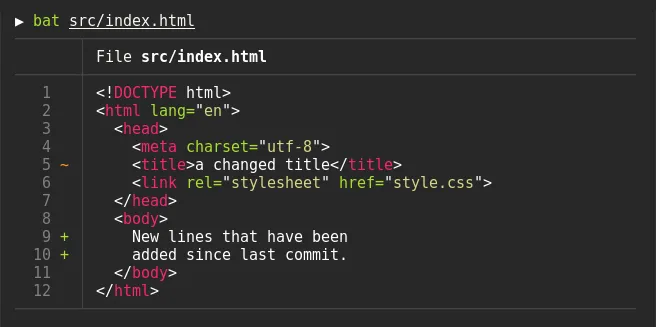

# 命令行工具

[如闪电划破雨夜，这些开源项目瞬间点亮了命令行 (qq.com)](https://mp.weixin.qq.com/s?__biz=MzA5MzYyNzQ0MQ==&mid=2247506759&idx=1&sn=a84395622756ccc5bd70d2bfe0346354&chksm=90586e19a72fe70f9352aa031a004effa14ee5126dab3c950fe21a68ec20748179a5204ac7c8&scene=178&cur_album_id=1332195194304905217#rd)

51W+ 的终端命令行工具助你成为 10 倍程序员：https://github.com/lcomplete/TechShare/blob/master/docs/10x/terminal.md

## 常见 unix 命令的现代/更快/更理智的替代方案的集合

[ibraheemdev/modern-unix：常见 unix 命令的 modern/faster/saner 替代方案的集合。 (github.com)](https://github.com/ibraheemdev/modern-unix)

## NuShell:高效的现代命令行工具

NuShell 是一款革命性的命令行工具，旨在提供比传统 Shell，如 zsh，更先进的用户体验。它通过结合现代编程语言的优势和 Shell 的灵活性，为用户带来了前所未有的效率和便利性。

### NuShell 的优点

- **结构化数据处理**：NuShell 以独特的方式处理数据，使得对复杂数据的查询和管理变得简单直观。
- **跨平台支持**：无论是在 macOS、Linux 还是 Windows 上，NuShell 提供一致的体验。
- **现代编程特性**：支持丰富的数据类型，使得脚本编写更加强大且易于维护。
- **友好的错误信息**：NuShell 设计了更易于理解的错误提示，帮助用户快速定位和解决问题。

### 安装和配置 NuShell

在 macOS 上安装 NuShell：

```shell
brew install nushell
```

设置 NuShell 为默认 Shell：

```shell
echo $(which nu) | sudo tee -a /etc/shells && chsh -s $(which nu)
```

这两步操作将 NuShell 安装到您的系统并设置为默认的命令行环境。

### 使用 NuShell

NuShell 的使用与传统 Shell 类似，但提供了更丰富的功能。以下是一些基本用法示例：

- **查看和过滤数据**：

```bash
ls | where size > 1mb | sort-by size
```

这条命令列出当前目录中大于 1MB 的文件，并按大小排序。

- **使用内置命令处理数据**：

```bash
ps | where cpu > 10 | get name
```

列出 CPU 使用率超过 10% 的进程名称。

### 评价 NuShell

通过结构化数据和强大的内置命令，NuShell 显著提高了命令行操作的效率。不仅如此，它的跨平台特性和友好的错误信息使得从其他 Shell 迁移到 NuShell 成为一种轻松愉快的体验。

NuShell 的设计理念和功能使其成为现代开发者工具箱中的必备工具，无论是数据处理、系统监控还是日常任务自动化，NuShell 都能提供优秀的支持。

## bat：不仅仅是 cat 的 Rust 替代品

bat 是一个现代的命令行工具，用 Rust 编写，旨在提供比传统的 `cat` 更多的功能，包括语法高亮、Git 集成、不可打印字符的可视化、自动分页，以及智能输出。它兼容 `cat` 的大部分功能，并增加了许多提高生产力的特性。

### bat 的优点

- **语法高亮**：对于多数编程和标记语言自动提供语法高亮，使代码更易读。
- **Git 集成**：自动显示 git 更改记录，方便跟踪代码修改。
- **不可打印字符可视化**：可以显示文件中的不可打印字符，便于调试。
- **自动分页**：当输出内容超出屏幕时，自动分页显示，避免信息丢失。
- **智能输出**：当通过管道使用或非交互环境下，自动调整为纯文本输出，保证与其他工具的兼容性。

### 安装配置 bat

在 macOS 上，使用 Homebrew 安装 bat 是非常简单的：

```shell
brew install bat
```

为了让 bat 替代 `cat`，您可以在 shell 配置文件中添加一个别名：

```shell
alias cat='bat --paging=never'
```

这样，每次输入 `cat` 时，实际上都是在使用 `bat`，但不启用分页功能。

### 使用 bat

- 查看文件内容，带有语法高亮和 Git 集成：

```shell
bat your_file.ext
```

- 显示不可打印字符：

```shell
bat -A your_file.ext
```

- 默认情况下，`bat` 会自动分页。如果你希望禁用分页功能（例如，为了替代 `cat`），可以使用之前提到的别名，或者直接在命令中指定：

```shell
bat --paging=never your_file.ext
```

### 评价 bat

通过引入语法高亮和 Git 集成等现代特性，bat 大幅提升了查看源代码和文本文件的体验。它的自动分页和智能输出特性，更使得在长文本或代码文件的浏览成为一种享受，而不是挑战。无论是对于开发者还是普通用户，bat 都是提升命令行工作效率的利器。

## uv：Rust 加速的 Python 包管理工具

uv 是一个用 Rust 编写的 Python 包安装程序和解析器，旨在作为 pip 和 pip-tools 的高速替代品。它结合了现代技术的优势，提供了一个更快、更高效、并且兼容性强的包管理体验。

### uv 的优点

- **无缝替换**：uv 设计为 pip、pip-tools 和 virtualenv 命令的直接替代品，无需改变现有工作流程。
- **极速性能**：比 pip 和 pip-tools 快 10-100 倍，大幅缩短包安装和管理的时间。
- **磁盘空间高效**：拥有全局缓存用于依赖去重，减少不必要的磁盘空间占用。
- **跨平台支持**：兼容 macOS、Linux 和 Windows，满足不同操作系统用户的需求。
- **无需 Rust 或 Python 环境**：uv 可以作为静态二进制文件安装，安装方式灵活多样。
- **高级功能支持**：包括依赖版本覆盖、替代解析策略等高级功能。
- **友好的错误提示**：提供最佳的错误信息和冲突跟踪解析器，帮助用户轻松定位问题。

### 安装配置 uv

在 macOS 上安装 uv 非常简单，只需一个命令：

```shell
brew install uv
```

这条命令通过 Homebrew 安装 uv，使其立即可用。

由于 uv 被设计为 pip 的直接替代品，因此大部分情况下无需额外配置即可使用。对于需要特殊配置的场景，uv 文档提供了详尽的指导。

### 使用 uv

使用 uv 来安装 Python 包，体验与使用 pip 类似，但速度更快：

```shell
uv install requests
```

查看已安装的包列表：

```shell
uv list
```

创建虚拟环境

使用 uv 创建一个新的虚拟环境非常简单：

```shell
uv venv  # 在当前目录下创建 .venv 虚拟环境
```

激活虚拟环境

激活您创建的虚拟环境：`source .venv/bin/activate`

安装依赖

安装依赖到虚拟环境中，uv 提供了与 pip 类似的命令行界面：

```shell
uv pip install flask                # 安装 Flask
uv pip install -r requirements.txt  # 从 requirements.txt 文件安装
uv pip install -e .                 # 以可编辑模式安装当前项目
uv pip install "package @ ."        # 从磁盘安装当前项目
uv pip install "flask[dotenv]"      # 安装 Flask 并包含 "dotenv" 扩展
```

生成锁定的依赖集

生成一组锁定的依赖，并输出到 `requirements.txt`：

```shell
uv pip compile requirements.in -o requirements.txt    # 从 requirements.in 生成
uv pip compile pyproject.toml -o requirements.txt     # 从 pyproject.toml 生成
uv pip compile setup.py -o requirements.txt           # 从 setup.py 生成
echo flask | uv pip compile - -o requirements.txt     # 从 stdin 读取并生成
uv pip freeze | uv pip compile - -o requirements.txt  # 锁定当前环境的依赖
```

同步虚拟环境

将一组锁定的依赖与虚拟环境同步：

```shell
uv pip sync requirements.txt  # 从 requirements.txt 文件同步
```

UV 的 `pip-install` 和 `pip-compile` 命令支持许多与现有工具相同的命令行参数，包括 `-r requirements.txt`、`-c constraints.txt`、`-e .`（用于可编辑安装）、`--index-url` 等，提供了一个既熟悉又高效的包管理体验。

### 评价 uv

uv 提供了一个高效、快速且用户友好的 Python 包管理解决方案。它不仅显著提升了包安装速度，还通过全局缓存和优化的错误提示等特性，改善了开发者的工作效率和体验。无论是新项目的开发还是现有项目的维护，uv 都能为 Python 社区带来显著的优势。

## Ripgrep：高效的代码搜索工具

Ripgrep 是一个用 Rust 编写的命令行工具，旨在提供比传统的 `grep` 更快、更强大的搜索能力。它结合了现代技术的优势，为用户带来了前所未有的搜索体验。

### Ripgrep 的优点

- **递归搜索**：Ripgrep 默认递归搜索当前目录，无需额外参数。
- **自动过滤**：自动根据 `.gitignore` 规则过滤文件，提高搜索效率。
- **语法高亮**：搜索结果带有语法高亮，使得查找结果一目了然。
- **Git 集成**：能显示 git 更改记录，方便追踪代码修改。
- **不可打印字符可视化**：通过 `-A` 或 `--show-all` 参数可视化显示文件中的不可打印字符。
- **自动分页**：当输出内容超过屏幕时，自动分页显示。
- **智能输出**：在设置了分页器选项的同时支持管道输出，适应不同的使用场景。
- **跨平台支持**：支持 Windows、macOS 和 Linux，满足不同操作系统用户的需求。

### 安装配置 Ripgrep

在 macOS 上安装 Ripgrep 十分简单，只需一个命令：

```shell
brew install ripgrep
```

这条命令通过 Homebrew 安装 Ripgrep，使其立即可用。

Ripgrep 的默认配置已经非常强大，大多数情况下你可以直接使用。如果需要对其进行配置，可以通过编辑 `.ripgreprc` 文件来实现，该文件通常位于用户的家目录下。

### 使用 Ripgrep

进行基本搜索：

```shell
rg pattern
```

在特定文件中搜索：

```shell
rg pattern README.md
```

使用正则表达式进行搜索：

```shell
rg 'pattern\w+'
```

### 评价 Ripgrep

Ripgrep 通过其快速的搜索速度、直观的语法高亮和强大的 Git 集成，极大地提升了开发者的搜索效率。自动过滤和不可打印字符的可视化功能使得 Ripgrep 成为处理复杂搜索任务时的理想选择。其跨平台支持和智能输出功能更是让 Ripgrep 成为了现代开发者工具箱中不可或缺的一部分。

## Zenith：现代化的系统监控工具

Zenith 是一个现代化的命令行系统监控工具，它通过提供详细的资源使用情况和性能指标来替代经典的 htop。它结合了性能分析和监控，使得用户能够实时观察到系统的健康状况和性能瓶颈。

### zenith 的优点

- **直观的界面**：Zenith 提供了一个图形化的终端界面，显示 CPU、内存、磁盘和网络使用情况，以及进程列表。
- **GPU 监控**：与 htop 不同，Zenith 还支持 GPU 使用率和温度的监控，对于使用 GPU 进行计算的用户来说非常有用。
- **历史数据**：Zenith 能够跟踪并显示系统性能的历史数据，帮助用户分析过去的性能问题。
- **响应式布局**：界面布局会根据终端窗口的大小自动调整，保持信息的清晰可读。

### 安装和配置 zenith

安装 Zenith 非常简单，对于 macOS 用户，可以通过 Homebrew 安装：

```shell
brew install zenith
```

Zenith 无需复杂的配置即可使用。安装后直接运行 `zenith` 命令即可启动。

### 使用 zenith

启动 Zenith 很简单，只需要在终端中输入：

```shell
zenith
```

默认情况下，Zenith 会展示所有核心的 CPU 使用率、内存使用情况、磁盘 IO 和网络 IO。您可以使用键盘上的方向键来浏览进程列表，或者使用 Tab 键在不同的监控面板之间切换。

### 评价 zenith

Zenith 以其现代化的界面和丰富的功能集，在命令行系统监控工具中脱颖而出。它的 GPU 监控功能尤其适合需要对 GPU 资源进行实时监控的用户。虽然它可能不像 htop 那样轻量级，但其提供的详细性能分析和历史数据追踪功能，使其成为高级用户和系统管理员分析和优化系统性能的有力工具。

## Zoxide：一个更聪明的目录跳转工具

zoxide 是一个命令行工具，旨在提升您的目录导航效率。它通过学习您的使用习惯，使您能够快速跳转到经常访问的目录。

### zoxide 的优点

- **智能跳转**：zoxide 学习您最常访问的目录，并允许您快速跳转到这些目录，而无需输入完整的路径。
- **跨 Shell 兼容性**：支持所有主要的 Shell，如 Bash、Zsh、Fish 和 NuShell，确保无论您使用哪种 Shell 都能获得一致的体验。
- **简化的命令**：zoxide 通过简单的命令 `z` 替代了传统的 `cd` 命令，进一步简化了目录导航。
- **无需外部依赖**：作为一个静态二进制文件，zoxide 可以轻松安装在任何系统上，无需额外的依赖。

### 安装配置 zoxide

在 macOS 上安装 zoxide 十分简单，只需一个命令：

```shell
brew install zoxide
```

根据您使用的 Shell，配置 zoxide 以使其生效。

#### Nushell

1. 将下列命令添加到您的 env 文件末尾（通过在 Nushell 中运行 `$nu.env-path` 找到它）：

```shell
zoxide init nushell | save -f ~/.zoxide.nu
```

1. 现在，将以下内容添加到您的配置文件末尾（通过在 Nushell 中运行 `$nu.config-path` 找到它）：

```shell
source ~/.zoxide.nu
```

请注意，zoxide 仅支持 Nushell v0.89.0 及以上版本。

#### Zsh

1. 将以下内容添加到您的配置文件末尾（通常是 `~/.zshrc`）：

```shell
eval "$(zoxide init zsh)"
```

为了使自动补全生效，上述行必须在调用 `compinit` 之后添加。您可能需要通过运行 `rm ~/.zcompdump*; compinit` 来重建自动补全缓存。

### 使用 zoxide

使用 zoxide 非常简单，只需要使用 `z` 命令加上部分目录名即可快速跳转：

```shell
z project
```

如果 `project` 是您经常访问的目录，zoxide 会将您直接导航到该目录。

### 评价 zoxide

zoxide 通过提供一个智能、快速且易于使用的目录跳转解决方案，极大地提升了命令行的工作效率。它的跨 Shell 兼容性和简化的命令使得从传统的 `cd` 命令过渡变得无缝且自然。zoxide 是提高命令行导航速度的理想工具，尤其适合经常在多个项目之间跳转的开发者和系统管理员。

## eza：ls 的现代化替代品

eza 是一个现代化的文件列表命令行程序，用 Rust 编写，旨在替代 Unix 和 Linux 操作系统附带的经典 `ls` 命令。它提供了更多的特性和更好的默认值，使用颜色区分文件类型和元数据，了解符号链接、扩展属性和 Git 状态，而且它小巧、快速，仅为一个单一的二进制文件。

通过有意识地做出不同的决策，eza 试图成为一个功能更全面、更用户友好的 `ls` 版本。

### eza 的优点

- **修复了 exa 2021 引入的“网格错误”**：提供了一个更稳定的显示网格。
- **超链接支持**：可以将文件名显示为可点击的超链接。
- **挂载点细节**：显示挂载点的详细信息。
- **Selinux 上下文输出**：增加了对 Selinux 上下文的支持。
- **Git 仓库状态输出**：直观地显示 Git 状态。
- **人类可读的相对日期**：日期显示更加友好。
- **多项安全修复**：提升了程序的安全性。
- **对明亮终端颜色的支持**：界面更加丰富多彩。
- **大量的小型 bug 修复和更改**：提升了稳定性和可用性。

### 安装和配置 eza

在 macOS 上，安装 eza 只需要一个简单的命令：

```shell
brew install eza
```

### 使用 eza

eza 的命令行选项与 ls 的相似，但带有一些重要的改进和扩展：

- **显示选项**：
  - `-1, --oneline`：每行显示一个条目。
  - `-G, --grid`：以网格形式显示条目（默认）。
  - `-l, --long`：显示扩展的细节和属性。
  - `-R, --recurse`：递归进入目录。
  - `-T, --tree`：以树形递归进入目录。
  - `--colo[u]r`：何时使用终端颜色（总是，自动，从不）。
- **过滤选项**：
  - `-a, --all`：显示隐藏文件和'点'文件。
  - `-d, --list-dirs`：列出目录，如同常规文件。
  - `-L, --level`：限制递归的深度。
- **长视图选项**（在使用 `--long` 时可用）：
  - `-b, --binary`：以二进制前缀列出文件大小。
  - `-h, --header`：为每列添加标题行。
  - `--git`：列出每个文件的 Git 状态，如果被追踪或忽略。

eza 通过其丰富的功能集，为文件和目录的列表显示提供了一个强大而直观的界面。它的现代化特性，如超链接支持和 Git 状态输出，使得浏览和管理文件变得更加高效和愉悦。

### 评价 eza

eza 以其现代化的特性和改进的默认值，为命令行文件列表工具设置了新的标准。它不仅仅是 `ls` 的一个替代品，而是一个在功能、性能和用户体验方面都有显著提升的工具。对于那些寻求更先进的命令行文件管理工具的用户来说，eza 提供了一个值得尝试的选择。

## watchexec：自动化命令执行的现代工具

watchexec 是一个简单而独立的工具，它监视一个路径，并在检测到修改时运行指定的命令。这个工具解决了软件开发中经常遇到的一个问题：反复运行相同的命令，这既枯燥又低效。

### watchexec 的优点

- **简单的调用和使用**：不需要复杂的命令行参数，易于理解和使用。
- **跨平台支持**：在 OS X、Linux 和 Windows 上运行。
- **监控目录变化**：监视当前目录及所有子目录的更改。
- **智能事件合并**：对于在保存过程中使用交换/备份文件的编辑器，将多个文件系统事件合并为一个。
- **忽略文件加载**：自动加载 `.gitignore` 和 `.ignore` 文件，排除不需要监视的路径。
- **进程组管理**：能够控制产生分支（fork）的程序。
- **提供变更路径**：在环境变量或标准输入中提供发生变更的路径。
- **无需语言运行时**：不绑定任何特定的语言或生态系统，不需要语言运行时。
- **多种附加功能**：包括超链接支持、挂载点细节、Selinux 上下文输出、Git 仓库状态输出等。

### 安装配置 watchexec

在 macOS 上，可以通过一个简单的命令安装 watchexec：

```shell
brew install watchexec
```

### 使用 watchexec

watchexec 的用法示例广泛而多样，以下是一些常见的使用场景：

### 自动运行单元测试

当当前目录或子目录下的 JavaScript、CSS 和 HTML 文件发生变化时，自动运行 `npm run build`：

```shell
watchexec -e js,css,html npm run build
```

### 监控 Python 文件变化重启服务器

当任何 Python 文件发生变化时，调用/重启 `python server.py`：

```shell
watchexec -r -e py -- python server.py
```

### 排除特定目录下的文件变化

在当前目录/子目录下的任何文件变化时调用 `make test`，但排除 `target` 目录下的所有文件：

```shell
watchexec -i "target/**" make test
```

### 仅监控文件创建事件

仅当文件被创建时运行命令，例如同步当前目录到 S3 存储桶：

```shell
watchexec --fs-events create -- s3 sync . s3://my-bucket
```

### 评价 watchexec

watchexec 以其灵活性、易用性和高效性成为自动化重复命令执行的强大工具。它的跨平台支持、智能事件合并和对 `.gitignore` 的自动处理，使其成为开发者工作流程中不可或缺的一部分。无论是自动运行测试、重启开发服务器还是其他自动化任务，watchexec 都能大幅提高开发效率和体验。

## yazi：超快的终端文件管理器

yazi 是一款基于 Rust 语言开发，支持异步 I/O 的终端文件管理器，旨在为用户提供一个速度快、功能全、易于使用的文件浏览体验。它具有可滚动预览、视觉模式批量重命名、类似 Vim 的输入和选择组件等特性，使其成为传统文件管理命令 `Ranger` 的现代化替代品。

### yazi 的优点

- **可滚动预览**：支持预览各种类型的文件，并在预览时滚动文件内容。
- **视觉模式和批量重命名**：在可视模式下批量选择文件，并支持重命名。
- **类似 Vim 的操作体验**：快速在输入框中编辑文件名，以及通过选择组件决定如何打开文件。
- **多标签和快速跳转**：支持多标签协作，通过 fzf 和 zoxide 实现快速跳转。
- **增量查找和内容搜索**：实现实时增量查找文件，并支持通过 fd 和 rg 按名称或内容搜索文件。
- **多项选择和任务管理**：支持单独选择多个文件进行操作，并通过任务系统安排如复制、剪切等操作，提供实时进度报告和任务取消功能。

### 安装配置 yazi

在 macOS 上安装 yazi 及其依赖非常简单，只需通过 Homebrew 执行以下命令：

```shell
brew install yazi ffmpegthumbnailer unar jq poppler fd ripgrep fzf zoxide
brew tap homebrew/cask-fonts && brew install --cask font-symbols-only-nerd-font
```

启动 yazi：

```shell
yazi
```

按 `q` 退出，按 `~` 打开帮助菜单。

### 使用 yazi

yazi 提供了丰富的键绑定和功能，以提升文件管理效率：

- 使用箭头键或 `h`, `j`, `k`, `l` 进行导航。
- 使用 `Space` 切换选中的文件/目录，`v` 进入视觉模式进行批量选择。
- `o` 打开选中的文件，`d` 将文件移动到垃圾箱，`r` 重命名文件或目录。
- 使用 `/` 进行增量查找，`s` 和 `S` 分别通过 fd 和 rg 按名称或内容搜索文件。
- 对文件/目录进行排序，例如 `,` + `m` 按修改时间排序。

### 评价 yazi

yazi 以其超快的速度和丰富的功能集，在终端文件管理领域树立了新的标准。其现代化的特性，如可滚动预览、批量重命名、快速跳转等，极大地提升了文件管理的便利性和效率。无论是日常文件浏览还是复杂的文件操作，yazi 都能提供流畅和高效的体验，是一个值得尝试的终端文件管理工具。

## dust：du 的现代化替代品

dust 是一个用 Rust 编写的命令行工具，旨在提供一个直观的方式来查看磁盘空间的使用情况。它结合了 `du` 命令的功能和 Rust 的性能，使其成为 `du` 的现代化替代品。


### dust 的优点

- **直观的输出**：dust 旨在提供一个即时的概览，显示哪些目录正在使用磁盘空间，而无需使用 `sort` 或 `head` 命令。
- **智能递归**：dust 会智能地递归下到文件树中找到更大的目录或文件，列出占用空间最大的一些子目录或文件，并使用颜色加以区分。
- **颜色区分**：不同颜色的条形图表示树层次结构和磁盘使用情况的组合，灰色阴影用于指示子文件夹属于哪个父文件夹。
- **权限提示最小化**：dust 会最大限度地减少“没有权限”消息的打印。

- 编程语言：Rust（96%）
- 可替代：`du` 命令
- 介绍：能够一目了然地展示目录和文件大小的命令行工具。使用时无需加额外的参数，即可展示当前目录下的文件和目录的大小、包含的子目录列表（树状）以及占用空间的百分比（条形图）。
- 用法：`dust`

- 适用平台：Windows、Linux、macOS
- 地址：https://github.com/bootandy/dust

### 安装配置 dust

在 macOS 上安装 dust，只需要执行以下命令：

```shell
brew install dust
```

### 使用 dust

dust 的使用非常简单，以下是一些基本用法：

- 直接运行 `dust` 以查看当前目录及其子目录的磁盘使用情况。
- 使用 `dust <dir>` 查看指定目录的磁盘使用情况。
- `dust -p` 显示子目录的完整路径。
- `dust -n 30` 显示最大的 30 个目录而不是默认的终端高度。
- `dust -d 3` 显示 3 级子目录的磁盘使用情况。
- `dust -r` 反转输出顺序。

### 评价 dust

dust 通过其简单直观的输出和智能递归功能，在磁盘空间分析工具中树立了新的标准。它的直观界面、颜色编码和易用性使其成为了查看磁盘使用情况的理想工具。对于那些寻找 `du` 现代化替代品的用户来说，dust 提供了一个功能强大且用户友好的解决方案。

## duf（df）


- 编程语言：Go（94%）
- Star 数：9.3k
- 可替代：`df` 命令
- 介绍：通过彩色表格的方式展示磁盘使用情况的工具。不仅对设备进行了分类，还支持结果排序。
- 用法：`duf`
- 适用平台：Windows、Linux、macOS
- 地址：https://github.com/muesli/duf

## procs（ps）


- 编程语言：Rust（99%）
- Star 数：3k
- 可替代：`ps` 命令
- 介绍：能够展示进程占用的 TCP/UDP 端口、Docker 容器名称等更多信息的命令行进程管理工具，以及轻松地按列排序和关键字过滤进程。
- 用法：`procs 待过滤的关键字`
- 适用平台：Linux、macOS 和 Windows 上存在一些问题
- 地址：https://github.com/dalance/procs

## bottom（top）


- 编程语言：Rust（99%）
- Star 数：4.4k
- 可替代：`top` 命令
- 介绍：图形化实时监控进程和系统资源的工具。支持实时展示 CPU、内存、硬盘、网络、进程、温度等指标，而且还可通过插件扩展可视化效果，相较于其它同类型的开源项目，该项目更加活跃。
- 用法：`btm`
- 适用平台：Windows、Linux、macOS
- 地址：https://github.com/ClementTsang/bottom

## exa（ls）


- 编程语言：Rust（92%）
- Star 数：18.4k
- 可替代：`ls` 命令
- 介绍：更加人性化地显示目录下文件的工具。它通过不同颜色展示来区别文件类型，还支持以树状的方式展示文件层级、展示 Git 状态等方便的功能。
- 用法：`exa -l`
- 适用平台：Linux、macOS
- 地址：https://github.com/ogham/exa

## zoxide（cd）


- 编程语言：Rust（98%）
- Star 数：6.9k
- 可替代：`cd` 命令
- 介绍：更聪明的 `cd` 命令。能够记住你最常使用的目录，从而让目录跳转更加方便和快捷。
- 用法：`z 目录`
- 适用平台：Windows、Linux、macOS
- 地址：https://github.com/ajeetdsouza/zoxide

## ripgrep（grep）


- 编程语言：Rust（94%）
- Star 数：45.6k
- 可替代：`grep` 命令
- 介绍：超快的文本搜索工具。不仅快还更加人性化，比如自动忽略 .gitignore 中的文件、自动递归搜索、自动高亮展示匹配的结果。
- 用法：`rg '关键字' 目录`
- 适用平台：Windows、Linux、macOS
- 地址：https://github.com/BurntSushi/ripgrep

[一款开源的文件搜索神器，终于不用记 find 命令了 (qq.com)](https://mp.weixin.qq.com/s?__biz=MzA5MzYyNzQ0MQ==&mid=2247512232&idx=1&sn=355246e5c81365e7f88036458ae508d1&chksm=905805f6a72f8ce0eef571bb14338b36bb32de2be9de529928aec7a52dbe790c0590f1e49c27&token=441186140&lang=zh_CN&scene=21#wechat_redirect)

## bat（cat）



- 编程语言：Rust（95%）
- Star 数：35.6k
- 可替代：`cat` 命令
- 介绍：默认就带自动翻页、行号、语法高亮、Git 集成等功能的升级版文件查看工具。
- 用法：`bat 文件名`
- 适用平台：Windows、Linux、macOS
- 地址：https://github.com/sharkdp/bat

## httpie（curl）


- 编程语言：Python（92%）
- Star 数：22.4k
- 可替代：`curl` 和 `wget` 命令
- 介绍：全能但不臃肿的命令行 HTTP 客户端。使用起来极其方便，支持请求、会话、下载、JSON 等功能。该项目经历了 Star 清零的事件（误操作），这才不到一年的时间，现在已经拥有超过 2 万的 Star 啦！
- 用法：`http/https 地址`
- 适用平台：Windows、Linux、macOS
- 地址：https://github.com/httpie/httpie

## hyperfine（time）


- 编程语言：Rust（93%）
- Star 数：11.9k
- 可替代：`time` 命令
- 介绍：强大的命令行基准测试工具。支持任意 shell 命令、多次运行的统计分析和结果导出。
- 用法：`hyperfine '命令1' '命令2'`
- 适用平台：Windows、Linux、macOS
- 地址：https://github.com/sharkdp/hyperfine

## Redis 图形化的管理工具：redis-Tui

**「GitHub Star 数」** ：674

redis-tui 是一个炫酷的 Redis 命令行图形界面工具。

> ❝
>
> GitHub 地址：https://github.com/mylxsw/redis-tui
>
> ❞


# 终端模拟器

当你逐渐厌倦了 cmd 的枯燥黑屏、powershell 的单调蓝底，可以来尝试一下使用可定制性更高的终端模拟器。下面是 HelloGitHub 从 GitHub 上收集的一些开源终端模拟器，它们功能丰富，界面美观，可以完美替代掉系统自带的普通终端。萝卜白菜各有所爱，挑挑看有没有让你眼前一亮，整篇文章最靓的那个“仔”。

程序员的快乐可能是一个得心应手的键盘，一款高效的 IDE，甚至一个炫酷的命令行终端。

终端是 Linux 和 Unix 系统下非常重要，且频繁使用的工具，它可以让你与你的系统进行交互。

虽然大多数时候我们都在终端做一些枯燥且乏味的事情，比如运行、监控和管理进程。但是，我们也可以尝试一些有趣的脚本，能够做到对命令行更加友好操作。

## 1. Windows Terminal

- GitHub 项目：https://github.com/microsoft/terminal
- Stars 数量：58.7k
- Roadmap：https://github.com/microsoft/terminal/blob/master/doc/terminal-v1-roadmap.md


如果你是一枚 Windows 用户，那么由微软爸爸开发的 Windows Terminal 绝对是你的最佳选择。它支持多个选项卡、Unicode 和 UTF-8 字符还有 emoji、GPU 加速以及自定义主题、样式和配置。WT 使用 C++ 开发，速度很快。（上面这张图中的背景是经修改过的，默认会有 Fluent 效果）

## 2. Hyper

- GitHub 项目：https://github.com/zeit/hyper
- Stars 数量：32.7k
- 官网：https://hyper.is


Hyper 使用 Electron 框架，这让它可以变得很漂亮、酷炫，但也带来了速度慢、体积大的缺点。它的插件和主题非常丰富，见 **awesome-hyper**，可以说是最多的。如果你不在乎性能，那 Hyper 也是不错的选择。它支持 Windows, Linux 和 MacOS。

## 3. Terminus

- GitHub 项目：https://github.com/Eugeny/terminus
- Stars 数量：13.1k
- 官网：https://eugeny.github.io/terminus/


Terminus 是一个高度定制化的终端模拟器，同样使用了 Electron，并可以设置成 Fluent Design 风格的背景，和 Windows 10 很搭配。它集成了 SSH 客户端和连接管理器，完全支持 Unicode，包括全角字符，拥有图形界面的设置页面。支持 Windows, Linux 和 MacOS。Terminus 同样有一些插件和主题。

## 4. Alacritty

- GitHub 项目：https://github.com/alacritty/alacritty
- Stars 数量：21.1k


Alacritty 使用 Rust 开发，追求简单和性能。号称是现有最快的终端模拟器，使用了 GPU 渲染。支持 macOS，Linux，BSD 和 Windows。目前它仍然处于 Beta 阶段。

经实测，Alacritty 的打开速度可谓“秒开”，比 Windows Terminal 还要快不少。

## 5. ConEmu

- GitHub 项目：https://github.com/Maximus5/ConEmu
- Stars 数量：6.6k
- 官网：https://conemu.github.io/


这款终端使用 C++ 开发，性能优秀，功能很强大，已经有十几年的历史了。可以运行一些旧的 DOS 程序或游戏，窗口大小调整时很平滑，不过如你所见，ConEmu 实在是丑不忍睹。

## **FIGlet**

FIGlet 是一个计算机程序，可以采用各种字体来生成文本横幅，由较小的 ASCII 字符组成的字母组成。


这是一个巧妙的技巧，用于休闲报告很有趣。

安装方式：

```bash
brew install figlet
```

## **cheat**

Cheat 是终端上的一个绝对的省时工具。


它为你经常使用，但又不经常记住的命令的选项的命令行提供一个非常有用的使用介绍清单。

安装方式：

```bash
brew install cheat
```

## **edex-ui**

edex-ui 是一个跨平台、可定制、充满科幻感终端模拟器，支持高级监控和触摸屏。


edex-ui 做得很精致，但它几乎没有功能，而且它占用了大量的资源。

安装方式：

```bash
brew install — cask edex-ui
```

## **cowsay**

cowsay 是一个有趣的程序，可以生成带有文本内容的牛的 ASCII 艺术图片。


安装方式：

```bash
brew install cowsay
```

## **cmatrix**

cmatrix 是基于 The Matrix 网站的屏保。它显示文本在一个终端中飞进飞出，就像在《黑客帝国》电影中看到的那样。


它可以以相同的速度或异步地以用户定义的速度滚动所有行。

```bash
brew install cmatrix
```

## **say**

这款工具的作用正如它的名称那样，你可以用它以你喜欢的声音朗读一个文本文件。


你也可以将所读的文本创建一个音频文件。可用于文本到语音的转换，也可用于快速制作音频信息。

安装方式：

```bash
brew install say
```

## **bat**

bat 是一个轻量级的脚本，在终端上提供语法高亮和 Git 集成。

它使用 rust 开发，速度非常快。


在 github 上有 3 万多颗星，它肯定是非常受欢迎的。Bat-extras 还可以给你一些额外的功能。

安装方式：

```bash
port install bat
```
