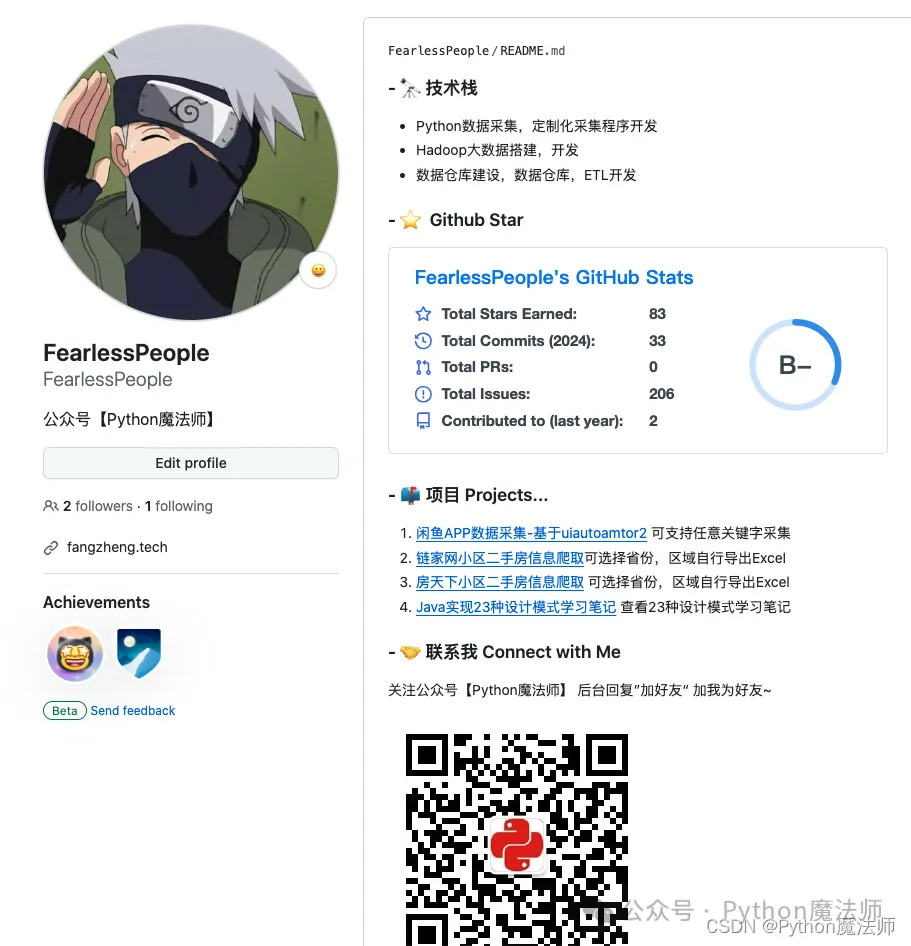
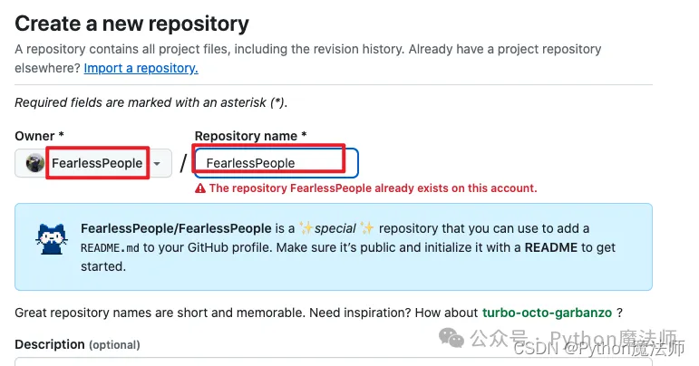
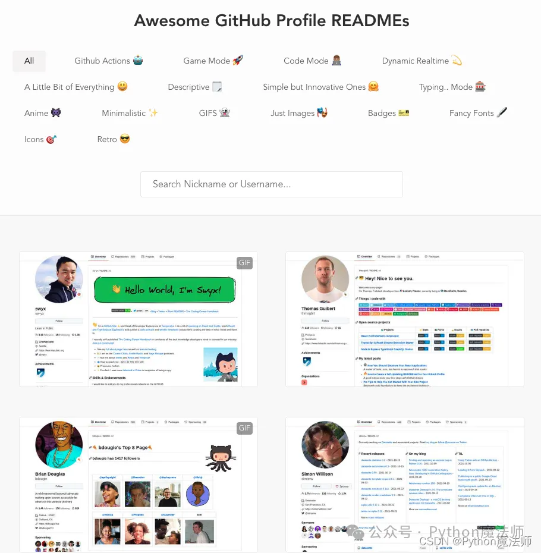
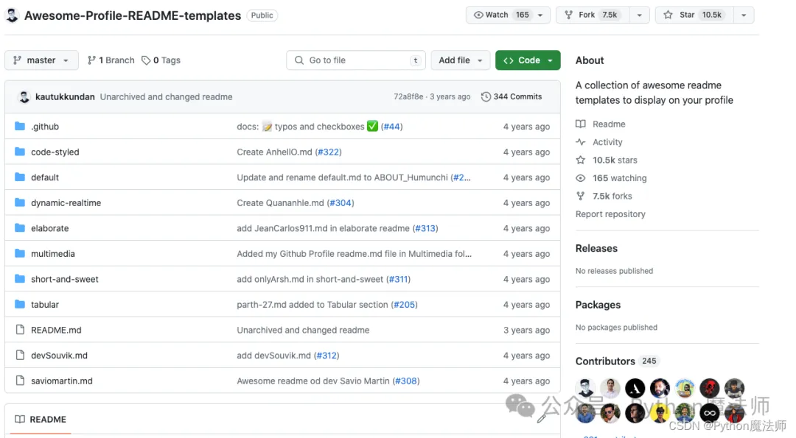
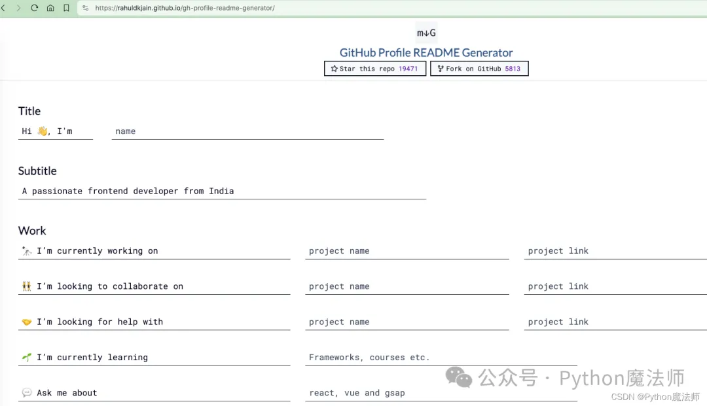
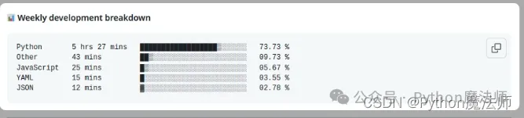
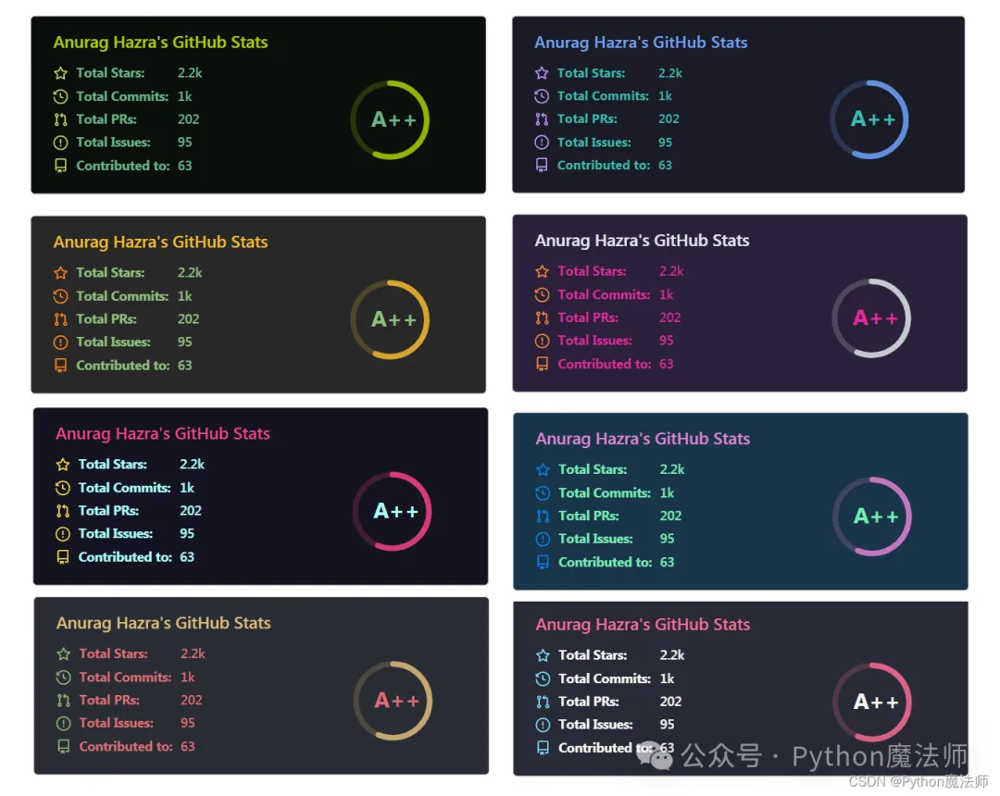
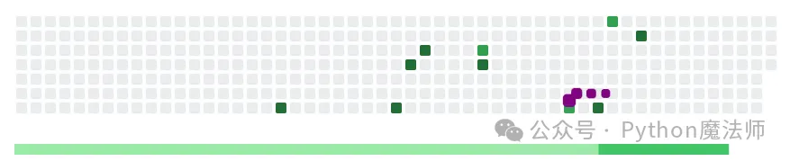

# 打造一个花里胡哨的 Github 个人主页

## 1、介绍

今天介绍下 `GitHub` 的一项特色功能 - `GitHub profile`，以及一些列开源工具、项目来帮助打造自己特色的 `GitHub profile`。

`GitHub profile` 也是最近两年 `GitHub` 才新加的功能，开发者可以通过编写 `README` 打造属于自己的个人 `GitHub` 首页。

先贴一张我自己的



GitHub profile 表示个人主页，但是 Github 近两年悄悄上线了 profile 仓库的功能，也就是说可以自由管理你 profile 的 README

**一句话总结：你可以通过 README.md 来自定义你 Github 首页**

## 2、使用

官方说明文档：https://docs.github.com/zh/account-and-profile/setting-up-and-managing-your-github-profile/customizing-your-profile/managing-your-profile-readme

整体使用很简单，分以下几步

1.创建一个同名仓库 2.引用模板 3.为内容添加有趣模块

### 2.1、创建一个同名仓库

图片创建同名仓库

1.在任何页面的右上角，选择 ，然后单击“新建存储库”。2.在“Repository name（仓库名称）”下，输入与您的 GitHub 用户名匹配的仓库名称。例如，如果您的用户名是 "octocat"，则仓库名称必须为 "octocat"。3.选择“Public”。4.选择“使用 README 初始化此存储库”。

profile 属于彩蛋类功能，创建时在下方将会出现提示。如果勾选自动创建 README，将会创建一个特殊的 README 模版，长这样：

```
### Hi there 👋
<!--**GULU-H/GULU-H** is a ✨ _special_ ✨ repository because its `README.md` (this file) appears on your GitHub profile.
Here are some ideas to get you started:
- 🔭 I’m currently working on ...- 🌱 I’m currently learning ...- 👯 I’m looking to collaborate on ...- 🤔 I’m looking for help with ...- 💬 Ask me about ...- 📫 How to reach me: ...- 😄 Pronouns: ...- ⚡ Fun fact: ...-->
```

默认创建的内容肯定不满足我们需求，接下来看看大佬们都怎么玩的~

### 2.2、引用模板

Github 上有很多大神改造的模板

**项目 1：awesome-github-profile**

地址：https://zzetao.github.io/awesome-github-profile

该项目提供了丰富的模版，可以从中选择喜爱的模版进行二次开发。



**项目 2：Awesome-Profile-README-templates**

地址：https://github.com/kautukkundan/Awesome-Profile-README-templates

该仓库没有概览图，但是可以进入项目目录点击各 markdown 文件进行查看。



**项目 3：gh-profile-readme-generator**

地址：https://rahuldkjain.github.io/gh-profile-readme-generator/

使用该网站可通过填写表单为你生成 profile，如果懒得二次定制可以使用该网站进行生成。



## 3、为内容添加有趣模块

如果上面选择了一个有趣的模板后，则可以再为内容添加一些小部件

### 3.1、徽章 badge

徽章我们见过很多，其实就是一个 Markdown 图片链接，借助 shields.io 来生成即可

地址：https://shields.io/


这里由于有水印看的效果不太好

### 3.2、waka 时间展示

地址：https://github.com/marketplace/actions/waka-readme

该项目可以生成一个代码提交图等内容，详情可看官网介绍



### 3.3、展示 GitHub stars 等信息

地址：https://github.com/anuraghazra/github-readme-stats



### 3.4、GitHub contributions 贪吃蛇游戏

地址：https://github.com/Platane/snk

该项目可以根据你的贡献量生成贪吃蛇动画



## 总结

Github profile 本质上就是对一个 README.md 文件的编辑，所以只要满足 Markdown 语法的内容都可以写进去~

借助 GitHub profile 可以让我们打造自己个性化的 GitHub 首页，在全球最大男性交友网站中有特色的介绍自己 🐶。
