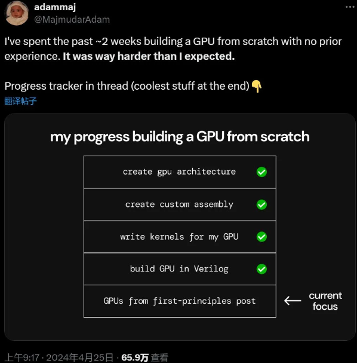
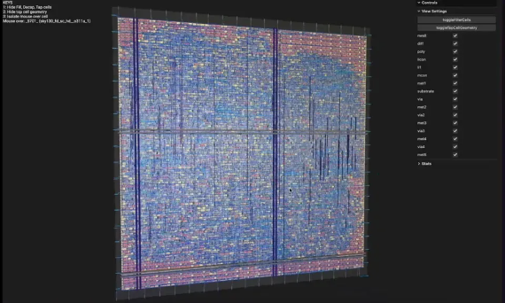
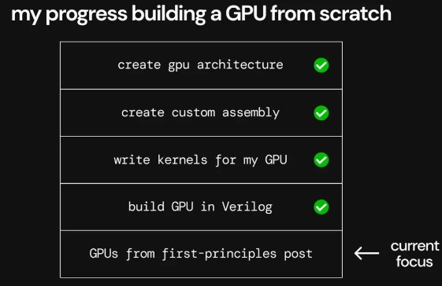
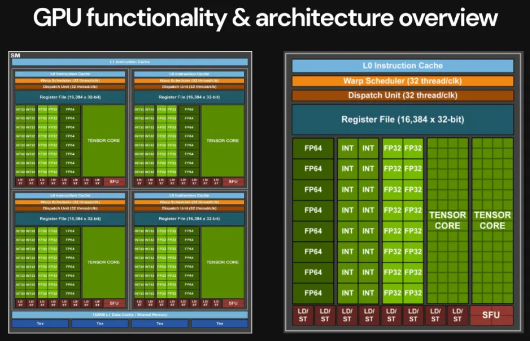
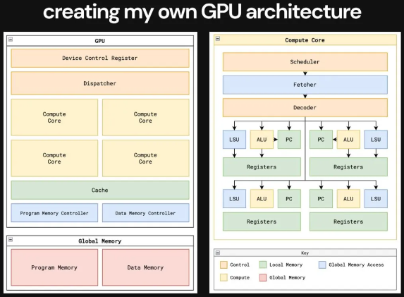
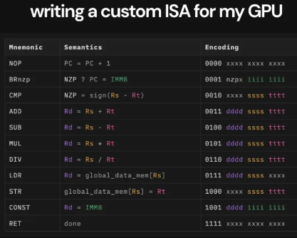
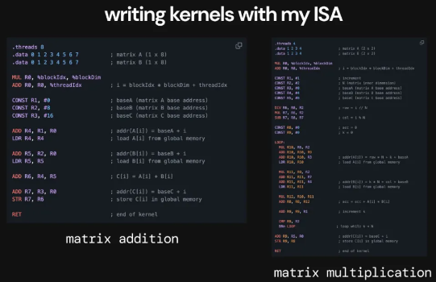
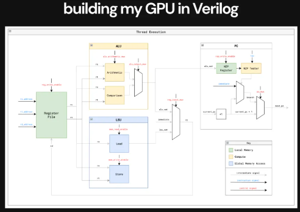
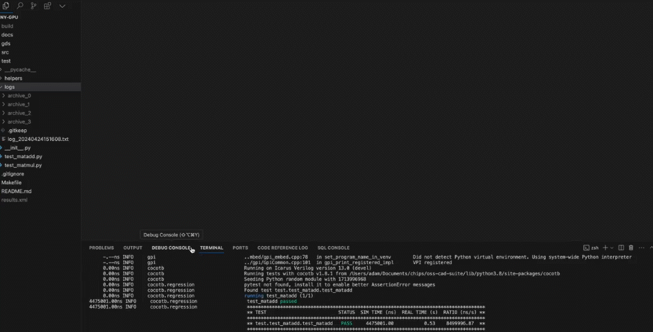
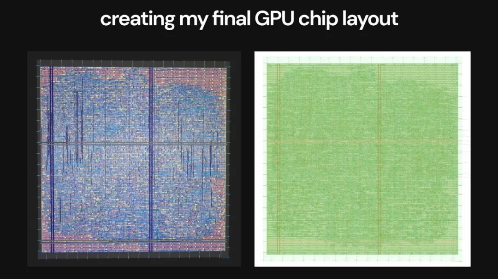

# 手搓CPU

## 从零开始手搓GPU，照着英伟达CUDA来，只用两个星期

「我花两周时间零经验从头开始构建 GPU，这可比想象的要难多了。」

美国一家 web3 开发公司的创始工程师之一 Adam Majmudar 分享了他「手搓 GPU」成功的经历，引发了网友们的一大片点赞。令人惊讶的是，他仅用两周时间就完成了这一脑力壮举。在 Twitter/X 的主题帖子中，Majmudar 进行了直播，一步步带我们回顾了整个过程。

自造 GPU 的实践当然也被公开在 GitHub 上。

**项目链接**：https://github.com/adam-maj/tiny-gpu

需要明确的是，该项目目前的节点是在 Verilog 中的芯片布局，最终通过 OpenLane EDA 软件进行了验证。在这之后，GPU 还将通过 Tiny Tapeout 7 提交流片，因此注定会在未来几个月内成为物理形态的芯片。

Majmudar 详细列出了设计 GPU 所完成的任务流程。显然，作为一个「从头开始」的项目，在试探性迈出第一步之前就需要进行大量的研究和思考。由于专有技术的主导地位，GPU 是一个相对复杂的研究领域，想想就难，实践起来更难。

### 手搓 GPU 要分几步？

实际上对于 Majmudar 来说，操作比这个步骤还要多，因为他真的没啥技术基础，是从学习 GPU 架构的基础知识开始的。

他首先开始尝试通过学习英伟达的 CUDA 框架来理解 GPU 软件模式，进而理解了用于编写 GPU 程序（称为内核）的相同指令多数据 (SIMD) 编程模式。

有了这些背景，Majmudar 开始深入学习 GPU 的核心元素：从全局内存、计算核心、分层缓存、内存控制器到程序调度。

然后在每个计算核心中，我们还要了解其中的主要单元：包括寄存器、本地 / 共享内存、加载存储单元 (LSU) 、计算单元 、调度程序、获取器和解码器。

好了，你已经是一个了解了现代 GPU 架构的人了，下面让我们来手搓一块 GPU 吧。

此处 Majmudar 表示，由于复杂性如此之高，我们必须将 GPU 简化到新手能够设计的水平，否则项目就工期爆炸了。

接下来就是创建一个自己的 GPU 架构。我们的目标是创造一个最小的 GPU 来突出 GPU 的核心概念，并消除不必要的复杂性，以便其他人可以更轻松地了解 GPU。

Majmudar 表示，设计自己的 GPU 架构是一项令人难以置信的实践。

他一边学习一边操作，随后决定在设计中强调以下几点： 

- 并行化 - 在硬件中实现 SIMD 模式；
- 内存访问 - 观察 GPU 如何应对从缓慢且带宽有限的内存访问大量数据的挑战；
- 资源管理 - 最大限度提高资源利用率和效率。

通过对上述架构的多次迭代，Majmudar 决定专注于通用并行计算 (GPGPU) 功能，面向机器学习（machine learning）的更广泛用例。

设计称得上紧跟时代。

*这里的一切都是最简单的形式。*

第三步是为这块 GPU 编写自定义的汇编语言。

Majmudar 表示，其中一个最关键的因素是他 GPU 实际上可以执行用 SIMD 编程模式编写的内核。为了实现这一点，就必须为 GPU 设计自己的指令集架构（ISA），以便用来编写内核。他制作了自己的 11 条小型指令 ISA，该 ISA 受到 LC4 ISA 的启发。在这之后，他又编写一些简单的矩阵数学内核作为概念证明。

*这是 Adam Majmudar 提出的 ISA 的完整表格，其中包括每条指令的确切结构。*

接下来，Majmudar 编写了两个在其 GPU 上运行的矩阵数学内核。这些矩阵加法和乘法内核将演示 GPU 的关键功能，并提供其在图形和机器学习任务中应用有效的证据。

*为矩阵加法和乘法编写的内核。*

Majmudar 用 Verilog 构建 GPU 带来了许多问题。这是最困难的部分，学会了很多知识，但也多次重写了代码。值得一提的是，Majmudar 得到了美国知名黑客 George Hotz 的建议与帮助。 

最初，他将全局内存实现为 SRAM，大佬给出的反馈说这违背了构建 GPU 的整个目的 ——GPU 的最大设计挑战是管理访问有限带宽的异步内存（DRAM）延迟。

因此，Majmudar 最终使用外部异步内存重建了设计，并最终意识到还需要添加内存控制器。

其次，Majmudar 一开始是用 warp-scheduler 来实现 GPU 的，这是一个很大的错误，对于该项目来说太复杂且没有必要。还好 George Hotz 及时提出了反馈。当一开始收到反馈时，Majmudar 甚至没有足够的背景知识来完全理解它，所以花了很多时间尝试构建一个 Warp 调度程序，这才醒悟过来。

这还没有完，一开始的设计中，Majmudar 没有在每个计算核心内正确实现调度，因此不得不回过头，分阶段设计计算核心执行以获得正确的控制流。

最终，Majmudar 对代码的第三次重写实现了目标，修复了计算核心的执行调度。

*这是用 Verilog 构建的 GPU 中单个线程的执行流程，它的执行方式与 CPU 非常相似。*

经过大量重新设计后，我们终于可以看到 GPU 运行矩阵加法和乘法时内核的景象了。看到一切正常工作，GPU 输出了正确的结果，这是一种不可思议的感觉。

然后，我们还需要将设计通过 EDA 流程，转换为完整的芯片布局。

完整的 Verilog 设计是通过 OpenLane EDA 实现的，采用 Skywater 130nm 工艺节点（用于 Tiny Tapeout）。Majmudar 特别解释说，一些设计规则检查 (DRC) 失败，需要返工。

经过两周的努力，Majmudar 的 GPU 设计的 3D 可视化如下图所示：

**CPU、GPU 都做了出来**

Adam Majmudar 表示自己在很短的时间内，了解了芯片架构的基础知识，掌握了芯片制造的细节，并使用 EDA 工具完成了他的第一个完整芯片布局，即手搓 CPU。

谈到如何能做到「手搓芯片」，Majmudar 总结主要分 6 步：

- 学习芯片架构的基础知识；
- 学习芯片制造的基础知识，包括材料、晶圆制备、图案化和封装等；
- 通过逐层制作 CMOS 晶体管开始电子设计自动化；
- 用 Verilog 创建第一个完整电路；
- 为电路实施仿真和形式验证；

设计完整芯片布局，使用 OpenLane（一种开源 EDA 工具）进行设计和优化。

在工程师圈子里，时不时会有人去尝试「手搓芯片」，用最硬核的方式去了解芯片架构的基础知识。不过在以前，大多数人因为难度，尝试的是 CPU。

2020 年，中国科学院大学公布了首期「一生一芯」计划的结果，曾经引发了人们的热议。该计划是在国内首次以流片为目标，由 5 位 2016 级本科生主导完成一款 64 位 RISC-V 处理器 SoC 芯片设计并实现流片。

此项目还得到了 RISC 体系奠基人、图灵奖得主 David Patterson 教授的关注。

*图片来自 @包云岗 https://www.zhihu.com/question/409298856*

得益于开源芯片、敏捷设计等行业新趋势的发展，芯片的设计门槛正在越来越低。

或许手搓 GPU 的先例出现后，我们会看到更多、性能更加强大的自造芯片实践。

*参考内容：*

*https://www.tomshardware.com/pc-components/gpus/engineer-builds-a-gpu-from-scratch-in-two-weeks-process-much-harder-than-he-expected*

*https://twitter.com/MajmudarAdam/status/1783304235909877846*