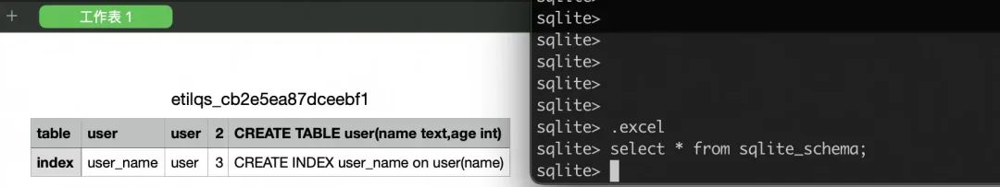
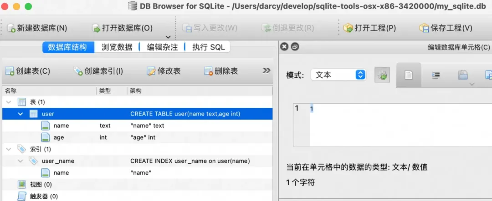

# SQLite

**QLite** 是一个用 C 语言编写的开源、轻量级、快速、独立且高可靠性的 SQL 数据库引擎，它提供了功能齐全的数据库解决方案。SQLite 几乎可以在所有的手机和计算机上运行，它被嵌入到无数人每天都在使用的众多应用程序中。

此外，SQLite 还具有稳定的文件格式、跨平台能力和向后兼容性等特点。SQLite 的开发者承诺，至少在 2050 年之前保持该文件格式不变。

SQLite文件格式是稳定的，跨平台的， 向后兼容，开发人员承诺保持它 一直持续到2050年。SQLite是免费的， 每个人都可以用于任何目的。

特征

- 与SQLServer 或 Oracle等其他数据库管理系统相比，SQLite 非常轻量级（小于500Kb）
- SQLite不是客户端-服务器数据库管理系统。它是一个可以直接调用和使用的内存库。无需安装，无需配置。
- 典型的SQLite数据库包含在计算机磁盘存储上的单个文件中，所有数据库对象（表、视图、触发器等）都包含在该文件中。无需专用服务器。

Django开发常常使用sqlite。

## SQLite 安装

在 SQLite 官方页面：https://sqlite.org/download.html 下载适合你目标系统的压缩包。

下载并解压后，无论是在 Windows、Linux 还是 Mac OS 系统上，你都可以得到一个 `sqlite3` 命令行工具。

以下是在 Mac OS 上解压后得到的命令行工具示例：

```
➜  sqlite-tools-osx-x64-3450100 ls -l
total 14952
-rwxr-xr-x@ 1 darcy  staff  1907136  1 31 00:27 sqldiff
-rwxr-xr-x@ 1 darcy  staff  2263792  1 31 00:25 sqlite3
-rwxr-xr-x@ 1 darcy  staff  3478872  1 31 00:27 sqlite3_analyzer
```

## SQLite 使用场景

SQLite 与客户端/服务器类型的 SQL 数据库引擎（例如 MySQL、Oracle、PostgreSQL 或 SQL Server）不同，它们解决的问题也不同。

服务器端的 SQL 数据库引擎旨在实现企业级数据的共享存储，它们强调的是**可扩展性、并发性、集中化和控制性**。相比之下，SQLite 通常用于为个人应用程序和设备提供本地数据存储，它强调的是**经济、高效、可靠、独立和简单**。

**SQLite 的使用场景：**

1. 嵌入式设备和物联网 SQLite 不需要额外的管理或服务启动，非常适合用在手机、电视、机顶盒、游戏机、相机、手表等智能设备上。
2. 网站多数低流量网站可以使用 SQLite 作为数据库。根据官方网站的介绍，通常每天访问量少于 10 万次的网站都可以很好地运行 SQLite。SQLite 的官方网站（https://www.sqlite.org/）自身就使用 SQLite 作为数据库引擎，每天处理大约 50 万 HTTP 请求，其中约 15-20% 的请求涉及数据库查询
3. 数据分析 SQLite3 命令行工具能方便地与 CSV 和 Excel 文件进行交互操作，适合分析大数据集。同时，许多语言（如 Python）都内置了 SQLite 支持，可以轻松编写脚本进行数据操作。
4. 缓存 SQLite 可以作为应用服务的缓存，减轻对中心数据库的压力。
5. 内存或者临时数据库得益于 SQLite 的简单快速，非常使用程序演示或者日常测试。

**SQLite 不适合的场景包括**：

1. **需要通过网络访问数据库**的情况。SQLite 是一个本地文件数据库，没有提供远程访问功能。
2. **要求高可用性和可扩展性**的场合。SQLite 简单易用，但不可扩展。
3. **数据量极大**时。尽管 SQLite 数据库大小的限制高达 281 TB，但所有数据都必须存储在单个磁盘上。
4. **写入操作高并发**时。SQLite 在任何时刻只允许一个写入操作执行，其他写入操作需要排队。

## SQLite3 命令操作

SQLite 提供了 `sqlite3`（在 windows 为 sqlite3.exe）命令行工具，通过该工具可以执行 SQLite 数据库操作和 SQL 语句。

直接在命令提示符下执行 `./sqlite3` 启动 sqlite3 程序，然后可以通过输入 `.help` 查看帮助指南，或者输入 `.help 关键词` 获取特定关键词的帮助信息。

部分命令列表如下：

```
sqlite> .help
.databases               List names and files of attached databases
.dbconfig ?op? ?val?     List or change sqlite3_db_config() options
.dbinfo ?DB?             Show status information about the database
.excel                   Display the output of next command in spreadsheet
.exit ?CODE?             Exit this program with return-code CODE
.expert                  EXPERIMENTAL. Suggest indexes for queries
.explain ?on|off|auto?   Change the EXPLAIN formatting mode.  Default: auto
.help ?-all? ?PATTERN?   Show help text for PATTERN
.hex-rekey OLD NEW NEW   Change the encryption key using hexadecimal
.indexes ?TABLE?         Show names of indexes
.mode MODE ?OPTIONS?     Set output mode
.open ?OPTIONS? ?FILE?   Close existing database and reopen FILE
.output ?FILE?           Send output to FILE or stdout if FILE is omitted
.quit                    Exit this program
.read FILE               Read input from FILE or command output
.schema ?PATTERN?        Show the CREATE statements matching PATTERN
.show                    Show the current values for various settings
.tables ?TABLE?          List names of tables matching LIKE pattern TABLE
.......
```

可以使用`.help`命令查看命令及功能，所有命令及其描述如下表：

| 命令                     | 中文描述                                                                                                                                                                                                                                                               | 英文描述                                           |
| ------------------------ | ---------------------------------------------------------------------------------------------------------------------------------------------------------------------------------------------------------------------------------------------------------------------- | -------------------------------------------------- |
| .archive ...             | 管理 SQL 归档                                                                                                                                                                                                                                                          | Manage SQL archives                                |
| .auth ON\|OFF            | 显示授权人回调                                                                                                                                                                                                                                                         | Show authorizer callbacks                          |
| .backup ?DB? FILE        | 备份 DB 数据库[1]（默认是 "main"）到 FILE 文件                                                                                                                                                                                                                         | Backup DB (default "main") to FILE                 |
| .bail on\|off            | 发生错误后停止。默认为 OFF                                                                                                                                                                                                                                             | Stop after hitting an error. Default OFF           |
| .cd DIRECTORY            | 将工作目录更改为 directory                                                                                                                                                                                                                                             | Change the working directory to DIRECTORY          |
| .changes on\|off         | 显示 SQL 更改的行数                                                                                                                                                                                                                                                    | Show number of rows changed by SQL                 |
| .check GLOB              | 如果.testcase 之后的输出不匹配，则失败                                                                                                                                                                                                                                 | Fail if output since .testcase does not match      |
| .clone NEWDB             | 从现有数据库中将数据克隆到 NEWDB                                                                                                                                                                                                                                       | Clone data into NEWDB from the existing database   |
| .connection [close] [#]  | 打开或关闭备用数据库连接                                                                                                                                                                                                                                               | Open or close an auxiliary database connection     |
| .crnl on\|off            | 将\n 翻译为\r\n\。默认 ON                                                                                                                                                                                                                                              | Translate \n to \r\n. Default ON                   |
| .databases               | 列出附加数据库的名称和文件                                                                                                                                                                                                                                             | List names and files of attached databases         |
| .dbconfig ?op? ?val?     | 列出或更改 sqlite3_db_config()选项                                                                                                                                                                                                                                     | List or change sqlite3_db_config() options         |
| .dbinfo ?DB?             | 显示有关数据库的状态信息                                                                                                                                                                                                                                               | Show status information about the database         |
| .dump ?OBJECTS?          | 以 SQL 文本格式转储数据库。 如果指定了 TABLE 表，则只转储匹配 LIKE 模式的 TABLE 表                                                                                                                                                                                     | Render database content as SQL                     |
| .echo on\|off            | 开启或关闭 echo 命令                                                                                                                                                                                                                                                   | Turn command echo on or off                        |
| .eqp on\|off\|full\|...  | 开启或关闭适合于 EXPLAIN 的输出模式。 如果没有带参数，则为 EXPLAIN on，及开启 EXPLAIN                                                                                                                                                                                  | Enable or disable automatic EXPLAIN QUERY PLAN     |
| .excel                   | 在电子表格中显示下一个命令的输出                                                                                                                                                                                                                                       | Display the output of next command in spreadsheet  |
| .exit ?CODE?             | 使用返回码 CODE 退出 SQLite 提示符                                                                                                                                                                                                                                     | Exit this program with return-code CODE            |
| .expert                  | 实验性的。建议查询索引                                                                                                                                                                                                                                                 | EXPERIMENTAL. Suggest indexes for queries          |
| .explain ?on\|off\|auto? | 更改 EXPLAIN 格式输出模式。默认值：auto                                                                                                                                                                                                                                | Change the EXPLAIN formatting mode. Default: auto  |
| .filectrl CMD ...        | 运行各种 sqlite3_file_control()操作                                                                                                                                                                                                                                    | Run various sqlite3_file_control() operations      |
| .fullschema ?--indent?   | 显示 sqlite_stat 表的架构和内容                                                                                                                                                                                                                                        | Show schema and the content of sqlite_stat tables  |
| .headers on\|off         | 开启或关闭头部显示                                                                                                                                                                                                                                                     | Turn display of headers on or off                  |
| .help ?-all? ?PATTERN?   | 显示消息                                                                                                                                                                                                                                                               | Show help text for PATTERN                         |
| .import FILE TABLE       | 导入来自 FILE 文件的数据到 TABLE 表中                                                                                                                                                                                                                                  | Import data from FILE into TABLE                   |
| .indexes ?TABLE?         | 显示所有索引的名称。如果指定了 TABLE 表， 则只显示匹配 LIKE 模式的 TABLE 表的索引                                                                                                                                                                                      | Show names of indexes                              |
| .limit ?LIMIT? ?VAL?     | 显示或更改 SQLITE_LMIT 的值                                                                                                                                                                                                                                            | Display or change the value of an SQLITE_LIMIT     |
| .lint OPTIONS            | 报告潜在的架构问题                                                                                                                                                                                                                                                     | Report potential schema issues.                    |
| .load FILE ?ENTRY?       | 加载一个扩展库                                                                                                                                                                                                                                                         | Load an extension library                          |
| .log FILE\|on\|off       | 开启或关闭日志。FILE 文件可以是 stderr(标准错误)/stdout(标准输出)                                                                                                                                                                                                      | Turn logging on or off. FILE can be stderr/stdout  |
| .mode MODE ?OPTIONS?     | 设置输出模式，MODE 可以是下列之一： **csv** 逗号分隔的值 **column** 左对齐的列 **HTML[2]** HTML 的 `<table>` 代码 **insert** TABLE 表的 SQL 插入（insert）语句 **line** 每行一个值 **list** 由 .separator 字符串分隔的值 **tabs** 由 Tab 分隔的值 **tcl** TCL 列表元素 | Set output mode                                    |
| .nonce STRING            | 如果 nonce 匹配，则挂起一个命令的安全模式                                                                                                                                                                                                                              | Suspend safe mode for one command if nonce matches |
| .nullvalue STRING        | 在 NULL 值的地方输出 STRING 字符串                                                                                                                                                                                                                                     | Use STRING in place of NULL values                 |
| .once ?OPTIONS? ?FILE?   | 仅向 FILE 输出下一个 SQL 命令                                                                                                                                                                                                                                          | Output for the next SQL command only to FILE       |
| .open ?OPTIONS? ?FILE?   | 关闭现有数据库并重新打开 FILE                                                                                                                                                                                                                                          | Close existing database and reopen FILE            |
| .output ?FILE?           | 发送输出到 FILENAME 文件                                                                                                                                                                                                                                               | Send output to FILE or stdout if FILE is omitted   |
| .parameter CMD ...       | 管理 SQL 参数绑定                                                                                                                                                                                                                                                      | Manage SQL parameter bindings                      |
| .print STRING...         | 逐字地输出 STRING 字符串                                                                                                                                                                                                                                               | Print literal STRING                               |
| .progress N              | 每 N 个操作码后调用进度处理程序                                                                                                                                                                                                                                        | Invoke progress handler after every N opcodes      |
| .prompt MAIN CONTINUE    | 替换标准提示符                                                                                                                                                                                                                                                         | Replace the standard prompts                       |
| .quit                    | 退出 SQLite 提示符                                                                                                                                                                                                                                                     | Stop interpreting input stream, exit if primary.   |
| .read FILE               | 执行 FILENAME 文件中的 SQL                                                                                                                                                                                                                                             | Read input from FILE or command output             |
| .recover                 | 从损坏的数据库中恢复尽可能多的数据                                                                                                                                                                                                                                     | Recover as much data as possible from corrupt db.  |
| .restore ?DB? FILE       | 从 FILE 恢复 DB（默认“main”）的内容                                                                                                                                                                                                                                    | Restore content of DB (default "main") from FILE   |
| .save ?OPTIONS? FILE     | 将数据库写入 FILE（.backup 的别名）                                                                                                                                                                                                                                    | Write database to FILE (an alias for .backup ...)  |
| .scanstats on\|off\|est  | 打开或关闭 sqlite3_stmt_scanstatus()度量                                                                                                                                                                                                                               | Turn sqlite3_stmt_scanstatus() metrics on or off   |
| .schema ?PATTERN?        | 显示 CREATE 语句。如果指定了 TABLE 表， 则只显示匹配 LIKE 模式的 TABLE 表                                                                                                                                                                                              | Show the CREATE statements matching PATTERN        |
| .separator COL ?ROW?     | 改变输出模式和 .import 所使用的分隔符，更改列和行分隔符                                                                                                                                                                                                                | Change the column and row separators               |
| .session ?NAME? CMD...   | 创建或控制会话                                                                                                                                                                                                                                                         | Create or control sessions                         |
| .sha3sum ...             | 计算数据库内容的 SHA3 哈希                                                                                                                                                                                                                                             | Compute a SHA3 hash of database content            |
| .shell CMD ARGS...       | 运行 CMD ARGS...在系统 shell 中                                                                                                                                                                                                                                        | Run CMD ARGS... in a system shell                  |
| .show                    | 显示各种设置的当前值                                                                                                                                                                                                                                                   | Show the current values for various settings       |
| .stats ?ARG?             | 开启或关闭统计                                                                                                                                                                                                                                                         | Show stats or turn stats on or off                 |
| .system CMD ARGS...      | 运行 CMD ARGS...在系统 shell 中                                                                                                                                                                                                                                        | Run CMD ARGS... in a system shell                  |
| .tables ?TABLE?          | 列出与 LIKE 模式 TABLE 匹配的表的名称                                                                                                                                                                                                                                  | List names of tables matching LIKE pattern TABLE   |
| .timeout MS              | 尝试打开锁定的表 MS 毫秒                                                                                                                                                                                                                                               | Try opening locked tables for MS milliseconds      |
| .timer on\|off           | 打开或关闭 SQL 计时器                                                                                                                                                                                                                                                  | Turn SQL timer on or off                           |
| .trace ?OPTIONS?         | 在运行时输出每个 SQL 语句                                                                                                                                                                                                                                              | Output each SQL statement as it is run             |
| .version                 | 显示源代码、库和编译器版本                                                                                                                                                                                                                                             | Show source, library and compiler versions         |
| .vfsinfo ?AUX?           | 关于顶级 VFS 的信息                                                                                                                                                                                                                                                    | Information about the top-level VFS                |
| .vfslist                 | 列出所有可用的 VFSE                                                                                                                                                                                                                                                    | List all available VFSes                           |
| .vfsname ?AUX?           | 打印 VFS 堆栈的名称                                                                                                                                                                                                                                                    | Print the name of the VFS stack                    |
| .width NUM1 NUM2 ...     | 设置列输出的最小列宽                                                                                                                                                                                                                                                   | Set minimum column widths for columnar output      |

sqlite3 只是读取输入行信息，然后传递给 SQLite 库来执行，SQL 语句都要以分号 `;` 结尾才会开始执行，因此你可以自由的分行输入。

在 sqlite3 中，SQL 语句需以分号 `;` 结尾才会执行，允许跨行输入。特殊的点命令（如 `.help` 和 `.tables`）以小数点 `.` 开头，**不需要分号**。

## SQLite 新建数据库

直接执行 `sqlite3 filename` 打开或创建一个 SQLite 数据库。如果文件不存在，SQLite 会自动创建它。

示例：打开或创建名为 `my_sqlite.db` 的 SQLite 数据库文件。

```
$ sqlite3 my_sqlite.db
SQLite version 3.39.5 2022-10-14 20:58:05
Enter ".help" for usage hints.
sqlite>
```

也可以首先创建一个空白文件，然后使用 `sqlite3` 命令打开它。接下来使用 `CREATE TABLE` 命令创建一个名为 `user` 的表，用 `.tables` 命令查看现有表格，使用 `.exit` 退出 sqlite3 工具。

```
$ touch test.db
$ sqlite3 test.db
SQLite version 3.39.5 2022-10-14 20:58:05
Enter ".help" for usage hints.
sqlite> create table user(name text,age int);
sqlite> .tables
user
sqlite>
```

## SQLite 查看当前数据库

使用点命令 `.databases` 查看当前打开的数据库。

```
sqlite> .databases
main: /Users/darcy/develop/sqlite-tools-osx-x86-3420000/my_sqlite.db r/w
sqlite>
```

## SQLite 增删改查

SQLite 几乎完全兼容常见的 SQL 语句规范，因此可以直接编写和执行标准的 SQL 语句。

创建表：

```
sqlite> create table user(name text,age int);
sqlite>
```

插入数据：

```
sqlite> insert into user values('aLang',20);
sqlite> insert into user values('Darcy',30);
sqlite> insert into user values('XiaoMing',40);
```

查询数据：

```
sqlite> select * from user;
aLang|20
Darcy|30
XiaoMing|40
```

添加索引，为 user 表的 name 创建名为 user_name 的索引：

```
sqlite> create index user_name on user(name);
```

## SQLite 更改输出格式

在查询数据时，SQLite 默认使用 `|` 分割每列数据，这可能不便于阅读。实际上，sqlite3 工具支持多种输出格式，默认为 `list` 模式。

以下是可用的输出格式：ascii、**box**、csv、**column**、html、insert、**json**、line、list、markdown、quote、**table**。

可以使用 `.mode` 命令更改输出格式。

Box 格式：

```
sqlite> .mode box
sqlite> select * from user;
┌──────────┬─────┐
│   name   │ age │
├──────────┼─────┤
│ aLang    │ 20  │
│ Darcy    │ 30  │
│ XiaoMing │ 40  │
└──────────┴─────┘
```

json 格式：

```
sqlite> .mode json
sqlite> select * from user;
[{"name":"aLang","age":20},
{"name":"Darcy","age":30},
{"name":"XiaoMing","age":40}]
```

column 格式：

```
sqlite> .mode column
sqlite> select * from user;
name      age
--------  ---
aLang     20
Darcy     30
XiaoMing  40
```

table 格式：

```
sqlite> .mode table
sqlite> select * from user;
+----------+-----+
|   name   | age |
+----------+-----+
| aLang    | 20  |
| Darcy    | 30  |
| XiaoMing | 40  |
+----------+-----+
sqlite>
```

## 查询 Schema

sqlite3 工具提供了几个方便的命令，可用于查看数据库的 schema ，这些命令纯粹作为快捷方式提供。

例如，`.table` 查看数据库中的所有表：

```
sqlite> .table
user
```

点命令 `.table` 相当于下面的查询语句。

```
sqlite> SELECT name FROM sqlite_schema
   ...> WHERE type IN ('table','view') AND name NOT LIKE 'sqlite_%'
   ...> ;
user
```

`sqlite_master` 是 SQLite 中的一个特殊表，其中包含了数据库的 schema 信息。你可以查询这个表以获取表的创建语句和索引信息。

```
sqlite> .mode table
sqlite> select * from sqlite_schema;
+-------+-----------+----------+----------+--------------------------------------+
| type  |   name    | tbl_name | rootpage |                 sql                  |
+-------+-----------+----------+----------+--------------------------------------+
| table | user      | user     | 2        | CREATE TABLE user(name text,age int) |
| index | user_name | user     | 3        | CREATE INDEX user_name on user(name) |
+-------+-----------+----------+----------+--------------------------------------+
```

使用 `.indexes` 查看索引，使用 `.schema` 查看 schema 详情。

```
sqlite> .indexes
user_name

sqlite> .schema
CREATE TABLE user(name text,age int);
CREATE INDEX user_name on user(name);
```

## 结果写出到文件

使用 `.output filename` 命令将查询结果写入指定文件。

下面是一个示例，先使用 `.mode json` 更改输出为 JSON 格式，然后在查询表写出到 `sql_result.json`。

```
sqlite> .output sql_result.json
sqlite> .mode json
sqlite> select * from user;
sqlite> .exit

$ cat sql_result.json
[{"name":"aLang","age":20},
{"name":"Darcy","age":30},
{"name":"XiaoMing","age":40}]
```

**写出并打开 EXCEL **

使用 `.excel` 会让下一个查询语句输出到 Excel 中。

```
sqlite> .excel
sqlite> select * from sqlite_schema;
```



结果写出到文件

```
sqlite> .output sql_result.txt
sqlite> select * from sqlite_schema;
sqlite> select * from user;
```

## 读取运行 SQL 脚本

使用 `.read` 可以读取指定文件中的 SQL 语句并运行，这在需要批量执行 SQL 脚本的场景中非常有用。

创建 SQL 文件：

```
$ echo "select * from user" > sql_query.sql
$ cat sql_query.sql
select * from user

$ ./sqlite3 my_sqlite.db
SQLite version 3.42.0 2023-05-16 12:36:15
Enter ".help" for usage hints.

sqlite> .mode table
sqlite> .read sql_query.sql
+----------+-----+
|   name   | age |
+----------+-----+
| aLang    | 20  |
| Darcy    | 30  |
| XiaoMing | 40  |
+----------+-----+
sqlite>
```

## SQLite 备份与恢复

在涉及数据库操作时，备份和恢复是至关重要的步骤，它们用于防止数据丢失并确保数据的持续性。SQLite 提供了简单的方法来备份和恢复你的数据库。

在 SQLite 中可以通过导出整个数据库为一个 SQL 脚本来备份数据库。此功能使用 `.dump` 命令实现。

```
$ ./sqlite3 my_sqlite.db
SQLite version 3.42.0 2023-05-16 12:36:15
Enter ".help" for usage hints.
sqlite> .output backup.sql
sqlite> .dump
sqlite> .exit

$ cat backup.sql
PRAGMA foreign_keys=OFF;
BEGIN TRANSACTION;
CREATE TABLE user(name text,age int);
INSERT INTO user VALUES('aLang',20);
INSERT INTO user VALUES('Darcy',30);
INSERT INTO user VALUES('XiaoMing',40);
CREATE INDEX user_name on user(name);
COMMIT;
```

这将导出整个 `my_sqlite.db` 数据库到 `backup.sql` 文件中。此 SQL 文件包含了重建数据库所需的所有 SQL 语句。要恢复数据库，只需在 `sqlite3` 中运行这个脚本。

示例：恢复数据到库 `my_sqlite_2` 中。

```
$ ./sqlite3 my_sqlite_2.db
SQLite version 3.42.0 2023-05-16 12:36:15
Enter ".help" for usage hints.
sqlite> .read backup.sql
sqlite> select * from user;
aLang|20
Darcy|30
XiaoMing|40
```

这将执行 `backup.sql` 文件中的所有 SQL 语句，重建数据库。通过以上的备份与恢复方法，你可以确保你的 SQLite 数据库资料得到可靠的保护，且在需要时能够迅速恢复。

## SQLite 可视化工具

命令行操作总归不太直观，如果你喜欢可视化操作，可以下载 SQLite Database Browser 进行操作。

下载页面：https://sqlitebrowser.org/dl/



## 附录

SQLite 常用函数列表，见名知意不写注释了。

| Function 1          | Function 2           | Function 3                  | Function 4                   |
| ------------------- | -------------------- | --------------------------- | ---------------------------- |
| abs(X)              | changes()            | char(X1,X2,...,XN)          | coalesce(X,Y,...)            |
| concat(X,...)       | concat_ws(SEP,X,...) | format(FORMAT,...)          | glob(X,Y)                    |
| hex(X)              | ifnull(X,Y)          | iif(X,Y,Z)                  | instr(X,Y)                   |
| last_insert_rowid() | length(X)            | like(X,Y)                   | like(X,Y,Z)                  |
| likelihood(X,Y)     | likely(X)            | load_extension(X)           | load_extension(X,Y)          |
| lower(X)            | ltrim(X)             | ltrim(X,Y)                  | max(X,Y,...)                 |
| min(X,Y,...)        | nullif(X,Y)          | octet_length(X)             | printf(FORMAT,...)           |
| quote(X)            | random()             | randomblob(N)               | replace(X,Y,Z)               |
| round(X)            | round(X,Y)           | rtrim(X)                    | rtrim(X,Y)                   |
| sign(X)             | soundex(X)           | sqlite_compileoption_get(N) | sqlite_compileoption_used(X) |
| sqlite_offset(X)    | sqlite_source_id()   | sqlite_version()            | substr(X,Y)                  |
| substr(X,Y,Z)       | substring(X,Y)       | substring(X,Y,Z)            | total_changes()              |
| trim(X)             | trim(X,Y)            |                             |                              |

## 参考

1. SQLite 开源代码：https://www.sqlite.org/cgi/src/dir?ci=trunk
2. SQLite 文件格式介绍：https://sqlite.org/fileformat2.html
3. SQLite 可视化工具：https://sqlitebrowser.org/dl/
4. SQL 函数文档：https://www.sqlite.org/lang_corefunc.html

### 引用链接

`[1]` SQLite 官方页面: *https://sqlite.org/download.html*

## SQLite 局限性

在 SQLite 中，SQL92（一种标准查询）不支持如下特性：

| 特性             | 描述                                                                                                            |
| ---------------- | --------------------------------------------------------------------------------------------------------------- |
| RIGHT OUTER JOIN | 只实现了 LEFT OUTER JOIN                                                                                        |
| FULL OUTER JOIN  | 只实现了 LEFT OUTER JOIN                                                                                        |
| ALTER TABLE      | 支持 RENAME TABLE 和 ALTER TABLE 的 ADD COLUMN variants 命令， 不支持 DROP COLUMN、ALTER COLUMN、ADD CONSTRAINT |
| Trigger 支持     | 支持 FOR EACH ROW 触发器，但不支持 FOR EACH STATEMENT 触发器                                                    |
| VIEWs            | 在 SQLite 中，视图是只读的。您不可以在视图上执行 DELETE、INSERT 或 UPDATE 语句                                  |
| GRANT 和 REVOKE  | 可以应用的唯一的访问权限是底层操作系统的正常文件访问权限                                                        |

## SQLite 命令

与关系数据库进行交互的标准 SQLite 命令类似于 SQL。命令包括 CREATE、SELECT、INSERT、UPDATE、DELETE 和 DROP。这些命令基于它们的操作性质可分为以下几种：

### DDL：数据定义语言

| 命令   | 描述                                                 |
| ------ | ---------------------------------------------------- |
| CREATE | 创建一个新的表，一个表的视图，或者数据库中的其他对象 |
| ALTER  | 修改数据库中的某个已有的数据库对象，比如一个表       |
| DROP   | 删除整个表，或者表的视图，或者数据库中的其他对象     |

### DML：数据操作语言

| 命令   | 描述         |
| ------ | ------------ |
| INSERT | 创建一条记录 |
| UPDATE | 修改记录     |
| DELETE | 删除记录     |

### DQL：数据查询语言

| 命令   | 描述                         |
| ------ | ---------------------------- |
| SELECT | 从一个或多个表中检索某些记录 |

#### 引用链接

`[1]` 数据库: *https://www.dba.cn/*
`[2]` HTML: *https://www.dba.cn/book/html/*

## sqlite100条常用命令

```bash
.open filename - 打开或创建一个SQLite数据库文件
.tables - 列出当前数据库中的表
.schema tablename - 查看指定表的创建语句
.header on|off - 设置是否显示查询结果的列名
.mode csv|column|json - 设置查询结果的显示模式
.import filename tablename - 从文件导入数据到指定表
.quit - 退出sqlite3命令行工具
SELECT column1, column2… FROM table_name WHERE condition - 从表中选择数据
INSERT INTO table_name (column1, column2…) VALUES (value1, value2…) - 插入数据到表
UPDATE table_name SET column1 = value1, column2 = value2… WHERE condition - 更新表中的数据
DELETE FROM table_name WHERE condition - 从表中删除数据
ALTER TABLE table_name ADD column_name datatype - 向表中添加新列
DROP TABLE table_name - 删除表
CREATE INDEX index_name ON table_name (column1, column2…) - 在表中创建索引
PRAGMA table_info(table_name) - 显示表的列信息
PRAGMA database_list - 显示数据库中的表和索引
PRAGMA foreign_key_list(table_name) - 查看表的外键信息
PRAGMA index_list(table_name) - 显示表的索引信息
PRAGMA table_info(table_name) - 显示表的详细信息
.databases - 显示当前连接的所有数据库
.fullschema - 显示数据库的完整模式（包括索引、触发器等）
.backup filename - 备份数据库
.restore filename - 从备份文件中恢复数据库
.mode line - 设置查询结果的显示模式为每行一条记录
.mode list - 设置查询结果的显示模式为键值对形式
.explain - 显示查询计划
.timeout milliseconds - 设置查询超时时间
.echo on|off - 设置是否显示命令
.auth ON|OFF|username|password - 启用/禁用/更改访问控制
.nullvalue text - 设置显示空值的文本
.width num1 num2 … - 设置每列的宽度
.separator string - 设置导出文件的分隔符
.save filename - 保存输出结果到文件
.output filename - 重定向输出到文件
.read filename - 读取并执行SQL语句文件
.timer on|off - 设置是否显示查询时间
.shell cmd - 运行操作系统命令
.help - 显示帮助信息
.version - 显示SQLite版本信息
.selftest - 运行自检测试
.clone new_database - 克隆当前数据库到新的数据库
.mode insert table_name - 以INSERT语句模式导出结果
.clone :memory: - 将内存数据库克隆到文件数据库
.archive - 将当前数据库归档
.recover database - 修复损坏的数据库
.changequote ON|off|string - 更改标识符的引号字符
.analyze - 分析数据库以优化查询性能
.randomblob numbytes - 生成指定大小的随机二进制数据
.changes - 显示上一条命令影响的行数
.lint OPTIONS - 执行语法检查
.stats ON|off - 启用/禁用语句执行统计
.once filename - 将输出结果保存到文件（仅一次）
.print cmd - 打印输出结果
.batch filename - 运行批处理SQL文件
.open :memory: - 打开一个新的内存数据库
.exit - 退出sqlite3命令行工具
.check GLOB | REGEXP | LIKE - 执行数据完整性检查
.clone :memory: :memory: - 复制内存数据库
.dump - 以文本形式导出数据库
.show - 显示当前配置参数
.shell cmd args… - 使用shell运行操作系统命令
.reindex - 重新建立所有索引
.allnulls on|off - 设置是否考虑空值进行比较
.dbconfig config - 设置数据库配置参数
.exit - 退出sqlite3命令行工具
.clone new_database - 将当前数据库克隆到新的数据库
.dbinfo - 显示数据库信息
.lint cmd - 执行语法检查
.last_insert_rowid - 显示最后插入的行ID
.load filename sym - 加载扩展
.nullvalue text - 设置NULL值的表示文本
.read filename - 读取并执行SQL命令文件
.timeout ms - 设置命令运行的超时时间
.trace cmd - 执行跟踪命令
.vfsinfo ?DATABASE? - 显示或配置虚拟文件系统
.recover - 修复损坏的数据库
.vfslist ?PATTERN? - 显示可用的虚拟文件系统
.vfsname ?AUX? - 显示当前的虚拟文件系统名称
.vfsregister NAME SCRIPT - 注册自定义的虚拟文件系统
.vfsunregister NAME - 取消注册虚拟文件系统
.vdbecomment ON|off - 设置是否在生成代码时加注释
.vdbeinfo ?NEW|schema|execute? - 显示虚拟数据库引擎信息
.vdbe_trace on|off - 设置是否跟踪虚拟数据库引擎
.header on|off - 设置是否显示查询结果的列名
.mode line|column|… - 设置结果的显示模式
.output filename - 重定向输出到文件
.print - 打印输出
BEGIN [DEFERRED|IMMEDIATE|EXCLUSIVE] - 开始一个事务
COMMIT - 提交事务
ROLLBACK - 回滚事务
SAVEPOINT name - 设置保存点
RELEASE name - 释放保存点
ROLLBACK TO name - 回滚到保存点
TRANSACTION [READ UNCOMMITTED|READ COMMITTED|SERIALIZABLE|ISOLATION LEVEL …] - 设置事务隔离级别
PRAGMA encoding = “UTF-8” - 设置数据库编码
PRAGMA foreign_keys = ON|off - 启用/禁用外键约束
PRAGMA journal_mode = DELETE|TRUNCATE|PERSIST|MEMORY|WAL|OFF - 设置日志模式
PRAGMA synchronous = OFF|NORMAL|FULL - 设置同步模式
PRAGMA temp_store = DEFAULT|FILE|MEMORY - 设置临时存储方式
PRAGMA cache_size = 1000 - 设置缓存大小
```

参考资料

```
sqlite官网：https://www.sqlite.org/
辅助工具：https://sqlitestudio.pl/
```
