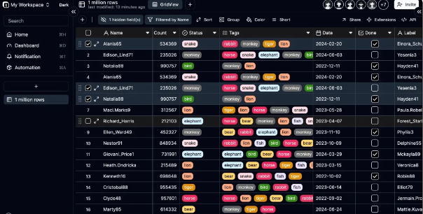
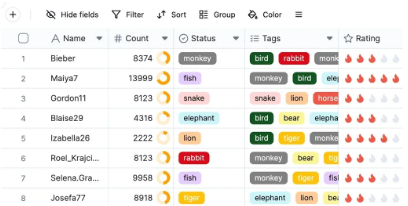
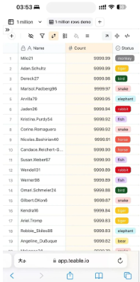
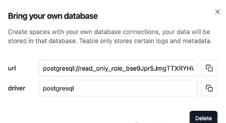
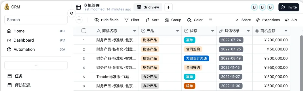
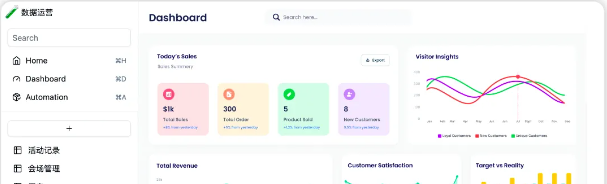
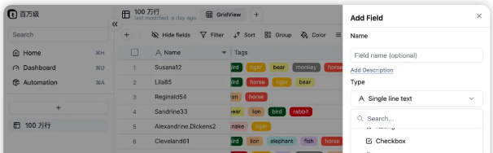

# 常用数据库

https://learnsql.com/blog/most-popular-databases-2022/

[2024 年最受欢迎的数据库 - GeeksforGeeks](https://www.geeksforgeeks.org/most-popular-databases/#)

[8种流行数据库的优缺点 - KeyCDN](https://www.keycdn.com/blog/popular-databases)

常用的数据库有很多种，每种都有其特定的用途和优势。以下是一些目前市场上最受欢迎的数据库：

1. **Oracle**：Oracle数据库是企业级应用广泛使用的数据库，支持大型事务处理、数据仓库和分布式计算
2. **MySQL**：MySQL是最知名且广泛使用的开源关系型数据库。它适用于Web应用程序和中小型数据库解决方案。MySQL具有良好的性能和广泛的社区支持。
3. **Microsoft SQL Server**：这是微软开发的数据库系统，适用于企业环境，支持大量数据处理和复杂查询。
4. **PostgreSQL**：PostgreSQL是一个功能强大的开源对象关系型数据库系统，具有超过35年的活跃开发历史。它以其可靠性、功能齐全性和性能而闻名。您可以通过官方文档了解如何安装和使用PostgreSQL，还可以参与社区活动来深入了解它。
5. **MongoDB**：MongoDB是一个流行的开源NoSQL数据库，适用于处理大规模的文档和非结构化数据。它具有灵活的数据模型和强大的查询功能。
6. **MariaDB**：MariaDB是MySQL的一个分支，旨在为用户提供一个社区驱动的MySQL替代方案。它保持与MySQL的向后兼容性，并提供了一些改进和新功能。
7. **SQLite**：SQLite是一个嵌入式数据库引擎，适用于轻量级应用程序和移动设备。它是一个零配置、服务器无关、事务性的SQL数据库引擎。
8. **IBM DB2**：IBM DB2是一个企业级数据库系统，适用于事务处理、分析和数据仓库。
9. **Redis**：Redis是一个开源的内存数据结构存储系统，用作数据库、缓存和消息代理。它支持多种数据结构，如字符串、哈希、列表、集合和有序集合。
10. **CockroachDB**：一个分布式SQL数据库，设计用于云应用，支持事务性数据操作。
11. **Neo4j**：一个图形数据库，专注于存储和查询与图形和网络相关的数据。
12. **JanusGraph**：一个可扩展的图形数据库，用于存储和查询大型图形数据集。
13. **Cassandra**：一个高性能的分布式NoSQL数据库，适用于处理大量数据。
14. **Hadoop**：不仅是一个大数据框架，也包含了Hadoop数据库，用于存储和处理大规模数据集。
15. **etcd**：一个分布式键值存储，用于配置共享和服务发现。
16. **Elasticsearch**：一个搜索引擎，基于Lucene构建，提供全文搜索功能。
17. **Prometheus**：一个监控和警报工具，其数据库用于存储时间序列数据。
18. **Couchbase**：一个NoSQL文档数据库，提供易于扩展的架构。
19. **Jackrabbit**：一个内容库，实现了内容存储和检索的多种功能。
20. **teable**：✨ 下一代 Airtable 替代方案：无代码 Postgres
    1. Teable 是一个基于 Postgres 构建的超快速、实时、专业、开发人员友好的无代码数据库。它使用简单的、类似电子表格的界面来创建复杂的企业级数据库应用程序。通过无代码解锁高效的应用程序开发，摆脱数据安全性和可扩展性的障碍。
    2. GitHub：https://github.com/teableio/teable
    3. 中文官网：http://www.teable.cn/
    4. 英文官网：https://teable.io/


这些数据库各有千秋，选择哪个数据库取决于具体需求，例如数据模型、性能要求、可扩展性和预算等因素。

## teable：✨ 下一代 Airtable 替代方案：无代码 Postgres

在当今数字化时代企业中，无论财务规划和预算管理，还是市场营销、人力资源等其他领域，都需要进行大量的数据汇总、管理、分享等操作。从数据安全、存储、还有管理等角度，采用数据库进行管理是最好的方案。然而，数据库的操作需要一定的数据库技术背景和能力，在一个企业中也不是所有人都具备数据库操作的能力。

这种情况下，简单、易用、易分享的电子表格就成为了很多企业的首选工具之一，通过电子表格用户可以很轻松创建、编辑和管理数据，支持用户对数据进行多种方式排列，分析和汇总等。然而，传统的电子表格工具，如 Excel 虽然功能强大，但在处理大量数据和复杂关系时可能会显得力不从心。这个时候就需要一种能够将电子表格的简单易用与数据库的强大功能完美结合的工具，所以今天给大家推荐的就是一款可在线协作的表格式数据库-Teable

### Teable 介绍 

一句话介绍Teable：一款高性能的大数据无代码平台，使用人员无需编码，即可用类似电子表格的界面来创建复杂的企业级数据库应用程序，具备数据安全和可扩展性。



**🏠 项目信息**

```
# github地址
https://github.com/teableio/teable
# 中文官网
http://www.teable.cn/
# 英文官网
https://teable.io/
```

### 🚀功能特性

表格式交互，极易上手：敏捷轻快的表格式界面，不需要掌握编程技能即可以轻松上手。让团队中任何成员都可以实现自己需要的业务系统。节省海量沟通成本和人力成本。



卓越性能，秒级响应：视图直接构建在物理关系数据库之上，无性能损耗，无数据行数限制，轻松应对数据增长。



**数据安全：**支持使用外部数据库存储，数据可自行托管，享受云端便利的同时，掌控数据所有权。



**超强扩展能力：**基于数据库 PostgreSQL，可无缝接入PostgreSQL 数据库生态工具链。BI 工具、低代码工具、 ETL 工具自由流转互通，轻松扩展。

###  Teable 安装 

Docker-Compose 安装

```
# 创建数据目录
mkdir -p /teable

# 获取Docker Compose并且解压
curl -O https://sss.teable.cn/dev-ops/templates/docker-compose.tar.gz
tar -xvzf docker-compose.tar.gz -C /teable

# 根据需要修改.env
# 详细的环境变量说明参考：https://help.teable.cn/si-you-hua-bu-shu/huan-jing-bian-liang
cd /teable/docker-compose
cat .env
# 配置好.env后，运行以下命令启动程序
docker-compose up -d
```

#### 访问应用

端口默认为80，通过http://<IP_ADDRESS>访问Teable界面

###  Teable 使用场景 

#### CRM 客户关系管理

使用功能强大、灵活的字段为每个企业创建理想的CRM客户管理系统。



#### 活动运营分析

借助强大的仪表盘和批量数据编辑能力，进行活动运营数据维护和指标分析。



#### CMS内容管理

作为 CMS 数据源接入任何第三方。强大的性能、无需担心容量上限，同时有用可视化管理手段。



### Teable 模板市场 

为了方便快用户快速搭建和使用，Teable提供了模板市场，可以直接导入在线的Teable环境进行使用。

```
# 模板市场连接
https://template.teable.io/
```

### 最后 

电子表格不会消失，而是以更灵活、更便捷的方式融入我们的生活、工作中，电子表格将会更加注重动态和交互性。借助AIGC，未来的数据管理加简单和智能化（Teable也有这块的规划）。

