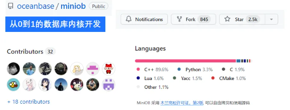

# 数据库内核实现

## 从0到1的数据库内核项目

  **项目地址**：https://github.com/oceanbase/miniob.git

还在为看不下去数据库原理而苦恼？如果说以前是你不知道，那么现在就跟着大佬一起手搓一个数据库内核吧！

   MiniOB 是 OceanBase 团队基于华中科技大学数据库课程原型，联合多所高校重新开发的、专为零基础的同学设计的数据库入门学习项目。目标是为在校学生、数据库从业者、爱好者或对基础技术感兴趣的人提供一个友好的数据库学习项目。

  MiniOB 整体代码简洁，容易上手，设计了一系列由浅入深的题目，帮助同学们从零基础入门，迅速了解数据库并深入学习数据库内核。MiniOB 简化了许多模块，例如不考虑并发操作、安全特性和复杂的事务管理等功能，以便更好地学习数据库实现原理。期望通过 MiniOB 的训练，同学们能够熟练掌握数据库内核模块的功能和协同关系，并具备一定的工程编码能力，例如内存管理、网络通信和磁盘 I/O 处理等， 这将有助于同学在未来的面试和工作中脱颖而出。

**MiniOB结构**

作为一个具有“基本”功能的数据库，包含了需要的基本功能模块。包括：

- - **网络模块**：负责与客户端交互，收发客户端请求与应答；
  - **SQL解析**：将用户输入的SQL语句解析成语法树；
  - **执行计划缓存**：执行计划缓存模块会将该 SQL第一次生成的执行计划缓存在内存中，后续的执行可以反复执行这个计划，避免了重复查询优化的过程（未实现）。
  - **语义解析模块**：将生成的语法树，转换成数据库内部数据结构（部分实现）；
  - **查询缓存**：将执行的查询结果缓存在内存中，下次查询时，可以直接返回（未实现）；
  - **查询优化**：根据一定规则和统计数据，调整/重写语法树。当前实现为空，留作实验题目；
  - **计划执行**：根据语法树描述，执行并生成结果；
  - **会话管理**：管理用户连接、调整某个连接的参数；
  - **元数据管理**：记录当前的数据库、表、字段和索引元数据信息；
  - **客户端**：作为测试工具，接收用户请求，向服务端发起请求。

