# 数据库工具

## 数据库ER图工具

现有的数据库客户端设计数据库不顺手，或者想要一张高规格的数据库结构图的话，可以试试下面这两个在线工具，至少我感觉比 Navicat 体验上要好一些。

## Diagrams

一个在线通过图表结构化设计数据库结构的网站。

在线地址：https://drawdb.vercel.app/editor

添加数据库表后直接在画布上显示表结构，非常直观，设计了几张表，还差几张表一眼就能看出来，不用在脑子里费劲巴拉的记了。

可以简单拖拽提现表之间的关系，关联关系一目了然。直接导出图片就可以作为数据库结构图使用了，放到设计文档中逼格满满。

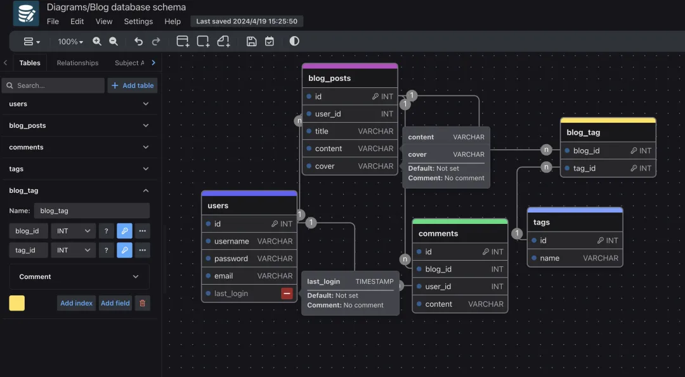

可以直接导出为MySQL、PostgreSQL、SQLite、MariaDB、MSSQL 的 DDL 格式，之后直接导入到对应的数据库中即可。

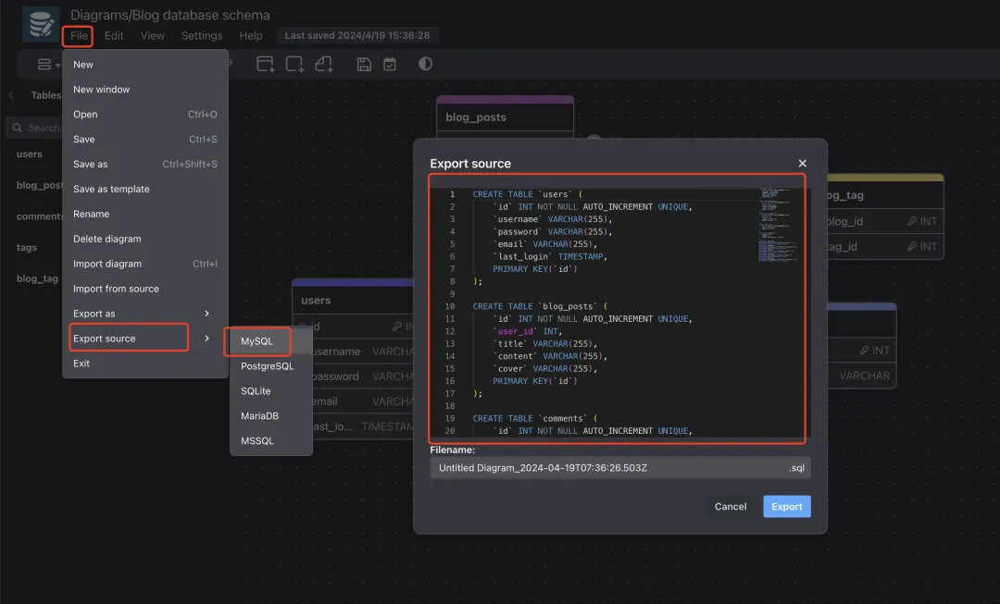

另外，也可以直接将已有的数据库结构导入，显示对应的结构图。

## dbDiagram

又一个在线图形化数据库设计工具。

在线地址：https://dbdiagram.io/

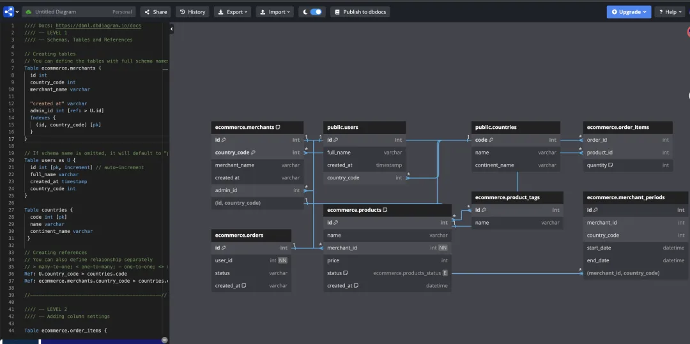

### 通过 Schemas 格式设计数据库

如果你不喜欢像 Navicat 那样，在设计表结构的时候一行行的加字段、选类型的话，可以试试这种 Schemas 格式，直接在左侧像写代码一样创建表结构，右侧就会出现对应的图形化显示。毕竟有的人就是喜欢 Markdown 写东西，有的人就喜欢通过富文本框。

当然了，如果你直接手写 DDL ，那当然是 「Respect」了！

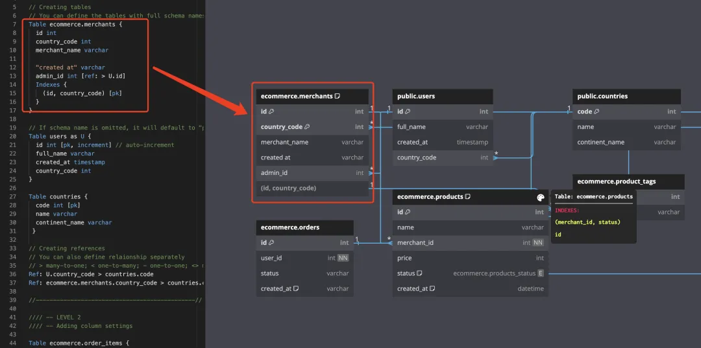

也可以通过下面这样的语法设置表字段之间的关联关系。

```
Ref: U.country_code > countries.code  
Ref: ecommerce.merchants.country_code > countries.code
```

### 生成数据库结构图

如果单纯是为了生成一张漂亮的数据库结构图，也可以直接将 DDL 导入。

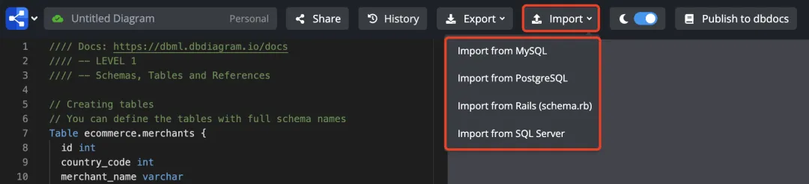

导出你想要的图片格式，然后塞到文档里。

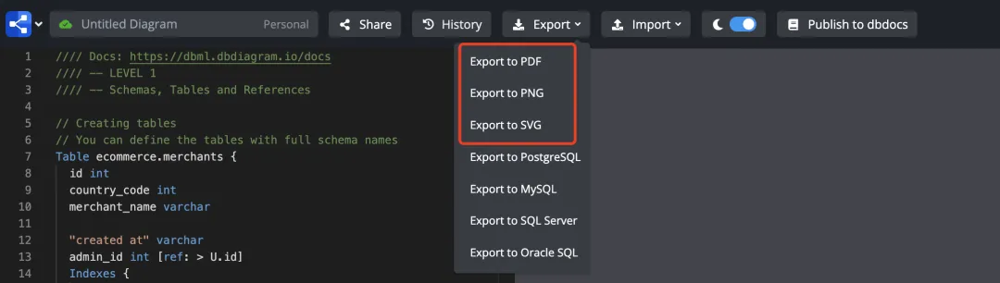

## Drawdb：在线数据库设计工具

GitHub：[drawdb-io/drawdb：免费、简单、直观的在线数据库设计工具和 SQL 生成器。 (github.com)](https://github.com/drawdb-io/drawdb)

官网：[drawdb.vercel.app](https://drawdb.vercel.app/)

免费、简单、直观的在线数据库设计工具和 SQL 生成器。

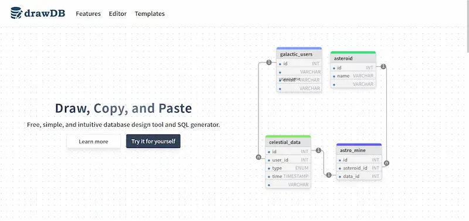

## Chat2DB：人工智能驱动的数据管理平台 超过 100 万开发者正在使用 Chat2DB

GitHub：https://github.com/chat2db/Chat2DB

官网：http://chat2db.ai/

## DbGate：功能强大的多连接数据库管理工具

**开源地址**：https://github.com/dbgate/dbgate

DBGate 是一个强大且易于使用的开源数据库管理工具，它提供了一个统一的Web界面，让你能够轻松地访问和管理多种类型的数据库。无论你是开发者、数据分析师还是DBA，DBGate都能帮助你提升工作效率，简化日常数据库操作。

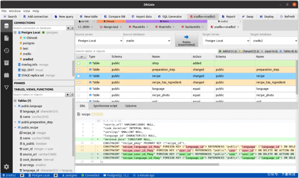

### DbGate简介

  DbGate 是跨平台的数据库管理器。支持 MySQL、PostgreSQL、SQL Server、MongoDB、SQLite 等的数据库管理器。能够在 Windows、Linux、Mac 下运行或作为 Web 应用程序运行。DbGate 的设计简单易用且高效。但也有许多高级功能，如模式比较、可视化查询设计器、图表可视化或批量导出和导入。


  DbGate是一款高度兼容多平台环境的数据库管理系统，专为满足对MySQL、PostgreSQL、SQL Server、MongoDB及SQLite等主流数据库的高效管控需求而设计。该系统不仅能够在Windows、Linux、Mac等主流操作系统上实现本地部署与运行，同时还支持以Web应用程序的形式无缝嵌入各类浏览器环境，实现跨平台、跨设备的灵活访问与操作。

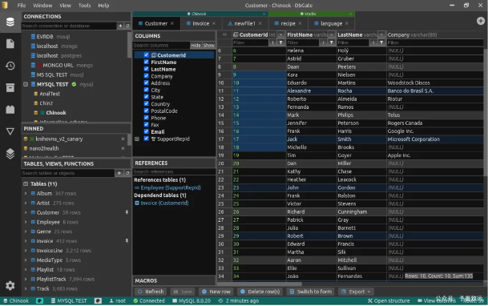

### DbGate特性

- 表格数据编辑，带有SQL更改脚本预览：支持对表格数据进行编辑，并提供SQL更改脚本的预览功能。
- 编辑表格架构、索引、主键和外键：允许用户编辑表格的结构、索引以及定义主键和外键。
- ER图：提供实体关系（ER）图，用于可视化数据库表格之间的关系。
- 浅色和深色主题：提供明亮和深色两种主题，以满足用户的个性化需求。
- 主/详细视图、外键查找：支持主/详细视图，以及外键查找功能。
- 查询设计器：提供查询设计器，使用户能够轻松设计查询。
- 表单视图：针对包含许多列的表格，提供表单视图以方便操作。
- MongoDB集合的JSON视图：支持对MongoDB集合的JSON视图。
- 浏览表格、视图、存储过程、函数、MongoDB集合：提供对数据库各种对象的浏览功能。
- SQL编辑器：包含SQL编辑器，支持执行SQL脚本。
- SQL代码格式化、代码补全：提供SQL代码格式化和代码补全功能。
- 添加SQL LEFT/INNER/RIGHT连接实用工具：支持添加SQL左连接、内连接和右连接实用工具。
- Mongo JavaScript编辑器：包含Mongo JavaScript编辑器，支持执行Mongo脚本（使用NodeJs语法）。
- Redis树视图、从键生成脚本、运行Redis脚本：提供Redis树视图，能够从键生成脚本并运行Redis脚本。
- 适用于Windows、Linux和Mac的应用程序运行，或在服务器上作为Docker容器运行，客户端可以在Web浏览器中运行：具有跨平台性，用户可以选择在不同环境下运行，包括本地应用程序、服务器上的Docker容器和Web浏览器中。
- 导入、导出CSV、Excel、JSON、NDJSON、XML：支持与各种格式的数据进行导入和导出。
- 免费表格编辑器：提供免费表格编辑器，用于快速编辑表格数据，例如在导入/导出后进行数据清理或原型表格等操作。
- 存档：支持在本地文件系统（或在使用Web应用程序时在DbGate服务器上）备份数据到NDJSON文件中。

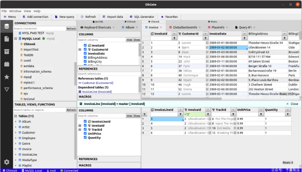

### DbGate优势

#### 优势

**安全性：**支持SSL/TLS加密连接，保护你的数据在传输过程中的安全。

**实时同步：**实时查看和编辑数据，无需刷新页面。

数据导出与导入：可以将数据导出为CSV、JSON或其他文件格式，同时也支持从文件导入数据到数据库。

**SQL编辑器：**集成的智能SQL编辑器提供代码自动完成，查询性能统计等功能。

**权限控制：**通过角色和权限设置，你可以控制团队成员对特定数据库和表的访问权限。

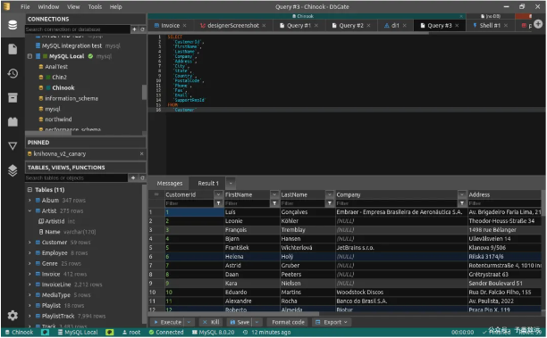

### DbGate安装

  如果你正在寻找一个能够统一管理你所有文件，又希望数据隐私得到保障的工具，那么Filestash绝对值得尝试。无论是个人还是团队，Filestash都能为你的文件管理工作带来极大的便利。

如果你熟悉命令行，可能用 docker cli 更快捷

```bash
# 运行容器
docker run -d \
	--name dbgate \
	--restart always \
	-p 8483:3000 \
	dbgate/dbgate
```

也可以用 docker-compose 安装，将下面的内容保存为 docker-compose.yml 文件

```yaml
version :3

services:
	dbgate:
		image: dbgate/dbgate
		container name:dbgate
		restart: always
		ports:
			- 8483:3000
```

然后执行下面的命令

```bash
# 新建文件来 dbgate
mkdir -p /volume2/docker/dbgate
# 进入目录
cd /volume2/docker/dbgate

# 将docker-compose.yml 放入当前目录
# -键启动
docker-compose up -d
```

运行：在浏览器中输入 http://localhost:8483 就能看到主界面

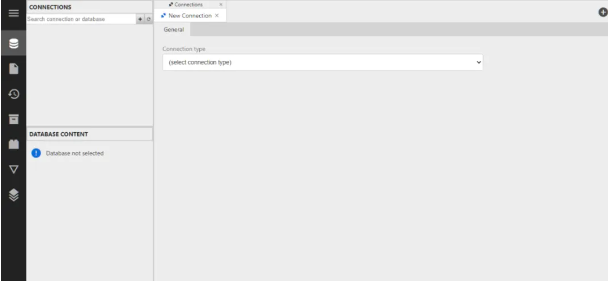

# SQLite工具

## Sqliteviz：轻量级SQLite可视化工具

项目地址：**https://github.com/lana-k/sqliteviz**

### 什么是 Sqliteviz ？

`sqliteviz`是一款基于JavaScript开发的单页Web应用，用于SQLite数据库或CSV文件的完全客户端可视化。它采用PWA（Progressive Web App）技术，可以离线使用，如同本地应用一样。

> `Sqliteviz` 是一个单页面离线优先的渐进式网络应用（`PWA`），用于完全客户端的 `SQLite` 数据库或 `CSV` 文件的可视化。

所谓完全客户端，就是您的数据库永远不会离开您的计算机。

`sqliteviz`拥有简洁直观的界面，即使是初学者也能轻松上手。

通过sqliteviz，我们可以执行SQL查询、绘制Plotly图表、管理查询和图表设置等操作。

它主要包含以下功能：

- 运行 SQL 查询并创建图表: 只需输入 SQL 查询，sqliteviz 就会自动执行并生成相应的图表，包括折线图、柱状图、饼图等。
- 导入 CSV 文件: sqliteviz 支持将 CSV 文件导入到 SQLite 数据库中，并对导入的数据进行可视化分析。
- 导出结果集: 可将查询结果导出为 CSV 文件，以便在其他应用中进行分析或处理。
- 管理查询: 支持保存和管理多个查询，方便您以后重复使用。
- 离线使用: 支持离线运行，即使在没有网络连接的情况下也能使用。

### 性能特色

- 完全客户端可视化：无需服务器端支持，只需在浏览器中运行，保护数据安全。
- 支持离线使用：作为PWA应用，sqliteviz可以在离线环境下正常工作，如同本地应用。
- 轻量级：占用资源少，运行速度快，给您带来流畅的体验。
- 易于使用：无需安装任何软件，只需打开网站即可开始使用。
- 功能丰富: sqliteviz 提供了丰富的可视化功能，能够满足多种数据分析需求。

### 项目快速使用

直接浏览器访问 `https://sqliteviz.com/app` 即可使用最新的版本。

或者通过Chrome浏览器，打开上面地址，地址栏右上角点击安装，将其用作常规桌面应用程序。

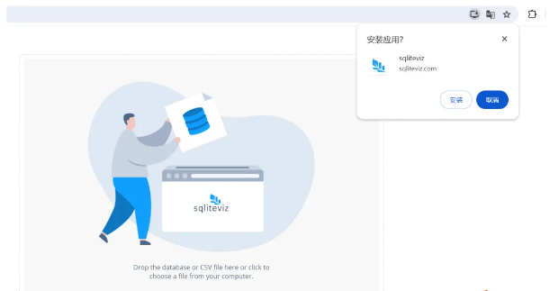

### 构建镜像

> 如果你不想自己构建，可以跳过，直接阅读下一章节

官方提供了本地测试的 `Dockerfile`，但其使用的基础镜像比较老，也未使用分层构建，所以老苏做了些许调整👇

```
# An easy way to run tests locally without Nodejs installed:      
#      
#     docker build -t sqliteviz/test -f Dockerfile.test .      
#      
      
FROM node:16.16 as build-base   
    
RUN set -ex; \    
    apt update; \    
    apt install -y chromium firefox-esr; \    
    npm install -g npm@7    
    
WORKDIR /tmp/build    
    
COPY package.json package-lock.json ./    
COPY lib lib      
RUN npm install      
    
COPY . .    
    
RUN set -ex; \    
    sed -i 's/browsers: \[.*\],/browsers: ['"'FirefoxHeadlessTouch'"'],/' karma.conf.js    
    
#RUN npm run lint -- --no-fix && npm run test  
RUN npx browserslist@latest --update-db && \  
    npm run build  
  
FROM nginx:1.12-alpine  
COPY --from=build-base /tmp/build/dist /usr/share/nginx/html  
  
EXPOSE 80  
  
CMD ["nginx", "-g", "daemon off;"]
```

构建镜像和容器运行的基本命令如下👇

```
# 下载代码
git clone https://github.com/lana-k/sqliteviz.git

# 进入目录  
cd sqliteviz

# 构建镜像
docker build -t wbsu2003/sqliteviz:v1 -f Dockerfile.test .

# 运行容器
docker run -d \
   --name sqliteviz \
   -p 3366:80 \
   wbsu2003/sqliteviz:v1
```

### 安装

在群晖上以 Docker 方式安装。

在注册表中搜索 `sqliteviz` ，选择第一个 `wbsu2003/sqliteviz`，版本选择 `latest`。

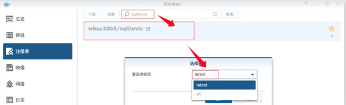

### 端口

本地端口不冲突就行，不确定的话可以用命令查一下

```
# 查看端口占用
netstat -tunlp | grep 端口号
```

| 本地端口 | 容器端口 |
| :------: | :------: |
|  `3366`  |   `80`   |

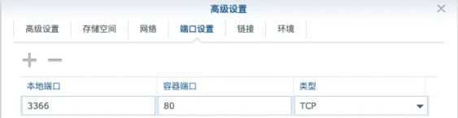

### 命令行安装

如果你熟悉命令行，可能用 `docker cli` 更快捷

```
# 运行容器
docker run -d \
   --name sqliteviz \
   -p 3366:80 \
   wbsu2003/sqliteviz
```

也可以用 `docker-compose` 安装，将下面的内容保存为 `docker-compose.yml` 文件

```
version: '3'

services:
  sqliteviz:
    image: wbsu2003/sqliteviz
    container_name: sqliteviz
    restart: unless-stopped
    ports:
      - 3366:80
```

然后执行下面的命令

```
# 新建文件夹 sqliteviz
mkdir -p /volume1/docker/sqliteviz

# 进入 sqliteviz 目录
cd /volume1/docker/sqliteviz

# 将 docker-compose.yml 放入当前目录

# 一键启动
docker-compose up -d
```

### 运行

在浏览器中输入 `http://群晖IP:3366` 就能看到主界面

- ①可以上传或者拖入一个已有的数据库文件；
- ②可以创建一个空的数据库；


用来测试的还是 `homebox` 的数据库

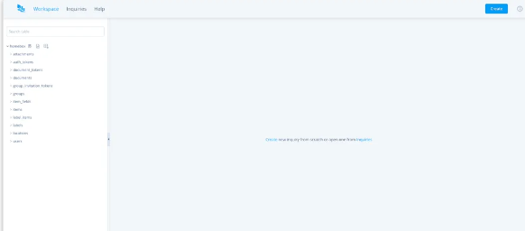

点右上角的 `Create` 按钮创建查询，输入 `SQL` 语句会有提示

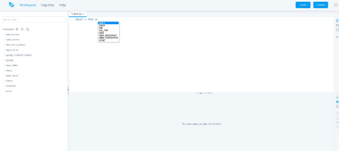

运行 `SQL` 查询

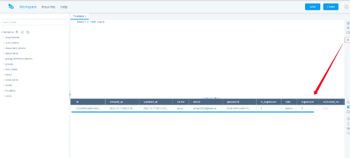

详细的使用方法，请参考官方文档：https://sqliteviz.com/docs/basic-usage

### 参考文档

> lana-k/sqliteviz: Instant offline SQL-powered data visualisation in your browser
> 地址：https://github.com/lana-k/sqliteviz
>
> Home - sqliteviz
> 地址：https://sqliteviz.com/
>
> Introduction - sqliteviz
> 地址：https://sqliteviz.com/docs/

# 免费、开源、好用的 SQL 客户端合集

## 0、SQL Chat

SQL Chat 是 2023 年 3 月推出的新型 SQL 客户端，它将数据库管理带入了基于聊天的新时代。

SQL Chat 由 ChatGPT 驱动，能够帮你编写和润色 SQL 语句，让数据库操作变得更加智能和便捷。

目前支持 MySQL、PostgreSQL 和 MSSQL 数据库。

***官方地址：**https://www.sqlchat.ai/*

***开源地址：**https://github.com/sqlchat/sqlchat*

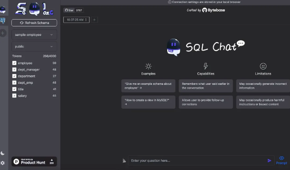

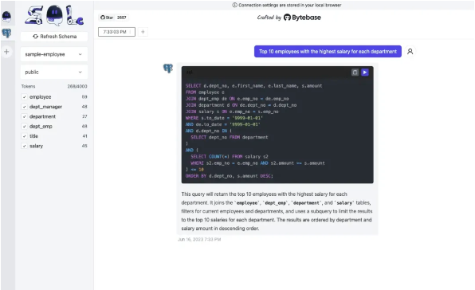

## 1、DBeaver

一个老牌的 SQL 客户端，除了基本的可视化和管理功能外，还具备SQL编辑器、数据和架构迁移能力、监控数据库连接等功能。

支持广泛的数据库类型（包括 SQL 和 NoSQL）。

与 GPT-3 集成，可以将自然语言转换为 SQL 语句。

***官方地址：**https://dbeaver.io/*

***开源地址：**https://github.com/dbeaver/dbeaver?tab=readme-ov-file*

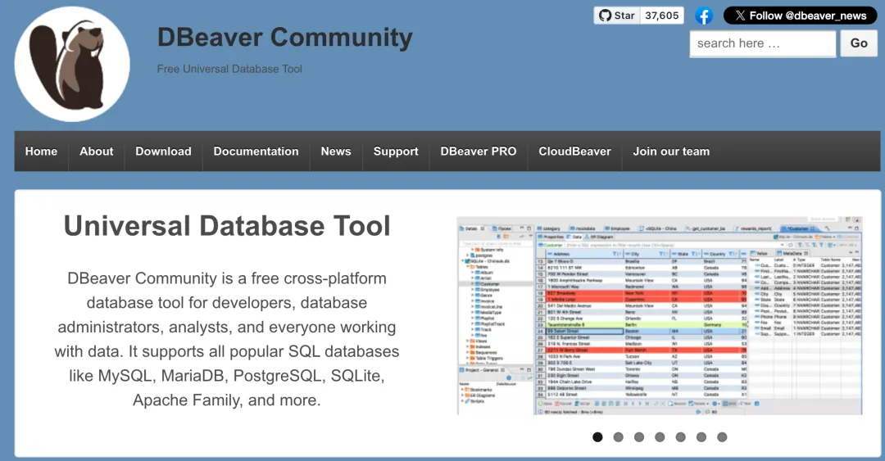

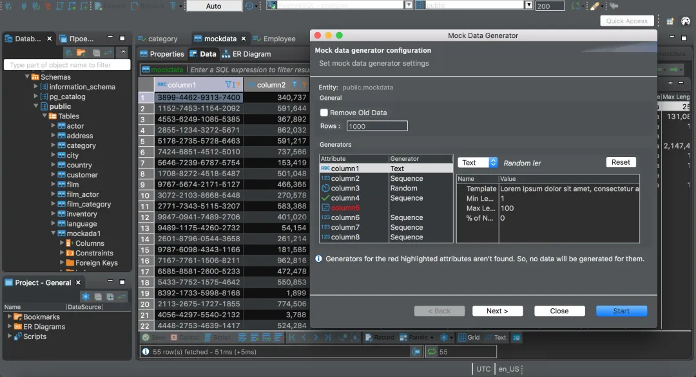

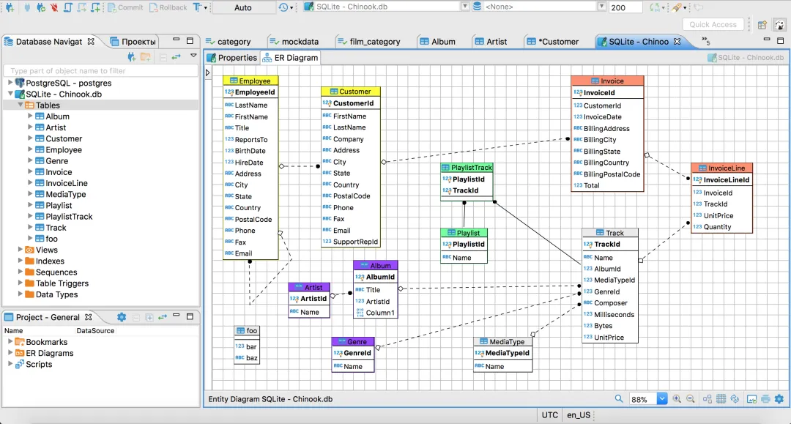

## 2、Beekeeper Studio

一个现代且轻量级的 SQL 客户端，支持 MySQL、Postgres、SQLite、SQL Server 等。

适用于 Linux、Mac 和 Windows 系统。

***官方地址：**https://www.beekeeperstudio.io/*

***开源地址：**https://github.com/beekeeper-studio/beekeeper-studio*

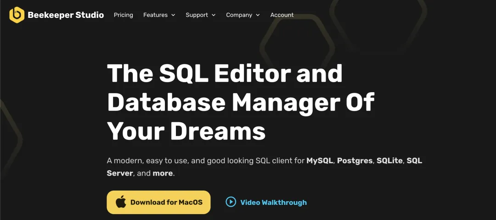

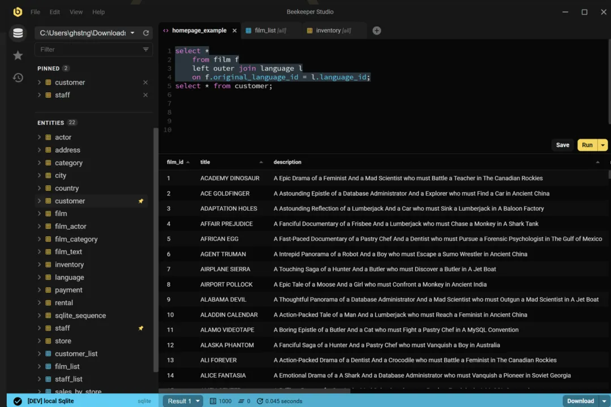

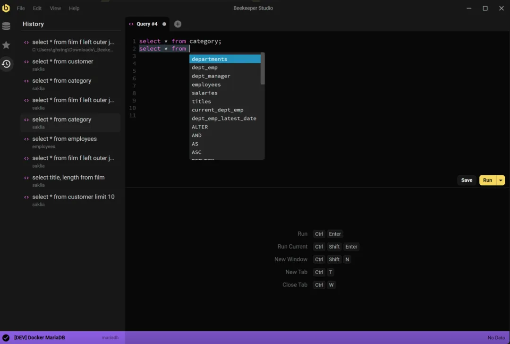

## 3、DbGate

DbGate 是一个全面而强大的数据库管理工具。

DbGate 在 Windows、Linux、Mac 和 Web浏览器上都能运行，提供一致的体验。

无论是 MySQL、PostgreSQL、SQL Server、MongoDB、SQLite 还是 CockroachDB，DbGate 都能轻松应对。

DbGate 不仅支持基本的数据库操作，还提供了数据可视化、模式设计、数据迁移等高级功能。

***官方网站：**https://dbgate.org/*

***开源地址：**https://github.com/dbgate/dbgate*

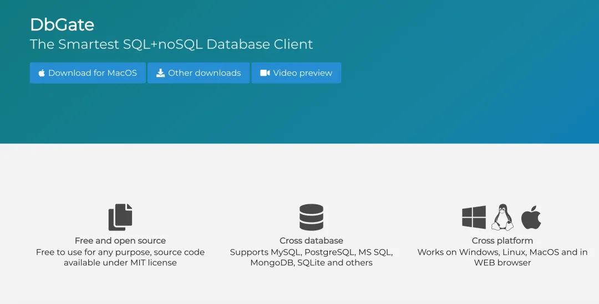

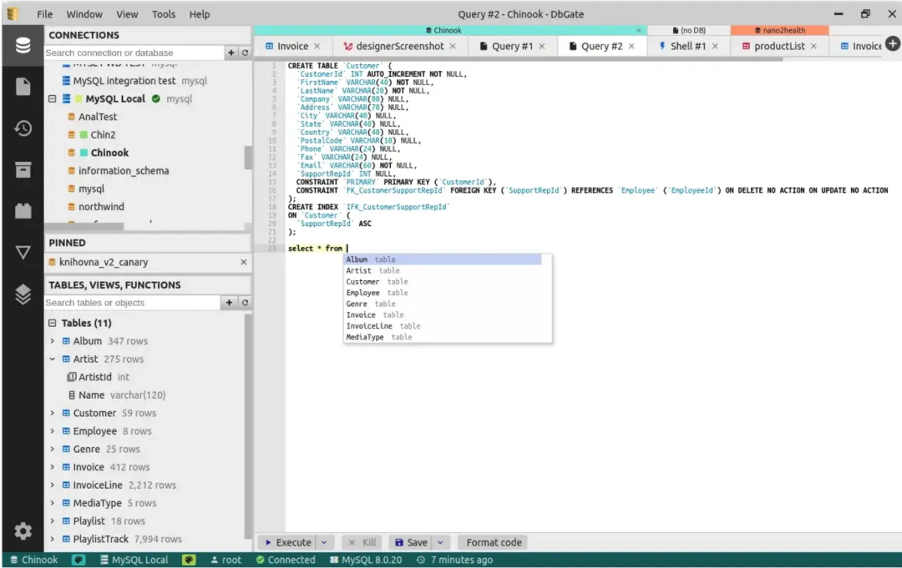

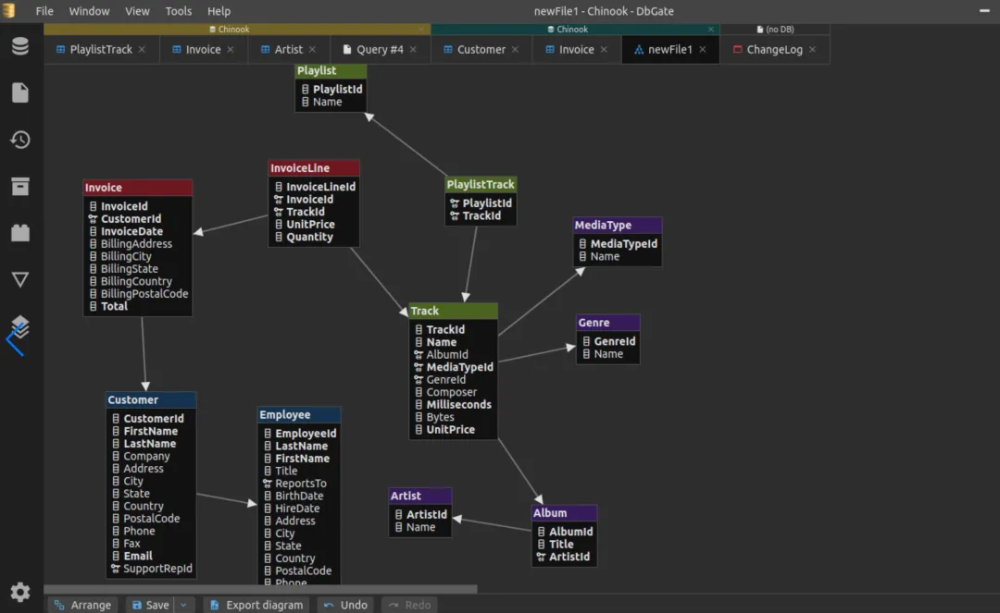

## 4、Sqlectron

Sqlectron 以其轻量级、跨平台和开源的特性，成为了数据库管理工具中的一股清流。

支持包括 PostgreSQL、Redshift、MySQL、MariaDB、SQL Server、Cassandra 和 SQLite 在内的多种数据库系统。

支持 Mac、Linux 以及 Windows。

***官方地址：**https://sqlectron.github.io/*

***开源地址：**https://github.com/sqlectron/sqlectron-gui*

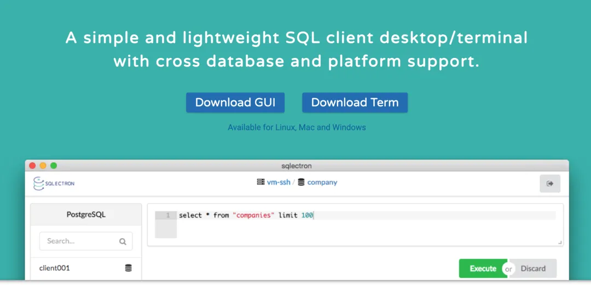

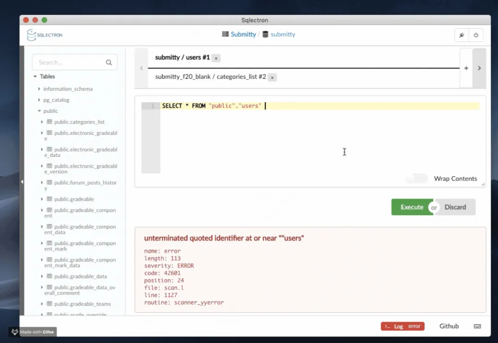

## 5、HeidiSQL

HeidiSQL 以其轻量级、多功能和用户友好的设计，成为了数据库管理工具中的佼佼者。

支持包括 MariaDB、MySQL、MS SQL、PostgreSQL、SQLite、Interbase和 Firebird 在内的多种数据库系统。

除了基本的 SQL 客户端功能，HeidiSQL 还允许用户导出结构和数据到 SQL 文件，或者复制到剪贴板或其他服务器，极大方便了数据的迁移和管理。

***官方地址：**https://www.heidisql.com/*

***开源地址：**https://github.com/HeidiSQL/HeidiSQL*

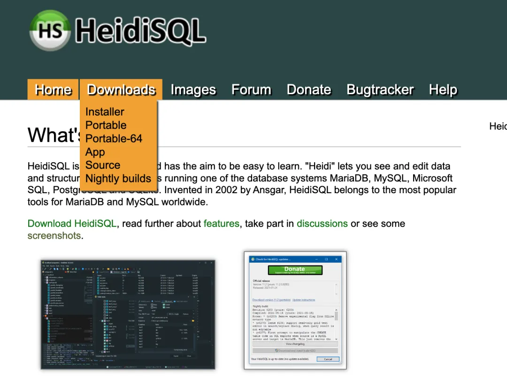

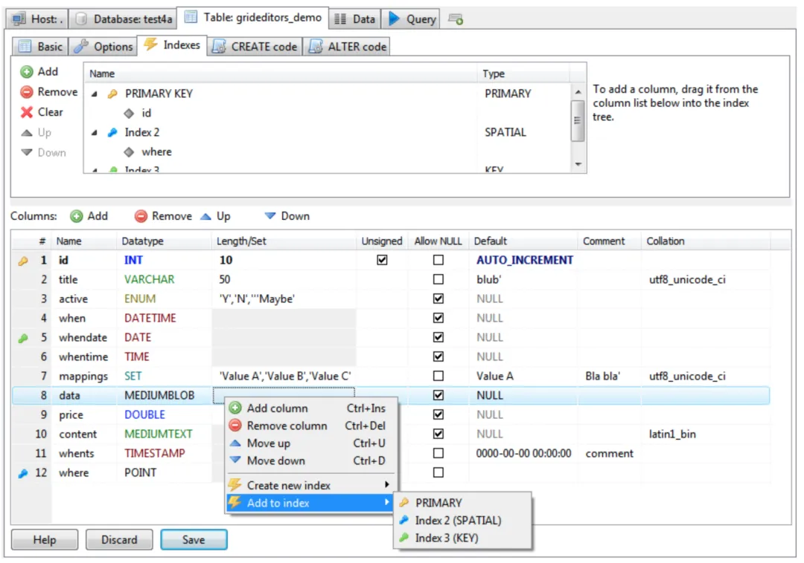

## 6、phpMyAdmin

自 1998 年诞生以来，phpMyAdmin 一直是数据库管理领域的经典之作。

作为 LAMP、LNMP 和 MAMP 环境的默认工具，phpMyAdmin 在全球拥有庞大的用户基础，已发展成为管理 MySQL 和类 MySQL 数据库（例如 MariaDB）的领先工具之一。

phpMyAdmin 不仅仅是一个简单的数据库管理工具，它还提供了数据导入导出、用户权限管理、数据库结构编辑等高级功能。

phpMyAdmin 每月有超过 20 万的直接下载量。

***官方地址：**https://www.phpmyadmin.net/*

***开源地址：**https://github.com/phpmyadmin/phpmyadmin*

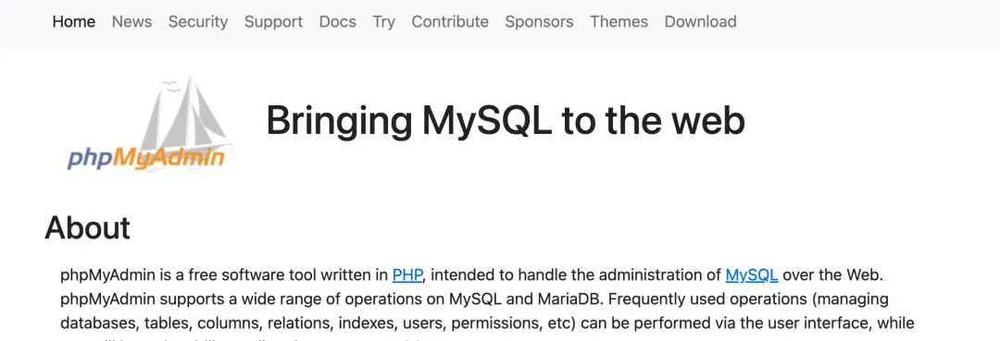

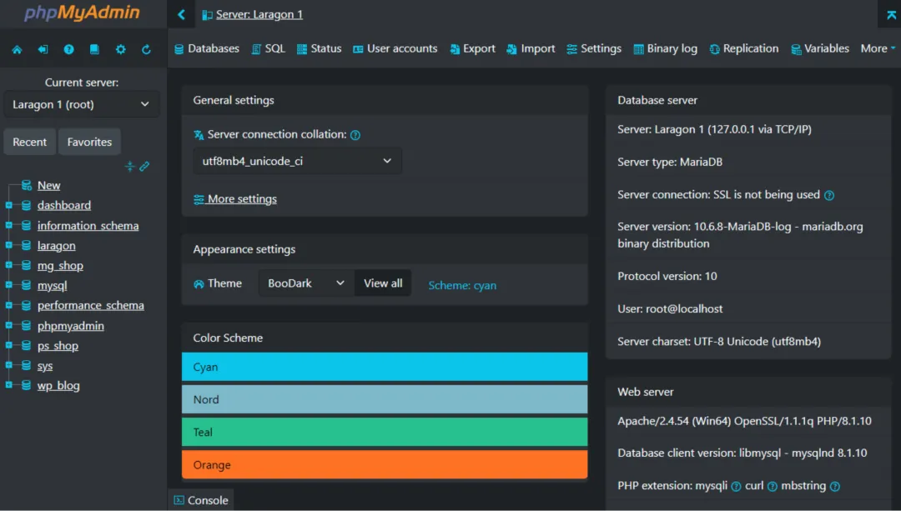

## 7、pgAdmin 4

对于 PostgreSQL 来说，pgAdmin 就像 phpMyAdmin 对于 MySQL 一样。

pgAdmin 是为 PostgreSQL 量身定制的管理工具，提供了无与伦比的兼容性和性能。

无论是在 Linux、Unix、macOS 还是 Windows，pgAdmin 都能提供一致的用户体验。

pgAdmin不仅仅是一个简单的数据库管理工具，它还提供了数据备份、还原、用户权限管理、数据库架构设计等高级功能。

pgAdmin 4 是 pgAdmin 系列的最新版本，它使用 Python 和 Javascript/jQuery 进行了完全重写，带来了全新的用户界面和改进的性能。

***官方地址：**https://www.pgadmin.org/*

***开源地址：**https://github.com/pgadmin-org/pgadmin4*

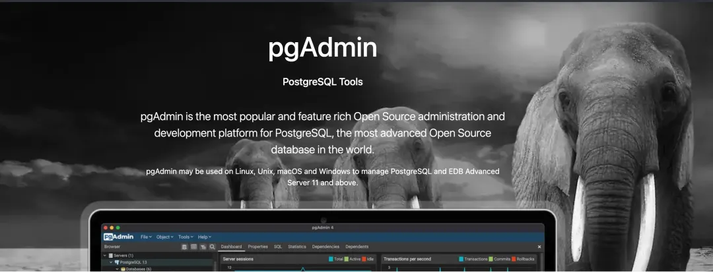

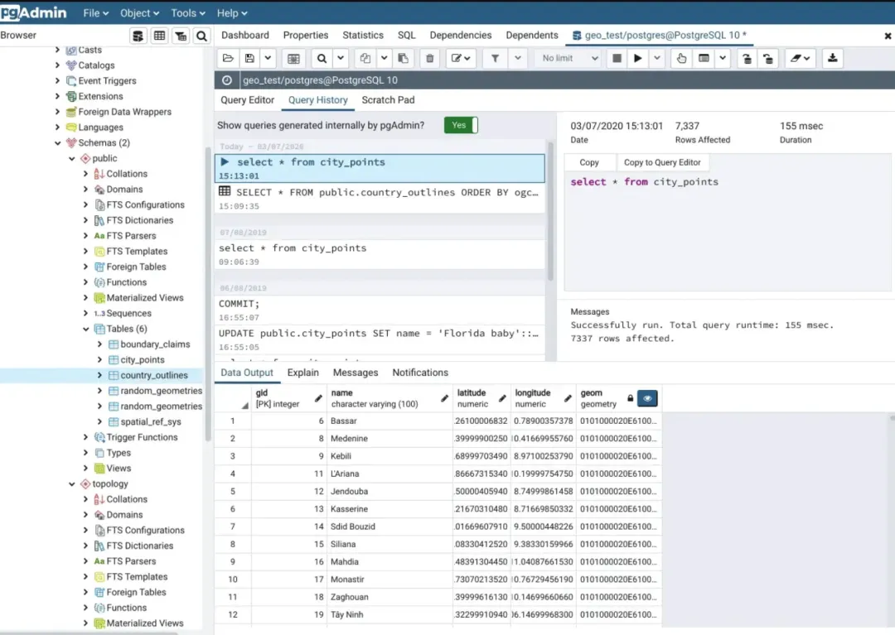