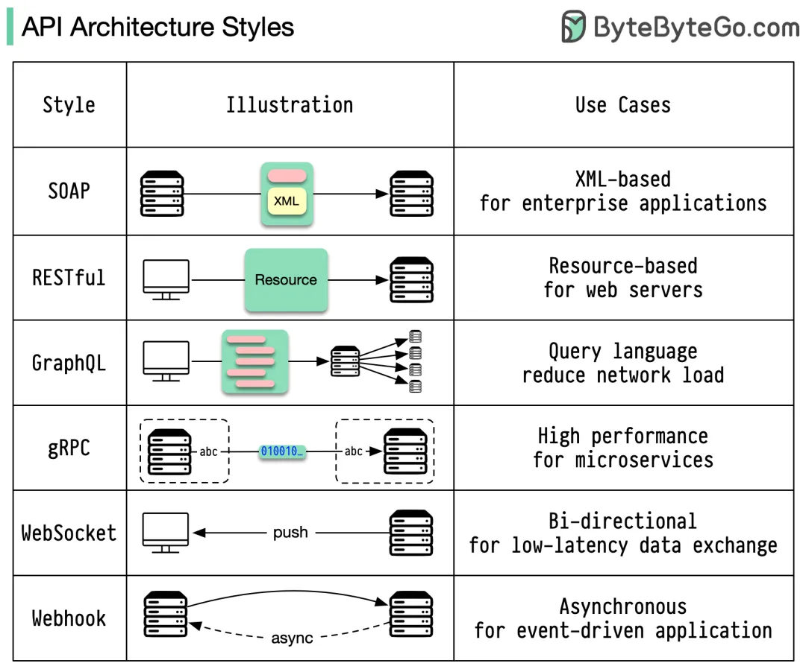
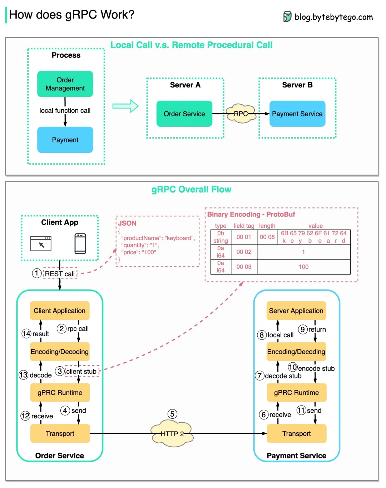
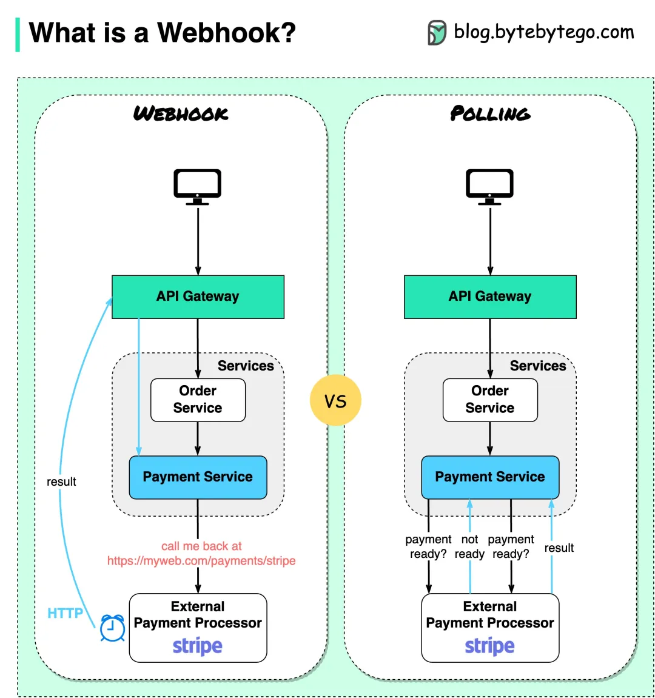
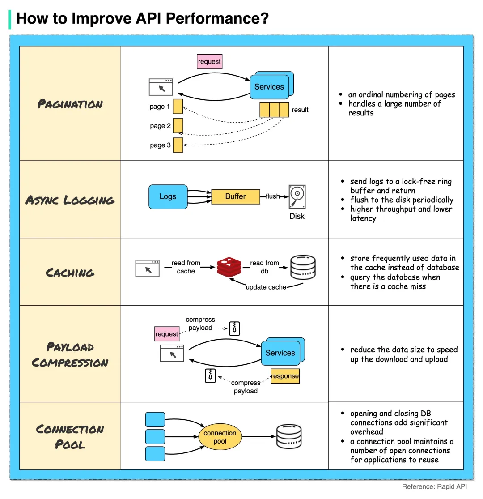
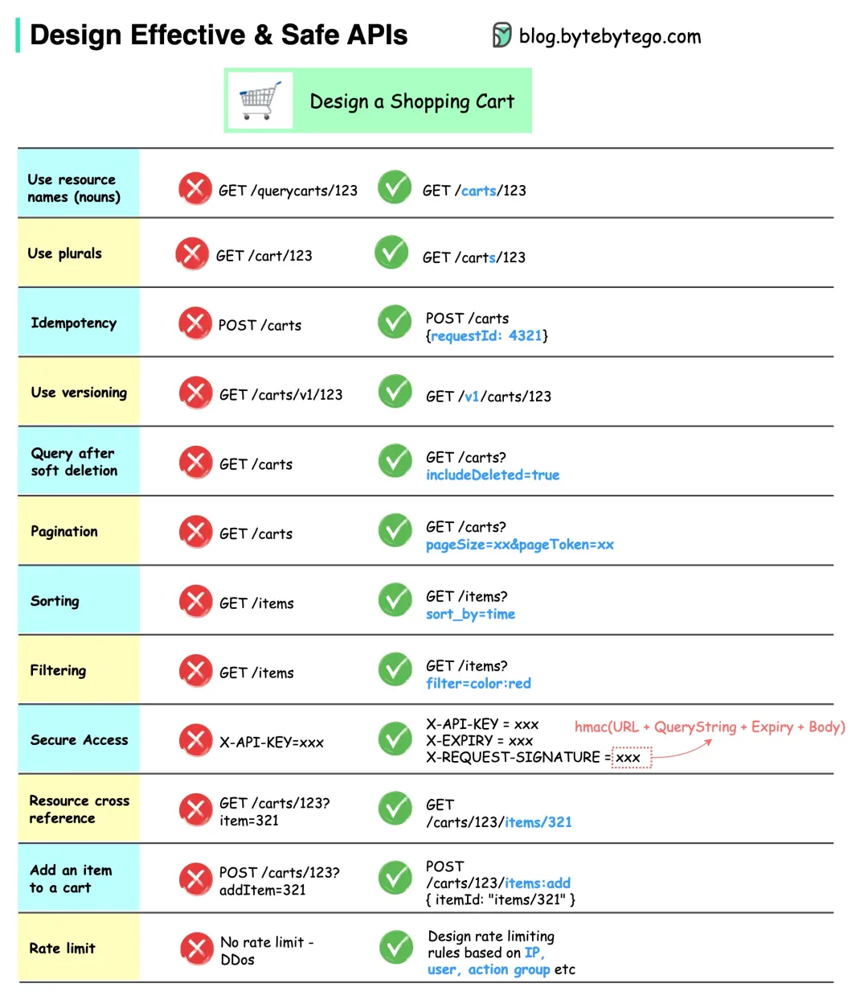

# 标准化API设计流程

## 通信协议

架构样式定义了应用程序编程接口（API）的不同组件如何相互交互。因此，它们通过提供设计和构建API的标准方法，确保了效率、可靠性和与其他系统的轻松集成。

以下是最常用的样式：



#### **SOAP**

- 成熟、全面、基于XML
- 最适合企业应用

#### **RESTful**

- 流行的、易于实现的HTTP方法
- Web服务的理想选择

#### **GraphQL**

- 查询语言，请求特定数据
- 减少网络开销，加快响应速度

#### **gRPC**

- 现代化的高性能协议缓冲器
- 适用于微服务架构

#### **WebSocket**

- 实时、双向、持久连接
- 非常适合低延迟数据交换

#### **Webhook**

- 事件驱动、HTTP回调、异步
- 事件发生时通知系统

### **REST API vs GraphQL**

当涉及到API设计时，REST和GraphQL都有自己的优点和缺点。下图显示了REST和GraphQL之间的快速比较。


#### **REST**

- 使用标准的HTTP方法，如GET，POST，PUT，CRUD操作。
- 当您需要在独立的服务/应用程序之间使用简单、统一的接口时，可以很好地工作。
- 缓存策略很容易实现。
- 缺点是它可能需要多次往返才能从不同的端点收集相关数据。

#### **GraphQL**

- 为客户端提供一个端点，以便精确查询所需的数据。
- 客户端指定嵌套查询中所需的确切字段，服务器返回仅包含这些字段的优化有效负载。
- 支持用于修改数据的Mutations和用于实时通知的Subscriptions。
- 非常适合聚合来自多个来源的数据，并能很好地满足快速发展的前端需求。
- 但是，它将复杂性转移到客户端，如果没有适当的保护，可能会允许滥用查询
- 缓存策略可能比REST更复杂

> ❝
>
> REST和GraphQL之间的最佳选择取决于应用程序和开发团队的具体要求。GraphQL非常适合复杂或频繁变化的前端需求，而REST适合那些首选简单和一致的合同的应用程序。

这两种API方法都不是银弹。仔细评估需求和权衡对于选择正确的风格很重要。REST和GraphQL都是公开数据和支持现代应用程序的有效选择。

### **gRPC是如何工作的？**

RPC（Remote Procedure Call）被称为“远程”，因为它在微服务架构下，当服务部署到不同的服务器时，可以实现远程服务之间的通信。从用户的角度来看，它就像一个本地函数调用。



**上图说明了gRPC的总体数据流**

- **步骤1**：从客户端进行REST调用。请求体通常是JSON格式。
- **步骤2 ~ 4**：订单服务（gRPC客户端）接收REST调用，对其进行转换，并对支付服务进行RPC调用。gRPC将客户端存根编码为二进制格式，并将其发送到低级传输层。
- **步骤5**：gRPC通过HTTP 2在网络上发送数据包。由于二进制编码和网络优化，gRPC据说比JSON快5倍。
- **步骤6 - 8**：支付服务（gRPC服务器）从网络接收数据包，对其进行解码，并调用服务器应用程序。
- **步骤9 - 11**：结果从服务器应用程序返回，并进行编码并发送到传输层。
- **步骤12 - 14**：订单服务接收数据包，对它们进行解码，并将结果发送到客户端应用程序。

### **什么是Webhook？**

**下图显示了轮询和Webhook之间的比较**



假设我们运行一个电子商务网站。客户端通过API网关将订单发送到订单服务，订单服务转到支付服务进行支付交易。然后，支付服务与外部支付服务提供商（PSP）进行通信以完成交易。

> ❝
>
> 有两种方法可以处理与外部PSP的通信。

#### **1.短轮询**

在向PSP发送支付请求之后，支付服务继续询问PSP关于支付状态。经过几轮之后，PSP最终返回状态。

**短轮询有两个缺点**

- 续的状态轮询需要来自支付服务的资源。
- 外部服务直接与支付服务通信，从而产生安全漏洞。

#### **2.Webhook**

我们可以使用外部服务注册一个webhook。这意味着：当你有关于请求的更新时，请在某个URL上给我回电话。当PSP完成处理后，它将调用HTTP请求来更新支付状态。

通过这种方式，改变了编程范例，并且支付服务不再需要浪费资源来轮询支付状态。

如果PSP不回电话怎么办？我们可以设置一个清洁工，每小时检查一次付款情况。

> ❝
>
> Webhook通常被称为反向API或推送API，因为服务器向客户端发送HTTP请求。使用Webhook时需要注意三点：

- 我们需要设计一个合适的API供外部服务调用。
- 出于安全原因，我们需要在API网关中设置适当的规则。
- 我们需要在外部服务注册正确的URL。

### **如何提高API性能？**

**下图显示了提高API性能的5个常用技巧**



#### **分页**

当结果的大小很大时，这是一种常见的优化。结果流回客户端，以提高服务响应能力。

#### **异步日志记录**

同步日志记录处理每次调用的磁盘，可能会降低系统的速度。异步日志记录首先将日志发送到无锁缓冲区，然后立即返回。日志将定期刷新到磁盘。这大大降低了I/O开销。

#### **缓存**

我们可以将频繁访问的数据存储到缓存中。客户端可以先查询该高速缓存，而不是直接访问数据库。如果存在缓存未命中，则客户端可以从数据库查询。像Redis这样的缓存将数据存储在内存中，因此数据访问比数据库快得多。

#### **有效载荷压缩**

可以使用gzip等压缩请求和响应，以便传输的数据大小要小得多。这加快了上传和下载的速度。

#### **连接池**

在访问资源时，我们经常需要从数据库中加载数据。打开正在关闭的数据库连接会增加大量开销。所以我们应该通过一个开放连接池连接到数据库。连接池负责管理连接生命周期。

### **如何设计安全有效的API？**

> ❝
>
> 下图以购物车为例展示了典型的API设计



请注意，API设计不仅仅是URL路径设计。大多数时候，我们需要选择适当的资源名称、标识符和路径模式。在API网关中设计适当的HTTP头字段或设计有效的速率限制规则同样重要。

# RESTful API接口设计规范与最佳实践

## Part1介绍

**RESTFull** 接口设计目前广泛应用于各种软件系统中，特别是前后端分离架构的web应用。相信各位web应用的开发者对这个概念并不陌生，但是我们经常会遇到几个这样的疑惑或者问题：

1. 为什么这个接口只设计了GET和POST两种请求类型？
2. 为什么这个接口无论是否请求成功，HTTP状态码永远只会是200?
3. 当一个查询的结果为空的时候，为什么有的接口设计会返回异常（HTTP状态码404或其他），有的则是会返回请求成功（HTTPS状态码200），但是返回结果是空数组或者null等表示结果为空的标识？

> 以上这几个问题，哪些是对的哪些是错的呢？答案是：没有对错

在我们试图搞清楚以上几个问题之前，首先需要读者了解或者阅读过关于RESTfull的定义，这类定义百度一搜一大把这里就不重复赘述了。接着是最好你实践过这类风格设计的接口，如果你心中也同样有这几个问题或者疑问那就更好了，当然最后这两点要求并不是必须。

如果你已经阅读过关于RESTfull的相关定义，你就会发现RESTfull是一种接口设计风格，它制定了一些原则条件，只要你遵守了，就算是RESTful风格的接口设计。

那么问题就来了，这里面就存在很多灵活空间了，比如说我部分遵守，部分不遵守，可以吗？可以。或者说我在遵守的基础上，再自定义一些行为，可以吗？可以。

各种诸如此类的实践路线导致了我们很难在开发生涯中真的看到有两个或更多的接口实现了一模一样的**RESTfull**风格接口，即便他们的业务是一样的。这是因为RESTfull本身既然是一种设计风格，**那么风格发挥的主动权自然就是在开发者身上，而且绝大多数的项目所开发的API接口都是对内或者有限对外开放的，所以对于RESTfull的实践是否合格更多取决于内部团队老大的看法。**

> 说到这里读者们可能会觉得，既然如此那这个真是太糟糕了，完全做不到统一，你完全想象不到别人设计出什么魔幻风格的RESTfull接口，为什么RESTfull依然能成为主流的接口设计风格呢？

这里我个人觉得有一部分原因是同行衬托，RESTfull基于HTTP协议,采用json格式的字符串作为传输内容，相对于过去的SOAP协议，采用XML格式标记语言来说，RESTfull无论从开发成本或者网络传输来说都显得轻量太多太多。而前面提到的，关于实际开发出来的RESTfull接口风格迥异的问题实际上并没有太糟糕，为什么这么说呢？因为最起码的一点是无论实际设计出来的接口再奇葩，总归是基于HTTP协议和使用JSON字符串来传递数据，这最起码保证了我们在调用别人设计好的接口的时候足够简单。

当然，能调用跟实际交互还有一段很长的距离，而中间这个过程你是否舒适，有一部分就体现在接口细节设计上了。按照一般的经验，像这种”标准化“的设计，我们会封装一些基础方法来实现接口的调用和数据接收，但现实却是无法实现的。因为RESfull接口的具体实现细节上是因人而异的，这就导致了我们封装的调用或者解析代码未必能够完全复用，很典型的例子就是我们一开始抛出来的那几个问题。

这时候读者们肯定想说，还是想吐槽，是的，我们可以吐槽一个接口设计得很糟心，让我们调用起来很难受，但是我们又不可否认他确实遵守了RESTfull的基本规定，你可以发送一个HTTP请求,通过JSON来提交和接收数据，你完全拿对方没办法。所以这也就是为什么我们一开始给出的答案是：没有对错。我们可以吐槽一个接口设计得非常糟糕，但是不能说这个接口不是RESTfull接口，但是，我们可以评判一个接口是否严格遵循了RESTfull风格设计以及遵循的程度有多高。

我们可以从开局的几个问题入手来尝试评判下相应的接口设计是否很好的遵循了RESTfull风格设计。

## Part2为什么接口只设计了GET和POST两种请求方法类型？

> 解析：HTTP协常用的请求方法类型有`GET`、`POST`、`PUT`、`PATCH`、`DELETE`，其中毫无疑问`GET`和`POST`是最最最常用的，而且每个请求方法类型都有各自的描述：

| 序号 | 类型   | 描述                                                         |
| :--- | :----- | :----------------------------------------------------------- |
| 1    | GET    | 请求指定的页面信息，并返回实体主体                           |
| 2    | POST   | 向指定资源提交数据进行处理请求（例如提交表单或者上传文件）。数据被包含在请求体中。POST 请求可能会导致新的资源的建立和/或已有资源的修改 |
| 3    | PUT    | 从客户端向服务器传送的数据取代指定的文档的内容               |
| 4    | PATCH  | 是对 PUT 方法的补充，用来对已知资源进行局部更新              |
| 5    | DELETE | 请求服务器删除指定的页面                                     |

从上面的表格可以看出，不同类型的请求方法有着自己明确的含义，在理想的情况下，我们可以通过一个请求类型+请求地址的形式，直观的看出一个接口的作用，比如：

```
// 猜猜阿克苏我想干嘛
GET https://tinywan.com/users

DELETE  https://tinywan.com/users/69
```

这里读者可以尝试做一个阅读理解。

那么这里问题就来了，既然HTTP的请求方法类型有助于我们理解一个接口的作用，为什么在有些接口中唯独只会使用GET和POST呢？这里面我觉得原因有很多，有些可能我也想不到也猜不到，但是我从个人开发经验上尝试猜测一下。

> 原因我觉得可能是**一是懒**，二是觉**得没必要**，三是**根本不会设计**。

坦白说，除了查询请求这种无可争议的使用**GET**之外，其他的全部归为**POST**无疑是一件很方便的事。你不需要花时间去考虑接口的行为然后决定要定义成什么请求方法类型，反正具体的实现逻辑都是一样的，而且**POST**方法的描述也似乎能涵盖到其他几个类型的请求方法。但这里读者可能会说，在某些场景下会有歧义，比如说我们要调用一个接口实现删除一个用户：

```
  // 猜猜我想干嘛
  POST https://tinywan.com/users/69
```

这里我们复用了前面其中一道阅读理解题并把类型改成了POST。这里第一眼看上去确实不能很好的表达接口的意图，但是我们有接口文档呀，我在相应的接口名称中写清楚再放大字体说这个接口是删除用户用的不就完事了？这么一听好像也有道理。**所以综合看来，细分各个方法请求类型似乎变成一件很多余的事，吃力不讨好，干脆就GET/POST一把梭了。**

说到这里，我们再回过头来看看问题本身，做错了吗？没有。那严格遵循了RESTfull风格设计了吗，那倒是并没有。

> RESTfull是基于HTTP协议的，HTTP协议里面清清楚楚明明白白提供了这些方法类型，那么从严谨的角度上来说，我们确实是需要清楚的定义好每个请求的类型是什么。这不仅是有利于提高接口语义化，其实对接口地址定义也有些好处，比如说我们要定义一套对用户进行CRUD的接口。

### 遵循 RESTfull

```
// 遵循RESTfull
GET     https://tinywan.com/users

GET     https://tinywan.com/users/1

POST    https://tinywan.com/users
Body:   "{"username":"Tinywan","password":123446}"

PUT     https://tinywan.com/users/1
Body:   "{"username":"阿克苏","password":wt@123465}"

PATCH   https://tinywan.com/users/69
Body:   "{"password":999999}"

DELETE  https://tinywan.com/users/1
```

### 不遵循RESTfull

```
GET     https://tinywan.com/users

GET     https://tinywan.com/users/1

POST    https://tinywan.com/users
Body:   "{"username":"Tinywan","password":123446}"

POST    https://tinywan.com/put/users/1
Body:   "{"username":"阿克苏","password":wt@123465}"

POST    https://tinywan.com/patch/user/69
Body:   "{"password":999999}"

POST    https://tinywan.com/delete/user/1
```

> 注意：在不遵循RESTfull风格的情况下，因为除了GET以外都是POST类型请求，我们需要为相同POST请求的接口定义不同的路由地址，这里示例中的路由地址只是为了体现这一点，真实开发场景中如何命名各有各发挥。

从这里的示例可以看出，在不遵循RESTfull风格设计的情况下我们难免需要在接口URL地址中增加一些描述性的单词，这会导致路由接口地址变得很冗长和不够优雅，当然如果你觉得这不是什么问题那也是没错的，对，你没错。

> 最后总结一下这个问题就是，你可以不遵循RESTfull风格设计里面关于对请求方法类型的区分定义，但需要在路由地址上花心思，那么在真实开发场景中，我们该如何选择呢？我的建议是如果你能做主，而且觉得有必要，就严格遵循，反之，领导说就啥吧。

## Part3为什么接口是否请求成功，HTTP状态码永远只会是200？

> 解析：常见的HTTP状态码有如下几种：

| 状态码 | 英文名称              | 描述                                                         |
| :----- | :-------------------- | :----------------------------------------------------------- |
| 200    | OK                    | 请求成功。一般用于GET与POST请求                              |
| 201    | Created               | 已创建。成功请求并创建了新的资源                             |
| 400    | Bad Request           | 业务错误，语义有误，当前请求无法被服务器理解                 |
| 401    | Unauthorized          | 认证失败，当前请求需要用户验证                               |
| 403    | Forbidden             | 无权限调用接口，服务器已经理解请求，但是拒绝执行它           |
| 404    | Not Found             | 服务器无法根据客户端的请求找到资源（网页）。通过此代码，网站设计人员可设置"您所请求的资源无法找到"的个性页面 |
| 429    | Has Many              | 请求次数超过限定次数（目前限定一分钟6次请求）                |
| 500    | Internal Server Error | 服务器内部错误，无法完成请求                                 |

从上面表格可以看出，HTTP码是用于标识本次请求响应的结果状态,通过HTTP状态我们可以直观的判断出本请求是不是成功的，但是为什么有些接口设计的情况是无论成功与否都只会返回200的状态码呢？

> 这里的原因和第1点的问题大致相同，就是懒和觉得没必要。但相对于明确方法请求类型来说，明确接口响应的HTTP状态码却是大有意义。

首先假设我们把所有请求响应的HTTP状态码都标识为200，那么我们必然需要在响应内容中增加一些字段来描述本次错误，例如：

```
// 200
{
  // 定义一个错误码
  "code": 1024,
  // 错误码对应的错误信息描述
  "message": "密码不正确"
}
```

这里大家可能会觉得，我们已经有code和message字段来描述本次请求的错误了，完全不需要HTTP状态码。这里乍一看是没有问题的，前端也能在统一异常处理的层面很好的捕获异常。

但是，当你的系统到了一定的规模（这个很容易达到，并不要求需要多大的规模体量，只要不是demo项目），你的错误类型就会有很多种，往往我们的错误码清单会很长，当然这对于后端开发来说不是啥问题，因为这个信息其实是给前端开发者处理的，但是前端开发者在处理这些错误的时候就难受了。

难受在哪？假设我们现在有10个关于账户异常的错误码，10个关于业务A的错误码，10个关于业务B的错误码，一共30个。这里面有个业务需求，就是某些特定的错误码需要前端做出特定的行为，比如说跳转到指定页面，或者强制退出啥等等。那么这时候前端在统一异常处理的时候咋做？那就是各种`if/else`和`switch`判断。

看起来似乎也问题不大嘛，是的，接着我们需求变了，和原来不一样了，原来的分支判断条件可能不适用了，错误码改了，含义不一样了，或者又增加了30个新的错误码，那么这时候前端开发者就炸了。

> 所以从这里可以看出，单纯依靠错误码来实现前端统一异常处理依然会存在重复编码问题，那么如果我们严格遵循**RESTfull**风格设计的话，增加HTTP状态码的区分定义，同时保留原来的错误响应信息结果会是如何？这时候前端开发者在做统一异常处理的时候，先按状态码做一层大范围的分支处理，再有针对性的对这个状态码类型下的某些错误码做特殊处理即可。

> 这两种方式的区别在于，通过HTTP状态码相当于给错误码做了一个归类，这也符合真实开发场景的异常处理情况。多数情况下前端在对异常做统一处理的时候，同一类型的异常往往后续的处理行为是一致的。

比如说给后端传递了错误的参数，这种一般后端在校验不通过的时候，会返回的HTTP状态码是**400**。这类提示信息是需要把具体错误信息展示给用户作为警告提示的，那么前端开发者在统一异常处理的时候，只需要判断HTTP状态码是不是400，是的话直接把具体内容以各种弹出提示的形式展示即可，不用关心具体的错误码又是什么（需要特殊处理的除外）。还有一种是**401**和**403 **HTTP状态码的错误，这两种都是跟权限有关的错误，前端开发者在做统一异常处理的时候也可以进行针对性的统一捕获处理。

> 从上面举的一些例子可以看出，**相同的HTTP状态码，前端的处理行为往往是一致的，但错误码未必。**

相对于单纯依靠错误码，HTTP状态码+错误码的方式让前端开发者更容易实现封装和统一处理，前端开发者根据HTTP状态码定义不同的响应处理，可以大大减少开发工程量和降低沟通成本。但是这里读者们可能会说，我们可以把错误码按范围划分，实现比如1~99是代表XX类型错误，100~199是XX类型错误。这个确实可以，但是这等于是换了条路开倒车，其实还是会有一开始的提到的痛点问题出现。而且错误码因为是团队定义的，如果维护不善会导致各种前后端开发者信息不同步的问题，既然通过HTTP状态码的定义就能解决大部分问题了为什么不用呢？

最后总结一下这个问题就是，强烈建议严格按照HTTP状态码的定义区分接口响应的HTTP状态码，错误码作为一种细分的补充。

## Part4HTTP状态码不存在，返回 200 还是 404 ？

**问题：** 当一个查询的结果为空的时候，为什么有的接口设计会返回异常（HTTP状态码404或其他），有的则是会返回请求成功（HTTPS状态码200），但是返回结果是空数组或者null等表示结果为空的标识？

**解析：**这个问题情况有点特殊，理论上来说，当我们查询了资源然后结果是不存在的时候，这个时候用404的HTTP状态码来标识本次请求的响应状态是一点问题都没有的，也是非常规范的做法。但是这是建立在业务场景规定，查询结果为空的时候属于异常的前提上。

### 1返回HTTP状态码 `200`

当我们查询一个资源但是结果为空，到底要不要把本次请求视为一个404的异常是取决于业务场景。如果说业务场景认为”空“是允许的，那么就不应该让本次响应是一个404的HTTP状态码，因为有些业务场景下，“空”也是有它的业务含义的

比如我们要查询一个月内连续登陆10天的用户列表，结果是没有用户满足这个条件，那么我返回的结果自然是空的，并不能视为一个异常，这时候返回一个200的HTTP状态码，然后在响应结果里面明确结果是空的才是正确的做法。

### 2返回HTTP状态码 `404`

那么什么场景下”空“是不允许的呢？比如说我们要修改指定的某个用户的个人信息，那么通常情况下我们后端的处理逻辑是这样的：查询这个用户是否存在，如果存在则进行更新操作，如果不存在，抛出一个异常提示要修改的用户不存在。在这种场景下，这个异常就会是一个404异常，我们尝试修改一个并不存在的用户。

最后总结一下这个问题，当请求的结果为空时，是不是属于异常要考虑业务场景，并且这个划分定义也是很有必要的，可以避免潜在的业务理解偏差导致的程序执行逻辑问题，因为如果是一个异常，那么会更早的被前端在统一异常处理里面的捕获并处理，有利于前、后端开发人员开发出更健壮的系统。