# 汇编开源项目

## 纯汇编语言写的操作系统—MenuetOS

今天给大家推荐一款仅1.4M，且由纯汇编代码编写的操作系统：MenuetOS。开发者是英国软件工程师Ville Mikael Turjanmaa和Madis Kalme，完全由x86汇编语言于2000年写成的一款开放源码的32位操作系统，目前在官方网站上也可以下载到64位版本。

> 官网地址：https://menuetos.net/
>
> 镜像下载地址：http://www.menuetos.net/download.htm
>
> 镜像下载地址2：[MenuetOS.de: Downloads - MenuetOS 64 v1.36.20](https://www.menuetos.de/downloads/)
>
> 百度百科：[MenuetOS_百度百科 (baidu.com)](https://baike.baidu.com/item/MenuetOS/4327979?fr=ge_ala)

### 系统特性

- 纯汇编代码完成
- 运行速度超级快，体积小，仅1.4M
- 通过软盘启动
- 抢占式多任务处理
- 漂亮的GUI界面，基本的工具如：绘图、记事本、网络配置、浏览器等
- 此外，还内置了一些小游戏如：蜘蛛纸牌、桌球、3D俄罗斯方块、国际象棋等
- 支持3D游戏，不过要去官网下载

### 开发背景

MenuetOS 的两位开发者在接受 PC World Australia 的采访时，谈论了是什么激励他们去着手去做这样一个令人畏惧的任务，以及操作系统的现状和未来。Ville 称开发操作系统的最初源由是：某日他上网浏览，打开了一个包含脚本语言的网页，然而短短的一段脚本却执行起来无比缓慢，他决定寻找极端的方法，尽可能多的用汇编语言。

### 安装步骤

[大神真闲传，又一款纯汇编撸成的操作系统：MenuetOS|软盘|磁盘|unix|bios|windows_网易订阅 (163.com)](https://www.163.com/dy/article/IU6DGSJ105534Z4K.html)

[世界上最小的操作系统MenuetOS，仅有1.4M，安装运行全教程 (baidu.com)](https://baijiahao.baidu.com/s?id=1719130613453064844&wfr=spider&for=pc)

由于其使用汇编编写的缘故，仅支持从软盘上启动，但也有方法从U盘启动和使用模拟器。为了相对真实，并呈现好的图像效果，这里使用使用Vmware的软盘来引导启动。

**创建虚拟机**

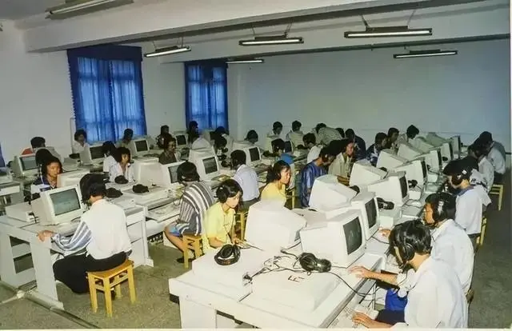

**添加软盘**

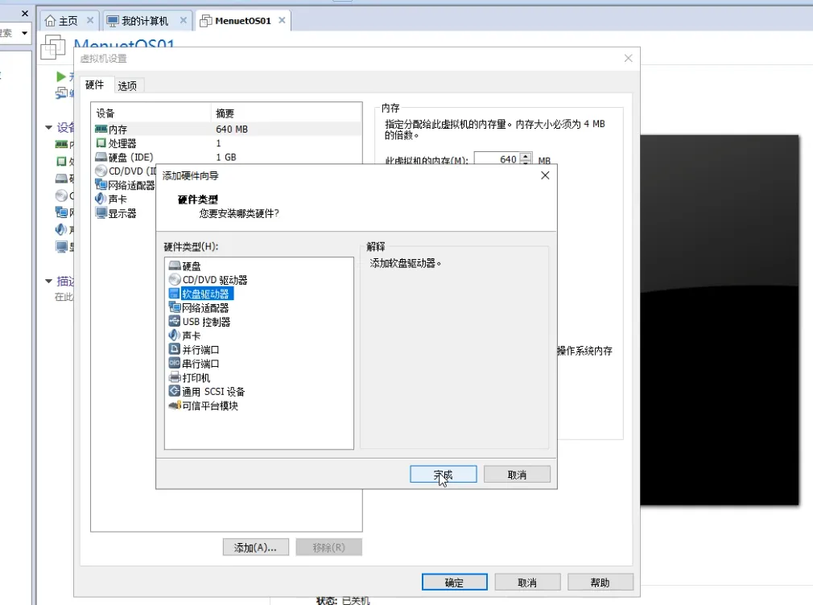

**加载镜像**

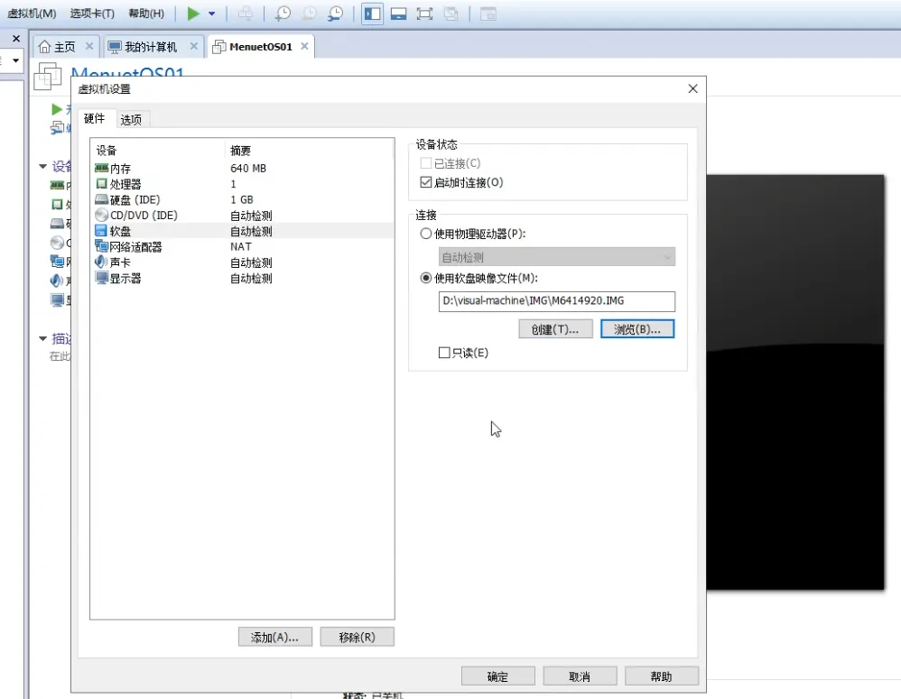

4、**启动虚拟机**

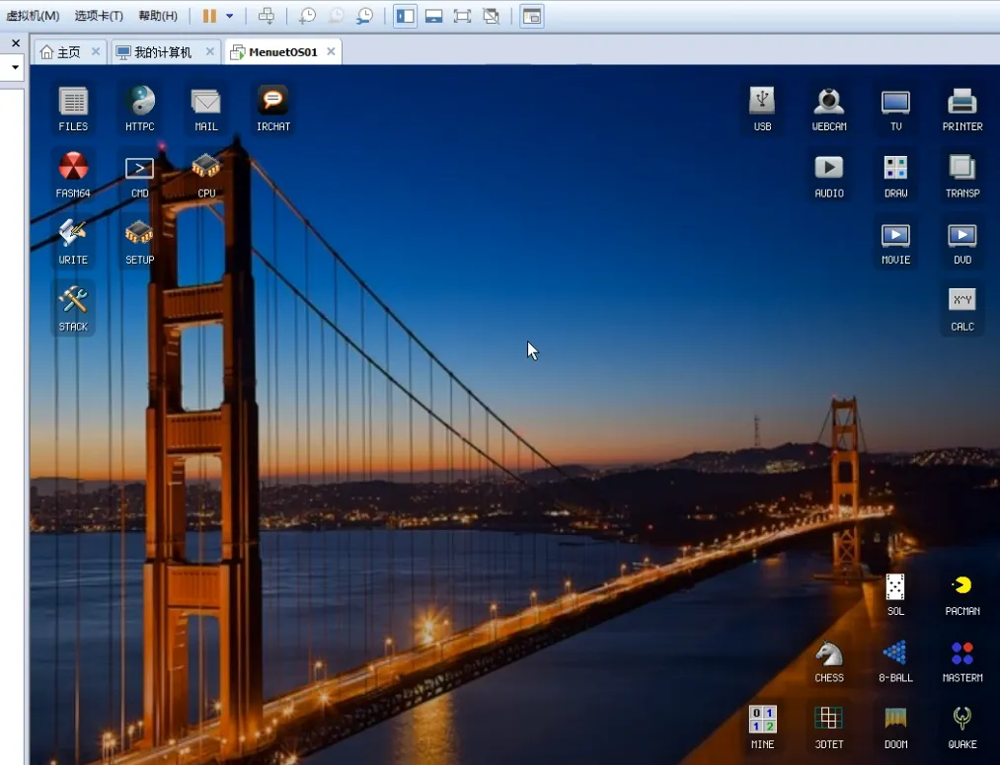

### 功能

**蜘蛛纸牌**

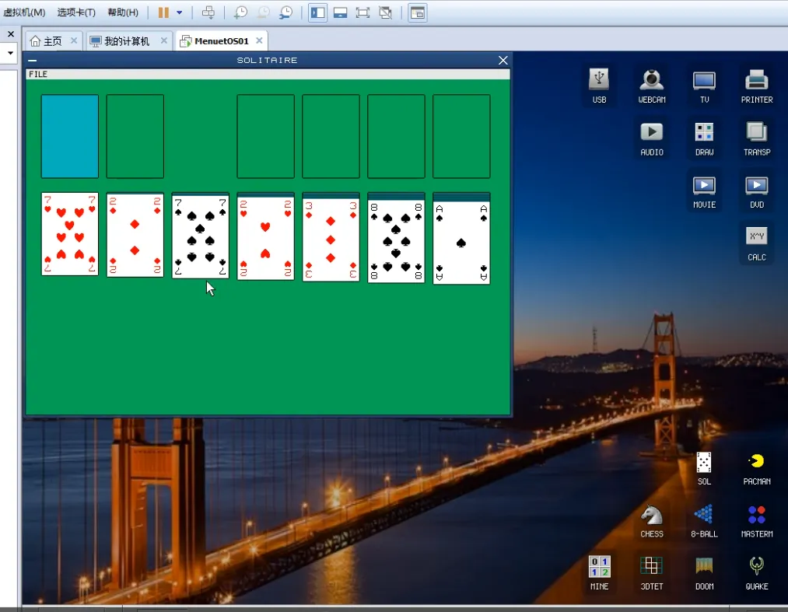

**桌球**

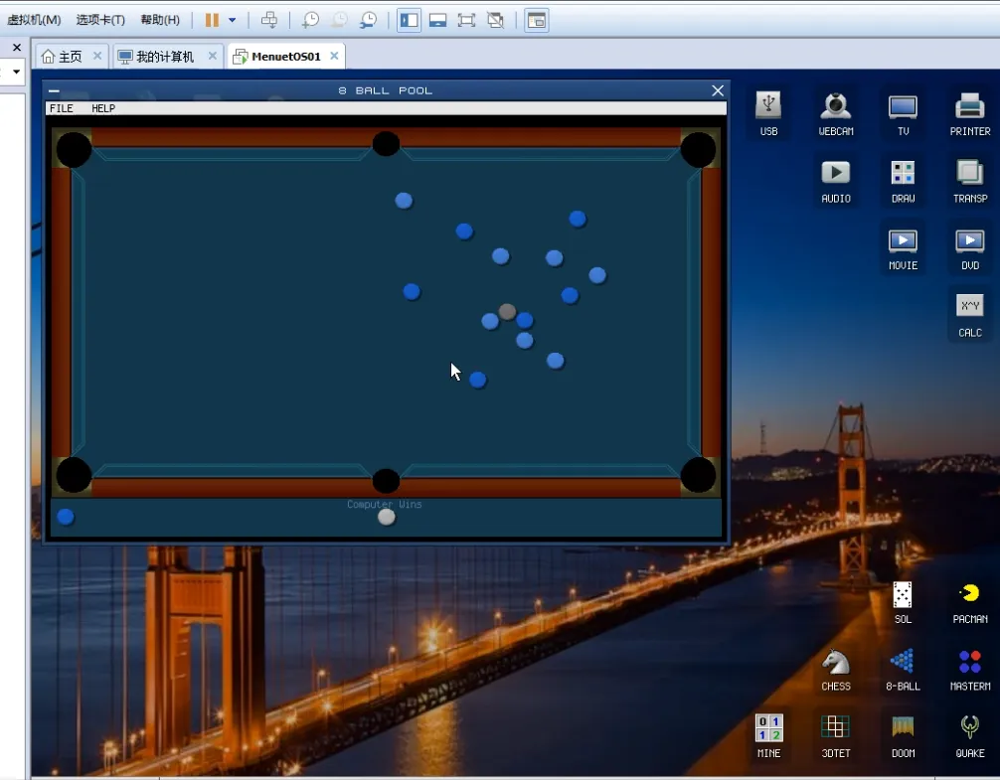

**扫雷**

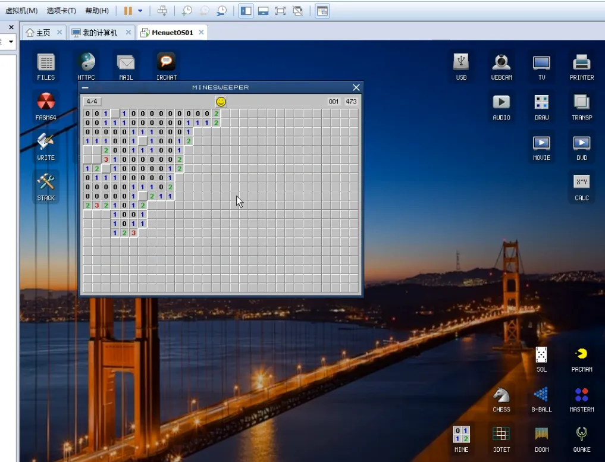

**系统工具**

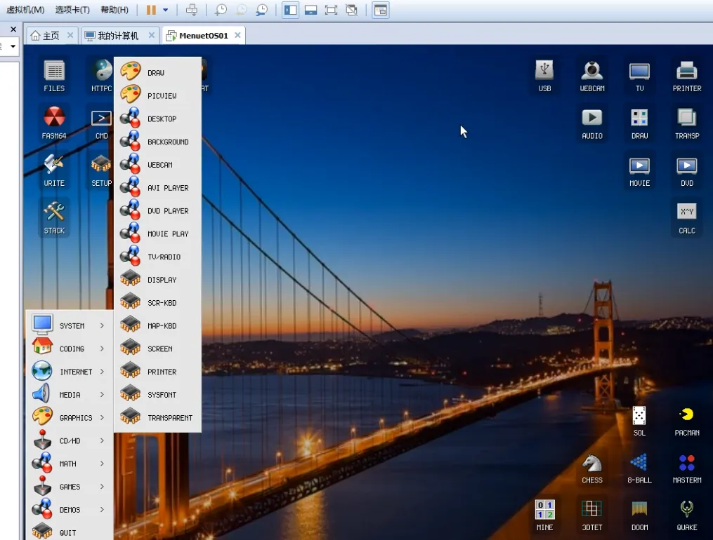

此外，系统支持**画图、计算器、音视频播放、文件管理、浏览器、邮件**等等功能，体积仅仅用了1.4M，真可谓麻雀虽小，五脏俱全。

世界未忘，汇编不死，致敬两位大神！

## 使用 8086 汇编代码编写而成：微软将 36 年前的老版系统：MS-DOS 4.00 操作系统

**开源地址：**https://github.com/microsoft/MS-DOS

提起“DOS”操作系统，可能很多 90 后和 00 后朋友都没有体验过，或者只在教科书上见过，但是，对于广大 70 后和 80 后朋友来说，印象非常深刻。

在上世纪 90 年代的 386 和 486 时代，“电脑”不叫“电脑”，它有另外一个更通俗、更普遍的称呼，叫“微机”。价格十分昂贵，只有学校、公司和机构才会配备，大多数个人家庭用户是买不起的，而且只有局域网，没有因特网。

当年，大多数 70 后和 80 后朋友第一次接触微机都是在学校的机房，一个星期顶多有三、四堂微机课。而且有时候只会讲纯理论，并不会上机，即使上机，可能也需要两三个朋友共用一台微机实践，因为数量有限。

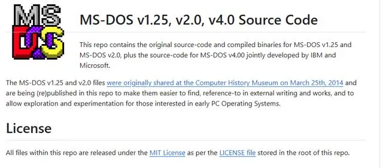

当时的电脑屏幕全是黑色的，也没有鼠标，全靠通过键盘输入字符进行操作，这就是 DOS 系统。当时老师讲课和教科书都是讲解各种 DOS 命令的使用方法，小编印象比较深的是 dir、delete 等等。

我记得当时机房里的电脑安装都是 DOS 5.X 的版本，我现在仍然清晰地记得当时老师告诉我们“最新的 DOS 版本是 6.22。”

那么，小编今天为什么要提这些事情呢？主要目的并不是怀旧，而是近日业内有一个和这些内容密切相关的重要事件。

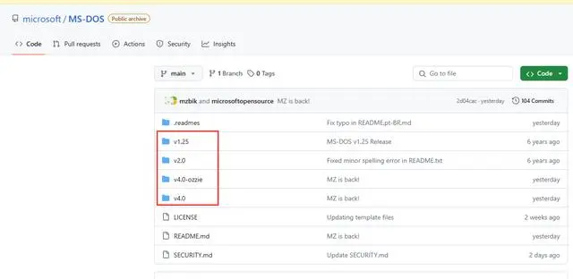

24年4 月 25 日，微软在正式开源、公布了 MS-DOS 4.00 操作系统的源代码，包括相关的二进制文件、磁盘映像和 PDF 文档（请参阅图三），允许第三方开发人员自由修改、使用。

该系统并不是全部由微软独立开发的，这是当年微软和 IBM 一起“联合研发”，使用 8086 汇编代码编写而成，迄今已经有 45 年历史。

虽然微软已经公布了 MS-DOS 4.00 的源代码，但是第三方学习爱好者朋友，如何利用这些代码实践是一个比较棘手的问题。

对此，微软提醒学习者，如果能找到当年的老电脑是最理想的，可以直接在本地安装体验。如果嫌麻烦，或者没有这些条件，也可以在开源的 PCem 和 86box 模拟器中运行。

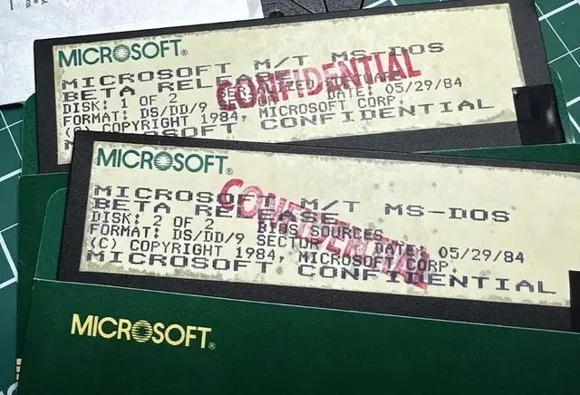

在微软发布的公告中，微软向这些代码的原作者表示感谢，其中的一部分人目前仍在微软和 IBM 公司工作，向关心、帮助过搜集、整理过这些代码的朋友表示感谢。

另外，需要补充说明的是，这并不是微软第一次公布 MS-DOS 操作系统的源代码，2014 年微软公布了更早的 MS-DOS 1.25 和的 MS-DOS 2.0 的源代码，后来又进行了补充优化，本次一并重新上传公布，请参阅图三。

对于大多数 70 后和 80 后非专业爱好者朋友来说，可能没有时间精力、条件和必要的基础知识来撸、部署这些代码，推荐大家在虚拟机上重温体验一下当年的 DOS 操作系统，这些都是我们逝去的青春。