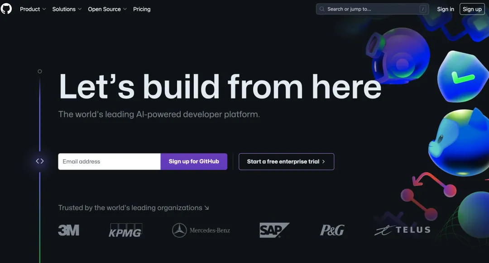

# 编程语言

[Stack Overflow Insights - 开发人员招聘、营销和用户研究](https://survey.stackoverflow.co/)

[18个优秀的Github仓库！每个开发者都应该收藏起来！ (baidu.com)](https://baijiahao.baidu.com/s?id=1761440118550869203&wfr=spider&for=pc)

[lcomplete/TechShare: 🌟 分享效率方法 🪄、优质文章 📑、编程知识 🎹、实用工具 🛠️ 和有趣内容 😄。💌 当有重要的事情需要分享时会发送 newsletter。 (github.com)](https://github.com/lcomplete/TechShare)

程序员工具参考：[HelloGitHub](https://hellogithub.com/)

## 在现在的主流编程语言中，推荐新手学习哪种语言？

在当今快速发展的技术领域，掌握编程语言成为了一项至关重要的技能。各种编程语言以其独特的优势和应用场景，在软件开发的世界中扮演着不同的角色。

编程初学者应该选择什么语言作为入门语言，又该如何深入学习呢？

### 主流语言

目前较为主流的语言包括：

**● Python** 在人工智能、机器学习以及网络爬虫开发领域占据重要地位。

**● Java** 广泛应用于企业级应用、后端服务、分布式系统和微服务开发，以及Android应用开发。

**● C 和 C++** 在系统级开发和高性能程序开发中扮演着关键角色。

**● C++** 特别适用于游戏服务端的开发。

**● Swift/Objective-C** 为iOS开发提供了强有力的支持。

**● R语言** 在统计分析领域有着广泛的应用。

**● JavaScript** 在前端和后端开发中都发挥着重要作用。

**● PHP** 是动态网站开发的重要工具。


这些语言虽然各有特点，但它们之间存在很多共通之处，精通一个，其他的学起来就比较快了。比如C是C++的基础，Java和C++在学习曲线上有一定的相似性。

### 学习路径

如果你对学习什么语言没有想法、无从下手时，可以把以下路径当做一个参考：

**● 将Python作为入门语言**

Python是一种非常适合初学者的语言，因为它的语法简洁，因此阅读Python代码就像阅读英语一样直观。它可以鼓励你专注于解决问题，而不是纠结于语言的细节，对编程初学者十分友好。

**● 接触JavaScript**

JavaScript是一种极其有用的语言，学它没有错。

尽管它不像Python那样简单，但它几乎可以在所有平台上运行，包括Mac、Windows、iOS、Android等，甚至在智能手表等新型设备上也有应用。

**● JavaScript后，试试Ruby和Ruby on Rails**

Ruby和Ruby on Rails也是值得尝试的选项。

Ruby on Rails是一个框架，可以简化Web应用程序的开发、部署和维护过程。

Ruby是一种脚本语言，而Ruby on Rails是一个工具，它通过实时映射技术和元编程技术，减少了开发者编写样板文件代码的工作量，使你可以更专注于系统的逻辑结构。

**● 熟悉HTML**

HTML虽然不是编程语言，但它对于构建网站是必不可少的。HTML是一种超文本标记语言，它为文字和图片提供了更丰富的描述形式。

新手学习编程，能顺利入门很重要，选择简单易学的编程语言作为切入点，之后再根据各个语言的适用场景和优缺点去深入学习，这是一个思路。


在学习过程中，找到适合自己的方法，让入门变得简单。但最重要的是，持续的努力和坚持是成功的关键。

## 语言学习文档网站

[极客教程 - 以工匠精神打磨精品教程 (geek-docs.com)](https://geek-docs.com/)

[菜鸟教程 - 学的不仅是技术，更是梦想！ (runoob.com)](https://www.runoob.com/)

[菜鸟教程 - 专业版,做更强的自己！ (cainiaoplus.com)](https://cainiaoplus.com/)

[菜鸟教程 - 拥抱技术,拥抱未来! (mianshi8.net)](https://mianshi8.net/)

[菜鸟教程 - 菜鸟鸭,编程始于足下！ (cainiaoya.com)](https://www.cainiaoya.com/)

[易百教程™ - 专注于IT教程和实例 (yiibai.com)](https://www.yiibai.com/)


[编程学习没方向？这58个网站助你成为程序员大牛【建议收藏】 - 哔哩哔哩 (bilibili.com)](https://www.bilibili.com/read/cv8051928/)

1.[菜鸟教程](http://www.runoob.com/)
介绍：对新手很友好的学习各类编程语言的免费网站，可能是新手用的最多的。
评分：❤❤❤❤❤

2.[极客学院wiki](http://wiki.jikexueyuan.com/)
介绍：这个wiki比菜鸟教程更加专业，学院课程收费，但wiki上教程免费(需要先登录)。
评分：❤❤❤❤

3.[易百教程](https://www.yiibai.com/)
介绍：与菜鸟教程不相上下，也是什么都有，但知名度没有菜鸟高。
评分：❤❤❤❤

4.[W3School](http://www.w3school.com.cn/)
介绍：与上面三个不相上下，各有各的特点。
评分：❤❤❤

5.[CSDN](http://feed.csdn.net/) & [博客园](https://www.cnblogs.com/) & [知乎](https://www.zhihu.com/) & [简书](https://www.jianshu.com/)...
介绍：两个都是知识博客类的社区网站，分享自己的IT知识，但滥竽充数、转发盗用现象一直存在。
评分：❤❤❤

6.[GitHub](https://github.com/)
介绍：程序员的天堂，用于放置自己代码、学（抄）习（袭）他人代码的外国网站。
评分：❤❤❤❤❤❤❤❤❤❤❤

7.[中国大学MOOC](https://www.icourse163.org/) & [网易云课堂](https://study.163.com/) & [慕课网](https://www.imooc.com/) & [腾讯课堂](https://ke.qq.com/) & [哔哩哔哩](https://www.bilibili.com/) &...
介绍：中国大学MOOC和bilibili全课程免费，里面有Python、Java、C等等的视频教程。其他几个网站有免费的课程也有收费的，某些免费课程很不错。
评分：:❤❤❤❤❤

8.[Fenby](http://www.fenby.com/)
介绍：号称是最好的IT图书阅读平台，里面有书籍、视频、论坛等等。
评分：❤❤❤❤

9.[编程中国](https://www.bccn.net/)
介绍：有很多资源、帖子、论坛、文档，本人刚发现的网站。
评分：❤❤❤❤

10.[开源中国社区](https://www.oschina.net/)
介绍：号称中国最好的开源社区。
评分：❤❤❤❤❤

11.[脚本之家](https://www.jb51.net/)
介绍：不是做脚本的脚本网站，里面的广告和内容一样多，但网站建设类资源非常丰富。
评分：❤❤❤

12.[思否](https://segmentfault.com/)
介绍：人气不高的贴吧类网站。
评分：❤❤

13.[stackoverflow](https://stackoverflow.com/)
介绍：国外干货聚集地。
评分：❤❤❤❤❤❤

14.[codecanyon](https://codecanyon.net/)
介绍：国外卖代码的网站。

15.[livecoding](https://www.liveedu.tv/)
介绍：全球程序员实时交流的社交平台。

15.[hour of code](https://hourofcode.com/)
介绍：一小时学编程网。

16.[51CTO](http://www.51cto.com/)
介绍：IT资讯网站。

17.[编程学习网](http://www.phpxs.com/)
介绍：跟前四个差不多，也是提供免费教程。
评分：❤❤❤❤

18.[coursera](https://www.coursera.org/)
介绍：跟网易云公开课差不多，有斯坦福大学等国外知名大学的视频课程。

19.[edx](https://www.edx.org/)
介绍：跟楼上差不多，由美国哈佛大学和麻省理工学院于2012年联合创办。

[计算机大学珍藏的30个宝藏网站，堪称程序员的充电站，想学编程不能错过 - 知乎 (zhihu.com)](https://zhuanlan.zhihu.com/p/431733750)


[C语言中文网：C语言程序设计门户网站(入门教程、编程软件) (biancheng.net)](https://c.biancheng.net/index.html)


[现代 JavaScript 教程](https://zh.javascript.info/)

[JavaScript - 学习 Web 开发 | MDN (mozilla.org)](https://developer.mozilla.org/zh-CN/docs/Learn/JavaScript)

## X分钟学习一门语言

[Learn X in Y Minutes: Scenic Programming Language Tours](https://learnxinyminutes.com/)

## 计算机自学指南

计算机自学指南由开发者 @PKUFlyingPig 开源，标星 15.4K 。下图是 CS自学指南的目录，可以看到包含计算机学科各个方向，比如计算机基础操作系统、计算机网络。还有一些衍生学科，比如数学等等。


计算机知识体系庞杂，没有人能在所有方向深耕，所以计算机自学指南不是开发者写的一本厚厚的书籍，而是针对某个方向整理了优质的学习资源和公开课。

比如 Web 开发下，推荐了三个最新的公开课，比如 MIT 的 Web 开发课堂、斯坦福的 Web 应用程序课程。


开源地址：[PKUFlyingPig/cs-self-learning: 计算机自学指南 (github.com)](https://github.com/PKUFlyingPig/cs-self-learning)

## 学习路径

### 1、编程

大多数计算机专业本科教学以程序设计“导论”作为开始。这类课程的最佳版本不仅能满足初学者的需要，还适用于那些在初学编程阶段遗漏了某些有益的概念和程序设计模式的人。

对于这部分内容，我们的标准推荐是这部经典著作：**《计算机程序的构造和解释》**。在网络上，这本书既可供**免费阅读（英文版）**

我们建议至少学完 SICP 的前三章，并完成配套的习题。如果需要额外的练习，可以去解决一些小的程序设计问题，比如**exercism**。


### 2、计算机架构

计算机架构——有时候又被称为“计算机系统”或者“计算机组成”——是了解软件底层的的重要视角。根据我们的经验，这是自学的软件工程师最容易忽视的领域。

**《计算机系统要素》**，又名“从与非门到俄罗斯方块”（“Nand2Tetris”）。这本书规模宏大，让读者对计算机内的所有部分如何协同工作有完全的认识。这本书的每一章节对应如何构建计算机整体系统中的一小部分，从用 HDL（硬件描述语言）写基本的逻辑门电路出发，途经 CPU 和汇编，最终抵达诸如俄罗斯方块这般规模的应用程序。

我们推荐把此书的前六章读完，并完成对应的项目练习。这么做，你将更加深入地理解，计算机架构和运行其上的软件之间的关系。

这本书的前半部分（包括所有对应的项目）均可从**Nand2Tetris 的网站上**免费获得。


> 硬件是平台。
>
> — Mike Acton, Engine Director at Insomniac Games

### 3、算法与数据结构

正如几十年来的共识，我们认为计算机科学教育所赋予人们的最大能量在于对常见算法和数据结构的熟悉。此外，这也可以训练一个人对于各种问题的解决能力，有助于其他领域的学习。

关于算法与数据结构，有成百上千的书可供使用，但是我们的最爱是 Steven Skiena 编写的 **《算法设计手册》**。显而易见，他对此充满热爱，迫不及待地想要帮助其他人理解。在我们看来，这本书给人一种焕然一新的体验，完全不同于那些更加经常被推荐的书。

至于练习，我们推荐学生在**Leetcode**上解决问题。Leetcode 上的问题往往有趣且带有良好的解法和讨论。此外，在竞争日益激烈的软件行业，这些问题可以帮助你评估自己应对技术面试中常见问题的能力。我们建议解决大约 100 道随机挑选的 Leetcode 问题，作为学习的一部分。

最后，我们强烈推荐 **《怎样解题》**。这本书极为优秀且独特，指导人们解决广义上的问题，因而一如其适用于数学，它适用于计算机科学。


> 我可以广泛推荐的方法只有一个：写之前先思考。
>
> — Richard Hamming

### 4、数学知识

从某个角度说，计算机科学是应用数学的一个“发育过度”的分支。尽管许多软件工程师试图——并且在不同程度上成功做到——忽视这一点，我们鼓励你用学习来拥抱数学。如若成功，比起那些没有掌握数学的人，你将获得巨大的竞争优势。

对于计算机科学，数学中最相关的领域是“离散数学”，其中的“离散”与“连续”相对立，大致上指的是应用数学中那些有趣的主题，而不是微积分之类的。由于定义比较含糊，试图掌握离散数学的全部内容是没有意义的。较为现实的学习目标是，了解逻辑、排列组合、概率论、集合论、图论以及密码学相关的一些数论知识。考虑到线性代数在计算机图形学和机器学习中的重要性，该领域同样值得学习。

学习离散数学，我们建议从 **László Lovász 的课程笔记**开始。Lovász 教授成功地让这些内容浅显易懂且符合直觉，因此，比起正式的教材，这更适合初学者。

对于更加高阶的学习，我们推荐 **《计算机科学中的数学》**，MIT 同名课程的课程笔记，篇幅与书籍相当（事实上，现已出版）。

对于线性代数，我们建议从 **Essence of linear algebra** 系列视频开始，然后再去学习 Gilbert Strang 的**《线性代数导论》**


> 如果人们不相信数学是简单的，那么只能是因为他们没有意识到生活有多么复杂。
>
> — John von Neumann

### 5、操作系统

**《操作系统概念》**（“恐龙书”）和 **《现代操作系统》**是操作系统领域的经典书籍。二者都因为写作风格，长达 1000 页的篇幅以及每隔几年就增加内容来鼓励人们购买“最新版本”招致了一些批评。

**《操作系统导论》（Operating Systems: Three Easy Pieces）**是一个不错的替代品，并且**可在网上免费获得（英文版）**。我们格外喜欢这本书的结构，并且认为这本书的习题很值得一做。

在读完《操作系统导论》后，我们鼓励你探索特定操作系统的设计。可以借助“{OS name} Internals”风格的书籍。

为了巩固对操作系统的理解，阅读小型系统内核的代码并且为其增加特性是一个很不错的方法。


### 6、计算机网络

鉴于有那么多关于网络服务端和客户端的软件工程，计算机网络是计算机科学中价值最为“立竿见影”的领域之一。我们的学生，系统性地学习了计算机网络，最终能够理解那些曾困扰他们多年的术语、概念和协议。

在这一主题上，我们最爱的书籍是 **《计算机网络：自顶向下方法》**。书中的小项目和习题相当值得练习，尤其是其中的“Wireshark labs”（**这部分在网上可以获得**）。

对于计算机网络的学习，做项目比完成小的习题更有益。一些可能的项目有：HTTP 服务器，基于 UDP 的聊天 APP、**迷你TCP栈**、代理、负载均衡器或者分布式哈希表。


> 你无法盯着水晶球预见未来，未来的互联网何去何从取决于社会。
>
> — Bob Kahn

### 7、数据库

比起其他主题，自学数据库系统需要更多的付出。这是一个相对年轻的研究领域，并且出于很强的商业动机，研究者把想法藏在紧闭的门后。此外，许多原本有潜力写出优秀教材的作者反而选择了加入或创立公司。

鉴于如上情况，我们鼓励自学者大体上抛弃教材，而是从**2015 年春季学期的 CS 186 课程**（Joe Hellerstein 在 Berkeley 的数据库课程）开始，然后前往阅读论文。

对于初学者，有一篇格外值得提及的论文：“**Architecture of a Database System**”。这篇论文提供了独特的对关系型数据库管理系统（RDBMS）如何工作的高层次观点，是后续学习的实用梗概。

**《Readings in Database Systems》**，或者以**数据库“红书”**更为人知，是由 Peter Bailis，Joe Hellerstein 和 Michael Stonebraker 编纂的论文合集。对于那些想要在 CS 186 课程的水平更进一步的学习者，“红书”应当是下一步。

如果你坚持一定要一本导论教材，那我们推荐 Ramakrishnan 和 Gehrke 所著的 **《数据库管理系统：原理与设计》**。

如果没有编写足够数量的代码，很难巩固数据库理论。CS 186 课程的学生给 Spark 添加特性，倒是不错的项目，不过我们仅仅建议从零实现一个简单的关系型数据库管理系统。自然，它将不会有太多的特性，但是即便只实现典型的关系型数据库管理系统每个方面最基础的功能，也是相当有启发的。


### 8 编程语言与编译器

多数程序员学习编程语言的知识，而多数计算机科学家学习编程语言 *相关* 的知识。这使得计算机科学家比起程序员拥有显著的优势，即便在编程领域！因为他们的知识可以推而广之：相较只学习过特定编程语言的人，他们可以更深入更快速地理解新的编程语言。

权威的导论书籍是**《编译原理》**，通常称为“龙书”。不幸的是，这本书不是为自学者而设计的，而是供教师从中挑选一些主题用于 1-2 学期的教学。因此十分重要的是，你需要从中甄选主题，而且最好是在导师的帮助下。

对于项目练习，我们建议为诸如 COOL 的简单教学语言或者你所感兴趣的某个语言的一个子集写一个编译器。如果感觉这样的项目让人生畏，可以先从 **Make a Lisp**开始，在一步步的指引下完成项目。


> 不要做一个只写样板代码的程序员。相反，给用户和其他程序员创造工具。从纺织工业和钢铁工业中学习历史教训：你想制造机器和工具，还是操作这些机器？
>
> — Ras Bodik 在他的编译器课程伊始

### 9 分布式系统

随着计算机在数量上的增加，计算机同样开始**分散((。尽管商业公司过去愿意购买越来越大的大型机，现在的典型情况是，甚至很小的应用程序都同时在多台机器上运行。思考这样做的利弊权衡，即是分布式系统的研究所在，也是越来越重要的一项技能。

对于自学者，我们推荐的教材是 Maarten van Steen 和 Andrew Tanenbaum 所著的《分布式系统原理与范型》（**中文第二版**，**英文第三版**）。相较之前的版本，第三版有巨大的改进，并且多亏了其作者的慷慨，这本书在网上可以免费获得。考虑到分布式系统是一个迅速变化的领域，没有教材可以完全作为路标指引，不过就我们所见，这本书是基础扎实的最佳总览。

不管选择怎样的教材或者其他辅助资料，学习分布式系统必然要求阅读论文。**这里**有一个不错的论文清单.


## 如何成为 xxx 程序员

可能正因为编程听起来“很先进”，所以我才十分想学，蛋却不知从何下手，当时真希望有人能**给我指条路**。告诉我：

- 需要学什么（技术关键字）
- 学习路线（学习的顺序）

**编程有路，开源为径** 我在开源世界找了答案。我从 GitHub 上收集了包含：Web 开发、AI、大数据、Go、React 等方面的学习线路项目，组成了**编程学习路线集合**。这些开源项目以路线图的形式展示了需要学习的知识和顺序，希望可以让小伙伴们**不再经历不知道学什么的迷茫期，快速进入学习+成长的高速通道**。

### 1、developer-roadmap（Web 程序员）

**Star 数**：162k

该项目是目前 GitHub 上技术路线关注度最高的开源项目，它涵盖了 Web 开发相关的前端、后端、运维 3 个方面，并通过线路图直观地表现出来，还翻译成了多种语言其中就有**中文版**。🤫


> 地址：https://github.com/kamranahmedse/developer-roadmap

### 2、game-programmer（游戏程序员）

**Star 数**：12.9k

游戏程序员的学习路径图。一位游戏开发大神开源的学习线路，希望能够帮助向往游戏开发的你 or 你的孩子，走上游戏开发这条“不归路”。👻


> 地址：https://github.com/miloyip/game-programmer

同类型的项目：https://github.com/utilForever/game-developer-roadmap

### 3、AI-Expert-Roadmap（人工智能）

**Star 数**：12.7k

这份学习线路图标记了成为人工智能专家需要掌握的知识点，还包含了数据工程师等分支。如果你想成为一名人工智能专家，千万不要相信什么《零基础 30 天学会人工智能》，学 AI 没有那么简单，需要学习的东西很多，除非你有很好的数学底子和编程基础可以快速拿下，否则还是慢慢来吧。所以 AI 工程师薪水高是有门槛的...🤧


> 地址：https://github.com/AMAI-GmbH/AI-Expert-Roadmap

另一个项目：https://github.com/ZuzooVn/machine-learning-for-software-engineers

### 4、data-engineer-roadmap（数据工程师）

**Star 数**：7.6k

随着“万物”皆互联，所产生的数据也是巨大的。随之而来数据存储是一个很大的问题，数据工程师就是负责存储和管理海量数据的程序员（大数据工程师），有了稳定海量的数据服务后，数据分析师和数据科学家（AI）就能从数据中挖掘出更大的价值！🤩


> 地址：https://github.com/datastacktv/data-engineer-roadmap

### 5、Android 和 iOS（客户端开发者）


> Android：https://github.com/mobile-roadmap/android-developer-roadmap
>
> 
>
> iOS：https://github.com/BohdanOrlov/iOS-Developer-Roadmap

### 6、awesome-quality-assurance-roadmap（测试工程师）

**Star 数**：600+

测试是软件开发重要的步骤也产品质量的保证，十分重要！优秀的测试工程师善用自动化的方式提高效率，这份测试工程师学习路径就包含这部分，推荐给大家。🤪


> 地址：https://github.com/fityanos/awesome-quality-assurance-roadmap

## 如何学某一门编程技术

自助区，选你所爱

- Go：https://github.com/Alikhll/golang-developer-roadmap
- React：https://github.com/adam-golab/react-developer-roadmap
- Rust Web：https://github.com/anshulrgoyal/rust-web-developer-roadmap
- ASP.NET：https://github.com/MoienTajik/AspNetCore-Developer-Roadmap
- Java：https://github.com/s4kibs4mi/java-developer-roadmap
- Flutter：https://github.com/DroidsOnRoids/flutter-roadmap
- NLP：https://github.com/graykode/nlp-roadmap

## 计算机教育中缺失的一课

GitHub：[missing-semester-cn/missing-semester-cn.github.io：CS缺失学期中文版](https://github.com/missing-semester-cn/missing-semester-cn.github.io)

在线地址：[计算机教育中缺失的一课 · the missing semester of your cs education (missing-semester-cn.github.io)](https://missing-semester-cn.github.io/)

## 常见问题解答

### 1 人工智能/计算机图形学/XX主题怎么样？

[动手实战人工智能 AI By Doing — 动手实战人工智能 AI By Doing](https://aibydoing.com/intro)

我们试图把计算机科学主题清单限制到那些我们认为**每一个软件工程师**都应该了解的内容，不限于专业或行业。拥有了这些基础，你将能更加轻松地挑选教材或论文，然而无需指引地学习核心概念。在这里，我们给出一些其他常见主题的自学起点：

- 人工智能：通过观看视频并完成Pacman项目来学习 **Berkeley 的 AI 课程**。至于教材，使用 Russell 和 Norvig 编写的 **《人工智能：一种现代方法》**。
- 机器学习：学习吴恩达在 Coursera 上的课程。耐心学习，先确保理解了基础概念再奔向类如深度学习的诱人新主题。
- 计算机图形学：学习 **Berkeley CS 184 课程**的材料，使用**《计算机图形学：原理及实践》**作为教材。

[315386775/DeepLearing-Interview-Awesome-2024: AIGC-interview/CV-interview/LLMs-interview面试问题与答案集合仓，同时包含工作和科研过程中的新想法、新问题、新资源与新项目 (github.com)](https://github.com/315386775/DeepLearing-Interview-Awesome-2024)

### 2 一定要严格遵守推荐的学习次序吗？

事实上，所有主题之间都有一定程度的重叠，彼此循环引用。以离散数学和算法的关系为例：先学习数学可以帮助你更深入地分析和理解算法，然而先学习算法可以为学习离散数学提供更大的动力和应用背景。理想情况下，你将在你的职业生涯多次重温二者。

因此，我们所推荐的次序主要是为了帮助你**起步**……如果你出于某种强烈的原因而倾向以不同的顺序学习，那也没有关系，勇敢开始吧！不过在我们看来，最重要的“先决条件”是：先学计算机架构再学操作系统或数据库，先学计算机网络和操作系统再学分布式系统。

### 3 这份指引的目标受众是？

我们面向自学的软件工程师、培训班学生、“早熟的”高中生或者想要通过自学补充正式教育的大学生。关于何时开启这段自学旅程，完全取决于个人，不过多数人在有一定的职业经历后深入学习计算机科学理论会获益匪浅。比如：我们注意到，如果学生在工作中曾经使用过数据库，他们会**喜爱**学习数据库系统课程；如果学生从事过一两个 Web 项目，他们会**喜爱**学习计算机网络。

### 4 XX 编程语言怎么样?

学习一门特定的编程语言和学习计算机科学的一个领域完全不在一个维度——相比之下，学习语言**容易**且**缺乏价值**。如果你已经了解了一些语言，我们强烈建议遵照我们的指引，然后在学习的空当中习得语言，或者暂且不管以后再说。如果你已经把编程学得不错了（比如学完了《计算机程序的构造和解释》），尤其是如果你学习过编译器，那么面对一门新的语言，你只需要花一个周末稍多的时间即可基本掌握。

### 5 XX 流行技术怎么样?

没有任何一种技术的重要程度可以达到学习其使用足以成为计算机科学教学的核心部分。不过，你对学习那门技术充满热情，这很不错。诀窍是先从特定的技术回退到基本的领域或概念，判断这门流行技术在技术的宏观大局中位于何处，然后才深入学习这门技术。

## DevOps 技能提升神器：2624 个练习让你炉火纯青

**项目地址**：https://github.com/bregman-arie/devops-exercises

### 简介

DevOps-Exercises是一个开源项目，它提供了各种与DevOps和SRE（Site Reliability Engineering）相关的技术问题和练习。这个项目旨在帮助开发人员、运维人员以及对DevOps工作感兴趣的人们提升他们的技能和知识。它涵盖了多个技术领域，包括Linux、Jenkins、AWS、SRE、Prometheus、Docker、Python、Ansible、Git、Kubernetes、Terraform、OpenStack、SQL、NoSQL、Azure、GCP、DNS、Elastic、网络和虚拟化等。

### 项目内容

DevOps-Exercises目前提供了2624个练习题和问题，涵盖了各种技术主题。下面是一些主要内容的列表：

- **Linux**：Linux操作系统的相关问题和练习，包括命令行操作、文件系统、进程管理等。
- **Jenkins**：Jenkins持续集成和持续交付工具的问题和练习，涉及流水线配置、插件使用、自动化构建等。
- **AWS**：亚马逊云服务（Amazon Web Services）的问题和练习，包括EC2实例、S3存储、自动扩展等。
- **SRE**：Site Reliability Engineering的问题和练习，关注系统可靠性、监控、故障处理等方面。
- **Prometheus**：Prometheus监控系统的问题和练习，涉及指标收集、警报规则、可视化等。
- **Docker**：Docker容器化平台的问题和练习，包括镜像构建、容器编排、网络配置等。
- **Python**：Python编程语言的问题和练习，涉及语法、数据结构、模块开发等。
- **Ansible**：Ansible自动化工具的问题和练习，包括剧本编写、配置管理、部署等。
- **Git**：Git版本控制系统的问题和练习，涉及分支管理、合并、团队协作等。
- **Kubernetes**：Kubernetes容器编排平台的问题和练习，包括部署、扩展、服务发现等。
- **Terraform**：Terraform基础设施即代码工具的问题和练习，关注资源管理、模块化等。
- **OpenStack**：OpenStack云计算平台的问题和练习，包括虚拟机管理、网络配置、存储等。
- **SQL**：关系型数据库SQL语言的问题和练习，包括查询、更新、事务等。
- **NoSQL**：NoSQL数据库的问题和练习，涵盖MongoDB、Cassandra、Redis等。
- **Azure**：微软Azure云服务的问题和练习，包括虚拟机、容器服务、数据库等。
- **GCP**：谷歌云平台（Google Cloud Platform）的问题和练习，包括计算、存储、网络等。
- **DNS**：域名系统（Domain Name System）的问题和练习，涉及解析、记录类型、安全等。
- **Elastic**：Elasticsearch搜索引擎的问题和练习，包括索引、搜索、聚合等。
- **网络**：计算机网络的问题和练习，涵盖协议、路由、安全等方面。
- **虚拟化**：虚拟化技术的问题和练习，包括VMware、KVM、容器虚拟化等。

### 使用方法

使用DevOps-Exercises项目进行学习和练习非常简单。按照以下步骤操作：

1. 访问DevOps-Exercises的GitHub仓库：https://github.com/bregman-arie/devops-exercises。
2. 在仓库主页上，你可以找到所有的问题和练习，它们按照不同的技术领域进行分类。
3. 选择你感兴趣的主题或技术领域，点击进入对应的文件夹。
4. 在每个文件夹中，你将找到相关的问题和练习的文件。这些文件通常采用Markdown格式，其中包含了问题描述、练习要求和可能的解决方案。
5. 阅读问题描述并尝试解决练习。你可以使用自己喜欢的编辑器、命令行工具或在线开发环境来完成练习。
6. 如果遇到困难或有疑问，可以参考每个问题文件夹中的解决方案文件，其中包含了问题的详细解答和示例代码。
7. 继续选择其他主题或技术领域的问题和练习，不断提升你的技能和知识。

请注意，DevOps-Exercises中的问题和练习并不代表实际面试中的问题。它们更多地用于学习和提升技能，帮助你理解和掌握各种技术和概念。因此，在准备面试时，你应该结合实际的工作经验和面试要求，深入学习和理解相关的知识和技能。

### 总结

DevOps-Exercises是一个广泛涵盖DevOps和SRE领域的开源项目，提供了大量的问题和练习，涵盖了Linux、Jenkins、AWS、SRE、Prometheus、Docker、Python、Ansible、Git、Kubernetes、Terraform、OpenStack、SQL、NoSQL、Azure、GCP、DNS、Elastic、网络和虚拟化等多个技术领域。

通过使用DevOps-Exercises，你可以提升自己在这些技术领域的技能和知识，并加深对DevOps和SRE工作的理解。这个项目可以作为准备面试或学习自我提升的有价值资源。然而，需要注意的是，并不需要学习该仓库中提到的所有主题和技术，而是结合自己的需求和实际情况进行选择和学习。


## build-your-own-x：打造属于自己的超级技术栈

项目地址：**https://github.com/codecrafters-io/build-your-own-x**

`Build-Your-Own-X`旨在帮助我们从零开始构建各种各样的技术项目，从编程语言解释器到数据库，再到操作系统和游戏引擎，无所不包！

`build-your-own-x` 收集了海量的计算机领域学习资源，涵盖了以下主题：

- 编程语言解释器：例如 Python、JavaScript、C++ 等
- 数据库：例如 MySQL、Redis、MongoDB 等
- 操作系统：例如 Linux、Windows、macOS 等
- 网络协议：例如 HTTP、TCP/IP 等
- 机器学习：例如 TensorFlow、PyTorch 等
- 游戏引擎：例如 Unity、Unreal Engine 等 ...

每个主题都包含一系列教程，从基础概念到高级实践，循序渐进地帮助你掌握相关技术的核心知识和技能。

#### 项目特色

- **内容全面：**涵盖了各种热门技术主题，满足不同开发者的学习需求。
- **教程详细：**每个教程都包含详细的代码示例和解释，即使是初学者也能轻松理解。
- **循序渐进：**教程从基础概念开始，逐步深入，帮助开发者掌握相关技术的完整知识体系。
- **社区活跃：**项目拥有一个活跃的社区，开发者可以在此交流学习心得，互相帮助。

## 桌面软件开发

[sudhakar3697/awesome-electron-alternatives：精选的 Electron 替代品列表。 (github.com)](https://github.com/sudhakar3697/awesome-electron-alternatives)

## 软件架构

[simskij/awesome-software-architecture：软件架构资源精选列表 (github.com)](https://github.com/simskij/awesome-software-architecture)

[mehdihadeli/awesome-software-architecture：🚀精选的精彩文章、视频和其他资源列表，用于学习和实践软件架构、模式和原则。 (github.com)](https://github.com/mehdihadeli/awesome-software-architecture)

## 面试题

[yangshun/tech-interview-handbook：💯为忙碌的软件工程师精心策划的编码面试准备材料 (github.com)](https://github.com/yangshun/tech-interview-handbook)

## 关于各种有趣话题的精彩列表

[sindresorhus/awesome：😎关于各种有趣话题的精彩列表 (github.com)](https://github.com/sindresorhus/awesome)

## 开发人员(者)路线

官网：https://roadmap.sh/

开源地址：https://github.com/kamranahmedse/developer-roadmap

roadmap.sh 是社区的努力 创建路线图、指南和其他教育内容，以帮助指导开发人员 在选择路径并指导他们的学习时。

## 关于各种有趣话题的精彩列表

开源项目地址：https://github.com/sindresorhus/awesome

## freeCodeCamp.org 的开源代码库和课程。

项目开源地址：https://github.com/freeCodeCamp/freeCodeCamp

官网：[免费学习编程 — 为忙碌的人提供的编码课程 (freecodecamp.org)](https://www.freecodecamp.org/)

freeCodeCamp.org 提供了多项免费的开发人员认证。这些认证中的每一个都涉及构建 5 个必需的 Web 应用程序项目，以及数百个可选的编码挑战，以帮助您为这些项目做好准备。我们估计每个认证都需要初学者大约 300 小时才能获得。

freeCodeCamp.org 课程中的这 50 个项目中的每一个都有自己的敏捷用户故事和自动化测试。这些可帮助您逐步构建项目，并确保在提交之前已完成所有用户情景。

## 开发人员的快速参考和备忘清单

### 中文版

项目地址：https://github.com/jaywcjlove/reference

在线地址：

- https://wangchujiang.com/reference/
- https://quickref.cn/

### 英文版

项目地址：https://github.com/Fechin/reference

在线地址：https://cheatsheets.zip/

### 项目简介

`Reference`是一个为开发人员准备的快速参考备忘清单，涵盖了各种编程语言、框架、工具和命令行工具的常用语法和用法。它将各种技术知识浓缩成简短易懂的速查表，方便我们快速查阅和记忆。

Reference 项目收录了大量编程相关的速查表，涵盖以下内容：

- 编程语言：JavaScript、Python、Java、C++、Go、Rust、PHP、C# 等
- 框架和库：React、Vue、Spring、Django、Express、TensorFlow、NumPy 等
- 工具和命令行：Git、Docker、Vim、Linux 命令、MySQL 等
- 系统和网络：HTTP、TCP/IP、DNS、Linux 内核参数等


此外，项目还提供了以下功能：

- 支持离线使用，可下载所有速查表到本地
- 支持搜索，快速找到所需内容
- 支持自定义，可添加自己创建的速查表


### 项目特点

- 内容全面：收录了大量编程相关的速查表，涵盖了开发人员日常工作中常用的各种技术
- 简洁易用：采用简洁的排版和语法，方便快速查阅
- 快速检索：支持全文搜索，可快速找到所需内容
- 持续更新：项目维护者会定期更新内容，确保最新技术得到收录

### 快速使用

Reference 项目提供了多种快速使用的方式：

#### 方式一：在线使用

项目作者提供了一个在线体验站，可以直接访问:

```bash
https://wangchujiang.com/reference/
```

#### 方式二：部署到服务器

如果你有自己的服务器，可以直接部署到你的服务器上面使用

第一种：克隆 gh-pages 分支代码到你的静态服务

```bash
$ git clone https://github.com/jaywcjlove/reference.git -b gh-pages
```

第二种：Docker部署

```bash
$ docker pull wcjiang/reference

$ docker run --name reference --rm -d -p 9667:3000 wcjiang/reference:latest
# Or
$ docker run --name reference -itd -p 9667:3000 wcjiang/reference:latest
```

### 项目展示

这是项目首页，简约美观。


项目包含了非常多的内容，


直接点击想查的技术卡片查看详细内容，比如我想看看curl命令的使用方法。


可以看到，里面包含了curl命令的简介，请求方式，参数使用和详细示例。

其他的内容也是类似，就不一一展示了。

小结一下，Reference 项目是一个非常实用的开发工具，可以帮助我们快速查阅各种技术知识。开源君强烈推荐所有开发人员收藏这个项目，并将其作为日常开发工作中的必备工具。

更多项目细节，可以到项目地址进行查看：

项目地址：https://github.com/jaywcjlove/reference

## 优雅的程序员研发小抄

GitHub：https://github.com/chubin/cheat.sh

官网：https://cheat.sh/

cheat.sh。这是一个可以帮助我们快速查询命令行文档和代码示例的在线工具。它不仅功能强大，而且非常易于使用，让我们能够更高效地解决问题和学习命令行。

最近发现一个很优雅的研发资料搜索项目，可以很方便的找到我们需要的命令及代码的详解 -- cheat.sh


### 简介

图片cheat.sh 是一个优雅的研发搜索工具，可以在不同平台上使用它，只需要一行命令即可查询到想要的代码或者命令的详解，也可以理解为是我们研发人员的小抄，给我们大脑减减负。

### 性能特色

- 具有简单的 curl/browser/editor 接口。
- 涵盖了56种编程语言、多个数据库管理系统和1000多个最重要的UNIX/Linux命令。
- 提供了访问全球最佳社区驱动的速查表存储库的功能，与 StackOverflow 相媲美。
- 可以在任何地方使用，无需安装，但可以安装以供离线使用。
- 超快速，通常在100毫秒内返回结果。
- 拥有一个方便的命令行客户端 cht.sh，非常有优势和帮助，但不是必需。
- 可以直接从代码编辑器中使用，无需打开浏览器，无需更改您的思维上下文。
- 支持特殊的隐身模式，可以在完全不触摸任何按键和发出声音的情况下使用。

### 安装使用

可直接在线使用，无需安装，并支持多种形式，包括浏览器、Linux命令行和本地客户端。


如想本地安装的话，可以按如下方式：

创建一个目录用于安装 cht.sh，例如 或者您PATH 环境变量中的其他目录。

之后在命令行中运行以下命令来下载 cht.sh 并存储到指定目录中（这里以 $HOME/bin 为例）：

```bash
mkdir -p "$HOME/bin"
curl https://cht.sh/:cht.sh > "$HOME/bin/cht.sh"
chmod +x "$HOME/bin/cht.sh"
```

或者，您也可以使用以下命令将 cht.sh 安装到 /usr/local/bin 目录中：

```bash
curl -s https://cht.sh/:cht.sh | sudo tee /usr/local/bin/cht.sh && sudo chmod +x /usr/local/bin/cht.sh
```

请注意，在安装cht.sh之前，需要依赖于rlwrap模块，可以用下面命令来安装rlwrap：

```bash
sudo apt install rlwrap
```

还支持与各种编译器进行集成，具体的安装使用可以查阅项目文档。


### 具体使用

推荐直接使用官方提供的链接，这是最简单的方法。

在链接后面，指定语言、问题和相关参数。返回的结果中可能会包含有关命令使用方法和作者来源等信息。


比如使用curl进行在线查询

```bash
curl cheat.sh/tar
```


一些查询语言中的特性或用法，例如Python中的lambda函数用法。

```bash
curl cht.sh/python/lambda
```


另外，还支持多个编译器，例如在VS Code中可以使用vscode-snippet插件，在Sublime编辑器中可以使用cheat.sh-sublime-plugin插件。

总体来说，这个小抄工具的搜索结果堪比Stack Overflow，查询速度也非常快，通常在100毫秒以内。而且使用起来非常方便，只需一行命令即可找到所需的代码或命令。

## 编程语言排行榜

[HelloGitHub｜编程语言排名](https://hellogithub.com/report/tiobe/)

## 编程学习项目

### Build-Your-Own-X

GitHub：https://github.com/codecrafters-io/build-your-own-x

#### 简介

顾名思义，`Build-Your-Own-X`旨在帮助我们从零开始构建各种各样的技术项目，从编程语言解释器到数据库，再到操作系统和游戏引擎，无所不包！

`build-your-own-x` 收集了海量的计算机领域学习资源，涵盖了以下主题：

- 编程语言解释器：例如 Python、JavaScript、C++ 等
- 数据库：例如 MySQL、Redis、MongoDB 等
- 操作系统：例如 Linux、Windows、macOS 等
- 网络协议：例如 HTTP、TCP/IP 等
- 机器学习：例如 TensorFlow、PyTorch 等
- 游戏引擎：例如 Unity、Unreal Engine 等 ...

每个主题都包含一系列教程，从基础概念到高级实践，循序渐进地帮助你掌握相关技术的核心知识和技能。

#### 项目特色

- **内容全面：**涵盖了各种热门技术主题，满足不同开发者的学习需求。
- **教程详细：**每个教程都包含详细的代码示例和解释，即使是初学者也能轻松理解。
- **循序渐进：**教程从基础概念开始，逐步深入，帮助开发者掌握相关技术的完整知识体系。
- **社区活跃：**项目拥有一个活跃的社区，开发者可以在此交流学习心得，互相帮助。

#### 项目体验

开源君带大家来看看项目具体内容，比如 Build your own Operating System（创建你自己的操作系统）


点击 C: How to create an OS from scratch，学习一下。


这里链接到了另外一个26k的开源项目，帮助我们理解一些操作系统的基础知识，并进行一步一步深入实操。

我们再来看另外一个，比如 Build your own Docker（创建你自己的Docker）


包含了如何用多种语言（C、Go、Python、Shell等）创建属于我们自己的Docker，有的还有视频。


点击 Linux containers in 500 lines of code 进去看看


这是一个实操的目录和教学指南，非常详细，让我们可以更好地理解项目的实现原理和细节。

另外，开源君发现，学习这些技术教程，不仅有 C、C++、Java、Python、Go 很常用流行的语言，甚至还有像 Clojure、Haskell、F# 这种小众编程语言。

真的是适合各个领域、各个阶段、各个水平的学习者去学习，真的很香！


当然，学习资源再好，如果只放进收藏夹让其吃灰，就违背了初衷。

如果要下定决心深入学习某项技术，只要沉下心去跟着项目做，你的水平一定会大幅提升。

总的来说，`Build Your Own X`是一个非常有价值的开源项目，适合想深入学习编程并构建自己工具和应用程序的人。

虽然学习这个项目需要耗费时间和精力，但如果你有耐心和毅力，这将是一个很好的选择。

## 系统设计

GitHub：[ByteByteGoHq/system-design-101：使用视觉效果和简单术语解释复杂系统。帮助您准备系统设计面试。 (github.com)](https://github.com/ByteByteGoHq/system-design-101)

官网：[ByteByteGo Newsletter | Alex Xu | Substack](https://blog.bytebytego.com/)

## 编程语言开发

[#自定义编程语言 (qq.com)](https://mp.weixin.qq.com/mp/appmsgalbum?__biz=MzA4NzU0MzU2MA==&action=getalbum&album_id=2644378403898490880&subscene=159&subscene=21&scenenote=https%3A%2F%2Fmp.weixin.qq.com%2Fs%3F__biz%3DMzA4NzU0MzU2MA%3D%3D%26mid%3D2247483697%26idx%3D1%26sn%3Daabe2f0a0a83f4b4dfb3c09cf983ecb7%26chksm%3D90369b56a741124061951917535be7350891d9e667758869e6c21c45a259eca46bc2fde781b1%26scene%3D21%23wechat_redirect&nolastread=1#wechat_redirect)

# 各编程语言用途合集

分别从**编程范式**/**动态静态类型**/**强弱类型**分别描述下它们的特点和常见的开发语言。

| 分类方式                                    | 开发语言             | 特点和说明                                                   |
| ------------------------------------------- | -------------------- | ------------------------------------------------------------ |
| **按编程范式分类**                          |                      |                                                              |
| 命令式语言（`Imperative Languages`）        | C, C++               | 通过指令和状态改变描述计算过程，使用变量、循环和条件语句。   |
| 函数式语言（`Functional Languages`）        | Haskell, Lisp        | 强调函数作为基本构建块，避免状态和可变性，通常采用不可变数据。 |
| 面向对象语言（`Object-Oriented Languages`） | Java, C#             | 将数据和操作数据的方法封装在对象中，强调对象之间的交互。     |
| 声明式语言（`Declarative Languages`）       | SQL                  | 描述问题的解决方案，而不是指定如何实现它们。                 |
| **按动态静态类型分类**                      |                      |                                                              |
| 动态类型语言（`Dynamic Typing`）            | Python, JavaScript   | 在运行时进行类型检查，变量类型可以在程序执行过程中改变。     |
| 静态类型语言（`Static Typing`）             | C, C++, Java         | 在编译时进行类型检查，变量类型在编写代码时需要明确定义。     |
| **按强弱类型分类**                          |                      |                                                              |
| 强类型语言（`Strongly Typed`）              | C++, Java            | 有严格的隐式类型转换规则，不允许不安全的类型操作，提高代码安全性。 |
| 弱类型语言（`Weakly Typed`）                | JavaScript,Perl, PHP | 允许更灵活的类型转换和操作，但可能导致潜在的类型错误，开发时需谨慎。 |

### 0.`Rust`

可以根据上面提到的分类方式进行如下分类：

1. **按编程范式分类：**
   - **命令式语言（Imperative Languages）：** Rust可以被归类为命令式语言，因为它支持可变变量和通过指令来改变程序状态。
   - **函数式语言（Functional Languages）：** Rust也具有一些函数式编程特性，如`闭包`和`高阶函数`，但它通常被视为一种多范式（`multi-paradigm`）语言，因为它允许开发者在不同的编程范式之间切换。
2. **按动态静态类型分类：**
   - **静态类型语言（Static Typing）：** `Rust`是一种静态类型语言，类型检查在编译时进行，变量的类型必须在编写代码时明确定义，这有助于提高代码的安全性和性能。
3. **按强弱类型分类：**
   - **强类型语言（Strongly Typed）：** `Rust`是一种强类型语言，它有严格的类型系统，不允许不安全的类型操作，以确保内存安全和类型安全。

> 综上所述，`Rust`是一种**静态类型的、强类型的、多范式编程语言**，可用于通用编程以及具有系统级性能和内存安全性要求的各种应用领域。这使得它成为一种强大的编程语言，尤其适用于系统级编程和安全关键应用的开发。

### 1. Python

Python 是最流行、用途最广泛的语言之一。它通常用于网络开发、数据科学、机器学习等。

以下是 Python 编程语言的一些主要用途：

> Web 开发：Python 广泛用于 Web 开发，包括前端（客户端）和后端（服务器端）。流行的 Python Web 框架包括 Django、Flask 和 Pyramid。

> 数据科学和机器学习：Python 拥有强大的数据科学、科学和机器学习库，例如 NumPy、Pandas、Matplotlib、Scikit-learn。它是这些领域最常用的语言之一。

> 桌面应用程序：Python 可以与 Tkinter、PyQt、Kivy 等库一起使用，为 Linux、Windows、macOS 构建桌面应用程序。示例包括 IDE、实用程序、游戏。

> 后端开发：Python 为许多流行的网站和应用程序提供支持。它在使用 Django 或 Flask 构建的网站中用作服务器端语言。

> 科学和数值计算：Python 的 NumPy 和 SciPy 库使其非常适合科学计算、模拟、数值分析和计算科学。

> 自动化和脚本编写：Python 通常用于自动执行重复性任务并通过脚本将各种应用程序粘合在一起。

> 游戏开发：Python 使用 PyGame、Kivy、Pyglet 和 Ren’Py 等库进行游戏开发越来越受欢迎。

> 网页抓取：Beautiful Soup、Scrapy 等库使 Python 非常适合抓取网页和提取结构化数据。

> 系统脚本：Python 可用于自动化系统管理任务，使用 Ansible、SaltStack 等工具将基础设施作为代码进行管理。

> GUI 编程：Tkinter 与 Python 捆绑在一起。PyQt 和 Kivy 也是 GUI 应用程序的热门选择。

总而言之，数据科学、网络开发、自动化、科学计算是 Python 的一些主要领域。

平均工资为105,000美元。

### 2. Java

Java 是使用最广泛的编程语言之一。它通常用于后端 Web 开发、Android 应用程序开发和企业应用程序。

以下是有关 Java 及其常见用例的一些关键知识：

> Java 是一种通用的、基于类的、面向对象的编程语言，由 Sun Microsystems（现为 Oracle Corporation）于 1995 年创建。

> Java 程序通常被编译为可以在任何 Java 虚拟机 (JVM) 上运行的字节码，无论计算机体系结构如何。这种“一次编写，随处运行”的特性是 Java 的最大优势之一。

> Java 的一些主要用例包括企业应用程序、Android 应用程序、后端 Web 开发、桌面应用程序、大数据等。

> 企业应用程序——Java因其稳健性、安全性和可移植性而被广泛用于开发企业软件，如ERP系统、银行应用程序等。

> Android 开发 — Android 基于 Java 编程语言，并具有 Java SE 平台的改编版本。Java 用于构建 Android 应用程序。

> Web 开发 — Java 用于通过 Spring、Hibernate、Struts 等框架构建服务器端应用程序。它还用于通过 Quarkus 等框架构建无服务器功能。

> 桌面应用程序 — Java Swing 和 JavaFX 允许为 Windows、Linux 和 macOS 构建基于 GUI 的桌面应用程序。

> 大数据——由于其性能和可扩展性，Java 通常用于通过 Hadoop 和 Spark 等框架进行大数据处理。

> 游戏开发——Java 用于开发游戏，特别是针对使用 LibGDX 和 JavaFX 等框架的浏览器。

平均工资为10万美元。

### 3. C#

C# 是一种流行的 Microsoft 支持的语言，通常用于 Windows 桌面和移动应用程序、Unity 游戏开发以及使用 .NET 进行后端 Web 开发。

以下是有关 C# 编程及其常见用例的关键知识：

> C#（发音为 C Sharp）是 Microsoft 开发的一种多范式编程语言。它是一种类似于 C 和 C++ 的面向对象语言，但更简单。

> C# 代码被编译为一种称为 Microsoft 中间语言 (MSIL) 的中间语言，该语言在 .NET Framework 上运行。这使得 C# 程序可以在任何支持 .NET 的操作系统上运行。

> C# 的一些主要用例包括 Windows 桌面应用程序、Web 开发、游戏、移动应用程序、机器学习等。

> Windows 桌面应用程序 — C# 通常通过 Windows Presentation Foundation (WPF) 和 Windows 窗体用于构建 Windows 桌面应用程序。

> Web 开发 — ASP.NET 和 Mono 等流行框架允许使用 C# 构建 Web API、站点和服务。

> 游戏开发 — C# 广泛用于通过 Unity 等引擎开发 Windows、Xbox、移动设备的游戏。

> 移动应用程序 — Xamarin 允许使用 C# 为 Android 和 iOS 构建跨平台移动应用程序。

> 机器学习 — C# 用于通过 ML.NET、TensorFlow Sharp 等库构建和部署 ML 模型。

> 云/Web 服务 — C# 非常适合使用 .NET Core 等框架构建基于云的微服务和无服务器功能。

> 桌面/移动库 - C# 允许为 GUI、数据访问等任务构建可重用的库。

平均工资为95,000美元。

### 4. C++

C++ 是一种低级系统编程语言，通常用于游戏、操作系统、驱动程序和嵌入式系统等性能关键型应用程序。

以下是有关 C++ 及其常见用例的关键知识：

> C++是一种高效、灵活、低级的通用编程语言。它于 1979 年作为 C 语言的扩展而开发。

> C++ 支持过程式、面向对象和泛型编程。它具有类、继承、模板、异常等功能。

> C++ 代码通常被编译为机器代码以获得最大性能。它允许直接访问内存，这使其适合系统编程。

> C++ 的一些主要用例包括系统编程、游戏开发、嵌入式系统、桌面应用程序等。

> 系统编程——C++ 由于其效率和低级访问而被广泛用于开发操作系统、数据库、编译器、设备驱动程序。

> 游戏开发——大多数 AAA 游戏都是使用 C++ 开发的，因为它具有高性能和与图形库交互的能力。

> 嵌入式系统 — C++ 由于其低级功能而通常用于对微控制器、硬件、固件进行编程。

> 桌面应用程序 — C++ 与 Qt、wxWidgets 允许为 Windows、Linux 构建高性能桌面应用程序。

> 后端开发 — C++ 因其效率而为许多 Web 服务器和网络应用程序提供支持。

> 科学/数值计算——Boost 和 Eigen 等库使 C++ 非常适合科学和工程任务。

平均工资为92,000美元。

### 5. JavaScript

JavaScript 是网络的主要编程语言。它通常用于前端 Web 开发和 Node.js 后端开发。

以下是有关 JavaScript 及其常见用例的关键知识：

> JavaScript 是一种动态、弱类型且基于原型的脚本语言。它最初的设计目的是为网页添加交互性。

> JavaScript 代码直接在浏览器中在客户端执行，以提供动态和交互式行为，例如表单验证、动画、AJAX 调用等。

> 随着 Node.js 的出现，JavaScript 也可以在服务器端用于 Web 开发和构建网络应用程序。

JavaScript 的一些主要用例包括：

> 前端 Web 开发 — 用于通过浏览器向网页添加交互性和动态行为。

> 后端 Web 开发 — 通过 Node.js，JavaScript 可用于构建服务器、Web API 和网络应用程序。

> 桌面应用程序——借助 Electron 等框架，JavaScript 可以将 Web 应用程序打包成独立的桌面应用程序。

> 移动应用程序——React Native 允许使用 JavaScript 构建跨平台移动应用程序。

> 游戏开发——Phaser 和 Babylon.js 等流行框架使用 JavaScript 来开发游戏。

> 全栈开发——JavaScript 可以与 Express、React 等框架从前端到后端端到端地使用。

> 物联网/嵌入式系统——JavaScript 通过 Node.js 在各种设备和微控制器上运行。

平均工资为90,000美元。

### 6. PHP

PHP 是一种流行的服务器端脚本语言，通常用于构建内容管理系统和其他数据库驱动的网站。

以下是有关 PHP 及其常见用例的关键知识：

> PHP 是一种广泛使用的开源脚本语言，可以嵌入到 HTML 代码中以构建动态 Web 应用程序。

> 它最初是为 Web 开发而创建的，用于生成动态页面内容，但现已发展为通用编程语言。

> PHP 代码在服务器端运行并生成 HTML，然后发送到客户端。它通常与 MySQL 一起用于数据库连接。

> PHP 的一些主要用例包括：

> 内容管理系统 — PHP 为 WordPress、Drupal、Joomla 等流行的 CMS 平台提供支持。

> 电子商务网站 — 使用 Magento、OpenCart、Prestashop 等平台构建的商店广泛使用 PHP。

> 自定义 Web 应用程序 — PHP 用于构建自定义数据库驱动的网站和 Web 应用程序。

> Web 服务 — 它可用于创建 RESTful API 和 SOAP Web 服务。

> Web 框架——Laravel、Symfony、CakePHP 等流行的 PHP 框架简化了开发。

> 桌面应用程序 — PHP GTK 允许构建可以捆绑 Web 应用程序的桌面应用程序。

> Web 脚本——通常用于服务器端脚本任务，例如表单处理、用户身份验证等。

平均工资为85,000美元。

### 7. Swift

Swift 是 Apple 用于构建 iOS 和 macOS 应用程序的主要编程语言。这是一个越来越受欢迎的选择。

以下是有关 Swift 及其常见用例的关键知识：

> Swift 是 Apple 开发的通用编程语言，于 2014 年首次推出。它的设计比 Objective-C 更现代、更有弹性和更具交互性。

> Swift 代码直接编译为机器代码，使其比解释语言更快。它是完全开源的，可与 Apple 的 Cocoa 和 Cocoa Touch 框架配合使用。

> Swift 的主要用例是为 iOS、iPadOS、macOS、watchOS 和 tvOS 等 Apple 平台开发应用程序和游戏。

> iOS/iPadOS 应用程序开发 - Swift 是 Apple 推荐的用于为 iPhone 和 iPad 构建本机移动应用程序的主要语言。

> macOS 应用程序开发 - Swift 允许为 macOS 构建桌面应用程序和命令行工具。

> watchOS 应用程序开发 — 用于为 Apple Watch 操作系统创建应用程序。

> tvOS 应用程序开发 — Swift 为 Apple TV 开发的应用程序提供支持。

> 通过 SwiftUI 实现跨平台 — 新的 SwiftUI 框架允许构建跨平台工作的 UI。

> 后端 Web 服务 - Swift 可以与 Vapor 和 Kitura 等服务器端框架一起使用来构建 API。

> 游戏开发——SpriteKit 和 SceneKit 等游戏引擎使用 Swift 来开发 Apple 平台上的游戏。

平均工资为83,000美元。

### 8. R

R 是一种统计编程语言，通常用于数据分析、可视化和机器学习。它在科学、研究和金融等领域很受欢迎。

以下是有关 R 编程语言及其常见用例的关键知识：

> R 是一种用于统计分析、图形和统计计算的编程语言和软件环境。它主要用于开发统计软件和数据分析。

> R 是 20 世纪 90 年代初由贝尔实验室的统计学家 John Chambers 及其同事开发的。

R 的一些主要用例包括：

> 数据分析和可视化：R 拥有广泛的统计和图形技术，用于分析、可视化和建模数据。

> 机器学习：流行的 R 软件包（如 caret、rpart、randomForest）广泛用于机器学习领域，如预测建模、分类、聚类等。

> 统计计算：R的核心功能包括统计技术，如描述性统计、假设检验、回归、时间序列分析等。

> 金融：R广泛应用于金融数据分析、风险管理、投资组合优化、交易算法等。

> 生物信息学：像 Bioconductor 这样的软件包可以在生物信息学中分析基因表达、DNA 序列、蛋白质结构。

> 社会科学：用于社会学、心理学、地理学等领域的调查分析、心理测量学、空间数据分析。

> 学术界：R 在统计学教学中很受欢迎，并且作为经济、医学、工程等领域的研究工具。

平均工资为80,000美元。

### 9. Go

Go（也称为 Golang）是 Google 开发的一种系统编程语言。它通常用于构建微服务、网络工具和其他后端应用程序。

以下是有关 Go 编程语言及其常见用例的关键知识：

> Go（也称为 Golang）是 Google 于 2007 年开发的一种静态类型、编译型编程语言。它旨在构建简单、可靠和高效的软件。

Go 的一些主要用例包括：

> 后端 Web 开发：Go 的并发特性使其非常适合构建可扩展的 Web 应用程序和服务器。流行的 Web 框架包括 Gin、Echo 等。

> 微服务：由于轻量级流程和易于部署，Go 擅长开发微服务。

> 系统编程：Go因其效率和对资源的控制而在操作系统、文件系统、数据库等中得到应用。

> 网络应用：由于对并发网络的良好支持，它通常用于网络工具、服务器、协议。

> 云开发：Go 非常适合开发基于容器的云应用程序、AWS Lambda 上的无服务器函数等。

> DevOps 工具：许多 DevOps 工具（例如 Docker、Kubernetes、Terraform、Prometheus 等）都使用 Go。

> 分布式系统：诸如 goroutine、通道之类的功能有助于在 Go 中轻松构建分布式和并发应用程序。

> 桌面应用程序：GTK 绑定允许为 Linux、Windows 等开发基于 GUI 的桌面程序。

平均工资为78,000美元。

### 10. Scala

Scala 是一种运行在 Java 虚拟机 (JVM) 上的函数式编程语言。它通常用于大数据处理、机器学习和后端 Web 开发。

以下是有关 Scala 编程语言及其常见用例的关键知识：

> Scala 是一种在 Java 虚拟机 (JVM) 上运行的通用编程语言。它是一种结合了面向对象和函数式编程原理的混合语言。

> Scala 代码编译为 JVM 字节码，因此它可以与现有 Java 代码和库交互。它是静态类型的，旨在比 Java 更简洁、更安全。

Scala 的一些主要用例包括：

> 大数据处理：Scala因其在JVM上的性能而被广泛用于Spark、Kafka等框架的大规模数据处理。

> Web 开发：Play 等流行框架允许使用 Scala 构建 Web 应用程序和服务。

> 云应用程序：Scala 非常适合 AWS、GCP 等上的无服务器/微服务架构。

> 机器学习：Breeze、Spark ML 等库支持在 Scala 中进行 ML/深度学习模型开发。

> 桌面应用程序：Swing 和 JavaFX 绑定为 Scala 桌面应用程序提供 GUI 支持。

> 金融应用：金融机构普遍采用Scala来处理涉及高性能计算的项目。

> 并发性：参与者模型等特性使Scala非常适合编写并发和并行程序。

# 数据结构和算法

## 数据结构和算法：从密码破解到构建程序

数据结构和算法不仅是构建程序的基础，它们在安全领域也发挥着重要作用，例如破解密码。

密码破解

- 暴力破解 (Brute-force attack): 尝试所有可能的密码组合，直到找到正确的密码。
- 字典攻击 (Dictionary attack): 使用预先定义的密码列表进行尝试，例如常用密码或个人信息。
- 彩虹表 (Rainbow table): 预先计算的哈希值数据库，可以加速密码破解过程。

数据结构和算法在密码破解中的应用:

- 哈希表 (Hash table): 用于存储预先计算的哈希值，例如彩虹表。
- 树: 用于组织密码字典，例如 Trie 树可以高效地存储和搜索字符串。
- 图: 用于表示密码之间的关系，例如密码生成规则。
- 搜索算法: 用于在密码空间中搜索可能的密码，例如深度优先搜索或广度优先搜索。
- 并行计算: 利用多核处理器或分布式系统加速密码破解过程。

Python 示例：

```
import hashlib

def crack_password(hash_value, wordlist):
    with open(wordlist, 'r') as f:
        for word in f:
            word = word.strip()
            hashed_word = hashlib.md5(word.encode()).hexdigest()
            if hashed_word == hash_value:
                return word
    return None
```


除了密码破解，数据结构和算法还有广泛的应用，例如:

- 软件开发: 构建高效、可扩展的应用程序。
- 数据分析: 处理和分析大量数据。
- 人工智能: 开发机器学习和深度学习模型。
- 游戏开发: 创建逼真的游戏世界和角色。

学习数据结构和算法可以帮助你：

- 编写更有效率的代码: 选择合适的数据结构和算法可以显著提高程序的性能。
- 解决更复杂的问题: 掌握不同的算法可以让你应对各种挑战。
- 成为更好的程序员: 理解数据结构和算法是成为优秀程序员的关键。

总之，数据结构和算法是计算机科学的基础，它们不仅可以用于构建程序，还可以应用于安全领域，例如密码破解。


## 1: Visual go

**https://visualgo.net/en**


一个专门为了演示计算机科学中的数据结构和算法而设计的网站。

它通过动态的可视化技术，交互式的帮助用户理解各种算法和数据结构的工作原理，包括排序算法、树结构、图算法、哈希表等。网站支持中文

## 2: Algoviz

**https://algoviz.dev**


Algoviz专注于算法可视化，通过动态演示和交互式体验帮助用户通过图形和动画理解复杂的算法和数据结构。


## 3: Algorithm-visualizer

**https://algorithm-visualizer.org**


一个开源的在线平台，它通过可视化手段帮助用户理解各种算法和数据结构。这个网站涵盖了计算机科学中的多个核心领域，包括排序算法、图算法、数据结构、动态规划等，并且提供了丰富的示例和交互式的视图来展示算法的执行过程。


## 4: Toptal Visualizations

**https://toptal.com/developers/sorting-algorithms**


Toptal Visualizations是一个专门展示不同排序算法的网站，这个资源通过动态的可视化效果，向用户展示了各种排序算法在处理数据时的具体操作方式。

## 5: USFCA Visualizations

**https://cs.usfca.edu/~galles/visualization/Algorithms.html**


这个网站是由旧金山大学计算机科学系提供的一个算法可视化工具。它旨在帮助学生和开发者通过直观的图形和动画理解各种计算机算法的工作原理。这个资源覆盖了多个计算机科学的核心领域，包括数据结构、排序算法、图算法、和其他一些高级算法。

# 编程学习辅助相关工具

## pythontutor

一个可以用于编程学习和编程教学并支持多语言(Python/Java/C、C++/JavaScript)的在线代码可视化工具，使用C++单链表演示, 可视化效果

工具地址：https://pythontutor.com/


# 开源学习项目

[chenyl8848/great-open-source-project: 收集整理Github、Gitte上优秀的开源项目。](https://github.com/chenyl8848/great-open-source-project)

[521xueweihan/OneFile: 只有一个文件！ (github.com)](https://github.com/521xueweihan/OneFile)

| 名称                                                         | 语言       | 描述                                                         | 操作                                                         |
| ------------------------------------------------------------ | ---------- | ------------------------------------------------------------ | ------------------------------------------------------------ |
| [tinyhttpd](https://github.com/EZLippi/Tinyhttpd)            | C          | 不到 500 行的超轻量型 HTTP Server...                         | [源码](https://github.com/521xueweihan/OneFile/blob/main/src/tinyhttpd.c) |
| [si78c](https://github.com/loadzero/si78c)                   | C          | 用 C 语言实现的《太空侵略者》命令行游戏                      | [源码](https://github.com/521xueweihan/OneFile/blob/main/src/si78c.c) |
| [minilisp](https://github.com/rui314/minilisp)               | C          | 用 C 语言写的 Lisp 解释器。实现了整数、符...                 | [源码](https://github.com/521xueweihan/OneFile/blob/main/src/minilisp.c) |
| [cJSON](https://github.com/DaveGamble/cJSON)                 | C          | 标准 C(C89) 实现的超轻量的 JSON 解析...                      | [源码](https://github.com/521xueweihan/OneFile/blob/main/src/cJSON.c) |
| [filedb](https://github.com/LiuYuguang/supersimplefiledatabase) | C          | 基于B-tree 的文件数据库                                      | [源码](https://github.com/521xueweihan/OneFile/blob/main/src/filedb.c) |
| [threadpoll](https://github.com/progschj/ThreadPool)         | C++        | 一个简单的 C++11 线程池实现                                  | [源码](https://github.com/521xueweihan/OneFile/blob/main/src/threadpoll.h) |
| [「1A2B」➜「4A5B」](https://github.com/ChenZhu-Xie/1A2B_3C_4A5B) | C++        | 「游戏」通关猜 4 位数密码后，可以猜 1~9 位数 ！              | [源码](https://github.com/ChenZhu-Xie/1A2B_3C_4A5B/blob/master/Xcz - 从1阶到9阶的10维解密游戏_v1.03_Beta.cpp) |
| [minesweeper](https://github.com/521xueweihan/OneFile/blob/main/src/html/minesweeper.html) | HTML       | 扫雷游戏                                                     | [试玩](https://hellogithub.com/onefile/demo/e235d1d133134aea93ca6cdf2ed4fc5d.html) |
| [2048](https://github.com/521xueweihan/OneFile/blob/main/src/html/2048.html) | HTML       | 2048 游戏                                                    | [试玩](https://hellogithub.com/onefile/demo/8d627fe4cfa540b19dcd04d4327cf26c.html) |
| [ascii-cam](https://github.com/521xueweihan/OneFile/blob/main/src/html/ascii-cam.html) | HTML       | 把视频图像转成 ascii                                         | [试玩](https://hellogithub.com/onefile/demo/126093303b6b414dbab9d623c957fdd4.html) |
| [looptap](https://github.com/vasanthv/looptap)               | HTML       | 消磨时间的小游戏，把球停在有颜色区域                         | [试玩](https://hellogithub.com/onefile/demo/cc759276aefe4bad87ac259940042581.html) |
| [the-super-tiny-compiler](https://github.com/jamiebuilds/the-super-tiny-compiler) | JavaScript | JavaScript写的，人人都能看懂的微型(迷你)编译器：实现将 LISP 转化成 C 代码。 | [源码](https://github.com/521xueweihan/OneFile/blob/main/src/the-super-tiny-compiler.js) |
| [pico](https://github.com/nenadmarkus/picojs)                | JavaScript | 200 行实现的面部识别库                                       | [源码](https://github.com/521xueweihan/OneFile/blob/main/src/pico.js) |
| [parsedown](https://github.com/erusev/parsedown)             | PHP        | 一个小而美的 PHP 的 Markdown 解析库                          | [源码](https://github.com/521xueweihan/OneFile/blob/main/src/parsedown.php) |
| [httpstat](https://github.com/reorx/httpstat)                | Python     | 用更优雅的方式展示 curl 结果的命令行工具                     | [源码](https://github.com/521xueweihan/OneFile/blob/main/src/httpstat.py) |
| [py2sec](https://github.com/cckuailong/py2sec)               | Python     | 一款轻量级跨平台 Python “加密”、加速的脚...                  | [源码](https://github.com/521xueweihan/OneFile/blob/main/src/py2sec.py) |
| [tomato-clock](https://github.com/coolcode/tomato-clock)     | Python     | Python 写的命令行番茄工作法定时器                            | [源码](https://github.com/521xueweihan/OneFile/blob/main/src/tomato-clock.py) |
| [share](https://github.com/beavailable/share)                | Python     | 基于 HTTP 协议的文件分享工具                                 | [源码](https://github.com/521xueweihan/OneFile/blob/main/src/share.py) |
| [web-server](https://github.com/521xueweihan/OneFile/blob/main/src/python/web-server.py) | Python     | 一个简单的 Web 框架                                          | [源码](https://github.com/521xueweihan/OneFile/blob/main/src/web-server.py) |

[源码面前没有秘密，推荐 9 个带你阅读源码的开源项目 (qq.com)](https://mp.weixin.qq.com/s?__biz=MzA5MzYyNzQ0MQ==&mid=2247509669&idx=1&sn=d87fa09ff5926153ed087ab47c38e2b8&chksm=905813fba72f9aedd5a915f7f5f5b248eca746b420b4ea840c9e7a47a2b3331cdee428fd3741&scene=178&cur_album_id=1332195194304905217#rd)

# GitHub中文排行榜

[GrowingGit/GitHub-Chinese-Top-Charts: :cn: GitHub中文排行榜，各语言分设「软件 | 资料」榜单，精准定位中文好项目。各取所需，高效学习。](https://github.com/GrowingGit/GitHub-Chinese-Top-Charts)

[MyGit - GitHub信息更新查看和提醒 (osfipin.com)](https://mygit.osfipin.com/)

## 开源项目查找

[主页 - 论坛 - GitHub中文社区 (github-zh.com)](https://forum.github-zh.com/)

AI搜索：[AI搜索 (aoyo.ai)](https://aoyo.ai/)

# Github Awesome 系列开源项目合集

[Track Awesome List - 每天跟踪您最喜欢的 Github Awesome List](https://www.trackawesomelist.com/)

[跟踪 Awesome List - 产品信息、最新更新和评论 2024 |产品搜寻 (producthunt.com)](https://www.producthunt.com/products/track-awesome-list)

## 0 引言

Github上awesome系列的开源项目合集。可以用Ctrl+F直接查找你所需要的资料（例如：搜索java）。

## 1 编程语言

- https://github.com/sindresorhus/awesome
  - 😎 Awesome lists about all kinds of interesting topics
- https://github.com/avelino/awesome-go
  - A curated list of awesome Go frameworks, libraries and software https://awesome-go.com/
- https://github.com/vinta/awesome-python
  - A curated list of awesome Python frameworks, libraries, software and resources https://awesome-python.com/
- https://github.com/josephmisiti/awesome-machine-learning
  - A curated list of awesome Machine Learning frameworks, libraries and software.
- https://github.com/ChristosChristofidis/awesome-deep-learning
  - A curated list of awesome Deep Learning tutorials, projects and communities.
- https://github.com/akullpp/awesome-java
  - A curated list of awesome frameworks, libraries and software for the Java programming language.
- https://github.com/sindresorhus/awesome-nodejs
  - ⚡ Delightful Node.js packages and resources [https://node.cool](https://node.cool/)
- https://github.com/ziadoz/awesome-php
  - A curated list of amazingly awesome PHP libraries, resources and shiny things.
- https://github.com/fffaraz/awesome-cpp
  - A curated list of awesome C++ (or C) frameworks, libraries, resources, and shiny things. Inspired by awesome-... stuff. http://fffaraz.github.io/awesome-cpp/
- https://github.com/sorrycc/awesome-javascript
  - 🐢 A collection of awesome browser-side JavaScript libraries, resources and shiny things.
- https://github.com/matteocrippa/awesome-swift
  - A collaborative list of awesome Swift libraries and resources. Feel free to contribute!
- https://github.com/rust-unofficial/awesome-rust
  - A curated list of Rust code and resources.
- https://github.com/thangchung/awesome-dotnet-core
  - 🐝 A collection of awesome .NET core libraries, tools, frameworks and software
- https://github.com/quozd/awesome-dotnet
  - A collection of awesome .NET libraries, tools, frameworks and software
- https://github.com/KotlinBy/awesome-kotlin
  - A curated list of awesome Kotlin related stuff Inspired by awesome-java. https://kotlin.link/

## 2 技术

#### 2.1 前端

- https://github.com/vuejs/awesome-vue
  - 🎉 A curated list of awesome things related to Vue.js
- https://github.com/enaqx/awesome-react
  - A collection of awesome things regarding React ecosystem
- https://github.com/jondot/awesome-react-native
  - Awesome React Native components, news, tools, and learning material! [http://www.awesome-react-native.com](http://www.awesome-react-native.com/)
- https://github.com/Solido/awesome-flutter
  - An awesome list that curates the best Flutter libraries, tools, tutorials, articles and more.
- https://github.com/vsouza/awesome-ios
  - A curated list of awesome iOS ecosystem, including Objective-C and Swift Projects [http://awesomeios.com](http://awesomeios.com/)
- https://github.com/justjavac/awesome-wechat-weapp
  - 微信小程序开发资源汇总 💯
- https://github.com/opendigg/awesome-github-vue
  - Vue相关开源项目库汇总 http://www.opendigg.com/tags/front-vue

#### 2.2 人工智能

- https://github.com/jtoy/awesome-tensorflow
  - TensorFlow - A curated list of dedicated resources [http://tensorflow.org](http://tensorflow.org/)
- https://github.com/bharathgs/Awesome-pytorch-list
  - A comprehensive list of pytorch related content on github,such as different models,implementations,helper libraries,tutorials etc.
- https://github.com/ujjwalkarn/Machine-Learning-Tutorials
  - machine learning and deep learning tutorials, articles and other resources http://ujjwalkarn.github.io/Machine-Learning-Tutorials

#### 2.3 后端

- https://github.com/alebcay/awesome-shell
  - A curated list of awesome command-line frameworks, toolkits, guides and gizmos. Inspired by awesome-php.
- https://github.com/chiraggude/awesome-laravel
  - A curated list of bookmarks, packages, tutorials, videos and other cool resources from the Laravel ecosystem
- https://github.com/humiaozuzu/awesome-flask
  - A curated list of awesome Flask resources and plugins
- https://github.com/mfornos/awesome-microservices
  - A curated list of Microservice Architecture related principles and technologies.
- https://github.com/veggiemonk/awesome-docker
  - 🐳 A curated list of Docker resources and projects [https://awesome-docker.netlify.com](https://awesome-docker.netlify.com/)
- https://github.com/ramitsurana/awesome-kubernetes
  - A curated list for awesome kubernetes sources 🚢🎉 https://ramitsurana.github.io/awesome-kubernetes

## 3 资料

#### 3.1 技术

- https://github.com/Kr1s77/awesome-python-login-model
  - 😮python模拟登陆一些大型网站，还有一些简单的爬虫，希望对你们有所帮助❤️，如果喜欢记得给个star哦🌟
- https://github.com/onurakpolat/awesome-bigdata
  - A curated list of awesome big data frameworks, ressources and other awesomeness. https://github.com/onurakpolat/awesome-bigdata
- https://github.com/awesomedata/awesome-public-datasets
  - A topic-centric list of HQ open datasets. [https://awesomedataworld.slack.com](https://awesomedataworld.slack.com/)
- https://github.com/jobbole/awesome-python-cn
  - Python资源大全中文版，包括：Web框架、网络爬虫、模板引擎、数据库、数据可视化、图片处理等，由伯乐在线持续更新。 http://jobbole.github.io/awesome-python-cn
- https://github.com/viatsko/awesome-vscode
  - 🎨 A curated list of delightful VS Code packages and resources. https://viatsko.github.io/awesome-vscode
- https://github.com/facert/awesome-spider
  - 爬虫集合
- https://github.com/lorien/awesome-web-scraping
  - List of libraries, tools and APIs for web scraping and data processing.
- https://github.com/chaozh/awesome-blockchain-cn
  - 收集所有区块链(BlockChain)技术开发相关资料，包括Fabric和Ethereum开发资料
- https://github.com/AllThingsSmitty/css-protips
  - A collection of tips to help take your CSS skills pro
- https://github.com/jobbole/awesome-java-cn
  - Java资源大全中文版，包括开发库、开发工具、网站、博客、微信、微博等，由伯乐在线持续更新。
- https://github.com/mahmoud/awesome-python-applications
  - 💿 Free software that works great, and also happens to be open-source Python. ftp://you:relookin@it#readme
- https://github.com/vitalysim/Awesome-Hacking-Resources
  - A collection of hacking / penetration testing resources to make you better!
- https://github.com/stanzhai/be-a-professional-programmer
  - 成为专业程序员路上用到的各种优秀资料、神器及框架 [http://tools.stanzhai.site](http://tools.stanzhai.site/)
- https://github.com/alexpate/awesome-design-systems
  - 💅🏻 ⚒ A collection of awesome design systems https://git.io/design-systems
- https://github.com/MunGell/awesome-for-beginners
  - A list of awesome beginners-friendly projects.
- https://github.com/dariubs/GoBooks
  - List of Golang books
- https://github.com/tmrts/go-patterns
  - Curated list of Go design patterns, recipes and idioms http://tmrts.com/go-patterns

#### 3.2 软件

- https://github.com/jaywcjlove/awesome-mac
  -  Now we have become very big, Different from the original idea. Collect premium software in various categories. https://git.io/macx
- https://github.com/luong-komorebi/Awesome-Linux-Software
  - A list of awesome applications, software, tools and other materials for Linux distros. https://luong-komorebi.github.io/Awesome-Linux-Software
- https://github.com/Awesome-Windows/Awesome
  - 💻 🎉 An awesome & curated list of best applications and tools for Windows.
- https://github.com/LisaDziuba/Awesome-Design-Tools
  - The best design tools and plugins for everything 👉 https://flawlessapp.io/designtools
- https://github.com/bayandin/awesome-awesomeness
  - A curated list of awesome awesomeness
- https://github.com/xingshaocheng/architect-awesome
  - 后端架构师技术图谱
- https://github.com/MaximAbramchuck/awesome-interview-questions
  - A curated awesome list of lists of interview questions. Feel free to contribute! 🎓 https://triplebyte.com/a/TfjWb6Y/d
- https://github.com/Hack-with-Github/Awesome-Hacking
  - A collection of various awesome lists for hackers, pentesters and security researchers
- https://github.com/awesome-selfhosted/awesome-selfhosted
  - A list of Free Software network services and web applications which can be hosted locally. Selfhosting is the process of hosting and managing applications instead of renting from Software-as-a-Service providers https://reddit.com/r/selfhosted
- https://github.com/prakhar1989/awesome-courses
  - 📚 List of awesome university courses for learning Computer Science!
- https://github.com/Awesome-HarmonyOS/HarmonyOS
  - A curated list of awesome things related to HarmonyOS. 华为鸿蒙操作系统。
- https://github.com/jbhuang0604/awesome-computer-vision
  - A curated list of awesome computer vision resources
- https://github.com/rShetty/awesome-podcasts
  - Collection of awesome podcasts

#### 3.3 cheat

- https://github.com/LeCoupa/awesome-cheatsheets
  - 👩‍💻👨‍💻 Awesome cheatsheets for popular programming languages, frameworks and development tools. They include everything you should know in one single file. https://lecoupa.github.io/awesome-cheatsheets
- https://github.com/detailyang/awesome-cheatsheet
  - 🍻 awesome cheatsheet

#### 3.4 no-awesome-still-awesome

- https://github.com/apachecn/Interview
  - Interview = 简历指南 + LeetCode + Kaggle [https://interview.apachecn.org](https://interview.apachecn.org/)
- https://github.com/papers-we-love/papers-we-love
  - Papers from the computer science community to read and discuss. http://paperswelove.org/
- https://github.com/dypsilon/frontend-dev-bookmarks
  - Manually curated collection of resources for frontend web developers.
- https://github.com/ty4z2008/Qix
  - Machine Learning、Deep Learning、PostgreSQL、Distributed System、Node.Js、Golang http://ty4z2008.github.io/Qix

# 开源编程语言

## Go

- 介绍：谷歌于2009年开源

- 开源地址：https://github.com/golang/go

- 官网：[go.dev](https://go.dev/)

## TypeScript

- 介绍：2012年微软开源

- 开源地址：https://github.com/microsoft/TypeScript

- 官网：[www.typescriptlang.org](https://www.typescriptlang.org/)

## Swift

- 介绍：2014年开源

- 开源地址：https://github.com/apple/swift

- 官网：[swift.org](https://swift.org/)

## Rust

介绍：

2010年开源，2015年发布1.0版本

- 开源地址：https://github.com/rust-lang/rust

- 官网：[www.rust-lang.org](https://www.rust-lang.org/)

## Python

### 介绍

1991年开源

- 开源地址：https://github.com/python/cpython

- 官网：[www.python.org/](http://www.python.org/)

## Mojo

**开源地址：https://github.com/modularml/mojo**

**文档地址：https://docs.modular.com/mojo**

https://www.modular.com/max/mojo

### 介绍

[AI 编程语言 Mojo ，宣称比 Python 快 9 万倍 (qq.com)](https://mp.weixin.qq.com/s/FgDvP21ys0F-dNGyhxKp3g)

- 『面向AI的编程语言 Mojo 发布』可能是过去三十年来编程语言最大的革新

- 5月3日，前苹果工程师、swift 编程语言创建者 Chris Lattner 创立的 ModularAI 网站，发布了一个新的编程语言 Mojo。根据测试，该语言比 Python 最高提速 35000 倍！

- Mojo 最大的特点是有类似Python那样的语法，但是没有Python编程语言的问题。换句话说，这个编程语言号称非常简洁，但是性能却非常好。总的来说，官方宣传Mojo的特点如下：


特点

- 1. 完全兼容 Python 生态

- 2. 比 C++ 更快

- 3. 比 CUDA 更容易定制和修改（more hackable）

- 4. 和 RUST 一样安全

中文解读：[可能是过去三十年来编程语言最大的革新：新的面向AI的编程语言Mojo发布~ (qq.com)](https://mp.weixin.qq.com/s/c8FkeYkYN-WpoNYONUSLEg)

## Triton

GitHub开源地址：[openai/triton：Triton语言和编译器的开发存储库 (github.com)](https://github.com/openai/triton)

官网：[Welcome to Triton’s documentation! — Triton documentation (triton-lang.org)](https://triton-lang.org/main/index.html)

### 介绍

Triton是一种用于编写高效自定义深度学习原语的语言和编译器。Triton 的目标是提供一个开源环境，以比 CUDA 更高的生产力编写快速代码，但也比其他现有 DSL 具有更高的灵活性。

## Kotlin

### 介绍

2011年开源

- 开源地址：https://github.com/JetBrains/kotlin

- 官网：[kotlinlang.org](https://kotlinlang.org/)

## Julia

### 介绍

2012年开源

- 开源地址：https://github.com/JuliaLang/julia

- 官网
  - [julialang.org/](http://julialang.org/)

## PHP

### 介绍

1995年开源

- 开源地址：https://github.com/php/php-src

- 官网：[www.php.net](https://www.php.net/)

## Ruby

### 介绍

1993年开源

- 开源地址：https://github.com/ruby/ruby

- 官网：[www.ruby-lang.org/](http://www.ruby-lang.org/)

## Zig

### 介绍

- 最早发布于2016年

- Zig 是一种通用的编程语言和工具链，立志于与C语言竞争，用于维护健壮、最优和可重用的软件

- Zig 是一门系统级编程语言，专为稳定性、可维护性和性能而设计，是追求替代 C 语言在系统编程上的最佳地位。

开源地址：https://github.com/ziglang/zig

## Vlang

### 介绍

- 简单，快速，安全，编译的语言，用于开发可维护的软件

- 于2019年6月23日在github上开放出源代码

### 地址

- 官方开源库：https://github.com/vlang

- GitHub：https://github.com/vlang/v

- 官网：[https://vlang.io](https://vlang.io/)

- 中文网：https://www.v-lang.cn/

- 学习：[V语言(Vlang)教程-在线教程-面试哥 (mianshigee.com)](https://www.mianshigee.com/tutorial/vlang-zh/)

## Carbon

### 介绍

谷歌研发，2022年开源

Carbon 自称是“下一代 C++” (An experimental successor to C++)，目前由谷歌开发和维护

开源地址：https://github.com/carbon-language/carbon-lang

## Lua

## 介绍


开源地址：https://github.com/lua/lua

官网：http://www.lua.org/

## perl

介绍

开源地址

- https://github.com/Perl/perl5

- [dev.perl.org/perl5/](http://dev.perl.org/perl5/)

## Bend：GPU高级语言

**GitHub**：https://github.com/HigherOrderCO/Bend

经过近 10 年的不懈努力，对计算机科学核心的深入研究，人们终于实现了一个梦想：在 GPU 上运行高级语言。


Bend 作为一种大规模并行的高级编程语言，它仍处于研究阶段，但提出的思路已经让人们感到非常惊讶。

使用 Bend，你可以为多核 CPU/GPU 编写并行代码，而无需成为具有 10 年经验的 C/CUDA 专家，感觉就像 Python 一样！

与 CUDA、Metal 等低级替代方案不同，Bend 具有 Python、Haskell 等表达性语言的功能，包括快速对象分配、完全闭包支持的高阶函数、无限制的递归，甚至 continuation。Bend 运行在大规模并行硬件上，具有基于核心数量的近线性加速。Bend 由 HVM2 运行时提供支持。

该项目的主要贡献者 Victor Taelin 来自巴西，他在 X 平台上分享了 Bend 的主要特性和开发思路。

首先，Bend 不适用于现代机器学习算法，因为这些算法是高度正则化的（矩阵乘法），具有预先分配的内存，并且通常已经有编写好的 CUDA 内核。

Bend 的巨大优势体现在实际应用中，这是因为「真正的应用程序」通常没有预算来制作专用的 GPU 内核。试问，谁在 CUDA 中制作了网站？而且，即使有人这样做了，也是不可行的，因为：

1. 真正的应用程序需要从许多不同的库导入函数，无法为它们编写 CUDA 内核；
2. 真实的应用程序具有动态函数和闭包；
3. 真实的应用程序会动态且不可预测地分配大量内存。

Bend 完成了一些新的尝试，并且在某些情况下可以相当快，但现在想写大语言模型肯定是不行的。

作者对比了一下旧方法和新的方法，使用相同的算法树中的双调排序，涉及 JSON 分配和操作。Node.js 的速度是 3.5 秒（Apple M3 Max），Bend 的速度是 0.5 秒（NVIDIA RTX 4090）。

是的，目前 Bend 需要整块 GPU 才能在一个核心上击败 Node.js。但另一方面，这还是一个初生的新方法与大公司（Google）优化了 16 年的 JIT 编译器在进行比较。未来还有很多可能性。

**如何使用**

在 GitHub 上，作者简要介绍了 Bend 的使用流程。

首先，安装 Rust。如果你想使用 C 运行时，请安装 C 编译器（例如 GCC 或 Clang）；如果要使用 CUDA 运行时，请安装 CUDA 工具包（CUDA 和 nvcc）版本 12.x。Bend 目前仅支持 Nvidia GPU。

然后，安装 HVM2 和 Bend：

```
cargo +nightly install hvm
cargo +nightly install bend-lang
```


最后，编写一些 Bend 文件，并使用以下命令之一运行它：

```
bend run    <file.bend> # uses the Rust interpreter (sequential)
bend run-c  <file.bend> # uses the C interpreter (parallel)
bend run-cu <file.bend> # uses the CUDA interpreter (massively parallel)
```


你还可以使用 gen-c 和 gen-cu 将 Bend 编译为独立的 C/CUDA 文件，以获得最佳性能。但 gen-c、gen-cu 仍处于起步阶段，远没有像 GCC 和 GHC 这样的 SOTA 编译器那么成熟。


**Bend 中的并行编程**


这里举例说明可以在 Bend 中并行运行的程序。例如，表达式：

```
(((1 + 2) + 3) + 4)
```


不能并行运行，因为 + 4 取决于 + 3，而 + 3 又取决于 (1+2)。而表达式：

```
((1 + 2) + (3 + 4))
```


可以并行运行，因为 (1+2) 和 (3+4) 是独立的。Bend 并行运行的条件就是符合并行逻辑。


再来看一个更完整的代码示例：

```

# Sorting Network = just rotate trees!
def sort (d, s, tree):
  switch d:
    case 0:
      return tree
case _:
      (x,y) = tree
lft   = sort (d-1, 0, x)
      rgt   = sort (d-1, 1, y)
      return rots (d, s, lft, rgt)
# Rotates sub-trees (Blue/Green Box)
def rots (d, s, tree):
  switch d:
    case 0:
      return tree
case _:
      (x,y) = tree
return down (d, s, warp (d-1, s, x, y))


(...)
```


该文件实现了具有不可变树旋转的双调排序器。它不是很多人期望的在 GPU 上快速运行的算法。然而，由于它使用本质上并行的分治方法，因此 Bend 会以多线程方式运行它。一些速度基准：


-  CPU，Apple M3 Max，1 个线程：12.15 秒
-  CPU，Apple M3 Max，16 线程：0.96 秒
-  GPU，NVIDIA RTX 4090，16k 线程：0.21 秒


不执行任何操作即可实现 57 倍的加速。没有线程产生，没有锁、互斥锁的显式管理。我们只是要求 Bend 在 RTX 上运行我们的程序，就这么简单。


Bend 不限于特定范例，例如张量或矩阵。任何的并发系统，从着色器到类 Erlang 的 actor 模型都可以在 Bend 上进行模拟。例如，要实时渲染图像，我们可以简单地在每个帧上分配一个不可变的树：

```
# given a shader, returns a square image
def render (depth, shader):
  bend d = 0, i = 0:
    when d < depth:
      color = (fork (d+1, i*2+0), fork (d+1, i*2+1))
    else:
      width = depth / 2
color = shader (i % width, i /width)
  return color
# given a position, returns a color
# for this demo, it just busy loops
def demo_shader (x, y):
  bend i = 0:
    when i < 5000:
      color = fork (i + 1)
    else:
      color = 0x000001
return color
# renders a 256x256 image using demo_shader
def main:
  return render (16, demo_shader)
```

它确实会起作用，即使涉及的算法在 Bend 上也能很好地并行。长距离通信通过全局 beta 缩减（根据交互演算）执行，并通过 HVM2 的原子链接器正确有效地同步。

最后，作者表示 Bend 现在仅仅是第一个版本，还没有在合适的编译器上投入太多精力。大家可以预期未来每个版本的原始性能都会大幅提高。而现在，我们已经可以使用解释器，从 Python 高级语言的角度一睹大规模并行编程的样子了。

#### 参考内容

*https://news.ycombinator.com/item?id=40390287*

*https://x.com/VictorTaelin?ref_src=twsrc%5Egoogle%7Ctwcamp%5Eserp%7Ctwgr%5Eauthor*

*https://x.com/DrJimFan/status/1791514371086250291*

## 可以编译成 JavaScript的语言

https://github.com/jashkenas/coffeescript/wiki/List-of-languages-that-compile-to-JS

# 正则相关

[我讨厌正则表达式 - 正则表达式备忘单 (ihateregex.io)](https://ihateregex.io/)

# 程序员必备网站

## 1、chatGPT

**访问地址**：https://chat.openai.com/

ChatGPT 是由 OpenAI 开发的一款基于 GPT（Generative Pretrained Transformer）架构的人工智能聊天机器人。

ChatGPT 可以帮助开发人员快速生成代码片段或提供编程问题的解决方案。

ChatGPT 可以提供语法建议、代码优化建议，甚至帮助调试代码中的错误。

ChatGPT 诞生后我自己已经大幅减少了使用 Google 等搜索引擎的频率，之前还需要登录才能使用，账号还不好注册，现在已经不需要注册登录，在线就可以直接使用了。


## 2、kimi

**访问地址**：https://kimi.moonshot.cn/

国内类似 chatGPT 的产品其实很多，目前发现 kimi 还不错，如果你无法访问 chatGPT，那就用这个来平替，其他还有类似讯飞认知大模型、阿里通义、秘塔AI等，大家使用时也可以比较看看。


## 3、Github

**访问地址**：https://github.com/

GitHub 是一个代码托管平台专门为开发者们提供代码托管、版本控制、协作开发等服务。

GitHub 以 Git 作为版本控制工具，并在此基础上构建了一系列功能，使开发者能够方便地管理代码、参与开源项目、协作开发等。

GitHub 不仅仅是一个代码托管平台，它还构建了一个庞大的开发者社区，促进了全球软件开发的协作和创新。

无论是个人开发者、团队还是企业，GitHub 都是一个不可或缺的资源。

**GitHub 在 2018 年被微软公司收购。**



## 4、Gitee

**访问地址**：https://gitee.com/

Gitee 是国内一个基于 Git 的代码托管平台，类似于 GitHub，提供代码托管、版本控制、协作开发等服务。

GitHub 访问不方便的可以使用这个平替。

Gitee 支持多种编程语言和工具，为国内外开发者社区提供了一个本地化的代码托管解决方案。


## 5、Google

**访问地址**：https://www.google.com/

搁以前 Google 我一般会第一个推荐，但时过境迁，科技变化太快，现在使用 Google 的频率下降了，但还是会用，毕竟目前 AI 还没办法完全解决我的编码问题。

Google 搜索引擎在解决编程问题、查找技术文档、寻找代码示例、了解最新的开发趋势和技术动向等方面还是很有东西的。


## 6、bin

**访问地址**：https://cn.bing.com/

### Bing 搜索是微软公司推出的搜索引擎，好处就是国内访问没有障碍，Google 无法使用，用它就对了。


## 7、Stack Overflow

**访问地址**：https://stackoverflow.com/

Stack Overflow 是一个程序员问答社区和学习平台，用户可以在上面提出编程问题、回答他人的问题、分享知识和经验。

可以这么说，90%+ 的问题都可以在 Stack Overflow 上找到答案或解决方案，早期 Stack Overflow 也是程序员日常工作中常用的工具之一，不过随着这两年 AI 的出现，以后访问频率也会越来越少。


## 8、稀土掘金

**访问地址**：https://juejin.cn/

稀土掘金是一个面向开发者和设计师的技术社区平台，汇集了大量优质的技术文章、教程和资源。


## 9、CodePen

**访问地址**：https://codepen.io/

CodePen 是一个在线代码编辑器和社区，允许前端开发者编写、测试和展示他们的 HTML、CSS 和 JavaScript 代码。

用户可以实时查看代码更改的效果，并分享他们的项目以供其他人查看和评论。


## 10、LeetCode

**国际版**：https://leetcode.com/

**中文版**：https://leetcode.cn/

LeetCode 是一个在线编程学习和面试准备平台，提供大量算法题目用于练习，并且支持多种编程语言。它以题库丰富、题目质量高而著称，广泛用于帮助开发者提高数据结构和算法技能，同时也是准备技术面试的重要资源。


## 其他推荐，就不多做说明了：

- infoQ：https://www.infoq.cn/
- v2ex：https://www.v2ex.com/
- 博客园：https://www.cnblogs.com/
- CSDN：https://www.csdn.net/
- https://www.zhihu.com/
- B 站：https://www.bilibili.com/
- reddit：https://www.reddit.com/r/programming/
- OSCHINA：https://www.oschina.net/
- DEV：https://dev.to/

随着类似 chatGPT 这样的人工智能产品的推出，可以观察到许多网站正经历着访问量的显著下降。

这些智能 AI 产品通过提供即时、互动性强的交流体验，正在逐渐改变人们获取信息和沟通的方式，从而影响了传统网站的用户粘性。

**面向搜索引擎开发正在转型为面向人工智能开发。**

**面向 Goolge 开发正在转型为面向 chatGPT 开发**。

# 开源调试工具

如果说代码是一匹桀骜不驯的野马，一开始要先认识它不能“指鹿为马”，也就是搞懂语法能看懂代码。然后多数情况下运行代码就会出错，所以需要先驯服它。刚开始可以先：

1. 尝试定位问题，把关键步骤的变量输出出来
2. 学会用 IDE 调试代码，弄清楚每一步的值
3. 拿着异常的关键字：错误代码、异常类别，去问搜索引擎

但如果是线上运行着的代码、需要在服务器上找问题、需要在真机上调试，那上面的方法就很难搞了。刚找到通往成功的钥匙，就发现锁换了。

下面的开源项目，助你全方位搞定桀骜不驯的代码，让 BUG 无处遁形。

## 更好用的调试工具

编程语言都自带**代码调试工具（Debugger）**，比如：C/C++(GDB)、Python(pdb)、Java(JDB)、LLDB 等，这些工具常用于服务器端调试代码。下面这些开源项目比自带的调试工具：操作更加简单、信息展示更丰富、更加人性化，好用的调试工具能够更加方便地调试代码，定位问题。

> 注意：不要在服务器上调试线上代码，风险巨大！

### 1、dbg-macro（C++）

**Star**：1.7k｜**语言**：C++

兼容 C++11 的 header-only 单个头文件的打日志方式调试库。它提供了比 printf 和 std::cout 更好的宏函数。特点：

- 美观的彩色输出
- 支持基础类型和 STL 容器类型的输出
- 除了基本信息外，还输出变量名和类型


> https://github.com/sharkdp/dbg-macro

另外 Python 也有类似功能的库：PySnooper

> https://github.com/cool-RR/PySnooper

### 2、pudb（Python）

**Star**：2.2k｜**语言**：Python

支持代码高亮的 Python 命令行可视化调试器。栈、断点、变量动态实时更新，支持 VIM 的操作方式，还兼容 pdb 的某些命令，更容易上手。


> https://github.com/inducer/pudb

### 3、pylane（Python）

**Star**：292｜**语言**：Python

Python 进程注入和调试工具。可以直接进入正在运行的 Python 进程，动态注入或执行代码片段。


> https://github.com/NtesEyes/pylane

### 4、arthas（Java）

**Star**：27.3k｜**语言**：Java

简单易用的命令行 Java 诊断工具。支持 JVM 进程和资源监控，还能展示 GC、JDK 版本等信息，无需增加代码就可以加入日志，帮助快速定位问题。当线上出现了奇怪的异常时，无需发版就能截获运行时的数据，包括参数、返回值、异常、耗时等信息。


> https://github.com/alibaba/arthas

### 5、delve（Go）

**Star**：17.1k｜**语言**：Go

简单且强大的 Go 源码调试器。支持线程和 goroutine，功能齐全。


> https://github.com/go-delve/delve

目前很多 IDE 都支持远程调试啦（基于上述项目实现），这里就不再赘述了，主要是我没用过 IDE 远程调试😅。

## 移动端的调试工具

PC 端最常用的 Web 调试工具应该是 Chrome 浏览器的开发工具啦。


下面介绍的开源项目帮你开启移动端的“开发者工具”，全图挂那种！

> 不用盲猜啦，全图的感觉真爽。

### 6、eruda（手机网页）

**Star**：11.2k｜**语言**：JavaScript

专为手机网页设计的前端调试工具。类似手机端迷你版开发者模式，可用于在手机端调试页面。主要功能包括：显示 console 日志、检查元素状态、捕获 XHR 请求、显示本地存储和 Cookie 等信息


> https://github.com/liriliri/eruda

### 7、FLEX（iOS）

**Star**：12.6k｜**语言**：Objective-C

iOS 应用上的调试工具。通过它你几乎可以查看应用的所有状态并修改任意组件的数值。比如：调整布局、浏览文件、查看网络请求历史、本地数据库等


> https://github.com/FLEXTool/FLEX

### 8、DoraemonKit

**Star**：18k｜**语言**：Java

支持多种客户端的调试工具。它功能强大、接入方便、便于扩展，能够让你在 Android、iOS、小程序等移动端应用，快速接入常用的调试、辅助开发、性能检测、视觉辅助等工具。


> https://github.com/didi/DoraemonKit

### 9、insomnia

**Star**：18.1k｜**语言**：JavaScript

支持 API、GraphQL、REST、gRPC 的调试工具，请求接口的桌面应用。不仅有简约漂亮的界面，还支持 Windows、Linux、macOS 主流操作系统。


> https://github.com/Kong/insomnia

## 又多了一个奇怪的工具

调试代码也好，应用开挂也罢。都是为了找到问题原因，然后解决问题。

那么能远程协助下吗？


### 10、termpair

**Star**：1.2k｜**语言**：Python

能够在命令行开启远程协助的工具。原理是命令行启动了一个 Web 服务，然后生成分享用的链接。最后只要拿到链接就能通过浏览器，远程操作服务器了。有了它再遇到问题，求助大佬就方便多了。


> https://github.com/cs01/termpair

## 最后

想要驯服桀骜不驯的代码，不是一件容易的事情。我的经验：

> 先定位问题，然后验证想法复现问题，最后在考虑解决方案。
>
> 弄懂每一行代码，知晓复杂系统下的数据流向和状态。

这期介绍的开源项目都是用来辅助你找到 Bug、定位问题的工具，有了它们相信你假以时日，驯服代码的能力定会突飞猛进。编程能力起飞！

