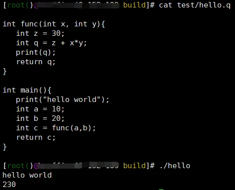

# 编译器原理和实现

## 用Rust实现Lua解释器

[前言 - 用Rust实现Lua解释器 (wubingzheng.github.io)](https://wubingzheng.github.io/build-lua-in-rust/zh/)

## 电子书《自己动手写编译器》

在线书籍：https://pandolia.net/tinyc/ 

开源地址：https://github.com/pandolia/tinyc 

本书（ https://pandolia.net/tinyc/ ）将介绍一个非常简单的编译器（ TinyC 编译器）的实现，用简单和易于实现的实例来描述基本的编译原理及过程。

所有源码都在 github （ https://github.com/pandolia/tinyc ）上，读者可以一步一步、从简单到复杂，实现一个完整的编译器。

## 洛书编程语言

[洛书编程语言: 一款超轻量、高性能、跨平台的嵌入式脚本语言，可以运行在Windows、Linux、MCU上。致力于打造一款开源、高效、强大的编程语言 (gitee.com)](https://gitee.com/chen-chaochen/lpk)

一个开源、跨平台、易拓展、多用途中文编程语言。

源码完全符和C++11标准，不依赖第三方运行时，不存在套壳python等现象。

可以动态地调用C/C++/Python等编写的接口函数，拓展更多功能。

可以用于嵌入式、物联网等开发场景，降低构建难度。

作者抖音帐号 22774526081，里面有一些demo的运行视频，比如 扫码控制的红外感应报警器

## Wa 编程语言

GitHub：[wa-lang/wa：Wa 编程语言：用于开发 WebAssembly 软件的简单、可维护、编译的语言 (github.com)](https://github.com/wa-lang/wa/)

Gitee：[凹语言: 🇨🇳 凹语言 - 国内首个实现纯浏览器内编译、执行全链路的自研静态类型的编译型通用编程语言。为 WebAssembly 而生的通用编程语言。 (gitee.com)](https://gitee.com/wa-lang/wa)

官网：[凹语言 | 为WebAssembly而生 (wa-lang.org)](https://wa-lang.org/)

- Playground: https://wa-lang.org/playground/
- NES 模拟器: https://wa-lang.org/nes/
- WebGPU Demo (PC/Chrome): https://wa-lang.org/webgpu/

## HVML/PurC

C 语言的主要 HVML 解释器：[HVML/PurC: The prime HVML interpreter for C Language. (github.com)](https://github.com/HVML/PurC)

## 基于rust实现三体编程语言

[rustq/3body-lang: 三体编程语言 Three Body Language written in Rust (github.com)](https://github.com/rustq/3body-lang)

## 基于C语言实现的自然编程语言

[nature-lang/nature：🍀自然编程语言，愿你能够体验到编程的乐趣。 (github.com)](https://github.com/nature-lang/nature)

## 基于JavaScript实现的编程语言

[getify/foi-lang：Foi：一种不同的函数式编程语言 (github.com)](https://github.com/getify/foi-lang)

# 从零实现一门编程语言

想必有过编程经历的人，第一行代码都是''hello world''，它几乎已经成了编程界不成规矩的规矩了。

## 第一个程序

为什么第一个程序总是“hello world”呢？

> 这个就要追溯到编程诞生的时期了，1972年，贝尔实验室著名研究员Brian Kernighan在撰写“B语言教程与指导”时初次使用（程序），这是目前已知最早的在计算机著作中将hello和world一起使用的记录。
>
> 在1978年，他在他和Dennis Ritchie合作撰写的C语言圣经“The C Programming Language”中，延用了“hello,world”句式，作为开篇第一个程序，从此用hello world向世界打招呼成为惯例。

## 自定义语言

随着近代编程语言的不断发展，编程语言的功能越来越强，种类也越来越多。我相信很多人会写不少语言的“hello world”，但你会用自己的编程语言写出专属的“hello world”吗？

去年闲暇之余，做了一个自定义语言的专栏，主要讲述了一门语言的诞生过程，手把手教你如何设计和编写一个具有个人特色的编译器，感兴趣的朋友可以一起来动手玩玩。文末会有源码的地址。

本专栏主要包括以下章节，由浅入深，采用循序渐进式的学习路径。通过本专栏，你可以定制一门编程语言，并加入属于个人风格的编程方式。或者你只是单纯想了解一下编程语言的实现过程，那么在此过程中，你会学习到很多日常编码中了解不到的知识。

比如什么是文法、词法、汇编指令、进程内存结构、函数栈的调用过程、指针的底层实现、内存的分配过程、结构体和线程到底是如何实现的等等。

本专栏会通过一个个小章节来讲述，轻松且风趣，愉悦不伤脑。

## 核心章节

- [一个hello world的诞生 | 从零实现一门语言](http://mp.weixin.qq.com/s?__biz=MzA4NzU0MzU2MA==&mid=2247483697&idx=1&sn=aabe2f0a0a83f4b4dfb3c09cf983ecb7&chksm=90369b56a741124061951917535be7350891d9e667758869e6c21c45a259eca46bc2fde781b1&scene=21#wechat_redirect)

- [词法解析器 | 从零实现一门语言](http://mp.weixin.qq.com/s?__biz=MzA4NzU0MzU2MA==&mid=2247483709&idx=1&sn=4533588d72466c6b31c578c22eddeebb&chksm=90369b5aa741124cb09698e4040f2ecaf7aed3fd02fa04b53bdb942667bd33181b56d37c82d0&scene=21#wechat_redirect)

- [从自然语言认识文法 | 从零实现一门语言](http://mp.weixin.qq.com/s?__biz=MzA4NzU0MzU2MA==&mid=2247483718&idx=1&sn=2850cb563e1f8490f1a351e05aa12182&chksm=90369b21a7411237a1cf4f63792d7fe8455d918b1c7bfef7c88c79c99be8d55f9f387173452e&scene=21#wechat_redirect)

- [构建文法（上）| 从零实现一门语言](http://mp.weixin.qq.com/s?__biz=MzA4NzU0MzU2MA==&mid=2247483723&idx=1&sn=860038097537ed1326f7c1dd1129a827&chksm=90369b2ca741123aa0304a8df5672d484afe4005a930d605f826765b260deb908183fb07d403&scene=21#wechat_redirect)

- [构建文法（下）| 从零实现一门语言](http://mp.weixin.qq.com/s?__biz=MzA4NzU0MzU2MA==&mid=2247483728&idx=1&sn=ca90bcb5f345f485eb48fb2bee6f1bc2&chksm=90369b37a7411221753298d0715b911770564820419dc437af77a8af3741cac8f5bc5e13368f&scene=21#wechat_redirect)

- [文法及语义代码实现 | 从零实现一门语言](http://mp.weixin.qq.com/s?__biz=MzA4NzU0MzU2MA==&mid=2247483733&idx=1&sn=c8ef568c63d117c947a4c8a6fa7e7a9c&chksm=90369b32a74112242b5ba2ccf14b47e12c60f7438b29b05ff44a99f80649c7d3fd98d23be6b0&scene=21#wechat_redirect)

- [函数的帧栈调用过程 | 从零实现一门语言](http://mp.weixin.qq.com/s?__biz=MzA4NzU0MzU2MA==&mid=2247483743&idx=1&sn=e9e557d1892adcf41190f0757c48a3fe&chksm=90369b38a741122e48a7a4b68541da758d7bb55161f0fd41821a2435d738a586b33757993c1c&scene=21#wechat_redirect)

- [生成中间代码 | 从零实现一门语言](http://mp.weixin.qq.com/s?__biz=MzA4NzU0MzU2MA==&mid=2247483749&idx=1&sn=5d37c77971f53c994f9c7b62e5e26e0c&chksm=90369b02a7411214e0b0b2ebd1d4d61366ebd8a7c9c85457d60d407c8ac74ef4bc434205a4ca&scene=21#wechat_redirect)

- [汇编（上） | 从零实现一门语言](http://mp.weixin.qq.com/s?__biz=MzA4NzU0MzU2MA==&mid=2247483755&idx=1&sn=afa0efd7af4ca9e4020e9a24695fbb6e&chksm=90369b0ca741121abb6406630067679e467a1b32f0f9bad7ec26b04909d4b3f32cdad0bc7432&scene=21#wechat_redirect)

- [汇编（下） | 从零实现一门语言](http://mp.weixin.qq.com/s?__biz=MzA4NzU0MzU2MA==&mid=2247483759&idx=1&sn=ea6aeafaef81aff610537b8c1b8aed8b&chksm=90369b08a741121e9871dd4ee420fa828113ac721b865b06a6db650e0b736688befed4a6159e&scene=21#wechat_redirect)

- [编译和链接 | 从零实现一门语言](http://mp.weixin.qq.com/s?__biz=MzA4NzU0MzU2MA==&mid=2247483795&idx=1&sn=12a7437a45b622d257a07b27916bdc91&chksm=90369bf4a74112e272802565e449a86ad49183d27de05e315cb8255d4eb50caef6add2928bfd&scene=21#wechat_redirect)

- [丰富数据类型—指针 | 从零实现一门语言](http://mp.weixin.qq.com/s?__biz=MzA4NzU0MzU2MA==&mid=2247483767&idx=1&sn=07d4341fd84caef54f358c79f927f6f7&chksm=90369b10a7411206f059c38d45ea7a568cf7f43ecc225f861f428321a519001ff94741c5dd64&scene=21#wechat_redirect)

- [内存动态分配 | 从零实现一门语言](http://mp.weixin.qq.com/s?__biz=MzA4NzU0MzU2MA==&mid=2247483777&idx=1&sn=444b9ba6d5096db8805c48d8bc607183&chksm=90369be6a74112f0184dfa189eb5462993da9d17103e961ea1478d397f061dadbc49930ab4b6&scene=21#wechat_redirect)

- [内存分配与释放实现 | 从零实现一门语言](http://mp.weixin.qq.com/s?__biz=MzA4NzU0MzU2MA==&mid=2247483784&idx=1&sn=de8e4d04aac34916fffd500399c49342&chksm=90369befa74112f90bb367b0397325b8eb33a9597eaa9ed785d1c1487242a5cdb3eb74d8af5e&scene=21#wechat_redirect)

- [丰富数据类型-结构体 | 从零实现一门语言](http://mp.weixin.qq.com/s?__biz=MzA4NzU0MzU2MA==&mid=2247483789&idx=1&sn=debe041cfffdddace1e20828a0ac1718&chksm=90369beaa74112fc561b2e504be1f4db5c2ddd8c42161e8c2a2854c947513fc799b4c38f1405&scene=21#wechat_redirect)

  

## 自更多拓展

后续会拓展更多的高级功能，比如：

> 1. 一个线程的实现
> 2. 文件读取
> 3. 编译优化算法
>
>  4.什么是锁
>
>  5.网络编程
>
>  6.面向对象
>
>  7.其他规划

如果你也感兴趣，不妨尝试一起来实现剩下的功能，下面是Git地址，欢迎**star**。

**Git：**https://gitee.com/emphse/quest.git
