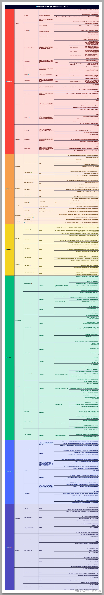

# KaliLinux工具脑图_安全专家的军械库

> ❝
>
> Kali Linux 不仅仅是一个操作系统，它更是一个汇聚了各种安全工具的宝库，为安全专家和爱好者提供了一站式解决方案。让我们一起探索 Kali Linux 工具集合的丰富内涵吧！
>
> ❞

### 安全测试

- 信息收集 ：利用 Nmap、Maltego 等工具，绘制网络拓扑，识别目标系统和服务，为后续攻击步骤奠定基础。
- 漏洞扫描 ：借助 Nessus、OpenVAS 等工具，自动化检测目标系统中的安全漏洞，评估其风险等级。
- 漏洞利用 ：Metasploit 框架提供丰富的漏洞利用模块，帮助安全专家模拟真实攻击场景，验证漏洞的影响。
- 密码攻击 ：John the Ripper、Hashcat 等工具可以破解各种类型的密码，帮助安全专家测试密码强度并进行安全审计。
- 无线网络攻击 ：Aircrack-ng 套件提供一系列工具，用于破解 Wi-Fi 密码，分析无线网络流量，评估无线网络安全性。

### 网络嗅探与取证

- Wireshark ：强大的网络协议分析器，捕获和分析网络流量，深入了解网络通信细节。
- tcpdump ：命令行网络抓包工具，灵活捕获特定网络流量，进行故障排除和安全分析。
- Volatility 휘발성 : 内存取证框架，分析内存转储，提取关键证据，例如恶意软件、密码和网络连接信息。

### Web 应用安全

- Burp Suite ：综合性 Web 应用安全测试平台，涵盖漏洞扫描、代理拦截、Intruder 攻击等功能，全面评估 Web 应用安全性。
- OWASP ZAP ：开源 Web 应用安全扫描器，检测常见的 Web 漏洞，例如 SQL 注入、跨站脚本等。
- sqlmap ：自动化 SQL 注入工具，探测和利用数据库漏洞，获取敏感数据。

### 社会工程学

- Social Engineering Toolkit (SET) ：用于社会工程学攻击的框架，提供多种攻击向量，例如钓鱼邮件、恶意网站等，模拟真实社会工程学场景。

### 密码学与加密

- Hashcat ：强大的密码破解工具，支持多种哈希算法和攻击模式，帮助安全专家测试密码强度。
- John the Ripper ：经典的密码破解工具，适用于破解 Linux/Unix 系统密码。
- GPG ：用于加密和数字签名的工具，保护数据安全和隐私。

### 逆向工程

- Ghidra ：功能强大的逆向工程工具，分析二进制文件，了解其内部工作原理。
- IDA Pro ：商业逆向工程软件，提供更高级的功能和插件，适用于专业逆向工程师。

无论您是安全专家还是爱好者，Kali Linux 都是您探索安全世界的最佳伙伴！

